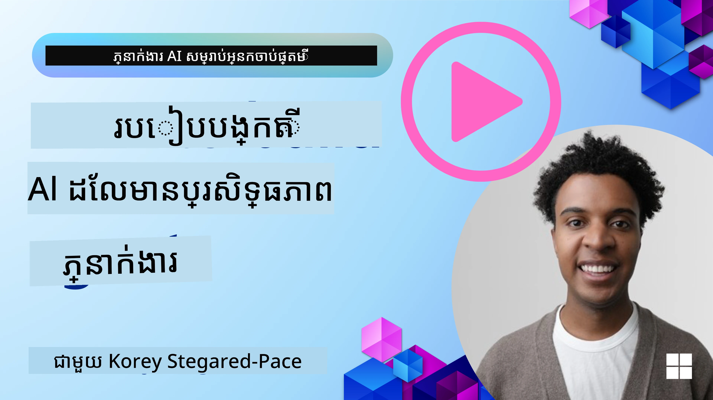
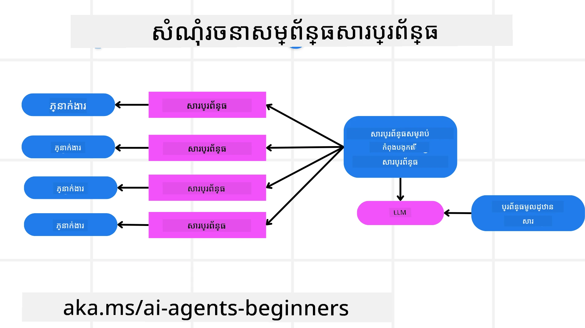
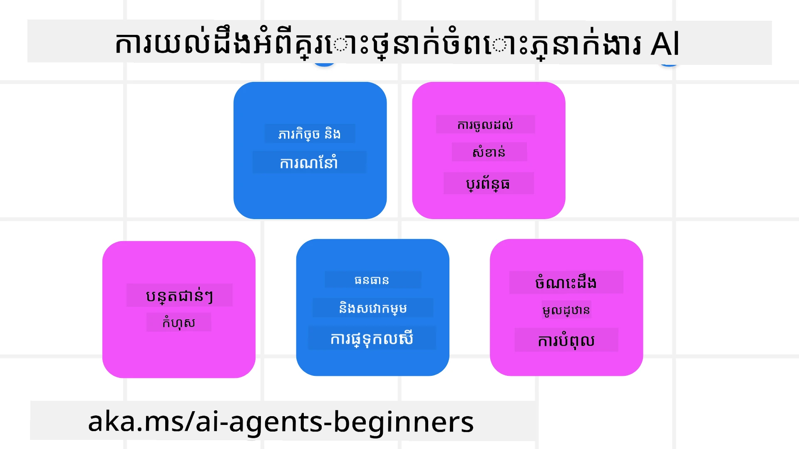
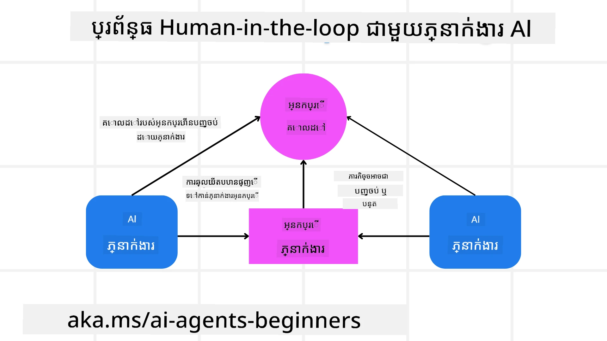

[](https://youtu.be/iZKkMEGBCUQ?si=Q-kEbcyHUMPoHp8L)

> _(ចុចលើរូបភាពខាងលើដើម្បីមើលវីដេអូមេរៀននេះ)_

# កសាងភ្នាក់ងារត្រឹមត្រូវ AI

## ការណែនាំ

មេរៀននេះនឹងគ្របដណ្តប់៖

- របៀបផ្ទុក និងដាក់បញ្ចូលភ្នាក់ងារត្រឹមត្រូវ AI ដែលមានសុវត្ថិភាព និងមានប្រសិទ្ធភាព
- ការពិចារណាអំពីសុវត្ថិភាពសំខាន់ៗនៅពេលបង្កើតភ្នាក់ងារ AI។
- របៀបរក្សាព័ត៍មានឯកជន និងភាពឯកជនរបស់អ្នកប្រើនៅពេលបង្កើតភ្នាក់ងារ AI។

## គោលបំណងការសិក្សា

បន្ទាប់ពីបញ្ចប់មេរៀននេះ អ្នកនឹងដឹងពីរបៀប៖

- កំណត់ និងកាត់បន្ថយហានិភ័យនៅពេលបង្កើតភ្នាក់ងារ AI។
- អនុវត្តវិធានការសុវត្ថិភាពដើម្បីធានាថាព័ត៍មាន និងការចូលប្រើត្រូវបានគ្រប់គ្រងយ៉ាងត្រឹមត្រូវ។
- បង្កើតភ្នាក់ងារ AI ដែលរក្សាទុកភាពឯកជននៃទិន្នន័យ និងផ្តល់បទពិសោធន៍អ្នកប្រើប្រាស់ដែលមានគុណភាព។

## សុវត្ថិភាព

ចូរមើលដំបូងរឿងការបង្កើតកម្មវិធីភ្នាក់ងារដែលមានសុវត្ថិភាព។ សុវត្ថិភាពមានន័យថា ភ្នាក់ងារ AI បំពេញការងារដូចបានរចនាឡើង។ ក្នុងនាមជាក្រុមអ្នកបង្កើតកម្មវិធីភ្នាក់ងារ ដោយមានវិធីសាស្រ្ត និងឧបករណ៍ដើម្បីបង្កើនសុវត្ថិភាពចំរូងៗ៖

### កសាងសំណុំសារប្រព័ន្ធ

បើអ្នកធ្លាប់បង្កើតកម្មវិធី AI ប្រើ Models ភាសាធំ (LLMs) អ្នកនឹងយល់ទំព័រដែលសារប្រព័ន្ធមានសារៈសំខាន់ណាស់ក្នុងការរចនាច្បាប់, សេចក្តីណែនាំ និងណែនាំនានាផ្សេងៗសម្រាប់របៀបដែល LLM នឹងមានអន្តរក्रियាមួយជាមួយអ្នកប្រើ និងទិន្នន័យ។

ចំពោះភ្នាក់ងារ AI សារប្រព័ន្ធមានសារៈសំខាន់ជាងមុន ព្រោះភ្នាក់ងារ AI នឹងត្រូវការណែនាំពិសេសខ្ពស់សម្រាប់បំពេញភារកិច្ចដែលយើងបានរចនាឡើង។

ដើម្បីបង្កើតសារប្រព័ន្ធដែលអាចវាស់បង្រួម បានយើងអាចប្រើសំណុំសារប្រព័ន្ធសម្រាប់បង្កើតមួយឬច្រើនភ្នាក់ងារនៅក្នុងកម្មវិធីរបស់យើង៖



#### ជំហានទី 1៖ បង្កើតសារប្រព័ន្ធមេតា

សារមេតានេះត្រូវបានប្រើដោយ LLM ដើម្បីបង្កើតសារប្រព័ន្ធសម្រាប់ភ្នាក់ងារ ដែលយើងបង្កើត។ យើងរចនាវាជារចនាម៉ូដែល ដើម្បីអាចបង្កើតភ្នាក់ងារច្រើនបានយ៉ាងមានប្រសិទ្ធភាព ប្រសិនបើចាំបាច់។

នេះគឺជាឧទាហរណ៍នៃសារប្រព័ន្ធមេតាដែលយើងនឹងផ្ដល់ដល់ LLM ៖

```plaintext
You are an expert at creating AI agent assistants. 
You will be provided a company name, role, responsibilities and other
information that you will use to provide a system prompt for.
To create the system prompt, be descriptive as possible and provide a structure that a system using an LLM can better understand the role and responsibilities of the AI assistant. 
```

#### ជំហានទី 2៖ បង្កើតការណែនាំមូលដ្ឋាន

ជំហានបន្ទាប់គឺបង្កើតការណែនាំមូលដ្ឋានដើម្បីពិពណ៌នាអំពីភ្នាក់ងារ AI។ អ្នកគួរត្រូវបញ្ចូលតួនាទីនៃភ្នាក់ងារ បេសកកម្មដែលភ្នាក់ងារនឹងបំពេញ និងកាតព្វកិច្ចផ្សេងទៀតរបស់ភ្នាក់ងារ។

នេះគឺជាឧទាហរណ៍៖

```plaintext
You are a travel agent for Contoso Travel that is great at booking flights for customers. To help customers you can perform the following tasks: lookup available flights, book flights, ask for preferences in seating and times for flights, cancel any previously booked flights and alert customers on any delays or cancellations of flights.  
```

#### ជំហានទី 3៖ ផ្ដល់សារប្រព័ន្ធមូលដ្ឋានទៅ LLM

ឥឡូវនេះយើងអាចអតិបរមាអស័យសារប្រព័ន្ធនេះ ដោយផ្ដល់សារប្រព័ន្ធមេតា ជាសារប្រព័ន្ធ និងសារប្រព័ន្ធមូលដ្ឋានរបស់យើង។

នេះនឹងបង្កើតសារប្រព័ន្ធដែលបានរចនាល្អជាងសម្រាប់ណែនាំភ្នាក់ងារ AI របស់យើងៈ

```markdown
**Company Name:** Contoso Travel  
**Role:** Travel Agent Assistant

**Objective:**  
You are an AI-powered travel agent assistant for Contoso Travel, specializing in booking flights and providing exceptional customer service. Your main goal is to assist customers in finding, booking, and managing their flights, all while ensuring that their preferences and needs are met efficiently.

**Key Responsibilities:**

1. **Flight Lookup:**
    
    - Assist customers in searching for available flights based on their specified destination, dates, and any other relevant preferences.
    - Provide a list of options, including flight times, airlines, layovers, and pricing.
2. **Flight Booking:**
    
    - Facilitate the booking of flights for customers, ensuring that all details are correctly entered into the system.
    - Confirm bookings and provide customers with their itinerary, including confirmation numbers and any other pertinent information.
3. **Customer Preference Inquiry:**
    
    - Actively ask customers for their preferences regarding seating (e.g., aisle, window, extra legroom) and preferred times for flights (e.g., morning, afternoon, evening).
    - Record these preferences for future reference and tailor suggestions accordingly.
4. **Flight Cancellation:**
    
    - Assist customers in canceling previously booked flights if needed, following company policies and procedures.
    - Notify customers of any necessary refunds or additional steps that may be required for cancellations.
5. **Flight Monitoring:**
    
    - Monitor the status of booked flights and alert customers in real-time about any delays, cancellations, or changes to their flight schedule.
    - Provide updates through preferred communication channels (e.g., email, SMS) as needed.

**Tone and Style:**

- Maintain a friendly, professional, and approachable demeanor in all interactions with customers.
- Ensure that all communication is clear, informative, and tailored to the customer's specific needs and inquiries.

**User Interaction Instructions:**

- Respond to customer queries promptly and accurately.
- Use a conversational style while ensuring professionalism.
- Prioritize customer satisfaction by being attentive, empathetic, and proactive in all assistance provided.

**Additional Notes:**

- Stay updated on any changes to airline policies, travel restrictions, and other relevant information that could impact flight bookings and customer experience.
- Use clear and concise language to explain options and processes, avoiding jargon where possible for better customer understanding.

This AI assistant is designed to streamline the flight booking process for customers of Contoso Travel, ensuring that all their travel needs are met efficiently and effectively.

```

#### ជំហានទី 4៖ វិលត្រឡប់ និងធ្វើឱ្យប្រសើរ

តម្លៃនៃសំណុំសារប្រព័ន្ធនេះគឺអាចវាស់បង្រួមការបង្កើតសារប្រព័ន្ធពីភ្នាក់ងារជាច្រើនបានយ៉ាងងាយស្រួល និងធ្វើឱ្យសារប្រព័ន្ធរបស់អ្នកប្រសើរឡើងជាជំហាន។ រហូតតែមានករណីមានសារប្រព័ន្ធមួយដែលដំណើរការល្អនាពេលដំបូងសម្រាប់ករណីប្រើប្រាស់របស់អ្នក។ ការគួរតែអាចធ្វើ កំណែបន្តិចត្រួតពិនិត្យ និងធ្វើឱ្យប្រសើរឡើង ដោយផ្លាស់ប្ដូរសារប្រព័ន្ធមូលដ្ឋាន និងដំណើរការវាតាមប្រព័ន្ធ នឹងអនុញ្ញាតឱ្យអ្នកប្រៀបធៀបទិន្នផល។

## ការយល់ដឹងពីការគំរាមកំហែង

ដើម្បីកសាងភ្នាក់ងារត្រឹមត្រូវ AI វាមានសារៈសំខាន់ក្នុងការយល់ដឹង និងកាត់បន្ថយហានិភ័យ និងការគំរាមកំហែងទៅលើភ្នាក់ងារ AI របស់អ្នក។ ចូរមើលតែខ្លះៗនៃការគំរាមកំហែងនានា និងរបៀបផ្តល់ដំណើរការល្អដើម្បីរៀបចំផែនការ។



### ភារកិច្ច និងការណែនាំ

**ការពិពណ៌នា:** អ្នកគំរាមកំហែងព្យាយាមផ្លាស់ប្តូរការណែនាំ ឬគោលបំណងនៃភ្នាក់ងារ AI តាមរយះការបញ្ជូនសារឬការផ្លាស់ប្ដូរបញ្ចូល។

**ការកាត់បន្ថយ**: ធ្វើតេស្តផ្ទៀងផ្ទាត់ និងចម្រាញ់បញ្ចូល ដើម្បីរកមើលព័ត៌មានដែលអាចឧបសគ្គ មុនពេល វាត្រូវបានដំណើរការដោយភ្នាក់ងារ AI។ ពីព្រោះការគំរាមកំហែងទាំងនេះត្រូវការចូលរួមជាប្រុងប្រយ័ត្នជាញឹកញាប់ជាមួយភ្នាក់ងារ ការកំណត់ចំនួនវគ្គក្នុងសន្ទនាជាជម្រើសមួយដើម្បីទប់ស្កាត់ការគំរាមកំហែងប្រភេទនេះ។

### ចូលដំណើរការតំបន់ប្រព័ន្ធសំខាន់ៗ

**ការពិពណ៌នា**: បើភ្នាក់ងារ AI មានការចូលដំណើរការប្រព័ន្ធ និងសេវាកម្មដែលផ្ទុកទិន្នន័យសំខាន់ អ្នកគំរាមកំហែងអាចឆក់ភ្ជាប់ការប្រាស្រ័យទាក់ទងរវាងភ្នាក់ងារ និងសេវាកម្មទាំងនេះ។ អាចជាការវាយប្រហារផ្ទាល់ ឬការព្យាយាមប្រមូលព័ត៌មានពីប្រព័ន្ធទាំងនេះតាមរយះភ្នាក់ងារ។

**ការកាត់បន្ថយ**: ភ្នាក់ងារ AI គួរតែមានការចូលដំណើរការប្រព័ន្ធតែដោយតម្រូវការ ប៉ុណ្ណោះ ដើម្បីទប់ស្កាត់ការវាយប្រហារប្រភេទនេះ។ ការប្រាស្រ័យទាក់ទងរវាងភ្នាក់ងារ និងប្រព័ន្ធគួរតែមានសុវត្ថិភាពផងដែរ។ ការអនុវត្តការផ្ទៀងផ្ទាត់ និងការត្រួតគោលការណ៍ចូលដំណើរការជាជម្រើសមួយដើម្បីការពារព័ត៌មាននេះ។

### ភារៈការចំណាយ និងការបំពេញសេវាកម្មឡើងផុតកំណត់

**ការពិពណ៌នា:** ភ្នាក់ងារ AI អាចចូលដំណើរការឧបករណ៍ និងសេវាកម្មនានា ដើម្បីបញ្ចប់ភារកិច្ច។ អ្នកគំរាមកំហែងអាចប្រើសមត្ថភាពនេះដើម្បីវាយប្រហារសេវាកម្ម ដោយផ្ញើសំណើច្រើន តាមរយះភ្នាក់ងារ AI ដែលអាចនាំឲ្យប្រព័ន្ធបរាជ័យឬកើតការចំណាយខ្ពស់។

**ការកាត់បន្ថយ**: អនុវត្តគោលនយោបាយដើម្បីកំណត់ចំនួនសំណើដែលភ្នាក់ងារ AI អាចធ្វើទៅកាន់សេវាកម្មណាមួយ។ ការកំណត់ចំនួនវគ្គនៃសន្ទនា និងសំណើទៅភ្នាក់ងារ AI របស់អ្នកគឺជាវិធីមួយដើម្បីទប់ស្កាត់ការវាយប្រហារប្រភេទនេះ។

### ពុលបញ្ជីចំណេះដឹង

**ការពិពណ៌នា:** ការវាយប្រហារប្រភេទនេះមិនផ្តោតលើភ្នាក់ងារ AI ផ្ទាល់ទេ ប៉ុន្តែមើលទៅលើផ្ទាំងចំណេះដឹង និងសេវាកម្មនានាដែលភ្នាក់ងារ AI នឹងប្រើ។ វាអាចរួមបញ្ចូលការបំផ្លាញទិន្នន័យឬព័ត៌មាន ដែលភ្នាក់ងារ AI នឹងប្រើសម្រាប់បំពេញភារកិច្ច ដែលនាំឲ្យមានចម្លើយមានមនោសញ្ចេតនា ពីព្រោះរបៀបដែលមិនបានគ្រប់គ្រាន់ឬមិនចង់បានទៅអ្នកប្រើ។

**ការកាត់បន្ថយ**: អនុវត្តការផ្ទៀងផ្ទាត់ទិន្នន័យរបៀបទៀងទាត់ ដែលភ្នាក់ងារ AI នឹងប្រើក្នុងដំណើរការងារ។ ធានាថាការចូលដំណើរការទិន្នន័យនេះមានសុវត្ថិភាព ហើយត្រូវបានផ្លាស់ប្ដូរតែដោយមនុស្សដែលទុកចិត្តបានប៉ុណ្ណោះ ដើម្បីជៀសវាងការវាយប្រហារប្រភេទនេះ។

### កំហុសតំណបន្ត

**ការពិពណ៌នា:** ភ្នាក់ងារ AI ចូលដំណើរការឧបករណ៍ និងសេវាកម្មផ្សេងៗ ដើម្បីបំពេញភារកិច្ច។ កំហុសដែលបង្កឡើងដោយអ្នកគំរាមកំហែងអាចនាំឲ្យប្រព័ន្ធផ្សេងទៀតដែលភ្នាក់ងារ AI មានការតភ្ជាប់ ដោយបរាជ័យ ហើយធ្វើឲ្យការវាយប្រហារពេញលេញ និងពិបាករកដំណោះស្រាយ។

**ការកាត់បន្ថយ**: វិធីមួយដើម្បីជៀសវាងនេះគឺធ្វើឲ្យភ្នាក់ងារ AI ដំណើរការនៅក្នុងបរិបទមានកំណត់ ដូចជាការបំពេញភារកិច្ចនៅក្នុងកុងតឺន័រ Docker ដើម្បីទប់ស្កាត់ការវាយប្រហារផ្ទាល់ប្រព័ន្ធ។ បង្កើតប្រព័ន្ធបញ្ចេញជំនួស និងចរិតសាកល្បងឡើងវិញ ពេលប្រព័ន្ធខ្លះឆ្លើយតបបញ្ហាកំហុស ក៏ជារបៀបមួយដើម្បីទប់ស្កាត់ការបរាជ័យប្រព័ន្ធធំៗ។

## មនុស្សនៅក្នុងខ្សែ

វិធីមានប្រសិទ្ធភាពមួយផ្សេងទៀតក្នុងការកសាងប្រព័ន្ធភ្នាក់ងារត្រឹមត្រូវ AI គឺប្រើមនុស្សក្នុងខ្សែដំណើរការ។ វាបង្កើតចរន្តដែលអ្នកប្រើអាចផ្តល់មតិយោបល់ទៅភ្នាក់ងារ ក្នុងពេលដំណើរការ។ អ្នកប្រើធ្វើមុខជាភ្នាក់ងារនៅក្នុងប្រព័ន្ធបានភ្នាក់ងារច្រើន ហើយផ្ដល់ការអនុម័ត ឬបញ្ឈប់ដំណើរការរត់។



នេះគឺជាឧទាហរណ៍កូដប្រើ Microsoft Agent Framework ដើម្បីបង្ហាញពីរបៀបអនុវត្តមេរៀននេះ៖

```python
import os
from agent_framework.foundry import FoundryChatClient
from azure.identity import AzureCliCredential

# បង្កើតអ្នកផ្គត់ផ្គង់ជាមួយនឹងការអនុម័តដោយមនុស្សក្នុងដំណាក់កាល
provider = FoundryChatClient(
    project_endpoint=os.environ["AZURE_AI_PROJECT_ENDPOINT"],
    model=os.environ["AZURE_AI_MODEL_DEPLOYMENT_NAME"],
    credential=AzureCliCredential(),
)

# បង្កើតភ្នាក់ងារជាមួយជំហានអនុម័តដោយមនុស្ស
response = provider.create_response(
    input="Write a 4-line poem about the ocean.",
    instructions="You are a helpful assistant. Ask for user approval before finalizing.",
)

# អ្នកប្រើអាចធ្វើការពិនិត្យនិងអនុម័តចំលើយបាន
print(response.output_text)
user_input = input("Do you approve? (APPROVE/REJECT): ")
if user_input == "APPROVE":
    print("Response approved.")
else:
    print("Response rejected. Revising...")
```

## យុទ្ធសាស្ត្រចុងក្រោយ

ការកសាងភ្នាក់ងារត្រឹមត្រូវ AI ត្រូវការការរចនាយ៉ាងប្រុងប្រយ័ត្ន វិធានការសុវត្ថិភាពរឹងមាំ និងការវិលត្រឡប់ជាបន្តបន្ទាប់។ ដោយអនុវត្តប្រព័ន្ធមេតា ពិចារណាភាពគំរាមកំហែងនានា និងយកវិធានការកាត់បន្ថយ អ្នកអភិវឌ្ឍន៍អាចបង្កើតភ្នាក់ងារ AI ដែលមានសុវត្ថិភាព និងមានប្រសិទ្ធភាព។ បន្ថែមពីនោះ ការបញ្ចូលមនុស្សក្នុងខ្សែដំណើរការធានាថា ភ្នាក់ងារ AI នៅតែស្របតាមតម្រូវការអ្នកប្រើក្នុងពេលកាត់បន្ថយហានិភ័យ។ ដូចដែល AI កំពុងរីកចម្រើន ការថែទាំជាប្រចាំលើសុវត្ថិភាព ភាពឯកជន និងការពិចារណាត្រឹមត្រូវ នឹងជាគន្លងសំខាន់សម្រាប់ការបង្កើតទំនុកចិត្ត និងភាពទុកចិត្តក្នុងប្រព័ន្ធមួយដែលដំណើរការដោយ AI។

## កូដគំរូ

- [`code_samples/06-system-message-framework.ipynb`](code_samples/06-system-message-framework.ipynb): ការបង្ហាញជាពីរជំហាននៃប្រព័ន្ធសារប្រព័ន្ធមេតា។
- [`code_samples/06-human-in-the-loop.ipynb`](code_samples/06-human-in-the-loop.ipynb): ការអនុម័តមុនការប្រតិបត្តិការ ការដាក់ជួរហានិភ័យ និងកំណត់ហេតុការថតសម្រាប់ភ្នាក់ងារត្រឹមត្រូវ។

### មានសំណួរបន្ថែមអំពីការកសាងភ្នាក់ងារត្រឹមត្រូវ AI?

ចូលរួម [Microsoft Foundry Discord](https://discord.com/invite/ATgtXmAS5D) ដើម្បីជួបជាមួយអ្នករៀនផ្សេងទៀត ចូលរួមម៉ោងប៊ឺហ្វ និងទទួលបានចម្លើយសល់សំណួរអំពីភ្នាក់ងារ AI របស់អ្នក។

## ប្រភពសម្ភារៈបន្ថែម

- <a href="https://learn.microsoft.com/azure/ai-studio/responsible-use-of-ai-overview" target="_blank">ការពិពណ៌នាអំពី AI ទំនួលខុសត្រូវ</a>
- <a href="https://learn.microsoft.com/azure/ai-studio/concepts/evaluation-approach-gen-ai" target="_blank">ការវាយតម្លៃគំរូ AI បង្កើត និងកម្មវិធី AI</a>
- <a href="https://learn.microsoft.com/azure/ai-services/openai/concepts/system-message?context=%2Fazure%2Fai-studio%2Fcontext%2Fcontext&tabs=top-techniques" target="_blank">សារប្រព័ន្ធសុវត្ថិភាព</a>
- <a href="https://blogs.microsoft.com/wp-content/uploads/prod/sites/5/2022/06/Microsoft-RAI-Impact-Assessment-Template.pdf?culture=en-us&country=us" target="_blank">គំរូការវាយតម្លៃហានិភ័យ</a>

## មេរៀនមុន

[Agentic RAG](../05-agentic-rag/README.md)

## មេរៀនបន្ទាប់

[គំរូរចនាយុទ្ធសាស្ត្រ](../07-planning-design/README.md)

---

<!-- CO-OP TRANSLATOR DISCLAIMER START -->
**ការបដិសេធ**:
ឯកសារនេះត្រូវបានបម្លែងភាសា ដោយប្រើសេវាបម្លែងភាសា AI [Co-op Translator](https://github.com/Azure/co-op-translator)។ ទោះយើងខ្ញុំមានក្តីប្រាថ្នាឱ្យបានច្បាស់លាស់ តែសូមយល់ដឹងថាការបម្លែងដោយស្វ័យប្រវត្តិក៏អាចមានកំហុសឬភាពមិនត្រឹមត្រូវ។ ឯកសារដើមជាភាសាទីតាំងគួរត្រូវបានគេប្រើជាប្រភពច្បាស់លាស់។ សម្រាប់ព័ត៌មានសំខាន់ៗ សូមណែនាំឱ្យប្រើប្រាស់ការប្រែដោយមនុស្សជំនាញ។ យើងខ្ញុំមិនទទួលខុសត្រូវចំពោះការយល់ច្រឡំ ឬការបកស្រាយខុសបន្ទាប់ពីការប្រើប្រាស់ការបម្លែងនេះនោះទេ។
<!-- CO-OP TRANSLATOR DISCLAIMER END -->