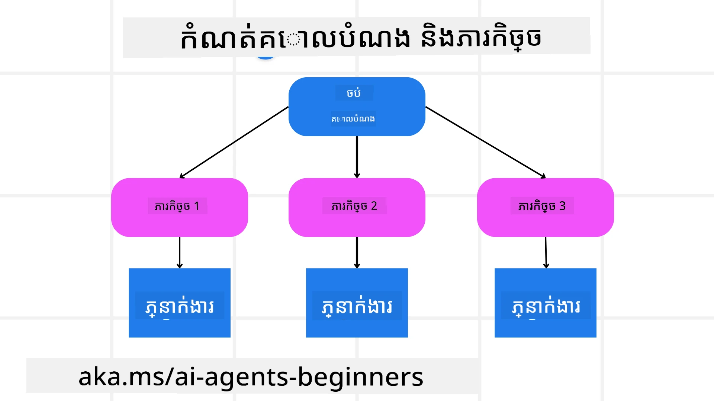

[](https://youtu.be/kPfJ2BrBCMY?si=9pYpPXp0sSbK91Dr)

> _(ចុចលើរូបភាពខាងលើដើម្បីមើលវីដេអូសម្រាប់មេរៀននេះ)_

# ការគ្រប់គ្រងការរចនា

## ការណែនាំ

មេរៀននេះនឹងផ្តោតលើ

* ការកំណត់គោលដៅទូទៅយ៉ាងច្បាស់ និងការបំបែកបញ្ហាស្មុគស្មាញទៅជាការងារដែលអាចគ្រប់គ្រងបាន។
* ការប្រើប្រាស់លទ្ធផលដែលមានរចនាសម្ព័ន្ធសម្រាប់ការឆ្លើយតបជឿជាក់ និងអាចអានដោយម៉ាស៊ីនបាន។
* ការអនុវត្តវិធីសាស្រ្តដឹកនាំដោយព្រឹត្តិការណ៍សម្រាប់ដោះស្រាយការងារដាក់ទំនង និងបញ្ហាដែលមិនបានរំពឹងទុក។

## គោលដៅការសិក្សា

បន្ទាប់ពីបញ្ចប់មេរៀននេះ អ្នកនឹងមានការយល់ដឹងអំពី៖

* កំណត់និងកំណត់គោលដៅសរុបសម្រាប់ភ្នាក់ងារ AI ឲ្យដឹងយ៉ាងច្បាស់ពីអ្វីដែលត្រូវការរួចរាល់។
* បំបែកការងារស្មុគស្មាញទៅជាកិច្ចការជាបន្ទុកតិចតួច និងរៀបចំវាទៅក្នុងលំដាប់មានតុល្យភាព។
* រៀបចំភ្នាក់ងារជាមួយឧបករណ៍ដែលត្រឹមត្រូវ (ឧ. ឧបករណ៍ស្វែងរក ឧបករណ៍វិភាគទិន្នន័យ) សម្រេចចិត្តកាលបរិច្ឆេទ និងវិធីសាស្រ្តប្រើប្រាស់ ហើយដោះស្រាយបញ្ហាដែលមិនបានរំពឹងទុក។
* វាយតម្លៃលទ្ធផលនៃកិច្ចការជាបន្ទុក តម្អិតសមត្ថភាព និងធ្វើបច្ចុប្បន្នភាពលើសកម្មភាពដើម្បីបង្កើនលទ្ធផលចុងក្រោយ។

## ការកំណត់គោលដៅទូទៅ និងការបំបែកការងារ



កិច្ចការពិតប្រាកដភាគច្រើនស្មុគស្មាញពេកមិនអាចដោះស្រាយក្នុងជំហានតែមួយបាន។ ភ្នាក់ងារ AI ត្រូវការគោលបំណងតូចៗដើម្បីណែនាំការគ្រប់គ្រងនិងសកម្មភាពរបស់វា។ ឧទាហរណ៍ សូមពិចារណាគោលបំណង៖

    "បង្កើតកម្មវិធីធ្វើដំណើរពីរថ្ងៃទេីប។"

ទោះបីវាពិបាកសាមញ្ញក្នុងការបញ្ជាក់ក៏ដោយ វាត្រូវការការកែសម្រួលផ្សេងទៀត។ គោលបំណងដែលច្បាស់លាស់នឹងអាចធ្វើឲ្យភ្នាក់ងារ ( និងអ្នករួមការងារផ្សេងទៀត) អាចផ្ដោតលើការសម្រេចបានលទ្ធផលត្រឹមត្រូវ ឧ. ការបង្កើតកម្មវិធីដែលមានជម្រើសជល់បង្ហោះ ផ្ទះសំណាក់ និងសកម្មភាពណែនាំ។

### ការបំបែកកិច្ចការ

កិច្ចការធំ ឬស្មុគស្មាញត្រូវបានបំបែកទៅជាកិច្ចការជាច្រើនតូចៗដែលមានគោលបំណងច្បាស់លាស់។
សម្រាប់ឧទាហរណ៍កម្មវិធីធ្វើដំណើរ អ្នកអាចបំបែកគោលបំណងទៅជា៖

* ការកក់សំបុត្រយន្តហោះ
* ការកក់ផ្ទះសំណាក់
* ការជួលយានយន្ត
* ការផ្ទាល់ខ្លួន

កិច្ចការជាបន្ទុកនីមួយៗអាចត្រូវបានទទួលជារួមដោយភ្នាក់ងារផ្សេងៗឬដំណើរការផ្សេងៗ។ ភ្នាក់ងារមួយអាចមានជំនាញក្នុងការស្វែងរកសំបុត្រយន្តហោះល្អបំផុត ផ្នែកមួយផ្សេងទៀតផ្តោតលើការកក់ផ្ទះសំណាក់ បន្ថែមទៀតគឺភ្នាក់ងារមួយដែលត្រួតពិនិត្យអាចបញ្ចូលលទ្ធផលទាំងនេះចូលក្នុងកម្មវិធីធ្វើដំណើរមួយសម្រាប់អ្នកប្រើ។

វិធីសាស្រ្តមួយនេះក៏អាចអនុញ្ញាតឲ្យមានការកែលម្អជាដំណាក់កាលផងដែរ។ ឧទាហរណ៍ អ្នកអាចបន្ថែមភ្នាក់ងារជំនាញសម្រាប់ការផ្តល់អនុសាសន៍អាហារ ឬសកម្មភាពក្នុងតំបន់ និងកែលម្អកម្មវិធីធ្វើដំណើរគ្នាតាមពេលវេលា។

### លទ្ធផលមានរចនាសម្ព័ន្ធ

ម៉ូដែលភាសាធំៗ (LLMs) អាចបង្កើតលទ្ធផលដែលមានរចនាសម្ព័ន្ធ (ឧ. JSON) ដែលងាយស្រួលសម្រាប់ភ្នាក់ងារឬសេវាកម្មក្រោយធ្វើការ​ពិចារណា និងដំណើរការ។ វាមានប្រយោជន៍ពិសេសនៅក្នុងបរិបទម៉ាស៊ីនភ្នាក់ងារច្រើន ដែលក្រុមអាចអនុវត្តកិច្ចការទាំងនេះបន្ទាប់ពីទទួលបានលទ្ធផលផែនការ។

កូដ Python ខ្លីខាងក្រោមបង្ហាញពីភ្នាក់ងារយុទ្ធសាស្រ្តសាមញ្ញដែលបំបែកគោលដៅទៅជាកិច្ចការជាបន្ទុក តូចៗ និងបង្កើតផែនការដែលមានរចនាសម្ព័ន្ធ៖

```python
from pydantic import BaseModel
from enum import Enum
from typing import List, Optional, Union
import json
import os
from typing import Optional
from pprint import pprint
from agent_framework.foundry import FoundryChatClient
from azure.identity import AzureCliCredential

class AgentEnum(str, Enum):
    FlightBooking = "flight_booking"
    HotelBooking = "hotel_booking"
    CarRental = "car_rental"
    ActivitiesBooking = "activities_booking"
    DestinationInfo = "destination_info"
    DefaultAgent = "default_agent"
    GroupChatManager = "group_chat_manager"

# ម៉ូដែលឧបករណ៍ដំណើរកំសាន្ត
class TravelSubTask(BaseModel):
    task_details: str
    assigned_agent: AgentEnum  # យើងចង់ចែកចាយភារកិច្ចទៅឲ្យភ្នាក់ងារ

class TravelPlan(BaseModel):
    main_task: str
    subtasks: List[TravelSubTask]
    is_greeting: bool

provider = FoundryChatClient(
    project_endpoint=os.environ["AZURE_AI_PROJECT_ENDPOINT"],
    model=os.environ["AZURE_AI_MODEL_DEPLOYMENT_NAME"],
    credential=AzureCliCredential(),
)

# កំណត់សារ​អ្នក​ប្រើប្រាស់
system_prompt = """You are a planner agent.
    Your job is to decide which agents to run based on the user's request.
    Provide your response in JSON format with the following structure:
{'main_task': 'Plan a family trip from Singapore to Melbourne.',
 'subtasks': [{'assigned_agent': 'flight_booking',
               'task_details': 'Book round-trip flights from Singapore to '
                               'Melbourne.'}
    Below are the available agents specialised in different tasks:
    - FlightBooking: For booking flights and providing flight information
    - HotelBooking: For booking hotels and providing hotel information
    - CarRental: For booking cars and providing car rental information
    - ActivitiesBooking: For booking activities and providing activity information
    - DestinationInfo: For providing information about destinations
    - DefaultAgent: For handling general requests"""

user_message = "Create a travel plan for a family of 2 kids from Singapore to Melbourne"

response = client.create_response(input=user_message, instructions=system_prompt)

response_content = response.output_text
pprint(json.loads(response_content))
```

### ភ្នាក់ងារគ្រប់គ្រងផែនការជាមួយការដឹកនាំមហាសភាជាពហុភ្នាក់ងារ

ក្នុងឧទាហរណ៍នេះ ភ្នាក់ងារកម្មវិធី Semantic Router ទទួលសំណើពីអ្នកប្រើ (ឧ. "ខ្ញុំត្រូវការផែនការផ្ទះសំណាក់សម្រាប់ការធ្វើដំណើររបស់ខ្ញុំ។")

ភ្នាក់ងារគ្រប់គ្រងផែនការនឹង

* ទទួលផែនការផ្ទះសំណាក់៖ ភ្នាក់ងារគ្រប់គ្រងផែនការទទួលជំនួយសារពីអ្នកប្រើ និងដោយផ្អែកលើសម្រង់ប្រព័ន្ធ (រួមបញ្ចូលព័ត៌មានភ្នាក់ងារដែលមាន) បង្កើតផែនការធ្វើដំណើរដែលមានរចនាសម្ព័ន្ធ។
* រាយបញ្ជីភ្នាក់ងារនិងឧបករណ៍របស់ពួកគេ៖ បញ្ជីភ្នាក់ងាររក្សាតំណក់ភ្នាក់ងារនានា (ដូចជា សំបុត្រយន្តហោះ ផ្ទះសំណាក់ ជួលយានយន្ត និងសកម្មភាព) ជាមួយនឹងមុខងារ ឬឧបករណ៍ពាក់ព័ន្ធ។
* ផ្គូផ្គងផែនការទៅភ្នាក់ងារដែលទាក់ទង៖ អាស្រ័យលើចំនួនបទបន្ទុកតូចៗ ភ្នាក់ងារគ្រប់គ្រងផែនការអាចផ្ញើសារនោះទៅភ្នាក់ងារតែមួយ (សម្រាប់ករណីមុខងារតែមួយ) ឬប្រើអ្នកគ្រប់គ្រងជជែកក្រុមសម្រាប់ការសហការភ្នាក់ងារច្រើន។
* សង្ខេបលទ្ធផល៖ ចុងក្រោយ ភ្នាក់ងារគ្រប់គ្រងផែនការសង្ខេបផែនការដែលបានបង្កើតសម្រាប់ភាពច្បាស់លាស់។
កូដ Python ខាងក្រោមបង្ហាញជំហានទាំងនេះ៖

```python

from pydantic import BaseModel

from enum import Enum
from typing import List, Optional, Union

class AgentEnum(str, Enum):
    FlightBooking = "flight_booking"
    HotelBooking = "hotel_booking"
    CarRental = "car_rental"
    ActivitiesBooking = "activities_booking"
    DestinationInfo = "destination_info"
    DefaultAgent = "default_agent"
    GroupChatManager = "group_chat_manager"

# ម៉ូឌែលការងារជំនួយការធ្វើដំណើរ

class TravelSubTask(BaseModel):
    task_details: str
    assigned_agent: AgentEnum # យើងចង់ផ្ដល់ការងារទៅភ្នាក់ងារ

class TravelPlan(BaseModel):
    main_task: str
    subtasks: List[TravelSubTask]
    is_greeting: bool
import json
import os
from typing import Optional

from agent_framework.foundry import FoundryChatClient
from azure.identity import AzureCliCredential

# បង្កើតគ្លាយអតិថិជន

provider = FoundryChatClient(
    project_endpoint=os.environ["AZURE_AI_PROJECT_ENDPOINT"],
    model=os.environ["AZURE_AI_MODEL_DEPLOYMENT_NAME"],
    credential=AzureCliCredential(),
)

from pprint import pprint

# កំណត់សារ​អ្នកប្រើប្រាស់

system_prompt = """You are a planner agent.
    Your job is to decide which agents to run based on the user's request.
    Below are the available agents specialized in different tasks:
    - FlightBooking: For booking flights and providing flight information
    - HotelBooking: For booking hotels and providing hotel information
    - CarRental: For booking cars and providing car rental information
    - ActivitiesBooking: For booking activities and providing activity information
    - DestinationInfo: For providing information about destinations
    - DefaultAgent: For handling general requests"""

user_message = "Create a travel plan for a family of 2 kids from Singapore to Melbourne"

response = client.create_response(input=user_message, instructions=system_prompt)

response_content = response.output_text

# បោះពុម្ពមាតិកាចម្លើយបន្ទាប់ពីផ្ទុកវាជា JSON

pprint(json.loads(response_content))
```

អ្វីដែលបន្ទាប់គឺជាលទ្ធផលពីកូដមុន ហើយអ្នកអាចប្រើលទ្ធផលដែលមានរចនាសម្ព័ន្ធនេះដើម្បីផ្ញើទៅ `assigned_agent` និងសង្ខេបផែនការធ្វើដំណើរទៅអ្នកប្រើចុងក្រោយ។

```json
{
    "is_greeting": "False",
    "main_task": "Plan a family trip from Singapore to Melbourne.",
    "subtasks": [
        {
            "assigned_agent": "flight_booking",
            "task_details": "Book round-trip flights from Singapore to Melbourne."
        },
        {
            "assigned_agent": "hotel_booking",
            "task_details": "Find family-friendly hotels in Melbourne."
        },
        {
            "assigned_agent": "car_rental",
            "task_details": "Arrange a car rental suitable for a family of four in Melbourne."
        },
        {
            "assigned_agent": "activities_booking",
            "task_details": "List family-friendly activities in Melbourne."
        },
        {
            "assigned_agent": "destination_info",
            "task_details": "Provide information about Melbourne as a travel destination."
        }
    ]
}
```

ឯកសារឧទាហរណ៍ជាកំណត់ហេតុដែលមានកូដខាងមុខអាចរកបាន [នៅទីនេះ](./code_samples/07-python-agent-framework.ipynb)។

### ការគ្រប់គ្រងផែនការឡើងវិញ

មុខងារច្រើនតម្រូវឲ្យមានការប្រាស្រ័យទៅមក ឬការធ្វើផែនការឡើងវិញ ដែលលទ្ធផលនៃបន្ទុកតូចមួយប៉ះពាល់ដល់បន្ទុកបន្ទាប់។ ឧទាហរណ៍ ប្រសិនបើភ្នាក់ងាររកឃើញទ្រង់ទ្រាយទិន្នន័យមិនរំពឹងទុក ខណៈកក់សំបុត្រយន្តហោះ វាអាចត្រូវការកែប្រែយុទ្ធសាស្រ្តរបស់ខ្លួនមុនពេលបន្តទៅកាន់ការកក់ផ្ទះសំណាក់។

បន្ថែមពីលើនោះ ការពិនិត្យមតិអ្នកប្រើ (ឧ. មនុស្សសម្រេចចិត្តចូលចិត្តជល់យន្តហោះយឺតជាង) អាចជំរុញឲ្យមានការធ្វើផែនការផ្នែកមួយឡើងវិញ។ វិធីសាស្រ្តមានការប្រែប្រួលទាំងនេះធ្វើឲ្យដំណោះស្រាយចុងក្រោយសម្របសម្រួលទៅតាមអញ្ជើញពិតប្រាកដ និងចំណង់ចំណូលចិត្តរបស់អ្នកប្រើពេលមានការផ្លាស់ប្តូរ។

ឧទាហរណ៍កូដ

```python
import os
from agent_framework.foundry import FoundryChatClient
from azure.identity import AzureCliCredential
#.. ដូចដែមកូដមុន ហើយបញ្ជូនប្រវត្តិអ្នកប្រើ ប្លង់បច្ចុប្បន្ន

system_prompt = """You are a planner agent to optimize the
    Your job is to decide which agents to run based on the user's request.
    Below are the available agents specialized in different tasks:
    - FlightBooking: For booking flights and providing flight information
    - HotelBooking: For booking hotels and providing hotel information
    - CarRental: For booking cars and providing car rental information
    - ActivitiesBooking: For booking activities and providing activity information
    - DestinationInfo: For providing information about destinations
    - DefaultAgent: For handling general requests"""

user_message = "Create a travel plan for a family of 2 kids from Singapore to Melbourne"

response = client.create_response(
    input=user_message,
    instructions=system_prompt,
    context=f"Previous travel plan - {TravelPlan}",
)
# .. កំណត់ប្លង់ម្ដងទៀត ហើយផ្ញើភារកិច្ចទៅអ្នកជំនាញដែលសមរម្យ
```

សម្រាប់ការគ្រប់គ្រងផែនការលម្អិត ជម្រាបមកមើល Magnetic One <a href="https://www.microsoft.com/research/articles/magentic-one-a-generalist-multi-agent-system-for-solving-complex-tasks" target="_blank">Blogpost</a> សម្រាប់ដោះស្រាយបញ្ហាស្មុគស្មាញ។

## សារសង្ខេប

ក្នុងអត្ថបទនេះ យើងបានមើលឃើញឧទាហរណ៍ពីរបៀបបង្កើតភ្នាក់ងារគ្រប់គ្រងផែនការដែលអាចជ្រើសរើសភ្នាក់ងារដែលមានស្រាប់ជាមិនឈប់ឈរបាន។ លទ្ធផលនៃភ្នាក់ងារគ្រប់គ្រងផែនការបំបែកកិច្ចការនិងផ្ដល់ភ្នាក់ងារដើម្បីអនុវត្ត។ សន្មតថាភ្នាក់ងារទទួលបានការចូលដំណើរការដោយមុខងារឬឧបករណ៍ដែលត្រូវការសម្រាប់អនុវត្តកិច្ចការ។ បន្ថែមលើភ្នាក់ងារ អ្នកអាចរួមបញ្ចូលនិន្នាការផ្សេងៗដូចជាការជំរុញការត្រួតពិនិត្យ សង្ខេប និងជជែកពត៌មានរង្វង់ពីរដើម្បីបន្ថែមការប្រកួតប្រជែង។

## ឯកសារបន្ថែម

Magentic One - ប្រព័ន្ធភ្នាក់ងារច្រើនទូទៅសម្រាប់ដោះស្រាយបញ្ហាស្មុគស្មាញ ហើយមានលទ្ធផលគួរឱ្យចាប់អារម្មណ៍លើតេស្ត agentic ដែលមានការទាក់ទាញជាច្រើន។ ហៅជាអត្ថបទយោង៖ <a href="https://www.microsoft.com/research/articles/magentic-one-a-generalist-multi-agent-system-for-solving-complex-tasks" target="_blank">Magentic One</a>។ ក្នុងការអនុវត្តនេះ អ្នកគ្រប់គ្រងធ្វើផែនការផ្សេងៗរួចរាល់សម្រាប់មុខងារដែលកំណត់ហើយផ្ដល់ការងារទៅភ្នាក់ងារដែលមានស្រាប់។ លើសពីការ​គ្រប់គ្រងផែនការ អ្នកគ្រប់គ្រងក៏ប្រើប្រាស់​ប្រព័ន្ធតាមដានដើម្បីត្រួតពិនិត្យការរីកចម្រើននៃកិច្ចការ និងធ្វើផែនការឡើងវិញពេលចាំបាច់។

### តើមានសំណួរបន្ថែមអំពីតម៉ូដែលគ្រប់គ្រងការរចនា​ឬទេ?

ចូលរួមជាមួយ [Microsoft Foundry Discord](https://discord.com/invite/ATgtXmAS5D) ដើម្បីជួបជាមួយអ្នករៀនផ្សេងទៀត ចូលរួមក្នុងម៉ោងការិយាល័យ និងទទួលការឆ្លើយសំណួរអំពីភ្នាក់ងារ AI របស់អ្នក។

## មេរៀនមុន

[ការបង្កើតភ្នាក់ងារជឿជាក់](../06-building-trustworthy-agents/README.md)

## មេរៀនបន្ទាប់

[តម៉ូដែលផ្សារភ្នាក់ងារច្រើន](../08-multi-agent/README.md)

---

<!-- CO-OP TRANSLATOR DISCLAIMER START -->
**ការបដិសេធ**:
ឯកសារនេះត្រូវបានបម្លែងភាសា ដោយប្រើសេវាបម្លែងភាសា AI [Co-op Translator](https://github.com/Azure/co-op-translator)។ ទោះយើងខ្ញុំមានក្តីប្រាថ្នាឱ្យបានច្បាស់លាស់ តែសូមយល់ដឹងថាការបម្លែងដោយស្វ័យប្រវត្តិក៏អាចមានកំហុសឬភាពមិនត្រឹមត្រូវ។ ឯកសារដើមជាភាសាទីតាំងគួរត្រូវបានគេប្រើជាប្រភពច្បាស់លាស់។ សម្រាប់ព័ត៌មានសំខាន់ៗ សូមណែនាំឱ្យប្រើប្រាស់ការប្រែដោយមនុស្សជំនាញ។ យើងខ្ញុំមិនទទួលខុសត្រូវចំពោះការយល់ច្រឡំ ឬការបកស្រាយខុសបន្ទាប់ពីការប្រើប្រាស់ការបម្លែងនេះនោះទេ។
<!-- CO-OP TRANSLATOR DISCLAIMER END -->