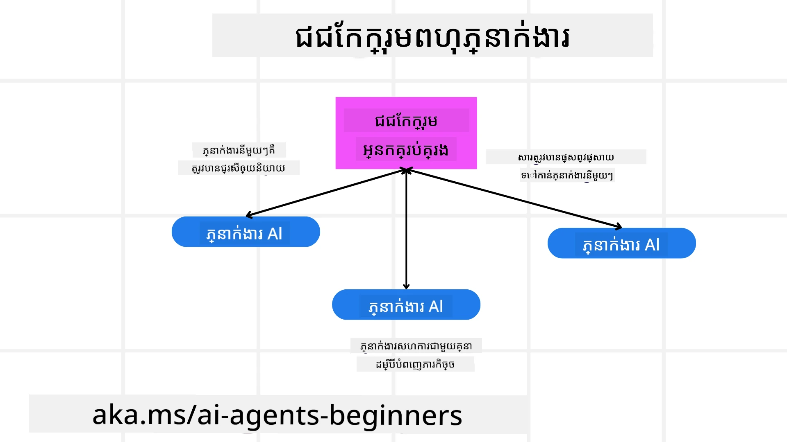
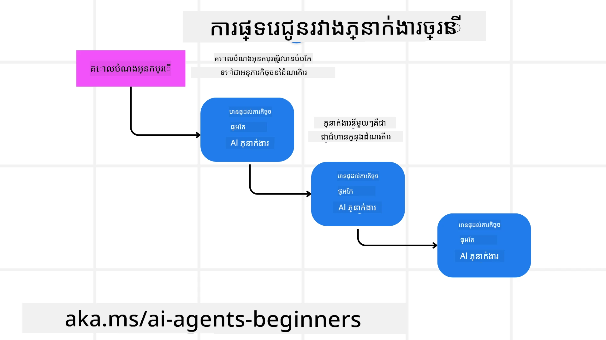
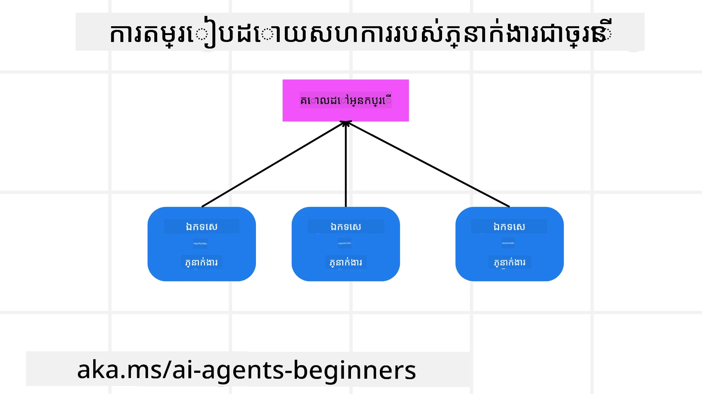

> _(ចុចរូបភាពខាងលើដើម្បីមើលវីដេអូមេរៀននេះ)_

# រចនាបទពហុភ្នាក់ងារ

ពេលដែលអ្នកចាប់ផ្តើមធ្វើលើគម្រោងដែលពាក់ព័ន្ធនឹងភ្នាក់ងារច្រើន អ្នកនឹងត្រូវគិតពីរចនាបទពហុភ្នាក់ងារ។ ទោះយ៉ាងណា អាចមិនច្បាស់ភ្លាមៗទេនៅពេលណាដែលគួរប្ដូរទៅប្រើពហុភ្នាក់ងារ និងអត្ថប្រយោជន៍របស់វាជាអ្វី។

## ណែនាំ

ក្នុងមេរៀននេះ យើងកំពុងស្វែងរកចម្លើយសម្រាប់សំណួរខាងក្រោម៖

- តើយ៉ាងដូចម្តេចជាសេណារីយ៉ូមួយដែលពហុភ្នាក់ងារអាចអនុវត្តបាន?
- តើអត្ថប្រយោជន៍នៃការប្រើប្រាស់ពហុភ្នាក់ងារនៅលើភ្នាក់ងារតែមួយដែលធ្វើការងារច្រើនមានអ្វីខ្លះ?
- តើប្លុកសំណង់ជាអ្វីខ្លះសម្រាប់ការអនុវត្តរចនាបទពហុភ្នាក់ងារ?
- តើយើងធ្វើដូចម្តេចដើម្បីឲ្យមានទិដ្ឋភាពថា ភ្នាក់ងារច្រើននោះកំពុងអន្តរកម្មគ្នាដូចម្តេច?

## គោលបំណងសម្រាប់ការសិក្សា

បន្ទាប់ពីមេរៀននេះ អ្នកគួរតែអាច:

- ដំណាក់ទេណារីយ៉ូដែលពហុភ្នាក់ងារអាចអនុវត្តបាន
- ដឹងអំពីអត្ថប្រយោជន៍នៃការប្រើប្រាស់ពហុភ្នាក់ងារជាងភ្នាក់ងារតែមួយ។
- យល់ដឹងពីប្លុកសំណង់នៃការអនុវត្តរចនាបទពហុភ្នាក់ងារ។

តើរូបភាពធំជាងនេះជាអ្វី?

*ពហុភ្នាក់ងារជារចនាបទដែលអនុញ្ញាតឲ្យភ្នាក់ងារច្រើនធ្វើការខ្នះខ្នែងគ្នាដើម្បីសម្រេចគោលបំណងរួមមួយ*។

រចនាបទនេះត្រូវបានប្រើយ៉ាងទូលំទូលាយនៅក្នុងវិស័យផ្សេងៗ រួមមានរ៉ូបូត អ្នកប្រព្រឹត្តដោយស្វ័យប្រវត្ត និងកុំព្យូទ័រចែកចាយ។

## សេណារីយ៉ូដែលពហុភ្នាក់ងារអាចអនុវត្តបាន

ហើយតើសេណារីយ៉ូណាខ្លះដែលជាករណីប្រើប្រាស់ល្អសម្រាប់ការប្រើពហុភ្នាក់ងារ? ចម្លើយគឺមានសេណារីយ៉ូជាច្រើនដែលការប្រើការភ្នាក់ងារច្រើនគឺមានប្រយោជន៍ជាពិសេសនៅករណីដូចខាងក្រោម៖

- **បរាជ័យធំ**: បរាជ័យធំអាចបែងចែកជាការងារតូចៗ ហើយចាត់តាំងឲ្យភ្នាក់ងារផ្សេងៗ អនុញ្ញាតឲ្យទទួលបានដំណើរការដោយសមាសមួយ និងបញ្ចប់បានលឿនជាង។ ឧទាហរណ៍មួយនៃនេះគឺក្នុងករណីមួយនៃការបំណិនទិន្នន័យធំ។
- **ការងារលំបាក**: ការងារលំបាក ដូចជាការងារធំ អាចបំបែកជាការងារតូចៗ ហើយចាត់តាំងឲ្យភ្នាក់ងារផ្សេងៗ ដែលមានជំនាញពិសេសនៅផ្នែកណាមួយ នៃការងារ។ ឧទាហរណ៍ល្អមួយគឺនៅក្នុងករណីយានយន្តអតូម៉ាទូម ដែលភ្នាក់ងារផ្សេងៗគ្រប់គ្រងការណែនាំ ការរកឃើញអំពើរាំងខ្នះ និងការប្រាស្រ័យទាក់ទងជាមួយយានយន្តផ្សេងទៀត។
- **ជំនាញខុសគ្នា**: ភ្នាក់ងារផ្សេងៗអាចមានជំនាញខុសគ្នា ដែលអោយពួកគេដោះស្រាយផ្នែកនីមួយនៃការងារ បានប្រសើរជាងភ្នាក់ងារតែមួយ។ សម្រាប់ករណីនេះ ឧទាហរណ៍ល្អគឺនៅក្នុងវិស័យសុខាភិបាល ដែលភ្នាក់ងារអាចគ្រប់គ្រងវិភាគរោគ ផែនការព្យាបាល និងការតាមដានអ្នកជំងឺ។

## អត្ថប្រយោជន៍នៃការប្រើប្រាស់ពហុភ្នាក់ងារជាងភ្នាក់ងារតែមួយ

ប្រព័ន្ធភ្នាក់ងារតែមួយអាចដំណើរការល្អសម្រាប់ការងារងាយៗ ប៉ុន្ត​សម្រាប់ការងារលំបាក ការប្រើភ្នាក់ងារច្រើនអាចផ្ដល់អត្ថប្រយោជន៍ជាច្រើន៖

- **ជំនាញពិសេស**: ភ្នាក់ងារក្នុងមួយនីមួយអាចមានជំនាញពិសេសសម្រាប់ការងារតែមួយ។ ការខ្វះជំនាញពិសេសក្នុងភ្នាក់ងារតែមួយមានន័យថា អ្នកមានភ្នាក់ងារដែលអាចធ្វើបានគ្រប់យ៉ាង ប៉ុន្តអាចរអាក់រអួលចំពោះការងារលំបាក។ វាអាចបញ្ចប់ដោយធ្វើការងារដែលវាមិនសមរម្យធ្វើបានល្អទេ។
- **ការលូតលាស់**: វាងាយស្រួលក្នុងការលូតលាស់ប្រព័ន្ធដោយបន្ថែមភ្នាក់ងារជាងការបន្ថែមការ​ដាក់ពង្រឹងលើភ្នាក់ងារតែមួយ។
- **ធន់ទ្រាំចំពោះកំហុស**: ប្រសិនបើភ្នាក់ងារតែមួយខូច ខ្សែផ្សេងអាចបន្តដំណើរការ បានធានាសុវត្ថិភាពប្រព័ន្ធ។

យកឧទាហរណ៍មួយ មកកក់ដំណើរកំសាន្តសម្រាប់អ្នកប្រើប្រាស់។ ប្រព័ន្ធភ្នាក់ងារតែមួយ ត្រូវជួយគ្រប់គ្រងផ្នែកទាំងអស់នៃដំណើរការកក់ ដូចជា ស្វែងរកជើងហោះហើរ កក់សណ្ឋាគារ និងជួលរថយន្ត។ ដើម្បីធ្វើបាននូវនេះ ជាមួយភ្នាក់ងារតែមួយ ភ្នាក់ងារនោះត្រូវតែមានឧបករណ៍ដើម្បីគ្រប់គ្រងការងារទាំងនេះ។ វាអាចនាំឲ្យប្រព័ន្ធមានភាពស្មុគស្មាញ និងមិនងាយរស់រានមានជីវិត និងលូតលាស់។ ប្រព័ន្ធពហុភ្នាក់ងារ អាចមានភ្នាក់ងារផ្សេងៗដែលមានជំនាញពិសេសសម្រាប់ស្វែងរកជើងហោះហើរ កក់សណ្ឋាគារ និងជួលរថយន្ត។ វានឹងធ្វើឲ្យប្រព័ន្ធមានរចនាសម្ព័ន្ធច្រើនផ្នែក ងាយស្រួលថែទាំ និងអាចលូតលាស់បាន។

ធៀបនឹងក្រុមហ៊ុនទេសចរណ៍ប្រតិបត្តិការ ដូចជារបួសម៉ាក់ប៉ាប៉ា និងក្រុមហ៊ុនទេសចរណ៍ប្រតិបត្តិការ ដូចជាសហគ្រាស។ របួសម៉ាក់ប៉ាប៉ា នេះនឹងមានភ្នាក់ងារតែមួយគ្រប់គ្រងផ្នែកទាំងអស់នៃដំណើរការកក់ ខណៈពេលដែលសហគ្រាស មានភ្នាក់ងារផ្សេងៗគ្រប់គ្រងផ្នែកផ្សេងៗនៃដំណើរការកក់។

## ប្លុកសំណង់នៃការអនុវត្តរចនាបទពហុភ្នាក់ងារ

មុននឹងអាចអនុវត្តរចនាបទពហុភ្នាក់ងារ អ្នកត្រូវយល់ពីប្លុកសំណង់ដែលបង្កប់រចនាបទ។

ធ្វើឲ្យវាច្បាស់ជាងនេះ ដោយយកឧទាហរណ៍នៃការកក់ដំណើរកម្សាន្តសម្រាប់អ្នកប្រើម្តងទៀត។ ក្នុងករណីនេះ ប្លុកសំណង់របស់វានឹងរួមបញ្ចូល៖

- **ការប្រាស្រ័យទាក់ទងរវាងភ្នាក់ងារ**: ភ្នាក់ងារសម្រាប់ស្វែងរកជើងហោះហើរ កក់សណ្ឋាគារ និងជួលរថយន្ត ត្រូវតែប្រាស្រ័យទាក់ទងនិងចែករំលែកព័ត៌មានអំពីចំណូលចិត្ត និងកំណត់ការរបស់អ្នកប្រើ។ អ្នកត្រូវសម្រេចចិត្តលើព្រះរាជប្បទាន និងវិធីសាកល្បងសម្រាប់ការប្រាស្រ័យទាក់ទងនេះ។ ភាពពិតប្រាកដគឺ ភ្នាក់ងារស្វែងរកជើងហោះហើរត្រូវតែប្រាស្រ័យទាក់ទងជាមួយភ្នាក់ងារកក់សណ្ឋាគារដើម្បីធានាថាសណ្ឋាគារត្រូវបានកក់នៅជាមួយថ្ងៃដូចជាជើងហោះហើរ។ នេះមានន័យថា ភ្នាក់ងារត្រូវតែចែករំលែកព័ត៌មានអំពីថ្ងៃធ្វើដំណើររបស់អ្នកប្រើ ។ ប្រសិនបើ លោកអ្នកត្រូវសម្រេចចិត្ត*ភ្នាក់ងារណាខ្លះចែករំលែកព័ត៌មាន និងការចែករំលែកត្រូវធ្វើដូចម្តេច*។
- **មេកានិចសម្របសម្រួល**: ភ្នាក់ងារត្រូវតែសម្របសម្រួលសកម្មភាពរបស់ពួកគេ ដើម្បីធានាថា ចំណូលចិត្ត និងកំណត់ការរបស់អ្នកប្រើត្រូវបានគោរព។ ចំណូលចិត្តរបស់អ្នកប្រើអាចជាថា ពួកគេចង់បានសណ្ឋាគារចំាចាប់ពីព្រលានយន្តហោះ ខណៈដែលកំណត់ការអាចជាថា រថយន្តជួលមានប៉ុណ្ណោះនៅព្រលានយន្តហោះ។ នេះមានន័យថា ភ្នាក់ងារកក់សណ្ឋាគារត្រូវតែសម្របសម្រួលជាមួយភ្នាក់ងារកក់រថយន្តជួល ដើម្បីធានាថាចំណូលចិត្ត និងកំណត់ការរបស់អ្នកប្រើបានគោរព។ នេះមានន័យថាអ្នកត្រូវសម្រេចចិត្ត*ភ្នាក់ងារបានសម្របសម្រួលសកម្មភាពរបស់ពួកគេដូចម្តេច*។
- **ស្ថាបត្យកម្មភ្នាក់ងារ**: ភ្នាក់ងារត្រូវតែមានរចនាសម្ព័ន្ធផ្ទៃក្នុងដើម្បីធ្វើកំណត់ ហើយរៀនពីអន្តរកម្មជាមួយអ្នកប្រើ។ នេះមានន័យថា ភ្នាក់ងារស្វែងរកជើងហោះហើរត្រូវតែមានរចនាសម្ព័ន្ធផ្ទៃក្នុងដើម្បីធ្វើកំណត់ថាជើងហោះហើរណាត្រូវណែនាំឲ្យអ្នកប្រើ។ អ្នកត្រូវសម្រេចចិត្ត*ភ្នាក់ងារធ្វើកំណត់ និងរៀនពីអន្តរកម្មជាមួយអ្នកប្រើដូចម្តេច*។ ឧទាហរណ៍ពីរបៀបដែលភ្នាក់ងាររៀន និងកែលម្អអាចជាថា ភ្នាក់ងារស្វែងរកជើងហោះហើរអាចប្រើម៉ូឌែលរៀនម៉ាស៊ីនដើម្បីណែនាំជើងហោះហើរដល់អ្នកប្រើ ដោយផ្អែកលើចំណូលចិត្តមុនរបស់ពួកគេ។
- **ទិដ្ឋភាពក្នុងអន្តរកម្មពហុភ្នាក់ងារ**: អ្នកត្រូវមានទិដ្ឋភាពថា ភ្នាក់ងារច្រើនកំពុងអន្តរកម្មគ្នាយ៉ាងដូចម្តេច។ នេះមានន័យថាអ្នកត្រូវមានឧបករណ៍ និងវិធីសាស្ត្រសម្រាប់តាមដានសកម្មភាព និងអន្តរកម្មរបស់ភ្នាក់ងារ។ វាអាចមានទ្រង់ទ្រាយជាឧបករណ៍កំណត់ហេតុ និងត្រួតពិនិត្យ ប្រើឧបករណ៍ខណ្ឌេវីស្យូម និងវិមាត្រសមត្ថភាព។
- **រចនាបទពហុភ្នាក់ងារ**: មានរចនាបទផ្សេងៗសម្រាប់អនុវត្តប្រព័ន្ធពហុភ្នាក់ងារ ដូចជាស្ថាបត្យកម្មកណ្តាល ការផ្សព្វផ្សាយ និងស្ថាបត្យកម្មសហជីព។ អ្នកត្រូវសម្រេចចិត្តលើរចនាបទដែលសមស្របបំផុតសម្រាប់ករណីប្រើរបស់អ្នក។
- **មនុស្សនៅក្នុងសងង្កត់**: នៅភាគច្រើនអ្នកនឹងមានមនុស្សនៅក្នុងសងង្កត់ ហើយអ្នកត្រូវបញ្ជាក់ភ្នាក់ងារវេលាអ្នកណាចាំបាច់សុំការជួយពីមនុស្ស។ វាអាចជាទ្រង់ទ្រាយនៃអ្នកប្រើស្នើសុំសណ្ឋាគារឬជើងហោះហើរដែលភ្នាក់ងារមិនបានណែនាំ ឬសំណើសុំការបញ្ជាក់មុនពេលកក់ជើងហោះហើរឬសណ្ឋាគារ។

## ទិដ្ឋភាពក្នុងអន្តរកកម្មពហុភ្នាក់ងារ

វាសំខាន់ណាស់ដែលអ្នកមានទិដ្ឋភាពថា ភ្នាក់ងារច្រើនកំពុងអន្តរកម្មគ្នាយ៉ាងដូចម្តេច។ ទិដ្ឋភាពនេះមានសារៈសំខាន់សម្រាប់កែសម្រួលកំហុស បង្កើនប្រសិទ្ធភាព និងធានាបានភាពមានប្រសិទ្ធភាពនៃប្រព័ន្ធទាំងមូល។ ដើម្បីសម្រេចបាននេះ អ្នកត្រូវមានឧបករណ៍ និងវិធីសាស្ត្រសម្រាប់តាមដានសកម្មភាព និងអន្តរកម្មរបស់ភ្នាក់ងារ។ វាអាចមានទ្រង់ទ្រាយជាឧបករណ៍កំណត់ហេតុ និងត្រួតពិនិត្យ ប្រើឧបករណ៍ខណ្ឌេវីស្យូម ហើយវិមាត្រសមត្ថភាព។

ឧទាហរណ៍ ក្នុងករណីកក់ដំណើរកម្សាន្តសម្រាប់អ្នកប្រើ អ្នកអាចមានផ្ទាំងគ្រប់គ្រងដែលបង្ហាញស្ថានភាពនៃភ្នាក់ងារនីមួយៗ ចំណូលចិត្ត និងកំណត់ការរបស់អ្នកប្រើ និងអន្តរកម្មរវាងភ្នាក់ងារ។ ផ្ទាំងគ្រប់គ្រងនេះអាចបង្ហាញថ្ងៃធ្វើដំណើររបស់អ្នកប្រើ ជើងហោះហើរដែលភ្នាក់ងារជ្រើសរើស បន្ទប់សណ្ឋាគារដែលភ្នាក់ងារជ្រើសរើស និងរថយន្តជួលដែលភ្នាក់ងារជ្រើសរើស។ វានឹងផ្តល់នូវទិដ្ឋភាពច្បាស់លាស់ពីរបៀបភ្នាក់ងារអន្តរកម្មគ្នា និងថាតើចំណូលចិត្ត និងកំណត់ការរបស់អ្នកប្រើ ត្រូវបានគោរពហើយឬអត់។

យើងមកមើលចំណុចទាំងនេះជាលម្អិតបន្ថែមទៀត។

- **ឧបករណ៍កំណត់ហេតុ និងត្រួតពិនិត្យ**: អ្នកចង់ឲ្យការកំណត់ហេតុធ្វើសម្រាប់សកម្មភាពមួយៗដែលភ្នាក់ងារធ្វើ។ កំណត់ហេតុអាចរក្សាព័ត៌មានអំពីភ្នាក់ងារដែលបានអនុវត្តសកម្មភាព នាទីដែលត្រូវបានអនុវត្ត សកម្មភាព អលប្បបរមាដែលបានទទួល។ ព័ត៌មាននេះអាចប្រើសម្រាប់កែសម្រួលកំហុស បង្កើនប្រសិទ្ធភាព និងផ្សេងៗទៀត។

- **ឧបករណ៍ខណ្ឌេវីស្យូម**: ឧបករណ៍ខណ្ឌេវីស្យូមអាចជួយឲ្យអ្នកមើលឃើញអន្តរកម្មរវាងភ្នាក់ងារដោយភាពបរិយាយ ឧទាហរណ៍ អ្នកអាចមានក្រាហ្វមួយដែលបង្ហាញលំហូរព័ត៌មានរវាងភ្នាក់ងារ។ វាអាចជួយអ្នករកឃើញចំណុចរបួស ការចំណាយពេល និងបញ្ហា ផ្សេងៗនៅក្នុងប្រព័ន្ធ។

- **វិមាត្រសមត្ថភាព**: វិមាត្រសមត្ថភាពអាចជួយអ្នកតាមដានប្រសិទ្ធភាពនៃប្រព័ន្ធពហុភ្នាក់ងារ។ ឧទាហរណ៍ អ្នកអាចតាមដានពេលវេលាដែលចំណាយដើម្បីបញ្ចប់ការងារ ចំនួនការងារដែលបានបញ្ចប់ក្នុងអង្គភាពនៅលើវេលា និងភាពត្រឹមត្រូវនៃការណែនាំដែលបានផ្តល់ដោយភ្នាក់ងារ។ ព័ត៌មាននេះអាចជួយអ្នកកំណត់តំបន់ដែលត្រូវការកែលម្អ និងបង្កើនប្រសិទ្ធភាពប្រព័ន្ធ។

## រចនាបទពហុភ្នាក់ងារ

យើងមកចូលជ្រៅទៅក្នុងរចនាបទជាក់លាក់ខ្លះដែលយើងអាចប្រើសម្រាប់បង្កើតកម្មវិធីពហុភ្នាក់ងារ។ នេះគឺជារចនាបទគួរឱ្យចាប់អារម្មណ៍ខ្លះដែលគួរត្រូវបានគិតទុក៖

### ក្រុមជជែក

រចនាបទនេះមានប្រយោជន៍នៅពេលដែលអ្នកចង់បង្កើតកម្មវិធីជជែកជាក្រុម ដែលមានភ្នាក់ងារច្រើនអាចប្រាស្រ័យទាក់ទងគ្នា។ ករណីប្រើប្រាស់ធម្មតាសម្រាប់រចនាបទនេះរួមមាន ការសហការជាក្រុម ការគាំទ្រអតិថិជន និងបណ្ដាញសង្គម។

ក្នុងរចនាបទនេះ ភ្នាក់ងារកន្លែងមួយរៀបរាប់អ្នកប្រើនៅក្នុងក្រុមជជែក ហើយសារត្រូវបានផ្លាស់ប្ដូររវាងភ្នាក់ងារ ដោយប្រើព្រះរាជប្បទានសារជជែក។ ភ្នាក់ងារអាចផ្ញើសារទៅក្រុមជជែក ទទួលសារពីក្រុមជជែក និងឆ្លើយតបនឹងសារពីភ្នាក់ងារ ផ្សេងទៀត។

រចនាបទនេះអាចអនុវត្តបានដោយប្រើស្ថាបត្យកម្មកណ្តាល ដែលសារទាំងអស់ត្រូវបានបញ្ជូនតាមម៉ាស៊ីនមេកណ្តាល ឬស្ថាបត្យកម្មរំលាយ ដែលសារត្រូវបានផ្លាស់ប្ដូរដោយផ្ទាល់។

### ដៃផ្លាស់ប្ដូរ

រចនាបទនេះមានប្រយោជន៍នៅពេលដែលអ្នកចង់បង្កើតកម្មវិធីដែលភ្នាក់ងារច្រើនអាចផ្លាស់ប្ដូរការងារចំពោះគ្នា។

ករណីប្រើប្រាស់ធម្មតាសម្រាប់រចនាបទនេះរួមមាន ការគាំទ្រអតិថិជន ការគ្រប់គ្រងការ និងស្វ័យប្រវត្តិកម្មនៃដំណើរការ។

ក្នុងរចនាបទនេះ ភ្នាក់ងារនីមួយៗតំណាងឱ្យការងារឬជំហានមួយក្នុងដំណើរការ ហើយភ្នាក់ងារអាចផ្លាស់ប្ដូរការងារទៅឱ្យភ្នាក់ងារផ្សេងទៀតដោយផ្អែកលើច្បាប់ដែលកំណត់ជាមុន។

### លំហាត់តម្រួតសហការ

រចនាបទនេះមានប្រយោជន៍នៅពេលដែលអ្នកចង់បង្កើតកម្មវិធីដែលភ្នាក់ងារច្រើនអាចសហការចេញយោបល់អនុសាសន៍ទៅអ្នកប្រើ។

ហេតុអ្វីបានជាអ្នកចង់ឲ្យភ្នាក់ងារច្រើនសហការគ្នា ព្រោះភ្នាក់ងារនីមួយៗអាចមានជំនាញខុសគ្នា ហើយអាចចូលរួមក្នុងដំណើរការផ្តល់អនុសាសន៍ដោយវិធីផ្សេងៗ។

យកឧទាហរណ៍មួយ ដែលអ្នកប្រើចង់បានអនុសាសន៍អំពីភាគហ៊ុនល្អបំផុតសម្រាប់ទិញនៅទីផ្សារភាគហ៊ុន។

- **ជំនាញឧស្សាហកម្ម**: ភ្នាក់ងារមួយអាចជាអ្នកជំនាញនៅក្នុងឧស្សាហកម្មជាក់លាក់មួយ។
- **វិភាគបច្ចេកទេស**: ភ្នាក់ងារមួយផ្សេងទៀតអាចជាអ្នកជំនួយស្ដីពីវិភាគបច្ចេកទេស។
- **វិភាគមូលដ្ឋាន**: ហើយភ្នាក់ងារមួយផ្សេងទៀតអាចជាអ្នកជំនាញស្ដីពីវិភាគមូលដ្ឋាន។ ដោយសហការគ្នា ភ្នាក់ងារទាំងនេះអាចផ្តល់អនុសាសន៍ដែលពហុជាងទៅឱ្យអ្នកប្រើ។

## សេណារីយ៉ូ៖ ដំណើរការការសងប្រាក់វិញ

ពិចារណាសេណារីយ៉ូមួយដែលអតិថិជនកំពុងព្យាយាមទទួលសងប្រាក់វិញសម្រាប់ផលិតផល មួយចំនួនមានភ្នាក់ងារចូលរួមក្នុងដំណើរការនេះ ប៉ុន្តេលែងចែកវាទៅភ្នាក់ងារដែលមានជំនាញជាក់លាក់សម្រាប់ដំណើរការនេះ និងភ្នាក់ងារទូទៅដែលអាចប្រើបានក្នុងដំណើរការផ្សេងទៀត។

**ភ្នាក់ងារជាក់លាក់សម្រាប់ដំណើរការសងប្រាក់វិញ**៖

តាអ្នករាយនាមភ្នាក់ងារដែលអាចចូលរួមក្នុងដំណើរការសងប្រាក់វិញ៖

- **ភ្នាក់ងារអតិថិជន**: ភ្នាក់ងារនេះតំណាងឲ្យអតិថិជន និងទទួលបន្ទុកការចាប់ផ្តើមដំណើរការសងប្រាក់វិញ។
- **ភ្នាក់ងារលក់**: ភ្នាក់ងារនេះតំណាងឲ្យអ្នកលក់ និងទទួលបន្ទុកការដំណើរការសងប្រាក់វិញ។
- **ភ្នាក់ងារទូទាត់ប្រាក់**: ភ្នាក់ងារនេះតំណាងឲ្យដំណើរការទូទាត់ និងទទួលបន្ទុកសងប្រាក់វិញឲ្យអតិថិជន។
- **ភ្នាក់ងារដោះស្រាយ**: ភ្នាក់ងារនេះតំណាងឲ្យដំណើរការដោះស្រាយ និងទទួលបន្ទុកដោះស្រាយបញ្ហាណាមួយដែលកើតមានក្នុងដំណើរការសងប្រាក់វិញ។
- **ភ្នាក់ងារអនុលោម**: ភ្នាក់ងារនេះតំណាងឲ្យដំណើរការអនុលោម និងទទួលបន្ទុកធានាថា ដំណើរការសងប្រាក់វិញគោរពតាមច្បាប់និងគោលនយោបាយ។

**ភ្នាក់ងារទូទៅ**៖

ភ្នាក់ងារទាំងនេះអាចត្រូវបានប្រើដោយផ្នែកផ្សេងៗរបស់អាជីវកម្មរបស់អ្នក។

- **ភ្នាក់ងារដឹកជញ្ជូន**: ភ្នាក់ងារនេះតំណាងឲ្យដំណើរការដឹកជញ្ជូន និងទទួលបន្ទុកផ្ញើផលិតផលត្រឡប់ទៅអ្នកលក់។ ភ្នាក់ងារនេះអាចប្រើដល់ទាំងដំណើរការសងប្រាក់វិញ និងដឹកជញ្ជូនទូទៅសម្រាប់ផលិតផលតាមការបញ្ជាទិញ។
- **ភ្នាក់ងារពិនិត្យមតិយោបល់**: ភ្នាក់ងារនេះតំណាងឲ្យដំណើរការប្រមូលយោបល់ពីអតិថិជន។ ការប្រមូលយោបល់អាចធ្វើបានពេលណាមួយមិនត្រឹមតែចំពោះដំណើរការសងប្រាក់វិញទេ។
- **ភ្នាក់ងារលើកខ្ពស់**: ភ្នាក់ងារនេះតំណាងឲ្យដំណើរការក្នុងការលើកបញ្ហាទៅកាន់កម្រិតគាំទ្រខ្ពស់ជាង។ អ្នកអាចប្រើភ្នាក់ងារប្រភេទនេះសម្រាប់ដំណើរការណាមួយណាមួយដែលអ្នកត្រូវលើកបញ្ហា។
- **ភ្នាក់ងារជូនដំណឹង**: ភ្នាក់ងារនេះតំណាងឲ្យដំណើរការជូនដំណឹង និងទទួលបន្ទុកផ្ញើប្រតិបត្តិការជូនដំណឹងទៅអតិថិជននៅវគ្គផ្សេងៗនៃដំណើរការសងប្រាក់វិញ។
- **ភ្នាក់ងារវិភាគ**: ភ្នាក់ងារនេះតំណាងឲ្យដំណើរការវិភាគទិន្នន័យដែលពាក់ព័ន្ធនឹងដំណើរការសងប្រាក់វិញ។
- **ភ្នាក់ងារត្រួតពិនិត្យ**: ភ្នាក់ងារនេះតំណាងឲ្យដំណើរការត្រួតពិនិត្យដំណើរការសងប្រាក់វិញ ដើម្បីធានាថាវាត្រូវបានអនុវត្តបានត្រឹមត្រូវ។
- **ភ្នាក់ងាររាយការណ៍**: ភ្នាក់ងារនេះតំណាងឲ្យដំណើរការរាយការណ៍ និងទទួលបន្ទុកបង្កើតរបាយការណ៍លើដំណើរការសងប្រាក់វិញ។
- **ភ្នាក់ងារចំណេះដឹង**: ភ្នាក់ងារនេះតំណាងឲ្យដំណើរការចំណេះដឹង និងទទួលបន្ទុកថែទាំមូលដ្ឋានចំណេះដឹងដែលពាក់ព័ន្ធនឹងដំណើរការសងប្រាក់វិញ។ ភ្នាក់ងារនេះអាចមានចំណេះដឹងទាំងអំពីការសងប្រាក់វិញ និងផ្នែកផ្សេងៗទៀតនៃអាជីវកម្មរបស់អ្នក។
- **ភ្នាក់ងារសន្តិសុខ**: ភ្នាក់ងារនេះតំណាងឲ្យដំណើរការសន្តិសុខ និងទទួលបន្ទុកធានាសន្តិសុខនៃដំណើរការសងប្រាក់វិញ។
- **ភ្នាក់ងារភាពគុណភាព**: ភ្នាក់ងារនេះតំណាងឲ្យដំណើរការភាពគុណភាព និងទទួលបន្ទុកធានាថាភាពគុណភាពនៃដំណើរការសងប្រាក់វិញបានគោរព។

មានភ្នាក់ងារច្រើនបានរាយនាមខាងលើ ទាំងសម្រាប់ដំណើរការសងប្រាក់វិញជាក់លាក់ និងភ្នាក់ងារទូទៅដែលអាចប្រើបានក្នុងផ្នែកផ្សេងៗនៃអាជីវកម្មរបស់អ្នក។ សង្ឃឹមថានេះផ្តល់ឲ្យអ្នកគំនិតពីរបៀបដែលអ្នកអាចសម្រេចចិត្តលើការប្រើប្រាស់ភ្នាក់ងារ ក្នុងប្រព័ន្ធពហុភ្នាក់ងាររបស់អ្នក។

## កិច្ចការដាក់ស្នើ

រចនាប្រព័ន្ធពហុភ្នាក់ងារសម្រាប់ដំណើរការគាំទ្រអតិថិជន។ កំណត់ភ្នាក់ងារដែលចូលរួមក្នុងដំណើរការ តួនាទី និងកាតព្វកិច្ចរបស់ពួកគេ ហើយរបៀបដែលពួកគេអន្តរកម្មគ្នា។ ពិចារណាភ្នាក់ងារជាក់លាក់សម្រាប់ដំណើរការគាំទ្រអតិថិជន និងភ្នាក់ងារទូទៅដែលអាចប្រើបានក្នុងផ្នែកផ្សេងៗនៃអាជីវកម្មរបស់អ្នក។

> សូមគិតមួយស្ទើរមុននឹងអ្នកអានដំណោះស្រាយខាងក្រោម អ្នកអាចត្រូវការយោបល់បន្ថែមជាងដែលអ្នកគិត។

> គន្លឹះ៖ សូមគិតអំពីដំណាក់កាលផ្សេងៗនៃដំណើរការគាំទ្រអតិថិជន និងក៏ពិចារណាអំពីតំណាងដែលត្រូវការសម្រាប់ប្រព័ន្ធណាមួយផងដែរ។

## ដំណោះស្រាយ

[ដំណោះស្រាយ](./solution/solution.md)

## ការត្រួតពិនិត្យចំណេះដឹង

### សំណួរ ១

តើស្ថានភាពណាដែលសមស្របបំផុតសម្រាប់ប្រព័ន្ធមនុស្សច្រើន?

- [ ] A1: បុរសជំនួយការ​ស្វ័យប្រវត្តិឆ្លើយសំណួរពេញនិយមមួយដោយប្រើមូលដ្ឋានចំណេះដឹងមួយ និងឧបករណ៍តូចមួយ។
- [ ] A2: ដំណើរការសងប្រាក់ត្រូវការតួនាទីប្រាក់ភាគីប្លែកៗ ដូចជា ការលួចប្លង់ ការទូទាត់ និងការអនុវត្តន៍ តួណីទាំងនេះមានឧបករណ៍នីមួយៗ និងលទ្ធផលរបស់ពួកវាត្រូវតែសម្របសម្រួល។
- [ ] A3: សំណើរ​ការតម្រៀប​តាម​ការ​សាមញ្ញ​ដដែល​នៃ​សំណើរ​ដំណើរការ​មួយ ដល់ជាច្រើនពាន់ដងក្នុងមួយម៉ោង។

### សំណួរ ២

នៅពេលណាដែលតំណាងម្នាក់ជាជម្រើសដែលល្អជាទូទៅ?

- [ ] A1: ភារកិច្ចអាចគ្រប់គ្រងបានដោយបណ្តុំការណែនាំនិងឧបករណ៍មួយ ដោយគ្មានការផ្ទេរជំនាញពិសេស។
- [ ] A2: តំណាងមានចូលដំណើរការប្រើឧបករណ៍ច្រើនជាងមួយ។
- [ ] A3: ដំណើរការត្រូវការតួនាទីប្លែកៗ ដែលមានសិទិ្ធផ្សេងៗ និងមានតាមដានអាជីពដោយស្វ័យប្រវត្តិ។

[ដំណោះស្រាយវាយតម្លៃ](./solution/solution-quiz.md)

## សង្ខេប

ក្នុងមេរៀននេះ យើងបានមើលប៉ាដា៉ងរចនាបថមនុស្សច្រើន រួមទាំងស្ថានភាពដែលមនុស្សច្រើនអាចប្រើបាន អត្ថប្រយោជន៍នៃការប្រើប្រាស់មនុស្សច្រើនជាជាងតំណាងតែម្នាក់ ធាតុសាងសង់នៃការអនុវត្តន៍ប៉ាដា៉ងរចនាបថមនុស្សច្រើន និងវិធីសាស្រ្តបង្ហាញពីរបៀបដែលមនុស្សច្រើនជាមួយគ្នាផ្សព្វផ្សាយគ្នា។

### តើអ្នកមានសំណួរបន្ថែមអំពីប៉ាដា៉ងរចនាបថមនុស្សច្រើនទេ?

ចូលរួមជាមួយ [Microsoft Foundry Discord](https://discord.com/invite/ATgtXmAS5D) ដើម្បីជួបជាមួយអ្នករៀនផ្សេងទៀត ចូលរួមម៉ោងការិយាល័យ និងទទួលបានការឆ្លើយសំណួរពាក់ព័ន្ធនឹង AI Agents របស់អ្នក។

## ធនធានបន្ថែម

- <a href="https://learn.microsoft.com/azure/ai-services/agents/overview" target="_blank">ឯកសារពាក់ព័ន្ធនឹង Microsoft Agent Framework</a>
- <a href="https://www.analyticsvidhya.com/blog/2024/10/agentic-design-patterns/" target="_blank">រចនាបថ Agentic design patterns</a>

## មេរៀនមុន

[រៀបចំការរចនា](../07-planning-design/README.md)

## មេរៀនបន្ទាប់

[ការយល់ដឹងពីខ្លួននៅក្នុង AI Agents](../09-metacognition/README.md)

---

<!-- CO-OP TRANSLATOR DISCLAIMER START -->
**ការបដិសេធ**:
ឯកសារនេះត្រូវបានបម្លែងភាសា ដោយប្រើសេវាបម្លែងភាសា AI [Co-op Translator](https://github.com/Azure/co-op-translator)។ ទោះយើងខ្ញុំមានក្តីប្រាថ្នាឱ្យបានច្បាស់លាស់ តែសូមយល់ដឹងថាការបម្លែងដោយស្វ័យប្រវត្តិក៏អាចមានកំហុសឬភាពមិនត្រឹមត្រូវ។ ឯកសារដើមជាភាសាទីតាំងគួរត្រូវបានគេប្រើជាប្រភពច្បាស់លាស់។ សម្រាប់ព័ត៌មានសំខាន់ៗ សូមណែនាំឱ្យប្រើប្រាស់ការប្រែដោយមនុស្សជំនាញ។ យើងខ្ញុំមិនទទួលខុសត្រូវចំពោះការយល់ច្រឡំ ឬការបកស្រាយខុសបន្ទាប់ពីការប្រើប្រាស់ការបម្លែងនេះនោះទេ។
<!-- CO-OP TRANSLATOR DISCLAIMER END -->