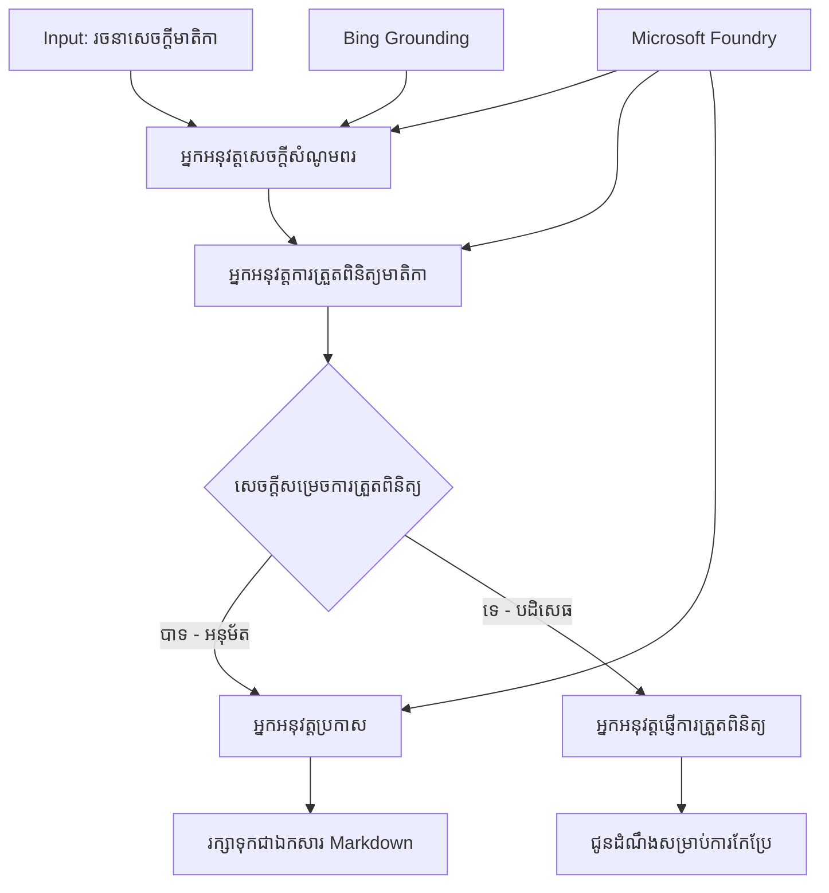

# 🔀 ការបញ្ជាដំណើរការប្រតិបត្តិការជាមួយភ្នាក់ងារជាប់លក្ខខណ្ឌដោយប្រើ Microsoft Foundry (.NET)

## 📋 មេរៀនការប្រើប្រាស់ការបញ្ជារដោយផ្អែកលើសេចក្ដីសម្រេចបញ្ញា

សៀវភៅកំណត់ត្រានេះបង្ហាញពី **រចនាប័ទ្មដំណើរការជាប់លក្ខខណ្ឌ** ដោយប្រើ Microsoft Foundry និង Microsoft Agent Framework សម្រាប់ .NET។ អ្នកនឹងរៀនពីវិធីបង្កើតដំណើរការស្មុគស្មាញ ដែលផ្អែកលើការសម្រេចចិត្តដ៏មានចំណេះដឹង ដើម្បីបញ្ជូនការបញ្ចូលឡើងវិញដោយផ្អែកលើការវិភាគ AI, ច្បាប់អាជីវកម្ម និងលក្ខខណ្ឌបម្លែងសម្រាប់ការបញ្ជាអូទូម៉ាទ្រីកកម្រិតសហគ្រាស។

## 🎯 គោលបំណងការរៀន

### 🧠 **សំណង់សេចក្ដីសម្រេចចិត្តដ៏មានចំណេះដឹង**
- **ការអនុវត្តតុល្យភាពលក្ខខណ្ឌ**៖ បង្កើតដើមឈើសម្រេចចិត្តស្មុគស្មាញជាមួយចំនុចចែករាជ្យច្រើន
- **ការបញ្ជូនដោយជំនួយ AI**៖ ប្រើម៉ូឌែល Microsoft Foundry ដើម្បីធ្វើការសម្រេចចិត្តបញ្ជូនឆ្នើម
- **បម្លាស់ប្តូរដំណើរការដោយផ្អែកលើលក្ខខណ្ឌ**៖ ផ្លាស់ប្តូររបៀបដំណើរការផ្អែកលើការវិភាគនិងលក្ខខណ្ឌនៅពេលដំណើរការ
- **ការបញ្ចូលច្បាប់សហគ្រាស**៖ បញ្ចូលលក្ខខណ្ឌអាជីវកម្មនិងតម្រូវការអនុលោមទៅក្នុងដំណើរការ

### 🔀 **រចនាប័ទ្មលក្ខខណ្ឌកម្រិតខ្ពស់**
- **ការសម្រេចចិត្តដោយច្រើនលក្ខខណ្ឌ**៖ វាយតម្លៃបញ្ហាជាច្រើនសម្រាប់ការសម្រេចចិត្តបញ្ជូន
- **ដំណើរការយល់ដឹងសេចក្ដីសំខាន់នៃបរិបទ**៖ សម្រេចចិត្តដោយផ្អែកលើបរិបទនិងប្រវត្តិសកម្មភាពរបស់ដំណើរការ
- **ការផ្លាស់ប្តូរដំណើរការតាមបែបឆ្លាតវៃ**៖ កែប្រែផ្លូវនៃដំណើរការដោយផ្អែកលើលក្ខខណ្ឌពេលវេលាពិត
- **ការបញ្ចូលម៉ាស៊ីនច្បាប់**៖ អនុវត្តម៉ាស៊ីនច្បាប់អាជីវកម្មយ៉ាងស្មុគស្មាញនៅក្នុងដំណើរការ

### 🏢 **កម្មវិធីលក្ខខណ្ឌសម្រាប់សហគ្រាស**
- **ចាត់ថ្នាក់និងបញ្ជូនឯកសារ**៖ ចាត់ថ្នាក់និងបញ្ជូនឯកសារដោយស្វ័យប្រវត្តិទៅដំណើរការដែលសមស្រប
- **ការតម្រូវសេវាកម្មអតិថិជន**៖ បញ្ជូនសំណួរអតិថិជនទៅក្រុមអ្នកជំនាញជាក់លាក់ដោយមានចំណេះដឹង
- **ការតម្រូវការអនុលោមនិងគ្រប់គ្រងហានិភ័យ**៖ អនុវត្តន៍កាតព្វកិច្ចជ្រួលជ្រើលនិងការត្រួតពិនិត្យអាស្រ័យលើការវាយតម្លៃហានិភ័យ
- **ដំណើរការត្រួតពិនិត្យគុណភាព**៖ បញ្ជូនមាតិការតាមដំណើរការត្រួតពិនិត្យដែលសមរម្យដោយផ្អែកលើគុណភាព

## ⚙️ តម្រូវការរៀនមុននិងការតំឡើង

### 📦 **កញ្ចប់ NuGet តម្រូវការ**

កញ្ចប់កម្រិតខ្ពស់សម្រាប់ដំណើរការជាប់លក្ខខណ្ឌ៖

```xml
<!-- Core AI Framework -->
<PackageReference Include="Microsoft.Extensions.AI" Version="9.9.0" />

<!-- Azure AI Agents with Persistent State -->
<PackageReference Include="Azure.AI.Agents.Persistent" Version="1.2.0-beta.5" />

<!-- Azure Identity and Utilities -->
<PackageReference Include="Azure.Identity" Version="1.15.0" />
<PackageReference Include="System.Linq.Async" Version="6.0.3" />
<PackageReference Include="DotNetEnv" Version="3.1.1" />

<!-- Local Workflow Framework References -->
<!-- Microsoft.Agents.Workflows.dll - Advanced workflow orchestration -->
<!-- Microsoft.Agents.AI.AzureAI.dll - Microsoft Foundry integration -->
<!-- Microsoft.Agents.AI.dll - Core agent abstractions -->
```

### 🔑 **ការកំណត់ Microsoft Foundry**

**ធនធាន Azure តម្រូវការ៖**
- កន្លែងការងារ Microsoft Foundry ជាមួយម៉ូឌែលដំណើរការជាប់លក្ខខណ្ឌ
- ចុះឈ្មោះ Azure ជាមួយកំណត់ត្រាកំណត់កម្រិតនិងការអនុញ្ញាតសមរម្យ
- ផ្ទុកម៉ូឌែល AI សម្រាប់ការសម្រេចចិត្តនិងវិភាគមាតិកា
- (ជាជម្រើស) ការតភ្ជាប់ Bing Search API សម្រាប់មូលដ្ឋាន

**ការកំណត់បរិយាកាស (.env file):**
```env
# Microsoft Foundry Configuration
AZURE_AI_PROJECT_ENDPOINT=https://your-project.cognitiveservices.azure.com/
BING_CONNECTION_ID=your-bing-connection-id
```

**ការកំណត់ការផ្ទៀងផ្ទាត់:**
```csharp
// Azure CLI or Managed Identity authentication
using Azure.Identity;
var credential = new AzureCliCredential();

// Load environment configuration
DotNetEnv.Env.Load("../../../.env");
```

### 🏗️ **សំណង់ដំណើរការជាប់លក្ខខណ្ឌ**



**ឯកត្ត:**
- **Draft Executor**៖ ភ្នាក់ងារ AI ដែលបង្កើតសេចក្ដីព្រាងមាតិកាចាប់ពីសេចក្ដីប្រមាណ
- **Content Review Executor**៖ ភ្នាក់ងារ AI ដែលវាយតម្លៃគុណភាពនិងការអនុលោមសេចក្ដីព្រាង
- **Conditional Routing**៖ ឯកឡុចសម្រេចចិត្តដែលបញ្ជូនផ្លូវដោយផ្អែកលើលទ្ធផលវាយតម្លៃ
- **Publish/Review Paths**៖ ផ្លូវដំណើរការផ្សេងគ្នាសម្រាប់មាតិកាដែលបានអនុម័តនិងដែលបានបដិសេធ
- **State Management**៖ រក្សាការផ្ទុកស្ថានភាពនិងបរិបទការត្រួតពិនិត្យពេញលេញក្នុងដំណើរការ

## 🎨 **រចនាប័ទ្មដំណើរការជាប់លក្ខខណ្ឌ**

### 📋 **ផលិតមាតិកាជាមួយទ្វារគុណភាព**
```
Outline → Draft Creation → Quality Review → {Approve: Publish | Reject: Revise}
```

### 🎯 **ដំណើរការឯកសារផ្អែកលើហានិភ័យ**
```
Document → Risk Assessment → {Low: Standard | High: Enhanced Review}
```

### 🔍 **បញ្ជូនសេវាកម្មអតិថិជនដ៏មានចំណេះដឹង**
```
Customer Query → Analysis → {Simple: FAQ Bot | Complex: Human Agent}
```

### 💼 **ដំណើរការដែលបើកបរукумати**
```
Content → Compliance Check → {Pass: Publish | Fail: Legal Review}
```

## 🏢 **អត្ថប្រយោជន៍សហគ្រាសជាប់លក្ខខណ្ឌ**

### 🎯 **ការ​អូតូម៉ាទ្រីក​ជាប់​នឹង​ចំណេះ​ដឹង**
- **សម្រេចចិត្តឆ្លាតវៃ**៖ ការសម្រេចចិត្តបញ្ជូនដោយជំនួយ AI ដោយផ្អែកលើវិភាគមាតិកានិងបរិបទ
- **ដំណើរការបម្រែបម្រួល**៖ ដំណើរការដែលផ្លាស់ប្តូរដោយស្វ័យប្រវត្តិដោយផ្អែកលើលក្ខខណ្ឌផ្លាស់ប្តូរ
- **អនុវត្តច្បាប់អាជីវកម្ម**៖ អនុវត្តស្វ័យប្រវត្តិនៃច្បាប់និងគោលការណ៍ស្មុគស្មាញ
- **បញ្ជូនដោយយល់ដឹងបរិបទ**៖ សម្រេចចិត្តដោយផ្អែកលើប្រវត្តិពេញលេញនៃដំណើរការនិងបរិបទសរុប

### 📈 **ភាពល្អឥតខ្ចោះក្នុងប្រតិបត្តិការ**
- **ការបែងចែកធនធានប្រសើរ**៖ បញ្ជូនការងារទៅអ្នកជំនាញនិងដំណើរការដែលសមរម្យបំផុត
- **កាត់បន្ថយការលំបាកមនុស្សចូលរួម**៖ ការសម្រេចចិត្តស្វ័យប្រវត្តិបន្ថយតម្រូវការបញ្ជូនដោយមនុស្ស
- **ពេលវេលាដោះស្រាយលឿន**៖ បញ្ជូនផ្ទាល់ទៅឯកទេសដែលសមរម្យនិងសមត្ថភាពដំណើរការ
- **ការអនុវត្តនៅស្ថិរភាព**៖ អនុវត្តសមាមាត្រថេរនៃច្បាប់អាជីវកម្មនិងលក្ខខណ្ឌសម្រេចចិត្ត

### 🛡️ **ការគ្រប់គ្រងហានិភ័យ និងការអនុលោម**
- **ការវាយតម្លៃហានិភ័យដោយស្វ័យប្រវត្តិ**៖ វាយតម្លៃនៃមាតិកានិងកម្រិតហានិភ័យដោយជំនួយ AI
- **បញ្ជូនតាមតម្រូវការអនុលោម**៖ បញ្ជូនស្វ័យប្រវត្តិក្នុងដំណើរការប្រកបដោយគោលការណ៍
- **អនុវត្តប្រព័ន្ធសន្តិសុខ**៖ បញ្ចូលវិធានសន្តិសុខកម្រិតខ្ពស់ដោយផ្អែកលើការវាយតម្លៃហានិភ័យ
- **រក្សាទុកសំណុំបត្រតាមដាន**៖ ឯកសារពេញលេញនៃការសម្រេចចិត្តបញ្ជូននិងមូលហេតុ

### 📊 **វិភាគនិងការកែលម្អជាបន្តបន្ទាប់**
- **វិភាគសម្រេចចិត្ត**៖ តាមដានប្រសិទ្ធភាពនិងភាពត្រឹមត្រូវនៃសម្រេចចិត្តបញ្ជូន
- **ការទទួលស្គាល់ល្បែង**៖ ស្គាល់និន្នាការនិងល្បង់នៃសម្រេចចិត្តបញ្ជូនជារៀងរាល់ពេលវេលា
- **ការបង្កើនសមត្ថភាព**៖ កែលម្អលក្ខខណ្ឌសម្រេចចិត្តនិងប្រសិទ្ធភាពបញ្ជូនជាបន្ត
- **ឈុតឆិត្តអាជីវកម្ម**៖ បញ្ហាប្រឈមនៃមាតិកានិងតម្រូវការគ្រប់គ្រង

### 🔧 **ភាពល្អឥតខ្ចោះផ្នែកបច្ចេកទេស**
- **ការគ្រប់គ្រងស្ថានភាពចំពោះបន្ទាត់ពេញលេញ**៖ រក្សាជំនាញកម្រិតខ្ពស់នៃស្ថានភាពពេញលេញគ្រប់ដំណើរការ
- **សំណង់អាចពង្រីក**៖ ដោះស្រាយតម្រូវការការដំណើរការជាប់លក្ខខណ្ឌច្រើន
- **សមាសភាគបញ្ចូលគ្នា**៖ ភ្ជាប់ជាមួយប្រព័ន្ធនិងដំណើរការអាជីវកម្មដែលមានរួច
- **ការត្រួតពិនិត្យនិងមើលឃើញ**៖ តាមដានលម្អិតនៃសមត្ថភាពនិងសម្រេចចិត្តទាំងអស់

យើងចាប់ផ្តើមបង្កើតដំណើរការជាប់សេចក្ដីសម្រេចបញ្ញាដែលគ្រប់គ្រងសហគ្រាសជាមួយ .NET! 🚀

## 💻 ការប្រតិបត្តិកម្មកូដ

ការអនុវត្តពេញលេញមានស្រាប់នៅក្នុង `04.dotnet-agent-framework-workflow-aifoundry-condition.cs`។ វាបង្ហាញពី **ដំណើរការផលិតមាតិកាជាមួយទ្វារគុណភាព**៖

### 🏗️ **សំណង់ដំណើរការ**

```
Content Outline → Draft Creation → Quality Review → Conditional Routing:
                                                      ├─ Approved (>200 words) → Publish
                                                      └─ Rejected (<200 words) → Review Notification
```

**ភ្នាក់ងារនៅក្នុងដំណើរការ៖**
1. **Evangelist Agent**៖ បង្កើតសេចក្ដីព្រាងមេរៀនពីសេចក្ដីប្រមាណជាមួយទីតាំង Bing
2. **Content Reviewer Agent**៖ វាយតម្លៃគុណភាពសេចក្ដីព្រាង (ចំនួនពាក្យ, ស្មុគស្មាញ)
3. **Publisher Agent**៖ រក្សាទុកមាតិកាដែលបានអនុម័តជាឯកសារ Markdown មានពេលវេលាទទួលស្គាល់

**អ្នកអនុវត្តផ្ទាល់ខ្លួន៖**
1. **DraftExecutor**៖ សម្របសម្រួលការបង្កើតសេចក្ដីព្រាង
2. **ContentReviewExecutor**៖ អនុវត្តការវាយតម្លៃគុណភាព
3. **PublishExecutor**៖ គ្រប់គ្រងការបោះពុម្ពមាតិកាដែលបានអនុម័ត
4. **SendReviewExecutor**៖ គ្រប់គ្រងការជូនដំណឹងមាតិកាបដិសេធ

### 🚀 ការប្រតិបត្តិគំរូ

**តម្រូវការរៀនមុន:**
- កន្លែងការងារ Microsoft Foundry ត្រូវបានកំណត់រួច
- ការផ្ទៀងផ្ទាត់ Azure CLI (`az login`)
- (ជាជម្រើស) ការតភ្ជាប់ Bing Search សម្រាប់ទីតាំង

```bash
# បង្កើតស្គ្រីបឲ្យអាចអនុវត្តបាន (Unix/Linux/macOS)
chmod +x 04.dotnet-agent-framework-workflow-aifoundry-condition.cs

# ប្រតិបត្តិចរន្តការងារជាមួយលក្ខខណ្ឌ
./04.dotnet-agent-framework-workflow-aifoundry-condition.cs
```

ឬលើ Windows:
```powershell
dotnet run 04.dotnet-agent-framework-workflow-aifoundry-condition.cs
```

### 📝 លទ្ធផលដែលរំពឹង​ទុក

ដំណើរការនេះនឹង:
1. **បង្កើតភ្នាក់ងារ**: ចាប់ផ្តើមភ្នាក់ងារ Microsoft Foundry រចនាឡើងជាពិសេសបីនាក់
2. **បង្កើតសេចក្ដីព្រាង**: ភ្នាក់ងារ Evangelist បង្កើតសេចក្ដីព្រាងមេរៀនពីសេចក្តីប្រមាណ
3. **ត្រួតពិនិត្យមាតិកា**: Content Reviewer វាយតម្លៃគុណភាពសេចក្ដីព្រាង
4. **បញ្ជូនជាប់លក្ខខណ្ឌ**:
   - **បើអនុម័ត (>200 ពាក្យ)**: Publish executor រក្សាទុកជាឯកសារ Markdown
   - **បើបដិសេធ (<200 ពាក្យ)**: ផ្ញើការជូនដំណឹងត្រួតពិនិត្យ
5. **បង្ហាញលទ្ធផល**: បង្ហាញលទ្ធផលចុងក្រោយនៃដំណើរការ

### 🔧 ជម្រើសកែប្រែ

**កែប្រែគោលការណ៍ត្រួតពិនិត្យ:**
```csharp
const string ContentReviewerInstructions = @"
You are a content reviewer...
1. Check if content is more than 500 words (instead of 200)
2. Verify technical accuracy
3. Ensure proper formatting
...";
```

**បន្ថែមផ្លូវលក្ខខណ្ឌបន្ថែម:**
```csharp
var workflow = new WorkflowBuilder(draftExecutor)
    .AddEdge(draftExecutor, contentReviewerExecutor)
    .AddEdge(contentReviewerExecutor, publishExecutor, condition: GetCondition("Excellent"))
    .AddEdge(contentReviewerExecutor, editExecutor, condition: GetCondition("Good"))
    .AddEdge(contentReviewerExecutor, sendReviewerExecutor, condition: GetCondition("Poor"))
    .Build();
```

**ផ្លាស់ប្ដូរតម្រូវការមាតិកា:**
```csharp
string OUTLINE_Content = @"
# Your Custom Topic
## Section 1
https://your-reference-url
## Section 2
...
";
```

### 🎯 កម្មវិធីជាក់ស្តែង

រចនាប័ទ្មដំណើរការជាប់លក្ខខណ្ឌនេះសមស្របសម្រាប់:
- **ប្រព័ន្ធគ្រប់គ្រងមាតិខ្លឹមសារណ៍**៖ ដំណើរការបញ្ចូលតាមស្វ័យប្រវត្តិជាមួយទ្វារគុណភាព
- **ដំណើរការឯកសារ**៖ បញ្ជូនឯកសារតាមចាត់ថ្នាក់និងការអនុលោម
- **ការគាំទ្រអតិថិជន**៖ បញ្ជូនសំបុត្រដោយមានចំណេះដឹងតាមភាពស្មុគស្មាញនិងភាពបន្ទាន់
- **ការត្រួតពិនិត្យផ្លូវច្បាប់**៖ បញ្ជូនកិច្ចសន្យាតាមការវាយតម្លៃហានិភ័យនិងតម្លៃ
- **ដំណើរការជាមួយធនធានមនុស្ស**៖ បញ្ជូនពាក្យពេញចិត្តតាមដំណើរការត្រួតពិនិត្យដែលសមរម្យ

### 🔍 យល់ដឹងអំពីលក្ខខណ្ឌតុល្យភាព

**មុខងារលក្ខខណ្ឌ:**
```csharp
public Func<object?, bool> GetCondition(string expectedResult) =>
    reviewResult => reviewResult is ReviewResult review && review.Result == expectedResult;
```

មុខងារនេះបង្កើតពាក្យសុំដែល:
1. ពិនិត្យមើលថាលទ្ធផលគឺជាប្រភេទ `ReviewResult`
2. ប្រៀបធៀបគុណលទ្ធផល `Result` ជាមួយតម្លៃរំពឹងទុក
3. ត្រឡប់តម្លៃ true/false ដើម្បីកំណត់ការបញ្ជូន

**ចំណុចចុងដំណើរការជាមួយលក្ខខណ្ឌ:**
```csharp
.AddEdge(contentReviewerExecutor, publishExecutor, condition: GetCondition("Yes"))
.AddEdge(contentReviewerExecutor, sendReviewerExecutor, condition: GetCondition("No"))
```

### 📊 លក្ខណៈពិសេសខ្ពស់

**ការត្រួតពិនិត្យ Schema JSON:**
ដំណើរការប្រើការត្រួតពិនិត្យ schema JSON ដើម្បីធានារបៀបចេញតStructured:

```csharp
// Define response structure
public class ReviewResult
{
    [JsonPropertyName("review_result")]
    public string Result { get; set; } = string.Empty;
    
    [JsonPropertyName("reason")]
    public string Reason { get; set; } = string.Empty;
    
    [JsonPropertyName("draft_content")]
    public string DraftContent { get; set; } = string.Empty;
}

// Apply to agent
ResponseFormat = ChatResponseFormat.ForJsonSchema(
    AIJsonUtilities.CreateJsonSchema(typeof(ReviewResult)), 
    "ReviewResult", 
    "Review Result From DraftContent"
)
```

**ការបញ្ចូលការបង្កើតទីតាំង Bing:**
ភ្នាក់ងារ Evangelist ប្រើសក្តានុពល Bing ដើម្បីចូលដំណឹងពេលវេលាពិត:

```csharp
var bingGroundingConfig = new BingGroundingSearchConfiguration(bing_conn_id);
BingGroundingToolDefinition bingGroundingTool = new(
    new BingGroundingSearchToolParameters([bingGroundingConfig])
);
```

នេះអនុញ្ញាតឲ្យភ្នាក់ងារតាមដាន URL នៅក្នុងសេចក្ដីប្រមាណ និងទាញយកពត៌មានបច្ចុប្បន្ន។

### 🛡️ ការដោះស្រាយកំហុស

ដំណើរការជាប់ការកំណត់កំហុសត្រឹមត្រូវសម្រាប់មាតិការដែលបដិសេធ:
- ការបរាជ័យក្នុងការត្រួតពិនិត្យចាក់ផ្លូវជារបៀបជម្រើសផ្សេង
- ការជូនដំណឹងផ្ដល់ហេតុផលបដិសេធយ៉ាងច្បាស់
- មាតិកាត្រូវបានរក្សាទុកសម្រាប់ការកែប្រែ

### 🔄 ការពង្រីកដំណើរការ

**បន្ថែមរេហ្វហ្សិនធ្វើឡើងវិញ:**
បង្កើតរង្វិលមតិត្រលប់មកវិញដែលបង្កើតសេចក្តីព្រាងម្តងទៀតដោយស្វ័យប្រវត្តិ:

```csharp
.AddEdge(contentReviewerExecutor, publishExecutor, condition: GetCondition("Yes"))
.AddEdge(contentReviewerExecutor, draftExecutor, condition: GetCondition("No")) // Loop back
```

**អនុវត្តការត្រួតពិនិត្យជាច្រើនកម្រិត:**
បន្ថែមដំណាក់កាលត្រួតពិនិត្យជាច្រើនជាមួយលក្ខខណ្ឌខុសគ្នា:

```csharp
.AddEdge(draftExecutor, technicalReviewer)
.AddEdge(technicalReviewer, editorialReviewer, condition: GetCondition("TechPass"))
.AddEdge(editorialReviewer, publishExecutor, condition: GetCondition("EditPass"))
```

រចនាប័ទ្មដំណើរការជាប់លក្ខខណ្ឌនេះផ្តល់មូលដ្ឋានសម្រាប់ការបង្កើតប្រព័ន្ធអូតូម៉ាទ្រីគសហគ្រាសដែលស្មុគស្មាញ និងមានចំណេះដឹង! 🚀

---

<!-- CO-OP TRANSLATOR DISCLAIMER START -->
**ការបដិសេធ**:
ឯកសារនេះត្រូវបានបម្លែងភាសា ដោយប្រើសេវាបម្លែងភាសា AI [Co-op Translator](https://github.com/Azure/co-op-translator)។ ទោះយើងខ្ញុំមានក្តីប្រាថ្នាឱ្យបានច្បាស់លាស់ តែសូមយល់ដឹងថាការបម្លែងដោយស្វ័យប្រវត្តិក៏អាចមានកំហុសឬភាពមិនត្រឹមត្រូវ។ ឯកសារដើមជាភាសាទីតាំងគួរត្រូវបានគេប្រើជាប្រភពច្បាស់លាស់។ សម្រាប់ព័ត៌មានសំខាន់ៗ សូមណែនាំឱ្យប្រើប្រាស់ការប្រែដោយមនុស្សជំនាញ។ យើងខ្ញុំមិនទទួលខុសត្រូវចំពោះការយល់ច្រឡំ ឬការបកស្រាយខុសបន្ទាប់ពីការប្រើប្រាស់ការបម្លែងនេះនោះទេ។
<!-- CO-OP TRANSLATOR DISCLAIMER END -->