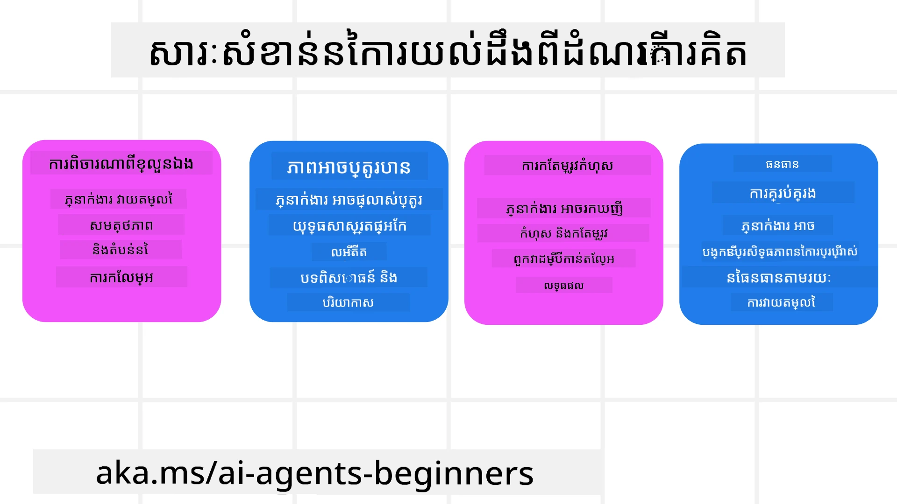
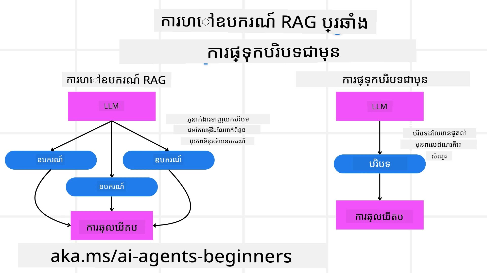

[](https://youtu.be/His9R6gw6Ec?si=3_RMb8VprNvdLRhX)

> _(ចុចលើរូបភាពខាងលើដើម្បីមើលវីដេអូរបស់មេរៀននេះ)_
# ការគិតដល់ការគិត (Metacognition) ក្នុងភ្នាក់ងារបញ្ញាសិប្បនិម្មិត (AI)

## ការណែនាំ

សូមស្វាគមន៍មកកាន់មេរៀនអំពីការគិតដល់ការគិតក្នុងភ្នាក់ងារបញ្ញាសិប្បនិម្មិត! ជំពូកនេះត្រូវបានរចនាសម្រាប់អ្នកដាក់ចិត្តចាប់ផ្តើមដែលចង់ដឹងថា ភ្នាក់ងារបញ្ញាសិប្បនិម្មិតអាចគិតអំពីដំណើរការគិតផ្ទាល់ខ្លួនរបស់ខ្លួនយ៉ាងដូចម្ដេច។ នៅចុងបញ្ចប់មេរៀននេះ អ្នកនឹងយល់ដឹងពីគំនិតសំខាន់ៗ និងមានឧទាហរណ៍អនុវត្តផ្សេងៗដែលអាចប្រើប្រាស់ក្នុងការរចនាភ្នាក់ងារបញ្ញាសិប្បនិម្មិតដែលមានការគិតដល់ការគិត។

## គោលបំណងសិក្សា

បន្ទាប់ពីបញ្ចប់មេរៀននេះ អ្នកនឹងអាច៖

1. យល់ដឹងអំពីផលប៉ះពាល់នៃការសង្វាក់ក្នុងដំណោះស្រាយភាពលក្ខណៈភ្នាក់ងារ។
2. ប្រើប្រាស់បច្ចេកទេសផែនការ និងវាយតម្លៃដើម្បីជួយភ្នាក់ងារដែលអាចកែលម្អខ្លួនឯងបាន។
3. បង្កើតភ្នាក់ងាររបស់អ្នកផ្ទាល់ដែលអាចគូសារកូដដើម្បីបំពេញភារៈការ។

## ការណែនាំអំពីការគិតដល់ការគិត

ការគិតដល់ការគិតមានន័យថា ដំណើរការគិតជាប់លំពែងដែលខ្ពស់ជាង ដោយប្រើការគិតអំពីដំណើរការគិតរបស់ខ្លួន។ សម្រាប់ភ្នាក់ងារបញ្ញាសិប្បនិម្មិត នេះមានន័យថា ពួកគេអាចវាយតម្លៃ និងកែប្រែសកម្មភាពរបស់ពួកគេដោយផ្អែកលើការយល់ដឹងខ្លួនឯង និងបទពិសោធន៍កន្លងមក។ ការគិតដល់ការគិត ឬ "គិតអំពីការគិត" គឺជាគំនិតសំខាន់មួយនៅក្នុងការអភិវឌ្ឍប្រព័ន្ធឥឡូវនកម្ម AI ដែលត្រូវបានគេបានឈ្មោះថាភ្នាក់ងារបញ្ញាសិប្បនិម្មិត។ វាអាចធ្វើអោយប្រព័ន្ធ AI មានការយល់ដឹងពីដំណើរការផ្ទៃក្នុងរបស់ខ្លួន និងអាចត្រួតពិនិត្យ, រៀបចំ, និងបត់បែនអាកប្បកិរិយារបស់ខ្លួនបាន តាមដូចដែលមនុស្សធ្វើពេលពួកយើងបានអានស្ថានការណ៍ឬមើលបញ្ហា។ ការយល់ដឹងខ្លួនឯងនេះអាចជួយឱ្យប្រព័ន្ធ AI ធ្វើសេចក្តីសម្រេចបានល្អប្រសើរជាងមុន ប្រមាណកំហុស និងបង្កើតប្រសិទ្ធភាពសមត្ថភាពរបស់ខ្លួននៅលើអំឡុងពេល- ចងខ្សែទៅវិញទៅមកនឹងតេស្ត Turing និងការចរចារពីថា AI នឹងត Distrito.

នៅក្នុងបរិបទប្រព័ន្ធ AI ប្រភេទភ្នាក់ងារ ការគិតដល់ការគិតអាចជួយដោះស្រាយបញ្ហាជាច្រើន ដូចជា៖
- ភាពទាន់ច្បាស់ : ប្រាកដថាកម្មវិធី AI អាចពន្យល់ពីដំណើរការគិត និងការសម្រេចចិត្ត។
- ការគិតសួរ និងសម្រេចចិត្ត : បង្កើនសមត្ថភាពរបស់ប្រព័ន្ធ AI ក្នុងការសម្រួលទិន្នន័យ និងធ្វើសេចក្តីសម្រេចចិត្តយ៉ាងត្រឹមត្រូវ។
- ការបត់បែន : អនុញ្ញាតឱ្យប្រព័ន្ធ AI កែសម្រួលខ្លួនទៅតាមបរិយាកាសថ្មី និងលក្ខខណ្ឌផ្លាស់ប្ដូរ។
- ការយល់ដឹងពីបរិយាកាស : បង្កើនភាពត្រឹមត្រូវក្នុងការទទួលស្គាល់ និងបកស្រាយទិន្នន័យពីបរិយាកាស។

### តើការគិតដល់ការគិតជាអ្វី?

ការគិតដល់ការគិត ឬ "គិតអំពីការគិត" គឺជាដំណើរការគិតដែលមានកម្រិតខ្ពស់ ដែលពាក់ព័ន្ធនឹងការយល់ដឹងខ្លួនឯង និងការត្រួតពិនិត្យដំណើរការគិតរបស់ខ្លួន។ នៅក្នុងវិស័យ AI ការគិតដល់ការគិតធ្វើឱ្យភ្នាក់ងារអាចវាយតម្លៃ និងបត់បែនយុទ្ធសាស្ត្រ និងសកម្មភាពរបស់ពួកគេ ដើម្បីធ្វើឱ្យមានសមត្ថភាពដោះស្រាយបញ្ហា និងធ្វើសេចក្តីសម្រេចចិត្តបានប្រសើរជាងមុន។ ដោយយល់ដឹងអំពីការគិតដល់ការគិត អ្នកអាចរចនាភ្នាក់ងារបញ្ញាសិប្បនិម្មិតដែលមិនត្រឹមតែមានបញ្ញាទេ ប៉ុន្តែមានសមត្ថភាពបត់បែន និងប្រសិទ្ធភាពផងដែរ។ ក្នុងការគិតដល់ការគិតពិតប្រាកដ អ្នកនឹងឃើញថា AI កំពុងបញ្ជាក់ការគិតរបស់ខ្លួនឯង។

ឧទាហរណ៍៖ “ខ្ញុំបានផ្តល់អាទិភាពលើសំបុត្រយន្តហោះថោក ក្រោយមកខ្ញុំគិតថាអាចមានការបាត់បង់សំបុត្រយន្តហោស្តររថ្នាក់ផ្ទាល់ ដូច្នេះខ្ញុំចង់ពិនិត្យម្តងទៀត”។
តាមដានពីរបៀប ឬហេតុផលដែលវាជ្រើសរើសផ្លូវមួយច្បាស់លាស់។
- កំណត់ចំណាំថាវាបានធ្វើកំហុសពីព្រោះវាអាស្រ័យលើចំណូលចិត្តអ្នកប្រើកាលពីមុនច្រើនពេក ដូច្នេះវាធ្វើការផ្លាស់ប្តូរយុទ្ធសាស្ត្រថាមិនត្រឹមតែផ្តល់អនុសាសន៍ចុងក្រោយទេ។
- វាយតម្លៃលំនាំដូចជា “នៅពេលដែលខ្ញុំឃើញអ្នកប្រើប្រាស់និយាយថា ‘ពោរពេញអ្នក’ ខ្ញុំគួរតែដកចេញពីកន្លែងទាក់ទាញខ្លះៗ និងយល់ថាវិធីជ្រើសរើស ‘កន្លែងទាក់ទាញដ៏លេចធ្លោ’ របស់ខ្ញុំបានខូចប្រសើរពេលវាធ្វើតម្រៀបតាមប្រជាប្រិយភាព”។

### សារៈសំខាន់នៃការគិតដល់ការគិតនៅក្នុងភ្នាក់ងារបញ្ញាសិប្បនិម្មित्त

ការគិតដល់ការគិតមានតួនាទីសំខាន់ក្នុងការរចនាភ្នាក់ងារបញ្ញាសិប្បនិម្មិតមានមូលហេតុជាច្រើន៖



- ការបញ្ច្រាស់ខ្លួនឯង៖ ភ្នាក់ងារអាចវាយតម្លៃសមត្ថភាពរបស់ខ្លួន និងកំណត់ចំណុចដែលត្រូវបង្កើតការកែលម្អ។
- សមត្ថភាពបត់បែន៖ ភ្នាក់ងារអាចប្តូរយុទ្ធសាស្ត្ររបស់ខ្លួនដោយផ្អែកលើបទពិសោធន៍កន្លង និងបរិយាកាសផ្លាស់ប្តូរ។
- ការកែលម្អកំហុស៖ ភ្នាក់ងារអាចរកឃើញ និងកែលម្អកំហុសដោយខ្លួនឯង ដើម្បីទទួលបានលទ្ធផលត្រឹមត្រូវជាងមុន។
- ការគ្រប់គ្រងប្រភពធនធាន៖ ភ្នាក់ងារអាចបង្កើតប្រសិទ្ធិភាពក្នុងការប្រើប្រាស់ប្រភពធនធានដូចជា ពេលវេលា និងថាមពលគណនានា ដោយមានការផែនការ និងវាយតម្លៃសកម្មភាព។

## ធាតុផ្សំរបស់ភ្នាក់ងារបញ្ញាសិប្បនិម្មិត

មុនពេលចូលរួមក្នុងដំណើរការគិតដល់ការគិត វាជាការសំខាន់ក្នុងការយល់ដឹងពីធាតុផ្សំមូលដ្ឋានរបស់ភ្នាក់ងារបញ្ញាសិប្បនិម្មិត។ ភ្នាក់ងារបញ្ញាសិប្បនិម្មិតទូទៅមាន៖

- បុគ្គលិកលក្ខណៈ៖ បុគ្គលិកលក្ខណៈ និងលក្ខណៈពិសេសរបស់ភ្នាក់ងារ ដែលកំណត់របៀបដែលវាសកម្មជាមួយអ្នកប្រើប្រាស់។
- ឧបករណ៍៖ សមត្ថភាព និងមុខងារដែលភ្នាក់ងារអាចអនុវត្តបាន។
- ជំនាញ៖ ប្រាជ្ញា និងជំនាញដែលភ្នាក់ងារកាន់កាប់។

ធាតុផ្សំទាំងនេះធ្វើការជាមួយគ្នាដើម្បីបង្កើត "ឯកតាជំនាញ" ដែលអាចអនុវត្តភារកិច្ចជាក់លាក់បាន។

**ឧទាហរណ៍**៖
សូមពិចារណាភ្នាក់ងារធ្វើដំណើរ សេវាកម្មភ្នាក់ងារដែលមិនត្រឹមតែនៃផែនការលំហែកំសាន្តរបស់អ្នកទេ ប៉ុន្តែថែមទាំងកែប្រែផ្លូវរបស់វាតាមទិន្នន័យពេលវេលាពិត និងបទពិសោធន៍ដំណើររបស់អតិថិជនកន្លងមក។

### ឧទាហរណ៍៖ ការគិតដល់ការគិតក្នុងសេវាកម្មភ្នាក់ងារធ្វើដំណើរ

សូមសន្មតថាអ្នកកំពុងរចនាសេវាកម្មភ្នាក់ងារធ្វើដំណើរដោយមាន AI ជាសាកល្បង។ ភ្នាក់ងារ "Travel Agent" នេះជួយអ្នកប្រើក្នុងការផែនការលំហែកំសាន្តរបស់ខ្លួន។ ដើម្បីបញ្ចូលការគិតដល់ការគិត Travel Agent ត្រូវតែវាយតម្លៃ និងកែប្រែសកម្មភាពដោយផ្អែកលើការយល់ដឹងខ្លួនឯង និងបទពិសោធន៍កន្លងមក។ នេះជារបៀបដែលការគិតដល់ការគិតអាចមានតួនាទី៖

#### កិច្ចការបច្ចុប្បន្ន

កិច្ចការបច្ចុប្បន្នគឺជួយអ្នកប្រើកំណត់ផែនការទៅទីក្រុងប៉ារីស។

#### ជំហានក្នុងការបញ្ចប់កិច្ចការ

1. **ប្រមូលចំណូលចិត្តអ្នកប្រើ**៖ សួរអ្នកប្រើអំពីកាលបរិច្ឆេទធ្វើដំណើរ ប្រាក់ចំណាយ ចំណាប់អារម្មណ៍ (ដូចជា សារមន្ទីរ ម្ហូប អាជីវកម្ម) និងតម្រូវការពិសេសណាមួយ។
2. **យកព័ត៌មាន**៖ ស្វែងរកជម្រើសសំបុត្រយន្តហោះ ទីស្នាក់នៅ កន្លែងទាក់ទាញ និងភោជនីយដ្ឋានដែលសមរម្យទៅនឹងចំណូលចិត្តអ្នកប្រើ។
3. **បង្កើតអនុសាសន៍**៖ ផ្តល់នូវផែនការផ្ទាល់ខ្លួនជាមួយព័ត៌មានសំបុត្រយន្តហោះ ការកក់សណ្ឋាគារ និងសកម្មភាពដែលបានផ្ដល់អនុសាសន៍។
4. **កែប្រែផ្អែកលើមតិយោបល់**៖ សួរមតិយោបល់ពីអ្នកប្រើអំពីអនុសាសន៍ និងធ្វើការកែប្រែដែលចាំបាច់។

#### ប្រភពធនធានដែលត្រូវការ

- ការចូលដំណើរការទិន្នន័យ​ការកក់សំបុត្រយន្តហោះ និងសណ្ឋាគារ។
- ព័ត៌មានអំពីកន្លែងទាក់ទាញ និងភោជនីយដ្ឋាននៅប៉ារីស។
- ទិន្នន័យមតិយោបល់អ្នកប្រើពីអន្តរកម្មមុនៗ។

#### បទពិសោធន៍ និងការបញ្ច្រាស់ខ្លួនឯង

Travel Agent ប្រើការគិតដល់ការគិតដើម្បីវាយតម្លៃសមត្ថភាពរបស់ខ្លួន និងរៀនពីបទពិសោធន៍កន្លងមក។ ឧទាហរណ៍៖

1. **វិភាគមតិយោបល់អ្នកប្រើ**៖ Travel Agent ពិនិត្យមើលមតិយោបល់អ្នកប្រើដើម្បីកំណត់ថាតើអនុសាសន៍ណាមួយដែលទទួលបានការពេញចិត្ត និងខុសប្លែក។ វាកែប្រែសំណើរនាពេលក្រោយទៅតាមលទ្ធផល។
2. **សមត្ថភាពបត់បែន**៖ ប្រសិនបើអ្នកប្រើបាននិយាយពីការមិនចូលចិត្តកន្លែងពោរពេញអ្នក Travel Agent នឹងជៀសវាងផ្ដល់អនុសាសន៍កន្លែងទេសចរណ៍ពេញនិយមនៅម៉ោងច្រើនមនុស្ស។
3. **កែលម្អកំហុស**៖ ប្រសិនបើ Travel Agent បានបង្កើតកំហុសនៅការកក់មុន ដូចជា ផ្ដល់អនុសាសន៍សណ្ឋាគារដែលបានចេញផុតកំណត់វា រៀនការត្រួតពិនិត្យភាពមានប្រយោជន៍ខ្ពស់មុនធ្វើអនុសាសន៍។

#### ឧទាហរណ៍សម្រាប់អ្នកអភិវឌ្ឍន៍

នេះគឺជាឧទាហរណ៍កូដសាមញ្ញរបស់ Travel Agent នៅពេលបញ្ចូលការគិតដល់ការគិត៖

```python
class Travel_Agent:
    def __init__(self):
        self.user_preferences = {}
        self.experience_data = []

    def gather_preferences(self, preferences):
        self.user_preferences = preferences

    def retrieve_information(self):
        # ស្វែងរកជើងហោះយន្ត សណ្ឋាគារ និងកន្លែងទេសចរណ៍ដោយផ្អែកលើយើមជម្រើស
        flights = search_flights(self.user_preferences)
        hotels = search_hotels(self.user_preferences)
        attractions = search_attractions(self.user_preferences)
        return flights, hotels, attractions

    def generate_recommendations(self):
        flights, hotels, attractions = self.retrieve_information()
        itinerary = create_itinerary(flights, hotels, attractions)
        return itinerary

    def adjust_based_on_feedback(self, feedback):
        self.experience_data.append(feedback)
        # វិភាគមតិយោបល់ និងកែប្រែលើការផ្តល់យោបល់ក្នុងអនាគត
        self.user_preferences = adjust_preferences(self.user_preferences, feedback)

# ឧទាហរណ៍នៃការប្រើប្រាស់
travel_agent = Travel_Agent()
preferences = {
    "destination": "Paris",
    "dates": "2025-04-01 to 2025-04-10",
    "budget": "moderate",
    "interests": ["museums", "cuisine"]
}
travel_agent.gather_preferences(preferences)
itinerary = travel_agent.generate_recommendations()
print("Suggested Itinerary:", itinerary)
feedback = {"liked": ["Louvre Museum"], "disliked": ["Eiffel Tower (too crowded)"]}
travel_agent.adjust_based_on_feedback(feedback)
```

#### ហេតុអ្វីបានជាការគិតដល់ការគិតមានសារៈសំខាន់

- **ការបញ្ច្រាស់ខ្លួនឯង**៖ ភ្នាក់ងារអាចវិភាគសមត្ថភាពរបស់ខ្លួន និងកំណត់ទីតាំងដែលត្រូវកែលម្អ។
- **សមត្ថភាពបត់បែន**៖ ភ្នាក់ងារអាចផ្លាស់ប្ដូរយុទ្ធសាស្រ្ដប្តេជ្ញានៅលើមតិយោបល់ និងលក្ខខណ្ឌផ្លាស់ប្ដូរ។
- **ការកែលម្អកំហុស**៖ ភ្នាក់ងារអាចរកឃើញ និងកែប្រសើរកំហុសដោយខ្លួនឯង។
- **ការគ្រប់គ្រងធនធាន**៖ ភ្នាក់ងារអាចបង្កើតប្រសិទ្ធភាពក្នុងការប្រើប្រាស់ធនធានដូចជា ពេលវេលា និងថាមពលគណនា។

ដោយបញ្ចូលការគិតដល់ការគិត Travel Agent អាចផ្តល់អនុសាសន៍ទេសចរណ៍ផ្ទាល់ខ្លួន និងត្រឹមត្រូវច្រើនជាងមុន ដែលធ្វើឱ្យមានបទពិសោធន៍អ្នកប្រើល្អប្រសើរជាងមុន។

---

## 2. ការផែនការ trong agents

ការផែនការ​គឺជា​ធាតុ​សំខាន់​ក្នុងអាកប្បកិរិយា​របស់​ភ្នាក់ងារ AI។ វារួមបញ្ចូល​ការរៀបចំ​ជំហាន​ដែលត្រូវការ​ដើម្បី​សម្រេច​គោលបំណង​មួយ ដោយ​អំពាវនាវ​ទីតាំង​បច្ចុប្បន្ន ប្រភព​ធនធាន និងឧបសគ្គ​មានសក្តានុពល។

### ធាតុផ្សំរបស់ការ​ផែនការ

- **កិច្ចការ​បច្ចុប្បន្ន**៖ កំណត់កិច្ចការ​យ៉ាងច្បាស់។
- **ជំហានក្នុងការ​បញ្ចប់​កិច្ចការ**៖ បំបែក​កិច្ចការ​ទៅជា​ជំហាន​ដែលគ្រប់គ្រងបាន។
- **ធនធាន​ដែល​ត្រូវការ**៖ កំណត់ធនធាន​ដែលចាំបាច់។
- **បទពិសោធន៍**៖ ប្រើប្រាស់បទពិសោធន៍កន្លងមក​ក្នុងការ​ផែនការ។

**ឧទាហរណ៍**៖
នេះជា​ជំហាន​ដែល Travel Agent ត្រូវចាប់ផ្តើម ដើម្បីជួយអ្នកប្រើធ្វើការ​ផែនការធ្វើដំណើរ​យ៉ាងមានប្រសិទ្ធភាព។

### ជំហានសម្រាប់ Travel Agent

1. **ប្រមូលចំណូលចិត្តអ្នកប្រើ**
   - សួរអ្នកប្រើប្រាស់អំពីព័ត៌មានសម្រាប់កាលបរិច្ឆេទធ្វើដំណើរ, ប្រាក់ចំណាយ, ចំណាប់អារម្មណ៍ និងតម្រូវការពិសេស។
   - ឧទាហរណ៍៖ "អ្នកគ្រោងធ្វើដំណើរពេលណា?" "បរិមាណប្រាក់ចំណាយរបស់អ្នកជាអ្វី?" "អ្នកចូលចិត្តសកម្មភាពអ្វីខ្លះនៅលំហែកំសាន្ត?"

2. **យកព័ត៌មាន**
   - ស្វែងរកជម្រើស​ដែលសមរម្យបំផុត ទៅតាមចំណូលចិត្តអ្នកប្រើ។
   - **សំបុត្រយន្តហោះ**៖ ស្វែងរកសំបុត្រយន្តហោះមានស្រាប់នៅក្នុងចំណាយ និងកាលបរិច្ឆេទដែលចូលចិត្ត។
   - **ទីស្នាក់នៅ**៖ រកសណ្ឋាគារឬអចលនទ្រព្យជួលដែលត្រូវនឹងចំណូលចិត្តក្នុងទីតាំង តម្លៃ និងសេវាកម្ម។
   - **កន្លែងទាក់ទាញ និងភោជនីយដ្ឋាន**៖ កំណត់កន្លែងទេសចរណ៍ សកម្មភាព និងម្ហូបអាហារដែលត្រូវនឹងចំណង់ចំណូលចិត្ត។

3. **បង្កើតអនុសាសន៍**
   - បង្រួមព័ត៌មានដែលបានយកជាមុខងារផ្ទាល់ខ្លួន។
   - ផ្តល់ព័ត៌មានដូចជាជម្រើសសំបុត្រ, ការកក់សណ្ឋាគារ និងសកម្មភាពណែនាំដោយអនុវត្តតាមចំណូលចិត្តអ្នកប្រើ។

4. **បង្ហាញផែនការដល់អ្នកប្រើ**
   - ចែករំលែកផែនការដែលបានផ្ដល់នោះជាមួយអ្នកប្រើ សម្រាប់ពិនិត្យមើល។
   - ឧទាហរណ៍៖ "នេះជាផែនការដែលបានផ្ដល់សម្រាប់ដំណើរទៅប៉ារីស រួមមានព័ត៌មានសំបុត្រ, ការកក់សណ្ឋាគារ និងបញ្ជីសកម្មភាព និងភោជនីយដ្ឋានផ្ដល់អនុសាសន៍។ សូមប្រាប់មតិយោបល់!"

5. **ប្រមូលមតិយោបល់**
   - សុំមតិយោបល់ពីអ្នកប្រើអំពីផែនការដែលបានផ្ដល់។
   - ឧទាហរណ៍៖ "អ្នកចូលចិត្តជម្រើសសំបុត្រមែនទេ?" "សណ្ឋាគារត្រឹមត្រូវសម្រាប់តម្រូវការរបស់អ្នកទេ?" "មានសកម្មភាពណាដែលអ្នកចង់បន្ថែម ឬដកចេញ?"

6. **កែប្រែផ្អែកលើមតិយោបល់**
   - កែប្រែផែនការដោយយោងទៅតាមមតិយោបល់អ្នកប្រើ។
   - ធ្វើការផ្លាស់ប្ដូរដែលចាំបាច់លើជម្រើសសំបុត្រ, ទីស្នាក់នៅ និងសកម្មភាពដើម្បីឱ្យសមរម្យជាងមុន។

7. **បញ្ជាក់ជាថ្មី**
   - បង្ហាញផែនការដែលបានកែសម្រួលទៅអ្នកប្រើសម្រាប់បញ្ជាក់ចុងក្រោយ។
   - ឧទាហរណ៍៖ "ខ្ញុំបានធ្វើការកែប្រែតាមមតិយោបល់របស់អ្នក។ នេះគឺជាផែនការថ្មី។ តើមានអ្វីប្រសើរទេ?"

8. **កក់សេវា និងបញ្ជាក់ការកក់**
   - បន្ទាប់ពីអ្នកប្រើយល់ព្រមលើផែនការ បន្តធ្វើដំណើរធ្វើការកក់សំបុត្រ, ទីស្នាក់នៅ និងសកម្មភាពដែលបានរៀបចំ។
   - ផ្ញើព័ត៌មានបញ្ជាក់ទៅអ្នកប្រើ។

9. **ផ្តល់ការគាំទ្រតាមដាន**
   - រៀបចំកន្លែងដែលអាចជួយអ្នកប្រើក្នុងការផ្លាស់ប្ដូរ ឬសំណើបន្ថែមមុន និងក្នុងអំឡុងដំណើរ។
   - ឧទាហរណ៍៖ "បើអ្នកត្រូវការជំនួយបន្ថែមនៅពេលធ្វើដំណើរ សូមទំនាក់ទំនងខ្ញុំនៅពេលណាក៏បាន!"

### ឧទាហរណ៍អន្តរកម្ម

```python
class Travel_Agent:
    def __init__(self):
        self.user_preferences = {}
        self.experience_data = []

    def gather_preferences(self, preferences):
        self.user_preferences = preferences

    def retrieve_information(self):
        flights = search_flights(self.user_preferences)
        hotels = search_hotels(self.user_preferences)
        attractions = search_attractions(self.user_preferences)
        return flights, hotels, attractions

    def generate_recommendations(self):
        flights, hotels, attractions = self.retrieve_information()
        itinerary = create_itinerary(flights, hotels, attractions)
        return itinerary

    def adjust_based_on_feedback(self, feedback):
        self.experience_data.append(feedback)
        self.user_preferences = adjust_preferences(self.user_preferences, feedback)

# ការប្រើប្រាស់ឧទាហរណ៍នៅក្នុងសំណើ booing
travel_agent = Travel_Agent()
preferences = {
    "destination": "Paris",
    "dates": "2025-04-01 to 2025-04-10",
    "budget": "moderate",
    "interests": ["museums", "cuisine"]
}
travel_agent.gather_preferences(preferences)
itinerary = travel_agent.generate_recommendations()
print("Suggested Itinerary:", itinerary)
feedback = {"liked": ["Louvre Museum"], "disliked": ["Eiffel Tower (too crowded)"]}
travel_agent.adjust_based_on_feedback(feedback)
```

## 3. ប្រព័ន្ធ RAG កែលម្អកំហុស

ជាមុនសិន យើងចាប់ផ្តើមដោយយល់ពីភាពខុសគ្នារវាងឧបករណ៍ RAG និងការផ្ទុកបរិបទជាមុន



### ថ្នាក់បង្កើតវចនានុក្រមជំនួយកំណត់បញ្ហា (Retrieval-Augmented Generation - RAG)

RAG សម្រុកប្រព័ន្ធ​ឆែកទិន្នន័យ​ជាមួយ​ម៉ូដែលបង្កើត។ នៅពេលមានការស្នើសុំ ប្រព័ន្ធ​ឆែកទិន្នន័យនឹងយកឯកសារឬទិន្នន័យលំដាប់ពាក់ព័ន្ធពីប្រភពខាងក្រៅ ហើយព័ត៌មានដែលបានយកនេះគឺប្រើដើម្បីបន្ថែមលើការបញ្ចូលទៅម៉ូដែលបង្កើត។ វាជួយឱ្យម៉ូដែលបង្កើតមានការឆ្លើយតបត្រឹមត្រូវ និងសមរម្យបរិបទ។

នៅក្នុងប្រព័ន្ធ RAG ភ្នាក់ងារទាញយកព័ត៌មានពាក់ព័ន្ធពីមូលដ្ឋានចំណេះដឹង ហើយប្រើវាដើម្បីបង្កើតចម្លើយ ឬសកម្មភាពដែលសមរម្យ។

### វិធីសាស្ត្រកែលម្អកំហុស RAG

វិធីសាស្ត្រកែរប្រព័ន្ធ RAG ទៅលើការប្រើបច្ចេកទេស RAG ដើម្បីកែប្រែកំហុស និងវាយតម្លៃភាពត្រឹមត្រូវនៃភ្នាក់ងារបញ្ញាសិប្បនិម្មិត។ វារួមបញ្ចូល៖

1. **បច្ចេកទេសការបញ្ចូនសេចក្តីដោយអារម្មណ៍**៖ ប្រើសេចក្តីបញ្ចូនជាក់លាក់ដើម្បីណែនាំភ្នាក់ងារទាញយកព័ត៌មានដែលពាក់ព័ន្ធ។
2. **ឧបករណ៍**៖ ដំណើរការអាល់ហ្គូరిఐធម៍ និងយន្តការដែលអាចអោយភ្នាក់ងារវាយតម្លៃភាពសមរម្យនៃព័ត៌មានដែលបានទាញ ហើយបង្កើតចម្លើយត្រឹមត្រូវ។
3. **ការវាយតម្លៃ**៖ បន្តត្រួតពិនិត្យសមត្ថភាពរបស់ភ្នាក់ងារ និងធ្វើការកែសម្រួលដើម្បីបង្កើនភាពត្រឹមត្រូវ និងប្រសិទ្ធភាព។

#### ឧទាហរណ៍៖ កែលម្អ RAG នៅក្នុងភ្នាក់ងារស្វែងរក

សូមគិតពីភ្នាក់ងារស្វែងរកដែលទាញព័ត៌មានពីបណ្តាញបណ្ដាញដើម្បីឆ្លើយសំណួររបស់អ្នកប្រើ។ វិធីសាស្ត្រកែរប្រព័ន្ធ RAG អាចរួមបញ្ចូល៖

1. **បច្ចេកទេសកែវាយតម្លៃ**៖ បង្កើតសំណួរស្វែងរកដោយយោងទៅតាមការបញ្ចូលរបស់អ្នកប្រើ។
2. **ឧបករណ៍**៖ ប្រើការបណ្តុះបណ្តាលភាសាធម្មជាតិ និងអាល់ហ្គូរីធម៍ម៉ាស៊ីនរៀនដើម្បីលំដាប់ និងច្រោះលទ្ធផលស្វែងរក។
3. **ការវាយតម្លៃ**៖ វិភាគមតិយោបល់អ្នកប្រើ ដើម្បីរកកំហុស និងកែលម្អព័ត៌មានដែលបានទាញយក។

### វិធីសាស្ត្រកែលម្អ RAG នៅក្នុងភ្នាក់ងារធ្វើដំណើរ

វិធីសាស្ត្រកែរប្រព័ន្ធ RAG (Retrieval-Augmented Generation) ជួយបង្កើនសមត្ថភាព AI ក្នុងការទាញយក និងបង្កើតព័ត៌មាន ខណៈពេលកែលម្អកំហុសណាមួយ។ ឲ្យយើងមើលថា Travel Agent អាចប្រើវិធីសាស្ត្រនេះដើម្បីផ្តល់អនុសាសន៍ទេសចរណ៍ត្រឹមត្រូវ និងសមរម្យបានយ៉ាងដូចម្តេច។

វាអ្នកមាន៖

- **បច្ចេកទេសការបញ្ចូនសេចក្តី៖** ប្រើសេចក្តីបញ្ចូនជាក់លាក់ដើម្បីណែនាំភ្នាក់ងារទាញយកព័ត៌មានពាក់ព័ន្ធ។
- **ឧបករណ៍៖** អនុវត្តអាល់ហ្គុរិធម៍ និងយន្តការដែលអាចអោយភ្នាក់ងារវាយតម្លៃភាពសមរម្យនៃព័ត៌មាន និងបង្កើតចម្លើយត្រឹមត្រូវ។
- **ការវាយតម្លៃ៖** បន្តបញ្ចេញការវាយតម្លៃលើសមត្ថភាព និងធ្វើការកែប្រែ ដើម្បីបង្កើនភាពត្រឹមត្រូវ និងប្រសិទ្ធភាព។

#### ជំហានក្នុងការអនុវត្តកែតម្រូវ RAG នៅក្នុង Travel Agent

1. **អន្តរកម្មអ្នកប្រើដំបូង**
   - Travel Agent ប្រមូលចំណូលចិត្តដំបូងពីអ្នកប្រើ ដូចជា ទីកន្លែងផែនដៅ កាលបរិច្ឆេទធ្វើដំណើរ ប្រាក់ចំណាយ និងចំណាប់អារម្មណ៍។
   - ឧទាហរណ៍៖

     ```python
     preferences = {
         "destination": "Paris",
         "dates": "2025-04-01 to 2025-04-10",
         "budget": "moderate",
         "interests": ["museums", "cuisine"]
     }
     ```

2. **ការទាញយកព័ត៌មាន**
   - Travel Agent ទាញយកព័ត៌មានអំពីសំបុត្រយន្តហោះ ទីស្នាក់នៅ កន្លែងទាក់ទាញ និងភោជនីយដ្ឋានដោយផ្អែកលើចំណូលចិត្តអ្នកប្រើ។
   - ឧទាហរណ៍៖

     ```python
     flights = search_flights(preferences)
     hotels = search_hotels(preferences)
     attractions = search_attractions(preferences)
     ```

3. **បង្កើតអនុសាសន៍ដំបូង**
   - Travel Agent ប្រើព័ត៌មានដែលបានទាញដើម្បីបង្កើតផែនការផ្ទាល់ខ្លួន។
   - ឧទាហរណ៍៖

     ```python
     itinerary = create_itinerary(flights, hotels, attractions)
     print("Suggested Itinerary:", itinerary)
     ```

4. **ប្រមូលមតិយោបល់ពីអ្នកប្រើ**
   - Travel Agent សុំមតិយោបល់ពីអ្នកប្រើ អំពីអនុសាសន៍ដំបូង។
   - ឧទាហរណ៍៖

     ```python
     feedback = {
         "liked": ["Louvre Museum"],
         "disliked": ["Eiffel Tower (too crowded)"]
     }
     ```

5. **ដំណើរការកែប្រែ RAG**
   - **បច្ចេកទេសការបញ្ចូនសេចក្តី៖** Travel Agent បង្កើតសំណួរស្វែងរកថ្មីៗ ដោយផ្អែកលើមតិយោបល់អ្នកប្រើ។
     - ឧទាហរណ៍៖

       ```python
       if "disliked" in feedback:
           preferences["avoid"] = feedback["disliked"]
       ```

   - **ឧបករណ៍៖** Travel Agent ប្រើអាល់ហ្គុរិធម៍ដើម្បីលំដាប់ និងច្រោះលទ្ធផលស្វែងរកថ្មីៗ ដោយផ្តោតលើភាពសមរម្យតាមមតិយោបល់។
     - ឧទាហរណ៍៖

       ```python
       new_attractions = search_attractions(preferences)
       new_itinerary = create_itinerary(flights, hotels, new_attractions)
       print("Updated Itinerary:", new_itinerary)
       ```

   - **ការវាយតម្លៃ៖** Travel Agent បន្តវាយតម្លៃភាពត្រឹមត្រូវ និងសមរម្យ នៃអនុសាសន៍របស់ខ្លួន ដោយវិភាគមតិយោបល់ និងធ្វើការកែប្រែចាំបាច់។
     - ឧទាហរណ៍៖

       ```python
       def adjust_preferences(preferences, feedback):
           if "liked" in feedback:
               preferences["favorites"] = feedback["liked"]
           if "disliked" in feedback:
               preferences["avoid"] = feedback["disliked"]
           return preferences

       preferences = adjust_preferences(preferences, feedback)
       ```

#### ឧទាហរណ៍ជាក់លាក់

នេះជាឧទាហរណ៍កូដ Python សាមញ្ញ នៃការបញ្ចូលវិធីសាស្ត្រកែតម្រូវ RAG ក្នុង Travel Agent៖

```python
class Travel_Agent:
    def __init__(self):
        self.user_preferences = {}
        self.experience_data = []

    def gather_preferences(self, preferences):
        self.user_preferences = preferences

    def retrieve_information(self):
        flights = search_flights(self.user_preferences)
        hotels = search_hotels(self.user_preferences)
        attractions = search_attractions(self.user_preferences)
        return flights, hotels, attractions

    def generate_recommendations(self):
        flights, hotels, attractions = self.retrieve_information()
        itinerary = create_itinerary(flights, hotels, attractions)
        return itinerary

    def adjust_based_on_feedback(self, feedback):
        self.experience_data.append(feedback)
        self.user_preferences = adjust_preferences(self.user_preferences, feedback)
        new_itinerary = self.generate_recommendations()
        return new_itinerary

# ការប្រើប្រាស់ឧទាហរណ៍
travel_agent = Travel_Agent()
preferences = {
    "destination": "Paris",
    "dates": "2025-04-01 to 2025-04-10",
    "budget": "moderate",
    "interests": ["museums", "cuisine"]
}
travel_agent.gather_preferences(preferences)
itinerary = travel_agent.generate_recommendations()
print("Suggested Itinerary:", itinerary)
feedback = {"liked": ["Louvre Museum"], "disliked": ["Eiffel Tower (too crowded)"]}
new_itinerary = travel_agent.adjust_based_on_feedback(feedback)
print("Updated Itinerary:", new_itinerary)
```

### ការផ្ទុកបរិបទជាមុន


ការផ្ទុកបរិបទជាមុនពេល (Pre-emptive Context Load) ត្រូវបានធ្វើឡើងដោយផ្ទុកបរិបទឬព័ត៌មានផ្ទៃពីរពាក់ព័ន្ធចូលទៅក្នុងម៉ូដែល មុនពេលដំណើរការសំណួរ។ នេះមានន័យថា ម៉ូដែលមានការចូលរួមដល់ព័ត៌មាននេះ ចាប់តាំងពីដំបូង ដែលអាចជួយឲ្យវា បង្កើតចម្លើយដែលមានព័ត៌មានបន្ថែមបាន ដោយមិនចាំបាច់រកព័ត៌មានបន្ថែមទៀតនៅឡើយ។

នេះជាឧទាហរណ៍សាមញ្ញមួយដែលបង្ហាញពីរបៀបដែលការផ្ទុកបរិបទជាមុនពេលអាចមើលឃើញសម្រាប់កម្មវិធីភ្នាក់ងារធ្វើដំណើរមួយនៅក្នុងភាសា Python:

```python
class TravelAgent:
    def __init__(self):
        # ពីរប្រាក់គោលដៅពេញនិយម និងព័ត៌មានរបស់ពួកវា
        self.context = {
            "Paris": {"country": "France", "currency": "Euro", "language": "French", "attractions": ["Eiffel Tower", "Louvre Museum"]},
            "Tokyo": {"country": "Japan", "currency": "Yen", "language": "Japanese", "attractions": ["Tokyo Tower", "Shibuya Crossing"]},
            "New York": {"country": "USA", "currency": "Dollar", "language": "English", "attractions": ["Statue of Liberty", "Times Square"]},
            "Sydney": {"country": "Australia", "currency": "Dollar", "language": "English", "attractions": ["Sydney Opera House", "Bondi Beach"]}
        }

    def get_destination_info(self, destination):
        # ទាញយកព័ត៌មានគោលដៅពីបរិបទដែលបានព្រមទុកហើយ
        info = self.context.get(destination)
        if info:
            return f"{destination}:\nCountry: {info['country']}\nCurrency: {info['currency']}\nLanguage: {info['language']}\nAttractions: {', '.join(info['attractions'])}"
        else:
            return f"Sorry, we don't have information on {destination}."

# ឧទាហរណ៍ការប្រើប្រាស់
travel_agent = TravelAgent()
print(travel_agent.get_destination_info("Paris"))
print(travel_agent.get_destination_info("Tokyo"))
```

#### ការពន្យល់

1. **ការចាប់ផ្តើម (`__init__` method)**៖ ថ្នាក់ `TravelAgent` បានផ្ទុកនូវវចនានុក្រម (dictionary) មានព័ត៌មានអំពីទីកន្លែងធ្វើដំណើរពេញនិយមដូចជា ភារីស៍ តូក្យូ ញូវយ៉ក និងស៊ីដនេ។ វចនានុក្រមនេះ រួមបញ្ចូលព័ត៌មានដូចជា ប្រទេស, រូបិយប័ណ្ណ, ភាសា និងអាគារសំខាន់ៗសម្រាប់ទីកន្លែងនីមួយៗ។

2. **ការទាញយកព័ត៌មាន (`get_destination_info` method)**៖ នៅពេលអ្នកប្រើសួរអំពីទីកន្លែងជាក់លាក់ មេធព្យាយាម `get_destination_info` នឹងយកព័ត៌មានដែលពាក់ព័ន្ធពីវចនានុក្រមដែលបានផ្ទុកជាមុន។

ដោយផ្ទុកបរិបទជាមុន កម្មវិធីភ្នាក់ងារធ្វើដំណើរអាចឆ្លើយតបក្នុងរយៈពេលភ្លាមៗ ដោយគ្មានការទាញយកព័ត៌មានពីប្រភពខាងក្រៅនៅពេលវាលាតដំណើរ។ នេះធ្វើឲ្យកម្មវិធីមានប្រសិទ្ធភាព និងឆ្លាតវៃ។

### ការចាប់ផ្តើមផែនការជាមួយគោលបំណងមុនពេលធ្វើការស្ទង់ទាន

ការចាប់ផ្តើមផែនការជាមួយគោលបំណង មានន័យថាចាប់ផ្តើមដោយមានគោលដៅ ឬលទ្ធផលដែលចង់ទទួលបានច្បាស់លាស់។ ដោយកំណត់គោលបំណងនេះជាមុន ម៉ូដែលអាចប្រើវាជាគោលរដ្ឋនាំផ្លូវនៅទូទាំងដំណើរការស្ទង់ទាន។ វាជួយធ្វើឲ្យ មានការធានាថា រៀងរាល់ដំណើរការស្ទង់ទាន នាំឲ្យទៅកាន់ការសម្រេចបានលទ្ធផលដែលចង់បាន ដោយធ្វើឲ្យដំណើរការនោះមានប្រសិទ្ធភាព និងមានគោលដៅច្បាស់។

នេះជាឧទាហរណ៍របៀបដែលអ្នកអាចចាប់ផ្តើមផែនការធ្វើដំណើរជាមួយគោលបំណងមុនពេលធ្វើការស្ទង់ទានសម្រាប់ភ្នាក់ងារធ្វើដំណើរមាន Python:

### ដំណើរការ

ភ្នាក់ងារធ្វើដំណើរត្រូវការរៀបចំផែនការទៅសំរាប់ការធ្វើដំណើរដែលផ្ទៀងផ្ទាត់តាមចំណង់ចំណូលចិត្តនិងថវិការបស់អតិថិជន។ គោលបំណងគឺ ដើម្បីបង្កើតបញ្ជីផែនការធ្វើដំណើរដែលបំពេញត្រូវនូវចំណង់ចំណូលចិត្តនិងថវិកា។

### ជំហាន

1. កំណត់ចំណង់ចំណូលចិត្ត និងថវិការបស់អតិថិជន។
2. ចាប់ផ្តើមផែនការដំបូង ដោយផ្អែកលើចំណង់ចំណូលចិត្តទាំងនោះ។
3. ស្ទង់ទានដើម្បីធ្វើឲ្យផែនការល្អឡើង ដោយបំពេញត្រូវនឹងចំណង់ចំណូលចិត្តនិងថវិការ។

#### កូដ Python

```python
class TravelAgent:
    def __init__(self, destinations):
        self.destinations = destinations

    def bootstrap_plan(self, preferences, budget):
        plan = []
        total_cost = 0

        for destination in self.destinations:
            if total_cost + destination['cost'] <= budget and self.match_preferences(destination, preferences):
                plan.append(destination)
                total_cost += destination['cost']

        return plan

    def match_preferences(self, destination, preferences):
        for key, value in preferences.items():
            if destination.get(key) != value:
                return False
        return True

    def iterate_plan(self, plan, preferences, budget):
        for i in range(len(plan)):
            for destination in self.destinations:
                if destination not in plan and self.match_preferences(destination, preferences) and self.calculate_cost(plan, destination) <= budget:
                    plan[i] = destination
                    break
        return plan

    def calculate_cost(self, plan, new_destination):
        return sum(destination['cost'] for destination in plan) + new_destination['cost']

# ឧទាហរណ៍ការប្រើប្រាស់
destinations = [
    {"name": "Paris", "cost": 1000, "activity": "sightseeing"},
    {"name": "Tokyo", "cost": 1200, "activity": "shopping"},
    {"name": "New York", "cost": 900, "activity": "sightseeing"},
    {"name": "Sydney", "cost": 1100, "activity": "beach"},
]

preferences = {"activity": "sightseeing"}
budget = 2000

travel_agent = TravelAgent(destinations)
initial_plan = travel_agent.bootstrap_plan(preferences, budget)
print("Initial Plan:", initial_plan)

refined_plan = travel_agent.iterate_plan(initial_plan, preferences, budget)
print("Refined Plan:", refined_plan)
```

#### ការពន្យល់កូដ

1. **ការចាប់ផ្តើម (`__init__` method)**៖ ថ្នាក់ `TravelAgent` ត្រូវបានចាប់ផ្តើមជាមួយបញ្ជីនៃគោលដៅធ្វើដំណើរអាចជ្រើសរើសបាន ដែលមានលក្ខណៈដូចជា ឈ្មោះ តម្លៃ និងប្រភេទសកម្មភាព។

2. **ចាប់ផ្តើមផែនការ (`bootstrap_plan` method)**៖ វិធីសាស្រ្តនេះបង្កើតផែនការធ្វើដំណើរដំបូង ដែលផ្អែកលើចំណង់ចំណូលចិត្ត និងថវិការបស់អតិថិជន។ វាជំនួសតាមបញ្ជីគោលដៅ និងបន្ថែមទៅផែនករបើវាត្រូវតាមចំណង់ចំណូលចិត្ត និងនៅក្នុងថវិកា។

3. **ផ្គូផ្គងចំណង់ចំណូលចិត្ត (`match_preferences` method)**៖ វិធីសាស្រ្តនេះពិនិត្យថាតើគោលដៅមួយ ត្រូវនឹងចំណង់ចំណូលចិត្តរបស់អតិថិជនទេឬទេ។

4. **ស្ទង់ទានផែនការ (`iterate_plan` method)**៖ វិធីសាស្រ្តនេះធ្វើឲ្យផែនការដំបូងកាន់តែល្អ ដោយព្យាយាមជំនួសគោលដៅនីមួយៗនៅក្នុងផែនករជាមួយការជ្រើសរើសល្អជាង គិតគូរចំពោះចំណង់ចំណូលចិត្តនិងការកំណត់ថវិកា។

5. **គណនាចំណាយ (`calculate_cost` method)**៖ វិធីសាស្រ្តនេះគណនាចំណាយសរុបនៃផែនការបច្ចុប្បន្ន រួមទាំងគោលដៅថ្មីមានសក្តានុពល។

#### ករណីប្រើប្រាស់ឧទាហរណ៍

- **ផែនការដំបូង**៖ ភ្នាក់ងារធ្វើដំណើរបង្កើតផែនការដំបូង ដែលស្របតាមចំណង់ចំណូលចិត្តក្នុងការមើលទេសភាព និងថវិកា $2000។
- **ផែនការលំអិត**៖ ភ្នាក់ងារធ្វើដំណើរស្ទង់ទានផែនការ ដើម្បីបង្កើតផែនការល្អជាង តាមចំណង់ចំណូលចិត្ត និងថវិការ។

ដោយចាប់ផ្តើមផែនការជាមួយគោលបំណងច្បាស់លាស់ (ដូចជា ការបំពេញត្រូវនឹងអារម្មណ៍រីករាយរបស់អតិថិជន) និងធ្វើការស្ទង់ទានបន្ថែមសម្រាប់កែលម្អផែនការ ភ្នាក់ងារធ្វើដំណើរអាចបង្កើតផែនការធ្វើដំណើរផ្ទាល់ខ្លួន និងប្រសើរឡើងសម្រាប់អតិថិជន។ វិធីសាស្រ្តនេះធានាថា ផែនការធ្វើដំណើរនេះនឹងសម្របសម្រួលទៅតាមចំណង់ចំណូលចិត្ត និងថវិការដែលបានកំណត់ពីដំបូង និងមានការធ្វើឲ្យប្រសើរឡើងក្នុងរៀងរាល់ដំណើរការ។

### ការប្រើប្រាស់ LLM សម្រាប់ចាត់ថ្នាក់ឡើងវិញ និងគណនាចំណាត់ថ្នាក់

ម៉ូដែលភាសាធំ (Large Language Models - LLMs) អាចត្រូវបានប្រើសម្រាប់ចាត់ថ្នាក់ឡើងវិញ និងគណនាចំណាត់ថ្នាក់ ដោយវាយតម្លៃពីភាពពាក់ព័ន្ធ និងគុណភាពរបស់ឯកសារឬចម្លើយដែលបានទាញយក ឬបង្កើតឡើង។ ខាងក្រោមជារបៀបដែលវាធ្វើការជាមួយគ្នា៖

**ការទាញយក:** ជំហានដំបូងនៃការទាញយក គឺយកឯកសារឬចម្លើយដែលអាចជាប់ពាក់ព័ន្ធដោយផ្អែកលើសំណួរ។

**ចាត់ថ្នាក់ឡើងវិញ:** LLM វាយតម្លៃលើឯកសារឫចម្លើយទាំងនេះ ហើយចាត់ថ្នាក់ឡើងវិញតាមភាពពាក់ព័ន្ធ និងគុណភាព។ ជំហាននេះធានាថា ព័ត៌មានដែលពាក់ព័ន្ធ និងមានគុណភាពខ្ពស់បង្ហាញមុន។

**គណនាចំណាត់ថ្នាក់:** LLM ផ្តល់ពិន្ទុចំណាត់ថ្នាក់នីមួយៗ បង្ហាញពីភាពពាក់ព័ន្ធ និងគុណភាពរបស់វា។ វាជួយក្នុងការជ្រើសរើសចម្លើយ ឬឯកសារល្អបំផុតសម្រាប់អ្នកប្រើ។

ដោយប្រើប្រាស់ LLM សម្រាប់ចាត់ថ្នាក់ឡើងវិញ និងគណនាចំណាត់ថ្នាក់ ប្រព័ន្ធអាចផ្តល់ព័ត៌មានដែលត្រឹមត្រូវ និងពាក់ព័ន្ធបន្ថែមជាងមុន ដូច្នេះធ្វើឲ្យបទពិសោធន៍របស់អ្នកប្រើកាន់តែប្រសើរឡើង។

នេះជាឧទាហរណ៍របៀបដែលភ្នាក់ងារធ្វើដំណើរអាចប្រើម៉ូដែលភាសាធំ (LLM) សម្រាប់ចាត់ថ្នាក់ឡើងវិញ និងគណនាចំណាត់ថ្នាក់គោលដៅធ្វើដំណើរទៅតាមចំណង់ចំណូលចិត្តរបស់អ្នកប្រើនៅក្នុង Python:

#### ដំណើរការ - ដំណើរតាមចំណង់ចំណូលចិត្ត

ភ្នាក់ងារធ្វើដំណើរចង់ផ្តល់អនុសាសន៍គោលដៅធ្ងន់ធ្ងរដែលល្អបំផុតទៅអតិថិជន ដោយផ្អែកលើយ៉ាងជាក់លាក់ទៅតាមចំណង់ចំណូលចិត្តរបស់ពួកគេ។ LLM នឹងជួយចាត់ថ្នាក់ឡើងវិញ និងគណនាចំណាត់ថ្នាក់គោលដៅដើម្បីធានាថាជម្រើសដែលពាក់ព័ន្ធបំផុតត្រូវបានបង្ហាញ។

#### ជំហាន៖

1. របុកចំណង់ចំណូលចិត្តអ្នកប្រើ។
2. ទាញយកបញ្ជីគោលដៅធ្វើដំណើរអាចជ្រើសរើសបាន។
3. ប្រើ LLM ដើម្បីចាត់ថ្នាក់ឡើងវិញ និងគណនាចំណាត់ថ្នាក់គោលដៅដោយផ្អែកលើចំណង់ចំណូលចិត្តអ្នកប្រើ។

នេះជារបៀបដែលអ្នកអាចធ្វើឲ្យឧទាហរណ៍មុននេះប្រើប្រាស់សេវាកម្ម Azure OpenAI:

#### ការទាមទារ

1. អ្នកត្រូវមានការជាវសេវាកម្ម Azure។
2. បង្កើតធនធាន Azure OpenAI ហើយយកកូដ API របស់អ្នក។

#### កូដ Python ឧទាហរណ៍

```python
import requests
import json

class TravelAgent:
    def __init__(self, destinations):
        self.destinations = destinations

    def get_recommendations(self, preferences, api_key, endpoint):
        # បង្កើតការជំរុញសម្រាប់ Azure OpenAI
        prompt = self.generate_prompt(preferences)
        
        # កំណត់ក្បាលនិងផayload សម្រាប់សំណើ
        headers = {
            'Content-Type': 'application/json',
            'Authorization': f'Bearer {api_key}'
        }
        payload = {
            "prompt": prompt,
            "max_tokens": 150,
            "temperature": 0.7
        }
        
        # ហៅ API Azure OpenAI ដើម្បីទទួលបានគោលដៅដែលបានរៀបចំឱ្យឡើងវិញនិងបានពិន្ទុ
        response = requests.post(endpoint, headers=headers, json=payload)
        response_data = response.json()
        
        # ដកយកនិងសងវិញការណែនាំ
        recommendations = response_data['choices'][0]['text'].strip().split('\n')
        return recommendations

    def generate_prompt(self, preferences):
        prompt = "Here are the travel destinations ranked and scored based on the following user preferences:\n"
        for key, value in preferences.items():
            prompt += f"{key}: {value}\n"
        prompt += "\nDestinations:\n"
        for destination in self.destinations:
            prompt += f"- {destination['name']}: {destination['description']}\n"
        return prompt

# ឧទាហរណ៍ការប្រើប្រាស់
destinations = [
    {"name": "Paris", "description": "City of lights, known for its art, fashion, and culture."},
    {"name": "Tokyo", "description": "Vibrant city, famous for its modernity and traditional temples."},
    {"name": "New York", "description": "The city that never sleeps, with iconic landmarks and diverse culture."},
    {"name": "Sydney", "description": "Beautiful harbour city, known for its opera house and stunning beaches."},
]

preferences = {"activity": "sightseeing", "culture": "diverse"}
api_key = 'your_azure_openai_api_key'
endpoint = 'https://your-endpoint.com/openai/deployments/your-deployment-name/completions?api-version=2022-12-01'

travel_agent = TravelAgent(destinations)
recommendations = travel_agent.get_recommendations(preferences, api_key, endpoint)
print("Recommended Destinations:")
for rec in recommendations:
    print(rec)
```

#### ពន្យល់កូដ - ប្រើសម្រាប់បោះបង់ចំណង់ចំណូលចិត្ត

1. **ការចាប់ផ្តើម**៖ ថ្នាក់ `TravelAgent` ត្រូវបានចាប់ផ្តើមជាមួយបញ្ជីគោលដៅធ្វើដំណើរអាចជ្រើសរើសបាន ដែលមានលក្ខណៈដូចជា ឈ្មោះ និងការពិពណ៌នា។

2. **ការទទួលបានអនុសាសន៍ (`get_recommendations` method)**៖ វិធីសាស្រ្តនេះបង្កើតនូវប្រអប់បញ្ចូល (prompt) សម្រាប់សេវាកម្ម Azure OpenAI ដោយផ្អែកលើចំណង់ចំណូលចិត្តអ្នកប្រើ ហើយធ្វើសំណើ HTTP POST ទៅ API Azure OpenAI ដើម្បីទទួលបានគោលដៅធ្វើដំណើរដែលបានចាត់ថ្នាក់ឡើងវិញ និងគណនាចំណាត់ថ្នាក់។

3. **បង្កើតប្រអប់បញ្ចូល (`generate_prompt` method)**៖ វិធីសាស្រ្តនេះបង្កើតប្រអប់បញ្ចូលសម្រាប់ Azure OpenAI រួមមានចំណង់ចំណូលចិត្តរបស់អ្នកប្រើ និងបញ្ជីគោលដៅ។ ប្រអប់បញ្ចូលនេះណែនាំម៉ូដែលឲ្យចាត់ថ្នាក់ឡើងវិញ និងគណនាចំណាត់ថ្នាក់គោលដៅដោយផ្អែកលើចំណង់ចំណូលចិត្ត។

4. **ហៅ API**៖ បណ្ណាល័យ `requests` ត្រូវបានប្រើដើម្បីធ្វើសំណើ HTTP POST ទៅចុងបញ្ចប់ API Azure OpenAI។ ផ្លាស់ប្តូរនឹងមានគោលដៅធ្វើដំណើរដែលបានចាត់ថ្នាក់ឡើងវិញ និងគណនាចំណាត់ថ្នាក់។

5. **ករណីប្រើប្រាស់ឧទាហរណ៍**៖ ភ្នាក់ងារធ្វើដំណើររួចហើយប្រមូលចំណង់ចំណូលចិត្តអ្នកប្រើ (ដូចជា ចំណាប់អារម្មណ៍ក្នុងការមើលទេសភាព និងវប្បធម៌នានា) ហើយប្រើសេវាកម្ម Azure OpenAI ដើម្បីទទួលបានអនុសាសន៍ដែលបានចាត់ថ្នាក់ឡើងវិញ និងគណនាចំណាត់ថ្នាក់សម្រាប់គោលដៅធ្វើដំណើរ។

សូមប្រាកដថាប្ដូរ `your_azure_openai_api_key` ជាកូដ API របស់ Azure OpenAI របស់អ្នក និង `https://your-endpoint.com/...` ជាអាសយដ្ឋាន URL ចុងបញ្ចប់ពិតរបស់ការតំឡើង Azure OpenAI របស់អ្នក។

ដោយប្រើប្រាស់ LLM សម្រាប់ចាត់ថ្នាក់ឡើងវិញ និងគណនាចំណាត់ថ្នាក់ ភ្នាក់ងារធ្វើដំណើរអាចផ្តល់អនុសាសន៍ផ្ទាល់ខ្លួន និងពាក់ព័ន្ធបានល្អជាងសម្រាប់អតិថិជន បង្កើនបទពិសោធន៍សរុបរបស់ពួកគេ។

### RAG: បច្ចេកទេសតម្រងនៃការបង្កើតឆ្លេីយ vs ឧបករណ៍

ការបង្កើតឆ្លើយបន្ថែមដោយការទាញយក (Retrieval-Augmented Generation - RAG) អាចមានទាំងជាបច្ចេកទេសតម្រងនៃការបង្កើតឆ្លើយ និងជាឧបករណ៍មួយក្នុងការអភិវឌ្ឍភ្នាក់ងារបញ្ញាព័ត៌មាន (AI agents)។ ការយល់ដឹងពីភាពខុសគ្នារវាងពីរអាចជួយអោយអ្នកប្រើ RAG បានប្រសើរជាងមុននៅក្នុងគម្រោងរបស់អ្នក។

#### RAG ជាបច្ចេកទេសតម្រងឆ្លើយ

**អ្វីទៅជាវា?**

- ជាបច្ចេកទេសតម្រងខ្លឹមសារ RAG រួមមានការបង្កើតសំណួរឬប្រអប់បញ្ចូលជាក់លាក់ ដើម្បីណែនាំការទាញយកព័ត៌មានពាក់ព័ន្ធពីឯកសារទូលំទូលាយ ឬមូលដ្ឋានទិន្នន័យ។ ព័ត៌មាននេះបន្ទាប់មកត្រូវបានប្រើដើម្បីបង្កើតចម្លើយ ឬសកម្មភាព។

**របៀបដែលវាធ្វើការ:**

1. **បង្កើតប្រអប់បញ្ចូល**៖ បង្កើតសំណួរឬប្រអប់បញ្ចូលដែលមានរចនាសម្ព័ន្ធល្អ តាមតម្រូវការការងារ ឬវាយតម្លៃពីអ្នកប្រើ។
2. **ទាញយកព័ត៌មាន**៖ ប្រើប្រអប់បញ្ចូលដើម្បីស្វែងរកទិន្នន័យពាក់ព័ន្ធពីមូលដ្ឋានចំណេះដឹង ឬសំណុំទិន្នន័យដែលមានពីមុន។
3. **បង្កើតចម្លើយ**៖ លាយបញ្ចូលព័ត៌មានដែលបានទាញយកជាមួយម៉ូដែល AI បង្កើតឆ្លើយដើម្បីបង្កើតចម្លើយពេញលេញ និងសមរម្យ។

**ឧទាហរណ៍ក្នុងភ្នាក់ងារធ្វើដំណើរ**៖

- បញ្ចូលអ្នកប្រើ៖ "ខ្ញុំចង់ទៅមើលប្រវត្តិសាស្ត្រនៅភារីស៍។"
- ប្រអប់បញ្ចូល៖ "ស្វែងរកប្រតិទិនប្រាសាទក្នុងភារីស៍។"
- ព័ត៌មានដែលបានទាញយក៖ ព័ត៌មានអំពីសារមន្ទីរ Louvre, Musée d'Orsay, ល។  
- ចម្លើយបង្កើត៖ "នេះជាសារមន្ទីរពិសេសមួយចំនួននៅភារីស៍៖ សារមន្ទីរ Louvre, Musée d'Orsay និង Centre Pompidou។"

#### RAG ជាឧបករណ៍

**អ្វីទៅជាវា?**

- ជាឧបករណ៍ RAG គឺជាប្រព័ន្ធរួមបញ្ចូលដែលបង្កើតស្វ័យប្រវត្តិនៅក្នុងដំណើរការទាញយក និងបង្កើតចម្លើយ ធ្វើឲ្យក្រុមអ្នកអភិវឌ្ឍ អាចអនុវត្តន៍មុខងារពិបាក ដោយគ្មានការតម្រូវឲ្យបង្កើតប្រអប់បញ្ចូលដោយដៃនៅរាល់សំណួរ។

**របៀបដែលវាធ្វើការ:**

1. **ការរួមបញ្ចូល**៖ បញ្ចូល RAG នៅក្នុងសំណង់ស្ថាបត្យកម្មរបស់ភ្នាក់ងារបញ្ញាព័ត៌មាន ដើម្បីអនុញ្ញាតឲ្យវាដោះស្រាយការទាញយក និងការបង្កើតចម្លើយដោយស្វ័យប្រវត្តិ។
2. **ស្វ័យប្រវត្តិកម្ម**៖ ឧបករណ៍នេះគ្រប់គ្រងដំណើរការទាំងមូល ពីការទទួលសំណួរពីអ្នកប្រើ ទៅការបង្កើតចម្លើយ ច្បាស់លាស់ដោយគ្មានការតម្រូវបញ្ចូលប្រអប់បញ្ចូលសម្រាប់រៀងរាល់ជំហាន។
3. **ប្រសិទ្ធភាព**៖ ធ្វើឲ្យកាន់តែប្រសើរឡើងក្នុងការប្រតិបត្តិការដោយបង្កើតដំណើរការទាញយក និងបង្កើតចម្លើយឲ្យរលូន ប្រកបដោយភាពឆាប់រហ័ស និងត្រឹមត្រូវ។

**ឧទាហរណ៍ក្នុងភ្នាក់ងារធ្វើដំណើរ**៖

- បញ្ចូលអ្នកប្រើ៖ "ខ្ញុំចង់ទៅមើលប្រវត្តិសាស្ត្រនៅភារីស៍។"
- ឧបករណ៍ RAG៖ ទាញយកព័ត៌មានអំពីសារមន្ទីរនានា ហើយបង្កើតចម្លើយដោយស្វ័យប្រវត្តិ។
- ចម្លើយបង្កើត៖ "នេះជាសារមន្ទីរពិសេសមួយចំនួននៅភារីស៍៖ សារមន្ទីរ Louvre, Musée d'Orsay និង Centre Pompidou។"

### ការប្រៀបធៀប

| អំពីមុខ                     | បច្ចេកទេសតម្រងចម្លើយ                                    | ឧបករណ៍                                               |
|----------------------------|------------------------------------------------------------|--------------------------------------------------------|
| **ដោយដៃ vs ស្វ័យប្រវត្តិ** | ការបង្កើតប្រអប់បញ្ចូលដោយដៃសម្រាប់រៀងរាល់សំណួរ។       | ដំណើរការស្វ័យប្រវត្តិសម្រាប់ការទាញយក និងបង្កើតចម្លើយ។   |
| **ការគ្រប់គ្រង**             | ផ្តល់ការគ្រប់គ្រងច្រើនជាងលើដំណើរការទាញយក។           | ខ្សែដំណើរការរត់រលូន និងស្វ័យប្រវត្តិលើការទាញយក និងបង្កើត។ |
| **ភាពបត់បែន**               | អនុញ្ញាតប្រអប់បញ្ចូលផ្ទាល់ខ្លួនផ្អែកលើតម្រូវការពិសេស។     | មានប្រសិទ្ធភាពសម្រាប់ការអនុវត្តវែងឆ្ងាយជាទូទៅ។               |
| **ភាពស្មុគស្មាញ**             | តម្រូវឲ្យបង្កើត និងកែប្រែប្រអប់បញ្ចូលបន្តបន្ទាប់។         | ងាយស្រួលក្នុងការរួមបញ្ចូលក្នុងស្ថាបត្យកម្មរបស់ភ្នាក់ងារ AI។       |

### ឧទាហរណ៍អនុវត្តន៍

**ឧទាហរណ៍បច្ចេកទេសតម្រង:**

```python
def search_museums_in_paris():
    prompt = "Find top museums in Paris"
    search_results = search_web(prompt)
    return search_results

museums = search_museums_in_paris()
print("Top Museums in Paris:", museums)
```

**ឧទាហរណ៍ឧបករណ៍:**

```python
class Travel_Agent:
    def __init__(self):
        self.rag_tool = RAGTool()

    def get_museums_in_paris(self):
        user_input = "I want to visit museums in Paris."
        response = self.rag_tool.retrieve_and_generate(user_input)
        return response

travel_agent = Travel_Agent()
museums = travel_agent.get_museums_in_paris()
print("Top Museums in Paris:", museums)
```

### ការវាយតម្លៃពីភាពពាក់ព័ន្ធ

ការវាយតម្លៃពីភាពពាក់ព័ន្ធគឺជារឿងសំខាន់មួយសម្រាប់ប្រសិទ្ធិភាពរបស់ភ្នាក់ងារបញ្ញាព័ត៌មាន។ វាធានាថាព័ត៌មានដែលបានទាញយក និងបង្កើតដោយភ្នាក់ងារនោះសមស្របត្រឹមត្រូវ ត្រឹមត្រូវ និងមានប្រយោជន៍ចំពោះអ្នកប្រើ។ មកស្វែងយល់ពីរបៀបវាយតម្លៃភាពពាក់ព័ន្ធនៅក្នុងភ្នាក់ងារបញ្ញាព័ត៌មាន រួមនឹងឧទាហរណ៍និងបច្ចេកទេសពិតប្រាកដ។

#### គំនិតស្នូលនៅក្នុងការវាយតម្លៃពីភាពពាក់ព័ន្ធ

1. **ការយល់ដឹងពីបរិបទ**៖
   - ភ្នាក់ងារត្រូវយល់ពីបរិបទនៃសំណួរអ្នកប្រើ ដើម្បីទាញយក និងបង្កើតព័ត៌មានដែលពាក់ព័ន្ធ។
   - ឧទាហរណ៍៖ ប្រសិនបើអ្នកប្រើសួរថា "ភោជនីយដ្ឋានល្អបំផុតនៅភារីស៍" ភ្នាក់ងារត្រូវពិចារណាចំពោះចំណង់ចំណូលចិត្តរបស់អ្នកប្រើ ដូចជា ប្រភេទម្ហូប និងថវិកា។

2. **ភាពត្រឹមត្រូវ**៖
   - ព័ត៌មានដែល ផ្តល់ដោយភ្នាក់ងារត្រូវតែមេត្តត្រឹមត្រូវ និងទាន់សម័យ។
   - ឧទាហរណ៍៖ បញ្ជាក់ភោជនីយដ្ឋានដែលបើកដំណើរការបច្ចុប្បន្ន ដែលមានការវាយតម្លៃល្អ មិនមែនជ្រើសរើសតំបន់ដែលបានបិទ ឬចាស់ទុំ។

3. **ចេតនារបស់អ្នកប្រើ**៖
   - ភ្នាក់ងារត្រូវបកស្រាយចេតនារបស់អ្នកប្រើខាងក្រោយសំណួរដើម្បីផ្តល់ព័ត៌មានដែលពាក់ព័ន្ធច្រើនបំផុត។
   - ឧទាហរណ៍៖ ប្រសិនបើអ្នកប្រើសួរថា "សណ្ឋាគារសមរម្យថវិការ" ភ្នាក់ងារត្រូវចាត់អាទិត្យជម្រើសដែលប្លែកសមរម្យ។

4. **សៀវភៅមតិយោបល់**៖
   - ការប្រមូល និងវិភាគមតិយោបល់អ្នកប្រើជាបន្តបន្ទាប់ជួយឲ្យភ្នាក់ងារកែលម្អដំណើរការវាយតម្លៃពីភាពពាក់ព័ន្ធរបស់វា។
   - ឧទាហរណ៍៖ រួមបញ្ចូលការវាយតម្លៃអតិថិជន និងមតិយោបល់លើអនុសាសន៍មុនៗ ដើម្បីធ្វើឲ្យចម្លើយនៅពេលក្រោយកាន់តែប្រសើរឡើង។

#### បច្ចេកទេសពិតប្រាកដសម្រាប់ការវាយតម្លៃពីភាពពាក់ព័ន្ធ

1. **ការវាយតម្លៃភាពពាក់ព័ន្ធ៖**
   - ផ្ដល់ពិន្ទុភាពពាក់ព័ន្ធចំពោះមួយធាតុដែលបានទាញយក ដោយលើកតម្លៃថាតើវាត្រូវនឹងសំណួរនិងចំណង់ចំណូលចិត្តរបស់អ្នកប្រើប៉ុណ្ណា។
   - ឧទាហរណ៍៖

     ```python
     def relevance_score(item, query):
         score = 0
         if item['category'] in query['interests']:
             score += 1
         if item['price'] <= query['budget']:
             score += 1
         if item['location'] == query['destination']:
             score += 1
         return score
     ```

2. **ការចម្រាញ់ និងចាត់ថ្នាក់:** 
   - ចម្រាញ់ធាតុដែលមិនពាក់ព័ន្ធ និងចាត់ថ្នាក់ធាតុនៅសល់ ដោយផ្អែកលើពិន្ទុភាពពាក់ព័ន្ធ។
   - ឧទាហរណ៍៖

     ```python
     def filter_and_rank(items, query):
         ranked_items = sorted(items, key=lambda item: relevance_score(item, query), reverse=True)
         return ranked_items[:10]  # បញ្ជូនវិញ ១០ របស់ធាតុដែលពាក់ព័ន្ធច្រើនបំផុត
     ```

3. **ការដោះស្រាយភាសាធម្មជាតិ (NLP)**៖
   - ប្រើបច្ចេកទេស NLP ដើម្បីយល់ពីសំណួរអ្នកប្រើ ហើយទាញយកព័ត៌មានដែលពាក់ព័ន្ធ។
   - ឧទាហរណ៍៖

     ```python
     def process_query(query):
         # ប្រើ NLP ដើម្បីយកព័ត៌មានសំខាន់ពីសំណួររបស់អ្នកប្រើប្រាស់
         processed_query = nlp(query)
         return processed_query
     ```

4. **បញ្ចូលមតិយោបល់អ្នកប្រើ**៖
   - ប្រមូលមតិយោបល់ពីអ្នកប្រើលើអនុសាសន៍ និងប្រើវា ដើម្បីកែប្រែការវាយតម្លៃពីភាពពាក់ព័ន្ធក្នុងពេលអនាគត។
   - ឧទាហរណ៍៖

     ```python
     def adjust_based_on_feedback(feedback, items):
         for item in items:
             if item['name'] in feedback['liked']:
                 item['relevance'] += 1
             if item['name'] in feedback['disliked']:
                 item['relevance'] -= 1
         return items
     ```

#### ឧទាហរណ៍៖ ការវាយតម្លៃពីភាពពាក់ព័ន្ធនៅក្នុងភ្នាក់ងារធ្វើដំណើរ

នេះជាឧទាហរណ៍ពិតប្រាកដមួយ របៀបដែលភ្នាក់ងារធ្វើដំណើរអាចវាយតម្លៃពីភាពពាក់ព័ន្ធនៃអនុសាសន៍ធ្វើដំណើរ៖

```python
class Travel_Agent:
    def __init__(self):
        self.user_preferences = {}
        self.experience_data = []

    def gather_preferences(self, preferences):
        self.user_preferences = preferences

    def retrieve_information(self):
        flights = search_flights(self.user_preferences)
        hotels = search_hotels(self.user_preferences)
        attractions = search_attractions(self.user_preferences)
        return flights, hotels, attractions

    def generate_recommendations(self):
        flights, hotels, attractions = self.retrieve_information()
        ranked_hotels = self.filter_and_rank(hotels, self.user_preferences)
        itinerary = create_itinerary(flights, ranked_hotels, attractions)
        return itinerary

    def filter_and_rank(self, items, query):
        ranked_items = sorted(items, key=lambda item: self.relevance_score(item, query), reverse=True)
        return ranked_items[:10]  # ដំណើរការផ្តល់វិញ ១០ ធាតុដែលពាក់ព័ន្ធខ្ពស់បំផុត

    def relevance_score(self, item, query):
        score = 0
        if item['category'] in query['interests']:
            score += 1
        if item['price'] <= query['budget']:
            score += 1
        if item['location'] == query['destination']:
            score += 1
        return score

    def adjust_based_on_feedback(self, feedback, items):
        for item in items:
            if item['name'] in feedback['liked']:
                item['relevance'] += 1
            if item['name'] in feedback['disliked']:
                item['relevance'] -= 1
        return items

# ឧទាហរណ៍ការប្រើប្រាស់
travel_agent = Travel_Agent()
preferences = {
    "destination": "Paris",
    "dates": "2025-04-01 to 2025-04-10",
    "budget": "moderate",
    "interests": ["museums", "cuisine"]
}
travel_agent.gather_preferences(preferences)
itinerary = travel_agent.generate_recommendations()
print("Suggested Itinerary:", itinerary)
feedback = {"liked": ["Louvre Museum"], "disliked": ["Eiffel Tower (too crowded)"]}
updated_items = travel_agent.adjust_based_on_feedback(feedback, itinerary['hotels'])
print("Updated Itinerary with Feedback:", updated_items)
```

### ស្វែងរកតាមចេតនា

ការស្វែងរកតាមចេតនា គឺចាត់ទុក និងបកស្រាយគោលបំណងរឺចេតនាខាងក្រោយនៃសំណួរអ្នកប្រើ ដើម្បីទាញយក និងបង្កើតព័ត៌មានដែលពាក់ព័ន្ធ និងមានប្រយោជន៍បំផុត។ វិធីនេះលើសពីការផ្ទាល់គ្នានៃពាក្យគន្លឹះ ហើយផ្តោតលើការយល់ពីតម្រូវការពិតប្រាកដ និងបរិបទរបស់អ្នកប្រើ។

#### គំនិតស្នូលនៅក្នុងការស្វែងរកតាមចេតនា

1. **ការយល់ដឹងពីចេតនារបស់អ្នកប្រើ**៖
   - ចេតនារបស់អ្នកប្រើអាចបែងចែកជាប្រភេទចម្បង៣៖ ព័ត៌មាន, នាវីហ្គេសិន និងពាណិជ្ជកម្ម។
     - **ចេតនាព័ត៌មាន**៖ អ្នកប្រើស្វែងរកព័ត៌មានអំពីប្រធានបទមួយ (ឧទាហរណ៍៖ "តើសារមន្ទីរល្អបំផុតនៅភារីស៍ជាអ្វីខ្លះ?")។
     - **ចេតនានាវីហ្គេសិន**៖ អ្នកប្រើចង់ទៅកាន់គេហទំព័រឬទំព័រជាក់លាក់មួយ (ឧទាហរណ៍៖ "គេហទំព័រសារមន្ទីរ Louvre")។
     - **ចេតនាពាណិជ្ជកម្ម**៖ អ្នកប្រើបំណងអនុវត្តប្រតិបត្ដិការមួយ ដូចជា កក់សំបុត្រហោះហើរ (ឧទាហរណ៍៖ "កក់សំបុត្រហោះហើរទៅភារៈស៍")។

2. **ការយល់ដឹងពីបរិបទ**៖
   - ការវិភាគបរិបទនៃសំណួរអ្នកប្រើជួយសម្គាល់គោលបំណងបានត្រឹមត្រូវ។ រួមមានការពិចារណាអំពីការទំនាក់ទំនងមុន ចំណង់ចំណូលចិត្ត អត្ថបទលម្អិតនៃសំណួរបច្ចុប្បន្ន។

3. **បច្ចេកទេសដោះស្រាយភាសាធម្មជាតិ (NLP)**៖
   - ប្រើបច្ចេកទេស NLP ដើម្បីយល់ និងបកស្រាយសំណួរភាសាធម្មជាតិដែលអ្នកប្រើផ្តល់។ រួមមានការទាញយកអត្តសញ្ញាណករណី, វិភាគអារម្មណ៍ និងការបកប្រែសំណួរ។

4. **ការផ្ទាល់ខ្លួន**៖
   - ផ្ទាល់ខ្លួនលទ្ធផលស្វែងរកដោយផ្តោតលើប្រវត្តិនៃអ្នកប្រើ, ចំណង់ចំណូលចិត្ត និងមតិយោបល់ ដើម្បីលើកកម្រិតភាពពាក់ព័ន្ធរបស់ព័ត៌មាន។

#### ឧទាហរណ៍ពិតប្រាកដ៖ ស្វែងរកតាមចេតនាក្នុងភ្នាក់ងារធ្វើដំណើរ

ទៅមើលឧទាហរណ៍ Travel Agent ដើម្បីមើលរបៀបដែលការស្វែងរកតាមចេតនាអាចអនុវត្តបាន។

1. **ប្រមូលចំណង់ចំណូលចិត្តរបស់អ្នកប្រើ**

   ```python
   class Travel_Agent:
       def __init__(self):
           self.user_preferences = {}

       def gather_preferences(self, preferences):
           self.user_preferences = preferences
   ```

2. **យល់ពីចេតនារបស់អ្នកប្រើ**

   ```python
   def identify_intent(query):
       if "book" in query or "purchase" in query:
           return "transactional"
       elif "website" in query or "official" in query:
           return "navigational"
       else:
           return "informational"
   ```

3. **ការយល់ដឹងពីបរិបទ**


   ```python
   def analyze_context(query, user_history):
       # រួមបញ្ចូលសំណួរបច្ចុប្បន្នជាមួយប្រវត្តិនៃអ្នកប្រើដើម្បីយល់អំពីបរិបទ
       context = {
           "current_query": query,
           "user_history": user_history
       }
       return context
   ```

4. **ស្វែងរក និងប្ដូរវិញលទ្ធផលឱ្យផ្ទាល់ខ្លួន**

   ```python
   def search_with_intent(query, preferences, user_history):
       intent = identify_intent(query)
       context = analyze_context(query, user_history)
       if intent == "informational":
           search_results = search_information(query, preferences)
       elif intent == "navigational":
           search_results = search_navigation(query)
       elif intent == "transactional":
           search_results = search_transaction(query, preferences)
       personalized_results = personalize_results(search_results, user_history)
       return personalized_results

   def search_information(query, preferences):
       # តួនិយាយ​ស្វែងរក​ឧទាហរណ៍​សម្រាប់​បំណង​ព័ត៌មាន
       results = search_web(f"best {preferences['interests']} in {preferences['destination']}")
       return results

   def search_navigation(query):
       # តួនិយាយ​ស្វែងរក​ឧទាហរណ៍​សម្រាប់​បំណង​ដឹកនាំ
       results = search_web(query)
       return results

   def search_transaction(query, preferences):
       # តួនិយាយ​ស្វែងរក​ឧទាហរណ៍​សម្រាប់​បំណង​ប្រតិបត្តិការ
       results = search_web(f"book {query} to {preferences['destination']}")
       return results

   def personalize_results(results, user_history):
       # តួនិយាយ​បុគ្គលិកភាព​ឧទាហរណ៍
       personalized = [result for result in results if result not in user_history]
       return personalized[:10]  # បង្ហាញ​ទិន្នន័យ​ផ្ទាល់ខ្លួន​លំដាប់​លេខ ១០​ខាងលើ
   ```

5. **ឧទាហរណ៍ការប្រើប្រាស់**

   ```python
   travel_agent = Travel_Agent()
   preferences = {
       "destination": "Paris",
       "interests": ["museums", "cuisine"]
   }
   travel_agent.gather_preferences(preferences)
   user_history = ["Louvre Museum website", "Book flight to Paris"]
   query = "best museums in Paris"
   results = search_with_intent(query, preferences, user_history)
   print("Search Results:", results)
   ```

---

## 4. ការបង្កើតកូដជាឧបករណ៍

អ្នកបង្កើតកូដប្រើម៉ូដែល AI ដើម្បីសរសេរ និងបំពេញកូដ ដើម្បីដោះស្រាយបញ្ហាស្មុគស្មាញ និងអូតូម៉ាទកម្មកិច្ចការ។

### អ្នកបង្កើតកូដ

អ្នកបង្កើតកូដប្រើម៉ូដែល AI បង្កើតដើម្បីសរសេរ និងបំពេញកូដ។ អ្នកទាំងនេះអាចដោះស្រាយបញ្ហាស្មុគស្មាញ ផ្ទុកកិច្ចការអូតូម៉ាទ និងផ្ដល់ចំណេះដឹងមានតម្លៃដោយបង្កើត និងដំណើរការកូដក្នុងភាសាផ្សេងៗនៃកម្មវិធី។

#### ការអនុវត្តជាក់ស្តែង

1. **ការបង្កើតកូដដោយស្វ័យប្រវត្តិ**: បង្កើតប្លុកកូដសម្រាប់កិច្ចការពិសេស ដូចជា វិភាគទិន្នន័យ ការទាញយកគេហទំព័រ ឬការសិក្សាម៉ាស៊ីន។
2. **SQL ជា RAG**: ប្រើសំណួរ SQL ដើម្បីទាញយក និងរៀបចំទិន្នន័យពីមូលដ្ឋានទិន្នន័យ។
3. **ដោះស្រាយបញ្ហា**: បង្កើត និងបំពេញកូដដើម្បីដោះស្រាយបញ្ហាពិសេស ដូចជាការប្រឹក្សារបៀបអាល់ហ្គោរីធម៌ឬវិភាគទិន្នន័យ។

#### ឧទាហរណ៍៖ អ្នកបង្កើតកូដសម្រាប់វិភាគទិន្នន័យ

គិតថាអ្នកកំពុងរចនាអ្នកបង្កើតកូដ។ នេះជារបៀបវាអាចដំណើរការ៖

1. **កិច្ចការ**៖ វិភាគបណ្ដុំទិន្នន័យដើម្បីបង្កើតនិន្នាការ និងលំនាំ។
2. **ជំហាន**:
   - ផ្ទុកបណ្ដុំទិន្នន័យចូលឧបករណ៍វិភាគទិន្នន័យ។
   - បង្កើតសំណួរ SQL ដើម្បីស្វែងរក និងបញ្ចូលទិន្នន័យ។
   - ដំណើរការសំណួរ និងយកលទ្ធផលវិញ។
   - ប្រើលទ្ធផលដើម្បីបង្កើតការបង្ហាញ និងចំណេះដឹង។
3. **ធនធានដែលត្រូវការ**: ការចូលដំណើរការទិន្នន័យ ឧបករណ៍វិភាគទិន្នន័យ និងសមត្ថភាព SQL។
4. **បទពិសោធន៍**: ប្រើលទ្ធផលវិភាគពីមុនដើម្បីបង្កើនកម្រិតភាពត្រឹមត្រូវនិងព relevance នៃការវិភាគនៅពេលអនាគត។

### ឧទាហរណ៍៖ អ្នកបង្កើតកូដសម្រាប់ភ្នាក់ងារធ្វើដំណើរ

ក្នុងឧទាហរណ៍នេះ យើងនឹងរចនាអ្នកបង្កើតកូដដែលហៅថា ភ្នាក់ងារធ្វើដំណើរ ដើម្បីជួយអ្នកប្រើរៀបចំការធ្វើដំណើរដោយបង្កើត និងដំណើរការកូដ។ អ្នកនេះអាចដោះស្រាយកិច្ចការ ដូចជា ទាញយកជម្រើសធ្វើដំណើរ ស្វែងរកលទ្ធផល និងរៀបចំផែនការធ្វើដំណើរផ្ទាល់ខ្លួនដោយប្រើ AI បង្កើត។

#### ទិដ្ឋភាពទូទៅនៃអ្នកបង្កើតកូដ

1. **ការប្រមូលមតិអ្នកប្រើ**: ប្រមូលព័ត៌មានអ្នកប្រើ ដូចជាគោលដៅ ថ្ងៃខែឆ្នាំធ្វើដំណើរ ថវិកា និងចំណាប់អារម្មណ៍។
2. **បង្កើតកូដដើម្បីទាញយកទិន្នន័យ**: បង្កើតប្លុកកូដដើម្បីទាញយកព័ត៌មានអំពីយន្តហោះ សណ្ឋាគារ និងកន្លែងទេសចរណ៍។
3. **ដំណើរការកូដដែលបានបង្កើត**: បញ្ជូលកូដដើម្បីទាញយកព័ត៌មានពេញនិយម។
4. **បង្កើតផែនការធ្វើដំណើរ**: រៀបចំទិន្នន័យដែលបានទាញយកទៅជាផែនការធ្វើដំណើរផ្ទាល់ខ្លួន។
5. **កែប្រែនៅផ្អែកលើមតិយោបល់**: ទទួលមតិយោបល់ពីអ្នកប្រើ ហើយធ្វើការបង្កើតកូដឡើងវិញ ប្រសិនបើត្រូវការដើម្បីធ្វើឱ្យលទ្ធផលប្រសើរឡើង។

#### ដំណើរការដោយជំហាន

1. **ការប្រមូលមតិអ្នកប្រើ**

   ```python
   class Travel_Agent:
       def __init__(self):
           self.user_preferences = {}

       def gather_preferences(self, preferences):
           self.user_preferences = preferences
   ```

2. **បង្កើតកូដដើម្បីទាញយកទិន្នន័យ**

   ```python
   def generate_code_to_fetch_data(preferences):
       # ឧទាហរណ៍៖ បង្កើតកូដស្វែងរកកាបីយន្តហោះដោយផ្អែកលើចំណាប់អារម្មណ៍អ្នកប្រើ
       code = f"""
       def search_flights():
           import requests
           response = requests.get('https://api.example.com/flights', params={preferences})
           return response.json()
       """
       return code

   def generate_code_to_fetch_hotels(preferences):
       # ឧទាហរណ៍៖ បង្កើតកូដស្វែងរកសណ្ឋាគារ
       code = f"""
       def search_hotels():
           import requests
           response = requests.get('https://api.example.com/hotels', params={preferences})
           return response.json()
       """
       return code
   ```

3. **ដំណើរការកូដដែលបានបង្កើត**

   ```python
   def execute_code(code):
       # អនុវត្តកូដដែលបានបង្កើតដោយប្រើ exec
       exec(code)
       result = locals()
       return result

   travel_agent = Travel_Agent()
   preferences = {
       "destination": "Paris",
       "dates": "2025-04-01 to 2025-04-10",
       "budget": "moderate",
       "interests": ["museums", "cuisine"]
   }
   travel_agent.gather_preferences(preferences)
   
   flight_code = generate_code_to_fetch_data(preferences)
   hotel_code = generate_code_to_fetch_hotels(preferences)
   
   flights = execute_code(flight_code)
   hotels = execute_code(hotel_code)

   print("Flight Options:", flights)
   print("Hotel Options:", hotels)
   ```

4. **បង្កើតផែនការ**

   ```python
   def generate_itinerary(flights, hotels, attractions):
       itinerary = {
           "flights": flights,
           "hotels": hotels,
           "attractions": attractions
       }
       return itinerary

   attractions = search_attractions(preferences)
   itinerary = generate_itinerary(flights, hotels, attractions)
   print("Suggested Itinerary:", itinerary)
   ```

5. **កែប្រែនៅផ្អែកលើមតិយោបល់**

   ```python
   def adjust_based_on_feedback(feedback, preferences):
       # កែសម្រួលចំណូលចិត្តផ្អែកលើមតិយោបល់អ្នកប្រើ
       if "liked" in feedback:
           preferences["favorites"] = feedback["liked"]
       if "disliked" in feedback:
           preferences["avoid"] = feedback["disliked"]
       return preferences

   feedback = {"liked": ["Louvre Museum"], "disliked": ["Eiffel Tower (too crowded)"]}
   updated_preferences = adjust_based_on_feedback(feedback, preferences)
   
   # បង្កើតឡើងវិញ និងអនុវត្តកូដជាមួយចំណូលចិត្តដែលបានធ្វើ​បច្ចុប្បន្នភាព
   updated_flight_code = generate_code_to_fetch_data(updated_preferences)
   updated_hotel_code = generate_code_to_fetch_hotels(updated_preferences)
   
   updated_flights = execute_code(updated_flight_code)
   updated_hotels = execute_code(updated_hotel_code)
   
   updated_itinerary = generate_itinerary(updated_flights, updated_hotels, attractions)
   print("Updated Itinerary:", updated_itinerary)
   ```

### ការប្រើប្រាស់ការយល់ដឹងពីបរិស្ថាន និងការត្រូវគ្នាភស្តុតាង

អាស្រ័យលើស្កីម៉ាសរបស់តារាង អាចជួយបង្កើតសំណួរបានល្អប្រសើរឡើង ដោយប្រើប្រាស់ការយល់ដឹងពីបរិស្ថាន និងការត្រូវគ្នាភស្តុតាង។

នេះគឺជាឧទាហរណ៍នៃរបៀបដែលអាចធ្វើបាន៖

1. **ការយល់ដឹងស្កីម៉ា**៖ ប្រព័ន្ធនឹងយល់ពីស្កីម៉ាតារាង និងប្រើព័ត៌មាននេះដើម្បីធ្វើជាការគាំទ្រក្នុងការបង្កើតសំណួរ។
2. **កែប្រែក្នុងផ្អែកលើមតិយោបល់**៖ ប្រព័ន្ធនឹងកែប្រែមតិអ្នកប្រើដោយផ្អែកលើមតិយោបល់ និងវាយតម្លៃថាអ្វីខ្លះនៅក្នុងស្កីម៉ាំងត្រូវការត្រូវបានធ្វើឱ្យទាន់សម័យ។
3. **បង្កើត និងដំណើរការសំណួរ**៖ ប្រព័ន្ធនឹងបង្កើត និងដំណើរការសំណួរដើម្បីទាញយកទិន្នន័យយន្តហោះ និងសណ្ឋាគារដែលបានបន្តិចបន្តួចតាមបំណងថ្មី។

នេះគឺជាឧទាហរណ៍កូដ Python ដែលត្រូវបានធ្វើបច្ចុប្បន្នភាពដើម្បីរួមបញ្ចូលគំនិតទាំងនេះ៖

```python
def adjust_based_on_feedback(feedback, preferences, schema):
    # កែសម្រួលចំណង់ចំណូលចិត្តដោយផ្អែកលើមតិយោបល់អ្នកប្រើ
    if "liked" in feedback:
        preferences["favorites"] = feedback["liked"]
    if "disliked" in feedback:
        preferences["avoid"] = feedback["disliked"]
    # ដំណើរការឪ្យបានសមរម្យដោយផ្អែកលើរាល់គំរូដើម្បីកែសម្រួលចំណង់ចំណូលចិត្តផ្សេងទៀតដែលទាក់ទង
    for field in schema:
        if field in preferences:
            preferences[field] = adjust_based_on_environment(feedback, field, schema)
    return preferences

def adjust_based_on_environment(feedback, field, schema):
    # ត្បូងផ្ទាល់ខ្លួនដើម្បីកែសម្រួលចំណង់ចំណូលចិត្តដោយផ្អែកលើគំរូ និងមតិយោបល់
    if field in feedback["liked"]:
        return schema[field]["positive_adjustment"]
    elif field in feedback["disliked"]:
        return schema[field]["negative_adjustment"]
    return schema[field]["default"]

def generate_code_to_fetch_data(preferences):
    # បង្កើតកូដដើម្បីយកទិន្នន័យជញ្ជីងយន្តហោះដោយផ្អែកលើចំណង់ចំណូលចិត្តដែលបានកែប្រែ
    return f"fetch_flights(preferences={preferences})"

def generate_code_to_fetch_hotels(preferences):
    # បង្កើតកូដដើម្បីយកទិន្នន័យសណ្ឋាគារដោយផ្អែកលើចំណង់ចំណូលចិត្តដែលបានកែប្រែ
    return f"fetch_hotels(preferences={preferences})"

def execute_code(code):
    # ធ្វើបទល្បងការប្រតិបត្ដិការកូដ និងបង្ហាញទិន្នន័យគម្លាត
    return {"data": f"Executed: {code}"}

def generate_itinerary(flights, hotels, attractions):
    # បង្កើតផែនដំណើរកម្សាន្តដោយផ្អែកលើជញ្ជីងយន្តហោះ សណ្ឋាគារ និងកន្លែងទាក់ទាញចំណាប់អារម្មណ៍
    return {"flights": flights, "hotels": hotels, "attractions": attractions}

# គំរូឧទាហរណ៍
schema = {
    "favorites": {"positive_adjustment": "increase", "negative_adjustment": "decrease", "default": "neutral"},
    "avoid": {"positive_adjustment": "decrease", "negative_adjustment": "increase", "default": "neutral"}
}

# ការប្រើប្រាស់ឧទាហរណ៍
preferences = {"favorites": "sightseeing", "avoid": "crowded places"}
feedback = {"liked": ["Louvre Museum"], "disliked": ["Eiffel Tower (too crowded)"]}
updated_preferences = adjust_based_on_feedback(feedback, preferences, schema)

# បង្កើតឡើងវិញ និងអនុវត្តកូដជាមួយចំណង់ចំណូលចិត្តដែលបានកែប្រែ
updated_flight_code = generate_code_to_fetch_data(updated_preferences)
updated_hotel_code = generate_code_to_fetch_hotels(updated_preferences)

updated_flights = execute_code(updated_flight_code)
updated_hotels = execute_code(updated_hotel_code)

updated_itinerary = generate_itinerary(updated_flights, updated_hotels, feedback["liked"])
print("Updated Itinerary:", updated_itinerary)
```

#### ការពណ៌នា - ការកក់នៅផ្អែកលើមតិយោបល់

1. **ការយល់ដឹងស្កីម៉ា**: ព័ត៍មាន `schema` ជាសៀវភៅកំណត់ទំរង់នៃវិធីសាស្ត្រកែសម្រួលចំពោះមតិយោបល់។ វារួមបញ្ចូលវាលដូចជា `favorites` និង `avoid` ជាមួយនឹងការកែប្រែដែលត្រូវអនុវត្ត។
2. **ការកែប្រែមតិអ្នកប្រើ (`adjust_based_on_feedback` method)**: វិធីសាស្ត្រនេះកែប្រែមតិអ្នកប្រើដោយផ្អែកលើមតិយោបល់។
3. **ការកែប្រែមូលដ្ឋានលើបរិស្ថាន (`adjust_based_on_environment` method)**: វិធីសាស្ត្រនេះកែប្រែនៅលើស្កីម៉ា និងមតិយោបល់។
4. **បង្កើត និងដំណើរការសំណួរ**: ប្រព័ន្ធបង្កើតកូដដើម្បីទាញយកទិន្នន័យយន្តហោះ និងសណ្ឋាគារដែលបានកែប្រែនិងសម្រួលការជួយដំណើរការសំណួរទាំងនេះ។
5. **បង្កើតផែនការ**: ប្រព័ន្ធបង្កើតផែនការថ្មីដែលផ្អែកលើទិន្នន័យស្វែងរកយន្តហោះ សណ្ឋាគារ និងទេសចរណ៍។

ដោយធ្វើឱ្យប្រព័ន្ធមានការយល់ដឹងពីបរិស្ថាន និងការត្រូវគ្នាភស្តុតាង នៅក្នុងស្កីម៉ា វាអាចបង្កើតសំណួរដែលត្រឹមត្រូវ និងពាក់ព័ន្ធជាងមុន នាំឲ្យមានការផ្ដល់អនុសាសន៍ធ្វើដំណើរល្អប្រសើរឡើង និងបទពិសោធន៍ផ្ទាល់ខ្លួនសម្រាប់អ្នកប្រើ។

### ការប្រើប្រាស់ SQL ជាបច្ចេកវិទ្យា Retrieval-Augmented Generation (RAG)

SQL (Structured Query Language) គឺជាឧបករណ៍មានឥទ្ធិពលសម្រាប់ធ្វើការប្រតិបត្តិប្រតិកម្មជាមួយមូលដ្ឋានទិន្នន័យ។ នៅពេលប្រើប្រាស់ជាផ្នែកមួយនៃវិធីសាស្ត្រ Retrieval-Augmented Generation (RAG) SQL អាចទាញយកទិន្នន័យពាក់ព័ន្ធពីមូលដ្ឋានទិន្នន័យ ដើម្បីផ្ដល់ព័ត៌មាន និងបង្កើតចម្លើយ ឬសកម្មភាពក្នុងភ្នាក់ងារតាម AI។ តោះមកសិក្សាថាតើ SQL អាចប្រើជាបច្ចេកវិទ្យា RAG នៅក្នុងបរិបទភ្នាក់ងារធ្វើដំណើរដូចម្តេច។

#### គំនិតសំខាន់ៗ

1. **ការប្រើប្រាស់មូលដ្ឋានទិន្នន័យ**:
   - SQL ត្រូវបានប្រើប្រាស់សម្រាប់សំណួរមូលដ្ឋានទិន្នន័យ ទាញយកព័ត៌មានពាក់ព័ន្ធ និងរៀបចំទិន្នន័យ។
   - ឧទាហរណ៍៖ ទាញយកព័ត៌មានអំពីយន្តហោះ សណ្ឋាគារ និងកន្លែងទេសចរណ៍ពីមូលដ្ឋានទិន្នន័យធ្វើដំណើរ។

2. **ការរួមបញ្ចូលជាមួយ RAG**:
   - សំណួរ SQL ត្រូវបានបង្កើតដោយផ្អែកលើព័ត៌មានអ្នកប្រើ ហើយលក្ខណៈពិសេសផ្សេងៗ។
   - ទិន្នន័យដែលទាញយកបានត្រូវបានប្រើដើម្បីផ្ដល់អនុសាសន៍ឬសកម្មភាពផ្ទាល់ខ្លួន។

3. **ការបង្កើតសំណួរវាយតម្លៃឆ្លាតវៃ**:
   - ភ្នាក់ងារតាម AI បង្កើតសំណួរ SQL ជាចល័ត ដោយផ្អែកលើបរិបទ និងតម្រូវការអ្នកប្រើ។
   - ឧទាហរណ៍៖ កែសំណួរ SQL ដើម្បីច្រង់លទ្ធផលផ្អែកលើថវិកា ថ្ងៃខែ និងចំណង់ចំណូលចិត្ត។

#### ការអនុវត្ត

- **ការបង្កើតកូដដោយស្វ័យប្រវត្តិ**: បង្កើតប្លុកកូដសម្រាប់កិច្ចការពិសេស។
- **SQL ជា RAG**: ប្រើសំណួរ SQL ដើម្បីរៀបចំទិន្នន័យ។
- **ដោះស្រាយបញ្ហា**: បង្កើត និងដំណើរការកូដដើម្បីដោះស្រាយបញ្ហា។

**ឧទាហរណ៍**:
អ្នកវិភាគទិន្នន័យ៖

1. **កិច្ចការ**: វិភាគបណ្ដុំទិន្នន័យដើម្បីរកនិន្នាការ។
2. **ជំហាន**:
   - ផ្ទុកបណ្ដុំទិន្នន័យ។
   - បង្កើតសំណួរ SQL ដើម្បីច្រង់ទិន្នន័យ។
   - ដំណើរការសំណួរ និងទទួលលទ្ធផលវិញ។
   - បង្កើតការបង្ហាញ និងចំណេះដឹង។
3. **ធនធាន**: ចូលដំណើរការទិន្នន័យ សមត្ថភាព SQL។
4. **បទពិសោធន៍**: ប្រើលទ្ធផលពីមុនដើម្បីកែលម្អការវិភាគនៅពេលក្រោយ។

#### ឧទាហរណ៍ប្រតិបត្តិការជាក់ស្តែង៖ ការប្រើប្រាស់ SQL ក្នុងភ្នាក់ងារធ្វើដំណើរ

1. **ការប្រមូលមតិអ្នកប្រើ**

   ```python
   class Travel_Agent:
       def __init__(self):
           self.user_preferences = {}

       def gather_preferences(self, preferences):
           self.user_preferences = preferences
   ```

2. **បង្កើតសំណួរ SQL**

   ```python
   def generate_sql_query(table, preferences):
       query = f"SELECT * FROM {table} WHERE "
       conditions = []
       for key, value in preferences.items():
           conditions.append(f"{key}='{value}'")
       query += " AND ".join(conditions)
       return query
   ```

3. **ដំណើរការសំណួរ SQL**

   ```python
   import sqlite3

   def execute_sql_query(query, database="travel.db"):
       connection = sqlite3.connect(database)
       cursor = connection.cursor()
       cursor.execute(query)
       results = cursor.fetchall()
       connection.close()
       return results
   ```

4. **បង្កើតអនុសាសន៍**

   ```python
   def generate_recommendations(preferences):
       flight_query = generate_sql_query("flights", preferences)
       hotel_query = generate_sql_query("hotels", preferences)
       attraction_query = generate_sql_query("attractions", preferences)
       
       flights = execute_sql_query(flight_query)
       hotels = execute_sql_query(hotel_query)
       attractions = execute_sql_query(attraction_query)
       
       itinerary = {
           "flights": flights,
           "hotels": hotels,
           "attractions": attractions
       }
       return itinerary

   travel_agent = Travel_Agent()
   preferences = {
       "destination": "Paris",
       "dates": "2025-04-01 to 2025-04-10",
       "budget": "moderate",
       "interests": ["museums", "cuisine"]
   }
   travel_agent.gather_preferences(preferences)
   itinerary = generate_recommendations(preferences)
   print("Suggested Itinerary:", itinerary)
   ```

#### ឧទាហរណ៍សំណួរ SQL

1. **សំណួរយន្តហោះ**

   ```sql
   SELECT * FROM flights WHERE destination='Paris' AND dates='2025-04-01 to 2025-04-10' AND budget='moderate';
   ```

2. **សំណួរសណ្ឋាគារ**

   ```sql
   SELECT * FROM hotels WHERE destination='Paris' AND budget='moderate';
   ```

3. **សំណួរទេសចរណ៍**

   ```sql
   SELECT * FROM attractions WHERE destination='Paris' AND interests='museums, cuisine';
   ```

ដោយប្រើប្រាស់ SQL ជាផ្នែកមួយនៃបច្ចេកវិទ្យា Retrieval-Augmented Generation (RAG) ភ្នាក់ងារតាម AI ដូចជា ភ្នាក់ងារធ្វើដំណើរ អាចទាញយក និងប្រើទិន្នន័យពាក់ព័ន្ធជាជម្រើស ដើម្បីផ្ដល់អនុសាសន៍ដែលត្រឹមត្រូវ និងផ្ទាល់ខ្លួន។

### ឧទាហរណ៍មេតាកំណត់ចិត្ត

ដើម្បីបង្ហាញពីការអនុវត្តមេតាកំណត់ចិត្ត យើងនឹងបង្កើតភ្នាក់ងារសាមញ្ញមួយដែល *ពិចារណាអំពីដំណើរការសម្រេចចិត្តរបស់ខ្លួន* ខណៈដោះស្រាយបញ្ហាមួយ។ សម្រាប់ឧទាហរណ៍នេះ យើងនឹងបង្កើតប្រព័ន្ធមួយដែលភ្នាក់ងារព្យាយាមជ្រើសរើសសណ្ឋាគារប្រកបដោយប្រសិទ្ធភាព ប៉ុន្តែក៏វាយតម្លៃគំនិតផ្ទាល់ខ្លួន ហើយកែប្រែយុទ្ធសាស្ត្ររបស់ខ្លួននៅពេលធ្វើកំហុស ឬជ្រើសរើសមិនល្អ។

យើងនឹងប្រើឧទាហរណ៍មូលដ្ឋានមួយ ដែលភ្នាក់ងារជ្រើសសណ្ឋាគារដោយផ្អែកលើតម្លៃ និងគុណភាព ប៉ុន្តែវា "ពិចារណា" លើការសម្រេចចិត្ត ហើយកែប្រែទៅតាមករណី។

#### របៀបនេះបង្ហាញពីមេតាកំណត់ចិត្តដូចម្តេច៖

1. **ការសម្រេចចិត្តដំបូង**: ភ្នាក់ងារជ្រើសសណ្ឋាគារដែលថោកជាងគេ ដោយមិនយល់ពីផលប៉ះពាល់តម្លៃគុណភាព។
2. **ការពិចារណា និងវាយតម្លៃ**: បន្ទាប់ពីជ្រើសរើសដំបូង ភ្នាក់ងារត្រួតពិនិត្យថាសណ្ឋាគារនោះ "មើលទៅមិនល្អ" តាមមតិយោបល់អ្នកប្រើ។ ប្រសិនបើវាគិតថាគុណភាពសណ្ឋាគារមានកម្រិតទាប ប្រព័ន្ធនឹងពិចារណាអំពីគំនិតរបស់ខ្លួន។
3. **ការកែប្រែយុទ្ធសាស្ត្រ**: ភ្នាក់ងារកែចិត្តយុទ្ធសាស្ត្ររបស់ខ្លួនដោយផ្អែកលើការពិចារណា ដោយផ្លាស់ប្តូរពី "ថោកជាងគេ" ទៅ "គុណភាពខ្ពស់ជាងគេ" ដើម្បីល្អិតល្អន់ដំណើរការសម្រេចចិត្តនៅពេលក្រោយ។

នេះគឺជាឧទាហរណ៍៖

```python
class HotelRecommendationAgent:
    def __init__(self):
        self.previous_choices = []  # ស្តុកហូតែលដែលបានជ្រើសរើសមុននេះ
        self.corrected_choices = []  # ស្តុកជម្រើសដែលបានកែតម្រូវ
        self.recommendation_strategies = ['cheapest', 'highest_quality']  # វិធីសាស្រ្តដែលមានស្រាប់

    def recommend_hotel(self, hotels, strategy):
        """
        Recommend a hotel based on the chosen strategy.
        The strategy can either be 'cheapest' or 'highest_quality'.
        """
        if strategy == 'cheapest':
            recommended = min(hotels, key=lambda x: x['price'])
        elif strategy == 'highest_quality':
            recommended = max(hotels, key=lambda x: x['quality'])
        else:
            recommended = None
        self.previous_choices.append((strategy, recommended))
        return recommended

    def reflect_on_choice(self):
        """
        Reflect on the last choice made and decide if the agent should adjust its strategy.
        The agent considers if the previous choice led to a poor outcome.
        """
        if not self.previous_choices:
            return "No choices made yet."

        last_choice_strategy, last_choice = self.previous_choices[-1]
        # យើងសន្មតថាមានមតិប្រើប្រាស់មួយដែលប្រាប់ថាជម្រើសចុងក្រោយគឺល្អឬអត់
        user_feedback = self.get_user_feedback(last_choice)

        if user_feedback == "bad":
            # កែសម្រួលវិធីសាស្រ្តបើជម្រើសមុនមិនអាចពេញចិត្ត
            new_strategy = 'highest_quality' if last_choice_strategy == 'cheapest' else 'cheapest'
            self.corrected_choices.append((new_strategy, last_choice))
            return f"Reflecting on choice. Adjusting strategy to {new_strategy}."
        else:
            return "The choice was good. No need to adjust."

    def get_user_feedback(self, hotel):
        """
        Simulate user feedback based on hotel attributes.
        For simplicity, assume if the hotel is too cheap, the feedback is "bad".
        If the hotel has quality less than 7, feedback is "bad".
        """
        if hotel['price'] < 100 or hotel['quality'] < 7:
            return "bad"
        return "good"

# សម្រួលបញ្ជីហូតែល (តម្លៃ និងគុណភាព)
hotels = [
    {'name': 'Budget Inn', 'price': 80, 'quality': 6},
    {'name': 'Comfort Suites', 'price': 120, 'quality': 8},
    {'name': 'Luxury Stay', 'price': 200, 'quality': 9}
]

# បង្កើតភ្នាក់ងារ
agent = HotelRecommendationAgent()

# ជំហ៊ានទី ១: ភ្នាក់ងារផ្ដល់អនុសាសន៍ហូតែលដោយប្រើវិធីសាស្រ្ត "សូត្រតម្លៃទាបបំផុត"
recommended_hotel = agent.recommend_hotel(hotels, 'cheapest')
print(f"Recommended hotel (cheapest): {recommended_hotel['name']}")

# ជំហ៊ានទី ២: ភ្នាក់ងារពិចារណាជម្រើស ហើយកែសម្រួលវិធីសាស្រ្តបើចាំបាច់
reflection_result = agent.reflect_on_choice()
print(reflection_result)

# ជំហ៊ានទី ៣: ភ្នាក់ងារផ្ដល់អនុសាសន៍ម្តងទៀត ពេលនេះប្រើវិធីសាស្រ្តដែលបានកែប្រែ
adjusted_recommendation = agent.recommend_hotel(hotels, 'highest_quality')
print(f"Adjusted hotel recommendation (highest_quality): {adjusted_recommendation['name']}")
```

#### សមត្ថភាពមេតាកំណត់ចិត្តរបស់ភ្នាក់ងារ

គន្លឹះនៅទីនេះគឺសមត្ថភាពរបស់ភ្នាក់ងារ ក្នុងការបាន៖
- វាយតម្លៃរើស ចង់ និងដំណើរការសម្រេចចិត្តមុនៗ។
- កែបម្លែងយុទ្ធសាស្ត្រ ដោយផ្អែកលើការពិចារណា ដូចជាមេតាកំណត់ចិត្ត។

នេះជារូបភាពសាមញ្ញនៃមេតាកំណត់ចិត្ត ដែលប្រព័ន្ធអាចកែប្រែដំណើរការគិតរបស់ខ្លួនដោយផ្អែកលើមតិយោបល់ផ្ទៃក្នុង។

### សេចក្ដីសន្និដ្ឋាន

មេតាកំណត់ចិត្តគឺជាឧបករណ៍មានសក្តានុពលខ្លាំងដែលអាចបង្កើនសមត្ថភាពភ្នាក់ងារតាម AIយ៉ាងច្រើន។ ដោយបញ្ចូលដំណើរការមេតាកំណត់ចិត្ត អ្នកអាចរចនាភ្នាក់ងារដែលមានបញ្ញារីកចម្រើន មានសមត្ថភាពបត់បែន និងមានប្រសិទ្ធភាព។ ប្រើធនធានបន្ថែមដើម្បីស្វែងយល់បន្ថែមពីពិភពមេតាកំណត់ចិត្តនៅក្នុងភ្នាក់ងារតាម AI។

### មានសំណួរបន្ថែមអំពីរចនាបែបមេតាកំណត់ចិត្តទេ?

ចូលរួម [Microsoft Foundry Discord](https://discord.com/invite/ATgtXmAS5D) ដើម្បីជួបជាមួយអ្នករៀនផ្សេងទៀត ប៉ះពាល់ម៉ោងការិយាល័យ និងទទួលបានចម្លើយសម្រាប់សំណួរពាក់ព័ន្ធនឹងភ្នាក់ងារតាម AI។

## មេរៀនមុន

[Multi-Agent Design Pattern](../08-multi-agent/README.md)

## មេរៀនបន្ទាប់

[AI Agents in Production](../10-ai-agents-production/README.md)

---

<!-- CO-OP TRANSLATOR DISCLAIMER START -->
**ការបដិសេធ**:
ឯកសារនេះត្រូវបានបម្លែងភាសា ដោយប្រើសេវាបម្លែងភាសា AI [Co-op Translator](https://github.com/Azure/co-op-translator)។ ទោះយើងខ្ញុំមានក្តីប្រាថ្នាឱ្យបានច្បាស់លាស់ តែសូមយល់ដឹងថាការបម្លែងដោយស្វ័យប្រវត្តិក៏អាចមានកំហុសឬភាពមិនត្រឹមត្រូវ។ ឯកសារដើមជាភាសាទីតាំងគួរត្រូវបានគេប្រើជាប្រភពច្បាស់លាស់។ សម្រាប់ព័ត៌មានសំខាន់ៗ សូមណែនាំឱ្យប្រើប្រាស់ការប្រែដោយមនុស្សជំនាញ។ យើងខ្ញុំមិនទទួលខុសត្រូវចំពោះការយល់ច្រឡំ ឬការបកស្រាយខុសបន្ទាប់ពីការប្រើប្រាស់ការបម្លែងនេះនោះទេ។
<!-- CO-OP TRANSLATOR DISCLAIMER END -->