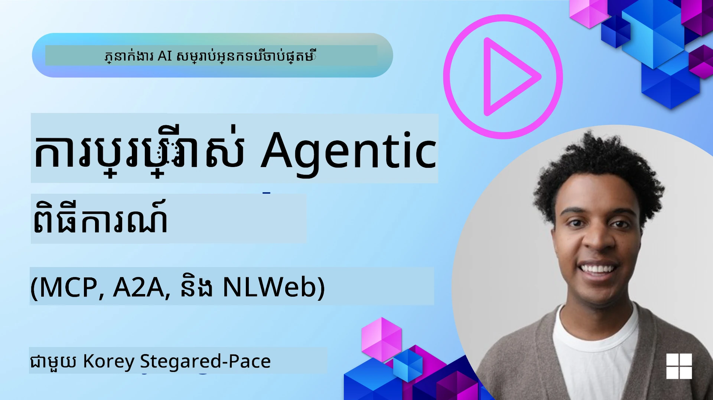
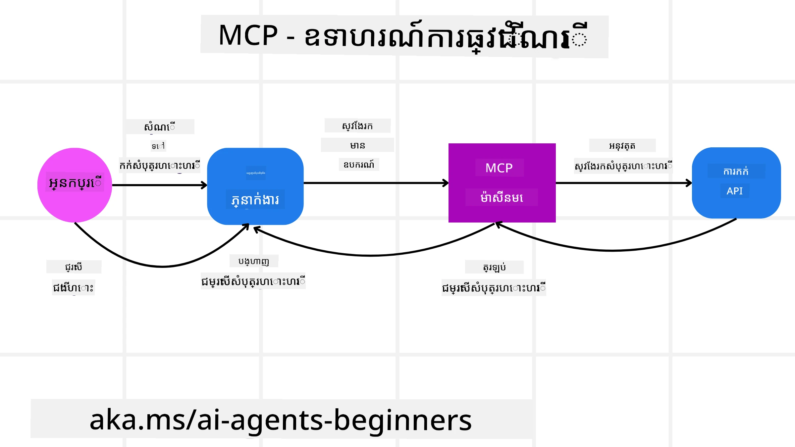
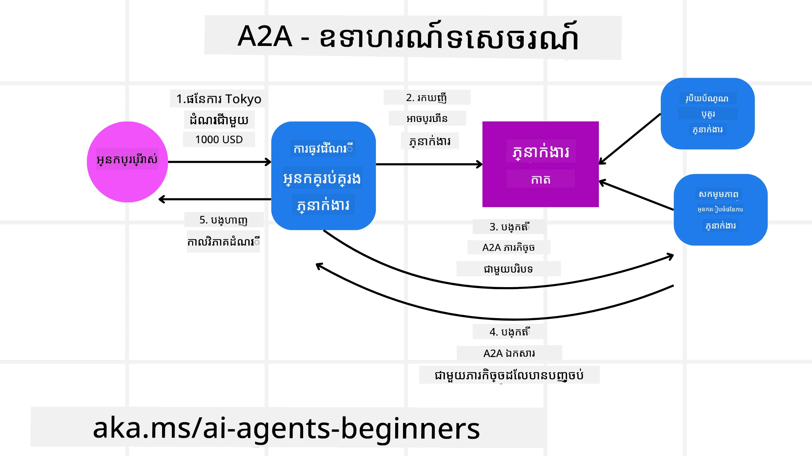
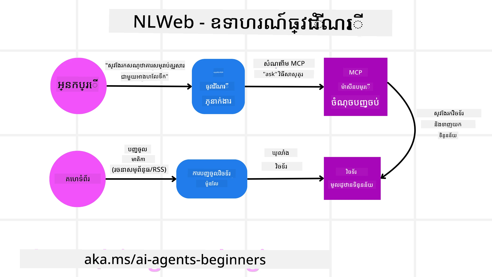

# ការប្រើប្រាស់ប្រព័ន្ធប្រតិបត្តិការ Agentic (MCP, A2A និង NLWeb)

> _(ចុចលើរូបភាពខាងលើដើម្បីមើលវីដេអូរបស់មេរៀននេះ)_

ខណៈដែលការប្រើប្រាស់ភ្នាក់ងារដោយបញ្ញាសិប្បនិម្មិតកើនឡើង ការចាំបាច់សម្រាប់ប្រព័ន្ធប្រតិបត្តិការ​ដែលធានារស្តង់ដា សុវត្ថិភាព និងគាំទ្រការច្នៃប្រឌិតបើកចំហក៏កើនឡើងផងដែរ។ ក្នុងមេរៀននេះ យើងនឹងពិភាក្សាអំពីប្រព័ន្ធប្រតិបត្តិការចំនួន 3 ដែលចង់បំពេញតម្រូវការនេះ - ប្រព័ន្ធបរិបទម៉ូដែល (Model Context Protocol - MCP), ភ្នាក់ងារទៅភ្នាក់ងារ (Agent to Agent - A2A) និង បណ្ដាញភាសាធម្មជាតិ (Natural Language Web - NLWeb)។

## ការណែនាំ

ក្នុងមេរៀននេះ យើងនឹងសិក្សា៖

• របៀបដែល **MCP** អនុញ្ញាតឱ្យភ្នាក់ងារការទស្សន៍ AI ចូលប្រើឧបករណ៍ និងទិន្នន័យខាងក្រៅដើម្បីបំពេញភារកិច្ចរបស់អ្នកប្រើ​​។

• របៀបដែល **A2A** ធ្វើឱ្យមានការទំនាក់ទំនង និងសហការក្នុងចំណោមភ្នាក់ងារផ្សេងៗគ្នា។

• របៀបដែល **NLWeb** នាំយកចំណុចបញ្ចូលភាសាធម្មជាតិទៅគេហទំព័រណាមួយ ដើម្បីឱ្យភ្នាក់ងារការទស្សន៍ AI អាចរកឃើញ និងធ្វើអន្តរកម្មជាមួយមាតិកា។

## គោលបំណងរៀន

• **សម្គាល់** គោលបំណងសំខាន់ និងអត្ថប្រយោជន៍នៃ MCP, A2A, និង NLWeb ក្នុងបរិបទនៃភ្នាក់ងារការទស្សន៍ AI។

• **ពន្យល់** របៀបដែលប្រព័ន្ធប្រតិបត្តិការ​នីមួយៗជួយអោយមានការទំនាក់ទំនង និងអន្តរកម្មរវាង LLMs, ឧបករណ៍ និងភ្នាក់ងារផ្សេងទៀត។

• **ទទួលស្គាល់** ភារកិច្ចខុសៗគ្នា​ដែលប្រព័ន្ធប្រតិបត្តិការនីមួយៗមុខមាត់ក្នុងការបង្កើតប្រព័ន្ធភ្នាក់ងារដ៏ស្មុគស្មាញ។

## ប្រព័ន្ធបរិបទម៉ូដែល (Model Context Protocol)

**ប្រព័ន្ធបរិបទម៉ូដែល (Model Context Protocol - MCP)** គឺជា​ស្តង់ដារបើក​ដែលផ្តល់វិธีស្តង់ដារមួយសម្រាប់កម្មវិធីក្នុងការផ្ដល់បរិបទ និងឧបករណ៍ទៅ LLMs។ វាអនុញ្ញាតឱ្យមាន "ឧបករណ៍អន្ដរជាតិ" ទៅប្រភពទិន្នន័យ និងឧបករណ៍ផ្សេងៗដែលភ្នាក់ងារការទស្សន៍ AI អាចភ្ជាប់បានយ៉ាងទៀងទាត់។

មកមើលបរិក្ខារដែលមាននៅក្នុង MCP អត្ថប្រយោជន៍បើប្រៀបធៀបនឹងការប្រើប្រាស់ API ត្រឹមត្រូវ និងឧទាហរណ៍ពីរបៀបដែលភ្នាក់ងារការទស្សន៍ AI អាចប្រើម៉ាស៊ីនបម្រើ MCP។

### បរិក្ខារគ核心 MCP

MCP ប្រតិបត្តិការនៅលើស្ថាបត្យកម្ម **ម៉ាស៊ីនអតិថិជន-ម៉ាស៊ីនបម្រើ** ហើយបរិក្ខារចម្បងរួមមានៈ

• **Hosts** គឺជាកម្មវិធី LLM (ឧទាហរណ៍ អ្នកកំណត់កូដដូចជា VSCode) ដែលចាប់ផ្តើមការតភ្ជាប់ទៅម៉ាស៊ីនបម្រើ MCP។

• **Clients** គួរតែជាបរិក្ខារប្រភេទផ្សេងក្នុងកម្មវិធីម៉ាស៊ីនអតិថិជនដែលរក្សាការតភ្ជាប់មួយនឹងមួយជាមួយម៉ាស៊ីនបម្រើ។

• **Servers** គឺជាកម្មវិធីស្រាលដែលបង្ហាញពីសមត្ថភាពជាក់លាក់។

រួមបញ្ចូលក្នុងប្រព័ន្ធប្រតិបត្តិការមានឆ្នាំងភាគរយមួយដែលជាសមត្ថភាពរបស់ម៉ាស៊ីនបម្រើ MCP ៖

• **Tools**: ជាការអនុវត្តន៍ ឬមុខងារផ្សេងៗដែលភ្នាក់ងារអាចហៅមកដើម្បីអនុវត្តន៍សកម្មភាពមួយ។ ឧទាហរណ៍ សេវាកម្មឯកសារ​អាកាសធាតុ​អាចបង្ហាញឧបករណ៍ "ទាញយកអាកាសធាតុ" ឬម៉ាស៊ីនបម្រើពាណិជ្ជកម្មអេឡិចត្រូនិចអាច​បង្ហាញឧបករណ៍ "ទិញផលិតផល"។ ម៉ាស៊ីនបម្រើ MCP ប្រកាសពីឈ្មោះឧបករណ៍ ការពិព័រណ៍ និងស្កીમា​អញ្ញាត​ចូល/ចេញក្នុងបញ្ជីសមត្ថភាព។

• **Resources**: ជាធាតុទិន្នន័យអានឯកសារឬឯកសារដែលម៉ាស៊ីនបម្រើ MCP អាចផ្ដល់បាន ហើយម៉ាស៊ីនអតិថិជនអាចយកទិន្នន័យទាំងនេះតាមតម្រូវការ។ ឧទាហរណ៍មានមាតិកាឯកសារ កំណត់ត្រាផ្ទុកទិន្នន័យ ឬហាល់កំណត់ហេតុ។ ប្រភេទធនធានមានអក្សរ (ដូចជា កូដ ឬ JSON) ឬឌីជីថល (ដូចជា រូបភាព ឬ PDF)។

• **Prompts**: ជារៀបចំគំរូជាមុនដែលផ្ដល់នូវសំណើតំរូវការ ដើម្បីអនុញ្ញាតឲ្យមានសកម្មភាពស្មុគស្មាញបន្ថែម។

### អត្ថប្រយោជន៍របស់ MCP

MCP ផ្ដល់អត្ថប្រយោជន៍សំខាន់ៗសម្រាប់ភ្នាក់ងារការទស្សន៍ AI៖

• **ការស្វែងរកឧបករណ៍តាមឌីណាមិច**៖ ភ្នាក់ងារអាចទទួលបានបញ្ជីឧបករណ៍ដែលមានពីម៉ាស៊ីនបម្រើជាផ្លូវការជាមួយការពិព័រណ៍អំពីមុខងាររបស់វា។ វាប្រកួតប្រជែងជាមួយAPI​​​ធម្មតា​ដែលតម្រូវឲ្យប្រកាសកូដថេរដើម្បីបញ្ចូល មានន័យថាការផ្លាស់ប្តូរ API ម្នាក់​នៅត្រឹមត្រូវតម្រូវឲ្យអាប់ដេតកូដ។ MCP ផ្ដល់របៀប “តែមួយដងបញ្ចូល” ដែលនាំឱ្យមានការប្រែប្រួលខ្ពស់។

• **ការសមហេតុអន្តរមាយរវាង LLMs**៖ MCP ដំណើរការ​លើ LLMs ផ្សេងៗគ្នា ផ្ដល់ការលៃប្ដូរមូដែលមូលដ្ឋាន​ដើម្បីវាយតម្លៃសមត្ថភាពប្រសើរជាងមុន។

• **សុវត្ថិភាពស្តង់ដារ**៖ MCP រួមបញ្ចូលវិធីសាស្រ្តផ្ទៀងផ្ទាត់ស្នាមពុម្ភ ដើម្បីធ្វើឱ្យការចូលប្រើម៉ាស៊ីនបម្រើ MCP ច្រើនកាន់តែងាយស្រួល។ វាសាមញ្ញជាងការគ្រប់គ្រងកូនសោនិងប្រភេទផ្ទៀងផ្ទាត់ផ្សេងៗសម្រាប់ API បុរាណៗ។

### ឧទាហរណ៍ MCP

គិតថាប្រើប្រាស់អ្នកប្រើប្រាស់ចង់កក់សំបុត្រយន្តហោះដោយជំនួយរបស់អ្នកជំនួយ AI ដែលបង្កើតដោយ MCP។

1. **ការតភ្ជាប់**៖ អ្នកជំនួយ AI (ម៉ាស៊ីនអតិថិជន MCP) តភ្ជាប់ទៅម៉ាស៊ីនបម្រើ MCP ដែលផ្តល់ដោយក្រុមហ៊ុនអាកាសចរណ៍។

2. **ការស្វែងរកឧបករណ៍**៖ ម៉ាស៊ីនអតិថិជនសួរម៉ាស៊ីនបម្រើ MCP របស់ក្រុមហ៊ុនអាកាសចរណ៍ថា "តើអ្នកមានឧបករណ៍អ្វីខ្លះ?" ម៉ាស៊ីនបម្រើឆ្លើយជាមួយឧបករណ៍ដូចជា "ស្វែងរកយន្តហោះ" និង "កក់សំបុត្រយន្តហោះ"។

3. **ការហៅឧបករណ៍**៖ បន្ទាប់មកអ្នកស្នើអ្នកជំនួយ AI ថា "សូមស្វែងរកយន្តហោះពីប៉ូតឡែនទៅហូណូលូលូ។" អ្នកជំនួយ AI ប្រើ LLM របស់ខ្លួន ដើម្បីកំណត់ថាវាត្រូវហៅឧបករណ៍ "ស្វែងរកយន្តហោះ" ហើយបញ្ជូនប៉ារ៉ាម៉ែត្រ​ដែលទាក់ទង (ដើមទីកន្លែង ទិសដៅ) ទៅម៉ាស៊ីនបម្រើ MCP។

4. **ការអនុវត្តន៍ និងឆ្លើយតប**៖ ម៉ាស៊ីនបម្រើ MCP ដើរជាផ្ទាំងមុខ នាំឲ្យមានការហៅ API ការកក់នៅក្នុងក្រុមហ៊ុនអាកាសចរណ៍បញ្ចាក់ស្ថានភាព។ វាទទួលបានព័ត៌មានសំបុត្រយន្តហោះ (ដូចជា ទិន្នន័យ JSON) ហើយផ្ញើទៅអ្នកជំនួយ AI។

5. **អន្តរកម្មបន្ថែម**៖ អ្នកជំនួយ AI បង្ហាញជម្រើសសំបុត្រយន្តហោះ។ បន្ទាប់ពីអ្នកជ្រើសរើសសំបុត្រយន្តហោះ អ្នកជំនួយអាចហៅឧបករណ៍ "កក់សំបុត្រយន្តហោះ" លើម៉ាស៊ីនបម្រើ MCP ដដែល ដើម្បីបញ្ចប់ការកក់។

## ប្រព័ន្ធបញ្ជូនទិន្នន័យពីភ្នាក់ងារទៅភ្នាក់ងារ (A2A)

ខណៈដែល MCP ផ្តោតទៅលើការតភ្ជាប់ LLM ទៅឧបករណ៍ ប្រព័ន្ធបញ្ជូនទិន្នន័យពីភ្នាក់ងារទៅភ្នាក់ងារ (Agent-to-Agent - A2A) លើកកម្រិតបន្ថែមដោយធ្វើឲ្យមានការទំនាក់ទំនង និងសហការរវាងភ្នាក់ងារការទស្សន៍ AI ផ្សេងៗគ្នា។ A2A ភ្ជាប់ភ្នាក់ងារការទស្សន៍ AI ក្នុងស្ថាប័ន បរិយាកាស និងបច្ចេកវិទ្យាផ្សេងៗ ដើម្បីបំពេញការងារចែករំលែក។

យើងនឹងពិនិត្យកញ្ចប់របស់ A2A និងអត្ថប្រយោជន៍របស់វា ជាមួយនឹងឧទាហរណ៍ពីរបៀបដែលវាអាចអនុវត្តនៅក្នុងកម្មវិធីទេសចរណ៍របស់យើង។

### បរិក្ខារគ核心 A2A

A2A ផ្តោតលើការអនុញ្ញាតការទំនាក់ទំនងរវាងភ្នាក់ងារ និងឱ្យពួកគេធ្វើការជាមួយគ្នាដើម្បីបំពេញភារកិច្ចរងមួយសម្រាប់អ្នកប្រើ។ មនុស្សគ្រប់បរិក្ខារនៃប្រព័ន្ធនេះមានដូចជា៖

#### កាតភ្នាក់ងារ

ដូចជាការដែលម៉ាស៊ីនបម្រើ MCP ចែករំលែកបញ្ជីឧបករណ៍ កាតភ្នាក់ងារមាន៖
- ឈ្មោះនៃភ្នាក់ងារ។
- **ការពិព័រណ៍អំពីភារកិច្ចទូទៅ** ដែលវាបញ្ចប់។
- **បញ្ជីជំនាញជាក់លាក់** ជាមួយការពិពណ៌នាដើម្បីជួយភ្នាក់ងារផ្សេងៗ (ឬមនុស្សប្រើ) យល់ព្រមពេលណា ហើយហេតុអ្វីពួកគេចង់ហៅភ្នាក់ងារនោះ។
- **URL ចុងក្រោយបច្ចុប្បន្ន** របស់ភ្នាក់ងារ
- **ជំនាន់** និង **សមត្ថភាព** របស់ភ្នាក់ងារ ដូចជាការតបយកជួរផ្សាយនិងការជូនដំណឹងដុំ។

#### អ្នកអនុវត្តភ្នាក់ងារ

អ្នកអនុវត្តភ្នាក់ងារទទួលខុសត្រូវចំពោះ **ការផ្លាស់បញ្ជូនបរិបទនៃការជជែករបស់អ្នកប្រើទៅឱ្យភ្នាក់ងារតំបន់ពីរ** ត្រូវការមើលងាយស្រួលដើម្បីយល់ពីភារកិច្ចដែលត្រូវបញ្ចប់។ ក្នុងម៉ាស៊ីនបម្រើ A2A ភ្នាក់ងារ​ប្រើប្រាស់គំរូភាសាធំ (LLM) របស់ខ្លួនដើម្បីបកស្រាយសំណើដែលបានទទួល និងអនុវត្តភារកិច្ចដោយប្រើឧបករណ៍ផ្ទៃក្នុងខ្លួន។

#### អត្ថបទស្នាម

នៅពេលភ្នាក់ងារតំបន់ពីរបញ្ចប់ភារកិច្ចដែលបានស្នើ អត្ថបទស្នាមនៃការងារនោះត្រូវបង្កើតជាអត្ថបទស្នាមមួយ។ អត្ថបទស្នាម **មានលទ្ធផលអំពីការងារនៃភ្នាក់ងារ** ​ភាសាពិពណ៌នាអំពីពីរប្រតិបត្តិការដែលបានបញ្ចប់ និង **បរិបទអត្ថបទ** ដែលផ្ញើតាមប្រព័ន្ធ។ បន្ទាប់ពីអត្ថបទស្នាមត្រូវបានផ្ញើការតភ្ជាប់ជាមួយភ្នាក់ងារតំបន់ពីរត្រូវបានបិទរហូតដល់ត្រូវការឡើងវិញ។

#### ជួរតម្រៀបព្រឹត្តិការណ៍

បរិក្ខារនេះប្រើសម្រាប់ **ការគ្រប់គ្រងបច្ចុប្បន្នភាព និងការផ្ញើសារ**។ វាមានសារៈសំខាន់ក្នុងផលិតកម្មសម្រាប់ប្រព័ន្ធភ្នាក់ងារដើម្បីបញ្ឈប់ការបិទកាតភ្នាក់ងារជាមុនមុនពេលភារកិច្ចបានបញ្ចប់ ជាពិសេសពេលរយៈពេលបញ្ចប់ភារកិច្ចអាចយូរបាន។

### អត្ថប្រយោជន៍របស់ A2A

• **ការសហការកែលម្អ**៖ វាអនុញ្ញាតឲ្យភ្នាក់ងារពីអ្នកផ្គត់ផ្គង់និងវេទិកាផ្សេងៗអាចធ្វើអន្តរកម្ម ប្រើបរិបទ និងធ្វើការជាមួយគ្នា ជួយបង្កើតរបៀបស្វ័យប្រវត្តិឆ្លាតវៃដោយគ្មានឧបសគ្គពីប្រព័ន្ធផ្ទីៗ។

• **ភាពបត់បែនក្នុងការជ្រើសរើសគំរូ**៖ អ្នកជំនួយ A2A នីមួយៗ អាចសម្រេចចិត្តប្រើ LLM របស់ខ្លួន ក្នុងការពិចារណាសំណើររបស់ខ្លួន អនុញ្ញាតឲ្យប្រើគំរូបង្រៀនតាមរបៀប អោយម៉ាស៊ីនល្អបង្ហាញ កាន់តែប្រសើរជាងធម្មតា នៅក្នុងសេណារីយ៉ូ MCP មួយចំនួន។

• **ការផ្សាយបញ្ជាក់បញ្ជូនសុវត្ថិភាព**៖ ការផ្ទៀងផ្ទាត់ត្រូវបានបង្កើតនៅក្នុងប្រព័ន្ធ A2A ព្រមទាំងផ្ដល់សុវត្ថិភាពជាមួយសមាសភាពប្រាក់។

### ឧទាហរណ៍ A2A

មកពង្រីកសេណារីយ៉ូកក់ដំណើរកម្សាន្តរបស់យើង តែម្តងនេះប្រើ A2A។

1. **សំណើអ្នកប្រើទៅភ្នាក់ងារច្រើន**៖ អ្នកប្រើប្រាស់ធ្វើអន្តរប្រតិបត្តិជាមួយ "ភ្នាក់ងារធ្វើដំណើរ" អតិថិជន/ភ្នាក់ងារ A2A ដូចជា និយាយថា "សូមកក់ដំណើរទៅហូណូលូលូសប្តាហ៍ក្រោយ ដោយមានសំបុត្រយន្តហោះ សណ្ឋាគារ និងឡានជួល។"

2. **ការតំរូវដោយភ្នាក់ងារធ្វើដំណើរ**៖ ភ្នាក់ងារធ្វើដំណើរទទួលសំណើស្មុគស្មាញនេះ។ វាប្រើ LLM របស់ខ្លួនក្នុងការពិចារណាពីភារកិច្ច និងកំណត់ថាត្រូវធ្វើការយោងទៅភ្នាក់ងារផ្សេងទៀតដែលមានជំនាញ។

3. **ការទំនាក់ទំនងរវាងភ្នាក់ងារ**៖ ភ្នាក់ងារធ្វើដំណើរប្រើប្រព័ន្ធប្រតិបត្តិការ A2A ដើម្បីតភ្ជាប់ទៅភ្នាក់ងារទាំង៣ ដែលបានបង្កើតដោយក្រុមហ៊ុនខុសៗគ្នា ដូចជា "ភ្នាក់ងារអាកាសចរណ៍", "ភ្នាក់ងារសណ្ឋាគារ" និង "ភ្នាក់ងារជួលឡាន"។

4. **ការបំពេញភារកិច្ចតំណាង**៖ ភ្នាក់ងារធ្វើដំណើរផ្ញើភារកិច្ចជាក់លាក់ទៅភ្នាក់ងារជំនាញទាំងនោះ (ឧ. "ស្វែងរកសំបុត្រយន្តហោះទៅហូណូលូលូ", "កក់សណ្ឋាគារ", "ជួលឡាន")។ ភ្នាក់ងារជំនាញនីមួយៗ ដែលដំណើរការជាមួយ LLMs របស់ខ្លួន និងប្រើឧបករណ៍ផ្ទៃក្នុង (ដែលអាចជាម៉ាស៊ីនបម្រើ MCP ទៅវិញ) ធ្វើការបំពេញផ្នែកបានចែង។

5. **ការឆ្លើយតបរួមបញ្ចូល**៖ បន្ទាប់​ពីភ្នាក់ងារចុងក្រោយបញ្ចប់ភារកិច្ចរបស់ពួកគេ ភ្នាក់ងារធ្វើដំណើរប្រមូលលទ្ធផល (ព័ត៌មានសំបុត្រ ការបញ្ជាក់សណ្ឋាគារ ការកក់ឡាន) ហើយផ្ញើការឆ្លើយតបបែបជជែកទៅអ្នកប្រើរៀបចំ។

## បណ្ដាញភាសាធម្មជាតិ (NLWeb)

គេហទំព័របានជាសំខាន់នៅរយៈពេលយូរមកហើយ សម្រាប់អ្នកប្រើប្រាស់ក្នុងការចូលដំណើរការព័ត៌មាន និងទិន្នន័យតាមអ៊ិនធឺណិត។

អាចមើលបរិក្ខារផ្សេងៗលើ NLWeb អត្ថប្រយោជន៍នៃ NLWeb និងឧទាហរណ៍ពីរបៀបដែល NLWeb របស់យើងប្រើនៅក្នុងកម្មវិធីទេសចរណ៍។

### បរិក្ខាររបស់ NLWeb

- **កម្មវិធី NLWeb (កូដសេវាកម្មគ្រឹះ)**៖ ប្រព័ន្ធដែលដំណើរការសំណួរភាសាធម្មជាតិ។ វាតភ្ជាប់ផ្នែកខុសៗគ្នានៃវេទិកាដើម្បីបង្កើតការឆ្លើយតប។ អ្នកអាចគិតថាវាជា **ម៉ាស៊ីនបើកបរ​ភាសាធម្មជាតិ​នៃគេហទំព័រ**។

- **ប្រព័ន្ធប្រតិបត្តិការណ៍ NLWeb**៖ នេះគឺជា **ច្បាប់មូលដ្ឋានសម្រាប់អន្តរកម្មភាសាធម្មជាពីរជាមួយគេហទំព័រ**។ វាផ្ញើការឆ្លើយតបជាទម្រង់ JSON (ជាញឹកញាប់ប្រើ Schema.org)។ គោលបំណងគឺបង្កើតមូលដ្ឋានសាមញ្ញសម្រាប់ “បណ្ដាញ AI” ដូចដែល HTML អនុញ្ញាតឲ្យចែករំលែកឯកសារតាមអ៊ិនធឺណិត។

- **ម៉ាស៊ីនបម្រើ MCP (ចំណុចបញ្ចប់ Model Context Protocol)**៖ ការរៀបចំ NLWeb មួយៗដំណើរការជា **ម៉ាស៊ីនបម្រើ MCP** ផងដែរ។ វាអាច **ចែករំលែកឧបករណ៍ (ដូចជា​វិធីសាស្ត្រ "សួរ") និងទិន្នន័យ** ជាមួយប្រព័ន្ធ AI ផ្សេងទៀត។ នៅក្នុងការអនុវត្ត វាគ្របដណ្តប់មាតិកា និងសមត្ថភាពគេហទំព័រឱ្យភ្នាក់ងារការទស្សន៍ AI ប្រើប្រាស់ ដូច្នេះគេហទំព័រគឺជាផ្នែកនៃ "ប្រព័ន្ធភ្នាក់ងារជាសហគមន៍"។

- **គំរូសរសេរដាក់**៖ គំរូនេះប្រើដើម្បី **បំលែងមាតិកាគេហទំព័រទៅជាការបង្ហាញជាតួអក្សារងើបដែលហៅថា vectors**។ Vectors ទទួលយកន័យដែលកុំព្យូទ័រអាចប្រៀបធៀប និងស្វែងរកបាន។ ពួកវាត្រូវបានរក្សាទុកនៅក្នុងមូលដាក់ទិន្នន័យជាក់លាក់ ហើយអ្នកប្រើអាចជ្រើសរើសគំរូ embedding ដែលពួកគេចង់ប្រើ។

- **មូលដ្ឋានទិន្នន័យវ៉ិកទ័រ (កំណត់ឡើងវិញ)**៖ មូលដ្ឋានទិន្នន័យនេះ **រក្សាទុក embeddings នៃមាតិកាគេហទំព័រ**។ ពេលដែលមានអ្នកសួរមក NLWeb ពិនិត្យមូលដ្ឋានទិន្នន័យវ៉ិកទ័រដើម្បីរកព័ត៌មានដែលពាក់ព័ន្ធបំផុត។ វាបង្ហាញបញ្ជីជំរើសឆ្លើយតបដែលមានលំដាប់តាមកម្រិតស្ថិតសម។ NLWeb ប្រតិបត្តិការជាមួយប្រព័ន្ធផ្ទុកវ៉ិកទ័រផ្សេងៗដូចជា Qdrant, Snowflake, Milvus, Azure AI Search, និង Elasticsearch។

### NLWeb ជាឧទាហរណ៍

គិតថាគេហទំព័រកក់ដំណើរកម្សាន្តរបស់យើងម្តងទៀត តែคราวนี้ វាត្រូវបានគាំទ្រដោយ NLWeb។

1. **ការបញ្ចូលទិន្នន័យ**៖ បញ្ជីផលិតផល និងការពិពណ៌នាដំណើរកម្សាន្តរបស់គេហទំព័រ (ដូចជា បញ្ជីសំបុត្រយន្តហោះ ការពិពណ៌នាសណ្ឋាគារ និងកញ្ចប់ដំណើរកម្សាន្ត) ត្រូវបានរៀបចំជារបៀប Schema.org ឬទាញយកតាម RSS feeds។ ឧបករណ៍ NLWeb ចូលទិន្នន័យដូចនេះ បង្កើត embeddings ហើយរក្សាទុកក្នុងមូលដ្ឋានទិន្នន័យ vector នៅក្នុង ឬក្រៅបណ្ដាញ។

2. **សំណួរភាសាធម្មជាតិ (មនុស្ស)**៖ អ្នកប្រើចូលទៅគេហទំព័រ ហើយបញ្ចូលតាមច្រកជជែកថា "សូមរកសណ្ឋាគារសម្រួលសម្រាប់គ្រួសារមួយនៅហូណូលូលូដែលមានអាងហែលទឹកសម្រាប់សប្តាហ៍ក្រោយ" ផ្ទុយគ្នាក្នុងការរុករកម៉ឺនុយ។

3. **ការដំណើរការ NLWeb**៖ កម្មវិធី NLWeb ទទួលបានសំណួរនេះ។ វាផ្ញើសំណួរទៅ LLM ឲ្យយល់ និងយកពេលត្រួតពិនិត្យមូលដ្ឋានទិន្នន័យវ៉ិកទ័រដើម្បីស្វែងរកបញ្ជីសណ្ឋាគារដែលពាក់ព័ន្ធ។

4. **លទ្ធផលត្រឹមត្រូវ**៖ LLM ជួយបកស្រាយលទ្ធផលស្វែងរក ពិនិត្យមើលតម្រុយ "សម្រួលសម្រាប់គ្រួសារ", "អាងហែលទឹក", និង "ហូណូលូលូ" ហើយគ្រប់គ្រងការឆ្លើយតបជាភាសាធម្មជាតិ។ ហេតុសំខាន់គឺការឆ្លើយតបយោងទៅលើសណ្ឋាគារពិតពីបញ្ជីមិនដែលបង្កើតព័ត៌មានក្លែងក្លាយឡើយ។

5. **អន្តរកម្មជាមួយភ្នាក់ងារការទស្សន៍ AI**៖ ដោយសារតែ NLWeb ដំណើរការជាម៉ាស៊ីនបម្រើ MCP អ្នកជំនួយដំណើរកម្សាន្ត AI ខាងក្រៅអាចភ្ជាប់ទៅការកំណត់ NLWeb នេះបានផងដែរ។ ភ្នាក់ងារនេះអាចប្រើវិធីសាស្ត្រ `ask` នៅ MCP ដើម្បីស្នើសុំចំឡើយពីគេហទំព័រត្រង់៖ `ask("តើមានភោជនីយដ្ឋានដែលមិនបញ្ចូលសារធាតុមានជាតិ​សត្វ​នៅក្នុងតំបន់ហូណូលូលូនដែលបានផ្តល់អនុសាសន៍ដោយសណ្ឋាគារមែនទេ?")`។ កំណត់ NLWeb នឹងដំណើរការសំណើនេះ ប្រើមូលដ្ឋានទិន្នន័យអំពីភោជនីយដ្ឋាន (បើមានបញ្ចូល) ហើយបង្វិលមកជាការឆ្លើយតប JSON ដែលរៀបចំរួចហើយ។

### មានសំណួរបន្ថែមអំពី MCP/A2A/NLWeb មែនទេ?

ចូលរួមក្នុង [Microsoft Foundry Discord](https://discord.com/invite/ATgtXmAS5D) ដើម្បីជួបអ្នករៀនដូចគ្នា ចូលរួមម៉ោងការិយាល័យ និងសំណួរអំពីភ្នាក់ងារការទស្សន៍ AI របស់អ្នកត្រូវបានឆ្លើយតប។

## ធនធាន

- [MCP សម្រាប់អ្នកដំបូង](https://aka.ms/mcp-for-beginners)  
- [ឯកសារពាណិជ្ជកម្ម MCP](https://learn.microsoft.com/python/api/overview/azure/ai-projects-readme)
- [ហាងឃ្លាំង NLWeb](https://github.com/nlweb-ai/NLWeb)
- [ស៊ុមភ្នាក់ងារមីក្រូសូហ្វ](https://aka.ms/ai-agents-beginners/agent-framework)

---

<!-- CO-OP TRANSLATOR DISCLAIMER START -->
**ការបដិសេធ**:
ឯកសារនេះត្រូវបានបម្លែងភាសា ដោយប្រើសេវាបម្លែងភាសា AI [Co-op Translator](https://github.com/Azure/co-op-translator)។ ទោះយើងខ្ញុំមានក្តីប្រាថ្នាឱ្យបានច្បាស់លាស់ តែសូមយល់ដឹងថាការបម្លែងដោយស្វ័យប្រវត្តិក៏អាចមានកំហុសឬភាពមិនត្រឹមត្រូវ។ ឯកសារដើមជាភាសាទីតាំងគួរត្រូវបានគេប្រើជាប្រភពច្បាស់លាស់។ សម្រាប់ព័ត៌មានសំខាន់ៗ សូមណែនាំឱ្យប្រើប្រាស់ការប្រែដោយមនុស្សជំនាញ។ យើងខ្ញុំមិនទទួលខុសត្រូវចំពោះការយល់ច្រឡំ ឬការបកស្រាយខុសបន្ទាប់ពីការប្រើប្រាស់ការបម្លែងនេះនោះទេ។
<!-- CO-OP TRANSLATOR DISCLAIMER END -->