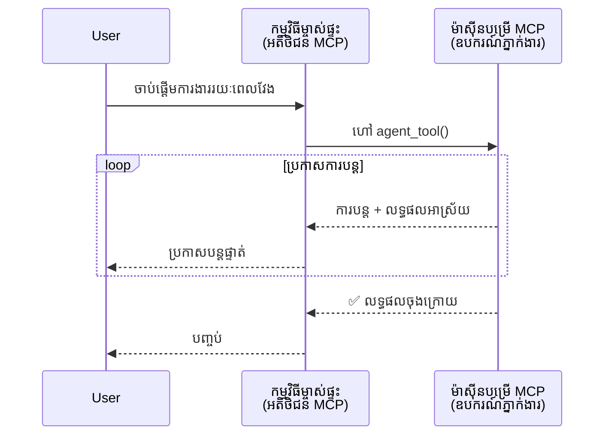
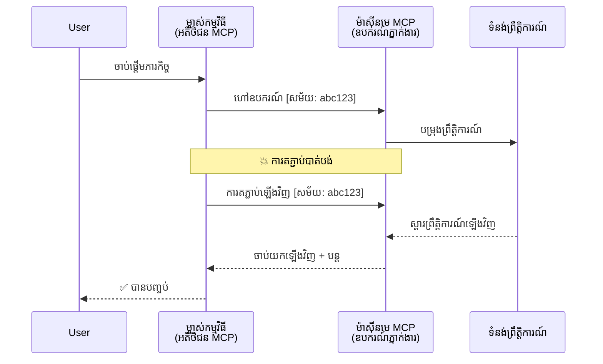
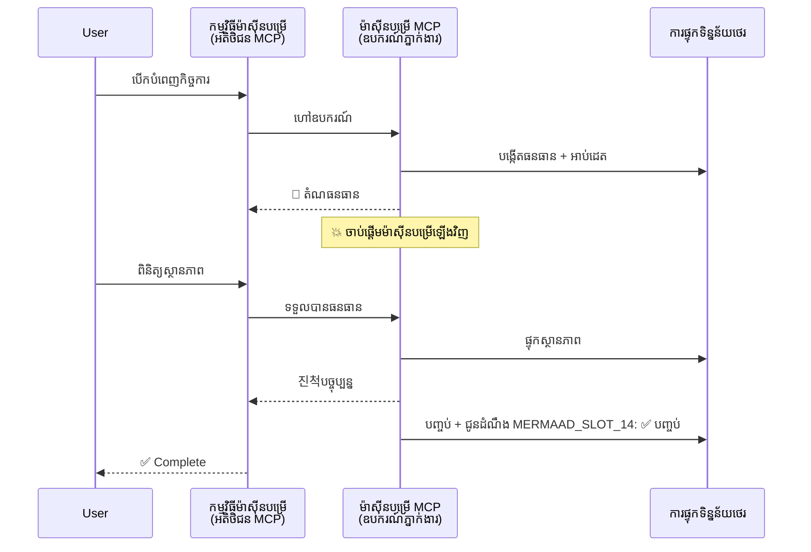
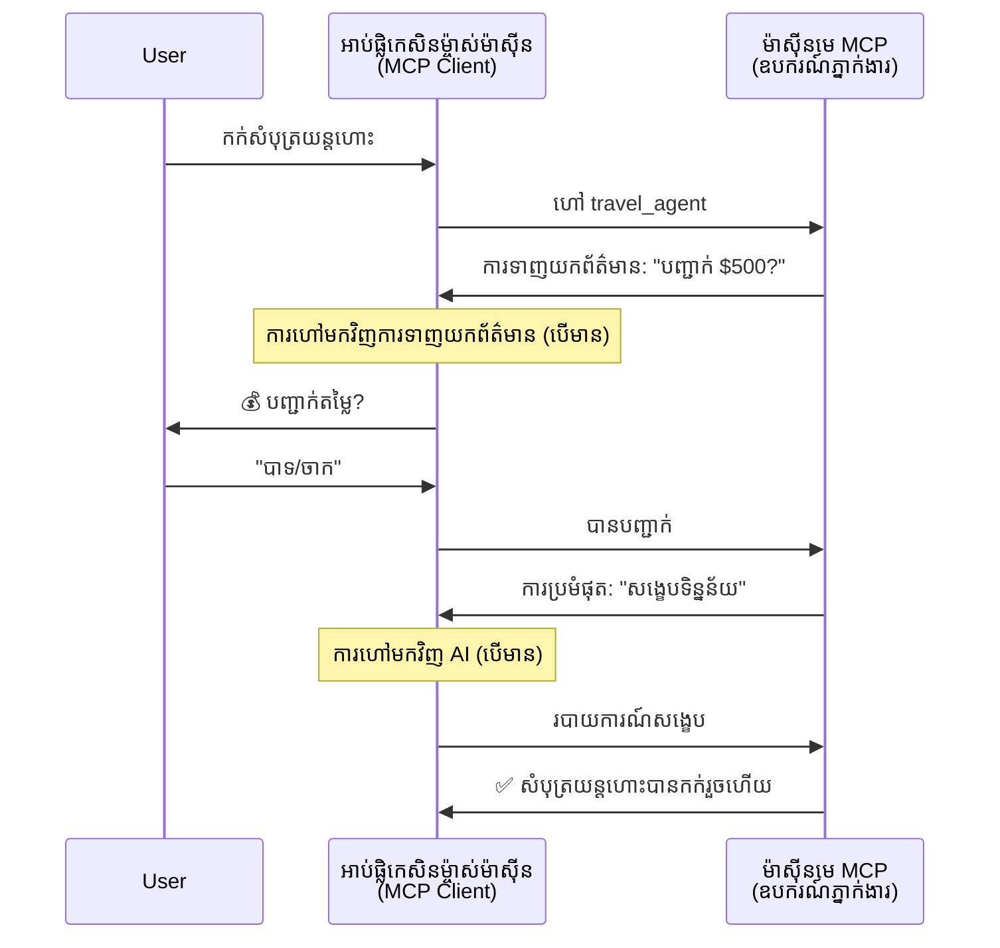
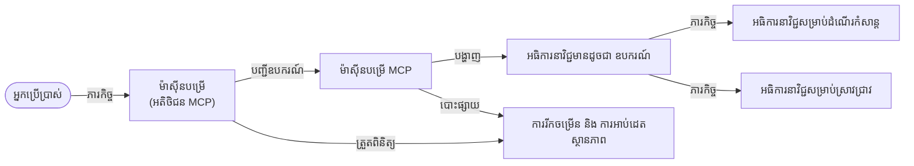

# ការសង់ប្រព័ន្ធទំនាក់ទំនងភាសាជាមួយភាសាជាមួយម្ចាស់ភាសាជាមួយ MCP

> សង្ខេប - តើអ្នកអាចសង់ការទំនាក់ទំនង Agent2Agent លើ MCP បានទេ? បាទ/ចាស!

MCP បានអភិវឌ្ឍយ៉ាងសំខាន់ឆ្ពោះទៅលើគោលបំណងដើមរបស់វា "ផ្តល់បរិបទទៅ LLMs"។ ជាមួយនឹងការកែលម្អថ្មីៗ រួមមាន [ចរន្តដែលអាចបន្តបាន](https://modelcontextprotocol.io/docs/concepts/transports#resumability-and-redelivery), [ការជំរុញ](https://modelcontextprotocol.io/specification/2025-06-18/client/elicitation), [ការគំរូ](https://modelcontextprotocol.io/specification/2025-06-18/client/sampling), និងការជូនដំណឹង ([ជំហាន](https://modelcontextprotocol.io/specification/2025-06-18/basic/utilities/progress) និង [ធនធាន](https://modelcontextprotocol.io/specification/2025-06-18/schema#resourceupdatednotification)) MCP ពេលនេះផ្តល់មូលដ្ឋានរឹងមាំសម្រាប់សង់ប្រព័ន្ធទំនាក់ទំនង agent-to-agent ដែលស្មុគស្មាញ។

## ការយល់ច្រឡំនៃភាសាជា/ឧបករណ៍

ខណៈដែលអ្នកអភិវឌ្ឍន៍ច្រើនបង្រៀនឧបករណ៍ដែលមានឥរិយាបថ agentic (វាជាដំណើរការយូរពេល, អាចត្រូវការបញ្ចូលបន្ថែមនៅពេលកំពុងបញ្ចប់ជាដើម) ការយល់ច្រឡំនិយមមួយគឺថា MCP មិនសមរម្យ primarily ពីព្រោះឧទាហរណ៍ចាស់ៗនៃឧបករណ៍របស់វាដោយសារតែផ្តោតសំខាន់លើលំនាំសំណើ-ចម្លើយសាមញ្ញ។

ការយល់គំនិតនេះចាស់ហើយ។ ការ​បញ្ជាក់ MCP ត្រូវបានពង្រីកយ៉ាងសំខាន់ក្នុងរយៈពេលប៉ុន្មានខែចុងក្រោយជាមួយសមត្ថភាពដែលបិទចន្លោះសម្រាប់បង្កើតឥរិយាបថ agentic រយៈពេលវែង៖

- **ចរន្ត និងលទ្ធផលផ្នែកខ្លះ**: ការជូនដំណឹងជំហានពេលវេលាពិតប្រាកដនៅពេលកំពុងអនុវត្ត
- **ការផ្ដល់បន្ត**: អតិថិជនអាចភ្ជាប់ឡើងវិញនិងបន្តបន្ទាប់ពីការជាប់បញ្ចប់
- **ភាពធន់**: លទ្ធផលនៅរស់រានមានជីវិតបន្ទាប់ពីការចាប់ផ្តើមម៉ាស៊ីនបម្រើឡើងវិញ (ឧ. តាមរយៈតំណធនធាន)
- **បច្ចេកទេសច្រើនជុំ**: បញ្ចូលធ្វើប្រតិបត្តិការនៅពេលកំពុងអនុវត្តតាមរយៈការជំរុញ និងការគំរូ

លក្ខណៈពិសេសទាំងនេះអាចធ្វើការសមាសធាតុដើម្បីអនុញ្ញាតឱ្យមានកម្មវិធី agentic និង multi-agent ស្មុគស្មាញទាំងអស់ដែលបានដាក់ឱ្យដំណើរការលើប្រព័ន្ធ MCP។

សម្រាប់យោង យើងនឹងហៅភាសាជា “ឧបករណ៍” ដែលមានស្រាប់លើម៉ាស៊ីនបម្រើ MCP។ នេះមានន័យថាមានកម្មវិធីម៉ាស៊ីនផ្ទះដែលអនុវត្ត MCP client ដែលបង្កើតសម័យជាមួយម៉ាស៊ីនបម្រើ MCP ហើយអាចហៅភាសា។

## តើអ្វីជាអ្វីដែលធ្វើឲ្យឧបករណ៍ MCP "Agentic"?

មុនពេលចូលធ្វើអនុវត្ត យើងត្រូវកំណត់ថាលក្ខណៈបច្ចេកទេសណាមួយដែលត្រូវការ ដើម្បីគាំទ្រភាសាជាដំណើរការយូរ។

> យើងនឹងកំណត់ភាសាជា ជាអង្គភាពដែលអាចដំណើរការដោយដោយឯករាជ្យរយៈពេលវែង, មានសមត្ថភាពដោះស្រាយភារកិច្ចស្មុគស្មាញដែលអាចត្រូវការការបន្តិចបន្តួច ឬ ការកែប្រែ ពិចារណា លើមតិយោបល់ពិតប្រាកដ។

### 1. ចរន្ត និងលទ្ធផលផ្នែកខ្លះ

លំនាំសំណើ-ចម្លើយផ្លូវការមិនអាចប្រើបានសម្រាប់ភារកិច្ចរយៈពេលវែង។ ភាសាជាត្រូវការផ្តល់៖

- ការជូនដំណឹងជំហានពេលវេលាពិតប្រាកដ
- លទ្ធផលកណ្តាល

**គាំទ្រ MCP**: ការជូនដំណឹងធនធានធ្វើឱ្យអាចចរន្តលទ្ធផលផ្នែកខ្លះបាន ប៉ុន្តែវាត្រូវការរចនាសាងល្អ ដើម្បីជៀសវាងជំរះជាមួយម៉ូដែលសំណើ/ចម្លើយ JSON-RPC ១:១។

| លក្ខណៈពិសេស                 | ករណីប្រើប្រាស់                                                                                                                                                   | គាំទ្រ MCP                                                                              |
| ----------------------------- | ------------------------------------------------------------------------------------------------------------------------------------------------------------ | -------------------------------------------------------------------------------------- |
| ការជូនដំណឹងជំហានពេលវេលាពិតប្រាកដ | អ្នកប្រើស្នើសុំភារកិច្ចផ្លាស់ប្តូរកូដ។ ភាសាជាចរន្តជំហាន:"១០% - ការវិភាគការទំនាក់ទំនង... ២៥% - ផ្លាស់ប្ដូរឯកសារ TypeScript... ៥០% - ការអាប់ដេតការនាំចូល..." | ✅ ការជូនដំណឹងជំហាន                                                                       |
| លទ្ធផលផ្នែកខ្លៈ           | ភារកិច្ច "បង្កើតសៀវភៅ" ចរន្តលទ្ធផលផ្នែកខ្លះ ដូចជា: ១) ស្ដីពីរឿងរ៉ាវ, ២) បញ្ជីជំពូក, ៣) ជំពូកនីមួយៗពេញលេញ។ ម៉ាស៊ីនផ្ទះអាចពិនិត្យ ប្រើប្រាស់ ឬបញ្ជូនផ្លូវឡើងវិញនៅពេលណាមួយ។ | ✅ ការជូនដំណឹងអាច "ពង្រីក" ដើម្បីរួមបញ្ចូលលទ្ធផលផ្នែក ខលមើលការផ្តល់យោបល់លើ PR ៣៨៣, ៧၇៦                  |

<div align="center" style="font-style: italic; font-size: 0.95em; margin-bottom: 0.5em;">
<strong>រូបភាព ១:</strong> គំនូរ នេះបង្ហាញពីរបៀបដែលភាសា MCP ចរន្តការជូនដំណឹងជំហានពេលវេលាពិតប្រាកដ និងលទ្ធផលផ្នែកខ្លះទៅកម្មវិធីម៉ាស៊ីនផ្ទះ ក្នុងរយៈពេលធ្វើការយូរ ដែលអនុញ្ញាតឱ្យអ្នកប្រើតាមដានការអនុវត្តប្រាកដ។
</div>



### 2. ការផ្ដល់បន្ត

ភាសាជាត្រូវគ្រប់គ្រងការផ្អាកបណ្តាញយ៉ាងរលូន៖

- ភ្ជាប់ឡើងវិញបន្ទាប់ពី (អតិថិជន) ផ្អាក
- បន្តពីកន្លែងដែលបានបង្ហាញ (ការផ្ដល់សារឡើងវិញ)

**គាំទ្រ MCP**: ការដឹកជញ្ជូន StreamableHTTP របស់ MCP ពេលនេះគាំទ្រការបន្តសម័យ និងការផ្ដល់សារឡើងវិញជាមួយលេខសម្គាល់សម័យ និងលេខសម្គាល់ព្រឹត្តិការណ៍ចុងក្រោយ។ ចំណាំសំខាន់ គឺម៉ាស៊ីនបម្រើត្រូវកម្មវិធីដាក់ស្ដុកព្រឹត្តិការណ៍ដែលអនុញ្ញាតឲ្យចាក់ព្រឹត្តិការណ៍ឡើងវិញនៅពេលភ្ជាប់ឡើងវិញ។
ចំណាំថាមានការផ្តល់យោបល់ពីសហគមន៍ (PR #975) ដែលស្វែងរកចរន្តដែលអាចបន្តបានដោយអំណោយផលប្រព័ន្ធដឹកជញ្ជូន។

| លក្ខណៈពិសេស        | ករណីប្រើប្រាស់                                                                                                                                                        | គាំទ្រ MCP                                                                                  |
| -------------------- | ------------------------------------------------------------------------------------------------------------------------------------------------------------------- | -------------------------------------------------------------------------------------------- |
| ការផ្ដល់បន្ត         | អតិថិជនផ្អាកកំឡុងភារកិច្ចរយៈពេលវែង។ ពេលភ្ជាប់ឡើងវិញ សម័យបន្តដោយព្រឹត្តិការណ៍ដែលខកខានត្រូវបានចាក់ឡើងវិញ ដំណើរការមិនរាំងខ្ទប់ពីទីកន្លែងចាកចេញ។                        | ✅ ការដឹកជញ្ជូន StreamableHTTP ជាមួយលេខសម្គាល់សម័យ, ចាក់ព្រឹត្តិការណ៍ឡើងវិញ និង EventStore                              |

<div align="center" style="font-style: italic; font-size: 0.95em; margin-bottom: 0.5em;">
<strong>រូបភាព ២:</strong> គំនូរនេះបង្ហាញបែបផែនរបៀបដឹកជញ្ជូន StreamableHTTP និង event store របស់ MCP អនុញ្ញាតឱ្យបន្តសម័យដោយរលូន: ប្រសិនបើអតិថិជនផ្អាកវាអាចភ្ជាប់ឡើងវិញនិងចាក់ព្រឹត្តិការណ៍ខកខានឡើងវិញមិនបាត់បង់ការរីកចម្រើននៃភារកិច្ច។
</div>



### 3. ភាពធន់

ភាសាជារយៈពេលវែងត្រូវការរដ្ឋបាលបន្តិចបន្តួច៖

- លទ្ធផលរស់រានមានជីវិតបន្ទាប់ពីការចាប់ផ្តើមម៉ាស៊ីនបម្រើឡើងវិញ
- អាចយកស្ថានភាពបានពីក្រៅបណ្ដាញ
- តាមដានជំហានកំឡុងសម័យជាច្រើន

**គាំទ្រ MCP**: MCP ពេលនេះគាំទ្រប្រភេទតំណធនធានសម្រាប់ការហៅឧបករណ៍។ ថ្ងៃនេះ លំនាំមួយដែលអាចទៅរួចគឺរចនាឧបករណ៍ដែលបង្កើតធនធាន ហើយត្រឡប់តំណធនធានជាបន្ទាន់។ ឧបករណ៍អាចបន្តដោះស្រាយភារកិច្ចនៅផ្ទៃក្នុង ហើយបើកសារ្នតំណធនធាន។ ភាគីអតិថិជនអាចជ្រើសរើសវិលបញ្ចូលស្ថានភាពធនធាននេះដើម្បីទទួលបានលទ្ធផលផ្នែកខ្លះ ឬ ពេញលេញ (ដោយផ្អែកលើការអាប់ដេតធនធានដែលម៉ាស៊ីនបម្រើផ្តល់) ឬ ជាវធនធានសម្រាប់ការជូនដំណឹង។

កំណត់ចំណុចមួយនៅទីនេះគឺ ការវាយតម្លៃធនធាន ឬ ការជាវសម្រាប់ការអាប់ដេតអាចប្រើធនធានគ្រប់គ្រាន់នៅលើកម្រិតធំ។ មានការផ្តល់យោបល់មួយក្នុងសហគមន៍ (រួមមាន #992) ស្វែងរកឱ្យមាន webhooks រឺ triggers ដែលម៉ាស៊ីនបម្រើអាចហៅដើម្បីជូនដំណឹងអតិថិជន/កម្មវិធីម៉ាស៊ីនផ្ទះអំពីការអាប់ដេត។

| លក្ខណៈពិសេស | ករណីប្រើប្រាស់                                                                                                                                    | គាំទ្រ MCP                                                          |
| -------------- | ------------------------------------------------------------------------------------------------------------------------------------------------- | ------------------------------------------------------------------ |
| ភាពធន់         | ម៉ាស៊ីនបម្រើខូចខាតនៅពេលការផ្លាស់ប្តូរទិន្នន័យ។ លទ្ធផល និងជំហានរស់រវើកបន្ទាប់ពីចាប់ផ្តើមឡើងវិញ អតិថិជនអាចពិនិត្យស្ថានភាព និងបន្តពីធនធានធន់                                                                            | ✅ តំណធនធានជាមួយស្តុកធនធានបន្តិច និងការជូនដំណឹងស្ថានភាព           |

ថ្ងៃនេះ លំនាំធម្មតាដោយគេរចនាឧបករណ៍ដែលបង្កើតធនធាន ហើយត្រឡប់តំណធនធានយ៉ាងទាន់ពេលវេលា។ ឧបករណ៍អាចបន្តដោះស្រាយភារកិច្ចនៅផ្ទៃក្នុង ផ្តល់ការជូនដំណឹងធនធាន ដែលបម្រើជា ជូនដំណឹងជំហាន ឬ រួមបញ្ចូលលទ្ធផលផ្នែកខ្លះ ហើយអាប់ដេតអត្ថបទក្នុងធនធានលើតម្រូវការ។

<div align="center" style="font-style: italic; font-size: 0.95em; margin-bottom: 0.5em;">
<strong>រូបភាព ៣:</strong> គំនូរនេះបង្ហាញរបៀបដែលភាសា MCP ប្រើធនធានបន្តិច និងការជូនដំណឹងស្ថានភាព ដើម្បីធានាថាភារកិច្ចរយៈពេលវែងរស់រានមានជីវិតបន្ទាប់ពីការចាប់ផ្តើមម៉ាស៊ីនបម្រើឡើងវិញ អនុញ្ញាតឱ្យអតិថិជនពិនិត្យជំហាន និងទទួលលទ្ធផលបន្ទាប់ពីមានបញ្ហា។
</div>



### 4. ប្រតិបត្តិការច្រើនជុំ

ភាសាជាច្រើញប្តូរបញ្ចូលបន្ថែមក្នុងពេលកំពុងអនុវត្ត៖

- ការបញ្ជាក់ ឬអនុម័តពីមនុស្ស
- ជំនួយ AI សម្រាប់សេចក្ដីសម្រេចស្មុគស្មាញ
- ការកែប្រែប៉ារ៉ាម៉ែត្រ δυναμικά

**គាំទ្រ MCP**: គាំទ្រពេញលេញតាមរយៈ sampling (សម្រាប់ការបញ្ចូល AI) និង elicitation (សម្រាប់ការបញ្ចូលមនុស្ស)។

| លក្ខណៈពិសេស        | ករណីប្រើប្រាស់                                                                                                                                                         | គាំទ្រ MCP                                          |
| -------------------- | ------------------------------------------------------------------------------------------------------------------------------------------------------------------ | -------------------------------------------------- |
| ប្រតិបត្តិការជ្រើញជុំ | ភាសាជាការកក់ដំណើរកំសាន្តស្នើសុំការបញ្ជាក់តម្លៃពីអ្នកប្រើ បន្ទាប់មកស្នើអ្នក AI បញ្ជាក់សេចក្ដីសង្ខេបទិន្នន័យដំណើរកំសាន្តមុនបញ្ចប់ប្រតិបត្តិការកក់ | ✅ Elicitation សម្រាប់បញ្ចូលមនុស្ស, sampling សម្រាប់បញ្ចូល AI |

<div align="center" style="font-style: italic; font-size: 0.95em; margin-bottom: 0.5em;">
<strong>រូបភាព ៤:</strong> គំនូរនេះបង្ហាញពីរបៀបដែលភាសា MCP អាចបញ្ជូនការបញ្ចូលមនុស្ស ឬស្នើសុំជំនួយ AI នៅពេលកំពុងអនុវត្ត ដើម្បីគាំទ្រការប្រតិបត្តិការជ្រើញជុំស្មុគស្មាញ ដូចជាការបញ្ជាក់ និងការជ្រើសរើសសេចក្ដីសម្រេច δυναμικά។
</div>



## ការអនុវត្តភាសាជារយៈពេលវែងលើ MCP - សង្ខេបកូដ

ជាផ្នែកនៃអត្ថបទនេះ យើងផ្តល់ឃ្លាំងកូដ [code repository](https://github.com/victordibia/ai-tutorials/tree/main/MCP%20Agents) ដែលមានការអនុវត្តពេញលេញនៃភាសាជារយៈពេលវែង ប្រើ MCP Python SDK ជាមួយផលប៉ះពាល់ StreamableHTTP សម្រាប់ការបន្តសម័យនិងការផ្ដល់សារឡើងវិញ។ ការអនុវត្តបង្ហាញពីរបៀបដែលសមត្ថភាព MCP អាចសមាសធាតុដើម្បីធ្វើឱ្យមានឥរិយាបថ agent-like បែបស្មុគស្មាញ។

ជាក់លាក់ យើងអនុវត្តម៉ាស៊ីនបម្រើជាមួយឧបករណ៍ agent ពីរគឺ៖

- **Agent ដំណើរកំសាន្ត** - អូម៉ូតូសេវាកម្មកក់ដំណើរកំសាន្ត ជាមួយការបញ្ជាក់តម្លៃតាមរយៈ elicitation
- **Agent ស្រាវជ្រាវ** - ធ្វើបំណងស្រាវជ្រាវជាមួយសេចក្ដីសង្ខេបជំនួយ AI តាមរយៈ sampling

ភាសាទាំងពីរបង្ហាញការជូនដំណឹងជំហានពេលវេលាពិតប្រាកដ ការបញ្ជាក់ប្រតិបត្តិការរួម និងសមត្ថភាពបន្តសម័យពេញលេញ។

### គំនិតស្នូលនៃការអនុវត្ត

ផ្នែកខាងក្រោមបង្ហាញការអនុវត្តភាសាជាលើម៉ាស៊ីនបម្រើ និងការគ្រប់គ្រងម៉ាស៊ីនផ្ទះទៅមុខសម្រាប់សមត្ថភាពនីមួយៗ៖

#### ចរន្ត និងការជូនដំណឹងជំហាន - ស្ថានភាពភារកិច្ចពេលវេលាពិតប្រាកដ

ចរន្តអនុញ្ញាតឲ្យភាសាជាបញ្ជូនការជូនដំណឹងជំហានពេលវេលាពិតប្រាកដ នៅពេលភារកិច្ចរយៈពេលវែង ដើម្បីរក្សាឲ្យអ្នកប្រើចេះដឹងពីស្ថានភាពភារកិច្ចនិងលទ្ធផលកណ្តាល។

**ការអនុវត្តម៉ាស៊ីនបម្រើ (agent ផ្ញើការជូនដំណឹងជំហាន):**

```python
# ពី server/server.py - អ្នកជំនញដំណើរផ្ញើការអាប់ដេតវឌ្ឍនភាព
for i, step in enumerate(steps):
    await ctx.session.send_progress_notification(
        progress_token=ctx.request_id,
        progress=i * 25,
        total=100,
        message=step,
        related_request_id=str(ctx.request_id)
    )
    await anyio.sleep(2)  # ច្រើនកិច្ចការលេងតាឡើង

# ជម្រើសផ្សេងទៀត: កំណត់ត្រាសារ សម្រាប់ការអាប់ដេតជំហានលម្អិតមួយម្ដង
await ctx.session.send_log_message(
    level="info",
    data=f"Processing step {current_step}/{steps} ({progress_percent}%)",
    logger="long_running_agent",
    related_request_id=ctx.request_id,
)
```

**ការអនុវត្តអតិថិជន (ម៉ាស៊ីនផ្ទះទទួលការជូនដំណឹងជំហាន):**

```python
# ពី client/client.py - ពីការគ្រប់គ្រងអតិថិជនផ្សាយព័ត៌មានពេលវេលា​ពិត
async def message_handler(message) -> None:
    if isinstance(message, types.ServerNotification):
        if isinstance(message.root, types.LoggingMessageNotification):
            console.print(f"📡 [dim]{message.root.params.data}[/dim]")
        elif isinstance(message.root, types.ProgressNotification):
            progress = message.root.params
            console.print(f"🔄 [yellow]{progress.message} ({progress.progress}/{progress.total})[/yellow]")

# ចុះឈ្មោះអ្នកដំណើរការសារបន្ទាប់ពីបង្កើតសម័យ
async with ClientSession(
    read_stream, write_stream,
    message_handler=message_handler
) as session:
```

#### Elicitation - ស្នើសុំការបញ្ចូលអ្នកប្រើ

Elicitation អនុញ្ញាតឲ្យភាសាជាស្នើសុំការបញ្ចូលអ្នកប្រើនៅកំឡុងពេលកំពុងអនុវត្ត។ វាសំខាន់សម្រាប់ការបញ្ជាក់, ការបកស្រាយ ឬ ការអនុម័តក្នុងភារកិច្ចរយៈពេលវែង។

**ការអនុវត្តម៉ាស៊ីនបម្រើ (agent ស្នើសុំការបញ្ជាក់):**

```python
# ចេញពី server/server.py - តំណាងការធ្វើដំណើរដែលស្នើសុំការបញ្ជាក់តម្លៃ
elicit_result = await ctx.session.elicit(
    message=f"Please confirm the estimated price of $1200 for your trip to {destination}",
    requestedSchema=PriceConfirmationSchema.model_json_schema(),
    related_request_id=ctx.request_id,
)

if elicit_result and elicit_result.action == "accept":
    # បន្តជាមួយការកក់
    logger.info(f"User confirmed price: {elicit_result.content}")
elif elicit_result and elicit_result.action == "decline":
    # លុបការកក់
    booking_cancelled = True
```

**ការអនុវត្តអតិថិជន (ម៉ាស៊ីនផ្ទះផ្តល់ callback elicitation):**

```python
# ពី client/client.py - ការគ្រប់គ្រងសំណើ elicitation របស់អ្នកអតិថិជន
async def elicitation_callback(context, params):
    console.print(f"💬 Server is asking for confirmation:")
    console.print(f"   {params.message}")

    response = console.input("Do you accept? (y/n): ").strip().lower()

    if response in ['y', 'yes']:
        return types.ElicitResult(
            action="accept",
            content={"confirm": True, "notes": "Confirmed by user"}
        )
    else:
        return types.ElicitResult(
            action="decline",
            content={"confirm": False, "notes": "Declined by user"}
        )

# ចុះបញ្ជី callback ពេលបង្កើតសម័យថ្មី
async with ClientSession(
    read_stream, write_stream,
    elicitation_callback=elicitation_callback
) as session:
```

#### Sampling - ស្នើសុំជំនួយ AI

Sampling អនុញ្ញាតឲ្យភាសាជាស្នើសុំជំនួយ LLM សម្រាប់សេចក្ដីសម្រេចស្មុគស្មាញ ឬ ការបង្កើតមាតិកាកំឡុងអនុវត្ត។ វាអនុញ្ញាតដំណើរការងារមនុស្ស-AI ម៉ាស៊ីនផ្សំ។

**ការអនុវត្តម៉ាស៊ីនបម្រើ (agent ស្នើសុំជំនួយ AI):**

```python
# ពី server/server.py - ភ្នាក់ងារស្រាវជ្រាវស្នើរសុំសង្ខេប AI
sampling_result = await ctx.session.create_message(
    messages=[
        SamplingMessage(
            role="user",
            content=TextContent(type="text", text=f"Please summarize the key findings for research on: {topic}")
        )
    ],
    max_tokens=100,
    related_request_id=ctx.request_id,
)

if sampling_result and sampling_result.content:
    if sampling_result.content.type == "text":
        sampling_summary = sampling_result.content.text
        logger.info(f"Received sampling summary: {sampling_summary}")
```

**ការអនុវត្តអតិថិជន (ម៉ាស៊ីនផ្ទះផ្តល់ callback sampling):**

```python
# ពី client/client.py - ការគ្រប់គ្រងសំណើរ​សម្រាប់ការរើសតំណាង​អតិថិជន
async def sampling_callback(context, params):
    message_text = params.messages[0].content.text if params.messages else 'No message'
    console.print(f"🧠 Server requested sampling: {message_text}")

    # ក្នុង​កម្មវិធី​ពិត បណ្តឹងនេះអាច​ហៅ API LLM
    # សម្រាប់គោលបំណងសាកល្បង យើងផ្តល់នូវចម្លើយសម្រាប់សម្តែង
    mock_response = "Based on current research, MCP has evolved significantly..."

    return types.CreateMessageResult(
        role="assistant",
        content=types.TextContent(type="text", text=mock_response),
        model="interactive-client",
        stopReason="endTurn"
    )

# ចុះបញ្ជីការហៅត្រលប់ពេលបង្កើតសម័យ
async with ClientSession(
    read_stream, write_stream,
    sampling_callback=sampling_callback,
    elicitation_callback=elicitation_callback
) as session:
```

#### ការផ្ដល់បន្ត - ការបន្តសម័យក្រោមការផ្អាក

ការផ្ដល់បន្តធានាថាភារកិច្ចភាសាជារយៈពេលវែងអាចរស់រានមានជីវិតបន្ទាប់ពីការផ្អាកអតិថិជន និងបន្តដោយរលូនពេលភ្ជាប់ឡើងវិញ។ វាត្រូវបានអនុវត្តតាមរយៈ event stores និង resumption tokens។

**ការអនុវត្តអង្គការព្រឹត្តិការណ៍ (ម៉ាស៊ីនបម្រើផ្ទុកស្ថានភាពសម័យ):**

```python
# ពី server/event_store.py - ផ្ទុកព្រឹត្តិការណ៍ក្នុងចងក្រងមេម៉រីសាមញ្ញ
class SimpleEventStore(EventStore):
    def __init__(self):
        self._events: list[tuple[StreamId, EventId, JSONRPCMessage]] = []
        self._event_id_counter = 0

    async def store_event(self, stream_id: StreamId, message: JSONRPCMessage) -> EventId:
        """Store an event and return its ID."""
        self._event_id_counter += 1
        event_id = str(self._event_id_counter)
        self._events.append((stream_id, event_id, message))
        return event_id

    async def replay_events_after(self, last_event_id: EventId, send_callback: EventCallback) -> StreamId | None:
        """Replay events after the specified ID for resumption."""
        start_index = None
        stream_id = None
        for index, (event_stream_id, event_id, _) in enumerate(self._events):
            if event_id == last_event_id:
                start_index = index + 1
                stream_id = event_stream_id
                break

        if start_index is None:
            return None

        # លេងឡើងវិញតែព្រឹត្តិការណ៍ក្រោយៗពីច្រកដើមនៃសម័យសំណុំនេះប៉ុណ្ណោះ
        for event_stream_id, event_id, message in self._events[start_index:]:
            if event_stream_id != stream_id:
                continue
            await send_callback(EventMessage(message, event_id))

        return stream_id

# ពី server/server.py - ផ្ញើផ្ទុកព្រឹត្តិការណ៍ទៅអ្នកគ្រប់គ្រងសម័យ
def create_server_app(event_store: Optional[EventStore] = None) -> Starlette:
    server = ResumableServer()

    # បង្កើតអ្នកគ្រប់គ្រងសម័យជាមួយផ្ទុកព្រឹត្តិការណ៍សម្រាប់បន្ត
    session_manager = StreamableHTTPSessionManager(
        app=server,
        event_store=event_store,  # ផ្ទុកព្រឹត្តិការណ៍អនុញ្ញាតឲ្យបន្តសម័យ
        json_response=False,
        security_settings=security_settings,
    )

    return Starlette(routes=[Mount("/mcp", app=session_manager.handle_request)])

# ការប្រើប្រាស់: ចាប់ផ្តើមជាមួយផ្ទុកព្រឹត្តិការណ៍
event_store = SimpleEventStore()
app = create_server_app(event_store)
```

**Client Metadata ជាមួយ Resumption Token (អតិថិជនភ្ជាប់ឡើងវិញដោយប្រើស្ថានភាពដែលបានស្ដុក):**

```python
# ពី client/client.py - ការបន្តអ្នកប្រើជាមួយទិន្នន័យបន្ថែម
if existing_tokens and existing_tokens.get("resumption_token"):
    # ប្រើសញ្ញាសម្រាប់បន្តដែលមានរួចហើយ ដើម្បីបន្តពីកន្លែងដែលយើងបានឈប់
    metadata = ClientMessageMetadata(
        resumption_token=existing_tokens["resumption_token"],
    )
else:
    # បង្កើត callback ដើម្បីរក្សាសញ្ញាសម្រាប់បន្តនៅពេលទទួលបាន
    def enhanced_callback(token: str):
        protocol_version = getattr(session, 'protocol_version', None)
        token_manager.save_tokens(session_id, token, protocol_version, command, args)

    metadata = ClientMessageMetadata(
        on_resumption_token_update=enhanced_callback,
    )

# បញ្ចូនសំណើជាមួយទិន្នន័យបន្ថែមសម្រាប់បន្ត
result = await session.send_request(
    types.ClientRequest(
        types.CallToolRequest(
            method="tools/call",
            params=types.CallToolRequestParams(name=command, arguments=args)
        )
    ),
    types.CallToolResult,
    metadata=metadata,
)
```

កម្មវិធីម៉ាស៊ីនផ្ទះរក្សាលេខសម្គាល់សម័យ និង resumption tokens នៅក្នុងតំបន់ខ្លួនឯង អនុញ្ញាតឱ្យភ្ជាប់ឡើងវិញទៅសម័យដែលមានដោយមិនបាត់បង់ជំហាន ឬស្ថានភាព។

### ការរៀបចំកូដ

<div align="center" style="font-style: italic; font-size: 0.95em; margin-bottom: 0.5em;">
<strong>រូបភាព ៥:</strong> ស្ថាបត្យកម្មប្រព័ន្ធភាសា MCP
</div>



**ឯកសារសំខាន់ៗ៖**

- **`server/server.py`** - ម៉ាស៊ីនបម្រើ MCP អាចបន្តបាន ជាមួយភាសា​ដំណើរកំសាន្ត និងស្រាវជ្រាវ ដែលបង្ហាញ elicitation, sampling និងការជូនដំណឹងជំហាន
- **`client/client.py`** - កម្មវិធីម៉ាស៊ីនផ្ទះមានបែបផែនអន្តរកម្ម ជាមួយគាំទ្រការបន្តសម័យ, handlers ការហៅត្រឡប់ និងការគ្រប់គ្រង token
- **`server/event_store.py`** - ការអនុវត្តEvent store អនុញ្ញាតការបន្តសម័យ និងផ្ដល់សារឡើងវិញ

## ការពង្រីកទៅប្រព័ន្ធទំនាក់ទំនង Multi-Agent លើ MCP

ការអនុវត្តខាងលើអាចពង្រីកទៅប្រព័ន្ធ multi-agent ដោយការកែលម្អអញ្ញាសារមៃ និងវិសាលភាពកម្មវិធីម៉ាស៊ីនផ្ទះ៖

- **ការបំបែកភារកិច្ចដោយខ្ញុំឆ្លាត**: ម៉ាស៊ីនផ្ទះវិភាគសំណើស្មុគស្មាញ និងផ្លាស់ប្តូរជាភារកិច្ចតូចៗសម្រាប់ភាសាពិសេសនីមួយៗ
- **ការសហការម៉ាស៊ីនបម្រើច្រើន**: ម៉ាស៊ីនផ្ទះរក្សាការតភ្ជាប់ទៅម៉ាស៊ីនបម្រើ MCP ច្រើន ដែលផ្សព្វផ្សាយសមត្ថភាពភាសាជាពិសេសៗ
- **ការគ្រប់គ្រងស្ថានភាពភារកិច្ច**: ម៉ាស៊ីនផ្ទះតាមដានជំហានភារកិច្ចភាសាជាច្រើនក្នុងពេលតែមួយ ដោះស្រាយការពឹងផ្អែក និងលំដាប់
- **ភាពធន់និងការត្រឡប់ម្តងទៀត**: ម៉ាស៊ីនផ្ទះគ្រប់គ្រងបរាជ័យ អនុវត្តយុទ្ធសាស្ត្រត្រឡប់ម្តងទៀត និងបម្លែងផ្លូវភាពភារកិច្ចពេលភាសាចេញពីប្រើប្រាស់
- **ការសមាសផលលទ្ធផល**: ម៉ាស៊ីនផ្ទះបញ្ចូលលទ្ធផលពីភាសាជាច្រើនទៅជាលទ្ធផលចុងក្រោយដែលសម្រួល

ម៉ាស៊ីនផ្ទះវិវត្តពីអតិថិជនសាមញ្ញទៅជាអ្នករៀបចំឆ្លាត ដែលសម្របសម្រួលសមត្ថភាពភាសាជាចុងក្រោយនៅក្នុងបណ្តាញ ដោយរក្សាមូលដ្ឋានសកល MCP នៅទ្រង់ទ្រាយដដែល។

## 결론

សមត្ថភាពដែលបានបន្ថែមក្នុង MCP - ការជូនដំណឹងធនធាន, elicitation/sampling, ចរន្តដែលអាចបន្តបាន និងធនធានបន្តិច - អនុញ្ញាតឲ្យមានអន្តរាគមន៍ agent-to-agent ស្មុគស្មាញ ខណៈដែលរក្សារបស់protocol ងាយស្រួល។

## ការចាប់ផ្តើម

តើអ្នកបានរួចរាល់សម្រាប់បង្កើតប្រព័ន្ធ agent2agent របស់អ្នកឯងទេ? អនុវត្តតាមជំហានខាងក្រោម៖

### 1. ដំណើរការ Demo

```bash
# ចាប់ផ្ដើមម៉ាស៊ីនបម្រើជាមួយផ្ទុកព្រឹត្តិការណ៍សម្រាប់បន្តការងារ
python -m server.server --port 8006

# នៅក្នុងទ терминា ផ្សេងទៀត បញ្ជារប្រព័ន្ធអន្ដរកម្ម
python -m client.client --url http://127.0.0.1:8006/mcp
```

**បញ្ជាកម្មដែលមាននៅក្នុងម៉ូដអន្តរកម្ម៖**

- `travel_agent` - កក់ដំណើរកំសាន្តជាមួយការបញ្ជាក់តម្លៃតាមរយៈ elicitation
- `research_agent` - ស្រាវជ្រាវប្រធានបទជាមួយសេចក្ដីសង្ខេបជំនួយ AI តាមរយៈ sampling
- `list` - បង្ហាញឧបករណ៍ទាំងអស់ដែលមាន
- `clean-tokens` - សម្អាត resumption tokens
- `help` - បង្ហាញជំនួយបញ្ជាលម្អិត
- `quit` - ផ្ដាច់កម្មវិធីអតិថិជន

### 2. សាកល្បងសមត្ថភាពបន្តសម័យ

- ចាប់ផ្តើមភាសាជារយៈពេលវែង (ឧ. `travel_agent`)
- ផ្អាកភាសាជាទំនាក់ទំនងអតិថិជនកំឡុងអនុវត្ត (Ctrl+C)
- ចាប់ផ្តើមអតិថិជនឡើងវិញ - វានឹងបន្តដោយស្វ័យប្រវត្តិនៅកន្លែងដែលបានបញ្ឈប់

### 3. ស្វែងរក និងពង្រីក

- **ស្វែងរកឧទាហរណ៍**: ពិនិត្យមើល [mcp-agents](https://github.com/victordibia/ai-tutorials/tree/main/MCP%20Agents)
- **ចូលរួមសហគមន៍**: ចូលរួមកិច្ច​ពិភាក្សា MCP នៅ GitHub
- **សាកល្បង**: ចាប់ផ្តើមជាមួយភារកិច្ចរយៈពេលវែងសាមញ្ញ ហើយបន្ថែមចរន្ត, ការផ្ដល់បន្ដ និងការសម្របសម្រួល multi-agent ជាស្ទាប់

នេះបង្ហាញពីរបៀបដែល MCP អនុញ្ញាតឱ្យមានអាក្រក់ agent មួលល្មម ខណៈរក្សារូបមន្តឧបករណ៍សាមញ្ញ។

ទូទៅ បញ្ជាក់ MCP កំពុងអភិវឌ្ឍប្រញាប់ជាប្រចាំ; អ្នកអានត្រូវប្រើប្រាស់វេបសាយឯកសារផ្លូវការសម្រាប់ព័ត៌មានថ្មីៗ - https://modelcontextprotocol.io/introduction

---

<!-- CO-OP TRANSLATOR DISCLAIMER START -->
**ការបដិសេធ**:
ឯកសារនេះត្រូវបានបម្លែងភាសា ដោយប្រើសេវាបម្លែងភាសា AI [Co-op Translator](https://github.com/Azure/co-op-translator)។ ទោះយើងខ្ញុំមានក្តីប្រាថ្នាឱ្យបានច្បាស់លាស់ តែសូមយល់ដឹងថាការបម្លែងដោយស្វ័យប្រវត្តិក៏អាចមានកំហុសឬភាពមិនត្រឹមត្រូវ។ ឯកសារដើមជាភាសាទីតាំងគួរត្រូវបានគេប្រើជាប្រភពច្បាស់លាស់។ សម្រាប់ព័ត៌មានសំខាន់ៗ សូមណែនាំឱ្យប្រើប្រាស់ការប្រែដោយមនុស្សជំនាញ។ យើងខ្ញុំមិនទទួលខុសត្រូវចំពោះការយល់ច្រឡំ ឬការបកស្រាយខុសបន្ទាប់ពីការប្រើប្រាស់ការបម្លែងនេះនោះទេ។
<!-- CO-OP TRANSLATOR DISCLAIMER END -->