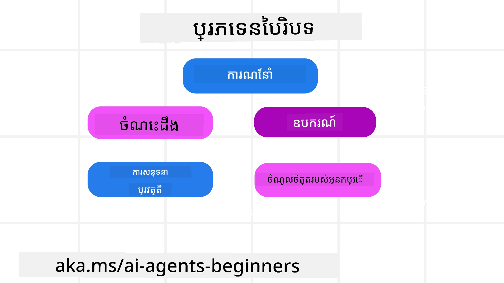
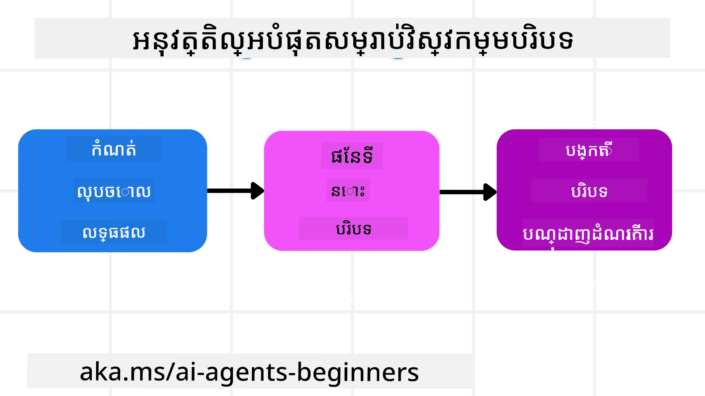

# វិស្សមកាលបទវិជ្ជាជីវៈសម្រាប់ភ្នាក់ងារតូច AI

> _(ចុចលើរូបភាពខាងលើដើម្បីមើលវីដេអូចំណាត់ថ្នាក់ទៀតនេះ)_

ការយល់ដឹងអំពីភាពស្មុគស្មាញនៃកម្មវិធីដែលអ្នកកំពុងបង្កើតភ្នាក់ងារតូច AI សម្រាប់វាមានសារៈសំខាន់ក្នុងការបង្កើតមួយដែលទុកចិត្តបាន។ យើងត្រូវការបង្កើតភ្នាក់ងារតូច AI ដែលគ្រប់គ្រងព័ត៌មានបានយ៉ាងមានប្រសិទ្ធភាពដើម្បីដោះស្រាយតម្រូវការស្មុគស្មាញលើសពីការជំនាញ prompt។

ក្នុងមេរៀននេះ យើងនឹងមើលថាវិបត្តិវិជ្ជាការវិស្សមកាលបែបណាហើយតួនាទីរបស់វាក្នុងការបង្កើតភ្នាក់ងារតូច AI។

## ការណែនាំ

មេរៀននេះនឹងពិពណ៌នាអំពី៖

• **វិបត្តិវិជ្ជាការវិស្សមកាលគឺជាអ្វី** និងមូលហេតុដែលវានៅខុសពីការជំនាញ prompt។

• **យុទ្ធសាស្ត្រសម្រាប់វិបត្តិវិជ្ជាសម្របសម្រួល** រួមទាំងអំពីរបៀបសរសេរ ជ្រើស រឺ ការបង្ហាប់ និងបំបែកព័ត៌មាន។

• **កំហុសយ៉ាងធម្មតានៃចំណុចប្រទាក់** ដែលអាចបំបែកភ្នាក់ងារតូច AI របស់អ្នក ហើយរបៀបដោះស្រាយវា។

## គោលបំណងការសិក្សា

បន្ទាប់ពីបញ្ចប់មេរៀននេះ អ្នកនឹងដឹងរបៀបធ្វើដូចតទៅ៖

• **កំណត់ន័យវិបត្តិវិជ្ជាការវិស្សមកាល** និងផ្ដើមច្បាស់ពីភាពខុសគ្នារវាងវានឹងការជំនាញ prompt។

• **កំណត់ធាតុសំខាន់នៃចំណុចប្រទាក់** នៅក្នុងកម្មវិធីម៉ូដែលភាសាធំ (LLM)។

• **អនុវត្តយុទ្ធសាស្ត្រសម្រាប់សរសេរ ជ្រើស បង្ហាប់ និងបំបែកចំណុចប្រទាក់** ដើម្បីបង្កើនសមត្ថភាពភ្នាក់ងារ។

• **ទទួលស្គាល់កំហុសចំណុចប្រទាក់ប្រចាំ** ដូចជា ការបញ្ចូលព័ត៌មានប្លែក ព្រួយបញ្ហា ស្ទាក់ស្ទើរ និងការប៉ះសំជាមួយនឹងអនុវត្តវិធានការដោះស្រាយ។

## តើវិបត្តិវិជ្ជាការវិស្សមកាលគឺជាអ្វី?

សម្រាប់ភ្នាក់ងារតូច AI ការជំនាន់ជំពូកគឺជាអ្វីដែលជំរុញការរៀបចំដំណើរការភ្នាក់ងារតូច AI ដើម្បីអនុវត្តសកម្មភាពមួយចំនួន។ វិបត្តិវិជ្ជាការវិស្សមកាលគឺជាផលិតកម្មដំណើរការធ្វើអោយប្រាកដថាភ្នាក់ងារតូច AI មានព័ត៌មានត្រឹមត្រូវដើម្បីបញ្ចប់ជំហានបន្ទាប់នៃភារកិច្ច។ បង្អួចចំណុចប្រទាក់មានទំហំកំណត់ ដូច្នេះជាអ្នកបង្កើតភ្នាក់ងារ យើងត្រូវបង្កើតប្រព័ន្ធ និងដំណើរការដើម្បីគ្រប់គ្រងការបញ្ចូល ការដកចេញ និងការបង្ហាប់ព័ត៌មានក្នុងបង្អួចចំណុចប្រទាក់។

### ការជំនាញ Prompt និង ការវិស្សមកាលចំណុចប្រទាក់

ការជំនាញ prompt ផ្តោតលើការបញ្ជាផ្ទាល់មួយសំណុំនៃអត្ថបទថេរ ដើម្បីណែនាំភ្នាក់ងារតូច AI ជាផ្នែកនៃច្បាប់។ វិបត្តិវិជ្ជាការវិស្សមកាលចំណុចប្រទាក់គឺជារបៀបគ្រប់គ្រងព័ត៌មានបង្ហាញអាចបំលែងបាន រួមទាំង prompt ដំបូង ដើម្បីធានាថាភ្នាក់ងារតូច AI មានអ្វីដែលវាត្រូវការជាមួយពេលវេលា។ គំនិតសំខាន់របស់វិបត្តិវិជ្ជាការវិស្សមកាលគឺធ្វើឲ្យដំណើរការនេះអាចធ្វើបានជាបណ្តោះអាសន្ន និងទុកចិត្តបាន។

### ប្រភេទនៃចំណុចប្រទាក់

វាសំខាន់ណាស់ក្នុងការរំលឹកថាចំណុចប្រទាក់មិនមែនជារឿងតែមួយទេ។ ព័ត៌មានដែលភ្នាក់ងារតូច AI ត្រូវការអាចមកពីប្រភពផ្សេងៗ ហើយវាអាស្រ័យលើយើងក្នុងការធានាថាភ្នាក់ងារនោះអាចចូលដំណើរការទៅប្រភពទាំងនោះបាន៖

ប្រភេទចំណុចប្រទាក់ដែលភ្នាក់ងារតូច អាចត្រូវគ្រប់គ្រងរួមបញ្ចូល៖

• **សេចក្តីណែនាំ៖** វាលែងដូចជា "ច្បាប់" របស់ភ្នាក់ងារ — prompts, សារ​ប្រព័ន្ធ, ឧទាហរណ៍ពី few-shot (បង្ហាញរបៀបអោយ AI ធ្វើបែបណា), និងការពិពណ៌នាឧបករណ៍ដែលវាអាចប្រើបាន។ នេះគឺជាកន្លែងដែលការជំនាញ prompt និងការវិស្សមកាលចំណុចប្រទាក់រួមគ្នា។

• **វិជ្ជាជីវៈ:** វា​រួមបញ្ចូលតម្លៃ ព័ត៌មានដែលបានយកពីមូលដ្ឋានទិន្នន័យ ឬការចងចាំរយៈពេលវង់ដែលភ្នាក់ងារប្រមូលផ្តុំបាន។ វារួមបញ្ចូលការជាប់បញ្ចូលប្រព័ន្ធផ្គត់ផ្គង់ការបង្វិលត្រឡប់ (Retrieval Augmented Generation - RAG) ប្រសិនបើភ្នាក់ងារត្រូវការចូលដំណើរការទៅឃ្លាំងវិជ្ជាជីវៈនិងមូលដ្ឋានទិន្នន័យផ្សេងៗ។

• **ឧបករណ៍៖** ជាការកំណត់នៃមុខងារបញ្ចេញខាងក្រៅ, API និង MCP Servers ដែលភ្នាក់ងារ​អាចហៅបាន ព្រមទាំងមតិវិជ្ជមាន (លទ្ធផល) ដែលវាទទួលបានពីការប្រើប្រាស់ពួកវា។

• **ប្រវត្តិការសន្ទនា:** ការសន្ទនាបន្តជាមួយអ្នកប្រើ។ ពេលវេលាប្រៀបធៀប ការសន្ទនានេះក្លាយជាយូរហើយស្មុគស្មាញ ដែលមានន័យថាវាអាចប្រើលំដាប់កន្លែងក្នុងបង្អួចចំណុចប្រទាក់។

• **ចំណង់ចំណូលចិត្តអ្នកប្រើ:** ព័ត៌មានដែលបានរៀនអំពីចំណូលចិត្តឬការមិនចូលចិត្តរបស់អ្នកប្រើនៅលើពេលវេលា។ ព័ត៌មានទាំងនេះអាចត្រូវបានរក្សាទុក និងអាចហៅមកប្រើពេលធ្វើការសម្រេចចិត្តសំខាន់ៗដើម្បីជួយអ្នកប្រើ។

## យុទ្ធសាស្ត្រសម្រាប់វិបត្តិវិជ្ជាការវិស្សមកាលមានប្រសិទ្ធភាព

### យុទ្ធសាស្ត្រ​ការរៀបចំ

ការវិស្សមកាលចំណុចប្រទាក់ទាន់សម័យចាប់ផ្តើមពីការរៀបចំល្អ។ ទីនេះជាវិធីមួយដែលអាចជួយអ្នកចាប់ផ្តើម គិតពីរបៀបអនុវត្តមេរៀននៃវិបត្តិវិជ្ជាការវិស្សមកាល៖

1. **កំណត់លទ្ធផលច្បាស់លាស់** - លទ្ធផលនៃភារកិច្ចដែលភ្នាក់ងារតូច AI នឹងត្រូវបង់ត្រូវត្រូវច្បាស់លាស់។ ឆ្លើយសំណួរ៖ "ពិភពលោកនឹងមានរូបរាងដូចម្តេចពេលភ្នាក់ងារតូច AI បញ្ចប់ការងាររបស់វា?" មានន័យថា តើការផ្លាស់ប្តូរ ព័ត៌មាន ឬការឆ្លើយតបអ្វីដែលអ្នកប្រើគួរត្រូវបានទទួលបន្ទាប់ពីមានការប្រាស្រ័យទាក់ទងជាមួយភ្នាក់ងារតូច AI។
2. **ផែនទីចំណុចប្រទាក់** - បន្ទាប់ពីអ្នកបានកំណត់លទ្ធផលរបស់ភ្នាក់ងារតូច AI អ្នកត្រូវឆ្លើយសំណួរ "ព័ត៌មានអ្វីដែលភ្នាក់ងារតូច AI ត្រូវការ ដើម្បីបញ្ចប់ភារកិច្ចនេះ?"។ ដូច្នេះ អ្នកអាចចាប់ផ្តើមផែនទីចំណុចប្រទាក់នៃកន្លែងដែលព័ត៌មាននោះអាចស្ថិតបាន។
3. **បង្កើតបណ្តាដំណើរការចំណុចប្រទាក់** - ឥឡូវនេះដែលអ្នកដឹងកន្លែងដែលព័ត៌មានស្ថិត អ្នកត្រូវឆ្លើយសំណួរថា "តើភ្នាក់ងារតូច AI នឹងយកព័ត៌មាននេះដោយរបៀបណា?"។ វាអាចធ្វើបានជាច្រើនវិធី រួមទាំង RAG ការប្រើកាស្ទីមមីពី MCP servers និងឧបករណ៍ផ្សេងៗ។

### យុទ្ធសាស្ត្រអនុវត្តន៍

ការរៀបចំសំខាន់ ប៉ុន្តែពេលព័ត៌មានចាប់ផ្តើមចូលទៅក្នុងបង្អួចចំណុចប្រទាក់របស់ភ្នាក់ងារ ពួកយើងត្រូវមានយុទ្ធសាស្ត្រអនុវត្តន៍ ដើម្បីគ្រប់គ្រងវា៖

#### គ្រប់គ្រងចំណុចប្រទាក់

ខណៈពេលដែលព័ត៌មានខ្លះនឹងត្រូវបញ្ចូលទៅក្នុងបង្អួចចំណុចប្រទាក់ដោយស្វ័យប្រវត្តិ វិបត្តិវិជ្ជាការវិស្សមកាលគឺអំពីការទទួលបន្ទុកធ្វើអោយព័ត៌មាននេះមានភាពសកម្ម ដែលអាចធ្វើបានដោយយុទ្ធសាស្ត្រមួយចំនួន៖

 1. **Agent Scratchpad**
 វាអនុញ្ញាតឲ្យភ្នាក់ងារតូច AI កត់ត្រាព័ត៌មានត្រឹមត្រូវអំពីភារកិច្ច និងការប្រាស្រ័យទាក់ទងអ្នកប្រើ ក្នុងអំឡុងពេលមួយសម័យ។ វាគួរត្រូវមាននៅក្រៅបង្អួចចំណុចប្រទាក់ ក្នុងឯកសារឬវត្ថុ runtime ដែលភ្នាក់ងារអាចយកមកប្រើក្រោយក្នុងសម័យនោះ ប្រសិនបើមានត្រូវការ។

 2. **ចងចាំ**
 Scratchpads ល្អសម្រាប់គ្រប់គ្រងព័ត៌មានក្រៅបង្អួចចំណុចប្រទាក្នុងមួយសម័យ។ ចងចាំអនុញ្ញាតឲ្យភ្នាក់ងាររក្សាទុក និងយកព័ត៌មានត្រឹមត្រូវមកវិញបាននៅរយៈពេលជាច្រើនសម័យ។ វាអាចរួមមានសេចក្តីសង្ខេប ចំណង់ចំណូលចិត្តអ្នកប្រើ និងមតិយោបល់សម្រាប់ការកែលំអរនាពេលអនាគត។

 3. **ការបង្ហាប់ចំណុចប្រទាក់**
  ពេលដែលបង្អួចចំណុចប្រទាក់ធំឡើងនិងកាន់តែស្ទើរទទួលបានកំណត់ ខុសបច្ចេកទេសដូចជាសេចក្តីសង្ខេប និងការកាត់ត្រូវបានប្រើប្រាស់។ វារួមមានតែរក្សាព័ត៌មានសំខាន់បំផុត ឬដកសារចាស់ចេញ។
  
 4. **ប្រព័ន្ធភ្នាក់ងារជាច្រើន**
  ការអភិវឌ្ឍប្រព័ន្ធភ្នាក់ងារជាច្រើនគឺជារបៀបមួយនៃវិបត្តិវិជ្ជាការវិស្សមកាល ព្រោះភ្នាក់ងារ​រៀងៗខ្លួនមានបង្អួចចំណុចប្រទាក់ផ្ទាល់ខ្លួន។ របៀបដែលចំណុចប្រទាក់នោះចែករំលែកនិងផ្លាស់ប្តូរទៅភ្នាក់ងារផ្សេងគឺជារឿងមួយដែលត្រូវរៀបចំឡើងនៅពេលបង្កើតប្រព័ន្ធទាំងនេះ។
  
 5. **បរិយាកាស Sandbox**
  ប្រសិនបើភ្នាក់ងារត្រូវប្រតិបត្តិខូដណាមួយ ឬដំណើរការព័ត៌មានច្រើននៅក្នុងឯកសារ វានឹងចំណាយនូវបរិមាណ token ធំក្នុងការបញ្ចូលលទ្ធផល។ ជំនួសការផ្ទុកទាំងនេះក្នុងបង្អួចចំណុចប្រទាក់ ភ្នាក់ងារអាចប្រើបរិយាកាស Sandbox ដែលអាចរត់កូដកូដនេះ ហើយអានត្រឹមលទ្ធផលនិងព័ត៌មានសំខាន់ៗប៉ុណ្ណោះ។
  
 6. **វត្ថុស្ថាន Runtime**
   វាត្រូវបានធ្វើឡើងដោយបង្កើតធុងនៃព័ត៌មាន ដើម្បីគ្រប់គ្រងស្ថានការណ៍ពេលភ្នាក់ងារត្រូវមានការចូលដំណើរការព័ត៌មានមួយចំនួន។ សម្រាប់ភារកិច្ចស្មុគស្មាញ វានឹងអនុញ្ញាតឲ្យភ្នាក់ងាររក្សាផលនៃជំហានរងៗ តាមជំហាន ដើម្បីឲ្យចំណុចប្រទាក់នៅតែភ្ជាប់ទៅកាន់ភារកិច្ចរងជាក់លាក់នោះ។

#### ធ្វើការត្រួតពិនិត្យចំណុចប្រទាក់

បន្ទាប់ពីអ្នកប្រើយុទ្ធសាស្ត្រមួយក្នុងចំណោមនេះ វាគួរត្រូវបានពិនិត្យនូវអ្វីដែលការហៅម៉ូឌែលបន្ទាប់ទទួលបាន។ សំណួរដើម្បីជួយ Debug គឺ៖

> តើភ្នាក់ងារបានផ្ទុកចំណុចប្រទាក់ច្រើនពេក ចំណុចបានខុសឬខាតចំណុចដែលវាត្រូវការឬអត់?

អ្នកមិនចាំបាច់កត់ត្រារ Prompt ឬលទ្ធផលឧបករណ៍ ឬគ្រឿងចងចាំ ដើម្បីឆ្លើយសំណួរនេះទេ។ នៅក្នុងការផលិត ពេញចិត្តនឹងកត់ត្រាការត្រួតពិនិត្យចំណុចតូចៗដែលមានការបត់បែន គណនា លេខសម្គាល់ ហាស និងស្លាកគោលនយោបាយ៖

- **ការជ្រើសរើស៖** តាមដានចំនួនខ្នាតគណនា ឧបករណ៍ ឬចងចាំដែលបានពិចារណា ចំនួនដែលបានជ្រើស និងច្បាប់ ឬពិន្ទុដែលបណ្តាលឲ្យផ្សេងៗត្រូវបានលុបចោល។
- **ការបង្ហាប់៖** កត់ត្រាបរិមាណប្រភព ឬ ID ដំណើរការតាមមតិ ID សង្ខេប ការប៉ាន់ស្មានចំនួន token មុននិងក្រោយបង្ហាប់ និងថាតើមាតិកាធម្មតាត្រូវបានដកចេញពីការហៅបន្ទាប់ឬអត់។
- **ការបំបែក៖** កត់ត្រិយារវាងភារកិច្ចរងដែលបានរត់នៅភ្នាក់ងារផ្សេង សម័យ ឬ sandbox អ្វីដែលសង្ខេបបានត្រូវត្រឡប់មកវិញ និងថាតើលទ្ធផលឧបករណ៍ធំៗនៅក្រៅចំណុចប្រទាក់ភ្នាក់ងារមេ។
- **ចងចាំ និង RAG:** រក្សាទុក ID ឯកសារទាញយក ប្រវត្តិចងចាំ ពិន្ទុ ID ដែលបានជ្រើស និងស្ថានភាពរបស់ការកែប្រែ ជំនួសការទាញយកអត្ថបទពេញលេញ។
- **សុវត្ថិភាព និងឯកជនភាព:** ចូលចិត្តហាស ID ប៊ុតខាំ token និងស្លាកគោលនយោបាយជាងអត្ថបទ prompt ដែលមានសំខាន់ តក្ក័យបargumentsា លទ្ធផលឧបករណ៍ ឬរាងកាយចងចាំអ្នកប្រើ។

គោលបំណងមិនមែនរក្សាទុកចំណុចប្រទាក់មួយច្រើនទេ។ គឺដើម្បីទុកភស្តុតាងគ្រប់គ្រាន់ដែលអ្នកអភិវឌ្ឍករកំពុងធ្វើដំណើរការយុទ្ធសាស្ត្រចំណុចប្រទាក់ និងថាតើវាបានផ្លាស់ប្តូរការហៅម៉ូឌែលបន្ទាប់ដូចចង់បានឬអត់។

### ឧទាហរណ៍នៃវិបត្តិវិជ្ជាការវិស្សមកាល

យើងនិយាយថាអ្នកចង់បានភ្នាក់ងារតូច AI ដើម្បី **"កក់ច្រើនដំណើរកម្សាន្តទៅទីក្រុងប៉ារីស"**

• ភ្នាក់ងារងាយៗដែលប្រើតែល្បែងជំនាញ prompt អាចឆ្លើយតែ  **"យល់ព្រម ហើយអ្នកចង់ទៅប៉ារីសពេលណា?"**។ វាប្រតិបត្តិការចម្លើយផ្ទាល់របស់អ្នកនៅពេលអ្នកបានសួរ។

• ភ្នាក់ងារដែលប្រើយុទ្ធសាស្ត្រវិបត្តិវិជ្ជាការវិស្សមកាលនឹងធ្វើអ្វីមួយច្រើនជាងនេះ។ មុនពេលឆ្លើយវានឹង៖

  ◦ **ត្រួតពិនិត្យតារារបស់អ្នក** សំរាប់កាលបរិច្ឆេទដែលមាន (យកទិន្នន័យពេលវេលា)

 ◦ **ចងចាំចំណង់ចំណូលចិត្តធ្វើដំណើរពីមុន** (ពីចងចាំរយៈពេលវែង) ដូចជាសេវាហោះហើរដែលអ្នកចូលចិត្ត ប្រាក់វិនិយោគ ឬអ្នកចូលចិត្តហោះហើរប្រក់ផ្តាច់មុខ

 ◦ **កំណត់ឧបករណ៍ដែលអាចប្រើបាន** សម្រាប់កក់ហោះហើរ និងសណ្ឋាគារ។

- បន្ទាប់មក ឧទាហរណ៍ចម្លើយអាចជារាបួរ៖ "សួស្តី [ឈ្មោះអ្នក]! ខ្ញុំឃើញ ថ្ងៃសប្ដាហ៍ដំបូងរបស់ខែកញ្ញា អ្នកអាចត្រូវការហោះហើរប្រក់ផ្តាច់មុខទៅប៉ារីសជាមួយ [សេវាហោះហើរ] ក្នុងសមាសភាពប្រាក់ [ថវិកា] ដែរឬ?។" ចម្លើយដែលមានចំណុចប្រទាក់ច្រើននេះបង្ហាញអំពីអំណាចនៃវិបត្តិវិជ្ជាការវិស្សមកាល។

## កំហុសចំណុចប្រទាក់ធម្មតា

### ការបំពុលចំណុចប្រទាក់

**វាជាអ្វី:** ពេលមាន hallucination (ព័ត៌មានមិនត្រឹមត្រូវដែលម៉ូឌែលភាសាធំបង្កើត) ឬកំហុសណាមួយចូលទៅក្នុងចំណុចប្រទាក់ ហើយត្រូវបានយោងជាប់ជានិច្ច បណ្តាលឲ្យភ្នាក់ងារតូចបន្តកាលពីគោលបំណងមិនអាចមែនបានឬបង្កើតយុទ្ធសាស្ត្រគ្មានន័យ។

**របៀបដោះស្រាយ៖** អនុវត្ត **ការផ្ទៀងផ្ទាត់ចំណុចប្រទាក់** និង **ដាក់ទណ្ឌកម្ម**។ ផ្ទៀងផ្ទាត់ព័ត៌មាន មុននឹងបញ្ចូលទៅក្នុងចងចាំរយៈពេលវែង។ ប្រសិនបើរកឃើញការបំពុល យកចំណុចប្រទាក់ម្ដាប់ថ្មី ដើម្បីទប់ស្កាត់ព័ត៌មានអាក្រក់ពីការបណ្តាលផ្សាយ។

**ឧទាហរណ៍កក់ដំណើរកម្សាន្ត៖** ភ្នាក់ងាររបស់អ្នកបង្កើត hallucination នៃ **ការហោះហើរប្រក់ផ្តាច់មុខពីអាកាសយានដ្ឋានតូចមួយទៅទីក្រុងអន្ដរជាតិឆ្ងាយ** ដែលពិតប្រាកដមិនមានពីរកន្លែងនេះចេញ។ ព័ត៌មានហោះហើរដែលមិនមាននេះត្រូវបានរក្សាទុកក្នុងចំណុចប្រទាក់។ បន្ទាប់មកពេលអ្នកស្នើភ្នាក់ងារកក់វានឹងព្យាយាមស្វែងរកសំបុត្រជាប់លទ្ធផលរបៀបដែលមិនអាចទៅរួចនេះដែលបណ្តាលឲ្យកំហុសបន្ត។

**ដំណោះស្រាយ៖** អនុវត្តផ្លូវការ ដែល **ផ្ទៀងផ្ទាត់ប្រមាណភាពនិងផ្លូវហោះហើរជាមួយ API ពេលវេលាជាក់ស្តែង** _មុន_ បញ្ចូលព័ត៌មានហោះហើរចូលចំណុចប្រទាក់ប្រតិបត្តិការ។ ប្រសិនបើផ្ទៀងផ្ទាត់មិនជោគជ័យ ព័ត៌មានខុសនោះត្រូវបាន "ដាក់ទណ្ឌកម្ម" ហើយមិនប្រើបន្ថែមទៀត។

### ការយល់ច្រឡំចំណុចប្រទាក់

**វាជាអ្វី:** ពេលចំណុចប្រទាក់ធំពេក ដែលម៉ូឌែលផ្តោតលើប្រវត្តិសម័យចាស់ខ្លាំងពេក ជំនួសពីការប្រើប្រាស់អ្វីដែលវាសិក្សាក្នុងបណ្តុះបណ្តាល បណ្តាលឲ្យភ្នាក់ងារធ្វើសកម្មភាពមិនមានប្រយោជន៍ ឬកើតកំហុសមុនចំណុចប្រទាក់ពេញ។

**របៀបដោះស្រាយ៖** ប្រើ **ការសង្ខេបចំណុចប្រទាក់**។ យកពេលពេញវេលា បង្ហាប់ព័ត៌មានដែលបានបញ្ចូលទៅក្នុងមេរៀន​ក្លាយជា សេចក្តីសង្ខេបខ្លីៗ រក្សាទុកព័ត៌មានសំខាន់ៗ ខណៈដកប្រវត្តិដែលមិនចាំបាច់ចេញ។ វាជួយ "កំណត់ម្តងទៀត" ចំណុចផ្តោត។

**ឧទាហរណ៍កក់ដំណើរកម្សាន្ត៖** អ្នកបានពិភាក្សាអំពីគោលដៅធ្វើដំណើរនានាខ្លាំង រួមទាំងការពិពណ៌នាដំណើរកម្សាន្តពីពីរឆ្នាំមុន។ ពេលចុងក្រោយអ្នកស្នើ **"សូមរកសំបុត្រហោះហើរថោកប្រចាំខែក្រោយ"** ភ្នាក់ងារ​នោះត្រូវបានលំបាកដោយព័ត៌មានចាស់ៗ និងបានសួរអំពីសម្ភារៈជាផ្ទៃខាងក្រោយ ឬកាលវិភាគពីមុន មិនបានយកចាប់អារម្មណ៍លើសំណើបច្ចុប្បន្នរបស់អ្នកទេ។

**ដំណោះស្រាយ៖** បន្ទាប់ពីប្រាប់ប្រក្រតីជាច្រើន ឬពេលចំណុចប្រទាក់ធំធេង ភ្នាក់ងារគួរតែ **សង្ខេបផ្នែកពាក់ព័ន្ធទើបនៃការសន្ទនាចុងក្រោយ** – ផ្តោតលើកាលបរិច្ឆេទនិងគោលដៅធ្វើដំណើរបច្ចុប្បន្ន – ហើយប្រើសង្ខេបទ្រង់ទ្រាយសម្រាប់ការហៅម៉ូឌែលបន្ទាប់ ដកចេញសារញឹកញាប់កន្លងទៅ។

### ការភាន់ច្រឡំចំណុចប្រទាក់

**វាជាអ្វី:** ពេលមានចំណុចប្រទាក់មិនចាំបាច់ ជាទូទៅជាទម្រង់ឧបករណ៍ដែលមានច្រើនពេក បណ្តាលឲ្យម៉ូឌែលបង្កើតចម្លើយខុស ឬហៅឧបករណ៍មិនពាក់ព័ន្ធ។ ម៉ូឌែលតូចត្រូវទទួលជាទំនាញនេះច្រើនជាង។

**របៀបដោះស្រាយ៖** អនុវត្ត **ការគ្រប់គ្រងបញ្ជីឧបករណ៍យ៉ាងតឹងរ៉ឹង** ដោយប្រើបច្ចេកទេស RAG។ រក្សាទុកការពិពណ៌នាឧបករណ៍នៅក្នុងមូលដ្ឋានទិន្នន័យជាទម្រង់វ៉ិចទ័រ និងជ្រើសយក _តែ_ ឧបករណ៍សមស្របបំផុតសម្រាប់ភារកិច្ចជាក់លាក់។ ការស្រាវជ្រាវបង្ហាញថាត្រូវកំណត់ឧបករណ៍តិចជាង ៣០។

**ឧទាហរណ៍កក់ដំណើរកម្សាន្ត៖** ភ្នាក់ងាររបស់អ្នកមានការចូលដំណើរការឧបករណ៍ជាច្រើន៖ `book_flight`, `book_hotel`, `rent_car`, `find_tours`, `currency_converter`, `weather_forecast`, `restaurant_reservations` ល។ អ្នកសួរ **"ធ្វើដូចម្តេចដើម្បីធ្វើដំណើរជុំវិញប៉ារីសបានល្អ?"** ពីការកាន់តែច្រើននៃឧបករណ៍នេះ ភ្នាក់ងារបានភាន់ច្រឡំ ហើយព្យាយាមហៅ `book_flight` _ក្នុង_ ប៉ារីស ឬ `rent_car` ទោះបីអ្នកចូលចិត្តសាធារណរដ្ឋផង ដោយឥទ្ឋូវដោយការពិពណ៌នាឧបករណ៍អាចឃ្លាំមើលគ្នា ឬវាមិនវិវឌ្ឍបានក្នុងការសំខាន់ជាងគេ។

**ដំណោះស្រាយ៖** ប្រើ **RAG សម្រាប់ការពិពណ៌នាឧបករណ៍**។ ពេលអ្នកសួរអំពីការធ្វើដំណើរជុំវិញប៉ារីស ប្រព័ន្ធយក _តែ_ ឧបករណ៍មានប្រយោជន៍បំផុត ដូចជា `rent_car` ឬ `public_transport_info` ដោយផ្អែកលើការស្វែងរករបស់អ្នក ប្រធានបទឧបករណ៍ចំរុះទៅម៉ូឌែលភាសា។

### ការប៉ះសំជាមួយចំណុចប្រទាក់

**វាជាអ្វី:** ពេលមានព័ត៌មានប្រឆាំងគ្នា លើចំណុចប្រទាក់ បណ្តាលឲ្យសេចក្តីត្រិះរិះបញ្ជាក់មិនសៀង មិនសូវមានចម្លើយល្អនៅចុងក្រោយ។ វាមិនញឹកញាប់កើតមានពេលព័ត៌មានចូលស្ទួនគ្នា និងការសន្មត់ខុសនៅដើមនៅក្នុងចំណុចប្រទាក់។

**របៀបដោះស្រាយ៖** ប្រើ **ការកាត់ចេញចំណុចប្រទាក់** និង **ការផ្ទុកចេញ**។ ការកាត់ចេញមានន័យថាលុបព័ត៌មានចាស់ឬបញ្ហា តាមពេលព័ត៌មានថ្មីចូល។ ការផ្ទុកចេញផ្តល់ឲ្យម៉ូឌែលនូវកន្លែងធ្វើការបំបែកចំណុចប្រទាក់ជាកន្លែងប្លែក ដើម្បីដំណើរការព័ត៌មានដោយមិនរំខានចំណុចផ្ទាល់ខ្លួន។

**ឧទាហរណ៍កក់ដំណើរកម្លាំង:** អ្នកផ្តើមប្រាប់ភ្នាក់ងាររបស់អ្នកថា, **"ខ្ញុំចង់ជាវសំបុត្រថ្នាក់សេដ្ឋកិច្ច។"** បន្ទាប់ពីសន្ទស្សន៍ អ្នកផ្លាស់ប្តូរជំនឿ និងនិយាយថា, **"ជាក់ស្តែង សម្រាប់ដំណើរកម្លាំងនេះ យ៉ាងហោចណាស់ យើងទៅថ្នាក់អាជីវកម្ម។"** ប្រសិនបើការណែនាំទាំងពីរនៅក្នុងបរិបទ ភ្នាក់ងារអាចទទួលបានលទ្ធផលស្វែងរកមិនស្របគ្នា ឬរអាក់រអួលពីតើត្រូវអនុវត្តចំណង់ចិត្តណាដែលត្រូវបានផ្តល់សំខាន់ជាងគេ។

**ដំណោះស្រាយៈ** អនុវត្ត **ការកាត់បន្ថយបរិបទ**។ ពេលណាដែលការណែនាំថ្មីជៀសវាងនឹងការណែនាំចាស់ ការណែនាំចាស់ត្រូវបានដកចេញ ឬបានលើកតម្រូវឲ្យមានការប្ដូរពិតប្រាកដក្នុងបរិបទ។ ជំនួសឱ្យនោះ ភ្នាក់ងារអាចប្រើប្រាស់ **សៀវភៅរៀបចំ** ដើម្បីសម្របសម្រួលចំណង់ចិត្តទាំងនេះមុនពេលសំចាត់ ដើម្បីធានាថា មានតែការណែនាំចុងក្រោយ ដែលជាការប្រកបដោយការស្របគ្នា ដែលនឹងដឹកនាំអំពើរបស់វា។

## តើអ្នកមានសំណួរបន្ថែមអំពីវិស្វកម្មបរិបទទៀតទេ?

ចូលរួមនៅក្នុង [Microsoft Foundry Discord](https://discord.com/invite/ATgtXmAS5D) ដើម្បីជួបជាមួយអ្នករៀនផ្សេងទៀត ចូលរួមជាអ្នកចូលរួមម៉ោងការិយាល័យ និងទទួលបានចម្លើយសម្រាប់សំណួរអំពីភ្នាក់ងារ AI របស់អ្នក។

---

<!-- CO-OP TRANSLATOR DISCLAIMER START -->
**ការបដិសេធ**:
ឯកសារនេះត្រូវបានបម្លែងភាសា ដោយប្រើសេវាបម្លែងភាសា AI [Co-op Translator](https://github.com/Azure/co-op-translator)។ ទោះយើងខ្ញុំមានក្តីប្រាថ្នាឱ្យបានច្បាស់លាស់ តែសូមយល់ដឹងថាការបម្លែងដោយស្វ័យប្រវត្តិក៏អាចមានកំហុសឬភាពមិនត្រឹមត្រូវ។ ឯកសារដើមជាភាសាទីតាំងគួរត្រូវបានគេប្រើជាប្រភពច្បាស់លាស់។ សម្រាប់ព័ត៌មានសំខាន់ៗ សូមណែនាំឱ្យប្រើប្រាស់ការប្រែដោយមនុស្សជំនាញ។ យើងខ្ញុំមិនទទួលខុសត្រូវចំពោះការយល់ច្រឡំ ឬការបកស្រាយខុសបន្ទាប់ពីការប្រើប្រាស់ការបម្លែងនេះនោះទេ។
<!-- CO-OP TRANSLATOR DISCLAIMER END -->