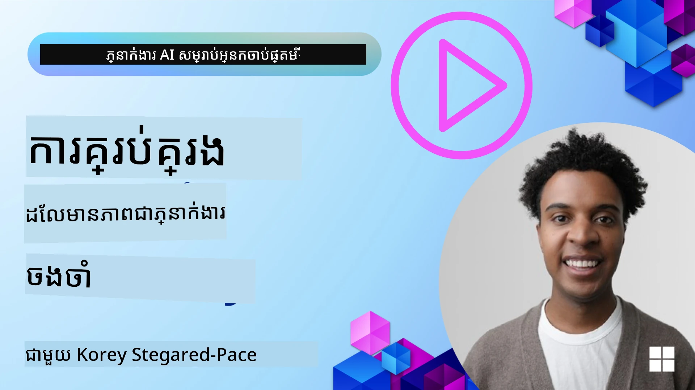

# អង្គចងចាំសម្រាប់ភ្នាក់ងារតម្លើងបញ្ញាសិប្បនិម្មិត

ពេលពិភាក្សាអំពីអត្ថប្រយោជន៍ជាក់លាក់នៃការបង្កើតភ្នាក់ងារតម្លើងបញ្ញាសិប្បនិម្មិត មានរឿងសំខាន់ ២ ធ្វើឡើង៖ សមត្ថភាពហៅឧបករណ៍ដើម្បីបំពេញភារកិច្ច និងសមត្ថភាពធ្វើឲ្យប្រសើរឡើងជាមួយពេលវេលា។ អង្គចងចាំគឺជាគ្រឹះសម្រាប់បង្កើតភ្នាក់ងារដែលអាចធ្វើឲ្យល្អប្រសើរជាផ្ទាល់ខ្លួន ដែលអាចបង្កើតបទពិសោធន៍ល្អជាងសម្រាប់អ្នកប្រើប្រាស់របស់យើង។

ក្នុងមេរៀននេះ យើងនឹងមើលអំពីអ្វីទៅជាអង្គចងចាំសម្រាប់ភ្នាក់ងារតម្លើងបញ្ញា និងរបៀបដែលយើងអាចគ្រប់គ្រង និងប្រើវាសម្រាប់អត្ថប្រយោជន៍នៃកម្មវិធីរបស់យើង។

## ការណែនាំ

មេរៀននេះនឹងគ្របដណ្តប់៖

• **ការយល់ដឹងអំពីអង្គចងចាំភ្នាក់ងារតម្លើងបញ្ញា**៖ អង្គចងចាំជាអ្វី និងហេតុអ្វីបានជាវាសំខាន់សម្រាប់ភ្នាក់ងារ។

• **ការអនុវត្តន៍ និងការផ្ទុកអង្គចងចាំ**៖ វិធីវត្ថុបំណងសម្រាប់បន្ថែមសមត្ថភាពអង្គចងចាំទៅការងាររបស់ភ្នាក់ងារតម្លើងបញ្ញា រួមមានអង្គចងចាំរយៈពេលខ្លី និងរយៈពេលវែង។

• **ធ្វើឲ្យភ្នាក់ងារតម្លើងបញ្ញាធ្វើការកែលម្អផ្ទាល់ខ្លួន**៖ របៀបដែលអង្គចងចាំអនុញ្ញាតឲ្យភ្នាក់ងាររៀនពីអន្តរកម្មមុនៗ និងធ្វើការកែលម្អជាមួយពេលវេលា។

## ការអនុវត្តដែលមាន

មេរៀននេះរួមបញ្ចូលការបង្រៀនកំណត់ហេតុទំហំទូលំទូលាយ ២៖

• **[13-agent-memory.ipynb](./13-agent-memory.ipynb)**៖ អនុវត្តន៍អង្គចងចាំដោយប្រើ Mem0 និង Azure AI Search ជាមួយ Microsoft Agent Framework

• **[13-agent-memory-cognee.ipynb](./13-agent-memory-cognee.ipynb)**៖ អនុវត្តន៍អង្គចងចាំរចនាសម្ព័ន្ធដោយប្រើ Cognee ដែលបង្កើតប្លង់ចំណេះដឹងដោយស្វ័យប្រវត្តិក្នុងការគាំទ្រដោយ embeddings, មើលប្លង់ ភ្ជាប់សំណួរល្អប្រសើរ

## គោលបំណងរៀន

បន្ទាប់ពីបញ្ចប់មេរៀននេះ អ្នកនឹងដឹងរបៀប៖

• **បំបែកភាពខុសគ្នារវាងប្រភេទអង្គចងចាំភ្នាក់ងារតម្លើងបញ្ញាជាច្រើន**, រួមមានអង្គចងចាំកំពុងធ្វើការ, រយៈពេលខ្លី និងរយៈពេលវែង ព្រមទាំងទម្រង់ជាក់លាក់ដូចជាតួអង្គ និងអង្គចងចាំអភិវឌ្ឍន៍កំណត់ហេតុ។

• **អនុវត្តន៍ និងគ្រប់គ្រងអង្គចងចាំរយៈពេលខ្លី និងវែងសម្រាប់ភ្នាក់ងារតម្លើងបញ្ញា** ដោយប្រើ Microsoft Agent Framework, ដំណើរការឧបករណ៍ដូចជា Mem0, Cognee, អង្គចងចាំ Whiteboard និងការរួមបញ្ចូលជាមួយ Azure AI Search។

• **យល់ដឹងពីគោលការណ៍ពីក្រោយភ្នាក់ងារតម្លើងបញ្ញាដែលធ្វើកែលម្អផ្ទាល់ខ្លួន** និងរបៀបដែលប្រព័ន្ធគ្រប់គ្រងអង្គចងចាំដ៏ខ្លាំងអាចបរិច្ចាជនរៀននិងបំរើការបត់បែនបានយ៉ាងតម្រុយ។

## ការយល់ដឹងអំពីអង្គចងចាំភ្នាក់ងារតម្លើងបញ្ញា

នៅចំបង, **អង្គចងចាំសម្រាប់ភ្នាក់ងារតម្លើងបញ្ញាជាការប្រើប្រាស់យន្តការដែលអនុញ្ញាតឲ្យពួកវាទុក និងអាចយកព័ត៌មានចេញពីចិត្តបាន**។ ព័ត៌មាននេះអាចជាអ្នកលម្អិតជាក់លាក់អំពីការពិភាក្សា, ចំណូលចិត្តរបស់អ្នកប្រើប្រាស់, សកម្មភាពកន្លងមក ឬគូស patterns បានរៀន។

ប្រសិនបើគ្មានអង្គចងចាំ កម្មវិធី AI ជាច្រើនគឺមិនមានស្ថានភាព (stateless), មានន័យថា អន្តរកម្មនីមួយៗចាប់ផ្តើមពីសូន្យ។ នេះនាំឲ្យមានបទពិសោធន៍អ្នកប្រើប្រាស់មិនចេញល្អហើយធ្វើឲ្យភ្នាក់ងារ "ភ្លេច" បរិបទឬចំណូលចិត្តដែលបានរក្សាទុកពីមុន។

### ហេតុអ្វីអង្គចងចាំមានសារៈសំខាន់?

យុទ្ធសាស្ត្ររបស់ភ្នាក់ងារឡើងស្មារតីតម្លើងនៅក្នុងសមត្ថភាពរបស់វានៅក្នុងការយកសារដែលបានផ្ដល់មុនមកហើយប្រើប្រាស់វា។ អង្គចងចាំអនុញ្ញាតឲ្យភ្នាក់ងារមានលក្ខណៈ៖

• **ចង្អុលបង្ហាញ**៖ រៀនពីសកម្មភាព និងលទ្ធផលមុនៗ។

• **អន្តរកម្ម**៖ រក្សាបរិបទធ្វើការពិភាក្សាចាប់តាំងពីដើម។

• **សកម្ម និងឆ្លើយតប**៖ ទាយដានតម្រូវការឬឆ្លើយតបបានត្រឹមត្រូវពីព័ត៌មានប្រវត្តិ។

• **ដោយឡែកដោយខ្លួនឯង**៖ ធ្វើការជាការងារអាចបែបឯករាជ្យដោយយកចំណេះដឹងដែលបានរក្សាទុក។

គោលបំណងនៃការអនុវត្តអង្គចងចាំគឺធ្វើឲ្យភ្នាក់ងារមានសមត្ថភាព និង ទីវិជ្ជមាន។

### ប្រភេទអង្គចងចាំ

#### អង្គចងចាំកំពុងធ្វើការ

គិតថាវាដូចជាក្រដាសកែសម្រួលមួយដែលភ្នាក់ងារប្រើក្នុងការបំពេញកិច្ចការឬដំណើរការគិតមួយដែរនៅពេលឥតឈប់ឈរ។ វាផ្ទុកព័ត៌មានភ្លាមៗដែលត្រូវការ ដើម្បីគណនា ជំហានបន្ទាប់។

សម្រាប់ភ្នាក់ងារតម្លើងបញ្ញា អង្គចងចាំកំពុងធ្វើការមានមុខងារចាប់យកព័ត៌មានសំខាន់បំផុតពីការពិភាក្សា ទោះបីជាបរិបទពាសពេញជាច្រើន ឬត្រូវកាត់បន្ថយក៏ដោយ។ វាផ្ដោតលើការដកសេសវត្ថុដែលសំខាន់ដូចជាតម្រូវការ, គម្រោង, សំរេចចិត្ត និងសកម្មភាព។

**ឧទាហរណ៍អង្គចងចាំកំពុងធ្វើការ**

ក្នុងភ្នាក់ងារការកក់ទំនិញធ្វើដំណើរ អង្គចងចាំកំពុងធ្វើការ អាចចាប់យកការស្នើសុំបច្ចុប្បន្នរបស់អ្នកប្រើប្រាស់ ដូចជា "ខ្ញុំចង់កក់ដំណើរទៅទីក្រុងប៉ារីស"។ តម្រូវការលម្អិតនេះ ត្រូវបានរក្សាទុកនៅក្នុងបរិបទភ្នាក់ងារបច្ចុប្បន្ន ដើម្បីណែនាំអន្តរកម្មបច្ចុប្បន្ន។

#### អង្គចងចាំរយៈពេលខ្លី

ប្រភេទអង្គចងចាំនេះរក្សាទុកព័ត៌មានសម្រាប់រយៈពេលនៃការពិភាក្សាឬប្រតិបត្តិការដំបូងមួយ។ វាជាបរិបទនៃការជជែកបច្ចុប្បន្ន ឲ្យភ្នាក់ងារអាចយោងទៅកាន់ជំហានមុនៗក្នុងបន្ទាត់ទៅមុខ។

ក្នុងគំរូ [Microsoft Agent Framework](https://github.com/microsoft/agent-framework) Python SDK នេះផ្គូរផ្គងជា `AgentSession` ដែលបានបង្កើតជាមួយ `agent.create_session()`។ អង្គចងចាំរយៈពេលខ្លីរបស់ framework រក្សាបរិបទជជែកនៅពេលដែលសម័យនោះត្រូវបានប្រើឡើងវិញ ប៉ុន្តាបរិបទនោះមិនត្រូវបានរក្សាទុករហូតទាល់ត្បូងមុនពេលសម័យបញ្ចប់ ឬកម្មវិធីចាប់ផ្តើមឡើងវិញ។ ប្រើអង្គចងចាំរយៈពេលវែងសម្រាប់ទិន្នន័យ និងចំណូលចិត្តដែលត្រូវការរស់នៅលើពេលវេលាច្រើន ជាទៀងទាត់តាមរយៈមូលដ្ឋានទិន្នន័យ, ធាតុសរសេរូបភាពវ៉ិចទ័រ ឬហាងផ្ទុកអស់សុពលភាពផ្សេងទៀត។

**ឧទាហរណ៍អង្គចងចាំរយៈពេលខ្លី**

ប្រសិនបើអ្នកប្រើសួរ "តើតម្លៃសំបុត្រយន្តហោះទៅប៉ារីសប៉ុន្មាន?" ហើយបន្ទាប់មកបានសួរថា "តើអំពីការស្នាក់នៅទីនោះវិញ?" អង្គចងចាំរយៈពេលខ្លីធានាថា ភ្នាក់ងារយល់ថា "ទីនោះ" មានន័យថា "ប៉ារីស" ក្នុងការពិភាក្សាចាប់ពីដើម។

#### អង្គចងចាំរយៈពេលវែង

នេះជាព័ត៌មានដែលរក្សាទុករយៈពេលការពិភាក្សាច្រើនឬសម័យជាច្រើន។ វាអនុញ្ញាតឲ្យភ្នាក់ងារចងចាំចំណូលចិត្តអ្នកប្រើប្រាស់, អន្តរកម្មប្រវត្តិសាស្រ្ត ឬចំណេះដឹងទូទៅអំឡុងពេលវែង។ វាសំខាន់សម្រាប់ការបម្រើផ្ទាល់ខ្លួន។

**ឧទាហរណ៍អង្គចងចាំរយៈពេលវែង**

អង្គចងចាំរយៈពេលវែង អាចរក្សាទុកថា "Ben ចូលចិត្តលេងស្គី និងសកម្មភាពក្រៅ, ចូលចិត្តកាហ្វេជាមួយទេសទេសភ្នំ, ហើយចង់ជៀសវាងល្បាតស្គីកម្រិតខ្ពស់ដោយសារតែរបួសកន្លងមក"។ ព័ត៌មាននេះ បានរៀនពីអន្តរកម្មមុនៗ មានឥទ្ធិពលលើការបញ្ជូនការណែនាំក្នុងវគ្គផែនការធ្វើដំណើរពេលអនាគត ធ្វើឲ្យវាប្តាក់អត្រាបានខ្ពស់។

#### អង្គចងចាំតួអង្គ

ប្រភេទអង្គចងចាំជាក់លាក់នេះជួយឲ្យភ្នាក់ងារអភិវឌ្ឍគន្លង "បុគ្គលិកលក្ខណៈ" ឬ "បុគ្គលប្រភេទ" ដែលមានតម្លៃជាមួយសកម្មភាព។ វាអនុញ្ញាតឲ្យភ្នាក់ងារចងចាំលម្អិតអំពីខ្លួនវាឬតួនាទីដែលវាគួរតែមាន ដែលធ្វើឲ្យអន្តរកម្មមានភាពរលូន និងផ្តោត។

**ឧទាហរណ៍អង្គចងចាំតួអង្គ**
ប្រសិនបើភ្នាក់ងារធ្វើដំណើរត្រូវបានរចនាឲ្យជាអ្នក "និយោបាយស្គីឯកទេស," អង្គចងចាំតួអង្គ អាចពង្រឹងតួនាទីនេះ ដើម្បីឆ្លើយតបបានតាមសំឡេង និងចំណេះដឹងរបស់អ្នកឯកទេស។

#### អង្គចងចាំការងារឥតខ្សែភាពយន្ត/អភិវឌ្ឍន៍កំណត់ហេតុ

អង្គចងចាំនេះផ្ទុកលំដាប់ជំហានដែលភ្នាក់ងារធ្វើក្នុងភារកិច្ចស្មុគស្មាញ រួមមានជោគជ័យនិងបរាជ័យ។ វាដូចជាការចងចាំ "វគ្គ" ជាក់លាក់ ឬបទពិសោធន៍មុនៗដើម្បីរៀនពីវា។

**ឧទាហរណ៍អង្គចងចាំអភិវឌ្ឍន៍កំណត់ហេតុ**

ប្រសិនបើភ្នាក់ងារព្យាយាមកក់សំបុត្រយន្តហោះជាក់លាក់មួយ ប៉ុន្តែបរាជ័យដោយសារតែគ្មានស្រេចហើយ អង្គចងចាំអភិវឌ្ឍន៍អាចកត់ត្រាការបរាជ័យនេះ អនុញ្ញាតឲ្យភ្នាក់ងារព្យាយាមយន្តហោះជំនួស ឬប្រាប់អ្នកប្រើអំពីបញ្ហាបានយ៉ាងមានចំណេះទទួលបាននៅពេលព្យាយាមម្ដងក្រោយ។

#### អង្គចងចាំអង្គភាព

វារួមបញ្ចូលការដកស្រង់ និងចងចាំអង្គភាពជាក់លាក់ (ដូចជាមនុស្ស, ទីកន្លែង ឬវត្ថុ) និងព្រឹត្តិការណ៍ពីការពិភាក្សា។ វាអនុញ្ញាតឲ្យភ្នាក់ងារកសាងការយល់ដឹងរចនាសម្ព័ន្ធនៃធាតុសំខាន់ៗដែលបានរួមពិភាក្សា។

**ឧទាហរណ៍អង្គចងចាំអង្គភាព**

ពីការពិភាក្សាអំពីដំណើរកម្សាន្តមុនៗ ភ្នាក់ងារអាចដកស្រង់ "ប៉ារីស," "ផ្នែក Eiffel Tower," និង "ការញាំសម្លាញ់នៅភោជនីយដ្ឋាន Le Chat Noir" ជាអង្គភាព។ នៅក្នុងអន្តរកម្មនាពេលអនាគត ភ្នាក់ងារអាចចងចាំ "Le Chat Noir" ហើយផ្តល់ជូនការកក់ម្តងទៀតនៅទីនោះ។

#### Structured RAG (ការបង្កើតបន្ថែមដោយការដកយក)

ខណៈដែល RAG ជាចំណុចបច្ចេកទេសទូលំទូលាយ, "Structured RAG" ត្រូវបានផ្តោតយ៉ាងខ្លាំងថាជាបច្ចេកវិទ្យាអង្គចងចាំដ៏មានអំណាច។ វាដកស្រង់ព័ត៌មានរចនាសម្ព័ន្ធដែលជាប់គ្នាពីប្រភពផ្សេងៗ (ការពិភាក្សា, អ៊ីម៉ែល, រូបភាព) ហើយប្រើវាកែលម្អភាពត្រឹមត្រូវ, ការយល់ដឹង និងល្បឿនក្នុងការឆ្លើយតប។ ពិតណាស់នាពេលមុន RAG អនុវត្តលើការស្រដៀងនៃអត្ថន័យ តែ Structured RAG ប្រើសម្ព័ន្ធស្រេចនៃព័ត៌មាន។

**ឧទាហរណ៍ Structured RAG**

ឲ្យផ្លាស់ប្តូរពាក្យគន្លឹះផ្ទាល់ Structured RAG អាចបកស្រាយព័ត៌មានជាក់លាក់ដូចជា (ដំណើរទៅទីកន្លែង, ថ្ងៃ, ម៉ោង, ក្រុមហ៊ុនយន្តហោះ) ពីអ៊ីម៉ែល ហើយផ្ទុកវាបែបរចនាសម្ព័ន្ធ។ នេះអនុញ្ញាតសំណួរដូចជា "តើខ្ញុំបានកក់យន្តហោះទៅប៉ារីសនៅថ្ងៃអង្គារ​ម្ដេច?"

## ការអនុវត្តន៍ និងការផ្ទុកអង្គចងចាំ

ការអនុវត្តអង្គចងចាំសម្រាប់ភ្នាក់ងារតម្លើងបញ្ញាកើតឡើងក្នុងដំណើរការតាមរយៈ **ការគ្រប់គ្រងអង្គចងចាំ** ដែលរួមបញ្ចូលការបង្កើត, ផ្ទុក, យកវិញ, បញ្ចូល, បន្ទាន់សម័យ និងប៉ុន្មាន "ភ្លេច" (ឬលុប) ព័ត៌មាន។ ការយកវិញគឺជាផ្នែកទំរង់សំខាន់មួយ។

### ឧបករណ៍អង្គចងចាំជាក់លាក់

#### Mem0

មួយវិធីក្នុងការផ្ទុក និងគ្រប់គ្រងអង្គចងចាំភ្នាក់ងារគឺប្រើឧបករណ៍ជាក់លាក់ដូចជា Mem0។ Mem0 ដំណើរការជាស្រទាប់អង្គចងចាំមានសុពលភាព ដែលអនុញ្ញាតឲ្យភ្នាក់ងារចងចាំអន្តរកម្មពាក់ព័ន្ធ រក្សាទុកចំណូលចិត្តអ្នកប្រើ និងបរិបទ ព្រមទាំងរៀនពីជោគជ័យ និងបរាជ័យជាមួយពេលវេលា។ គំនិតនៅទីនេះគឺថា ភ្នាក់ងារដែលគ្មានស្ថានភាព អាចក្លាយជាភ្នាក់ងារដែលមានស្ថានភាព។

វាដំណើរការតាមរយៈ **ដំណោះស្រាយអង្គចងចាំពីរដំណាក់កាល៖ ការដកស្រង់ និងការបន្ទាន់សម័យ**។ ជាប្រ៊ុំមុន សារដែលបន្ថែមចូលក្នុងជួរអ្នកភ្នាក់ងារ ត្រូវបានផ្ញើទៅសេវាកម្ម Mem0 ដែលប្រើម៉ូដែលភាសាធំ (LLM) ដើម្បីសង្ខេបប្រវត្តិការពិភាក្សា និងដកអង្គចងចាំថ្មី។ បន្ទាប់មក, ដំណាក់កាលបន្ទាន់សម័យដោយ LLM នឹងកំណត់ថាតើត្រូវបន្ថែម, កែប្រែ ឬលុបអង្គចងចាំទាំងនេះ ដោយផ្ទុកវានៅក្នុងឃ្លាំងទិន្នន័យផ្សំ ដែលអាចរួមមានទិន្នន័យវ៉ិចទ័រ, ប្លង់ និងមូលដ្ឋានទិន្នន័យ key-value។ ប្រព័ន្ធនេះគាំទ្រប្រភេទអង្គចងចាំជាច្រើន និងអាចរួមបញ្ចូលអង្គចងចាំប្លង់សម្រាប់គ្រប់គ្រងទំនាក់ទំនងរវាងអង្គភាព។

#### Cognee

វិធីសាស្ត្រមួយទៀតមានអំណាចគឺប្រើ **Cognee** ដែលជាឧបករណ៍អង្គចងចាំសំណួរជាថ្មីសម្រាប់ភ្នាក់ងារតម្លើងបញ្ញា ដែលបម្លែងទិន្នន័យរចនាសម្ព័ន្ធ និងមិនរចនាសម្ព័ន្ធទៅជាប្លង់ចំណេះដឹងដែលអាចស្វែងរកបាន ដោយគាំទ្រដោយ embeddings។ Cognee ផ្តល់អាគារស្ថាបត្យកម្មស្តុកទ្វេ [dual-store architecture] ដែលបញ្ចូលការស្វែងរកវ៉ិចទ័រស្រដៀងគ្នា និងទំនាក់ទំនងប្លង់ ដែលអនុញ្ញាតឲ្យភ្នាក់ងារយល់មិនត្រឹមតែព័ត៌មានស្រដៀងទេ ប៉ុន្តែរបៀបដែលគំនិតទាក់ទងគ្នា។

វាលេចធ្លោក្នុង **ការយកវិញមួយដំណាក់កាលសម្បូរបែប** ដែលបញ្ចូលស្រដៀងវ៉ិចទ័រ, រចនាសម្ព័ន្ធប្លង់ និងអារម្មណ៍ LLM - ចាប់ពីការស្វែងរកកំណែកដើមរហូតទៅការឆ្លើយសំណួរដែលមានចំណេះដឹងប្លង់។ ប្រព័ន្ធនេះរក្សា **អង្គចងចាំរស់** ដែលអភិវឌ្ឍន៍ និងលូតលាស់ ខណៈនៅតែអាចស្វែងរកជាប្លង់ភ្ជាប់ ដោយគាំទ្របរិបទសម័យខ្លី និងអង្គចងចាំរយៈពេលវែងយ៉ាងប្រសើរ។

ការបង្រៀនកំណត់ហេតុ Cognee ([13-agent-memory-cognee.ipynb](./13-agent-memory-cognee.ipynb)) បង្ហាញពីការបង្កើតស្រទាប់អង្គចងចាំរួមនេះ ជាមួយឧទាហរណ៍ដែលអនុវត្តបញ្ចូលប្រភពទិន្នន័យចម្រុះ, ការមើលឃើញប្លង់ចំណេះដឹង និងការស្វែងរកប្រើយុទ្ធសាស្ត្រផ្សេងៗដែលសមរម្យសម្រាប់តម្រូវការភ្នាក់ងារ។

### ផ្ទុកអង្គចងចាំជាមួយ RAG

ពីរបៀបអង្គចងចាំជាក់លាក់ដូចជា Mem0 អ្នកអាចប្រើសេវាកម្មស្វែងរកដ៏រឹងមាំដូចជា **Azure AI Search ជាផ្នែកខាងក្រោយសម្រាប់ផ្ទុក និងយកវិញអង្គចងចាំ**, ជាពិសេសសម្រាប់ Structured RAG។

នេះអនុញ្ញាតឲ្យអ្នកដាក់អត្ថបទឆ្លើយតបរបស់ភ្នាក់ងារជាមួយទិន្នន័យរបស់អ្នកផ្ទាល់ ដើម្បីធានាថាចម្លើយមានភាពពាក់ព័ន្ធ និងត្រឹមត្រូវបំផុត។ Azure AI Search អាចប្រើដើម្បីផ្ទុកអង្គចងចាំធ្វើដំណើរផ្ទាល់ខ្លួន, កាតាឡុកផលិតផល ឬចំណេះដឹងជំនាញផ្សេងៗ។

Azure AI Search គាំទ្រសមត្ថភាពដូចជា **Structured RAG** ដែលលេចធ្លោក្នុងការដកស្រង់ និងយកវិញព័ត៌មានរចនាសម្ព័ន្ធចម្រូលពីឃ្លាំងទិន្នន័យធំនៅដូចជា ប្រវត្តិការពិភាក្សា, អ៊ីម៉ែល ឬរូបភាព។ វាបង្កើត "ភាពត្រឹមត្រូវ និងការចងចាំល្អជាងមនុស្ស" បើប្រៀបធៀបទៅនឹងវិធីសាស្ត្របន្ទះអត្ថបទ និង embeddings ជារឿយៗ។

## ធ្វើឲ្យភ្នាក់ងារតម្លើងបញ្ញាធ្វើការកែលម្អផ្ទាល់

គំរូសម្រាប់ភ្នាក់ងារកែលម្អខ្លួនឯង ជាច្រើន 涉及ការណែនាំភ្នាក់ងារ **"ភ្នាក់ងារចំណេះដឹង"** មួយ។ ភ្នាក់ងារផ្សេងនេះ ត្រូវបានតាមដានការពិភាក្សាចម្បងរវាងអ្នកប្រើ និងភ្នាក់ងារចម្បង។ តួនាទីរបស់វាគឺ៖

1. **កំណត់ព័ត៌មានមានតម្លៃ**៖ កំណត់ថាផ្នែកណាមួយនៃការពិភាក្សាគួរតែរក្សាទុកជាចំណេះដឹងទូទៅ ឬចំណូលចិត្តអ្នកប្រើជាក់លាក់។

2. **ដកស្រង់ និងសង្ខេប**៖ លៃតម្រូវឲ្យបានចំណេះដឹង ឬចំណូលចិត្តដែលចាំបាច់ពីការពិភាក្សា។

3. **ផ្ទុកនៅក្នុងមូលដ្ឋានចំណេះដឹង**៖ រក្សាទុកព័ត៌មានដែលបានដកស្រង់នេះ ម្ដងទៀតនៅក្នុងមូលដ្ឋានទិន្នន័យវ៉ិចទ័រ ដើម្បីអាចយកវិញបានពេលក្រោយ។

4. **បន្ថែមសំណួរពេលអនាគត**៖ ពេលអ្នកប្រើធ្វើសំណួរថ្មី ភ្នាក់ងារចំណេះដឹងយកព័ត៌មានពាក់ព័ន្ធចេញ និងភ្ជាប់ទៅនឹងសំណួររបស់អ្នកប្រើ ផ្តល់បរិបទសំខាន់សម្រាប់ភ្នាក់ងារចម្បង (ដូចជា RAG)។

### ការផ្គត់ផ្គង់សមត្ថភាពសម្រាប់អង្គចងចាំ

• **ការគ្រប់គ្រងសេចក្តីយឺត**៖ ដើម្បីជៀសវាងការពន្យារពេលក្នុងការអន្តរកម្មអ្នកប្រើ អ្នកអាចប្រើម៉ូដែលថោក, លឿនជាង ក្នុងដំណាក់កាលដំបូងសម្រាប់ពិនិត្យថាព័ត៌មានមានតម្លៃរក្សាទុកឬយកវិញ ឬមិនទេ ជំនួសដំណើរការដកស្រង់/យកវិញស្មុគស្មាញពេលចាំបាច់។

• **ការថែរក្សាមូលដ្ឋានចំណេះដឹង**៖ សម្រាប់មូលដ្ឋានចំណេះដឹងកើនឡើង ព័ត៌មានដែលប្រើតិចអាចផ្លាស់ទៅ "ស្តុកត្រជាក់" ដើម្បីគ្រប់គ្រងថ្លៃដើម។

## តើអ្នកមានសំណួរបន្ថែមអំពីអង្គចងចាំភ្នាក់ងារទេ?

ចូលរួមក្នុង [Microsoft Foundry Discord](https://discord.com/invite/ATgtXmAS5D) ដើម្បីជួបអ្នករៀនផ្សេងទៀត ទៅចូលបណ្ដោះអាសន្ន និងទទួលបានចម្លើយសំណួរអំពីភ្នាក់ងារតម្លើងបញ្ញារបស់អ្នក។

---

<!-- CO-OP TRANSLATOR DISCLAIMER START -->
**ការបដិសេធ**:
ឯកសារនេះត្រូវបានបម្លែងភាសា ដោយប្រើសេវាបម្លែងភាសា AI [Co-op Translator](https://github.com/Azure/co-op-translator)។ ទោះយើងខ្ញុំមានក្តីប្រាថ្នាឱ្យបានច្បាស់លាស់ តែសូមយល់ដឹងថាការបម្លែងដោយស្វ័យប្រវត្តិក៏អាចមានកំហុសឬភាពមិនត្រឹមត្រូវ។ ឯកសារដើមជាភាសាទីតាំងគួរត្រូវបានគេប្រើជាប្រភពច្បាស់លាស់។ សម្រាប់ព័ត៌មានសំខាន់ៗ សូមណែនាំឱ្យប្រើប្រាស់ការប្រែដោយមនុស្សជំនាញ។ យើងខ្ញុំមិនទទួលខុសត្រូវចំពោះការយល់ច្រឡំ ឬការបកស្រាយខុសបន្ទាប់ពីការប្រើប្រាស់ការបម្លែងនេះនោះទេ។
<!-- CO-OP TRANSLATOR DISCLAIMER END -->