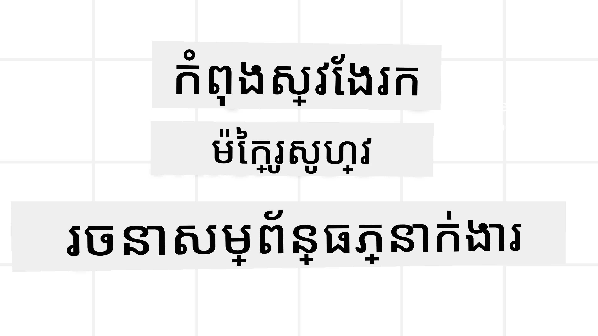
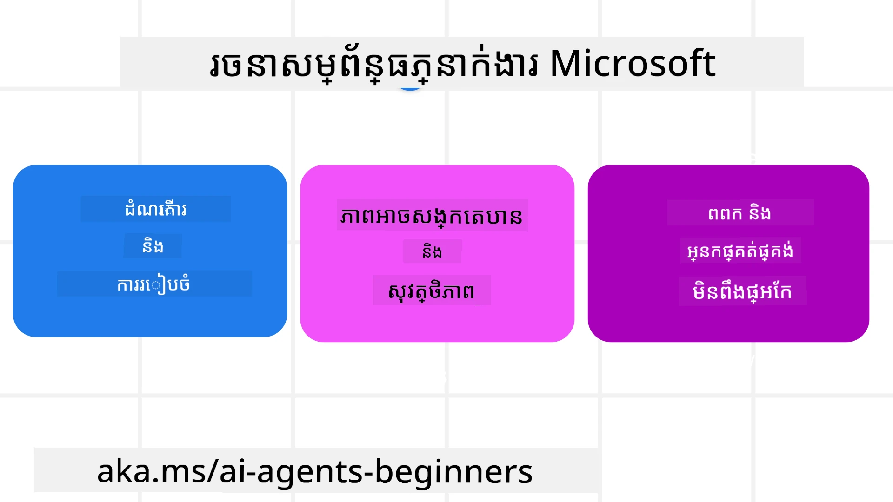
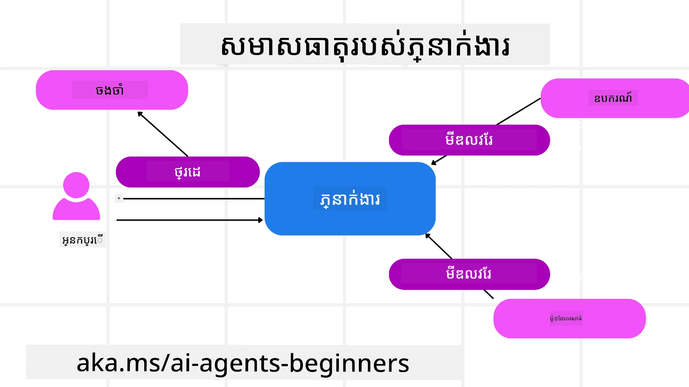

# ការស្វែងយល់ពីMicrosoft Agent Framework



### ការណែនាំ

មេរៀននេះនឹងគ្របដណ្តប់:

- ការយល់ដឹងអំពី Microsoft Agent Framework: លក្ខណៈសំខាន់ និងតម្លៃ  
- ការស្វែងយល់ពីគំនិតសំខាន់ៗនៃ Microsoft Agent Framework
- លំនាំ MAF អdvាន់ស្ទី: ការធ្វើ workflow, middleware, និង memory

## គោលបំណងសិក្សា

បន្ទាប់ពីបញ្ចប់មេរៀននេះ អ្នកនឹងដឹងរបៀប:

- កសាង AI Agents ដែលត្រៀមខ្លួនសម្រាប់ផលិតកម្មដោយប្រើ Microsoft Agent Framework
- អនុវត្តលក្ខណៈសំខាន់ៗនៃ Microsoft Agent Framework ទៅកាន់ករណីប្រើប្រាស់ Agentic របស់អ្នក
- ប្រើនូវលំនាំអdvាន់ស្ទី រួមមាន workflow, middleware, និង observability

## គំរូកូដ 

គំរូកូដសម្រាប់ [Microsoft Agent Framework (MAF)](https://learn.microsoft.com/en-us/agent-framework/overview/?wt.mc_id=youtube_26688_organicsocial_reactor&pivots=programming-language-python) អាចរកឃើញបាននៅក្នុង repository នេះក្រោមឯកសារ `xx-python-agent-framework` និង `xx-dotnet-agent-framework`។

## ការយល់ដឹងអំពី Microsoft Agent Framework



[Microsoft Agent Framework (MAF)](https://learn.microsoft.com/en-us/agent-framework/overview/?wt.mc_id=youtube_26688_organicsocial_reactor&pivots=programming-language-python) គឺជាសំណុំបែបបទរួមរបស់ Microsoft សម្រាប់កសាង AI agents។ វាផ្ដល់ភាពបត់បែនដើម្បីដោះស្រាយករណីប្រើប្រាស់ agentic ធំទូលាយដែលបានឃើញទាំងនៅផលិតកម្ម និងបរិយាកាសស្រាវជ្រាវ រួមមាន:

- **ការប្រតិបត្តិ agent តាមលំដាប់** ក្នុងសេណារីដែលត្រូវការដំណើរការជាដំណាក់កាល។
- **ការប្រតិបត្តិ agent ឆ្លុះបញ្ចាំង** ក្នុងសេណារីដែលត្រូវការអោយ agents បញ្ចប់ភារកិច្ចនៅពេលតែមួយ។
- **ការប្រតិបត្តិ agent ជាក្រុម** ក្នុងសេណារីដែល agents អាចសហការយ៉ាងជាមួយគ្នាចំពោះភារកិច្ចមួយ។
- **ការប្តូរជំនួយកិច្ច (Handoff)** ក្នុងសេណារីដែល agents ផ្ទេរភារកិច្ចទៅជូនគ្នាពេលដែលផ្នែកតូចៗបានបញ្ចប់។
- **ការប្រតិបត្តិ agent ដោយគ្រប់គ្រង (Magnetic Orchestration)** ក្នុងសេណារីដែល agent អ្នកគ្រប់គ្រងបង្កើត និងកែប្រែបញ្ជីភារកិច្ច និងគ្រប់គ្រងក្រុម agent ផ្នែកតូចសម្រាប់បំពេញភារកិច្ច។

ដើម្បីផ្តល់ AI Agents ក្នុងផលិតកម្ម MAF ក៏មានលក្ខណៈពិសេសសម្រាប់:

- **ការអាចមើលឃើញ (Observability)** តាមរយៈការប្រើ OpenTelemetry ដែលរៀបចំសកម្មភាពរាល់សកម្មភាពរបស់ AI Agent រួមទាំងការហៅឧបករណ៍ ដំណាក់កាល orchestration វិល reasoning និងការត្រួតពិនិត្យសមត្ថភាពតាម Microsoft Foundry dashboards។
- **សុវត្ថិភាព (Security)** ដោយផ្គត់ផ្គង់ agents ជាដើមដំណើរការនៅលើ Microsoft Foundry ដែលមានការគ្រប់គ្រងសុវត្ថិភាពដូចជា ការចូលប្រើជាតួតំណាង ការដំណើរការទិន្នន័យឯកជន និងសុវត្ថិភាពខ្លឹមសារ built-in។
- **ភាពរឹងមាំ (Durability)** ដែលការជួបជុំ AgentThreads និង workflows អាចផ្អាក បន្ត និងស្ដារឡើងវិញពីកំហុស ដែលអនុញ្ញាតឲ្យដំណើរការយឺតយ៉ាវ។
- **ការត្រួតពិនិត្យ (Control)** ដូចជាការគាំទ្រកម្មវិធី workflow ដែលមានមនុស្សនៅក្នុងរង្វង់ ដែលភារកិច្ចត្រូវបានសម្គាល់ថាត្រូវការអនុម័តពីមនុស្ស។

Microsoft Agent Framework ក៏ផ្តោតលើការបង្កើតអោយអាចបង្កប់ជាមួយបច្ចេកវិទ្យានានាបានដោយ:

- **អាចរត់លើពពកគ្មានការគំរាម (Cloud-agnostic)** - Agents អាចរត់លើ containers នៅលើ premise និងក្នុងពពកជាច្រើន។
- **ជាអ្នកផ្គត់ផ្គង់គ្មានការគំរាម (Provider-agnostic)** - Agents អាចបង្កើតតាម SDK ដែលអ្នកចូលចិត្ត រួមមាន Azure OpenAI និង OpenAI
- **បញ្ចូលស្តង់ដា Open** - Agents អាចប្រើបៀបបទដូចជា Agent-to-Agent(A2A) និង Model Context Protocol (MCP) ដើម្បីរកឃើញ និងប្រើ agents និងឧបករណ៍ផ្សេងទៀត។
- **Plugins និង Connectors** - អាចភ្ជាប់ទៅសេវាកម្មទិន្នន័យ និង memory ដូចជា Microsoft Fabric, SharePoint, Pinecone និង Qdrant។

មកមើលពីរបៀបដែលលក្ខណៈពិសេសទាំងនេះត្រូវបានអនុវត្តទៅលើគំនិតសំខាន់ៗនៃ Microsoft Agent Framework។

## គំនិតសំខាន់ៗនៃ Microsoft Agent Framework

### Agents



**ការបង្កើត Agents**

ការបង្កើត agent ត្រូវបានអនុវត្តដោយកំណត់សេវា inference (LLM Provider), កំណត់សន្លឹកណែនាំសម្រាប់ AI Agent ដើម្បីអនុវត្ត និងកំណត់ `name` មួយ:


```python
agent = AzureOpenAIChatClient(credential=AzureCliCredential()).create_agent( instructions="You are good at recommending trips to customers based on their preferences.", name="TripRecommender" )
```

ខាងលើកំពុងប្រើ `Azure OpenAI` ប៉ុន្តែ agents អាចត្រូវបានបង្កើតដោយសេវាកម្មផ្សេងទៀត រួមមាន `Microsoft Foundry Agent Service`:

```python
AzureAIAgentClient(async_credential=credential).create_agent( name="HelperAgent", instructions="You are a helpful assistant." ) as agent
```

OpenAI `Responses`, `ChatCompletion` APIs

```python
agent = OpenAIResponsesClient().create_agent( name="WeatherBot", instructions="You are a helpful weather assistant.", )
```

```python
agent = OpenAIChatClient().create_agent( name="HelpfulAssistant", instructions="You are a helpful assistant.", )
```

ឬ [MiniMax](https://platform.minimaxi.com/), ដែលផ្ដល់ API ត្រូវទាក់ទង OpenAI ជាមួយ context window ធំធេង (រហូតដល់ ២០៤កký tokens):

```python
agent = OpenAIChatClient(base_url="https://api.minimax.io/v1", api_key=os.environ["MINIMAX_API_KEY"], model_id="MiniMax-M3").create_agent( name="HelpfulAssistant", instructions="You are a helpful assistant.", )
```

ឬ agents ចម្ងាយដោយប្រើពិធីការណ៍ A2A:

```python
agent = A2AAgent( name=agent_card.name, description=agent_card.description, agent_card=agent_card, url="https://your-a2a-agent-host" )
```

**ការប្រតិបត្តិ Agents**

Agents ត្រូវបានរត់ដោយប្រើម៉ែត្រដូចជា `.run` ឬ `.run_stream` សម្រាប់ការឆ្លើយតបទាំងមិនមាន stream ឬមាន stream។

```python
result = await agent.run("What are good places to visit in Amsterdam?")
print(result.text)
```

```python
async for update in agent.run_stream("What are the good places to visit in Amsterdam?"):
    if update.text:
        print(update.text, end="", flush=True)

```

រាល់ការរត់ agent អាចមានជម្រើសប្ដូរតាមបរិបទដូចជា `max_tokens` ដែលអ្នកភាគច្រើនប្រើ, `tools` ដែល agent អាចហៅ, ហើយថែមទាំង `model` ផងដែរ។

វាមានប្រយោជន៍សម្រាប់ករណីដែលត្រូវការម៉ូដែល ឬឧបករណ៍ជាក់លាក់ដើម្បីបំពេញភារកិច្ចរបស់អ្នកប្រើ។

**ឧបករណ៍ (Tools)**

ឧបករណ៍អាចកំណត់ទាំងពេលកំណត់ agent:

```python
def get_attractions( location: Annotated[str, Field(description="The location to get the top tourist attractions for")], ) -> str: """Get the top tourist attractions for a given location.""" return f"The top attractions for {location} are." 


# នៅពេលបង្កើត ChatAgent ត្រូវបានផ្ទាល់ខ្លួន

agent = ChatAgent( chat_client=OpenAIChatClient(), instructions="You are a helpful assistant", tools=[get_attractions]

```

និងពេលរត់ agent:

```python

result1 = await agent.run( "What's the best place to visit in Seattle?", tools=[get_attractions] # ឧបករណ៍ផ្តល់សម្រាប់ការប្រតិបត្តិនេះតែប៉ុណ្ណោះ )
```

**Agent Threads**

Agent Threads ត្រូវបានប្រើសម្រាប់ដោះស្រាយការសន្ទនាច្រើនជុំ។ Threads អាចបង្កើតដោយ:

- ប្រើ `get_new_thread()` ដែលអនុញ្ញាតឲ្យ thread ត្រូវបានរក្សាទុកជាបន្ត
- បង្កើត thread ដោយស្វ័យប្រវត្តិពេលរត់ agent ហើយ thread នោះមានអាយុកាលតែDuring current run ទេ។

សម្រាប់បង្កើត thread កូដមានរាងដូចខាងក្រោម:

```python
# បង្កើតខ្សែថ្មីមួយ។
thread = agent.get_new_thread() # បើកប្រតិបត្តិភាគីជាមួយខ្សែ។
response = await agent.run("Hello, I am here to help you book travel. Where would you like to go?", thread=thread)

```

បន្ទាប់មកអ្នកអាច serialize thread ដើម្បីរក្សាទុកសម្រាប់ប្រើក្រោយ:

```python
# បង្កើតខ្សែថ្មីមួយ។
thread = agent.get_new_thread() 

# បើកការប្រតិបត្តិកម្មនារយៈខ្សែ។

response = await agent.run("Hello, how are you?", thread=thread) 

# បម្លែងខ្សែរ​ទៅជា​ទ្រង់ទ្រាយ​ដែលអាចផ្ទុកបាន។

serialized_thread = await thread.serialize() 

# បម្លែងស្ថានភាពខ្សែបន្ទាប់ពីផ្ទុកពីការផ្ទុកឡើងវិញ។

resumed_thread = await agent.deserialize_thread(serialized_thread)
```

**Agent Middleware**

Agents អន្តរកម្មជាមួយឧបករណ៍ និង LLMs ដើម្បីបំពេញភារកិច្ចអ្នកប្រើ។ នៅក្នុងសេណារីជាក់លាក់ យើងចង់អនុវត្ត ឬតាមដាននៅចន្លោះអន្តរកម្មទាំងនេះ។ Agent middleware អនុញ្ញាតឲ្យយើងធ្វើការនេះតាមរយៈ៖

*Function Middleware*

Middleware នេះអនុញ្ញាតឲ្យយើងអនុវត្តសកម្មភាពនៅចន្លោះ agent និង function/tool ដែលវានឹងហៅ។ ឧទាហរណ៍នៃការប្រើប្រាស់នេះគឺពេលអ្នកចង់ធ្វើ logging លើការហៅ function។

នៅក្នុងកូដខាងក្រោម `next` កំណត់ថាតើ middleware បន្ទាប់ រឺ function ពិតប្រាកដត្រូវបានហៅ។

```python
async def logging_function_middleware(
    context: FunctionInvocationContext,
    next: Callable[[FunctionInvocationContext], Awaitable[None]],
) -> None:
    """Function middleware that logs function execution."""
    # ការកំណត់មុន: កត់ត្រាដើម្បីមុនការប្រតិបត្តិមុខងារ
    print(f"[Function] Calling {context.function.name}")

    # បន្តទៅម៉ូឌុលមធ្យមបន្ទាប់ឬប្រតិបត្តិមុខងារ
    await next(context)

    # ការកំណត់បន្ទាប់: កត់ត្រាបន្ទាប់ពីការប្រតិបត្តិមុខងារ
    print(f"[Function] {context.function.name} completed")
```

*Chat Middleware*

Middleware នេះអនុញ្ញាតឲ្យយើងអនុវត្ត ឬ logging សកម្មភាពនៅចន្លោះ agent និងសំណើរពី LLM។

វាមានព័ត៌មានសំខាន់ដូចជា `messages` ដែលត្រូវបានផ្ញើទៅសេវា AI។

```python
async def logging_chat_middleware(
    context: ChatContext,
    next: Callable[[ChatContext], Awaitable[None]],
) -> None:
    """Chat middleware that logs AI interactions."""
    # ការបញ្ចូលមុន: កំណត់ហេតុនេះមុនការហៅ AI
    print(f"[Chat] Sending {len(context.messages)} messages to AI")

    # បន្តទៅកាន់ middleware ឬសេវាកម្ម AI ក្រោយ
    await next(context)

    # ការបញ្ចូលបន្ទាប់: កំណត់ហេតុនេះបន្ទាប់ពីការឆ្លើយតប AI
    print("[Chat] AI response received")

```

**Agent Memory**

ដូចបានគ្រប់បរិច្ឆេទនៅក្នុងមេរៀន `Agentic Memory` memory ជាធាតុសំខាន់សម្រាប់អនុញ្ញាត agent ដំណើរការតាម context ផ្សេងៗ។ MAF ផ្ដល់ជូន memory ជាប្រភេទផ្សេងៗ៖

*In-Memory Storage*

Memory នេះត្រូវបានរក្សាទុកក្នុង threads ក្នុងរយៈពេលដំណើរការកម្មវិធី។

```python
# បង្កើតខ្សែដំនើរការថ្មី។
thread = agent.get_new_thread() # ប្រតិបត្តិភ្នាក់ងារជាមួយខ្សែដំនើរការ។
response = await agent.run("Hello, I am here to help you book travel. Where would you like to go?", thread=thread)
```

*Persistent Messages*

Memory នេះប្រើសម្រាប់រក្សាទុកប្រវត្តិសារ សន្ទនា នៅលើសម័យផ្សេងៗ។ វាត្រូវបានកំណត់ដោយ `chat_message_store_factory` :

```python
from agent_framework import ChatMessageStore

# បង្កើតហាងសារផ្ទាល់ខ្លួន
def create_message_store():
    return ChatMessageStore()

agent = ChatAgent(
    chat_client=OpenAIChatClient(),
    instructions="You are a Travel assistant.",
    chat_message_store_factory=create_message_store
)

```

*Dynamic Memory*

Memory នេះត្រូវបន្ថែមទៅ context មុនពេល agents ត្រូវបានរត់។ Memory ទាំងនេះអាចរក្សាទុកនៅសេវាកម្មខាងក្រៅដូចជា mem0:

```python
from agent_framework.mem0 import Mem0Provider

# ការប្រើ Mem0 សម្រាប់សមត្ថភាពអង្គចងចាំឧត្តមភាព
memory_provider = Mem0Provider(
    api_key="your-mem0-api-key",
    user_id="user_123",
    application_id="my_app"
)

agent = ChatAgent(
    chat_client=OpenAIChatClient(),
    instructions="You are a helpful assistant with memory.",
    context_providers=memory_provider
)

```

**Agent Observability**

Observability មានសារៈសំខាន់សម្រាប់កសាងប្រព័ន្ធ agentic ដែលទុកចិត្តបាន និងងាយស្រួលថែរក្សា។ MAF បញ្ចូលជាមួយ OpenTelemetry ដើម្បីផ្ដល់ការតាមដាន និងវាស់ស្ទង់សម្រាប់ការមើលឃើញប្រសើរឡើង។

```python
from agent_framework.observability import get_tracer, get_meter

tracer = get_tracer()
meter = get_meter()
with tracer.start_as_current_span("my_custom_span"):
    # ធ្វើអ្វីមួយ
    pass
counter = meter.create_counter("my_custom_counter")
counter.add(1, {"key": "value"})
```

### Workflows

MAF ផ្ដល់ឱ្យនូវ workflows ដែលជាដំណាក់កាលបានកំណត់ជាមុនសម្រាប់បំពេញភារកិច្ច និងរួមបញ្ចូល AI agents ជា៖ ផ្នែកមួយនៅក្នុងដំណាក់កាលទាំងនេះ។

Workflows ត្រូវបានបង្កើតពីផ្នែកផ្សេងៗដែលអនុញ្ញាតឲ្យមានការគ្រប់គ្រងដំណើរការ។ Workflows មានសមត្ថភាពធ្វើ **multi-agent orchestration** និង **checkpointing** សម្រាប់រក្សា​ស្ថានភាព workflow។

ផ្នែកស្នូលនៃ workflow មាន:

**Executors**

Executors ទទួលសារ input, អនុវត្តភារកិច្ចដែលបានបែងចែក, រួចបញ្ចេញសារ output ដែលបន្តដំណើរការទៅកាន់ភារកិច្ចលំដាប់ខ្ពស់។ Executors អាចជាអ្នកប្រើ AI agent ឬ តុល្យភាព logic ផ្ទាល់ខ្លួន។

**Edges**

Edges ត្រូវបានប្រើដើម្បីកំណត់ដំណើរការសារនៅក្នុង workflow។ វាអាចជាប្រភេទ:

*Direct Edges* - ការតភ្ជាប់មួយទៅមួយរវាង executors:

```python
from agent_framework import WorkflowBuilder

builder = WorkflowBuilder()
builder.add_edge(source_executor, target_executor)
builder.set_start_executor(source_executor)
workflow = builder.build()
```

*Conditional Edges* - ត្រូវបានចាប់ផ្តើមបន្ទាប់ពីលក្ខខ័ណ្ឌបានបំពេញ។ ឧទាហរណ៍ សម្រាប់ពេលបន្ទប់សណ្ឋាគារមិនមាន, executor អាចផ្តល់ជម្រើសផ្សេងទៀត។

*Switch-case Edges* - ផ្លូវសារ​ទៅ executors ផ្សេងៗជាការគិតគូរតាមលក្ខខ័ណ្ឌ។ ឧទាហរណ៍ ប្រសិនបើអតិថិជនធ្វើដំណើរមានអាទិភាព ចំណាត់ថ្នាក់ភារកិច្ចនៅក្នុង workflow ផ្សេង។

*Fan-out Edges* - ផ្ញើសារមួយទៅគោលដៅច្រើន។

*Fan-in Edges* - ប្រមូលសារ​ច្រើនពី executors ផ្សេងៗ និងផ្ញើទៅគោលដៅមួយ។

**Events**

ដើម្បីផ្ដល់ការមើលឃើញល្អប្រសើរជាងមុនទៅ workflow, MAF ផ្ដល់ព្រឹត្តិការណ៍ built-in សម្រាប់ការប្រតិបត្តិរួមមាន:

- `WorkflowStartedEvent`  - ការប្រតិបត្តិ workflow ចាប់ផ្ដើម
- `WorkflowOutputEvent` - Workflow ផលិត output
- `WorkflowErrorEvent` - Workflow ជួបកំហុស
- `ExecutorInvokeEvent`  - Executor ចាប់ផ្ដើមដំណើរការ
- `ExecutorCompleteEvent`  -  Executor សម្រេចដំណើរការ
- `RequestInfoEvent` - សំណើត្រូវបានផ្ញើ

## លំនាំ MAF អdvាន់ស្ទី

ផ្នែកខាងលើគ្របដណ្តប់គំនិតសំខាន់ Microsoft Agent Framework។ នៅពេលដែលអ្នកកសាង agents ស្មុគស្មាញជាងនេះនេះ, មានលំនាំអdvាន់ស្ទីមួយចំនួនដែលគួរត្រូវគិតគូរ៖

- **Middleware Composition**: ដាក់ច្រវាក់អ្នកដោះ​ស្រាយmiddleware ជាច្រើន (logging, auth, rate-limiting) ដោយប្រើ function និង chat middleware សម្រាប់ការគ្រប់គ្រង agent ជាប្រកបដោយភាពត្រឹមត្រូវ។
- **Workflow Checkpointing**: ប្រើព្រឹត្តិការណ៍ workflow និង serialization រក្សាទុក ហើយបន្តដំណើរការយឺតសម្រាប់ agent។
- **Dynamic Tool Selection**: បញ្ចូល RAG លើការពណ៍នា tools ជាមួយការចុះបញ្ជី tools របស់ MAF ដើម្បីបង្ហាញតែឧបករណ៍ដែលពាក់ព័ន្ធសម្រាប់សំណួរ។
- **Multi-Agent Handoff**: ប្រើ edges workflow និង routing មានលក្ខខណ្ឌក្នុងការធ្វើ handoff រវាង agents ជាពិសេស។

## ការចំណត Agents LangChain / LangGraph លើ Microsoft Foundry

Microsoft Agent Framework មិនកំណត់ agent ឲ្យប្រើតែ MAF ប៉ុណ្ណោះទេ។ ប្រសិនបើអ្នកមាន agent ត្រូវបានកសាងជាមួយ **LangChain** ឬ **LangGraph** អ្នកអាចរត់វាជាភ្នាក់ងារត្រូវបានអ្នកផ្គត់ផ្គង់ Microsoft Foundry ដើម្បី Foundry គ្រប់គ្រងរយៈពេល រង្វង់សម័យ កំណាត់បំបាត់ ការរកស៊ី និង protocol endpoints សម្រាប់អ្នក ខណៈដែលយុទ្ធសាស្រ្ត agent របស់អ្នកនៅ LangGraph។

វាអនុវត្តន៍ដោយកញ្ចប់ `langchain_azure_ai.agents.hosting` ដែលបង្ហាញ graph LangGraph compiled តាម protocol ដូចគ្នានេះដែល Foundry hosted agents ប្រើ។

**1. តំឡើងការជួយបន្ទាប់:**

```bash
pip install -U "langchain-azure-ai[hosting]>=1.2.4" azure-identity
```

ការជួយ `hosting` តំឡើងបណ្ណាល័យ protocol Foundry: `azure-ai-agentserver-responses` (endpoint `/responses` ដែលត្រូវទាក់ទង OpenAI) និង `azure-ai-agentserver-invocations` (endpoint `/invocations` ទូទៅ)។

**2. ជ្រើសរើស protocol ចំណត:**

| Protocol | Host class | Endpoint | ប្រើពេលណា |
|----------|-----------|----------|----------|
| **Responses** | `ResponsesHostServer` | `/responses` | អ្នកចង់មាន chat ត្រូវទាក់ទង OpenAI, streaming, ប្រវត្តិការឆ្លើយតប និងការតភ្ជាប់សន្ទនា — គឺជាការណែនាំសម្រាប់ agents ជា Default ។ |
| **Invocations** | `InvocationsHostServer` | `/invocations` | អ្នកត្រូវការរចនាបទ JSON ផ្ទាល់ខ្លួន, endpoint បែប webhook ឬដំណើរការមិនមែនជាសន្ទនា។ |

ដោយសារតែ **Responses API ជា API សំខាន់សម្រាប់ការអភិវឌ្ឍ agent នៅ Foundry** សូមចាប់ផ្ដើមដោយ `ResponsesHostServer` សម្រាប់ភ្នាក់ងារច្រើន។

**3. កំណត់បរិចនាភាសាបរិស្ថាន** (តាមដាន `az login` ជាមុនដើម្បីឲ្យ `DefaultAzureCredential` អាច Authenticate):

```bash
export FOUNDRY_PROJECT_ENDPOINT="https://<resource>.services.ai.azure.com/api/projects/<project>"
export FOUNDRY_MODEL_NAME="gpt-5-mini"
```

ពេល agent រត់ជាភ្នាក់ងារចំណតនៅ Foundry, វេទិកានឹងដាក់បញ្ចូល `FOUNDRY_PROJECT_ENDPOINT` ស្វ័យប្រវត្តិ។

**4. បង្ហាញ agent LangGraph តាម protocol Responses:**

```python
import os

from azure.ai.projects import AIProjectClient
from azure.identity import DefaultAzureCredential, get_bearer_token_provider
from langchain.agents import create_agent
from langchain_openai import ChatOpenAI
from langchain_azure_ai.agents.hosting import ResponsesHostServer

_AZURE_AI_SCOPE = "https://ai.azure.com/.default"


def build_chat_model() -> ChatOpenAI:
    project_endpoint = os.environ["FOUNDRY_PROJECT_ENDPOINT"].rstrip("/")
    deployment = os.environ.get("FOUNDRY_MODEL_NAME", "gpt-5-mini")
    credential = DefaultAzureCredential()
    project = AIProjectClient(endpoint=project_endpoint, credential=credential)
    openai_client = project.get_openai_client()
    token_provider = get_bearer_token_provider(credential, _AZURE_AI_SCOPE)

    # ChatOpenAI នៅទីនេះមានគោលដៅទៅចុងបញ្ចប់ (Responses) ដែលអាចប្រើបានជាមួយ OpenAI របស់គម្រោង Foundry។
    return ChatOpenAI(
        model=deployment,
        base_url=str(openai_client.base_url),
        api_key=token_provider,
    )


def main() -> None:
    graph = create_agent(build_chat_model(), tools=[])
    port = int(os.environ.get("PORT", "8088"))
    ResponsesHostServer(graph).run(port=port)


if __name__ == "__main__":
    main()
```

រត់វាជាកម្មវិធីក្នុងម៉ាស៊ីនផ្ទាល់ក្នុងម៉ាស៊ីនដោយប្រើ `python main.py`, រួចផ្ញើសំណើ Responses ទៅ `http://localhost:8088/responses`។

**អាកប្បកិរិយាសំខាន់ៗ:**

- **ការសន្ទនា**: អតិថិជនបន្តសន្ទនាតាមរយៈការបញ្ជូន `previous_response_id` ឬ `conversation` ID។ ប្រសិនបើ graph របស់អ្នក compiled ជាមួយ LangGraph checkpointer, Foundry កំណត់ស្ថានភាពសន្ទនា ទៅ checkpoint (ប្រើ durable checkpointer នៅផលិតកម្ម; `MemorySaver` សាកសមសម្រាប់តេស្តក្នុងម៉ាស៊ីនផ្ទាល់)។
- **ជាបុគ្គលនៅក្នុងរង្វង់**: ប្រសិនបើ graph របស់អ្នកប្រើ LangGraph `interrupt()`, `ResponsesHostServer` បង្ហាញរបាយការណ៍ interrupt pending ជា Responses `function_call` / `mcp_approval_request` និងអតិថិជនបន្តជាមួយ `function_call_output` / `mcp_approval_response` ត្រូវគ្នា។
- **ចេញផ្សាយទៅ Foundry**: ប្រើ Azure Developer CLI — `azd ext install azure.ai.agents`, `azd ai agent init -m <manifest>`, `azd ai agent run` (ក្នុងមជ្ឈមណ្ឌល, តម្រូវ Docker), បន្ទាប់ `azd provision` និង `azd deploy`។ ការចាក់បញ្ចូល hosted-agent តម្រូវឲ្យមានតួនាទី **Foundry Project Manager**។

ម៉ូឌែល runnable នៃឧទាហរណ៍នេះ មាននៅ [code-samples/14-langchain-hosted-agent.py](../../../14-microsoft-agent-framework/code-samples/14-langchain-hosted-agent.py)។ សម្រាប់ការពេញលេញនៃការណែនាំ (protocol Invocations, schemas សំណើ ផ្សេងៗ និងការជួយដោះស្រាយបញ្ហា), សូមមើល [Host LangGraph agents as Foundry hosted agents](https://learn.microsoft.com/azure/foundry/how-to/develop/langchain-hosted-agents)។

## គំរូកូដ 

គំរូកូដសម្រាប់ Microsoft Agent Framework អាចរកឃើញបានក្នុង repository នេះក្រោមឯកសារ `xx-python-agent-framework` និង `xx-dotnet-agent-framework`។

## មានសំនួរបន្ថែមអំពី Microsoft Agent Framework?

ចូលរួមក្នុង [Microsoft Foundry Discord](https://discord.com/invite/ATgtXmAS5D) ដើម្បីជួបជាមួយអ្នករៀនផ្សេងៗ, ព្រឹត្តិការណ៍ម៉ោងការិយាល័យ និងទទួលបានការឆ្លើយសំណួរអំពី AI Agents របស់អ្នក។
## មេរៀនមុន

[Memory for AI Agents](../13-agent-memory/README.md)

## មេរៀនបន្ទាប់

[Building Computer Use Agents (CUA)](../15-browser-use/README.md)

---

<!-- CO-OP TRANSLATOR DISCLAIMER START -->
**ការបដិសេធ**:
ឯកសារនេះត្រូវបានបម្លែងភាសា ដោយប្រើសេវាបម្លែងភាសា AI [Co-op Translator](https://github.com/Azure/co-op-translator)។ ទោះយើងខ្ញុំមានក្តីប្រាថ្នាឱ្យបានច្បាស់លាស់ តែសូមយល់ដឹងថាការបម្លែងដោយស្វ័យប្រវត្តិក៏អាចមានកំហុសឬភាពមិនត្រឹមត្រូវ។ ឯកសារដើមជាភាសាទីតាំងគួរត្រូវបានគេប្រើជាប្រភពច្បាស់លាស់។ សម្រាប់ព័ត៌មានសំខាន់ៗ សូមណែនាំឱ្យប្រើប្រាស់ការប្រែដោយមនុស្សជំនាញ។ យើងខ្ញុំមិនទទួលខុសត្រូវចំពោះការយល់ច្រឡំ ឬការបកស្រាយខុសបន្ទាប់ពីការប្រើប្រាស់ការបម្លែងនេះនោះទេ។
<!-- CO-OP TRANSLATOR DISCLAIMER END -->