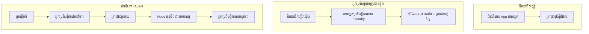
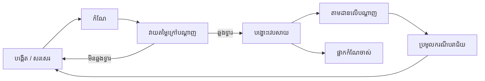
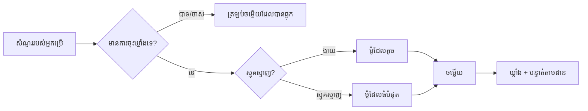
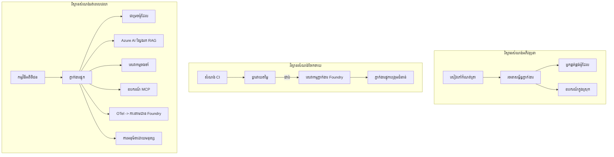

# ការដាក់ឲ្យដំណើរការជាអ្នកតំណាងអាចបង្កើនទំហំបានជាមួយ Microsoft Foundry


រហូតដល់ពេលនេះ ក្នុងវគ្គសិក្សា អ្នកបានបង្កើតអ្នកតំណាង ដែលដំណើរការនៅលើកុំព្យូទ័រយួរដៃរបស់អ្នក ក្នុងកំណត់ត្រា ត្រូវបានបញ្ជាលើដោយ `az login` និងអថេរស្ថានបរិវេណចំនួនបាច់។ នេះជាវិធីត្រឹមត្រូវសម្រាប់រៀន។ ទោះយ៉ាងណា វាមិនមិនមែនជាវិធីត្រឹមត្រូវសម្រាប់ដំណើរការអ្នកតំណាងដែលអតិថិជនរាប់ពាន់នាក់ពឹងផ្អែកលើនៅម៉ោង 3 ព្រឹកឡើយ។

មេរៀននេះគឺអំពីកន្លះវេលាប្រៀបធៀបរវាង "វាដំណើរការលើម៉ាស៊ីនខ្ញុំ" និង "វាដំណើរការ ដោយទំនុកចិត្ត និងថ្លៃសមរម្យ នៅក្នុងផលិតកម្ម"។ យើងបិទកន្លះវេលានេះដោយប្រើ **Microsoft Foundry** និង **Microsoft Foundry Agent Service** ហើយយើងធ្វើវា ដោយសារជួបជាមួយអ្នកតំណាងសេវាកម្មអតិថិជនពិត ដែលមានឧបករណ៍ ស្ដុកទាញ ចងចាំ ការវាយតម្លៃ និងការត្រួតពិនិត្យ។

## ការណែនាំ

មេរៀននេះនឹងគ្របដណ្តប់៖

- ផ្សេងគ្នាទៅចន្លោះ **អ្នកតំណាងគំរូ** និង **អ្នកតំណាងដែលបានដាក់ជ្រើសរើស** ហើយហេតុអ្វីការផ្លាស់ប្តូរនេះជាច្រើនគឺជារឿង *ជាក់ទាំងមូល* ព័ទ្ធជុំវិញម៉ូដែល។
- **លំនាំការដាក់ជ្រើសរើស** សម្រាប់អ្នកតំណាង៖ ពីអតិថិជន់មិនផ្ទាល់ខ្លួន, សេវាកម្មផ្ទាល់ (Hosted Agents), និងការត្រួតត្រាកម្មវិធីដំណើរការ។
- ជីវភាពរបស់ **អ្នកតំណាង** លើ Microsoft Foundry — បង្កើត, ផ្លាស់ប្តូរ, ដាក់ជ្រើសរើស, វាយតម្លៃ, គ្រប់គ្រង, ចាកចេញ។
- **យុទ្ធសាស្រ្តពង្រីក**៖ ការបញ្ជូនម៉ូដែល, ការកែតម្រូវ, ការចងក្រង, និងការរចនាដែលមិនមានស្ថានភាព។
- **ការចាប់អារម្មណ៍** ជាមួយ OpenTelemetry និងការតាមដាន Foundry។
- **ការបញ្ចុះថ្លៃ** តាមរយៈការជ្រើសរើសម៉ូដែល ការបង្ហាត់ និងទីបំផុតការវាយតម្លៃ។
- **ការពិចារណាអាជីវកម្ម**៖ អធិបតេយ្យ, ការអនុម័តដោយមនុស្ស, និងការដំណើរការសេវាកម្ម MCP ដោយសុវត្ថិភាពនៅក្នុងផលិតកម្ម។

## គោលបំណងសិក្សា

បន្ទាប់ពីបញ្ចប់មេរៀននេះ អ្នកនឹងមានជំនាញអំពីវិធីសាស្រ្ត：

- ជ្រើសរើសលំនាំដាក់ជ្រើសរើសត្រឹមត្រូវសម្រាប់បន្ទុកការងារអ្នកតំណាងមួយ។
- ដាក់ជ្រើសរើសអ្នកតំណាងទៅ Microsoft Foundry Agent Service ដូច្នេះវាត្រូវបានផ្លាស់ប្តូរ, គ្រប់គ្រង និងអាចចាប់អារម្មណ៍បាន។
- ធ្វើឧបករណ៍ការតាមដាន និងភ្ជាប់បណ្តាញវាយតម្លៃដែលដំណើរការមុនរាល់ការចេញផ្សាយជាថ្មី។
- អនុវត្តការបញ្ជូនម៉ូដែល និងកែប្រែដើម្បីគ្រប់គ្រងពេលយឺត និងតម្លៃនៅពេលពង្រីក។
- បន្ថែមទីបញ្ជាក់ការអនុម័តដោយមនុស្សសម្រាប់សកម្មភាពមានហានិភាពខ្ពស់ និងបង្រួមសេវាកម្ម MCP នៅក្នុងរបៀបសុវត្ថិភាពផលិតកម្ម។

## តម្រូវការមុន

មេរៀននេះសន្មត់ថាអ្នកបានបញ្ចប់មេរៀនមុនៗហើយ មានទំនុកចិត្តជាមួយ៖

- ការបង្កើតអ្នកតំណាងជាមួយ [Microsoft Agent Framework](../14-microsoft-agent-framework/README.md) (មេរៀនទី 14)។
- [ការប្រើប្រាស់ឧបករណ៍](../04-tool-use/README.md) (មេរៀនទី 4) និង [Agentic RAG](../05-agentic-rag/README.md) (មេរៀនទី 5)។
- [Agent Memory](../13-agent-memory/README.md) (មេរៀនទី 13) និង [Agentic Protocols / MCP](../11-agentic-protocols/README.md) (មេរៀនទី 11)។
- [ការចាប់អារម្មណ៍ និងការវាយតម្លៃ](../10-ai-agents-production/README.md) (មេរៀនទី 10) — មេរៀននេះបង្កើតនៅលើវា។

អ្នកនឹងត្រូវការផងដែរ៖

- **ការជាវ Azure** និង **គម្រោង Microsoft Foundry** ដែលមានម៉ូដែលសន្ទនាដែលបានដាក់ជ្រើសរើសយ៉ាងតិចមួយ។
- **Azure CLI** ដែលត្រូវបានផ្ទៀងផ្ទាត់ (`az login`)។
- Python 3.12+ និងកញ្ចប់នៅក្នុងឃ្លាំង [`requirements.txt`](../../../requirements.txt)។

## ពីអ្នកតំណាងគំរូទៅផលិតកម្ម៖ អ្វីដែលប្រែប្រួលពិតប្រាកដ

អ្នកតំណាងគំរូ និងអ្នកតំណាងផលិតកម្មមានរង្វង់មួលដូចគ្នា — សន្និដ្ឋាន, ហៅឧបករណ៍, ការឆ្លើយតប។ អ្វីដែលផ្លាស់ប្តូរជាគ្រឿងវង់ជុំវិញនោះទាំងមូល។ ម៉ូដែលប្រហែលជា 20% នៃអ្នកតំណាងផលិតកម្ម; ភាគរយ 80% ផ្សេងគឺជាសាខារដ្ឋបាលប្រតិបត្តិការ។

| ការពាក់ព័ន្ធ | គំរូ | ផលិតកម្ម |
| --- | --- | --- |
| **ការផ្ដល់ម៉ាស៊ីនដំណើរការ** | ដំណើរការនៅក្នុងកំណត់ត្រារបស់អ្នក | ដំណើរការជាសេវាកម្មផ្ដល់ម៉ាស៊ីន មានការបង្ហោះ និងបញ្ជូនចេញពេលវេលា |
| **អត្តសញ្ញាណ** | ពាក្យសម្គាល់ `az login` របស់អ្នក | អត្តសញ្ញាណគ្រប់គ្រងជាមួយ RBAC កំណត់លំដាប់ |
| **ស្ថានភាព** | នៅក្នុងចងចាំមេម៉ូរី, បាត់បង់នៅពេលចាប់ផ្ដើមឡើងវិញ | ផ្ទុកនៅខាងក្រៅ (គStore្កទីដេរ, សេវាកម្មចងចាំ) |
| **ការបរាជ័យ** | អ្នកឃើញការព្យួរសង្រ្គោះ | ការសាកល្បងឡើងវិញ, វិលត្រឡប់, សំបុត្រ​ស្លាប់, សញ្ញា​បន្ទាន់ |
| **ថ្លៃឈ្នួល** | "ប្រាក់ប៉ុន្មានប៉ិន្មាន" | តាមដានដោយសំណើ, បញ្ជូន, កែតម្រូវ, កំណត់ថវិកា |
| **គុណភាព** | អ្នកមើលជិតផ្ទាល់ | វាយតម្លៃដោយស្វ័យប្រវត្តិ មុនរាល់ការចេញផ្សាយ |
| **ទំនុកចិត្ត** | អ្នកអនុម័តគ្រប់សកម្មភាព | គោលការណ៍ + មនុស្សក្នុងខ្សែក្រវាតិ សម្រាប់សកម្មភាពដែលមានហានិភ័យ |

ហើយរក្សាតារាងនេះចាំ។ ផ្នែកនិមួយៗខាងក្រោមសម្រាប់ជួរដូចក្នុងតារាងនេះ។

## លំនាំការដាក់ជ្រើសរើសអ្នកតំណាង

មានលំនាំបីដែលអ្នកនឹងប្រើ ជាញឹកញាប់ក្នុងការរួមបញ្ចូលគ្នា។

### 1. អ្នកតំណាងទីតាំងអតិថិជន

វត្ថុអ្នកតំណាងរស់នៅក្នុងដំណើរការកម្មវិធី *របស់អ្នក*។ កូដរបស់អ្នកហៅអ្នកផ្គត់ផ្គង់ម៉ូដែលផ្ទាល់; រង្វង់ការសន្និដ្ឋានដំណើរការ នៅក្នុងសេវាកម្មរបស់អ្នក។ នេះជាអ្វីដែលមេរៀនមុនៗទាំងអស់បានធ្វើ។

- **ប្រើវាពេលណា** អ្នកត្រូវការគ្រប់គ្រងពេញលេញលើរង្វង់, មេដៀលបុគ្គលមួយ, ឬអ្នកបញ្ចូលអ្នកតំណាងក្នុងប៊ែកអ៊ិនស្រ្គោលដែលមានរួចហើយ។
- **ការបាត់បង់**: អ្នកជាម្ចាស់ការពង្រីក, ស្ថានភាព, និងភាពរឹងមាំដោយខ្លួនឯង។

### 2. អ្នកតំណាងផ្ដល់សេវាកម្ម (Foundry Agent Service)

អ្នកតំណាងត្រូវបាន *ចុះបញ្ជីជាធនធាន* នៅ Microsoft Foundry។ Foundry ផ្ដល់ម៉ាស៊ីនដំណើរការរង្វង់សន្និដ្ឋាន, រក្សាទុកខ្សែ, អនុវត្តសុវត្ថិភាពមាតិកា និង RBAC, ហើយធ្វើឲ្យអ្នកតំណាងអាចមើលឃើញបានក្នុងផតហ្វូម Foundry។ កម្មវិធីរបស់អ្នកក្លាយជាអតិថិជនសាបហ្វំនូវដែលបង្កើតខ្សែ និងអានចម្លើយ។

- **ប្រើវាពេលណា** អ្នកចង់បានភាពរឹងមាំ, ការចាប់អារម្មណ៍ភ្លាមៗ, អធិបតេយ្យ និងកម្រិតផ្ទៃប្រតិបត្តិការ តិចជាង។
- **ការបាត់បង់**: ការគ្រប់គ្រងកម្រិតទាបជាង ជំនួសជាមួយរយៈពេលដំណើរការដែលគ្រប់គ្រង។

### 3. ស្របពេលសកម្មភាពអ្នកតំណាង

អ្នកតំណាងជាច្រើន (និងឧបករណ៍) ត្រូវបានបង្កើតជាក្រាហ្វិចមួយ ជាមួយការគ្រប់គ្រងផលិតកម្មច្បាស់លាស់ — ជំហានជាប់ៗ, មានសាខាដូចជា, ចំណុចអនុម័តមនុស្ស, និងចំណុចត្រួតពិនិត្យរឹងមាំដែលអាចបញ្ឈប់ និងបន្តថយខាងក្រោយ។ នេះជាការអនុវត្តន៍សមត្ថភាព **Workflows** នៃ Microsoft Agent Framework នៅលើកម្រិតដាក់បញ្ចូល។

- **ប្រើវាពេលណា** ការងារផ្នែកតែមួយគ្របដណ្តប់អ្នកតំណាងមុខជាច្រើនឬតម្រូវឲ្យមានជំហានអនុម័តនៅកណ្ដាលទ្រង់ទ្រាយ។
- **ការបាត់បង់**: ផ្នែកចលនា​ច្រើន; ត្រូវការការចាប់អារម្មណ៍នៅកម្រិតអង្គការតំណាង។



## វដ្តជីវិតអ្នកតំណាងនៅ Microsoft Foundry

ការដាក់ជ្រើសរើសអ្នកតំណាងមិនមែនជាការបញ្ចូល `push` មួយលើកទេ។ វាជារង្វង់មួយ ហើយវាដូចជា វដ្តចេញផ្សាយកម្មវិធីប្លង់មួយ ពីព្រោះវាជាអ្វីដែលវាជាត្រឹមត្រូវផងដែរ។



គំនិតសំខាន់ ដែលយកមកពី [មេរៀនទី 10](../10-ai-agents-production/README.md): **ការវាយតម្លៃក្រៅបណ្ដាញគឺជាទ្វារមិនមែនជាងក្រោយការយកចិត្តទុកដាក់។** ម/versionជាថ្មីមួយនឹងមិនចេញផ្សាយទេចុះបើវាមិនកាត់បន្ថយគម្លាតវាយតម្លៃរបស់អ្នក។ ការចាប់អារម្មណ៍ផ្ទាល់អនឡាញបន្ទាប់នឹងផ្ដល់ត្រឡប់ករណីបរាជ័យពិតទៅក្នុងសំណុំតេស្តក្រៅបណ្ដាញរបស់អ្នក។ នេះជារង្វង់ទាំងមូល។

## យុទ្ធសាស្រ្តពង្រីក

ការពង្រីកអ្នកតំណាងខុសពីការពង្រីក API វេបដែលគ្មានស្ថានភាព ព្រោះរាល់សំណើតម្រង់អាចបណ្តាលឲ្យមានការហៅម៉ូដែល និងឧបករណ៍ថ្លៃថ្លាច្រើន។ បច្ចេកទេសបួននេះយកបន្ទុកភាគច្រើន។

**ការគ្រប់គ្រងសំណើគ្មានស្ថានភាព។** មិនបន្ថែមស្ថានភាពរាល់អ្នកប្រើនៅមេម៉ូរីដំណើរការរបស់អ្នក។ រក្សាទុកខ្សែសន្ទនា​នៅក្នុងស្តុកខ្សែ Foundry ឬសេវាកម្មចងចាំ ដើម្បីឲ្យអ្វីៗយើងអាចដំណើរការបានគ្រប់សំណើ។ នេះជាអ្វីដែលអនុញ្ញាតឲ្យអ្នកពង្រីកធៀបទ្រង់ទ្រាយផ្គត់ផ្គង់ — បន្ថែមឥណ្ឌេស៊ីត, គ្មានសេស្យុងភ្ជាប់។

**ការបញ្ជូនម៉ូដែល។** មិនរាល់សំណើត្រូវការម៉ូដែលមានសមត្ថភាពខ្ពស់បំផុត (ហើយថ្លៃថ្លាជាង) របស់អ្នកឡើយ។ បញ្ជូនសំណើសាមញ្ញៗ — ការបែងចែកគោលបំណង, ចម្លើយខ្លី — ទៅម៉ូដែលតូច និងរហ័ស ហើយរក្សាម៉ូដែលធំសម្រាប់ការសន្និដ្ឋានពិតប្រាកដ។ Foundry's **Model Router** អាចធ្វើរឿងនេះឲ្យអ្នក ឬអ្នកអាចអនុវត្តកម្មវិធីចំណាត់ថ្នាក់ស្រាលដោយខ្លួនឯង។ អ្នកនឹងបង្កើតជំនួស DIY នៅក្នុងមន្ទីរពិសោធន៍។

**ការកែតម្រូវចម្លើយ។** សំណួរជាច្រើននៅការគាំទ្រជាទម្លាប់ស្មើគ្នា ("តើយ៉ាងដូចម្តេចដើម្បីកំណត់ពាក្យសម្ងាត់របស់ខ្ញុំឡើងវិញ?")។ រក្សាទុកចម្លើយទៅសំណួរធម្មតា និងបម្រើវាលែងត្រូវចាក់ម៉ូដែលទេ។ ទោះជាលើកតិចមួយ ការចាប់ចម្លើយពី cache នេះកាត់បន្ថយថ្លៃសោភណ្ឌនិងពេលយឺតយ៉ាងច្បាស់។

**ការចុះចត និងសំពាធត្រលប់មកវិញ។** អ្នកផ្គត់ផ្គង់ម៉ូដែលមានកំណត់អត្រា។ កំណត់ចំនួន concurrency, ប្រើការសាកល្បងឡើងវិញជាមួយការចុះក្រោមកំណត់ជាក់លាក់, ហើយបរាជ័យដោយភាពសាមញ្ញ (ចម្លើយរាប់បញ្ចីថា "យើងកំពុងដោះស្រាយ" ល្អជាងកូដ 500)។



## ការចាប់អារម្មណ៍នៅផលិតកម្ម

អ្នកមិនអាចដំណើរការអ្វីដែលអ្នកមិនអាចមើលឃើញបានទេ។ ដូចបានគ្របដណ្តប់ក្នុងមេរៀន 10, Microsoft Agent Framework បញ្ចេញ **OpenTelemetry** តាមដានដោយធម្មជាតិ — រាល់ការហៅម៉ូដែល, ការហៅឧបករណ៍ និងជំហានចេញផ្សាយមួយៗក្លាយជាស្ពាន។ នៅក្នុងផលិតកម្ម អ្នកនាំចេញស្ពាន ទៅ Microsoft Foundry (ឬបណ្ដាញ OTel ណាមួយ) ដើម្បីអ្នកអាច៖

- តាមដានបណ្តោយគ្រប់ការបណ្តឹងអតិថិជន ពីគ្រប់ការហៅម៉ូដែល និងឧបករណ៍។
- មើលពេលយឺត p50/p95 និងថ្លៃក្នុងរាល់សំណើជាប្រចាំ។
- ផ្ញើសញ្ញា ពេលកើតកំហុស និងបញ្ហាថ្លៃមុនពេលអ្នកប្រើ (ឬក្រុមហ៊ុនហិរញ្ញវត្ថុ) សង្កេតឃើញ។

```python
from agent_framework.observability import get_tracer

tracer = get_tracer()

with tracer.start_as_current_span("support_request") as span:
    span.set_attribute("customer.tier", "enterprise")
    span.set_attribute("routed.model", "gpt-5-nano")
    # ការប្រតិបត្តិភ្នាក់ងារត្រូវបានតាមដានដោយស្វ័យប្រវត្តិ នៅក្នុងចន្លោះនេះ
```

គុណលក្ខណៈដូចជា `customer.tier` និង `routed.model` ជាអ្វីដែលបម្លែងជញ្ជាំងនៃស្ពានទៅជាសំណួរដែលអាចឆ្លើយតបទៅបាន ("តើអតិថិជនអាជីវកម្មត្រូវបានបញ្ជូនទៅម៉ូដែលតូចយ៉ាងហោចណាស់ទេ?")។

## ការបញ្ចុះថ្លៃ

ថ្លៃក្នុងអ្នកតំណាងផលិតកម្មគឺត្រូវគ្រប់គ្រងដោយបណ្ដុំ token។ ឧបករណ៍បី ទៅតាមលំដាប់ផលប៉ះពាល់：

1. **ជ្រើសរើសទំហំម៉ូដែលត្រឹមត្រូវ។** ម៉ូដែលតូចដែលប្រហែលត្រូវតម្រូវការវាយតម្លៃរបស់អ្នក ជាទូទៅថ្លៃថោកជាងម៉ូដែលធំដែលឆ្លងកាត់ផងដែរ។ ប្រើការវាយតម្លៃដើម្បី *បង្ហាញ* ម៉ូដែលតូចគ្រប់គ្រាន់ជាងការប្រើម៉ូដែលធំនៅលើគោលដៅសុវត្ថិភាព។
2. **ផ្លូវជាមធ្យោបាយតាមសេចក្ដីស្មុគស្មាញ។** ដូចខាងលើ — បង់តម្លៃម៉ូដែលធំសម្រាប់សំណើដែលតម្រូវការសន្និដ្ឋានម៉ូដែលធំតែប៉ុណ្ណោះ។
3. **កែតម្រូវ cacheយ៉ាងខ្លាំង។** ការហៅម៉ូដែលថ្លៃថោកបំផុតគឺការហៅដែលអ្នកមិនធ្វើទេ។

ទ្វារ​វាយតម្លៃ និងការគ្រប់គ្រងថ្លៃដើមជាជំនាញដូចគ្នាពីផ្នែកពីរដោយមើលពីជ្រុងខុសគ្នា៖ វាយតម្លៃប្រាប់អ្នកអំពី *ជាន់គុណភាព*, ការបញ្ជូន និងកែតម្រូវរក្សាក្នុងបន្ទាត់ *ថ្លៃ* ជិតជាន់នោះបំផុត។

## ដំណើរការគោរពត្រួតពិនិត្យសម្រាប់អាជីវកម្ម

**អធិបតេយ្យ។** Hosted Agents ទទួលលទ្ធផល RBAC, សុវត្ថិភាពមាតិកា និងកំណត់ហេតុ audit ពី Foundry។ ផ្ដល់អត្តសញ្ញាណគ្រប់គ្រងមួយឲ្យទាំងអស់នៃអ្នកតំណាងជាមួយសិទ្ធិដ៏តិចបំផុតដែលវាត្រូវការ — អាចអានទិន្នន័យផ្នែកចំណេះដឹង, កំណត់ចម្លង API ticketing, មិនមានច្រើនដើមទេ។

**មនុស្សក្នុងខ្សែ។** សកម្មភាពខ្លះរឹងមាំពេកមិនអាចអូតូម៉ាទិចបានទាំងស្រុង — ដូចជាការបង្វែរ, លុបគណនី, ឡើងក្រុមច្បាប់។ Microsoft Agent Framework គាំទ្រឧបករណ៍ **តម្រូវការអនុម័ត**: អ្នកតំណាងផ្តល់អំពីសកម្មភាព, ការអនុវត្តបញ្ឈប់, មនុស្សអនុម័ត ឬ ផ្អាក, ហើយសកម្មភាពបន្តវិញ។ អ្នកបានឃើញកម្មវិធីមូលដ្ឋានក្នុង [មេរៀនទី 6](../06-building-trustworthy-agents/README.md); នៅទីនេះអ្នកដាក់ជ្រើសរើសវា។

**MCP នៅផលិតកម្ម។** [MCP](../11-agentic-protocols/README.md) អនុញ្ញាតឲ្យអ្នកតំណាងប្រើឧបករណ៍ខាងក្រៅតាមរយៈចំណុចប្រទាក់ផែនការមួយ។ នៅក្នុងផលិតកម្ម, ចាត់ទុករាល់ម៉ាស៊ីន MCP ជារ៉ឺសប៉ាកណ៍មិនគួរជឿទុកចិត្តបាន: សន្ទស្សន៍សំណាក់ម៉ាស៊ីន, ដំណើរការវា ជាមួយអត្តសញ្ញាណកំណត់, វាយតម្លៃលទ្ធផលរបស់វា ហើយមិនដែលបង្ហាញលេខសម្ងាត់ទៅវាទេ។ ម៉ាស៊ីន MCP ជាការពឹងផ្អែកមួយ និងការពឹងផ្អែកត្រូវបានដំឡើង អត់ ត្រួតពិនិត្យ និងកំណត់អត្រាទំព័រ។



រូបគំនូរ​បីនេះ — ការអភិវឌ្ឍ, ការដាក់បញ្ចូល, វេលាដំណើរការ — ជាអ្នកតំណាងដូចគ្នានៅបីជំហាននៃជីវិតរបស់វា។ មន្ទីរពិសោធន៍ដដែលដែរណែនាំអ្នកតាមការបង្កើតវា។

## មន្ទីរពិសោធន៍ដៃ៖ អ្នកតំណាងសេវាកម្មអតិថិជនដែលត្រៀមបានសម្រាប់ផលិតកម្ម

បើក [`code_samples/16-python-agent-framework.ipynb`](./code_samples/16-python-agent-framework.ipynb) ហើយធ្វើឲ្យបានល្អពីដើមដល់ចប់។ អ្នកនឹងបង្ហាប់ **អ្នកតំណាងសេវាកម្មអតិថិជន Contoso** ដែលមានការពាក់ព័ន្ធនឹងខាងផលិតកម្មជាទាំងមូល៖

1. **ហៅឧបករណ៍** — ស្វែងរកស្ថានភាពលំដាប់ និងបើកសំបុត្រគាំទ្រ។
2. **RAG** — ឆ្លើយសំណួរដែលទៅនឹងគោលការណ៍ពីមូលដ្ឋានចំណេះដឹង (Azure AI Search, មាន fallback ក្នុង mememory ដូច្នេះកំណត់ត្រាដំណើរការបានដោយគ្មានធនធាន Search)។
3. **ចងចាំ** — ចងចាំអតិថិជនជុំវិញបច្ច័យនៃការសន្ទនា។
4. **ការបញ្ជូនម៉ូដែល** — អ្នកចាត់ថ្នាក់ស្មុគស្មាញ បញ្ជូនសំណើទៅម៉ូដែលតូច ឬធំ។
5. **ការកែតម្រូវចម្លើយ** — សំណួរធ្វើซ้ำបានមានចម្លើយពី cache។
6. **អនុម័តដោយមនុស្ស** — ការសងប្រាក់លើសកំណត់ត្រូវរង់ចាំអនុម័តពីមនុស្ស។
7. **បណ្តាញថ្ម័រវាយតម្លៃ** — សំណុំតេស្តតូចក្រៅបណ្ដាញវាយតម្លៃអ្នកតំណាង និងធ្វើជាទ្វារ​ចេញផ្សាយ។
8. **ការចាប់អារម្មណ៍** — ការតាមដាន OpenTelemetry រង្វង់សំណើរាល់ខ្នាត។

### ជំហានដំណើរការ

កំណត់ត្រាត្រូវបានរៀបចំដូច្នេះការពាក់ព័ន្ធផលិតកម្មនីមួយៗ គឺជាផ្នែកដែលអាចដំណើរការបានដោយអារម្មណ៍។ គន្លឹះគឺគ្រប់គ្រងសំណើររួមបញ្ចូលការបញ្ជូនម៉ូដែល និង cache：

```python
async def handle_support_request(query: str, customer_id: str) -> str:
    # 1. ផ្តល់សេវាដោយប្រើកម្រងទិន្នន័យអេស្ស៊ី នៅពេលដែលអាចធ្វើបាន។
    cached = response_cache.get(normalize(query))
    if cached:
        return cached

    # 2. បញ្ជូនតាមចម្ងាយភាពស្មុគស្មាញដើម្បីគ្រប់គ្រងការចំណាយ។
    model = "gpt-5-nano" if is_simple(query) else "gpt-5-mini"

    # 3. រៀបចំប្រតិបត្តិការរបស់ភ្នាក់ងារនៅក្នុងវាលតាមដានសម្រាប់ការត្រួតពិនិត្យ។
    with tracer.start_as_current_span("support_request") as span:
        span.set_attribute("routed.model", model)
        span.set_attribute("customer.id", customer_id)
        response = await support_agent.run(query, model=model)

    # 4. រក្សាទុកក្នុងកម្រងទិន្នន័យ និងបញ្ជូនតប។
    response_cache.set(normalize(query), response.text)
    return response.text
```

ទ្វារវាយតម្លៃដែលការពារការចេញផ្សាយដោយមានរូបរាងដូចនេះ៖

```python
async def evaluation_gate(agent, test_cases, threshold: float = 0.8) -> bool:
    passed = 0
    for case in test_cases:
        result = await agent.run(case["input"])
        if score_response(result.text, case["expected"]) >= 0.8:
            passed += 1
    pass_rate = passed / len(test_cases)
    print(f"Evaluation pass rate: {pass_rate:.0%} (gate: {threshold:.0%})")
    return pass_rate >= threshold  # ផ្ទុកដំណើរការនៅពេលមានការត្រួតពិនិត្យទ្វារជោគជ័យប៉ុណ្ណោះ
```

អានរាល់បន្ទាត់ — កំណត់ត្រាធ្វើឲ្យមូលដ្ឋានតូច ដើម្បីអ្វីៗមិនត្រូវបានលាក់បាំងនៅក្រោយហៅ framework ទេ។

## វាយតម្លៃអ្នកតំណាងដែលបានដាក់ជ្រើសរើសជាមួយសាកល្បងផ្កល់មេរៀន

ទ្វារវាយតម្លៃខាងលើដំណើរការនៅក្រៅបណ្ដាញទៅកាន់វត្ថុអ្នកតំណាងរបស់អ្នក។ បន្ទាប់ពីអ្នកតំណាងត្រូវបានដាក់ជ្រើសរើសជាអ្នក Hosted Agent អ្នកត្រូវការតេស្តមួយទៀតថោកជាងនោះទៀត: **តើចំណុចបញ្ចប់ដែលបានដាក់ជ្រើសរើសពិតជាឆ្លើយតបទេ?**

ការដាក់ជ្រើសរើស "ដោយជោគជ័យ" គឺយ៉ាងតែបញ្ជាក់ថាការត្រួតពិនិត្យក្រឡាខ្លួនទទួលបានភាពសម្រេចដេក — វាមិនបញ្ជាក់ថាអ្នកតំណាងឆ្លើយតបទេ។ ការពឹងផ្អែកខ្វះ, ការបញ្ជូនម៉ូដែលខុស, ឬការតភ្ជាប់ផុតកំណត់ អាចបន្ថែមការដាក់ជ្រើសរើសបៃតងដែលមិនផ្តល់ជូនអ្វីទាំងអស់។ **សាកល្បងផ្កល់មេរៀន** ចាប់អ្វីនោះបានក្នុងវិនាទីៗ ក្នុងរាល់ដំណាក់កាលដាក់ជ្រើសរើស ដោយគ្មានថ្លៃថោកដូចការវាយតម្លៃពេញលេញ។

ឃ្លាំងនេះផ្ញើបណ្តាញសាកល្បងផ្កល់មេរៀនដែលអាចប្រើបានបន្ទាប់ ដោយបង្កើតលើ GitHub Action [AI Smoke Test](https://github.com/marketplace/actions/ai-smoke-test)៖

- **កាតាឡុក** — [`tests/lesson-16-smoke-tests.json`](../../../tests/lesson-16-smoke-tests.json) មានសំណើ និងការបញ្ជាក់សម្រាប់អ្នកតំណាងគាំទ្រជំនួញ Contoso (ចម្លើយគោលការណ៍មានមូលដ្ឋាន, ស្វែងរកការបញ្ជាទិញ, រក្សាភាសាសមរម្យ, និងភាពបន្តខ្សែជាច្រើនជំហាន)។ កាតាឡុកសម្រាប់អ្នកតំណាងក្នុងមេរៀនផ្សេងទៀត ទទួលបាននៅជាមួយវា — មើល [`tests/README.md`](../tests/README.md)។
- **សកម្មភាពចលនារ** — [`.github/workflows/smoke-test.yml`](../../../.github/workflows/smoke-test.yml) ចុះឈ្មោះជាមួយ Azure OIDC និង POST សំណើរ រៀងរាល់លក្ខណៈទៅចំណុចបញ្ចប់ Responses របស់អ្នកតំណាង បរាជ័យការងារនៅលើការបរាជ័យណាមួយ។

```yaml
- name: Smoke-test hosted agent
  uses: JFolberth/ai-smoketest@v1
  with:
    project_endpoint: ${{ inputs.project_endpoint }}
    agent_name: ContosoSupportAgent
    tests_file: tests/lesson-16-smoke-tests.json
```


ប្រតិបត្តិវា​ពីផ្ទៃ **Actions** នៅពេលដែលទីភ្នាក់ងាររបស់អ្នកបានដាក់បញ្ចូល ដោយផ្តល់ចំណុចបញ្ចប់គម្រោង Foundry និងឈ្មោះទីភ្នាក់ងារ។ អត្តសញ្ញាណរួមត្រូវការតួនាទី **Azure AI User** នៅលើវិសាលភាពគម្រោង Foundry។ គិតពីស្រទាប់ទាំងនេះដូចជាប៉ូលីមីដាំ: កម្មវិធីតេស្តជំពូក (អាចចូលដំណើរការ និងឆ្លើយតប?) ដំណើរការពីរ​ការដាក់បញ្ចូលនីមួយៗ, ការវាយតម្លៃក្រៅបណ្តាញ (ល្អគ្រប់គ្រាន់សម្រាប់ដឹកជញ្ជូន?) ដំណើរការមុនពេលបង្វែរជំហាន, និងការវាយតម្លៃតាមបណ្តាញ (វាធ្វើការយ៉ាងដូចម្តេចនៅក្នុងធម្មជាតិ?) ដំណើរការយ៉ាងអចិន្រ្តៃយ៍។

## ពិនិត្យចំណេះដឹង

សាកល្បងការយល់ដឹងរបស់អ្នកមុនពេលផ្លាស់ទៅកាន់ភារកិច្ច។

**១. ភាគរយប្រហែលប៉ុន្មាននៃទីភ្នាក់ងារដែលពិតប្រាកដគឺ "ម៉ូដែល," ហើយអ្វីទៅជាពីរូបកាយនៅផ្សេងទៀត?**

<details>
<summary>ចម្លើយ</summary>

ម៉ូដែលគឺជាពាក្យតិចក្នុងប្រព័ន្ធ - ប្រើស្លុតបញ្ជីស្តារលើប្រហែល ២០% ជាទូទៅ។ ភាគច្រើននៅសល់គឺជាខ្នើយប្រតិបត្តិ: ការចាប់យក និងកំណត់កំណែ, អត្តសញ្ញាណ និង RBAC, ព័ត៌មានដែលបានដកចេញ, ការព្យាបាលបរាជ័យ, ការតាមដានថ្លៃកម្រៃ, ការវាយតម្លៃ និងការគ្រប់គ្រងមនុស្សចូលដំណើរការ។ ការផ្លាស់ទៅផលិតកម្មមានច្រើនជាងគេចំពោះការសង់ *ជុំវិញ* វដ្តការពិចារណា។
</details>

**២. តើពេលណាអ្នកនឹងជ្រើសរើស Hosted Agent ជាងទីភ្នាក់ងារដែលអតិថិជនដំណើរការផ្ទាល់មួយ?**

<details>
<summary>ចម្លើយ</summary>

ពេលដែលអ្នកចង់បាន runtime ដែលគ្រប់គ្រងដោយមានភាពរឹងប៉ឹងក្នុងផ្ទៃ (threads ដែលនៅតែមាន និងអាចបន្តចរន្តបាន), អាចមើលឃើញ, សុវត្ថិភាពមាតិកា, និង RBAC ហើយអ្នកព្យាយាមដូរត្រួតការតិចចំពោះវដ្តការពិចារណាសម្រាប់ផ្ទៃមុខបច្ចុប្បន្នភាពសកម្មភាព។ Client-hosted ជាសមរម្យនៅពេលអ្នកត្រូវការត្រួតការពេញលេញលើវដ្តឬកំពុងបញ្ចូលទីភ្នាក់ងារនៅក្នុង backend ដែលមានរួចមក។
</details>

**៣. ហេតុអ្វីបានជា agent ដែលអាចតម្រូវបានត្រូវតែឲ្យមានភាព stateless នៅក្នុងម៉ាស៊ីននិម្មិតមួយ?**

<details>
<summary>ចម្លើយ</summary>

ដូច្នេះសំណុំឯកសារណានឹងអាចដោះស្រាយសំណើណាមួយមកបាន ដែលជាអ្វីដែលអនុញ្ញាតឲ្យមានការតម្រូវផ្ទាល់គ្នារបស់ផ្លូវកំណត់ជាតម្រូវបញ្ហាបានដោយគ្មាន session ដែលជាប់ចង។ ស្ថានភាពការពិភាក្សាមិនត្រូវតែម្នាក់ៗត្រូវបានដកចេញទៅកាន់ហាង threads ឬសេវាកម្មចងចាំ។ បើស្ថានភាពស្នាក់នៅក្នុងចងចាំក្នុងដំណើរការ អ្នកនឹងបាត់បង់វា ដែលមិនអាចចែកផ្ទុកការប្រមូលផ្តុំបានដោយសារតែការចាប់ផ្តើមឡើងវិញ។
</details>

**៤. តើបញ្ហាអ្វីដែលការបញ្ជូនម៉ូដែលបានដោះស្រាយ ហើយវាពាក់ព័ន្ធយ៉ាងដូចម្តេចនឹងការវាយតម្លៃ?**

<details>
<summary>ចម្លើយ</summary>

ការបញ្ជូនផ្ញើសំណើសាមញ្ញទៅម៉ូដែលតូច ប្រញាប់ និងថោក និងរក្សាម៉ូដែលធំសម្រាប់ការពិចារណាពិតប្រាកដ ដើម្បីគ្រប់គ្រងភាពយឺតនៃពេលវេលា និងថ្លៃលក់។ វាពាក់ព័ន្ធនឹងការវាយតម្លៃ ពីព្រោះការវាយតម្លៃជាអ្វីដែល *បង្ហាញ* ម៉ូដែលតូចមានគុណភាពគ្រប់គ្រាន់សម្រាប់ក្រុមសំណើណាមួយ — ការបញ្ជូនដោយគ្មានការវាយតម្លៃគឺការស្រមៃ។
</details>

**៥. តើ "ទ្វារវាយតម្លៃ" គឺជាអ្វី ហើយវាស្ថិតនៅទីណាក្នុងជីវចម្រើន?**

<details>
<summary>ចម្លើយ</summary>

ទ្វារវាយតម្លៃដំណើរការការប្រលងក្រៅបណ្តាញទល់នឹងកំណែថ្មីនៃទីភ្នាក់ងារ ហើយរារាំងការដាក់ចេញបើអត្រាចេញលទ្ធផលមិនបំពេញតម្រូវការមួយ។ វាស្ថិតនៅចន្លោះ "កំណែ" និង "ដាក់ចេញ" ក្នុងជីវចម្រើនធ្វើអោយគុណភាពសម្រាប់ការចេញផ្សាយក្លាយជាពម្បតិ្តមុន មិនមែនជារបស់ដែលអ្នកត្រូវពិនិត្យបន្ទាប់ពីដឹកជញ្ជូនឡើយ។
</details>

**៦. ហេតុអ្វីបានជា MCP server ត្រូវបានគេព្យាបាលថាជាគន្លងមិនទុកចិត្តនៅក្នុងផលិតកម្ម?**

<details>
<summary>ចម្លើយ</summary>

ព្រោះវាជាឧបករណ៍ខាងក្រៅដែលទីភ្នាក់ងាររបស់អ្នកហៅចូល។ អ្នកគួរតែនិយមបង្កប់កំណែរបស់វា រត់វាជាមួយអត្តសញ្ញាណកំណត់ ដាក់កំណត់លទ្ធផលរបស់វា ស្ថិតក្នុងការគ្រប់គ្រងល្បឿន ហើយមិនដែលបង្ហាញគម្លាតណាមួយទៅវាទេ — វិន័យដូចគ្នាដែលអ្នកអនុវត្តលើឧបករណ៍ទីបីណាមួយ។ លទ្ធផលរបស់វាស្ទូចចេញទៅក្នុងការពិចារណារបស់ទីភ្នាក់ងាររបស់អ្នក ដូច្នេះការជឿជាក់ដោយមិនបានត្រួតពិនិត្យគឺជាហានិភ័យសុវត្ថិភាពមួយ។
</details>

**៧. តើការផ្លាស់ប្តូរតែមួយណាដែលមានឥទ្ធិពលធំបំផុតលើតម្លៃទីភ្នាក់ងារផលិតកម្ម ហើយហេតុអ្វី?**

<details>
<summary>ចម្លើយ</summary>

ការឆមាសស៊ាំម៉ូដែល — ប្រើម៉ូដែលតូចបំផុតដែលនៅតែឈានដល់ទ្វារវាយតម្លៃរបស់អ្នក។ ថ្លៃកម្រៃច្រើនត្រូវបានគ្រប់គ្រងដោយ token ហើយម៉ូដែលតូចដែលបំពេញលក្ខខណ្ឌគុណភាព ជាទូទៅតែងតែថោកជាងម៉ូដែលធំ។ ការរក្សាទុក និងការបញ្ជូនបន្ថែមទៀតបន្ថយថ្លៃកម្រៃបន្ថែមទៀត ប៉ុន្តែការជ្រើសរើសម៉ូដែលមេដំណាក់កាលមានឥទ្ធិពលដំបូងធំបំផុត។
</details>

**៨. តើតួនាទីនៃលក្ខណៈspan ដូចជា `customer.tier` និង `routed.model` ក្នុងការមើលឃើញខាងក្នុងជាអ្វី?**

<details>
<summary>ចម្លើយ</summary>

ភារកិច្ចរបស់ពួកវាគឺបម្លែងហ្រ្វេស៍ទាំងអស់ទៅជาคำសំណួរអាជីវកម្មដែលអាចចម្លើយបាន។ គ្មានលក្ខណៈទេ អ្នកមានជញ្ជាំងនៃspan ប៉ុណ្ណោះ; មានវាអ្នកអាចសួរ "តើអតិថិជនសហគ្រាសត្រូវបានបញ្ជូនទៅម៉ូដែលតូចជាញឹកញាប់ទេ?" ឬ "ម៉ូដែលណាដែលដោះស្រាយសំណើរយឺតបំផុតរបស់យើង?" លក្ខណៈគឺជារបៀបដែលអ្នកចែកបន្ទាត់តែឡើងវិញតាមវិមាត្រដែលមានសារៈសំខាន់សម្រាប់ការប្រតិបត្តិការរបស់អ្នក។
</details>

## ភារកិច្ច

យកទីភ្នាក់ងារគាំទ្រអតិថិជនពីមន្ទីរ ហើយរឹតបន្តឹងវាសម្រាប់សេណារីយ៉ូមួយជាក់លាក់: **ទីភ្នាក់ងារគាំទ្រការបង់ប្រាក់ជាវសម្រាប់ក្រុមហ៊ុន SaaS។**

ការដាក់ស្នើរបស់អ្នកគួរតែ៖

១. **ជំនួសឧបករណ៍ដោយឧបករណ៍ពាក់ព័ន្ធនឹងការបង់ប្រាក់**: `get_subscription_status`, `get_invoice`, និង `issue_credit` (ឥណទានលើស $50 ត្រូវការការអនុម័តពីមនុស្ស)។
២. **បន្ថែមឯកសារ RAG បី** ដែលគ្របដណ្តប់លើគោលនយោបាយបង្រួមប្រាក់របស់ក្រុមហ៊ុន, វដ្តការបង់ប្រាក់, និងគោលនយោបាយការលុបចោល។
៣. **ពង្រីកកំណត់ត្រាវាយតម្លៃ** ទៅចំនួនជាមិនតិចប្រាំបួនករណី រួមទាំងយ៉ាងតិចពីរដែល *គួរតែនាំឲ្យធ្វើការសម្រេចចិត្តដោយមនុស្ស*, និងបញ្ជាក់ថាទ្វារវាយតម្លៃរបស់អ្នកព្យាយាមឲ្យត្រូវឬខ្វះ។
៤. **បន្ថែមរបាយការណ៍ថ្លៃកម្រៃមួយ**៖ បន្ទាប់ពីរត់សំណួរលាយបញ្ចូលដប់សំណួរដល់ទីភ្នាក់ងារ បង្ហាញចំនួនដែលបានបញ្ជូនទៅម៉ូដែលតូច, ម៉ូដែលធំ, និងចំនួនដែលបានបម្រើពី cache។

សរសេរអត្ថបទខ្លីមួយវាក្យ (នៅក្នុងក្រឡាចត្រង្គ markdown) ពន្យល់ពីច្បាប់បញ្ជូនម៉ូដែលដែលអ្នកជ្រើសរើស និងរបៀបដែលអ្នកនឹងផ្ទៀងផ្ទាត់វាជាមួយចរន្តពិត។ មិនមានចម្លើយតែមួយត្រឹមត្រូវទេ — អ្នកត្រូវបានវាយតម្លៃថាតើបញ្ហាផលិតកម្មទាំងនេះត្រូវបានភ្ជាប់គ្នាដោយសហការណ៍ទុកចិត្ត។

## សេចក្ដីសង្ខេប

ក្នុងមេរៀននេះ អ្នកបានផ្លាស់ទីភ្នាក់ងារពីគំរូទៅផលិតកម្មជាមួយ Microsoft Foundry ៖

- ការជ្រៀតចូលទៅផលិតកម្មជាច្រើនជាងគេចំពោះ **ខ្នើយប្រតិបត្តិ** ដើម្បីបង្រួមម៉ូដែល — ការចាប់យក, អត្តសញ្ញាណ, ស្ថានភាព, ការព្យាបាលបរាជ័យ, ថ្លៃទំនិញ, គុណភាព និងការជឿជាក់។
- អ្នកបានរៀនពីបី **គំរូការដាក់ចេញ** — client-hosted, Hosted Agents និង Agent Workflows — ហើយពេលណាដែលមួយៗសមរម្យ។
- អ្នកបានដើរតាម **ជីវចម្រើនទីភ្នាក់ងារ** ដែលនៅតែមាន offline **evaluation ដំណើរការជាទ្វារចេញផ្សាយ** និង observability តាមបណ្តាញបំលែងការបរាជ័យមកក្នុងកំណត់ត្រាតេស្ត។
- អ្នកបានអនុវត្ត **យុទ្ធសាស្រ្តអំនាស់** — ការរចនាមិនមានស្ថានភាព, ការបញ្ជូនម៉ូដែល, ការចងចាំ និងការប្រកួតប្រជែងមានដែនកំណត់ — ហើយភ្ជាប់ពួកវានៅក្នុង **កំណត់ត្រាតម្លៃគ្រប់គ្រង**។
- អ្នកបានភ្ជាប់កាន់តែជាមួយ **ការគ្រប់គ្រងសហគ្រាស**៖ RBAC, ការអនុម័តដោយមនុស្សចូលដំណើរការ និងការរួមបញ្ចូល MCP នៅក្នុងផលិតកម្មដែលបានរួមបញ្ចូល។
- អ្នកបានបង្កើត **ទីភ្នាក់ងារគាំទ្រអតិថិជនត្រៀមរួចសម្រាប់ផលិតកម្ម** ដែលភ្ជាប់ចំណុចបញ្ហាទាំងនេះក្នុងកូដដែលអាចដំណើរការ។

មេរៀនបន្ទាប់នឹងធ្វើដំណើរការត្រឡប់វិញ៖ ជំនួសពីការកើនឡើងទីភ្នាក់ងារជាឡើងមេគន្ធ័ពពក អ្នកនឹងយកពួកវាចុះទៅម៉ាស៊ីនអភិវឌ្ឍន៍តែមួយ និងរត់ពេញលេញក្នុងតំបន់។

## ប្រភពទន្រឹងបន្ថែម

- <a href="https://learn.microsoft.com/azure/ai-foundry/what-is-azure-ai-foundry" target="_blank">ឯកសារប្រព័ន្ធ Microsoft Foundry</a>
- <a href="https://learn.microsoft.com/azure/ai-foundry/agents/overview" target="_blank">មើលទិដ្ធភាពសេវាកម្ម Microsoft Foundry Agent</a>
- <a href="https://learn.microsoft.com/en-us/agent-framework/overview/?wt.mc_id=youtube_26688_organicsocial_reactor&pivots=programming-language-python" target="_blank">Microsoft Agent Framework</a>
- <a href="https://learn.microsoft.com/azure/ai-foundry/concepts/model-router" target="_blank">Model Router ក្នុង Microsoft Foundry</a>
- <a href="https://learn.microsoft.com/azure/search/search-what-is-azure-search" target="_blank">Azure AI Search</a>
- <a href="https://opentelemetry.io/" target="_blank">OpenTelemetry</a>
- <a href="https://github.com/marketplace/actions/ai-smoke-test" target="_blank">AI Smoke Test កម្មវិធីអនុវត្ត GitHub Action</a>
- <a href="https://modelcontextprotocol.io/" target="_blank">Model Context Protocol (MCP)</a>

## មេរៀនមុន

[ការបង្កើតទីភ្នាក់ងារប្រើប្រាស់កុំព្យូទ័រ (CUA)](../15-browser-use/README.md)

## មេរៀនបន្ទាប់

[ការបង្កើតទីភ្នាក់ងារ AI ក្នុងតំបន់](../17-creating-local-ai-agents/README.md)

---

<!-- CO-OP TRANSLATOR DISCLAIMER START -->
**ការបដិសេធ**:
ឯកសារនេះត្រូវបានបម្លែងភាសា ដោយប្រើសេវាបម្លែងភាសា AI [Co-op Translator](https://github.com/Azure/co-op-translator)។ ទោះយើងខ្ញុំមានក្តីប្រាថ្នាឱ្យបានច្បាស់លាស់ តែសូមយល់ដឹងថាការបម្លែងដោយស្វ័យប្រវត្តិក៏អាចមានកំហុសឬភាពមិនត្រឹមត្រូវ។ ឯកសារដើមជាភាសាទីតាំងគួរត្រូវបានគេប្រើជាប្រភពច្បាស់លាស់។ សម្រាប់ព័ត៌មានសំខាន់ៗ សូមណែនាំឱ្យប្រើប្រាស់ការប្រែដោយមនុស្សជំនាញ។ យើងខ្ញុំមិនទទួលខុសត្រូវចំពោះការយល់ច្រឡំ ឬការបកស្រាយខុសបន្ទាប់ពីការប្រើប្រាស់ការបម្លែងនេះនោះទេ។
<!-- CO-OP TRANSLATOR DISCLAIMER END -->