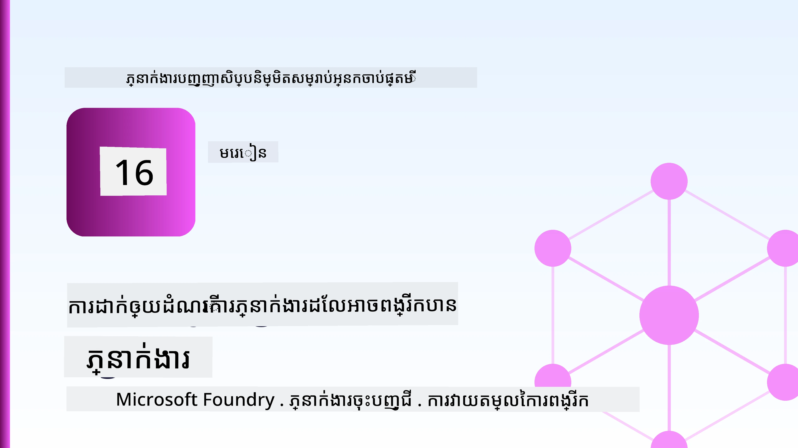
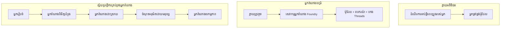
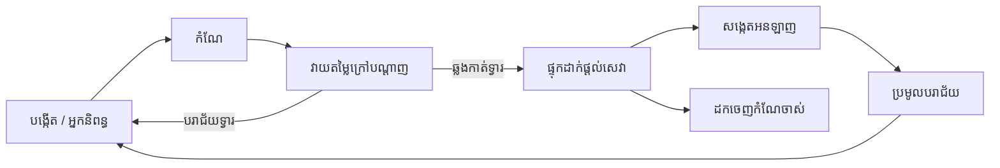
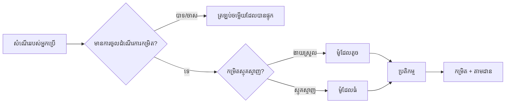
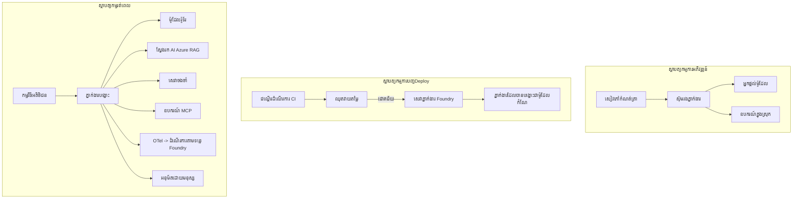

# ការបញ្ចេញភ្នាស់អេហ្សង់ជាអ្នកមានសមត្ថភាពដោយ Microsoft Foundry



ដល់ពេលនេះក្នុងវគ្គរៀន អ្នកបានបង្កើតភ្នាស់ដែលដំណើរការនៅលើកុំព្យូទ័រយួរដៃរបស់អ្នក នៅក្នុងសៀវភៅចំណាំ ដោយបើកបរដោយ `az login` និងអថេរ​បរិយាកាស​ខ្លះៗ។ នេះគឺជារបៀបត្រឹមត្រូវក្នុងការរៀន។ វាមិនមែនជារបៀបទាត់ខ្លួនក្នុងការប្រើភ្នាស់ដែលអតិថិជនរាប់ពាន់នាក់ពឹងផ្អែកឱ្យដំណើរការនៅម៉ោង ៣ ព្រឹកវិញទេ។

មេរៀននេះគឺស្តីពីចន្លោះរវាង "វាដំណើរការលើម៉ាស៊ីនរបស់ខ្ញុំ" និង "វាដំណើរការ ប្រកបដោយភាពច្បាស់លាស់ និងថ្លៃតិច ក្នុងបរិក្ខារផលិត។" យើងបិទចន្លោះនោះដោយប្រើ **Microsoft Foundry** និង **Microsoft Foundry Agent Service** ហើយយើងធ្វើវា​ដោយបង្កើតភ្នាស់គាំទ្រអតិថិជនពិតប្រាកដដែលមានឧបករណ៍ យកវិញ ចងចាំ វាយតម្លៃ និងត្រួតពិនិត្យ។

## មាតិកា

មេរៀននេះនឹងលើកឡើង៖

- ផ្សំ​ទៅវិញទៅមករវាង **ភ្នាស់គំរូបណ្ដាញ (prototype agent)** និង **ភ្នាស់បានចេញផ្សាយ (deployed agent)** និងហេតុអ្វីការផ្លាស់ប្តូរមួយក្នុងនោះជាសំខាន់គឺព័ន្ធគ្រប់យ៉ាងដែលនៅ *ជុំវិញ* ម៉ូដែល។
- **លំនាំការចេញផ្សាយ** សម្រាប់ភ្នាស់៖ ភ្ន៊ុនត្រូវ​ទទួលភ្ញៀវនៅក្រោម​អតិថិជន (client-hosted), លំនាំបម្រើ (service-hosted) (ភ្នាស់ទទួលបម្រើ), និងបញ្ជាលំនាំដំណើរការ (workflow-orchestrated)។
- **ជីវិតភ្នាស់ (agent lifecycle)** នៅ Microsoft Foundry — បង្កើត, មានកំណែ, ចេញផ្សាយ, វាយតម្លៃ, មើល, ផ្អាក។
- **យុទ្ធសាស្រ្តបង្រួមទំហំនៃភ្នាស់ (scaling strategies)**៖ ការបញ្ជូនម៉ូដែល, ការបន្សល់, ការតំណើរការរួម, និងរចនាឥតអាវុធ។
- **ការមើលឃើញ (observability)** ជាមួយ OpenTelemetry និង Foundry tracing។
- **ការគ្រប់គ្រងថ្លៃដើម (cost optimisation)** តាមរយៈជម្រើសម៉ូដែល បញ្ជូន និងទ្វារវាយតម្លៃ។
- **ការពិចារណាអាជីវកម្ម (enterprise considerations)**៖ អភិបាលភាព អនុក្រឹតិកម្មរបស់មនុស្ស និងប្រតិបត្តិការ MCP servers បានយ៉ាងសុវត្ថិភាពនៅក្នុងផលិតកម្ម។

## គោលបំណងរៀន

បន្ទាប់ពីបញ្ចប់មេរៀននេះ អ្នកនឹងដឹងរបៀបធ្វើ៖

- ជ្រើសរើសលំនាំការចេញផ្សាយត្រឹមត្រូវសម្រាប់ភ្នាស់បន្ទុកការងារមួយ។
- ចេញផ្សាយភ្នាស់ទៅ Microsoft Foundry Agent Service ដើម្បីឲ្យវាមានកំណែ មានការគ្រប់គ្រង និងអាចមើលឃើញបាន។
- បំពាក់ភ្នាស់សម្រាប់ការតាមដាន និងភ្ជាប់បណ្តាញវាយតម្លៃមួយដែលដំណើរការពីមុនការចេញផ្សាយរាល់ដំណើរការ។
- ធ្វើការបញ្ជូនម៉ូដែល និងបន្សល់ ដើម្បីរក្សាពេលរំលង និងថ្លៃនៃសេវាកម្មអោយក្រោមការត្រួតពិនិត្យនៅលំនាំបង្រួមទំហំ។
- បន្ថែមទ្វារអនុម័តមនុស្សសម្រាប់សកម្មភាពមានហានិភ័យខ្ពស់ និងរួមបញ្ចូលម៉ាស៊ីន MCP នៅក្នុងរបៀបផលិតបានសុវត្ថិភាព។

## ល័ក្ខខ័ណ្ឌជាមុន

មេរៀននេះសន្មត់ថាអ្នកបានបញ្ចប់មេរៀនកន្លងមក ហើយមានជំនាញក្នុងការស្វែងយល់៖

- ការបង្កើតភ្នាស់ជាមួយ [Microsoft Agent Framework](../14-microsoft-agent-framework/README.md) (មេរៀន 14)។
- [ការប្រើប្រាស់ឧបករណ៍](../04-tool-use/README.md) (មេរៀន 4) និង [Agentic RAG](../05-agentic-rag/README.md) (មេរៀន 5)។
- [Agent Memory](../13-agent-memory/README.md) (មេរៀន 13) និង [Agentic Protocols / MCP](../11-agentic-protocols/README.md) (មេរៀន 11)។
- [ការមើលឃើញ និងវាយតម្លៃ](../10-ai-agents-production/README.md) (មេរៀន 10) — មេរៀននេះកសាងលើវាដោយផ្ទាល់។

អ្នកក៏ត្រូវការជាផ្នែកផងដែរ៖

- **ការជាវប្រើប្រាស់ Azure** និង **គម្រោង Microsoft Foundry** ដែលមានម៉ូដែលចាត់តាំងជាច្រើនតិចបំផុតមួយ។
- ‏ការចូលទៅ Azure CLI តាមរយៈការផ្ទៀងផ្ទាត់ (`az login`)។
- Python 3.12+ និងកញ្ចប់ក្នុងប្រភពកូដ [`requirements.txt`](../../../requirements.txt)។

## ពីគំរូដល់ផលិតកម្ម៖ អ្វីទៅដែលប្រែប្រួលពិតប្រាកដ

ភ្នាស់គំរូ និងភ្នាស់ផលិតកម្មមានរង្វិលដូចគ្នា — គិតហេតុ បង្ហើបឧបករណ៍ ឆ្លើយតប។ អ្វីដែលផ្លាស់ប្តូរគឺគ្រប់យ៉ាងរួមបញ្ចូលជុំវិញរង្វិលនោះ។ ម៉ូដែលប្រហែលជា ២០% នៃភ្នាស់ផលិតកម្ម; ៨០% ថ្មីៗគឺជាទ្រង់ទ្រាយប្រតិបត្តិការ។

| ការព្រួយបារម្ភ | គំរូ | ផលិតកម្ម |
| --- | --- | --- |
| **ការទទួលភ្ញៀវ** | ដំណើរការនៅក្នុងសៀវភៅចំណាំ | ដំណើរការជាសេវាមួយដែលបានផ្សាយវើសិន និងប្រគល់ទៅអ្នកប្រើ |
| **អត្តសញ្ញាណ** | តូកិន `az login` របស់អ្នក | អត្តសញ្ញាណគ្រប់គ្រងជាមួយ RBAC មានដែនកំណត់ |
| **ស្ថានភាព** | នៅក្នុងមេម៉រី ហៅថាបាត់បង់ពេលបើកឡើងម្តងទៀត | ផ្ទុកបញ្ចូលក្រៅ (ហាងខ្សែ, សេវាកម្មចងចាំ) |
| **បរាជ័យ** | អ្នកឃើញព្រឹត្តិបត្រ | ធ្វើម្ដងទៀត ការកែតម្រូវ ការផ្ញើសារចូលប្រអប់ដាក់សារ និងរំខាន |
| **ថ្លៃ** | "វាជាទឹកប្រាក់ប៉ុន្មានសេនតិច" | តាមដានរាល់សំណើ បញ្ជូន បន្សល់ និងតម្រៀបថវិកា |
| **គុណភាព** | អ្នកមើលសារចេញ | វាយតម្លៃដោយស្វ័យប្រវត្តិមុនចេញផ្សាយរាល់ដំណើរការ |
| **ទំនុកចិត្ត** | អ្នកអនុម័តសកម្មភាពរាល់យ៉ាង | នយោបាយ + មនុស្សនៅក្នុងរង្វិលសម្រាប់សកម្មភាពមានហានិភ័យ |

ការបង្ហាញតារាងនេះនៅចិត្ត។ រាល់ផ្នែកខាងក្រោមត្រូវបង្ហាញទៅវិញទៅមកនៃជួរនីមួយៗ។

## លំនាំការចេញផ្សាយភ្នាស់

មានលំនាំចំនួនបីដែលអ្នកនឹងប្រើនៅជាញឹកញាប់ ដោយភ្ជាប់គ្នា។

### 1. ភ្នាស់ភ្ញៀវ-គ្រប់គ្រង (Client-Hosted Agents)

វត្ថុភ្នាស់នៅក្នុងដំណើរការអការដំណើរការរបស់កម្មវិធីរបស់ *អ្នក*។ កូដរបស់អ្នកហៅអ្នកផ្គត់ផ្គង់ម៉ូដែលដោយផ្ទាល់; រង្វិលគិតហេតុដំណើរការនៅក្នុងសេវាកម្មរបស់អ្នក។ នេះគឺជារបៀបដែលមេរៀនមុនៗបានធ្វើ។

- **ប្រើនៅពេលណា** អ្នកត្រូវការជាការគ្រប់គ្រងពេញលេញលើរង្វិលនេះ ពេលម៉ាស៊ីនកណ្តាលបុគ្គល ខុសៗគ្នា ឬអ្នកបានបញ្ចូលភ្នាស់នៅក្នុងបាតុករដដែលមាន។
- **ការជួញដូរ**៖ អ្នកជាម្ចាស់ការបង្រួមទំហំ ស្ថានភាព និងភាពអាចរស់រានមានជីវិតដោយខ្លួនឯង។

### 2. ភ្នាស់ទទួលបម្រើ (Hosted Agents) (Foundry Agent Service)

ភ្នាស់ត្រូវបាន *ចុះបញ្ជីជធនធាន* នៅក្នុង Microsoft Foundry។ Foundry ទទួលបម្រើរង្វិលគិតហេតុ ផ្ទុកខ្សែ បញ្ជៀសការអវុធក្នុងមាតិកា និង RBAC ហើយធ្វើឲ្យភ្នាស់មើលឃើញនៅក្នុងផតថល Foundry។ កម្មវិធីរបស់អ្នកក្លាយជាភ្ញៀវស្ត្រង់ដែលបង្កើតខ្សែភ្ជាប់ និងអានចម្លើយ។

- **ប្រើនៅពេលណា** អ្នកចង់បានភាពរឹងមាំ ការមើលឃើញក្នុងខ្លួន ការអភិបាលភាព និងផ្ទៃប្រតិបត្តិការ ទាបកម្រិត។
- **ការជួញដូរ**៖ ការគ្រប់គ្រងកម្រិតទាបជាង ជំនួសដោយ runtime ដែលគ្រប់គ្រង។

### 3. បច្ចុប្បន្និកកម្មភ្នាស់ (Agent Workflows)

ភ្នាស់ជាច្រើន (និងឧបករណ៍) ត្រូវបានបង្កើតជាគ្រាប់ផ្កាយមានលំនាំបញ្ជាល្បឿនច្បាស់ — ជំហានលំដាប់ បំណែក ជំនួយមនុស្ស និងចំណុចត្រួតពិនិត្យភាពរឹងមាំដែលអាចផ្អាកនិងបន្ត។ នេះជាសមត្ថភាព **បច្ចុប្បន្និកកម្ម** ចេញពី Microsoft Agent Framework ដែលអនុវត្តនៅលំនាំបង្រួមទំហំនៃការចេញផ្សាយ។

- **ប្រើនៅពេលណា** ការងារតែមួយ សង្ស័យជាមួយភ្នាស់ជាច្រើនឯកទេស ឬតម្រូវការជំហានអនុម័តមនុស្សនៅចំណុចមួយ។
- **ការជួញដូរ**៖ មានផ្នែកចល័តច្រើន ជាគោលការណ៍ត្រូវការមើលឃើញការគ្រប់គ្រងលំដាប់អង្គភាព។



## ជីវិតភ្នាស់នៅ Microsoft Foundry

ការចេញផ្សាយភ្នាស់មិនមែន​ជា​ការ `push` មួយដងទេ។ វាជារង្វិលមួយ ហើយវាចង្អុលទៅដូចរង្វិលបញ្ចេញកម្មវិធី ព្រោះវាជាដូច្នេះពិតប្រាកដ។



គំនិតសំខាន់ ដែលយកទៅពី [មេរៀន 10](../10-ai-agents-production/README.md): **ការវាយតម្លៃក្រៅបណ្តាញគឺជាទ្វារ មិនមែនការគិតក្រោយទេ។** កំណែភ្នាស់ថ្មីមិនត្រូវចេញផ្សាយ លើកលែងតែវាទទួលបានការវាយតម្លៃតាមកម្រិតរបស់អ្នក។ ការមើលឃើញក្នុងបណ្តាញបន្ទះផ្តល់ប្រតិកម្មបរាជ័យពិតទៅក្នុងបណ្ដុំការប្រលងក្រៅបណ្តាញរបស់អ្នក។ នេះជារង្វិលទាំងមូល។

## យុទ្ធសាស្រ្តបង្រួមទំហំនៃភ្នាស់

ការបង្រួមទំហំនៃភ្នាស់ខុសពីការបង្រួមប្រព័ន្ធបណ្តាញដែលគ្មានស្ថានភាព ព្រោះរាល់សំណើអាចបញ្ចុះឲ្យមានការហៅម៉ូដែល និងឧបករណ៍ច្រើន។ បច្ចេកទេសបួននេះទទួលបន្ទុកច្រើនបំផុត។

**ការគ្រប់គ្រងសំណើគ្មានស្ថានភាព។** កុំរក្សាស្ថានភាពអ្នកប្រើនៅក្នុងមេម៉រីដំណើរការ។ រក្សាខ្សែមនោរម្យនៅក្នុងហាងខ្សែ Foundry ឬសេវាកម្មចងចាំ ដូច្នេះឱ្យគ្រប់ឥតន័យអាចដោះស្រាយជាមួយសំណើណាមួយបាន។ នេះជាចំណុចដែលអនុញ្ញាតឲ្យអ្នកបង្រួមទំហំដោយផ្គុំបន្ថែមជាបន្ទាត់ — បន្ថែមឧបករណ៍ ដោយគ្មានសម័យទុកទំព័រមានចំណាំ។

**ការបញ្ជូនម៉ូដែល។** មិនរាល់សំណើទាំងអស់ត្រូវការម៉ូដែលមានសមត្ថភាពខ្ពស់ (និងថ្លៃថ្លា) ទេ។ បញ្ជូនសំណើសាមញ្ញ — ការបែងចែក​ចំណង់​ចំណូល​ចិត្ត ផ្លាស់ប្តូរ​ព័ត៌មានខ្លីៗ — ទៅម៉ូដែលតូចលឿន ហើយរក្សាម៉ូដែលធំសម្រាប់គិតឆ្លាតរបស់ពិតប្រាកដ។ **Model Router** របស់ Foundry អាចធ្វើនេះឲ្យអ្នកបាន ឬអ្នកអាចបង្កើតកម្មវិធីចាត់ចែងស្រាលៗដោយខ្លួនឯង។ អ្នកនឹងសង់វាទៅវិញក្នុងមន្ទីររៀន។

**ការបន្សល់ចម្លើយ។** សំណួរគាំទ្រច្រើននៅស្ទឹងជាមួយគ្នា ("តើធ្វើដូចម្តេចដើម្បីកំណត់ពាក្យសម្ងាត់របស់ខ្ញុំឡើងវិញ?")។ បន្សល់ចម្លើយដល់សំណួរដែលគេចង់សួរប្រចាំ ហើយបម្រើវា​ដោយមិនចោលម៉ូដែលទេ។ ទៅតាមអត្រាស្រោចចំហរ ប្រាក់ចំណួននិងពេលផ្លេចកាត់បានយ៉ាងមានអត្ថន័យ។

**ការគ្រប់គ្រងឥតឈប់ឈរ និងសំពាធបត់ក្រោយ។** អ្នកផ្គត់ផ្គង់ម៉ូដែលមានកម្រិតអតិបរមា។ កំណត់កម្រិត concurrency ប្រើ retries ជាមួយការពន្យារពេល តែមិនធ្វើឲ្យមានកំហុស (ចម្លើយដែលបានវាយបញ្ចូល "កំពុងថ្មី" ជាងកំហុស ៥០០)។



## ការមើលឃើញនៅក្នុងផលិតកម្ម

អ្នកមិនអាចដំណើរការអ្វីដែលមិនអាចមើលឃើញបានទេ។ ដូចបានរៀបរាប់នៅក្នុងមេរៀន 10, Microsoft Agent Framework ផលិត **OpenTelemetry** traces ដើម — រាល់ការហៅម៉ូដែល ការប្រើប្រាស់ឧបករណ៍ និងជំហានបណ្តាញកើតជា span។ នៅក្នុងផលិតកម្ម អ្នកនាំចេញ span ទៅ Microsoft Foundry (ឬសេវាកម្ម OTel-compatible) ដើម្បីអាច៖

- តាមដានការត្អូញត្អែរ​អតិថិជនតែមួយពីកន្លែងដល់កន្លែងឆ្លើយតបម៉ូដែល និងឧបករណ៍ទាំងអស់។
- មើលពេលផ្លាស់ (p50/p95) និងថ្លៃរាល់សំណើក្នុងរយៈពេល។
- រាយការណ៍លើការកើនឡើងកំហុស និងបម្លែងថ្លៃមុនឲ្យអ្នកប្រើ (ឬក្រុមហ៊ុនហិរញ្ញវត្ថុ) សង្កេតឃើញ។

```python
from agent_framework.observability import get_tracer

tracer = get_tracer()

with tracer.start_as_current_span("support_request") as span:
    span.set_attribute("customer.tier", "enterprise")
    span.set_attribute("routed.model", "gpt-5-nano")
    # ការប្រតិបត្តិរបស់ភ្នាក់ងារត្រូវបានតាមដាន تلقائياً ខាងក្នុងចន្លោះនេះ
```

លក្ខណៈដូចជា `customer.tier` និង `routed.model` គឺអ្វីដែលបម្លែងជា​ផ្ទាំងការតាមដាន ដូចជា ("តើអតិថិជនអាជីវកម្មត្រូវបានបញ្ជូនទៅម៉ូដែលតូចជាញឹកញាប់ពេកទេ?")។

## ការប្រមូលថ្លៃដើម

ថ្លៃក្នុងភ្នាស់ផលិតកម្មគេគ្រប់គ្រងដោយកូដសំរាប់ token។ ច្រាសបី លំ ដំណាក់កាល ៖

1. **ជ្រើសម៉ូដែលដែលមានទំហំត្រឹមត្រូវ។** ម៉ូដែលតូចដែលឆ្លងកាត់ទ្វារវាយតម្លៃ អាចទាំងតម្លៃក្រោមជាងម៉ូដែលធំដែលក៏ឆ្លងកាត់ ដោយប្រើវាយតម្លៃដើម្បីបញ្ជាក់ថាម៉ូដែលតូចគឺល្អគ្រប់គ្រាន់ មិនមែនជាធម្មតាឡើយ។
2. **បញ្ជូនតាមកម្រិតស្មុគស្មាញ។** ដូចខាងលើ - បង់តម្លៃម៉ូដែលធំកាលណាបានសំណើដែលត្រូវការគិតគូរទាក់ទងម៉ូដែលធំ។
3. **បន្សល់យ៉ាងខ្លាំង។** ការហៅម៉ូដែលថ្លៃបំផុតគឺម៉ោដែលអ្នកមិនធ្វើការហៅវា។

ទ្វារវាយតម្លៃ និងការគ្រប់គ្រងថ្លៃដើមគឺជាវិស័យតែមួយមើលពីទស្សនវិស័យពីរគូទាំងពីរ៖ វាយតម្លៃប្រាប់អ្នកអំពី *ជាន់គុណភាព*, ការបញ្ជូន និងការបន្សល់រក្សា​ឲ្យនៅជិតថ្លៃដើមនៃជាន់គុណភាពនោះច្រើនបំផុត។

## ការពិចារណាក្នុងការចេញផ្សាយអាជីវកម្ម

**អភិបាលភាព។** ភ្នាស់ទទួលបម្រើទទួលបាន RBAC, សុវត្ថិភាពមាតិកា និងកំណត់ហេតុតាមការត្រួតពិនិត្យ នៃFoundry។ ផ្ដល់អត្តសញ្ញាណគ្រប់គ្រងដល់ភ្នាស់ ទំហំតិចបំផុតដែលវាត្រូវការ — រាល់ការចូលមើលគាំទ្រ ជម្រះមើល API សំបុត្រ គ្មានបន្ថែមទៀត។

**មនុស្សនៅក្នុងរង្វិល។** សកម្មភាពខ្លះមានវិបត្តិបំផុត អត់អាចបញ្ចេញដោយស្វ័យករណ៍ទាំងស្រុង — បញ្ចេញប្រាក់ត្រឡប់ លុបគណនី ឡើងថ្នាក់ក្រុម​ច្បាប់។ Microsoft Agent Framework គាំទ្រឧបករណ៍ដែលតម្រូវអនុម័ត — ភ្នាស់ស្នើសកម្មភាព ការប្រតិបត្តិផ្អាក មនុស្សអនុម័ត ឬបដិសេធ ហើយបន្តបច្ចុប្បន្និកកម្ម។ អ្នកបានឃើញប្រ៊ីមីទីវនេះនៅ [មេរៀន 6](../06-building-trustworthy-agents/README.md) នៅទីនេះអ្នកចេញផ្សាយវា។

**MCP ក្នុងផលិតកម្ម។** [MCP](../11-agentic-protocols/README.md) អនុញ្ញាតឲ្យភ្នាស់របស់អ្នកប្រើឧបករណ៍ខាងក្រៅតាមចំណុចស្រប។ នៅក្នុងផលិតកម្ម វិចារណាជារាំងគ្មានការជឿទុកចិត្ត៖ ដាក់ចំណាត់ថ្នាក់ម៉ាស៊ីន MCP បង្ហើប រត់វាជាមួយអត្តសញ្ញាណមានដែនកំណត់ ផ្ទៀងផ្ទាត់លទ្ធផល និងមិនបញ្ចេញសម្ងាត់ទាំងឡាយទៅវា។ ម៉ាស៊ីន MCP ផ្តល់តួជាអាស្រ័យ និងអាស្រ័យត្រូវបានប៉ះពាល់ វាយតម្លៃ និងកំណត់កម្រិត។



គ្រប់តារាងជាមួយផែនការអភិវឌ្ឍន៍ ចេញផ្សាយ និងរត់ពេលគឺជាភ្នាស់ដូចគ្នានៅទីកន្លែងបីនៃជីវិតវា។ មន្ទីររៀនបន្តបន្ទាប់នឹងផ្ញើអ្នកឆ្ពោះទៅការសង់វា។

## ប្រតិបត្តិភាពដៃ៖ ភ្នាស់គាំទ្រអតិថិជនរួចរាល់សម្រាប់ផលិតកម្ម

បើក [`code_samples/16-python-agent-framework.ipynb`](./code_samples/16-python-agent-framework.ipynb) ហើយដំណើរការពីដើមដល់ចុង។ អ្នកនឹងបង្កប់ **ភ្នាស់គាំទ្រអតិថិជន Contoso** មានគ្រប់ករណីផលិតកម្មត្រូវបានភ្ជាប់៖

1. **ហៅឧបករណ៍** — ស្វែងរកស្ថានភាពបញ្ជាទិញ និងបើកសំបុត្រគាំទ្រ។
2. **RAG** — ឆ្លើយសំណួរយោបល់ពីមូលដ្ឋានចំណេះ (Azure AI Search, ជម្រុញមេម៉រីក្នុងដំណើរការដ្ឋានដែលក៍ដំណើរការដោយគ្មានធនធាន Search)។
3. **ចងចាំ** — ចងចាំអតិថិជនក្នុងកំឡុងការបញ្ចាត់ការពីភ្នាស់។
4. **បញ្ជូនម៉ូដែល** — មនុស្សចាត់ថ្នាក់ស្មុគស្មាញបញ្ជូនសំណើទៅម៉ូដែលតូច ឬធំ។
5. **បន្សល់ចម្លើយ** — សំណួរដដែលត្រូវបានបម្រើពីការបន្សល់។
6. **អនុម័តមនុស្ស** — បង្វិលប្រាក់លើសកម្រិតច្រកសម្រាប់ការអនុម័តដោយមនុស្ស។
7. **បណ្តាញវាយតម្លៃ** — ពិន្ទុបទបញ្ជាកម្មវិធីត្រូតតូចមួយវាយតម្លៃភ្នាស់ និងប្រតិបត្តិជាទ្វារចេញផ្សាយ។
8. **ការមើលឃើញ** — ការតាមដាន OpenTelemetry រំកិលសំណើរាល់យ៉ាង។

### ដំណើរការ

សៀវភៅចំណាំត្រូវបានរៀបចំមកហើយ ជាកន្លែងបម្រើក្នុងផ្នែកប្រតិបត្តិការផលិតកម្ម។ កណ្តាលរបស់វាគឺការគ្រប់គ្រងសំណើបង្រួមទំហំ និងបន្សល់ចម្លើយ៖

```python
async def handle_support_request(query: str, customer_id: str) -> str:
    # 1. ផ្តល់សេវាពីខ្សែវេលខ្យល់នៅពេលដែលអាចធ្វើបាន។
    cached = response_cache.get(normalize(query))
    if cached:
        return cached

    # 2. គ្រប់គ្រងតម្លៃដោយផ្លូវតាមភាពស្មុគស្មាញ។
    model = "gpt-5-nano" if is_simple(query) else "gpt-5-mini"

    # 3. រត់ភ្នាក់ងារនៅក្នុងរង្វង់តាមដានសម្រាប់ការមើលឃើញ។
    with tracer.start_as_current_span("support_request") as span:
        span.set_attribute("routed.model", model)
        span.set_attribute("customer.id", customer_id)
        response = await support_agent.run(query, model=model)

    # 4. សន្សំទុកក្នុងខ្សែវេលខ្យល់ និងត្រឡប់វិញ។
    response_cache.set(normalize(query), response.text)
    return response.text
```

ទ្វារវាយតម្លៃដែលការពារការចេញផ្សាយបង្ហាញដូចនេះ៖

```python
async def evaluation_gate(agent, test_cases, threshold: float = 0.8) -> bool:
    passed = 0
    for case in test_cases:
        result = await agent.run(case["input"])
        if score_response(result.text, case["expected"]) >= 0.8:
            passed += 1
    pass_rate = passed / len(test_cases)
    print(f"Evaluation pass rate: {pass_rate:.0%} (gate: {threshold:.0%})")
    return pass_rate >= threshold  # ចោលតែពេលខណៈច្រកទ្វារឆ្លងកាត់តែប៉ុណ្ណោះ
```

អានរាល់បន្ទាត់ — សៀវភៅចំណាំរក្សាប្រ៊ីមីទីវតូច ដូច្នេះគ្មានអ្វីលាក់នៅក្រោយការហៅ framework។

## ផ្ទៀងផ្ទាត់ភ្នាស់បានចេញផ្សាយជាមួយសាកល្បងឥតភ្លើង

ទ្វារវាយតម្លៃខាងលើយ៉ាងក្រៅបណ្តាញដំណើរការទៅលើវត្ថុភ្នាស់របស់អ្នក។ កាលណាភ្នាស់បានចេញផ្សាយជាភ្នាស់ទទួលបម្រើ អ្នកត្រូវការត្រួតពិនិត្យមួយទៀត មានតម្លៃថោកជាង៖ **តើចំណុចចេញផ្សាយឆ្លើយតបបានពិតមែនទេ?**

ការចេញផ្សាយ "ដោយជោគជ័យ" បង្ហាញតែការទទួលសំណើគ្រប់គ្រង ប៉ុន្តែមិនបញ្ជាក់ថាភ្នាស់ឆ្លើយតបឲ្យបានទេ។ ការស័ក្ដិសមខ្វះ ភ្នាស់បញ្ជូនមិនត្រឹមត្រូវ ឬការតភ្ជាប់ផុតកំណត់អាចបង្កការ​ចេញផ្សាយបៃតងដែលមិនបានឆ្លើយតប។ **សាកល្បងឥតភ្លើង** ចាប់យកវានៅក្នុងរយៈពេលប៉ុន្មានវិនាទី ចេញផ្សាយរាល់ដំណើរដោយគ្មានថ្លៃសាកល្បងពេញលេញ។

ឃ្លាំងនេះផ្តល់បណ្តាញសាកល្បងឥតភ្លើងដែលប្រើបានឆាប់រហ័សបង្កើតលើ [AI Smoke Test](https://github.com/marketplace/actions/ai-smoke-test) GitHub Action៖

- **កាតាឡុក** — [`tests/lesson-16-smoke-tests.json`](../../../tests/lesson-16-smoke-tests.json) មានប្រធានបទនិងការធានាសម្រាប់ភ្នាស់គាំទ្រអតិថិជន Contoso (ចម្លើយយោបល់ក្នុងគោលការណ៍ សំណួរការងារជាមួយទិន្នន័យ ព្រមនឹងការបន្តដោយអនុរក្សសំណុំជជែកពីរ។) កាតាឡុកភ្នាស់មេរៀនផ្សេងទៀតរក្សានៅជាប់ — មើល [`tests/README.md`](../tests/README.md)។
- **លំនាំការងារ** — [`.github/workflows/smoke-test.yml`](../../../.github/workflows/smoke-test.yml) ចុះឈ្មោះជា OIDC Azure និង POST ប្រធានបទនីមួយទៅចំណុច Responses របស់ភ្នាស់ បរាជ័យការងារនៅពេលមានករណីខុស។

```yaml
- name: Smoke-test hosted agent
  uses: JFolberth/ai-smoketest@v1
  with:
    project_endpoint: ${{ inputs.project_endpoint }}
    agent_name: ContosoSupportAgent
    tests_file: tests/lesson-16-smoke-tests.json
```


ប្រតិបត្តិនៅពីផ្ទាំង **Actions** ម្តងម្ដងបន្ទាប់ពីភ្នាក់ងាររបស់អ្នកត្រូវបានផ្សាយចូលប្រើដោយផ្តល់ឲ្យនូវចុងបញ្ចប់គម្រោង Foundry នឹងឈ្មោះភ្នាក់ងារ។ អត្តសញ្ញាណសហការណ៍ត្រូវការ​តួនាទី **Azure AI User** នៅក្នុងដែនកំណត់គម្រោង Foundry។ គិតពីស្រទាប់ជារូបមន្តពេជ្រ៖ ការប្រឡងសេះ (អាចបញ្ជាក់បាននិងឆ្លើយតបទេទៅ?) បណ្តេញនៅលើការផ្សាយចូលប្រើគ្រប់លើក, ការវាយតម្លៃក្រៅបណ្តាញ (ល្អគ្រប់គ្រាន់សម្រាប់ដឹកជញ្ជូនទេទេ?) បណ្តេញមុនការតម្លើងមុខ, និងការវាយតម្លៃលើបណ្តាញ (ធ្វើការយ៉ាងដូចម្តេចនៅក្នុងបរិយាកាសពិត?) បណ្តេញជាបន្តបន្ទាប់។

## ការត្រួតពិនិត្យចំណេះដឹង

សាកល្បងចំណេះដឹងរបស់អ្នកមុនពេលផ្លាស់ទៅកាន់ភារកិច្ច។

**1. ប្រហែលប៉ុន្មានភាគរយនៃភ្នាក់ងារផលិតគឺ "ម៉ូឌែល" ហើយអ្វីទៅជាផ្នែកនៅសល់?**

<details>
<summary>ចម្លើយ</summary>

ម៉ូឌែលគឺជាគ្រឿងញៀនតិចក្នុង​ប្រព័ន្ធ — ជាញឹកញាប់ត្រូវបានផ្តល់ជាចំនួនប្រហែល ២០%។ ផ្នែកនៅសល់គឺជាប៉ះសកម្មប្រតិបត្តិការ: អាហារូបត្ថម្ភនិងរូបមន្ត, អត្តសញ្ញាណនិងអនុសាសន៍ RBAC, ស្ថានភាពក្រៅប្រព័ន្ធ, ការបដិសេធករណីខូចខាត, ការតាមដានថ្លៃដើម, ការវាយតម្លៃ, និងការគ្រប់គ្រងមនុស្សក្នុងដងជុំ។ ការផ្លាស់ទៅផលិតគឺជាចម្បងអំពីការសាងសង់គ្រប់យ៉ាងហើយនៅ *ជុំវិញ* បញ្ហាការអនុវត្តការយល់ឃើញ។
</details>

**2. ពេលណាអ្នកនឹងជ្រើសរើសភ្នាក់ងារដែលមានការ Hosted ក្រោមការត្រួតឲ្យប្រតិបត្តិជាភាគីទីបី មិនមែនភ្នាក់ងារដែលមានអ្នកអតិថិជន-hosted?**

<details>
<summary>ចម្លើយ</summary>

ពេលដែលអ្នកចង់បាន runtime ដែលគ្រប់គ្រងដោយមានភាពរឹងមាំនៅក្នុងខ្លួន (thread មួយដែលបន្តជាមួយបាននិងអាចបន្តដំណើរការ), អាចមើលឃើញបាន, សុវត្ថិភាពមាតិកា, និង RBAC ហើយអ្នកព្រមសម្រាប់ផ្លាស់ប្តូរតិចតួចនៃការគ្រប់គ្រងបញ្ហាគិតស្រមៃដើម្បីបន្ថយអារម្មណ៍សកម្មានៅលើការប្រតិបត្ដិការ។ Client-hosted ល្អប្រសើរនៅពេលដែលអ្នកត្រូវការគ្រប់គ្រងពេញលេញលើក្រឡា ឬចាក់ភ្នាក់ងារនៅក្នុង backend មានស្រាប់។
</details>

**3. មាតុភាគហេតុអ្វីបានជា​ភ្នាក់ងារដែលអាចបន្តកំណត់ទំហំត្រូវតែគ្មានស្ថានភាពនៅក្នុងចងចាំដំណើរការផ្ទាល់ខ្លួន?**

<details>
<summary>ចម្លើយ</summary>

ដើម្បីឲ្យគ្រប់គ្រាន់លទ្ធផលមួយអាចដោះស្រាយបាននូវសំណើណាមួយដែលជាសារឧបត្ថម្ភសម្រាប់ការធ្វើបច្ចុប្បន្នភាពមុខងារដោយគ្មានSticky sessions។ ស្ថានភាពនៃការសន្ទនាផ្ទាល់ម្នាក់ ចេញទៅកាន់ហាង thread ឬសេវាចងចាំ។ ប្រសិនបើស្ថានភាពនៅក្នុងចងចាំដំណើរការ អ្នកនឹងបាត់បង់វាក្នុងពេលចាប់ផ្តើមម្តងទៀត ហើយមិនអាចចែកចាយផ្ទុកបានដោយសេរី។
</details>

**4. បញ្ហាមួយដែល model routing ដោះស្រាយ និង វាសំដៅទៅការវាយតម្លៃយ៉ាងដូចម្តេច?**

<details>
<summary>ចម្លើយ</summary>

Routing បញ្ជូនសំណើសាមញ្ញទៅម៉ូឌែលតូចថ្លៃសមរម្យនិងរហ័ស ហើយរក្សាទុកម៉ូឌែលធំសម្រាប់ការយល់ឃើញពិតប្រាកដ ដើម្បីគ្រប់គ្រងទាំងភាពយឺតហើយថ្លៃដើម។ វាសំដៅទៅការវាយតម្លៃ ព្រោះការវាយតម្លៃគឺជាអ្វីដែល *បញ្ជាក់* ថាម៉ូឌែលតូចល្អគ្រប់គ្រាន់សម្រាប់ប្រភេទសំណើមួយ — routing ដោយគ្មានការវាយតម្លៃគឺជាការប៉ាន់ស្មាន។
</details>

**5. អ្វីទៅជាទ្វារវាយតម្លៃ និងវាទំរង់នៅក្នុងជីវិតរង្វង់ធម្មតាយ៉ាងដូចម្តេច?**

<details>
<summary>ចម្លើយ</summary>

ទ្វារវាយតម្លៃដំណើរការការប្រឡងក្នុងម៉ាស៊ីនភាគកុំព្យូទ័រដោយឥតផ្សាយលើវើសិនភ្នាក់ងារថ្មី ហើយរារាំងការផ្សាយចេញជាប់លុបទាល់តែអត្រាជោគជ័យបិទថ្នាក់ឆ្លងលើកំណត់។ វា​ដែលកន្លែង "វើសិន" និង "ផ្ទុកប្រើ" នៅក្នុងជីវិតរង្វង់ធម្មតា បង្កើតគុណភាពជាការរង្វាន់មុនការចេញផ្សាយ ដោយមិនមែនជាអ្វីដែលអ្នកត្រួតពិនិត្យវិញក្រោយការដឹកជញ្ជូន។
</details>

**6. ហេតុអ្វីបានជា MCP server ត្រូវបានពិចារណាជាស៊ីមេត្រីដែលមិនគួរជឿទុកចិត្តនៅក្នុងផលិតកម្ម?**

<details>
<summary>ចម្លើយ</summary>

ព្រោះវាជាសេវាកម្មខាងក្រៅដែលភ្នាក់ងារបស់អ្នកហៅចូលទៅ។ អ្នកគួរត្រូវតែចងកំណត់វើសិនវា, ប្រតិបត្ដិវា ជាមួយអត្តសញ្ញាណកំណត់ជារង្វាន់, ផ្ទៀងផ្ទាត់លទ្ធផល, កំណត់អត្រា, ហើយមិនដែលបង្ហាញសម្ងាត់ទៅវា — វិធានការដូចគ្នាជាមួយអាស្រ័យភាពបីភាគីណាមួយ។ លទ្ធផលវាខិតមកក្នុងចំណុចយល់ឃើញរបស់ភ្នាក់ងារ ដូច្នេះក្រុមហ៊ុនមិនផ្ទៀងផ្ទាត់អាចជាជ័យសាស្ត្រសុវត្ថិភាព។
</details>

**7. ការប្រែប្រួលតែមួយណាត្រូវបានគិតថាមានផលប៉ះពាល់ដ៏ធំបំផុតទៅលើថ្លៃដើមរបស់ភ្នាក់ងារផលិត និងហេតុអ្វី?**

<details>
<summary>ចម្លើយ</summary>

កំណត់ទំហំម៉ូឌែលឲ្យត្រឹមត្រូវ — ប្រើម៉ូឌែលតូចបំផុតដែលនៅតែឆ្លងតេស្តក្នុងទ្វារវាយតម្លៃ។ ថ្លៃដើមគ្រប់គ្រងដោយតួអក្សរ ហើយម៉ូឌែលតូចដែលបំពេញខ្នាតគុណភាពគឺជាងថ្លៃជាច្រើនជាងម៉ូឌែលធំ។ ការផ្ទុកមុននិងការបញ្ជូនបន្តបន្ថយថ្លៃបានទៀត ប៉ុន្តែជ្រើសរើសម៉ូឌែលមូលដ្ឋានត្រឹមត្រូវមានផលវិបាកអាទិភាព។
</details>

**8. តួនាទីនៃលក្ខណៈ span ដូចជា `customer.tier` និង `routed.model` នៅក្នុងការមើលឃើញជាក់លាក់យ៉ាងដូចម្តេច?**

<details>
<summary>ចម្លើយ</summary>

ពួកវាប្រែប្រួលនូវការតាមដានដើម្បីក្លាយជាសំណួរអាជីវកម្មដែលអាចឆ្លើយបាន។ បើគ្មានលក្ខណៈ អ្នកមានជួរផ្ទាល់គ្មានចម្លើយ; ជាមួយពួកវា អ្នកអាចសួរថា "តើអតិថិជនអត្តសញ្ញាណធំនៅតែត្រូវបានបញ្ជូនទៅម៉ូឌែលតូចច្រើនពេកទេទេ?" ឬ "ម៉ូឌែលណាដែលដោះស្រាយសំណើយឺតបំផុតរបស់យើង?" លក្ខណៈគឺជាវិធីដែលអ្នកចែកចាយទិន្នន័យតាមបរិមាណដែលសំខាន់ដល់បញ្ហាដំណើរការ។
</details>

## ភារកិច្ច

យកភ្នាក់ងារគាំទ្រអតិថិជនពីមន្ទីរពិសោធន៍ ហើយធ្វើឲ្យវាមាំមូលសម្រាប់ស្ថានការណ៍ជាក់លាក់មួយ៖ **ភ្នាក់ងារគាំទ្រការបង់ប្រាក់ជាវសម្រាប់ក្រុមហ៊ុន SaaS។**

ការដាក់ស្នើរបស់អ្នកគួរតែ:

1. **ប្ដូរឧបករណ៍** ជាឧបករណ៍ពាក់ព័ន្ធនឹងបង់ប្រាក់៖ `get_subscription_status`, `get_invoice`, និង `issue_credit` (កាលវិភាគឥណទានលើស $50 ត្រូវការអនុម័តមនុស្ស)។
2. **បន្ថែមឯកសារ RAG បីឯកសារ** គ្របដណ្តប់ពីគោលការណ៍បង្វិលប្រាក់របស់ក្រុមហ៊ុន, វដ្តបង់ប្រាក់, និងគោលការណ៍បោះបង់ជាវ។
3. **ពង្រីកសំណុំវាយតម្លៃ** ទៅយ៉ាងហោចណាស់បួនករណី រួមមានយ៉ាងហោចណាស់ពីរករណីដែល *គួរតែ* ចាប់ផ្តើមផ្លូវអនុម័តមនុស្ស ហើយធានាថាទ្វារវាយតម្លៃរបស់អ្នកបញ្ជាក់បានត្រឹមត្រូវឬមិន។
4. **បន្ថែមរបាយការណ៍ថ្លៃដើមមួយ**៖ បន្ទាប់ពីរត់សំណួរលាយសំឡេងដប់សំណួរតាមភ្នាក់ងារ បោះពុម្ពលទ្ធផលប៉ុន្មានចូលម៉ូឌែលតូច, ម៉ូឌែលធំប៉ុន្មាន, និងប៉ុន្មានដែលបានបំរើពី cache។

សរសេរផ្នែកខ្លីមួយណែនាំ (ក្នុងផ្នែក markdown) ពន្យល់ពីច្បាប់ចរាចរណ៍ម៉ូឌែលណាដែលអ្នកបានជ្រើស និងរបៀបដែលអ្នកនឹងផ្ទៀងផ្ទាត់វាជាមួយចរាចរណ៍ពិត។ គ្មានចម្លើយត្រឹមត្រូវតែមួយទេ — អ្នកកំពុងត្រូវបានវាយតម្លៃថាតើបញ្ហាផលិតបានភ្ជាប់នៅជុំវិញគ្នាឬអត់។

## សេចក្ដីសង្ខេប

នៅក្នុងមេរៀននេះ អ្នកបានផ្លាស់ភ្នាក់ងារពីសំណួរគម្របដៅផលិតកម្មជាមួយ Microsoft Foundry៖

- ការរលាយទៅផលិតកម្មគឺជាចម្បងអំពី **ប៉ះសកម្មប្រតិបត្តិការ** ជុំវិញម៉ូឌែល — ការផ្ដល់សេវា, អត្តសញ្ញាណ, ស្ថានភាព, ការបដិសេធ, ថ្លៃដើម, គុណភាព, និងទំនុកចិត្ត។
- អ្នកបានរៀនពីលំនាំ **បញ្ជូនចូលប្រើបីប្រភេទ** — client-hosted, Hosted Agents, និង Agent Workflows — និងពេលណាដែលភាគីនីមួយៗសមរម្យ។
- អ្នកបានដើរតាម **ជីវិតរង្វង់ភ្នាក់ងារ** ដែលនៅទីនោះ ការវាយតម្លៃក្រៅបណ្តាញប្រើជា **ទ្វារផ្សាយចេញ** និងការមើលឃើញលើបណ្តាញបញ្ចូនក្រុមហ៊ុនថយក្រោយទៅក្នុងសំណុំតេស្ត។
- អ្នកបានអនុវត្ត **យុទ្ធសាស្រ្តលំដាប់បន្តកំណត់ទំហំ** — រចនាបថគ្មានស្ថានភាព, routing ម៉ូឌែល, caching, និង bounded concurrency — និងភ្ជាប់វាទៅនឹង **ការបង្រួមតម្លៃថ្លៃដើម**។
- អ្នកបានភ្ជាប់ **ការគ្រប់គ្រងសហគ្រាស**៖ RBAC, អនុម័តមនុស្សក្នុងដងបួន, និងការបញ្ចូល MCP ដែលមានសុវត្ថិភាពជាផលិតកម្ម។
- អ្នកបានបង្កើត **ភ្នាក់ងារគាំទ្រអតិថិជនដែលមានស្រាប់សម្រាប់ផលិតកម្ម** ដែលភ្ជាប់បញ្ហាទាំងនេះទាំងអស់ជាមួយកូដដែលអាចដំណើរការ។

មេរៀនបន្ទាប់នឹងព្រីលខ្សែផ្លូវវិញ៖ ជំនួសដល់ការលំបាកភ្នាក់ងារឡើងទៅនៅពពក អ្នកនឹងយកវាចុះមកនៅលើម៉ាស៊ីន​អភិវឌ្ឍន៍មួយហើយរត់វា​នៅ​តែ​ក្នុងតំបន់។

## ឯកសារបន្ថែម

- <a href="https://learn.microsoft.com/azure/ai-foundry/what-is-azure-ai-foundry" target="_blank">ឯកសារគាំទ្រ Microsoft Foundry</a>
- <a href="https://learn.microsoft.com/azure/ai-foundry/agents/overview" target="_blank">ដំណើរការសេវាភ្នាក់ងារ Microsoft Foundry</a>
- <a href="https://learn.microsoft.com/en-us/agent-framework/overview/?wt.mc_id=youtube_26688_organicsocial_reactor&pivots=programming-language-python" target="_blank">ក្របខ័ណ្ឌភ្នាក់ងារ Microsoft</a>
- <a href="https://learn.microsoft.com/azure/ai-foundry/concepts/model-router" target="_blank">ម៉ូឌែល Router ក្នុង Microsoft Foundry</a>
- <a href="https://learn.microsoft.com/azure/search/search-what-is-azure-search" target="_blank">Azure AI Search</a>
- <a href="https://opentelemetry.io/" target="_blank">OpenTelemetry</a>
- <a href="https://github.com/marketplace/actions/ai-smoke-test" target="_blank">សកម្មភាព AI Smoke Test GitHub</a>
- <a href="https://modelcontextprotocol.io/" target="_blank">Model Context Protocol (MCP)</a>

## មេរៀនមុន

[ការសាងសង់ភ្នាក់ងារប្រើកុំព្យូទ័រ (CUA)](../15-browser-use/README.md)

## មេរៀនបន្ទាប់

[ការបង្កើតភ្នាក់ងារ AI នៅក្នុងតំបន់](../17-creating-local-ai-agents/README.md)

---

<!-- CO-OP TRANSLATOR DISCLAIMER START -->
**ការបដិសេធ**:
ឯកសារនេះត្រូវបានបម្លែងភាសា ដោយប្រើសេវាបម្លែងភាសា AI [Co-op Translator](https://github.com/Azure/co-op-translator)។ ទោះយើងខ្ញុំមានក្តីប្រាថ្នាឱ្យបានច្បាស់លាស់ តែសូមយល់ដឹងថាការបម្លែងដោយស្វ័យប្រវត្តិក៏អាចមានកំហុសឬភាពមិនត្រឹមត្រូវ។ ឯកសារដើមជាភាសាទីតាំងគួរត្រូវបានគេប្រើជាប្រភពច្បាស់លាស់។ សម្រាប់ព័ត៌មានសំខាន់ៗ សូមណែនាំឱ្យប្រើប្រាស់ការប្រែដោយមនុស្សជំនាញ។ យើងខ្ញុំមិនទទួលខុសត្រូវចំពោះការយល់ច្រឡំ ឬការបកស្រាយខុសបន្ទាប់ពីការប្រើប្រាស់ការបម្លែងនេះនោះទេ។
<!-- CO-OP TRANSLATOR DISCLAIMER END -->