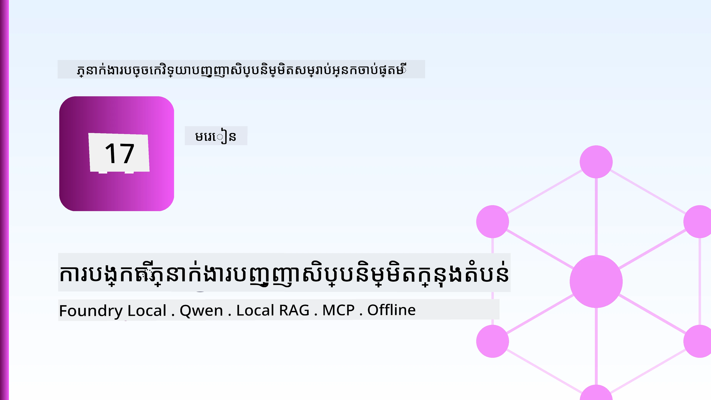
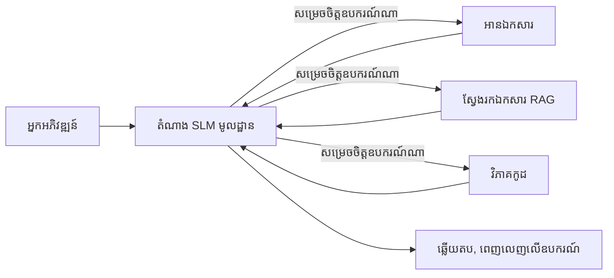
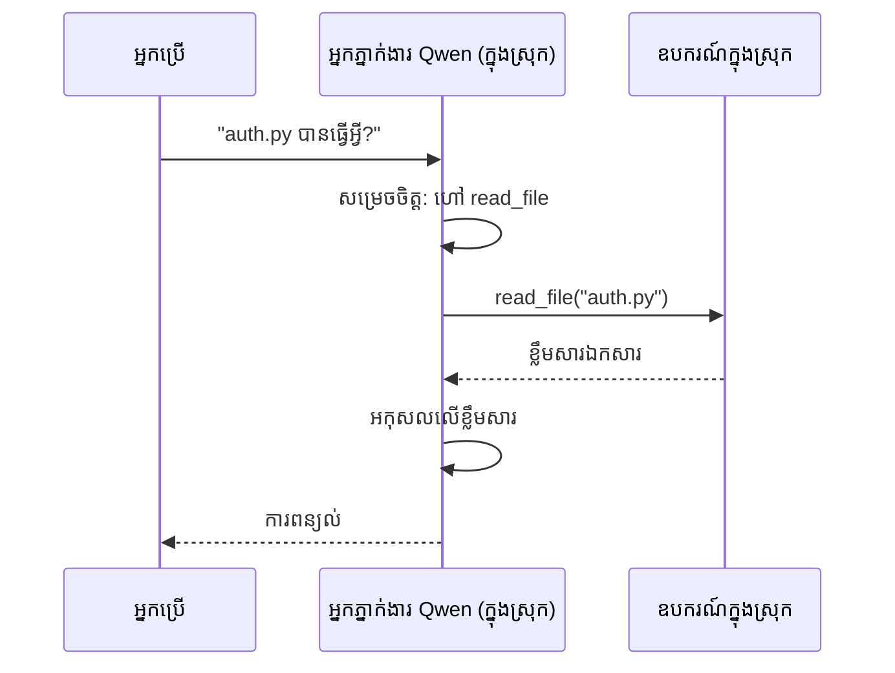
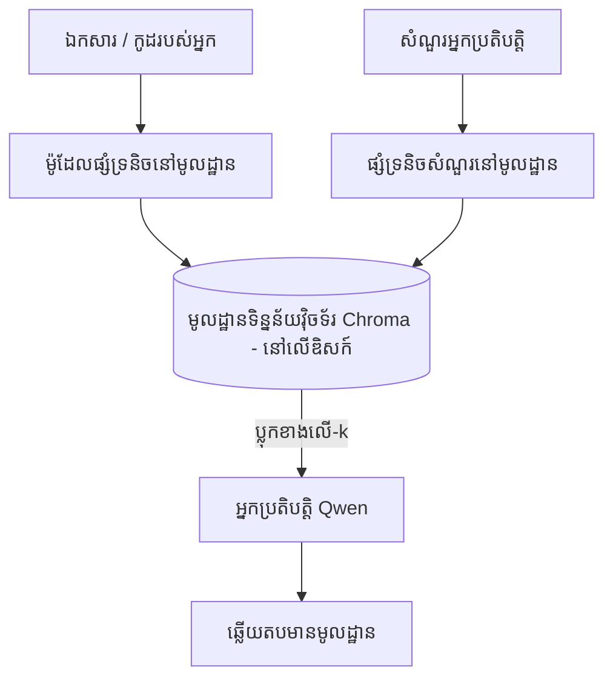
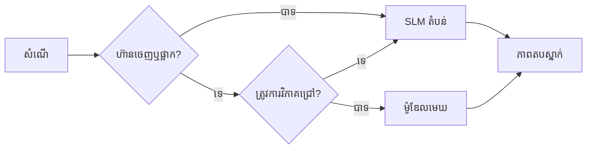

# បង្កើតអ្នកជំនួយ AI មូលដ្ឋាន ដោយប្រើ Microsoft Foundry Local និង Qwen



មេរៀនមុនណាស់បានបង្កើតអ្នកជំនួយចូលទៅក្នុងពពក។ មេរៀននេះនាំយកពួកវាចូលទៅក្នុងកុំព្យូទ័រតែមួយ។ នៅចុងមេរៀន អ្នកនឹងមានអ្នកជំនួយវិស្វកម្មមួយដែលដំណើរការល្អ ជាអ្នកសន្និដ្ឋាន រហូតដល់ហៅឧបករណ៍ អានឯកសារ និងស្វែងរកឯកសាររបស់អ្នក — **ដោយមិនមានការហៅស្វែងរកពីពពកឡើយ។**

ហេតុអ្វីបានជាអ្នកចង់បាននេះ? មានបីហេតុការណ៍ដែលបញ្ជាក់ជាប្រចាំក្នុងការងារវិស្វកម្មពិតប្រាកដ៖

- **ភាពឯកជន។** កូដ និងឯកសារមិនដែលចេញពីកុំព្យូទ័រទេ។ គ្មានការផ្ញើសំណើ សំណុំបែបបទ ឬទិន្នន័យអតិថិជនឆ្លងកាត់ចំណុចបន្តរប្រព័ន្ធបណ្ដាញទេ។
- **ថ្លៃដើម។** ការសម្រេចដោយមូលដ្ឋានមិនមានវិក្កយបត្រពីតួអក្សរទេ។ អ្នកអាចធ្វើការឃ្លាំមើលបានពេញមួយថ្ងៃក្នុងតម្លៃថាមពលអគ្គិសនី។
- **ធ្វើការ​អនឡាញ។** នៅលើយន្តហោះ នៅកន្លែងមានសុវត្ថិភាព ឬនៅពេលបាត់បង់សេវាកម្ម ពួកវានៅតែដំណើរការ។

ការចាប់ផ្តើមគឺអ្នកកំពុងប្ដូរម៉ូដែលពពកខ្ពស់ទៅជាម៉ូដែលភាសាឥតធំ (SLM) ដែលដំណើរការលើ CPU, GPU ឬ NPU របស់អ្នក។ មេរៀននេះគឺអំពីការបង្កើតអ្នកជំនួយដែលល្អក្នុងដែនកំណត់នោះ ជុះពីការជាប់ចិត្តថាកំណត់នោះមិនមាន។

## ការណែនាំ

មេរៀននេះនឹងគ្របដណ្តប់ៈ

- **ម៉ូដែលភាសាឥតធំ (SLMs)** — តើវាជាអ្វី កន្លែងដែលវាអាចប្រើបាននិងកន្លែងដែលវាមិនអាចប្រើបាន។
- **Microsoft Foundry Local** — runtime មួយដែលទាញយកនិងបម្រើម៉ូដែលនៅលើឧបករណ៍តាមរយៈ **API ដែលគាំទ្រដោយ OpenAI**។
- **ម៉ូដែលហៅមុខងារ Qwen** — SLMs ដែលបង្កើតសំលេងហៅឧបករណ៍បានជាដំណើរការបានបណ្ដោះអាសន្ន ជាភាពដែលធ្វើឲ្យអ្នកជំនួយមូលដ្ឋាន *អាចដំណើរការ* (មិនមែនតែនិយាយតែពេលមូលដ្ឋានទេ)។
- **ឧបករណ៍មូលដ្ឋាន មាន RAG និង MCP មូលដ្ឋាន** — ផ្តល់សមត្ថភាពឱ្យអ្នកជំនួយដោយមិនចាំបាច់ពពក។
- **លំនាំអថេរលាយបញ្ចូល** — ពេលណាត្រូវរក្សាតែម្ដងកន្លែងមូលដ្ឋាន ហើយពេលណាត្រូវចូលរួមពពក។

## គោលបំណងរៀន

បន្ទាប់ពីបញ្ចប់មេរៀននេះ អ្នកនឹងដឹងវិធីធ្វើដូចខាងក្រោម៖

- ពន្យល់អំពីតម្លៃនៃ SLMs និងជ្រើសរើសករណីប្រើអ្នកជំនួយមូលដ្ឋានសមរម្យ។
- បម្រើម៉ូដែល Qwen តាម Foundry Local ដោយប្រើចំណុចចេញប្រភេទ OpenAI-compatible ។
- បង្កើតអ្នកជំនួយហៅឧបករណ៍ដំណើរការពេញលេញលើកុំព្យូទ័ររបស់អ្នក។
- បន្ថែម RAG នៅលើឯកសារផ្ទាល់របស់អ្នកដោយប្រើមូលដ្ឋានទិន្នន័យវ៉ិកទ័រ (Chroma) មូលដ្ឋាន។
- ខ្សែភ្ជាប់អ្នកជំនួយទៅម៉ាស៊ីនមេ MCP មូលដ្ឋាន និងពិចារណាពីរចនាបថលាយបញ្ចូលមូលដ្ឋាន/ពពក។

## ការតម្រូវជាមុន

មេរៀននេះដកស្រង់ពីមេរៀនមុនៗហើយអ្នកគួរត្រួតពិនិត្យ៖

- [ការប្រើឧបករណ៍](../04-tool-use/README.md) (មេរៀន ៤) និង [Agentic RAG](../05-agentic-rag/README.md) (មេរៀន ៥)។
- [ប្រព័ន្ធប្រតិបត្តិការ Agentic / MCP](../11-agentic-protocols/README.md) (មេរៀន ១១)។
- [Microsoft Agent Framework](../14-microsoft-agent-framework/README.md) (មេរៀន ១៤)។

អ្នកក៏ត្រូវការដូចខាងក្រោមផងដែរ៖

- ម៉ាស៊ីនកុំព្យូទ័រអភិវឌ្ឍន៍។ **RAM ៨ GB គឺជាកម្រិតអប្បបរមាដែលមានភាពស្រួល**; ១៦ GB+ នាំឲ្យមានភាពងាយស្រួល។ GPU ឬ NPU ជួយបានប៉ុន្តែមិនត្រូវការ។
- ដំឡើង **Microsoft Foundry Local** (មើលផ្នែកដំឡើងខាងក្រោម)។
- Python 3.12+ និងកញ្ចប់នៅក្នុងស្តុកទិន្នន័យ [`requirements.txt`](../../../requirements.txt) រួមជាមួយ `foundry-local-sdk` `openai` និង `chromadb` សម្រាប់មេរៀននេះ។

## ម៉ូដែលភាសាឥតធំ៖ ឧបករណ៍សមរម្យសម្រាប់ការងារមូលដ្ឋាន

ម៉ូដែលពពកខ្ពស់មានប៉ារ៉ាម៉ែត្រ​រង្វាន់នៃរយៈពាន់លាន និងមានមជ្ឈមណ្ឌលទិន្នន័យជាផ្ទៃក្រោយ។ SLM មានប៉ារ៉ាម៉ែត្រ​ប៉ុន្មានលានប៉ុណ្ណោះ ហើយត្រូវដាក់ក្នុង RAM នៃកុំព្យូទ័រយួរដៃរបស់អ្នក។ ភាពខុសគ្នានេះកំណត់ការរំពឹងទុកយ៉ាងច្បាស់។

**SLMs មានសមត្ថភាពល្អក្នុង៖**

- ការងារត្រូវបានបូកសរុប និងដាក់កំណត់ — វាយតម្លៃចំណាត់ថ្នាក់ ចេញយក និងសង្ខេបឯកសារដែលស្គាល់។
- **ការហៅឧបករណ៍** — ការសម្រេចចិត្តហៅមុខងារណាមួយនិងជាមួយអ្វី។
- ការត្រឡប់លើទិន្នន័យរបស់ខ្លួនដោយលឿន ធូរ និងមានភាពឯកជន។

**SLMs មានភាពខ្សោយក្នុង៖**

- ការសន្និដ្ឋានបែបចម្រុះ និងចាប់ផ្តើមជាច្រើនជំហានលើបរិបទធំ។
- ចំណេះដឹងទូលំទូលាយ (ពួកវាមើលឃើញតិច ហើយភ្លេចច្រើន)។

គោលន័យជ័យលាភសម្រាប់អ្នកជំនួយមូលដ្ឋានគឺ៖ **អោយ SLM គ្រប់គ្រង ហើយឲ្យឧបករណ៍ធ្វើការងារលំបាក។** ម៉ូដែលមិនត្រូវចាំបាច់ដឹងពីកូដរបស់អ្នកទេ — វាត្រូវដឹងពេលណាហៅ `read_file` និង `search_docs`។ នេះជាការប្រើគុណសម្បត្តិរបស់ SLM ដោយផ្ទាល់។



## Microsoft Foundry Local

**Microsoft Foundry Local** គឺជា runtime ទំងន់ស្រាល ដែលទាញយក គ្រប់គ្រង និងបម្រើម៉ូដែលពេញលេញលើមាស៊ីនរបស់អ្នក។ លក្ខណៈសំខាន់បំផុតសម្រាប់យើងគឺវាបង្ហាញ **ចំណុចចេញ HTTP ដែលគាំទ្រដោយ OpenAI** — មានន័យថា OpenAI SDK និង Microsoft Agent Framework OpenAI client អាចប្រើប្រាស់វាដោយផ្លាស់ប្តូរត្រឹមតែ `base_url` តែប៉ុណ្ណោះ។ អ្វីដែលអ្នកបានសិក្សាអំពីការបង្កើតអ្នកជំនួយអាចផ្ទេរបានដោយផ្ទាល់; គ្រាន់តែចំណុចចេញផ្លាស់ពីពពកទៅ `localhost`។

Foundry Local ក៏ជ្រើសរើសកំណែម៉ូដែលល្អបំផុតសម្រាប់រឹងភាសា របស់អ្នកដោយស្វ័យប្រវត្តិ — បែបបង្កើត CPU ខ្លួនឯង, បែប CUDA/GPU ឬ NPU — ដូច្នេះអ្នកមិនចាំបាច់បង្កើតដោយដៃជាមុនប្រសប់សម្រាប់មួយម៉ាស៊ីនឡើយ។

### ការកំណត់

ដំឡើង Foundry Local (មើល [ឯកសារណ៍](https://learn.microsoft.com/azure/ai-foundry/foundry-local/) សម្រាប់ប្រព័ន្ធប្រតិបត្តិការ របស់អ្នក), បន្ទាប់មកធ្វើការត្រួតពិនិត្យវាដំណើរការ៖

```bash
# តំឡើង (ឧទាហរណ៍; អនុវត្តតាមឯកសារសម្រាប់វេទិការបស់អ្នក)
winget install Microsoft.FoundryLocal      # វីនដូ
# brew install microsoft/foundrylocal/foundrylocal   # macOS

# ទាញយក និងរត់ម៉ូដែល Qwen បន្ទាប់មកចាប់ផ្តើមសេវាកម្មក្នុងស្រុក
foundry model run qwen2.5-7b-instruct
foundry service status
```

បន្ទាប់ពីសេវាកម្មដំណើរការ អ្នកមានចំណុចចេញ OpenAI-compatible មូលដ្ឋានភាគល្ងាចជាគោល (ធម្មតា `http://localhost:PORT/v1`)។ សៀវភៅកំណត់ប្រើ `foundry-local-sdk` ស្វែងរកចំណុចចេញដោយស្វ័យប្រវត្តិ ដូច្នេះអ្នកមិនចាំបាច់កំណត់ច្រកដោយដៃឡើយ។

## ការហៅមុខងារ Qwen៖ ហេតុអ្វីវាសំខាន់

អ្នកជំនួយគឺជា​តែ​អ្នកជំនួយបើវាអាចហៅឧបករណ៍បាន។ SLMs ជាច្រើនអាចនិយាយប៉ុន្តែមិនបង្កើតហៅឧបករណ៍បានត្រឹមត្រូវ។ ម៉ូដែល Qwen ត្រូវបានហ្វឹកហាត់សម្រាប់ហៅមុខងារ និងផលិតសំណុំហៅឧបករណ៍បានល្អសមរម្យ — ដែលជាអ្វីដែលបំលែងម៉ូដែលនិយាយមូលដ្ឋានជាអ្នកជំនួយមូលដ្ឋាន។

សំណុំបទនោះគឺជាលំនាំហៅឧបករណ៍ស្តង់ដារដែលអ្នកបានស្គាល់។ គ្រាន់តែដំណើរការលើឧបករណ៍៖



## RAG មូលដ្ឋាន

ការស្វែងរកឯកសារ គឺជាកន្លែងដែលអ្នកជំនួយមូលដ្ឋានចំណាយពេល។ ជំនួសការរំពឹងថា SLM នឹងចងចាំឯកសារប្រព័ន្ធរបស់អ្នក អ្នកបញ្ចូលឯកសារទាំងនោះទៅ **មូលដ្ឋានទិន្នន័យវ៉ិកទ័រសម្លាប់មូលដ្ឋាន** ហើយអនុញ្ញាតិឲ្យអ្នកជំនួយយកឯកសារផ្នែកសមរម្យតាមការទាមទារ។

យើងប្រើ **Chroma** ដែលជាឃ្លាំងវ៉ិកទ័រត្រូវដាក់នៅក្នុងដំណើរការដោយគ្មានម៉ាស៊ីនមេគ្រប់គ្រង។ ប្រព័ន្ធគឺស្រឡាយ: ម៉ូដែលបញ្ចូលមូលដ្ឋាន → វ៉ិកទ័រមូលដ្ឋាន → ការយកវិញមូលដ្ឋាន → SLM មូលដ្ឋាន។



នេះគឺជាលំនាំ Agentic RAG ពីមេរៀន ៥ — ការផ្លាស់ប្តូរតែមួយគឺគ្រប់សមាសធាតុនៅលើមាស៊ីនរបស់អ្នក។

## ម៉ាស៊ីនមេ MCP មូលដ្ឋាន

[MCP](../11-agentic-protocols/README.md) គឺជាសេវាកម្មតែមិនមែនមជ្ឈមណ្ឌលពពកទេ។ ម៉ាស៊ីនមេ MCP អាចដំណើរការជាលំហូរ មូលដ្ឋាន `stdio` បាន។ វាយកឧបករណ៍ទៅអ្នកជំនួយតាមពិធីសាស្ត្រស្តង់ដារ។ នេះអនុញ្ញាតឱ្យអ្នកប្រើម៉ាស៊ីនមេ MCP ជាច្រើនដែលកំពុងរីកចម្រើន—ការចូលប្រើប្រព័ន្ធឯកសារ ប្រតិបត្ដិការ git សំណួរទិន្នន័យ — ត្រូវបានធ្វើអនឡាញ។

ភាពសុវត្ថិភាពខុសពីពពក ប៉ុន្តែមិនបាត់បង់: ម៉ាស៊ីនមេ MCP មូលដ្ឋាននៅតែដំណើរការជាមួយសិទ្ធិរបស់អ្នកប្រើ ដូចនោះគួรกำหนดថាវាអាចប៉ះពាល់ទៅលើតំបន់ណា (ថតគម្រោង មិនមែនថតផ្ទាល់ខ្លួនទាំងមូល) ហើយព្យាយាមបញ្ចូលលទ្ធផលជាអង្គភាពទិន្នន័យដើម្បីធានាគុណភាព។

## លំនាំលាយបញ្ចូល មូលដ្ឋាន និង ពពក

ការបើកដំបូងមូលដ្ឋានមិនមានន័យថាគិតតែម្ដងដែលមូលដ្ឋាន។ ប្រព័ន្ធជ្រៅៗនាំរដ្ឋមួយតំរូវការតាមកំរិតភាពហ៊ាននិងភាព ពិបាក:

| ស្ថានភាព | កន្លែងចេញ |
| --- | --- |
| កូដ / ទិន្នន័យមានភាពឯកជន ឬដំណើរការអនឡាញ | **SLM មូលដ្ឋាន** |
| ការងារងាយត្រៀមចប់ | **SLM មូលដ្ឋាន** (ថ្លៃថោក លឿន) |
| ការសន្និដ្ឋានចម្រុះជាច្រើនជំហានលើទិន្នន័យមិនឯកជន | **ម៉ូដែលពពក** |
| គ្រប់ករណី ជាពេលបាត់បង់សេវា | **SLM មូលដ្ឋាន** (ធ្វើការកាត់ចំណាយយ៉ាងសមរម្យ) |

នេះស្រដៀងនឹងគំនិត **ការបញ្ជូនម៉ូដែល** ពីមេរៀន ១៦ — លើកលែងតែកន្លែងមួយក្នុង "ម៉ូដែល" គឺម៉ាស៊ីនរបស់អ្នក។ អាចរៀបចំយ៉ាងរឹងមាំត្រឡប់ទៅម៉ូដែលមូលដ្ឋាននៅពេលពពកមិនអាចប្រើបាន ដូច្នេះអ្នកជំនួយមានគុណភាពចុះខ្សោយជាជំហានមួយជំនួសការបរាជ័យ។



## ការផ្តល់អ្នកប្រើប្រាស់: ជំនួយភាសាវិស្វកម្មមូលដ្ឋាន

បើក [`code_samples/17-local-agent-foundry-local.ipynb`](./code_samples/17-local-agent-foundry-local.ipynb) ហើយធ្វើតាម។ អ្នកនឹងបង្កើត **ជំនួយភាសាវិស្វកម្មមូលដ្ឋាន** ដែលដំណើរការពេញលេញលើកុំព្យូទ័ររបស់អ្នក ហើយអាច៖

1. **ហៅឧបករណ៍** — តាមរយៈ Qwen function calling តាម Foundry Local។
2. **ធ្វើប្រតិបត្ដិការឯកសារមូលដ្ឋាន** — បញ្ជី និងអានឯកសារនៅក្នុងថតគម្រោង។
3. **វិភាគកូដ** — រាយការណ៍ចំនួនមេត្រីចុងក្រោមលើឯកសារទិន្នន័យដើម។
4. **ស្វែងរកឯកសារ** — RAG មូលដ្ឋានលើថតឯកសារជាមួយ Chroma។
5. **ប្រើ MCP** — តភ្ជាប់ទៅម៉ាស៊ីនមេ MCP មូលដ្ឋាន (ធ្វើការលោតខ្លីប្រសិនបើគ្មានកំណត់)។

គ្មានការហៅស្វែងរកពីពពកនៅពេលណា។

### ដំណើរការជំហាន

ជំនួយភាសាវិស្វកម្មភ្ជាប់ទៅ Foundry Local តាមចំណុចចេញ OpenAI-compatible ដូច្នេះកូដអ្នកជំនួយស្រដៀងទៅគ្នាច្រើនជាង មេរៀនពពក — តែកស៊ីនថ្នាក់ក្លាយទៅបង្អួចផ្សេង:

```python
from foundry_local import FoundryLocalManager
from openai import OpenAI

# Foundry Local ស្វែងរក/ទាញយកម៉ូឌែល និងផ្តល់អោយយើងនូវចំណុចបញ្ចប់ក្នុងស្រុក។
manager = FoundryLocalManager(\"qwen2.5-7b-instruct\")
client = OpenAI(base_url=manager.endpoint, api_key=manager.api_key)  # api_key គឺជាទីតាំងសំណុំក្នុងស្រុក។
```

ឧបករណ៍គឺជាអនុគមន៍ Python សាមញ្ញ ដែលកំណត់បណ្តោយទៅថតគម្រោងមួយ៖

```python
def read_file(path: str) -> str:
    \"\"\"Read a file, but only inside the sandboxed project directory.\"\"\"
    full = (PROJECT_ROOT / path).resolve()
    if PROJECT_ROOT not in full.parents and full != PROJECT_ROOT:
        return \"Access denied: path is outside the project directory.\"
    return full.read_text(encoding=\"utf-8\")
```

ចំណាំការត្រួតពិនិត្យ sandbox — ទោះជាលើកន្លែងមូលដ្ឋាន គ្រប់ឧបករណ៍អានផ្លូវតំណរជាចៃដន្យគឺជាហានិភ័យ។ សៀវភៅកំណត់រក្សាគ្រប់ឧបករណ៍នៅក្នុង root ថតគម្រោងតែមួយ។

## ការត្រួតពិនិត្យចំណេះដឹង

ពិសោធន៍ជំនាញរបស់អ្នកមុនបន្តទៅកិច្ចការបន្ត។

**១. ផ្តល់ករណីពីរដែលច្បាស់លាស់សម្រាប់ដំណើរការអ្នកជំនួយមូលដ្ឋានជាជម្រើសជំនួសពពក។**

<details>
<summary>ចម្លើយ</summary>

រឺណាមួយពីពីររបស់: **ភាពឯកជន** (កូដនិងទិន្នន័យមិនចេញពីឧបករណ៍នោះ), **ថ្លៃដើម** (គ្មានវិក្កយបត្រក្នុងការសម្រេចលើតួអក្សរ), និង **សមត្ថភាពអនឡាញភាពតិច** (ដំណើរការបានដោយគ្មានបណ្តាញ - លើយន្តហោះ នៅកន្លែងមានសុវត្ថិភាព ឬនៅពេលបាត់បង់សេវាកម្ម)។ ការរឹតត្បិតច្បាប់/ការបំពេញតាមលក្ខខណ្ឌហាមឃាត់ការផ្ញើទិន្នន័យក្រៅឧបករណ៍គឺជាឧបករណ៍បង្កើតមូលហេតុភាពឯកជន។
</details>

**២. តើការបែងចែកកិច្ចការវិវឌ្ឍរវាង SLM និងឧបករណ៍របស់វាក្នុងអ្នកជំនួយមូលដ្ឋានគឺធ្វើដូចម្ដេច ហើយហេតុអ្វី?**

<details>
<summary>ចម្លើយ</summary>

អោយ SLM **គ្រប់គ្រង** (សម្រេចចិត្តហៅឧបករណ៍ណាមួយ និងជាមួយអ្វី) ហើយអោយ **ឧបករណ៍ធ្វើការងារលំបាក** (អានឯកសារ ត្រឡប់ឯកសារ គណនា​លទ្ធផល)។ SLM មានភាពខ្លាំងក្នុងការសម្រេចចិត្តមានកំណត់ដូចជាការជ្រើសរើសឧបករណ៍ ប៉ុន្តែខ្សោយក្នុងចំណេះដឹងទូលំទូលាយ និងការសន្និដ្ឋានចម្រុះជាច្រើនជំហាន ដូច្នេះការជួយឧបករណ៍ជួយកំណត់កម្លាំងរបស់វា។
</details>

**៣. អ្វីធ្វើឲ្យអាចប្រើកូដអ្នកជំនួយពពកជាមួយ Foundry Local បាន?**

<details>
<summary>ចម្លើយ</summary>

Foundry Local បង្ហាញ **ចំណុចចេញ HTTP ដែលគាំទ្រដោយ OpenAI**។ OpenAI SDK និង OpenAI client របស់ Agent Framework ប្រតិបត្តិការលើវា​ដោយផ្លាស់ប្តូរ​ត្រឹមតែ `base_url` (និងប្រើកូនសោ API លើកន្លែងមូលដ្ឋាន)។ អ្វីដែលស្ថិតក្នុងកូដអ្នកជំនួយនៅតែដូចគ្នា។
</details>

**៤. ហេតុអ្វីយើងប្រើម៉ូដែលហៅមុខងារ Qwen ជាក់លាក់ មិនមែន SLM ណាមួយទេ?**

<details>
<summary>ចម្លើយ</summary>

ពីព្រោះអ្នកជំនួយត្រូវបង្កើត **ហៅឧបករណ៍** ដែលទុកចិត្តបាន និងរៀបរយល្អ។ SLM ជាច្រើនអាចនិយាយ ប៉ុន្តែមិនបង្កើតសំណុំហៅឧបករណ៍បានត្រឹមត្រូវ។ ម៉ូដែល Qwen ត្រូវបានហ្វឹកហាត់មុខងារហៅ និងបង្កើតហៅឧបករណ៍ទៀងទាត់ គឺអ្វីដែលបំលែងម៉ូដែលនិយាយមូលដ្ឋានជាអ្នកជំនួយមូលដ្ឋានដំណើរការ។
</details>

**៥. ក្នុងបណ្ដាល RAG មូលដ្ឋាន អង្គភាពណាដំណើរការលើមាស៊ីន?**

<details>
<summary>ចម្លើយ</summary>

គ្រប់អង្គភាព: ម៉ូដែលបញ្ចូល, មូលដ្ឋានទិន្នន័យវ៉ិកទ័រ (Chroma, លើថត), ជំហានទាញយកវិញ និង SLM។ ឯកសារត្រូវបានបញ្ចូលក្នុងមូលដ្ឋាន, ដាក់រក្សាតាមមូលដ្ឋាន, ទាញយកពីមូលដ្ឋាន និងសម្រេចចិត្តដោយម៉ូដែលមូលដ្ឋាន — គ្មានអង្គភាពណាមួយប៉ះពាល់ពពកឡើយ។
</details>

**៦. ម៉ាស៊ីនមេ MCP មូលដ្ឋានដំណើរការលើមាស៊ីនរបស់អ្នក។ តើវាគឺសុវត្ថិភាពដោយស្វ័យប្រវត្តិទេ? តើត្រូវប្រយត្ន័អ្វីនៅតែរាល់ពេល?**

<details>
<summary>ចម្លើយ</summary>

មិនមែនទេ។ ម៉ាស៊ីនមេ MCP មូលដ្ឋានដំណើរការជាមួយសិទ្ធិអ្នកប្រើរបស់អ្នក ដូច្នេះវាអាចប៉ះពាល់អ្វីតាមដែលអ្នកអាចធ្វើបាន។ អោយវាត្រូវតែមានដែនកំណត់កន្លែងដែលវាត្រូវប្រើ (ឧ. ថតគម្រោង មិនមែនថតផ្ទាល់ខ្លួនទាំងមូល) ហើយផ្ទេរលទ្ធផលជាចំណូលដើម្បីអនុវត្តបន្ទាប់ពីផ្ទៀងផ្ទាត់។
</details>

**៧. សរសេររបៀបបញ្ជូនលំនាំដែលមានផ្លូវចំបងដែលរួមបញ្ចូលម៉ូដែលមូលដ្ឋានមួយ។**

<details>
<summary>ចម្លើយ</summary>

បញ្ជូនសំណើឯកជន ឬស្ថានភាពអនឡាញទៅ SLM មូលដ្ឋាន; បញ្ជូនការងារងាយៗទៅ SLM មូលដ្ឋាន សម្រាប់ល្បឿន និងថ្លៃដើម; បញ្ជូនការសន្និដ្ឋានចម្រុះជាច្រើនជំហានលើទិន្នន័យមិនឯកជនទៅម៉ូដែលពពក; ហើយបន្ថែមត្រឡប់ទៅ SLM មូលដ្ឋានប្រសិនបើពពកមិនអាចប្រើបាន ដូច្នេះអ្នកជំនួយធ្លាក់ទម្រង់សម្រួលជំនួសការបរាជ័យ។ នេះគឺជាការបញ្ជូនម៉ូដែល (មេរៀន ១៦) ជាមួយម៉ាស៊ីនមូលដ្ឋានជាម៉ូដែលមួយ។
</details>

**៨. តើលំនាំ RAM អប្បបរមាដែលសមរម្យសម្រាប់រត់អ្នកជំនួយមូលដ្ឋាននៅក្នុងមេរៀននេះមានចំនួនប៉ុន្មានហើយ RAM មួយចំនួនបន្ថែមបង្កើតអ្វី?**

<details>
<summary>ចម្លើយ</summary>

ប្រហែលជា **៨ GB** គឺជាកម្រិតមើលឃើញសមរម្យ; ១៦ GB+ មានភាពងាយស្រួល។ RAM ច្រើនជួយអោយអាចដំណើរការម៉ូដែលធំនិងមានសមត្ថភាពខ្ពស់ជាង និងរក្សាបរិបទច្រើនក្នុងមេមូរី។ GPU ឬ NPU ជួយលឿនការសម្រេចប៉ុន្តែមិនត្រូវការល្អ — Foundry Local ជ្រើសរើសបង្កើត CPU ក្នុងករណីគ្មានល្បឿនជំនួយ។
</details>

## កិច្ចការបន្ត

ពន្លឿនជំនួយភាសាវិស្វកម្មមូលដ្ឋានទៅជាអ្នកពិនិត្យឯកសារមូលដ្ឋានសម្រាប់គម្រោងតូចណាមួយដែលអ្នកចូលចិត្ត (ប្រើថតមេរៀនណាមួយក្នុងrepo នេះបើអ្នកចង់)។

ការដាក់ស្នើររបស់អ្នកគួរតែ៖

1. **ធ្វើដាក់អនុបញ្ជាក់ថតឯកសារពិត/កូដ** ទៅ Chroma (យ៉ាងហោចណាស់ប្រាំឯកសារ)។
2. **ដាក់ឧបករណ៍ `find_todos`** ដែលស្កេនគម្រោងសម្រាប់មតិយោបល់ `TODO`/`FIXME` ហើយត្រលប់មកជាមួយឯកសារនិងលេខជួរ — រក្សាការត្រួតពិនិត្យ sandbox ដូចជា `read_file`។

3. **សួរគណៈកម្មការពីសំណួរបីសំណួរ** ដែលប្រារព្ធឲ្យវាប្រមូលបញ្ចូលឧបករណ៍: សំណួរ RAG ប្រភេទបរិសុទ្ធមួយ សំណួរដែលត្រូវការអានឯកសារពិសេសមួយ និងសំណួរដែលត្រូវរក TODOs មួយ។
4. **វាស់វែងវា**៖ វាស់ពេលនៅរៀងរាល់ចម្លើយទាំងបី ហើយកត់សម្គាល់វានៅក្នុងកោសិកា markdown មួយ។ អ្នកគួរពិនិត្យមើលថាពេលប្រើប្រាស់មានសមរម្យសម្រាប់លំហូរសារព័ត៌មានដែលអ្នកចង់ធ្វើឬយ៉ាងដូចម្តេច។

បន្ទាប់មកសរសេរចំណាត់ស្រាយខ្លីមួយអំពី **អ្វីដែលអ្នកនឹងបញ្ចូនទៅកាន់ពពក និងអ្វីដែលអ្នកនឹងរក្សាទុកក្នុងតំបន់ លក្ខណៈសម្រាប់អ្នកពិនិត្យនេះ** ហើយហេតុផល។ អ្នកត្រូវបានវាយតំលៃថាផ្នែកក្នុងតំបន់ត្រូវបានភ្ជាប់គ្នាដោយត្រឹមត្រូវ និងការអនុវត្តន៍គំនិតរួមគ្នារបស់អ្នកមានសុចរិត — មិនពាក់ព័ន្ធនឹងគុណភាពម៉ូដែលទេ។

## សង្ខេប

នៅក្នុងមេរៀននេះ អ្នកបានបង្កើតគណៈកម្មការ​ដែលដំណើរការផ្តាច់មុខលើម៉ាស៊ីនរបស់អ្នក:

- **SLMs** ពឹងផ្អែកលើវិសាលភាពសម្រាប់ភាពឯកជន តម្លៃ និងការប្រើប្រាស់ក្រៅបណ្តាញ — ហើយមានប្រសិទ្ធភាពពេលពួកវា **រៀបចំឧបករណ៍** ជំនួសការពារព័ត៌មានទាំងមូល។
- **Foundry Local** ផ្តល់ម៉ូដែលនៅលើឧបករណ៍ក្រោយផ្នែកផ្លូវចេញ **OpenAI-compatible endpoint** ដូច្នេះកូដភ្នាក់ងារប្រព្រឹត្តទៅកាន់ពពករបស់អ្នកអាចផ្ទេរបានដោយការផ្លាស់ប្តូរមួយបន្ទាត់។
- **ម៉ូដែលហៅហ្វង់ស៊ីស-Qwen** បង្កើតការហៅឧបករណ៍ក្នុងតំបន់ដែលទុកចិត្តបាន — ហើយដូច្នេះ *ភ្នាក់ងារក្នុងតំបន់* ក៏អាចធ្វើបានផងដែរ។
- **Local RAG** (Chroma) និង **local MCP** ផ្តល់សមត្ថភាពឲ្យភ្នាក់ងារដោយគ្មានការចាកចេញពីម៉ាស៊ីន។
- **គំរូផ្សំនៃផ្នែករួម** អនុញ្ញាតឲ្យអ្នកផ្លាស់ប្តូរតាមកម្រិតភាពទន់ខ្សោយនិងកម្រិតលំបាក ជាមួយនឹងតំបន់ក្នុងជាជម្រើសដែលមានសមត្ថភាព។

នេះបញ្ចប់ដំណើរទុកដាក់: មេរៀនទី 16 បានបង្ហាញពីការពង្រីកភ្នាក់ងារទៅក្នុង Microsoft Foundry ហើយមេរៀននេះបានបង្ហាញពីការបង្រួមវាទៅលើកុំព្យូទ័រលើកមួយ។ មេរៀនបន្ទាប់នឹងផ្តោតលើការរក្សាភ្នាក់ងារដែលបានបញ្ចប់ឲ្យមានសុវត្ថិភាព។

## ឯកសារបន្ថែម

- <a href="https://learn.microsoft.com/azure/ai-foundry/foundry-local/" target="_blank">ឯកសារដែលទាក់ទាញ Microsoft Foundry Local</a>
- <a href="https://learn.microsoft.com/azure/ai-foundry/what-is-azure-ai-foundry" target="_blank">ឯកសារផ្នែក Microsoft Foundry</a>
- <a href="https://learn.microsoft.com/en-us/agent-framework/overview/?wt.mc_id=youtube_26688_organicsocial_reactor&pivots=programming-language-python" target="_blank">សេចក្តីផ្តើម Microsoft Agent Framework</a>
- <a href="https://qwen.readthedocs.io/en/latest/framework/function_call.html" target="_blank">ឯកសារហៅហ្វង់ស៊ីស Qwen</a>
- <a href="https://modelcontextprotocol.io/" target="_blank">ពិធីការបរិបទម៉ូដែល (MCP)</a>
- <a href="https://docs.trychroma.com/" target="_blank">មូលដ្ឋានទិន្នន័យវ៉ិចទ័រប្រភេទ Chroma</a>

## មេរៀនមុន

[ការដាក់បញ្ចូលភ្នាក់ងារដ៏អាចបង្រួបបង្រួមបាន](../16-deploying-scalable-agents/README.md)

## មេរៀនបន្ទាប់

[ការរក្សាសុវត្ថិភាពភ្នាក់ងារ AI](../18-securing-ai-agents/README.md)

---

<!-- CO-OP TRANSLATOR DISCLAIMER START -->
**ការបដិសេធ**:
ឯកសារនេះត្រូវបានបម្លែងភាសា ដោយប្រើសេវាបម្លែងភាសា AI [Co-op Translator](https://github.com/Azure/co-op-translator)។ ទោះយើងខ្ញុំមានក្តីប្រាថ្នាឱ្យបានច្បាស់លាស់ តែសូមយល់ដឹងថាការបម្លែងដោយស្វ័យប្រវត្តិក៏អាចមានកំហុសឬភាពមិនត្រឹមត្រូវ។ ឯកសារដើមជាភាសាទីតាំងគួរត្រូវបានគេប្រើជាប្រភពច្បាស់លាស់។ សម្រាប់ព័ត៌មានសំខាន់ៗ សូមណែនាំឱ្យប្រើប្រាស់ការប្រែដោយមនុស្សជំនាញ។ យើងខ្ញុំមិនទទួលខុសត្រូវចំពោះការយល់ច្រឡំ ឬការបកស្រាយខុសបន្ទាប់ពីការប្រើប្រាស់ការបម្លែងនេះនោះទេ។
<!-- CO-OP TRANSLATOR DISCLAIMER END -->