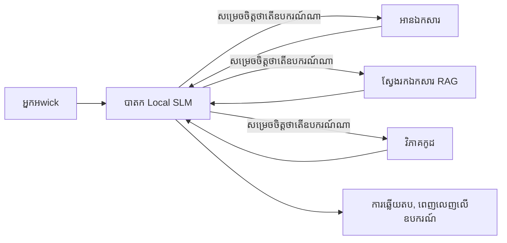
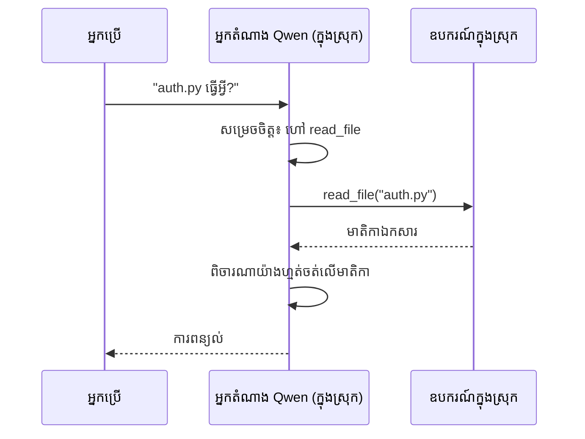
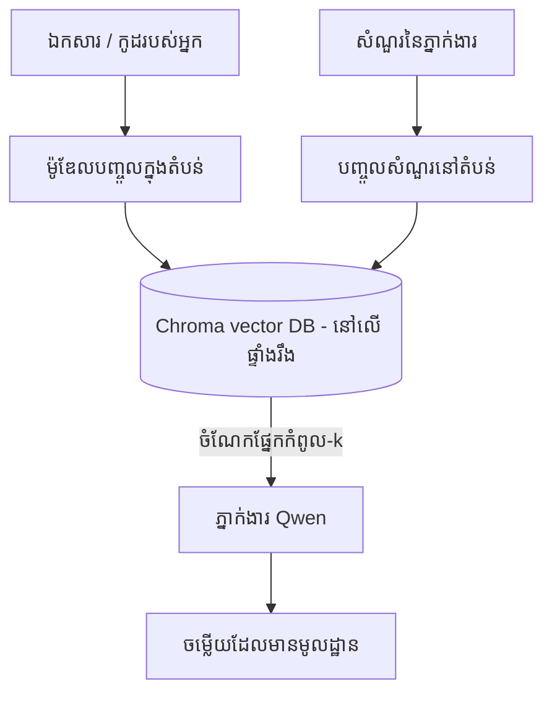
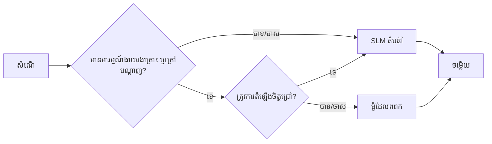

# ការបង្កើតភ្នាក់ងារតំណាង AI មូលដ្ឋានដោយប្រើ Microsoft Foundry Local និង Qwen


មេរៀនមុនបានបង្រៀនពីការពង្រីកភ្នាក់ងារឡើងទៅក្នុងមេឃ។ មេរៀននេះនាំពួកវាលงចុះទៅកាន់គ្រឹះតែមួយ។ នៅចុងបញ្ចប់ អ្នកនឹងមានជំនួយការបច្ចេកវិទ្យាដែលធ្វើមនោសញ្ចេតនា ដាក់ទូរស័ព្ទ យកឯកសាររបស់អ្នកអាន និងស្វែងរកឯកសារយោងរបស់អ្នក — **ដោយមិនមានការហៅមេឃណាមួយទេ។**

ហេតុអ្វីបានជា អ្នកចង់បានវា? មានមូលហេតុបីដែលតែងត្រូវបាននិយាយបន្តបន្ទាប់នៅក្នុងការងារបច្ចេកវិទ្យាពិតប្រាកដ៖

- **ភាពឯកជន។** កូដ និងឯកសារមិនធ្លាក់ចេញពីកុំព្យូទ័រនោះឡើយ។ គ្មានប្រើសំណើ ការត្រួតពិនិត្យ ឬទិន្នន័យអតិថិជនណាមួយឆ្លងកាត់ព្រំដែនបណ្តាញ។
- **ការចំណាយ។** ការអនុញ្ញាតពីស្ថានីយ៍មូលដ្ឋានមិនមានការបង់ប្រាក់ទៅលើរាល់សញ្ញាសំឡេងទេ។ អ្នកអាចធ្វើការបន្តរាល់ថ្ងៃតាមតម្លៃថាមពលអគ្គិសនី។
- **បិទបណ្ដាញ។** នៅលើយន្តហោះ ក្នុងទីតាំងមានសុវត្ថិភាព ឬក្នុងចំណោមការផ្ទុកខ្សែ ភ្នាក់ងារនោះនៅតែអាចធ្វើការ។

ភាពចំរូងគ្នាគឺ អ្នកកំពុងប្ដូរម៉ូដែលមេឃព្រំដែនមួយទៅជាម៉ូដែលភាសាស្វ័យប្រវត្តិតូចមួយ (Small Language Model - SLM) ដំណើរការនៅលើ CPU, GPU, ឬ NPU របស់អ្នក។ មេរៀននេះពិភាក្សាអំពីការបង្កើតភ្នាក់ងារដែលមានគុណភាពនៅក្នុងកំណត់នោះ ជាជាងបង្ហាញថាកំណត់នោះមិនមានទេ។

## ការណែនាំ

មេរៀននេះនឹងគ្របដណ្តប់៖

- **ម៉ូដែលភាសាស្វ័យប្រវត្តិតូច (SLMs)** — តើវាជាអ្វី ទីណាដែលវាលតែមែន និងទីណាដែលវាមិនល្អ។
- **Microsoft Foundry Local** — ម៉ាស៊ីនប្រតិបត្តិការដែលទាញយក និងដំណើរការម៉ូដែលនៅលើឧបករណ៍តាមរយៈ **API ដែលសមស្របជាមួយ OpenAI**។
- **ម៉ូដែល Qwen សម្រាប់ហៅមុខងារ** — ម៉ូដែល SLM ដែលអាចបង្ហាញការហៅឧបករណ៍បានយ៉ាងមានទំនុកចិត្ត ដែលធ្វើឲ្យភ្នាក់ងារស្ថានីយ៍មូលដ្ឋានអាចកើតមានបាន។
- **ឧបករណ៍មូលដ្ឋាន, RAG មូលដ្ឋាន និង MCP មូលដ្ឋាន** — ផ្តល់សមត្ថភាពភ្នាក់ងារដោយគ្មានមេឃ។
- **រចនាទ្រង់ទ្រាយបញ្ចូលគ្នា** — ពេលណាគួរប្រើមូលដ្ឋាន និងពេលណាគួរត្រូវប្រើមេឃ។

## គោលបំណងការសិក្សា

បន្ទាប់ពីសម្រេចមេរៀននេះ អ្នកនឹងដឹងវិធី៖

- ពន្យល់អំពីការជ្រើសរើសម៉ូដែល SLM និងជ្រើសរើសករណីប្រើប្រាស់ភ្នាក់ងារមូលដ្ឋានដែលសមរម្យ។
- បម្រើម៉ូដែល Qwen នៅក្នុងមូលដ្ឋានជាមួយ Foundry Local ហើយភ្ជាប់តាមរយៈចំណុចបញ្ចប់ដែលសមស្របជាមួយ OpenAI។
- បង្កើតភ្នាក់ងារហៅឧបករណ៍ ដែលដំណើរការឲ្យបានពេញលេញលើបន្ទះការងារដូចម្ដេច។
- បន្ថែម RAG មូលដ្ឋានលើឯកសាររបស់អ្នកដោយប្រើមូលដ្ឋានទិន្នន័យវ៉ិចទ័រមូលដ្ឋាន (Chroma)។
- ភ្ជាប់ភ្នាក់ងារទៅម៉ាស៊ីនមេ MCP មូលដ្ឋាន ហើយគិតអំពីរចនាបថបញ្ចូលគ្នារវាងមូលដ្ឋាន និងមេឃ។

## លក្ខខណ្ឌមុន

មេរៀននេះសន្មតថាអ្នកបានបញ្ចប់មេរៀនមុនៗ ហើយមានជំនាញ៖

- [ការប្រើប្រាស់ឧបករណ៍](../04-tool-use/README.md) (មេរៀន 4) និង [Agentic RAG](../05-agentic-rag/README.md) (មេរៀន 5)។
- [ពិធីការផ្ទាល់ខ្លួន / MCP](../11-agentic-protocols/README.md) (មេរៀន 11)។
- [Microsoft Agent Framework](../14-microsoft-agent-framework/README.md) (មេរៀន 14)។

អ្នកត្រូវការថែមទាំង៖

- កុំព្យូទ័រអភិវឌ្ឍន៍។ **ជាប់គ្នា 8 GB RAM គឺអាចទទួលបានបានជាកម្រិតអប្បបរមា**; 16 GB ឬច្រើនជាងគឺងាយស្រួល។ GPU ឬ NPU ជួយបាន ប៉ុន្តែមិនបាច់ទេ។
- **Microsoft Foundry Local** ត្រូវបានដំឡើង (មើលផ្នែកសម្រាប់ដំឡើងខាងក្រោម)។
- Python 3.12+ និងកញ្ចប់នៅក្នុងឃ្លាំង `requirements.txt` នៅក្នុងប្រភេទ, បូកបន្ថែម `foundry-local-sdk`, `openai`, និង `chromadb` សម្រាប់មេរៀននេះ។

## ម៉ូដែលភាសាស្វ័យប្រវត្តិតូច៖ ឧបករណ៍ត្រឹមត្រូវសម្រាប់ការងារមូលដ្ឋាន

ម៉ូដែលមេឃព្រំដែនមានពាក្យប៉ារ៉ាម៉ែត្ររាប់រយពាន់លាន និងមានមជ្ឈមណ្ឌលទិន្នន័យនៅពីក្រោយ។ ម៉ូឌែល SLM មានពាក្យប៉ារ៉ាម៉ែត្ររាប់ពាន់លាន និងត្រូវតែមាំម៉េម៉ូរ RAM របស់កុំព្យូទ័រយួរដៃរបស់អ្នក។ ភាពខុសគ្នានេះបានសង្កត់បញ្ចាក់ការរំពឹងទុកយ៉ាងច្បាស់។

**SLMs ល្អសម្រាប់៖**

- ការងារត្រឹមត្រូវ មានដែនកំណត់ — ការតាមដាន ចេញសារ ការសង្ខេបឯកសារដែលបានស្គាល់។
- **ការហៅឧបករណ៍** — ការសម្រេចចិត្តថាតើហៅមុខងារណាមួយ និងជាមួយអ្វីនៅក្នុងអ្នកប្រើប្រាស់។
- ការបញ្ចប់នូវតម្លៃថោក រហ័ស និងឯកជនលើទិន្នន័យផ្ទាល់ខ្លួន។

**SLMs ខ្សោយក្នុង៖**

- ការឡើងលើដំណាក់កាល reasoning ផ្សេងៗគ្នាច្រើនលើបរិបទធំនេះ។
- ចំណេះដឹងទូទៅអំពីពិភពលោក (ពួកវាពិចារណាតិច និងភ្លេចច្រើនជាង)។

ទ្រឹស្តីឈ្នះសម្រាប់ភ្នាក់ងារមូលដ្ឋានគឺ: **អនុញ្ញាតឲ្យ SLM ត្រួតពិនិត្យ រួចអោយឧបករណ៍ធ្វើការដឹកនាំធ្ងន់។** ម៉ូដែលមិនត្រូវការឲ្យ *ដឹង* កូដរបស់អ្នកទេ — ត្រូវការដឹងពេលណាហៅ `read_file` និង `search_docs`។ វាគឺល្អបំផុតសម្រាប់ SLM។



## Microsoft Foundry Local

**Microsoft Foundry Local** គឺជាម៉ាស៊ីនបម្រើតូចមួយដែលទាញយក គ្រប់គ្រង និងបម្រើម៉ូដែលពេញលេញនៅលើម៉ាស៊ីនរបស់អ្នក។ លក្ខណៈសំខាន់បំផុតសម្រាប់យើងគឺវាបង្ហាញ **ចំណុចបញ្ចប់ HTTP ដែលសមស្របជាមួយ OpenAI** — មានន័យថា SDK របស់ OpenAI និង Microsoft Agent Framework's OpenAI client អាចប្រើបានដោយផ្លាស់ប្តូរតែ `base_url` ប៉ុណ្ណោះ។ អ្វីដែលអ្នករៀនពីការបង្កើតភ្នាក់ងារត្រូវផ្ទេរមកដោយផ្ទាល់; តែចំណុចបញ្ចប់ប្ដូរពីមេឃទៅ `localhost`។

Foundry Local ក៏ជ្រើសយកការបង្កើតល្អបំផុតនៃម៉ូដែលសម្រាប់ឧបករណ៍របស់អ្នកដោយស្វ័យប្រវត្តិ — ជាការបង្កើត CPU, CUDA/GPU, ឬ NPU — ដូច្នេះអ្នកមិនចាំបាច់បញ្ចូលគ្រឿងបន្លាស់ផ្ទាល់លើមួយម៉ាស៊ីននោះឡើយ។

### ការដំឡើង

ដំឡើង Foundry Local (មើល [ឯកសារណែនាំ](https://learn.microsoft.com/azure/ai-foundry/foundry-local/) សម្រាប់ប្រព័ន្ធប្រតិបត្តិការរបស់អ្នក), បន្ទាប់មកបញ្ជាក់ថាវាធ្វើការ។

```bash
# តំឡើង (ឧទាហរណ៍; អនុវត្តតាមឯកសារ​សម្រាប់វេទិការបស់អ្នក)
winget install Microsoft.FoundryLocal      # វីនដូ
# brew install microsoft/foundrylocal/foundrylocal   # macOS

# ទាញយក និងរត់ម៉ូដែល Qwen បន្ទាប់មកចាប់ផ្តើមសេវាកម្មក្នុងតំបន់
foundry model run qwen2.5-7b-instruct
foundry service status
```

ពេលសេវាកម្មដំណើរការ អ្នកមានចំណុចបញ្ចប់មូលដ្ឋានសមស្រប OpenAI (ទូទៅជា `http://localhost:PORT/v1`)។ កំណត់ត្រាប្រើ `foundry-local-sdk` ដើម្បីរកចំណុចបញ្ចប់ដោយស្វ័យប្រវត្តិ ដូច្នេះអ្នកមិនចាំបាច់កូដលេខកំពង់ស្ទារ។

## ការហៅមុខងារ Qwen: ហេតុអ្វីវាសំខាន់

ភ្នាក់ងារ​គឺជា​ភ្នាក់ងារ​តែ​មាន​តែ​បើ​វា​អាច​ហៅ​ឧបករណ៍​បាន។ ម៉ូដែល SLM ជាច្រើនអាចបញ្ចេញការសន្ទនា ប៉ុន្តែមិនត្រឹមត្រូវឬគ្មានរចនាប័ទ្មការហៅឧបករណ៍ម៉ានខ្នើយ។ ម៉ូដែល **Qwen** ត្រូវបានបណ្តុះបណ្តាលសម្រាប់ការហៅមុខងារ ហើយបញ្ចេញរចនាប័ទ្មឧបករណ៍ស្អាត ដូច្នេះជារបស់ដែលធ្វើឲ្យម៉ូដែលសន្ទនាមូលដ្ឋានក្លាយជាភ្នាក់ងារមូលដ្ឋាន។

ជំនួញការគឺជាលំហូរសង្រ្គាមហៅឧបករណ៍ដែលអ្នកបានស្គាល់រួច ដំណើរការនៅលើឧបករណ៍៖



## RAG មូលដ្ឋាន

ការស្វែងរកឯកសារយោងគឺជាកន្លែងដែលភ្នាក់ងារមូលដ្ឋានរកបានរង្វាន់របស់ពួកវា។ ជំនួសការរំពឹងថា SLM នឹងរំលឹកឯកសារស៊ុមរបស់អ្នក អ្នកភ្ជុំឯកសារទាំងនោះចូលទៅគ្នា **មូលដ្ឋានទិន្នន័យវ៉ិចទ័មូលដ្ឋាន** ហើយអនុញ្ញាតឲ្យភ្នាក់ងារទាញយកផ្នែកដែលពាក់ព័ន្ធដោយសៀងសៀង។

យើងប្រើ **Chroma** ដែលជាគ្មានម៉ាស៊ីនបម្រើវ៉ិចទ័រ ដំណើរការជាមួយកូដ។



នេះគឺជារចនាបថ Agentic RAG ពីមេរៀន 5 — បម្លែងតែមួយគឺថាគ្រប់ជាប់ដំណើរការកើតឡើងនៅលើម៉ាស៊ីនរបស់អ្នក។

## ម៉ាស៊ីនមេ MCP មូលដ្ឋាន

[MCP](../11-agentic-protocols/README.md) គឺជាជាតិនាំ ដោយមិនមែនជាសេវាកម្មមេឃទេ។ ម៉ាស៊ីនមេ MCP អាចដំណើរការជាជំរៅមូលដ្ឋាននៅលើ `stdio` បង្ហាញឧបករណ៍ដល់ភ្នាក់ងាររបស់អ្នកតាមរយៈពិធីការស្តង់ដារ។ វាអនុញ្ញាតឲ្យអ្នកប្រើប្រាស់ម៉ាស៊ីនមេ MCP ផ្សេងៗ — ចូលប្រើកន្លែងផ្ទុកឯកសារ ប្រតិបត្តិការ git សំណួរថវិកា — ជាប្រព័ន្ធបិទបណ្ដាញពេញលេញ។

ភាពសុវត្ថិភាពខុសពីមេឃ ប៉ុន្តែមិនបាត់បង់៖ ម៉ាស៊ីនមេ MCP មូលដ្ឋានពេលនេះដំណើរការជាមួយសិទ្ធិអ្នកប្រើ ដូច្នេះត្រូវកំណត់មានអ្វីដែលវាអាចចូលដំណើរការ (ថតគម្រោង មិនមែនថតផ្ទះទាំងមូល) ហើយយកលទ្ធផលទៅវាយតម្លៃជាមូលដ្ឋាន។

## រចនាបថបញ្ចូលគ្នារវាងមេឃ និងមូលដ្ឋាន

មូលដ្ឋានមិនមានន័យថាអត់ជាមួយមូលដ្ឋានទេ។ ប្រព័ន្ធរីកចម្រើនគឺយកសំខាន់តាមភាពឯកជន និងភាពកាន់តែពិបាក៖

| បរិបទ | តើវាដំណើរការ នៅណា |
| --- | --- |
| កូដ / ទិន្នន័យឯកជន ឬបិទបណ្ដាញ | **SLM មូលដ្ឋាន** |
| ការងារងាយ និងមានដែនកំណត់ | **SLM មូលដ្ឋាន** (ថោក និងរហ័ស) |
| ការពិចារណាច្រើនដំណាក់កាលលើទិន្នន័យមិនឯកជន | **ម៉ូដែលមេឃ** |
| អ្វីគ្រប់យ៉ាង នៅពេលបាត់បន្លាស់ | **SLM មូលដ្ឋាន** (កម្រិតធ្លាក់ត្រង់) |

នេះស្រដៀងនឹងគំនិត **ការបញ្ជូនម៉ូដែល** ពីមេរៀន 16 — លក្ខណៈមួយក្នុងចំណោម "ម៉ូដែល" មានមូលដ្ឋានគឺម៉ាស៊ីនរបស់អ្នក។ រចនាមាំមួយនាំឡើងទៅមូលដ្ឋានពេលមេឃមិនអាចប្រើបាន ដូច្នេះភ្នាក់ងារធ្លាក់ត្រង់ក្នុងគុណភាព ជាជម្រើសជាងបរាជ័យប៉ុន្នោះ។



## ដំណើរការដៃ: ជំនួយការបច្ចេកវិទ្យាមូលដ្ឋាន

បើក [`code_samples/17-local-agent-foundry-local.ipynb`](./code_samples/17-local-agent-foundry-local.ipynb) ហើយធ្វើតាមវា។ អ្នកនឹងបង្កើតជំនួយការបច្ចេកវិទ្យាមូលដ្ឋាន ដែលដំណើរការពេញលេញលើបន្ទះការងាររបស់អ្នក ហើយអាច៖

1. **ហៅឧបករណ៍** — តាមរយៈហៅមុខងារ Qwen តាម Foundry Local។
2. **អនុវត្តសកម្មភាពឯកសារមូលដ្ឋាន** — បញ្ជី និងอ่านข้อความនៅក្នុងថតគម្រោង។
3. **វិភាគកូដ** — រាយការណ៍វិមាត្របឋមលើឯកសារ ប្រភពកូដ។
4. **ស្វែងរកឯកសារយោង** — RAG មូលដ្ឋានលើថតឯកសារយោងដោយប្រើ Chroma។
5. **ប្រើ MCP** — ភ្ជាប់ទៅម៉ាស៊ីនមេ MCP មូលដ្ឋាន (មានលំហូរដែលភ្លេចបើគ្មានការកំណត់)។

គ្មានការហៅមេឃណាមួយបានប្រើប្រាស់ទេនៅកន្លែងណា។

### លំហូរ

ជំនួយការភ្ជាប់ទៅ Foundry Local តាមចំណុចបញ្ចប់សមស្រប OpenAI ដូច្នេះកូដភ្នាក់ងារមានរូបរាងដដែលទៅបង្រៀនមេឃ — តែមានការផ្លាស់ប្តូរនៅគ្លីង:

```python
from foundry_local import FoundryLocalManager
from openai import OpenAI

# Foundry Local ស្វែងរក/ទាញយកម៉ូដែល និងផ្តល់ឱ្យយើងនូវចំណុចបញ្ចប់ក្នុងស្រុក។
manager = FoundryLocalManager(\"qwen2.5-7b-instruct\")
client = OpenAI(base_url=manager.endpoint, api_key=manager.api_key)  # api_key គឺជាកន្លែងចម្លងក្នុងស្រុក។
```

ឧបករណ៍គឺជា មុខងារ Python រៀងៗខ្លួនដែលបានកំណត់ត្រាទៅថតគម្រោង។

```python
def read_file(path: str) -> str:
    \"\"\"Read a file, but only inside the sandboxed project directory.\"\"\"
    full = (PROJECT_ROOT / path).resolve()
    if PROJECT_ROOT not in full.parents and full != PROJECT_ROOT:
        return \"Access denied: path is outside the project directory.\"
    return full.read_text(encoding=\"utf-8\")
```

សូមចងចាំការត្រួតពិនិត្យ sandbox — ទោះបីជាក្នុងមូលដ្ឋាន ការអានផ្លូវចំរើនៗគឺជាហានិភ័យ។ កំណត់ត្រា (notebook) គ្រប់គ្រងឧបករណ៍ទាំងអស់ក្នុងទីតាំងគម្រោងតែមួយ។

## ការត្រួតពិនិត្យចំណេះដឹង

សូមធ្វើតេស្តការយល់ដឹងរបស់អ្នកមុនពេលផ្លាស់ទៅបេសកកម្ម។

**១. សូមផ្តល់មូលហេតុពីរដែលច្បាស់លាស់សម្រាប់ដំណើរការភ្នាក់ងារមូលដ្ឋានជំនួសមេឃ។**

<details>
<summary>ចម្លើយ</summary>

មូលហេតុពីរ ណាមួយក្នុងចំណោម៖ **ភាពឯកជន** (កូដ និងទិន្នន័យមិនធ្លាក់ចេញពីកុំព្យូទ័រ), **ការចំណាយ** (គ្មានវិក្កយបត្រចំណាយតាមសញ្ញាសំឡេង), និង **សមត្ថភាពបិទបណ្ដាញ** (ដំណើរការបានដោយគ្មានបណ្តាញ — លើយន្តហោះ ក្នុងកន្លែងមានសុវត្ថិភាព ឬពេលពុំមានអ៊ិនធើណិត)។ ការទាមទារកុំអោយផ្ញើទិន្នន័យចេញពីឧបករណ៍គឺជាមូលហេតុជាប់ទាក់ទងនឹងភាពឯកជន។
</details>

**២. តើការបែងចែកការងារណាដែលបានណែនាំរវាង SLM និងឧបករណ៍របស់វានៅក្នុងភ្នាក់ងារមូលដ្ឋាន ហើយហេតុអ្វីបានជាដូច្នេះ?**

<details>
<summary>ចម្លើយ</summary>

អនុញ្ញាតឲ្យ SLM **ទទួលបន្ទុកការគ្រប់គ្រង** (សម្រេចចិត្តថាតើហៅឧបករណ៍ណាមួយ និងជាមួយអ្វី) ហើយឲ្យ **ឧបករណ៍បំពេញការងារទំហំធ្ងន់** (អានឯកសារ, ទាញយកឯកសារ, គណនាលទ្ធផល)។ SLM មានឥទ្ធិពលលើការសម្រេចចិត្តមានដែនកំណត់ដូចជាការជ្រើសរើសឧបករណ៍ ប៉ុន្តែនៅខ្សោយក្នុងចំណេះទូលំទូលាយ និងការសំឡេង reasoning ថ្មីៗបានវែងហើយ ដូច្នេះការឡើងជាមួយឧបករណ៍ជួយបញ្ជាក់ទេក៏កង។
</details>

**៣. តើអ្វីធ្វើឲ្យអាចប្រើម្ដងម៉ូដែលភ្នាក់ងារមេឃជាមួយ Foundry Local បាន?**

<details>
<summary>ចម្លើយ</summary>

Foundry Local បង្ហាញ **ចំណុចបញ្ចប់ HTTP ដែលសមស្របជាមួយ OpenAI**។ SDK OpenAI និង Agent Framework client អាចប្រើវាវិញតាមរយៈការផ្លាស់ប្តូរតែ `base_url` និងប្រើកូនសោ API ទីតាំងមូលដ្ឋាន។ អ្វីផ្សេងទៀតនៅក្នុងកូដភ្នាក់ងារនៅដដែល។
</details>

**៤. ហេតុអ្វីបានជាយើងប្រើម៉ូដែលហៅមុខងារ Qwen ជាក់លាក់ មិនមែន SLM មួយណាទេ?**

<details>
<summary>ចម្លើយ</summary>

ព្រោះភ្នាក់ងារត្រូវបង្កើតការហៅឧបករណ៍ដែលមានទំនុកចិត្ត និងរចនាប័ទ្មល្អ។ ម៉ូដែល SLM ជាច្រើនអាចនិយាយជាមួយ ប៉ុន្តែបញ្ចេញរចនាប័ទ្មហៅឧបករណ៍មិនស្មើគ្នា ឬមិនត្រឹមត្រូវ។ ម៉ូដែល Qwen ត្រូវបានបណ្តុះបណ្តាលសម្រាប់ហៅមុខងារ ហើយបញ្ចេញការហៅឧបករណ៍បានយ៉ាងរលូន ដែលវាក្លាយ​ជា​ម៉ូដែលសន្ទនាមូលដ្ឋាន​ក្លាយជាភ្នាក់ងារមូលដ្ឋាន។
</details>

**៥. នៅលំហូរ RAG មូលដ្ឋាន គ្រប់ធាតុណាដែលដំណើរការនៅលើម៉ាស៊ីន?**

<details>
<summary>ចម្លើយ</summary>

គ្រប់គ្រងវា៖ ម៉ូដែលឲ្យឯកសារ (embedding), មូលដ្ឋានទិន្នន័យវ៉ិចទ័រ (Chroma, លើថាស), ជំហានទាញយក, និង SLM។ ឯកសារត្រូវបានផ្ទុកនៅក្នុងមូលដ្ឋាន មានរក្សាទុក និងបានយកមកវិញ និង reasoning ដោយម៉ូដែលមូលដ្ឋាន — គ្មានធាតុណាមួយប៉ះពាល់ទៅមេឃ។
</details>

**៦. ម៉ាស៊ីនមេ MCP មូលដ្ឋានដំណើរការនៅលើម៉ាស៊ីនរបស់អ្នក។ តើវាបង្កើតអោយវាសុវត្ថិភាពដោយស្វ័យប្រវត្តិទេ? តើត្រូវប្រយ័ត្នអ្វីខ្លះ?**

<details>
<summary>ចម្លើយ</summary>

ទេ។ ម៉ាស៊ីនមេ MCP មូលដ្ឋានដំណើរការជាមួយសិទ្ធិអ្នកប្រើ រួចវាអាចចូលដល់អ្វីគ្រប់យ៉ាងដែលអ្នកអាចចូលដល់។ ត្រូវកំណត់វាទៅតាមអ្វីដែលវាត្រូវការ (ឧទាហរណ៍ ថតគម្រោងតែមួយ មិនមែនថតផ្ទះទាំងមូល) ហើយយកលទ្ធផលរបស់វាជាការបញ្ចូលដើម្បីផ្ទៀងផ្ទាត់មុនពេលអនុវត្ត។
</details>

**៧. សូមពិពណ៌នាច្បាស់លាស់ពីច្បាប់ការបញ្ជូនរចនាបថបញ្ចូលគ្នាដែលរួមបញ្ចូលម៉ូដែលមូលដ្ឋានមួយ។**

<details>
<summary>ចម្លើយ</summary>

បញ្ជូនសំណើដែលឆាប់បំផុត ឬបិទបណ្ដាញទៅ SLM មូលដ្ឋាន; បញ្ជូនការងារងាយ និងមានដែនកំណត់ទៅ SLM មូលដ្ឋានសម្រាប់ល្បឿន និងថ្លៃ; បញ្ជូនការពិចារណាច្រើនដំណាក់កាលលំបាកលើទិន្នន័យមិនឯកជនទៅម៉ូដែលមេឃ; ហើយត្រឡប់ទៅ SLM មូលដ្ឋានបើមេឃមិនអាចប្រើបាន ដូច្នេះភ្នាក់ងារធ្លាក់ត្រង់យ៉ាងប្រសើរជាងបរាជ័យ។ នេះគឺជាការបញ្ជូនម៉ូដែល (មេរៀន 16) ដែលមានម៉ាស៊ីនរបស់អ្នកជាក្នុងចំណោមម៉ូដែល។
</details>

**៨. តើកម្រិត RAM ត្រឹមត្រូវប៉ុន្មានសម្រាប់ដំណើរការភ្នាក់ងារមូលដ្ឋាននេះ ហើយ RAM បន្ថែមជួយជាមួយអ្វី?**

<details>
<summary>ចម្លែរ</summary>

ប្រមាណ **8 GB** គឺកម្រិតអប្បបរមា; 16 GB+ គឺងាយស្រួល។ RAM ច្រើនជួយអ្នកបង្កើតម៉ូដែលធំនិងមានសមត្ថភាពជាងនេះ និងរក្សាការប្រឹងតាមអនុស្សាវរីយ៍។ GPU ឬ NPU ជួយបង្វិលការសម្រេចចិត្តប៉ុន្តែមិនចាំបាច់ — Foundry Local ជ្រើស CPU ប្រើពេលគ្មានបន្ថែម។
</details>

## បេសកកម្ម

ធ្វើការពង្រីកជំនួយការបច្ចេកវិទ្យាមូលដ្ឋានទៅជាអ្នកពិនិត្យឯកសារដូចម្ដេចសម្រាប់គម្រោងតូច ដែលអ្នកចូលចិត្ត (ប្រើតែមួយក្នុងថតមេរៀននេះបើចង់)។

ការដាក់ស្នើរបស់អ្នកគួរតែ៖

១. **ចុះបញ្ជីថតឯកសារយោង / កូដពិត** ទៅ Chroma (យ៉ាងតិច ៥ ឯកសារ)។
២. **បន្ថែមឧបករណ៍ `find_todos`** ដែលស្កេនគម្រោងសំរាប់មតិយោបល់ `TODO`/`FIXME` និងបញ្ជូនវិញជាមួយឈ្មោះឯកសារ និងលេខខ្ទង់ — រក្សាលក្ខណៈ sandbox ដូចជា `read_file`។

3. **សួររឿងបីទៅភ្នាក់ងារ** ដែលបង្ខំឲ្យវាបញ្ចូលឧបករណ៍ផ្សេងៗគ្នា៖ សំណួរ RAG ខុសៗគ្នា មួយ សំណួរដែលត្រូវការ អានឯកសារពិសេសមួយ និងមួយសំណួរដែលត្រូវស្វែងរក TODOs។
4. **វាស់វែងវា**៖ ពេលវេលាឆ្លើយតបនីតិវិធីទាំងបី ហើយកត់ត្រាទៅក្នុងក្រឡា markdown មួយ។ ពិភាក្សាថាត្រូវយកពេលវេលាអនុញ្ញាតិរឺអត់ចំពោះដំណើរការដែលអ្នកមានគោលបំណង។

បន្ទាប់មកសរសេរចំណុចខ្លីមួយអំពី **អ្វីដែលអ្នកនឹងផ្ទេរទៅក្លោដ និងអ្វីដែលអ្នកនឹងរក្សាទុកក្នុងផ្លូវជាន់ដូចគ្នា** សម្រាប់អ្នកពិនិត្យឯកសារនេះ ហើយហេតុអ្វី។ អ្នកត្រូវបានវាយតម្លៃថាផ្នែកមួយទាំងក្នុងផ្ទះត្រូវបានភ្ជាប់គ្នាឲ្យត្រឹមត្រូវ និងគ្រាន់តែមានការយល់ដឹងដ៏ត្រឹមត្រូវ - មិនមែនគុណភាពម៉ូដែលទេ។

## សេចក្ដីសង្ខេប

នៅក្នុងមេរៀននេះ អ្នកបានបង្កើតភ្នាក់ងារដែលដំណើរការជាប់នៅលើម៉ាស៊ីនរបស់អ្នកដោយសព្វល្អ:

- **SLMs** ជួញដូរពន្លឺគ្របដណ្តប់សម្រាប់ភាពឯកជន ថ្លៃថ្នូរ និងដំណើរការផ្ទាល់ខ្លួន ប៉ុន្តែបំភ្លឺពេលពួកវា **រៀបចំឧបករណ៍** ជាជាងផ្ទុកចំណេះដឹងទាំងស្រុង។
- **Foundry Local** ផ្តល់ម៉ូដែលនៅលើឧបករណ៍ក្រោយពី **ចំណុចចូលរួមដែលអាចប្រើប្រាស់ជាមួយ OpenAI** ដូច្នេះកូដភ្នាក់ងារនៅក្លោដរបស់អ្នកអាចផ្ទេរជាមួយការប្តូរបន្ទាត់តែ១។
- **ម៉ូដែលហៅ​ទម្រង់ Qwen** ធ្វើឲ្យហៅឧបករណ៍ក្នុងផ្ទះយ៉ាងទៀងទាត់កាន់តែអាចធ្វើបាន — ហើយដូច្នេះ *ភ្នាក់ងារជាន់ខាងក្នុងផ្ទះ* — អាចកើតមាន។
- **Local RAG** (Chroma) និង **local MCP** ផ្តល់សមត្ថភាពទៅភ្នាក់ងារដោយមិនចេញពីម៉ាស៊ីន។
- **លំនាំចម្រុះ** ឲ្យអ្នកអាចបញ្ជូនតាមភាពទំនាក់ទំនងនិងកម្រិតពិបាក ជាមួយនឹងផ្ទះជារបៀបជំនួយសម្រួល។

នេះបញ្ចប់ប្រវត្តិការដាក់ដំណើរការ៖ មេរៀនទី 16 បានពង្រីកភ្នាក់ងារចូលទៅក្នុង Microsoft Foundry ហើយមេរៀននេះពង្រីកមកលើកុំព្យូទ័រទីតាំងតែមួយ។ មេរៀនបន្ទាប់នឹងផ្លាស់ទៅរកការរក្សាភ្នាក់ងារដាក់ដំណើរការឲ្យមានសុវត្ថិភាព។

## អំណោយផលបន្ថែម

- <a href="https://learn.microsoft.com/azure/ai-foundry/foundry-local/" target="_blank">ឯកសារ Microsoft Foundry Local</a>
- <a href="https://learn.microsoft.com/azure/ai-foundry/what-is-azure-ai-foundry" target="_blank">ឯកសារ Microsoft Foundry</a>
- <a href="https://learn.microsoft.com/en-us/agent-framework/overview/?wt.mc_id=youtube_26688_organicsocial_reactor&pivots=programming-language-python" target="_blank">ស៊ុមភ្នាក់ងារ Microsoft Agent Framework</a>
- <a href="https://qwen.readthedocs.io/en/latest/framework/function_call.html" target="_blank">ឯកសារហៅមុខងារ Qwen</a>
- <a href="https://modelcontextprotocol.io/" target="_blank">ពិធីការម៉ូដែលContext Protocol (MCP)</a>
- <a href="https://docs.trychroma.com/" target="_blank">មូលដ្ឋានទិន្នន័យវ៉ិចទ័រច្រេាម៉ា (Chroma)</a>

## មេរៀនមុន

[ការដាក់ដំណើរការភ្នាក់ងារសម្រួល](../16-deploying-scalable-agents/README.md)

## មេរៀនបន្ទាប់

[ការសុវត្ថិភាពភ្នាក់ងារ AI](../18-securing-ai-agents/README.md)

---

<!-- CO-OP TRANSLATOR DISCLAIMER START -->
**ការបដិសេធ**:
ឯកសារនេះត្រូវបានបម្លែងភាសា ដោយប្រើសេវាបម្លែងភាសា AI [Co-op Translator](https://github.com/Azure/co-op-translator)។ ទោះយើងខ្ញុំមានក្តីប្រាថ្នាឱ្យបានច្បាស់លាស់ តែសូមយល់ដឹងថាការបម្លែងដោយស្វ័យប្រវត្តិក៏អាចមានកំហុសឬភាពមិនត្រឹមត្រូវ។ ឯកសារដើមជាភាសាទីតាំងគួរត្រូវបានគេប្រើជាប្រភពច្បាស់លាស់។ សម្រាប់ព័ត៌មានសំខាន់ៗ សូមណែនាំឱ្យប្រើប្រាស់ការប្រែដោយមនុស្សជំនាញ។ យើងខ្ញុំមិនទទួលខុសត្រូវចំពោះការយល់ច្រឡំ ឬការបកស្រាយខុសបន្ទាប់ពីការប្រើប្រាស់ការបម្លែងនេះនោះទេ។
<!-- CO-OP TRANSLATOR DISCLAIMER END -->