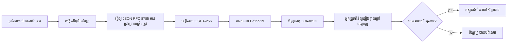
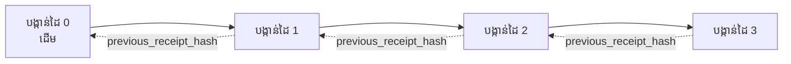

[មើលវីដេអូមេរៀន៖ ការការពារឧបករណ៍ AI ជាមួយវិក្កយបត្រក្រសូត](https://youtu.be/PLACEHOLDER_VIDEO_ID)

> _(វីដេអូមេរៀន និងរូបភាពគំរូនឹងត្រូវបានក្រុមមាតិកា Microsoft បន្ថែមបន្ទាប់ពីការរួមបញ្ចូលដោយផ្អែកលើគំរូមេរៀន ១៤ / ១៥)_

# ការការពារឧបករណ៍ AI ជាមួយវិក្កយបត្រក្រសូត

## ការណែនាំ

មេរៀននេះនឹងគ្របដណ្តប់ពី៖

- មូលហេតុដែល audit trails សម្រាប់ឧបករណ៍ AI មានសារសំខាន់សម្រាប់ការអនុលោម, ការកែតម្រូវកំហុស, និងការជឿទុកចិត្ត។
- វិក្កយបត្រក្រសូតគឺជាអ្វី និងរបៀបវាផ្សេងពីបន្ទាត់កំណត់ត្រាគ្មានហត្ថលេខា។
- របៀបបង្កើតវិក្កយបត្រដែលបានហត្ថលេខាសម្រាប់ការហៅឧបករណ៍របស់អេជិនត៍ក្នុងភាសា Python របស់អ្នកឯកភាព។
- របៀបផ្ទៀងផ្ទាត់វិក្កយបត្រនៅក្រៅបណ្តាញ និងរកឃើញការបម្លែងខុស។
- របៀបចងខ្សែវិក្កយបត្រដើម្បីឲ្យការៗដកឬប្តូរគ្នាមួយបំបែកខ្សែនោះ។
- អ្វីដែលវិក្កយបត្របញ្ជាក់ និងអ្វីដែលវាមិនបញ្ជាក់ឲ្យច្បាស់ឡើយ។

## គោលដៅរៀន

បន្ទាប់ពីបានបញ្ចប់មេរៀននេះ អ្នកនឹងដឹង៖

- រកឃើញមុខងារខូចខាតដែលជំរុញការប្រើប្រាស់ cryptographic provenance សម្រាប់សកម្មភាពរបស់អេជិនត៍។
- បង្កើតវិក្កយបត្រដែលបានហត្ថលេខាជាមួយ Ed25519 លើផ្ទុក JSON canonical។
- ផ្ទៀងផ្ទាត់វិក្កយបត្រដោយឯករាជ្យប្រើតែគន្លងសាធារណៈរបស់អ្នកចុះហត្ថលេខា។
- បង្កើតការព្រួយបារម្ភពីការបម្លែងដោយបញ្ជូនការផ្ទៀងផ្ទាត់ឡើងវិញលើវិក្កយបត្របានបម្លែង។
- បង្កើតខ្សែ hash តំណរវិក្កយបត្រជាជួរតំណរ និងពន្យល់ពីមូលហេតុដែលខ្សែមានសារៈសំខាន់។
- ទទួលស្គាល់ព្រំប្រទល់រវាងអ្វីដែលវិក្កយបត្របញ្ជាក់ (ការចុះហត្ថលេខា, សុពលភាព, លំដាប់លំដោយ) និងអ្វីដែលវាមិនបញ្ជាក់ទេ (ភាពត្រឹមត្រូវនៃសកម្មភាព, សុពលភាពនៃគោលនយោបាយ)។

## បញ្ហា៖ Audit Trail របស់អេជិនត៍របស់អ្នក

សូមស្រមៃថាអ្នកបានដាក់ជួញដូរ AI agent មួយសម្រាប់ Contoso Travel។ អេជិនត៍នេះអានសំណើរបស់អតិថិជន ហៅ API ជាមួយសេវាហោះហើរ ដើម្បីស្វែងរកជម្រើស ហើយកក់កៅអីសម្រាប់អតិថិជន។ ឆ្នាំមុន, អេជិនត៍នេះបានដំណើរការការកក់ ៥០,០០០ កម្ដៅ។

ថ្ងៃនេះ អ្នកត្រួតពិនិត្យមកដល់។ គេសួរពីសំណួរងាយៗមួយ៖ "បង្ហាញខ្ញុំឲ្យដឹងថាអេជិនត៍របស់អ្នកបានធ្វើអ្វី។"

អ្នកផ្តល់​ឯកសារកំណត់ត្រារបស់អ្នក។ អ្នកត្រួតពិនិត្យមើលវា ហើយសួរចម្ងល់ដែលលំបាកជាង៖ "តើខ្ញុំធ្វើដូចម្តេចដើម្បីដឹងថាកំណត់ត្រាទាំងនេះមិនបានកែប្រែ?"

នេះ​គឺជាបញ្ហា audit-trail។ ការដាក់ឧបករណ៍ AI នៅថ្ងៃនេះភាគច្រើនពឹងផ្អែកលើ៖

- **កំណត់ត្រាកម្មវិធី**៖ ត្រូវបានសរសេរដោយអ្នកចេញដំណើរការเอง អាចកែបានដោយមនុស្សដែលមានការចូលប្រើប្រព័ន្ធឯកសារ។
- **សេវាកម្មកំណត់ត្រាកម្សត់ពពក**៖ មានសញ្ញាបញ្ជាក់ការបម្លែងនៅលើវេទិកា ប៉ុន្តែត្រឹមតែបើអ្នកត្រួតពិនិត្យទុកចិត្តអ្នកបើកវេទិកាអ่านั้น។
- **កំណត់ត្រាធ្វើប្រតិបត្តិការពេលមានប្រព័ន្ធមូលដ្ឋានទិន្នន័យ**៖ សមហៅសម្រាប់ការផ្លាស់ប្តូរព័ត៌មានលើឃ្លាំងទិន្នន័យ ប៉ុន្តែមិនសមសម្រាប់ការហៅឧបករណ៍ដោយចៃដន្យ។

គ្មានអ្វីខ្លះអាចឆ្លើយសំនួររបស់អ្នកត្រួតពិនិត្យដោយមិនបង្ខំឲ្យគេទុកចិត្តใម្នាក់ (អ្នក, អ្នកផ្គត់ផ្គង់ពពក, អ្នកផ្គត់ផ្គង់មូលដ្ឋានទិន្នន័យ)។ សម្រាប់ការប្រើប្រាស់ក្នុងផ្ទៃខាងក្នុង ការទុកចិត្តនេះជារឿងអាចទទួលយកបាន។ សម្រាប់ការងារក្នុងប្រព័ន្ធត្រួតពិនិត្យ (ហិរញ្ញវត្ថុ, សុខភាព, ឬអ្វីដែលជាប់ប្រកាន់តាមច្បាប់ EU AI Act) វាមិនអាចទទួលយកបានទេ។

វិក្កយបត្រក្រសូតដោះស្រាយបញ្ហានេះដោយធ្វើអោយសកម្មភាពនីមួយៗរបស់អេជិនត៍អាចបញ្ជាក់បានដោយឯករាជ្យ។ អ្នកត្រួតពិនិត្យមិនចាំបាច់ទុកចិត្តអ្នកទេ គេត្រូវបានត្រឹមតែមានគន្លងសាធារណៈ និងវិក្កយបត្រតែប៉ុណ្ណោះ។

## វិក្កយបត្រក្រសូតគឺជាអ្វី?

វិក្កយបត្រជាវត្ថុ JSON មួយដែលកត់ត្រាអ្វីដែលអេជិនត៍បានធ្វើ ហើយបានចុះហត្ថលេខាចំពោះវា។


  
វិក្កយបត្រតិចតួចមួយមានរូបរាងដូចខាងក្រោម៖

```json
{
  "type": "agent.tool_call.v1",
  "agent_id": "contoso-travel-bot",
  "tool_name": "lookup_flights",
  "tool_args_hash": "sha256:a3f9c1...",
  "result_hash": "sha256:7b2e1d...",
  "policy_id": "contoso-travel-policy-v3",
  "timestamp": "2026-04-25T14:30:00Z",
  "sequence": 47,
  "previous_receipt_hash": "sha256:9d4e6a...",
  "signature": {
    "alg": "EdDSA",
    "sig": "c5af83...",
    "public_key": "8f3b2c..."
  }
}
```
  
លក្ខណៈទីបីដែលកំពុងអនុវត្តកម្ម៖

1. **ហត្ថលេខា**។ វិក្កយបត្រត្រូវបានចុះហត្ថលេខាដោយ gateway របស់អេជិនត៍ប្រើ Ed25519 private key។ អ្នកណាមួយដែលមានសោសាធារណៈត្រូវតែអាចផ្ទៀងផ្ទាត់ហត្ថលេខានៅក្រៅបណ្តាញបាន។ ការបម្លែងខុសមួយណាក្នុងវាលណាមួយនឹងធ្វើអោយហត្ថលេខាបាត់សុពលភាព។

2. **ការត encode ទៅ canonical**។ មុនពេលចុះហត្ថលេខា វិក្កយបត្រត្រូវបានធ្វើលំហូរការសំណុំ JSON ដោយប្រើ JSON Canonicalization Scheme (JCS, RFC 8785)។ វានៅនេះធ្វើអោយកម្មវិធីពីរដែលផលិតវិក្កយបត្រដូចគ្នាគ្រប់គ្នា ផលិតលទ្ធផល byte ដែលដូចគ្នា។ បើគ្មានការត encode canonical នេះ អ្នកផលិត JSON ផ្សេងៗនឹងផ្លាស់ប្ដូរហត្ថលេខាផ្សេងគ្នា។

3. **ចងខ្សែ hash**។ វាល `previous_receipt_hash` តំណភ្ជាប់វិក្កយបត្រនីមួយៗទៅវិក្កយបត្រមុន។ ការដក ឬ ប្តូរមួយវិក្កយបត្រជាប្រព័ន្ធ នឹងបំបែកខ្សែពេញលេញ។ ការបម្លែងខុសកើតឡើងនៅកម្រិតខ្សែល្បែង បើទោះពាក្យហត្ថលេខាអាចជៀសវាងបាន។

លក្ខណៈទាំងនេះផ្តល់ធានារួមគ្នា៖

- **ការចុះហត្ថលេខា**៖ កូនសោនេះបានចុះហត្ថលេខាលើមាតិកានេះ។
- **សុពលភាព**៖ មាតិកាមិនបានផ្លាស់ប្តូរចាប់ពីត្រូវបានចុះហត្ថលេខា។
- **លំដាប់រៀង**៖ វិក្កយបត្រនេះបានបង្កើតបន្ទាប់ពីវិក្កយបត្រមុន។

## ការបង្កើតវិក្កយបត្រនៅ Python

អ្នកមិនចាំបាច់មានបណ្ណាល័យពិសេសដើម្បីបង្កើតវិក្កយបត្រទេ។ វិធីសាស្ត្រក្រសូតគឺបានមានក្នុង Python និងលោហអක්ෂរមួយចំនួនប៉ុណ្ណោះ។

លំហាត់ដៃជាក់លាក់ក្នុង `code_samples/18-signed-receipts.ipynb` នឹងដឹកនាំអ្នកតាមជំហានពេញលេញ។ រូបរាងសង្ខេប៖

```python
import json
import hashlib
import base64
from nacl import signing
from jcs import canonicalize  # JSON canonical RFC 8785

def b64url_nopad(data: bytes) -> str:
    return base64.urlsafe_b64encode(data).decode("ascii").rstrip("=")

def sha256_canonical(obj) -> str:
    """SHA-256 of a Python object's JCS-canonical JSON form."""
    return f"sha256:{hashlib.sha256(canonicalize(obj)).hexdigest()}"

# បង្កើតឬផ្ទុកកូនសោចុះហត្ថលេខា (នៅក្នុងការផលិត សូមរក្សាទុកក្នុងស្តុកកូនសោ)
signing_key = signing.SigningKey.generate()
verify_key = signing_key.verify_key

# បង្កើតដំណើរការទទួលបាន (មិនទាន់មានហត្ថលេខា)
tool_args = {"origin": "SYD", "destination": "LAX"}
tool_result = [{"flight": "QF11", "price": 1850, "stops": 0}]

payload = {
    "type": "agent.tool_call.v1",
    "agent_id": "contoso-travel-bot",
    "tool_name": "lookup_flights",
    "tool_args_hash": sha256_canonical(tool_args),
    "result_hash": sha256_canonical(tool_result),
    "policy_id": "contoso-travel-policy-v3",
    "timestamp": "2026-04-25T14:30:00Z",
    "sequence": 0,
    "previous_receipt_hash": None,
}

# ធ្វើឲ្យមានរចនាសម្ព័ន្ធ, ដំណាក់កាល, ចុះហត្ថលេខា។
canonical_bytes = canonicalize(payload)
message_hash = hashlib.sha256(canonical_bytes).digest()
signature_bytes = signing_key.sign(message_hash).signature

# បន្ថែមអ объект(signature) មានរចនាសម្ព័ន្ធ។
receipt = {
    **payload,
    "signature": {
        "alg": "EdDSA",
        "sig": b64url_nopad(signature_bytes),
        "public_key": b64url_nopad(bytes(verify_key)),
    },
}
```
  
នេះជាជំហានចុះហត្ថលេខាទាំងមូល។ លំហាត់ក្នុង notebook នឹងដើរតាមជំហាននីមួយខែក្នុងតំណរ។

## ផ្ទៀងផ្ទាត់វិក្កយបត្រ និងរកឃើញការបម្លែងខុស

ការផ្ទៀងផ្ទាត់គឺជាប្រតិបត្តិការវិលត្រឡប់៖

```python
import base64
import hashlib
from nacl import signing
from nacl.exceptions import BadSignatureError
from jcs import canonicalize

def b64url_decode(s: str) -> bytes:
    padding = "=" * ((4 - len(s) % 4) % 4)
    return base64.urlsafe_b64decode(s + padding)

def verify_receipt(receipt: dict) -> bool:
    # ហត្ថលេខា​គឺជា​វត្ថុ​ដែល​មានរចនាសម្ព័ន្ធ៖ {"alg", "sig", "public_key"}។
    sig_obj = receipt.get("signature")
    if not sig_obj or sig_obj.get("alg") != "EdDSA":
        return False

    # សម្រួលឡើងវិញ payload ដែលបានហត្ថលេខា​ពិតប្រាកដ (គ្រប់យ៉ាងលើកលែង Signature)។
    payload = {k: v for k, v in receipt.items() if k != "signature"}

    canonical_bytes = canonicalize(payload)
    message_hash = hashlib.sha256(canonical_bytes).digest()

    try:
        verify_key = signing.VerifyKey(b64url_decode(sig_obj["public_key"]))
        verify_key.verify(message_hash, b64url_decode(sig_obj["sig"]))
        return True
    except BadSignatureError:
        return False
```
  
មុខងារនេះទទួលបានវិក្កយបត្រ ហើយត្រឡប់តម្លៃ `True` ប្រសិនបើហត្ថលេខាត្រឹមត្រូវ, `False` ប្រសិនបើមិនត្រឹមត្រូវ។ គ្មានការហៅបណ្តាញ, គ្មានការពឹងផ្អែកទៅលើសេវាកម្មណាមួយ ហើយមិនចាំបាច់ទុកចិត្តអ្នកណាទេ។

ដើម្បីឃើញការរកឃើញការបម្លែងដំណើរការមានប្រសិទ្ធភាព ចំណុចបង្ហាញក្នុង notebook មាន៖

1. បង្កើតវិក្កយបត្រត្រឹមត្រូវ ហើយបញ្ជាក់ថាវាអាចផ្ទៀងផ្ទាត់បាន។
2. ផ្លាស់ប្តូរមួយបៃនៅក្នុងវាល `tool_args_hash`។
3. ផ្ទៀងផ្ទាត់ឡើងវិញ ហើយឃើញថាមិនជោគជ័យ។

នេះជាការបង្ហាញជាក់ស្តែងថាវិក្កយបត្រទាំងអស់ជាមានការជ្រៀតជ្រែកចាំបាច់៖ ការផ្លាស់ប្ដូរមួយចំនួនប៉ុន្មានគឺបំផ្លាញហត្ថលេខា។

## ចងខ្សែវិក្កយបត្រសម្រាប់អេជិនត៍ច្រើនជំហាន

វិក្កយបត្រដែលបានចុះហត្ថលេខាយក្សារការពារសកម្មភាពមួយ។ ខ្សែវិក្កយបត្រការពារសំណុំរបស់វា។


  
វិក្កយបត្រមួយៗកត់ត្រា hash នៃវិក្កយបត្រមុន។ ដើម្បីលុបវិក្កយបត្រលេខ ២ ដោយមិនឲ្យមានអ្នកដឹង អ្នកវាយប្រហារត្រូវតែ៖

- បម្លែងវាល `previous_receipt_hash` របស់វិក្កយបត្រលេខ ៣ (បំបែកហត្ថលេខាវិក្កយបត្រលេខ ៣) ឬ
- បញ្ចូលហត្ថលេខាថ្មីនៅលើវិក្កយបត្រលេខ ៣ដែលបានបំលែង (ត្រូវការសោឯកជនរបស់អេជិនត៍)។

បើសោឯកជននៅក្នុង hardware key vault ហើយអ្នកផ្សាយគន្លងសាធារណៈជាមួយវិក្កយបត្រនីមួយៗ ការវាយប្រហារទាំងពីរនេះមិនអាចធ្វើបានដោយគ្មានការរកឃើញឡើយ។

notebook នឹងដើរតាម៖

1. បង្កើតខ្សែវិក្កយបត្របីមួយ។
2. ផ្ទៀងផ្ទាត់ថា `previous_receipt_hash` របស់វិក្កយបត្រនីមួយៗផ្គូផ្គងនឹង hash ពិតប្រាកដនៃវិក្កយបត្រមុន។
3. បម្លែងវិក្កយបត្រមួយនៅកណ្តាល និងឃើញខ្សែបំផ្លាញនៅចំណុចនោះ។

នេះជារបៀបបង្កើត audit trail ដែលអ្នកត្រួតពិនិត្យខាងក្រៅអាចផ្ទៀងផ្ទាត់ដោយមិនទុកចិត្តអ្នកបាន។

## អ្វីដែលវិក្កយបត្របញ្ជាក់ (និងអ្វីដែលវាមិនបញ្ជាក់)

នេះជាផ្នែកសំខាន់បំផុតនៃមេរៀននេះ។ វិក្កយបត្រមានអំណាចប៉ុន្តែអំណាចនោះមានដែនកំណត់។

**វិក្កយបត្របញ្ជាក់បណ្តារអ្វីទាំងប្រាំបី៖**

1. **ការចុះហត្ថលេខា**៖ កូនសោជាក់លាក់បានបិទសញ្ញាលើផលិតផលជាក់លាក់។
2. **សុពលភាព**៖ ផលិតផលមិនបានផ្លាស់ប្តូរចាប់ពីចុះហត្ថលេខា។
3. **លំដាប់រៀង**៖ វិក្កយបត្រនេះត្រូវបានបង្កើតបន្ទាប់ពីវិក្កយបត្រមុននៅខ្សែ hash។

**វិក្កយបត្រមិនបញ្ជាក់៖**

1. **ភាពត្រឹមត្រូវ**៖ សកម្មភាពរបស់អេជិនត៍មិនចាំបាច់ត្រឹមត្រូវ។ វិក្កយបត្រអាចត្រូវបានចុះហត្ថលេខាដោយ​សម្រាប់ចម្លើយខុសក៏បាន ដូចជាចម្លើយត្រឹមត្រូវ។
2. **ការអនុលោមគោលនយោបាយ**៖ គោលនយោបាយដែលបានយោងក្នុង `policy_id` មិនចាំបាច់បានត្រូវបានវាយតម្លៃ ឬអនុញ្ញាតសកម្មភាពនេះក្នុងការត្រួតពិនិត្យ។ វិក្កយបត្រថតអ្វីដែលបានអ្នកបញ្ជាក់ មិនមែនអ្វីដែលបានអនុវត្ត។
3. **អត្តសញ្ញាណលើសកូនសោ**៖ វិក្កយបត្រប្រាប់ថា "កូនសោនេះបានចុះហត្ថលេខាលើមាតិកានេះ។" វាមិនមកនិយាយថា "មនុស្សនេះបានអនុញ្ញាត។" ការតភ្ជាប់កូនសោទៅមនុស្ស ឬអង្គភាព ត្រូវការសេវា identity ផ្សេងទៀត (ថតបញ្ជី, សណ្ឋានកូនសោសាធារណៈ, ល)។
4. **ភាពត្រឹមត្រូវនៃបញ្ជូល**៖ ប្រសិនបើអេជិនត៍ទទួលបានបញ្ជូលដែលបានកែប្រែ ហើយអនុវត្តន៍ទៅលើវា វិក្កយបត្រតំណាងឲ្យសកម្មភាពនោះយ៉ាងរឹងមាំ។ វិក្កយបត្រនៅក្រោមកម្រិត valid input ដោយមិនជំនួសវា។

ដែនកំណត់នេះមានសារៈសំខាន់ពីរគោលហេតុ៖

- វាប្រាប់អ្នកពីអ្វីដែលវិក្កយបត្រមានប្រយោជន៍សម្រាប់៖ ធ្វើឲ្យអង្គការអាច audit និងមានភាពត្រឹមត្រូវលើសកម្មភាពរបស់អេជិនត៍ ដល់តំបន់វិស័យអង្គការផ្សេងៗ។
- វាប្រាប់អ្នកពីស្រទាប់បន្ថែមដែលអ្នកត្រូវការ៖ ការផ្ទៀងផ្ទាត់បញ្ចូល (ម៉េរៀន 6), ការអនុវត្តគោលនយោបាយ (ពិភាក្សាខ្លះខាងក្រោម), និងសេវាអត្តសញ្ញាណ (មិនទាក់ទងក្នុងមេរៀននេះ)។

កំហុសទូទៅគឺគិតថា "យើងមានវិក្កយបត្រ" មានន័យថា "យើងត្រូវគ្រប់គ្រង"។ វាមិនដូចនេះទេ។ វិក្កយបត្រជាមូលដ្ឋានមួយ។ ការគ្រប់គ្រងគឺជាប្រព័ន្ធដែលអ្នកបង្កើតនៅលើវា។

## ឯកសារនៃការប្រើប្រាស់ផលិតផល

កូដ Python ក្នុងមេរៀននេះមានលក្ខណៈតិចតួច ដូច្នេះអ្នកអាចអានជួរដេកនីមួយៗ និងយល់ពីអ្វីកំពុងកើតឡើង។ នៅក្នុងផលិតផលពិត, អ្នកមានជម្រើសពីរមាន៖

1. **សង់ដោយផ្ទាល់លើ primitives cryptographic**។ ជួរដេក ៥០ ដែលអ្នកបានមើលខាងលើគ្រប់គ្រាន់សម្រាប់ករណីប្រើជាច្រើន។ PyNaCl (Ed25519) និងកញ្ចប់ `jcs` (JSON canonical) គឺជាបណ្ណាល័យដែលបានថែរក្សា និងត្រូវបានពិនិត្យ។

2. **ប្រើបណ្ណាល័យទទួលវិក្កយបត្រផលិតផល**។ គម្រោង open-source ច្រើនដែលអនុវត្តមូតភាពដូចគ្នានេះដោយបន្ថែមមុខងារ (ការបង្វិលកូនសោ, ការផ្ទៀងផ្ទាត់ជាប្រព័ន្ធក្រុម, ការចែក JWK Set, រួមបញ្ចូលជាមួយម៉ាស៊ីនគោលនយោបាយ)៖  
   - ទម្រង់វិក្កយបត្រដែលប្រើក្នុងមេរៀននេះ តាមសេចក្ដីព្រាង IETF Internet-Draft (`draft-farley-acta-signed-receipts`) កំពុងក្នុងដំណើរការស្តង់ដារ។  
   - Microsoft Agent Governance Toolkit បង្កប់វិក្កយបត្រជាមួយការសម្រាប់គោលនយោបាយ Cedar; មើល សមាហរណកម្មទី ៣៣ ក្នុង repository នោះសម្រាប់ឧទាហរណ៍ពេញលេញ។  
   - កញ្ចប់ `protect-mcp` (npm) និង `@veritasacta/verify` (npm) ផ្តល់អនុវត្តន៍ Node របស់ការចុះហត្ថលេខា និងផ្ទៀងផ្ទាត់ក្រៅបណ្តាញ ជាចម្បងសម្រាប់ផ្ដល់မျက်មុននៃ audit trail tamper-evident ទៅលើម៉ាស៊ីន MCPណាមួយ។

ការជ្រើសរើសរវាងបង្កើតផ្ទាល់ និងប្រើបណ្ណាល័យ ស្រដៀងនឹងការជ្រើសរើសរវាងសរសេរបណ្ណាល័យ JWT ផ្ទាល់ និងប្រើបណ្ណាល័យដែលបានស្ថាបនាជាស្រេច៖ ទាំងពីររាល់ពីរជាជម្រើសល្អ; បណ្ណាល័យជួយសុវត្ថិភាព និងកាត់បន្ថយវិស័យ audit; របៀបតាំងពីដើមជំរុញឲ្យអ្នកយល់គ្រប់ primitive។ មេរៀននេះបង្រៀនរបៀបពីដើម ដូច្នេះអ្នកមានមូលដ្ឋានសម្រាប់ជ្រើសរើសណាមួយ។

## ការត្រួតពិនិត្យចំណេះដឹង

សាកល្បងយល់ដឹងរបស់អ្នកមុនចូលរួមលំហាត់អនុវត្ត។

**១. វិក្កយបត្រត្រូវបានចុះហត្ថលេខាជាមួយកូនសោឯកជន Ed25519 របស់អេជិនត៍។ អ្នកត្រួតពិនិត្យមានតែមួយគន្លងសាធារណៈតែប៉ុណ្ណោះ។ តើអ្នកត្រួតពិនិត្យអាចផ្ទៀងផ្ទាត់វិក្កយបត្រនៅក្រៅបណ្តាញបានទេ?**

<details>
<summary>ចម្លើយ</summary>

បាន។ ការ​ផ្ទៀងផ្ទាត់ Ed25519 ត្រូវការតែគន្លងសាធារណៈ និងត្រវក្សហត្ថលេខា។ គ្មានការហៅបណ្តាញ អត់ការពឹងផ្អែកសេវាកម្ម អត់ការទុកចិត្តម្ខាងណាទេ។ នេះជាលក្ខណៈដែលធ្វើឲ្យវិក្កយបត្រសមរម្យប្រើប្រាស់ក្នុងបរិបទដាច់ប្លែក, អង្គការជាច្រើន, ឬ audit ដែលទាបនៃការទុកចិត្ត។
</details>

**២. អ្នកវាយប្រហារបំលែងវាល `policy_id` នៃវិក្កយបត្រដើម្បីថាផែនការគ្រប់គ្រងបានប្រើគោលនយោបាយទាក់ទាញច្រើន។ ហត្ថលេខាត្រូវបានគណនាលើផ្ទុកដើម។ តើមានអ្វីកើតឡើងក្នុងការផ្ទៀងផ្ទាត់?**

<details>
<summary>ចម្លើយ</summary>

ការផ្ទៀងផ្ទាត់បរាជ័យ។ ហត្ថលេខាត្រូវបានគណនាលើ bytes canonique នៃផ្ទុកដើម។ ការផ្លាស់ប្ដូរឥតប្រយោជន៍នៃវាលណាមួយប្តូរជាពាណិជ្ជកម្ម JSON canonical ដែលបង្កឡើង hash SHA-256 ផ្សេងគ្នា ដែលធ្វើឲ្យហត្ថលេខាមិនត្រឹមត្រូវ។ អ្នកវាយប្រហារត្រូវតែមានសោឯកជនដើម្បីផលិតហត្ថលេខាថ្មីត្រឹមត្រូវដែលគេគ្មាន។
</details>

**៣. ហេតុអ្វីបានជាវិក្កយបត្រមាន `tool_args_hash` និង `result_hash` ជំនួស arguments និងលទ្ធផលដើម?**

<details>
<summary>ចម្លើយ</summary>

ពីរហេតុផល។ ដំបូង, វិក្កយបត្រអាចត្រូវបានរក្សាទុក ឬផ្ញើនៅបរិយាកាសដែលតម្រូវឲ្យការគ្រប់គ្រងមាតិកាដើម (PII, ទិន្នន័យអាជីវកម្ម) បានរក្សាភាពឯកជន។ ការប្រើ hash ធ្វើឲ្យវិក្កយបត្រតូច និងមាតិកាភ្លឺ; អ្នកត្រួតពិនិត្យអាចផ្ទៀងផ្ទាត់ hash ជាមួយច្បាស់លាស់នៃមាតិកាពិតប្រាកដ។ របៀបទីពីរគឺ hash មានទំហំថេរ; វិក្កយបត្រដែលមាន hash ត្រូវបានកំណត់ទំហំដោយមិនគិតពីទំហំធំរបស់បញ្ជូល និងលទ្ធផល។
</details>

**៤. វាល `previous_receipt_hash` តំណភ្ជាប់វិក្កយបត្រនីមួយៗទៅមុនរបស់វា។ ប្រសិនបើអ្នកវាយប្រហារលុបវិក្កយបត្រមួយខាងមួយក្នុងខ្សែមួយដោយមិនឲ្យគេដឹង តើអ្វីខ្លះដែលមិនត្រឹមត្រូវ?**

<details>
<summary>ចម្លើយ</summary>

វិក្កយបត្រទាំងអស់បន្ទាប់ពីវា។ វាល `previous_receipt_hash` របស់ពួកវាមិនផ្គូផ្គងនឹងខ្សែពិត ដែលបានបញ្ជាក់ពីការលុបឬការប្ដូរវិក្កយបត្រនីមួយ។ ដើម្បីលាក់ការលុប អ្នកវាយប្រហារត្រូវតែចុះហត្ថលេខាឡើងវិញលើវិក្កយបត្រពេលក្រោយទាំងអស់ ដែលតម្រូវការសោឯកជន។
</details>

**៥. វិក្កយបត្រត្រូវបានផ្ទៀងផ្ទាត់ដោយរលូន។ តើវាបញ្ជាក់ថាសកម្មភាពរបស់អេជិនត៍ត្រឹមត្រូវ ឬផ្អែកលើគោលនយោបាយ ឬអនុវត្តត្រឹមត្រូវទេ?**

<details>
<summary>ចម្លើយ</summary>

ទេ។ វិក្កយបត្រត្រឹមត្រូវបញ្ជាក់បីគឺ៖ ការចុះហត្ថលេខា (កូនសោនេះបានចុះហត្ថលេខាលើមាតិកានេះ), សុពលភាព (មាតិកាមិនផ្លាស់ប្តូរ), និងលំដាប់ (វិក្កយបត្រមួយបន្ទាប់ពីមុន)។ វាមិនបញ្ជាក់ថាសកម្មភាពត្រឹមត្រូវ ការវាយតម្លៃគោលនយោបាយក្នុង `policy_id` ឬការអនុវត្តគោលនយោបាយទេ។ វិក្កយបត្រអោយអាច audit អំពីចំនួនប្រតិបត្តិការក៏ប៉ុណ្ណោះ មិនមែនជាការពិតត្រឹមត្រូវទេ។ នេះជាដែនកំណត់សំខាន់បំផុត។
</details>

## លំហាត់អនុវត្ត

បើក `code_samples/18-signed-receipts.ipynb` និងបញ្ចប់ផ្នែកទាំងបួន៖

1. **ផ្នែក 1**៖ ចុះហត្ថលេខាវិក្កយបត្រដំបូងរបស់អ្នក និងផ្ទៀងផ្ទាត់វា។
2. **ផ្នែក 2**៖ បម្លែងវិក្កយបត្រ និងសង្កេតការផ្ទៀងផ្ទាត់បរាជ័យ។
3. **ផ្នែក 3**៖ បង្កើតខ្សែវិក្កយបត្របី និងផ្ទៀងផ្ទាត់សុពលភាពខ្សែ។
4. **ផ្នែក 4**៖ អនុវត្តទម្រង់នេះទៅលើអេជិនត៍ដែលបានបង្កើតដោយ Microsoft Agent Framework៖ រុំការហៅឧបករណ៍ក្នុងការចុះហត្ថលេខាវិក្កយបត្រ បន្ទាប់ផ្ទៀងផ្ទាត់វិក្កយបត្រដោយឯករាជ្យ។

**បញ្ហាស្វែងរកលំហាត់បន្ថែម ១៖** បន្តពង្រីករាងវិក្កយបត្រជាមួយវាលបន្ថែមដោយជម្រើសផ្ទាល់របស់អ្នក (ឧទាហរណ៍ លេខសំណើសម្រាប់តាមដាន), ផ្លាស់ប្ដូរពិភាក្សាចុះហត្ថលេខាឲ្យរួមបញ្ចូលវាលនេះ ហើយបញ្ជាក់ថាវិក្កយបត្ររបស់អ្នកនៅតែវាស់ចូលក្រោមការផ្ទៀងផ្ទាត់។ បន្ទាប់មកបម្លែងវាលនេះបន្ទាប់ពីចុះហត្ថលេខា ហើយបញ្ជាក់ថាការផ្ទៀងផ្ទាត់បរាជ័យ។ វាគឺជាការបង្ខំឲ្យអ្នកយល់ពីរបៀប byte នីមួយៗនៃវិធី encode canonical មានតួនាទីជាមួយហត្ថលេខា។
**បញ្ហាស្ទេច ២៖** SHA-256-ហាសពីរនៃបង្កាន់ដៃរបស់អ្នកជាមួយគ្នា (ភ្ជាប់បៃ canonical របស់ពួកវាជាលំដាប់ដែលកំណត់បាន) ហើយបញ្ចូលឲ្យអត្ថបទលទ្ធផលមួយជាព្រិត្តិផលថ្មីមួយលើបង្កាន់ដៃទីបីមុនពេលចុះហត្ថលេខា។ ពិនិត្យឲ្យប្រាកដថាបង្កាន់ដៃទាំងបីនេះនៅតែអាចធ្វើរបាយការណ៍ត្រលប់វិញបាន។ អ្នកទើបតែបង្កើតការ​បញ្ជាក់រួមបញ្ចូលជារបៀបមួយជាដំណាក់កាលតែមួយ៖ មនុស្សណាដែលកាន់បង្កាន់ដៃទីបីអាចបញ្ជាក់បានថាបង្កាន់ដៃទីមួយពីរនេះមាននៅពេលវាត្រូវបានចុះហត្ថលេខា ដោយមិនចាំបាច់បង្ហាញខ្លួននូវមាតិការបស់ពួកវាទេ។ នេះគឺជាគំរូដែលបង្កាន់ដៃបង្ហាញជ្រើសរើសប្រើនៅល្បឿនធំ (ការយក Merkle ជាបំណះបំណាល, RFC 6962)។

## សេចក្ដីសន្និដ្ឋាន

បង្កាន់ដៃពហុព័ត៌មានផ្តល់ឱ្យភ្នាក់ងារពហុវិជ្ជាជីវៈនូវសម្រង់ត្រួតពិនិត្យដែលមាន៖

- **អាចបញ្ជាក់ដោយឯករាជ្យ**៖ មនុស្សណាមួយដែលមានកូនសោជាសាធារណៈអាចយល់ព្រមបាន ដោយគ្មានការពឹងផ្អែកលើសេវាកម្មណាមួយ។
- **បង្ហាញការកែប្រែបាន**៖ ការផ្លាស់ប្តូរណាមួយធ្វើឲ្យហត្ថលេខារំលង។
- **អាចចល័តបាន**៖ បង្កាន់ដៃគឺជា​ឯកសារ JSON តូចមួយ; អាចរក្សាទុក ផ្ញើ និងពិនិត្យនៅកន្លែងណាក៏បាន។
- **តាមស្តង់ដារ**៖ ត្រូវបានបង្កើតលើ Ed25519 (RFC 8032), JCS (RFC 8785), និង SHA-256 ដែលជាប្រភេទគន្លងដែលបានប្រើជារឿយៗទាំងអស់។

ពួកវាមិនមែនជាជំនួសសម្រាប់ការត្រួតពិនិត្យមាតិកា ឬការអនុវត្តគោលការណ៍ ឬសំណុំហេតុអត្តសញ្ញាណ។ ពួកវាគឺជាមូលដ្ឋានសម្រាប់ស្រទាប់ទាំងនោះ។ ពេលដែលអ្នកកំពុងបង្ហាញភ្នាក់ងារដែលមានបទបញ្ជាដាក់ចេញទៅក្នុងបរិស្ថានដែលមានការគ្រប់គ្រង ឬដំណើរការពហុអង្គភាព ឬករណីណាមួយដែលអ្នក auditor អនាគតមិនអាចទុកចិត្តអ្នកបាន ការបង្កាន់ដៃគឺជាវិធីដែលអ្នកធ្វើឲ្យខ្សែត្រួតពិនិត្យជាការត្រឹមត្រូវ។

ចំណុចសំខាន់បំផុត៖ បង្កាន់ដៃបញ្ជាក់ថា អ្នកណាបាននិយាយអ្វី ពេលណា។ ពួកវាមិនបញ្ជាក់ថាអ្វីដែលបាននិយាយគឺពិត ឬត្រឹមត្រូវឡើយ។ រក្សាទុកភាពខុសគ្នានេះយ៉ាងម៉ត់ចត់។ នេះគឺជាភាពខុសគ្នារវាងប្រព័ន្ធដើមផលិតភាពស្មោះត្រង់និងប្រព័ន្ធដែលធ្វើឲ្យអ្នកច្រឡំ។

## បង្កាន់ដៃសម្រាប់ផលិតកម្ម

ពេលដែលអ្នកបានត្រៀមខ្លួនបញ្ចប់មេរៀននេះ និងចង់ដាក់ភ្នាក់ងារចុះហត្ថលេខាបង្កាន់ដៃនៅក្នុងបរិស្ថានពិត៖

- [ ] **ផ្ទេរកូនសោចុះហត្ថលេខាចេញពីកុំព្យូទ័រអ្នកអភិវឌ្ឍ។** ប្រើ Azure Key Vault, AWS KMS, ឬ hardware security module។ កូនសោឯកជនដែលចុះហត្ថលេខាបង្កាន់ដៃរបស់អ្នក មិនគួររស់នៅក្នុងកន្លែងគ្រប់គ្រងកូដឬជា plaintext នៅលើម៉ាស៊ីនកម្មវិធីឡើយ។
- [ ] **ផ្សព្វផ្សាយកូនសោសាធារណៈសម្រាប់បញ្ជាក់។** អ្នកត្រួតពិនិត្យត្រូវការដើម្បីបញ្ជាក់ក្រៅបណ្តាញ។ គំរូស្តង់ដាគឺជាជួរតំណ JWK នៅ URL ដែលគេចងចាំបាន (RFC 7517), ឧទាហរណ៍ `https://your-org.example.com/.well-known/agent-keys.json`។
- [ ] **បន្ទះខ្សែបិទភ្ជាប់ពីខាងក្រៅ។** ប្រចាំពេលសរសេរហាសក្បាលខ្សែថ្មីទៅក្នុងកំណត់ហេតុនៃ transparency log (Sigstore Rekor, RFC 3161 timestamp authority, ឬប្រព័ន្ធផ្ទៃក្នុងទីពីរ) ដោយអាចឲ្យមនុស្សណាម្នាក់ពីខាងក្រៅបញ្ជាក់ថា "ខ្សែនេះមាននៅពេលនេះ"។
- [ ] **រក្សាទុកបង្កាន់ដៃដោយមិនអាចផ្លាស់ប្តូរ។** ដាក់បន្ថែមតែមួយ ក្នុងប្លុកផ្ទុក (Azure Storage ជាមួយនឹងគោលការណ៍ immutability, AWS S3 Object Lock) ដែលបញ្ជាក់ថាមនុស្សខាងក្នុងមិនអាចបង្កើតប្រវត្តិសាស្ត្រឡើងវិញនៅស្រទាប់ផ្ទុកទេ។
- [ ] **សម្រេចចិត្តអំពីការរក្សាទុករយៈពេលយូរ។** ច្រើននៃប្រព័ន្ធគ្រប់គ្រងតម្រូវការការរក្សាទុកជាច្រើនឆ្នាំ។ ផែនការសម្រាប់ការលូតលាស់បង្កាន់ដៃ (បង្កាន់ដៃមួយប្រហែល ៥០០ បៃ; ភ្នាក់ងារដែលធ្វើការហៅ ១០,០០០ ដងក្នុងមួយថ្ងៃ បង្កើតប្រហែលជា ១.៨ ជីកាពៃក្នុងមួយឆ្នាំ)។
- [ ] **ឯកសារអំពីអ្វីដែលបង្កាន់ដៃមិនគ្របដណ្តប់។** បង្កាន់ដៃបញ្ជាក់អំពីការចាត់ទុក ភាពត្រឹមត្រូវ និងលំដាប់។ សៀវភៅរត់របស់អ្នកគួរបញ្ជាក់យ៉ាងច្បាស់នូវការគ្រប់គ្រងបន្ថែមណាដែលមាននៅលើបង្កាន់ដៃ (ការត្រួតពិនិត្យអ៊ីនបុត, ការអនុវត្តគោលការណ៍, ការកំណត់អត្រា, ឧបករណ៍អត្តសញ្ញាណ) ក្នុងការគ្រប់គ្រងរបស់អ្នក។

### តើអ្នកមានសំណួរច្រើនទៀតអំពីការការពារ AI Agents?

ចូលរួមក្នុង [Microsoft Foundry Discord](https://aka.ms/ai-agents/discord) ដើម្បីជួបជាមួយអ្នករៀនផ្សេងទៀត ចូលរួមក្នុងម៉ោងការិយាល័យ និងទទួលបានចម្លើយសំណួរផ្សេងៗអំពី AI Agents។

## ក្រៅពីមេរៀននេះ

មេរៀននេះគ្របដណ្តប់ការចុះហត្ថលេខាបង្កាន់ដៃតែមួយ និងខ្សែហាសឈ្នាន់។ គន្លងដដែលសម្របសម្រួលទៅជាគំរូកម្រិតខ្ពស់ឆាប់ៗដែលអ្នកប្រហែលជាអាចជួបនៅពេលការគ្រប់គ្រងរបស់អ្នកកំពុងរីកចម្រើន៖

- **ការបង្ហាញជ្រើសរើស។** ប្រសិនបើវាលក្នុងបង្កាន់ដៃត្រូវបានប្តេជ្ញាដោយឯករាជ្យ (RFC 6962 រូបមន្ត Merkle tree) អ្នកអាចបង្ហាញវាលជាក់លាក់ឲ្យអ្នកត្រួតពិនិត្យជាក់លាក់ហើយបញ្ជាក់ថាផ្នែកផ្សេងទៀតមិនបានផ្លាស់ប្តូរដោយមិនបង្ហាញពួកវាទៅ។ មានប្រយោជន៍ពេលបង្កាន់ដៃដដែលត្រូវបំពេញទាំងការត្រួតពិនិត្យទូលំទូលាយ (ដែលចង់បានភាពបញ្ចប់) និងបទបញ្ជាការពារទិន្នន័យដូចជា GDPR (ដែលចង់ឲ្យអ្នកត្រួតពិនិត្យមើលតិចតួចត្រឹមត្រូវ)។
- **ការលុបបង្កាន់ដៃ។** ប្រសិនបើកូនសោចុះហត្ថលេខារងបន្ទុក គួរតែមានវិធីសម្រាប់សម្គាល់បង្កាន់ដៃទាំងអស់ដែលបានចុះហត្ថលេខាដោយកូនសោនោះថាមិនគួរឱ្យទុកចិត្តចាប់ពីពេលណាមួយទៅមុខ។ គំរូស្តង់ដា៖ កូនសោចុះហត្ថលេខាខ្លីជិតរយៈពេល និងបញ្ជីលុបបន្ទាន់ផ្សាយពីក្រៅ ឬកំណត់ហេតុ transparency log ដែលមានឯកសារបាត់បង់។
- **បង្កាន់ដៃចំណុចពីរ / ចែកហត្ថលេខា។** ការអនុវត្តខ្លះចែក payload ដែលបានចុះហត្ថលេខាទៅជា pre-execution (`authorization_*`) និង post-execution (`result_*`) ដោយមានហត្ថលេខាឯករាជ្យ, មានប្រយោជន៍ពេលការសម្រេចកំពុងអនុញ្ញាត និងលទ្ធផលដែលសង្កេតឃើញដោយអ្នកផ្សេងគ្នាឬនៅពេលខុសគ្នា។ នេះជាការបូកបញ្ចូលលើរចនាសម្ព័ន្ធបង្កាន់ដៃដែលបានបង្រៀនក្នុងមេរៀននេះ។
- **ការបញ្ចូល payload។** បង្កាន់ដៃបិទបាំងអ្វីក៏បានដែលអ្នកដាក់ក្នុង `result_hash`។ payload ពិតប្រាកដជាទូទៅមានរ្រមាប់ជាងលទ្ធផលឧបករណ៍តែមួយ៖ ការពិចារណាជាមុន - ការព្យាករណ៍ម៉ូដែល, ជម្រើសបានពិចារណា, ប្រភពអត្ថសញ្ញាអោយ, គោលបំណងហានិភ័យ, សេង​ខ្សែការទទួលខុសត្រូវ, លទ្ធផលច្រកចេញ - អាចរស់នៅក្នុង payload ក្រោមបង្កាន់ដៃតែមួយ។ នេះរក្សាប្រភេទបង្កាន់ដៃឲ្យមានទំហំតូច មួយពេលខ្លួនអោយស្គេម payload អភិវឌ្ឍទៅតាមដែន។
- **ការប្រតិបត្ដិហាមានលំហូរច្រើន។** ការអនុវត្តឯករាជ្យជាច្រើននៃរចនាសម្ព័ន្ធបង្កាន់ដៃដូចគ្នា (Python, TypeScript, Rust, Go) ពិនិត្យឆ្លងដល់គ្នាចំពោះវ៉ិចទ័រប្រឡងសាកល្បងដែលចែករំលែក។ ប្រសិនបើអ្នកបង្កើតការអនុវត្តរបស់អ្នកផ្ទាល់ ការត្រួតពិនិត្យប្រឆាំងវ៉ិចទ័រផ្សាយបង្ហាញបញ្ជាក់ការចម្រុះខ្សែ។
- **ការបម្លែងបន្ទាប់ពី quantum។** Ed25519 ត្រូវបានប្រើយ៉ាងទូលំទូលាយថ្ងៃនេះ ប៉ុន្តែមិនធន់ទ្រាំដោយ quantum។ រចនាសម្ព័ន្ធបង្កាន់ដៃមានភាពប្រសកកម្មទន់៖ វាល `signature.alg` អាចផ្ទុក `ML-DSA-65` (ស្តង់ដាហត្ថលេខាថ្មី[post-quantum] នៃ NIST) បើអ្នកចាំបាច់បម្លែង។ គម្រោងសម្រាប់រយៈពេលចំហ ដែលបង្កាន់ដៃទាំងពីរជាហត្ថលេខាផ្សំ។

## ធនធានបន្ថែម

- <a href="https://datatracker.ietf.org/doc/draft-farley-acta-signed-receipts/" target="_blank">IETF Internet-Draft: បង្កាន់ដៃសេចក្ដីសម្រេចចុះហត្ថលេខាសម្រាប់ការត្រួតពិនិត្យម៉ាស៊ីនទៅម៉ាស៊ីន</a>
- <a href="https://learn.microsoft.com/azure/ai-studio/responsible-use-of-ai-overview" target="_blank">ជំនាញ AI ទទួលខុសត្រូវ (Azure AI)</a>
- <a href="https://datatracker.ietf.org/doc/html/rfc8032" target="_blank">RFC 8032: Edwards-Curve Digital Signature Algorithm (EdDSA)</a>
- <a href="https://datatracker.ietf.org/doc/html/rfc8785" target="_blank">RFC 8785: JSON Canonicalization Scheme (JCS)</a>
- <a href="https://datatracker.ietf.org/doc/html/rfc6962" target="_blank">RFC 6962: Certificate Transparency</a> (ការ​សង់ Merkle-tree ប្រើដោយបង្កាន់ដៃបង្ហាញជ្រើសរើស)
- <a href="https://github.com/microsoft/agent-governance-toolkit/blob/main/docs/tutorials/33-offline-verifiable-receipts.md" target="_blank">Microsoft Agent Governance Toolkit, មេរៀន 33៖ បង្កាន់ដៃសេចក្ដីសម្រេចអាចបញ្ជាក់ក្រៅបណ្តាញ</a>
- <a href="https://github.com/ScopeBlind/agent-governance-testvectors" target="_blank">វ៉ិចទ័រប្រឡងសម្របសម្រួលជាច្រើនសម្រាប់រចនាសម្ព័ន្ធបង្កាន់ដៃប្រើក្នុងមេរៀននេះ (Apache-2.0)</a>
- <a href="https://pynacl.readthedocs.io/" target="_blank">ឯកសារពិពណ៌នាអំពី PyNaCl</a> (Ed25519 ក្នុង Python)

## មេរៀនមុន

[ការរចនាភ្នាក់ងារបំពានប្រើកុំព្យូទ័រ (CUA)](../15-browser-use/README.md)

## មេរៀនបន្ទាប់

_(នៅក្នុងការកំណត់ដោយអ្នកគ្រប់គ្រងកម្មវិធីរៀន)_

---

<!-- CO-OP TRANSLATOR DISCLAIMER START -->
**ការបដិសេធ**:
ឯកសារនេះត្រូវបានបម្លែងភាសា ដោយប្រើសេវាបម្លែងភាសា AI [Co-op Translator](https://github.com/Azure/co-op-translator)។ ទោះយើងខ្ញុំមានក្តីប្រាថ្នាឱ្យបានច្បាស់លាស់ តែសូមយល់ដឹងថាការបម្លែងដោយស្វ័យប្រវត្តិក៏អាចមានកំហុសឬភាពមិនត្រឹមត្រូវ។ ឯកសារដើមជាភាសាទីតាំងគួរត្រូវបានគេប្រើជាប្រភពច្បាស់លាស់។ សម្រាប់ព័ត៌មានសំខាន់ៗ សូមណែនាំឱ្យប្រើប្រាស់ការប្រែដោយមនុស្សជំនាញ។ យើងខ្ញុំមិនទទួលខុសត្រូវចំពោះការយល់ច្រឡំ ឬការបកស្រាយខុសបន្ទាប់ពីការប្រើប្រាស់ការបម្លែងនេះនោះទេ។
<!-- CO-OP TRANSLATOR DISCLAIMER END -->