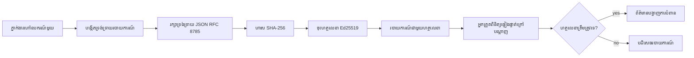
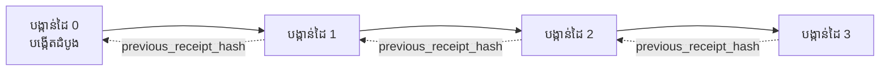

[មើលវីដេអូចំណងថ្នាក់៖ ការសន្តិសុខភ្នាក់ងារត្រូវបានគ្រប់គ្រងដោយសំបុត្រជាសញ្ញាឌីជីថល](https://youtu.be/PLACEHOLDER_VIDEO_ID)

> _(វីដេអូចំណងថ្នាក់ និងរូបតំណាងនឹងត្រូវបញ្ចូលដោយក្រុមមាតិកា Microsoft បន្ទាប់ពីការរួមបញ្ចូល តាមគំរូថ្នាក់ទី 14 / 15)_

# ការសន្តិសុខភ្នាក់ងារត្រូវបានគ្រប់គ្រងដោយសំបុត្រជាសញ្ញាឌីជីថល

## ការណែនាំ

មេរៀននេះនឹងពិភាក្សា៖

- ហេតុអ្វីបានជាaudit trails សម្រាប់ភ្នាក់ងារ AI មានសារៈសំខាន់សម្រាប់ការអនុវត្តតាមច្បាប់ ការបកស្រាយកំហុស និងភាពទុកចិត្ត។
- សំបុត្រជាសញ្ញាឌីជីថលគឺជាអ្វី និងវាខុសគ្នាដូចម្តេចពីបន្ទាត់កំណត់ហេតុដែលមិនបានចុះហត្ថលេខា។
- របៀបផលិតសំបុត្រចុះហត្ថលេខាសម្រាប់ការហៅឧបករណ៍របស់ភ្នាក់ងារដោយប្រើ Python ពីរ។
- របៀបផ្ទៀងផ្ទាត់សំបុត្រជាការផ្ទាល់ និងរកឃើញការបំភ្លេចបំរែបំរួល។
- របៀបខ្សែសំបុត្រដើម្បីធ្វើឱ្យការដក ឬប្តូរតម្រៀបសំបុត្រមួយពិបាកបំផ្លាញខ្សែសំបុត្រ។
- អ្វីដែលសំបុត្របញ្ជាក់ និងអ្វីដែលវាពិតប្រាកដមិនបញ្ជាក់ទេ។

## គោលបំណងរៀន

បន្ទាប់ពីបញ្ចប់មេរៀននេះ អ្នកនឹងអាច៖

- សម្គាល់ម៉ូដបរាជ័យដែលជំរុញការប្រើ cryptographic provenance សម្រាប់សកម្មភាពភ្នាក់ងារ។
- ផលិតសំបុត្រចុះហត្ថលេខាដោយ Ed25519 លើpayload JSON canonical។
- ផ្ទៀងផ្ទាត់សំបុត្រួគប់ដោយប្រើគ្រាប់សាធារណៈរបស់អ្នកចុះហត្ថលេខាដោយឯករាជ្យ។
- រកឃើញការក្លែងបន្លំ ដោយធ្វើការផ្ទៀងផ្ទាត់ឡើងវិញលើសំបុត្រដែលបានប្ដូរ។
- បង្កើតខ្សែលេខកូដសំបុត្រដែលចងគ្នានិងពន្យល់ពីហេតុអ្វីខ្សែក្លាស់គ្នា។
- ទទួលស្គាល់ព្រំដែនរវាងអ្វីដែលសំបុត្របញ្ជាក់បាន (ការទទួលស្គាល់, ភាពសុទ្ធត្រង់, ការរៀបចំតាមលំដាប់) និងអ្វីដែលវាមិនបញ្ជាក់ (ភាពត្រឹមត្រូវនៃសកម្មភាព, សមរម្យនៃគោលការណ៍)។

## បញ្ហា៖ ប្រវត្តិកំណត់ហេតុភ្នាក់ងាររបស់អ្នក

សូមសម្រម់ថា អ្នកបានចាត់តាំងភ្នាក់ងារ AI សម្រាប់ Contoso Travel។ ភ្នាក់ងារនេះអានសំណើររបស់អតិថិជន ហៅ API រហ៊ុនជើងហោះហើរដើម្បីស្វែងរកជម្រើស ហើយកក់កៅអីសម្រាប់អតិថិជន។ ត្រីមាសចុងក្រោយ អ្នកភ្នាក់ងារនេះបានដំណើរការការកក់ 50,000 ករណី។

ថ្ងៃនេះ អ្នកបញ្ជាក់ត្រួតពិនិត្យមកដល់។ ពួកគេចង់សួរចំៗ៖ "បង្ហាញពីអ្វីដែលភ្នាក់ងាររបស់អ្នកបានធ្វើ។"

អ្នកប្រគល់ឯកសារកំណត់ហេតុរបស់អ្នក។ អ្នកបញ្ជាក់មើលឯកសារនឹងសួរពិសេស៖ "តើធ្វើដូចម្តេចដើម្បីដឹងថាឯកសារបានកែប្រែមិនបានធ្វើឡើយ?"

នេះគឺជាបញ្ហាប្រវត្តិកំណត់ហេតុ។ ការចាត់តាំងភ្នាក់ងារឥឡូវនេះភាគច្រើនពឹងផ្អែកលើ៖

- **កំណត់ហេតុកម្មវិធី**៖ អ្នកភ្នាក់ងារសរសេរកំណត់ហេតុដោយខ្លួនឯង អាចកែប្រែដោយនរណាក៏បានដែលមានចូលប្រើប្រព័ន្ធឯកសារ។
- **សេវាកម្មកំណត់ហេតុពពក**៖ អាចរកឃើញការបំភ្លេចបាននៅលើកម្រិតវេទិកា ប៉ុន្តែតែនៅពេលដែលអ្នកបញ្ជាក់ទុកចិត្តលើអ្នកបម្រើវេទិកានោះ។
- **កំណត់ហេតុប្រតិបត្តិការទិន្នន័យមូលដ្ឋាន**៖ សមស្របសម្រាប់ការផ្លាស់ប្តូរទិន្នន័យមូលដ្ឋាន ប៉ុន្តែមិនសមស្របសម្រាប់ការហៅឧបករណ៍ដោយចៃដន្យ។

គ្មានអ្វីក្នុងចំណោមនេះអាចឆ្លើយសំណួររបស់អ្នកបញ្ជាក់ដោយគ្មានការទុកចិត្តនរណាម្នាក់ (អ្នក, អ្នកផ្តល់សេវាពពក, ឬអ្នកផ្គត់ផ្គង់មូលដ្ឋានទិន្នន័យ)។ សម្រាប់ការប្រើប្រាស់ក្នុងសកម្មភាពក្នុងស្រុក ការទុកចិត្តនោះជាទ្រព្យសម្បត្តិនឹងគ្រាន់តែទទួលយកបាន។ សម្រាប់សកម្មភាពដែលត្រូវបានគ្រប់គ្រង (ហិរញ្ញវត្ថុ, សុខាភិបាល, ឬអ្វីដែលត្រូវអនុវត្តតាមច្បាប់ AI របស់ EU) វាមិនអនុញ្ញាតឡើយ។

សំបុត្រជាសញ្ញាឌីជីថល ដោះស្រាយបញ្ហានេះដោយធ្វើឲ្យសកម្មភាពនីមួយៗរបស់ភ្នាក់ងារអាចផ្ទៀងផ្ទាត់ដោយឯករាជ្យបាន។ អ្នកបញ្ជាក់មិនចាំបាច់ដាក់ចិត្តលើអ្នកទេ។ ពួកគេចាំបាច់គ្រប់គ្រាន់តែមានគ្រាប់សាធារណៈ និងសំបុត្រតែម្តង។

## សំបុត្រជាសញ្ញាឌីជីថលគឺជាអ្វី?

សំបុត្រជាអ.obj.JSON ដែលកត់ត្រាពីសកម្មភាពភ្នាក់ងារ ហើយចុះហត្ថលេខាជាមួយហត្ថលេខាឌីជីថល។



សំបុត្រតូចបំផុតបែបនេះ៖

```json
{
  "type": "agent.tool_call.v1",
  "agent_id": "contoso-travel-bot",
  "tool_name": "lookup_flights",
  "tool_args_hash": "sha256:a3f9c1...",
  "result_hash": "sha256:7b2e1d...",
  "policy_id": "contoso-travel-policy-v3",
  "timestamp": "2026-04-25T14:30:00Z",
  "sequence": 47,
  "previous_receipt_hash": "sha256:9d4e6a...",
  "signature": {
    "alg": "EdDSA",
    "sig": "c5af83...",
    "public_key": "8f3b2c..."
  }
}
```

គុណលក្ខណៈបីរបស់វាធ្វើការងារ៖

1. **ហត្ថលេខា**។ សំបុត្រចុះហត្ថលេខាជាមួយក្របខ័ណ្ឌច្រកភ្នាក់ងារ ដោយប្រើគ្រាប់ Ed25519 ភាគហ៊ុនឯកជន។ នរណាមួយដែលមានគ្រាប់សាធារណៈដែលពាក់ព័ន្ធអាចផ្ទៀងផ្ទាត់ហត្ថលេខាដោយមិនប្រើអ៊ីនធឺណិត។ ការបំលែងនៅកន្លែងណាមួយក្នុងវាលលទ្ធផលនឹងធ្វើអោយហត្ថលេខាធ្វើការមិនត្រឹមត្រូវ។

2. **កូដប្រែឯកសារcanonical**។ មុនចុះហត្ថលេខា សំបុត្រត្រូវបានចំណាត់ថ្នាក់តាម JSON Canonicalization Scheme (JCS, RFC 8785)។ វាការពារថាវិធីសាស្រ្តពីការបញ្ចេញសញ្ញាដូចគ្នានៅក្នុងការប្រើប្រាស់ផ្សេងៗដោយផ្ដល់លទ្ធផលបិតជាឃ្លាំមើលដូចគ្នា។ ការមិនប្រើ canonicalization ធ្វើអោយ JSON ស្រីលីះរបស់ជ្រុងផ្សេងៗបង្កើតហត្ថលេខាផ្សេងគ្នាសម្រាប់មាតិកាដូចគ្នា។

3. **ខ្សែស្រឡាយ Hash chaining**។ វាល `previous_receipt_hash` តភ្ជាប់សំបុត្រពីមួយទៅមួយមុន។ ការដករឺប្ដូរតម្រៀបសំបុត្រមួយធ្វើឲ្យសំបុត្របន្ទាប់ៗទាំងអស់ខូចខាត។ ការក្លែងបន្លំក៏អាចបង្ហាញនៅលើកម្រិតខ្សែស្រឡាយ ទោះបីហត្ថលេខាឯកត្តិមួយចុះប្រាស់មិនត្រឹមត្រូវក៏ដោយ។

លក្ខណៈទាំងបីនេះផ្ដល់អោយនូវការធានា៣ៈ

- **ការទទួលស្គាល់**៖ ក្រេសណាមួយបានចុះហត្ថលេខាលើមាតិកានេះ។
- **ភាពសុរិតត្រាង**៖ មាតិកានេះមិនបានផ្លាស់ប្តូរពីពេលចុះហត្ថលេខា។
- **ការរៀបចំតាមលំដាប់**៖ សំបុត្រនេះបានបង្កើតបន្ទាប់ពីសំបុត្រមុនក្នុងខ្សែស្រឡាយ។

## របៀបផលិតសំបុត្រជា Python

អ្នកមិនចាំបាច់មានបណ្ណាល័យពិសេសដើម្បីផលិតសំបុត្រឡើយ។ គ្រឿង cryptographic សម្រាប់នេះមានស្រាប់ហើយលក្ខខណ្ឌត្រឹមបានច្រើនជួរដោយ Python មួយចំនួន។

ការអនុវត្តផ្នែកធ្វើជាក់ស្តែងនៅក្នុង `code_samples/18-signed-receipts.ipynb` នឹងជាមគ្គុទេសក៍ពេញលេញ។ សង្ខេប៖

```python
import json
import hashlib
import base64
from nacl import signing
from jcs import canonicalize  # JSON តាមស្តង់ដារ RFC 8785

def b64url_nopad(data: bytes) -> str:
    return base64.urlsafe_b64encode(data).decode("ascii").rstrip("=")

def sha256_canonical(obj) -> str:
    """SHA-256 of a Python object's JCS-canonical JSON form."""
    return f"sha256:{hashlib.sha256(canonicalize(obj)).hexdigest()}"

# បង្កើត ឬផ្ទុកកូនសោសំរាប់ហត្ថលេខា (នៅក្នុងផលិតកម្ម ដាក់ទុកក្នុងតោនកូនសោ)
signing_key = signing.SigningKey.generate()
verify_key = signing_key.verify_key

# បញ្ចូលទិន្នន័យរបស់ប័ណ្ណទទួល (មិនទាន់មានហត្ថលេខា)
tool_args = {"origin": "SYD", "destination": "LAX"}
tool_result = [{"flight": "QF11", "price": 1850, "stops": 0}]

payload = {
    "type": "agent.tool_call.v1",
    "agent_id": "contoso-travel-bot",
    "tool_name": "lookup_flights",
    "tool_args_hash": sha256_canonical(tool_args),
    "result_hash": sha256_canonical(tool_result),
    "policy_id": "contoso-travel-policy-v3",
    "timestamp": "2026-04-25T14:30:00Z",
    "sequence": 0,
    "previous_receipt_hash": None,
}

# បម្លែងទៅ canonical, ធ្វើ hash, ហត្ថលេខា។
canonical_bytes = canonicalize(payload)
message_hash = hashlib.sha256(canonical_bytes).digest()
signature_bytes = signing_key.sign(message_hash).signature

# តភ្ជាប់វត្ថុហត្ថលេខាបែបរចនាសម្ព័ន្ធ។
receipt = {
    **payload,
    "signature": {
        "alg": "EdDSA",
        "sig": b64url_nopad(signature_bytes),
        "public_key": b64url_nopad(bytes(verify_key)),
    },
}
```

នេះគឺជាចំណុចចុះហត្ថលេខាដែលពេញលេញ។ ការអនុវត្តក្នុងសៀវភៅរៀនគឺជាការឆ្លើយតបក្នុងជំហាននីមួយៗ។

## ការផ្ទៀងផ្ទាត់សំបុត្រនិងរកឃើញការក្លែងបន្លំ

ការផ្ទៀងផ្ទាត់គឺជាអ៉ុពេរ៉ាស់អាំងវឺសៈ៖

```python
import base64
import hashlib
from nacl import signing
from nacl.exceptions import BadSignatureError
from jcs import canonicalize

def b64url_decode(s: str) -> bytes:
    padding = "=" * ((4 - len(s) % 4) % 4)
    return base64.urlsafe_b64decode(s + padding)

def verify_receipt(receipt: dict) -> bool:
    # ចំណាំគឺជាវត្ថុដែលមានរចនាសម្ព័ន្ធ: {"alg", "sig", "public_key"} ។
    sig_obj = receipt.get("signature")
    if not sig_obj or sig_obj.get("alg") != "EdDSA":
        return False

    # ស្តារឡើងវិញ payload ដែលត្រូវបានចុះហត្ថលេខាពិតប្រាកដ (អញ្ជើញលើ signature តែម្ដង) ។
    payload = {k: v for k, v in receipt.items() if k != "signature"}

    canonical_bytes = canonicalize(payload)
    message_hash = hashlib.sha256(canonical_bytes).digest()

    try:
        verify_key = signing.VerifyKey(b64url_decode(sig_obj["public_key"]))
        verify_key.verify(message_hash, b64url_decode(sig_obj["sig"]))
        return True
    except BadSignatureError:
        return False
```

មុខងារនេះទទួលយកសំបុត្រមួយ ហើយបង្វិលតម្លៃ `True` ប្រសិនបើហត្ថលេខាត្រឹមត្រូវ មិនមែនទេហើយផ្សេងទៀត។ មិនចាំបាច់ហៅបណ្តាញ គ្មានការពឹងពាក់សេវាកម្ម ឬការទុកចិត្តលើភាគីទីបី។

ដើម្បីឃើញការរកឃើញការក្លែងបន្លំ សៀវភៅរៀននេះនឹងបង្ហាញ៖

1. ផលិតសំបុត្រត្រឹមត្រូវ ហើយបញ្ជាក់ថាវាបានផ្ទៀងផ្ទាត់។
2. ប្ដូរតែមួយបៃក្នុងវាល `tool_args_hash`។
3. ធ្វើការផ្ទៀងផ្ទាត់ឡើងវិញ ហើយឃើញវាបរាជ័យ។

នេះគឺជាការបង្ហាញជាក់ស្តែងថាសំបុត្រមានលក្ខណៈគ្មានទំនុកចិត្ត: ការផ្លាស់ប្ដូរណាមួយ មិនថា​តិចប៉ុណ្ណា គឺធ្វើឲ្យហត្ថលេខាបាត់បង់ភាពត្រឹមត្រូវ។

## ការខ្សែសំបុត្រសម្រាប់ភ្នាក់ងារជាច្រើនជំហាន

សំបុត្រចុះហត្ថលេខាដោយផ្ទាល់មួយការពារ​សកម្មភាពមួយ។ ខ្សែសំបុត្រមួយការពារតួ sequence មួយ។



សំបុត្រចុះកំណត់ hash នៃសំបុត្រមុន។ ដើម្បីដកសំបុត្រ 2 ដោយស្ងាត់ សកម្មជនមួយត្រូវការប្ដូរឲ្យមាន៖

- កែប្រែវាល `previous_receipt_hash` របស់សំបុត្រ 3 (ធ្វើឲ្យហត្ថលេខានៃសំបុត្រ 3 ខូចខាត), ឬ
- បង្កើតហត្ថលេខាថ្មីលើសំបុត្រ 3 ដែលបានកែប្រែ (ត្រូវគ្រប់គ្រងគ្រាប់ឯកជនរបស់ភ្នាក់ងារ)។

បើគ្រាប់ឯកជនស្ថិតក្នុង hardware key vault ហើយអ្នកបោះពុម្ពគ្រាប់សាធារណៈជាមួយគ្រប់សំបុត្រសម្រាប់រាល់ពេល ការវាយប្រហារទាំងពីរនេះពុំអាចអនុវត្តបានដោយគ្មានការរកឃើញ។

សៀវភៅរៀនបង្ហាញ៖

1. កសាងខ្សែសំបុត្ររបស់សំបុត្របី។
2. ផ្ទៀងផ្ទាត់ថាវាល `previous_receipt_hash` នៃសំបុត្រនីមួយៗផ្គូផ្គងនឹង hash ពិតប្រាកដនៃសំបុត្រមុន។
3. បំលែង​ សំបុត្រមួយនៅកណ្តាល ហើយឃើញខ្សែសំបុត្របែកចែកនៅចំណុចនោះ។

នេះជារបៀបដែលអ្នកផលិតប្រវត្តិ audit ដែលអ្នកបញ្ជាក់ខាងក្រៅអាចផ្ទៀងផ្ទាត់ដោយមិនត្រូវទុកចិត្តលើអ្នក។

## អ្វីដែលសំបុត្របញ្ជាក់ (និងអ្វីដែលវាមិនបញ្ជាក់)

នេះជាផ្នែកសំខាន់បំផុតនៃមេរៀននេះ។ សំបុត្រមានអំណាច ប៉ុន្តែមានកំណត់។

**សំបុត្របញ្ជាក់អ្វី៣មុខ៖**

1. **ការទទួលស្គាល់**៖ គ្រាប់ច្បាប់ពិសេសមួយបានចុះហត្ថលេខាលើpayload ពិសេសមួយ។
2. **ភាពសុរិតត្រាង**៖ payload មិនបានផ្លាស់ប្តូរពីពេលចុះហត្ថលេខា។
3. **ការរៀបចំតាមលំដាប់**៖ សំបុត្រនេះបានបង្កើតបន្ទាប់ពីសំបុត្រមុននៅក្នុងខ្សែ hash chain។

**សំបុត្រមិនបញ្ជាក់អ្វី៖**

1. **ភាពត្រឹមត្រូវ**៖ សកម្មភាពរបស់ភ្នាក់ងារមិនចាំបាច់ត្រឹមត្រូវទេ។ សំបុត្រអាចត្រូវចុះហត្ថលេខាសម្រាប់ចម្លើយខុសដូចជាចម្លើយត្រឹមត្រូវ។
2. **ការអនុវត្តគោលការណ៍**៖ គោលការណ៍ដែលមាននៅក្នុង `policy_id` អាចមិនត្រូវបានវាយតម្លៃ ឬមិនអាចអនុញ្ញាតសកម្មភាពនេះបើត្រូវបានពិនិត្យ។ សំបុត្រកត់ត្រាអ្វីដែលបានថ្លែង មិនមែនអ្វីដែលបានអនុវត្ត។
3. **អត្តសញ្ញាណពីក្រោយគ្រាប់ច្បាប់**៖ សំបុត្រពោលថា "គ្រាប់នេះបានចុះហត្ថលេខាលើមាតិកានេះ។" វាមិនបង្ហាញថា "មនុស្សនេះបានអនុញ្ញាត"។ ការតភ្ជាប់គ្រាប់ច្បាប់ទៅមនុស្ស ឬអង្គភាពទាមទារឧបករណ៍អត្តសញ្ញាណផ្សេងទៀត។
4. **ភាពពិតប្រាកដនៃInput**៖ បើភ្នាក់ងារទទួលបាន prompt ដែលបានក្លែងបន្លំ ហើយអនុវត្តលើវា សំបុត្រកត់ត្រាសកម្មភាពនោះដោយស្មោះត្រង់។ សំបុត្រជាឧបករណ៍បន្ទាប់ពីការត្រួតពិនិត្យ input មិនមែនជាជំនួសវិញ។

ព្រំដែននេះមានសារៈសំខាន់ពីរមូលហេតុ៖

- វាបង្ហាញពីអ្វីដែលសំបុត្រមានប្រយោជន៍សម្រាប់: ធ្វើឲ្យអាកប្បកិរិយាពាក់ព័ន្ធភ្នាក់ងារអាចត្រូវត្រួតពិនិត្យ និងរៀបចំរកឃើញការយកអ្វីហួសហេតុ ទោះបីជាជួរអង្គការផ្សេងៗ។
- វាបង្ហាញថាអ្នកនៅតែត្រូវការជាន់ខ្នាតបន្ថែម: ការត្រួតពិនិត្យ input (មេរៀនទី 6), ការអនុវត្តគោលការណ៍ (បង្ហាញខ្លះខាងក្រោម), និងឧបករណ៍អត្តសញ្ញាណ (មិនក្នុងសមត្ថភាពរបស់មេរៀននេះ)។

កំហុសទូទៅគឺគិតថា "យើងមានសំបុត្រ" មានន័យថា "យើងមានអំណាចគ្រប់គ្រង។" វាមិនត្រឹមត្រូវទេ។ សំបុត្រជាគ្រឹះបន្ទាប់ ហើយអំណាចគ្រប់គ្រងគឺជាការបញ្ជំបង្កើតលើវា។

## ឆ្នោតរៀន

កែច្នៃចំណេះដឹងរបស់អ្នកមុនចូលទៅឧបករណ៍អនុវត្ត។

**1. សំបុត្រត្រូវបានចុះហត្ថលេខាជាមួយគ្រាប់កូនសោ Ed25519 ផ្ទៃក្នុងភ្នាក់ងារ។ អ្នកបញ្ជាក់ទាន់តែមានគ្រាប់សាធារណៈតែប៉ុណ្ណោះ។ តើអ្នកបញ្ជាក់អាចផ្ទៀងផ្ទាត់សំបុត្របានដោយមិនប្រើអ៊ីនធឺណិតបានទេ?**

<details>
<summary>ចម្លើយ</summary>

បាន។ ការផ្ទៀងផ្ទាត់ Ed25519 តម្រូវឲ្យមានគ្រាប់សាធារណៈ និងបៃដែលបានចុះហត្ថលេខា តែប៉ុណ្ណោះ។ មិនមានការហៅបណ្តាញ ឬពឹងផ្អែកលើសេវាកម្ម។ នេះជាលក្ខណៈពិសេសធ្វើឲ្យសំបុត្រយូរអង្វែងមានប្រយោជន៍នៅក្នុងបរិយាកាសក្រៅបណ្តាញ ក្រោមអង្គការច្រើន ឬការត្រួតពិនិត្យដែលមានការទុកចិត្តតិច។
</details>

**2. អ្នកប្រហារប្ដូរវាល `policy_id` នៃសំបុត្រដោយថាគោលការណ៍ដោះស្រាយមានសិទ្ធិច្រើនជាងតែម្តង។ ហត្ថលេខាត្រូវបានគណនាលើ payload ដើម។ តើមានអ្វីកើតឡើងនៅពេលផ្ទៀងផ្ទាត់?**

<details>
<summary>ចម្លើយ</summary>

ការផ្ទៀងផ្ទាត់បរាជ័យ។ ហត្ថលេខាត្រូវបានគណនាបានលើបៃ canonical របស់ payload ដើម; ការប្ដូរទាំងអស់នៃវាលណាមួយ ប្តូរបៃ canonical ដែលបង្កើត hash SHA-256 ដែលធ្វើឲ្យហត្ថលេខាខូច។ អ្នកប្រហារត្រូវការគ្រាប់ឯកជនដើម្បីផលិតហត្ថលេខាធ្វើឡើងវិញដើម្បីបានហត្ថលេខាថ្មីដែលត្រឹមត្រូវ, ដែលអ្នកគេចំនាំមិនបាន។
</details>

**3. ហេតុអ្វីបានជាសំបុត្ររួមបញ្ចូល `tool_args_hash` និង `result_hash` ជំនួសargs និងលទ្ធផលដើម?**

<details>
<summary>ចម្លើយ</summary>

មូលហេតុពីរដូចខាងក្រោម។ ជាលើកដំបូង សំបុត្រអាចត្រូវបានរក្សាទុកឬបញ្ជូននៅបរិយាកាសដែលការរលាយពត៌មានដើម (PII, ព័ត៌មានអាជីវកម្ម) ដែលមានបញ្ហា។ ការជួញដូរជាមួយ hash ធ្វើឲ្យសំបុត្រតូច និងមាតិកាគឺឯកជន; អ្នកបញ្ជាក់ទ្រួតពិនិត្យថា hash ត្រូវគ្នាជាមួយចម្លងផ្សេងទៀតនៃមាតិកាពិត។ ទីពីរ hash មានទំហំនិស្ស័យថេរ; សំបុត្រដែលមាន hash មានទំហំមានកំណត់ មិនថា input និង output ទំហំធំអតិបរមាដោយឡែក។
</details>

**4. វាល `previous_receipt_hash` តភ្ជាប់សំបុត្រនីមួយៗទៅឲ្យសំបុត្រមុនរបស់វា។ បើអ្នកប្រហារពន្លាក់សំបុត្រមួយនៅកណ្តាលខ្សែស្រឡាយ សំបុត្រណាខូចខាត?**

<details>
<summary>ចម្លើយ</summary>

សំបុត្រទាំងអស់ដែលមកបន្ទាប់សំបុត្រដែលត្រូវបានលុប។ វាល `previous_receipt_hash` របស់ពួកវាគ្មានផ្គូផ្គងនឹងខ្សែស្រឡាយពិតប្រាកដ (ព្រោះសំបុត្រដែលបានយោងមិនមានឬខ្សែស្រឡាយកំពុងបង្ហាញទៅកាន់អ្នកមុនផ្សេង)។ ដើម្បីលាក់ការលុប អ្នកប្រហារត្រូវបានចាំបាច់ចុះហត្ថលេខាថ្មីលើសំបុត្រពេលក្រោយទាំងអស់ដែលតម្រូវឲ្យមានគ្រាប់ឯកជន។
</details>

**5. សំបុត្រផ្ទៀងផ្ទាត់បានស្អាត។ តើវាបញ្ជាក់ថាសកម្មភាពភ្នាក់ងារត្រឹមត្រូវ ឬមានសមត្ថភាពធ្វើតាមគោលការណ៍ទេ?**

<details>
<summary>ចម្លើយ</summary>

ទេ។ សំបុត្រត្រឹមត្រូវបង្ហាញអ្វី៣យ៉ាង៖ ការទទួលស្គាល់ (គ្រាប់នេះបានចុះហត្ថលេខាលើមាតិកានេះ), ភាពសុរិតត្រង់ (មាតិកាមិនផ្លាស់ប្តូរ), និងការរៀបចំនៃខ្សែស្រឡាយ (សំបុត្រនេះបានបន្ទាប់ពីសំបុត្រមុន)។ វាមិនបញ្ជាក់ថាសកម្មភាពត្រឹមត្រូវ ការវាយតម្លៃគោលការណ៍ក្នុង `policy_id` បានធ្វើឡើង មែន ឬអ្នកភ្នាក់ងារបានអនុវត្តតាមច្បាប់ទាំងអស់ឬទេ។ សំបុត្រធ្វើឲ្យអាកប្បកិរិយាភ្នាក់ងារអាចត្រួតពិនិត្យ ទៅមិនចាំបាច់ត្រឹមត្រូវ។ នេះជាព្រំដែនសំខាន់បំផុតក្នុងមេរៀន។
</details>

## ហាត់ប្រាណអនុវត្ត

បើក `code_samples/18-signed-receipts.ipynb` និងបញ្ចប់ចំណុចទាំងបួន៖

1. **ផ្នែកទី 1**៖ ចុះហត្ថលេខាសំបុត្រដំបូងរបស់អ្នក ហើយផ្ទៀងផ្ទាត់វា។
2. **ផ្នែកទី 2**៖ បំភ្លេចសំបុត្រ ហើយមើលឃើញការផ្ទៀងផ្ទាត់បរាជ័យ។
3. **ផ្នែកទី 3**៖ បង្កើតខ្សែសំបុត្របី និងផ្ទៀងផ្ទាត់ភាពសុទ្ធត្រឹមរបស់ខ្សែស្រឡាយ។
4. **ផ្នែកទី 4**៖ អនុវត្តលំនាំនេះទៅភ្នាក់ងារដែលបានបង្កើតជាមួយ Microsoft Agent Framework៖ រៀបចំហៅឧបករណ៍ជាមួយសំបុត្រចុះហត្ថលេខា ហើយផ្ទៀងផ្ទាត់សំបុត្រដោយឯករាជ្យ។
**ស្ថេរភាពលើកទី 1:** ពង្រីកស៊្កីម៉ា​សំបុត្រជាមួយប្រឡាយបន្ថែមមួយដែលអ្នកជ្រើសរើសផ្ទាល់ (ឧទាហរណ៍ សំណើសុំ ID សម្រាប់តាមដាន), បន្ទាប់មកធ្វើបច្ចុប្បន្នភាពលក្ខណៈចុះហត្ថលេខាជាក់លាក់ដើម្បីរួមបញ្ចូលវា ហើយបញ្ជាក់ថាសំបុត្រនេះដងមួយទៀតនៅតែអាចបញ្ចេញតាមការផ្ទៀងផ្ទាត់បាន។ បន្ទាប់មកកែប្រែប្រឡាយនោះបន្ទាប់ពីបានចុះហត្ថលេខា ហើយបញ្ជាក់ថាការផ្ទៀងផ្ទាត់បរាជ័យ។ នេះបង្ខំឱ្យអ្នកយល់ពីរបៀបដែលបៃត៍នីមួយៗនៃការអ៊ិនកូដជាទម្រង់កាណូណិច បរិច្ចាគចូលទៅក្នុងហត្ថលេខា។

**ស្ថេរភាពលើកទី 2:** លាយ SHA-256 ពីសំបុត្រពីរពីរបស់អ្នកជាមួយគ្នា (ភ្ជាប់បៃត៍កាណូណិចរបស់ពួកវា ក្នុងលំដាប់កំណត់) ហើយដាក់ហាសហើយវា ជាប្រឡាយថ្មីលើយោងទៅលើសំបុត្របីមុនចុះហត្ថលេខា។ ផ្ទៀងផ្ទាត់ថាសំបុត្រទាំងបីនៅតែអាចបញ្ចេញតាមការផ្ទៀងផ្ទាត់បាន។ អ្នកទើបតែបង្កើតភស្តុតាងបញ្ចូលមួយជំហានៈ អ្នកណា​ដែលកាន់សំបុត្របីនេះអាចបញ្ជាក់ថាសំបុត្រពីរដំបូងមាននៅពេលវាត្រូវបានចុះហត្ថលេខា ដោយមិនចាំបាច់បង្ហាញមាតិការបស់ពួកវាទេ។ នេះជាគំរូដែលសំបុត្របង្ហាញជ្រើសរើសប្រើប្រាស់នៅចាបបែងចែកក្នុងធំ (ការប្តេជ្ញាចិត្តMerkle, RFC 6962)។

## សេចក្តីសន្និដ្ឋាន

សំបុត្រស្លាជ្ជមានវិភាគ កាតព្វកិច្ច AI ផ្តល់នូវខ្សែដំណើរការស្ថិតនៅក្រោមការត្រួតពិនិត្យ ដែល៖

- **អាចត្រួតពិនិត្យដោយឯករាជ្យបាន**៖ ក្រុមហ៊ុនណាមួយមានកូនសោសាកជាសាធារណៈអាចបញ្ជាក់បាន ដោយមិនងាយទៅទីសេវាកម្មណាមួយឡើយ។
- **បង្ហាញការប្ដូរប្រែបានច្បាស់លាស់**៖ ការប្រែប្រួលណាមួយធ្វើឱ្យហត្ថលេខាមិនត្រូវបានទទួលយកឡើយ។
- **អាចយកបាន និងបញ្ជូនបាន**៖ សំបុត្រគឺជាឯកសារ JSON តូចមួយ; វាអាចត្រូវបានរក្សាទុក, ផ្ទេរ និងផ្ទៀងផ្ទាត់នៅកន្លែងណាមួយក៏បាន។
- **ស្របតាមស្តង់ដា**៖ បានបង្កើតលើ Ed25519 (RFC 8032), JCS (RFC 8785), និង SHA-256 ដែលជាកម្មវិធីបែបទីផ្សារដែលបានប្រើប្រាស់យ៉ាងទូលំទូលាយ។

ពួកវាមិនជាជំនួសសម្រាប់ការត្រួតពិនិត្យបញ្ចូល, អនុវត្តន៍គោលការណ៍ឬគ្រឹះស្ថានអត្តសញ្ញាណឡើយ។ ពួកវាជាមូលដ្ឋានសម្រាប់លើស្រទាប់ទាំងនោះ។ នៅពេលអ្នកបញ្ចេញអេហ្សង់នៅក្នុងបន្ទុកដែលមានការត្រួតពិនិត្យ, សំណុំការងារសហគ្រិន ច្រកផ្លូវការឬកន្លែងណាមួយដែលអ្នកនឹកស្មានមិនថាអ្នកមិនត្រូវជឿជាក់ពីអ្នកទេ អ្នកត្រូវប្រើសំបុត្រជាផ្លូវការ ដើម្បីធានាថាខ្សែដំណើរការត្រឹមត្រូវ។

អ្វីសំខាន់បំផុតគឺ៖ សំបុត្របញ្ជាក់ថា នរណាបាននិយាយអ្វី និងពេលណា។ វាមិនបញ្ជាក់ថាអ្វីដែលបាននិយាយគឺពិតឬត្រឹមត្រូវឡើយ។ ត្រូវរក្សាភាពខុសគ្នានេះឱ្យជាប់រឹងមាំ។ នេះជាការប្រៀបធៀបរវាងប្រព័ន្ធដើមប្រភពដែលស្មោះត្រង់ និងមួយដែលបញ្ឆោតបញ្ឆោញ។

## បញ្ជីឆែកផលិតកម្ម

នៅពេលអ្នករួចរាល់ក្នុងការសិក្សាពីមេរៀននេះទៅរកការបញ្ចេញអេហ្សង់ដែលបានចុះហត្ថលេខាសំបុត្រនៅបរិយាកាសពិតប្រាកដ៖

- [ ] **ផ្លាស់ប្តូរកូនសោចុះហត្ថលេខាឱ្យចេញពីកុំព្យូទ័រអ្នកអភិវឌ្ឍកម្ម**។ ប្រើ Azure Key Vault, AWS KMS ឬម៉ូឌុលសុវត្ថិភាពរឹងមាំ។ ពុំអាចមានកូនសោឯកជនដែលចុះហត្ថលេខាបានជាមួយសំបុត្ររបស់អ្នករស់នៅក្នុងការគ្រប់គ្រងប្រភព ឬជាអត្ថបទស្រឡាយលើម៉ាស៊ីនកម្មវិធីណាមួយឡើយ។
- [ ] **ផ្សព្វផ្សាយកូនសោសាកផ្ទៀងផ្ទាត់**។ អ្នកត្រួតពិនិត្យចង់បានវាដើម្បីផ្ទៀងផ្ទាត់ក្រៅបណ្តាញ។ គំរូស្តង់ដាគឺជាគណនីកំណត់ JWK នៅគេហទំព័រដែលស្គាល់ល្បី (RFC 7517) ឧ. `https://your-org.example.com/.well-known/agent-keys.json`។
- [ ] **ភ្ជាប់ខ្សែសង្វាក់ពីក្រៅ**។ គិតតម្លៃលើកំណត់ហាសខ្សែសង្វាក់ថ្មីៗទៅកាន់កំណត់ហេតុភាពត្រូវបានបង្ហាញ (Sigstore Rekor, RFC 3161 អាជ្ញាធរទ្រទ្រង់ពេលវេលា ឬប្រព័ន្ធផ្ទៃក្នុងទីពីរ) ដើម្បីឱ្យអ្នកក្រៅអាចបញ្ជាក់ថា "ខ្សែសង្វាក់នេះមាននៅពេលនេះ"។
- [ ] **រក្សាសំបុត្រជាមិនអាចកែប្រែបាន**។ ប្រព័ន្ធបន្ថែមតែមួយ( ផ្ទុក Azure រួមជាមួយគោលការណ៍មិនអាចផ្លាស់ប្ដូរ, AWS S3 Object Lock) បិទដំណើរការកែប្រែប្រវត្តិជា insider នៅកំឡុងផ្នែកផ្ទុក។
- [ ] **សម្រេចចិត្តលើរយៈពេលរក្សាទុក**។ ជាច្រើនរូបមន្តគ្រប់គ្រងតម្រូវឱ្យរក្សាទុកបានប៉ុន្មានឆ្នាំ។ គម្រោងសម្រាប់កំណើនសំបុត្រ (សំបុត្ររាល់មួយប្រហែល ~500 បៃ; អ្នកអេហ្សង់ដែលអនុវត្ត 10K ការហៅរៀងរាល់ថ្ងៃ បង្កើត ~1.8 GB ក្នុងមួយឆ្នាំ)។
- [ ] **ឯកសារអំពីអ្វីដែលសំបុត្រ​មិនគ្របដណ្ដប់**។ សំបុត្របញ្ជាក់ការ​ចូលកាន់សិទ្ធិ, ការសុវត្ថិភាព និងលំដាប់លំដោយ។ សៀវភៅរបស់អ្នកត្រូវតែបញ្ជាក់ច្បាស់ពីការគ្រប់គ្រងបន្ថែម (ត្រួតពិនិត្យបញ្ចូល, អនុវត្តគោលការណ៍, ការកំណត់អត្រា, គ្រឹះស្ថានអត្តសញ្ញាណ) ដែលស្ថិតនៅជាប់ជាមួយសំបុត្រនៅក្នុងចំណុចគ្រប់គ្រងរបស់អ្នក។

### មានសំណួរបន្ថែមអំពីការសុវត្ថិភាពអេហ្សង់ AI?

ចូលរួមក្នុង [Microsoft Foundry Discord](https://aka.ms/ai-agents/discord) ដើម្បីជួបជាមួយអ្នករស់រានមានជីវិតផ្សេងទៀត ចូលរួមម៉ោងការិយាល័យ និងទទួលបានចម្លើយសម្រាប់សំណួរអំពីអេហ្សង់ AI របស់អ្នក។

## របៀបក្រៅពីមេរៀននេះ

មេរៀននេះគ្របដណ្តប់ចោល​ការ​ចុះហត្ថលេខាសំបុត្រតែមួយ និងខ្សែសង្វាក់ហាសបន្សំ។ អ្នកអាចប្រើបច្ចេកទេសដដែលដើម្បីបង្កើតគំរូកម្រិតខ្ពស់ជាច្រើន ដែលអ្នកប្រហែលជជួបប្រទៈពេលកំណត់គ្រប់គ្រងរបស់អ្នកកាន់តែច្រើនជាងមុន៖

- **ការបង្ហាញជ្រើសរើស**។ ពេលប្រឡាយនៅក្នុងសំបុត្រត្រូវបានទទួលបញ្ចូលដោយឯករាជ្យ (Merkle tree បែប RFC 6962), អ្នកអាចបង្ហាញប្រឡាយជាក់លាក់ទៅអ្នកត្រួតពិនិត្យជាក់លាក់ ហើយបញ្ជាក់ថាផ្នែកដែលនៅសល់មិនបានផ្លាស់ប្ដូរ ដោយមិនបង្ហាញវាទៅឱ្យនរណារួចទេ។ មានប្រយោជន៍ពេលសំបុត្រដូចគ្នាត្រូវកំចាត់ចម្ងល់នៃការត្រួតពិនិត្យទូលំទូលាយ (ដែលចង់បានភាពគ្រប់គ្រាន់) និងបទបញ្ជាការរក្សាទិន្នន័យអប្បបរមាដូច GDPR (ដែលចង់ឲ្យអ្នកត្រួតពិនិត្យមើលតិចតួចត្រឹមត្រូវ)។
- **ការបដិសេធសំបុត្រ**។ ប្រសិនបើកូនសោចុះហត្ថលេខាត្រូវបានបំពាន អ្នកត្រូវការរបៀបបញ្ចាក់ថាសំបុត្រទាំងអស់ដែលបានចុះហត្ថលេខាជាមួយកូនសោនោះគឺមិនគួរឲ្យទុកចិត្តចាប់ពីពេលនោះទាំងស្រុង។ គំរូស្តង់ដាៈ កូនសោចុះហត្ថលេខានូវរយៈពេលខ្លីរួមជាមួយបញ្ជីបដិសេធដែលបានបោះពុម្ពផ្សាយ, ឬកំណត់ហេតុភាពត្រូវបានបង្ហាញជាមួយបញ្ចូលបដិសេធ។
- **សំបុត្រ​រាវម្ភាគ / ចែកហត្ថលេខា**។ ការអនុវត្តអាចបំបែកផ្ទុកទិន្នន័យដែលបានចុះហត្ថលេខាជាពីរផ្នែក ពីមុនរត់ (`authorization_*`) និងបន្ទាប់រត់ (`result_*`) ជាមួយហត្ថលេខាឯករាជ្យ ដែលមានប្រយោជន៍ពេលសេចក្តីសម្រេចការអនុញ្ញាត និងលទ្ធផលដែលមើលឃើញត្រូវបានបង្កើតដោយអ្នកដឹកនាំផ្សេងគ្នា ឬពេលខុសគ្នា។ វាអាចបន្ថែមលើទ្រង់ទ្រាយសំបុត្រដែលបានបង្រៀននៅមេរៀននេះ។
- **រួមបញ្ចូលផ្ទុកទិន្នន័យ**។ សំបុត្រចាក់សោតទិន្នន័យទាំងអស់ដែលអ្នកដាក់ក្នុង `result_hash`។ ផ្ទុកទិន្នន័យពិតជិតបានិយាយហៅតិចក្រៅលទ្ធផលឧបករណ៍មួយលើកតែមួយ ៖ ពិចារណាពីមុនសេចក្តីសម្រេច (ការព្យាករណ៍គំរូ, ជម្រើសបានពិចារណា, ភស្តុតាង និងភាពគ្រប់គ្រាន់របស់វា, ទីតាំងគោលការណ៍, ខ្សែដៃទទួលខុសត្រូវ, លទ្ធផលប្រពន្ធ័កំណត់ទ្វារ) អាចផ្តល់ជាច្រកទិន្នន័យទាំងមូលក្នុងផ្ទុក, បានចាក់សោដោយសំបុត្រតែមួយ។ នេះរក្សាទ្រង់ទ្រាយសំបុត្រឲ្យតិចបំផុត ខណៈអោយស្គីម៉ាផ្ទុកទិន្នន័យអាចរីកចម្រើនឆ្ពោះទៅកាន់ដែនកំណត់ផ្សេងៗ។
- **ការអនុវត្តតាមគំរូគ្នារវាងកម្មវិធី**។ អនុវត្តន៍អាចមានរាប់ច្រើននៃទ្រង់ទ្រាយសំបុត្រដូចគ្នា (Python, TypeScript, Rust, Go) អាចផ្ទៀងផ្ទាត់គ្នាជាមួយវ៉ិចទ័រតេស្តរួម។ បើអ្នកបង្កើតការអនុវត្តផ្ទាល់ខ្លួន ការផ្ទៀងផ្ទាត់ជាមួយវ៉ិចទ័របោះផ្សាយបញ្ជាក់សមត្ថភាពស្របខ្សែស្របខ្ពស់។
- **ប្រែប្រួលក្រោយកម្រិតគុណវិបត្តិ**។ Ed25519 ត្រូវបានប្រើប្រាស់យ៉ាងទូលំទូលាយថ្ងៃនេះ ប៉ុន្តែមិនធន់នឹងគុណវិបត្តិ។ ទ្រង់ទ្រាយសំបុត្រជាអាកុលបណ្ដាញអាល់ហ្គរីធម៌៖ ប្រឡាយ `signature.alg` អាចពេញ `ML-DSA-65` (ស្តង់ដាហត្ថលេខាក្រោយគុណវិបត្តិ NIST) នៅពេលអ្នកត្រូវបម្លែង។ គ្រោងការជាមួយរយៈពេលឆ្ពោះដល់ពេលដែលសំបុត្រត្រូវបានចុះហត្ថលេខាប្រកបដោយហត្ថលេខាពីររូប។

## ឯកសារបន្ថែម

- <a href="https://datatracker.ietf.org/doc/draft-farley-acta-signed-receipts/" target="_blank">ឯកសាររដ្ឋបាលអ៊ីនធឺណិត IETF: សំបុត្រសេចក្តីសម្រេចដែលបានចុះហត្ថលេខាសម្រាប់ការត្រួតពិនិត្យម៉ាស៊ីនទៅម៉ាស៊ីន</a>
- <a href="https://learn.microsoft.com/azure/ai-studio/responsible-use-of-ai-overview" target="_blank">ទិដ្ឋភាពទូទៅអំពី AI ការទទួលខុសត្រូវ (Azure AI)</a>
- <a href="https://datatracker.ietf.org/doc/html/rfc8032" target="_blank">RFC 8032៖ អាល់ហ្គរីធម៍ហត្ថលេខាឌីជីថលខ្សែកោង Edwards (EdDSA)</a>
- <a href="https://datatracker.ietf.org/doc/html/rfc8785" target="_blank">RFC 8785៖ ផែនការកាណូនិច JSON (JCS)</a>
- <a href="https://datatracker.ietf.org/doc/html/rfc6962" target="_blank">RFC 6962៖ ភាសាកំណត់ហេតុភាពត្រូវបានបង្ហាញ</a> (ការបង្កើត Merkle-tree ដែលប្រើដោយសំបុត្របង្ហាញជ្រើសរើស)
- <a href="https://github.com/microsoft/agent-governance-toolkit/blob/main/docs/tutorials/33-offline-verifiable-receipts.md" target="_blank">ឧបករណ៍គ្រប់គ្រងអេហ្សង់ Microsoft, មេរៀន 33៖ សំបុត្រសេចក្តីសម្រេចអាចផ្ទៀងផ្ទាត់ក្រៅបណ្តាញ</a>
- <a href="https://github.com/ScopeBlind/agent-governance-testvectors" target="_blank">វ៉ិចទ័រតេស្តការអនុវត្តគ្នាច្រើនសម្រាប់ទ្រង់ទ្រាយសំបុត្រដែលប្រើនៅក្នុងមេរៀននេះ (Apache-2.0)</a>
- <a href="https://pynacl.readthedocs.io/" target="_blank">ឯកសារ PyNaCl</a> (Ed25519 ក្នុង Python)

## មេរៀនមុន

[ការបង្កើតអេហ្សង់បម្រើកុំព្យូទ័រ (CUA)](../15-browser-use/README.md)

## មេរៀនបន្ទាប់

_(ទន្ទឹមត្រូវបានកំណត់ដោយអ្នកថែរក្សាគ្រោងការសិក្សា)_

---

<!-- CO-OP TRANSLATOR DISCLAIMER START -->
**ការបដិសេធ**:
ឯកសារនេះត្រូវបានបម្លែងភាសា ដោយប្រើសេវាបម្លែងភាសា AI [Co-op Translator](https://github.com/Azure/co-op-translator)។ ទោះយើងខ្ញុំមានក្តីប្រាថ្នាឱ្យបានច្បាស់លាស់ តែសូមយល់ដឹងថាការបម្លែងដោយស្វ័យប្រវត្តិក៏អាចមានកំហុសឬភាពមិនត្រឹមត្រូវ។ ឯកសារដើមជាភាសាទីតាំងគួរត្រូវបានគេប្រើជាប្រភពច្បាស់លាស់។ សម្រាប់ព័ត៌មានសំខាន់ៗ សូមណែនាំឱ្យប្រើប្រាស់ការប្រែដោយមនុស្សជំនាញ។ យើងខ្ញុំមិនទទួលខុសត្រូវចំពោះការយល់ច្រឡំ ឬការបកស្រាយខុសបន្ទាប់ពីការប្រើប្រាស់ការបម្លែងនេះនោះទេ។
<!-- CO-OP TRANSLATOR DISCLAIMER END -->