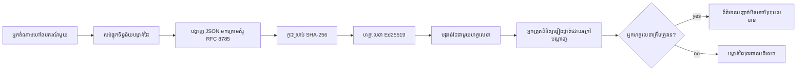
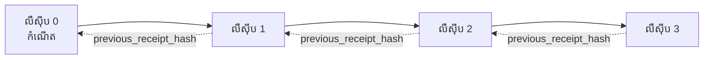

[មើលវីដេអូចង្វាក់មេរៀន៖ ការជៀសវាងភ័ស្តុតាង AI ជាមួយវិញ្ញាបនប័ត្រសំគាល់លេខ](https://youtu.be/PLACEHOLDER_VIDEO_ID)

> _(វីដេអូមេរៀន និងរូបភាពថតត្រូវបានបន្ថែមដោយក្រុមមាតិកា Microsoft ក្រោយការរួមបញ្ចូល ផ្គូផ្គងនឹងលំនាំមេរៀនទី ១៤ / ១៥)_

# ការជៀសវាងភ័ស្តុតាង AI ជាមួយវិញ្ញាបនប័ត្រសំគាល់លេខ

## ការណែនាំ

មេរៀននេះនឹងគ្របដណ្តប់៖

- ហេតុអ្វីបានជា audit trail សម្រាប់ភ្នាក់ងារផ្នែក AI មានសារៈសំខាន់សម្រាប់ការជាប់ច្បាប់ ការសម្លាស់បន្លាយ, និងការជឿទុកចិត្ត។
- ផ្សេងគ្នារវាងវិញ្ញាបនប័ត្រសំគាល់លេខ និងខ្សែភាពយន្តកំណត់ហេតុមិនបានចុះហត្ថលេខា។
- របៀបបង្កើតវិញ្ញាបនប័ត្រចុះហត្ថលេខាសម្រាប់ការហៅឧបករណ៍របស់ភ្នាក់ងារដោយ Python ធម្មតា។
- របៀបបញ្ជាក់វិញ្ញាបនប័ត្រជាការតាមអ៊ិនធឺណិត និងរកឃើញការបម្លែងបំផ្លាញ។
- របៀបភ្ជាប់វិញ្ញាបនប័ត្រដូច្នេះករណីលុបចោលឬប្តូរឈរ រូបភាពនៃខ្សែភាពយន្តនឹងខូច។
- អ្វីដែលវិញ្ញាបនប័ត្របញ្ជាក់ និងអ្វីដែលវាមិនបញ្ជាក់ដោយច្បាស់។

## គោលបំណងរៀន

បន្ទាប់ពីបញ្ចប់មេរៀននេះ អ្នកនឹងដឹងរបៀប៖

- កំណត់អត្តសញ្ញាណនៃរបៀបបរាជ័យដែលជំនួសការផ្គត់ផ្គង់ពីវិញ្ញាបនប័ត្រសំគាល់លេខសម្រាប់សកម្មភាពភ្នាក់ងារ។
- បង្កើតវិញ្ញាបនប័ត្រចុះហត្ថលេខា Ed25519 លើទិន្នន័យ JSON ដែលមានលំនាំស្របតាម Canonical។
- បញ្ជាក់វិញ្ញាបនប័ត្របានឯករាជ្យដោយប្រើក្តារចុះហត្ថលេខាដែលហាក់ស្រួលចាំ។
- រកឃើញការប្រើបន្លាយដោយរៀបចំការផ្ទៀងផ្ទាត់ឡើងវិញលើវិញ្ញាបនប័ត្រដែលបានបម្លែង។
- តភ្ជាប់ជាស៊ីគេន្សា hash របស់វិញ្ញាបនប័ត្រ និងពន្យល់ថាហេតុអ្វីបានជាខ្សែភាពយន្តមានសារៈសំខាន់។
- ការស្គាល់ព្រំដែនរវាងអ្វីដែលវិញ្ញាបនប័ត្របញ្ជាក់ (កំណត់ឲ្យមាន ការរឹតត្បិត និងការរៀបចំ) និងអ្វីដែលវាមិនបញ្ជាក់ (ភាពត្រឹមត្រូវរបស់សកម្មភាព និងភាពដៃគុណនៃគោលនយោបាយ)។

## បញ្ហា៖ សម្គាល់ Audit Trail របស់ភ្នាក់ងារ​របស់អ្នក

សូមនិយាយមើលថាអ្នកបានដាក់ឲ្យប្រើភ្នាក់ងារ AI មួយសម្រាប់ Contoso Travel។ ភ្នាក់ងារនេះអានសំណើរបស់អតិថិជន ហៅ API សម្រាប់ស្វែងរកជញ្ជាំងហោះហើរ ហើយចុះកៅអីផ្នែកអតិថិជន។ ត្រីមាសមុនភ្នាក់ងារបានដំណើរការចំនួន ៥០,០០០ ការកក់។

ថ្ងៃនេះ អ្នកត្រួតពិនិត្យមកដល់ ហើយសួរសំណួររាយការណ៍ថា "បង្ហាញខ្ញុំមើលថាភ្នាក់ងារអ្នកបានធ្វើអ្វីខ្លះ។"

អ្នកបានផ្តល់ឲ្យពួកគេកំណត់ហេតុខ្លួន។ អ្នកត្រួតពិនិត្យមើលហើយសួរថា៖ "តើធ្វើយ៉ាងណាខ្ញុំដឹងថាកំណត់ហេតុទាំងនេះមិនត្រូវបានកែប្រែ?"

នេះគឺជាបញ្ហា audit-trail។ ការដំឡើងភ្នាក់ងារប្រចាំថ្ងៃភាគច្រើនផ្អែកលើ៖

- **កំណត់ហេតុកម្មវិធី**៖ បានសរសេរដោយភ្នាក់ងារផ្ទាល់ អាចកែប្រែដោយនរណាដែលមានការចូលប្រើប្រព័ន្ធអេក្រង់ឯកសារ។
- **សេវាកម្មបញ្ជូនកំណត់ហេតុមេឃ**៖ បង្ហាញសញ្ញាការបម្លែងខុសនៅកម្រិតវេទិកា ប៉ុន្តែត្រូវតែជឿទុកចិត្តនៅលើអ្នកប្រតិបត្តិករ​វេទិកា។
- **កំណត់ហេតុប្រតិបត្តិការទិន្នន័យក្នុងមូលដ្ឋានទិន្នន័យ**៖ ល្អសម្រាប់ការផ្លាស់ប្តូរមូលដ្ឋានទិន្នន័យ ប៉ុន្តែមិនសមសម្រាប់ហៅឧបករណ៍អ្វីមួយដោយចៃដន្យ។

គ្មានមួយក្នុងចំណោមនេះអាចឆ្លើយសំណួររបស់អ្នកត្រួតពិនិត្យបាន គ្មានការជឿលើនរណាមួយ (អ្នក, អ្នកផ្តល់ម៉ោងជាមួយពពក, ឬអ្នកលក់មូលដ្ឋានទិន្នន័យ)។ សម្រាប់ការប្រើប្រាស់ក្នុងខាងក្នុង ការជឿនេះគឺអាចទទួលយកបាន។ សម្រាប់ការងារដែលត្រូវបានគ្រប់គ្រង (ហិរញ្ញវត្ថុ, សុខភាព, ឬអ្វីក៏ដោយដែលគ្រប់គ្រងដោយច្បាប់ EU AI Act) វាមិនអាចទទួលយកបាន។

វិញ្ញាបនប័ត្រសំគាល់លេខដោះស្រាយបញ្ហានេះដោយធ្វើឱ្យសកម្មភាពភ្នាក់ងារនីមួយៗអាចបញ្ជាក់ដោយឯករាជ្យបាន។ អ្នកត្រួតពិនិត្យមិនចាំបាច់ជឿអ្នកទេ៖ គាត់ត្រូវការតែគ្រាប់កូនសោសាធារណៈរបស់អ្នក និងវិញ្ញាបនប័ត្រដែលគាត់បានទទួលតែក្នុងពេលវេលាគ្នាទៅ។

## វិញ្ញាបនប័ត្រសំគាល់លេខជាអ្វី?

វិញ្ញាបនប័ត្រមានទម្រង់ JSON ដែលកត់ត្រាថាភ្នាក់ងារធ្វើអ្វី ហើយចុះហត្ថលេខាជាមួយហត្ថលេខា ឌីជីថល។


```mermaid
flowchart LR
    A[អ្នកតំណាងហៅឧបករណ៍មួយ] --> B[សង់ផ្ទុកទិន្នន័យបង្កាន់ដៃ]
    B --> C[បង្ហាញ JSON មកក្រោមគំរូ RFC 8785]
    C --> D[កូដស្រាប់ SHA-256]
    D --> E[ហត្ថលេខា Ed25519]
    E --> F[បង្កាន់ដៃជាមួយហត្ថលេខា]
    F --> G[អ្នកត្រួតពិនិត្យផ្ទៀងផ្ទាត់ដោយក្រៅបណ្តាញ]
    G --> H{អ្នកហត្ថលេខាត្រឹមត្រូវទេ?}
    H -- yes --> I[ព័ត៌មានបញ្ជាក់មិនអាចប្រែប្រួលបាន]
    H -- no --> J[បង្កាន់ដៃត្រូវបានបដិសេធ]
```

វិញ្ញាបនប័ត្រតូចៗមួយមានរូបរាងដូចខាងក្រោម៖

```json
{
  "type": "agent.tool_call.v1",
  "agent_id": "contoso-travel-bot",
  "tool_name": "lookup_flights",
  "tool_args_hash": "sha256:a3f9c1...",
  "result_hash": "sha256:7b2e1d...",
  "policy_id": "contoso-travel-policy-v3",
  "timestamp": "2026-04-25T14:30:00Z",
  "sequence": 47,
  "previous_receipt_hash": "sha256:9d4e6a...",
  "signature": {
    "alg": "EdDSA",
    "sig": "c5af83...",
    "public_key": "8f3b2c..."
  }
}
```

គុណលក្ខណៈបីនេះគឺបំពេញការងារ៖

1. **ហត្ថលេខា**។ វិញ្ញាបនប័ត្រត្រូវបានចុះហត្ថលេខាដោយផ្លូវច្រកភ្នាក់ងារដោយប្រើក្តារចុះហត្ថលេខា Ed25519 ផ្ទៃក្នុង។ អ្នកណាមួយដែលមានកូនសោសាធារណៈដែលផ្គូផ្គងអាចបញ្ជាក់ហត្ថលេខាបានក្រៅបណ្តាញ។ ការបម្លែងនិងគ្រប់វាលនឹងធ្វើឲ្យហត្ថលេខាពុំមានតម្លៃ។

2. **ការអ៊ិនកូដតាមលំដាប់គោលដៅ (canonical encoding)**។ មុនចុះហត្ថលេខា វិញ្ញាបនប័ត្រត្រូវបានសេរីយ៉ាល (serialize) ប្រើស្របតាម JSON Canonicalization Scheme (JCS, RFC 8785)។ វាបញ្ចាក់ថាគំហាងពីរដែលបង្កើតវិញ្ញាបនប័ត្រដូចគ្នានឹងបង្កើតចេញប៊ៃត៍ដដែលគ្នា។ ប្រសិនបើគ្មានការប្រើ canonicalization, មិនដូចត្រូវនឹងកូដ JSON ផ្សេងគ្នានឹងបង្កើតហត្ថលេខាផ្សេងគ្នា។

3. **ភ្ជាប់ខ្សែតាម hash chaining**។ វាល `previous_receipt_hash` ភ្ជាប់វិញ្ញាបនប័ត្រនីមួយៗទៅកាន់វិញ្ញាបនប័ត្រមុន។ ការលុបចោល ឬប្តូរតម្រៀបនៃវិញ្ញាបនប័ត្រមួយ នឹងបង្កការខូចខាតទៅលើវិញ្ញាបនប័ត្រតាមបន្ទាត់ក្រោយៗ។ ការបម្លែងក្លាយជាច្បាស់នៅកម្រិតខ្សែភាពយន្ត ទោះបីហត្ថលេខាឯកត្តាក៏ដោយ។

តាមរួមគុណលក្ខណៈទាំងនេះផ្តល់ការធានាបីចំណុច៖

- **កំណត់មូលដ្ឋាន**: កូនសោនេះបានចុះហត្ថលេខាលើមាតិកានេះ។
- **ភាពគ្មានការបម្លែង**: មាតិកាមិនបានផ្លាស់ប្តូរយ៉ាងណាបន្ទាប់ពីចុះហត្ថលេខា។
- **លំដាប់**: វិញ្ញាបនប័ត្រនេះបានចេញនៅក្រោយវិញ្ញាបនប័ត្រនោះក្នុងខ្សែភាពយន្ត។

## ការបង្កើតវិញ្ញាបនប័ត្រជាមួយ Python

អ្នកមិនចាំបាច់មានបណ្ណាល័យពិសេសដើម្បីបង្កើតវិញ្ញាបនប័ត្រទេ។ រូបមន្តវិទ្យាសំគាល់លេខមានអាចរកបានទូលំទូលាយ ហើយតំបន់លូតលាស់ប៉ុណ្ណោះប្រមាណប៉ុន្មានជួរដេក Python។

ការអនុវត្តចាំបាច់ក្នុង `code_samples/18-signed-receipts.ipynb` នាំអ្នកឆ្លងកាត់ដំណើរការទាំងមូល។ សង្ខេប​ក្នុង​កំណត់​ត្រា៖

```python
import json
import hashlib
import base64
from nacl import signing
from jcs import canonicalize  # JSON តាមស្តង់ដារ RFC 8785

def b64url_nopad(data: bytes) -> str:
    return base64.urlsafe_b64encode(data).decode("ascii").rstrip("=")

def sha256_canonical(obj) -> str:
    """SHA-256 of a Python object's JCS-canonical JSON form."""
    return f"sha256:{hashlib.sha256(canonicalize(obj)).hexdigest()}"

# បង្កើត ឬផ្ទុកកូនសោចុះហត្ថលេខា (នៅក្នុងការផលិត ផ្ទុកនៅក្នុងឃ្លាំងកូនសោ)
signing_key = signing.SigningKey.generate()
verify_key = signing_key.verify_key

# បង្កើតទម្រង់ទិន្នន័យបង្កាន់ដៃ (មិនទាន់មានហត្ថលេខា)
tool_args = {"origin": "SYD", "destination": "LAX"}
tool_result = [{"flight": "QF11", "price": 1850, "stops": 0}]

payload = {
    "type": "agent.tool_call.v1",
    "agent_id": "contoso-travel-bot",
    "tool_name": "lookup_flights",
    "tool_args_hash": sha256_canonical(tool_args),
    "result_hash": sha256_canonical(tool_result),
    "policy_id": "contoso-travel-policy-v3",
    "timestamp": "2026-04-25T14:30:00Z",
    "sequence": 0,
    "previous_receipt_hash": None,
}

# បំលែងទៅទម្រង់ canonical, ហាស, ចុះហត្ថលេខា។
canonical_bytes = canonicalize(payload)
message_hash = hashlib.sha256(canonical_bytes).digest()
signature_bytes = signing_key.sign(message_hash).signature

# ជាប់បញ្ចូលវត្ថុហត្ថលេខាតម្រៀប។
receipt = {
    **payload,
    "signature": {
        "alg": "EdDSA",
        "sig": b64url_nopad(signature_bytes),
        "public_key": b64url_nopad(bytes(verify_key)),
    },
}
```

នេះគឺជាបម្រោះចុះហត្ថលេខាទាំងមូល។ ការអនុវត្តនៅក្នុងកំណត់ត្រាអំណាន​តាម​ជំហាន​នីមួយៗ។

## ការបញ្ជាក់វិញ្ញាបនប័ត្រ និង ការរកឃើញការបម្លែង

ការបញ្ជាក់គឺជាដំណើរការប្រែត្រឡប់៖

```python
import base64
import hashlib
from nacl import signing
from nacl.exceptions import BadSignatureError
from jcs import canonicalize

def b64url_decode(s: str) -> bytes:
    padding = "=" * ((4 - len(s) % 4) % 4)
    return base64.urlsafe_b64decode(s + padding)

def verify_receipt(receipt: dict) -> bool:
    # ស្នាមហត្ថលេខា​គឺ​ជា​អវកាស​ដែល​មានរចនាសម្ព័ន្ធ៖ {"alg", "sig", "public_key"}។
    sig_obj = receipt.get("signature")
    if not sig_obj or sig_obj.get("alg") != "EdDSA":
        return False

    # បន្សំឡើងវិញ payload ដែល​ត្រូវ​បាន​ហត្ថលេខា​ពិតប្រាកដ (រាល់អ្វីលើសពី​ស្នាមហត្ថលេខា)។
    payload = {k: v for k, v in receipt.items() if k != "signature"}

    canonical_bytes = canonicalize(payload)
    message_hash = hashlib.sha256(canonical_bytes).digest()

    try:
        verify_key = signing.VerifyKey(b64url_decode(sig_obj["public_key"]))
        verify_key.verify(message_hash, b64url_decode(sig_obj["sig"]))
        return True
    except BadSignatureError:
        return False
```

មុខងារនេះទទួលបានវិញ្ញាបនប័ត្រ ហើយត្រឡប់តម្លៃ `True` ប្រសិនបើហត្ថលេខាត្រឹមត្រូវ, `False` ផ្ទុយមកវិញ។ មិនមានការហៅបណ្តាញ មិនមានការពឹងផ្អែកលើសេវា មិនចាំបាច់ជឿលើបុគ្គលទីបីណាមួយ។

ដើម្បីឃើញការសម្លឹងរកការបម្លែងក្នុងការអនុវត្ត កំណត់ត្រាអំណានដំណើរការចំណុច៖

1. បង្កើតវិញ្ញាបនប័ត្រត្រឹមត្រូវ ហើយបញ្ជាក់វាថាត្រឹមត្រូវ។
2. កែប្រែប៊ៃត៍មួយលើវាល `tool_args_hash`។
3. រៀបចំការបញ្ជាក់ឡើងវិញ ហើយឃើញវាបរាជ័យ។

នេះជាការសាកល្បងជាក់ស្តែងបង្ហាញថាវិញ្ញាបនប័ត្រត្រូវពិគ្រោះថានឹងករណីបម្លែង៖ ការកែប្រែណាមួយ ទោះបីតូចប៉ុណ្ណា ក៏ធ្វើឲ្យហត្ថលេខាខូចសុពលភាព។

## ការភ្ជាប់វិញ្ញាបនប័ត្រសម្រាប់ភ្នាក់ងារជាចំណុចច្រើន

វិញ្ញាបនប័ត្រចុះហត្ថលេខាតែមួយការពារ​សកម្មភាពមួយ។ ខ្សែវិញ្ញាបនប័ត្រពារតាមលំដាប់សកម្មភាពជាច្រើន។


```mermaid
flowchart LR
    R0[លឺស៊ីប 0<br/>កំណើត] --> R1[លឺស៊ីប 1]
    R1 --> R2[លឺស៊ីប 2]
    R2 --> R3[លឺស៊ីប 3]
    R1 -. previous_receipt_hash .-> R0
    R2 -. previous_receipt_hash .-> R1
    R3 -. previous_receipt_hash .-> R2
```

វិញ្ញាបនប័ត្រនីមួយៗកត់ត្រាហាសវិញ្ញាបនប័ត្រមុន។ ដើម្បីលុបចោលវិញ្ញាបនប័ត្រ ទី ២ ដោយស្ងាត់ អ្នកបង្កលំបាកត្រូវកែប្រែ៖

- វាល `previous_receipt_hash` នៃវិញ្ញាបនប័ត្រ ៣ (នេះបំភាន់ហត្ថលេខា ៣), ឬ
- បង្កើតហត្ថលេខាថ្មីលើវិញ្ញាបនប័ត្រ ៣ ដែលបានកែប្រែ (ត្រូវការក្តារចុះហត្ថលេខារ៉(private key)របស់ភ្នាក់ងារ)។

ប្រសិនបើក្តារចុះហត្ថលេខារក្សាទុកក្នុងកន្លែងដាក់សោរថ្នាំម៉ាស៊ីន ហើយអ្នកបោះផ្សាយកូនសោសាធារណៈជាមួយនឹងវិញ្ញាបនប័ត្រដែលមិនគួរពិបាកដើម្បីគេចផុតពិតណាស់។

កំណត់ត្រាអំណានដំណើរការតាម៖

1. បង្កើតខ្សែវិញ្ញាបនប័ត្រត្រី។
2. ដំណើរការបញ្ជាក់ថា `previous_receipt_hash` នីមួយៗផ្គូផ្គងជាមួយហាសនៃវិញ្ញាបនប័ត្រមុន។
3. ការបម្លែងវិញ្ញាបនប័ត្រមួយនៅកណ្តាល និងឃើញខ្សែភាពយន្តខូចចេញពីចំណុចនោះ។

នេះជារបៀបទទួលបាន audit trail ដែលអ្នកត្រួតពិនិត្យខាងក្រៅអាចបញ្ជាក់ដោយមិនចាំបាច់ជឿអ្នក។

## អ្វីដែលវិញ្ញាបនប័ត្របញ្ជាក់ (និងអ្វីមិនបញ្ជាក់)

នេះជាផ្នែកសំខាន់បំផុតនៃមេរៀននេះ។ វិញ្ញាបនប័ត្រមានឥទ្ធិពល ប៉ុន្តែមានដែនកំណត់។

**វិញ្ញាបនប័ត្របញ្ជាក់រឿងបី៖**

1. **កំណត់មូលដ្ឋាន**៖ កូនសោជាក់លាក់បានចុះហត្ថលេខាលើទិន្នន័យជាក់លាក់។
2. **ភាពគ្មានការបម្លែង**៖ ទិន្នន័យមិនបានផ្លាស់ប្តូរបន្ទាប់ពីចុះហត្ថលេខា។
3. **លំដាប់**៖ វិញ្ញាបនប័ត្រនេះបានចេញក្រោយវិញ្ញាបនប័ត្រមុនក្នុងខ្សែភាពយន្តហាស។

**វិញ្ញាបនប័ត្រមិនបញ្ជាក់៖**

1. **ភាពត្រឹមត្រូវ**៖ សកម្មភាពភ្នាក់ងារមិនតម្រូវឲ្យត្រឹមត្រូវទេ។ វិញ្ញាបនប័ត្រអាចចុះសម្រាប់ចម្លើយខុសបានដូច្នេះរៀបចំសម្រាប់ចម្លើយត្រឹមត្រូវ។
2. **ការគោរពគោលនយោបាយ**៖ គោលនយោបាយដែលបានរៀបរាប់ក្នុង `policy_id` មិនត្រូវបានវាយតម្លៃពិតប្រាកដ ឬមិនទំនងនឹងបានអនុញ្ញាតសកម្មភាពនេះទេបើសិនជាត្រូវបានពិនិត្យ។ វិញ្ញាបនប័ត្រកត់ត្រារឿងដែលបានថ្លែង មិនមែនអ្វីដែលបានអនុវត្ត។
3. **អត្តសញ្ញាណលើសពីកូនសោ**៖ វិញ្ញាបនប័ត្រនេះថា "កូនសោនេះបានចុះហត្ថលេខាលើមាតិកានេះ" ប៉ុន្តែមិនថា "មនុស្សនេះអនុញ្ញាត"ទេ។ ការតភ្ជាប់កូនសោទៅមនុស្សឬអង្គការ នឹងទាមទារឧបករណ៍អត្តសញ្ញាណផ្សេងៗ (ថតសៀវភៅ, បញ្ជីកូនសោសាធារណៈ, ល។)។
4. **ភាពត្រឹមត្រូវនៃការបញ្ចូល**៖ ប្រសិនបើភ្នាក់ងារទទួលបានប្រភេទបញ្ចូលដែលបានបម្លែង និងអនុវត្តតាមវា, វិញ្ញាបនប័ត្រកត់ត្រាសកម្មភាពដោយត្រឹមត្រូវ។ វិញ្ញាបនប័ត្រនៅក្រោមការត្រួតពិនិត្យបញ្ចូល មិនមែនជាការជំនួសសម្រាប់វា។

ព្រំដែននេះមានសារៈសំខាន់ពីរប្រភេទ៖

- វាច្រੈਨឲ្យអ្នកដឹងថាវិញ្ញាបនប័ត្រមានប្រយោជន៍សម្រាប់អ្វី៖ ធ្វើឱ្យជាការត្រួតពិនិត្យនិងបង្ហាញការបម្លែងរបស់ភ្នាក់ងារឺក៏ធ្លាក់កាត់ពីព្រំដែនអង្គការ។
- វាច្រែនថាអ្នកនៅតែត្រូវការដើម្បីបន្ថែមស្រទាប់៖ ការត្រួតពិនិត្យបញ្ចូល (មេរៀន ៦), ការអនុវត្តគោលនយោបាយ (ខ្លះៗនៅក្រោម), និងឧបករណ៍អត្តសញ្ញាណ (ក្រៅសៀវភៅមេរៀន)។

ការខកខានជានិច្ចគឺគិតថា "យើងមានវិញ្ញាបនប័ត្រ" មានន័យថា "យើងដឹកនាំ"។ វាមិនមែនបែបនេះទេ។ វិញ្ញាបនប័ត្រជាគ្រឹះ។ ការគ្រប់គ្រងគឺជាប្រព័ន្ធដែលអ្នកត្រូវសាងសង់លើវា។

## ឯកសារឱ្យប្រើប្រាស់ក្នុងផលិតកម្ម

កូដ Python ក្នុងមេរៀននេះនរណាក៏អាចយល់ពិតប្រាកដលើអ្នកអាន និងយល់ថាកំពុងកើតមានអ្វី។ នៅក្នុងផលិតកម្ម អ្នកមានជម្រើសពីរយ៉ាង៖

1. **សាងសង់ផ្ទាល់លើរូបមន្តសំគាល់លេខ។** បន្ទាត់ ៥០ ដែលអ្នកបានឃើញខាងលើគ្របដណ្តប់សម្រាប់ករណីជាច្រើន។ PyNaCl (Ed25519) និងកញ្ចប់ `jcs` (json canonical) ជាបណ្ណាល័យបានថែទាំ និងពិនិត្យ។

2. **ប្រើបណ្ណាល័យវិញ្ញាបនប័ត្រផលិតកម្ម។** គម្រោងopensourceជាច្រើនអនុវត្តលំនាំដូចគ្នា មានលក្ខណះបន្ថែម (បង្វិលកូនសោ, ការបញ្ជាក់ជាកំណត់, ការចែករំលែក JWK Set, សមាសភាពជាមួយម៉ាស៊ីនគោលនយោបាយ):
   - ទម្រង់វិញ្ញាបនប័ត្រប្រើក្នុងមេរៀននេះអនុវត្តដោយ IETF Internet-Draft (`draft-farley-acta-signed-receipts`) កំពុងនៅក្នុងដំណាក់កាលបញ្ជាកម្រិត។
   - ហត្ថប័ណ្ណ Microsoft Agent Governance Toolkit បង្កើតវិញ្ញាបនប័ត្រជាមួយសេចក្តីសម្រេចគោលនយោបាយមូលដ្ឋាន Cedar; មើល មេរៀន ៣៣ ក្នុងឃ្លាំងដើម្បីឧទាហរណ៍ពេញលេញ។
   - កញ្ចប់ `protect-mcp` (npm) និង `@veritasacta/verify` (npm) ផ្ដល់អនុវត្តលើ Node សម្រាប់ចុះហត្ថលេខានិងបញ្ជាក់ក្រៅបណ្តាញ, មានគោលបំណងបញ្ចូល MCP server ទាំងមូលជាមួយ audit trail បង្ហាញការបម្លែងខុស។
   - **[nobulex](https://github.com/arian-gogani/nobulex)** SDK Python (`pip install nobulex`) ផ្ដល់លំនាំចុះហត្ថលេខា Ed25519 + JCS ដូចគ្នានៅ Python ជាមួយការបញ្ចូល LangChain និង CrewAI, រួមទាំងវ៉ិចទ័រសាកល្បងក្រោមកាំ និងការប្រមូលផ្តុំការចងក្រងផែនទី ធ្វើដោយ [OWASP PR #2210](https://github.com/OWASP/CheatSheetSeries/pull/2210)។

ការសម្រេចចិត្តរវាងការសង្កត់ផ្ទាល់ខ្លួន និងប្រើបណ្ណាល័យ នៅក្នុងការសរសេរបណ្ណាល័យ JWT ផ្ទាល់ខ្លួននិងប្រើបណ្ណាល័យដែលបានពិនិត្យ។ ទាំងពីរគឺសមរម្យ; បណ្ណាល័យសន្សំពេលវេលានិងកាត់បន្ថយភាពផ្ទុកស្វ័យក្រោមការត្រួតពិនិត្យ; វិធីសាស្រ្តផ្ទាល់ខ្លួននាំឱ្យអ្នកយល់ដឹងច្បាស់លាស់នូវរូបមន្តទាំងអស់។ មេរៀននេះបង្ហាត់វិធីផ្ទាល់ខ្លួនដើម្បីអ្នកមានគ្រឹះសម្រាប់ជម្រើសណាមួយ។

## ការត្រួតពិនិត្យចំណេះដឹង

សាកល្បងការយល់ដឹងរបស់អ្នកមុនបំបែកទៅដំណើរការផ្សាយ។

**១. វិញ្ញាបនប័ត្រត្រូវបានចុះហត្ថលេខាជាមួយកូនសោ Ed25519 ផ្ទៃក្នុងរបស់ភ្នាក់ងារ។ អ្នកត្រួតពិនិត្យមានតែនូវកូនសោសាធារណៈ។ តើអ្នកត្រួតពិនិត្យអាចបញ្ជាក់វិញ្ញាបនប័ត្របានក្រៅបណ្តាញទេ?**

<details>
<summary>ចម្លើយ</summary>

បាទ/ចៅ។ ការបញ្ជាក់ Ed25519 ត្រូវការតែនូវកូនសោសាធារណៈ និងប៊ៃត៍ដែលបានចុះហត្ថលេខា។ មិនមានការហៅបណ្តាញ មិនអាស្រ័យលើសេវាកម្ម។ វាជាគុណសម្បត្តិដែលធ្វើឲ្យវិញ្ញាបនប័ត្រមានប្រយោជន៍ក្នុងបរិយាកាសប៉ះពាល់ខ្សែទឹកភ្លើង, ច្រើនអង្គការឬនិយមន័យតិចទ្រព្យសម្បត្តិ។
</details>

**២. អ្នករំលោភកែប្រែវាល `policy_id` នៃវិញ្ញាបនប័ត្រដោយចម្លែកថាវាត្រូវគ្រប់គ្រងដោយគោលនយោបាយច្រើនជាងមុន។ ហត្ថលេខាត្រូវបានគណនារួចហើយលើទិន្នន័យដើម។ តើមានអ្វីកើតឡើងនៅពេលបញ្ជាក់?**

<details>
<summary>ចម្លើយ</summary>

ការបញ្ជាក់បរាជ័យ។ ហត្ថលេខាត្រូវបានគណនាឡើងលើប៊ៃត៍ canonical នៃទិន្នន័យដើម; ការកែប្រែវាលណាមួយប្ដូរប៊ៃត៍ canonical ហើយប្ដូរហាស SHA-256 ដែលធ្វើឲ្យហត្ថលេខាមានតម្លៃអវិជ្ជមាន។ អ្នករំលោភត្រូវការកូនសោផ្ទៃក្នុងដើម្បីផលិតហត្ថលេខាថ្មីត្រឹមត្រូវ ដែលពួកគេគ្មានឡើយ។
</details>

**៣. ហេតុអ្វីបានជាវិញ្ញាបនប័ត្របញ្ចូល `tool_args_hash` និង `result_hash` មិនមែនជាអាប៉ារ៉ាំង និងលទ្ធផលដើម?**

<details>
<summary>ចម្លើយ</summary>

មានពីហេតុផល។ ដំបូង, វិញ្ញាបនប័ត្រអាចត្រូវបានរក្សាទុក ឬផ្ទេរនៅក្នុងបរិយាកាសដែលការលេចធ្លាយមាតិកាដើម (PII, ទិន្នន័យជំនួញ) គឺជាបញ្ហា។ ការប្រើហាសបានឲ្យវិញ្ញាបនប័ត្រតូច និងមានមាតិកាផ្ទាល់ខ្លួន; អ្នកត្រួតពិនិត្យបញ្ជាក់ថាហាសផ្គូផ្គងនឹងច្បាប់ផ្ទាល់ខ្លួនដែលបានរក្សាទុកទៀត។ ទីពីរ, ហាសមានទំហំថេរ; វិញ្ញាបនប័ត្រដែលមានហាសនឹងមានទំហំកំណត់មិនគិតថាតើបញ្ចូល និងលទ្ធផលយ៉ាងធំទេ។
</details>

**៤. វាល `previous_receipt_hash` ភ្ជាប់វិញ្ញាបនប័ត្រនីមួយៗទៅវិញ្ញាបនប័ត្រមុន។ ប្រសិនបើអ្នករំលោភលប់វិញ្ញាបនប័ត្រមួយពីកណ្តាលខ្សែភាពយន្តស្ងាត់ៗ​ តើអ្វីខូចសុពលភាព?**

<details>
<summary>ចម្លើយ</summary>

វិញ្ញាបនប័ត្រទាំងអស់ក្រោយវិញ្ញាបនប័ត្រដែលបានលុប។ វាល `previous_receipt_hash` នៃពួកវាមិនតម្រូវជាមួយខ្សែភាពយន្តពិត (ដោយសារវិញ្ញាបនប័ត្រដែលគេយោងមិនមានទៀត ឬខ្សែភាពយន្តឥឡូវបង្ហាញទៅវិញ្ញាបនប័ត្រមុនផ្សេងទៀត)។ ដើម្បីលាក់ការលុប, អ្នករំលោភគួរតែចុះហត្ថលេខាវិញ្ញាបនប័ត្រផ្សេងទៀតទាំងអស់ ដែលតម្រូវប្រើកូនសោផ្ទៃក្នុង។
</details>

**៥. វិញ្ញាបនបត្របញ្ជាក់ត្រឹមត្រូវ។ តើវាបញ្ជាក់ថាសកម្មភាពភ្នាក់ងារត្រឹមត្រូវ មានសុពលភាព ឬគោរពគោលនយោបាយទេ?**

<details>
<summary>ចម្លើយ</summary>

ទេ។ វិញ្ញាបនប័ត្រត្រឹមត្រូវបញ្ជាក់ពីរឿងបី៖ កំណត់មូលដ្ឋាន (កូនសោនេះបានចុះហត្ថលេខាលើមាតិកានេះ), ភាពគ្មានការបម្លែង (មាតិកាមិនបានផ្លាស់ប្ដូរជាមួយ) និងលំដាប់ (វិញ្ញាបនប័ត្រនេះបានបន្ទាប់វិញ្ញាបនប័ត្រនោះ)។ វាមិនបញ្ជាក់ថាសកម្មភាពត្រឹមត្រូវ, គោលនយោបាយក្នុង `policy_id` ត្រូវបានពិនិត្យ, ឬភ្នាក់ងារបានអនុវត្តតាមច្បាប់ទាំងអស់ទេ។ វិញ្ញាបនប័ត្រធ្វើឲ្យសកម្មភាពភ្នាក់ងារអាចត្រួតពិនិត្យបាន ប៉ុន្តែមិនចាំបាច់ត្រឹមត្រូវ។ នេះជាព្រំដែនសំខាន់បំផុតក្នុងមេរៀន។
</details>

## លំហាត់អនុវត្ត

បើក `code_samples/18-signed-receipts.ipynb` ហើយបញ្ចប់ផ្នែកទាំងបួន៖

១. **ផ្នែក ១**៖ ចុះហត្ថលេខាវិញ្ញាបនប័ត្រដំបូងរបស់អ្នក និងបញ្ជាក់វា។
២. **ផ្នែក ២**៖ បម្លែងវិញ្ញាបនប័ត្រ និងមើលការបញ្ជាក់បរាជ័យ។
៣. **ផ្នែក ៣**៖ បង្កើតខ្សែវិញ្ញាបនប័ត្រត្រី និងបញ្ជាក់ភាពសុវត្ថិភាពខ្សែភាពយន្ត។
៤. **ផ្នែក ៤**៖ អនុវត្តលំនាំលើភ្នាក់ងារដែលបង្កើតជាមួយ Microsoft Agent Framework៖ ភ្ជាប់ការហៅឧបករណ៍ក្នុងការចុះហត្ថលេខាវិញ្ញាបនប័ត្រ បន្ទាប់មកបញ្ជាក់វិញ្ញាបនប័ត្រ បានឯករាជ្យ។


**ការប្រលងកម្រិតខ្ពស់ ១:** ពង្រីកស្គីម៉ាឯកសារ​រូបថត​ជាមួយ​វាល​បន្ថែម​មួយ​ដែល​អ្នកជ្រើសរើស​ផ្ទាល់ខ្លួន (ឧទាហរណ៍៖ អត្តសញ្ញាណសំណើសម្រាប់ការ​តាមដាន) បន្ទាប់មកធ្វើបច្ចុប្បន្នភាព​ឧបករណ៍ចុះហត្ថលេខា​តាម​រូបមន្តស្តង់ដារ​ដើម្បីរួមបញ្ចូលវា ហើយបញ្ជាក់ថារូបថត​នៅតែអាចធ្វើចំនួនចុះឡើងវិញតាមការត្រួតពិនិត្យ។ បន្ទាប់ពីចុះហត្ថលេខា សូមផ្លាស់ប្តូរវាលនោះ និងបញ្ជាក់ថាការត្រួតពិនិត្យបរាជ័យ។ វាធ្វើឱ្យអ្នកយល់អំពីរបៀបដែលបៃ​ដើម​នីមួយៗ​នៅក្នុង​ការអ៊ិនកូដស្តង់ដារអំណាច​រួមចំណែក​ដល់ហត្ថលេខា។

**ការប្រលងកម្រិតខ្ពស់ ២:** ប្រើ SHA-256 ផ្ទុកព្រំមូលពីររូបថតរបស់អ្នករួមគ្នា (ភ្ជាប់បៃអ៊ិនកូដស្តង់ដាររបស់ពួកវានៅលំដាប់ថាបានកំណត់) ហើយបញ្ចូលចុងក្រោយនៃលទ្ធផលនេះជាវាលថ្មីនៅលើរូបថតទីបីមុនចុះហត្ថលេខា។ បញ្ជាក់ថារូបថតទាំងបីនៅតែក្នុងការធ្វើចំនួនចុះឡើងវិញបាន។ អ្នកទើបតែបង្កើតបញ្ញត្តិការអនុញ្ញាតឆ្ពោះទៅមុខជាគ្រឿងផ្សំមួយ: មនុស្សណាក៏ដោយកាន់រូបថតទីបីអាចបង្ហាញថារូបថតទីមួយ និងទីពីរមាននៅពេលវាចុះហត្ថលេខា ដោយមិនចាំបាច់បង្ហាញមាតិការបស់វា។ នេះគឺជាគំរូដែល​រូបថត​បង្ហាញជ្រើសរើសប្រើប្រាស់ក្នុងវិសាលភាព (ការប្តេជ្ញា Merkle, RFC 6962)។

## ទស្សនៈសង្ខេប

រូបថតគណនេយ្យវិទ្យាចង់ផ្តល់ឱ្យភ្នាក់ងារព័ត៌មានសំនួរមួយនៃកំណត់ត្រាត្រួតពិនិត្យដែល:

- **អាចត្រួតពិនិត្យដោយឡែកដោយខ្លួនឯងបាន**៖ ភាគីណាមួយដែលកាន់កូនសោសាធារណៈអាចធ្វើការត្រួតពិនិត្យបាន ដោយគ្មានការពឹងផ្អែកលើសេវាកម្មណាមួយ។
- **មានលក្ខណៈបង្ហាញបញ្ហាពន្លឺ**៖ ការកែប្រែមួយណាមួយបង្ហាញថាហត្ថលេខាមិនត្រឹមត្រូវឡើយ។
- **អាចដឹកជញ្ជូនបាន**៖ រូបថតគឺជាឯកសារ JSON តូចមួយ អាចរក្សាទុក ផ្ញើផ្តល់ និងត្រួតពិនិត្យនៅគ្រប់ទីកន្លែង។
- **ឆ្លើយតបនឹងស្តង់ដារ**៖ បានបង្កើតលើក្បួនអក្សរ Ed25519 (RFC 8032), JCS (RFC 8785), និង SHA-256 ដែលជាក្បួនគន្លងដែលបានប្រើប្រាស់យ៉ាងទូលំទូលាយ។

ពួកវាមិនមែនជំនួសសម្រាប់ការត្រួតពិនិត្យនូវទិន្នន័យចូល ការអនុវត្តគោលនយោបាយ ឬហេដ្ឋារចនាសម្ព័ន្ធអត្តសញ្ញាណឡើយ។ ពួកវាជាមូលដ្ឋានសម្រាប់ស្រទាប់ទាំងនោះ។ នៅពេលដែលអ្នកដាក់បញ្ចូលភ្នាក់ងារទៅក្នុងទិន្នន័យដែលមានការគ្រប់គ្រង ការងារជាច្រើនអង្គការឬកន្លែងណាមួយដែលអ្នកពិនិត្យក្នុងអនាគតមិនអាចទុកចិត្តអ្នកបានទេ រូបថតគឺជាវិធីដែលអ្នកធ្វើឱ្យកំណត់ត្រាត្រួតពិនិត្យមានភាពស្មោះត្រង់។

ចំណុចសំខាន់បំផុត៖ រូបថតបង្ហាញថា​នរណាបាននិយាយអ្វី និងពេលណា។ ពួកវាមិនបង្ហាញថា​អ្វីដែលបាននិយាយទៅនេះជាការពិត ឬត្រឹមត្រូវឡើយ។ ធ្វើឱ្យការបែងចែកនេះយ៉ាងតឹងរឹង។ វាជាផ្ទាល់ចBetween betweenbetweenbetween between between between between between between between between between differencesception between an honest provenance system and a misleading one.

## បញ្ជីត្រួតពិនិត្យក្នុងការផលិត

នៅពេលដែលអ្នកพร้อมក្ដីទៅពីមេរៀននេះធ្វើការដាក់ភ្នាក់ងារចុះហត្ថលេខារូបថតក្នុងបរិបទការងារពិតប្រាកដ៖

- [ ] **ផ្លាស់ប្តូរកូនសោចុះហត្ថលេខាចេញពីកុំព្យូទ័រសម្រាប់អ្នកអភិវឌ្ឍន៍។** ប្រើ Azure Key Vault, AWS KMS ឬម៉ូឌុលសុវត្ថិភាពផ្នែករឹង។ កូនសោឯកជនដែលចុះហត្ថលេខារូបថតរបស់អ្នកមិនគួរបង្កើតនៅក្នុងការគ្រប់គ្រងប្រភព ឬទំរង់អក្សរពន្លឺលើម៉ាស៊ីនកម្មវិធីឡើយ។
- [ ] **ផ្សព្វផ្សាយកូនសោ verification សាធារណៈ។** អ្នកត្រួតពិនិត្យត្រូវការវា ដើម្បីរួចហត្ថលេខាផ្សេងទៀតដោយគ្មានអ៊ីនធឺណិត។ គំរូស្តង់ដារគឺជាសំណុំ JWK នៅតំណភ្ជាប់ដែលគេស្គាល់ (RFC 7517), ឧ. `https://your-org.example.com/.well-known/agent-keys.json`។
- [ ] **ភ្ជាប់ខ្សែរចុងក្រៅ។** សរសេរជាទៀងទាត់ hash ចុងខ្សែរ ბოლოទៅក្រវ៉ាត់ transparency (Sigstore Rekor, អាជ្ញាធរពេលវេលា RFC 3161, ឬប្រព័ន្ធផ្ទៃក្នុងទីពីរ) ដើម្បីឱ្យភាគីខាងក្រៅអាចបញ្ជាក់ថា "ខ្សែរនេះមាននៅពេលនេះឥឡូវ"។
- [ ] **រក្សារូបថតដោយមិនអាចកែប្រែ។** ទំនាក់ទំនងតែបន្ថែមឡើងថែមទៀត (Azure Storage ជាមួយគោលនយោបាយមិនអាចកែប្រែ, AWS S3 Object Lock) ធានាថាអ្នកក្នុងមូលដ្ឋានមិនអាចសរសេរវិញប្រវត្តិសាស្ត្រនៅស្រទាប់ផ្ទុកទិន្ននិយម។
- [ ] **សម្រេចចិត្តអំពីការរក្សាទុក។** របបគ្រប់គ្រងជាច្រើនតម្រូវឱ្យរក្សាទុកច្រើនឆ្នាំ។ គ្រោងការលូតលាស់រូបថត (មួយរូបថត ~500 បៃ; ភ្នាក់ងារមួយទូរទំនាក់ទំនង 10,000 ជាក់កាលក្នុងមួយថ្ងៃ ផលិតប្រហែល 1.8 GB ក្នុងមួយឆ្នាំ)។
- [ ] **ចុះបញ្ជីអ្វីដែលរូបថតមិនគ្របដណ្តប់។** រូបថតបញ្ជាក់អត្តសញ្ញាណ ស្ថេរភាព និងលំដាប់។ សៀវភៅការងាររបស់អ្នកគួរបញ្ជាក់យ៉ាងច្បាស់អំពីការគ្រប់គ្រងបន្ថែម (ត្រួតពិនិត្យទិន្នន័យចូល គោលនយោបាយ ការរឹតត្បិតល្បឿន ហេដ្ឋារចនាសម្ព័ន្ធអត្តសញ្ញាណ) ដែលដាក់នៅក្បែររូបថតនៅទម្រង់គ្រប់គ្រងរបស់អ្នក។

### មានសំណួរបន្ថែមអំពីការសន្តិសុខ AI Agents ទេ?

ចូលរួម [Microsoft Foundry Discord](https://aka.ms/ai-agents/discord) ដើម្បីជួបជាមួយអ្នករៀនផ្សេងទៀត ចូលរួមម៉ោងការិយាល័យ និងទទួលបានចម្លើយពីសំណួរអំពី AI Agents របស់អ្នក។

## ក្រោយមេរៀននេះ

មេរៀននេះគ្របដណ្តប់ការចុះហត្ថលេខារូបថតមួយ និងលំដាប់ខ្សែព្រំមូល។ ក្បួនមូលដ្ឋានដូចគ្នាត្រូវបានផ្សំឡើងជាគំរូដូចខាងក្រោមដែលអ្នកអាចជួបប្រទៈនៅពេលផ្លូវគ្រប់គ្រងរបស់អ្នកមានភាពវ័យឆ្លាតច្រើន:

- **ការបង្ហាញជ្រើសរើស។** នៅពេលវាលរបស់រូបថតត្រូវបានប្តេជ្ញាស្វ័យប្រវត្តិ (ដើម Merkle តាមស្តាយ RFC 6962), អ្នកអាចបង្ហាញភាគច្រើនទៅគណនីឯកទេស បញ្ជាក់ឲ្យឃើញថាអ្វីៗនៅស្ថិតនៅស្ថិរភាព ដោយមិនបង្ហាញវាទៅក្រៅ។ ប្រើប្រាស់នៅក្នុងករណីរាល់រូបថតត្រូវបំពេញដល់ការត្រួតពិនិត្យទូលំទូលាយ (ចង់បានភាពពេញលេញ) និងបទបញ្ជាក្នុងការបន្ថយទិន្នន័យដូចជាក្របខណ្ឌ GDPR (ចង់ឲ្យអ្នកត្រួតពិនិត្យឃើញតិចតួចត្រូវការបង្ហាញ)។
- **ការលុបប្រើរូបថត។** ប្រសិនបើកូនសោចុះហត្ថលេខាត្រូវបានបំផ្លាញ អ្នកត្រូវការយុទ្ធសាស្ត្រមួយក្នុងការសំគាល់រូបថតទាំងអស់ដែលបានចុះហត្ថលេខាដោយកូនសោនោះថាមិនទុកចិត្តពីពេលជាក់លាក់មួយតទៅ។ គំរូស្តង់ដា៖ កូនសោចុះហត្ថលេខាដែលមានអាយុកាណាព្រំកំណត់រួមជាមួយបញ្ជីលុបចោលដែលបានផ្សព្វផ្សាយ ឬកំណត់ហេតុ transparency ដែលមានបញ្ចូលវាលចេញពីការបោះបង់។
- **រូបថតចុះហត្ថលេខាដោយភាគីទាំងពីរ/ចែករំលែកហត្ថលេខា។** ការអនុវត្តខ្លះបានបំបែកកញ្ចប់ដាច់ដោយឡែកជាមុខជំនួញមុនជំនួញបន្ទាប់ (`authorization_*`) និងក្រោយជំនួញ (`result_*`) ជាមួយហត្ថលេខាឯករាជ្យ ដែលមានប្រយោជន៍នៅពេលសេចក្តីសម្រេចចិត្តអនុញ្ញាត និងលទ្ធផលដែលបានកត់សំគាល់ដោយវត្តមានផ្សេងៗ ឬនៅពេលវេលាផ្សេងៗ។ វាផ្គុំរួមបន្ថែមលើទម្រង់រូបថតដែលបានបង្រៀនក្នុងមេរៀននេះ។
- **ការប្រមូលផ្តុំទម្រង់។** រូបថតបិទស្នាមអ្វីដែលអ្នកដាក់នៅក្នុង `result_hash`។ ព័ត៌មាននៅជាក់ស្តែងជាញឹកញាប់មានមានតម្លៃលើសលទ្ធផលកម្មវិធីមួយ៖ ការត្រួតពិនិត្យមុនសម្រេច (ការព្យាករណ៍ម៉ូដែល ជម្រើសដែលបានគិត ព័ត៌មាន និងភាពបញ្ចប់របស់វា ទ្រឹស្តីហានិភ័យ សង្ស័យ វដ្តការទទួលខុសត្រូវ លទ្ធផលច្រក) អាចរស់នៅក្នុងទម្រង់នេះបានដោយរូបថតមួយ។ វាត្រូវដាក់ទម្រង់រូបថតឲ្យខ្លីទាប ហើយអនុញ្ញាតឱ្យស្គីម៉ា payload ប្រែប្រួលតាមប្រភេទដែន។
- **ការ​សម្របសម្រួល​ចន្លោះ​អនុវត្តន៍​ផ្សេងៗ។** ការអនុវត្តផ្សេងៗជាច្រើនរបស់ទម្រង់រូបថតដូចគ្នា (Python, TypeScript, Rust, Go) ត្រួតពិនិត្យគ្នាទៅនឹងទិន្នន័យសាកល្បងរួម។ ប្រសិនបើអ្នកបង្កើតការអនុវត្តផ្ទាល់ខ្លួនវិញ ការត្រួតពិនិត្យប្រសិទ្ធភាពទល់នឹង vector ដែលបានផ្សព្វផ្សាយបញ្ជាក់ការរួមបញ្ចូលគ្នារបស់ខ្សែពណ៌។
- **ការផ្លាស់ប្តូរបន្ទាប់ពីបច្ចេកវិទ្យាគណិតវិទ្យាសុីមូយ៉ូ។** Ed25519 ត្រូវបានប្រើយ៉ាងទូលំទូលាយបច្ចុប្បន្ន ប៉ុន្តែមិនរឹងមាំចំពោះគណិតវិទ្យាសុីមូយ៉ូទេ។ ទម្រង់រូបថតអាចរត់លើច្បាប់ algorithm ផ្សេងៗបាន៖ វាល `signature.alg` អាចផ្ទុក `ML-DSA-65` (ស្តង់ដារហត្ថលេខាបន្ទាប់ពីគណិតវិទ្យាសុីមូយ៉ូរបស់ NIST) នៅពេលដែលអ្នកត្រូវការផ្លាស់ប្តូរ។ គ្រោងអំពីរយៈពេលផ្ទេរដែលរូបថតនីមួយៗត្រូវបានចុះហត្ថលេខាពីរជាជំហរដូចគ្នា។

## ទ្រព្យសម្បត្តិបន្ថែម

- <a href="https://datatracker.ietf.org/doc/draft-farley-acta-signed-receipts/" target="_blank">IETF Internet-Draft: រូបថតសេចក្តីសម្រេចដែលមានចុះហត្ថលេខាសម្រាប់ការត្រួតពិនិត្យចូលម៉ាស៊ីនទៅម៉ាស៊ីន</a>
- <a href="https://learn.microsoft.com/azure/ai-studio/responsible-use-of-ai-overview" target="_blank">ទិដ្ឋភាពទូទៅអំពីការប្រើប្រាស់ AI យ៉ាងរួមចំណែក (Azure AI)</a>
- <a href="https://datatracker.ietf.org/doc/html/rfc8032" target="_blank">RFC 8032: Algorithm ហត្ថលេខា។Edwards-Curve Digital Signature (EdDSA)</a>
- <a href="https://datatracker.ietf.org/doc/html/rfc8785" target="_blank">RFC 8785: ការតម្រង JSON តាមរូបមន្តស្តង់ដារ (JCS)</a>
- <a href="https://datatracker.ietf.org/doc/html/rfc6962" target="_blank">RFC 6962: Transparency សារពើភ័ណ្ឌ</a> (ដើម Merkle-tree ដែលប្រើដោយរូបថតបង្ហាញជ្រើសរើស)
- <a href="https://github.com/microsoft/agent-governance-toolkit/blob/main/docs/tutorials/33-offline-verifiable-receipts.md" target="_blank">Microsoft Agent Governance Toolkit, មេរៀន 33៖ រូបថតសេចក្តីសម្រេចអាចត្រួតពិនិត្យបានក្រៅបណ្តាញ</a>
- <a href="https://github.com/ScopeBlind/agent-governance-testvectors" target="_blank">ទិន្នន័យសាកល្បងសម្របសម្រួលអនុវត្តន៍សម្រាប់ទម្រង់រូបថតប្រើនៅក្នុងមេរៀននេះ (Apache-2.0)</a>
- <a href="https://pynacl.readthedocs.io/" target="_blank">ឯកសារពិពណ៌នាពី PyNaCl</a> (Ed25519 ក្នុង Python)

## មេរៀនមុន

[ការរចនាភ្នាក់ងារប្រើប្រាស់កុំព្យូទ័រ (CUA)](../15-browser-use/README.md)

---

<!-- CO-OP TRANSLATOR DISCLAIMER START -->
**ការបដិសេធ**:
ឯកសារនេះត្រូវបានបម្លែងភាសា ដោយប្រើសេវាបម្លែងភាសា AI [Co-op Translator](https://github.com/Azure/co-op-translator)។ ទោះយើងខ្ញុំមានក្តីប្រាថ្នាឱ្យបានច្បាស់លាស់ តែសូមយល់ដឹងថាការបម្លែងដោយស្វ័យប្រវត្តិក៏អាចមានកំហុសឬភាពមិនត្រឹមត្រូវ។ ឯកសារដើមជាភាសាទីតាំងគួរត្រូវបានគេប្រើជាប្រភពច្បាស់លាស់។ សម្រាប់ព័ត៌មានសំខាន់ៗ សូមណែនាំឱ្យប្រើប្រាស់ការប្រែដោយមនុស្សជំនាញ។ យើងខ្ញុំមិនទទួលខុសត្រូវចំពោះការយល់ច្រឡំ ឬការបកស្រាយខុសបន្ទាប់ពីការប្រើប្រាស់ការបម្លែងនេះនោះទេ។
<!-- CO-OP TRANSLATOR DISCLAIMER END -->