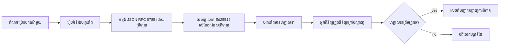
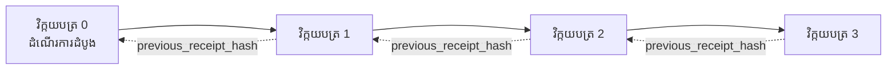

[សូមមើលវីដេអូមេរៀន៖ ការសន្តិសុខភ្នាក់ងារបញ្ញាសិប្បនិម្មិតជាមួយវិញ្ញាបនប័ណ្ណគណនាឌីជីថល](https://youtu.be/PLACEHOLDER_VIDEO_ID)

> _(វីដេអូមេរៀន និងរូបថតតំណាងនឹងត្រូវបន្ថែមដោយក្រុមមាតិកាជាក្រុម Microsoft បន្ទាប់ពីការច្រកចូល ប្រកបដោយគោលបំណងផ្គូផ្គងរបស់មេរៀនទី ១៤/១៥)_

# ការសន្តិសុខភ្នាក់ងារបញ្ញាសិប្បនិម្មិតជាមួយវិញ្ញាបនប័ណ្ណគណនាឌីជីថល

## ពីយ៉ាងដំបូង

មេរៀននេះនឹងគ្របដណ្តប់ដូចខាងក្រោម៖

- ហេតុអ្វីបានជាតាមដានបញ្ជីសម្រាប់ភ្នាក់ងារបញ្ញាសិប្បនិម្មិតមានសារៈសំខាន់សម្រាប់ការអនុវត្តតាមបទបញ្ជា ការត្រួតពិនិត្យកំហុស និងការជឿទុកចិត្ត។
- វិញ្ញាបនប័ណ្ណគណនាឌីជីថលជាអ្វី និងអ្វីដែលវាផ្ទាល់ខ្លួនពីបន្ទាត់កំណត់ហេតុដែលមិនបានចុះហត្ថលេខា។
- របៀបបង្កើតវិញ្ញាបនប័ណ្ណចុះហត្ថលេខាសម្រាប់ការហៅឧបករណ៍របស់ភ្នាក់ងារជា Python ធម្មតា។
- របៀបផ្ទៀងផ្ទាត់វិញ្ញាបនប័ណ្ណក្រៅបណ្ដាញ និងរកឃើញការបំភ្លេច។
- របៀបភ្ជាប់វិញ្ញាបនប័ណ្ណឲ្យបង្កើតខ្សែខ្សាប់ដូច្នេះការដកចេញឬប្តូរតម្កល់វិញ្ញាបនប័ណ្ណមួយនឹងបំបែកខ្សែខ្សាប់។
- អ្វីដែលវិញ្ញាបនប័ណ្ណបញ្ជាក់ និងអ្វីដែលវាមិនបញ្ជាក់យ៉ាងច្បាស់។

## គោលបំណងរៀន

បន្ទាប់ពីបញ្ចប់មេរៀននេះ អ្នកនឹងស្គាល់របៀប៖

- កំណត់របៀបបរាជ័យដែលជំរុញឲ្យមានការបញ្ជាក់ប្រភពគណនាឌីជីថលសម្រាប់សកម្មភាពភ្នាក់ងារ។
- បង្កើតវិញ្ញាបនប័ណ្ណចុះហត្ថលេខា Ed25519 លើទិន្នន័យ JSON អក្សរសញ្ញាដូចគ្នា។
- ផ្ទៀងផ្ទាត់វិញ្ញាបនប័ណ្ណដោយឯករាជ្យដោយប្រើសោសាធារណៈរបស់អ្នកចុះហត្ថលេខា។
- ការរកឃើញការបំភ្លេចដោយបន្ទាប់បន្សំការផ្ទៀងផ្ទាត់ឡើងវិញលើវិញ្ញាបនប័ណ្ណដែលបានកែបំភ្លេច។
- បង្កើតជាលំដាប់ខ្សែសង្វាក់នៃវិញ្ញាបនប័ណ្ណ និងពន្យល់ថាហេតុអ្វីដែលខ្សែសង្វាក់មានសារៈសំខាន់។
- ទទួលស្គាល់រឹងបន្ទាត់ពីអ្វីដែលវិញ្ញាបនប័ណ្ណបញ្ជាក់ (ការត្រូវបង់ ការស្ថិរភាព លំដាប់) និងអ្វីដែលវាមិនបញ្ជាក់ (ភាពត្រឹមត្រូវនៃសកម្មភាព សុពលភាពនៃគោលនយោបាយ)។

## បញ្ហា៖ របាយការណ៍តាមដានភ្នាក់ងាររបស់អ្នក

សូមគំនិតថាអ្នកបានបញ្ចេញភ្នាក់ងារបញ្ញាសិប្បនិម្មិតមួយសម្រាប់ Contoso Travel។ ភ្នាក់ងារនោះអានសំណើរបស់អតិថិជនហើយហៅ API អាកាសចរណ៍ដើម្បីស្វែងរកជម្រើស ហើយធ្វើការកក់កៅអីទាំងអស់ក្នុងឈុតឈររបស់អតិថិជន។ ក្នុងត្រីមាសចុងក្រោយនេះ ភ្នាក់ងារបានដំណើរការការកក់ ៥០,០០០ ដង។

ថ្ងៃនេះមានអ្នកត្រួតពិនិត្យមកដល់។ ពួកគេទាន់សំណួរងាយៗ៖ "បង្ហាញអ្វីដែលភ្នាក់ងាររបស់អ្នកបានធ្វើ។"

អ្នកឲ្យអ្នកត្រួតពិនិត្យឯកសារកំណត់ហេតុរបស់អ្នក។ អ្នកត្រួតពិនិត្យមើលហើយសួរជាសំណួរលំបាកជាង៖ "តើធ្វើដូចម្តេចដែលខ្ញុំដឹងថាកំណត់ហេតុទាំងនេះមិនត្រូវបានកែប្រែ?"

នេះជាបញ្ហារបាយការណ៍តាមដាន។ ការដាក់ឲ្យដំណើរការភ្នាក់ងារច្រើននៅថ្ងៃនេះអាស្រ័យលើ៖

- **កំណត់ហេតុកម្មវិធី**៖ សរសេរដោយភ្នាក់ងារផ្ទាល់ អាចកែប្រែបានដោយនរណាម្នាក់ដែលចូលប្រើប្រព័ន្ធគ្រប់គ្រងឯកសារ។
- **សេវាកម្មកំណត់ហេតុពពក**៖ មានភាពច្បាស់លាស់នៃការបំភ្លេចនៅលើកម្រិតវេទិកា ប៉ុន្តែនៅតែត្រូវការឲ្យអ្នកត្រួតពិនិត្យជឿលើអ្នកបង្កើតវេទិកា។
- **កំណត់ហេតុប្រតិបត្តិការទិន្នន័យ**៖ សមរម្យសម្រាប់ការផ្លាស់ប្ដូរទិន្នន័យ ប៉ុន្តែមិនសមស្របសម្រាប់ការហៅឧបករណ៍ផ្សេងៗ។

គេមិនអាចឆ្លើយសំណួររបស់អ្នកត្រួតពិនិត្យដោយគ្មានការជឿលើនរណាម្នាក់ចាប់ពីអ្នកផ្ទាល់ អ្នកផ្គត់ផ្គង់ពពក ឬអ្នកផ្គត់ផ្គង់ទិន្នន័យទេ។ សម្រាប់ការប្រើប្រាស់ក្នុងភាគីផ្ទៃក្នុង ការជឿលើនេះអាចទទួលយកបាន។ សម្រាប់ការងារដែលគ្រប់គ្រងដោយបទបញ្ញត្តិ (ហិរញ្ញវត្ថុ សុខាភិបាល ឬអ្វីមួយដែលជាប់ក្នុងច្បាប់ EU AI Act) វាមិនទាន់រឹតត្បិតនោះទេ។

វិញ្ញាបនប័ណ្ណគណនាឌីជីថលដោះស្រាយបញ្ហានេះដោយធ្វើឲ្យសកម្មភាពនីមួយៗរបស់ភ្នាក់ងារអាចផ្ទៀងផ្ទាត់ដោយឯករាជ្យបាន។ អ្នកត្រួតពិនិត្យមិនចាំបាច់ជឿលើអ្នកទេ។ ពួកគេចាំបាច់តែសោសាធារណៈរបស់អ្នក និងវិញ្ញាបនប័ណ្ណផ្ទាល់។

## វិញ្ញាបនប័ណ្ណគណនាឌីជីថលជាអ្វី?

វិញ្ញាបនប័ណ្ណគឺជាអ объекта JSON ដែលកត់ត្រាអ្វីដែលភ្នាក់ងារបានធ្វើ ហើយមានហត្ថលេខាឌីជីថល។


```mermaid
flowchart LR
    A[តំណក់ប្រើឧបករណ៍មួយ] --> B[រៀបចំទំរង់បង្កាន់ដៃ]
    B --> C[ចម្លង JSON RFC 8785 ដោយត្រឹមត្រូវ]
    C --> E[ចុះហត្ថលេខា Ed25519 លើបៃតុងដែលត្រឹមត្រូវ]
    E --> F[បង្កាន់ដៃមានហត្ថលេខា]
    F --> G[អ្នកពិនិត្យត្រួតពិនិត្យក្រៅបណ្តាញ]
    G --> H{ហត្ថលេខាត្រឹមត្រូវទេ?}
    H -- yes --> I[សេចក្ដីបញ្ជាក់បង្ហាញការបំពាន]
    H -- no --> J[បដិសេធបង្កាន់ដៃ]
```

វិញ្ញាបនប័ណ្ណតូចបំផុតមានរាងដូចនេះ៖

```json
{
  "type": "agent.tool_call.v1",
  "agent_id": "contoso-travel-bot",
  "tool_name": "lookup_flights",
  "tool_args_hash": "sha256:a3f9c1...",
  "result_hash": "sha256:7b2e1d...",
  "policy_id": "contoso-travel-policy-v3",
  "timestamp": "2026-04-25T14:30:00Z",
  "sequence": 47,
  "previous_receipt_hash": "sha256:9d4e6a...",
  "signature": {
    "alg": "EdDSA",
    "sig": "c5af83...",
    "public_key": "8f3b2c..."
  }
}
```

មានលក្ខណៈបីដែលធ្វើការងារ៖

1. **ហត្ថលេខា**។ វិញ្ញាបនប័ណ្ណត្រូវបានចុះហត្ថលេខារបស់ទីផ្សារភ្នាក់ងារដោយប្រើសោឯកជន Ed25519។ នរណាមួយដែលមានសោសាធារណៈដែលផ្គូផ្គងអាចផ្ទៀងផ្ទាត់ហត្ថលេខាបានក្រៅបណ្ដាញ។ ការបំភ្លេចណាមួយលើវាលណាមួយនឹងធ្វើឲ្យហត្ថលេខាវិលវល់។

2. **ការ encode តាមប្រភេទ canonical**។ មុនពេលចុះហត្ថលេខា វិញ្ញាបនប័ណ្ណត្រូវបានស៊េរីឡាយដោយប្រើ JSON Canonicalization Scheme (JCS, RFC 8785)។ វានាំឲ្យកម្មវិធីពីរដែលផលិតវិញ្ញាបនប័ណ្ណដូចគ្នាផលិតចេញជាស៊េរីយ៉ាងដូចគ្នាជាក់ស្តែង។ បើគ្មានការប្រើផែនការតម្រៀប canonical នោះកម្មវិធី JSON ផ្សេងៗនឹងផលិតហត្ថលេខាផ្សេងៗសម្រាប់មាតិកាដូចគ្នា។

3. **ខ្សែខ្សាប់ hash**។ វាល `previous_receipt_hash` ភ្ជាប់វិញ្ញាបនប័ណ្ណនីមួយៗជាមួយវិញ្ញាបនប័ណ្ណមុន។ ការដកចេញឬប្តូរតម្កល់វិញ្ញាបនប័ណ្ណមួយនឹងបំបែកវិញ្ញាបនប័ណ្ណទាំងអស់បន្ទាប់មក។ ការបំភ្លេចក្លាយជារឿងច្បាស់លាស់នៅលើកម្រិតខ្សែខ្សាប់ ទោះបីជាការចូលទៅក្នុងហត្ថលេខាមិនបានស៊ើបអង្កេតក៏ដោយ។

រាងតម្លើងលក្ខណៈទាំងនេះផ្តល់នូវតូនុភាពបី៖

- **ការទទួលស្គាល់**៖ សោនេះបានចុះហត្ថលេខាលើមាតិកានេះ។
- **ស្ថិរភាព**៖ មាតិកានេះមិនបានផ្លាស់ប្ដូរពីពេលបានចុះហត្ថលេខា។
- **លំដាប់**៖ វិញ្ញាបនប័ណ្ណនេះបានមកក្រោយវិញ្ញាបនប័ណ្ណនោះនៅក្នុងខ្សែខ្សាប់។

## ការបង្កើតវិញ្ញាបនប័ណ្ណក្នុង Python

អ្នកមិនចាំបាច់ប្រើបណ្ណាល័យពិសេសណាមួយដើម្បីបង្កើតវិញ្ញាបនប័ណ្ណបានឡើយ។ គ្រឹះវិទ្យាគណនាឌីជីថលមានផ្ទុកច្រើន ហើយតុល្យភាពកូដគឺជាចំនួនបន្ទាត់ Python ពីរភាគពីរដែរតែប៉ុណ្ណោះ។

ការហាត់ប្រាណដៃនៅក្នុង `code_samples/18-signed-receipts.ipynb` នាំអ្នកឆ្លងកាត់លំដាប់ពេញលេញ។ សង្ខេប៖

```python
import json
import hashlib
import base64
from nacl import signing
from jcs import canonicalize  # JSON កំណត់ត្រា RFC 8785

def b64url_nopad(data: bytes) -> str:
    return base64.urlsafe_b64encode(data).decode("ascii").rstrip("=")

def sha256_canonical(obj) -> str:
    """SHA-256 of a Python object's JCS-canonical JSON form."""
    return f"sha256:{hashlib.sha256(canonicalize(obj)).hexdigest()}"

# បង្កើត ឬផ្ទុកបញ្ចូលkey ចុះហត្ថលេខា (ក្នុងការផលិត, ស្តុកនៅក្នុងគ្រឹះសកម្ម key vault)
signing_key = signing.SigningKey.generate()
verify_key = signing_key.verify_key

# បង្កើត payload របស់បង្កាន់ដៃ (មិនទាន់មានហត្ថលេខា)
tool_args = {"origin": "SYD", "destination": "LAX"}
tool_result = [{"flight": "QF11", "price": 1850, "stops": 0}]

payload = {
    "type": "agent.tool_call.v1",
    "agent_id": "contoso-travel-bot",
    "tool_name": "lookup_flights",
    "tool_args_hash": sha256_canonical(tool_args),
    "result_hash": sha256_canonical(tool_result),
    "policy_id": "contoso-travel-policy-v3",
    "timestamp": "2026-04-25T14:30:00Z",
    "sequence": 0,
    "previous_receipt_hash": None,
}

# កំណត់តាម canonical ហើយចុះហត្ថលេខាលើ bytes JCS ដោយផ្ទាល់។ PureEdDSA ធ្វើ hashing ខាងក្នុង។
canonical_bytes = canonicalize(payload)
signature_bytes = signing_key.sign(canonical_bytes).signature

# ដាក់ភ្ជាប់វត្ថុហត្ថលេខាដែលមានរចនាសម្ព័ន្ធ។
receipt = {
    **payload,
    "signature": {
        "alg": "EdDSA",
        "sig": b64url_nopad(signature_bytes),
        "public_key": b64url_nopad(bytes(verify_key)),
    },
}
```

នេះគឺជាច្រកចេញចូលទាំងមូល សកម្មភាពក្នុងសៀវភៅចំណាំបញ្ជាក់គ្រប់ជំហាន។

## ការផ្ទៀងផ្ទាត់វិញ្ញាបនប័ណ្ណ និងរកឃើញការបំភ្លេច

ការផ្ទៀងផ្ទាត់ជាសកម្មភាពផ្ទុយគ្នា៖

```python
import base64
import hashlib
from nacl import signing
from nacl.exceptions import BadSignatureError
from jcs import canonicalize

def b64url_decode(s: str) -> bytes:
    padding = "=" * ((4 - len(s) % 4) % 4)
    return base64.urlsafe_b64decode(s + padding)

def verify_receipt(receipt: dict) -> bool:
    # ហត្ថលេខាគឺជាអ객្យកម្មដែលមានរចនាសម្ព័ន្ធ៖ {"alg", "sig", "public_key"} ។
    sig_obj = receipt.get("signature")
    if not sig_obj or sig_obj.get("alg") != "EdDSA":
        return False

    # ស្ដារវិញ payload ដែលត្រូវបានហត្ថលេខាជាក់លាក់ (គ្រប់យ៉ាងលើកលែងតែហត្ថលេខា) ។
    payload = {k: v for k, v in receipt.items() if k != "signature"}

    canonical_bytes = canonicalize(payload)

    try:
        verify_key = signing.VerifyKey(b64url_decode(sig_obj["public_key"]))
        verify_key.verify(canonical_bytes, b64url_decode(sig_obj["sig"]))
        return True
    except BadSignatureError:
        return False
```

មុខងារនេះយកវិញ្ញាបនប័ណ្ណមកហើយបញ្ជូនតម្លៃ `True` ប្រសិនបើហត្ថលេខាត្រឹមត្រូវ, `False` ផ្ទុយពីនេះ។ តែងតែគ្មានការហៅបណ្ដាញ អត់លើកទឹកចិត្តសេវា និងមិនចាំបាច់ជឿលើភាគីទីបី។

ដើម្បីមើលការរកឃើញការបំភ្លេចមានសកម្មភាពនៅក្នុងសៀវភៅចំណាំ៖

1. បង្កើតវិញ្ញាបនប័ណ្ណត្រឹមត្រូវ ហើយបញ្ជាក់ថាវាអាចបញ្ចប់ការផ្ទៀងផ្ទាត់បាន។
2. កែប្រែបៃមួយនៅក្នុងវាល `tool_args_hash`។
3. បន្តបញ្ជារការផ្ទៀងផ្ទាត់ឡើងវិញ ហើយមើលឃើញការបរាជ័យ។

នេះជាបរិយាយជាក់ស្តែងថាជាពិតហើយដែលការបំភ្លេចនៅលើវិញ្ញាបនប័ណ្ណក៏សំខាន់ ណាមួយក៏បំផ្លាញហត្ថលេខាពីភ្លាម។

## ការបង្កើតខ្សែខ្សាប់វិញ្ញាបនប័ណ្ណសម្រាប់ភ្នាក់ងារពហុជំហាន

វិញ្ញាបនប័ណ្ណចុះហត្ថលេខាមួយការពារសកម្មភាពមួយ។ ខ្សែខ្សាប់វិញ្ញាបនប័ណ្ណការពារកាលវិភាគខណៈ។


```mermaid
flowchart LR
    R0[វិក្កយបត្រ 0<br/>ដំណើរការដំបូង] --> R1[វិក្កយបត្រ 1]
    R1 --> R2[វិក្កយបត្រ 2]
    R2 --> R3[វិក្កយបត្រ 3]
    R1 -. previous_receipt_hash .-> R0
    R2 -. previous_receipt_hash .-> R1
    R3 -. previous_receipt_hash .-> R2
```

វិញ្ញាបនប័ណ្ណនីមួយៗកត់ត្រាអាចម៍ hash នៃវិញ្ញាបនប័ណ្ណមុនវា។ ដើម្បីដកវិញ្ញាបនប័ណ្ណលេខ ២ ដោយស្ងាត់ៗ អ្នកចោរកូដត្រូវតែ៖

- កែប្រែវាល `previous_receipt_hash` ក្នុងវិញ្ញាបនប័ណ្ណលេខ ៣ (បំបែកហត្ថលេខារ ៣) ឬ
- ទិញហត្ថលេខាថ្មីលើវិញ្ញាបនប័ណ្ណលេខ ៣ ដែលបានកែប្រែ (ត្រូវការសោឯកជនរបស់ភ្នាក់ងារ)។

ប្រសិនបើសោឯកជននៅក្នុងហាវ៉ែរ គីវ៉ាល់ ហើយអ្នកផ្សាយសោសាធារណៈជាមួយនឹងវិញ្ញាបនប័ណ្ណនីមួយៗ គឺគ្មានវិធានការរងគ្រោះណាមួយដែលអាចធ្វើបានដោយគ្មានការរកឃើញ។

សៀវភៅចំណាំបញ្ជាក់៖

1. ការបង្កើតខ្សែ ខ្សាប់នៃវិញ្ញាបនប័ណ្ណបី។
2. ផ្ទៀងផ្ទាត់ថាវាល `previous_receipt_hash` ក្នុងវិញ្ញាបនប័ណ្ណនីមួយៗត្រូវនិងមក hash ថ្មីនៃវិញ្ញាបនប័ណ្ណមុន។
3. កែប្រែវិញ្ញាបនប័ណ្ណមួយនៅកណ្តាលខ្សែ ហើយមើលឃើញខ្សែខ្សាប់បំបែកនៅកន្លែងនោះ។

នេះជារៀបចំរបាយការណ៍តាមដានដែលអ្នកត្រួតពិនិត្យខាងក្រៅអាចផ្ទៀងផ្ទាត់ដោយគ្មានការជឿលើអ្នក។

## អ្វីដែលវិញ្ញាបនប័ណ្ណបញ្ជាក់ (និងអ្វីដែលវាមិនបញ្ជាក់)

នេះជាផ្នែកសំខាន់បំផុតនៃមេរៀននេះ។ វិញ្ញាបនប័ណ្ណមានអំណាច ប៉ុន្តែអំណាចរបស់វាត្រូវបានកំណត់។

**វិញ្ញាបនប័ណ្ណបញ្ជាក់បីអ្វី៖**

1. **ការទទួលស្គាល់**៖ សោជាក់លាក់បានចុះហត្ថលេខាលើពayload ជាក់លាក់មួយ។
2. **ស្ថិរភាព**៖ ពayload មិនបានផ្លាស់ប្ដូរពីពេលចុះហត្ថលេខា។
3. **លំដាប់**៖ វិញ្ញាបនប័ណ្ណនេះបានមកក្រោយវិញ្ញាបនប័ណ្ណនោះក្នុងខ្សែខ្សាប់ hash។

**វិញ្ញាបនប័ណ្ណមិនបញ្ជាក់៖**

1. **ភាពត្រឹមត្រូវ**៖ សកម្មភាពរបស់ភ្នាក់ងារមិនចាំបាច់ត្រឹមត្រូវទេ។ វិញ្ញាបនប័ណ្ណអាចត្រូវបានចុះសម្រាប់ចំម្លើយខុសខុសដូច្នេះដដែលដែលសម្រាប់ចំម្លើយត្រឹមត្រូវ។
2. **ការអនុវត្តតាមគោលនយោបាយ**៖ គោលនយោបាយដែលបានយោងក្នុង `policy_id` មិនបានវាយតម្លៃពិតប្រាកដ ឬថាគួរត្រូវបានអនុញ្ញាតឲ្យសកម្មភាពនេះ ប្រសិនបើបានពិនិត្យ។ វិញ្ញាបនប័ណ្ណកត់ត្រាអ្វីដែលបានអះអាង ប៉ុន្តែមិនមែនអ្វីដែលបានអនុវត្ត។
3. **អត្តសញ្ញាណលើសសោសម្រាប់ចុះហត្ថលេខា**៖ វិញ្ញាបនប័ណ្ណថា "សោនេះបានចុះហត្ថលេខាលើមាតិកានេះ" មិនថា "មនុស្សនេះបានអនុញ្ញាត" ទេ។ ការតភ្ជាប់សោនឹងអ្នក ឬអង្គការតម្រូវឲ្យមានហេតុការណ៍អត្តសញ្ញាណផ្សេងទៀត (កាតាបញ្ជី បញ្ជីសាធារណៈ)។
4. **ភាពពិតប្រាកដនៃទិន្នន័យបញ្ចូល**៖ ប្រសិនបើភ្នាក់ងារទទួលបានការលេងល្បិចនៃសំណើហើយអនុវត្ត សកម្មភាពនោះត្រូវបានកត់ត្រា ទោះយ៉ាងណាវិញ្ញាបនប័ណ្ណគឺជាការផ្ទៀងផ្ទាត់ក្រោយការត្រួតពិនិត្យបញ្ចូល មិនទាន់ជំនួសពូកែគ្រប់គ្រងម្ដងទេ។

កំណត់រឹងនេះមានសារៈសំខាន់ពីរប razloga៖

- វាប្រាប់អ្នកថាវិញ្ញាបនប័ណ្ណមានប្រយោជន៍ក្នុងការអាចត្រួតពិនិត្យ និងមានសក្ដានុពលបំភ្លេច ទោះបីនៅក្រៅសហគមន៍ក៏ដោយ។
- វាប្រាប់អ្នកថាអ្នកនៅត្រូវការថ្នាក់បន្ថែមផ្សេងទៀត៖ ការត្រួតពិនិត្យបញ្ចូល (មេរៀន ៦) ការអនុវត្តគោលនយោបាយ (បានបន្ថែមខ្លីខាងក្រោម) និងការគ្រប់គ្រងអត្តសញ្ញាណ (មិននៅក្នុងវិស័យនេះ)។

ការខ្វះខាតទូទៅគឺគិតថា "យើងមានវិញ្ញាបនប័ណ្ណ" មានន័យថា "យើងមានការគ្រប់គ្រង" ប៉ុន្តែវាមិនមែនទេ។ វិញ្ញាបនប័ណ្ណគឺជាគ្រឿងដាក់ជាតិ។ ការគ្រប់គ្រងគឺជាប្រព័ន្ធដែលអ្នកកសាងពីលើវា។

## ការបញ្ជាក់ថាមនុស្សមានការអនុម័តសកម្មភាពជាក់លាក់

ប្រធានបទលេខ ៣ ខាងលើមានតម្លៃគ្នាច្រើន៖ វិញ្ញាបនប័ណ្ណសកម្មភាពថា "សោនេះបានចុះហត្ថលេខាលើមាតិកានេះ" មិនធ្លាប់ថា "មនុស្សបានអនុញ្ញាត" ទេ។ សម្រាប់សកម្មភាពហានិភ័យខ្ពស់ (ការសងប្រាក់ ការលុប ការផ្ទេរប្រាក់តាមខ្សែ) ស៊ុមគ្រប់គ្រងត្រូវការពាក្យនេះ ជាក់លាក់ ហើយវាអាចផលិតបានដោយគ្រឹះវិទ្យាដដែលដែលអ្នកបានបង្កើតក្នុងមេរៀននេះ។

សៀវភៅចំណាំបន្ទាប់ `code_samples/human-authorization-receipts.ipynb` បន្ថែមប្រភេទវិញ្ញាបនប័ណ្ណទីពីរ `human.approval.v1` ក្នុងរាងក្រឡាច្រវ៉ាក់ដូចគ្នានឹងវិញ្ញាបនប័ណ្ណរបស់មេរៀន (payload ប្រភេទដែលចុះហត្ថលេខាជាមួយ Ed25519 លើអក្សរសញ្ញា JCS canonical របស់វា ជាមួយវត្ថុ `signature` នៅពីក្រៅអក្សរចុះហត្ថលេខា)។ អ្នកអនុម័តមានឈ្មោះចុះហត្ថលេខាដល់សកម្មភាព canonical ពេញលេញ និង digest របស់វាមុនពេលអនុវត្ត។ វិញ្ញាបនប័ណ្ណសកម្មភាពភ្នាក់ងារនាំបញ្ជាទៅ digest សកម្មភាពដូចគ្នា និង `parent_approval_ref` ដែលជាអាចម៍ `receipt_hash` នៃការអនុម័ត។ របៀបសហប្រតិបត្តិការ `verify_chain` សម្រាប់ឯកសារទាំងពីរនៅក្រោមក្រុម keys ចំនួនពីរផ្សេងគ្នា (keys អ្នកអនុម័តជាមួយ keys ភ្នាក់ងារ) ដូច្នេះផ្លូវកូដត្រូវចែករំលែក ប៉ុន្តែអំណាចមិនដែលត្រូវដេកជាមួយគ្នា។

គុណលក្ខណៈដែលបានទទួលបាននេះ ត្រូវបានបញ្ជាក់យ៉ាងម៉ត់ចត់៖ *មនុស្សបានអនុម័តសកម្មភាពជាក់លាក់នេះ ហើយភ្នាក់ងារបានអនុវត្តសកម្មភាពដែលបានអនុម័តនេះតែប៉ុណ្ណោះ*។ ការបដិសេធនៅក្នុងសៀវភៅចំណាំនេះជាគរុកោសល្យអ្នកបង្រៀនដែលធ្វើឲ្យគុណលក្ខណៈនេះពិតជារួមមិនមែនគ្រាន់តែប្រកាសថា។

- តម្លើងបុរាណ៖ ការបំភ្លេច ការបញ្ចូលបច្ចេកទេស ការរោទ៍ឡើងវិញ ការចុះហត្ថលេខាខុសនៅក្នុងផ្នែកណាមួយ ការបញ្ចូលមិនបានទ្រង់ទ្រាយ;
- **អំណាចចាស់**៖ អត្តសញ្ញាណដែលនៅតែផ្ទៀងផ្ទាត់ តែបានបដិសេធ ព្រោះកំណែគោលនយោបាយបានផ្លាស់ប្ដូរ សោអ្នកអនុម័តត្រូវបានបំបែកក្នុងបញ្ជីគ្រប់គ្រង ឬការអនុម័តបានផុតកំណត់មុនពេលអនុវត្ត។
- **ការ​ជំនួស digest**៖ វិញ្ញាបនប័ណ្ណសកម្មភាពចុះហត្ថលេខាត្រឹមត្រូវដែលចង់បញ្ជាក់អំពីការអនុម័តពិតប្រាកដដែលភ្ជាប់ជាមួយសកម្មភាព canonical ផ្សេង។ 

ការបរាជ័យនីមួយៗបដិសេធដោយហេតុផលខុសគ្នា ដូច្នេះអ្នកត្រួតពិនិត្យអាចមើលឃើញថាអំណាចបានចាស់ដំណើរឬសកម្មភាពបានផ្លាស់ប្ដូរ។ ច្បាប់មេរៀន៖ ការអនុម័តចុះហត្ថលេខាមិនមែនជាអំណាចដោយខ្លួនឯងទេ។ អំណាចមានផងដែរ បើករណីវិញ្ញាបនប័ណ្ណទាំងពីរអនុវត្តលើសកម្មភាព canonical ដូចគ្នានៅពេលអនុវត្ត។ វិញ្ញាបនប័ណ្ណអនុម័តមនុស្សគឺជារូបមន្តបង្រៀនដែលបានកំណត់ដោយមេរៀននេះ មិនមែនជាប្រភេទវិញ្ញាបនប័ណ្ណដែលបានកំណត់ដោយ `draft-farley-acta-signed-receipts` ទេ។

## ឯកសារអនុវត្តផលិតកម្ម

កូដ Python ក្នុងមេរៀននេះបានរៀបចំបន្តិចបន្តួច ដើម្បីឲ្យអ្នកអាចអានរាល់បន្ទាត់និងយល់ពីអ្វីកំពុងកើតឡើង។ ក្នុងផលិតកម្ម អ្នកមានពីរជម្រើស៖

1. **សង់ដោយផ្ទាល់លើគ្រឹះវិទ្យាគណនាឌីជីថល**។ បន្ទាត់ ៥០ ដែលអ្នកបានឃើញខាងលើគ្រប់គ្រាន់សម្រាប់ករណីប្រើប្រាស់ជាច្រើន។ PyNaCl (Ed25519) និង កញ្ចប់ `jcs` (JSON canonical) ជាបណ្ណាល័យបានថែរក្សាប្រសើរនិងបានត្រួតពិនិត្យ។

2. **ប្រើបណ្ណាល័យផលិតកម្មសម្រាប់វិញ្ញាបនប័ណ្ណ**។ គម្រោងចេញផ្សាយជាច្រើនអនុវត្តលំនាំដដែលជាមួយមុខងារបន្ថែមៗ (ការបង្វិលសោ ហត្ថពិចារណាក្រុម សំណុំ JWK ការរួមបញ្ចូលជាមួយម៉ាស៊ីនគោលនយោបាយ)៖
   - ច្រកចេញចូលចុះហត្ថលេខាអនុវត្ត LCS និងលក្ខណៈប័ណ្ណជារួមក្នុង Draft IETF Internet-Draft ([`draft-farley-acta-signed-receipts`](https://datatracker.ietf.org/doc/draft-farley-acta-signed-receipts/), ផ្លូវកំណែ 02)។ វិញ្ញាបនប័ណ្ណបណ្តាលការអប់រំរបស់មេរៀននេះខុសពីបណ្ដូល `{payload, signature}` របស់ draft ហើយមិនត្រូវបានសម្គាល់ថាជាការអនុវត្តត្រឹមត្រូវ។ Draft ផ្សព្វផ្សាយសំណុំនៃការប្រកួតប្រជែងសម្រាប់អនុវត្តផលិតផលដែលត្រូវលក្ខណៈ ([agent-governance-testvectors](https://github.com/ScopeBlind/agent-governance-testvectors))។
   - ជាង Microsoft Agent Governance Toolkit បង្កើតវិញ្ញាបនប័ណ្ណជាមួយសេចក្ដីសម្រេចគោលនយោបាយនៅទឹកដី Cedar; សូមមើលមេរៀន ៣៣ នៅក្នុងឃ្លាំងនោះសម្រាប់ឧទាហរណ៍ពីដើមដល់ចប់។
   - កញ្ចប់ `protect-mcp` (npm) និង `@veritasacta/verify` (npm) ផ្តល់មុខងារអនុវត្តវិញ្ញាបនប័ណ្ណចុះហត្ថលេខា និងទិន្នន័យធ្វើការពិនិត្យក្រៅបណ្តាញក្នុងមូលដ្ឋាន Node ច្បាស់។ រួមមានការចងគ្នានូវ MCP ដែលមានការត្រួតពិនិត្យការបំភ្លេច, រីឯការបាញ់ពាក្យព្រមទាំងជាលទ្ធផលជួយសកម្មភាពណាមួយទំពារ approval receipt ដែលBOUNDទៅ digest សកម្មភាព (ដែលគាំទ្រដោយ WebAuthn ក្នុងដំណើរឯកជន) ជាលំនាំដូចគ្នានឹងសៀវភៅចំណាំអនុញ្ញាតមនុស្សខាងលើ។
   - **[nobulex](https://github.com/arian-gogani/nobulex)** Python SDK (`pip install nobulex`) ផ្តល់លំនាំចុះហត្ថលេខា Ed25519 + JCS ដូចគ្នា ក្នុង Python ជាមួយការរួមបញ្ចូល LangChain និង CrewAI រួមមានវ៉ិចទ័រប្រឡងចំលែក និងការកំណត់ផែនទីគោលការណ៍តាមរយៈ [OWASP PR #2210](https://github.com/OWASP/CheatSheetSeries/pull/2210)។

ការជ្រើសរើសរវាងការសរសេរពីចាប់ផ្តើមផ្ទាល់ និងប្រើបណ្ណាល័យ ដូចជាការជ្រើសរើសរវាងសរសេរបណ្ណាល័យ JWT របស់អ្នកផ្ទាល់ និងប្រើបណ្ណាល័យដែលបានរៀបចំរួច៖ ទាំងពីរពិតប្រាកដ; បណ្ណាល័យជួយសន្សំពេលវេលា និងកាត់បន្ថយផ្ទៃស្វែងរក តែការសរសេរពីបដិសេដំណឹងអ្នកត្រូវយល់គ្រប់គ្រាប់ផ្នែក។ មេរៀននេះបង្រៀនផ្លូវលើកដំបូង ដើម្បីអ្នកមានមូលដ្ឋានសម្រាប់ជម្រើសទាំងពីរ។

## ការត្រួតពិនិត្យចំណេះដឹង

សាកល្បងភាពយល់របស់អ្នកមុនពេលចូរបន្តទៅលំហាត់អនុវត្ត។

**១. វិញ្ញាបនប័ណ្ណត្រូវបានចុះហត្ថលេខាដោយសោឯកជន Ed25519 របស់ភ្នាក់ងារ។ អ្នកត្រួតពិនិត្យមានតែសោសាធារណៈតែប៉ុណ្ណោះ។ តើអ្នកត្រួតពិនិត្យអាចផ្ទៀងផ្ទាត់វិញ្ញាបនប័ណ្ណក្រៅបណ្ដាញបានទេ?**

<details>
<summary>ចម្លើយ</summary>

បាទ/ចាស។ ការផ្ទៀងផ្ទាត់ Ed25519 ត្រូវការតែសោសាធារណៈ និងអក្សរហត្ថលេខាទេ។ គ្មានការហៅបណ្តាញ អត់ការគាំទ្រប្រព័ន្ធសេវា។ នេះជាកំណត់ត្រាដែលធ្វើឲ្យវិញ្ញាបនប័ណ្ណមានប្រយោជន៍នៅក្នុងបរិបទដែលខ្វះបណ្ដាញ ភាគីច្រើន ឬការត្រួតពិនិត្យដែលមានការជឿទាប។
</details>

**២. អ្នកវាយប្រហារកែប្រែវាល `policy_id` នៃវិញ្ញាបនប័ណ្ណ ដើម្បីអះអាងថាវាត្រូវបានគ្រប់គ្រងដោយគោលនយោបាយមានសិទ្ធិបញ្ចេញច្រើនជាង។ ហត្ថលេខាត្រូវបានចុះលើ payload ដើម។ តើមានអ្វីកើតឡើងនៅពេលផ្ទៀងផ្ទាត់?**

<details>
<summary>ចម្លើយ</summary>


ការបញ្ជាក់មិនជោគជ័យទេ។ ហត្ថលេខាត្រូវបានគណនាលើបៃកាណូនិចនៃពាក្យផ្ទុកដើម; ការផ្លាស់ប្តូរពីសំណុំផ fields មួយណាមួយធ្វើឱ្យបៃកាណល់ទាំងនោះផ្លាស់ប្តូរ ហើយនេះធ្វើឱ្យហត្ថលេខាមិនមានសុពលភាព។ អ្នកវាយប្រហារត្រូវការខែកូន្យសម្ងាត់ដើម្បីផលិតហត្ថលេខាដែលមានសុពលភាពថ្មីមួយ ដែលពួកគេគ្មាននោះទេ។
</details>

**3. ហេតុអ្វីបានជា ការទទួលបត្រមាន `tool_args_hash` និង `result_hash` ជំនួស arguments និងលទ្ធផលដើម?**

<details>
<summary>ចម្លើយ</summary>

មានពីរហេតុផល។ ដំបូង ការទទួលបត្រអាចត្រូវបានរក្សាទុក ឬ ផ្ទេរនៅបរិយាកាសដែលការរសាត់មាតិកាដើម (PII, ទិន្នន័យអាជីវកម្ម) ជាបញ្ហា។ ការប្រើ hash រក្សាទុកការទទួលបត្រឲ្យតូច និង មាតិកាឲ្យឯកជន; អ្នកត្រួតពិនិត្យបញ្ជាក់ថា hash ឆ្លងកាត់នឹងចម្លងរបស់មាតិកាពិតប្រាកដដែលបានរក្សាទុកដោយឡែក។ ហើយទីពីរ hash មានទំហំថេរ; ការទទួលបត្រដែលមាន hash វាត្រូវបានកំណត់ទំហំ មិនថា inputs និង outputs ត្រូវបានធំធេងប៉ុណ្ណា។
</details>

**4. ផ្នែក `previous_receipt_hash` តភ្ជាប់ការទទួលបត្រនីមួយៗទៅការទទួលបត្រមុនមួយ។ ប្រសិនបើអ្នកវាយប្រហារដកការទទួលបត្រមួយចេញពីកណ្តាលខ្សែ តើអ្វីខ្លះដែលមិនមានសុពលភាព?**

<details>
<summary>ចម្លើយ</summary>

ការទទួលបត្រនីមួយៗដែលមកបន្ទាប់ពីការលុបចេញ។ ផ្នែក `previous_receipt_hash` របស់ពួកវាមិនត្រូវគ្នានឹងខ្សែពិតទេ (ព្រោះការទទួលដែលពួកវាជាប់នឹងវាមិនមានឡើយ ឬ ខ្សែឥឡូវបង្ហាញទៅនឹងបុត្រសាស្ត្រផ្សេង)។ ដើម្បីលាក់ការលុបចេញ អ្នកវាយប្រហារត្រូវចេញហត្ថលេខាឡើងវិញលើការទទួលបត្រដែលបានបន្ថែមក្រោយទាំងអស់ ដែលត្រូវការខែកូន្យសម្ងាត់។
</details>

**5. ការទទួលបត្រត្រូវបានផ្ទៀងផ្ទាត់យ៉ាងបានល្អ។ តើវាបញ្ជាក់ថា សកម្មភាពរបស់ភ្នាក់ងារត្រឹមត្រូវ ឬ សមរម្យជាមួយគោលនយោបាយ?**

<details>
<summary>ចម្លើយ</summary>

ទេ។ ការទទួលបត្រដែលមានសុពលភាពបញ្ជាក់បីរឿង៖ ការផ្ដល់អត្តសញ្ញាណ (key នេះបានហត្ថលេខាលើមាតិកានេះ), ភាពត្រឹមត្រូវ (មាតិកាមិនបានផ្លាស់ប្តូរ), និងលំដាប់ (ការទទួលនេះមកបន្ទាប់ការទទួលនោះ)។ វាមិនបញ្ជាក់ថាសកម្មភាពត្រឹមត្រូវទេ, គោលនយោបាយដែលបានរៀបឈ្មោះនៅ `policy_id` ត្រូវបានវាយតម្លៃពិតប្រាកដ, ឬភ្នាក់ងារបានគោរពគ្រប់ច្បាប់ទេ។ ការទទួលធ្វើឲ្យឥរិយាបថភ្នាក់ងារអាចត្រូវបានត្រួតពិនិត្យ តែក៏មិនចាំបាច់ត្រឹមត្រូវ។ នេះជារមណីយដ្ឋានសំខាន់បំផុតនៅក្នុងមេរៀន។
</details>

## លំហាត់អនុវត្ត

បើក `code_samples/18-signed-receipts.ipynb` ហើយបញ្ចប់ផ្នែកទាំងបួន៖

1. **ផ្នែក ១**៖ ហត្ថលេខាលើការទទួលជាលើកដំបូងរបស់អ្នក និងផ្ទៀងផ្ទាត់វា។
2. **ផ្នែក ២**៖ ច្រឡំការទទួល និងចាំមើលការបញ្ចៀសផ្ទៀងផ្ទាត់បរាជ័យ។
3. **ផ្នែក ៣**៖ សាងសង់ខ្សែការទទួលបីបន្ទាប់ និងផ្ទៀងផ្ទាត់ភាពត្រឹមត្រូវនៃខ្សែ។
4. **ផ្នែក ៤**៖ អនុវត្តគំរូនេះទៅភ្នាក់ងារដែលបានបង្កើតជាមួយ Microsoft Agent Framework៖ បិទកម្មហៅឧបករណ៍ក្នុងការហត្ថលេខាការទទួល បន្ទាប់មកផ្ទៀងផ្ទាត់ការទទួលដោយអត្តនោមិក។

**បញ្ហាជំនួយបន្ថែម ១៖** ពង្រីក schema ទទួលបត្រដោយការបន្ថែមវិស័យថ្មីមួយដែលអ្នកជ្រើសរើស (ឧ. លេខសម្គាល់សំណើសម្រាប់តាមដាន), បន្ទាន់សម័យលក្ខណៈភ្ជាប់ហត្ថលេខាជាមួយវា, ហើយបញ្ជាក់ថាការទទួលបត្របានឆ្លងកាត់ការផ្ទៀងផ្ទាត់វិញ។ បន្ទាប់មកកែប្រែវិស័យបន្ទាប់ពីហត្ថលេខា ហើយបញ្ជាក់ថាការផ្ទៀងផ្ទាត់បរាជ័យ។ នេះបង្ខំឲ្យអ្នកយល់ពីរបៀបដែលបៃនីមួយៗនៃការបំលែងកាណូនិចចូលរួមចំណែកក្នុងហត្ថលេខា។

**បញ្ហាជំនួយបន្ថែម ២៖** ប្រើ SHA-256 hash លើការទទួលពីររបស់អ្នក (ភ្ជាប់បៃកាណូនិចរបស់ពួកវាជាលំដាប់កំណត់) ហើយបញ្ចូល digest ដែលទទួលបានទៅជាវិស័យថ្មីនៅលើការទទួលទីបីមុនបញ្ចូលហត្ថលេខា។ ផ្ទៀងផ្ទាត់ថាការទទួលទាំងបីបន្តមានសុពលភាព។ អ្នកបានបង្កើតភស្តុតាងការបញ្ចូលជាការបុគ្គលម្នាក់ទេ៖ អ្នកណាម្នាក់កាន់ការទទួលទីបីអាចបញ្ជាក់ថាការទទួលពីរដើមមាននៅពេលវាហត្ថលេខា ដោយមិនចាំបាច់បញ្ជាក់មាតិកាពួកវា។ នេះជាគំរូដែលការទទួល selective-disclosure ប្រើប្រាស់នៅកម្រិត (ការប្តេជ្ញារ Merkle, RFC 6962)។

## សេចក្ដីសន្និដ្ឋាន

ការទទួលបត្របែបគ្រីបតូក្រាហ្វីស្តផ្តល់ឲ្យភ្នាក់ងារ AI មានផ្លូវត្រួតពិនិត្យដែលមានលក្ខណៈជា៖

- **អាចផ្ទៀងផ្ទាត់ដោយឯករាជ្យ**៖ អ្នកណាមួយដែលមាន key សាធារណៈអាចផ្ទៀងផ្ទាត់បាន ដោយគ្មានការ​ពឹងពាក់នឹងសេវាកម្ម។
- **ធ្វើឲ្យភ្លេចពន្លឿន**៖ ការផ្លាស់ប្តូរណាមួយ​ធ្វើឲ្យហត្ថលេខាមិនត្រឹមត្រូវ។
- **អាចពន្លងផ្ទុក**៖ ការទទួលគឺជា​ឯកសារ JSON តូចមួយ; អាចរក្សាទុក បញ្ជូន និងផ្ទៀងផ្ទាត់នៅគ្រប់ទីកន្លែង។
- **អនុលោមតាមស្តង់ដារ**៖ បង្កើតលើ Ed25519 (RFC 8032), JCS (RFC 8785), និង SHA-256, គ្រប់គ្រងគ្រឿងឧបករណ៍ដែលបានដាក់ជាសកល។

វាមិនជំនួសសម្រាប់ការត្រួតពិនិត្យបញ្ចូល, ការអនុវត្តគោលនយោបាយ, ឬរចនាសម្ព័ន្ធអត្តសញ្ញាណទេ។ វាជាផ្នែកមូលដ្ឋានសម្រាប់ស្តាតឡេរ៉ាទាំងនោះ។ នៅពេលអ្នកដាក់ភ្នាក់ងារចូលក្នុងការ​ប្រតិបត្តិការ​ដែលគ្រប់គ្រងដោយច្បាប់, លំហូរការងារលើកែម៉.organization, ឬនៅគ្រប់កន្លែងដែលបេក្ខជនពិនិត្យពីរ៉ាដក៏មិនអាចទុកចិត្តអ្នកបានទេ ការទទួលគឺជាវិធីធ្វើឲ្យផ្លូវត្រួតពិនិត្យមានភាពស្មោះត្រង់។

ចំណុចសំខាន់បំផុត៖ ការទទួលបត្របញ្ជាក់ថា នរណាបាននិយាយអ្វី និងពេលណា។ វាមិនបញ្ជាក់ថា អ្វីដែលបាននិយាយគឺពិត ឬត្រឹមត្រូវទេ។ រក្សាដំណាក់កាលនោះយ៉ាងតឹងរឹង។ វាជាការផ្ទៃខ្លួនរវាងប្រព័ន្ធដើមខ្លួនដែលស្មោះត្រង់ និងមួយដែលបញ្ឆោតបញ្ឆោយ។

## បញ្ជីត្រួតពិនិត្យសម្រាប់ផលិតកម្ម

នៅពេលអ្នកត្រៀមខ្លួនរៀនពីមេរៀននេះដើម្បីដាក់ភ្នាក់ងារហត្ថលេខាការទទួលនៅបរិយាកាសពិតប្រាកដ៖

- [ ] **ផ្លាស់ប្តូរខែកូន្យហត្ថលេខាពីកុំព្យូទ័រអ្នកអភិវឌ្ឍន៍។** ប្រើ Azure Key Vault, AWS KMS, ឬម៉ូទុលសុវត្ថិភាពរឹង។ ខែកូន្យសម្ងាត់ ដែលហត្ថលេខាការទទួលរបស់អ្នក មិនត្រូវបានរក្សាទុកក្នុងការគ្រប់គ្រងប្រភព ឬជាទព្រិតលើម៉ាស៊ីនកម្មវិធីអោយដឹងទេ។
- [ ] **បោះពុម្ពផ្សាយ key សាធារណៈសម្រាប់ផ្ទៀងផ្ទាត់។** អ្នកត្រួតពិនិត្យត្រូវការវា ដើម្បីផ្ទៀងផ្ទាត់ក្រៅបណ្តាញ។ គំរូគឺ JWK Set នៅ URL ដែលគេស្គាល់ល្អ (RFC 7517) ឧ. `https://your-org.example.com/.well-known/agent-keys.json`។
- [ ] **ភ្ជាប់ខ្សែហត្ថលេខាបរទេស។** ជាទៀងទាត់កត់សẳngខ្សែគាយក្បាលថ្មីទៅ log ភាពតែល្បះ (Sigstore Rekor, RFC 3161 timestamp authority, ឬប្រព័ន្ធធ្វើការផ្ទៃក្នុងទីពីរ) ដើម្បីឲ្យបុគ្គលក្រៅអាចបញ្ជាក់ថា "ខ្សែនេះមាននៅពេលនេះ"។
- [ ] **រក្សាទុកការទទួលដោយមិនអាចផ្លាស់ប្តូរ។** ការផ្ទុកក្នុងប្លុក Append-only (Azure Storage ជាមួយគោលការណ៍ភាពមិនប្រែប្រួល, AWS S3 Object Lock) រារពីការប្ដូរប្រវត្តិសាស្ត្ររបស់អង្គភាពខាងក្នុង។
- [ ] **សម្រេចចិត្តអំពីការផ្ទុករក្សាទុក។** ច្បាប់ថែរក្សាភាគច្រើនតម្រូវឲ្យរក្សាទុកជាឆ្នាំច្រើន។ គិតទុកថាការទទួលមានកំណើន (ការទទួលមួយប្រហែល ~ ៥០០ បៃ; ភ្នាក់ងារមានការហៅ ១០,០០០ ក្នុងមួយថ្ងៃ ផលិតប្រហែល ១.៨ ជីកាបៃក្នុងមួយឆ្នាំ)។
- [ ] **រាយការណ៍អំពីអ្វីដែលការទទួលមិនគ្រប់គ្រង។** ការទទួលបញ្ជាក់អត្តសញ្ញាណ, ភាពត្រឹមត្រូវ, និងលំដាប់។ បណ្ដុំដំណើរការរបស់អ្នកគួររាយបញ្ជីយ៉ាងច្បាស់ថា ត្រួតពិនិត្យបន្ថែមណាខ្លះ (ការផ្ទៀងបញ្ចូល, អនុវត្តគោលនយោបាយ, ការកំណត់កំណត់អតិថិជន, រចនាសម្ព័ន្ធអត្តសញ្ញាណ) ដែលស្ថិតនៅក្បែរប្រព័ន្ធការទទួលនៅក្នុងគោលការណ៍គ្រប់គ្រងរបស់អ្នក។

### មានសំណួរបន្ថែមអំពីការវាយតម្លៃភ្នាក់ងារ AI?

ចូលរួម [Microsoft Foundry Discord](https://aka.ms/ai-agents/discord) ដើម្បីជួបអ្នករៀនផ្សេងទៀត ចូលរួមម៉ោងការិយាល័យ និងទទួលការឆ្លើយសំណួរអំពី AI Agents របស់អ្នក។

## លើសពីមេរៀននេះ

មេរៀននេះគ្របដណ្តប់ការហត្ថលេខាការទទួលតែមួយ និងខ្សែជួរប្រើ hash។ គ្រឿងចម្បងដូចគ្នាអាចបង្កើតជាគំរូកម្រិតខ្ពស់ជាច្រើនដែលអ្នកអាចជួបប្រទៈនៅពេលផ្តល់សេវាកម្មគ្រប់គ្រងរបស់អ្នកកាន់តែបន្តរីកចម្រើន៖

- **ការបញ្ចេញជ្រើសរើស។** នៅពេលដែលវាលនៃការទទួលត្រូវបានប្រកាសដោយឯករាជ្យ (RFC 6962 បែប Merkle tree), អ្នកអាចបង្ហាញវាលជាក់លាក់ទៅអ្នកត្រួតពិនិត្យជាក់លាក់ ហើយបញ្ជាក់ថាព័ត៌មានផ្សេងទៀតមិនបានផ្លាស់ប្តូរដោយមិនបង្ហាញវា។ មានប្រយោជន៍នៅពេលបញ្ចូលទាំងផ្ទាល់ធំ (ដែលចង់បានភាពគ្រប់គ្រង) និងបទបញ្ជាការរក្សាទិន្នន័យតិច (ដូចជា GDPR ដែលចង់អោយអ្នកត្រួតពិនិត្យមើលតិចបំផុត)។
- **ការលុបចោលការទទួល។** ប្រសិនបើ key ហត្ថលេខាត្រូវបានគេចោល, អ្នកត្រូវការវិធីសាស្រ្តសម្គាល់គ្រប់ការទទួលដែលបានហត្ថលេខាដោយ key នោះថាត្រូវបានមិនទុកចិត្តចាប់ពីពេលណាមួយមក។ គំរូស្តង់ដា៖ key ហត្ថលេខាដែលមានអាយុកាលខ្លី បូកជាមួយបញ្ជីលុបផ្សព្វផ្សាយ, ឬ log ភាពតែល្បះជាមួយចំណាំលុបចោល។
- **ការទទួលដែលមានហត្ថលេខាបង្កប់ពីរ / ចែកបែក។** ការអនុវត្តខ្លះបំបែក payload ដែលបានហត្ថលេខាជាពីរផ្នែក មុនអនុវត្ត (`authorization_*`) និង បន្ទាប់អនុវត្ត (`result_*`) ជាមួយហត្ថលេខឯករាជ្យ ដែលមានប្រយោជន៍នៅពេលសេចក្ដីសម្រេចចិត្តអនុម័ត និងលទ្ធផលដែលបានកត់ត្រាបានផលិតដោយអត្ថិភាគផ្សេងគ្នា ឬ នៅពេលផ្សេងៗ។ នេះបន្ថែមលើទ្រង់ទ្រាយការទទួលដែលបានបង្រៀននៅក្នុងមេរៀននេះ។
- **ការបង្កើត payload ជាពហុជាតិ។** ការទទួលបិទចំហេះបៃណាមួយដែលអ្នកដាក់ក្នុង `result_hash`។ Payload នៅពិភពពិតជាញឹកញាប់មានមូលដ្ឋានជាច្រើនជាងលទ្ធផលហៅឧបករណ៍តែមួយ៖ ការត្រួតពិនិត្យមុនសេចក្ដីសម្រេចចិត្ត (ការព្យាករណ៍ម៉ូដែល, ជម្រើសដែលបានពិចារណា, ភស្តុតាង និងភាពពេញលេញរបស់វា, លំនាំហានិភ័យ, ខ្សែភាពរាយការណ៍, លទ្ធផលច្រក) អាចស្ថិតនៅក្នុង payload ដែលបានបិទសោដោយការទទួលតែមួយ។ នេះរក្សាទ្រង់ទ្រាយការទទួលឲ្យតិចបំផុត ខណៈដែលអនុញ្ញាតឲ្យ schema payload អភិវឌ្ឍទៅតាមដែនកំណត់។
- **ការផ្ទៀងផ្ទាត់ជាស្វ័យប្រវត្តិគ្នានៅលើសហការណ៍អនុវត្ត។** ការអនុវត្តឡែកពីគ្នាច្រើននៃទ្រង់ទ្រាយការទទួលដូចគ្នា (Python, TypeScript, Rust, Go) ផ្ទៀងផ្ទាត់នឹងវ៉ិកទ័រតេស្តរួមគ្នា។ ប្រសិនបើអ្នកសង់ការអនុវត្តផ្ទាល់ខ្លួន ការផ្ទៀងផ្ទាត់ជាមួយវ៉ិកទ័របោះផ្សាយ បញ្ជាក់ភាពឯកភាពនៃខ្សែទិន្នន័យ។
- **ការផ្លាស់ប្ដូរបន្ទាប់ពីម៉ាស៊ីនគណនាវិសាលភាព។** Ed25519 ត្រូវបានប្រើប្រាស់យ៉ាងទូលំទូលាយថ្ងៃនេះ ប៉ុន្តែមិនធន់នឹងគណិតវិទ្យាវិសាលភាព។ ទ្រង់ទ្រាយការទទួលអាចផ្លាស់ប្ដូរចន្លោះអាល់ហ្គរីធម៍៖ វិស័យ `signature.alg` អាចដាក់ `ML-DSA-65` (ស្តង់ដាហត្ថលេខាបន្ទាប់ពីម៉ាស៊ីនគណនាវិសាលភាព NIST) នៅពេលអ្នកត្រូវផ្លាស់ប្ដូរ។ រៀបចំសម្រាប់រយៈពេលផ្លាស់ប្ដូរដែលការទទួលត្រូវបានហត្ថលេខាពីរ។

## ទិន្នន័យបន្ថែម

- <a href="https://datatracker.ietf.org/doc/draft-farley-acta-signed-receipts/" target="_blank">IETF Internet-Draft: Signed Decision Receipts for Machine-to-Machine Access Control</a>
- <a href="https://learn.microsoft.com/azure/ai-studio/responsible-use-of-ai-overview" target="_blank">Responsible AI overview (Azure AI)</a>
- <a href="https://datatracker.ietf.org/doc/html/rfc8032" target="_blank">RFC 8032: Edwards-Curve Digital Signature Algorithm (EdDSA)</a>
- <a href="https://datatracker.ietf.org/doc/html/rfc8785" target="_blank">RFC 8785: JSON Canonicalization Scheme (JCS)</a>
- <a href="https://datatracker.ietf.org/doc/html/rfc6962" target="_blank">RFC 6962: Certificate Transparency</a> (Merkle-tree construction used by selective-disclosure receipts)
- <a href="https://github.com/microsoft/agent-governance-toolkit/blob/main/docs/tutorials/33-offline-verifiable-receipts.md" target="_blank">Microsoft Agent Governance Toolkit, Tutorial 33: Offline-Verifiable Decision Receipts</a>
- <a href="https://github.com/ScopeBlind/agent-governance-testvectors" target="_blank">Cross-implementation conformance test vectors</a> for the receipt format used in this lesson (Apache-2.0)
- <a href="https://pynacl.readthedocs.io/" target="_blank">PyNaCl documentation</a> (Ed25519 in Python)

## មេរៀនមុន

[ការបង្កើតភ្នាក់ងារ AI ប្បូល](../17-creating-local-ai-agents/README.md)

---

<!-- CO-OP TRANSLATOR DISCLAIMER START -->
**ការបដិសេធ**:
ឯកសារនេះត្រូវបានបម្លែងភាសា ដោយប្រើសេវាបម្លែងភាសា AI [Co-op Translator](https://github.com/Azure/co-op-translator)។ ទោះយើងខ្ញុំមានក្តីប្រាថ្នាឱ្យបានច្បាស់លាស់ តែសូមយល់ដឹងថាការបម្លែងដោយស្វ័យប្រវត្តិក៏អាចមានកំហុសឬភាពមិនត្រឹមត្រូវ។ ឯកសារដើមជាភាសាទីតាំងគួរត្រូវបានគេប្រើជាប្រភពច្បាស់លាស់។ សម្រាប់ព័ត៌មានសំខាន់ៗ សូមណែនាំឱ្យប្រើប្រាស់ការប្រែដោយមនុស្សជំនាញ។ យើងខ្ញុំមិនទទួលខុសត្រូវចំពោះការយល់ច្រឡំ ឬការបកស្រាយខុសបន្ទាប់ពីការប្រើប្រាស់ការបម្លែងនេះនោះទេ។
<!-- CO-OP TRANSLATOR DISCLAIMER END -->