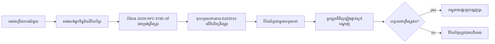
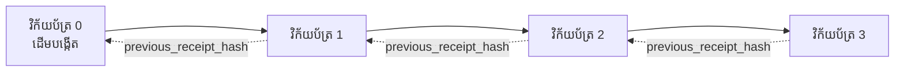

[មើលវីដេអូមេរៀនៈ ការសុវត្ថិភាពភ្នាក់ងារប្រាក់បន្លែដោយវិធីសាស្ត្រក្រដាសលេខសម្ងាត់](https://youtu.be/PLACEHOLDER_VIDEO_ID)

> _(វីដេអូមេរៀន និងរូបថតគំរូនឹងត្រូវបានបន្ថែមដោយក្រុមមាតិកាមីក្រូសូហ្វតបន្ទាប់ពីការរួមបញ្ចូល តាមលំនាំម៉ូដែលមេរៀនទី 14 / 15)_

# ការសុវត្ថិភាពភ្នាក់ងារប្រាក់បន្លែដោយវិធីសាស្ត្រក្រដាសលេខសម្ងាត់

## ជំនួយដំបូង

មេរៀននេះនឹងបង្រៀនអំពី៖

- ហេតុអ្វីបានជា audit trails សម្រាប់ភ្នាក់ងារប្រាក់បន្លែមានសារៈសំខាន់ចំពោះការអនុវត្តតាមក្រម, ការប្រើប្រាស់កំហុស, និងការជឿជាក់។
- រឿងអ្វីទើបត្រូវជា ក្រដាសលេខសម្ងាត់ និងវាផ្សេងពីបន្ទាត់កំណត់ហេតុខ្នាតមិនចុះហត្ថលេខា។
- របៀបបង្កើតក្រដាសលេខសម្គាល់ចុះហត្ថលេខាសម្រាប់ការហៅឧបករណ៍របស់ភ្នាក់ងារដោយ Python សាមញ្ញ។
- របៀបផ្ទៀងផ្ទាត់ក្រដាសសម្ងាត់ក្រៅបណ្តាញ និងរកមើលការប្រែប្រួល។
- របៀបភ្ជាប់ក្រដាសដូចជាការលុប ឬការប្តូរតម្រៀបមួយនឹងបំបែកខ្សែ។
- ក្រដាសបញ្ជាក់អ្វី និងអ្វីដែលវាមិនបញ្ជាក់ទេ។

## គោលបំណងរៀន

បន្ទាប់ពីបញ្ចប់មេរៀននេះ អ្នកនឹងស្គាល់របៀបធ្វើដូចខាងក្រោម៖

- រៀបរាប់លក្ខខណ្ឌបរាជ័យដែលជាការលើកទឹកចិត្តឲ្យមានការប្រើប្រាស់ក្រដាសលេខសម្ងាត់សម្រាប់សកម្មភាពភ្នាក់ងារ។
- បង្កើតក្រដាសលេខសម្ងាត់ចុះហត្ថលេខា Ed25519 លើទិន្នន័យ JSON canonical។
- ផ្ទៀងផ្ទាត់ក្រដាសដោយឯករាជ្យដោយប្រើកូនសោសាធារណៈរបស់អ្នកចុះហត្ថលេខា។
- រកមើលបរាជ័យដោយដំណើរការជាថ្មីការផ្ទៀងផ្ទាត់លើក្រដាសដែលបានកែប្រែ។
- បង្កើតខ្សែ hash-តភ្ជាប់របស់ក្រដាស និងពន្យល់មូលហេតុដែលខ្សែគឺសំខាន់។
- កំណត់ព្រំដែនរវាងអ្វីដែលក្រដាសបញ្ជាក់ (ការបញ្ជាក់ម្ចាស់, សុពលភាព, ការរៀបចំលំដាប់) និងអ្វីដែលវាមិនបញ្ជាក់ (ភាពត្រឹមត្រូវនៃសកម្មភាព, សុពលភាពនៃនយោបាយ)។

## បញ្ហា៖ Audit Trail របស់ភ្នាក់ងាររបស់អ្នក

សន្មត់ថាអ្នកបានដាក់បញ្ចូលភ្នាក់ងារប្រាក់បន្លែ​សម្រាប់ Contoso Travel។ ភ្នាក់ងារនេះអានសំណើរបស់អតិថិជន ហៅ API សម្រាប់ស្វែងរកជម្រើសជើងហោះហើរ ហើយកក់កៅអីសមរម្យមួយសម្រាប់អតិថិជន។ ពីរបីខែចុងក្រោយ ភ្នាក់ងារបានដំណើរការការកក់ចំនួន 50,000។ 

ថ្ងៃនេះអ្នកអ្នកត្រួតពិនិត្យមកដល់ ហើយសួរពាក្យសាមញ្ញ “បង្ហាញខ្ញុំពីអ្វីដែលភ្នាក់ងាររបស់អ្នកបានធ្វើ។”

អ្នកបានចែកឲ្យពួកគេស្ដាប់កំណត់ហេតុខាងក្នុង។ អ្នកត្រួតពិនិត្យមើលហើយសួរពាក្យដែលពិបាកជាងនេះ “តើធ្វើដូចម្តេចខ្ញុំដឹងថាកំណត់ហេតុនេះមិនត្រូវបានកែបំផ្លាញ?”

នេះជាបញ្ហា audit trail។ ការដាក់ប្រើភ្នាក់ងារច្រើនសព្វថ្ងៃពឹងផ្អែកលើ៖

- **កំណត់ហេតុកម្មវិធី**៖ ត្រូវបានសរសេរដោយភ្នាក់ងារខ្លួនឯង អាចកែសម្រួលបានដោយនរណាម្នាក់ដែលមានចូលដំណើរការលើប្រព័ន្ធហត្ថលេខា។
- **សេវាកម្មកំណត់ហេតុពពក**៖ មានភាពងាយស្រួលនៅលើវេទិកា ប៉ុន្តែត្រឹមត្រូវបើតែអ្នកត្រួតពិនិត្យជឿជាក់លើអ្នកដំណើរការវេទិកានោះ។
- **កំណត់ហេតុប្រតិបត្តិការទិន្នន័យក្នុងមូលដ្ឋានទិន្នន័យ**៖ ល្អសម្រាប់ការផ្លាស់ប្តូរទិន្នន័យ ប៉ុន្តែមិនសាកសមសម្រាប់ការហៅឧបករណ៍ចៃដន្យទេ។

គ្មានអ្វីណាមួយឆ្លើយសំណួររបស់អ្នកត្រួតពិនិត្យបានដោយមិនទាមទារឲ្យពួកគេចាំបាច់ជឿជាក់លើនរណាម្នាក់ទេ (អ្នក, អ្នកផ្ដល់ពពក, អ្នកផ្គត់ផ្គង់មូលដ្ឋានទិន្នន័យ)។ សម្រាប់ការប្រើប្រាស់ក្នុងតំបន់ខាងក្នុង ការជឿជាក់នេះគឺទទួលយកបាន។ សម្រាប់បំណុលដែលមានការត្រួតពិនិត្យ (ហិរញ្ញវត្ថុ សុខាភិបាល អ្វីដែលគ្រប់គ្រងដោយ EU AI Act) វាមិនទេ។

ក្រដាសលេខសម្ងាត់ដោះស្រាយបញ្ហានេះដោយធ្វើឲ្យសកម្មភាពភ្នាក់ងារនីមួយៗអាចផ្ទៀងផ្ទាត់ឯករាជ្យបាន។ អ្នកត្រួតពិនិត្យមិនចាំបាច់ជឿជាក់លើអ្នកទេ។ ពួកគេចាំបាច់មានតែកូនសោសាធារណៈរបស់អ្នកនិងក្រដាសតែប៉ុណ្ណោះ។

## អ្វីទៅជាក្រដាសលេខសម្ងាត់?

ក្រដាសគឺជ.objects JSON ដែលកត់ត្រាអំពីអ្វីដែលភ្នាក់ងារធ្វើ ត្រូវបានចុះហត្ថលេខាដោយហត្ថលេខាឌីជីថល។


```mermaid
flowchart LR
    A[អេជនប្រើឧបករណ៍មួយ] --> B[សាងសង់ផ្ទុកទិន្នន័យវិក័យប័ត្រ]
    B --> C[បំលែង JSON RFC 8785 ទៅជាទម្រង់ត្រឹមត្រូវ]
    C --> E[ចុះហត្ថលេខាដោយ Ed25519 លើបៃតិចត្រឹមត្រូវ]
    E --> F[វិក័យប័ត្រជាមួយហត្ថលេខា]
    F --> G[អ្នកត្រួតពិនិត្យផ្ទៀងផ្ទាត់ក្រៅបណ្ដាញ]
    G --> H{ហត្ថលេខាត្រឹមត្រូវទេ?}
    H -- yes --> I[ភស្តុតាងបង្ហាញការជួញដូរ]
    H -- no --> J[វិក័យប័ត្រត្រូវបានបដិសេធ]
```

ក្រដាសអប្បបរមាដូចខាងក្រោម៖

```json
{
  "type": "agent.tool_call.v1",
  "agent_id": "contoso-travel-bot",
  "tool_name": "lookup_flights",
  "tool_args_hash": "sha256:a3f9c1...",
  "result_hash": "sha256:7b2e1d...",
  "policy_id": "contoso-travel-policy-v3",
  "timestamp": "2026-04-25T14:30:00Z",
  "sequence": 47,
  "previous_receipt_hash": "sha256:9d4e6a...",
  "signature": {
    "alg": "EdDSA",
    "sig": "c5af83...",
    "public_key": "8f3b2c..."
  }
}
```

លក្ខណៈបីនេះកំពុងធ្វើការងារ៖

1. **ហត្ថលេខា**។ ក្រដាសត្រូវបានចុះហត្ថលេខាដោយGateway របស់ភ្នាក់ងារជាមួយកូនសោឯកជន Ed25519។ មនុស្សណាដែលមានកូនសោសាធារណៈត្រូវតែអាចផ្ទៀងផ្ទាត់ហត្ថលេខានេះក្រៅបណ្តាញ។ ការកែប្រែលើវាលណាមួយនឹងធ្វើឲ្យហត្ថលេខាមិនត្រឹមត្រូវទេ។

2. **ការរចនាទ្រង់ទ្រាយ canonical**។ មុនពេលចុះហត្ថលេខា ក្រដាសត្រូវបានបង្កើតដោយប្រើ JSON Canonicalization Scheme (JCS, RFC 8785)។ វាការពារជំនួសដូចគ្នា ពីមុខវិធីសាស្ត្រចុះហត្ថលេខាដែលផ្សេងគ្នាដែលបង្កើតកាល់ហ្វអេមអេសដូចគ្នា។ ចេតនា canonicalization បង្កើតភាពស្រដៀងច្បាស់លាស់។

3. **ការតភ្ជាប់ដោយ hash chaining**។ វាល `previous_receipt_hash` ភ្ជាប់ក្រដាសនីមួយៗទៅក្រដាសមុន។ ការលុបឬប្តូរតម្រៀបក្រដាសមួយ នឹងបំបែកការផ្សារភ្ជាប់នៅក្រោយ។ ការកែប្រែត្រូវសម្គាល់បានច្បាស់នៅលើខ្សែ បើទោះបីជាហត្ថលេខាផ្ទាល់ខ្លួនត្រូវបានលោតក៏ដោយ។

រួមគ្នា លក្ខណៈទាំងនេះផ្តល់អនុញ្ញាតបីយ៉ាង៖

- **ការបញ្ជាក់ម្ចាស់**៖ គន្លឹះនេះបានចុះហត្ថលេខានៅលើមាតិកានេះ។
- **សុពលភាព**៖ មាតិកាមិនបានផ្លាស់ប្តូរពីពេលចុះហត្ថលេខាទេ។
- **ការរៀបចំលំដាប់**៖ ក្រដាសនេះមកក្រោយក្រដាសនោះក្នុងខ្សែ។

## ការបង្កើតក្រដាសក្នុង Python

អ្នកមិនចាំបាច់ប្រើបណ្ណាល័យពិសេសសម្រាប់បង្កើតក្រដាសឡើយ។ វិធីសាស្ត្រប្រាក់បន្លែគឺមានទូលំទូលាយ និងកូដមានតែជួរឈរពិចារណា២-៣០នៃ Python។

ហាត់ធ្វើក្នុង `code_samples/18-signed-receipts.ipynb` បង្ហាញដំណើរពេញលេញ។ សង្ខេប៖

```python
import json
import hashlib
import base64
from nacl import signing
from jcs import canonicalize  # JSON គ្រឹះតាម RFC 8785

def b64url_nopad(data: bytes) -> str:
    return base64.urlsafe_b64encode(data).decode("ascii").rstrip("=")

def sha256_canonical(obj) -> str:
    """SHA-256 of a Python object's JCS-canonical JSON form."""
    return f"sha256:{hashlib.sha256(canonicalize(obj)).hexdigest()}"

# បង្កើតឬបញ្ចូលកូនសោសាំង (នៅក្នុងការផលិត, រក្សាទុកក្នុងហាងកូនសោ)
signing_key = signing.SigningKey.generate()
verify_key = signing_key.verify_key

# សង់ផ្នែកទម្រង់របស់បង្កាន់ដៃ (មិនទាន់មានហត្ថលេខា)
tool_args = {"origin": "SYD", "destination": "LAX"}
tool_result = [{"flight": "QF11", "price": 1850, "stops": 0}]

payload = {
    "type": "agent.tool_call.v1",
    "agent_id": "contoso-travel-bot",
    "tool_name": "lookup_flights",
    "tool_args_hash": sha256_canonical(tool_args),
    "result_hash": sha256_canonical(tool_result),
    "policy_id": "contoso-travel-policy-v3",
    "timestamp": "2026-04-25T14:30:00Z",
    "sequence": 0,
    "previous_receipt_hash": None,
}

# ប្តូរឲ្យនៅក្នុងគ្រឹះតម្លៃនិងហត្ថលេខាលើប៊ីត JCS ដោយផ្ទាល់។ PureEdDSA ផ្លាស់ប្តូរហាសនៅខាងក្នុង។
canonical_bytes = canonicalize(payload)
signature_bytes = signing_key.sign(canonical_bytes).signature

# ភ្ជាប់អ объектаហត្ថលេខាស្ថាបត្យកម្ម។
receipt = {
    **payload,
    "signature": {
        "alg": "EdDSA",
        "sig": b64url_nopad(signature_bytes),
        "public_key": b64url_nopad(bytes(verify_key)),
    },
}
```

នេះជាគ្រីរូបដំណើរការចុះហត្ថលេខាគ្រប់មួយ។ ហាត់ក្នុងសៀវភៅបំណងបង្ហាញរៀងរាល់ជំហ៊ាន។

## ការផ្ទៀងផ្ទាត់ក្រដាស និងរកមើលការប្រែប្រួល

ការផ្ទៀងផ្ទាត់គឺជាដំណើរការត្រឡប់ក្រោយ៖

```python
import base64
import hashlib
from nacl import signing
from nacl.exceptions import BadSignatureError
from jcs import canonicalize

def b64url_decode(s: str) -> bytes:
    padding = "=" * ((4 - len(s) % 4) % 4)
    return base64.urlsafe_b64decode(s + padding)

def verify_receipt(receipt: dict) -> bool:
    # ហត្ថលេខាគឺជាវត្ថុដែលមានរចនាសម្ព័ន្ធ៖ {"alg", "sig", "public_key"}។
    sig_obj = receipt.get("signature")
    if not sig_obj or sig_obj.get("alg") != "EdDSA":
        return False

    # ស្ដារឡើងវិញ payload ដែលបានឆ្លងកាត់ហត្ថលេខពិតប្រាកដ (គ្រប់យ៉ាងលើកលែងតែកំណត់ហត្ថលេខ)។
    payload = {k: v for k, v in receipt.items() if k != "signature"}

    canonical_bytes = canonicalize(payload)

    try:
        verify_key = signing.VerifyKey(b64url_decode(sig_obj["public_key"]))
        verify_key.verify(canonical_bytes, b64url_decode(sig_obj["sig"]))
        return True
    except BadSignatureError:
        return False
```

មុខងារនេះទទួលក្រដាសមួយ និងត្រឡប់ `True` ប្រសិនបើហត្ថលេខាត្រឹមត្រូវ និង `False` ប្រសិនមិនទេ។ មិនមានការហៅបណ្តាញ ឬការពឹងបណ្ដាញ សេវាកម្ម ឬបានទំនាក់ទំនងជាមួយភាគីផ្សេងទេ។

ដើម្បីមើលការរកមើលការប្រែប្រួល កម្មវិធីបានបង្ហាញដោយ៖

1. បង្កើតក្រដាសត្រឹមត្រូវ និងបញ្ជាក់ថាវាត្រូវបានផ្ទៀងផ្ទាត់ជោគជ័យ។
2. កែប្រែបៃមួយនៅក្នុងវាល `tool_args_hash`។
3. បញ្ជើកការផ្ទៀងផ្ទាត់ឡើងវិញ ហើយមើលថាវាបរាជ័យ។

នេះជាការបង្ហាញពិតថាក្រដាសត្រូវបានបង្កើតឡើងជាស្ថានភាពរកមើលការប្រែប្រួល៖ ការកែប្រែតូចបំផុតណាមួយ អាចបំបែកហត្ថលេខា។

## ការភ្ជាប់ក្រដាសសម្រាប់ភ្នាក់ងារជាច្រើនជំហាន

ក្រដាសចុះហត្ថលេខេតែមួយការពារសកម្មភាពមួយ។ ខ្សែក្រដាសការពារប្រល័យជាច្រើន។


```mermaid
flowchart LR
    R0[វិក័យប័ត្រ 0<br/>ដើមបង្កើត] --> R1[វិក័យប័ត្រ 1]
    R1 --> R2[វិក័យប័ត្រ 2]
    R2 --> R3[វិក័យប័ត្រ 3]
    R1 -. previous_receipt_hash .-> R0
    R2 -. previous_receipt_hash .-> R1
    R3 -. previous_receipt_hash .-> R2
```

ក្រដាសនីមួយៗកត់ត្រា hash នៃក្រដាសមុន។ ដើម្បីលុបក្រដាសលេខ 2 ដោយដណ្ដើម អ្នកវាយប្រហារត្រូវតែ៖

- កែប្រែវាល `previous_receipt_hash` របស់ក្រដាសលេខ 3 (បំបែកហត្ថលេខាក្រដាសលេខ 3) ឬ
- បង្កើតហត្ថលេខាថ្មីលើក្រដាស 3 ដែលបានកែប្រែ (ត្រូវការកូនសោឯកជនរបស់ភ្នាក់ងារ)។

ប្រសិនបើកូនសោឯកជននៅក្នុង hardware key vault ហើយអ្នកផ្សព្វផ្សាយកូនសោសាធារណៈជាមួយក្រដាសរាល់ដង ការវាយប្រហារទាំងពីរនេះមិនអាចឡើងដោយគ្មានការចាប់ផ្តើមបានទេ។

សៀវភៅបណ្តុំបានបង្ហាញ៖

1. កសាងខ្សែក្រដាសរបស់ក្រដាសបី។
2. ផ្ទៀងផ្ទាត់ថា `previous_receipt_hash` នៃក្រដាសនីមួយៗត្រូវនឹង hash ពិតប្រាកដនៃក្រដាសមុន។
3. កែប្រែក្រដាសមួយនៅចំណុចមួយ និងមើលការបំបែកខ្សែចេញត្រង់ចំណុចនោះ។

នេះជារបៀបដែលអ្នកបង្កើត audit trail ដែលអ្នកត្រួតពិនិត្យខាងក្រៅអាចផ្ទៀងផ្ទាត់ដោយមិនចាំបាច់ជឿជាក់លើអ្នក។

## ក្រដាសបញ្ជាក់អ្វី (និងអ្វីដែលវាមិនបញ្ជាក់ទេ)

នេះជាផ្នែកសំខាន់បំផុតនៃមេរៀននេះ។ ក្រដាសមានអំណាច ប៉ុន្តែអំណាចរបស់វាបានកំណត់។

**ក្រដាសបញ្ជាក់បីអ្វី៖**

1. **ការបញ្ជាក់ម្ចាស់**៖ គន្លឹះជាក់លាក់បានចុះហត្ថលេខាលើទិន្នន័យជាក់លាក់មួយ។
2. **សុពលភាព**៖ ទិន្នន័យមិនបានផ្លាស់ប្តូរពីពេលចុះហត្ថលេខាទេ។
3. **ការរៀបចំលំដាប់**៖ ក្រដាសនេះអាចយោងទៅក្រដាសមុននៅក្នុងខ្សែ hash។

**ក្រដាសមិនបញ្ជាក់៖**

1. **ភាពត្រឹមត្រូវ**៖ មិនអាចបញ្ជាក់ថាសកម្មភាពភ្នាក់ងារមានភាពត្រឹមត្រូវទេ។ ក្រដាសអាចចុះហត្ថលេខាសម្រាប់ចម្លើយខុសដូចជាចម្លើយត្រឹមត្រូវ។
2. **ការអនុវត្តតាមគោលនយោបាយ**៖ មិនអាចបញ្ជាក់ថានយោបាយក្នុង `policy_id` ត្រូវបានវាយតម្លៃ ឬត្រូវបានអនុវត្តន៍។ ក្រដាសកត់ត្រា​អ្វីដែលត្រូវបានបានបង្ហាញ មិនមែនអ្វីដែលត្រូវបានអនុវត្តន៍។
3. **អត្តសញ្ញាណលើសពីកូនសោ**៖ ក្រដាសនិយាយថា "គន្លឹះនេះបានចុះហត្ថលេខានៅលើមាតិកានេះ" មិននិយាយថា "មនុស្សនេះបានអនុម័ត" ទេ។ ការតភ្ជាប់គន្លឹះទៅនរណាម្នាក់តម្រូវអាស្រ័យលើហេដ្ឋារចនាសម្ព័ន្ធសម្គាល់ផ្សេង (ថតបញ្ជី, បណ្ណាល័យកូនសោសាធារណៈ)។
4. **ការពិតនៃបញ្ចូល**៖ ប្រសិនបើភ្នាក់ងារទទួលបានការបម្លែងបញ្ចូល ហើយអនុវត្តទៅលើវា ក្រដាសកត់ត្រាសកម្មភាពបានត្រឹមត្រូវ។ ក្រដាសគឺក្រោមការត្រួតពិនិត្យបញ្ចូល មិនមែនជំនួសសម្រាប់វាឡើយ។

ព្រំដែននេះមានសារៈសំខាន់ពីរដូវ៖

- វា​ប្រាប់​អ្នក​ថា​ក្រដាស​គឺមាន​ប្រយោជន៍​សម្រាប់​អ្វី៖ ធ្វើឲ្យទំនុះ​ការប្រព្រឹត្តអតវត្វភ្នាក់ងារ​មាន audit និងងាយស្រួលមើលឃើញការបម្លែង បើទោះបីជាក្នុងស្ថានភាពអង្គភាពផ្សេងគ្នាឡើយ។
- វា​ប្រាប់​អ្នក​ថា​អ្នកត្រូវការជាន់បន្ថែម៖ ការត្រួតពិនិត្យបញ្ចូល (មេរៀន៦), ការអនុវត្តគោលនយោបាយ (ពិពណ៌នាខ្លីខាងក្រោម) និងហេដ្ឋារចនាសម្ព័ន្ធអត្តសញ្ញាណ (ចំណោមមេរៀននេះ)។

ការខូចចិត្តធម្មតាជាច្រើនគឺគិតថា "យើងមានក្រដាស" មានន័យថា "យើងមានការគ្រប់គ្រង"។ វាមិនមានន័យទេ។ ក្រដាសគឺជាគ្រឹះ។ ការគ្រប់គ្រងគឺជាប្រព័ន្ធដែលអ្នកបង្កើតលើវា។

## បញ្ជាក់មនុស្សបានអនុម័តសកម្មភាពពិតប្រាកដ

ចំណុច 3 ខាងលើមានតម្រូវឲ្យមានផ្នែកផ្ទាល់៖ ក្រដាសសកម្មភាពនិយាយថា "គន្លឹះនេះបានចុះហត្ថលេខានេះ" មិនដែលនិយាយថា "មនុស្សបានអនុម័តនេះ​នោះទេ"។ សម្រាប់សកម្មភាពមានហានិភ័យខ្ពស់ (បង្វិលទឹកប្រាក់ ការលុប ការផ្ទេរប្រាក់) ច្បាប់គ្រប់គ្រងកើនឡើងរៀងរាល់ថ្ងៃតម្រូវការពាក្យបញ្ចប់ដែលខ្វះនេះ ហើយវាអាចបង្កើតបានដោយវិធីសាស្ត្រដូចដែលអ្នកបានបង្កើតក្នុងមេរៀននេះ។

សៀវភៅបណ្តុំ `code_samples/human-authorization-receipts.ipynb` បន្ថែមប្រភេទក្រដាសទីពីរ `human.approval.v1` ក្នុងរូបមន្តដដដែលជាក្រដាសមេរៀន (payload typed ចុះហត្ថលេខាដោយ Ed25519 លើ bytes JCS canonical របស់វា ជាមួយវាល `signature` នៅក្រៅអត្ថបទចុះហត្ថលេខា)។ អ្នកអនុម័តបានចុះហត្ថលេខាលើសកម្មភាព canonicalពេញលេញ និងអំពើរបស់វាជាមុននឹងអនុវត្ត; ក្រដាសសកម្មភាពភ្នាក់ងារកាន់តែមានការប៉ុនប៉ងដូចគ្នា និងមាន `parent_approval_ref`, hash receipt នៃការអនុម័ត ដែលគឺជាច្បាប់ដដែលនៃ `previous_receipt_hash` នៅក្នុងខ្សែដែលអ្នកបានបង្កើតខាងលើ។ មួយ `verify_chain` ផ្ទៀងផ្ទាត់ទាំងពីរនៅក្រោម​កន្លែង​ដាក់កូនសោផ្សេងគ្នា (កូនសោអ្នកអនុម័ត vs កូនសោភ្នាក់ងារ) ដូច្នេះផ្លូវកូដត្រូវចែករំលែក ប៉ុន្តែមូលដ្ឋានមានអត្តសញ្ញាណមិនដូចគ្នា។

បុគ្គលិកលក្ខណៈដែលបានទិញ និយាយយ៉ាងប្រុងប្រយ័ត្ន៖ *មនុស្សបានអនុម័តសកម្មភាពនេះពិតប្រាកដ ហើយភ្នាក់ងារអនុវត្តសកម្មភាពដែលបានអនុម័តពិតប្រាកដ*។ ការរើសបដិសេធដែលមានក្នុងសៀវភៅបណ្តុំជាភស្តុតាងមិនមែនថាជានិយមន័យទេ ប៉ុន្តែជាការពិត៖

- ការកែប្រែ, អ្នកទទួលបង្កប់ភ្នាក់ងារ, ការលេងឡើងវិញ, កូនសោក្លែងក្លាយពីរតែម្នាក់, បញ្ចូលខុស;
- **សិទ្ធិចាស់**: ហត្ថលេខានៅតែត្រឹមត្រូវ ប៉ុន្តែបដិសេធ ព្រោះកំណែគោលនយោបាយបានផ្លាស់ប្តូរ និងកូនសោអ្នកអនុម័តបានបម្លែងពីថតបញ្ជីដែលបានចាក់ដោត;
- **ការជំនួស digest**: ក្រដាសសកម្មភាពចុះហត្ថលេខាត្រឹមត្រូវសំគាល់ការអនុម័តពិតដែលភ្ជាប់ទៅនឹងសកម្មភាព canonical ខុស។

ការបរាជ័យមួយៗបដិសេធដោយហេតុផលជាក់លាក់ ដូច្នេះអ្នកត្រួតពិនិត្យអាចប្រាប់ថាតើអាជ្ញាធរបានត្រួតពិនិត្យចាស់ ឬសកម្មភាពដែលបានអនុវត្តបានផ្លាស់ប្តូរ។ ច្បាប់ដែលសៀវភៅបណ្តុំបង្រៀនគឺ៖ ការអនុម័តចុះហត្ថលេខាមិនមែនជាអាជ្ញាធរដោយខ្លួនវា។ អាជ្ញាធរត្រូវមានរួចមកប៉ុណ្ណោះប្រសិនបើទាំងពីរតែរក្សាក្នុងសកម្មភាព canonical ដូចគ្នានៅពេលអនុវត្ត។ ក្រដាសអនុម័តមនុស្សជាការសមាសធាតុសិក្សាដែលបានកំណត់ដោយមេរៀននេះ មិនមែនជាប្រភេទក្រដាសដែលបានកំណត់ដោយ `draft-farley-acta-signed-receipts` ទេ។

## ឯកសារអំពីផលិតកម្ម

កូដ Python នៅក្នុងមេរៀននេះមានរំលេចចំពោះតម្លៃសាមញ្ញ ដើម្បីឲ្យអ្នកអាចអានរៀងរាល់ជួរឈរនិងយល់ពីអ្វីកំពុងកើតឡើង។ ក្នុងផលិតកម្ម អ្នកមានជម្រើសពីរលំដាប់៖

1. **សាងសង់ដោយផ្ទាល់លើ primitive លេខសម្ងាត់។** ៥០ ជួរឈរ​ដែលអ្នកបានឃើញខាងលើគ្រប់គ្រងសម្រាប់ករណីច្រើន។ PyNaCl (Ed25519) និងកញ្ចប់ `jcs` (JSON canonical) គឺជាបណ្ណាល័យដែលត្រូវបានថែរក្សាឡើងវិញ និងបានរៀបចំ audit។

2. **ប្រើបណ្ណាល័យក្រដាសផលិតកម្ម។** គម្រោងកម្មវិធីចំហរច្រើនអនុវត្តតួរនេះជាមួយលក្ខណៈបន្ថែម (បញ្ចូលកូនសោ, ត្រួតពិនិត្យជាកញ្ចប់, ចែកចាយ JWK Set, សមាសភាពជាមួយទ្រឹស្ដីគោលនយោបាយ)៖
   - សន្លឹកចុះហត្ថលេខាប្រើ JCS និងគោលការណ៍ដែនហត្ថលេខា ក្នុងម៉ូដែល Internet-Draft អ្នកឯករាជ្យ ([`draft-farley-acta-signed-receipts`](https://datatracker.ietf.org/doc/draft-farley-acta-signed-receipts/), កំណែ 02)។ ក្រដាសសិក្សានេះមានរូបមន្តសាមញ្ញខុសពីសន្លឹក `{payload, signature}` របស់ម៉ូដែល ដែលមិនសមភាគបែបច្បាស់ឡើយ។ ម៉ូដែលផ្សព្វផ្សាយស៊ុមភាពស្រប ([agent-governance-testvectors](https://github.com/ScopeBlind/agent-governance-testvectors)) សម្រាប់អនុវត្តតាមទ្រង់ទ្រាយវាយបញ្ជា។
   - គ្រឿងខ្នាត Microsoft Agent Governance Toolkit ផ្គុំក្រដាសជាមួយសេចក្តីសម្រេចគោលនយោបាយលើ Cedar; មើលមេរៀន 33 ក្នុងឃ្លាំងសម្រាប់ឧទាហរណ៍ចាប់ពីដើមដល់ចប់។
   - កញ្ចប់ `protect-mcp` (npm) និង `@veritasacta/verify` (npm) ផ្តល់អនុវត្ត Node សម្រាប់ចុះហត្ថលេខា និងផ្ទៀងផ្ទាត់ក្រៅបណ្តាញ ដើម្បីបដិសេធ audit trail ដែលមិនអាចផ្លាស់ប្តូរបានសម្រាប់ MCP server ដែលមានឈរជាក្បាលសកម្មភាពដោយមាន approval receipt ចិញ្ចឹមសកម្មភាពផ្អាក់ (WebAuthn-backed នៅលើ desktop flow), លំនាំដដែលនៃ approval receipt ដូចនៅក្នុងសៀវភៅមនុស្សអនុម័តខាងលើ។
   - សេត Python SDK **[nobulex](https://github.com/arian-gogani/nobulex)** (`pip install nobulex`) ផ្តល់លំនាំចុះហត្ថលេខា Ed25519 + JCS ដូចគ្នា ជាមួយការភ្ជាប់ LangChain និង CrewAI រួមទាំង vector ផ្ទៀងផ្ទាត់បង្ហាញនិងផែនទីការបំពេញតម្រូវការសំរាប់ [OWASP PR #2210](https://github.com/OWASP/CheatSheetSeries/pull/2210)។

ជម្រើសជាមួយបណ្ណាល័យ ឬសរសេរពីដើមមានលក្ខណៈដូចជាជម្រើសរវាងការសរសេរបណ្ណាល័យ JWT ផ្ទាល់ខ្លួនឬប្រើបានដែលបានសាកល្បង៖ ពីរវិធីនេះគឺសមរម្យទាំងពីរ បណ្ណាល័យជួយសន្សំពេលវេលា និងកាត់បន្ថយផ្ទៃ audit; របៀបសរសេរពីដើមបង្ហាញឲ្យអ្នកយល់ពី primitive រៀងរាល់មួយ។ មេរៀននេះបង្រៀនរបៀបពីដើម ដើម្បីអ្នកមានមូលដ្ឋានសម្រាប់ជម្រើសណាមួយ។

## ពិនិត្យចំណេះដឹង

សូមសាកល្បងយល់ហើយចុះចូលទៅហាត់ប្រាណ។

**1. ក្រដាសត្រូវបានចុះហត្ថលេខាជាមួយកូនសោឯកជន Ed25519 របស់ភ្នាក់ងា៖អ្នកត្រួតពិនិត្យមានតែកូនសោសាធារណៈ។ តើអ្នកត្រួតពិនិត្យអាចផ្ទៀងផ្ទាត់ក្រដាសក្រៅបណ្តាញបានទេ?**

<details>
<summary>ចម្លើយ</summary>

បាទ/ចាស។ ការផ្ទៀងផ្ទាត់ Ed25519 ត្រូវការតែកូនសោសាធារណៈ និង bytes ដែលបានចុះហត្ថលេខា។ មិនមានការហៅបណ្តាញ ឬជំនួយសេវាកម្មទេ។ នេះជាគុណលក្ខណ៍ដែលធ្វើឲ្យក្រដាសមានប្រយោជន៍ក្នុងបរិស្ថានចំហាយខ្យល់ ឬការត្រួតពិនិត្យគឺមានព្រះរាជបណ្ដាញច្រើន ឬមានការជឿជាក់ទាប។
</details>

**2. អ្នកវាយប្រហារបានកែប្រែវាល `policy_id` របស់ក្រដាស ដើម្បីអះអាងថាវាត្រូវបានគ្រប់គ្រងដោយគោលនយោបាយព័ន្ធអនុញ្ញាតច្រើនជាងមុន។ ហត្ថលេខាចុះលើទិន្នន័យដើម។ តើកើតអ្វីខ្លះនៅពេលផ្ទៀងផ្ទាត់?**

<details>
<summary>ចម្លើយ</summary>


ការផ្ទៀងផ្ទាត់បរាជ័យ។ សញ្ញាដៃត្រូវបានគណនាតាមបៃ canonical នៃ payload ដើម; ការផ្លាស់ប្តូរពីប្រអប់ណាមួយបម្លែងបៃទាំងនោះ ដែលធ្វើឲ្យសញ្ញាដៃមិនត្រឹមត្រូវ។ អ្នកបំផ្លាញត្រូវការហត្ថលេខាឯកជនដើម្បីបង្កើតសញ្ញាដៃត្រឹមត្រូវថ្មីមួយ ដែលពួកគេមិនមានឡើយ។
</details>

**3. ហេតុអ្វីបានជា​ឯកសារទទួលបាន​មាន `tool_args_hash` និង `result_hash` ជំនួស arguments និង result ដើម?**

<details>
<summary>ចម្លើយ</summary>

មានពីហេតុផល។ ជាមុន គឺឯកសារទទួលបានអាចត្រូវបានរក្សាទុកឬផ្ទុកក្នុងបរិបទដែលការដកស្រង់មាតិកា​ដើម (PII, ទិន្នន័យអាជីវកម្ម) គឺជាបញ្ហា។ ការប្រើ hash រក្សាឲ្យឯកសារទទួលបានមានទំហំតូច និងមាតិកាប្រើប្រាស់ឯកជន; អ្នកពិនិត្យអាចផ្ទៀងផ្ទាត់ថា hash ត្រូវគ្នានឹងច្បាប់ផ្ទុកជាពីរប្រភេទនៃមាតិកា។ ជាទីបន្ទាប់ hash មានទំហំថេរ; ឯកសារទទួលបានដែលមាន hash មានទំហំកំណត់ដោយមិនគិតថា input និង output មានទំហំធំប៉ុណ្ណា។
</details>

**4. ប្រអប់ `previous_receipt_hash` ភ្ជាប់ឯកសារទទួលបាននីមួយៗទៅនឹងជំនួសរបស់វា។ ប្រសិនបើអ្នកឆក់លួចលុបឯកសារទទួលបានមួយពីកណ្ដាលខ្សែ យ៉ាងដូចម្តេចដែលយ៉ាងមិនត្រឹមត្រូវ?**

<details>
<summary>ចម្លើយ</summary>

ឯកសារទទួលបានរាល់ឯកសារដែលនៅបន្ទាប់ពីឯកសារដែលបានលុប។ ប្រអប់ `previous_receipt_hash` របស់ពួកគេចាប់ត្រូវនឹងខ្សែខុស (ដោយសារ​ឯកសារដែលបានយោងមិនមាន ឬខ្សែឥឡូវនេះបង្ហាញទៅអតីតទៀត)។ ដើម្បីលាក់ការលុប ការចាប់សញ្ញាថ្មីត្រូវបានធ្វើលើឯកសារទទួលបានបន្ទាប់ទាំងអស់ ដែលតម្រូវឲ្យមានកូនសោឯកជន។
</details>

**5. ឯកសារទទួលបានផ្ទៀងផ្ទាត់បានច្បាស់លាស់។ តើវាធ្វើអោយបង្ហាញថា​សកម្មភាពភ្នាក់ងារត្រឹមត្រូវ ឬឆ្លើយតបគោលការណ៍ទេ?**

<details>
<summary>ចម្លើយ</summary>

គ្មានទេ។ ឯកសារទទួលបានត្រឹមត្រូវបង្ហាញបីរឿង៖ ការទទួលស្គាល់ (key នេះបានចុះហត្ថលេខាលើមាតិកានេះ), សុពលភាព (មាតិកាមិនបានផ្លាស់ប្ដូរ), និងលំដាប់ (ឯកសារនេះបានបង្ហាញបន្ទាប់ពីឯកសារនោះ)។ វាមិនបង្ហាញថាសកម្មភាពត្រឹមត្រូវ ឬគោលការណ៍ក្នុង `policy_id` មានការវាយតម្លៃពិត ឬភ្នាក់ងារតាមដានគោលន័យទាំងអស់។ ឯកសារទទួលបានបង្កើតឲ្យអនុវត្តការត្រួតពិនិត្យភ្នាក់ងារ ប៉ុន្តែមិនបញ្ជាក់ភាពត្រឹមត្រូវឡើយ។ នេះជាព្រំដែនសំខាន់បំផុតនៅក្នុងមេរៀននេះ។
</details>

## អ្នកហាត់ប្រាណ

បើក `code_samples/18-signed-receipts.ipynb` ហើយបញ្ចប់ផ្នែកទាំងបួន៖

1. **ផ្នែក 1**៖ ចុះហត្ថលេខាឯកសារទទួលបានដំបូងរបស់អ្នក ហើយផ្ទៀងផ្ទាត់វា។
2. **ផ្នែក 2**៖ បំរែបំរាស់ឯកសារទទួលបាន ហើយសង្កេតមើលការផ្ទៀងផ្ទាត់បរាជ័យ។
3. **ផ្នែក 3**៖ សង់ខ្សែឯកសារទទួលបានបី និងផ្ទៀងផ្ទាត់សុពលភាពខ្សែ។
4. **ផ្នែក 4**៖ អនុវត្តលំនាំនេះទៅភ្នាក់ងារ Microsoft Agent Framework៖ បញ្ជូលការហៅឧបករណ៍ជាមួយការចុះហត្ថលេខា​វេយ្យាករណ៍ឯកសារទទួលបាន បន្ទាប់មកផ្ទៀងផ្ទាត់ឯកសារទទួលបានដោយឡែក។

**សេចក្ដីប្រកួតប្រជែងបត់បែន 1:** ពង្រីកស្គេមឯកសារទទួលបានជាមួយប្រអប់បន្ថែមផ្សេងៗដែលអ្នកជ្រើស (ឧទាហរណ៍ ID ស្នើសុំសម្រាប់តាមដាន), បន្ទាប់មកធ្វើការអះអាងលើការចុះហត្ថលេខាគោលការណ៍ canonical រួមបញ្ចូលវា ហើយបញ្ជាក់ថាឯកសារទទួលបាននៅតែមកវិញតាមការផ្ទៀងផ្ទាត់។ បន្ទាប់ពីចុះហត្ថលេខា ជួសជុលប្រអប់ហើយបញ្ជាក់ការផ្ទៀងផ្ទាត់បរាជ័យ។ នេះបង្ខំឲ្យអ្នកយល់ថា​បៃcanonical encoding គ្រប់បៃ​មានឥទ្ឋិពលយ៉ាងដូចម្តេចទៅលើសញ្ញាដៃ។

**សេចក្ដីប្រកួតប្រជែងបត់បែន 2:** ធ្វើ hash SHA-256 លើឯកសារទទួលបានពីររបស់អ្នក (ភ្ជាប់បៃcanonical របស់ពួកវាទៅគ្នាតាមលំដាប់កំណត់) ហើយដាក់ digest ដែលបានរកឃើញជាប្រអប់ថ្មីលើឯកសារទទួលបានទីបីមុនចុះហត្ថលេខា។ ផ្ទៀងផ្ទាត់ថា​eគ្រប់បីឯកសារទទួលបាននៅតែក្រឡាប់កម្មវិធីបានវិញ។ អ្នកទើបបានសង់ភស្តុតាងការចូលរួមជំហានមួយ៖ អ្នកណាមួយកាន់ឯកសារទទួលបានទីបីអាចបង្ហាញថា​eឯកសារទទួលបានពីរដំបូងមាននៅពេលវាត្រូវបានចុះហត្ថលេខា ដោយមិនត្រូវបង្ហាញមាតិកាត្រូវនោះ។ នេះគឺជាលំនាំដែលឯកសារទទួលបាន selective-disclosure ប្រើនៅកម្រិតធំ (ការប្តេជ្ញា Merkle, RFC 6962)។

## ចប់មេរៀន

ឯកសារទទួលបាន cryptographic ផ្តល់ឲ្យភ្នាក់ងារ AI ដំណើរការត្រួតពិនិត្យដែលមាន៖

- **អាចផ្ទៀងផ្ទាត់ដោយឯករាជ្យ**៖ អ្នកណាម្នាក់ដែលមាន key សាធារណៈអាចផ្ទៀងផ្ទាត់បាន ដោយគ្មានអាស្រ័យលើសេវាកម្មណាមួយ។
- **បង្ហាញច្បាស់ការបំរែបំរាស់**៖ ការផ្លាស់ប្តូរណាមួយទាំងអស់ធ្វើឲ្យសញ្ញាដៃមិនត្រឹមត្រូវ។
- **អាចផ្ទុកបានងាយ**៖ ឯកសារទទួលបានគឺជាឯកសារ JSON តូចមួយ; វាអាចរក្សាទុក ផ្ទុក ផ្ទៀងផ្ទាត់បាននៅគ្រប់កន្លែង។
- **ស្របតាមស្ដង់ដារ**៖ សង់លើ Ed25519 (RFC 8032), JCS (RFC 8785), និង SHA-256 ដែលជាប្រភេទគ្រឿងបន្លាស់ដែលប្រើយ៉ាងទូលំទូលាយ។

ពួកវាមិនជជំរើសជំនួសសម្រាប់ការត្រួតពិនិត្យបញ្ចូល ការអនុវត្តគោលការណ៍ ឬហេដ្ឋារចនាសម្ព័ន្ធអត្តសញ្ញាណទេ។ ពួកវាជាមូលដ្ឋានសម្រាប់ស្រទាប់ទាំងនោះ។ នៅពេលអ្នកបង្ហោះភ្នាក់ងារ ទៅក្នុងសំណុំការងារដែលមានការត្រួតពិនិត្យ កម្មវិធីច្រើនសំណុំ ឬការកំណត់នៅកន្លែងណាមួយដែលអ្នកពិនិត្យក្នុងអនាគតមិនអាចទុកចិត្តបាន គឺឯកសារទទួលបានជាវិធីដែលអ្នកធ្វើឲ្យដំណើរការត្រួតពិនិត្យមានភាពស្មោះត្រង់។

អ្វីដែលសំខាន់បំផុត៖ ឯកសារទទួលបានបញ្ជាក់ថា អ្នកណាប្រាប់អ្វី ដែលពេលណា។ មិនបញ្ជាក់ថាអ្វីដែលបានប្រាប់គឺពិត ឬត្រឹមត្រូវ។ រក្សាការបំបែកនោះយ៉ាងតឹងរឹង។ នេះគឺជាការបំបែករវាងប្រព័ន្ធប្រភពត្រឹមត្រូវ និងប្រព័ន្ធដែលបំភាន់។

## បញ្ជីពិនិត្យផលិតកម្ម

នៅពេលអ្នករួចរាល់បញ្ចប់មេរៀននេះ និងចាប់ផ្តើមបង្ហោះភ្នាក់ងារដែលមានការចុះហត្ថលេខាឯកសារទទួលបាននៅបរិយាកាសពិត៖

- [ ] **ផ្លាស់ប្តូរកូនសោចុះហត្ថលេខាពីលើកុំព្យូទ័រអភិវឌ្ឍន៍។** ប្រើ Azure Key Vault, AWS KMS, ឬ hardware security module។ កូនសោឯកជនដែលចុះហត្ថលេខាឯកសារទទួលបានមិនគួរលេចឡើងនៅក្នុង source control ឬ plaintext នៃម៉ាស៊ីនកម្មវិធីទេ។
- [ ] **ផ្សព្វផ្សាយកូនសោសាធារណៈសម្រាប់ផ្ទៀងផ្ទាត់។** អ្នកពិនិត្យត្រូវការវាដើម្បីផ្ទៀងផ្ទាត់ពេញលេញក្រៅបណ្ដាញ។ លំនាំស្ដង់ដារគឺជា JWK Set នៅ URL ដែលមានឈ្មោះល្បី (RFC 7517) ដូចជា `https://your-org.example.com/.well-known/agent-keys.json`។
- [ ] **ភ្ជាប់ខ្សែពីក្រៅ។** ជារៀងរាល់ពេលសរសេរ hash ចុងក្រោយនៃខ្សែទៅកាន់កំណត់ត្រាភាពត្រិះរិះរក (Sigstore Rekor, RFC 3161 timestamp authority, ឬប្រព័ន្ធផ្ទៃក្នុងទីពីរ) ដើម្បីឲ្យភាគីខាងក្រៅអាចបញ្ជាក់ថា "ខ្សែនេះមាននៅពេលនេះ"។
- [ ] **រក្សាទុកឯកសារទទួលបានដោយមិនអាចប្ដូរបាន។** រក្សាទុកតែបន្ថែម (Azure Storage ជាមួយគោលការណ៍ immutability, AWS S3 Object Lock) មិនអោយអ្នកផ្ទៃក្នុងអាចកែប្រែប្រវត្តិនៅកម្រិតផ្ទុកទិន្នន័យ។
- [ ] **សម្រេចចិត្តពីការរក្សាទុករយៈពេលយូរ។** ច្បាប់ជាច្រើនតម្រូវឲ្យរក្សាទុករយៈពេលច្រើនឆ្នាំ។ គ្រោងចំនួនឯកសារទទួលបានច្រើនឡើង (ឯកសារទទួលបានម្តងមាន ~ 500 bytes; ភ្នាក់ងារហៅ ១០,០០០ ដងក្នុងមួយថ្ងៃបង្កើត ~1.8 GB ក្នុងមួយឆ្នាំ)។
- [ ] **ផ្ដល់អត្ថបទច្បាស់លាស់ថាឯកសារទទួលបានមិនគ្របដណ្តប់អ្វីខ្លះ។** ឯកសារទទួលបានបង្ហាញការទទួលស្គាល់ សុពលភាព និងលំដាប់។ ឯកសាររបស់អ្នកគួរបញ្ជាក់ច្បាស់ខាងហ្នឹងថាអ្វីមានពេលដាក់គ្រប់គ្រងបន្ថែម (ត្រួតពិនិត្យបញ្ចូល គោលការណ៍ កំណត់អត្រា ប្រព័ន្ធអត្តសញ្ញាណ) នៅជាប់ជាមួយឯកសារទទួលបានក្នុងគោលការណ៍គ្រប់គ្រងរបស់អ្នក។

### មានសំណួរបន្ថែមអំពីការពារ AI Agents?

ចូលរួម [Microsoft Foundry Discord](https://aka.ms/ai-agents/discord) ដើម្បីជួបអ្នករៀនផ្សេងៗ ចូលរួមការិយាល័យម៉ោង និងទទួលបានចម្លើយសំណួរពាក់ព័ន្ធ AI Agents របស់អ្នក។

## ក្រៅពីមេរៀននេះ

មេរៀននេះគ្របដណ្តប់ការចុះហត្ថលេខាឯកសារទទួលបានតែមួយ និងខ្សែ hash chained។ គ្រឿងបន្លាស់ដូចគ្នាគឺបង្កើតជាលំនាំកម្រិតខ្ពស់ជាច្រើនដែលអ្នកអាចប្រទះពេលគោលការណ៍គ្រប់គ្រងរបស់អ្នកមានការកែលម្អ៖

- **ការបញ្ជាក់ជ្រើសរើស។** នៅពេលខ្សែប្រអប់ឯកសារទទួលបានត្រូវបានបញ្ជាក់ជាឯករាជ្យ (ឈើ Merkle រចនាបទ RFC 6962 style), អ្នកអាចបង្ហាញប្រអប់ជាក់លាក់ទៅអ្នកពិនិត្យជាក់លាក់ និងបញ្ជាក់ថាផ្សេងទៀតមិនបានផ្លាស់ប្ដូរដោយមិនបង្ហាញពួកវា។ មានប្រយោជន៍នៅពេលឯកសារទទួលបានត្រូវបានទទួលស្គាល់ទាំងស្រុង (ដែលចង់បានភាពពេញលេញ) និងច្បាប់បញ្ចុះទិន្នន័យដូចជា GDPR (ដែលចង់ឲអ្នកពិនិត្យមើលតិចបំផុតដែលចាំបាច់)។
- **ការផ្អាកឯកសារទទួលបាន។** ប្រសិនបើកូនសោចុះហត្ថលេខាត្រូវបានបង្កក អ្នកត្រូវការរបៀបសម្គាល់ឲ្យឯកសារទទួលបានដែលចុះហត្ថលេខាគឺមិនទុកចិត្តពីពេលណាមួយមុខទៀត។ លំនាំស្ដង់ដា៖ កូនសោចុះហត្ថលេខា អាយុកាលខ្លី ជាមួយបញ្ជីផ្អាកផ្សព្វផ្សាយ ឬកំណត់ត្រាភាពត្រិះរិះរកជាមួយធាតុផ្អាក។
- **ឯកសារទទួលបានហត្ថលេខាពីរគ្រាប់ / ជាបរិភោគ។** ការអនុវត្តខ្លះបំបែងទិន្នន័យចុះហត្ថលេខាជាពីរផ្នែក មុនអនុវត្ត (`authorization_*`) និងបន្ទាប់អនុវត្ត (`result_*`) ជាមួយហត្ថលេខាឯករាជ្យ ដែលមានប្រយោជន៍នៅពេលសេចក្ដីសម្រេចអនុម័ត និងលទ្ធផលដែលបានមើល​ពីអ្នកផ្សេងគ្នា ឬពេលខុសគ្នា។ វាអាចបន្ថែមលើទ្រង់ទ្រាយឯកសារទទួលបានដែលបានបង្រៀននៅក្នុងមេរៀននេះ។
- **ការចងក្រង payload។** ឯកសារទទួលបានបិទបាំងបៃណាណាដែលអ្នកដាក់ក្នុង `result_hash`។ ផលិតផលពិតប្រាកដជាមានប្រយោជន៍ជាងលទ្ធផលការហៅឧបករណ៍តែមួយ៖ ការពិចារណាមុនសម្រេច (ការព្យាករណ៍គំរូ, ជម្រើសបានពិចារណា, ភស្តុតាង និងភាពពេញលេញវា, ស្ថានភាពហានិភ័យ, ខ្សែការទទួលខុសត្រូវ, លទ្ធផលទ្វារបិទ) អាចធ្វើនៅក្នុង payload យ៉ាងតិចតួច ដោយបិទបាំងដោយឯកសារទទួលបានតែមួយ។ វាធ្វើឲ្យទ្រង់ទ្រាយឯកសារទទួលបានតូចតាមដែលអនុញ្ញាតឲ្យស្កីម payload អភិវឌ្ឍតាមដែនដែលបណ្តាល។
- **ការផ្គូផ្គងគ្នាយោងពីការអនុវត្តផ្សេងៗគ្នា។** ការអនុវត្តឯករាជ្យជាច្រើននៃទ្រង់ទ្រាយឯកសារទទួលបានដូចគ្នា (Python, TypeScript, Rust, Go) ផ្ទៀងផ្ទាត់ឆ្លងកាត់តួអក្សរពិសោធន៍រួមគ្នា។ ប្រសិនបើអ្នកសាងសង់ការអនុវត្តផ្ទាល់ខ្លួន ការផ្ទៀងផ្ទាត់ជាមួយចំណុចតេស្តបណ្ដាញផ្សព្វផ្សាយបញ្ជាក់ភាពស្របគ្នាទល់របស់ខ្សែ។
- **ការផ្ទេរបន្ទាន់វិលជុំក្រោយគណិតវិទ្យា (post-quantum migration)** Ed25519 ត្រូវបានប្រើយ៉ាងទូលំទូលាយនៅថ្ងៃនេះ ប៉ុន្តែមិនមែនជាការពារ quantum ទេ។ ទ្រង់ទ្រាយឯកសារទទួលបានអាចប្ដូរប្រតិបត្តិការ: ប្រអប់ `signature.alg` អាចបញ្ចូល `ML-DSA-65` (ស្តង់ដារពិធីហត្ថលេខាពណ៌វិទ្យាក្រោយQuantum NIST) នៅពេលអ្នកត្រូវការផ្ទេរប្រព័ន្ធ។ គ្រោងខណៈពេលដែលឯកសារទទួលបានចុះហត្ថលេខាទ្វេដងក្នុងរយៈពេលបម្លែង។

## ធនធានបន្ថែម

- <a href="https://datatracker.ietf.org/doc/draft-farley-acta-signed-receipts/" target="_blank">IETF Internet-Draft: Signed Decision Receipts for Machine-to-Machine Access Control</a>
- <a href="https://learn.microsoft.com/azure/ai-studio/responsible-use-of-ai-overview" target="_blank"> Responsible AI overview (Azure AI)</a>
- <a href="https://datatracker.ietf.org/doc/html/rfc8032" target="_blank">RFC 8032: Edwards-Curve Digital Signature Algorithm (EdDSA)</a>
- <a href="https://datatracker.ietf.org/doc/html/rfc8785" target="_blank">RFC 8785: JSON Canonicalization Scheme (JCS)</a>
- <a href="https://datatracker.ietf.org/doc/html/rfc6962" target="_blank">RFC 6962: Certificate Transparency</a> (Merkle-tree construction used by selective-disclosure receipts)
- <a href="https://github.com/microsoft/agent-governance-toolkit/blob/main/docs/tutorials/33-offline-verifiable-receipts.md" target="_blank">Microsoft Agent Governance Toolkit, Tutorial 33: Offline-Verifiable Decision Receipts</a>
- <a href="https://github.com/ScopeBlind/agent-governance-testvectors" target="_blank">Cross-implementation conformance test vectors</a> for the receipt format used in this lesson (Apache-2.0)
- <a href="https://pynacl.readthedocs.io/" target="_blank">PyNaCl documentation</a> (Ed25519 in Python)

## មេរៀនមុន

[Creating Local AI Agents](../17-creating-local-ai-agents/README.md)

---

<!-- CO-OP TRANSLATOR DISCLAIMER START -->
**ការបដិសេធ**:
ឯកសារនេះត្រូវបានបម្លែងភាសា ដោយប្រើសេវាបម្លែងភាសា AI [Co-op Translator](https://github.com/Azure/co-op-translator)។ ទោះយើងខ្ញុំមានក្តីប្រាថ្នាឱ្យបានច្បាស់លាស់ តែសូមយល់ដឹងថាការបម្លែងដោយស្វ័យប្រវត្តិក៏អាចមានកំហុសឬភាពមិនត្រឹមត្រូវ។ ឯកសារដើមជាភាសាទីតាំងគួរត្រូវបានគេប្រើជាប្រភពច្បាស់លាស់។ សម្រាប់ព័ត៌មានសំខាន់ៗ សូមណែនាំឱ្យប្រើប្រាស់ការប្រែដោយមនុស្សជំនាញ។ យើងខ្ញុំមិនទទួលខុសត្រូវចំពោះការយល់ច្រឡំ ឬការបកស្រាយខុសបន្ទាប់ពីការប្រើប្រាស់ការបម្លែងនេះនោះទេ។
<!-- CO-OP TRANSLATOR DISCLAIMER END -->