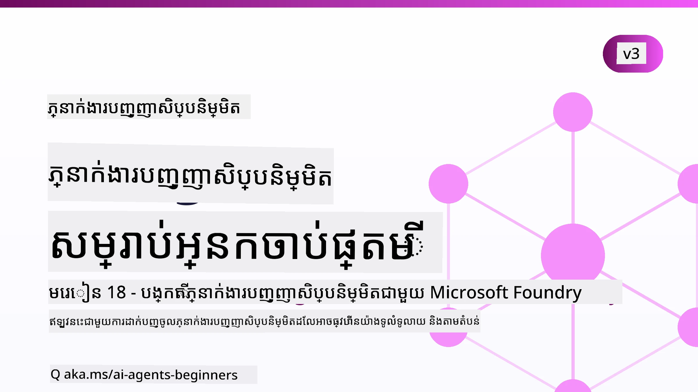

# ភ្នាក់ងារជំនួយសិប្បនិម្មិតសម្រាប់អ្នកចាប់ផ្តើម - មេរៀនមួយ



## មេរៀនមួយបង្រៀនអ្វីគ្រប់យ៉ាងដែលអ្នកត្រូវដឹងដើម្បីចាប់ផ្តើមបង្កើតភ្នាក់ងារជំនួយ AI

[](https://github.com/microsoft/ai-agents-for-beginners/blob/master/LICENSE?WT.mc_id=academic-105485-koreyst)
[](https://GitHub.com/microsoft/ai-agents-for-beginners/graphs/contributors/?WT.mc_id=academic-105485-koreyst)
[](https://GitHub.com/microsoft/ai-agents-for-beginners/issues/?WT.mc_id=academic-105485-koreyst)
[](https://GitHub.com/microsoft/ai-agents-for-beginners/pulls/?WT.mc_id=academic-105485-koreyst)
[](http://makeapullrequest.com?WT.mc_id=academic-105485-koreyst)

### 🌐 គាំទ្រភាសាច្រើន

#### គាំទ្រដោយ GitHub Action (ប្រតិបត្តិដោយស្វ័យប្រវត្តិ និងទាន់សម័យជានិច្ច)

<!-- CO-OP TRANSLATOR LANGUAGES TABLE START -->
[Arabic](../ar/README.md) | [Bengali](../bn/README.md) | [Bulgarian](../bg/README.md) | [Burmese (Myanmar)](../my/README.md) | [Chinese (Simplified)](../zh-CN/README.md) | [Chinese (Traditional, Hong Kong)](../zh-HK/README.md) | [Chinese (Traditional, Macau)](../zh-MO/README.md) | [Chinese (Traditional, Taiwan)](../zh-TW/README.md) | [Croatian](../hr/README.md) | [Czech](../cs/README.md) | [Danish](../da/README.md) | [Dutch](../nl/README.md) | [Estonian](../et/README.md) | [Finnish](../fi/README.md) | [French](../fr/README.md) | [German](../de/README.md) | [Greek](../el/README.md) | [Hebrew](../he/README.md) | [Hindi](../hi/README.md) | [Hungarian](../hu/README.md) | [Indonesian](../id/README.md) | [Italian](../it/README.md) | [Japanese](../ja/README.md) | [Kannada](../kn/README.md) | [Khmer](./README.md) | [Korean](../ko/README.md) | [Lithuanian](../lt/README.md) | [Malay](../ms/README.md) | [Malayalam](../ml/README.md) | [Marathi](../mr/README.md) | [Nepali](../ne/README.md) | [Nigerian Pidgin](../pcm/README.md) | [Norwegian](../no/README.md) | [Persian (Farsi)](../fa/README.md) | [Polish](../pl/README.md) | [Portuguese (Brazil)](../pt-BR/README.md) | [Portuguese (Portugal)](../pt-PT/README.md) | [Punjabi (Gurmukhi)](../pa/README.md) | [Romanian](../ro/README.md) | [Russian](../ru/README.md) | [Serbian (Cyrillic)](../sr/README.md) | [Slovak](../sk/README.md) | [Slovenian](../sl/README.md) | [Spanish](../es/README.md) | [Swahili](../sw/README.md) | [Swedish](../sv/README.md) | [Tagalog (Filipino)](../tl/README.md) | [Tamil](../ta/README.md) | [Telugu](../te/README.md) | [Thai](../th/README.md) | [Turkish](../tr/README.md) | [Ukrainian](../uk/README.md) | [Urdu](../ur/README.md) | [Vietnamese](../vi/README.md)

> **ចូលចិត្តចម្លងនៅលើម៉ាស៊ីនរបស់អ្នកឬ?**
>
> ទីផ្សារនេះរួមបញ្ចូលការបកប្រែជាភាសាច្រើនជាង ៥០ ដែលបង្កើនទំហំទាញយកយ៉ាងខ្លាំង។ ដើម្បីចម្លងដោយគ្មានការបកប្រែ ប្រើ sparse checkout៖
>
> **Bash / macOS / Linux:**
> ```bash
> git clone --filter=blob:none --sparse https://github.com/microsoft/ai-agents-for-beginners.git
> cd ai-agents-for-beginners
> git sparse-checkout set --no-cone '/*' '!translations' '!translated_images'
> ```
>
> **CMD (Windows):**
> ```cmd
> git clone --filter=blob:none --sparse https://github.com/microsoft/ai-agents-for-beginners.git
> cd ai-agents-for-beginners
> git sparse-checkout set --no-cone "/*" "!translations" "!translated_images"
> ```
>
> វានឹងផ្តល់ឱ្យអ្នកនូវអ្វីគ្រប់យ៉ាងដែលអ្នកត្រូវការ ដើម្បីបញ្ចប់មេរៀននេះដោយការទាញយកលឿនជាងមុន។
<!-- CO-OP TRANSLATOR LANGUAGES TABLE END -->

**បើអ្នកចង់ឱ្យគាំទ្រភាសាបបញ្ជាបន្ថែមទៀត ពួកវាត្រូវបានរាយបញ្ជីនៅ [ទីនេះ](https://github.com/Azure/co-op-translator/blob/main/getting_started/supported-languages.md).**

[](https://GitHub.com/microsoft/ai-agents-for-beginners/watchers/?WT.mc_id=academic-105485-koreyst)
[](https://GitHub.com/microsoft/ai-agents-for-beginners/network/?WT.mc_id=academic-105485-koreyst)
[](https://GitHub.com/microsoft/ai-agents-for-beginners/stargazers/?WT.mc_id=academic-105485-koreyst)

[](https://discord.com/invite/ATgtXmAS5D)


## 🌱 ការចាប់ផ្តើម

មេរៀននេះមានមេរៀនបង្រៀនមូលដ្ឋាននៃការបង្កើតភ្នាក់ងារជំនួយ AI។ មេរៀននីមួយៗផ្សព្វផ្សាយពីប្រធានបទផ្ទាល់ខ្លួន ដូច្នេះចាប់ផ្តើមពីប្រធានបទដែលអ្នកចូលចិត្ត!

មានការគាំទ្រភាសាច្រើនសម្រាប់គម្រោងនេះ។ ចូលទៅកាន់ [ភាសាដែលមាននៅទីនេះ](#-multi-language-support)។

ប្រសិនបើនេះជាលើកដំបូងដែលអ្នកបង្កើតដោយប្រើម៉ូដែល Generative AI សូមពិនិត្យមើលមេរៀន [Generative AI For Beginners](https://aka.ms/genai-beginners) របស់យើង ដែលមានមេរៀន ២១ មេរៀនអំពីការបង្កើតជាមួយ GenAI។

កុំភ្លេច [ផ្កាយ (🌟) ទីនេះ](https://docs.github.com/en/get-started/exploring-projects-on-github/saving-repositories-with-stars?WT.mc_id=academic-105485-koreyst) និង [fork ទីនេះ](https://github.com/microsoft/ai-agents-for-beginners/fork) ដើម្បីដំណើរការកូដ។

### ជួបអ្នករៀនផ្សេងទៀត សួរបញ្ហារបស់អ្នក

ប្រសិនបើអ្នកមានបញ្ហា ឬសំណួរអំពីការបង្កើតភ្នាក់ងារជំនួយ AI សូមចូលរួមនៅបណ្ដាញ Discord ពិសេសរបស់យើងនៅក្នុង [Microsoft Foundry Discord](https://aka.ms/ai-agents/discord)។

### អ្វីដែលអ្នកត្រូវការ

មេរៀននីមួយៗក្នុងមេរៀននេះមានឧទាហរណ៍កូដ ដែលអ្នកអាចរកបាននៅថត code_samples។ អ្នកអាច [fork ទីនេះ](https://github.com/microsoft/ai-agents-for-beginners/fork) ដើម្បីបង្កើតច្បាប់របស់អ្នកផ្ទាល់។

ឧទាហរណ៍កូដបង្កើតបានដោយប្រើ Microsoft Agent Framework ជាមួយ Microsoft Foundry Agent Service V2:

- [Microsoft Foundry](https://aka.ms/ai-agents-beginners/ai-foundry) - ត្រូវការគណនី Azure

មេរៀននេះប្រើប្រាស់ក្របខ័ណ្ឌ និងសេវាកម្មភ្នាក់ងារ AI ពី Microsoft ដូចខាងក្រោម៖

- [Microsoft Agent Framework (MAF)](https://learn.microsoft.com/agent-framework/overview/)
- [Microsoft Foundry Agent Service V2](https://aka.ms/ai-agents-beginners/ai-agent-service)

ឧទាហរណ៍កូដខ្លះៗក៏គាំទ្រ អ្នកផ្គត់ផ្គង់ជំរើសផ្សេងទៀតដែលសមស្របជាមួយ OpenAI ដូចជា [MiniMax](https://platform.minimaxi.com/), ដែលផ្តល់ម៉ូដែលបរិបទធំ (សំឡេងបានដល់ ២០៤ ពាក្យ)។ សូមមើល [ការរៀបចំមេរៀន](./00-course-setup/README.md) សម្រាប់ព័ត៌មានកំណត់រចនាសម្ព័ន្ធ។

សម្រាប់ព័ត៌មានបន្ថែមអំពីរបៀបផ្ទុះកូដសម្រាប់មេរៀននេះ សូមទៅកាន់ [ការរៀបចំមេរៀន](./00-course-setup/README.md)។

## 🙏 ចង់ជួយមែនទេ?

តើអ្នកមានយោបល់ ឬបានរកឃើញកំហុសសញ្ញាស្រោចស្រព អ្នកអាច [ដាក់បញ្ហា](https://github.com/microsoft/ai-agents-for-beginners/issues?WT.mc_id=academic-105485-koreyst) ឬ [បង្កើតសំណើទាញ](https://github.com/microsoft/ai-agents-for-beginners/pulls?WT.mc_id=academic-105485-koreyst)


## 📂 មេរៀននីមួយៗមាន

- មេរៀនសរសេរដាក់នៅក្នុង README និងវីដេអូខ្លីមួយ
- ឧទាហរណ៍កូដ Python ប្រើ Microsoft Agent Framework ជាមួយ Microsoft Foundry
- តំណភ្ជាប់ទៅកាន់ធនធានបន្ថែមសម្រាប់បន្តការរៀនរបស់អ្នក


## 🗃️ មេរៀន

| **មេរៀន**                                  | **អត្ថបទ និង កូដ**                             | **វីដេអូ**                                                   | **ការរៀនបន្ថែម**                                                                       |
|----------------------------------------------|----------------------------------------------------|------------------------------------------------------------|----------------------------------------------------------------------------------------|
| ណែនាំអំពីភ្នាក់ងារជំនួយ AI និងករណីប្រើប្រាស់ភ្នាក់ងារ | [តំណ](./01-intro-to-ai-agents/README.md)         | [វីដេអូ](https://youtu.be/3zgm60bXmQk?si=z8QygFvYQv-9WtO1) | [តំណ](https://aka.ms/ai-agents-beginners/collection?WT.mc_id=academic-105485-koreyst)   |
| ស្វែងយល់អំពីក្របខ័ណ្ឌ Agentic AI              | [តំណ](./02-explore-agentic-frameworks/README.md) | [វីដេអូ](https://youtu.be/ODwF-EZo_O8?si=Vawth4hzVaHv-u0H) | [តំណ](https://aka.ms/ai-agents-beginners/collection?WT.mc_id=academic-105485-koreyst)   |
| យល់ដឹងអំពីគំរូរចនារចនាសម្ព័ន្ធ Agentic AI  | [តំណ](./03-agentic-design-patterns/README.md)    | [វីដេអូ](https://youtu.be/m9lM8qqoOEA?si=BIzHwzstTPL8o9GF) | [តំណ](https://aka.ms/ai-agents-beginners/collection?WT.mc_id=academic-105485-koreyst)   |
| គំរូរចនាសម្ព័ន្ធការប្រើប្រាស់ឧបករណ៍       | [តំណ](./04-tool-use/README.md)                    | [វីដេអូ](https://youtu.be/vieRiPRx-gI?si=2z6O2Xu2cu_Jz46N) | [តំណ](https://aka.ms/ai-agents-beginners/collection?WT.mc_id=academic-105485-koreyst)   |
| Agentic RAG                                   | [តំណ](./05-agentic-rag/README.md)                 | [វីដេអូ](https://youtu.be/WcjAARvdL7I?si=gKPWsQpKiIlDH9A3) | [តំណ](https://aka.ms/ai-agents-beginners/collection?WT.mc_id=academic-105485-koreyst)   |
| សាងសង់ភ្នាក់ងារជំនួយដែលអាចទុកចិត្តបាន     | [តំណ](./06-building-trustworthy-agents/README.md) | [វីដេអូ](https://youtu.be/iZKkMEGBCUQ?si=jZjpiMnGFOE9L8OK ) | [តំណ](https://aka.ms/ai-agents-beginners/collection?WT.mc_id=academic-105485-koreyst)   |
| គំរូរចនាសម្ព័ន្ធផែនការរៀបចំ                 | [តំណ](./07-planning-design/README.md)            | [វីដេអូ](https://youtu.be/kPfJ2BrBCMY?si=6SC_iv_E5-mzucnC) | [តំណ](https://aka.ms/ai-agents-beginners/collection?WT.mc_id=academic-105485-koreyst)   |
| គំរូរចនាសម្ព័ន្ធភ្នាក់ងារច្រើន                 | [តំណ](./08-multi-agent/README.md)                 | [វីដេអូ](https://youtu.be/V6HpE9hZEx0?si=rMgDhEu7wXo2uo6g) | [តំណ](https://aka.ms/ai-agents-beginners/collection?WT.mc_id=academic-105485-koreyst)   |

| រចនាបថ Metacognition                     | [Link](./09-metacognition/README.md)               | [Video](https://youtu.be/His9R6gw6Ec?si=8gck6vvdSNCt6OcF)  | [Link](https://aka.ms/ai-agents-beginners/collection?WT.mc_id=academic-105485-koreyst) |
| តំណាង AI ក្នុងការផលិត                         | [Link](./10-ai-agents-production/README.md)        | [Video](https://youtu.be/l4TP6IyJxmQ?si=31dnhexRo6yLRJDl)  | [Link](https://aka.ms/ai-agents-beginners/collection?WT.mc_id=academic-105485-koreyst) |
| ការប្រើប្រាស់ប្រព័ន្ធប្រតិបត្តិការ Agentic (MCP, A2A និង NLWeb) | [Link](./11-agentic-protocols/README.md)           | [Video](https://youtu.be/X-Dh9R3Opn8)                                 | [Link](https://aka.ms/ai-agents-beginners/collection?WT.mc_id=academic-105485-koreyst) |
| វិស្វកម្មបរិបទសម្រាប់តំណាង AI                | [Link](./12-context-engineering/README.md)         | [Video](https://youtu.be/F5zqRV7gEag)                                 | [Link](https://aka.ms/ai-agents-beginners/collection?WT.mc_id=academic-105485-koreyst) |
| ការគ្រប់គ្រង​មនុស្សចងចាំ Agentic               | [Link](./13-agent-memory/README.md)     |      [Video](https://youtu.be/QrYbHesIxpw?si=vZkVwKrQ4ieCcIPx)                                                      |                                                                                        |
| ការស្វែងយល់អំពី Microsoft Agent Framework      | [Link](./14-microsoft-agent-framework/README.md)                            |                                                            |                                                                                        |
| ការស្ថាបនាតំណាងកុំព្យូទ័រ (CUA)                  | [Link](./15-browser-use/README.md)     |                                                            | [Link](https://docs.browser-use.com/examples/templates/playwright-integration)         |
| ការដាក់បញ្ចូល Agent យ៉ាងធំទូលាយ                 | [Link](./16-deploying-scalable-agents/README.md) |                                                    | [Link](https://learn.microsoft.com/azure/ai-foundry/agents/overview)                   |
| ការបង្កើតតំណាង AI នៅតាមកន្លែង                  | [Link](./17-creating-local-ai-agents/README.md)  |                                                    | [Link](https://learn.microsoft.com/azure/ai-foundry/foundry-local/)                    |
| ការពារកម្មវិធី AI Agents                         | [Link](./18-securing-ai-agents/README.md)  |                                                            | [Link](https://aka.ms/ai-agents-beginners/collection?WT.mc_id=academic-105485-koreyst) |

## 🎒 មេរៀនផ្សេងទៀត

ក្រុមរបស់យើងផលិតមេរៀនផ្សេងទៀតផង! សូមពិនិត្យ​មើល៖

<!-- CO-OP TRANSLATOR OTHER COURSES START -->
### LangChain
[](https://aka.ms/langchain4j-for-beginners)
[](https://aka.ms/langchainjs-for-beginners?WT.mc_id=m365-94501-dwahlin)
[](https://github.com/microsoft/langchain-for-beginners?WT.mc_id=m365-94501-dwahlin)
---

### Azure / Edge / MCP / Agents
[](https://github.com/microsoft/AZD-for-beginners?WT.mc_id=academic-105485-koreyst)
[](https://github.com/microsoft/edgeai-for-beginners?WT.mc_id=academic-105485-koreyst)
[](https://github.com/microsoft/mcp-for-beginners?WT.mc_id=academic-105485-koreyst)
[](https://github.com/microsoft/ai-agents-for-beginners?WT.mc_id=academic-105485-koreyst)

---
 
### លំដាប់ Generative AI
[](https://github.com/microsoft/generative-ai-for-beginners?WT.mc_id=academic-105485-koreyst)
[-9333EA?style=for-the-badge&labelColor=E5E7EB&color=9333EA)](https://github.com/microsoft/Generative-AI-for-beginners-dotnet?WT.mc_id=academic-105485-koreyst)
[-C084FC?style=for-the-badge&labelColor=E5E7EB&color=C084FC)](https://github.com/microsoft/generative-ai-for-beginners-java?WT.mc_id=academic-105485-koreyst)
[-E879F9?style=for-the-badge&labelColor=E5E7EB&color=E879F9)](https://github.com/microsoft/generative-ai-with-javascript?WT.mc_id=academic-105485-koreyst)

---
 
### ការស្វែងយល់មូលដ្ឋាន
[](https://aka.ms/ml-beginners?WT.mc_id=academic-105485-koreyst)
[](https://aka.ms/datascience-beginners?WT.mc_id=academic-105485-koreyst)
[](https://aka.ms/ai-beginners?WT.mc_id=academic-105485-koreyst)
[](https://github.com/microsoft/Security-101?WT.mc_id=academic-96948-sayoung)
[](https://aka.ms/webdev-beginners?WT.mc_id=academic-105485-koreyst)
[](https://aka.ms/iot-beginners?WT.mc_id=academic-105485-koreyst)
[](https://github.com/microsoft/xr-development-for-beginners?WT.mc_id=academic-105485-koreyst)

---
 
### ស៊េរី Copilot
[](https://aka.ms/GitHubCopilotAI?WT.mc_id=academic-105485-koreyst)
[](https://github.com/microsoft/mastering-github-copilot-for-dotnet-csharp-developers?WT.mc_id=academic-105485-koreyst)
[](https://github.com/microsoft/CopilotAdventures?WT.mc_id=academic-105485-koreyst)
<!-- CO-OP TRANSLATOR OTHER COURSES END -->

## 🌟 អរគុណសហគមន៍

អរគុណ [Shivam Goyal](https://www.linkedin.com/in/shivam2003/) សម្រាប់ការរួមចំណែកឧទាហរណ៍កូដសំខាន់បង្ហាញពី Agentic RAG។

## ការរួមចំណែក

គម្រោងនេះស្វាគមន៍ការរួមចំណែក និង الاقتراحات។ ការរួមចំណែកភាគច្រើនទាមទារឱ្យអ្នកយល់ព្រមលើ
សំបុត្រអាជ្ញាធរស្ដីពីសិទ្ធិរបស់អ្នករួមចំណែក (CLA) បញ្ជាក់ថាអ្នកមានសិទ្ធិ និងពិតជាបានផ្តល់អោយយើង
សិទ្ធិប្រើប្រាស់ការរួមចំណែករបស់អ្នក។ សម្រាប់ព័ត៌មានលម្អិត សូមទស្សនា <https://cla.opensource.microsoft.com>។

ពេលអ្នកដាក់សំណើប្រគល់ កម្មវិធី CLA bot នឹងកំណត់ដោយស្វ័យប្រវត្តិនៅថាតើអ្នកត្រូវការផ្តល់
CLA មុខតំណែង និងប្រសិនបើវាចាំបាច់ ប្រើសញ្ញាសកលលើ PR (ឧ. ការត្រួតពិនិត្យស្ថានភាព, មតិយោបល់)។ គ្រាន់តែអនុវត្តបញ្ជាការពីប្រព័ន្ធ bot។
អ្នកត្រូវតែធ្វើតែម្ដងប៉ុណ្ណោះ ចំពោះគម្រោងទាំងអស់ដែលប្រើ CLA របស់យើង។

គម្រោងនេះបានអនុម័ត [Microsoft Open Source Code of Conduct](https://opensource.microsoft.com/codeofconduct/)។
សម្រាប់ព័ត៌មានបន្ថែម សូមមើល [Code of Conduct FAQ](https://opensource.microsoft.com/codeofconduct/faq/) ឬ
ទាក់ទង [opencode@microsoft.com](mailto:opencode@microsoft.com) សម្រាប់សំណួរឬមតិយោបល់បន្ថែម។

## សញ្ញាស្មើគ្នា

គម្រោងនេះប្រហែលជាមានសញ្ញាស្មើគ្នា ឬរូបសញ្ញាសម្រាប់គម្រោង ផលិតផល ឬសេវាកម្ម។ ការប្រើប្រាស់សញ្ញាស្មើគ្នា Microsoft
ត្រូវបានកំណត់ដោយ ហើយត្រូវតែអនុវត្តតាម
[Microsoft's Trademark & Brand Guidelines](https://www.microsoft.com/legal/intellectualproperty/trademarks/usage/general)។
ការប្រើប្រាស់សញ្ញាស្មើគ្នា Microsoft ឬរូបសញ្ញា ក្នុងជំនាន់បានផ្លាស់ប្តូរនៃគម្រោងនេះ មិនគួរឱ្យមានការភាន់ច្រឡំ ឬសំដៅថា Microsoft ផ្តល់ជំនួយ។
ការប្រើប្រាស់សញ្ញាស្មើគ្នា ឫរូបសញ្ញាពីភាគីទីបី គឺផ្អែកលើគោលការណ៍របស់ភាគីទីបីនោះ។

## ស្វែងយល់ជំនួយ


ប្រសិនបើអ្នកមានបញ្ហា ឬមានសំណួរអំពីការសាងសង់កម្មវិធី AI សូមចូលរួម៖

[](https://aka.ms/foundry/discord)

ប្រសិនបើអ្នកមានមតិយោបល់ផលិតផល ឬកំហុសនៅពេលសាងសង់ សូមទៅកាន់៖

[](https://aka.ms/foundry/forum)

---

<!-- CO-OP TRANSLATOR DISCLAIMER START -->
**ការបដិសេធ**:
ឯកសារនេះត្រូវបានបម្លែងភាសា ដោយប្រើសេវាបម្លែងភាសា AI [Co-op Translator](https://github.com/Azure/co-op-translator)។ ទោះយើងខ្ញុំមានក្តីប្រាថ្នាឱ្យបានច្បាស់លាស់ តែសូមយល់ដឹងថាការបម្លែងដោយស្វ័យប្រវត្តិក៏អាចមានកំហុសឬភាពមិនត្រឹមត្រូវ។ ឯកសារដើមជាភាសាទីតាំងគួរត្រូវបានគេប្រើជាប្រភពច្បាស់លាស់។ សម្រាប់ព័ត៌មានសំខាន់ៗ សូមណែនាំឱ្យប្រើប្រាស់ការប្រែដោយមនុស្សជំនាញ។ យើងខ្ញុំមិនទទួលខុសត្រូវចំពោះការយល់ច្រឡំ ឬការបកស្រាយខុសបន្ទាប់ពីការប្រើប្រាស់ការបម្លែងនេះនោះទេ។
<!-- CO-OP TRANSLATOR DISCLAIMER END -->