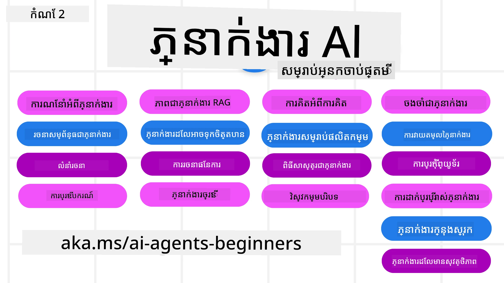

# គណៈកម្មការបញ្ញាសិប្បនិម្មិតសម្រាប់អ្នកចាប់ផ្តើម - មុខវិជ្ជាមួយគ្នា



## មុខវិជ្ជាមួយគ្នាសូមបង្រៀនអ្វីគ្រប់យ៉ាងដែលអ្នកត្រូវការដើម្បីចាប់ផ្តើមបង្កើតគណៈកម្មការបញ្ញាសិប្បនិម្មិត

[](https://github.com/microsoft/ai-agents-for-beginners/blob/master/LICENSE?WT.mc_id=academic-105485-koreyst)
[](https://GitHub.com/microsoft/ai-agents-for-beginners/graphs/contributors/?WT.mc_id=academic-105485-koreyst)
[](https://GitHub.com/microsoft/ai-agents-for-beginners/issues/?WT.mc_id=academic-105485-koreyst)
[](https://GitHub.com/microsoft/ai-agents-for-beginners/pulls/?WT.mc_id=academic-105485-koreyst)
[](http://makeapullrequest.com?WT.mc_id=academic-105485-koreyst)

### 🌐 ការគាំទ្រច្រើនភាសា

#### គាំទ្រដោយ GitHub Action (ស្វ័យប្រវត្តិ និងទាន់សម័យជានិច្ច)

<!-- CO-OP TRANSLATOR LANGUAGES TABLE START -->
[Arabic](../ar/README.md) | [Bengali](../bn/README.md) | [Bulgarian](../bg/README.md) | [Burmese (Myanmar)](../my/README.md) | [Chinese (Simplified)](../zh-CN/README.md) | [Chinese (Traditional, Hong Kong)](../zh-HK/README.md) | [Chinese (Traditional, Macau)](../zh-MO/README.md) | [Chinese (Traditional, Taiwan)](../zh-TW/README.md) | [Croatian](../hr/README.md) | [Czech](../cs/README.md) | [Danish](../da/README.md) | [Dutch](../nl/README.md) | [Estonian](../et/README.md) | [Finnish](../fi/README.md) | [French](../fr/README.md) | [German](../de/README.md) | [Greek](../el/README.md) | [Hebrew](../he/README.md) | [Hindi](../hi/README.md) | [Hungarian](../hu/README.md) | [Indonesian](../id/README.md) | [Italian](../it/README.md) | [Japanese](../ja/README.md) | [Kannada](../kn/README.md) | [Khmer](./README.md) | [Korean](../ko/README.md) | [Lithuanian](../lt/README.md) | [Malay](../ms/README.md) | [Malayalam](../ml/README.md) | [Marathi](../mr/README.md) | [Nepali](../ne/README.md) | [Nigerian Pidgin](../pcm/README.md) | [Norwegian](../no/README.md) | [Persian (Farsi)](../fa/README.md) | [Polish](../pl/README.md) | [Portuguese (Brazil)](../pt-BR/README.md) | [Portuguese (Portugal)](../pt-PT/README.md) | [Punjabi (Gurmukhi)](../pa/README.md) | [Romanian](../ro/README.md) | [Russian](../ru/README.md) | [Serbian (Cyrillic)](../sr/README.md) | [Slovak](../sk/README.md) | [Slovenian](../sl/README.md) | [Spanish](../es/README.md) | [Swahili](../sw/README.md) | [Swedish](../sv/README.md) | [Tagalog (Filipino)](../tl/README.md) | [Tamil](../ta/README.md) | [Telugu](../te/README.md) | [Thai](../th/README.md) | [Turkish](../tr/README.md) | [Ukrainian](../uk/README.md) | [Urdu](../ur/README.md) | [Vietnamese](../vi/README.md)

> **ចូលចិត្តបង្កើតចម្លងក្នុងតំបន់មូលដ្ឋានរបស់អ្នក?**
>
> ទិន្នន័យនេះមានការបកប្រែភាសាច្រើនជាង ៥០ ដែលបង្កើនទំហំចម្លងយ៉ាងគ្នាខ្លាំង។ ដើម្បីចម្លងដោយគ្មានការបកប្រែ សូមប្រើ sparse checkout៖
>
> **Bash / macOS / Linux:**
> ```bash
> git clone --filter=blob:none --sparse https://github.com/microsoft/ai-agents-for-beginners.git
> cd ai-agents-for-beginners
> git sparse-checkout set --no-cone '/*' '!translations' '!translated_images'
> ```
>
> **CMD (Windows):**
> ```cmd
> git clone --filter=blob:none --sparse https://github.com/microsoft/ai-agents-for-beginners.git
> cd ai-agents-for-beginners
> git sparse-checkout set --no-cone "/*" "!translations" "!translated_images"
> ```
>
> នេះផ្តល់អ្វីគ្រប់យ៉ាងដែលអ្នកត្រូវការ ដើម្បីបញ្ចប់មុខវិជ្ជាមួយការទាញយករហ័សជាងមុន។
<!-- CO-OP TRANSLATOR LANGUAGES TABLE END -->

**បើអ្នកចង់បានការគាំទ្រភាសាបន្ថែមទៀត សូមពិនិត្យមើលនៅ [ទីនេះ](https://github.com/Azure/co-op-translator/blob/main/getting_started/supported-languages.md)។**

[](https://GitHub.com/microsoft/ai-agents-for-beginners/watchers/?WT.mc_id=academic-105485-koreyst)
[](https://GitHub.com/microsoft/ai-agents-for-beginners/network/?WT.mc_id=academic-105485-koreyst)
[](https://GitHub.com/microsoft/ai-agents-for-beginners/stargazers/?WT.mc_id=academic-105485-koreyst)

[](https://discord.com/invite/ATgtXmAS5D)


## 🌱 ចាប់ផ្តើម

មុខវិជ្ជានេះមានមេរៀនគ្របដណ្តប់លើមូលដ្ឋាននៃការបង្កើតគណៈកម្មការបញ្ញាសិប្បនិម្មិត។ មេរៀននីមួយៗបង្ហាញប្រធានបទផ្ទាល់ខ្លួន ដូច្នេះសូមចាប់ផ្តើមជាមួយអ្វីដែលអ្នកចូលចិត្ត!

មានការគាំទ្រភាសាច្រើនសម្រាប់មុខវិជ្ជានេះ។ ចូលទៅកាន់ [ភាសារដែលមាននៅទីនេះ](#-multi-language-support)។

ប្រសិនបើនេះជាលើកដំបូងអ្នកបង្កើតជាមួយម៉ូដែល AI បង្កើត សូមពិចារណាក្នុងមុខវិជ្ជា [បញ្ញាសិប្បនិម្មិតបង្កើតសម្រាប់អ្នកចាប់ផ្តើម](https://aka.ms/genai-beginners) រួមមានមេរៀន ២១ នៅលើការបង្កើតជាមួយ GenAI។

កុំភ្លេច [ផ្ដល់ផ្កាយ (🌟) លើឃ្លាំងនេះ](https://docs.github.com/en/get-started/exploring-projects-on-github/saving-repositories-with-stars?WT.mc_id=academic-105485-koreyst) ហើយ [fork ឃ្លាំងនេះ](https://github.com/microsoft/ai-agents-for-beginners/fork) ដើម្បីដំណើរកូដ។

### ជួបអ្នករៀនផ្សេងទៀត ទទួលបានចម្លើយសម្រាប់សំណួររបស់អ្នក

ប្រសិនបើអ្នកបែកធ្លាយ ឬមានសំណួរអំពីការបង្កើតគណៈកម្មការបញ្ញាសិប្បនិម្មិត សូមចូលរួមឆានែល Discord ផ្តាច់មុខរបស់យើងនៅ [Microsoft Foundry Discord](https://aka.ms/ai-agents/discord)។

### អ្វីដែលអ្នកត្រូវការ 

មេរៀននីមួយៗក្នុងមុខវិជ្ជានេះរួមមានឧទាហរណ៍កូដ ដែលអាចរកបាននៅក្នុងថត code_samples។ អ្នកអាច [fork ឃ្លាំងនេះ](https://github.com/microsoft/ai-agents-for-beginners/fork) ដើម្បីបង្កើតចម្លងផ្ទាល់ខ្លួន។

ឧទាហរណ៍កូដនៅក្នុងលំហាត់ទាំងនេះប្រើ Microsoft Agent Framework ជាមួយ Microsoft Foundry Agent Service V2:

- [Microsoft Foundry](https://aka.ms/ai-agents-beginners/ai-foundry) - ត្រូវការគណនី Azure

មុខវិជ្ជានេះប្រើប្រាស់បណ្តាញធ្វើការនិងសេវាកម្ម AI Agent ខាងក្រោមពី Microsoft:

- [Microsoft Agent Framework (MAF)](https://aka.ms/ai-agents-beginners/agent-framework)
- [Microsoft Foundry Agent Service V2](https://aka.ms/ai-agents-beginners/ai-agent-service)

ឧទាហរណ៍កូដខ្លះៗក៏គាំទ្រកម្មវិធីផ្គត់ផ្គង់ ដែលជាប់សុពលភាពជាមួយ OpenAI ដូចជា [MiniMax](https://platform.minimaxi.com/), ដែលផ្តល់ម៉ូដែលមានបរិបទធំ (រហូតដល់ 204K tokens)។ សូមមើល [ការកំណត់មុខវិជ្ជា](./00-course-setup/README.md) សម្រាប់ព័ត៌មានបន្ថែម។

សម្រាប់ព័ត៌មានបន្ថែមអំពីការប្រើប្រាស់កូដ សម្រាប់មុខវិជ្ជានេះ សូមចូលទៅកាន់ [ការកំណត់មុខវិជ្ជា](./00-course-setup/README.md)។

## 🙏 ចង់ជួយដែរឬ?

តើអ្នកមានមតិយោបល់ ឬរកឃើញកំហុសអក្សរ ឬកូដទេ? [បញ្ចេញបញ្ហា](https://github.com/microsoft/ai-agents-for-beginners/issues?WT.mc_id=academic-105485-koreyst) ឬ [បង្កើត pull request](https://github.com/microsoft/ai-agents-for-beginners/pulls?WT.mc_id=academic-105485-koreyst)


## 📂 មេរៀននីមួយៗរួមមាន

- មេរៀនសរសេរទីតាំងនៅក្នុងREADME និងវីដេអូចុងក្រោយ
- ឧទាហរណ៍កូដ Python ប្រើ Microsoft Agent Framework ជាមួយ Microsoft Foundry
- តំណភ្ជាប់ទៅធនធានបន្ថែម សម្រាប់បន្តការសិក្សារបស់អ្នក


## 🗃️ មេរៀន

| **មេរៀន**                                   | **អត្ថបទ និងកូដ**                                    | **វីដេអូ**                                                  | **ការសិក្សាបន្ថែម**                                                                     |
|----------------------------------------------|----------------------------------------------------|------------------------------------------------------------|----------------------------------------------------------------------------------------|
| អ្នកណែនាំអំពីគណៈកម្មការបញ្ញាសិប្បនិម្មិត និងករណីប្រើប្រាស់                             | [Link](./01-intro-to-ai-agents/README.md)          | [Video](https://youtu.be/3zgm60bXmQk?si=z8QygFvYQv-9WtO1)  | [Link](https://aka.ms/ai-agents-beginners/collection?WT.mc_id=academic-105485-koreyst) |
| ស្វែងយល់អំពី Agentic Frameworks              | [Link](./02-explore-agentic-frameworks/README.md)  | [Video](https://youtu.be/ODwF-EZo_O8?si=Vawth4hzVaHv-u0H)  | [Link](https://aka.ms/ai-agents-beginners/collection?WT.mc_id=academic-105485-koreyst) |
| យល់ដឹងអំពីរចនាប័ទ្ម Agentic Design Patterns     | [Link](./03-agentic-design-patterns/README.md)     | [Video](https://youtu.be/m9lM8qqoOEA?si=BIzHwzstTPL8o9GF)  | [Link](https://aka.ms/ai-agents-beginners/collection?WT.mc_id=academic-105485-koreyst) |
| រចនាប័ទ្មប្រើប្រាស់ឧបករណ៍                      | [Link](./04-tool-use/README.md)                    | [Video](https://youtu.be/vieRiPRx-gI?si=2z6O2Xu2cu_Jz46N)  | [Link](https://aka.ms/ai-agents-beginners/collection?WT.mc_id=academic-105485-koreyst) |
| Agentic RAG                                  | [Link](./05-agentic-rag/README.md)                 | [Video](https://youtu.be/WcjAARvdL7I?si=gKPWsQpKiIlDH9A3)  | [Link](https://aka.ms/ai-agents-beginners/collection?WT.mc_id=academic-105485-koreyst) |
| ការបង្កើតAgent ដែលអាចទុកចិត្តបាន               | [Link](./06-building-trustworthy-agents/README.md) | [Video](https://youtu.be/iZKkMEGBCUQ?si=jZjpiMnGFOE9L8OK ) | [Link](https://aka.ms/ai-agents-beginners/collection?WT.mc_id=academic-105485-koreyst) |
| រចនាប័ទ្មផែនការ                      | [Link](./07-planning-design/README.md)             | [Video](https://youtu.be/kPfJ2BrBCMY?si=6SC_iv_E5-mzucnC)  | [Link](https://aka.ms/ai-agents-beginners/collection?WT.mc_id=academic-105485-koreyst) |
| រចនាប័ទ្ម Multi-Agent                   | [Link](./08-multi-agent/README.md)                 | [Video](https://youtu.be/V6HpE9hZEx0?si=rMgDhEu7wXo2uo6g)  | [Link](https://aka.ms/ai-agents-beginners/collection?WT.mc_id=academic-105485-koreyst) |

| បទពិសោធន៍រចនាបែប Metacognition                 | [Link](./09-metacognition/README.md)               | [Video](https://youtu.be/His9R6gw6Ec?si=8gck6vvdSNCt6OcF)  | [Link](https://aka.ms/ai-agents-beginners/collection?WT.mc_id=academic-105485-koreyst) |
| អ្នកប្រើ AI ក្នុងការផលិត                      | [Link](./10-ai-agents-production/README.md)        | [Video](https://youtu.be/l4TP6IyJxmQ?si=31dnhexRo6yLRJDl)  | [Link](https://aka.ms/ai-agents-beginners/collection?WT.mc_id=academic-105485-koreyst) |
| ការប្រើប្រាស់ប្រព័ន្ធ Agentic (MCP, A2A និង NLWeb) | [Link](./11-agentic-protocols/README.md)           | [Video](https://youtu.be/X-Dh9R3Opn8)                                 | [Link](https://aka.ms/ai-agents-beginners/collection?WT.mc_id=academic-105485-koreyst) |
| វិស្វកម្មបរិបទសម្រាប់អ្នកប្រើ AI            | [Link](./12-context-engineering/README.md)         | [Video](https://youtu.be/F5zqRV7gEag)                                 | [Link](https://aka.ms/ai-agents-beginners/collection?WT.mc_id=academic-105485-koreyst) |
| ការគ្រប់គ្រងអង្គចងចាំ Agentic                      | [Link](./13-agent-memory/README.md)     |      [Video](https://youtu.be/QrYbHesIxpw?si=vZkVwKrQ4ieCcIPx)                                                      |                                                                                        |
| ការស្វែងយល់អំពី Microsoft Agent Framework                         | [Link](./14-microsoft-agent-framework/README.md)                            |                                                            |                                                                                        |
| ការកសាងអ្នកប្រើកុំព្យូទ័រ (CUA)           | [Link](./15-browser-use/README.md)     |                                                            | [Link](https://docs.browser-use.com/examples/templates/playwright-integration)         |
| ការដាក់ឲ្យដំណើរការអ្នកប្រើដែលអាចពង្រីកបាន                    | មកឆាប់ๆនេះ                            |                                                            |                                                                                        |
| ការបង្កើតអ្នកប្រើ AI ទីតាំង                      | មកឆាប់ៗនេះ                               |                                                            |                                                                                        |
| ការការពារអ្នកប្រើ AI                           | [Link](./18-securing-ai-agents/README.md)  |                                                            | [Link](https://aka.ms/ai-agents-beginners/collection?WT.mc_id=academic-105485-koreyst) |

## 🎒 មុខវិជ្ជាផ្សេងទៀត

ក្រុមការងារយើងផលិតមុខវិជ្ជាផ្សេងទៀត! សូមពិនិត្យ៖

<!-- CO-OP TRANSLATOR OTHER COURSES START -->
### LangChain
[](https://aka.ms/langchain4j-for-beginners)
[](https://aka.ms/langchainjs-for-beginners?WT.mc_id=m365-94501-dwahlin)
[](https://github.com/microsoft/langchain-for-beginners?WT.mc_id=m365-94501-dwahlin)
---

### Azure / Edge / MCP / អ្នកប្រើ
[](https://github.com/microsoft/AZD-for-beginners?WT.mc_id=academic-105485-koreyst)
[](https://github.com/microsoft/edgeai-for-beginners?WT.mc_id=academic-105485-koreyst)
[](https://github.com/microsoft/mcp-for-beginners?WT.mc_id=academic-105485-koreyst)
[](https://github.com/microsoft/ai-agents-for-beginners?WT.mc_id=academic-105485-koreyst)

---
 
### ស៊េរី Generative AI
[](https://github.com/microsoft/generative-ai-for-beginners?WT.mc_id=academic-105485-koreyst)
[-9333EA?style=for-the-badge&labelColor=E5E7EB&color=9333EA)](https://github.com/microsoft/Generative-AI-for-beginners-dotnet?WT.mc_id=academic-105485-koreyst)
[-C084FC?style=for-the-badge&labelColor=E5E7EB&color=C084FC)](https://github.com/microsoft/generative-ai-for-beginners-java?WT.mc_id=academic-105485-koreyst)
[-E879F9?style=for-the-badge&labelColor=E5E7EB&color=E879F9)](https://github.com/microsoft/generative-ai-with-javascript?WT.mc_id=academic-105485-koreyst)

---
 
### ការសិក្សាមូលដ្ឋាន
[](https://aka.ms/ml-beginners?WT.mc_id=academic-105485-koreyst)
[](https://aka.ms/datascience-beginners?WT.mc_id=academic-105485-koreyst)
[](https://aka.ms/ai-beginners?WT.mc_id=academic-105485-koreyst)
[](https://github.com/microsoft/Security-101?WT.mc_id=academic-96948-sayoung)
[](https://aka.ms/webdev-beginners?WT.mc_id=academic-105485-koreyst)
[](https://aka.ms/iot-beginners?WT.mc_id=academic-105485-koreyst)
[](https://github.com/microsoft/xr-development-for-beginners?WT.mc_id=academic-105485-koreyst)

---
 
### ស៊េរី Copilot
[](https://aka.ms/GitHubCopilotAI?WT.mc_id=academic-105485-koreyst)
[](https://github.com/microsoft/mastering-github-copilot-for-dotnet-csharp-developers?WT.mc_id=academic-105485-koreyst)
[](https://github.com/microsoft/CopilotAdventures?WT.mc_id=academic-105485-koreyst)
<!-- CO-OP TRANSLATOR OTHER COURSES END -->

## 🌟 អរគុណសហគមន៍

អរគុណ [Shivam Goyal](https://www.linkedin.com/in/shivam2003/) សម្រាប់ការបរិច្ចាគគំរូកូដសំខាន់ដែលបង្ហាញពី Agentic RAG ។ 

## ការចូលរួម

វគ្គនេះស្វាគមន៏ការចូលរួមនិងយោបល់។ ភាគច្រើននៃការចូលរួមត្រូវការឱ្យអ្នកយល់ព្រមតាម
សន្ធិសញ្ញាសិទ្ធិជាសហការី (CLA) ដែលប្រកាសថាអ្នកមានសិទ្ធិ និងពិតជាចូលរួមផ្តល់សិទ្ធិឲ្យយើង
ប្រើប្រាស់ការចូលរួមរបស់អ្នក។ សម្រាប់ព័ត៌មានលម្អិត សូមទៅកាន់ <https://cla.opensource.microsoft.com>។

ពេលអ្នកដាក់សំណើ pull request រួច មេរៀន CLA នឹងកំណត់ថាតើអ្នកត្រូវផ្តល់
សន្ធិសញ្ញា CLA ទេ ហើយធ្វើការតម្កល់ពណ៌ថាសម្រាប់សំណើ PR (ឧ. ការត្រួតពិនិត្យស្ថានភាព, មតិយោបល់)។ គ្រាន់តែអនុវត្តតាមការណែនាំ
ពីមេរៀន។ អ្នកត្រូវធ្វើការនេះតែម្តងប៉ុណ្ណោះសម្រាប់រាល់ repository ដែលប្រើ CLA របស់យើង។

វគ្គនេះបានទទួលយក [Microsoft Open Source Code of Conduct](https://opensource.microsoft.com/codeofconduct/)។
សម្រាប់ព័ត៌មានបន្ថែម មើល [Code of Conduct FAQ](https://opensource.microsoft.com/codeofconduct/faq/) ឬ
ទាក់ទង [opencode@microsoft.com](mailto:opencode@microsoft.com) សម្រាប់សំណួរឬមតិយោបល់បន្ថែម។

## សញ្ញាផ្លូវការជាផ្ទាល់

វគ្គនេះអាចមានសញ្ញាផ្លូវការឬរូចំណាត់ត្រង់សម្រាប់គម្រោង ផលិតផល ឬសេវាកម្មណាមួយ។ ការប្រើប្រាស់សញ្ញាផ្លូវការឬរូចំណាត់ត្រង់ Microsoft
ត្រូវតែគោរពនិងអនុវត្តតាម
[Microsoft's Trademark & Brand Guidelines](https://www.microsoft.com/legal/intellectualproperty/trademarks/usage/general)។
ការប្រើប្រាស់សញ្ញាផ្លូវការរបស់ Microsoft ឬរូចំណាត់ត្រង់ក្នុងការផ្លាស់ប្ដូរវគ្គនេះមិនគួរធ្វើឲ្យមានការជៀចខ្លួន ឬបង្ហាញថា Microsoft សហការគាំទ្រ។
ការប្រើប្រាស់សញ្ញាផ្លូវការរបស់បុគ្គលទីបីផ្សេងទៀតគឺដោយយោងតាមគោលនយោបាយរបស់ពួកគេ។

## រកជំនួយ


ប្រសិនបើអ្នកស្ទាក់ ឬមានសំណួរណាមួយអំពីការសាងសង់កម្មវិធី AI សូមចូលរួម៖

[](https://aka.ms/foundry/discord)

ប្រសិនបើអ្នកមានមតិយោបល់ផលិតផល ឬបញ្ហាមិនដំណើរការបាននៅពេលសាងសង់ សូមចូលទៅកាន់៖

[](https://aka.ms/foundry/forum)

---

<!-- CO-OP TRANSLATOR DISCLAIMER START -->
**ការបដិសេធ**:
ឯកសារនេះត្រូវបានបម្លែងភាសា ដោយប្រើសេវាបម្លែងភាសា AI [Co-op Translator](https://github.com/Azure/co-op-translator)។ ទោះយើងខ្ញុំមានក្តីប្រាថ្នាឱ្យបានច្បាស់លាស់ តែសូមយល់ដឹងថាការបម្លែងដោយស្វ័យប្រវត្តិក៏អាចមានកំហុសឬភាពមិនត្រឹមត្រូវ។ ឯកសារដើមជាភាសាទីតាំងគួរត្រូវបានគេប្រើជាប្រភពច្បាស់លាស់។ សម្រាប់ព័ត៌មានសំខាន់ៗ សូមណែនាំឱ្យប្រើប្រាស់ការប្រែដោយមនុស្សជំនាញ។ យើងខ្ញុំមិនទទួលខុសត្រូវចំពោះការយល់ច្រឡំ ឬការបកស្រាយខុសបន្ទាប់ពីការប្រើប្រាស់ការបម្លែងនេះនោះទេ។
<!-- CO-OP TRANSLATOR DISCLAIMER END -->