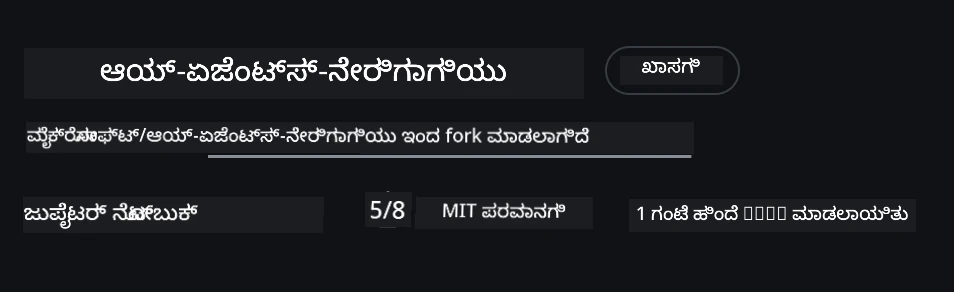
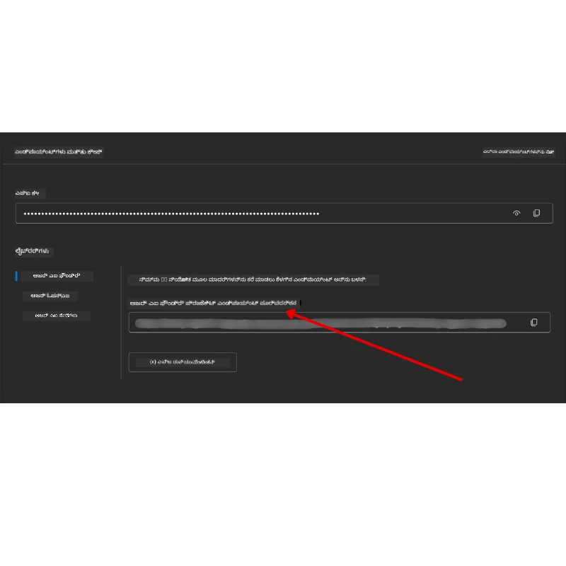

# ಕೋರ್ಸ್ ಸೆಟಪ್

## ಪರಿಚಯ

ಈ ಪಾಠದಲ್ಲಿ ಈ ಕೋರ್ಸ್‌ನ ಕೋಡ್ ಮಾದರಿಗಳನ್ನು ಹೇಗೆ ಚಲಾಯಿಸಬೇಕೆಂಬುದನ್ನು ವಿವರಿಸಲಾಗುತ್ತದೆ.

## ಇತರೆ ಅಧ್ಯಯನಶೀಲರೊಂದಿಗೆ ಸೇರಿ ಸಹಾಯ ಪಡೆಯಿರಿ

ನಿಮ್ಮ ರೆಪೋವನ್ನು ಕ್ಲೋನ್ ಮಾಡುವ ಮುಂಚೆ, ಸೆಟಪ್ ಸಹಾಯಕ್ಕೆ, ಕೋರ್ಸ್ ಕುರಿತು ಯಾವುದೇ ಪ್ರಶ್ನೆಗಳಿಗಾಗಿ ಅಥವಾ ಇತರೆ ಅಧ್ಯಯನಶೀಲರ ಸಂಪರ್ಕಕ್ಕೆ [AI Agents For Beginners Discord ಚಾನಲ್](https://aka.ms/ai-agents/discord) ಸೇರುವುದು ಉತ್ತಮ.

## ಈ ರೆಪೋವನ್ನು ಕ್ಲೋನ್ ಅಥವಾ ಫಾರ್ಕ್ ಮಾಡಿ

ಪ್ರಾರಂಭಕ್ಕೆ, ದಯವಿಟ್ಟು GitHub ರೆಪೊಸಿಟೋರಿಯನ್ನು ಕ್ಲೋನ್ ಅಥವಾ ಫಾರ್ಕ್ ಮಾಡಿ. ಇದು ನಿಮ್ಮ ಸ್ವಂತ ಕೋರ್ಸ್ ವಸ್ತುವಿನ ಪ್ರತಿಯನ್ನು ತಯಾರಿಸಿ, ನೀವು ಕೋಡ್ ಚಾಲನೆ, ಪರೀಕ್ಷೆ ಮತ್ತು ಪರಿಷ್ಕರಣೆ ಮಾಡಲು ಅನುಕೂಲವಾಗುತ್ತದೆ!

ಇದನ್ನು <a href="https://github.com/microsoft/ai-agents-for-beginners/fork" target="_blank">ರೆಪೋವನ್ನು ಫಾರ್ಕ್ ಮಾಡಲು</a> ಕ್ಲಿಕ್ ಮಾಡುವ ಮೂಲಕ ಮಾಡಬಹುದು

ಈಗ ನೀವು ಈ ಕೋರ್ಸಿನ ಸ್ವಂತ ಫಾರ್ಕ್ ಮಾಡಲಾದ ಪ್ರತಿಯನ್ನು ಕೆಳಗಿನ ಲಿಂಕ್‌ನಲ್ಲಿ ಹೊಂದಿರಬೇಕು:



### ಶಾಲೋ ಕ್ಲೋನ್ (ವರ್ಕ್‌ಶಾಪ್ / Codespaces ಗಳಿಗೆ ಶಿಫಾರಸು)

  > ಸಂಪೂರ್ಣ ರೆಪೊಸಿಟೊರಿ ಪೂರ್ಣ ಇತಿಹಾಸ ಮತ್ತು ಎಲ್ಲಾ ಕಡತಗಳನ್ನು ಡೌನ್‌ಲೋಡ್ ಮಾಡಿದಾಗ ದೊಡ್ಡದಾಗಿರಬಹುದು (~3 GB). ನೀವು ಕೇವಲ ವರ್ಕ್‌ಶಾಪ್‌ಗೆ ಹಾಜರಾಗುತ್ತಿರುವವರು ಅಥವಾ ಕೇವಲ ಕೆಲವು ಪಾಠ ಫೋಲ್ಡರ್ಸ್ ಬೇಕಾದರೆ, ಶಾಲೋ ಕ್ಲೋನ್ (ಅಥವಾ ಸ್ಫೇರ್ಸ್ ಕ್ಲೋನ್) ಬಹಳ ಕಡಿಮೆ ಡೌನ್‌ಲೋಡ್ ಮಾಡುತ್ತದೆ.

#### ತ್ವರಿತ ಶಾಲೋ ಕ್ಲೋನ್ — ಕನಿಷ್ಟ ಇತಿಹಾಸ, ಎಲ್ಲಾ ಕಡತಗಳು

ಕೆಳಗಿನ ಆಜ್ಞೆಗಳಲ್ಲಿನ `<your-username>` ಅನ್ನು ನಿಮ್ಮ ಫಾರ್ಕ್ URL (ಅಥವಾ ಮೇಲಧಿಕಾರದ URL ನೀವು ಇಚ್ಛಿಸಿದರೆ) ನಿಂದ ಬದಲಿಸಿ.

ಇತ್ತೀಚಿನ ಕಮಿಟ್ ಇತಿಹಾಸ ಮಾತ್ರ ಕ್ಲೋನಿಮಾಡಲು (ಸಣ್ಣ ಡೌನ್‌ಲೋಡ್):

```bash
git clone --depth 1 https://github.com/<your-username>/ai-agents-for-beginners.git
```

ನಿರ್ದಿಷ್ಟ ಶಾಖೆಯನ್ನು ಕ್ಲೋನಿಮಾಡಲು:

```bash
git clone --depth 1 --branch <branch-name> https://github.com/<your-username>/ai-agents-for-beginners.git
```

#### ಭಾಗಶಃ (ಸ್ಪಾರ್ಸ್) ಕ್ಲೋನ್ — ಕನಿಷ್ಟ ಬ್ಲಾಬ್ಸ್ + ಆಯ್ದ ಫೋಲ್ಡರ್ಸ್ ಮಾತ್ರ

ಇದನ್ನು ಭಾಗಶಃ ಕ್ಲೋನ್ ಮತ್ತು ಸ್ಪಾರ್ಸ್-ಚೆಕ್‌ಔಟ್ ಬಳಸಿ ಮಾಡಲಾಗುತ್ತದೆ (Git 2.25+ ಅವಶ್ಯಕ ಮತ್ತು ಅಶ್ರೇಯಿಸಿ ಆಧುನಿಕ Git ಭಾಗಶಃ ಕ್ಲೋನ್ ಬೆಂಬಲದೊಂದಿಗೆ ಶಿಫಾರಸು ಮಾಡಲಾಗಿದೆ):

```bash
git clone --depth 1 --filter=blob:none --sparse https://github.com/<your-username>/ai-agents-for-beginners.git
```

ರೆಪೋ ಫೋಲ್ಡರ್ಗೆ ಹೋಗಿ:

```bash
cd ai-agents-for-beginners
```

ನಂತರ ನೀವು ಯಾವ ಫೋಲ್ಡರ್ಸ್ ಬೇಕೋ ತಿಳಿಸಿ (ಕೆಳಗಿನ ಉದಾಹರಣೆ ಎರಡು ಫೋಲ್ಡರ್ಸ್ ತೋರಿಸುತ್ತದೆ):

```bash
git sparse-checkout set 00-course-setup 01-intro-to-ai-agents
```

ಕ್ಲೋನಿಂಗ್ ಮತ್ತು ಕಡತಗಳ ಪರಿಶೀಲನೆಯ ನಂತರ, ನೀವು ಫೈಲ್‌ಗಳು ಮಾತ್ರ ಬೇಕಾದರೆ ಮತ್ತು ಜಾಗವನ್ನು ಖಾಲಿ ಮಾಡಬೇಕಾದರೆ (ಗಿಟ್ ಇತಿಹಾಸವಿಲ್ಲದೆ), ದಯವಿಟ್ಟು ರೆಪೊಸಿಟರಿ ಮೆಟಾಡೇಟಾವನ್ನು ಅಳಿಸಿ (💀ಪುನರುಳಿಸಲಾಗದು — ನೀವು ಎಲ್ಲಾ Git ಕಾರ್ಯಾಚಾರವನ್ನು ಕಳೆದುಕೊಳ್ಳುತ್ತೀರಿ):

```bash
# zsh/bash
rm -rf .git
```

```powershell
# ಪವರ್‌ಶೆಲ್
Remove-Item -Recurse -Force .git
```

#### GitHub Codespaces ಬಳಸುವುದು (ಸ್ಥಳೀಯ ದೊಡ್ಡ ಡೌನ್‌ಲೋಡ್‌ಗಳನ್ನು ತಪ್ಪಿಸಲು ಶಿಫಾರಸು)

- [GitHub UI](https://github.com/codespaces) ಮೂಲಕ ಈ ರೆಪೋಗೆ ಹೊಸ Codespace ರಚಿಸಿ.  

- ಹೊಸದಾಗಿ ರಚಿಸಿದ codespace ಟರ್ಮಿನಲ್‌ನಲ್ಲಿ, ನೀವು ಬೇಕಾದ ಪಾಠ ಫೋಲ್ಡರ್ಸ್ ಮಾತ್ರ Codespace ಕಾರ್ಯಸ್ಥಳಕ್ಕೆ ತರಲು ಮೇಲಿನ ಶಾಲೋ/ಸ್ಪಾರ್ಸ್ ಕ್ಲೋನಿಂಗ್ ಆಜ್ಞೆಗಳೊಂದರಲ್ಲಿ ಒಂದನ್ನು ಚಲಾಯಿಸಿ.
- ಆಯ್ಕೆಯಾಗಿ: Codespaces ಒಳಗೆ ಕ್ಲೋನ್ ಮಾಡಿದ ನಂತರ, ಹೆಚ್ಚಿನ ಜಾಗವನ್ನು آزادಿಮಾಡಲು .git ಅಳಿಸಬಹುದು (ಮೇಲಿನ ಅಳಿಸುವ ಆಜ್ಞೆಯನ್ನು ನೋಡಿ).
- ಗಮನಿಸಿ: ನೀವು ನಿಮ್ಮ Codespaces ರೆಪೋವನ್ನು ನೇರವಾಗಿ ತೆರೆಯಲು ಬಯಸಿದರೆ (ಹೆಚ್ಚಿನ ಕ್ಲೋನ್ ಇಲ್ಲದೆ), Codespaces ಡೆವ್ ಕಂಟೈನರ್ ಪರಿಸರವನ್ನು ರಚಿಸುತ್ತದೆ ಮತ್ತು ಇನ್ನೂ ನೀವು ಬೇಕಾದಕ್ಕಿಂತ ಹೆಚ್ಚು ಬಾಸಿಕೆ ಮಾಡಬಹುದು.

#### ಸಲಹೆಗಳು

- ಸಂಶೋಧನೆ / ಕಮಿಟ್ ಮಾಡಲು ನಿಮ್ಮ ಫಾರ್ಕ್ ಅನ್ನು ಬಳಸಬೇಕೆಂದರೆ ಎಷ್ಟು Clone URL ಅನ್ನು ಯಾವಾಗಲೂ ಬದಲಿಸಬೇಕು.
- ನಂತರ ಇತಿಹಾಸ ಅಥವಾ ಕಡತಗಳು ಹೆಚ್ಚಿನ ಅಗತ್ಯದಿಂದ, ನೀವು ಅವುಗಳನ್ನು ಪಡೆದು ಅಥವಾ ಸ್ಪಾರ್ಸ್-ಚೆಕ್‌ಔಟ್ ನ್ಕ್ಳಿಂದ ಹೆಚ್ಚುವರಿ ಫೋಲ್ಡರ್ಸ್ ಸೇರಿಸಬಹುದು.

## ಕೋಡ್ ಅನ್ನು ಚಾಲನೆ ಮಾಡುವುದು

ಈ ಕೋರ್ಸ್ AI ಏಜೆಂಟುಗಳನ್ನು ನಿರ್ಮಿಸುವ ನೈಪುಣ್ಯ ತರಬೇತಿಗೆ ಜುಪೈಟರ್ ನೋಟ್‌ಬುಕ್‌ಗಳ ಸರಣಿಯನ್ನು ನೀಡುತ್ತದೆ.

ಕೋಡ್ ಮಾದರಿಗಳು **Microsoft Agent Framework (MAF)** ನೊಂದಿಗೆ `FoundryChatClient` ಬಳಸುತ್ತವೆ, ಇದು **Microsoft Foundry** ಮೂಲಕ **Microsoft Foundry Agent Service V2** (Responses API) ಗೆ ಸಂಪರ್ಕಿಸುತ್ತದೆ.

ಎಲ್ಲಾ ಪೈಥಾನ್ ನೋಟ್‌ಬುಕ್‌ಗಳು `*-python-agent-framework.ipynb` ಎಂದು ಲೇಬಲ್ ಮಾಡಲ್ಪಟ್ಟಿವೆ.

## ಅವಶ್ಯಕತೆಗಳು

- ಪೈಥಾನ್ 3.12+
  - **ಗಮನಿಸಿ**: ನೀವು Python3.12 ಅನ್ನು ಸ್ಥಾಪಿಸಿಲ್ಲದಿದ್ದರೆ, ದಯವಿಟ್ಟು ಅದನ್ನು ಇನ್‌ಸ್ಟಾಲ್ ಮಾಡಿ. ನಂತರ ನಿಮ್ಮ requirements.txt ಫೈಲ್‌ನಿಂದ ಸರಿಯಾದ ಆವೃತ್ತಿಗಳನ್ನು ಸ್ಥಾಪಿಸಲು python3.12 ಯೊಂದಿಗೆ ನಿಮ್ಮ ವಿ-ವೆನ್ ರಚಿಸಿ.
  
    >ಉದಾಹರಣೆ

    ಪೈಥಾನ್ ವಿ-ವೆನ್ ಡೈರೆಕ್ಟರಿ ರಚಿಸಿ:

    ```bash
    python -m venv venv
    ```

    ನಂತರ ವಿ-ವೆನ್ ಪರಿಸರವನ್ನು ಸಕ್ರಿಯಗೊಳಿಸಿ:

    ```bash
    # zsh/bash
    source venv/bin/activate
    ```
  
    ```dos
    # Command Prompt for Windows
    venv\Scripts\activate
    ```

- .NET 10+: .NET ಬಳಸಿ ಮಾದರಿ ಕೋಡ್‌ನಿಗಾಗಿ, ನೀವು [.NET 10 SDK](https://dotnet.microsoft.com/download/dotnet/10.0) ಅಥವಾ ಮುಂದಿನ ಆವೃತ್ತಿಯನ್ನು ಇನ್‌ಸ್ಟಾಲ್ ಮಾಡಿರಲಿ. ನಂತರ, ನಿಮ್ಮ ಇನ್‌ಸ್ಟಾಲ್ ಮಾಡಿದ .NET SDK ಆವೃತ್ತಿಯನ್ನು ಪರಿಶೀಲಿಸಿ:

    ```bash
    dotnet --list-sdks
    ```

- **Azure CLI** — ಪ್ರಾಮಾಣೀಕರಣಕ್ಕಾಗಿ ಅಗತ್ಯ. [aka.ms/installazurecli](https://aka.ms/installazurecli) ನಿಂದ ಇನ್‌ಸ್ಟಾಲ್ ಮಾಡಿ.
- **Azure Subscription** — Microsoft Foundry ಮತ್ತು Microsoft Foundry Agent Service ಗೆ ಪ್ರವೇಶಕ್ಕಾಗಿ.
- **Microsoft Foundry ಪ್ರಾಜೆಕ್ಟ್** — ನಿಯೋಜಿಸಲಾದ ಮಾದರಿಯೊಂದಿಗಿನ ಪ್ರಾಜೆಕ್ಟ್ (ಉದಾ: `gpt-5-mini`). ಕೆಳಗಿನ [ಪದಿ 1](#ಹಂತ-1-microsoft-foundry-ಪ್ರಾಜೆಕ್ಟ್-ರಚಿಸಿ) ನೋಡಿ.

ಈ ರೆಪೋ ನಿರ್ದೇಶನದಲ್ಲಿರುವ `requirements.txt` ಫೈಲ್‌ನಲ್ಲಿ ಎಲ್ಲಾ ಅಗತ್ಯ ಪೈಥಾನ್ ಪ್ಯಾಕೇಜುಗಳನ್ನು ಸಂಗ್ರಹಿಸಲಾಗಿದೆ.

ನೀವು ಇವುಗಳನ್ನು ನೋಡಿ ಟರ್ಮಿನಲ್‌ನಲ್ಲಿ ಕೆಳಗಿನ ಆಜ್ಞೆಯನ್ನು ಚಾಲನೆ ಮಾಡಿ:

```bash
pip install -r requirements.txt
```

ನಾವು ವೈರುದ್ಧ್ಯಗಳು ಮತ್ತು ಸಮಸ್ಯೆಗಳನ್ನು ತಪ್ಪಿಸಲು ಪೈಥಾನ್ ವಿ-ವೆನ್ ಪರಿಸರವನ್ನು ಬಳಸುವ ಸಲಹೆ ನೀಡುತ್ತೇವೆ.

## VSCode ಸೆಟಪ್

ನೀವು VSCode ನಲ್ಲಿ ಸರಿಯಾದ ಪೈಥಾನ್ ಆವೃತ್ತಿಯನ್ನು ಬಳಸುತ್ತಿದ್ದೀರೋ ಎಂದು ಖಚಿತಪಡಿಸಿಕೊಳ್ಳಿ.


## Microsoft Foundry ಮತ್ತು Microsoft Foundry Agent Service ಸೆಟ್‌ಅಪ್ ಮಾಡಿ

### ಹಂತ 1: Microsoft Foundry ಪ್ರಾಜೆಕ್ಟ್ ರಚಿಸಿ

ನೀವು ನೋಟ್‌ಬುಕ್‌ಗಳನ್ನು ಚಾಲನೆ ಮಾಡಲು ನಿಯೋಜಿಸಲಾದ ಮಾದರಿಯೊಂದಿಗೆ Microsoft Foundry **ಹಬ್** ಮತ್ತು **ಪ್ರಾಜೆಕ್ಟ್** ಅಗತ್ಯ.

1. [ai.azure.com](https://ai.azure.com) ಗೆ ಹೋಗಿ ಮತ್ತು ನಿಮ್ಮ Azure ಖಾತೆಯಿಂದ ಲಾಗಿನ್ ಮಾಡಿ.
2. **ಹಬ್** ರಚಿಸಿ (ಅಥವಾ ಈಗಾಗಲೆ ಇರುತ್ತದೆ). ನೋಡಿ: [ಹಬ್ ಸಂಪನ್ಮೂಲಗಳ ಅವಲೋಕನ](https://learn.microsoft.com/azure/ai-foundry/concepts/ai-resources).
3. ಹಬ್ ಒಳಗೆ **ಪ್ರಾಜೆಕ್ಟ್** ರಚಿಸಿ.
4. **ಮಾದರಿಗಳು + ಎಂಡ್‌ಪಾಯಿಂಟ್‌ಗಳು** → **ಮಾದರಿ ನಿಯೋಜಿಸಿ**ದಿಂದ ಮಾದರಿಯೊಂದನ್ನು ನಿಯೋಜಿಸಿ (ಉದಾ: `gpt-5-mini`).

### ಹಂತ 2: ನಿಮ್ಮ ಪ್ರಾಜೆಕ್ಟ್ ಎಂಡ್‌ಪಾಯಿಂಟ್ ಮತ್ತು ಮಾದರಿ ನಿಯೋಜನೆಯ ಹೆಸರನ್ನು ಪಡೆಯಿರಿ

Microsoft Foundry ಪೋರ್ಟಲ್‌ನ ನಿಮ್ಮ ಪ್ರಾಜೆಕ್ಟ್ ರಿಂದ:

- **ಪ್ರಾಜೆಕ್ಟ್ ಎಂಡ್‌ಪಾಯಿಂಟ್** — **ಅವಲೋಕನ** ಪುಟಕ್ಕೆ ಹೋಗಿ ಮತ್ತು ಎಂಡ್‌ಪಾಯಿಂಟ್ URL ನ್ನು ನಕಲಿಸಿ.



- **ಮಾದರಿ ನಿಯೋಜನೆಯ ಹೆಸರು** — **ಮಾದರಿಗಳು + ಎಂಡ್‌ಪಾಯಿಂಟ್‌ಗಳು**ಗೆ ಹೋದ ಮೇಲೆ, ನಿಮ್ಮ ನಿಯೋಜಿಸಿದ ಮಾದರಿಯನ್ನು ಆರಿಸಿ ಮತ್ತು **ನಿಯೋಜನಾ ಹೆಸರು** (ಉದಾ: `gpt-5-mini`) ಗಮನಿಸಿ.

### ಹಂತ 3: `az login` ಮೂಲಕ Azure ಗೆ ಸ್ವಯಂಪ್ರಮಾಣೀಕರಿಸಿ

ಬಹುತೆಕ ನೋಟ್‌ಬುಕ್‌ಗಳು ನಿಮ್ಮ **Azure CLI ಲಾಗಿನ್** ಮೂಲಕ ಪ್ರಮಾಣೀಕರಿಸುತ್ತವೆ — `AzureCliCredential` ಅಥವಾ `DefaultAzureCredential` (ಎರಡೂ ನಿಮ್ಮ `az login` ಸೆಷನ್ ಅನ್ನು ಹಿಡಿಯುತ್ತವೆ) `azure-identity` ಪ್ಯಾಕೇಜಿನಿಂದ — ಆದ್ದರಿಂದ ಅವುಗಳಿಗೆ API ಕೀಲಿಗಳು ಅಗತ್ಯವಿಲ್ಲ. ಕೆಲವು ಪಾಠಗಳು ಮತ್ತು ಐಚ್ಛಿಕ ಸಂಯೋಜನೆಗಳು API ಕೀಲಿಗಳನ್ನು ಬಳಸುತ್ತವೆ; ಪ್ರತಿಯೊಂದು ಪಾಠದ ಪೂರ್ವಶರತ್ತುಗಳ ಪರಿಶೀಲಿಸಿ. ಇದರರ್ಥ ನೀವು Azure CLI ಮೂಲಕ ಲಾಗಿನ್ ಆಗಿರಬೇಕು.

1. **Azure CLI ಇನ್‌ಸ್ಟಾಲ್ ಮಾಡಿ** (ಮಾಡದಿದ್ದರೆ): [aka.ms/installazurecli](https://aka.ms/installazurecli)

2. **ಲಾಗಿನ್ ಮಾಡಲು** ಈ ಕೆಳಗಿನ ಆಜ್ಞೆಯನ್ನು ರನ್ ಮಾಡಿ:

    ```bash
    az login
    ```

    ಅಥವಾ ನೀವು ಬ್ರೌಸರ್ ಇಲ್ಲದ ದೂರಸ್ಥ ಕೋಡ್‌ಸ್ಪೇಸ್ ಪರಿಸರದಲ್ಲಿದ್ದರೆ:

    ```bash
    az login --use-device-code
    ```

3. **ನೀವು ಕೇಳಿಸಿದರೆ ನಿಮ್ಮ ಸಬ್ಸ್ಕ್ರಿಪ್ಷನ್ ಆಯ್ಕೆಮಾಡಿ** — ನಿಮ್ಮ Foundry ಪ್ರಾಜೆಕ್ಟ್ ಇರುವದನ್ನು ಆರಿಸಿ.

4. **ನೀವು ಲಾಗಿನ್ ಆಗಿರುವುದನ್ನು ಖಚಿತಪಡಿಸಿಕೊಳ್ಳಿ**:

    ```bash
    az account show
    ```

> **ಏಕೆ `az login`?** ನೋಟ್‌ಬುಕ್‌ಗಳು `AzureCliCredential` ಅಥವಾ `DefaultAzureCredential` ಮೂಲಕ ಪ್ರಮಾಣೀಕರಣ ಮಾಡುತ್ತವೆ, ಇದು Azure CLI ಲಾಗಿನ್ ಅನ್ನು ತೆಗೆದುಕೊಳ್ಳುತ್ತದೆ. ಇದರಿಂದ ನಿಮ್ಮ `az login` ಸೆಷನ್.credentials ಆಗಿ ಕೆಲಸ ಮಾಡುತ್ತದೆ — ಯಾವುದೇ API ಕೀಲಿಗಳು ಅಥವಾ ರಹಸ್ಯಗಳು ನಿಮ್ಮ `.env` ಫೈಲ್‌ನಲ್ಲಿ ಇರಬೇಕಾಗಿಲ್ಲ. ಇದು ಒಂದು [ಸುರಕ್ಷತಾ ಅತ್ಯುತ್ತಮ ಅಭ್ಯಾಸ](https://learn.microsoft.com/azure/developer/ai/keyless-connections).

### ಹಂತ 4: ನಿಮ್ಮ `.env` ಫೈಲ್ ರಚಿಸಿ

ಉದಾಹರಣೆ ಫೈಲ್ ನಕಲಿಸಿ:

```bash
# zsh/bash
cp .env.example .env
```

```powershell
# ಪವರ್‌ಶೆಲ್
Copy-Item .env.example .env
```

`.env` ಫೈಲ್ ತೆರೆಯಿರಿ ಮತ್ತು ಈ ಎರಡು ಮೌಲ್ಯಗಳನ್ನು ತುಂಬಿ:

```env
AZURE_AI_PROJECT_ENDPOINT=https://<your-project>.services.ai.azure.com/api/projects/<your-project-id>
AZURE_AI_MODEL_DEPLOYMENT_NAME=gpt-5-mini
```

| ಚರ | ಇದನ್ನು ಕ où ಹಿಯಿಂದ ಪಡೆಯಿರಿ |
|----------|-----------------|
| `AZURE_AI_PROJECT_ENDPOINT` | Foundry ಪೋರ್ಟಲ್ → ನಿಮ್ಮ ಪ್ರಾಜೆಕ್ಟ್ → **ಅವಲೋಕನ** ಪುಟ |
| `AZURE_AI_MODEL_DEPLOYMENT_NAME` | Foundry ಪೋರ್ಟಲ್ → **ಮಾದರಿಗಳು + ಎಂಡ್‌ಪಾಯಿಂಟ್‌ಗಳು** → ನಿಮ್ಮ ನಿಯೋಜಿಸಿದ ಮಾದರಿಯ ಹೆಸರು |

ಬಹುತೇಕ ಪಾಠಗಳಿಗೆ ಇದು ಸಾಕಾಗುತ್ತದೆ! ನೋಟ್‌ಬುಕ್‌ಗಳು ನಿಮ್ಮ `az login` ಸೆಷನ್ ಮೂಲಕ ಸ್ವಯಂಚಾಲಿತವಾಗಿ ಪ್ರಮಾಣೀಕರಿಸಿಕೊಳ್ಳುತ್ತವೆ.

### ಹಂತ 5: ಪೈಥಾನ್ ನಿರ್ಬಂಧಗಳನ್ನು ಸ್ಥಾಪಿಸಿ

```bash
pip install -r requirements.txt
```

ನಾವು ಈ ಆಜ್ಞೆಯನ್ನು ಮೊದಲು ರಚಿಸಿದ ವಿ-ವೆನ್ ಪರಿಸರದೊಳಗೆ ನಡೆಸುವ ಸಲಹೆ ನೀಡುತ್ತೇವೆ.

## ಐಚ್ಛಿಕ ಸೆಟಪ್: Azure AI Search (ಪಾಠಸಾಲೆಗಳು 5 ಮತ್ತು 16)

ಪಾಠ 5 (Agentic RAG) ಮತ್ತು ಪಾಠ 16 ನೋಟ್‌ಬುಕ್‌ಗಳು ಬಾಕ್ಸ್‌ನಿಂದಲೇ **ಮೊಗ್ಗಾರಿನ ಜ್ಞಾನಾಧಾರ** ಬಳಸುತ್ತವೆ — ಯಾವುದೇ ಹೆಚ್ಚುವರಿ Azure ಸಂಪನ್ಮೂಲಗಳ ಅಗತ್ಯವಿಲ್ಲ. ನೀವು ನಿಜವಾದ **Azure AI Search** ಸೂಚ್ಯಂಕವನ್ನು ಬೆಂಬಲಿಸಲು ಬಯಸಿದರೆ, ಗಮನಿಸಿ ಪಾಠ 16 ನೋಟ್‌ಬುಕ್ ಪ್ರಸ್ತುತ ಕೀಲಿಕಾಸ್ಥಿತ ಪ್ರಮಾಣೀಕರಣವನ್ನು ಬಳಸುತ್ತದೆ: ಇದು **`AZURE_SEARCH_SERVICE_ENDPOINT`** ಮತ್ತು **`AZURE_SEARCH_API_KEY`** ಎರಡೂ ಹೊಂದಿದ್ದಾಗ ಮಾತ್ರ in-memory ಹುಡುಕಾಟದಿಂದ Azure AI Search ಗೆ ಸರಿಯುತ್ತದೆ — ಹಾಗಾಗಿ ನಿಜವಾದ ಸೂಚ್ಯಂಕದ ವಿರುದ್ಧ ಚಾಲನೆ ಮಾಡಲು ನೀವು ಆಡಳಿತ ಕೀಲಿಯನ್ನು ಸಹ ಹೊಂದಿರಬೇಕು. Entra ID (RBAC) ಯೊಂದಿಗೆ ಕೀಲಿಕಿಲ್ಲದ ಪ್ರಾಮಾಣೀಕರಣವು ನಿಮ್ಮ ಸ್ವಂತ ಉತ್ಪನ್ನ ಕೋಡ್‌ಗಾಗಿ ಶಿಫಾರಸುಮಾಡುವ ವಿಧಾನ, ಮತ್ತು ಈ ಕೋರ್ಸ್‌ನಲ್ಲಿ ಎಲ್ಲೆಡೆ ಬಳಕೆಯಾದ `az login` ಹರಿವಿಗೆ ಹೊಂದಿಕೊಳ್ಳುತ್ತದೆ.

ಕೆಳಗಿನ RBAC ಹಂತಗಳು ಸೆಟಪ್-ಗೈಡ್ ಮಾದರಿಗಳು ಮತ್ತು ನಿಮ್ಮ ಸ್ವಂತ ಕೋಡ್ ಗೆ ಅನ್ವಯಿಸುತಿವೆ. ಇವು ಪಾಠ 16 ನೋಟ್‌ಬುಕ್‌ನಲ್ಲಿ ಕೀಲಿಕಿಲ್ಲದ ಪ್ರಾಮಾಣೀಕರಣವನ್ನು ಸಕ್ರಿಯಗೊಳಿಸುವುದಿಲ್ಲ; ಪಾಠ 16 ಇನ್ನೂ Azure AI Search ಬಳಸಲು ಎರಡೂ ಎಂಡ್‌ಪಾಯಿಂಟ್ ಮತ್ತು ಆಡಳಿತ ಕೀಲು ಬೇಕಾಗುತ್ತದೆ.

1. ನಿಮ್ಮ ಹುಡುಕಾಟ ಸೇವೆಯ ಮೇಲೆ **ಪಾತ್ರಾಧಾರಿತ ಪ್ರವೇಶವನ್ನು ಸಕ್ರಿಯಗೊಳಿಸಿ**:

    ```bash
    az search service update --name <service-name> --resource-group <resource-group> --auth-options aadOrApiKey
    ```

2. **ನೀವು ಬೇಕಾಗುವ ಪಾತ್ರಗಳನ್ನುಗೊಬ್ಬಿಸಿ** (ಸೂಚ್ಯಂಕ ರಚಿಸಲು/ಲೋಡ್ ಮಾಡಲು ಮತ್ತು ವೀಕ್ಷಿಸಲು):

    ```bash
    az role assignment create --assignee <your-user-or-principal-id> --role "Search Service Contributor" --scope $(az search service show -g <resource-group> -n <service-name> --query id -o tsv)
    az role assignment create --assignee <your-user-or-principal-id> --role "Search Index Data Contributor" --scope $(az search service show -g <resource-group> -n <service-name> --query id -o tsv)
    ```

3. ಎಂಡ್‌ಪಾಯಿಂಟ್ ಅನ್ನು ನಿಮ್ಮ `.env` ಫೈಲ್ಗೆ ಸೇರಿಸಿ:

| ಚರ | ಇದನ್ನು ಕoù ಹಿಯಿಂದ ಪಡೆಯಿರಿ |
|----------|-----------------|
| `AZURE_SEARCH_SERVICE_ENDPOINT` | Azure ಪೋರ್ಟಲ್ → ನಿಮ್ಮ **Azure AI Search** ಸಂಪನ್ಮೂಲ → **ಅವಲೋಕನ** → URL |
| `AZURE_SEARCH_API_KEY` | ಪಾಠ 16 ನೋಟ್‌ಬುಕ್‌ನಲ್ಲಿ ಕೀಲಿಕಾಸ್ಥಿತ ಪ್ರಾಮಾಣೀಕರಣದೊಂದಿಗೆ Azure AI Search ಸಕ್ರಿಯಗೊಳಿಸಲು ಬೇಕಾಗುತ್ತದೆ. Azure ಪೋರ್ಟಲ್ → **ಸೆಟ್ಟಿಂಗ್ಸ್** → **ಕೀಲಿಗಳು** → ಪ್ರಾಥಮಿಕ ಆಡಳಿತ ಕೀಲು |

> **ಏಕೆ ಕೀಲಿಕಿಲ್ಲದ ಟ್ರಸ್ಟ್?** ಆಡಳಿತ ಕೀಲುಗಳು ನಿಮ್ಮ ಹುಡುಕಾಟ ಸೇವೆಗೆ ಪೂರ್ಣ ಬರವಣಿಗೆ ಪ್ರವೇಶವನ್ನು ನೀಡುತ್ತವೆ ಮತ್ತು `.env` ಫೈಲ್‌ಗಳಿಂದ ಲೀಕ್ ಆಗಬಹುದು. RBAC ಬಳಸಿ, ನಿಮ್ಮ `az login` ಗುರುತಿನಲ್ಲಿ ನೇರವಾಗಿ ಬಳಸಲಾಗುತ್ತದೆ — ಇದು ಕೋರ್ಸ್ ನೋಟ್‌ಬುಕ್‌ಗಳಲ್ಲಿ ಬಳಕೆಯಾದ ಇಲ್ಲಂತಿರುವ Entra ID ಮಾದರಿ (via `AzureCliCredential` / `DefaultAzureCredential`). ನೋಡಿ [ಪಾತ್ರಾಧಾರಿತವ ಮೂಲಕ Azure AI Search ಗೆ ಸಂಪರ್ಕ](https://learn.microsoft.com/azure/search/search-security-rbac).

ಪೂರ್ಣ ಸೂಚ್ಯಂಕ ರಚನೆ ಮಾದರಿಗಳಿಗೆ [Azure AI Search ಸೆಟಪ್ ಗೈಡ್](./AzureSearch.md) ನೋಡಿ, ಪೈಥಾನ್ ಮತ್ತು .NET ನಲ್ಲಿ.

## ಪಾಠ 6 ಮತ್ತು 8 ನೇರವಾಗಿ Azure OpenAI ಅನ್ನು ಕರೆಯುವ ಪಾಠಗಳಿಗಾಗಿ ಹೆಚ್ಚುವರಿ ಸೆಟಪ್

ಕೆಲವು ಪಾಠಗಳ 6 ಮತ್ತು 8‌ನಲ್ಲಿ **Azure OpenAI** ನೇರವಾಗಿ ( **Responses API** ಬಳಸಿ) Microsoft Foundry ಪ್ರಾಜೆಕ್ಟ್ ಮೂಲಕವಾಗದೆ ಕರೆಯಲಾಗುತ್ತದೆ. ಈ ಮಾದರಿಗಳು ಮೊದಲಿನ GitHub Models ಬಳಸುತ್ತವೆ, ಇವು Deprecated ಆಗಿದ್ದು Responses API ಬೆಂಬಲಿಸುವುದಿಲ್ಲ. ನಿಮ್ಮ `.env` ಫೈಲ್ ಗೆ ಈ ಚರಗಳನ್ನು ಸೇರಿಸಿ:

| ಚರ | ಇದನ್ನು ಕoù ಹಿಯಿಂದ ಪಡೆಯಿರಿ |
|----------|-----------------|
| `AZURE_OPENAI_ENDPOINT` | Azure ಪೋರ್ಟಲ್ → ನಿಮ್ಮ **Azure OpenAI** ಸಂಪನ್ಮೂಲ → **ಕೀಲಿಗಳು ಮತ್ತು ಎಂಡ್‌ಪಾಯಿಂಟ್** → ಎಂಡ್‌ಪಾಯಿಂಟ್ (ಉದಾ: `https://<your-resource>.openai.azure.com`) |
| `AZURE_OPENAI_DEPLOYMENT` | Responses API ಗೆ ಬೆಂಬಲ ನೀಡುವ ನಿಯೋಜಿಸಲಾದ ಮಾದರಿಯ ಹೆಸರು (ಉದಾ: `gpt-5-mini`) |
| `AZURE_OPENAI_API_KEY` | ಐಚ್ಛಿಕ — ನೀವು `az login` / Entra ID ಬದಲಿಗೆ ಕೀಲಿಕಾಸ್ಥಿತ ಪ್ರಾಮಾಣೀಕರಣ ಬಳಸುವಾಗ ಮಾತ್ರ |

> Responses API ಸ್ಥಿರವಾದ `/openai/v1/` ಎಂಡ್‌ಪಾಯಿಂಟ್ ಬಳಸುತ್ತದೆ, ಆದ್ದರಿಂದ `api-version` ಅಗತ್ಯವಿಲ್ಲ. ಕೀಲಿಕಿಲ್ಲದ Entra ID ಪ್ರಾಮಾಣೀಕರಣ ಬಳಸದಕ್ಕೆ `az login` ಮೂಲಕ ಲಾಗಿನ್ ಆಗಿ.

## ಪರ್ಯಾಯ ಸೇವಾಪೂರೈಕೆದಾರ: MiniMax (OpenAI-ಹೋಲಿರುವ)

[MiniMax](https://platform.minimaxi.com/) OpenAI-ಹೋಲುವ API ಮೂಲಕ 204K ಟೋಕನ್ ಗಳವರೆಗೆ ದೊಡ್ಡ ಸಾಂದರ್ಭಿಕ ಮಾದರಿಗಳನ್ನು ಒದಗಿಸುತ್ತದೆ. Microsoft Agent Framework ಯ `OpenAIChatClient` ಯಾವುದೇ OpenAI-ಹೋಲುವ ಎಂಡ್‌ಪಾಯಿಂಟ್‌ಗಳೊಂದಿಗೆ ಕೆಲಸಮಾಡುತ್ತದೆ, ಆದ್ದರಿಂದ ನೀವು MiniMax ಅನ್ನು `OpenAIChatClient` ಬಳಸುವ ಪಾಠದಲ್ಲಿ ಡ್ರಾಪ್-ಇನ್ ಪರ್ಯಾಯವಾಗಿ ಬಳಸಬಹುದು.

ನಿಮ್ಮ `.env` ಫೈಲ್ ಗೆ ಈ ಚರಗಳನ್ನು ಸೇರಿಸಿ:

| ಚರ | ಇದನ್ನು ಕoù ಹಿಯಿಂದ ಪಡೆಯಿರಿ |
|----------|-----------------|
| `MINIMAX_API_KEY` | [MiniMax Platform](https://platform.minimaxi.com/) → API ಕೀಲಿಗಳು |
| `MINIMAX_BASE_URL` | ಬಳಸಿ `https://api.minimax.io/v1` (ಪೂರ್ವನಿಯೋಜಿತ ಮೌಲ್ಯ) |
| `MINIMAX_MODEL_ID` | ಬಳಸಬೇಕಾದ ಮಾದರಿಯ ಹೆಸರು (ಉದಾ: `MiniMax-M3`) |

**ಉದಾಹರಣೆ ಮಾದರಿಗಳು**: `MiniMax-M3` (ಶಿಫಾರಸು ಮಾಡಲ್ಪಟ್ಟದ್ದು), `MiniMax-M2.7`, `MiniMax-M2.7-highspeed` (ವೇಗವಾದ ಪ್ರತಿಕ್ರಿಯೆಗಳು). ಮಾದರಿ ಹೆಸರುಗಳು ಮತ್ತು ಲಭ್ಯತೆ ಕಾಲಕ್ರಮೆಬದಲಾಗಬಹುದು, ಮತ್ತು ಇವುಗಳ ಪ್ರವೇಶ ನಿಮ್ಮ ಖಾತೆಯ ಮೇಲೆ ಅವಲಂಬಿತವಾಗಿದೆ.

`OpenAIChatClient` ಬಳಸಿ ಕೋಡ್ ಮಾದರಿಗಳು (ಉದಾ: ಪಾಠ 14 ಹೋಟೆಲ್ ಬುಕ್ಕಿಂಗ್ ವರ್ಕ್‌ಫ್ಲೋ) ಸ್ವಯಂಚಾಲಿತವಾಗಿ `MINIMAX_API_KEY` ಹೊಂದಿದ್ದಾಗ ನಿಮ್ಮ MiniMax ಸಂರಚನೆಯನ್ನು ಗುರುತಿಸಿ ಬಳಸುತ್ತವೆ.


## ಪರ್ಯಾಯ ಸರಬರಾಜು ಮಾಡುತೆ: ಫೌಂಡ್ರೀ ಲೋಕಲ್ (ಮಾದರಿಗಳನ್ನು ಸಾಧನದಲ್ಲಿ ಚಾಲನೆಮಾಡಿ)

[ಫೌಂಡ್ರೀ ಲೋಕಲ್](https://foundrylocal.ai) ಒಂದು ಲೈಟ್‌ವೇಟ್ ರನ್‌ಟೈಮ್ ಆಗಿದ್ದು ಇದು ನಿಮ್ಮ ಸ್ವಂತ ಯಂತ್ರದಲ್ಲಿ **ಎಲ್ಲವನ್ನೂ** ಡೌನ್‌ಲೋಡ್ ಮಾಡಿ, ನಿರ್ವಹಿಸಿ, OpenAI-ಸಾಮರಸ್ಯಯುಕ್ತ API ಮುಖಾಂತರ ಭಾಷಾ ಮಾದರಿಗಳನ್ನು ಸೇವಿಸುತ್ತದೆ — ಯಾವುದೆ ಮೇಘ ಸೇವೆ ಬೇಕಾಗಿಲ್ಲ.

ಮೈಕ್ರೋಸಾಫ್ಟ್ ಏಜೆಂಟ್ ಫ್ರೇಮಕರ್ಕ್‌ನ `OpenAIChatClient` ಯಾವುದೇ OpenAI-ಸಾಮರಸ್ಯಯುಕ್ತ ಎಂಡ್‌ಪಾಯಿಂಟ್‌ನೊಂದಿಗೆ ಕೆಲಸ ಮಾಡುವುದರಿಂದ, ಫೌಂಡ್ರೀ ಲೋಕಲ್ ಆಜ್ಯೂರ್ OpenAI ಗೆ ಸ್ಥಳೀಯ ಪರ್ಯಾಯವಾಗಿಯೇ ಬಳಸಬಹುದು.

**1. ಫೌಂಡ್ರೀ ಲೋಕಲ್ ಅನ್ನು ಸ್ಥಾಪಿಸಿ**

```bash
# ವಿಂಡೋಸ್
winget install Microsoft.FoundryLocal

# ಮ್ಯಾಕ್‌ಓಎಸ್
brew install foundrylocal
```

**2. ಒಂದು ಮಾದರಿಯನ್ನು ಡೌನ್‌ಲೋಡ್ ಮಾಡಿ ಮತ್ತು ಚಾಲನೆ ಮಾಡಿ** (ಇದು ಸ್ಥಳೀಯ ಸೇವೆಯನ್ನು ಸಹ ಪ್ರಾರಂಭಿಸುತ್ತದೆ):

```bash
foundry model list          # ಲಭ್ಯವಿರುವ ಮಾದರಿಗಳನ್ನು ನೋಡಿ
foundry model run phi-4-mini
```

**3. ಸ್ಥಳೀಯ ಎಂಡ್‌ಪಾಯಿಂಟ್ ಕಂಡುಹಿಡಿಯಲು ಬಳಸುವ Python SDK ಅನ್ನು ಸ್ಥಾಪಿಸಿ:**

```bash
pip install foundry-local-sdk
```

**4. ಮೈಕ್ರೋಸಾಫ್ಟ್ ಏಜೆಂಟ್ ಫ್ರೇಮ್ವರ್ಕ್ ಅನ್ನು ನಿಮ್ಮ ಸ್ಥಳೀಯ ಮಾದರಿಯ ಕಡೆ ಕೊಂಡು ಬಂದು ಬಿಡಿ:**

```python
from foundry_local import FoundryLocalManager
from agent_framework.openai import OpenAIChatClient

# ಬೇಕಾಗಿದ್ದರೆ ಡೌನ್ಲೋಡ್ ಮಾಡಿ ಮಾದರಿಯನ್ನು ಸ್ಥಳೀಯವಾಗಿ ಸೇವೆ ನೀಡುತ್ತದೆ, ನಂತರ ಎಂಡ್ಪಾಯಿಂಟ್/ಪೋರ್ಟ್ ಅನ್ನು ಕಂಡುಹಿಡಿಯುತ್ತದೆ.
manager = FoundryLocalManager("phi-4-mini")

chat_client = OpenAIChatClient(
    base_url=manager.endpoint,      # ಉದಾ: http://localhost:<port>/v1
    api_key=manager.api_key,        # ಫೌಂಡ್ರಿ ಲೋಕಲ್‌ಗೆ ಎಲಿದಾಗ "ಅಗತ್ಯವಿಲ್ಲ" ಎಂದೆಂದಿಗೂ
    model_id=manager.get_model_info("phi-4-mini").id,
)

agent = chat_client.as_agent(
    name="LocalAgent",
    instructions="You are a helpful assistant running fully on-device.",
)
```

> **ನೋಟ್:** ಫೌಂಡ್ರೀ ಲೋಕಲ್ OpenAI-ಸಾಮರಸ್ಯಯುಕ್ತ **ಚಾಟ್ ಪೂರ್ಣಗೊಳಿಸುವಿಕೆಗಳು** ಎಂಡ್‌ಪಾಯಿಂಟ್ ಅನ್ನು ಬಹಿರಂಗಪಡಿಸುತ್ತದೆ. ಇದನ್ನು ಸ್ಥಳೀಯ ಅಭಿವೃದ್ಧಿ ಮತ್ತು ಆಫ್‌ಲೈನ್ ದೃಶ್ಯಾವಳಿಗಳಿಗಾಗಿ ಬಳಸಿರಿ. ಪೂರ್ಣ **ಪ್ರತಿಕ್ರಿಯೆಗಳು API** ಲಕ್ಷಣಗಳ (ಸ್ಥಿತಿಗತ ಸಂವಹನಗಳು ಇತ್ಯಾದಿ)ಿಗಾಗಿ, ಆಜ್ಯೂರ್ OpenAI ಅಥವಾ ಮೈಕ್ರೋಸಾಫ್ಟ್ ಫೌಂಡ್ರೀ ಯೋಜನೆಯನ್ನು ಬಳಸಿರಿ.

## ಪಾಠ 8 (ಬಿಂಗ್ ಗ್ರೌಂಡಿಂಗ್ ಕಾರ್ಯಪ್ರವಾಹ)ಗಾಗಿ ಹೆಚ್ಚುವರಿ ಸೆಟಪ್

ಪಾಠ 8 ರಲ್ಲಿನ ಷರತ್ತು ಕಾರ್ಯಪತ್ರದಲ್ಲಿ ಮೈಕ್ರೋಸಾಫ್ಟ್ ಫೌಂಡ್ರೀ ಮೂಲಕ **ಬಿಂಗ್ ಗ್ರೌಂಡಿಂಗ್** ಬಳಸಲಾಗಿದೆ. ನೀವು ಆ ಮಾದರಿಯನ್ನು ಬಿಡುಗಡೆ ಮಾಡಲು ಯೋಜಿಸುತ್ತಿದ್ದರೆ, ಈ ಚರವನ್ನು ನಿಮ್ಮ `.env` ಕಡತಕ್ಕೆ ಸೇರಿಸಿ:

| ಚರ | ಇದನ್ನು ಹೇಗೆ ಹುಡುಕಬೇಕು |
|----------|-----------------|
| `BING_CONNECTION_ID` | ಮೈಕ್ರೋಸಾಫ್ಟ್ ಫೌಂಡ್ರೀ ಪೊರ್ಟಲ್ → ನಿಮ್ಮ ಯೋಜನೆ → **ನಿರ್ವಹಣೆ** → **ಕನೆಕ್ಟ್ ಮಾಡಿದ ಸಂಪನ್ಮೂಲಗಳು** → ನಿಮ್ಮ ಬಿಂಗ್ ಸಂಪರ್ಕ → ಸಂಪರ್ಕ ID ನಕಲಿಸಿ |

## ಸಮಸ್ಯೆ ಪರಿಹಾರ

### macOS ನಲ್ಲಿ SSL ಪ್ರಮಾಣಪತ್ರ ದೃಢೀಕರಣ ದೋಷಗಳು

ನೀವು macOS ಬಳಸಿ ದೋಷವಾಗಿ ಹೀಗೊಂದು ಸಂದೇಶ ಕಂಡುಬಂದರೆ:

```plaintext
ssl.SSLCertVerificationError: [SSL: CERTIFICATE_VERIFY_FAILED] certificate verify failed: self-signed certificate in certificate chain
```

ಇದು macOS ನಲ್ಲಿ Python ನ ಜೊತೆಗೆ ಒಂದು ತಿಳಿದಿರುವ ಸಮಸ್ಯೆ, ಇಲ್ಲಿ ವ್ಯವಸ್ಥೆಯ SSL ಪ್ರಮಾಣಪತ್ರಗಳನ್ನು ಸ್ವಯಂಚಾಲಿತವಾಗಿ ನಂಬುವುದಿಲ್ಲ. ಕೆಳಗಿನ ವಿಧಾನಗಳನ್ನು ಕ್ರಮವಾಗಿ ಪ್ರಯತ್ನಿಸಿ:

**ಆಯ್ಕೆ 1: Python ನ Install Certificates ಸ್ಕ್ರಿಪ್ಟ್ ಅನ್ನು ಚಾಲನೆ ಮಾಡಿ (ಶಿಫಾರಸು ಮಾಡಲ್ಪಟ್ಟಿದೆ)**

```bash
# ನಿಮ್ಮ ಸಂಸ್ಥಾಪಿತ Python ಆವೃತ್ತಿ (ಉದಾ: 3.12 ಅಥವಾ 3.13) ಯೊಂದಿಗೆ 3.XX ಅನ್ನು ಬದಲಾಯಿಸಿ:
/Applications/Python\ 3.XX/Install\ Certificates.command
```

**ಆಯ್ಕೆ 2: ನಿಮ್ಮ ಕಾರ್ಯಪತ್ರದಲ್ಲಿ `connection_verify=False` ಬಳಸಿರಿ (GitHub ಮಾದರಿಗಳ ಕಾರ್ಯಪತ್ರಗಳಿಗಾಗಿ ಮಾತ್ರ)**

ಪಾಠ 6 ರ ಕಾರ್ಯಪತ್ರವು (`06-building-trustworthy-agents/code_samples/06-system-message-framework.ipynb`) ಇದಕ್ಕೆ ಟಿಪ್ಪಣಿಮಾಡಿದ ಪರಿಹಾರವನ್ನು ಒಳಗೊಂಡಿದೆ. ಪ್ರಮಾಣಪತ್ರ ದೋಷಗಳು ಬಂದಾಗ `connection_verify=False` ಅನನ್ತಕ್ಕೆ ತೆರೆಯಿರಿ:

```python
client = ChatCompletionsClient(
    endpoint=endpoint,
    credential=AzureKeyCredential(token),
    connection_verify=False,  # ಪ್ರಮಾಣಪತ್ರ ದೋಷಗಳನ್ನು ಎದುರಿಸಿದರೆ SSL ಪರಿಶೀಲನೆಯನ್ನು ನಿಷ್ಕ್ರಿಯಗೊಳಿಸಿ
)
```

> **⚠️ ಗಮನಿಸಿ:** SSL ದೃಢೀಕರಣವನ್ನು ನಿಷ್ಕ್ರಿಯಗೊಳಿಸುವುದು (`connection_verify=False`) ಪ್ರಮಾಣಪತ್ರ ಪರಿಶೀಲನೆಯನ್ನು ಬಿಟ್ಟುಬಿಡುವುದರಿಂದ ಭದ್ರತೆ ಕಡಿಮೆಯಾಗುತ್ತದೆ. ಇದನ್ನು ಅಭಿವೃದ್ಧಿ ಪರಿಸರದಲ್ಲಿ ತಾತ್ಕಾಲಿಕ ಪರಿಹಾರವಾಗಿ ಮಾತ್ರ ಬಳಸಿ. ಉತ್ಪಾದನೆಯಲ್ಲಿ ಎಂದೂ ಬಳಸಬೇಡಿ.

**ಆಯ್ಕೆ 3: `truststore` ಅನ್ನು ಸ್ಥಾಪಿಸಿ ಮತ್ತು ಬಳಸಿ**

```bash
pip install truststore
```

ನಂತರ ನಿಮ್ಮ ಕಾರ್ಯಪತ್ರ ಅಥವಾ ಸ್ಕ್ರಿಪ್ಟ್ ನಲ್ಲಿ ಯಾವುದೇ ನೆಟ್‌ವರ್ಕ್ ಕರೆಮಾಡುವ ಮೊದಲು ಈ ಕೆಳಗಿನ ಸಾಲನ್ನು ಸೇರಿಸಿ:

```python
import truststore
truststore.inject_into_ssl()
```

## ಎಲ್ಲಿಗೆ ಅಂಟಿಕೊಂಡಿದ್ದೀರಾ?

ಈ ಸೆಟಪ್ ಚಾಲನೆ ಮಾಡಲು ಯಾವುದೇ ಸಮಸ್ಯೆಗಳಿದ್ದರೆ, ನಮ್ಮ <a href="https://discord.gg/kzRShWzttr" target="_blank">ಆಜ್ಯೂರ್ AI ಸಮುದಾಯ ડિસ्कार್ಡ್</a> ಗೆ ಸೇರಿರಿ ಅಥವಾ <a href="https://github.com/microsoft/ai-agents-for-beginners/issues?WT.mc_id=academic-105485-koreyst" target="_blank">ಸಮಸ್ಯೆಯನ್ನು ರಚಿಸಿ</a>.

## ಮುಂದಿನ ಪಾಠ

ನೀವು ಈಗ ಈ ಕೋರ್ಸಿನ ಕೋಡ್ ಚಾಲನೆ ಮಾಡಲು ಸಿದ್ಧರಾಗಿದ್ದೀರಿ. AI ಏಜೆಂಟಗಳ ಜಗತ್ತಿನ ಬಗ್ಗೆ ಇನ್ನಷ್ಟು ಕಲಿಯಿರಿ!

[AI ಏಜೆಂಟ್ಗಳ ಪರಿಚಯ ಮತ್ತು ಏಜೆಂಟ್ ಬಳಕೆ ಪ್ರಕರಣಗಳು](../01-intro-to-ai-agents/README.md)

---

<!-- CO-OP TRANSLATOR DISCLAIMER START -->
**ಅಸ್ವೀಕಾರ**:
ಈ ದಸ್ತಾವೇಜು AI ಅನುವಾದ ಸೇವೆ [Co-op Translator](https://github.com/Azure/co-op-translator) ಬಳಸಿ ಅನುವಾದಿಸಲಾಗಿದೆ. ನಾವು ನಿಖರತೆಯನ್ನು ಸಾಧಿಸಲು ಪ್ರಯತ್ನಿಸುತ್ತಿದ್ದರೂ, ದಯವಿಟ್ಟು ಗಮನಿಸಿ, ಸ್ವಯಂಚಾಲಿತ ಅನುವಾದಗಳಲ್ಲಿ ದೋಷಗಳು ಅಥವಾ ಅಸಡ್ಡೆಗಳು ಇರಬಹುದು. ಮೂಲ ಭಾಷೆಯಲ್ಲಿರುವ ಮೂಲ ದಸ್ತಾವೇಜು ಪ್ರಾಮಾಣಿಕ ಮೂಲವೆಂದು ಪರಿಗಣಿಸಬೇಕು. ಪ್ರಮುಖ ಮಾಹಿತಿಗಾಗಿ, ವೃತ್ತಿಪರ ಮಾನವ ಅನುವಾದವನ್ನು ಶಿಫಾರಸು ಮಾಡಲಾಗುತ್ತದೆ. ಈ ಅನುವಾದವನ್ನು ಬಳಸುವ ಮೂಲಕ ಉಂಟಾಗುವ ಯಾವುದೇ ತಪ್ಪು ಅರ್ಥಗಳ ಅಥವಾ ತಪ್ಪು ವ್ಯಾಖ್ಯಾನಗಳ ಬಗ್ಗೆ ನಾವು ಹೊಣೆಗಾರರಲ್ಲ.
<!-- CO-OP TRANSLATOR DISCLAIMER END -->