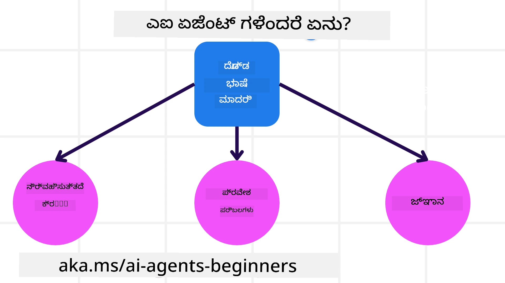
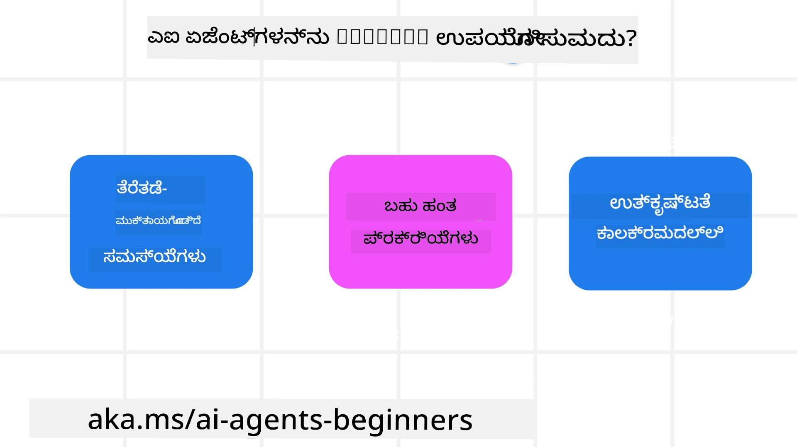

> _(ಈ ಪಾಠದ ವಿಡಿಯೋವನ್ನು ನೋಡಲು ಮೇಲಿನ ಚಿತ್ರವನ್ನು ಕ್ಲಿಕ್ ಮಾಡಿ)_

# ಕೃತಕ ಬುದ್ಧಿಮತ್ತೆ ಏಜೆಂಟ್‌ಗಳು ಮತ್ತು ಏಜೆಂಟ್ ಬಳಕೆ ಪ್ರಕರಣಗಳಿಗೆ ಪರಿಚಯ

Welcome to the "AI Agents for Beginners" course! This course provides fundamental knowledge and applied samples for building AI Agents.

Join the <a href="https://discord.gg/kzRShWzttr" target="_blank">Azure AI Discord ಸಮುದಾಯ</a> to meet other learners and AI Agent Builders and ask any questions you have about this course.

To start this course, we begin by getting a better understanding of what AI Agents are and how we can use them in the applications and workflows we build.

## Introduction

This lesson covers:

- AI ಏಜೆಂಟ್‌ಗಳು ಎಂದರೇನು ಮತ್ತು ವಿಭಿನ್ನ ವಿಧದ ಏಜೆಂಟ್‌ಗಳು ಯಾವುವು?
- ಏಜೆಂಟ್‌ಗಳನ್ನು ಬಳಸಲು ಯಾವ ಬಳಕೆ ಪ್ರಕರಣಗಳು ಉತ್ತಮ ಮತ್ತು ಅವು ನಮಗೆ ಹೇಗೆ ಸಹಾಯ ಮಾಡಬಹುದು?
- ಏಜೆಂಟಿಕ್ ಪರಿಹಾರಗಳನ್ನು ವಿನ್ಯಾಸಗೊಳಿಸುವಾಗ ಕೆಲವು ಮೂಲಭೂತ ನಿರ್ಮಾಣ ಬ್ಲಾಕ್ಗಳು ಯಾವುವು?

## Learning Goals
After completing this lesson, you should be able to:

- AI ಏಜೆಂಟ್‌ಗಳ ಕಲ್ಪನೆಗಳನ್ನು ಮತ್ತು ಅವು ಇತರ AI ಪರಿಹಾರಗಳಿಂದ ಹೇಗೆ ಭಿನ್ನವಾಗಿವೆ ಎಂಬುದನ್ನು ಅರ್ಥಮಾಡಿಕೊಳ್ಳಲು.
- AI ಏಜೆಂಟ್‌ಗಳನ್ನು ಹೆಚ್ಚು ಪರಿಣಾಮಕಾರಿಯಾಗಿ ಅನ್ವಯಿಸಲು.
- ಬಳಕೆದಾರರು ಮತ್ತು ಗ್ರಾಹಕರಿಗಾಗಿ ಉಪಯುಕ್ತವಾಗಿ ಏಜೆಂಟ್‌ಗತ ಪರಿಹಾರಗಳನ್ನು ವಿನ್ಯಾಸಗೊಳಿಸಲು.

## Defining AI Agents and Types of AI Agents

### What are AI Agents?

AI ಏಜೆಂಟ್‌ಗಳು **ಸಿಸ್ಟಮ್‌ಗಳು** ಆಗಿದ್ದು, **Large Language Models(LLMs)** ಅವರಿಗೆ **ಕಾರ್ಯಗಳನ್ನು ನಿರ್ವಹಿಸಲು** ಅವರ ಸಾಮರ್ಥ್ಯವನ್ನು ವಿಸ್ತರಿಸುವ ಮೂಲಕ LLMs ಗೆ **ೋಪಕರಣಗಳ ಪ್ರವೇಶ** ಮತ್ತು **ಜ್ಞಾನ** ನೀಡುವ ಮೂಲಕ ಸಾಧ್ಯಮಾಡುತ್ತವೆ.

Let's break this definition into smaller parts:

- **System** - ಏಜೆಂಟ್‌ಗಳನ್ನು ಒಂದು ಏಕಘಟಕವಾಗಿ ಮಾತ್ರವಲ್ಲದೆ ಅನೇಕ ಘಟಕಗಳ ವ್ಯವಸ್ಥೆಯಾಗಿ ಯೋಚಿಸುವುದು ಮುಖ್ಯ. ಮೂಲسطರದಲ್ಲಿ, AI ಏಜೆಂಟ್‌ನ ಘಟಕಗಳು ಇವುಗಳಾಗಿವೆ:
  - **Environment** - AI ಏಜೆಂಟ್ ಕಾರ್ಯನಿರ್ವಹಿಸುವ ನಿರ್ದಿಷ್ಟ ಜಾಗ. ಉದಾಹರಣೆಗೆ, ನಮ್ಮ ಬಳಿ ಪ್ರಯಾಣ ಬುಕ್ಕಿಂಗ್ AI ಏಜೆಂಟ್ ಇದ್ದರೆ, ಪರಿಸರವು ಏಜೆಂಟ್ ಕೆಲಸಗಳನ್ನು ಪೂರ್ಣಗೊಳಿಸಲು ಬಳಸುವ ಪ್ರಯಾಣ ಬುಕ್ಕಿಂಗ್ ವ್ಯವಸ್ಥೆಯಾಗಿರಬಹುದು.
  - **Sensors** - ಪರಿಸರಗಳಲ್ಲಿ ಮಾಹಿತಿ ಇರುತ್ತದೆ ಮತ್ತು ಪ್ರತಿಕ್ರಿಯೆಯನ್ನು ಒದಗಿಸಲಾಗುತ್ತದೆ. AI ಏಜೆಂಟ್‌ಗಳು ಪರಿಸರದ ಪ್ರಸ್ತುತ ಸ್ಥಿತಿಗೊ concerning ಮಾಹಿತಿ ಸಂಗ್ರಹಿಸಲು ಮತ್ತು ಅರ್ಥಮಾಡಿಕೊಳ್ಳಲು ಸೆನ್ಸರ್‌ಗಳನ್ನು ಬಳಸುತ್ತವೆ. ಪ್ರಯಾಣ ಬುಕ್ಕಿಂಗ್ ಏಜೆಂಟ್ ಉದಾಹರಣೆಯಲ್ಲಿ, ಬುಕ್ಕಿಂಗ್ ವ್ಯವಸ್ಥೆ ಹೋಟೆಲ್ ಲಭ್ಯತೆ ಅಥವಾ ವಿಮಾನ ದರಗಳಂತಹ ಮಾಹಿತಿಯನ್ನು ಒದಗಿಸಬಹುದು.
  - **Actuators** - ಏಜೆಂಟ್ ಪರಿಸರದ ಪ್ರಸ್ತುತ ಸ್ಥಿತಿಯನ್ನು ಪಡೆದ ಬಳಿಕ, ಪ್ರಸ್ತುತ ಕಾರ್ಯಕ್ಕೆ ಸಂಬಂಧಿಸಿದಂತೆ ಪರಿಸರವನ್ನು ಬದಲಾಯಿಸಲು ಯಾವ ಕ್ರಿಯೆಯನ್ನು ನಿರ್ವಹಿಸಬೇಕು ಎಂದು ನಿರ್ಧರಿಸುತ್ತದೆ. ಪ್ರಯಾಣ ಬುಕ್ಕಿಂಗ್ ಏಜೆಂಟ್‌ಗೆ, ಅದು ಬಳಕೆದಾರನಿಗಾಗಿ ಲಭ್ಯವಿರುವ ಕೋಣೆಯನ್ನು ಬುಕ್ ಮಾಡುವುದು ಆಗಬಹುದು.

**Large Language Models** - ಏಜೆಂಟ್‌ಗಳ ಕಲ್ಪನೆ LLM ಗಳ ಸೃಷ್ಟಿಗಿಂತ ಮುಂಚೆಯೇ ಅಸ್ತಿತ್ವದಲ್ಲಿತ್ತು. LLM ಗಳೊಂದಿಗೆ AI ಏಜೆಂಟ್‌ಗಳನ್ನು ನಿರ್ಮಿಸುವದರಿಂದ ಲಾಭವೆಂದರೆ ಮಾನವ ಭಾಷೆಯನ್ನು ಮತ್ತು ಡೇಟಾವನ್ನು ಅರ್ಥಮಾಡಿಕೊಳ್ಳುವ ಅವರ ಸಾಮರ್ಥ್ಯ. ಈ ಸಾಮರ್ಥ್ಯ LLM ಗಳಿಗೆ ಪರಿಸರ ಮಾಹಿತಿ ಅರ್ಥಮಾಡಿಕೊಳ್ಳಲು ಮತ್ತು ಪರಿಸರವನ್ನು ಬದಲಾಯಿಸುವ ಯೋಜನೆಯನ್ನು ನಿರ್ಧರಿಸಲು ಅನುಮತಿಸುತ್ತದೆ.

**Perform Actions** - AI ಏಜೆಂಟ್ ವ್ಯವಸ್ಥೆಗಳ ಹೊರತಾಗಿ, LLM ಗಳು ಬಳಕೆದಾರನ ಪ್ರಾಂಪ್ಟ್ ಆಧಾರದ ಮೇಲೆ ವಿಷಯ ಅಥವಾ ಮಾಹಿತಿಯನ್ನು ರಚಿಸುವಂತಹ ಸ್ಥಿತಿಗಳಿಗೆ ಮಾತ್ರ ಸೀಮಿತವಾಗಿವೆ. AI ಏಜೆಂಟ್ ವ್ಯವಸ್ಥೆಗಳೊಳಗೆ LLM ಗಳು ಬಳಕೆದಾರನ ವಿನಂತಿಯನ್ನು ಅರ್ಥಮಾಡಿಕೊಳ್ಳುವ ಮೂಲಕ ಮತ್ತು ಅವರ ಪರಿಸರದಲ್ಲಿ ಲಭ್ಯವಿರುವ ಉಪಕರಣಗಳನ್ನು ಬಳಸಿ ಕಾರ್ಯಗಳನ್ನು ಸಾಧಿಸಬಹುದು.

**Access To Tools** - LLM ಗೆ ಯಾವ ಉಪಕರಣಗಳಿಗೆ ಪ್ರವೇಶವಿದೆ ಎಂಬುದು 1) ಅದು ಕಾರ್ಯನಿರ್ವಹಿಸುತ್ತಿರುವ ಪರಿಸರ ಮತ್ತು 2) ಏಜೆಂಟ್ ಅನ್ನು ಅಭಿವೃದ್ಧಿಪಡಿಸುವ ಡೆವಲಪರ್ ಮೂಲಕ ನಿರ್ಧರಿಸಲಾಗುತ್ತದೆ. ನಮ್ಮ ಪ್ರಯಾಣ ಏಜೆಂಟ್ ಉದಾಹರಣೆಗೆ, ಏಜೆಂಟ್‌ನ ಉಪಕರಣಗಳು ಬುಕ್ಕಿಂಗ್ ವ್ಯವಸ್ಥೆಯಲ್ಲಿ ಲಭ್ಯವಿರುವ ಆಪರೇಷನ್‌ಗಳ ಮೂಲಕ ಸೀಮಿತವಾಗಿರಬಹುದು, ಮತ್ತು/ಅಥವಾ ಡೆವಲಪರ್ ಏಜೆಂಟ್‌ನ ಉಪಕರಣ ಪ್ರವೇಶವನ್ನು ವಿಮಾನಗಳಿಗೂ ಮಿತಿ ಮಾಡಬಹುದು.

**Memory+Knowledge** - ಮೆಮರಿ ಚರ್ಚೆಯ ಕಂಟೆಕ್ಸ್ಟ್‌ನಲ್ಲಿ ಸಂಕ್ಷಿಪ್ತಾವಧಿಯಾಗಿರಬಹುದು, ಬಳಕೆದಾರ ಮತ್ತು ಏಜೆಂಟ್ ನಡುವೆ. ದೀರ್ಘಕಾಲಿಕವಾಗಿ, ಪರಿಸರದಿಂದ ನೀಡಿದ ಮಾಹಿತಿಯ ಹೊರತಾಗಿ, AI ಏಜೆಂಟ್‌ಗಳು ಇತರ ವ್ಯವಸ್ಥೆಗಳು, ಸೇವೆಗಳು, ಉಪಕರಣಗಳು ಮತ್ತು ಇತರ ಏಜೆಂಟ್‌ಗಳಿಂದಲೂ ಜ್ಞಾನವನ್ನು ಪಡೆದಿಕೊಳ್ಳಬಹುದು. ಪ್ರಯಾಣ ಏಜೆಂಟ್ ಉದಾಹರಣೆಯಲ್ಲಿ, ಈ ಜ್ಞಾನವು ಗ್ರಾಹಕರ ಡೇಟಾಬೇಸ್‌ನಲ್ಲಿ ಇರುವ ಬಳಕೆದಾರರ ಪ್ರಯಾಣ ವಿಧಾನಗಳ ಕುರಿತು ಮಾಹಿತಿ ಆಗಿರಬಹುದು.

### The different types of agents

Now that we have a general definition of AI Agents, let us look at some specific agent types and how they would be applied to a travel booking AI agent.

| **Agent Type**                | **Description**                                                                                                                       | **Example**                                                                                                                                                                                                                   |
| ----------------------------- | ------------------------------------------------------------------------------------------------------------------------------------- | ----------------------------------------------------------------------------------------------------------------------------------------------------------------------------------------------------------------------------- |
| **ಸರಳ ಪ್ರತಿಬಿಂಬ ಏಜೆಂಟ್‌ಗಳು**      | ಪೂರ್ವನಿರ್ಧರಿತ ನಿಯಮಗಳ ಆಧಾರದ ಮೇಲೆ ತಕ್ಷಣದ ಕ್ರಿಯೆಗಳನ್ನು ನಿರ್ವಹಿಸುತ್ತವೆ.                                                                                  | ಪ್ರಯಾಣ ಏಜೆಂಟ್ ಇಮೇಲ್‌ನ.context ಇ interprets ಮಾಡಿ ಪ್ರಯಾಣದ ದೂರುಗಳನ್ನು ಗ್ರಾಹಕಸೇವೆಗೆ ಫಾರ್ವರ್ಡ್ ಮಾಡಬಹುದು.                                                                                                                          |
| **ಮಾದರಿ ಆಧಾರಿತ ಪ್ರತಿಬಿಂಬ ಏಜೆಂಟ್‌ಗಳು** | ಜಗತ್ತಿನ ಒಂದು ಮಾದರಿಯ ಆಧಾರದ ಮೇಲೆ ಮತ್ತು ಆ ಮಾದರಿಗೆ ಆಗುವ ಬದಲಾಗಗಳಿಂದ ಕ್ರಿಯೆಗಳನ್ನು ನಿರ್ವಹಿಸುತ್ತವೆ.                                                              | ಪ್ರಯಾಣ ಏಜೆಂಟ್ historical pricing data ಗೆ ಪ್ರವೇಶ ಹೊಂದಿರುವ ಆಧಾರದ ಮೇಲೆ ಮಹತ್ವದ ಬೆಲೆ ಬದಲಾವಣೆಗಳಿರುವ ಮಾರ್ಗಗಳಿಗೆ ಪ್ರಾಥಮ್ಯ ನೀಡುತ್ತದೆ.                                                                                                             |
| **ಲಕ್ಷ್ಯ ಆಧಾರಿತ ಏಜೆಂಟ್‌ಗಳು**         | ಗುರಿಯನ್ನು ಅರ್ಥಮಾಡಿಕೊಳ್ಳುವುದರ ಮೂಲಕ ವಿಶೇಷ ಗುರಿಗಳನ್ನು ಸಾಧಿಸಲು ಯೋಜನೆಗಳನ್ನು ರಚಿಸಿ, ಅದನ್ನು ತಲುಪಲು ಕ್ರಮಗಳನ್ನು ನಿರ್ಧರಿಸುತ್ತವೆ.                                  | ಪ್ರಯಾಣ ಏಜೆಂಟ್ ಒಂದು ಪ್ರಯಾಣವನ್ನು ಬುಕ್ ಮಾಡುವಾಗ ಪ್ರಸ್ತುತ ಸ್ಥಳದಿಂದ ಗಮ್ಯಸ್ಥಾನದವರೆಗೆ ಅಗತ್ಯವಿರುವ ಪ್ರಯಾಣ ವ್ಯವಸ್ಥೆಗಳನ್ನು (ಕಾರ್, ಸಾರ್ವಜನಿಕ ಸಾರಿಗೆ, ವಿಮಾನಗಳು) ನಿರ್ಧರಿಸಿಕೊಳ್ಳುತ್ತದೆ.                                                                                |
| **ಉಪಯುಕ್ತತೆ ಆಧಾರಿತ ಏಜೆಂಟ್‌ಗಳು**      | ಬೇಡಿಕೆಗಳನ್ನು ಪರಿಗಣಿಸಿ ಮತ್ತು ಲಾಭ-ನಷ್ಟಗಳನ್ನು ಸಂಖ್ಯಾತ್ಮಕವಾಗಿ ತೂಕ ನೀಡಿ ಗುರಿಗಳನ್ನು ಹೇಗೆ ಸಾಧಿಸಬೇಕು ಎಂದು ನಿರ್ಧರಿಸುತ್ತವೆ.                                               | ಪ್ರಯಾಣ ಏಜೆಂಟ್ ಸುಲಭತೆ ಮತ್ತು ವೆಚ್ಚವನ್ನು ತೂಕ ಹಾಕಿ ಪ್ರಯಾಣವನ್ನು ಬುಕ್ ಮಾಡುವಾಗ ಉಪಯುಕ್ತತೆಯನ್ನು ಗರಿಷ್ಠಗೊಳಿಸುತ್ತದೆ.                                                                                                                                          |
| **ಅಭ್ಯಾಸದೊಂದಿಗೆ ಸುಧಾರಿಸುವ ಏಜೆಂಟ್‌ಗಳು**           | ಪ್ರತಿಕ್ರಿಯೆಗೆ ಪ್ರತಿಕ್ರಿಯಿಸಿ ಮತ್ತು ಅದರ ಪ್ರಕಾರ ಕ್ರಿಯೆಗಳನ್ನು ಹೊಂದಿಸಿ ಕಾಲಕ್ರಮೇಣ ಸುಧಾರಣೆಗೊಳ್ಳುತ್ತವೆ.                                                        | ಪ್ರಯಾಣ ಏಜೆಂಟ್ ಪೋಸ್ಟ್-ಟ್ರಿಪ್ ಸಮೀಕ್ಷೆಗಳಿಂದ ಗ್ರಾಹಕರ ಪ್ರತಿಕ್ರಿಯೆಯನ್ನು ಬಳಸುವ ಮೂಲಕ ಭವಿಷ್ಯದ ಬುಕ್ಕಿಂಗ್‌ಗಳಿಗೆ ಹೊಂದಾಣಿಕೆ ಮಾಡಲು ಸುಧಾರಿಸುತ್ತದೆ.                                                                                                               |
| **ಹೈರಾರ್ಕಿಕ ಏಜೆಂಟ್‌ಗಳು**       | ಒಟ್ಟಾರೆ ವ್ಯವಸ್ಥೆಯಲ್ಲಿ ಹಲವು ಏಜೆಂಟ್‌ಗಳನ್ನು ಹೊಂದಿದ್ದು, ಉನ್ನತ ಮಟ್ಟದ ಏಜೆಂಟ್‌ಗಳು ಕೆಲಸಗಳನ್ನು ಉಪಕಾರ್ಯಗಳಲ್ಲಿ ವಿಭಜಿಸಿ ತಳಮಟ್ಟದ ಏಜೆಂಟ್‌ಗಳಿಗೆ ಅಗತ್ಯಕಾರ್ಯಗಳನ್ನು ಪೂರ್ಣಗೊಳಿಸಲು ನೀಡುತ್ತವೆ. | ಪ್ರಯಾಣ ಏಜೆಂಟ್ ಒಂದು ಪ್ರಯಾಣವನ್ನು ರದ್ದುಮಾಡುವಾಗ ಕೆಲಸವನ್ನು ಉಪಕಾರ್ಯಗಳಾಗಿ ವಿಭಜಿಸಿ (ಉದಾಹರಣೆಗೆ, ನಿರ್ದಿಷ್ಟ ಬುಕ್ಕಿಂಗ್‌ಗಳನ್ನು ರದ್ದುಮಾಡುವುದು) ತಳಮಟ್ಟದ ಏಜೆಂಟ್‌ಗಳಿಗೆ ಪೂರ್ಣಗೊಳಿಸಲು ನೀಡುತ್ತದೆ ಮತ್ತು ಮೇಲ್ಮಟ್ಟದ ಏಜೆಂಟ್‌ಗೆ ವರದಿ ಮಾಡಬಹುದು.                                     |
| **ಬಹು-ಏಜೆಂಟ್ ವ್ಯವಸ್ಥೆಗಳು (MAS)** | ಏಜೆಂಟ್‌ಗಳು ಸ್ವತಂತ್ರವಾಗಿ ಕಾರ್ಯಗಳನ್ನು ಪೂರ್ಣಗೊಳಿಸುತ್ತವೆ, ಸಹಕಾರಿಯಾಗಿ ಅಥವಾ ಸ್ಪರ್ಧಾತ್ಮಕವಾಗಿ.                                                           | ಸಹಕಾರಾತ್ಮಕ: ಹಲವು ಏಜೆಂಟ್‌ಗಳು ಹೋಟೆಲ್, ವಿಮಾನ ಮತ್ತು ಮನರಂಜನೆಗಳಂತಹ ವಿಶೇಷ ಪ್ರಯಾಣ ಸೇವೆಗಳನ್ನು ಬುಕ್ ಮಾಡುತ್ತವೆ. ಸ್ಪರ್ಧಾತ್ಮಕ: ಹಲವು ಏಜೆಂಟ್‌ಗಳು ಹಂಚಲಾದ ಹೋಟೆಲ್ ಬುಕ್ಕಿಂಗ್ ಕ್ಯಾಲೆಂಡರ್ ಮೇಲೆ ಗ್ರಾಹಕರನ್ನು ಹೋಟೆಲ್‌ಗೆ ಬುಕ್ ಮಾಡಲು ನಿರ್ವಹಣೆ ಮತ್ತು ಸ್ಪರ್ಧೆ ನಡೆಸುತ್ತವೆ. |

## When to Use AI Agents

In the earlier section, we used the Travel Agent use-case to explain how the different types of agents can be used in different scenarios of travel booking. We will continue to use this application throughout the course.

Let's look at the types of use cases that AI Agents are best used for:

- **Open-Ended Problems** - LLM ಗೆ ಕಾರ್ಯವನ್ನು ಪೂರ್ಣಗೊಳಿಸಲು ಅಗತ್ಯವಿರುವ ಹಂತಗಳನ್ನು ನಿರ್ಧರಿಸುವಂತೆ ಅನುಮತಿಸುವುದು, ಏಕೆಂದರೆ ಇದನ್ನು ಯಾವಾಗಲೂ ವರ್ಕ್ಫ್ಲೋಗೆ ಹಾರ್ಡ್‌ಕೋಡ್ ಮಾಡಲಾಗುವುದಿಲ್ಲ.
- **Multi-Step Processes** - ಹಲವು ಹಂತಗಳಲ್ಲಿ ಉಪಕರಣಗಳು ಅಥವಾ ಮಾಹಿತಿಯನ್ನು ಬಳಸಬೇಕಾಗುವಂತೆ ಇರುವ ಕಾರ್ಯಗಳು, ಹೆಚ್ಚಿನ ಸಂಕೀರ್ಣತೆಯನ್ನು ಅಗತ್ಯವಿದೆ, ಆಗ AI ಏಜೆಂಟ್‌ವು ಬಹು ಮುಖಾಂತರ ಉಪಕರಣಗಳನ್ನು ಅಥವಾ ಮಾಹಿತಿಯನ್ನು ಬಳಸಬೇಕಾಗುತ್ತದೆ ಬದಲಾಗಿ ಒಂದೇ ಬಾರಿ single-shot retrieval.  
- **Improvement Over Time** - ಏಜೆಂಟ್ ಸಮಯಕ್ಕೆಸಮಯಕ್ಕೆ ಸುಧಾರಿಸಿಕೊಳ್ಳಬಹುದಾದ ಕಾರ್ಯಗಳು, ಪರಿಸರ ಅಥವಾ ಬಳಕೆದಾರರಿಂದ ಪ್ರತಿಕ್ರಿಯೆ ಪಡೆದು ಉತ್ತಮ ಉಪಯುಕ್ತತೆಯನ್ನು ಒದಗಿಸಲು.

We cover more considerations of using AI Agents in the Building Trustworthy AI Agents lesson.

## Basics of Agentic Solutions

### Agent Development

The first step in designing an AI Agent system is to define the tools, actions, and behaviors. In this course, we focus on using the **Azure AI Agent Service** to define our Agents. It offers features like:

- Selection of Open Models such as OpenAI, Mistral, and Llama
- Use of Licensed Data through providers such as Tripadvisor
- Use of standardized OpenAPI 3.0 tools

### Agentic Patterns

Communication with LLMs is through prompts. Given the semi-autonomous nature of AI Agents, it isn't always possible or required to manually reprompt the LLM after a change in the environment. We use **ಏಜೆಂಟ್‌ಗತ ಮಾದರಿಗಳು** that allow us to prompt the LLM over multiple steps in a more scalable way.

This course is divided into some of the current popular Agentic patterns.

### Agentic Frameworks

Agentic Frameworks allow developers to implement agentic patterns through code. These frameworks offer templates, plugins, and tools for better AI Agent collaboration. These benefits provide abilities for better observability and troubleshooting of AI Agent systems.

In this course, we will explore the Microsoft Agent Framework (MAF) for building production-ready AI agents.

## Sample Codes

- Python: [ಏಜೆಂಟ್ ಫ್ರೇಮ್‌ವರ್ಕ್](./code_samples/01-python-agent-framework.ipynb)
- .NET: [ಏಜೆಂಟ್ ಫ್ರೇಮ್‌ವರ್ಕ್](./code_samples/01-dotnet-agent-framework.md)

## Got More Questions about AI Agents?

Join the [Microsoft Foundry ಡಿಸ್ಕೋರ್ಡ್](https://aka.ms/ai-agents/discord) to meet with other learners, attend office hours and get your AI Agents questions answered.

## Previous Lesson

[ಕೋರ್ಸ್ ಸೆಟ್‌ಅಪ್](../00-course-setup/README.md)

## Next Lesson

[ಏಜೆಂಟ್‌ಗತ ಫ್ರೇಮ್‌ವರ್ಕ್‌ಗಳನ್ನು ಅನ್ವೇಷಿಸುವುದು](../02-explore-agentic-frameworks/README.md)

---

<!-- CO-OP TRANSLATOR DISCLAIMER START -->
ಜವಾಬ್ದಾರಿ ನಿರಾಕರಣೆ:
ಈ ದಾಖಲೆಗಳನ್ನು AI ಆಧಾರಿತ ಅನುವಾದ ಸೇವೆ [Co-op Translator](https://github.com/Azure/co-op-translator) ಬಳಸಿ ಅನುವಾದಿಸಲಾಗಿದೆ. ನಾವು ನಿಖರತೆಗೆ ಪ್ರಯತ್ನಿಸುತ್ತಿದ್ದರೂ, ಸ್ವಯಂಚಾಲಿತ ಅನುವಾದಗಳಲ್ಲಿ ತಪ್ಪುಗಳು ಅಥವಾ ಅಶುದ್ಧತೆಗಳು ಇರಬಹುದೆಂದು ದಯವಿಟ್ಟು ಗಮನಿಸಿ. ಮೂಲ ದಾಖಲೆ ಅದಿನ ಸ್ವಂತ ಭಾಷೆಯಲ್ಲಿ ಅಧಿಕೃತ ಮೂಲವೆಂದು ಪರಿಗಣಿಸಬೇಕಾಗಿದೆ. ಗಂಭೀರ ಮಾಹಿತಿಗಾಗಿ ವೃತ್ತಿಪರ ಮಾನವ ಅನುವಾದವನ್ನು ಶಿಫಾರಸು ಮಾಡಲಾಗುತ್ತದೆ. ಈ ಅನುವಾದ ಬಳಕೆಯಿಂದ ಉಂಟಾಗುವ ಯಾವುದೇ ಅಸಮಜ้นತೆಗಳು ಅಥವಾ ತಪ್ಪು ಅರ್ಥೈಸುಗಳಿಗೆ ನಾವು ಹೊಣೆಗಾರರಿಲ್ಲ.
<!-- CO-OP TRANSLATOR DISCLAIMER END -->