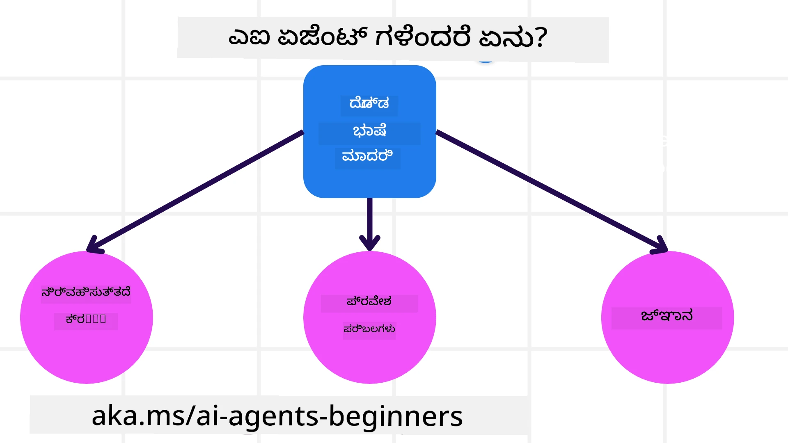
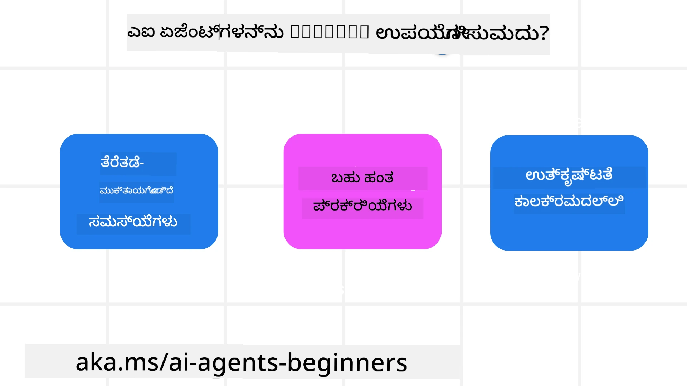

> _(ಈ ಪಾಠದ වීಡಿಯೋವನ್ನು ನೋಡಲು ಮೇಲಿನ ಚಿತ್ರವನ್ನು ಕ್ಲಿಕ್ ಮಾಡಿ)_

# AI ಏಜೆಂಟ್‌ಗಳು ಮತ್ತು ಏಜೆಂಟ್ ಬಳಕೆ ಪ್ರಕರಣಗಳ ಪರಿಚಯ

**ಬಿಗಿನ್ನರ್ಸ್‌ಗಾಗಿ AI ಏಜೆಂಟ್‌ಗಳು** ಕೋರ್ಸ್‌ಗೆ ಸ್ವಾಗತ! ಈ ಕೋರ್ಸ್ ನಿಮಗೆ ಮೂಲಭೂತ ಜ್ಞಾನ ಮತ್ತು ನೈಜ ಕೆಲಸ ಮಾಡುವ ಕೋಡ್ ಅನ್ನು ನೀಡುತ್ತದೆ — ಶೂನ್ಯದಿಂದ AI ಏಜೆಂಟ್‌ಗಳನ್ನು ನಿರ್ಮಿಸಲು ಪ್ರಾರಂಭಿಸಲು.

<a href="https://discord.gg/kzRShWzttr" target="_blank">Azure AI Discord Community</a> ನಲ್ಲಿ ನಮಗೆ ಹಾಯ್ ಹೇಳಿ — ಇಲ್ಲಿ ಕಲಿಕೆಯು ಹಾಗೂ AI ನಿರ್ಮಾಪಕರು ಇರುವವರು ಪ್ರಶ್ನೆಗಳಿಗೆ ಸಂತೋಷದಿಂದ ಉತ್ತರಿಸುತ್ತಾರೆ.

ನಾವು ನಿರ್ಮಾಣ ಪ್ರಾರಂಭಿಸುವ ಮೊದಲು, AI ಏಜೆಂಟ್ *ಎಂದರೆ ಏನು* ಮತ್ತು ಎವುಸಮಯದಲ್ಲಿ ಉಪಯೋಗಿಸುವುದು ಬುದ್ಧಿವಂತಿಕೆ ಎಂಬುದನ್ನು ಬಲ್ಲಿರೋಣ.

---

## ಪರಿಚಯ

ಈ ಪಾಠದಲ್ಲಿ ಚರ್ಚೆ ಮಾಡುವುದು:

- AI ಏಜೆಂಟ್‌ಗಳು ಏನು ಮತ್ತು ವಿವಿಧ ವಿಧಗಳು ಯಾವುವು
- AI ಏಜೆಂಟ್‌ಗಳು ಉತ್ತಮವಾಗಿ ಹೊಂದಿಕೊಳ್ಳುವ ಕಾರ್ಯಗಳ ಬಗೆಗಿನ ಮಾಹಿತಿ
- ಏಜೆಂಟಿಕ್ ಪರಿಹಾರ ವಿನ್ಯಾಸ ಮಾಡಲು ನೀವು ಬಳಸುವ ಮೂಲಭೂತ ಅಂಶಗಳು

## ಕಲಿಕೆಯ ಗುರಿಗಳನ್ನು

ಈ ಪಾಠದ ಕೊನೆಯಲ್ಲಿ, ನೀವು ಕೈಗಾರಿಕೆಗೊಳ್ಳಬೇಕಾಗಿರುವುದು:

- AI ಏಜೆಂಟ್ ಎಂದರೆ ಏನು ಮತ್ತು ಇದು ಸಾಮಾನ್ಯ AI ಪರಿಹಾರದಿಂದ ಹೇಗೆ ಭಿನ್ನವಾಗಿದ್ದು ಎಂಬುದನ್ನು ವಿವರಿಸುವದು
- ಯಾವಾಗ AI ಏಜೆಂಟ್ ಬಳಸಬೇಕೆಂದು (ಮತ್ತು ಯಾವಾಗ ಬಳಸಬಾರದು) ತಿಳಿದುಕೊಳ್ಳುವುದು
- ನೈಜ ಜಗತ್ತಿನ ಸಮಸ್ಯೆಗೆ ಮೂಲ ಏಜೆಂಟಿಕ್ ಪರಿಹಾರ ವಿನ್ಯಾಸವನ್ನು ತಯಾರಿಸುವದು

---

## AI ಏಜೆಂಟ್‌ಗಳು ಮತ್ತು AI ಏಜೆಂಟ್‌ಗಳ ಬಗೆಗಿನ ವ್ಯಾಖ್ಯಾನ

### AI ಏಜೆಂಟ್‌ಗಳು ಎಂದರೆ ಏನು?

ಇದನ್ನು ಸರಳವಾಗಿ这样ಕೊಳ್ಳಿ:

> **AI ಏಜೆಂಟ್‌ಗಳು ದೊಡ್ಡ ಭಾಷಾ ಮಾದರಿಗಳು (LLMs) ವಾಸ್ತವವಾಗಿ *ಆಗಬಹುದು ಮತ್ತು ಮಾಡುವುದಕ್ಕೆ* ಅವಕಾಶ ನೀಡುವ ವ್ಯವಸ್ಥೆಗಳು — ಅವರಿಗೆ ವಿಶ್ವದ ಮೇಲೆ ಕಾರ್ಯಗತಗೊಳಿಸುವುದಕ್ಕೆ ಸಾಧನಗಳು ಮತ್ತು ಜ್ಞಾನವನ್ನು ಕೊಡಿಸುವುದು, ಕೇವಲ ಪ್ರಾಂಪ್ಟ್‌ಗಳಿಗೆ ಪ್ರತಿಕ್ರಿಯಿಸುವುದಲ್ಲ.**

ಇದನ್ನು ಸ್ವಲ್ಪ ವಿವರಿಸುತ್ತೇವೆ:

- **ವ್ಯವಸ್ಥೆ** — AI ಏಜೆಂಟ್ ಒಂದೇ ಒಂದು ವಸ್ತು ಮಾತ್ರವಲ್ಲ. ಅದು ಭಾಗಗಳ ಸಂಗ್ರಹವಾಗಿದ್ದು, ಒಟ್ಟಾಗಿ ಕೆಲಸ ಮಾಡುತ್ತವೆ. ಪ್ರತಿ ಏಜೆಂಟ್ ಬಳಿ ಮೂರು ಭಾಗಗಳಿವೆ:
  - **ಪರಿಸರ** — ಏಜೆಂಟ್ ಕಾರ್ಯನಿರ್ವಹಿಸುವ ಸ್ಥಳ. ಪ್ರವಾಸ ಬುಕ್ಕಿಂಗ್ ಏಜೆಂಟ್‌ಗಾಗಿ ಇದು ಬುಕ್ಕಿಂಗ್ ವೇದಿಕೆ ಆಗಿರುತ್ತದೆ.
  - **ಸೆನ್ಸರ್‌ಗಳು** — ಏಜೆಂಟ್ ತನ್ನ ಪರಿಸರದ ಪ್ರಸ್ತುತ ಸ್ಥಿತಿಯನ್ನು ಹೇಗೆ ಓದುವದು. ನಮ್ಮ ಪ್ರವಾಸ ಏಜೆಂಟ್ ಹೋಟೆಲ್ ಲಭ್ಯತೆ ಅಥವಾ ವಿಮಾನ ದರಗಳನ್ನು ಪರಿಶೀಲಿಸಬಹುದು.
  - **ಕ್ರಮಚಾರಿ (ಅಕ್ಚುವೇಟರ್‌ಗಳು)** — ಏಜೆಂಟ್ ಕ್ರಮ ತೆಗೆದುಕೊಳ್ಳುವುದು ಹೇಗೆ. ಪ್ರವಾಸ ಏಜೆಂಟ್ ಒಂದು ಕೊಠಡಿಯನ್ನು ಬುಕ್ ಮಾಡಬಹುದು, ದೃಢೀಕರಣ ಕಳುಹಿಸಬಹುದು, ಅಥವಾ ಸಂರಕ್ಷಣೆ ರದ್ದು ಮಾಡಬಹುದು.

- **ದೊಡ್ಡ ಭಾಷಾ ಮಾದರಿಗಳು (LLMs)** — ಏಜೆಂಟ್‌ಗಳು LLM ಗಳಿಗೆ ಮುಂಚೆಯೇ ಇದ್ದವು, ಆದರೆ LLMಗಳು ಆಧುನಿಕ ಏಜೆಂಟ್‌ಗಳನ್ನು ಅತ್ಯಂತ ಶಕ್ತಿಶಾಲಿಯಾಗಿಸಿದ್ದಾರೆ. ಇವು ಸಹಜ ಭಾಷೆಯನ್ನು ಅರ್ಥಮಾಡಿಕೊಳ್ಳುತ್ತವೆ, ಸಾಂದರ್ಭಿಕಕ್ಕೂ ತರ್ಕ ಮಾಡುತ್ತವೆ, ಮತ್ತು ಅಸ್ಪಷ್ಟ ಬಳಕೆದಾರ ವಿನಂತಿಯನ್ನು ನಿಖರ ಕಾರ್ಯ ಯೋಜನೆಗೆ ತಿರುಗಿಸುತ್ತವೆ.

- **ಕ್ರಿಯೆಗಳನ್ನು ನಿರ್ವಹಿಸುವುದು** — ಏಜೆಂಟ್ ವ್ಯವಸ್ಥೆಯಿಲ್ಲದೆ, LLM ಕೇವಲ ಪಠ್ಯವನ್ನು ರಚಿಸುತ್ತದೆ. ಏಜೆಂಟ್ ವ್ಯವಸ್ಥೆಯೊಳಗೆ, LLM ನಿಖರವಾಗಿ ಕ್ರಮಗಳನ್ನು *ನಿರ್ವಹಿಸಬಹುದು* — ಡೇಟಾಬೇಸ್ ಹುಡುಕಾಟ, API ಕರೆ, ಸಂದೇಶ ಕಳುಹಿಸುವುದು.

- **ಸಾಧನಗಳಿಗೆ ಪ್ರವೇಶ** — ಏಜೆಂಟ್ ಬಳಸಬಹುದಾದ ಸಾಧನಗಳು (1) ಅದು ಕಾರ್ಯಗತಗೊಳ್ಳುತ್ತಿರುವ ಪರಿಸರ ಮತ್ತು (2) ಅಭಿವೃದ್ಧಿಪಡಿಸುವವರು ಕೊಡೋದು ಮೇಲೆ ಅವಲಂಬಿಸಿದೆ. ಪ್ರವಾಸ ಏಜೆಂಟ್ ವಿಮಾನಗಳನ್ನು ಹುಡುಕಬಹುದು ಆದರೆ ಗ್ರಾಹಕ ದಾಖಲೆಗಳನ್ನು ಸಂಪಾದನೆ ಮಾಡಲು ಸಾಧ್ಯವಿಲ್ಲ — ಇದು ನೀವು ಸಂಪರ್ಕಿಸುವುದರ ಬಗ್ಗೆ.

- **ಸ್ಮರಣೆ + ಜ್ಞಾನ** — ಏಜೆಂಟ್‌ಗಳು ಕಡಿಮೆ ಕಾಲದ ಸ್ಮರಣೆ (ಪ್ರಸ್ತುತ ಸಂವಾದ) ಮತ್ತು ದೀರ್ಘಕಾಲದ ಸ್ಮರಣೆ (ಗ್ರಾಹಕ ഡೇಟಾಬೇಸ್, ಹಿಂದೆಗಿನ ಸಂವಹನ) ಇರಬಹುದು. ಪ್ರವಾಸ ಏಜೆಂಟ್ ನೀವು ಕಿಟಕಿ ಬಲವಾದ ಸೀಟುಗಳನ್ನು ವಾಸನೆಮಾಡಬಹುದು.

---

### AI ಏಜೆಂಟ್‌ಗಳ ವಿಭಿನ್ನ ವಿಧಗಳು

ಎಲ್ಲಾ ಏಜೆಂಟ್‌ಗಳು ಸಮಾನವಾಗಿ ನಿರ್ಮಿಸಲ್ಪಟ್ಟಿಲ್ಲ. ಪ್ರವಾಸ ಬುಕ್ಕಿಂಗ್ ಏಜೆಂಟ್ ಉದಾಹರಣೆಯಿಂದ ಮುಖ್ಯ ವಿಧಗಳ ವಿನ್ಯಾಸ:

| **ಏಜೆಂಟ್ ವಿಧ** | **ಇದನ್ನು ಎಂಥದ್ದು ಮಾಡುತ್ತದೆ** | **ಪ್ರವಾಸ ಏಜೆಂಟ್ ಉದಾಹರಣೆ** |
|---|---|---|
| **ಸರಳ ರಿಫ್ಲೆಕ್ಸ್ ಏಜೆಂಟ್‌ಗಳು** | ಕಠಿಣ-ಕೋಡ್ ಮಾಡಿದ ನಿಯಮಗಳನ್ನು ಅನುಸರಿಸುತ್ತದೆ — ಸ್ಮರಣೆ ಇಲ್ಲ, ಯೋಜನೆ ಇಲ್ಲ. | ದೂರು ಇಮೇಲ್ ನೋಡಿದ → ಗ್ರಾಹಕ ಸೇವೆಗೆ ಮುಂದಾಗುತ್ತದೆ. ಇವೆಷ್ಟೇ. |
| **ಮಾದರಿ ಆಧಾರಿತ ರಿಫ್ಲೆಕ್ಸ್ ಏಜೆಂಟ್‌ಗಳು** | ಜಗತ್ತಿನ ಒಳಐತಿಹಾಸ ಮಾದರಿಯನ್ನು ಇಟ್ಟುಕೊಂಡು, ಅದರ ರೀತಿ ಬದಲಾವಣೆಗೆ ಇದನ್ನು ನವೀಕರಿಸುತ್ತದೆ. | ಇತಿಹಾಸಿಕ ವಿಮಾನ ದರಗಳನ್ನು ಹತ್ತಿರದಿಂದ ತಳೆಯುತ್ತದೆ ಮತ್ತು ಏಕಾಗ್ರವಾದ ಮಾರ್ಗಗಳನ್ನು ಗುರುತಿಸುತ್ತದೆ. |
| **ಗೋಲ್-ಆಧಾರಿತ ಏಜೆಂಟ್‌ಗಳು** | ಗುರಿಯನ್ನು ಮನಸ್ಸಿನಲ್ಲಿ ಇಟ್ಟು, ಅದನ್ನು ಹಂತ ಹಂತವಾಗಿ ಸಾಧಿಸುವದು ಹೇಗೆ ಎಂಬುದನ್ನು ಕಂಡುಕೊಳ್ಳಬಹುದು. | ನೀವು ಇರುವ ಸ್ಥಳದಿಂದ ನಿಮ್ಮ ಗಮ್ಯಸ್ಥಾನಕ್ಕೆ ಹೋಗಲು ಸಂಪೂರ್ಣ ಪ್ರವಾಸ (ವಿಮಾನ, ಕಾರ್, ಹೋಟೆಲ್) ಬುಕ್ ಮಾಡುತ್ತದೆ. |
| **ಉಪಯುಕ್ತತೆ-ಆಧಾರಿತ ಏಜೆಂಟ್‌ಗಳು** | *ಒಂದು* ಪರಿಹಾರವನ್ನು ಮಾತ್ರ ಕಂಡುಹಿಡಿಯುವುದಿಲ್ಲ - ಬದಲಾಗಿ, ವ್ಯಾಪಾರಗಳಿಗೆ ತೂಕಕೊಟ್ಟು *ಉತ್ಕೃಷ್ಟ* ಪರಿಹಾರವನ್ನು ಕಂಡುಹಿಡಿಯುತ್ತದೆ. | ವೆಚ್ಚ ಮತ್ತು ಅನುಕೂಲತೆಯನ್ನು ಸಮತೋಲನೆ ಮಾಡಿ, ನಿಮ್ಮ ಪ್ರಾಧಾನ್ಯತೆಗಳಿಗೆ ಸೂಕ್ತವಾದ ಪ್ರಯಾಣವನ್ನು ಕಂಡುಹಿಡಿಯುತ್ತದೆ. |
| **ಕಲಿಕೆ ಏಜೆಂಟ್‌ಗಳು** | ಪ್ರತಿಕ್ರಿಯೆಯಿಂದ ಕಲಿಕೆಯಿಂದ ಸಮಯಕಡೆಗೂ ಉತ್ತಮವಾಗುತ್ತವೆ. | ಪ್ರವಾಸದ ನಂತರ ಸಮೀಕ್ಷೆಗಳ ಆಧಾರದ ಮೇಲೆ ಭವಿಷ್ಯ ಬುಕ್ಕಿಂಗ್ ಶಿಫಾರಸುಗಳನ್ನು ಹೊಂದಿಕೆ ಮಾಡುತ್ತದೆ. |
| **ಹೈರಾರ್ಕಿಕಲ್ ಏಜೆಂಟ್‌ಗಳು** | ಒಂದು ಉನ್ನತ ಮಟ್ಟದ ಏಜೆಂಟ್ ಕೆಲಸವನ್ನು ಉಪಕಾರ್ಯಗಳಲ್ಲಿ ವಿಭಜಿಸಿ, ತಳಮಟ್ಟದ ಏಜೆಂಟ್‌ಗಳಿಗೆ ಹಂಚುತ್ತದೆ. | "ಪ್ರವಾಸ ರದ್ದುಮಾಡಿ" ವಿನಂತಿ ಒಡೆಯಬಹುದು: ವಿಮಾನ ರದ್ದು, ಹೋಟೆಲ್ ರದ್ದು, ಕಾರು ಬಾಡಿಗೆ ರದ್ದು – ಪ್ರತಿ ಒಂದು ಉಪ-ಏಜೆಂಟ್ ನಿರ್ವಹಿಸುವುದು. |
| **ಬಹು ಏಜೆಂಟ್ ವ್ಯವಸ್ಥೆಗಳು (MAS)** | ಸ್ವತಂತ್ರ ಹಲವಾರು ಏಜೆಂಟ್‌ಗಳು ಒಟ್ಟಿಗೆ (ಸಹಯೋಗ ಅಥವಾ ಸ್ಪರ್ಧೆ) ಕೆಲಸ ಮಾಡುತ್ತಾರೆ. | ಸಹಯೋಗ: ಪ್ರತ್ಯೇಕ ಏಜೆಂಟ್‌ಗಳು ಹೋಟೆಲ್‌ಗಳು, ವಿಮಾನಗಳು, ಮನರಂಜನೆಗಳನ್ನು ನೋಡುತ್ತಾರೆ. ಸ್ಪರ್ಧಾತ್ಮಕ: ಹಲವು ಏಜೆಂಟ್‌ಗಳು ಅತ್ಯುತ್ತಮ ಬೆಲೆಯಲ್ಲಿ ಹೋಟೆಲ್ ಕೊಠಡಿಗಳನ್ನು ತುಂಬಲು ಸ್ಪರ್ಧಿಸುತ್ತವೆ. |

---

## AI ಏಜೆಂಟ್‌ಗಳನ್ನು ಎప్పుడు ಬಳಸಬೇಕು

ನೀವು *ಬಳಸಬಹುದು* ಎಂದರೆಎಲ್ಲವೆಂದು ಅರ್ಥವಲ್ಲ. ಇಲ್ಲಿವೆ ಏಜೆಂಟ್‌ಗಳು ಪರಿಣಾಮಕಾರಿಯಾಗಿ ಬಲಶಾಲಿಯಾದ ಸಂದರ್ಭಗಳು:

- **ಮುಕ್ತ-ಅಂತ್ಯ ಸಮಸ್ಯೆಗಳು** — ಸಮಸ್ಯೆಯನ್ನು ಪರಿಹರಿಸಲು ಹಂತಗಳು ಪೂರ್ವನಿರ್ದಿಷ್ಟವಾಗಿರಲಾರದು. LLM ದಾರಿಗೆ ತಿರುವು ಕೊಡಬೇಕು.
- **ಬಹು ಹಂತ ಪ್ರಕ್ರಿಯೆಗಳು** — ಸಾಧನಗಳನ್ನು ಅನೇಕ ಸಲ ಉಪಯೋಗಿಸುವ ಕೆಲಸಗಳು, ಕೇವಲ ಒಂದು_lookup_ ಅಥವಾ ರಚನೆ ಅಲ್ಲ.
- **ಸಮಯಕ್ಕೆ ಉತ್ತಮಗೊಳ್ಳುವುದು** — ಬಳಕೆದಾರ ಪ್ರತಿಕ್ರಿಯೆ ಅಥವಾ ಪರಿಸರ ಸಂಕೇತಗಳ ಆಧಾರದ ಮೇಲೆ ವ್ಯವಸ್ಥೆ ಬುದ್ಧಿವಂತರಾಗಬೇಕು.

**ನಂಬಿಗಸ್ಥ AI ಏಜೆಂಟ್‌ಗಳನ್ನು ನಿರ್ಮಿಸುವುದು** ಎಂಬ ಪಾಠದಲ್ಲಿ ನಾವು ಯಾವಾಗ (ಮತ್ತು ಯಾವಾಗ *ಬಾರದು*) AI ಏಜೆಂಟ್‌ಗಳನ್ನು ಬಳಸಬೇಕು ಎಂದು ಹೆಚ್ಚಿನ ವಿವರ ತಿಳಿಸುತ್ತೇವೆ.

---

## ಏಜೆಂಟಿಕ್ ಪರಿಹಾರಗಳ ಮೂಲಭೂತಗಳು

### ಏಜೆಂಟ್ ಅಭಿವೃದ್ಧಿ

ಏಜೆಂಟ್ ನಿರ್ಮಿಸುವಾಗ ಪ್ರಥಮ ಕೆಲಸವೆಂದರೆ ಅವನು *ಏನು ಮಾಡಬಹುದು* ಎಂದು ವ್ಯಾಖ್ಯಾನ ಮಾಡುವುದು — ಅವನ ಸಾಧನಗಳು, ಕ್ರಿಯೆಗಳು ಮತ್ತು ನಡೆಗಳನ್ನು.

ಈ ಕೋರ್ಸ್‌ನಲ್ಲಿ, ನಾವು ಮುಖ್ಯ ವೇದಿಕೆಯಾಗಿ **Microsoft Foundry Agent Service** ಅನ್ನು ಬಳಸುತ್ತೇವೆ. ಇದು ಬೆಂಬಲಿಸುತ್ತದೆ:

- OpenAI, Mistral, ಮತ್ತು Meta (Llama) ಮುಂತಾದ ಪ್ರೊವೈಡರ್‌ಗಳ ಮಾದರಿಗಳು
- Tripadvisor ಮುಂತಾದ ಪ್ರೊವೈಡರ್‌ಗಳಿಂದ ಪರವಾನಗಿಪಡಿಸಿದ ಡೇಟಾ
- ಪ್ರಮಾಣಿತ OpenAPI 3.0 ಸಾಧನ ವ್ಯಾಖ್ಯಾನಗಳು

### ಏಜೆಂಟಿಕ್ ಮಾದರಿಗಳು

ನೀವು LLM ಗಳನ್ನು ಪ್ರಾಂಪ್ಟ್ಗಳ ಮೂಲಕ ಸಂವಹನ ಮಾಡುತ್ತೀರಿ. ಏಜೆಂಟ್‌ಗಳಲ್ಲಿ, ಪ್ರತಿ ಪ್ರಾಂಪ್ಟ್ ಕೈಯಲ್ಲಿ ತಯಾರಾಗುವುದಿಲ್ಲ — ಏಜೆಂಟ್ ಅನೇಕ ಹಂತಗಳಲ್ಲಿ ಕ್ರಿಯೆ ತೆಗೆದುಕೊಳ್ಳಬೇಕು. ಅದಕ್ಕಾಗಿ **ಏಜೆಂಟಿಕ್ ಮಾದರಿಗಳು** ಉಪಯುಕ್ತವಾಗಿವೆ. ಅವು LLM ಗಳನ್ನು ಮರುಬಳಸಬಹುದಾದ, ಅತಿ ಹೆಚ್ಚು ವೆದನೆಸಿ ವೇದಿಕೆಗಳಲ್ಲಿ ನಿರ್ವಹಿಸುವ ಕ್ರಮಗಳು.

ಈ ಕೋರ್ಸ್ ಅತ್ಯುತ್ತಮ ಮತ್ತು ವ್ಯಾಪಕವಾಗಿ ಉಪಯುಕ್ತ ಏಜೆಂಟಿಕ್ ಮಾದರಿಗಳ ಸುತ್ತಲೂ ರೂಪುಗೊಂಡಿದೆ.

### ಏಜೆಂಟ್ ಫ್ರೇಮ್‌ವರ್ಕ್‌ಗಳು

ಏಜೆಂಟ್ ಫ್ರೇಮ್‌ವರ್ಕ್‌ಗಳು ಅಭಿವೃದ್ಧಿಪಡಿಸುವವರಿಗೆ ತಯಾರಾದ ಟೆಂಪ್ಲೇಟುಗಳು, ಸಾಧನಗಳು ಮತ್ತು ಮೂಲಸೌಕರ್ಯಗಳನ್ನು ನೀಡುತ್ತವೆ. ಅವು ಸಹಾಯ ಮಾಡುತ್ತವೆ:

- ಸಾಧನಗಳು ಮತ್ತು ಸಾಮರ್ಥ್ಯಗಳನ್ನು ಸಂಪರ್ಕಿಸಲು
- ಏಜೆಂಟ್ ಮಾಡುವುದನ್ನು ಪರೀಕ್ಷಿಸಲು (ಮತ್ತು ತಪ್ಪಾದಾಗ ಡಿಬಗ್ ಮಾಡಲು)
- ಹಲವಾರು ಏಜೆಂಟ್‌ಗಳ ನಡುವಿನ ಸಹಕಾರಕ್ಕಾಗಿ

ಈ ಕೋರ್ಸ್‌ನಲ್ಲಿ, ನಾವು **Microsoft Agent Framework (MAF)** ಅನ್ನು ಉತ್ಪಾದನೆಗೆ ಸಿದ್ಧ ಏಜೆಂಟ್‌ಗಳ ನಿರ್ಮಾಣಕ್ಕೆ ಕೇಂದ್ರಿತವಾಗಿಸಿದೆವು.

---

## ಕೋಡ್ ಮಾದರಿಗಳು

ಇದನ್ನು ಕಾರ್ಯಾಚರಣೆಗೊಳ್ಳುತ್ತಿರುವುದನ್ನ ನೋಡಲು ಸಿದ್ಧವೇ? ಈ ಪಾಠದ ಕೋಡ್ ಮಾದರಿಗಳು ಇಲ್ಲಿವೆ:

- 🐍 ಪೈಥಾನ್: [Agent Framework](./code_samples/01-python-agent-framework.ipynb)
- 🔷 .NET: [Agent Framework](./code_samples/01-dotnet-agent-framework.md)

---

## ಪ್ರಶ್ನೆಗಳಿವೆಯೇ?

ಮೇಲ್ವಿಚಾರಣೆಯೊಂದಿಗೆ ಸಂಪರ್ಕ ಸಾಧಿಸಲು, ಕಛೇರಿ ಗಂಟೆಗಳಲ್ಲಿ ಭಾಗವಹಿಸಲು ಮತ್ತು ಸಮುದಾಯದಿಂದ ನಿಮ್ಮ AI ಏಜೆಂಟ್ ಪ್ರಶ್ನೆಗಳಿಗೆ ಉತ್ತರ ಪಡೆಯಲು [Microsoft Foundry Discord](https://discord.com/invite/ATgtXmAS5D) ಸೇರ್ಪಡೆಯಾಗಿರಿ.

---

## ಮುಂಚಿನ ಪಾಠ

[Course Setup](../00-course-setup/README.md)

## ಮುಂದಿನ ಪಾಠ

[Exploring Agentic Frameworks](../02-explore-agentic-frameworks/README.md)

---

<!-- CO-OP TRANSLATOR DISCLAIMER START -->
**ಅಸ್ವೀಕಾರ**:
ಈ ದಸ್ತಾವೇಜು AI ಅನುವಾದ ಸೇವೆ [Co-op Translator](https://github.com/Azure/co-op-translator) ಬಳಸಿ ಅನುವಾದಿಸಲಾಗಿದೆ. ನಾವು ನಿಖರತೆಯನ್ನು ಸಾಧಿಸಲು ಪ್ರಯತ್ನಿಸುತ್ತಿದ್ದರೂ, ದಯವಿಟ್ಟು ಗಮನಿಸಿ, ಸ್ವಯಂಚಾಲಿತ ಅನುವಾದಗಳಲ್ಲಿ ದೋಷಗಳು ಅಥವಾ ಅಸಡ್ಡೆಗಳು ಇರಬಹುದು. ಮೂಲ ಭಾಷೆಯಲ್ಲಿರುವ ಮೂಲ ದಸ್ತಾವೇಜು ಪ್ರಾಮಾಣಿಕ ಮೂಲವೆಂದು ಪರಿಗಣಿಸಬೇಕು. ಪ್ರಮುಖ ಮಾಹಿತಿಗಾಗಿ, ವೃತ್ತಿಪರ ಮಾನವ ಅನುವಾದವನ್ನು ಶಿಫಾರಸು ಮಾಡಲಾಗುತ್ತದೆ. ಈ ಅನುವಾದವನ್ನು ಬಳಸುವ ಮೂಲಕ ಉಂಟಾಗುವ ಯಾವುದೇ ತಪ್ಪು ಅರ್ಥಗಳ ಅಥವಾ ತಪ್ಪು ವ್ಯಾಖ್ಯಾನಗಳ ಬಗ್ಗೆ ನಾವು ಹೊಣೆಗಾರರಲ್ಲ.
<!-- CO-OP TRANSLATOR DISCLAIMER END -->