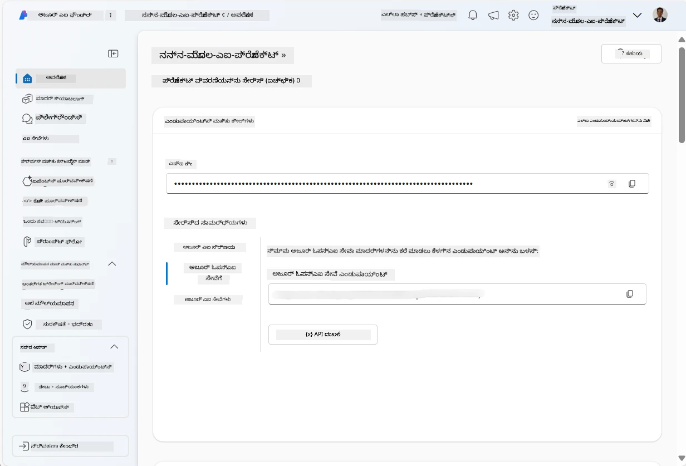
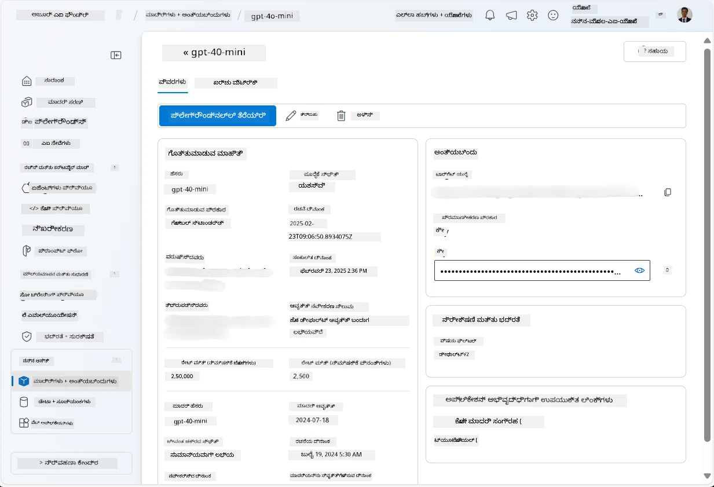
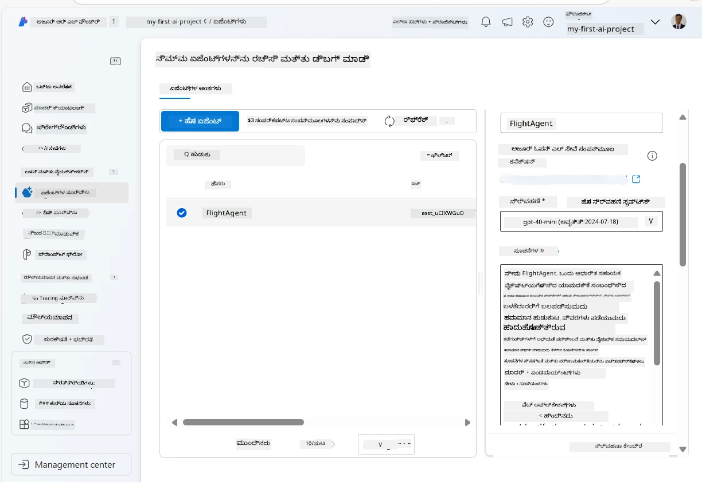
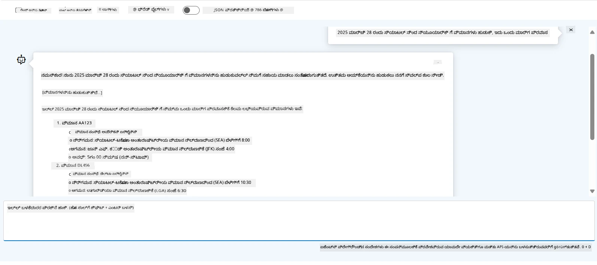

# ಅಜ್ಯೂರ್ AI ಏಜೆಂಟ್ ಸರ್ವಿಸ್ ಅಭಿವೃದ್ಧಿ

ಈ ಅಭ್ಯಾಸದಲ್ಲಿ, ನೀವು [Microsoft Foundry ಪೋರ್ಟಲ್](https://ai.azure.com/?WT.mc_id=academic-105485-koreyst)ನಲ್ಲಿ ಅಜ್ಯೂರ್ AI ಏಜೆಂಟ್ ಸರ್ವಿಸ್ ಟೂಲ್ಸ್ استعمالಿಸಿ ಫ್ಲೈಟ್ ಬುಕ್ಕಿಂಗ್‌ಗಾಗಿ ಏಜೆಂಟ್ ಅನ್ನು ರಚಿಸುವಿರಿ. ಈ ಏಜೆಂಟ್ ಬಳಕೆದಾರರೊಂದಿಗೆ ಸಂವಾದ ಮಾಡಬಹುದು ಮತ್ತು ವಿಮಾನಗಳ ಬಗ್ಗೆ ಮಾಹಿತಿಯನ್ನು ಒದಗಿಸುತ್ತದೆ.

## ಅಗತ್ಯಗಳು

ಈ ಅಭ್ಯಾಸವನ್ನು ಪೂರ್ಣಗೊಳಿಸಲು, ನಿಮಗೆ ಕೆಳಗಿನವುಗಳು ಬೇಕಾಗುತ್ತವೆ:
1. ಸಕ್ರಿಯ ಚಂದಾದಾರಿಕೆ ಹೊಂದಿರುವ ಅಜ್ಯೂರ್ ಖಾತೆ. [ಕೊರತೆ ಇಲ್ಲದೆ ಖಾತೆಯನ್ನು ರಚಿಸಿ](https://azure.microsoft.com/free/?WT.mc_id=academic-105485-koreyst).
2. ನೀವು Microsoft Foundry ಹಬ್ ರಚಿಸುವ ಅನುಮತಿ ಹೊಂದಿರಬೇಕು ಅಥವಾ ನಿಮಗಾಗಿ ಒಂದು ಸೃಷ್ಟಿಸಲಾಗಿದೆ.
    - ನಿಮ್ಮ ಪಾತ್ರ Contributor ಅಥವಾ Owner ಆಗಿದ್ದರೆ, ನೀವು ಈ ಟ್ಯುಟೋರಿಯಲ್‌ನ ಹೆಜ್ಜೆಗಳನ್ನು ಅನುಸರಿಸಬಹುದು.

## Microsoft Foundry ಹಬ್ ರಚನೆ

> **ಪುಟಕ: ** Microsoft Foundry ಮೊದಲು ಅಜ್ಯೂರ್ AI ಸ್ಟುಡಿಯೋ ಎಂದು ಕರೆಯಲ್ಪಡುತ್ತಿತ್ತು.

1. [Microsoft Foundry](https://learn.microsoft.com/en-us/azure/ai-studio/?WT.mc_id=academic-105485-koreyst) ಬ್ಲಾಗ್ ಪೋಸ್ಟ್‌ನ ಮಾರ್ಗಸೂಚಿಗಳನ್ನು ಅನುಸರಿಸಿ Microsoft Foundry ಹಬ್ ರಚಿಸಿ.
2. ನಿಮ್ಮ ಪ್ರಾಜೆಕ್ಟ್ ರಚಿಸಿದ ನಂತರ, ಪ್ರದರ್ಶನವಾದ ಯಾವುದೇ ಸೂಚನೆಗಳನ್ನು ಮುಚ್ಚಿ ಮತ್ತು Microsoft Foundry ಪೋರ್ಟಲ್‌ನ ಪ್ರಾಜೆಕ್ಟ್ ಪುಟವನ್ನು ಪರಿಶೀಲಿಸಿ, ಅದು ಕೆಳಗಿನ ಚಿತ್ರವನ್ನು ಹೋಲುತ್ತದೆ:

    

## ಮಾದರಿಯನ್ನು ನಿಯೋಜಿಸಿ

1. ನಿಮ್ಮ ಪ್ರಾಜೆಕ್ಟ್‌ನ ಎಡಭಾಗದ ಪ್ಯಾನ್‌ನಲ್ಲಿ, **My assets** ವಿಭಾಗದಲ್ಲಿ, **Models + endpoints** ಪುಟವನ್ನು ಆಯ್ಕೆಮಾಡಿ.
2. **Models + endpoints** ಪುಟದಲ್ಲಿ, **Model deployments** ಟ್ಯಾಬ್‌ನಲ್ಲಿ, **+ Deploy model** ಮೆನುದಲ್ಲಿ, **Deploy base model** ಆಯ್ಕೆಮಾಡಿ.
3. ಪಟ್ಟಿಯಲ್ಲಿ `gpt-4o-mini` ಮಾದರಿಯನ್ನು ಹುಡುಕಿ, ಆಯ್ಕೆಮಾಡಿ ಮತ್ತು ದೃಢೀಕರಿಸಿ.

    > **ಗುರುತು:** TPM ಅನ್ನು ಕಡಿಮೆ ಮಾಡುವುದು, ನೀವು ಬಳಸುತ್ತಿರುವ ಚಂದಾದಾರಿಕೆಯಲ್ಲಿ ಲಭ್ಯವಿರುವ ಕೊಟಾದಷ್ಟು ಮೀರಿಸದಂತೆ ಸಹಾಯ ಮಾಡುತ್ತದೆ.

    

## ಏಜೆಂಟ್ ರಚಿಸಿ

ಇದಲ್ಲದೆ ನೀವು ಮಾದರಿಯನ್ನು ನಿಯೋಜಿಸಿದ್ದೀರಿ, ಈಗ ನೀವು ಏಜೆಂಟ್ ರಚಿಸಬಹುದು. ಏಜೆಂಟ್ ಎಂಬುದು ಬಳಕೆದಾರರೊಂದಿಗೆ ಸಂವಾದ ಮಾಡುವ AI ಮಾದರಿಯಾಗಿದೆ.

1. ನಿಮ್ಮ ಪ್ರಾಜೆಕ್ಟ್‌ನ ಎಡಭಾಗದ ಪ್ಯಾನ್‌ನಲ್ಲಿ, **Build & Customize** ವಿಭಾಗದಲ್ಲಿ, **Agents** ಪುಟವನ್ನು ಆಯ್ಕೆಮಾಡಿ.
2. **+ Create agent** ಕ್ಲಿಕ್ ಮಾಡಿ ಹೊಸ ಏಜೆಂಟ್ ರಚಿಸಿ. **Agent Setup** ಡೈಲಾಗ್ ಬಾಕ್ಸ್‌ನಲ್ಲಿ:
    - ಏಜೆಂಟ್‌ಗೆ `FlightAgent` ಹಾಗು ಹೀಗಿನ ಹೆಸರು ನೀಡಿ.
    - ನೀವು ಮೊದಲು ರಚಿಸಿದ `gpt-4o-mini` ಮಾದರಿ ನಿಯೋಜನೆಯನ್ನು ಆಯ್ಕೆಮಾಡಲಾಗಿದೆ ಎಂದು ಖಚಿತಪಡಿಸಿಕೊಳ್ಳಿ
    - ಏಜೆಂಟ್ಗೆ ಅನುಸರಿಸುವ ಸೂಚನೆಯನ್ನು **Instructions** ನಂತೆ ಹೊಂದಿಸಿ. ಉದಾಹರಣೆಗೆ:
    ```
    You are FlightAgent, a virtual assistant specialized in handling flight-related queries. Your role includes assisting users with searching for flights, retrieving flight details, checking seat availability, and providing real-time flight status. Follow the instructions below to ensure clarity and effectiveness in your responses:

    ### Task Instructions:
    1. **Recognizing Intent**:
       - Identify the user's intent based on their request, focusing on one of the following categories:
         - Searching for flights
         - Retrieving flight details using a flight ID
         - Checking seat availability for a specified flight
         - Providing real-time flight status using a flight number
       - If the intent is unclear, politely ask users to clarify or provide more details.
        
    2. **Processing Requests**:
        - Depending on the identified intent, perform the required task:
        - For flight searches: Request details such as origin, destination, departure date, and optionally return date.
        - For flight details: Request a valid flight ID.
        - For seat availability: Request the flight ID and date and validate inputs.
        - For flight status: Request a valid flight number.
        - Perform validations on provided data (e.g., formats of dates, flight numbers, or IDs). If the information is incomplete or invalid, return a friendly request for clarification.

    3. **Generating Responses**:
    - Use a tone that is friendly, concise, and supportive.
    - Provide clear and actionable suggestions based on the output of each task.
    - If no data is found or an error occurs, explain it to the user gently and offer alternative actions (e.g., refine search, try another query).
    
    ```
> [!NOTE]
> ವಿವರವಾದ ಪ್ರಾಂಪ್ಟ್‌ಗಾಗಿ, ನಿಮಗೆ ಹೆಚ್ಚಿನ ಮಾಹಿತಿಗಾಗಿ ಈ ರೆಪೊಸಿಟರಿ ನೋಡಿ [this repository](https://github.com/ShivamGoyal03/RoamMind) ಅನ್ನು ಪರಿಶೀಲಿಸಬಹುದು.
    
> ಮತ್ತೊಮ್ಮೆ, ನೀವು **Knowledge Base** ಮತ್ತು **Actions**ಗಳನ್ನು ಸೇರಿಸುವ ಮೂಲಕ ಏಜೆಂಟ್‌ನ ಸಾಮರ್ಥ್ಯಗಳನ್ನು ಹೆಚ್ಚಿಸಬಹುದು ಮತ್ತು ಬಳಕೆದಾರರ ವಿನಂತಿಗಳ ಆಧಾರದ ಮೇಲೆ ಸ್ವಯಂಚಾಲಿತ ಕಾರ್ಯಗಳನ್ನು ನಿರ್ವಹಿಸಬಹುದು. ಈ ಅಭ್ಯಾಸಕ್ಕೆ, ನೀವು ಈ ಹೆಜ್ಜೆಗಳನ್ನು ತಲಕಾಡಬಹುದು.
    


3. ಹೊಸ ಬಹು-AI ಏಜೆಂಟ್ ರಚಿಸಲು, **New Agent** ಕ್ಲಿಕ್ ಮಾಡಿ. ಹೊಸದಾಗಿ ರಚಿಸಿದ ಏಜೆಂಟ್ Agents ಪುಟದಲ್ಲಿ ಪ್ರದರ್ಶಿಸಲಾಗುವುದು.

## ಏಜೆಂಟ್ ಪರೀಕ್ಷಿಸಿ

ಏಜೆಂಟ್ ರಚಿಸಿದ ನಂತರ, ನೀವು ಅದನ್ನು Microsoft Foundry ಪೋರ್ಟಲ್ ಪ್ಲೇಗ್ರೌಂಡ್‌ನಲ್ಲಿ ಬಳಕೆದಾರರ ಪ್ರಶ್ನೆಗಳಿಗೆ ಹೇಗೆ ಪ್ರತಿಕ್ರಿಯಿಸುತ್ತದೆ ಎಂದು ಪರೀಕ್ಷಿಸಬಹುದು.

1. ನಿಮ್ಮ ಏಜೆಂಟ್‌ನ **Setup** ಪ್ಯಾನ್ ಮೇಲ್ಭಾಗದಲ್ಲಿ, **Try in playground** ಆಯ್ಕೆಮಾಡಿ.
2. **Playground** ಪ್ಯಾನ್‌ನಲ್ಲಿ, ನೀವು ಚಾಟ್ ವಿಂಡೋದಲ್ಲಿ ಪ್ರಶ್ನೆಗಳನ್ನು ಟೈಪ್ ಮಾಡಿ ಏಜೆಂಟ್ ಜೊತೆಗೆ ಸಂವಾದ ಮಾಡಬಹುದು. ಉದಾಹರಣೆಗೆ, ನೀವು ಏಜೆಂಟ್‌ಗೆ 28ರಂದು ಸಿಯಾಟಲ್‌ದಿಂದ ನ್ಯೂಯಾರ್ಕ್‌ಗೆ ವಿಮಾನ ಹಾರಾಟಗಳನ್ನು ಹುಡುಕಲು ಕೇಳಬಹುದು.

    > **ಗುರುತು:** ಈ ಅಭ್ಯಾಸದಲ್ಲಿ ಯಾವುದೇ ನಿಜ ಕಾಲದ ಡೇಟಾ ಬಳಸಲಾಗುವುದಿಲ್ಲ, ಆದ್ದರಿಂದ ಏಜೆಂಟ್ ನಿಖರ ಉತ್ತರಗಳನ್ನು ನೀಡದೇ ಇರಬಹುದು. ಉದ್ದೇಶವು ಸೂಚನೆಗಳ ಆಧಾರದ ಮೇಲೆ ಬಳಕೆದಾರರ ಪ್ರಶ್ನೆಗಳನ್ನು ಅರ್ಥಮಾಡಿಕೊಳ್ಳುವ ಮತ್ತು ಪ್ರತಿಕ್ರಿಯಿಸುವ ಸಾಮರ್ಥ್ಯವನ್ನು ಪರೀಕ್ಷಿಸುವುದು.

    

3. ಏಜೆಂಟ್ ಪರೀಕ್ಷಿಸಿದ ನಂತರ, ನೀವು ಅದನ್ನು ಇನ್ನಷ್ಟು ಇಚ್ಛಿತ ಉದ್ದೇಶಗಳು, ತರಬೇತಿ ಡೇಟಾ ಮತ್ತು ಕ್ರಿಯೆಗಳೊಂದಿಗೆ ವೈಯಕ್ತಿಕಗೊಳಿಸಿ ಸಾಮರ್ಥ್ಯಗಳನ್ನು ಹೆಚ್ಚಿಸಬಹುದು.

## ಸಂಪನ್ಮೂಲಗಳನ್ನು ಸ್ವಚ್ಛಗೊಳಿಸಿ

ನೀವು ಏಜೆಂಟ್‌ನ್ನು ಪರೀಕ್ಷಿಸಿದ ನಂತರ, ಹೆಚ್ಚುವರಿ ವೆಚ್ಚವನ್ನು ತಪ್ಪಿಸಲು ಅದನ್ನು ಅಳಿಸಬಹುದು.
1. [ಅಜ್ಯೂರ್ ಪೋರ್ಟಲ್](https://portal.azure.com) ತೆರೆಯಿರಿ ಮತ್ತು ಈ ಅಭ್ಯಾಸದಲ್ಲಿ ಉಪಯೋಗಿಸಿದ ಹಬ್ ಸಂಪನ್ಮೂಲಗಳು ಇರುವ ರಿಸೋರ್ಸ್ ಗ್ರೂಪ್‌ನ ಒಳತೋಟನ್ನು ನೋಡಿ.
2. ಟೂಲ್‌ಬಾರ್‌ನಲ್ಲಿ, **Delete resource group** ಅನ್ನು ಆಯ್ಕೆಮಾಡಿ.
3. ರಿಸೋರ್ಸ್ ಗ್ರೂಪ್ ಹೆಸರನ್ನು ನಮೂದಿಸಿ, ಅಳಿಸುವುದಕ್ಕೆ ನಿರ್ಧಾರವನ್ನು ದೃಢೀಕರಿಸಿ.

## ಸಂಪನ್ಮೂಲಗಳು

- [Microsoft Foundry ಡಾಕ್ಯುಮೆಂಟೇಶನ್](https://learn.microsoft.com/en-us/azure/ai-studio/?WT.mc_id=academic-105485-koreyst)
- [Microsoft Foundry ಪೋರ್ಟಲ್](https://ai.azure.com/?WT.mc_id=academic-105485-koreyst)
- [ಅಜ್ಯೂರ್ AI ಸ್ಟುಡಿಯೋದಿಂದ ಪ್ರಾರಂಭಿಸುವುದು](https://techcommunity.microsoft.com/blog/educatordeveloperblog/getting-started-with-azure-ai-studio/4095602?WT.mc_id=academic-105485-koreyst)
- [ಅಜ್ಯೂರ್‌ನಲ್ಲಿ AI ಏಜೆಂಟ್‌ಗಳ ಮೂಲಭೂತಗಳು](https://learn.microsoft.com/en-us/training/modules/ai-agent-fundamentals/?WT.mc_id=academic-105485-koreyst)
- [ಅಜ್ಯೂರ್ AI ಡಿಸ್ಕೋರ್ಡ್](https://aka.ms/AzureAI/Discord)

---

<!-- CO-OP TRANSLATOR DISCLAIMER START -->
**ಪ್ರತಿದನಾಚರಣೆ**:  
ಈ ದಸ್ತಾವೇಜು AI ಭಾಷಾಂತರ ಸೇವೆ [Co-op Translator](https://github.com/Azure/co-op-translator) ಬಳಸಿ ಅನುವಾದಿಸಲಾಗಿದೆ. ನಾವು ಶುದ್ದತೆಯ ಮೇಲೆ ಶ್ರಮಿಸುವಾಗ, ಸ್ವಯಂಚಾಲಿತ ಅನುವಾದಗಳಲ್ಲಿ ದೋಷಗಳು ಅಥವಾ ಅನುಚಿತತೆಗಳಿದ್ದುಕೊಂಡಿರಬಹುದೆಂದು ದಯವಿಟ್ಟು ಗಮನಿಸಿ. ಮೂಲ ದಸ್ತಾವೇಜಿನ ಸ್ವದೇಶಿ ಭಾಷೆ ಪ್ರಮುಖ ಪ್ರಾಮಾಣಿಕವಾದ ಮೂಲವಾಗಿದ್ದು ಅದೇ ಪರಿಗಣಿಸಬೇಕು. ಸಂವೇದನಾಶೀಲ ಮಾಹಿತಿಗಾಗಿ ವೃತ್ತಿಪರ ಮಾನವರಿಂದ ಅನುವಾದ ಮಾಡಿಸುವುದು ಶಿಫಾರಸು ಮಾಡುವುದಾಗಿದೆ. ಈ ಅನುವಾದ ಬಳಕೆಯಿಂದ ಉಂಟಾಗಬಹುದಾದ ಯಾವುದೇ ತಪ್ಪು ಅರ್ಥಗರ್ಭತೆಗಳಿಗೆ ನಾವು ಹೊಣೆಗಾರರಲ್ಲ.
<!-- CO-OP TRANSLATOR DISCLAIMER END -->