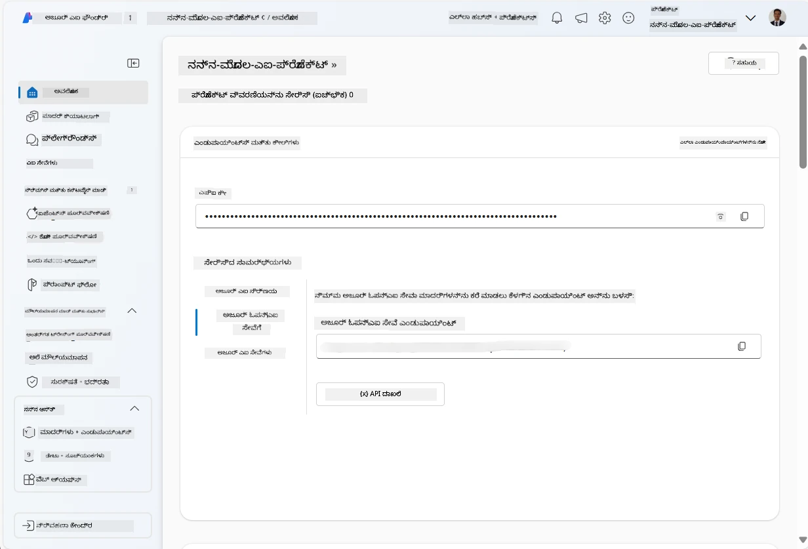
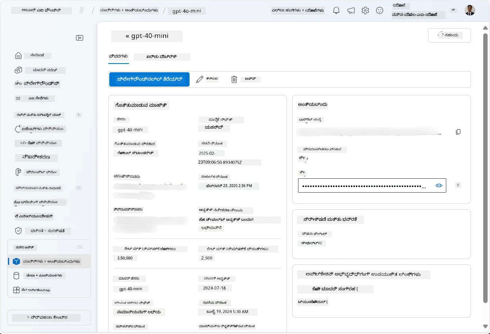
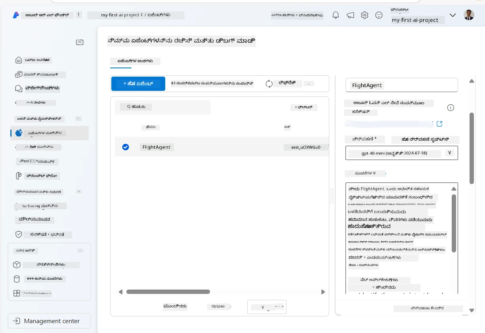
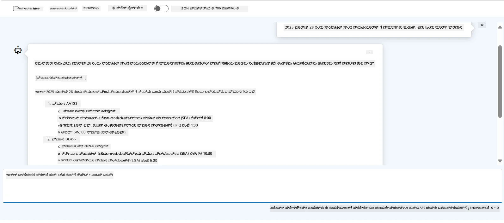

# ಮೈಕ್ರೋಸಾಫ್ಟ್ ಫೌಂಡ್ರಿ ಏಜೆಂಟ್ ಸೇವಾ ಅಭಿವೃದ್ಧಿ

ಈ ವ್ಯಾಯಾಮದಲ್ಲಿ, ನೀವು [Microsoft Foundry ಕಿರುಮರೀಡು](https://ai.azure.com/?WT.mc_id=academic-105485-koreyst)ಯಲ್ಲಿ ಮೈಕ್ರೋಸಾಫ್ಟ್ ಫೌಂಡ್ರಿ ಏಜೆಂಟ್ ಸೇವಾ ಉಪಕರಣಗಳನ್ನು ಬಳಸಿಕೊಂಡು ಫ್ಲೈಟ್ ಬುಕ್ಕಿಂಗ್‌ಗಾಗಿ ಏಜೆಂಟ್ ಅನ್ನು ರಚಿಸುತ್ತೀರಿ. ಏಜೆಂಟ್ ಬಳಕೆದಾರರೊಂದಿಗೆ ಸಂವಹನ ನಡೆಸಿ ಫ್ಲೈಟ್ಗಳ ಬಗ್ಗೆ ಮಾಹಿತಿ ಒದಗಿಸಲು ಸಾಧ್ಯವಾಗುತ್ತದೆ.

## ಪೂರ್ವಾಪೇಕ್ಷಿತಗಳು

ಈ ವ್ಯಾಯಾಮವನ್ನು ಪೂರ್ಣಗೊಳಿಸಲು, ನಿಮಗೆ ಕೆಳಗಿನವುಗಳ ಅಗತ್ಯವಿದೆ:
1. ಸಕ್ರಿಯ ಚಂದಾದಾರಿಕೆಗೆ ಹೊಂದಿರುವ ಏಜ್ಯೂರ್ ಖಾತೆ. [ಉಚಿತ ಖಾತೆಯನ್ನು ರಚಿಸಿ](https://azure.microsoft.com/free/?WT.mc_id=academic-105485-koreyst).
2. ಮೈಕ್ರೋಸಾಫ್ಟ್ ಫೌಂಡ್ರಿ ಹಬ್ ಅನ್ನು ರಚಿಸಲು ಅನುಮತಿಗಳು ಅಥವಾ ನಿಮಗಾಗಿ ಒಬ್ಬರು ಹಬ್ಬನ್ನು ರಚಿಸಿರುವುದು.
    - ನಿಮ್ಮ ಪಾತ್ರನೇನು ಕೊಡುಗೈಯುವವನು ಅಥವಾ ಮಾಲೀಕರಾಗಿದ್ದರೆ, ಈ ಪಾಠದ ಹಂತಗಳನ್ನು ಅನುಸರಿಸಬಹುದು.

## ಮೈಕ್ರೋಸಾಫ್ಟ್ ಫೌಂಡ್ರಿ ಹಬ್ ಅನ್ನು ರಚಿಸಿ

> **ಗಮನಿಸಿ:** ಮೈಕ್ರೋಸಾಫ್ಟ್ ಫೌಂಡ್ರಿ ಅನ್ನು ಹಿಂದಿನ ಹೆಸರು ಏಜ್ಯೂರ್ ಎಐ ಸ್ಟೂಡಿಯೊ ಎಂಬುದಾಗಿತ್ತು.

1. ಮೈಕ್ರೋಸಾಫ್ಟ್ ಫೌಂಡ್ರಿ ಹಬ್ ರಚಿಸಲು [Microsoft Foundry](https://learn.microsoft.com/en-us/azure/ai-studio/?WT.mc_id=academic-105485-koreyst) ಬ್ಲಾಗ್ ಪೋಸ್ಟ್‌ನ ಮಾರ್ಗಸೂಚಿಗಳನ್ನು ಅನುಸರಿಸಿ.
2. ನಿಮ್ಮ ಯೋಜನೆ ರಚಿಸಲ್ಪಟ್ಟಾಗ, ಪ್ರದರ್ಶಿಸಲ್ಪಟ್ಟ ಯಾವುದೇ ಟಿಪ್ಪಣಿಗಳನ್ನು ಮುಚ್ಚಿ ಮತ್ತು ಮೈಕ್ರೋಸಾಫ್ಟ್ ಫೌಂಡ್ರಿ ಕಿರುಮರೀಡುಯಲ್ಲಿ ಯೋಜನೆ ಪುಟವನ್ನು ಪರಿಶೀಲಿಸಿ; ಅದು ಕೆಳಗಿನ ಚಿತ್ರದಂತೆ ಕಾಣುತ್ತದೆ:

    

## ಮಾದರಿಯನ್ನು ನಿಯೋಜಿಸಿ

1. ನಿಮ್ಮ ಯೋಜನೆಯ ಸಡಿನಡಿಯ ಎಡಬದಿಯಲ್ಲಿ, **My assets** ವಿಭಾಗದಲ್ಲಿರುವ **Models + endpoints** ಪುಟವನ್ನು ಆರಿಸಿ.
2. **Models + endpoints** ಪುಟದಲ್ಲಿ, **Model deployments** ಟ್ಯಾಬ್‌ನಲ್ಲಿ, **+ Deploy model** ಮೆನುನಲ್ಲಿ, **Deploy base model**ನ್ನು ಆರಿಸಿ.
3. ಪಟ್ಟಿಯಿಂದ `gpt-4o-mini` ಮಾದರಿಯನ್ನು ಹುಡುಕಿ, ಅದನ್ನು ಆರಿಸಿ ಪರಿಶೀಲಿಸಿ.

    > **ಗಮನಿಸಿ**: TPM ಕಡಿಮೆ ಮಾಡುವುದು ನೀವು ಬಳಸುತಿರುವ ಚಂದಾದಾರಿಕೆಲ್ಲಿನ ಕಾಯ್ದಿರಿಸಿದ ಕೋಟಾ ಇನ್ನಷ್ಟು ಬಳಸುವುದನ್ನು ತಪ್ಪಿಸುತ್ತದೆ.

    

## ಏಜೆಂಟ್ ಅನ್ನು ರಚಿಸಿ

ಈಗ ನೀವು ಮಾದರಿಯನ್ನು ನಿಯೋಜಿಸಿದ್ದೀರಿ, ನೀವು ಏಜೆಂಟ್ ಅನ್ನು ರಚಿಸಬಹುದು. ಏಜೆಂಟ್ ಎನ್ನುವುದು ಬಳಕೆದಾರರೊಂದಿಗೆ ಸಂವಹನ ಹೊಂದುವ ಸಂವಾದಾತ್ಮಕ AI ಮಾದರಿಯಾಗಿದ್ದು ಬಳಸಬಹುದು.

1. ನಿಮ್ಮ ಯೋಜನೆಯ ಎಡಬದಿಯಲ್ಲಿ, **Build & Customize** ವಿಭಾಗದಲ್ಲಿರುವ **Agents** ಪುಟವನ್ನು ಆರಿಸಿ.
2. ಹೊಸ ಏಜೆಂಟ್ ರಚಿಸಲು **+ Create agent** ಕ್ಲಿಕ್ ಮಾಡಿ. **Agent Setup** ಸಂಭಾಷಣೆ ಪಟ್ಟಿ ಡಬ್ಬಿಯಲ್ಲಿ:
    - `FlightAgent` ಎಂಬಂತೆ ಏಜೆಂಟ್ ಹೆಸರುವನ್ನು ನಮೂದಿಸಿ.
    - ನೀವು ಹಿಂದೆ ರಚಿಸಿರುವ `gpt-4o-mini` ಮಾದರಿ ನಿಯೋಜನೆಯನ್ನು ಆರಿಸಿರಬೇಕು.
    - ನೀವು ಏಜೆಂಟ್ ಅನುಸರಿಸುವ ಪ್ರಾಂಪ್ಟ್‌ಗಾಗಿ **Instructions** ಅನ್ನು ಹೊಂದಿಸಿ. ಉದಾಹರಣೆಗೆ:
    ```
    You are FlightAgent, a virtual assistant specialized in handling flight-related queries. Your role includes assisting users with searching for flights, retrieving flight details, checking seat availability, and providing real-time flight status. Follow the instructions below to ensure clarity and effectiveness in your responses:

    ### Task Instructions:
    1. **Recognizing Intent**:
       - Identify the user's intent based on their request, focusing on one of the following categories:
         - Searching for flights
         - Retrieving flight details using a flight ID
         - Checking seat availability for a specified flight
         - Providing real-time flight status using a flight number
       - If the intent is unclear, politely ask users to clarify or provide more details.
        
    2. **Processing Requests**:
        - Depending on the identified intent, perform the required task:
        - For flight searches: Request details such as origin, destination, departure date, and optionally return date.
        - For flight details: Request a valid flight ID.
        - For seat availability: Request the flight ID and date and validate inputs.
        - For flight status: Request a valid flight number.
        - Perform validations on provided data (e.g., formats of dates, flight numbers, or IDs). If the information is incomplete or invalid, return a friendly request for clarification.

    3. **Generating Responses**:
    - Use a tone that is friendly, concise, and supportive.
    - Provide clear and actionable suggestions based on the output of each task.
    - If no data is found or an error occurs, explain it to the user gently and offer alternative actions (e.g., refine search, try another query).
    
    ```
> [!NOTE]
> ವಿವರವಾದ ಪ್ರಾಂಪ್ಟ್‌ಗಾಗಿ, [ಈ ಸಂಗ್ರಹಾಲಯವನ್ನು](https://github.com/ShivamGoyal03/RoamMind) ನೋಡಿ.
    
> ಇದಲ್ಲದೆ, ಸಮಸ್ಯೆಗಳಿಗೆ ಹೆಚ್ಚು ಮಾಹಿತಿ ನೀಡಲು ಮತ್ತು ಬಳಕೆದಾರರ ಬೇಡಿಕೆಗಳ ಮೇಲೆ ಸ್ವಯಂಚಾಲಿತ ಕಾರ್ಯಗಳನ್ನು ಮಾಡಲು ಏಜಂಟ್ ಸಾಮರ್ಥ್ಯಗಳನ್ನು ಹೆಚ್ಚಿಸಲು **Knowledge Base** ಮತ್ತು **Actions** ಅನ್ನು ಸೇರಿಸಬಹುದು. ಈ ವ್ಯಾಯಾಮಕ್ಕೆ, ನೀವು ಈ ಹಂತಗಳನ್ನು ಬಿಟ್ಟುಹಾಕಬಹುದು.
    


3. ಹೊಸ ಬಹು-AI ಏಜೆಂಟ್ ರಚಿಸಲು, ಸಿಂಪಲ್ ಆಗಿ **New Agent** ಕ್ಲಿಕ್ ಮಾಡಿ. ರಚಿಸಲ್ಪಟ್ಟ ಹೊಸ ಏಜೆಂಟ್ Agents ಪುಟದಲ್ಲಿ ತೋರಿಸಲಾಗುತ್ತದೆ.


## ಏಜೆಂಟ್ ಪರೀಕ್ಷೆ ಮಾಡಿ

ಏಜೆಂಟ್ ರಚಿಸಿದ ನಂತರ, ನೀವು ಅದನ್ನು ಪರೀಕ್ಷಿಸಿ ಮೈಕ್ರೋಸಾಫ್ಟ್ ಫೌಂಡ್ರಿ ಕಿರುಮರೀಡು ಪ್ಲೇಗ್ರೌಂಡ್‌ನಲ್ಲಿ ಬಳಕೆದಾರರ ಪ್ರಶ್ನೆಗಳಿಗೆ ಹೇಗೆ ಪ್ರತಿಕ್ರಿಯಿಸುತ್ತದೆ ಎಂದು ನೋಡಬಹುದು.

1. ನಿಮ್ಮ ಏಜೆಂಟ್ ಸೆಟ್‌ಅಪ್ ಪೇನಿನ ಮೇಲ್ಭಾಗದಲ್ಲಿ, **Try in playground** ಆಯ್ಕೆ ಮಾಡಿ.
2. **Playground** ಪೇಟಿಯಲ್ಲಿ, ನಿಮ್ಮ ಏಜೆಂಟ್ ಜೊತೆಗೆ ಚಾಟ್ ವಿಂಡೋದಲ್ಲಿ ಪ್ರಶ್ನೆಗಳನ್ನು ಟೈಪ್ ಮಾಡಿ ಸಂವಹನ ಮಾಡಬಹುದು. ಉದಾಹರಣೆಗೆ, ನೀವು ಏಜಂಟ್‌ಗೆ 28ನೇ ದಿನಾಂಕದ ಸಿಯಾಟಲ್‌ನಿಂದ ನ್ಯೂಯಾರ್ಕ್ಗೆ ವಿಮಾನಗಳನ್ನು ಹುಡುಕಲು ಕೇಳಬಹುದು.

    > **ಗಮನಿಸಿ**: ಈ ವ್ಯಾಯಾಮದಲ್ಲಿ ಯಾವುದೇ ನೈಜ-ಕಾಲದ ಡೇಟಾವನ್ನು ಬಳಸಲಾಗದ ಕಾರಣ, ಏಜೆಂಟ್ ಶುದ್ಧವಾದ ಉತ್ತರಗಳನ್ನು ನೀಡದೇ ಇರಬಹುದು. ಉದ್ದೇಶ ಏಜೆಂಟ್ನು ನೀಡಲಾದ ಸೂಚನೆಗಳ ಆಧಾರದ ಮೇಲೆ ಬಳಕೆದಾರರ ಪ್ರಶ್ನೆಗಳನ್ನು ಅರ್ಥಮಾಡಿ ಪ್ರತಿಕ್ರಿಯಿಸುವ ಸಾಮರ್ಥ್ಯವನ್ನು ಪರೀಕ್ಷಿಸುವುದು.

    

3. ಏಜೆಂಟ್ ಪರೀಕ್ಷಿಸಿದ ನಂತರ, ಇದಕ್ಕೆ ಇನ್ನಷ್ಟು ಉದ್ದೇಶಗಳು, ತರಬೇತಿ ದತ್ತಾಂಶ, ಕಾರ್ಯಗಳನ್ನು ಸೇರಿಸಿ ಅದರ ಸಾಮರ್ಥ್ಯವನ್ನು ಹೆಚ್ಚಿಸಬಹುದು.

## ಸಂಪನ್ಮೂಲಗಳನ್ನು ಸ್ವಚ್ಛಗೊಳಿಸಿ

ಏಜೆಂಟ್ ಅನ್ನು ಪರೀಕ್ಷಿಸುವುದನ್ನು ಮುಗಿಸಿದ ಮೇಲೆ, ಹೆಚ್ಚುವರಿ ವೆಚ್ಚ ಬರುವುದನ್ನು ತಡೆಯಲು ಅದನ್ನು ತೆಗೆದುಹಾಕಬಹುದು.
1. [Azure portal](https://portal.azure.com) ತೆರೆಯಿರಿ ಮತ್ತು ನೀವು ಈ ವ್ಯಾಯಾಮದಲ್ಲಿ ಬಳಸಿದ ಹಬ್ ಸಂಪನ್ಮೂಲಗಳನ್ನು ನಿಯೋಜಿಸಿದ್ದ ಸಂಪನ್ಮೂಲ ಗುಂಪಿನ ವಿಷಯಗಳನ್ನು ನೋಡಿ.
2. ಟೂಲ್‌ಬಾರ್‌ನಲ್ಲಿ **Delete resource group** ಆಯ್ಕೆ ಮಾಡಿ.
3. ಸಂಪನ್ಮೂಲ ಗುಂಪಿನ ಹೆಸರು ನಮೂದಿಸಿ ಮತ್ತು ಅದನ್ನು ಅಳಿಸಲು ನೀವು ಇಚ್ಛಿಸುವುದಾಗಿ ದೃಢೀಕರಿಸಿ.

## ಸಂಪನ್ಮೂಲಗಳು

- [Microsoft Foundry ಡಾಕ್ಯುಮೆಂಟೇಶನ್](https://learn.microsoft.com/en-us/azure/ai-studio/?WT.mc_id=academic-105485-koreyst)
- [Microsoft Foundry ಕಿರುಮರೀಡು](https://ai.azure.com/?WT.mc_id=academic-105485-koreyst)
- [Microsoft Foundry ಬಳಕೆ ಪ್ರಾರಂಭಿಸುವಿಕೆ](https://techcommunity.microsoft.com/blog/educatordeveloperblog/getting-started-with-azure-ai-studio/4095602?WT.mc_id=academic-105485-koreyst)
- [ಏಜ್ಯೂರ್‌ನಲ್ಲಿ AI ಏಜೆಂಟ್‌ಗಳ ಅಡಿಪಾಯಗಳು](https://learn.microsoft.com/en-us/training/modules/ai-agent-fundamentals/?WT.mc_id=academic-105485-koreyst)
- [Azure AI Discord](https://aka.ms/AzureAI/Discord)

---

<!-- CO-OP TRANSLATOR DISCLAIMER START -->
**ಅಸ್ವೀಕಾರ**:
ಈ ದಸ್ತಾವೇಜು AI ಅನುವಾದ ಸೇವೆ [Co-op Translator](https://github.com/Azure/co-op-translator) ಬಳಸಿ ಅನುವಾದಿಸಲಾಗಿದೆ. ನಾವು ನಿಖರತೆಯನ್ನು ಸಾಧಿಸಲು ಪ್ರಯತ್ನಿಸುತ್ತಿದ್ದರೂ, ದಯವಿಟ್ಟು ಗಮನಿಸಿ, ಸ್ವಯಂಚಾಲಿತ ಅನುವಾದಗಳಲ್ಲಿ ದೋಷಗಳು ಅಥವಾ ಅಸಡ್ಡೆಗಳು ಇರಬಹುದು. ಮೂಲ ಭಾಷೆಯಲ್ಲಿರುವ ಮೂಲ ದಸ್ತಾವೇಜು ಪ್ರಾಮಾಣಿಕ ಮೂಲವೆಂದು ಪರಿಗಣಿಸಬೇಕು. ಪ್ರಮುಖ ಮಾಹಿತಿಗಾಗಿ, ವೃತ್ತಿಪರ ಮಾನವ ಅನುವಾದವನ್ನು ಶಿಫಾರಸು ಮಾಡಲಾಗುತ್ತದೆ. ಈ ಅನುವಾದವನ್ನು ಬಳಸುವ ಮೂಲಕ ಉಂಟಾಗುವ ಯಾವುದೇ ತಪ್ಪು ಅರ್ಥಗಳ ಅಥವಾ ತಪ್ಪು ವ್ಯಾಖ್ಯಾನಗಳ ಬಗ್ಗೆ ನಾವು ಹೊಣೆಗಾರರಲ್ಲ.
<!-- CO-OP TRANSLATOR DISCLAIMER END -->