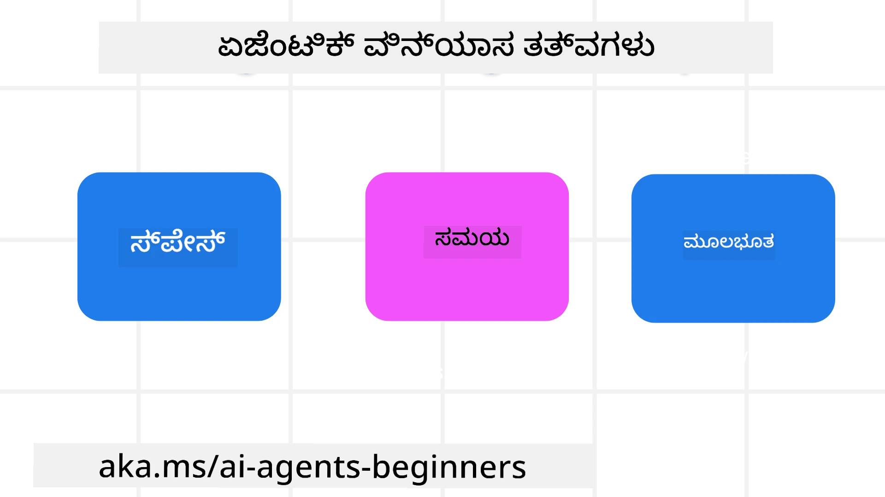

> _(ಈ ಪಾಠದ ವೀಡಿಯೊವನ್ನು ನೋಡಲು ಮೇಲಿನ ಚಿತ್ರವನ್ನು ಕ್ಲಿಕ್ ಮಾಡಿ)_
# AI ಏಜೆಂಟ್-ಆಧಾರಿತ ವಿನ್ಯಾಸ ತತ್ತ್ವಗಳು

## ಪರಿಚಯ

ಎಐ ಏಜೆಂಟ್-ಆಧಾರಿತ ವ್ಯವಸ್ಥೆಗಳನ್ನು ನಿರ್ಮಿಸುವ ಬಗ್ಗೆ ಯೋಚಿಸಲು ಅನೇಕ ಮಾರ್ಗಗಳಿವೆ. ಜನರೇಟಿವ್ ಎಐ ವಿನ್ಯಾಸದಲ್ಲಿ ಅಸ್ಪಷ್ಟತೆ ಒಂದು ಲಕ್ಷಣವಾಗಿದ್ದು ದೋಷವಲ್ಲದಿರುವ ನಿರೀಕ್ಷೆಯನ್ನು ದೃಷ್ಟಿಯಲ್ಲಿ ಇಡಿದಾಗ, ಎಂಜಿನಿಯರ್‌ಗಳಿಗೆ ಎಲ್ಲಿಂದ ಪ್ರಾರಂಭಿಸಬೇಕು ಎಂಬುದನ್ನು ನಿರ್ಧರಿಸುವುದು ಕೆಲವೊಮ್ಮೆ ಕಷ್ಟಕರವಾಗಬಹುದು. ನಾವು ಮಾನವಕೇಂದ್ರಿತ UX ವಿನ್ಯಾಸ ತತ್ತ್ವಗಳ ಒಂದು ಸಂಕಲನವನ್ನು ರಚಿಸಿದ್ದೇವೆ, ಇದರಿಂದ ಡೆವಲಪರ್‌ಗಳು ತಮ್ಮ ವ್ಯವಹಾರದ ಅಗತ್ಯಗಳನ್ನು ಪೂರೈಸಲು ಗ್ರಾಹಕ-कೇಂದ್ರೀಕೃತ ಏಜೆಂಟ್ ವ್ಯವಸ್ಥೆಗಳನ್ನು ನಿರ್ಮಿಸಬಹುದು. ಈ ವಿನ್ಯಾಸ ತತ್ತ್ವಗಳು ನಿರ್ದಿಷ್ಟ ಆರ್ಕಿಟೆಕ್ಚರ್‌ಗಳನ್ನು ಸೂಚಿಸುವುದಿಲ್ಲ; ಬದಲು, ಏಜೆಂಟ್ ಅನುಭವಗಳನ್ನು ವ್ಯಾಖ್ಯಾನಿಸಿ ನಿರ್ಮಿಸುತ್ತಿರುವ ತಂಡಗಳಿಗೆ ಇದು ಆರಂಭಿಕ ಪಾಯಿಂಟ್ ಆಗಿದೆ.

ಸಾಮಾನ್ಯವಾಗಿ, ಏಜೆಂಟ್‌ಗಳು ಕೆಳಕಂಡವುಗಳನ್ನು ಮಾಡಬೇಕು:

- ಮಾನವ ಸಾಮರ್ಥ್ಯಗಳನ್ನು ವಿಸ್ತರಿಸಿ ಮತ್ತು ತಲತರಿಸಬೇಕು (ಚಿಂತನಶೀಲನೆ, ಸಮಸ್ಯೆ ಪರಿಹಾರ, ಸ್ವಯಂಚಾಲಿತತೆ ಇತ್ಯಾದಿ)
- ಜ್ಞಾನ ಗ್ಯಾಪ್‌ಗಳನ್ನು ತುಂಬಬೇಕು (ನನ್ನನ್ನು ಜ್ಞಾನ ಕ್ಷೇತ್ರಗಳಲ್ಲಿ ತ್ವರಿತಗೊಳಿಸುವುದು, ಭಾಷಾಂತರ ಇತ್ಯಾದಿ)
- ನಾವು ವೈಯಕ್ತಿಕವಾಗಿ ಇತರರೊಂದಿಗೆ ಕೆಲಸ ಮಾಡಲು ಇಷ್ಟ ಪಡುವ ರೀತಿಯಲ್ಲಿ ಸಹಕಾರವನ್ನು ಸುಲಭಗೊಳಿಸಿ ಮತ್ತು ಬೆಂಬಲಿಸಬೇಕು
- ನಮ್ಮನ್ನು ಉತ್ತಮ ಆವೃತ್ತಿಗಳನ್ನಾಗುವಂತೆ ಮಾಡಬೇಕು (ಉದಾಹರಣೆಗೆ, ಜೀವನ ಕೋಚ್/ಕಾರ್ಯ ನಿರ್ವಹಣಾ ಮಾಸ್ಟರ್, ಭಾವನಾತ್ಮಕ ನಿಯಂತ್ರಣ ಮತ್ತು ಮನಃಶಾಂತಿ ಕೌಶಲ್ಯಗಳನ್ನು ಕಲಿಸಲು ಸಹಾಯ, ಮಬ್ಬಿನೊಂದಿಗೆ ನಿಲುವಂಶಗಳನ್ನು ಕಟ್ಟುವುದು ಇತ್ಯಾದಿ)

## ಈ ಪಾಠವು ಒಳಗೊಂಡಿದೆ

- ಏಜೆಂಟ್-ಆಧಾರಿತ ವಿನ್ಯಾಸ ತತ್ತ್ವಗಳೇನು
- ಈ ವಿನ್ಯಾಸ ತತ್ತ್ವಗಳನ್ನು ಜಾರಿಗೊಳಿಸುವಾಗ ಅನುಸರಿಸಬೇಕಾದ ಕೆಲವು ಮಾರ್ಗಸೂಚಿಗಳು
- ವಿನ್ಯಾಸ ತತ್ತ್ವಗಳನ್ನು ಬಳಸಿ ಕೆಲವು ಉದಾಹರಣೆಗಳು

## ಅಧ್ಯಯನ ಗುರಿಗಳು

ಈ ಪಾಠವನ್ನು ಪೂರ್ಣಗೊಳಿಸಿದ ನಂತರ ನೀವು ಸಾಧ್ಯವಾಗುವುದು:

1. ಏಜೆಂಟ್-ಆಧಾರಿತ ವಿನ್ಯಾಸ ತತ್ತ್ವಗಳು ಯಾವುವು ಎಂದು ವಿವರಿಸಬಲ್ಲಿರಿ
2. ಏಜೆಂಟ್-ಆಧಾರಿತ ವಿನ್ಯಾಸ ತತ್ತ್ವಗಳನ್ನು ಬಳಸಲು ಇರುವ ಮಾರ್ಗಸೂಚಿಗಳನ್ನು ವಿವರಿಸಬಲ್ಲಿರಿ
3. ಏಜೆಂಟ್-ಆಧಾರಿತ ವಿನ್ಯಾಸ ತತ್ತ್ವಗಳನ್ನು ಬಳಸಿ ಏಜೆಂಟ್ ಅನ್ನು ಹೇಗೆ ನಿರ್ಮಿಸಬೇಕು ಎಂಬುದನ್ನು ಅರ್ಥಮಾಡಿಕೊಳ್ಳಬಲ್ಲಿರಿ

## ಏಜೆಂಟ್-ಆಧಾರಿತ ವಿನ್ಯಾಸ ತತ್ತ್ವಗಳು

### ಏಜೆಂಟ್ (ಸ್ಥಳ)

ಏಜೆಂಟ್ ಕಾರ್ಯನಿರ್ವಹಿಸುವ ವಾತಾವರಣ ಇದಾಗಿದೆ. ಭೌತಿಕ ಮತ್ತು ಡಿಜಿಟಲ್ ಜಗತ್ತುಗಳಲ್ಲಿ ಸೇರಿಕೊಂಡು ಕೆಲಸ ಮಾಡುವ ವಿಧಾನದಲ್ಲಿ ಏಜೆಂಟ್‌ಗಳನ್ನು ಹೇಗೆ ವಿನ್ಯಾಸ ಮಾಡಬೇಕು ಎಂಬುದನ್ನು ಈ ತತ್ತ್ವಗಳು ಸೂಚಿಸುತ್ತವೆ.

- **ಜೋಡಿಸುವುದು, ಒಡೆದು ಹಾಕುವುದು ಅಲ್ಲ** – ಸಹಕಾರ ಮತ್ತು ಸಂಪರ್ಕವನ್ನು ಸಾಧ್ಯಮಾಡಲು ಜನರನ್ನು ಇತರ ಜನರು, ಘಟನೆಗಳು ಮತ್ತು ಕೈಗೆಟಕುವ ಜ್ಞಾನಕ್ಕೆ ಸಂಪರ್ಕಿಸಲು ಸಹಾಯ ಮಾಡಿ.
- ಏಜೆಂಟ್‌ಗಳು ಘಟನೆಗಳು, ಜ್ಞಾನ ಮತ್ತು ಜನರನ್ನು ಸಂಪರ್ಕಿಸಲು ಸಹಾಯ ಮಾಡುತ್ತವೆ.
- ಏಜೆಂಟ್‌ಗಳು ಜನರನ್ನು ಪರಸ್ಪರ ಹತ್ತಿರ ತರುತ್ತವೆ. ಅವುಗಳನ್ನು ಜನರನ್ನು ಬದಲಾಯಿಸಲು ಅಥವಾ ಅವಮಾನಗೊಳಿಸಲು ವಿನ್ಯಾಸ ಮಾಡಿಲ್ಲ.
- **ಸರಳವಾಗಿ ದೊರೆಯುವ ಹಾಗಿದ್ದು ಕೆಲವೊಮ್ಮೆ ಅদೃಶ್ಯವಾಗಿರಬಹುದು** – ಏಜೆಂಟ್ ಬಹುತೇಕ ಹಿನ್ನೆಲೆಯಲ್ಲಿ ಕಾರ್ಯನಿರ್ವಹಿಸುತ್ತದೆ ಮತ್ತು ಅದು ಸಂಬಂಧಿತವಾಗಿರುವಾಗ ಮತ್ತು ಸೂಕ್ತವಾಗಿರುವಾಗ ಮಾತ್ರ ನಮ್ಮನ್ನು ತಚ್ಚಗೊಳಿಸುತ್ತದೆ.
  -  - ಅಧಿಕೃತ ಬಳಕೆದಾರರಿಗೆ ಯಾವುದೇ ಸಾಧನ ಅಥವಾ ವೇದಿಕೆ ಮೇಲೆ ಏಜೆಂಟ್ ಸುಲಭವಾಗಿ ಕಂಡುಬರುತ್ತದೆ ಮತ್ತು ಪ್ರಾಪ್ಯವಾಗಿದೆ.
  -  - ಏಜೆಂಟ್ ಬಹುಮಾಧ್ಯಮ ಇನ್‌ಪುಟ್ ಮತ್ತು ಔಟ್ಪುಟ್‌ಗಳನ್ನು (sound, voice, text, etc.) ಬೆಂಬಲಿಸುತ್ತದೆ.
  -  - ಬಳಕೆದಾರರ ಅಗತ್ಯಗಳನ್ನು ಭಾವಿಸುವ ಆಧಾರದಲ್ಲಿ ಏಜೆಂಟ್ ಮುಂಭಾಗ ಮತ್ತು ಹಿನ್ನೆಲೆಯ ನಡುವೆ; ಪ್ರೋಆಕ್ಟಿವ್ ಮತ್ತು ರಿಯಾಕ್ಟಿವ್ ನಡುವೆಯೂ ನಿರಂತರವಾಗಿ ಪರಿವರ್ತನೆಗೊಳ್ಳಬಹುದು.
  -  - ಏಜೆಂಟ್ ಅದೃಶ್ಯ ರೂಪದಲ್ಲಿ ಕಾರ್ಯನಿರ್ವಹಿಸಬಹುದು, ಆದರೂ ಅದರ ಬ್ಯಾಕ್ಗ್ರೌಂಡ್ ಪ್ರಕ್ರಿಯೆ ಮಾರ್ಗ ಮತ್ತು ಇತರ ಏಜೆಂಟ್‌ಗಳೊಂದಿಗೆ ಆಗುವ ಸಹಕಾರ ಬಳಕೆದಾರರಿಗೆ ಪಾರದರ್ಶಕವಾಗಿರುತ್ತದೆ ಮತ್ತು ಅವುಗಳನ್ನು ನಿಯಂತ್ರಿಸಬಹುದಾಗಿದೆ.

### ಏಜೆಂಟ್ (ಸಮಯ)

ಇದು ಏಜೆಂಟ್ ಸಮಯದಲ್ಲಿ ಹೇಗೆ ಕಾರ್ಯನಿರ್ವಹಿಸುತ್ತದೆ ಎಂಬುದಾಗಿದೆ. ಭೂತಕಾಲ, ವರ್ತಮಾನ ಮತ್ತು ಭವಿಷ್ಯದ ನಡುವೆ ಸಂವಹನ ನಡೆಸುವ ರೀತಿಯಲ್ಲಿ ಏಜೆಂಟ್‌ಗಳನ್ನು ವಿನ್ಯಾಸ ಮಾಡುವ ಬಗ್ಗೆ ಈ ತತ್ತ್ವಗಳು ಮಾರ್ಗದರ್ಶನ ನೀಡುತ್ತವೆ.

- **ಭೂತಕಾಲ**: ಸ್ಥಿತಿ ಮತ್ತು ಸಂದರ್ಭವನ್ನು ಒಳಗೊಂಡ ಇತಿಹಾಸದ ಪರಿಗಣನೆ.
  -  - ಏಜೆಂಟ್ ಕೇವಲ ಘಟನೆ, ಜನರು ಅಥವಾ ಸ್ಥಿತಿಗಳನ್ನು ಮೀರಿ ಸಮೃದ್ಧ ಇತಿಹಾಸದ ಡೇಟಾ ವಿಶ್ಲೇಷಣೆಯ ಆಧಾರದ ಮೇಲೆ ಹೆಚ್ಚು ಪ್ರಾಸಂಗಿಕ ಫಲಿತಾಂಶಗಳನ್ನು ಒದಗಿಸುತ್ತದೆ.
  -  - ಏಜೆಂಟ್ ಪೂರ್ವ ಘಟನೆಗಳಿಂದ ಸಂಪರ್ಕಗಳನ್ನು ರಚಿಸಿ, ಸ್ಮೃತಿಯನ್ನು ಸಕ್ರಿಯವಾಗಿ ಪರಿಗಣಿಸುತ್ತಾ ಆಧುನಿಕ ಪರಿಸ್ಥಿತಿಗಳೊಂದಿಗೆ ತೊಡಗಿಸುತ್ತದೆ.
- **ಈಗ**: ಸೂಚಿಸುವುದಕ್ಕಿಂತ ಹೆಚ್ಚು ಪ್ರೇರಣೆ ನೀಡುವುದು.
  -  - ಏಜೆಂಟ್ ಜನರೊಂದಿಗೆ ಸಂವಹನ ನಡೆಸಲು ಸಮಗ್ರವಾದ ಮಾರ್ಗವನ್ನು ತೋರಿಸುತ್ತದೆ. suatughone ಒಂದು ಘಟನೆ ಸಂಭವಿಸಿದಾಗ, ಏಜೆಂಟ್ ಸ್ಥಿರ ಸೂಚನೆ ಅಥವಾ ಇತರ ಸ್ಥಿರ ಶೀಲಿ ಮೀರಿ ಕಾರ್ಯನಿರ್ವಹಿಸುತ್ತದೆ. ಏಜೆಂಟ್ ಪ್ರಕ್ರಿಯೆಗಳನ್ನು ಸರಳಗೊಳಿಸಬಹುದು ಅಥವಾ ಬಳಕೆದಾರರ ಗಮನವನ್ನು ಯുക്തಿಯಾದ ಕ್ಷಣದಲ್ಲಿ ನಿರ್ದೇಶಿಸಲು ಡೈನಾಮಿಕ್ ಸೂಚನೆಗಳನ್ನು ರಚಿಸಬಹುದು.
  -  - ಏಜೆಂಟ್ ಸಾಂದರ್ಭಿಕ ವಾತಾವರಣ, ಸಾಮಾಜಿಕ ಮತ್ತು ಸಾಂಸ್ಕೃತಿಕ ಬದಲಾವಣೆಗಳ ಆಧಾರದ ಮೇಲೆ ಮತ್ತು ಬಳಕೆದಾರರ ಉದ್ದೇಶಕ್ಕೆ ಹೊಂದಿಕೊಂಡು ಮಾಹಿತಿಯನ್ನು ಒದಗಿಸುತ್ತದೆ.
  -  - ಏಜೆಂಟ್ ಸಂವಹನ ಕ್ರಮೇಣ ಜಟಿಲತೆಯಲ್ಲಿ ಬೆಳೆಯುವ/ವಿಕಸಿಸುವ ರೀತಿಯಲ್ಲಿ ಉದ್ದಕಾಲದಲ್ಲಿ ಬಳಕೆದಾರರನ್ನು ಸಬಲಗೊಳಿಸುತ್ತದೆ.
- **ಭವಿಷ್ಯ**: ಹೊಂದಿಕೊಳ್ಳುವುದು ಮತ್ತು ವಿಕಸಿಸುವುದು.
  -  - ಏಜೆಂಟ್ ವಿವಿಧ ಸಾಧನಗಳು, ವೇದಿಕೆಗಳು ಮತ್ತು ಮಾಧ್ಯಮಗಳಿಗೆ ಹೊಂದಿಕೊಳ್ಳುತ್ತದೆ.
  -  - ಏಜೆಂಟ್ ಬಳಕೆದಾರರ ವರ್ತನೆ, ಪ್ರವೇಶಾತ್ಮಕತೆ ಅಗತ್ಯಗಳಿಗೆ ಹೊಂದಿಕೊಳ್ಳುತ್ತದೆ ಮತ್ತು ಸುಲಭವಾಗಿ ಕಸ್ಟಮೈಸ್ ಮಾಡಬಹುದಾಗಿದೆ.
  -  - ಏಜೆಂಟ್ ನಿರಂತರ ಬಳಕೆದಾರ ಸಂವಹನದ ಮೂಲಕ ರೂಪುಗೊಂಡು ವಿಕಸಿಸುತ್ತದೆ.

### ಏಜೆಂಟ್ (ಮೂಲ)

ಇವು ಏಜೆಂಟ್ ವಿನ್ಯಾಸದ ಮೂಲದಲ್ಲಿರುವ ಪ್ರಮುಖ ಅಂಶಗಳು.

- **ಅನಿಶ್ಚಿತತೆಯನ್ನು ಸ್ವೀಕರಿಸಿ ಆದರೆ ನಂಬಿಕೆಯನ್ನು ಸ್ಥಾಪಿಸಿ**.
  -  - ಏಜೆಂಟ್‌ನ ನಿರ್ದಿಷ್ಟ ಮಟ್ಟದ ಅನಿಶ್ಚಿತತೆ ನಿರೀಕ್ಷಿತವಾಗಿದೆ. ಅನಿಶ್ಚಿತತೆ ಏಜೆಂಟ್ ವಿನ್ಯಾಸದ ಮುಖ್ಯ ಅಂಶವಾಗಿದೆ.
  -  - ನಂಬಿಕೆ ಮತ್ತು ಪಾರದರ್ಶಕತೆ ಏಜೆಂಟ್ ವಿನ್ಯಾಸದ ಆಧಾರಭೂತ ಪದರಗಳಾಗಿವೆ.
  -  - ಏಜೆಂಟ್ ಯಾವಾಗ ಆನ್/ಆಫ್ ಆಗಿರುತ್ತದೆಯೋ ಎಂಬುದನ್ನು ಮಾನವರು ನಿಯಂತ್ರಿಸುತ್ತಾರೆ ಮತ್ತು ಏಜೆಂಟ್ ಸ್ಥಿತಿ ಯಾವಾಗಲೂ ಸ್ಪಷ್ಟವಾಗಿ ಗೋಚರಿಸುತ್ತದೆ.

## ಈ ತತ್ತ್ವಗಳನ್ನು ಜಾರಿಗೆ ತರಲು ಮಾರ್ಗಸೂಚಿಗಳು

ನೀವು ಮೇಲಿನ ವಿನ್ಯಾಸ ತತ್ತ್ವಗಳನ್ನು ಬಳಸದಾಗ, ಕೆಳಗಿನ ಮಾರ್ಗಸೂಚಿಗಳನ್ನು ಬಳಸಿ:

1. **ಪಾರದರ್ಶಕತೆ**: ಬಳಕೆದಾರರಿಗೆ ಎಐ ಭಾಗವಾಗಿದೆ ಎಂದು ತಿಳಿಸಿ, ಅದು ಹೇಗೆ ಕಾರ್ಯನಿರ್ವಹಿಸುತ್ತದೆ (ಹಿಂದಿನ ಕ್ರಿಯೆಗಳು ಸೇರಿದಂತೆ), ಮತ್ತು ಪ್ರತಿಕ್ರಿಯೆ ನೀಡುವುದು ಮತ್ತು ವ್ಯವಸ್ಥೆಯನ್ನು ಬದಲಿಸುವುದು ಹೇಗೆ ಎಂಬುದರ ಕುರಿತು ಮಾಹಿತಿ ನೀಡಿ.
2. **ನಿಯಂತ್ರಣ**: ಬಳಕೆದಾರನು ಕಸ್ಟಮೈಸ್ ಮಾಡಲು, ಪ್ರಾಧಾನ್ಯತೆಗಳನ್ನು ನಿರ್ದಿಷ್ಟಪಡಿಸಲು ಮತ್ತು ವೈಯಕ್ತೀಕರಿಸಲು, ಮತ್ತು ವ್ಯವಸ್ಥೆ ಮತ್ತು ಅದರ ಗುಣಲಕ್ಷಣಗಳ ಮೇಲೆ ನಿಯಂತ್ರಣ ಹೊಂದಲು (ಮರೆತುಹೋಗುವ ಸಾಮರ್ಥ್ಯವನ್ನು ಒಳಗೊಂಡಂತೆ) ಸಾಮರ್ಥ್ಯವನ್ನು ನೀಡಿ.
3. **ಸತತತೆ**: ಸಾಧನಗಳು ಮತ್ತು ಎಂಡ್‌ಪಾಯಿಂಟ್‌ಗಳ ನಡುವೆ ಸತತ, ಬಹು-ಮೋಡಲ್ ಅನುಭವಗಳ ಗುರಿಯನ್ನು ಹೊಂದಿರಿ. ಸಾಧ್ಯವಾದಷ್ಟು ಪರಿಚಿತ UI/UX ಅಂಶಗಳನ್ನು ಬಳಸಿ (ಉದಾಹರಣೆ: ಧ್ವನಿ ಸಂವಹನಕ್ಕೆ ಮೈಕ್ರೋಫೋನ್ ಐಕಾನ್) ಮತ್ತು ಗ್ರಾಹಕರ ಸಂವೇದನಾತ್ಮಕ ಭಾರವನ್ನು όσο ಬಹಳಷ್ಟು ಕಡಿಮೆ ಮಾಡಿ (ಉದಾಹರಣೆ: ಸಂಕ್ಷಿಪ್ತ ಪ್ರತಿಕ್ರಿಯೆಗಳು, ದೃಶ್ಯ ಸಹಾಯಗಳು, ಮತ್ತು 'ಹೆಚ್ಚು ತಿಳಿದುಕೊಳ್ಳಿ' ವಿಷಯ).

## ಈ ತತ್ತ್ವಗಳು ಮತ್ತು ಮಾರ್ಗಸೂಚಿಗಳನ್ನು ಬಳಸಿಕೊಂಡು ಪ್ರವಾಸ ಏಜೆಂಟ್ ಅನ್ನು ಹೇಗೆ ವಿನ್ಯಾಸ ಮಾಡುವುದು

ನೀವು ಒಂದು ಪ್ರವಾಸ ಏಜೆಂಟ್ ವಿನ್ಯಾಸ ಮಾಡುತ್ತಿರುವಂತೆ ಕಲ್ಪಿಸಿಕೊಳ್ಳಿ; ವಿನ್ಯಾಸ ತತ್ತ್ವಗಳು ಮತ್ತು ಮಾರ್ಗಸೂಚಿಗಳನ್ನು ಬಳಸುವ ಬಗ್ಗೆ ನೀವು ಹೀಗೆ ಯೋಚಿಸಬಹುದು:

1. **ಪಾರದರ್ಶಕತೆ** – ಬಳಕೆದಾರರಿಗೆ ಪ್ರವಾಸ ಏಜೆಂಟ್ ಎಐ-ಸಕ್ರಿಯ ಏಜೆಂಟ್ ಆಗಿದೆ ಎಂದು ತಿಳಿಸಿ. ಪ್ರಾರಂಭಿಸಲು ಕೆಲವು ಮೂಲ ಸೂಚನೆಗಳನ್ನು ಒದಗಿಸಿ (ಉದಾ., “ಹಲೋ” ಸಂದೇಶ, ಮಾದರಿ ಪ್ರಾಂಪ್ಟ್‌ಗಳು). ಇದನ್ನು ಉತ್ಪನ್ನ ಪುಟದಲ್ಲಿ ಸ್ಪಷ್ಟವಾಗಿ ಡಾಕ್ಯೂಮೆಂಟ್ ಮಾಡಿ. ಬಳಕೆದಾರನು ಹಿಂದಿನಲ್ಲೇ ಕೇಳಿದ ಪ್ರಾಂಪ್ಟ್‌ಗಳ ಪಟ್ಟಿಯನ್ನು ತೋರಿಸಿ. ಪ್ರತಿಕ್ರಿಯೆ ನೀಡುವ ವಿಧಾನಗಳನ್ನು ಸ್ಪಷ್ಟವಾಗಿ ಸೂಚಿಸಿ (ಉದಾಹರಣೆ: 'ಥಂಬ್ಸ್ ಅಪ್' ಮತ್ತು 'ಥಂಬ್ಸ್ ಡೌನ್', 'ಪ್ರತಿಕ್ರಿಯೆ ಕಳುಹಿಸಿ' ಬಟನ್ ಇತ್ಯಾದಿ). ಏಜೆಂಟ್‌ಗೆ ಬಳಕೆ ಅಥವಾ ವಿಷಯ ಸಂಬಂಧಿ ನಿರ್ಬಂಧಗಳಿದ್ದರೆ ಅವುಗಳನ್ನು ಸ್ಪಷ್ಟವಾಗಿ ವಿವರಿಸಿ.
2. **ನಿಯಂತ್ರಣ** – ಏಜೆಂಟ್ ಸೃಷ್ಟಿಯಾದ ನಂತರ ಬಳಕೆದಾರನು ಅದನ್ನು ಸಿಸ್ಟಮ್ ಪ್ರಾಂಪ್ಟ್ ಮುಂತಾದಲ್ಲಿಂದ ಹೇಗೆ ಪರಿಷ್ಕರಿಸಬಹುದು ಎಂಬುದನ್ನು ಸ್ಪಷ್ಟವಾಗಿಡಿ. ಬಳಕೆದಾರನು ಏಜೆಂಟ್ ಎಷ್ಟು ವಿಸ್ತಾರವಾಗಿ ಉತ್ತರಿಸಬೇಕು, ಅದರ ಬರವಣಿಗೆಯ ಶೈಲಿ ಮತ್ತು ಏಜೆಂಟ್ ಯಾವ ವಿಷಯಗಳ ಕುರಿತು ಮಾತನಾಡಬಾರದು ಎಂಬ ಪೇಸಿಗಳನ್ನು ಆಯ್ಕೆಮಾಡಲು ಅನುಮತಿಸಿ. ಸಂಬಂಧಿತ ಫೈಲ್‌ಗಳು ಅಥವಾ ಡೇಟಾ, ಪ್ರಾಂಪ್ಟ್‌ಗಳು ಮತ್ತು ಹಳೆಯ ಸಂಭಾಷಣೆಗಳನ್ನು ಬಳಕೆದಾರನು ವೀಕ್ಷಿಸಿ ಅಳಿಸಲು ಬಿಡಿ.
3. **ಸತತತೆ** – 'Share Prompt', 'ಫೈಲ್ ಅಥವಾ ಫೋಟೋ ಸೇರಿಸು' ಮತ್ತು 'ಯಾರನ್ನಾದರೂ ಟ್ಯಾಗ್ ಮಾಡಿ' ಎಂಬ ಐಕಾನ್‌ಗಳು ಮಾನ್ಯ ಹಾಗೂ ಪರಿಚಿತವಾಗಿವೆ ಎಂದು ಖಚಿತಪಡಿಸಿಕೊಳ್ಳಿ. ಏಜೆಂಟ್‌ಗೆ ಫೈಲ್ ಅಪ್‌ಲೋಡ್/ಹಂಚಿಕೆಯನ್ನು ಸೂಚಿಸಲು ಪೇಪರ್‌ಕ್ಲಿಪ್ ಐಕಾನ್ ಬಳಸಿ ಮತ್ತು ಚಿತ್ರ ಅಪ್‌ಲೋಡ್ ಸೂಚಿಸಲು ಚಿತ್ರ ಐಕಾನ್ ಬಳಸಿರಿ.

## ಮಾದರಿ ಕೋಡ್‌ಗಳು

- Python: [ಏಜೆಂಟ್ ಫ್ರೇಮ್‌ವರ್ಕ್](./code_samples/03-python-agent-framework.ipynb)
- .NET: [ಏಜೆಂಟ್ ಫ್ರೇಮ್‌ವರ್ಕ್](./code_samples/03-dotnet-agent-framework.md)

## AI ಏಜೆಂಟ್-ಆಧಾರಿತ ವಿನ್ಯಾಸ ಮಾದರಿಗಳ ಬಗ್ಗೆ ಇನ್ನೂ ಪ್ರಶ್ನೆಗಳಿವೆಯೆ?

ಇತರ ಕಲಿಯುವವರನ್ನು ಭೇಟಿಯಾಗಲು, ಕಾರ್ಯಾಲಯದ ಗಂಟೆಗಳಲ್ಲಿ ಭಾಗವಾಗಲು ಮತ್ತು ನಿಮ್ಮ AI ಏಜೆಂಟ್‌ಗಳ ಪ್ರಶ್ನೆಗಳಿಗೆ ಉತ್ತರಗಳನ್ನು ಪಡೆಯಲು [Microsoft Foundry Discord](https://aka.ms/ai-agents/discord) ಸೇರಿ.

## ಹೆಚ್ಚುವರಿ ಸಂಪನ್ಮೂಲಗಳು

- <a href="https://openai.com" target="_blank">ಏಜೆಂಟ್-ಆಧಾರಿತ ಎಐ ವ್ಯವಸ್ಥೆಗಳ ಆಡಳಿತಕ್ಕಾಗಿ ಅಭ್ಯಾಸಗಳು | OpenAI</a>
- <a href="https://microsoft.com" target="_blank">The HAX Toolkit Project - Microsoft Research</a>
- <a href="https://responsibleaitoolbox.ai" target="_blank">ಜವಾಬ್ದಾರಿಯುತ ಎಐ ಟೂಲ್ಬಾಕ್ಸ್</a>

## ಹಿಂದಿನ ಪಾಠ

[ಏಜೆಂಟ್-ಆಧಾರಿತ ಫ್ರೇಮ್ವರ್ಕ್‌ಗಳ ಅನ್ವೇಷಣೆ](../02-explore-agentic-frameworks/README.md)

## ಮುಂದಿನ ಪಾಠ

[ಉಪಕರಣ ಬಳಕೆ ವಿನ್ಯಾಸ ಮಾದರಿ](../04-tool-use/README.md)

---

<!-- CO-OP TRANSLATOR DISCLAIMER START -->
ತಿರಸ್ಕರಣೆ:

ಈ ದಾಖಲೆಯನ್ನು ಕೃತಕ બુದ್ಧಿಮತ್ತೆ (AI) ಅನುವಾದ ಸೇವೆ Co-op Translator (https://github.com/Azure/co-op-translator) ಬಳಸಿ ಅನುವಾದಿಸಲಾಗಿದೆ. ನಾವು ಶುದ್ಧತೆಯನ್ನು ಸಾಧಿಸಲು ಪ್ರಯತ್ನಿಸುತ್ತಿದ್ದರೂ, ಸ್ವಯಂಚಾಲಿತ ಅನುವಾದಗಳಲ್ಲಿ ದೋಷಗಳು ಅಥವಾ ಅಸತ್ಯತೆಗಳು ಇರಬಹುದು ಎಂಬುದನ್ನು ದಯವಿಟ್ಟು ಗಮನಿಸಿ. ಮೂಲ ಭಾಷೆಯಲ್ಲಿ ಇರುವ ಮೂಲ ದಾಖಲೆಯೇ ಅಧಿಕೃತ ಮೂಲವೆಂದು ಪರಿಗಣಿಸಬೇಕು. ಗಂಭೀರ ಮಾಹಿತಿಗಾಗಿ ವೃತ್ತಿಪರ ಮಾನವ ಅನುವಾದವನ್ನು ಶಿಫಾರಸು ಮಾಡಲಾಗುತ್ತದೆ. ಈ ಅನುವಾದದ ಬಳಕೆಯಿಂದ ಉಂಟಾಗುವ ಯಾವುದೇ ಭ್ರಮೆಗಳು ಅಥವಾ ತಪ್ಪು ವಿವರಣೆಗಳಿಗೆ ನಾವು ಜವಾಬ್ದಾರಿಯಾಗುವುದಿಲ್ಲ.
<!-- CO-OP TRANSLATOR DISCLAIMER END -->