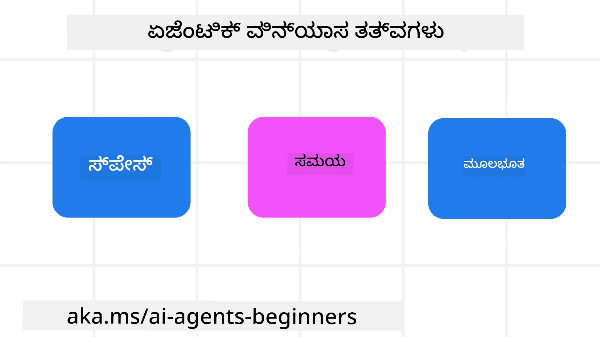

> _(ಈ ಪಾಠದ ವೀಡಿಯೊವನ್ನು ವೀಕ್ಷಿಸಲು ಮೇಲಿನ ಚಿತ್ರವನ್ನು ಕ್ಲಿಕ್ ಮಾಡಿ)_
# ಏಐ ಏಜೆಂಟಿಕ್ ವಿನ್ಯಾಸ ತತ್ವಗಳು

## ಪರಿಚಯ

ಏಐ ಏಜೆಂಟಿಕ್ ವ್ಯವಸ್ಥೆಗಳನ್ನು ನಿರ್ಮಿಸುವ ಬಗ್ಗೆ ಚಿಂತಿಸಲು ಹಲವಾರು ಮಾರ್ಗಗಳಿವೆ. ಜನರೇಟಿವ್ AI ವಿನ್ಯಾಸದಲ್ಲಿ ಅನುನಯತೆ ವೈಶಿಷ್ಟ್ಯವಾಗಿದ್ದು ದೋಷವಲ್ಲ, ಇದು ಎಂಜಿನಿಯರ್‌ಗಳಿಗೆ ಎಲ್ಲಿಂದ ಆರಂಭಿಸಬೇಕೆಂದು ತಗೆದುಕೊಳ್ಳುವುದು ಕೆಲವೊಮ್ಮೆ ಕಷ್ಟವಾಗುತ್ತದೆಯೆಂದರೆ. ನಾವು ಮಾನವ-कೇಂದ್ರಿತ UX ವಿನ್ಯಾಸ ತತ್ವಗಳ ಸಮೂಹವನ್ನು ಸೃಷ್ಟಿಸಿದ್ದೇವೆ, ಇದು ಅಭಿವೃದ್ಧಿಪಡಿಸುವವರಿಗೆ ಗ್ರಾಹಕ-ಕೇಂದ್ರಿತ ಏಜೆಂಟಿಕ್ ವ್ಯವಸ್ಥೆಗಳನ್ನು ನಿರ್ಮಿಸಲು ಸಹಾಯ ಮಾಡುತ್ತದೆ, ಅವರ ವ್ಯವಹಾರ ಅಗತ್ಯಗಳನ್ನು ಪರಿಹರಿಸಲು. ಈ ವಿನ್ಯಾಸ ತತ್ವಗಳು ನಿಯಮಾವಳಿಯ معمಾರಕಲಲ್ಲ, ಬದಲಾಗಿ ಏಜೆಂಟ್ ಅನುಭವಗಳನ್ನು ವ್ಯಾಖ್ಯಾನಿಸಿ ನಿರ್ಮಿಸುತ್ತಿರುವ ತಂಡಗಳಿಗೆ ಆರಂಭಿಕ ಬಿಂದುವಾಗಿದೆ.

ಸಾಮಾನ್ಯವಾಗಿ, ಏಜೆಂಟ್‌ಗಳು:

- ಮಾನವ ಸಾಮರ್ಥ್ಯಗಳನ್ನು ವಿಸ್ತರಿಸಿ ಮತ್ತು ಪ್ರಮಾಣಮಾಡಿ (ಚಿಂತನೆ, ಸಮಸ್ಯೆ ಪರಿಹಾರ, ಸ್ವಯಂಕ್ರಿಯೆ, ಇತ್ಯಾದಿ)
- ಜ್ಞಾನತ್ತೆಯ ಅಂತರಗಳನ್ನು ಭರ್ತಿ ಮಾಡಿ (ಜ್ಞಾನ ಕ್ಷೇತ್ರಗಳ ಬಗ್ಗೆ ನನಗೆ ತ್ವರಿತ ಶಿಬಿರ ನೀಡಿರಿ, ಭಾಷಾಂತರ, ಇತ್ಯಾದಿ)
- ನಾವು ತಾನು ಇತರರೊಂದಿಗೆ ಕಾರ್ಯನಿರ್ವಹಿಸುವುದಾಗಿ ಇಚ್ಛಿಸುವ ರೀತಿಯಲ್ಲಿ ಸಹಕಾರವನ್ನು ಸುಗಮಗೊಳಿಸಿ ಮತ್ತು ಬೆಂಬಲಿಸಿ
- ನಮ್ಮನ್ನು ಉತ್ತಮ ಆವೃತ್ತಿಗಳನ್ನಾಗಿ ಮಾಡಿ (ಉದಾ., ಜೀವನ ಕೋಚ್/ಕಾರ್ಯನಿರ್ವಹಣಾ ಮ್ಯಾಜಿಸ್ಟರ್, ಭಾವನಾತ್ಮಕ ನಿಯಂತ್ರಣ ಮತ್ತು ಮನುಸ್ತಿತಿ ಕೌಶಲಗಳನ್ನು ಕಲಿಯಲು ಸಹಾಯಮಾಡುವುದು, ಸಹನಶೀಲತೆಯನ್ನು ನಿರ್ಮಿಸುವುದು, ಇತ್ಯಾದಿ)

## ಈ ಪಾಠದಲ್ಲಿ ಮೈಮಾಟವಾಗುವುದು

- ಏಜೆಂಟಿಕ್ ವಿನ್ಯಾಸ ತತ್ವಗಳು ಯಾವುವು
- ಈ ವಿನ್ಯಾಸ ತತ್ವಗಳನ್ನು ಅನುಷ್ಠಾನಗೊಳಿಸುವಾಗ ಅನುಸರಿಸುವ ಕೆಲವು ಮಾರ್ಗಸೂಚಿಗಳು ಯಾವುವು
- ವಿನ್ಯಾಸ ತತ್ವಗಳನ್ನು ಬಳಸುವ ಕೆಲವು ಉದಾಹರಣೆಗಳು ಯಾವುವು

## ಕಲಿಕೆಯ ಗುರಿಗಳು

ಈ ಪಾಠವನ್ನು ಪೂರ್ಣಗೊಳಿಸಿದ ಬಳಿಕ, ನೀವು ಸಾಧ್ಯವಾಗುವುದು:

1. ಏಜೆಂಟಿಕ್ ವಿನ್ಯಾಸ ತತ್ವಗಳು ಯಾವುವು ಎಂದು ವಿವರಿಸಿ
2. ಏಜೆಂಟಿಕ್ ವಿನ್ಯಾಸ ತತ್ವಗಳನ್ನು ಬಳಸುವ ಮಾರ್ಗಸೂಚಿಗಳನ್ನು ವಿವರಿಸಿ
3. ಏಜೆಂಟಿಕ್ ವಿನ್ಯಾಸ ತತ್ವಗಳನ್ನು ಉಪಯೋಗಿಸಿ ಏಜೆಂಟ್ ಅನ್ನು ನಿರ್ಮಿಸುವುದನ್ನು ಅರ್ಥಮಾಡಿಕೊಳ್ಳಿ

## ಏಜೆಂಟಿಕ್ ವಿನ್ಯಾಸ ತತ್ವಗಳು

### ಏಜೆಂಟ್ (ಸ್ಥಳ)

ಇದು ಏಜೆಂಟ್ ನಡೆದುಕೊಳ್ಳುವ ಪರಿಸರವಾಗಿದೆ. ಈ ತತ್ವಗಳು ನಾವು ಏಜೆಂಟ್‌ಗಳನ್ನು ಭೌತಿಕ ಮತ್ತು ಡಿಜಿಟಲ್ ಜಗತ್ತುಗಳಲ್ಲಿ ಭಾಗವಹಿಸಲು ಹೇಗೆ ವಿನ್ಯಾಸ ಮಾಡಬೇಕು ಎಂಬುದನ್ನು ತಿಳಿಸುತ್ತವೆ.

- **ಸಂಪರ್ಕಿಸುವುದು, ಕುಸಿಯುವುದು ಅಲ್ಲ** – ಜನರನ್ನು ಇತರ ಜನರು, ಘಟನೆಗಳು ಮತ್ತು ಕಾರ್ಯವಾಹಕ ಜ್ಞಾನಗಳಿಗೆ ಸಂಪರ್ಕಿಸಲು ಸಹಾಯ ಮಾಡಿ ಸಹಕಾರ ಮತ್ತು ಸಂಪರ್ಕಕ್ಕೆ ಅವಕಾಶ ಒದಗಿಸು.
- ಏಜೆಂಟ್‌ಗಳು ಘಟನೆ, ಜ್ಞಾನ ಮತ್ತು ಜನರನ್ನು ಸಂಪರ್ಕಿಸಲು ಸಹಾಯ ಮಾಡುತ್ತವೆ.
- ಏಜೆಂಟ್‌ಗಳು ಜನರನ್ನು ಹತ್ತಿರ broughtಯಿಸುತ್ತವೆ. ಜನರನ್ನು ಬದಲಾಯಿಸಲು ಅಥವಾ ಪರಿಹಾಸಿಸುವುದಕ್ಕಾಗಿ ವಿನ್ಯಾಸ ಮಾಡಿಲ್ಲ.
- **ಸುಲಭವಾಗಿ ಲಭ್ಯವಿರುವ ಆದರೆ ಕೆಲವೊಮ್ಮೆ ಅಗತ್ಯಸ್ಥಿತಿಯಲ್ಲಿ ಇರುವುದೇ** – ಏಜೆಂಟ್ ಬಹುಮಟ್ಟಿಗೆ ಹಿನ್ನೆಲೆಯಲ್ಲಿರುವುದು ಮತ್ತು ಅಗತ್ಯವಿದ್ದಾಗ ಮಾತ್ರ ನಮಗೆ ನಿಯಮಿತವಾಗಿ ಸೂಚನೆಗಳನ್ನು ನೀಡುತ್ತದೆ.
  - ಏಜೆಂಟ್ ಯಾವುದೇ ಸಾಧನ ಅಥವಾ ವೇದಿಕೆಯ ಮೇಲೆ ಪ್ರाधिकೃತ ಬಳಕೆದಾರರಿಗೆ ಸುಲಭವಾಗಿ ಕಂಡುಬರುತ್ತದೆ ಮತ್ತು ಲಭ್ಯವಿದೆ.
  - ಏಜೆಂಟ್ ಬಹುಮಾಧ್ಯಮ ಇನ್ಪುಟ್‌ಗಳು ಮತ್ತು ಔಟ್‌ಪುಟ್‌ಗಳನ್ನು (ಧ್ವನಿ, ಕಣೆ, ಪಠ್ಯ, ಇತ್ಯಾದಿ) ಬೆಂಬಲಿಸುತ್ತದೆ.
  - ಬಳಕೆದಾರ ಬೇಡಿಕೆಗಳನ್ನು ಅನ್ವೇಷಿಸಿದ ಮೇಲೆಯೇ ಏಜೆಂಟ್ ಕಡೆಯಿಂದ ಮುಂಭಾಗ ಮತ್ತು ಹಿಂದಿನಭಾಗಗಳ ನಡುವೆ ಸುಗಮವಾಗಿ ಬದಲಾಯಿಸಬಹುದು; ಪ್ರಾಕ್ರೀಯ ಹಾಗೂ ಪ್ರತಿಕ್ರಿಯಾತ್ಮಕ ನಡುವೆ ಬದಲಾಗಬಹುದು.
  - ಏಜೆಂಟ್ ಅಘಟನಾಮಯ ರೂಪದಲ್ಲಿ ಕಾರ್ಯನಿರ್ವಹಿಸಬಹುದು, ಆದರೆ ಅದರ ಹಿನ್ನೆಲೆ ಪ್ರಕ್ರಿಯಾ ಮಾರ್ಗ ಮತ್ತು ಇತರ ಏಜೆಂಟ್‌ಗಳೊಂದಿಗೆ ಸಹಕಾರವು ಬಳಕೆದಾರರಿಗೆ ತಿಳಿವಿಗೆ ಮತ್ತು ನಿಯಂತ್ರಣಕ್ಕೆ ಸಿಗುತ್ತದೆ.

### ಏಜೆಂಟ್ (ಕಾಲ)

ಇದು ಏಜೆಂಟ್ ಕಾಲಾನುಗತವಾಗಿ ಹೇಗೆ ಕಾರ್ಯನಿರ್ವಹಿಸುತ್ತದೆಯೆಂದು ಸೂಚಿಸುತ್ತದೆ. ಈ ತತ್ವಗಳು ನಾವು ಹಿಂದಿನ, ಪ್ರಸ್ತುತ ಮತ್ತು ಭವಿಷ್ಯದ ಬಾಗಿಲಿನಲ್ಲಿ ಏಜೆಂಟ್‌ಗಳ ಅಥವಾ ಕರೆಯುವಿಕೆಯನ್ನು ವಿನ್ಯಾಸ ಮಾಡಬೇಕೆಂಬುದನ್ನು ಸೂಚಿಸುತ್ತವೆ.

- **ಹಿಂದಿನ ಕಾಲ**: ಸ್ಥಿತಿ ಮತ್ತು ಹಿನ್ನೆಲೆಯನ್ನು ಒಳಗೊಂಡ ಇತಿಹಾಸವನ್ನು ಪ್ರತಿಬಿಂಬಿಸುವುದು.
  - ಏಜೆಂಟ್ ಕಾರ್ಯಕ್ರಮದ, ಜನರ ಅಥವಾ ರಾಜ್ಯಗಳ ಮಾತ್ರವಲ್ಲದೆ, ಸಮೃದ್ಧ ಇತಿಹಾಸಾತ್ಮಕ ಡೇಟಾ ವಿಶ್ಲೇಷಣೆಯ ಆಧಾರದ ಮೇಲೆ ಹೆಚ್ಚು ಸಂಬಂಧಿತರ ಫಲಿತಾಂಶಗಳನ್ನು ಒದಗಿಸುತ್ತದೆ.
  - ಏಜೆಂಟ್ ಹಿಂದಿನ ಘಟನೆಗಳಿಂದ ಸಂಪರ್ಕಗಳನ್ನು ಸೃಷ್ಟಿಸಿ ಸ್ಮೃತಿಯನ್ನು ಸಕ್ರಿಯವಾಗಿ ಪರಿಶೀಲಿಸಿ ಪ್ರಸ್ತುತ ಪರಿಸ್ಥಿತಿಗಳೊಂದಿಗೆ ಸಂವಹನ ಮಾಡುತ್ತದೆ.
- **ಪ್ರಸ್ತುತ**: ಸೂಚಿಸುವುದಕ್ಕಿಂತ ಹೆಚ್ಚು ಪ್ರೇರೇಪಿಸುವುದು.
  - ಏಜೆಂಟ್ ಜನರೊಂದಿಗೆ ಸಂವಹನ ಮಾದರಿಯನ್ನು ಅಂಗೀಕರಿಸುತ್ತದೆ. ಒಂದು ಘಟನೆ ಸಂಭವಿಸಿದಾಗ, ಏಜೆಂಟ್ ಸ್ಥಿರ ಸೂಚನೆ ಅಥವಾ ಇತರ ಸಾಂಪ್ರದಾಯಿಕ ಆಯಾಮಗಳನ್ನು ಬಿಟ್ಟು ಮುನ್ನಡೆಯುತ್ತದೆ. ಬಳಕೆದಾರರ ಗಮನವನ್ನು ಸರಿಯಾದ ಕ್ಷಣದಲ್ಲಿ ಕರೆಗೊಳ್ಳಲು ಏಜೆಂಟ್ ಪ್ರಕ್ರಿಯೆಗಳನ್ನು ಸರಳಗೊಳಿಸುತ್ತದೆ ಅಥವಾ ಗತಿಶೀಲ ದೃಶ್ಯಗಳನ್ನು ರಚಿಸುತ್ತದೆ.
  - ಏಜೆಂಟ್ ಮಾಹಿತಿಯನ್ನು ಪರಿಸರ, ಸಾಮಾಜಿಕ ಮತ್ತು ಸಾಂಸ್ಕೃತಿಕ ಬದಲಾವಣೆಗಳಿಗೆ, ಹಾಗೂ ಬಳಕೆದಾರರ ಉದ್ದೇಶಗಳ ಆಧಾರದ ಮೇಲೆ ನೀಡುತ್ತದೆ.
  - ಏಜೆಂಟ್ ಸಂವಾದ ಧೀರದೊಳಗಿನಂತೆ ಕಡಿಮೆ-ಕಾರ್ಯತ್ಮಕವಾಗಿರಬಹುದು, ಬಳಕೆದಾರರನ್ನು ದೀರ್ಘಕಾಲದ ಅವಧಿಯಲ್ಲಿ ಸಶಕ್ತಗೊಳಿಸಲು ತಾಳ್ಮೆಯಿಂದ ಬೆಳೆಯುತ್ತದೆ.
- **ಭವಿಷ್ಯ**: ಹೊಂದಿಕೊಳ್ಳುವುದು ಮತ್ತು ಅಭಿವೃದ್ಧಿ ಆಗುವುದು.
  - ಏಜೆಂಟ್ ವಿಭಿನ್ನ ಸಾಧನಗಳು, ವೇದಿಕೆಗಳು ಮತ್ತು ಕ್ರಮೋಪಾಯಗಳಿಗೆ ಹೊಂದಿಕೊಳ್ಳುತ್ತವೆ.
  - ಏಜೆಂಟ್ ಬಳಕೆದಾರರ ವರ್ತನೆ, ಪ್ರವೇಶ ಅಗತ್ಯಗಳನ್ನು ಹೊಂದಿಕೊಳ್ಳುತ್ತವೆ ಮತ್ತು ಮುಕ್ತವಾಗಿ ಕಸ್ಟಮೈಸ್ ಮಾಡಬಹುದು.
  - ಏಜೆಂಟ್ ನಿರಂತರ ಬಳಕೆದಾರ ಸಂವಾದದಿಂದ ರೂಪುಗೊಂಡು ಅಭಿವೃದ್ಧಿ ಆಗುತ್ತವೆ.

### ಏಜೆಂಟ್ (ಹೃದಯಭಾಗ)

ಏಜೆಂಟ್ ವಿನ್ಯಾಸದ ಹೃದಯಭಾಗದಲ್ಲಿರುವ ಪ್ರಮುಖ ಅಂಶಗಳು.

- **ಅನಿಶ್ಚಿತತೆಯನ್ನು ಸ್ವೀಕರಿಸಿ ಆದರೆ ನಂಬಿಕೆಯನ್ನು ಸ್ಥಾಪಿಸಿ**.
  - ಏಜೆಂಟ್‌ಗಳ ನಿರ್ದಿಷ್ಟ ಮಟ್ಟದ ಅನಿಶ್ಚಿತತೆ ನಿರೀಕ್ಷಿತವಾಗಿದೆ. ಅನಿಶ್ಚಿತತೆ ಏಜೆಂಟ್ ವಿನ್ಯಾಸದ ಪ್ರಮುಖ ಅಂಶವಾಗಿದೆ.
  - ನಂಬಿಕೆ ಮತ್ತು ಪಾರದರ್ಶಕತೆ ಏಜೆಂಟ್ ವಿನ್ಯಾಸದ ಮೂಲಭೂತ ಪಟಲಗಳಾಗಿದೆ.
  - ಮಾನவர்கள் ಏಜೆಂಟ್ ಆನ್/ಆಫ್ ಮಾಡುವುದನ್ನು ನಿಯन्त्रಿಸುತ್ತಾರೆ ಮತ್ತು ಏಜೆಂಟ್ ಸ್ಥಿತಿ ಎಲ್ಲ ಸಮಯದಲ್ಲೂ ಸ್ಪಷ್ಟವಾಗಿ ಗೋಚರಿಸುತ್ತದೆ.

## ಈ ತತ್ವಗಳನ್ನು ಅನುಷ್ಠಾನಗೊಳಿಸುವ ಮಾರ್ಗಸೂಚಿಗಳು

ನೀವು ಪರಿಗಣಿಸಿರುವ ವಿನ್ಯಾಸ ತತ್ವಗಳನ್ನು ಬಳಸುವಾಗ, ಕೆಳಕಂಡ ಮಾರ್ಗಸೂಚಿಗಳನ್ನು ಅನುಸರಿಸಿ:

1. **ಪಾರದರ್ಶಕತೆ**: AI ಜೋಡಿಸಲಾಗಿದೆ ಎಂಬುದನ್ನು ಬಳಕೆದಾರರಿಗೆ ತಿಳಿಸಿ, ಅದು ಹೇಗೆ ಕಾರ್ಯನಿರ್ವಹಿಸುತ್ತದೆ (ಹಿಂದಿನ ಕ್ರಿಯೆಗಳ ಸೇರಿ), ಹಾಗೂ ಪ್ರತಿಕ್ರಿಯೆ ನೀಡುವುದು ಮತ್ತು ವ್ಯವಸ್ಥೆಯನ್ನು ತಿದ್ದುಪಡಿಸಿಕೊಳ್ಳುವುದು ಹೇಗೆ ಎಂಬುದನ್ನು ತಿಳಿಸಿ.
2. **ನಿಯಂತ್ರಣ**: ಬಳಕೆದಾರರಿಗೆ ಕಸ್ಟಮೈಸ್ ಮಾಡಲು, ಒಪ್ಪಂದಗಳನ್ನು ವಿಶೇಷವಾಗಿ ತಿಳಿಸಲು ಮತ್ತು ವೈಯಕ್ತಿಕಗೊಳಿಸಲು, ಹಾಗೂ ವ್ಯವಸ್ಥೆ ಮತ್ತು ಅದರ ಲಕ್ಷಣಗಳನ್ನು (ಮರೆತುಹೋಗುವ ಸಾಮರ್ಥ್ಯ ಸೇರಿ) ನಿಯಂತ್ರಿಸಲು ಅನುಮತಿಸಿ.
3. **ಸಮುಚಿತತೆ**: ಸಾಧನಗಳು ಮತ್ತು ಅಂತಿಮ ಭಾಗಗಳಲ್ಲಿ ಸತತ, ಬಹುಮಾಧ್ಯಮ ಅನುಭವಗಳತ್ತ ಗುರಿ ಇಡಿ. ಸಾಧ್ಯವಾದಲ್ಲಿ ಪರಿಚಿತ UI/UX ಅಂಶಗಳನ್ನು ಬಳಸಿ (ಉದಾ., ಧ್ವನಿಮಾಡುವಿಕೆಯಿಗಾಗಿ ಮೈಕ್ರೋಫೋನ್ ಚಿಹ್ನೆ) ಮತ್ತು ಗ್ರಾಹಕರ ಜ್ಞಾನಭಾರವನ್ನು (ಉದಾ., ಸಂಕ್ಷಿಪ್ತ ಪ್ರತಿಕ್ರಿಯೆಗಳು, ದೃಶ್ಯ ಸಹಾಯಗಳು, ಮತ್ತು ‘ಮೇಶಿಂತಗೆ ತಿಳಿಯಿರಿ’ ವಿಷಯ) ಕಡಿಮೆಮಾಡಿ.

## ಈ ತತ್ವಗಳು ಮತ್ತು ಮಾರ್ಗಸೂಚಿಗಳನ್ನು ಬಳಸಿ ಪ್ರಯಾಣ ಏಜೆಂಟ್ ವಿನ್ಯಾಸ ಹೇಗೆ ಮಾಡುವುದು

ನೀವು ಒಂದು ಪ್ರಯಾಣ ಏಜೆಂಟ್ ವಿನ್ಯಾಸ ಮಾಡುತ್ತಿದ್ದೀರಾ ಎಂದು ಊಹಿಸಿ, ವಿನ್ಯಾಸ ತತ್ವಗಳು ಮತ್ತು ಮಾರ್ಗಸೂಚಿಗಳನ್ನು ಬಳಸುವ ಬಗ್ಗೆ ಹೇಗೆ ಚಿಂತಿಸಬಹುದು ಎಂಬುದನ್ನು ಇಲ್ಲಿ ತಿಳಿಸಲಾಗಿದೆ:

1. **ಪಾರದರ್ಶಕತೆ** – ಪ್ರಯಾಣ ಏಜೆಂಟ್ AI-ಸಕ್ರಿಯ ಏಜೆಂಟ್ ಎಂದು ಬಳಕೆದಾರರಿಗೆ ತಿಳಿಸಿ. ಪ್ರಾರಂಭಿಸಲು ಕೆಲವು ಮೂಲ ಸೂಚನೆಗಳನ್ನು ನೀಡಿ (ಉದಾ., “ಹೆಲೋ” ಸಂದೇಶ, ಮಾದರಿ ಪ್ರಾಂಪ್ಟ್‌ಗಳು). ಇದನ್ನು ಉತ್ಪನ್ನ ಪುಟದಲ್ಲಿ ಸ್ಪಷ್ಟವಾಗಿ ದಾಖಲೆ ಮಾಡಿ. ಬಳಕೆದಾರರು ಹಿಂದಿನ ಕಾಲದಲ್ಲಿ ಕೇಳಿದ ಪ್ರಾಂಪ್ಟ್ ಗಳ ಪಟ್ಟಿಯನ್ನು ತೋರಿಸಿ. ಪ್ರತಿಕ್ರಿಯೆ ನೀಡುವುದು ಹೇಗೆ (ಥಂಬ್ಸ್ ಅಪ್ ಮತ್ತು ಡೌನ್, ಪ್ರತಿಕ್ರಿಯೆ ಕಳುಹಿಸುವ ಬಟನ್ ಮುಂತಾದವು) ಎಂದು ಸ್ಪಷ್ಟವಾಗಿ ವ್ಯಾಖ್ಯಾನಿಸಿ. ಏಜೆಂಟ್‌ನಲ್ಲಿ ಬಳಕೆಯ ಅಥವಾ ವಿಷಯದ ನಿರ್ಬಂಧಗಳಿದ್ದರೆ ಸ್ಪಷ್ಟವಾಗಿ ತಿಳಿಸಿ.
2. **ನಿಯಂತ್ರಣ** – ಸೃಷ್ಟಿಸಿದ ನಂತರ ಬಳಕೆದಾರರು ಏಜೆಂಟ್ ಅನ್ನು ಹೇಗೆ ಬದಲಾಯಿಸಬಹುದೆಂದು ಸಾರಿಸಿ, ಉದಾ., ಸಿಸ್ಟಮ್ ಪ್ರಾಂಪ್ಟ್. ಬಳಕೆದಾರನು ಏಜೆಂಟ್ verbosity ಮಟ್ಟ, ಬರವಣಿಗೆಯ ಶೈಲಿ, ಮತ್ತು ಏಜೆಂಟ್ ಮಾತನಾಡಬಾರದೆಂದು ನಿಲ್ಲಿಸುವ ವಿಷಯಗಳನ್ನು ಆಯ್ಕೆಮಾಡುವುದು ಸಾಧ್ಯವಾಗಲಿ. ಪ್ರತಿಯೊಬ್ಬ ಬಳಕೆದಾರನು ಯಾವುದೇ ಸಂಬಂಧ ಪಟ್ಟ ಫೈಲ್‌ಗಳು, ಡೇಟಾಗಳು, ಪ್ರಾಂಪ್ಟ್‌ಗಳು ಮತ್ತು ಹಿಂದಿನ ಸಂವಾದಗಳನ್ನು ವೀಕ್ಷಿಸಿ ಅಳಿಸಬಹುದು.
3. **ಸಮುಚಿತತೆ** – ಶೇರ್ ಪ್ರಾಂಪ್ಟ್, ಫೈಲ್ ಅಥವಾ ಫೋಟೋ ಸೇರಿಸುವುದು ಮತ್ತು ಯಾರಾದರೂ ಅಥವಾ ಯಾವುದಾದರೂ ಟ್ಯಾಗ್ ಮಾಡುವಂತೆ ಐಕಾನ್‌ಗಳು ನಿಯಮಿತ ಮತ್ತು ಪರಿಚಿತವಾಗಿವೆ ಎಂಬುದನ್ನು ಖಚಿತಪಡಿಸಿಕೊಳ್ಳಿ. ಏಜೆಂಟ್‌ಗೆ ಫೈಲ್ ಅಪ್‌ಲೋಡ್ ಸಾಧ್ಯತೆ ಸೂಚಿಸಲು ಪೇಪರ್ ಕ್ಲಿಪ್ ಐಕಾನ್ ಬಳಸಿ, ಹಾಗೂ ಚಿತ್ರ ಅಪ್‌ಲೋಡ್ ಅನ್ನು ಸೂಚಿಸಲು ಚಿತ್ರ ಐಕಾನ್ ಬಳಸಿ.

## ಮಾದರಿ ಕೋಡ್ಸ್

- ಪೈಥಾನ್: [Agent Framework](./code_samples/03-python-agent-framework.ipynb)
- .NET: [Agent Framework](./code_samples/03-dotnet-agent-framework.md)

## AI ಏಜೆಂಟಿಕ್ ವಿನ್ಯಾಸ ಮಾದರಿಗಳನ್ನು ಕುರಿತು ಇನ್ನಷ್ಟು ಪ್ರಶ್ನೆಗಳಿದ್ದರೆ?

[Microsoft Foundry Discord](https://discord.com/invite/ATgtXmAS5D) ಗೆ ಸೇರಿ ಇತರೆ ಕಲಿಕೆಯವರನ್ನು ಭೇಟಿ ಮಾಡಿ, ಕಾರ್ಯಾಲಯ ಗಂಟೆಗಳಲ್ಲಿ ಭಾಗವಹಿಸಿ ಮತ್ತು ನಿಮ್ಮ AI ಏಜೆಂಟ್‌ಗಳ ಪ್ರಶ್ನೆಗಳಿಗೆ ಉತ್ತರಗಳನ್ನು ಪಡೆಯಿರಿ.

## ಹೆಚ್ಚಿನ ಸಂಪನ್ಮೂಲಗಳು

- <a href="https://openai.com" target="_blank">ಏಜೆಂಟಿಕ್ AI ವ್ಯವಸ್ಥೆಗಳ ಆಡಳಿತಕ್ಕಾಗಿ ಅಭ್ಯಾಸಗಳು | OpenAI</a>
- <a href="https://microsoft.com" target="_blank">HAX ಟೂಲ್ಕಿಟ್ ಪ್ರಾಜೆಕ್ಟ್ - Microsoft Research</a>
- <a href="https://responsibleaitoolbox.ai" target="_blank">ಉತ್ತರದಾಯಕ AI ಟೂಲ್ಬಾಕ್ಸ್</a>

## ಹಿಂದಿನ ಪಾಠ

[ಏಜೆಂಟಿಕ್ ಫ್ರೇಂವರ್ಕ್‌ಗಳನ್ನು ಅನ್ವೇಷಿಸಲಾಗುತ್ತಿದೆ](../02-explore-agentic-frameworks/README.md)

## ಮುಂದಿನ ಪಾಠ

[ಟೂಲ್ ಬಳಕೆ ವಿನ್ಯಾಸ ಮಾದರಿ](../04-tool-use/README.md)

---

<!-- CO-OP TRANSLATOR DISCLAIMER START -->
**ಅಸ್ವೀಕಾರ**:
ಈ ದಸ್ತಾವೇಜು AI ಅನುವಾದ ಸೇವೆ [Co-op Translator](https://github.com/Azure/co-op-translator) ಬಳಸಿ ಅನುವಾದಿಸಲಾಗಿದೆ. ನಾವು ನಿಖರತೆಯನ್ನು ಸಾಧಿಸಲು ಪ್ರಯತ್ನಿಸುತ್ತಿದ್ದರೂ, ದಯವಿಟ್ಟು ಗಮನಿಸಿ, ಸ್ವಯಂಚಾಲಿತ ಅನುವಾದಗಳಲ್ಲಿ ದೋಷಗಳು ಅಥವಾ ಅಸಡ್ಡೆಗಳು ಇರಬಹುದು. ಮೂಲ ಭಾಷೆಯಲ್ಲಿರುವ ಮೂಲ ದಸ್ತಾವೇಜು ಪ್ರಾಮಾಣಿಕ ಮೂಲವೆಂದು ಪರಿಗಣಿಸಬೇಕು. ಪ್ರಮುಖ ಮಾಹಿತಿಗಾಗಿ, ವೃತ್ತಿಪರ ಮಾನವ ಅನುವಾದವನ್ನು ಶಿಫಾರಸು ಮಾಡಲಾಗುತ್ತದೆ. ಈ ಅನುವಾದವನ್ನು ಬಳಸುವ ಮೂಲಕ ಉಂಟಾಗುವ ಯಾವುದೇ ತಪ್ಪು ಅರ್ಥಗಳ ಅಥವಾ ತಪ್ಪು ವ್ಯಾಖ್ಯಾನಗಳ ಬಗ್ಗೆ ನಾವು ಹೊಣೆಗಾರರಲ್ಲ.
<!-- CO-OP TRANSLATOR DISCLAIMER END -->