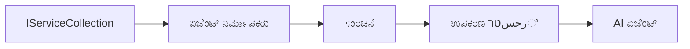

# 🎨 Azure OpenAI (Responses API) (.NET)ೊಂದಿಗೆ ಏಜೆಂಟಿಕ್ ವಿನ್ಯಾಸ ಮಾದರಿಗಳು

## 📋 ಅಧ್ಯಯನ ಉದ್ದೇಶಗಳು

ಈ ಉದಾಹರಣೆ Microsoft Agent Framework ಅನ್ನು .NET ನಲ್ಲಿ Azure OpenAI (Responses API) ಇಂಟಿಗ್ರೇಷನ್‌ನೊಂದಿಗೆ ಬುದ್ಧಿವಂತ ಏಜೆಂಟುಗಳ ನಿರ್ಮಾಣಕ್ಕಾಗಿ ಎಂಟರ್‌ಪ್ರೈಸ್-ಮಟ್ಟದ ವಿನ್ಯಾಸ ಮಾದರಿಗಳನ್ನು ಪ್ರದರ್ಶಿಸುತ್ತದೆ. ನೀವು ಏಜೆಂಟುಗಳನ್ನು ಉತ್ಪಾದನೆಗೆ ತಯಾರಾಗಿರುವ, ನಿರ್ವಹಿಸುವ, ಮತ್ತು ಸ್ಕೇಲಬಲ್ ಮಾಡುವ ವೃತ್ತಿಪರ ಮಾದರಿಗಳು ಮತ್ತು ವಾಸ್ತುಶಿಲ್ಪದ ಸಮೀಕ್ಷೆಗಳನ್ನು ಕಲಿಯುತ್ತೀರಿ.

### ಎಂಟರ್‌ಪ್ರೈಸ್ ವಿನ್ಯಾಸ ಮಾದರಿಗಳು

- 🏭 **Factory Pattern**: ಅವಲಂಬನೆ ನಿರ್ವಹಣೆಯೊಂದಿಗೆ ಮಾನಕ ಏಜೆಂಟ್ ನಿರ್ಮಾಣ
- 🔧 **Builder Pattern**: ಸುಗಮವಾದ ಏಜೆಂಟ್ ಸಂರಚನೆ ಮತ್ತು ಸೆಟಪ್
- 🧵 **Thread-Safe Patterns**: ಸಮಕಾಲೀನ ಸಂಭಾಷಣೆ ನಿರ್ವಹಣೆ
- 📋 **Repository Pattern**: ಪುಸ್ತಕಾಲಯ ಮತ್ತು ಸಾಮರ್ಥ್ಯ ನಿರ್ವಹಣೆ

## 🎯 .NET-ನ ವಿಶೇಷ ವಾಸ್ತುಶಿಲ್ಪ ಲಾಭಗಳು

### ಎಂಟರ್‌ಪ್ರೈಸ್ ವೈಶಿಷ್ಟ್ಯಗಳು

- **ದೃಢ ಟೈಪಿಂಗ್**: ಸಂಗ್ರಹಣಾ-ಸಮಯ ದೃಢೀಕರಣ ಮತ್ತು IntelliSense ಬೆಂಬಲ
- **ಅವಲಂಬನೆ ಇಂಜೆಕ್ಷನ್**: ಸೇರಿಸಿರುವ DI ಕಂಟೈನರ್ ಏಕೀಕರಣ
- **ಸಂರಚನೆ ನಿರ್ವಹಣೆ**: IConfiguration ಮತ್ತು Options ಮಾದರಿಗಳು
- **Async/Await**: ಪ್ರಥಮವಾಗಿದೆ ಅಸಿಂಕ್ರೋನಸ್ ಪ್ರೋಗ್ರಾಮಿಂಗ್ ಬೆಂಬಲ

### ಉತ್ಪಾದನಾ-ಸಿದ್ಧ ಮಾದರಿಗಳು

- **ಲೆಕ್ಕಾವಲೋಕೆ ಏಕೀಕರಣ**: ILogger ಮತ್ತು ರಚಿತ ಲಾಗಿಂಗ್ ಬೆಂಬಲ
- **ಆರೋಗ್ಯ ಪರೀಕ್ಷೆಗಳು**: ಸೇರಿಸಿರುವ ಅನ್ವಯ ಮತ್ತು ರೋಗನಿರ್ಣಯಗಳು
- **ಸಂರಚನೆ ದೃಢೀಕರಣ**: ಡೇಟಾ ಸೂಚನೆಗಳೊಂದಿಗೆ ದೃಢ ಟೈಪಿಂಗ್
- **ದೋಶ ನಿರ್ವಹಣೆ**: ರಚಿತ ಹೊರತುಪಡಿಸಿದ ನಿರ್ವಹಣೆ

## 🔧 ತಾಂತ್ರಿಕ ವಾಸ್ತುಶಿಲ್ಪ

### ಕೋರ್ .NET ಘಟಕಗಳು

- **Microsoft.Extensions.AI**: ಏಕೀಕೃತ AI ಸೇವೆ ಅವಲಂಬನೆಗಳು
- **Microsoft.Agents.AI**: ಎಂಟರ್‌ಪ್ರೈಸ್ ಏಜೆಂಟ್ ಸಂಯೋಜನೆ ಚಟುವಟಿಕೆ
- **Azure OpenAI (Responses API)**: ಉನ್ನತ-ಕಾರ್ಯಕ್ಷಮತೆಯ API ಕ್ಲೈಂಟ್ ಮಾದರಿಗಳು
- **ಸಂರಚನಾ ವ್ಯವಸ್ಥೆ**: appsettings.json ಮತ್ತು ಪರಿಸರ ಐಕ್ಯತೆ

### ವಿನ್ಯಾಸ ಮಾದರಿ ಅನುಷ್ಠಾನ



## 🏗️ ಪ್ರದರ್ಶಿಸಿದ ಎಂಟರ್‌ಪ್ರೈಸ್ ಮಾದರಿಗಳು

### 1. **ಸೃಜನಾ ಮಾದರಿಗಳು**

- **Agent Factory**: ಏಜೆಂಟ್ ನಿರ್ಮಾಣ ಕೇಂದ್ರಕೃತವಾಗಿ, ಸ್ತಿರ ಸಂರಚನೆಯೊಂದಿಗೆ
- **Builder Pattern**: ಸಂಕೀರ್ಣ ಏಜೆಂಟ್ ಸಂರಚನೆಗಾಗಿ ಸುಗಮ API
- **Singleton Pattern**: ಹಂಚಬಲ್ಲ ಸಂಪನ್ಮೂಲಗಳು ಮತ್ತು ಸಂರಚನೆ ನಿರ್ವಹಣೆ
- **ಅವಲಂಬನೆ ಇಂಜೆಕ್ಷನ್**: ಸಡಿಲ ಜೋಡಣ ಮತ್ತು ಪರೀಕ್ಷೆಯಲ್ಲಿಪು

### 2. **ಆಚರಣಾತ್ಮಕ ಮಾದರಿಗಳು**

- **Strategy Pattern**: ಬದಲಾಯಿಸಬಹುದಾದ ಉಪಕರಣ ಕಾರ್ಯಗತಗೊಳಿಸುವ ತಂತ್ರಗಳು
- **Command Pattern**: ಬಾಳಿದಾಡುವ ಏಜೆಂಟ್ ಕಾರ್ಯಾಚರಣೆಗಳು ಹೊಡೆಮರು / ಪುನಃಮರು
- **Observer Pattern**: ಘಟನೆ-ಚಾಲಿತ ಏಜೆಂಟ್ ಜೀವನಚಕ್ರ ನಿರ್ವಹಣೆ
- **Template Method**: ಮಾನದಂಡಿತ ಏಜೆಂಟ್ ಕಾರ್ಯನಿರ್ವಹಣೆ ಪ್ರವಾಹಗಳು

### 3. **ರಚನಾತ್ಮಕ ಮಾದರಿಗಳು**

- **Adapter Pattern**: Azure OpenAI (Responses API) ಸಂಯೋಜನೆ ಪದರ
- **Decorator Pattern**: ಏಜೆಂಟ್ ಸಾಮರ್ಥ್ಯ ಸುಧಾರಣೆ
- **Facade Pattern**: ಸರಳೀಕೃತ ಏಜೆಂಟ್ ಸಂವಹನ ಇಂಟರ್ಫೇಸ್ಗಳು
- **Proxy Pattern**: ಕಾರ್ಯಕ್ಷಮತೆಯಿಗಾಗಿ ಲೇಜಿ ಲೋಡಿಂಗ್ ಮತ್ತು ಕ್ಯಾಶಿಂಗ್

## 📚 .NET ವಿನ್ಯಾಸ ತತ್ವಗಳು

### SOLID ತತ್ವಗಳು

- **ಒಂದು ಜವಾಬ್ದಾರಿ**: ಪ್ರತಿ ಘಟಕದ ಒಬ್ಬ ಸ್ಪಷ್ಟ ಉದ್ದೇಶವಿದೆ
- **ತೆರೆದ/ಮುಚ್ಚಿದ**: ಬದಲಾವಣೆ ಇಲ್ಲದೆ ವಿಸ್ತೀರ್ಣಗೊಳ್ಳುವ ಶಕ್ತಿ
- **ಲಿಸ್ಕೋವ್ ಬದಲಾವಣೆ**: ಇಂಟರ್ಫೇಸ್ ಆಧಾರಿತ ಉಪಕರಣ ಅನುಷ್ಠಾನಗಳು
- **ಇಂಟರ್ಫೇಸ್ ವಿಭಜನೆ**: ಗುರಿತಳ, ಒಗ್ಗೂಡಿದ ಇಂಟರ್ಫೇಸ್ಗಳು
- **ಅವಲಂಬನೆ ವೀಕ್ಷಣೆ**: ಕಠಿಣ ಸಾದೃಶ್ಯಗಳ ಮೇಲೆ ಅವಲಂಬಿಸಿ, ನಿಖರತೆಗಳ ಮೇಲೆ ಅಲ್ಲ

### ಸ್ವಚ್ಛ ವಾಸ್ತುಶಿಲ್ಪ

- **ಡೊಮೇನ್ ಪದರ**: ಕೋರ್ ಏಜೆಂಟ್ ಮತ್ತು ಉಪಕರಣ ಅವಲಂಬನೆಗಳು
- **ಅಪ್ಲಿಕೇಶನ್ ಪದರ**: ಏಜೆಂಟ್ ಸಂಯೋಜನೆ ಮತ್ತು ಕಾರ್ಯನಿರ್ವಹಣೆ
- **ಅಡಫ್ರಾಸ್ಟ್ರಕ್ಚರ್ ಪದರ**: Azure OpenAI (Responses API) ಸಂಯೋಜನೆ ಮತ್ತು ಬಾಹ್ಯ ಸೇವೆಗಳು
- **ಪ್ರಸ್ತುತಿ ಪದರ**: ಬಳಕೆದಾರ ಸಂವಹನ ಮತ್ತು ಪ್ರತಿಕ್ರಿಯೆ ವಿನ್ಯಾಸ

## 🔒 ಎಂಟರ್‌ಪ್ರೈಸ್ ಪರಿಗಣನೆಗಳು

### ಭದ್ರತೆ

- **ಪ್ರಮಾಣಪತ್ರ ನಿರ್ವಹಣೆ**: IConfiguration ಬಳಸಿ ಸುರಕ್ಷಿತ API ಕೀ ಹ್ಯಾಂಡ್ಲಿಂಗ್
- **ಇನ್ಪುಟ್ ದೃಢೀಕರಣ**: ದೃಢ ಟೈಪಿಂಗ್ ಮತ್ತು ಡೇಟಾ ಸೂಚನೆ ದೃಢೀಕರಣ
- **ಔಟ್‌ಪುಟ್ ಶುದ್ಧೀಕರಣ**: ಸುರಕ್ಷಿತ ಉತ್ತರ ಪ್ರಕ್ರಿಯೆ ಮತ್ತು ಫಿಲ್ಟರಿಂಗ್
- **ಆಡಿಟ್ ಲಾಗಿಂಗ್**: ಸಮಗ್ರ ಕಾರ್ಯಾಚರಣೆ ಟ್ರ್ಯಾಕಿಂಗ್

### ಕಾರ್ಯಕ್ಷಮತೆ

- **ಅಸಿಂಕ್ ಮಾದರಿಗಳು**: ಅಡಚಣಾರಹಿತ I/O ಕಾರ್ಯಗಳು
- **ಕನೆಕ್ಷನ್ ಪೂಲಿಂಗ್**: ಪರಿಣಾಮಕಾರಿ HTTP ಕ್ಲೈಂಟ್ ನಿರ್ವಹಣೆ
- **ಕ್ಯಾಶಿಂಗ್**: ಉತ್ಥಾನ ಮಾಡಿದ ಕಾರ್ಯಕ್ಷಮತೆಗಾಗಿ ಪ್ರತಿಕ್ರಿಯೆ ಕ್ಯಾಶಿಂಗ್
- **ಸಂಪನ್ಮೂಲ ನಿರ್ವಹಣೆ**: ಸಮರ್ಪಕ ನಾಶ ಮತ್ತು ಶುದ್ಧೀಕರಣ ಮಾದರಿಗಳು

### ಸ್ಕೇಲಬಿಲಿಟಿ

- **ತಂತಿ ಸುರಕ್ಷತೆ**: ಸಮಕಾಲೀನ ಏಜೆಂಟ್ ಕಾರ್ಯನಿರ್ವಹಣಾ ಬೆಂಬಲ
- **ಸಂಪನ್ಮೂಲ ಪೂಲಿಂಗ್**: ಪರಿಣಾಮಕಾರಿ ಸಂಪನ್ಮೂಲ ಉಪಯೋಗ
- **ಭಾರ ನಿರ್ವಹಣೆ**: ದರ ಹಾದಿ ಮತ್ತು ಬ್ಯಾಕ್ಪ್ರೆಶರ್ ನಿರ್ವಹಣೆ
- **ನಿಗಾ**: ಕಾರ್ಯಕ್ಷಮತೆ ಮೀಟ್ರಿಕ್ಸ್ ಮತ್ತು ಆರೋಗ್ಯ ಪರೀಕ್ಷೆಗಳು

## 🚀 ಉತ್ಪಾದನಾ ನಿಯೋಜನೆ

- **ಸಂರಚನಾ ನಿರ್ವಹಣೆ**: ಪರಿಸರ-ನಿರ್ದಿಷ್ಟ ಸೆಟ್ಟಿಂಗ್ಸ್
- **ಲಾಗಿಂಗ್ ತಂತ್ರಜ್ಞಾನ**: ಸಂಬಂಧಿತ IDಗಳೊಂದಿಗೆ ರಚಿತ ಲಾಗಿಂಗ್
- **ದೋಶ ನಿರ್ವಹಣೆ**: ಸಮಗ್ರ ಹೊರತುಪಡಿಸಿದ ನಿರ್ವಹಣೆ ಮತ್ತು ಸರಿಯಾದ ವಿಶ್ರಾಂತಿ
- **ನಿಗಾ**: ಅಪ್ಲಿಕೇಶನ್ ಇನ್ಸೈಟ್ಸ್ ಮತ್ತು ಕಾರ್ಯಕ್ಷಮತೆ ಮೀಟರ್‌ಗಳು
- **ಪರೀಕ್ಷೆ**: ಘಟಕ ಪರೀಕ್ಷೆಗಳು, ಏಕರೂಪ ಪರೀಕ್ಷೆಗಳು ಮತ್ತು ಭಾರ ಪರೀಕ್ಷೆ ಮಾದರಿಗಳು

.NET ನೊಂದಿಗೆ ಎಂಟರ್‌ಪ್ರೈಸ್-ಮಟ್ಟದ ಬುದ್ಧಿವಂತ ಏಜೆಂಟ್‌ಗಳನ್ನು ನಿರ್ಮಿಸಲು ಸಿದ್ಧರಾ? ಬನ್ನಿ, ಮજબೂತ ವಾಸ್ತುಶಿಲ್ಪವನ್ನು ರೂಪಿಸೋಣ! 🏢✨

## 🚀 ಪ್ರಾರಂಭಿಸುವಿಕೆ

### ಪೂರ್ವಾಪೇಕ್ಷಿತಗಳು

- [.NET 10 SDK](https://dotnet.microsoft.com/download/dotnet/10.0) ಅಥವಾ ಮೇಲು
- Azure OpenAI ಸಂಪನ್ಮೂಲ ಮತ್ತು ಮಾದರಿ ನಿಯೋಜನೆಯೊಂದಿಗೆ ಒಂದು [Azure ಚಂದಾದಾರಿಕೆ](https://azure.microsoft.com/free/)
- [Azure CLI](https://learn.microsoft.com/cli/azure/install-azure-cli) — `az login` ಬಳಸಿ ಲಾಗಿನ್ ಆಗಿರಿ

### ಅಗತ್ಯವಾದ ಪರಿಸರ ವ್ಯತ್ಯಯಗಳು

```bash
# zsh/bash
export AZURE_OPENAI_ENDPOINT=https://<your-resource>.openai.azure.com
export AZURE_OPENAI_DEPLOYMENT=gpt-4o-mini
# ನಂತರ ಸೈನ್ ಇನ್ ಮಾಡಿ zodat AzureCliCredential ಟೋಕನ್ ಅನ್ನು ಪಡೆಯಬಹುದು
az login
```

```powershell
# ಪವರ್ ಶೆಲ್
$env:AZURE_OPENAI_ENDPOINT = "https://<your-resource>.openai.azure.com"
$env:AZURE_OPENAI_DEPLOYMENT = "gpt-4o-mini"
# ನಂತರ ಕಡತಕ್ಕೆ ಸಹಿ ಮಾಡಿ ώστε AzureCliCredential ಟೋಕೆನ್ ಪಡೆಯಬಹುದು
az login
```

### ಮಾದರಿ ಕೋಡ್

ಕೋಡ್ ಉದಾಹರಣೆ ಕಾರ್ಯಗತಗೊಳಿಸಲು,

```bash
# zsh/bash
chmod +x ./03-dotnet-agent-framework.cs
./03-dotnet-agent-framework.cs
```

ಅಥವಾ dotnet CLI ಬಳಸಿ:

```bash
dotnet run ./03-dotnet-agent-framework.cs
```

ಸಂಪೂರ್ಣ ಕೋಡ್‌ಗಾಗಿ [`03-dotnet-agent-framework.cs`](../../../../03-agentic-design-patterns/code_samples/03-dotnet-agent-framework.cs) ನೋಡಿ.

```csharp
#!/usr/bin/dotnet run

#:package Microsoft.Extensions.AI@10.*
#:package Microsoft.Agents.AI.OpenAI@1.*-*
#:package Azure.AI.OpenAI@2.1.0
#:package Azure.Identity@1.13.1

using System.ComponentModel;

using Microsoft.Agents.AI;
using Microsoft.Extensions.AI;

using Azure.AI.OpenAI;
using Azure.Identity;

// Tool Function: Random Destination Generator
// This static method will be available to the agent as a callable tool
// The [Description] attribute helps the AI understand when to use this function
// This demonstrates how to create custom tools for AI agents
[Description("Provides a random vacation destination.")]
static string GetRandomDestination()
{
    // List of popular vacation destinations around the world
    // The agent will randomly select from these options
    var destinations = new List<string>
    {
        "Paris, France",
        "Tokyo, Japan",
        "New York City, USA",
        "Sydney, Australia",
        "Rome, Italy",
        "Barcelona, Spain",
        "Cape Town, South Africa",
        "Rio de Janeiro, Brazil",
        "Bangkok, Thailand",
        "Vancouver, Canada"
    };

    // Generate random index and return selected destination
    // Uses System.Random for simple random selection
    var random = new Random();
    int index = random.Next(destinations.Count);
    return destinations[index];
}

// Azure OpenAI with the Responses API (stable v1 endpoint). Sign in with `az login`.
var azureEndpoint = Environment.GetEnvironmentVariable("AZURE_OPENAI_ENDPOINT")
    ?? throw new InvalidOperationException("AZURE_OPENAI_ENDPOINT is not set.");
var deployment = Environment.GetEnvironmentVariable("AZURE_OPENAI_DEPLOYMENT") ?? "gpt-4o-mini";

var azureClient = new AzureOpenAIClient(new Uri(azureEndpoint), new AzureCliCredential());

// Define Agent Identity and Comprehensive Instructions
// Agent name for identification and logging purposes
var AGENT_NAME = "TravelAgent";

// Detailed instructions that define the agent's personality, capabilities, and behavior
// This system prompt shapes how the agent responds and interacts with users
var AGENT_INSTRUCTIONS = """
You are a helpful AI Agent that can help plan vacations for customers.

Important: When users specify a destination, always plan for that location. Only suggest random destinations when the user hasn't specified a preference.

When the conversation begins, introduce yourself with this message:
"Hello! I'm your TravelAgent assistant. I can help plan vacations and suggest interesting destinations for you. Here are some things you can ask me:
1. Plan a day trip to a specific location
2. Suggest a random vacation destination
3. Find destinations with specific features (beaches, mountains, historical sites, etc.)
4. Plan an alternative trip if you don't like my first suggestion

What kind of trip would you like me to help you plan today?"

Always prioritize user preferences. If they mention a specific destination like "Bali" or "Paris," focus your planning on that location rather than suggesting alternatives.
""";

// Create AI Agent with Advanced Travel Planning Capabilities
// Get the Responses client for the deployment and create the AI agent
// Configure agent with name, detailed instructions, and available tools
// This demonstrates the .NET agent creation pattern with full configuration
AIAgent agent = azureClient
    .GetOpenAIResponseClient(deployment)
    .CreateAIAgent(
        name: AGENT_NAME,
        instructions: AGENT_INSTRUCTIONS,
        tools: [AIFunctionFactory.Create(GetRandomDestination)]
    );

// Create New Conversation Thread for Context Management
// Initialize a new conversation thread to maintain context across multiple interactions
// Threads enable the agent to remember previous exchanges and maintain conversational state
// This is essential for multi-turn conversations and contextual understanding
AgentThread thread = agent.GetNewThread();

// Execute Agent: First Travel Planning Request
// Run the agent with an initial request that will likely trigger the random destination tool
// The agent will analyze the request, use the GetRandomDestination tool, and create an itinerary
// Using the thread parameter maintains conversation context for subsequent interactions
await foreach (var update in agent.RunStreamingAsync("Plan me a day trip", thread))
{
    await Task.Delay(10);
    Console.Write(update);
}

Console.WriteLine();

// Execute Agent: Follow-up Request with Context Awareness
// Demonstrate contextual conversation by referencing the previous response
// The agent remembers the previous destination suggestion and will provide an alternative
// This showcases the power of conversation threads and contextual understanding in .NET agents
await foreach (var update in agent.RunStreamingAsync("I don't like that destination. Plan me another vacation.", thread))
{
    await Task.Delay(10);
    Console.Write(update);
}
```

---

<!-- CO-OP TRANSLATOR DISCLAIMER START -->
**ಅಸ್ವೀಕಾರ**:
ಈ ದಸ್ತಾವೇಜು AI ಅನುವಾದ ಸೇವೆ [Co-op Translator](https://github.com/Azure/co-op-translator) ಬಳಸಿ ಅನುವಾದಿಸಲಾಗಿದೆ. ನಾವು ನಿಖರತೆಯನ್ನು ಸಾಧಿಸಲು ಪ್ರಯತ್ನಿಸುತ್ತಿದ್ದರೂ, ದಯವಿಟ್ಟು ಗಮನಿಸಿ, ಸ್ವಯಂಚಾಲಿತ ಅನುವಾದಗಳಲ್ಲಿ ದೋಷಗಳು ಅಥವಾ ಅಸಡ್ಡೆಗಳು ಇರಬಹುದು. ಮೂಲ ಭಾಷೆಯಲ್ಲಿರುವ ಮೂಲ ದಸ್ತಾವೇಜು ಪ್ರಾಮಾಣಿಕ ಮೂಲವೆಂದು ಪರಿಗಣಿಸಬೇಕು. ಪ್ರಮುಖ ಮಾಹಿತಿಗಾಗಿ, ವೃತ್ತಿಪರ ಮಾನವ ಅನುವಾದವನ್ನು ಶಿಫಾರಸು ಮಾಡಲಾಗುತ್ತದೆ. ಈ ಅನುವಾದವನ್ನು ಬಳಸುವ ಮೂಲಕ ಉಂಟಾಗುವ ಯಾವುದೇ ತಪ್ಪು ಅರ್ಥಗಳ ಅಥವಾ ತಪ್ಪು ವ್ಯಾಖ್ಯಾನಗಳ ಬಗ್ಗೆ ನಾವು ಹೊಣೆಗಾರರಲ್ಲ.
<!-- CO-OP TRANSLATOR DISCLAIMER END -->