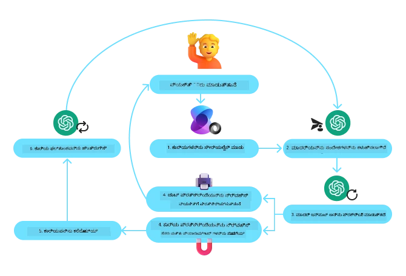
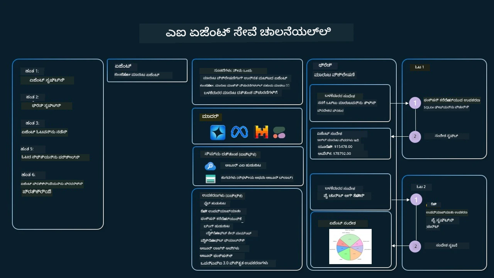

[](https://youtu.be/vieRiPRx-gI?si=cEZ8ApnT6Sus9rhn)

> _(ಈ ಪಾಠದ ವೀಡಿಯೋ ನೋಡಲು ಮೇಲಿನ ಚಿತ್ರವನ್ನು ಕ್ಲಿಕ್ ಮಾಡಿ)_

# ಉಪಕರಣ ಬಳಕೆ ವಿನ್ಯಾಸ ಮಾದರಿ

ಉಪಕರಣಗಳು ಆಸಕ್ತಿದಾಯಕವೆನ್ನುವದು ಏಕೆಂದರೆ ಅವು AI ಏಜೆಂಟ್ಗಳಿಗೆ ವ್ಯಾಪಕ ಶಕ್ತಿಗಳನ್ನು ನೀಡುತ್ತವೆ. ಏಜೆಂಟ್ ಹೊಂದಿರುವ ಸೀಮಿತ ಕ್ರಿಯೆಗಳ ಬಳಕೆಯ ಬದಲು, ಉಪಕರಣವನ್ನು ಸೇರಿಸುವ ಮೂಲಕ ಏಜೆಂಟ್ ಈಗ ವಿಶಾಲ ಶ್ರೇಣಿಯ ಕಾರ್ಯಗಳನ್ನು ನೆರವೇರಿಸಬಹುದು. ಈ ಅಧ್ಯಾಯದಲ್ಲಿ, AI ಏಜೆಂಟ್ಗಳು ತಮ್ಮ ಗುರಿಗಳನ್ನೇ ಸಾಧಿಸಲು ನಿಖರವಾದ ಉಪಕರಣಗಳನ್ನು ಹೇಗೆ ಬಳಸಬಹುದು ಎಂಬುದನ್ನು ವಿವರಿಸುವ ಉಪಕರಣ ಬಳಕೆ ವಿನ್ಯಾಸ ಮಾದರಿಯನ್ನು ನೋಡೋಣ.

## ಪರಿಚಯ

ಈ ಪಾಠದಲ್ಲಿ ನಾವು ಕೆಳಗಿನ ಪ್ರಶ್ನೆಗಳಿಗೆ ಉತ್ತರ ನೀಡೋಣ:

- ಉಪಕರಣ ಬಳಕೆ ವಿನ್ಯಾಸ ಮಾದರಿ ಎಂದರೇನು?
- ಅದನ್ನು ಯಾವ ಉಪಯೋಗಗಳಲ್ಲಿ ಅನ್ವಯಿಸಬಹುದು?
- ವಿನ್ಯಾಸ ಮಾದರಿಯನ್ನು ಜಾರಿಗೊಳಿಸಲು ಬೇಕಾದ ಅಂಶಗಳು/ನಿರ್ದೇಶಕ ಘಟಕಗಳು ಯಾವುವು?
- ವಿಶ್ವಾಸಾರ್ಹ AI ಏಜೆಂಟ್ಗಳನ್ನು ನಿರ್ಮಿಸಲು ಉಪಕರಣ ಬಳಕೆ ವಿನ್ಯಾಸ ಮಾದರಿಯನ್ನು ಬಳಸುವಾಗ ವಿಶೇಷ ಗಮನಸೂಚನೆಗಳು ಯಾವುವು?

## ಕಲಿಕೆ ಗುರಿಗಳು

ಈ ಪಾಠವನ್ನು ಮುಗಿಸಿದ ಮೇಲೆ, ನೀವು ಇದನ್ನು ಮಾಡಲು ಸಮರ್ಥರಾಗಿರುತ್ತೀರಿ:

- ಉಪಕರಣ ಬಳಕೆ ವಿನ್ಯಾಸ ಮಾದರಿಯ ವ್ಯಾಖ್ಯಾನ ಮತ್ತು ಅದರ ಉದ್ದೇಶವನ್ನು ವಿವರಿಸುವುದು.
- ಉಪಕರಣ ಬಳಕೆ ವಿನ್ಯಾಸ ಮಾದರಿ ಅನ್ವಯಿಸುವ ಉಪಯೋಗಗಳನ್ನು ಗುರುತಿಸುವುದು.
- ವಿನ್ಯಾಸ ಮಾದರಿಯನ್ನು ಜಾರಿಗೊಳಿಸಲು ಅಗತ್ಯವಿರುವ ಪ್ರಮುಖ ಅಂಶಗಳನ್ನು ಅರ್ಥಮಾಡಿಕೊಳ್ಳುವುದು.
- ಈ ವಿನ್ಯಾಸ ಮಾದರಿಯನ್ನು ಬಳಸಿ AI ಏಜೆಂಟ್ಗಳಲ್ಲಿ ವಿಶ್ವಾಸಾರ್ಹತೆಯನ್ನು ಖಾತ್ರಿಪಡಿಸಲು ಪರಿಗಣನೆಗಳನ್ನು ಗುರುತಿಸುವುದು.

## ಉಪಕರಣ ಬಳಕೆ ವಿನ್ಯಾಸ ಮಾದರಿ ಎಂದರೇನು?

**ಉಪಕರಣ ಬಳಕೆ ವಿನ್ಯಾಸ ಮಾದರಿ** LLMs ಗೆ ನಿರ್ದಿಷ್ಟ ಗುರಿಗಳನ್ನು ಸಾಧಿಸಲು ಬಾಹ್ಯ ಉಪಕರಣಗಳೊಂದಿಗೆ ಸಂವೇದಿಸಲು ಶಕ್ತಿ ನೀಡುವುದರ ಮೇಲೆ ಕೇಂದ್ರೀಕರಿಸುತ್ತದೆ. ಉಪಕರಣಗಳು ಏಜೆಂಟ್ ಮೂಲಕ ಕಾರ್ಯಗಳನ್ನು ನಿರ್ವಹಿಸಲು ನಿರ್ವಹಿಸಲ್ಪಡುವ ಕೋಡ್ ಆಗಿವೆ. ಉಪಕರಣವು ಸರಳ ಫಂಕ್ಷನ್, ಉದಾಹರಣೆಗೆ ಕ್ಯಾಲ್ಕುಲೇಟರ್ ಆಗಿರಬಹುದು ಅಥವಾ ಥರ್ಡ್-ಪಾರ್ಟಿ ಸೇವೆಗೆ API ಕರೆಯುವಿಕೆ, ಉದಾಹರಣೆಗೆ ಸ್ಟಾಕ್ ಬೆಲೆ ಹುಡುಕಾಟ ಅಥವಾ ಹವಾಮಾನ ಭವಿಷ್ಯವಾಣಿ ಆಗಿರಬಹುದು. AI ಏಜೆಂಟ್ಗಳ ತಾಳ್ಮೆಯಲ್ಲಿನ ಉಪಕರಣಗಳು **ಮಾಡೆಲ್ ಮಾರ್ಗದರ್ಶಿತ ಫಂಕ್ಷನ್ ಕರೆಗಳ** ಪ್ರತಿಕ್ರಿಯೆಯಲ್ಲಿ ಏಜೆಂಟ್ಗಳಿಂದ ಕಾರ್ಯಗತಗೊಳ್ಳುವಂತೆ ವಿನ್ಯಾಸಗೊಳಿಸಲ್ಪಟ್ಟಿವೆ.

## ಯಾವ ಉಪಯೋಗಗಳಿಗೆ ಇದನ್ನು ಅನ್ವಯಿಸಬಹುದು?

AI ಏಜೆಂಟ್ಗಳು ಸಂಕೀರ್ಣ ಕಾರ್ಯಗಳನ್ನು ಪೂರ್ಣಗೊಳಿಸಲು, ಮಾಹಿತಿ ಸಂಗ್ರಹಿಸಲು ಅಥವಾ ನಿರ್ಧಾರಗಳನ್ನು ಕೈಗೊಳ್ಳಲು ಉಪಕರಣಗಳನ್ನು ಉಪಯೋಗಿಸಬಹುದು. ಉಪಕರಣ ಬಳಕೆ ವಿನ್ಯಾಸ ಮಾದರಿಯನ್ನು ಬಾಹ್ಯ ವ್ಯವಸ್ಥೆಗಳೊಂದಿಗೆ ಚುರುಕಾದ ಸಂವಾದ ಅಗತಕೊಂಡಿರುವ ಸಂದರ್ಭಗಳಲ್ಲಿ, ಹೀಗಾಗಿ ಡಾಟಾಬೇಸ್‌ಗಳು, ವೆಬ್ ಸೇವೆಗಳು ಅಥವಾ ಕೋಡ್ ವಿವರಣೆಗಳು ಸಂಬಂಧಿಸಿದಾಗ ಬಳಸಲಾಗುತ್ತದೆ. ಈ ಶಕ್ತಿ ವಿವಿಧ ಉಪಯೋಗಗಳಿಗೆ ಉಪಯುಕ್ತವಾಗಿದೆ, ಅವುಗಳಲ್ಲಿ:

- **ಚಲಿಸುತಿರುವ ಮಾಹಿತಿ ಸಂಗ್ರಹಣೆ:** ಏಜೆಂಟ್ಗಳು ಬಾಹ್ಯ API ಗಳಿಗೆ ಅಥವಾ ಡಾಟಾಬೇಸ್ ಗಳಿಗೆ ಕೇಳಿ ನವೀಕರಿಸಿದ ಅಂಕಿಅಂಶವನ್ನು ಪಡೆಯಬಹುದು (ಉದಾಹರಣೆಗೆ, SQLite ಡಾಟಾಬೇಸ್ನಲ್ಲಿ ಡೇಟಾ ವಿಶ್ಲೇಷಣೆಗಾಗಿ ಪ್ರಶ್ನಿಸುವುದು, ಸ್ಟಾಕ್ ಬೆಲೆಗಳು ಅಥವಾ ಹವಾಮಾನ ಮಾಹಿತಿ ಪಡೆಯುವುದು).
- **ಕೋಡ್ ನಿರ್ವಹಣೆ ಮತ್ತು ವಿವರಣೆ:** ಏಜೆಂಟ್ಗಳು ಗಣಿತ ಸಮಸ್ಯೆಗಳನ್ನು ಉದ್ದೇಶಿಸಿ ಕೋಡ್ ಅಥವಾ ಸ್ಕ್ರಿಪ್ಟ್‌ಗಳನ್ನು ಕಾರ್ಯಗತಗೊಳಿಸಿ ವರದಿ ರಚನೆ ಅಥವಾ ಅನುಕರಣೆಯನ್ನು ನೆರವಾಗಿಸಬಹುದು.
- **ಕಾರ್ಯಪ್ರವಾಹ ಸ್ವಯಂಕ್ರಿಯೆ:** ಕಾರ್ಯ ಸಮಯ ನಿಯೋಜಕಗಳು, ಇಮೇಲ್ ಸೇವೆಗಳು ಅಥವಾ ಡೇಟಾ ಪೈಪ್ಲೈನ್ಗಳ ಹಾಗು ಉಪಕರಣಗಳನ್ನು ಅಳವಡಿಸುವ ಮೂಲಕ ಪುನರಾವರ್ತಿತ ಅಥವಾ ಬಹು ಹಂತದ ಕಾರ್ಯಗಳ ಸ್ವಯಂಕ್ರಿಯೆ.
- **ಗ್ರಾಹಕ ಬೆಂಬಲ:** ಏಜೆಂಟ್ಗಳು CRM ವ್ಯವಸ್ಥೆಗಳು, ಟಿಕೆಟ್ ವ್ಯವಸ್ಥೆಗಳು ಅಥವಾ ಜ್ಞಾನಾಧಾರಗಳೊಂದಿಗೆ ಸಂವಹನ ನಡೆಸಿ ಬಳಕೆದಾರ ವಿಚಾರಗಳನ್ನು ಪರಿಹರಿಸಬಹುದು.
- **ವಿಷಯ ರಚನೆ ಮತ್ತು ಸಂಪಾದನೆ:** ವ್ಯಾಕರಣ ತಪಾಸಕಗಳು, ಪಠ್ಯ ಸಾರಾಂಶಕಾರರು ಅಥವಾ ವಿಷಯ ಸುರಕ್ಷತಾ ಮೌಲ್ಯಮಾಪನಕಾರರನ್ನು ಬಳಸಿ ವಿಷಯ ಸೃಷ್ಟಿ ಕಾರ್ಯಗಳಲ್ಲಿ ನೆರವು ನೀಡಬಹುದು.

## ಉಪಕರಣ ಬಳಕೆ ವಿನ್ಯಾಸ ಮಾದರಿಯನ್ನು ಜಾರಿಗೊಳಿಸಲು ಬೇಕಾದ ಅಂಶಗಳು/ನಿರ್ದೇಶಕ ಘಟಕಗಳು ಯಾವುವು?

ಈ ನಿರ್ದೇಶಕ ಘಟಕಗಳು AI ಏಜೆಂಟ್ಗಾಗಿ ವ್ಯಾಪಕ ಕಾರ್ಯಕ್ಷಮತೆಯನ್ನು ಒದಗಿಸುತ್ತವೆ. ಈಗ ಉಪಕರಣ ಬಳಕೆ ವಿನ್ಯಾಸ ಮಾದರಿಯನ್ನು ಜಾರಿಗೊಳಿಸಲು ಮುಖ್ಯ ಅಂಶಗಳನ್ನು ನೋಡೋಣ:

- **ಫಂಕ್ಷನ್/ಉಪಕರಣchemas**: ಲಭ್ಯವಿರುವ ಉಪಕರಣಗಳ ವಿವರಪೂರಿತ ವ್ಯಾಖ್ಯಾನಗಳು, ಫಂಕ್ಷನ್ ಹೆಸರು, ಉದ್ದೇಶ, ಅಗತ್ಯ ಇರುವ ಪ್ಯಾರಾಮೀಟರ್‌ಗಳು ಮತ್ತು ನಿರೀಕ್ಷಿತ ಫಲಿತಾಂಶಗಳು. ಈchemas LLM ಗೆ ಲಭ್ಯವಿರುವ ಉಪಕರಣಗಳನ್ನು ತಿಳಿದುಕೊಳ್ಳಲು ಮತ್ತು ಮಾನ್ಯ ವಿನಂತಿಗಳನ್ನು ರಚಿಸಲು ಸಹಾಯ ಮಾಡುತ್ತವೆ.

- **ಫಂಕ್ಷನ್ ಅನುಷ್ಠಾನ ತತ್ವಾಂಶ**: ಉಪಯೋಗದ ವಿಶ್ವಾಸ ಮತ್ತು ಸಂವಾದದ ಸನ್ನಿವೇಶದ ಆಧಾರದ ಮೇಲೆ ಉಪಕರಣಗಳನ್ನು ಕರೆಸುವ ನಿಯಮಗಳು. ಇದರಲ್ಲಿ ಯೋಜಕ ಘಟಕಗಳು, ಮಾರ್ಗದರ್ಶನ ತಂತ್ರಗಳು ಅಥವಾ ಶರತ್ವರಕ ಪ್ರವಾಹಗಳನ್ನು ಸೇರಿಸಬಹುದು.

- **ಸಂದೇಶ ನಿರ್ವಹಣಾ ವ್ಯವಸ್ಥೆ**: ಬಳಕೆದಾರ ಇನ್ಪುಟ್ಗಳ, LLM ಪ್ರತಿಕ್ರಿಯೆಗಳ, ಉಪಕರಣ ಕರೆಗಳ ಮತ್ತು	output ಗಳ ನಡುವಿನ ಸಂವಾದದ ಹರಿವು ನಿರ್ವಹಿಸುತ್ತದೆ.

- **ಉಪಕರಣ ಸಂಯೋಜನೆ ಫ್ರೇಮ್ವರ್ಕ್**: ಏಜೆಂಟ್ಗಳು ಸರಳ ಫಂಕ್ಷನ್ ಗಳಿದ್ದರೂ ಸಾಕಾಗಲಿ ಅಥವಾ ಸಂಕೀರ್ಣ ಬಾಹ್ಯ ಸೇವೆಗಳಿದ್ದರೂ ಅವುಗಳನ್ನು ಸಂಪರ್ಕಿಸುವ ಒಡನಾಡಿತನ.

- **ದೋಷ ನಿರ್ವಹಣೆ ಮತ್ತು ದೃಢೀಕರಣ**: ಉಪಕರಣ ಕಾರ್ಯಗತಗೊಳಿಸುವಿಕೆ ವೈಫಲ್ಯಗಳನ್ನು ನಿರ್ವಹಿಸುವ, ಪ್ಯಾರಾಮೀಟರ್ ಗಳನ್ನು ಪರೀಕ್ಷಿಸುವ ಮತ್ತು ಅನಿರೀಕ್ಷಿತ ಪ್ರತಿಕ್ರಿಯೆಗಳನ್ನು ನಿರ್ವಹಿಸುವ ವ್ಯವಸ್ಥೆಗಳು.

- **ಸ್ಥಿತಿ ನಿರ್ವಹಣೆ**: ಸಂವಾದದ ಸನ್ನಿವೇಶ, ಹಿಂತಿನ ಉಪಕರಣ ಸಂವಹನಗಳು ಮತ್ತು ಬಹು-ಪರ್ಯಾಯ ಸಂವಾದದಲ್ಲಿ ಸತತ ಡೇಟಾ ನಿರ್ವಹಣೆ ನಡೆಸುತ್ತದೆ.

ಅನಂತರ, ಫಂಕ್ಷನ್/ಉಪಕರಣ ಕರೆಗಾರಿಕೆಯನ್ನು ಹೆಚ್ಚಿನ ವಿವರಗಳೊಂದಿಗೆ ನೋಡೋಣ.

### ಫಂಕ್ಷನ್/ಉಪಕರಣ ಕರೆಗಾರಿಕೆ

ಫಂಕ್ಷನ್ ಕರೆಗಾರಿಕೆ ದೊಡ್ಡ ಭಾಷಾ ಮಾದರಿಗಳು (LLMs) ನ್ನು ಉಪಕರಣಗಳೊಂದಿಗೆ ಸಂವೇದಿಸಲು ಮುಖ್ಯ ವಿಧಾನವಾಗಿದೆ. ನೀವು 'ಫಂಕ್ಷನ್' ಮತ್ತು 'ಉಪಕರಣ' ಎಂಬೆರಡು ಪದಗಳನ್ನು ಪರ್ಯಾಯವಾಗಿ ಬಳಸುವುದನ್ನು ನೋಡಬಹುದು ಏಕೆಂದರೆ 'ಫಂಕ್ಷನ್ ಗಳ' (ಮರುಪಯೋಗಿಸಬಹುದಾದ ಕೋಡ್ ಬ್ಲಾಕ್‌ಗಳು) ಊಹೆಮಾಡಬಹುದು ಏಜೆಂಟ್ಗಳು ಕಾರ್ಯನಿರ್ವಹಿಸಲು ಉಪಕರಣಗಳನ್ನು ಬಳಸುತ್ತಾರೆ. ಫಂಕ್ಷನ್ ನ ಕೋಡ್ ಕರೆಯಲು, LLM ಬಳಕೆದಾರರ ವಿನಂತಿಯನ್ನು ಫಂಕ್ಷನ್ ವಿವರಣೆಯ ವಿರುದ್ಧ ಹೋಲಿಸಬೇಕು. ಇದಕ್ಕೆ ಎಲ್ಲಾ ಲಭ್ಯವಿರುವ ಫಂಕ್ಷನ್ ಗಳ ವಿವರಣೆಗಳನ್ನು ಹೊಂದಿರುವ schema ಅನ್ನು LLM ಗೆ ಕಳುಹಿಸಲಾಗುತ್ತದೆ. LLM ಗುರಿಗೆ ಅತಿಥಿಯಾದ ವ್ಯವಸ್ಥೆಗೆ ಸೂಕ್ತವಾದ ಫಂಕ್ಷನ್ ಆಯ್ದು ಅದರ ಹೆಸರು ಮತ್ತು ವಾದಗಳನ್ನು ಮರಳಿ ನೀಡುತ್ತದೆ. ಆಯ್ದ ಫಂಕ್ಷನ್ ಕರೆಯಲ್ಪಟ್ಟು, ಅದರ ಪ್ರತಿಕ್ರಿಯೆ LLM ಗೆ ಹಿಂತಿರುಗಿಸಲಾಗುತ್ತದೆ, ಅದು ಅದರ ಮಾಹಿತಿಯನ್ನು ಬಳಸಿ ಬಳಕೆದಾರದ ವಿನಂತಿಗೆ ಪ್ರತಿಕ್ರಿಯಿಸುತ್ತದೆ.

ವಿಕಸಕರಿಗೆ ಫಂಕ್ಷನ್ ಕರೆಗಾರಿಕೆಯನ್ನು ಏಜೆಂಟ್ಗಳಿಗಾಗಿ ಜಾರಿಗೊಳಿಸಲು ಬೇಕು:

1. ಫಂಕ್ಷನ್ ಕರೆಗಾರಿಕೆಯನ್ನು ಬೆಂಬಲಿಸುವ LLM ಮಾದರಿ
2. ಫಂಕ್ಷನ್ ವಿವರಣೆಯ schema
3. ಪ್ರತಿಯೊಬ್ಬ ಫಂಕ್ಷನ್ ಗೆ ಬೇಕಾಗುವ ಕೋಡ್

ನಗರದಲ್ಲಿ ಪ್ರಸ್ತುತ ಸಮಯ ಪಡೆಯುವ ಉದಾಹರಣೆಯ ಮೂಲಕ ವಿವರಿಸೋಣ:

1. **ಫಂಕ್ಷನ್ ಕರೆಗಾರಿಕೆಯನ್ನು ಬೆಂಬಲಿಸುವ LLM ಪ್ರಾರಂಭಿಸಿ:**

   ಪ್ರತಿಯೊಂದು ಮಾದರಿಯೂ ಫಂಕ್ಷನ್ ಕರೆಗಾರಿಕೆಯನ್ನು ಬೆಂಬಲಿಸುವುದಿಲ್ಲ, ಆದ್ದರಿಂದ ನೀವು ಬಳಸುತ್ತಿರುವ LLM ನಲ್ಲಿ ಇದು ಇದ್ದೇ ಇರುತ್ತದೆ ಎಂದು ಖಚಿತಪಡಿಸಿಕೊಳ್ಳುವುದು ಮುಖ್ಯ.
   <a href="https://learn.microsoft.com/azure/ai-services/openai/how-to/function-calling" target="_blank">Azure OpenAI</a> ಫಂಕ್ಷನ್ ಕರೆಗಾರಿಕೆಯನ್ನು ಬೆಂಬಲಿಸುತ್ತದೆ. ನಾವು ಮೊದಲು Azure OpenAI ಕ್ಲೈಂಟ್ ಅನ್ನು ಪ್ರಾರಂಭಿಸಬಹುದು.

    ```python
    # ಅಝೂರ್ ಓಪನ್‌ಎಐ ಕ್ಲೈಂಟ್ ಅನ್ನು ಆರಂಭಿಸಿ
    client = AzureOpenAI(
        azure_endpoint = os.getenv("AZURE_AI_PROJECT_ENDPOINT"), 
        api_key=os.getenv("AZURE_OPENAI_API_KEY"),  
        api_version="2024-05-01-preview"
    )
    ```

1. **ಫಂಕ್ಷನ್ Schema ರಚನೆ ಮಾಡಿ**:

   ನಂತರ ಫಂಕ್ಷನ್ ಹೆಸರು, ಫಂಕ್ಷನ್ ಏನು ಮಾಡುತ್ತದೆ ಎಂಬ ವಿವರಣೆ ಮತ್ತು ಫಂಕ್ಷನ್ ಪ್ಯಾರಾಮೀಟರ್ಗಳ ಹೆಸರು ಹಾಗೂ ವಿವರಣೆ ಹೊಂದಿರುವ JSON schema ನವ್ವ_define ಮಾಡೋಣ.
   ನಾವು ನಂತರ ಈ schema ಯನ್ನೂ ಬಳಕೆದಾರರ ವಿನಂತಿಯನ್ನೂ ಆರಂಭಿಸಲಾಗಿರುವ ಕ್ಲೈಂಟ್ ಗೆ ಪಾಸುಮಾಡುತ್ತೇವೆ, ಉದಾಹರಣೆಗೆ ಸಾನ್ ಫ್ರಾನ್ಸಿಸ್ಕೋದಲ್ಲಿ ಕಾಲ ನೋಡಲು. ಮಹತ್ವದ್ದು ಎಂದರೆ **ಉಪಕರಣ ಕರೆ** ಮರಳಿಕೆಯಾಗುತ್ತದೆ, ಪ್ರಶ್ನೆಯ ಅಂತಿಮ ಉತ್ತರವಲ್ಲ. ಈಗಾಗಲೇ ಹೇಳಿದರು ಹಾಗೆ, LLM ಆಯ್ಕೆಮಾಡಿದ ಫಂಕ್ಷನ್ ಹೆಸರು ಮತ್ತು ಅದಕ್ಕೆ ಪಾಸು ಮಾಡಬೇಕಾದ ವಾದಗಳನ್ನು ಹಿಂತಿರುಗಿಸುತ್ತದೆ.

    ```python
    # ಮಾದರಿಯನ್ನು ಓದಲು ಕಾರ್ಯ ವಿವರಣೆ
    tools = [
        {
            "type": "function",
            "function": {
                "name": "get_current_time",
                "description": "Get the current time in a given location",
                "parameters": {
                    "type": "object",
                    "properties": {
                        "location": {
                            "type": "string",
                            "description": "The city name, e.g. San Francisco",
                        },
                    },
                    "required": ["location"],
                },
            }
        }
    ]
    ```
   
    ```python
  
    # ಪ್ರಾರಂಭಿಕ ಬಳಕೆದಾರ ಸಂದೇಶ
    messages = [{"role": "user", "content": "What's the current time in San Francisco"}] 
  
    # ಮೊದಲ API ಕால்: ಮಾದರಿಯು ಕಾರ್ಯವನ್ನು ಬಳಸಲು ಕೇಳಿ
      response = client.chat.completions.create(
          model=deployment_name,
          messages=messages,
          tools=tools,
          tool_choice="auto",
      )
  
      # ಮಾದರಿಯ ಪ್ರತಿಕ್ರಿಯೆಯನ್ನು ಪ್ರಕ್ರಿಯೆಗೊಳಿಸಿ
      response_message = response.choices[0].message
      messages.append(response_message)
  
      print("Model's response:")  

      print(response_message)
  
    ```

    ```bash
    Model's response:
    ChatCompletionMessage(content=None, role='assistant', function_call=None, tool_calls=[ChatCompletionMessageToolCall(id='call_pOsKdUlqvdyttYB67MOj434b', function=Function(arguments='{"location":"San Francisco"}', name='get_current_time'), type='function')])
    ```
  
1. **ಕಾರ್ಯನಿರ್ವಹಿಸಲು ಬೇಕಾದ ಫಂಕ್ಷನ್ ಕೋಡ್:**

   ಈಗ LLM ಆಯ್ಕೆಮಾಡಿದ ಫಂಕ್ಷನ್ ಕಾರ್ಯಗತಗೊಳ್ಳಬೇಕು, ಅದಕ್ಕಾಗಿ ಕೋಡ್ ಬರೆದಾಗಿದ್ದು ಕಾರ್ಯಗತಗೊಳ್ಳಬೇಕು.
   ನಾವು Python ಬಳಸಿ ಪ್ರಸ್ತುತ ಸಮಯವನ್ನು ಪಡೆಯುವ ಕೋಡ್ ಅನ್ನು ಜಾರಿಗೊಳಿಸಬಹುದು. ಉತ್ತರ ಸಂದೇಶದಿಂದ ಫಂಕ್ಷನ್ ಹೆಸರು ಮತ್ತು ವಾದಗಳನ್ನು ಹೊರತೆಗೆಯುವ ಕೋಡ್ ಕೂಡ ಬರೆಯಬೇಕು ಅಂತಿಮ ಫಲಿತಾಂಶ ಪಡೆಯಲು.

    ```python
      def get_current_time(location):
        """Get the current time for a given location"""
        print(f"get_current_time called with location: {location}")  
        location_lower = location.lower()
        
        for key, timezone in TIMEZONE_DATA.items():
            if key in location_lower:
                print(f"Timezone found for {key}")  
                current_time = datetime.now(ZoneInfo(timezone)).strftime("%I:%M %p")
                return json.dumps({
                    "location": location,
                    "current_time": current_time
                })
      
        print(f"No timezone data found for {location_lower}")  
        return json.dumps({"location": location, "current_time": "unknown"})
    ```

     ```python
     # ಫಂಕ್ಷನ್ ಕರೆಗೆಳನ್ನು ನಿರ್ವಹಿಸಿ
      if response_message.tool_calls:
          for tool_call in response_message.tool_calls:
              if tool_call.function.name == "get_current_time":
     
                  function_args = json.loads(tool_call.function.arguments)
     
                  time_response = get_current_time(
                      location=function_args.get("location")
                  )
     
                  messages.append({
                      "tool_call_id": tool_call.id,
                      "role": "tool",
                      "name": "get_current_time",
                      "content": time_response,
                  })
      else:
          print("No tool calls were made by the model.")  
  
      # ಎರಡನೇ API ಕರೆ: ಮಾದರಿಯಿಂದ ಅಂತಿಮ ಪ್ರತಿಕ್ರಿಯೋ ಪಡೆಯಿರಿ
      final_response = client.chat.completions.create(
          model=deployment_name,
          messages=messages,
      )
  
      return final_response.choices[0].message.content
     ```

     ```bash
      get_current_time called with location: San Francisco
      Timezone found for san francisco
      The current time in San Francisco is 09:24 AM.
     ```

ಫಂಕ್ಷನ್ ಕರೆಗಾರಿಕೆ ಬಹುಪಾಲು ಏಜೆಂಟ್ ಉಪಕರಣ ಬಳಕೆ ವಿನ್ಯಾಸ ಮಾದರಿಯ ಹೃದಯವಾಗಿದೆ, ಆದಾಗ್ಯೂ ಶून್ಯದಿಂದ ಅದನ್ನು ಜಾರಿಗೊಳಿಸುವುದು ಕೆಲವೊಮ್ಮೆ ចಲೆ ರಾಜಿ ಆಗಬಹುದು.
[ಪಾಠ 2](../../../02-explore-agentic-frameworks) ಗೆ ನಾವು ಕಲಿತಂತೆ ಏಜೆಂಟಿಕ್ ಫ್ರೇಮ್ವರ್ಕ್‌ಗಳು ಉಪಕರಣ ಬಳಕೆಗೆ ಪೂರ್ವ ನಿರ್ಮಿತ ನಿರ್ದೇಶಕ ಘಟಕಗಳನ್ನು ಒದಗಿಸುತ್ತವೆ.

## ಏಜೆಂಟಿಕ್ ಫ್ರೇಮ್ವರ್ಕ್‌ಗಳೊಂದಿಗೆ ಉಪಕರಣ ಬಳಕೆ ಉದಾಹರಣೆಗಳು

ನೀವು ವಿಭಿನ್ನ ಏಜೆಂಟಿಕ್ ಫ್ರೇಮ್ವರ್ಕ್‌ಗಳನ್ನು ಬಳಸಿ ಉಪಕರಣ ಬಳಕೆ ವಿನ್ಯಾಸ ಮಾದರಿಯನ್ನು ಹೇಗೆ ಜಾರಿಗೊಳಿಸಬಹುದು ಎಂಬ ಕೆಲವು ಉದಾಹರಣೆಗಳು ಇಲ್ಲಿವೆ:

### Microsoft ಏಜೆಂಟ್ ಫ್ರೇಮ್ವರ್ಕ್

<a href="https://learn.microsoft.com/azure/ai-services/agents/overview" target="_blank">Microsoft ಏಜೆಂಟ್ ಫ್ರೇಮ್ವರ್ಕ್</a> AI ಏಜೆಂಟ್ ನಿರ್ಮಾಣಕ್ಕೆ ಓಪನ್-ಸೋರ್ಸ್ AI ಫ್ರೇಮ್ವರ್ಕ್ ಆಗಿದೆ. `@tool` ಘಟಕ ಅಂಕಿತ ರಚನೆಯ ಮೂಲಕ Python ಫಂಕ್ಷನ್ ಗಳನ್ನು ಉಪಕರಣಗಳಾಗಿ ನಿರ್ಧರಿಸುವ ಮೂಲಕ ಫಂಕ್ಷನ್ ಕರೆಗಾರಿಕೆಯನ್ನು ಸುಲಭಗೊಳಿಸುತ್ತದೆ. ಫ್ರೇಮ್ವರ್ಕ್ ಮಾದರಿ ಮತ್ತು ನಿಮ್ಮ ಕೋಡ್ ನಡುವಿನ ಸಂವಾದ ಸಂವಹನವನ್ನು ನಿರ್ವಹಿಸುತ್ತದೆ. ಇದರ ಜೊತೆಗೆ `AzureAIProjectAgentProvider` ಮೂಲಕ ಫೈಲ್ ಹುಡುಕಾಟ ಮತ್ತು ಕೋಡ್ ವಿವರಣೆಕಾರರಂತಹ ಪೂರ್ವನಿರ್ಮಿತ ಉಪಕರಣಗಳಿಗೆ ಪ್ರವೇಶ ನೀಡುತ್ತದೆ.

ಕೆಳಗಿನ ಚಿತ್ರಿಸುತ್ತಿರುವುದು Microsoft ಏಜೆಂಟ್ ಫ್ರೇಮ್ವರ್ಕ್ ಹೊಂದಿರುವ ಫಂಕ್ಷನ್ ಕರೆಗಾರಿಕೆ ಪ್ರಕ್ರಿಯೆಯನ್ನು ವಿವರಿಸುತ್ತದೆ:



Microsoft ಏಜೆಂಟ್ ಫ್ರೇಮ್ವರ್ಕ್‌ನಲ್ಲಿ, ಉಪಕರಣಗಳು ಅಂಕಿತ ಫಂಕ್ಷನ್ ಗಳಾಗಿ ನಿರ್ಧರಿಸಲ್ಪಟ್ಟಿವೆ. ನಾವು ಮೊದಲು ನೋಡಿದ `get_current_time` ಫಂಕ್ಷನ್ ಅನ್ನು ನಾವು `@tool` ಅಂಕಿತೋಲಿಸುವ ಮೂಲಕ ಉಪಕರಣವನ್ನಾಗಿ ಪರಿವರ್ತಿಸಬಹುದು. ಫ್ರೇಮ್ವರ್ಕ್ ತಮ್ಮ ಫಂಕ್ಷನ್ ಮತ್ತು ಅದರ ಪ್ಯಾರಾಮೀಟರ್ಗಳನ್ನು ಸ್ವಯಂಚಾಲಿತವಾಗಿ ಸರಣಿಮಾಡಿ LLM ಗೆ schema ರಚಿಸುತ್ತದೆ.

```python
from agent_framework import tool
from agent_framework.azure import AzureAIProjectAgentProvider
from azure.identity import AzureCliCredential

@tool
def get_current_time(location: str) -> str:
    """Get the current time for a given location"""
    ...

# ಕ್ಲೈಂಟ್ ಅನ್ನು ರಚಿಸಿ
provider = AzureAIProjectAgentProvider(credential=AzureCliCredential())

# ಏಜೆಂಟ್ ಅನ್ನು ರಚಿಸಿ ಮತ್ತು ಸಾಧನದೊಂದಿಗೆ ನಿರ್ವಹಿಸಿ
agent = await provider.create_agent(name="TimeAgent", instructions="Use available tools to answer questions.", tools=get_current_time)
response = await agent.run("What time is it?")
```
  
### Azure AI ಏಜೆಂಟ್ ಸೇವೆ

<a href="https://learn.microsoft.com/azure/ai-services/agents/overview" target="_blank">Azure AI ಏಜೆಂಟ್ ಸೇವೆ</a> ಹೊಸ ಏಜೆಂಟಿಕ್ ಫ್ರೇಮ್ವರ್ಕ್ ಆಗಿದ್ದು, ವಾಸ್ತವಿಕವಾಗಿ ಡೆವಲಪರ್‌ಗಳಿಗೆ ಭದ್ರವಾಗಿ, ಬೇರೆಯಾಗದಂತೆ, ಮತ್ತು ಉಚಿತವಾಗಿ ಉತ್ತಮ ಗುಣಮಟ್ಟದ AI ಏಜೆಂಟ್ಗಳನ್ನು ನಿರ್ಮಿಸಲು, ನಿಯೋಜಿಸಲು ಮತ್ತು ವ್ಯಾಪಕಗೊಳಿಸಲು ವಿನ್ಯಾಸಗೊಳಿಸಲಾಗಿದೆ. ಇದು ಸೂಕ್ತ ಗಣಕ ಮತ್ತು ಸಂಗ್ರಹಣಾ ಸಂಪನ್ಮೂಲಗಳ ನಿರ್ವಹಣೆಯನ್ನು ಅಗತ್ಯವಿಲ್ಲದೆ ತಯಾರಾಗುತ್ತದೆ. ಇದನ್ನು ಖಾಸಗಿ ಅಪ್ಲಿಕೇಶನ್ ಗಾಗಿ ವಿಶೇಷವಾಗಿ ಉಪಯುಕ್ತವಾಗಿದೆ ಏಕೆಂದರೆ ಅದು ಸಂಪೂರ್ಣ ನಿರ್ವಹಿಸಲ್ಪಟ್ಟ ಸೇವೆಯಾಗಿದ್ದು ಉದ್ಯಮ ಮಟ್ಟದ ಭದ್ರತೆ ಒದಗಿಸುತ್ತದೆ.

ಸಾಧಾರಣವಾಗಿ LLM API ನ್ನು ನೇರವಾಗಿ ಅಭಿವೃದ್ಧಿಪಡಿಸುವುದರೊಂದಿಗೆ ಹೋಲಿಸಿದಾಗ, Azure AI ಏಜೆಂಟ್ ಸೇವೆಯು ಕೆಲವು ಲಾಭಗಳನ್ನು ನೀಡುತ್ತದೆ, ಅವುಗಳಾದರೆ:

- ಸ್ವಯಂ ಕ್ರಿಯಾತ್ಮಕ ಉಪಕರಣ ಕರೆ – ಉಪಕರಣ ಕರೆಗಳನ್ನು ವಿಭಾಗಿಸಲು, ಉಪಕರಣವನ್ನು ಕರೆಸಲು ಮತ್ತು ಪ್ರತಿಕ್ರಿಯೆಯನ್ನು ನಿರ್ವಹಿಸಲು ಅಗತ್ಯವಿಲ್ಲ; ಅಮೇಲೆ ಈ ಎಲ್ಲ ಕಾರ್ಯಗಳು ಸರ್ವರ್ ಬದಿಯಲ್ಲಿ ನೆರವಾಗುತ್ತವೆ.
- ಭದ್ರವಾಗಿ ನಿರ್ವಹಿಸಲಾದ ಡೇಟಾ – ನಿಮ್ಮ ಸಂವಾದ ಸ್ಥಿತಿಯನ್ನು ಸ್ವತಃ ನಿರ್ವಹಿಸುವ ಬದಲು, ನೀವು ಎಲ್ಲಾ ಅಗತ್ಯ ಮಾಹಿತಿಯನ್ನು ಸಂಗ್ರಹಿಸಲು ಥ್ರೆಡ್ ಗಳ ಮೇಲೆ ಅವಲಂಬಿಸಬಹುದು.
- ತಯಾರಾದ ಉಪಕರಣಗಳು – ನಿಮ್ಮ ಡೇಟಾ ಮೂಲಗಳೊಂದಿಗೆ ಸಂವಹನ ಮಾಡಲು ಉಪಕರಣಗಳನ್ನು ಬಳಸಬಹುದು, ಉದಾಹರಣೆಗೆ Bing, Azure AI Search, ಮತ್ತು Azure Functions.

Azure AI ಏಜೆಂಟ್ ಸೇವೆಯ ಲಭ್ಯವಿರುವ ಉಪಕರಣಗಳನ್ನು ಎರಡು ವರ್ಗಗಳಾಗಿ ವಿಭಜಿಸಬಹುದು:

1. ಜ್ಞಾನ ಉಪಕರಣಗಳು:
    - <a href="https://learn.microsoft.com/azure/ai-services/agents/how-to/tools/bing-grounding?tabs=python&pivots=overview" target="_blank">Bing Search ಮೂಲಕ ಗ್ರೌಂಡಿಂಗ್</a>
    - <a href="https://learn.microsoft.com/azure/ai-services/agents/how-to/tools/file-search?tabs=python&pivots=overview" target="_blank">ಫೈಲ್ ಹುಡುಕಾಟ</a>
    - <a href="https://learn.microsoft.com/azure/ai-services/agents/how-to/tools/azure-ai-search?tabs=azurecli%2Cpython&pivots=overview-azure-ai-search" target="_blank">Azure AI Search</a>

2. ಕ್ರಿಯಾತ್ಮಕ ಉಪಕರಣಗಳು:
    - <a href="https://learn.microsoft.com/azure/ai-services/agents/how-to/tools/function-calling?tabs=python&pivots=overview" target="_blank">ಫಂಕ್ಷನ್ ಕರೆಗಾರಿಕೆ</a>
    - <a href="https://learn.microsoft.com/azure/ai-services/agents/how-to/tools/code-interpreter?tabs=python&pivots=overview" target="_blank">ಕೋಡ್ ವಿವರಣೆಕಾರ</a>
    - <a href="https://learn.microsoft.com/azure/ai-services/agents/how-to/tools/openapi-spec?tabs=python&pivots=overview" target="_blank">OpenAPI ನಿರ್ಧರಿಸಿದ ಉಪಕರಣಗಳು</a>
    - <a href="https://learn.microsoft.com/azure/ai-services/agents/how-to/tools/azure-functions?pivots=overview" target="_blank">Azure Functions</a>

ಏಜೆಂಟ್ ಸೇವೆ ನಮಗೆ ಈ ಉಪಕರಣಗಳನ್ನು `ಉಪಕರಣ ಸೆಟ್` ಆಗಿ ಬಳಸುವ ಅವಕಾಶವನ್ನು ಒದಗಿಸುತ್ತದೆ. ಇದಲ್ಲದೆ `ಥ್ರೆಡ್‌ಗಳನ್ನು` ಉಪಯೋಗಿಸಿ ಸಂವಾದದ ಸೈದ್ಧಾಂತಿಕ ಸಂದೇಶಗಳ ದಾಖಲೆಯನ್ನು ಕಾಪಾಡುತ್ತದೆ.

Imagine ನೀವು Contoso ಎಂಬ ಕಂಪನಿಯ ಸೇಲ್‍ಸ್ ಏಜೆಂಟ್. ನಿಮ್ಮ ಪೂರ್ವದ ಮಾಹಿತಿಗಳ ಕುರಿತು ಪ್ರಶ್ನೆಗಳಿಗೆ ಉತ್ತರಿಸುವ ಸಂವಾದಾತ್ಮಕ ಏಜೆಂಟ್ ಅನ್ನು ನೀವು ಅಭಿವೃದ್ಧಿಪಡಿಸಲು ಬಯಸುತ್ತೀರಿ.

ಕೆಳಗಿನ ಚಿತ್ರ ಯಾವ ರೀತಿ Azure AI ಏಜೆಂಟ್ ಸೇವೆ ಮೂಲಕ ನಿಮ್ಮ ಮಾರಾಟದ ಅಂಕಿಅಂಶಗಳನ್ನು ವಿಶ್ಲೇಷಿಸಬಹುದು ಎಂದು ತೋರಿಸುತ್ತದೆ:



ಈ ಸೇವೆಯೊಂದಿಗೆ ಯಾವುದೇ ಉಪಕರಣವನ್ನು ಬಳಸಲು, ನಾವು ಕ್ಲೈಂಟ್ ಅನ್ನು ರಚಿಸಿ ಉಪಕರಣ ಅಥವಾ ಉಪಕರಣಸೆಟ್ ಅನ್ನು ನಿರ್ಧರಿಸಬಹುದು. ಪ್ರಾಯೋಗಿಕವಾಗಿ ಜಾರಿಗೊಳಿಸಲು ಕೆಳಗಿನ Python ಕೋಡ್ ಬಳಸಬಹುದು. LLM ಉಪಕರಣ ಸೆಟ್ ಅನ್ನು ನೋಡಿ ಬಳಕೆದಾರ ರಚಿಸಿದ `fetch_sales_data_using_sqlite_query` ಫಂಕ್ಷನ್ ಅನ್ನು ಅಥವಾ ಬಳಕೆದಾರ ವಿನಂತಿಯ ಅಗತ್ಯಕ್ಕೆ ಅನುಗುಣವಾಗಿ ಪೂರ್ವನಿರ್ಮಿತ ಕೋಡ್ ವಿವರಣೆಕಾರರನ್ನು ಬಳಸಬಹುದೆಂದು ನಿರ್ಧರಿಸುತ್ತದೆ.

```python 
import os
from azure.ai.projects import AIProjectClient
from azure.identity import DefaultAzureCredential
from fetch_sales_data_functions import fetch_sales_data_using_sqlite_query # fetch_sales_data_using_sqlite_query ಎಂಬ ಫಂಕ್ಷನ್ ಅನ್ನು fetch_sales_data_functions.py ಫೈಲ್‌ನಲ್ಲಿ ಕಾಣಬಹುದು.
from azure.ai.projects.models import ToolSet, FunctionTool, CodeInterpreterTool

project_client = AIProjectClient.from_connection_string(
    credential=DefaultAzureCredential(),
    conn_str=os.environ["PROJECT_CONNECTION_STRING"],
)

# ಟೂಲ್ಸೆಟ್ ಅನ್ನು ಪ್ರಾರಂಭಿಸಿ
toolset = ToolSet()

# fetch_sales_data_using_sqlite_query ಫಂಕ್ಷನ್ ಜೊತೆ ಫಂಕ್ಷನ್ ಕರೆದ ಅಧೀನವನ್ನು ಪ್ರಾರಂಭಿಸಿ ಮತ್ತು ಅದನ್ನು ಟೂಲ್ಸೆಟ್ ಗೆ ಸೇರಿಸಿ
fetch_data_function = FunctionTool(fetch_sales_data_using_sqlite_query)
toolset.add(fetch_data_function)

# ಕೋಡ್ ಇಂಟರ್ಪ್ರೆಟರ್ ಟೂಲ್ ಅನ್ನು ಪ್ರಾರಂಭಿಸಿ ಮತ್ತು ಅದನ್ನು ಟೂಲ್ಸೆಟ್ ಗೆ ಸೇರಿಸಿ.
code_interpreter = code_interpreter = CodeInterpreterTool()
toolset.add(code_interpreter)

agent = project_client.agents.create_agent(
    model="gpt-4o-mini", name="my-agent", instructions="You are helpful agent", 
    toolset=toolset
)
```

## ವಿಶ್ವಾಸಾರ್ಹ AI ಏಜೆಂಟ್ಗಳ ನಿರ್ಮಾಣಕ್ಕೆ ಉಪಕರಣ ಬಳಕೆ ವಿನ್ಯಾಸ ಮಾದರಿಯನ್ನು ಬಳಸುವಾಗ ವಿಶೇಷ ಗಮನ ಕೊಡುವ ವಿಷಯಗಳು ಯಾವುವು?

LLMs ಮೂಲಕ ಡೈನಾಮಿಕ್ಾಗಿ ರಚಿಸಲಾದ SQL ಬಗ್ಗೆ ಸಾಮಾನ್ಯವಾಗಿ ಭದ್ರತೆ ಬಗ್ಗೆ ಚಿಂತೆಗಳು ಇರುತ್ತವೆ, ವಿಶೇಷವಾಗಿ SQL ಇಂಜೆಕ್ಷನ್ ಅಥವಾ ಹಾನಿಕಾರಕ ಕ್ರಿಯೆಗಳ, ಉದಾಹರಣೆಗೆ ಡೇಟಾಬೇಸ್ ಅನ್ನು ಹಾಳುಮಾಡುವುದು ಅಥವಾ ತಪಸಣೆಯನ್ನು ಮಾಡುವ ಅಪಾಯಗಳು. ಈ ಚಿಂತೆಗಳು ವ್ಯವಹಾರಕ್ಕೆ ತಕ್ಕಂತೆ ಇರಲಿ, ಅವನ್ನು ಸೂಕ್ತವಾಗಿ ನಿರ್ವಹಿಸುವ ಮೂಲಕ ಪರಿಣಾಮಕಾರಿಯಾಗಿ ಕಡಿಮೆಮಾಡಬಹುದು. ಬಹುತೇಕ ಡೇಟಾಬೇಸ್‌ಗಳಿಗೆ ಇದಕ್ಕೆ ಡೇಟಾಬೇಸ್ ಅನ್ನು ಓದಲು ಮಾತ್ರ ಅವಕಾಶ ಕೊಡುವ ರೀತಿ ವೇರ್ಪಡಿಸಲು ರಚಿಸಲಾಗುತ್ತದೆ. PostgreSQL ಅಥವಾ Azure SQL ಮಾತ್ರವಲ್ಲದೆ ಸೌಲಭ್ಯಗಳಲ್ಲಿ ಆಪ್ ಗೆ ಓದಲು ಮಾತ್ರದ (SELECT) ಹಕ್ಕು ಕೊಡುವಂತೆ ನಿರ್ವಹಿಸಬೇಕು.

ಆಪ್‌ ಅನ್ನು ಸುರಕ್ಷಿತ ವಾತಾವರಣದಲ್ಲಿ ನಡೆಸಿದರೆ ರಕ್ಷಣೆಯನ್ನು ಹೆಚ್ಚು ಹೆಚ್ಚಿಸುತ್ತದೆ. ಉದ್ಯಮ ಸಂದರ್ಭಗಳಲ್ಲಿ, ಡೇಟಾ ಸಾಮಾನ್ಯವಾಗಿ ಕಾರ್ಯಾಚರಣೆ ವ್ಯವಸ್ಥೆಗಳಿಂದ ಓದಲು ಮಾತ್ರನಿರ್ಧಾರಿತ ಡೇಟಾಬೇಸ್ ಅಥವಾ ಡೇಟಾ ವేర్‌ಹೌಸ್ ಗೆ ಹೊರ ತೆಗೆಯಲ್ಪಟು ಬದಲಾವಣೆ ಮಾಡಲ್ಪಟ್ಟಿರುತ್ತದೆ. ಈ ಕ್ರಮ ಡೇಟಾವನ್ನು ಸುರಕ್ಷಿತವಾಗಿಟ್ಟು ಮಾಹಿತಿ ಪ್ರವೇಶಕ್ಕೆ ಅನುಗುಣವಾಗಿದ್ದು, ಆಪ್ ಗೆ ನಿರ್ಬಂಧಿತ ಓದಲು ಮಾತ್ರ ಪ್ರವೇಶವನ್ನು ಖಚಿತಪಡಿಸುತ್ತದೆ.

## ಮಾದರಿ ಕೋಡ್‌ಗಳು

- Python: [Agent Framework](./code_samples/04-python-agent-framework.ipynb)
- .NET: [Agent Framework](./code_samples/04-dotnet-agent-framework.md)

## ಉಪಕರಣ ಬಳಕೆ ವಿನ್ಯಾಸ ಮಾದರಿಗಳ ಬಗ್ಗೆ ಹೆಚ್ಚು ಪ್ರಶ್ನೆಗಳಿದೆಯೇ?

[Microsoft Foundry Discord](https://aka.ms/ai-agents/discord) ನಲ್ಲಿ ಸೇರಿ, ಇತರ ಕಲಿಯುವವರೊಂದಿಗೆ ಭೇಟಿ ಮಾಡಿ, ಕಚೇರಿ ಸಮಯಗಳನ್ನು ಹಾಜರಾಗಿರಿ ಮತ್ತು ನಿಮ್ಮ AI ಏಜೆಂಟ್ ಪ್ರಶ್ನೆಗಳಿಗೆ ಉತ್ತರಗಳನ್ನು ಪಡೆದುಕೊಳ್ಳಿ.

## ಹೆಚ್ಚುವರಿ ಸಂಪನ್ಮೂಲಗಳು

- <a href="https://microsoft.github.io/build-your-first-agent-with-azure-ai-agent-service-workshop/" target="_blank">Azure AI ಏಜೆಂಟ್ ಸೇವೆ ಕಾರ್ಯಾಗಾರ</a>
- <a href="https://github.com/Azure-Samples/contoso-creative-writer/tree/main/docs/workshop" target="_blank">Contoso ಕ್ರಿಯೇಟಿವ್ ರೈಟರ್ ಬಹು ಏಜೆಂಟ್ ಕಾರ್ಯಾಗಾರ</a>
- <a href="https://learn.microsoft.com/azure/ai-services/agents/overview" target="_blank">Microsoft ಏಜೆಂಟ್ ಫ್ರೇಮ್ವರ್ಕ್ ಅವಲೋಕನ</a>

## ಹಿಂದಿನ ಪಾಠ

[ಏಜೆಂಟಿಕ್ ವಿನ್ಯಾಸ ಮಾದರಿಗಳನ್ನು ಅರ್ಥಮಾಡಿಕೊಳ್ಳುವುದು](../03-agentic-design-patterns/README.md)

## ಮುಂದಿನ ಪಾಠ
[ಏಜೆಂಟಿಕ್ RAG](../05-agentic-rag/README.md)

---

<!-- CO-OP TRANSLATOR DISCLAIMER START -->
**ನಿರಾಕರಣಾ ಸೂಚನೆ**:  
ಈ ದಸ್ತಾವೇಜನ್ನು AI ಅನುವಾದ ಸೇವೆ [Co-op Translator](https://github.com/Azure/co-op-translator) ಬಳಸಿ ಅನುವಾದಿಸಲಾಗಿದೆ. ನಾವು ಶುದ್ದತೆಯನ್ನುಲಕ್ಷ್ಯವಿಟ್ಟು ಪರಿಶ್ರಮಿಸುತ್ತಿದ್ದರೂ, ಸ್ವಯಂಕ್ರಿಯ ಅನುವಾದಗಳಲ್ಲಿ ದೋಷಗಳು ಅಥವಾ ಅಸಂಬಂಧಿತ ಮಾಹಿತಿಗಳು ಇರಬಹುದು ಎಂಬುದನ್ನು ದಯವಿಟ್ಟು ಗಮನಿಸಿ. ಮೂಲ ಭಾಷೆಯ ಮೂಲ ದಸ್ತಾವೇಜನ್ನು ಅಧಿಕೃತ աղբとして ಪರಿಗಣಿಸುವುದು ಉತ್ತಮ. ಮಹತ್ವಪೂರ್ಣ ಮಾಹಿತಿಗಾಗಿ ವೃತ್ತಿಪರ ಮಾನವ ಅನುವಾದವನ್ನು ಶಿಫಾರಸು ಮಾಡಲಾಗುತ್ತದೆ. ಈ ಅನುವಾದದಿಂದ ಉಂಟಾಗುವ ಯಾವುದೇ ಅರ್ಥಮಾಡಿಕೊಡಿಕೊಳ್ಳುವ ತಪ್ಪುಗಳು ಅಥವಾ ದೂربೋಧನೆಗಳಿಗಾಗಿ ನಾವು ಜವಾಬ್ದಾರಿಯಲ್ಲ.
<!-- CO-OP TRANSLATOR DISCLAIMER END -->