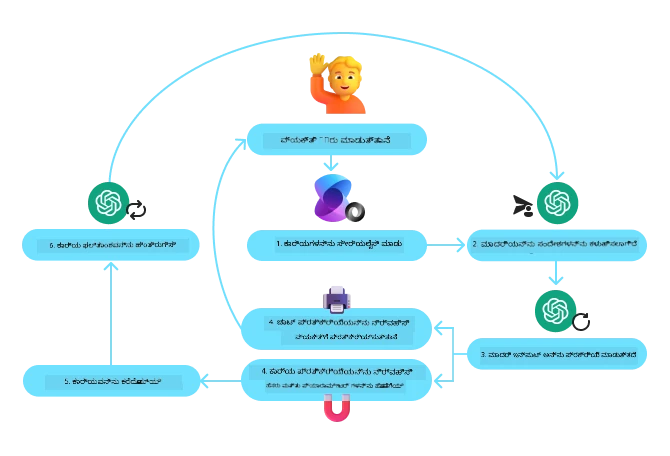
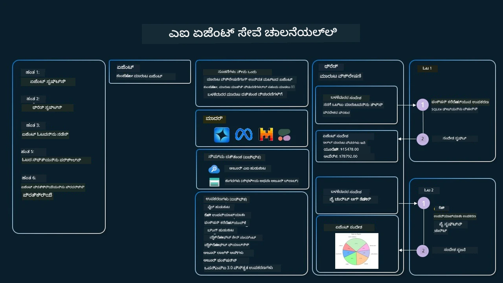

[](https://youtu.be/vieRiPRx-gI?si=cEZ8ApnT6Sus9rhn)

> _(ಈ ಪಾಠದ ವೀಡಿಯೋ ನೋಡಲು ಮೇಲಿನ ಚಿತ್ರವನ್ನು ಕ್ಲಿಕ್ ಮಾಡಿ)_

# ಉಪಕರಣ ಬಳಕೆ ವಿನ್ಯಾಸ ಮಾದರಿ

ಉಪಕರಣಗಳು ಆಸಕ್ತಿಕರವಾಗಿವೆ ಏಕೆಂದರೆ ಅವು ಎಐ ಏಜೆಂಟ್ಗಳು ಹೆಚ್ಚಿನ ಶಕ್ತಿಗಳನ್ನು ಹೊಂದುತ್ತವೆ. ಏಜೆಂಟ್ ಹೆಚ್ಚುವರಿ ಕ್ರಮಗಳ ಸಂಪೂರ್ಣ ಶ್ರೇಣಿಯನ್ನು ಮಾಡುತ್ತಲಿದೆ ಬದಲಿಗೆ ಅದರ ಕ್ರಿಯೆಗಳ ಸೀಮಿತ ಸಂಚಯ ಇರುವುದಕ್ಕೆ, ಉಪಕರಣವನ್ನು ಸೇರಿಸುವ ಮೂಲಕ, ಏಜೆಂಟ್ ಈಗ ವ್ಯಾಪಕ ರೀತಿಯ ಕ್ರಮಗಳನ್ನು ನಡೆಸಬಹುದು. ಈ ಅಧ್ಯಾಯದಲ್ಲಿ, ನಾವು ಉಪಕರಣ ಬಳಕೆ ವಿನ್ಯಾಸ ಮಾದರಿಯ ಬಗ್ಗೆ ನೋಡೋಣ, ಇದು ಎಐ ಏಜೆಂಟ್ಗಳು ತಮ್ಮ ಗುರಿಗಳನ್ನು ಸಾಧಿಸಲು ನಿರ್ದಿಷ್ಟ ಉಪಕರಣಗಳನ್ನು ಹೇಗೆ ಬಳಸಬಹುದೆಂದನ್ನು ವಿವರಿಸುತ್ತದೆ.

## ಪರಿಚಯ

ಈ ಪಾಠದಲ್ಲಿ, ನಾವು ಕೆಳಗಿನ ಪ್ರಶ್ನೆಗಳಿಗೆ ಉತ್ತರ ಹುಡುಕುತ್ತೇವೆ:

- ಉಪಕರಣ ಬಳಕೆ ವಿನ್ಯಾಸ ಮಾದರಿ ಏನು?
- ಯಾವ ಉಪಯೋಗಗಳಿಗೆ ಈ ಮಾದರಿ ಅನ್ವಯಿಸುತ್ತದೆ?
- ವಿನ್ಯಾಸ ಮಾದರಿ ಜಾರಿಗೆ ಬೇಕಾಗುವ ಅಂಶಗಳು/ನಿರ್ಮಾಣ ಘಟಕಗಳು ఏమಿವೆ?
- ನಂಬಿಗಸ್ಥ ಎಐ ಏಜೆಂಟ್ಗಳನ್ನು ನಿರ್ಮಿಸಲು ಉಪಕರಣ ಬಳಕೆ ವಿನ್ಯಾಸ ಮಾದರಿಯನ್ನು ಬಳಸುವ ವಿಶೇಷ ಅಂಶಗಳೇನು?

## ಅಧ್ಯಯನ ಗುರಿಗಳು

ಈ ಪಾಠ ಮುಗಿಸಿಕೊಂಡ ನಂತರ, ನೀವು ಈ ಕೆಳಗಿನವುಗಳನ್ನು ತಿಳಿದುಕೊಳ್ಳಬಹುದು:

- ಉಪಕರಣ ಬಳಕೆ ವಿನ್ಯಾಸ ಮಾದರಿಯನ್ನು ಮತ್ತು ಅದರ ಉದ್ದೇಶವನ್ನು ವ್ಯಾಖ್ಯಾನಿಸುವುದು.
- ಉಪಕರಣ ಬಳಕೆ ವಿನ್ಯಾಸ ಮಾದರಿ ಅನ್ವಯಿಸಬಹುದಾದ ಉಪಯೋಗಗಳನ್ನು ಗುರುತಿಸುವುದು.
- ವಿನ್ಯಾಸ ಮಾದರಿ ಜಾರಿಗೆ ಬೇಕಾಗುವ ಪ್ರಮುಖ ಅಂಶಗಳನ್ನು ಅರ್ಥಮಾಡಿಕೊಳ್ಳುವುದು.
- ಈ ವಿನ್ಯಾಸ ಮಾದರಿಯನ್ನು ಬಳಸಿ ಎಐ ಏಜೆಂಟ್ಸ್‌ನಲ್ಲಿ ನಂಬಿಗಸ್ತತೆಗೆ ಸಂಬಂಧಿಸಿದ ಪರಿಗಣನೆಗಳನ್ನು ಗುರುತಿಸುವುದು.

## ಉಪಕರಣ ಬಳಕೆ ವಿನ್ಯಾಸ ಮಾದರಿ ಏನು?

**ಉಪಕರಣ ಬಳಕೆ ವಿನ್ಯಾಸ ಮಾದರಿ** ದೊಡ್ಡ ಭಾಷಾ ಮಾದರಿಗಳಿಗೆ (LLMs) ನಿರ್ದಿಷ್ಟ ಗುರಿಗಳನ್ನು ಸಾಧಿಸಲು ಬಾಹ್ಯ ಉಪಕರಣಗಳೊಂದಿಗೆ ಸಂವಹನ ಸಾಧಿಸುವ ಶಕ್ತಿಯನ್ನು ನೀಡುತ್ತದೆ. ಉಪಕರಣಗಳು ಏಜೆಂಟ್ ಕಾರ್ಯಾಚರಣೆ ಮಾಡಲು ನಡೆಸಬಹುದಾದ ಕೋಡ್ ಆಗಿವೆ. ಒಂದು ಉಪಕರಣವು ಸರಳ ಗಣಕಯಂತ್ರದ ಕಾರ್ಯವಲ್ಲ, ಅಥವಾ ಥರ್ಡ್-ಪಾರ್ಟಿ ಸೇವೆಗೆ API ಕರೆ ಮಾಡಲಾಗುತ್ತದೆ, ಉದಾ., ಸ್ಟಾಕ್ ಬೆಲೆ ಹುಡುಕಾಟ ಅಥವಾ ಹವಾಮಾನ ಮುನ್ಸೂಚನೆ. ಎಐ ಏಜೆಂಟ್ಗಳ ಪ್ರ_CONTEXT ನಲ್ಲಿ, ಉಪಕರಣಗಳನ್ನು **ಮಾಡೆಲ್-ಉತ್ಪಾದಿತ ಕಾರ್ಯಚಲನಗಳ ಪ್ರತಿಕ್ರಿಯೆಯಾಗಿ** ಏಜೆಂಟ್‌ಗಳು ಆಡುವಂತೆ ವಿನ್ಯಾಸಗೊಳಿಸಲಾಗಿದೆ.

## ಯಾವ ಉಪಯೋಗಗಳಿಗೆ ಇದು ಅನ್ವಯಿಸುತ್ತದೆ?

ಎಐ ಏಜೆಂಟ್‌ಗಳು ಸಂಕೀರ್ಣ ಕೆಲಸಗಳನ್ನು ಪೂರ್ಣಗೊಳಿಸಲು, ಮಾಹಿತಿಯನ್ನು ಪಡೆಯಲು ಅಥವಾ ನಿರ್ಣಯಗಳನ್ನು ತೆಗೆದುಕೊಳ್ಳಲು ಉಪಕರಣಗಳನ್ನು ಬಳಸಬಹುದು. ಉಪಕರಣ ಬಳಕೆ ವಿನ್ಯಾಸ ಮಾದರಿ ಸಾಮಾನ್ಯವಾಗಿ ಬಾಹ್ಯ ವ್ಯವಸ್ಥೆಗಳೊಂದಿಗೆ ಪ್ರಾತ್ಯಕ್ಷಿಕೆಯ ಸಂವಹನಕ್ಕೆ ಅಗತ್ಯವಿರುವ ಸಂದರ್ಭಗಳಲ್ಲಿ ಬಳಸಲಾಗುತ್ತದೆ, ಉದಾ: ಡೇಟಾಬೇಸ್, ವೆಬ್ ಸೇವೆಗಳು ಅಥವಾ ಕೋಡ್ ವಿವರಣೆಗಾರರು. ಈ ಶಕ್ತಿ ಹಲವು ವಿಧಗಳ ಉಪಯೋಗಗಳಿಗೆ ನೆರವಾಗುತ್ತದೆ:

- **ಡೈನಾಮಿಕ್ ಮಾಹಿತಿಯ ಪಡೆಯುವಿಕೆ:** ಏಜೆಂಟ್‌ಗಳು ಬ್ಯಾಕ್ಪದ APIs ಅಥವಾ ಡೇಟಾಬೇಸ್‌ಗಳ ಮೂಲಕ ಪ್ರಸ್ತುತ ಡೇಟಾವನ್ನು ಪಡೆಯಬಹುದು (ಉದಾ., SQLite ಡೇಟಾಬೇಸ್ ಬಳಸಿ ಡೇಟಾ ವಿಶ್ಲೇಷಣೆ, ಸ್ಟಾಕ್ ಬೆಲೆಗಳು ಅಥವಾ ಹವಾಮಾನ ಮಾಹಿತಿ ಪಡೆಯುವುದು).
- **ಕೋಡ್ ಕಾರ್ಯಚರಣೆ ಮತ್ತು ವಿವರಣೆ:** ಏಜೆಂಟ್‌ಗಳು ಗಣಿತ ಸಮಸ್ಯೆಗಳನ್ನು ಪರಿಹರಿಸಲು, ವರದಿಗಳನ್ನು ಸೃಷ್ಟಿಸಲು ಅಥವಾ ಅನುಕರಣಗಳನ್ನು ನಡೆಸಲು ಕೋಡ್ ಅಥವಾ ಸ್ಕ್ರಿಪ್ಟ್‌ಗಳನ್ನು ನಿರ್ವಹಿಸಬಹುದು.
- **ಕಾರ್ಯಪ್ರವಾಹ ಸ್ವಯಂಚಾಲಿತಗೊಳಿಸುವಿಕೆ:** ಟಾಸ್ಕ್ ಶೆಡ್ಯೂಲರ್, ಇಮೇಲ್ ಸೇವೆಗಳು ಅಥವಾ ಡೇಟಾ ಪೈಪ್ಲೈನ್ಗಳನ್ನು ಸಂಯೋಜಿಸಿ ಪುನರಾವರ್ತಿತ ಅಥವಾ ಬಹು-ಹಂತದ ಕಾರ್ಯಪ್ರವಾಹಗಳನ್ನು ಸ್ವಯಂಚಾಲಿತಗೊಳಿಸುವುದು.
- **ಗ್ರಾಹಕ ಬೆಂಬಲ:** ಏಜೆಂಟ್‌ಗಳು CRM ವ್ಯವಸ್ಥೆಗಳು, ಟಿಕೆಟ್ ಪ್ಲಾಟ್‌ಫಾರ್ಮ್‌ಗಳು ಅಥವಾ ಜ್ಞಾನ ಆಧಾರಗಳೊಂದಿಗೆ ಸಂವಹನ ಮಾಡಿ ಬಳಕೆದಾರ ಪ್ರಶ್ನೆಗಳಿಗೆ ಪರಿಹಾರ ನೀಡಬಹುದು.
- **ವಿಷಯ ಸೃಷ್ಟಿ ಮತ್ತು ಸಂಪಾದನೆ:** ವ್ಯಾಕರಣ ಪರಿಶೀಲಕ, ಪಠ್ಯ ಸಾರಾಂಶಕಾರರು ಅಥವಾ ವಿಷಯ ಸುರಕ್ಷತಾ ಮೌಲ್ಯಮಾಪಕಗಳಂತಹ ಉಪಕರಣಗಳನ್ನು ಬಳಸಿಕೊಂಡು ವಿಷಯ ಸೃಷ್ಟಿ ಕಾರ್ಯಗಳನ್ನು ಸಹಾಯ ಮಾಡಬಹುದು.

## ಉಪಕರಣ ಬಳಕೆ ವಿನ್ಯಾಸ ಮಾದರಿ ಜಾರಿಗೆ ಬೇಕಾಗುವ ಅಂಶಗಳು/ನಿರ್ಮಾಣ ಘಟಕಗಳು ಯಾವುದು?

ಈ ನಿರ್ಮಾಣ ಘಟಕಗಳು ಏಜೆಂಟ್‌ಗೆ ವ್ಯಾಪಕ ಕಾರ್ಯಗಳನ್ನು ನೆರವೇರಿಸಲು ಸಾಧ್ಯ ಮಾಡುತ್ತವೆ. ಉಪಕರಣ ಬಳಕೆ ವಿನ್ಯಾಸ ಮಾದರಿಯನ್ನು ಜಾರಿಗೊಳಿಸಲು ಬೇಕಾದ ಪ್ರಮುಖ ಅಂಶಗಳನ್ನು ನೋಡೋಣ:

- **ಕಾರ್ಯ/ಉಪಕರಣ ಸ್ಕೀಮಾಗಳು:** ಲಭ್ಯವಿರುವ ಉಪಕರಣಗಳ ವೈವಿಧ್ಯಮಯ ವ್ಯಾಖ್ಯಾನಗಳು, ಹಾಗೆ ಕಾರ್ಯನಾಮ, ಉದ್ದೇಶ, ಬೇಕಾದ ಪರಿಮಾಣಿ ಮತ್ತು ನಿರೀಕ್ಷಿತ ಔಟ್ಪುಟ್‌ಗಳು. ಈ ಸ್ಕೀಮಾಗಳು LLM ಗಾಗಿ ಉಪಕರಣಗಳ ಲಭ್ಯತೆಯನ್ನು ಮತ್ತು ಸರಿಯಾದ ವಿನಂತಿಗಳನ್ನು ರಚಿಸುವ ವಿಧಾನವನ್ನು ತಿಳಿಯಲು ಸಹಾಯವಾಗುತ್ತವೆ.

- **ಕಾರ್ಯ ಚಲನೆ ತರ್ಕ:** ಬಳಕೆದಾರರ ಉದ್ದೇಶ ಮತ್ತು ಸಂಭಾಷಣೆಯ ಸಂದರ್ಭ ಆಧಾರ ಮಾಡಿ ಉಪಕರಣಗಳನ್ನು ಹೇಗೆ ಮತ್ತು ಯಾವಾಗ ಕರೆಯುವುದು ಎಂಬುದನ್ನು ನಿಯಂತ್ರಿಸುತ್ತದೆ. ಇದರಲ್ಲಿ ಯೋಜಕರ ಘಟಕಗಳು, ರೌಟಿಂಗ್ ಕ್ರಮಗಳು ಅಥವಾ ಷರತ್ತು ಆಧಾರಿತ ಪ್ರವಾಹಗಳು ಇರಬಹುದು, ಅವು ಉಪಕರಣ ಬಳಕೆಯನ್ನು_dynamic_ವಾಗಿ ನಿರ್ಧರಿಸುತ್ತವೆ.

- **ಸಂದೇಶ ನಿರ್ವಹಣಾ ವ್ಯವಸ್ಥೆ:** ಬಳಕೆದಾರರ ಇನ್ಪುಟ್, LLM ಪ್ರತಿಕ್ರಿಯೆಗಳು, ಉಪಕರಣ ಕರೆಗಳು ಮತ್ತು ಔಟ್ಪುಟ್‌ಗಳ ನಡುವೆ ಸಂಭಾಷಣಾ ಹರಿವನ್ನು ನಿರ್ವಹಿಸುವ ಘಟಕಗಳು.

- **ಉಪಕರಣ ಸಂಯೋಜನಾ ಚೌಕಟ್ಟಿನ ಅವಯವಗಳು:** ಸರಳ ಕಾರ್ಯಗಳಾಗಿರುವುದರಿಂದಲೂ ಅಥವಾ ಸಂಕೀರ್ಣ ಬಾಹ್ಯ ಸೇವೆಗಳಿರುವುದರಿಂದಲೇ ಆಗಲಿ ಏಜೆಂಟ್‌ನ್ನು ವಿವಿಧ ಉಪಕರಣಗಳೊಂದಿಗೆ ಸಂಪರ್ಕಿಸುವ ಮೂಲಭೂತ ವ್ಯವಸ್ಥೆ.

- **ದೋಷ ನಿರ್ವಹಣೆ ಮತ್ತು ಮಾನ್ಯತೆ:** ಉಪಕರಣ ಕಾರ್ಯಚರಣೆಯಲ್ಲಿ ತಪ್ಪುಗಳನ್ನು ಕಾಳಜಿ ವಹಿಸುವ, ಪರಿಮಾಣಗಳನ್ನು ಮಾನ್ಯತೆಗೊಳಿಸುವ ಮತ್ತು ನಿರೀಕ್ಷಿತವಲ್ಲದ ಪ್ರತಿಕ್ರಿಯೆಗಳನ್ನು ನಿರ್ವಹಿಸುವ ಯಂತ್ರಾಂಶಗಳು.

- **ಸ್ಥಿತಿ ನಿರ್ವಹಣೆ:** ಸಂಭಾಷಣೆಯ ಸಂದರ್ಭ, ಹಿಂದಿನ ಉಪಕರಣ ಸಂವಹನ ಮತ್ತು ಸ್ಥಿರ ಶೇಖರಣಾ ಡೇಟಾವನ್ನು ಗಮನಿಸುತ್ತಿದ್ದು ಬಹು-ತಿರುವು ಸಂವಹನಗಳಲ್ಲಿನ ಸಾತತೆಯನ್ನು ಖಚಿತಪಡಿಸುತ್ತದೆ.

ಮುಂದಾಗಿ, ಕಾರ್ಯ/ಉಪಕರಣ ಕರೆ ವಿಷಯವನ್ನು ಹೆಚ್ಚು ವಿವರದಿಂದ ನೋಡೋಣ.
 
### ಕಾರ್ಯ/ಉಪಕರಣ ಕರೆ

ಕಾರ್ಯ ಕರೆದು LLM ಗಳು ಉಪಕರಣಗಳೊಂದಿಗೆ ಸಂವಹನ ಸಾಧಿಸಲು ಮುಖ್ಯ ಮಾರ್ಗವಾಗಿದೆ. ನೀವು ಸಾಮಾನ್ಯವಾಗಿ 'ಕಾರ್ಯ' ಮತ್ತು 'ಉಪಕರಣ' ಎಂಬ ಪದಗಳನ್ನು ಪರಸ್ಪರ ವಿನಿಮಯವಾಗಿ ನೋಡುತ್ತೀರಿ ಏಕೆಂದರೆ 'ಕಾರ್ಯಗಳು' (ಮತ್ತೆ ಬಳಸಬಹುದಾದ ಕೋಡ್ ಬ್ಲಾಕ್‌ಗಳು) ಎಂಬುವುವು 'ಉಪಕರಣಗಳು' ಆಗಿವೆ ಏಜೆಂಟ್ ಗಳು ಕಾರ್ಯಗಳನ್ನು ನಡೆಸಲು ಬಳಸುವವು. ಕಾರ್ಯದ ಕೋಡ್ ಅನ್ನು ಆಡುವುದು үчүн LLM ಬಳಕೆದಾರರ ವಿನಂತಿಯನ್ನು ಆ ಕಾರ್ಯದ ವಿವರಣೆಯೊಂದಿಗೆ ಹೋಲಿಸಬೇಕು. ಇದಕ್ಕಾಗಿ ಎಲ್ಲಾ ಲಭ್ಯವಿರುವ ಕಾರ್ಯಗಳ ವಿವರಣೆಗಳನ್ನು ಒಳಗೊಂಡ ಸ್ಕೀಮಾ LLM ಗೆ ಕಳುಹಿಸಲಾಗುತ್ತದೆ. ನಂತರ LLM ಕಾರ್ಯದ ಬೆರಗಿನ ಕಾರ್ಯವನ್ನು ಆರಿಸಿ ಅದರ ಹೆಸರು ಮತ್ತು ಅಗತ್ಯವಾದ_ARGUMENTಗಳನ್ನು ಹಿಂತಿರುಗಿಸುತ್ತದೆ. ಆರಿಸಿದ ಕಾರ್ಯವನ್ನು ಆಡುವಾಗு, ಅದರ ಪ್ರತಿಕ್ರಿಯೆ LLM ಗೆ ಕಟ್ಟಲಾಗುತ್ತೆ ಮತ್ತು ಅದು ಬಳಕೆದಾರರ ವಿನಂತಿಗೆ ಉತ್ತರಿಸುವುದಕ್ಕೆ ಬಳಸುತ್ತದೆ.

ಡೆವಲಪರ್‌ಗಳಿಗೆ ಕಾರ್ಯ ಕರೆ ಜಾರಿಗೆ, ನಿಮಗೆ ಬೇಕಾಗಿರುತ್ತದೆ:

1. ಕಾರ್ಯ ಕರೆತರುವುದಕ್ಕೆ ಬೆಂಬಲ ನೀಡುವ LLM ಮಾದರಿ
2. ಕಾರ್ಯ ವಿವರಣೆಗಳನ್ನು ಒಳಗೊಂಡ ಸ್ಕೀಮಾ
3. ಪ್ರತಿ ಕಾರ್ಯಕ್ಕೆ қажетті ಕೋಡ್

ಕಾರ್ಯಕ್ರಮ: ನಗರದಲ್ಲಿ ಪ್ರಸ್ತುತ ಸಮಯ ಪಡೆಯುವುದರ ಉದಾಹರಣೆಯನ್ನು ಬಳಸೋಣ:

1. **ಕಾರ್ಯ ಕರೆ ಬೆಂಬಲಿಸುವ LLM ಎಳೆದುಕೊಳ್ಳಿ:**

    ಎಲ್ಲಾ ಮಾದರಿಗಳು ಕಾರ್ಯ ಕಾಲಿಂಗ್ ಬೆಂಬಲಿಸುವುದಿಲ್ಲ, ಆದ್ದರಿಂದ ನೀವು ಬಳಸುತ್ತಿರುವ LLM ಇವನ್ನು ಹೊಂದಿದೆಯೋ ಎಂದು ಪರಿಶೀಲಿಸುವುದು ಮಹತ್ವದ್ದು.   <a href="https://learn.microsoft.com/azure/ai-services/openai/how-to/function-calling" target="_blank">ಏಜ್ಯೂರ್ ಓಪನ್ ಎಐ</a> ಕಾರ್ಯ ಕರೆ ಬೆಂಬಲಿಸುತ್ತದೆ. ನಾವು ಏಜ್ಯೂರ್ ಓಪನ್ ಎಐ **ಪ್ರತಿಕ್ರಿಯೆಗಳು API** (ಸ್ಥಿರ `/openai/v1/` ಎಂಡ್ಫಾಯಿಂಟ್ — ಯಾವುದೇ `api_version` ಅಗತ್ಯವಿಲ್ಲ) ವಿರುದ್ಧ ಓಪನ್ ಎಐ ಕ್ಲೈಯಂಟ್ ಪ್ರಾರಂಭಿಸಬಹುದು.

    ```python
    # ಆಜೂರ್ ಓಪನ್‌ಎಐಗೆ (ಪ್ರತಿಕ್ರಿಯೆಗಳ API, v1 ಎಂಡಪಾಯಿಂಟ್) ಓಪನ್‌ಎಐ ಕ್ಲೈಂಟ್ ಅನ್ನು ಪ್ರಾರಂಭಿಸಿ
    client = OpenAI(
        base_url=f"{os.environ['AZURE_OPENAI_ENDPOINT'].rstrip('/')}/openai/v1/",
        api_key=os.environ["AZURE_OPENAI_API_KEY"],
    )
    deployment_name = os.environ["AZURE_OPENAI_DEPLOYMENT"]
    ```

1. **ಕಾರ್ಯ ಸ್ಕೀಮಾ ರಚಿಸಿ**:

    ಮುಂದಿಗೆ ನಾವು JSON ಸ್ಕೀಮಾ ರಚಿಸುವೆವು, ಅದರಲ್ಲಿದೆ ಕಾರ್ಯದ ಹೆಸರು, ಕಾರ್ಯ ಏನು ಮಾಡುತ್ತದೆ ಎಂಬ ವಿವರಣೆ, ಮತ್ತು ಕಾರ್ಯ ಪರಿಮಾಣಗಳ ಹೆಸರು ಮತ್ತು ವಿವರಣೆಗಳು.
    ಈ ಸ್ಕೀಮಾವನ್ನು ಹಿಂದಿನ ಕ್ಲೈಯಂಟ್‌ಗೆ ಪಾಸ್ ಮಾಡಿ ಬಳಕೆದಾರನ ವಿನಂತಿ ಸಹಿತ ತಲುಪಿಸುತ್ತೇವೆ, ಉದಾ: ಸಾನ್ ಫ್ರಾನ್ಸಿಸ್ಕೋನಲ್ಲಿ ಸಮಯವನ್ನು ಹುಡುಕುವಾಗ. ಗಮನಕ್ಕೆ ಪಡೆಯಬೇಕಾದ ಮಹತ್ವದ ಅಂಶವೆಂದರೆ **ಉಪಕರಣ ಕರೆ** ಮಾತ್ರ ಹಿಂತಿರುಗುತ್ತದೆ, ಪ್ರಶ್ನೆಗೆ ಅಂತಿಮ ಉತ್ತರವಲ್ಲ. ಮೊದಲೇ ಹೇಳಿದಂತೆ, LLM ಕಾರ್ಯಕ್ರಮದ ಕಾರ್ಯದ ಹೆಸರು ಮತ್ತು ಆ_ARGUMENTಗಳನ್ನು ಹಿಂತಿರುಗಿಸುತ್ತದೆ.

    ```python
    # ಮಾದರಿಯು ಓದಲು (ಪ್ರತಿಕ್ರಿಯೆಗಳು API ಸಮತಲ ಸಾಧನ ಸ್ವರೂಪ) ಕಾರ್ಯವಿವರಣೆ
    tools = [
        {
            "type": "function",
            "name": "get_current_time",
            "description": "Get the current time in a given location",
            "parameters": {
                "type": "object",
                "properties": {
                    "location": {
                        "type": "string",
                        "description": "The city name, e.g. San Francisco",
                    },
                },
                "required": ["location"],
            },
        }
    ]
    ```
   
    ```python
  
    # ಪ್ರಾಥಮಿಕ ಬಳಕೆದಾರ ಸಂದೇಶ
    messages = [{"role": "user", "content": "What's the current time in San Francisco"}]

    # ಪ್ರಥಮ API ಕರೆ: ಮಾದರಿಯನ್ನು ಫังก್ಶನ್ ಬಳಕೆ ಮಾಡಲು ಕೇಳಿ
    response = client.responses.create(
        model=deployment_name,
        input=messages,
        tools=tools,
        tool_choice="auto",
        store=False,
    )

    # Responses API ಪ್ರತಿಕ್ರಿಯೆ.output ನಲ್ಲಿ function_call ಅಂಶಗಳಾಗಿ ಉಪಕರಣ ಕರೆಗಳನ್ನು ಹಿಂತಿರುಗಿಸುತ್ತದೆ.
    # ಅದನ್ನು ಸಂವಹನಕ್ಕೆ ಸೇರಿಸಿ, ಹೀಗಾಗಿ ಮುಂದಿನ ಬಾರಿನಲ್ಲಿ ಮಾದರಿಗೆ ಸಂಪೂರ್ಣ ಸಂಧರ್ಭ ಸಿಗುತ್ತದೆ.
    messages += response.output

    print("Model's response:")
    print(response.output)
  
    ```

    ```bash
    Model's response:
    [ResponseFunctionToolCall(arguments='{"location":"San Francisco"}', call_id='call_pOsKdUlqvdyttYB67MOj434b', name='get_current_time', type='function_call')]
    ```
  
1. **ಕಾರ್ಯೋಪಾಯಕ್ಕಾಗಿ ಅಗತ್ಯವಿರುವ ಕಾರ್ಯ ಕೋಡ್:**

    ಈಗ LLM ಯಾವ ಕಾರ್ಯವನ್ನು ಚಾಲನೆ ಮಾಡಬೇಕೋ ಆಯ್ಕೆ ಮಾಡಿದ್ದು, ಕಾರ್ಯ ತಲೆಕೆಳಗೆಗೊಳ್ಳುವುದು ಮತ್ತು ಆಯೋಜಿಸುವುದು ಅಗತ್ಯ.
    ನಾವು ಪೈಥಾನ್‌ನಲ್ಲಿ ಪ್ರಸ್ತುತ ಸಮಯ ಪಡೆಯುವ ಕೋಡ್ ರಚಿಸಬಹುದು. ಕೊನೆಗೂ, ಉತ್ತರ ಸಂದೇಶದಿಂದ ಹೆಸರು ಮತ್ತು_ARGUMENTಗಳನ್ನು ಡಿಗ್ರಹಿಸುವ ಕೋಡ್ ಬರೆಯಬೇಕಾಗುತ್ತದೆ.

    ```python
      def get_current_time(location):
        """Get the current time for a given location"""
        print(f"get_current_time called with location: {location}")  
        location_lower = location.lower()
        
        for key, timezone in TIMEZONE_DATA.items():
            if key in location_lower:
                print(f"Timezone found for {key}")  
                current_time = datetime.now(ZoneInfo(timezone)).strftime("%I:%M %p")
                return json.dumps({
                    "location": location,
                    "current_time": current_time
                })
      
        print(f"No timezone data found for {location_lower}")  
        return json.dumps({"location": location, "current_time": "unknown"})
    ```

     ```python
    # ಫังก್ಷನ್ ಕರೆಗಳನ್ನು ನಿರ್ವಹಿಸಿ
    tool_calls = [item for item in response.output if item.type == "function_call"]
    if tool_calls:
        for tool_call in tool_calls:
            if tool_call.name == "get_current_time":

                function_args = json.loads(tool_call.arguments)

                time_response = get_current_time(
                    location=function_args.get("location")
                )

                # ಸಾಧನ ಫಲಿತಾಂಶವನ್ನು function_call_output ಐಟಂ ಆಗಿ ಹಿಂತಿರುಗಿಸಿ
                messages.append({
                    "type": "function_call_output",
                    "call_id": tool_call.call_id,
                    "output": time_response,
                })
    else:
        print("No tool calls were made by the model.")

    # ಎರಡನೆಯ API ಕರೆ: ಮಾದರಿಯಿಂದ ಅಂತಿಮ ಪ್ರತಿಕ್ರಿಯೆಯನ್ನು ಪಡೆಯಿರಿ
    final_response = client.responses.create(
        model=deployment_name,
        input=messages,
        tools=tools,
        store=False,
    )

    return final_response.output_text
     ```

     ```bash
      get_current_time called with location: San Francisco
      Timezone found for san francisco
      The current time in San Francisco is 09:24 AM.
     ```

ಕಾರ್ಯ ಕರೆ ಬಹುತೇಕ ಎಲ್ಲಾ ಏಜೆಂಟ್ ಉಪಕರಣ ಬಳಕೆ ವಿನ್ಯಾಸದ ಹೃದಯದಲ್ಲಿದ್ದು, ಅದನ್ನು ಶೂನ್ಯದಿಂದ ಜಾರಿಗೆ ತರೋದು ಕೆಲವೊಮ್ಮೆ ಸವಾಲಾಗಬಹುದು.
ನಾವು [ಪಾಠ 2](../../../02-explore-agentic-frameworks) ನಲ್ಲಿ ಕಲಿತಂತೆ, ಏಜೆಂಟಿಕ್ ಫ್ರೇಮ್ವರ್ಕ್ಸ್ ಪೂರ್ವ-ನಿರ್ಮಿತ ನಿರ್ಮಾಣ ಘಟಕಗಳನ್ನು ಒದಗಿಸುತ್ತವೆ ಉಪಕರಣ ಬಳಕೆ ಜಾರಿಗೆ.
 
## ಏಜೆಂಟಿಕ್ ಫ್ರೇಮ್ವರ್ಕ್ಸ್ ಜೊತೆಗೆ ಉಪಕರಣ ಬಳಕೆ ಉದಾಹರಣೆಗಳು

ವಿವಿಧ ಏಜೆಂಟಿಕ್ ಫ್ರೇಮ್ವರ್ಕ್ಸ್ ಬಳಸಿ ಉಪಕರಣ ಬಳಕೆ ವಿನ್ಯಾಸ ಮಾದರಿಯನ್ನು ಜಾರಿಗೊಳಿಸುವ ಕೆಲವು ಉದಾಹರಣೆಗಳು ಇಲ್ಲಿವೆ:

### ಮೈಕ್ರೋಸಾಫ್ಟ್ ಏಜೆಂಟ್ ಫ್ರೇಮ್ವರ್ಕ್

<a href="https://learn.microsoft.com/azure/ai-services/agents/overview" target="_blank">ಮೈಕ್ರೋಸಾಫ್ಟ್ ಏಜೆಂಟ್ ಫ್ರೇಮ್ವರ್ಕ್</a> ಎಐ ಏಜೆಂಟ್‌ಗಳನ್ನು ನಿರ್ಮಿಸಲು ತಯಾರಿಸಿರುವ ಮುಕ್ತ ಮೂಲ ಫ್ರೇಮ್ವರ್ಕ್. ಇದು ಕಾರ್ಯ ಕಾಲಿಂಗ್ ಬಳಸುವ ಪ್ರಕ್ರಿಯೆಯನ್ನು ಸರಳೀಕರಿಸುತ್ತದೆ, Python ಕಾರ್ಯಗಳಾಗಿ ಉಪಕರಣಗಳನ್ನು `@tool` ಅಲಂಕಾರ (ಡೆಕೋರೇಟರ್) ಬಳಸಿ ವ್ಯಾಖ್ಯಾನಿಸಲು ಬಿಡುತ್ತದೆ. ಫ್ರೇಮ್ವರ್ಕ್ ಮಾಡೆಲ್ ಮತ್ತು ನಿಮ್ಮ ಕೋಡ್ ನಡುವಣ ಸಂವಾದವನ್ನು ನಿರ್ವಹಿಸುತ್ತದೆ. ಇದು `FoundryChatClient` ಮೂಲಕ ಪೂರ್ವ-ನಿರ್ಮಿತ ಉಪಕರಣಗಳು (ಫೈಲ್ ಶೋಧನೆ ಮತ್ತು ಕೋಡ್ ವಿವರಣೆಗಾರ)ಕ್ಕೆ ಪ್ರವೇಶ ಒದಗಿಸುತ್ತದೆ.

ಕೆಳಗಿನ ಚಿತ್ರ ಮೈಕ್ರೋಸಾಫ್ಟ್ ಏಜೆಂಟ್ ಫ್ರೇಮ್ವರ್ಕ್‌ನಲ್ಲಿ ಕಾರ್ಯ ಕಾಲಿಂಗ್ ಪ್ರಕ್ರಿಯೆಯನ್ನು ವಿವರಿಸುತ್ತದೆ:



ಮೈಕ್ರೋಸಾಫ್ಟ್ ಏಜೆಂಟ್ ಫ್ರೇಮ್ವರ್ಕ್‌ನಲ್ಲಿ, ಉಪಕರಣಗಳನ್ನು ಅಲಂಕಾರ ಹೊಂದಿರುವ ಕಾರ್ಯಗಳಾಗಿ ವ್ಯಾಖ್ಯಾನಿಸಲಾಗುತ್ತದೆ. ನಾವು ಮೊದಲು ನೋಡಿದ `get_current_time` ಕಾರ್ಯವನ್ನು `@tool` ಅಲಂಕಾರ ಬಳಸಿಕೊಂಡು ಉಪಕರಣವಾಗಿ ಪರಿವರ್ತಿಸಬಹುದು. ಫ್ರೇಮ್ವರ್ಕ್ ಸ್ವಯಂಚಾಲಿತವಾಗಿ ಕಾರ್ಯ ಮತ್ತು ಅದರ ಪರಿಮಾಣಗಳನ್ನು ಸರಣಿ ರೂಪದಲ್ಲಿ ಪರಿವರ್ತಿಸಿ, LLM ಗೆ ಕಳುಹಿಸಲು ಸ್ಕೀಮಾವನ್ನು ರಚಿಸುತ್ತದೆ.

```python
import os
from agent_framework import tool
from agent_framework.foundry import FoundryChatClient
from azure.identity import AzureCliCredential

@tool(approval_mode="never_require")
def get_current_time(location: str) -> str:
    """Get the current time for a given location"""
    ...

# ಕ್ಲೈಂಟ್ ಅನ್ನು ರಚಿಸಿ
provider = FoundryChatClient(
    project_endpoint=os.environ["AZURE_AI_PROJECT_ENDPOINT"],
    model=os.environ["AZURE_AI_MODEL_DEPLOYMENT_NAME"],
    credential=AzureCliCredential(),
)

# ಏಜೆಂಟ್ ಅನ್ನು ರಚಿಸಿ ಮತ್ತು ಸಾಧನದೊಂದಿಗೆ ಚಾಲನೆ ಮಾಡಿ
agent = provider.as_agent(name="TimeAgent", instructions="Use available tools to answer questions.", tools=get_current_time)
response = await agent.run("What time is it?")
```
  
### ಮೈಕ್ರೋಸಾಫ್ಟ್ ಫೌಂಡ್ರಿ ಏಜೆಂಟ್ ಸೇವೆ

<a href="https://learn.microsoft.com/azure/ai-services/agents/overview" target="_blank">ಮೈಕ್ರೋಸಾಫ್ಟ್ ಫೌಂಡ್ರಿ ಏಜೆಂಟ್ ಸೇವೆ</a> ಹೊಸ ಏಜೆಂಟಿಕ್ ಫ್ರೇಮ್ವರ್ಕ್, ಇದು ಅಭಿವೃದ್ಧಿಪಡಿಸಲಾಗುತ್ತಿದೆ ಡೆವಲಪರ್‌ರಿಗೆ ಸುರಕ್ಷಿತವಾಗಿ ಉತ್ತಮ ಗುಣಮಟ್ಟದ, ವಿಸ್ತರಿಸಬಲ್ಲ ಎಐ ಏಜೆಂಟ್ಗಳನ್ನು ನಿರ್ಮಿಸಲು, ನಿಯೋಜಿಸಲು ಮತ್ತು ಪರಿಧಿಯನ್ನು ಹೆಚ್ಚಿಸಲು. ಇದು ಅಂತರ್ಗತ ಗಣನಾ ಮತ್ತು ಸಂಗ್ರಹಣೆ ಸಂಪನಮೂಲಗಳನ್ನು ನಿರ್ವಹಿಸಬೇಕಾಗದ ಸಂಯೋಜಿತ ಸೇವೆಯಾಗಿದೆ. ಇದು ಪ್ರಧಾನವಾಗಿ ಉದ್ಯಮ ಉಪಯೋಗಕೆಂದು ಸಹಾಯಕ.

LLM API ನೇರವಾಗಿ ಅಭಿವೃದ್ಧಿ ಪಡಿಸುವುದರಿಗಿಂತ ಮೈಕ್ರೋಸಾಫ್ಟ್ ಫೌಂಡ್ರಿ ಏಜೆಂಟ್ ಸೇವೆಯ ಕೆಲವು ಲಾಭಗಳು:

- ಸ್ವಯಂಚಾಲಿತ ಉಪಕರಣ ಕರೆ – ಉಪಕರಣ ಕರೆ ಪಾರ್ಸ್ ಮಾಡುವ ಅಗತ್ಯವಿಲ್ಲ, ಉಪಕರಣವನ್ನು ಕರೆ ಮಾಡಿ ಮತ್ತು ಪ್ರತಿಕ್ರಿಯೆ ನಿರ್ವಹಿಸುವ ಅಗತ್ಯವಿಲ್ಲ; ಈ ಎಲ್ಲವೂ ಈಗ ಸರ್ವರ್ ಬದಿಯಲ್ಲಿ ನಡೆಯುತ್ತದೆ
- ಸುರಕ್ಷಿತವಾಗಿ ನಿರ್ವಹಿತ ಡೇಟಾ – ನಿಮ್ಮ ಸ್ವಂತ ಸಂಭಾಷಣ ಸ್ಥಿತಿಯನ್ನು ನಿರ್ವಹಿಸುವ ಬದಲು, ನೀವು ಥ್ರೆಡ್ಗಳ ಮೇಲೆ ಅವಲಂಬಿಸಬಹುದು ಎಲ್ಲ ಅಗತ್ಯ ಮಾಹಿತಿಯನ್ನು ಉಳಿಸಲು
- ತಕ್ಷಣ ಉಪಯೋಗಿಸಬಹುದಾದ ಉಪಕರಣಗಳು – Bing, Azure AI Search, ಮತ್ತು Azure Functions ಮುಂತಾದ ಡೇಟಾ ಮೂಲಗಳೊಂದಿಗೆ ಸಂವಹನ ಮಾಡಲು ಉಪಕರಣಗಳು.

ಮೈಕ್ರೋಸಾಫ್ಟ್ ಫೌಂಡ್ರಿ ಏಜೆಂಟ್ ಸೇವೆಯಲ್ಲಿ ಲಭ್ಯವಿರುವ ಉಪಕರಣಗಳನ್ನು ಎರಡು ವರ್ಗಗಳಾಗಿ ವಿಭಜಿಸಬಹುದು:

1. ಜ್ಞಾನ ಉಪಕರಣಗಳು:
    - <a href="https://learn.microsoft.com/azure/ai-services/agents/how-to/tools/bing-grounding?tabs=python&pivots=overview" target="_blank">Bing Search ಮೂಲಕ ಗ್ರೌಂಡಿಂಗ್</a>
    - <a href="https://learn.microsoft.com/azure/ai-services/agents/how-to/tools/file-search?tabs=python&pivots=overview" target="_blank">ಫೈಲ್ ಶೋಧನೆ</a>
    - <a href="https://learn.microsoft.com/azure/ai-services/agents/how-to/tools/azure-ai-search?tabs=azurecli%2Cpython&pivots=overview-azure-ai-search" target="_blank">Azure AI Search</a>

2. ಕಾರ್ಯ ಉಪಕರಣಗಳು:
    - <a href="https://learn.microsoft.com/azure/ai-services/agents/how-to/tools/function-calling?tabs=python&pivots=overview" target="_blank">ಕಾರ್ಯ ಕರೆ</a>
    - <a href="https://learn.microsoft.com/azure/ai-services/agents/how-to/tools/code-interpreter?tabs=python&pivots=overview" target="_blank">ಕೋಡ್ ವಿವರಣೆಗಾರ</a>
    - <a href="https://learn.microsoft.com/azure/ai-services/agents/how-to/tools/openapi-spec?tabs=python&pivots=overview" target="_blank">OpenAPI ನಿರ್ಧಿಷ್ಟ ಉಪಕರಣಗಳು</a>
    - <a href="https://learn.microsoft.com/azure/ai-services/agents/how-to/tools/azure-functions?pivots=overview" target="_blank">Azure Functions</a>

ಏಜೆಂಟ್ ಸೇವೆ ಈ ಉಪಕರಣಗಳನ್ನು `toolset` ಆಗಿ ಬಳಕೆ ಮಾಡಲು ಸಾಧ್ಯಮಾಡುತ್ತದೆ. ಇದು `threads` ಅನ್ನು ಸಹ ಬಳಸುತ್ತದೆ, ಅದು ನಿರ್ದಿಷ್ಟ ಸಂಭಾಷಣೆಯಿಂದ ಸಂದೇಶಗಳ ಇತಿಹಾಸವನ್ನು ತೆಗೆದುಕೊಳ್ಳುತ್ತದೆ.

ನೀವೇ Contoso ಎಂಬ ಕಂಪನಿಯಲ್ಲಿ ಮಾರಾಟ ಏಜೆಂಟ್ ಎಂದು ಊಹಿಸಿ. ನೀವು ನಿಮ್ಮ ಮಾರಾಟ ಡೇಟಾ ಕುರಿತು ಪ್ರಶ್ನೆಗಳಿಗೆ ಉತ್ತರ ನೀಡುವ ಸಂಭಾಷಣಾ ಏಜೆಂಟ್ ಅಭಿವೃದ್ಧಿಪಡಿಸಲು ಬಯಸುತ್ತೀರಿ.

ಕೆಳಗಿನ ಚಿತ್ರವು Microsoft Foundry Agent Service ಬಳಸಿ ಮಾರಾಟ ಡೇಟಾವನ್ನು ವಿಶ್ಲೇಷಿಸುವ ಸ್ಥಿತಿಯನ್ನು ತೋರಿಸುತ್ತದೆ:



ಈ ಸೇವೆಯೊಂದಿಗೆ ಯಾವುದೇ ಉಪಕರಣಗಳನ್ನು ಬಳಸಲು ನಾವು ಕ್ಲೈಯಂಟ್ ಸೃಷ್ಟಿಸಿ, ಉಪಕರಣ ಅಥವಾ ಉಪಕರಣಗಳ ಸಮೂಹವನ್ನು ವ್ಯಾಖ್ಯಾನಿಸಬಹುದು. ಪ್ರಾಯೋಗಿಕವಾಗಿ ಜಾರಿಗೊಳಿಸಲು ನಾವು ಕೆಳಗಿನ Python ಕೋಡ್ ಬಳಸಬಹುದು. LLM ಉಪಕರಣಗಳ ಸಮೂಹವನ್ನು ನೋಡಿಕೊಂಡು ಬಳಕೆದಾರನ ವಿನಂತಿ ಆಧಾರದಲ್ಲಿ ಬಳಕೆದಾರ ನಿರ್ಮಿಸಿದ `fetch_sales_data_using_sqlite_query` ಕಾರ್ಯ ಅಥವಾ ಪೂರ್ವ-ನಿರ್ಮಿತ ಕೋಡ್ ವಿವರಣೆಗಾರ ಉಪಕರಣವನ್ನು ಬಳಸಬೇಕೆಂದು ನಿರ್ಧರಿಸುತ್ತದೆ.

```python 
import os
from azure.ai.projects import AIProjectClient
from azure.identity import DefaultAzureCredential
from fetch_sales_data_functions import fetch_sales_data_using_sqlite_query # fetch_sales_data_using_sqlite_query ಕಾರ್ಯವನ್ನು fetch_sales_data_functions.py ಫೈಲಿನಲ್ಲಿ ಕಾಣಬಹುದು.
from azure.ai.projects.models import ToolSet, FunctionTool, CodeInterpreterTool

project_client = AIProjectClient.from_connection_string(
    credential=DefaultAzureCredential(),
    conn_str=os.environ["PROJECT_CONNECTION_STRING"],
)

# ಸಾಧನಗಳನ್ನು ಪ್ರಾರಂಭಿಸಿ
toolset = ToolSet()

# fetch_sales_data_using_sqlite_query ಕಾರ್ಯವನ್ನು ಬಳಸಿ function calling agent ಅನ್ನು ಪ್ರಾರಂಭಿಸಿ ಮತ್ತು ಅದನ್ನು ಸಾಧನಗಳಿಗೆ ಸೇರಿಸಿ
fetch_data_function = FunctionTool(fetch_sales_data_using_sqlite_query)
toolset.add(fetch_data_function)

# ಕೋಡ್ ವಿವೇಚಕ ಸಾಧನವನ್ನು ಪ್ರಾರಂಭಿಸಿ ಮತ್ತು ಅದನ್ನು ಸಾಧನಗಳಿಗೆ ಸೇರಿಸಿ.
code_interpreter = CodeInterpreterTool()toolset.add(code_interpreter)

agent = project_client.agents.create_agent(
    model="gpt-4o-mini", name="my-agent", instructions="You are helpful agent", 
    toolset=toolset
)
```

## ನಂಬಿಗಸ್ಥ ಎಐ ಏಜೆಂಟ್ಗಳ ನಿರ್ಮಾಣಕ್ಕೆ ಉಪಕರಣ ಬಳಕೆ ವಿನ್ಯಾಸ ಮಾದರಿ ಬಳಕೆ ವೇಳೆ ವಿಶೇಷ ಪರಿಗಣನೆಗಳು ಏನು?

LLM ಗಳಿಂದ ಡೈನಾಮಿಕ್ ಆಗಿ ಉತ್ಪಾದಿತ SQL ಬಗ್ಗೆ ಸಾಮಾನ್ಯವಾಗಿ ಭಯಗಳಿವೆ, ವಿಶೇಷವಾಗಿ SQL ಇಂಜೆಕ್ಷನ್ ಅಥವಾ ದುಷ್ಟ ಕ್ರಿಯೆಗಳ ಅಪಾಯ, ಉದಾ., ಡೇಟಾಬೇಸ್ ಡ್ರಾಪ್ ಮಾಡುವುದು ಅಥವಾ ಹಿಂಸೆ ಮಾಡುವುದು. ಈ ಭಯಗಳು ಸರಿಯಾಗಿ ನಿರ್ವಹಿಸಿದಾಗ ಪರಿಣಾಮಕಾರಿಯಾಗಿ ತಡೆಮಾಡಬಹುದಾಗಿದೆ, ವಿಶೇಷವಾಗಿ ಡೇಟಾಬೇಸ್ ಪ್ರವೇಶ ಅನುಮತಿಗಳನ್ನು ಸರಿಯಾಗಿ ಸಂರಚಿಸುವ ಮೂಲಕ. ಬಹುತೇಕ ಡೇಟಾಬೇಸ್‌ಗಳಿಗೆ ಡೇಟಾಬೇಸ್ ಅನ್ನು ಓದು-ಮಾತ್ರ (read-only) ವಾಗಿ ಕಾನ್ಫಿಗರ್ ಮಾಡುವುದು ಇದಕ್ಕೆ ಪರಿಹಾರ. PostgreSQL ಅಥವಾ Azure SQL ಸರ್ವೀಸ್‌ಗಳಿಗೆ, ಆ್ಯಪ್‌ಗೆ ಓದು-ಮಾತ್ರ (SELECT) ಹಕ್ಕುಗಳನ್ನು ನೀಡುವುದು ಮುಖ್ಯ.

ಆ್ಯಪ್ ಅನ್ನು ಸುರಕ್ಷಿತ ಪರಿಸರದಲ್ಲಿ ಚಾಲನೆ ಮಾಡುವುದು ರಕ್ಷಣೆ ಹೆಚ್ಚಿಸುತ್ತದೆ. ಉದ್ಯಮ ಪರಿಸರದಲ್ಲಿ, ಸಂಚಾರಾತ್ಮಕ ವ್ಯವಸ್ಥೆಗಳ ಡೇಟಾವನ್ನು ಓದು-ಮಾತ್ರ ಡೇಟಾಬೇಸ್ ಅಥವಾ ಡೇಟಾ ವೇئرಹೌಸ್ಗೆ ಹಿಂಪಡೆಯಲಾಗುತ್ತದೆ ಮತ್ತು ಸಂಶೋಧಿಸಲಾಗುತ್ತದೆ, ಬಳಕೆದಾರ ಸ್ನೇಹಿ ಸ್ಕೆಮಾ ಇರುವಂತೆ. ಇದೇ ಮೂಲಕ ಡೇಟಾ ಸುರಕ್ಷಿತವಾಗಿದ್ದು, ಕಾರ್ಯಕ್ಷಮತೆ ಮತ್ತು ಪ್ರವೇಶ ಸ್ಥಿತಿ ನಿಖರವಾಗಿರುತ್ತದೆ ಮತ್ತು ಆ್ಯಪ್‌ಗೆ ಕೇವಲ ಓದು-ಮಾತ್ರ ಪ್ರವೇಶ ಮಾತ್ರ ಲಭ್ಯ.

## ಮಾದರಿ ಕೋಡ್‌ಗಳು

- Python: [ಎಜೆಂಟ್ ಫ್ರೇಮ್ವರ್ಕ್](./code_samples/04-python-agent-framework.ipynb)
- .NET: [ಎಜೆಂಟ್ ಫ್ರೇಮ್ವರ್ಕ್](./code_samples/04-dotnet-agent-framework.md)

## ಉಪಕರಣ ಬಳಕೆ ವಿನ್ಯಾಸ ಮಾದರಿಗಳ ಕುರಿತು ಇನ್ನಷ್ಟು ಪ್ರಶ್ನೆಗಳಿವೆಯಾ?

[Microsoft Foundry Discord](https://discord.com/invite/ATgtXmAS5D) ಗೆ ಸೇರಿ, ಇತರೆ ಕಲಿಯುವವರೊಂದಿಗೆ ಭೇಟಿಯಾಗಿರಿ, ಕಾರ್‌ಯಾಲಯ ಸಮಯಗಳಿಗೆ ಹಾಜರಾಗಿರಿ ಮತ್ತು ನಿಮ್ಮ ಎಐ ಏಜೆಂಟ್ಸ್ ಪ್ರಶ್ನೆಗಳಿಗೆ ಉತ್ತರ ಪಡೆಯಿರಿ.

## ಹೆಚ್ಚುವರಿ ಸಂಪನ್ಮೂಲಗಳು

- <a href="https://microsoft.github.io/build-your-first-agent-with-azure-ai-agent-service-workshop/" target="_blank">ಎಜ್ಯೂರ್ ಎಐ ಏಜೆಂಟ್ ಸೇವೆ ಕಾರ್ಯಾಗாரம்</a>
- <a href="https://github.com/Azure-Samples/contoso-creative-writer/tree/main/docs/workshop" target="_blank">ಕಾಂಟೋಸೋ ಕ್ರಿಯೇಟಿವ್ ರೈಟರ್ ಬಹು ಏಜೆಂಟ್ ಕಾರ್ಯಾಗಾರ</a>
- <a href="https://learn.microsoft.com/azure/ai-services/agents/overview" target="_blank">ಮೈಕ್ರೋಸಾಫ್ಟ್ ಏಜೆಂಟ್ ಫ್ರೇಮ್ವರ್ಕ್ ಅವಲೋಕನ</a>


## ಹಿಂದಿನ ಪಾಠ

[ಏಜೆಂಟಿಕ್ ವಿನ್ಯಾಸ ಮಾದರಿಗಳ ಅರಿವು](../03-agentic-design-patterns/README.md)

## ಮುಂದಿನ ಪಾಠ

[ಏಜೆಂಟಿಕ್ RAG](../05-agentic-rag/README.md)

---

<!-- CO-OP TRANSLATOR DISCLAIMER START -->
**ಅಸ್ವೀಕಾರ**:
ಈ ದಸ್ತಾವೇಜು AI ಅನುವಾದ ಸೇವೆ [Co-op Translator](https://github.com/Azure/co-op-translator) ಬಳಸಿ ಅನುವಾದಿಸಲಾಗಿದೆ. ನಾವು ನಿಖರತೆಯನ್ನು ಸಾಧಿಸಲು ಪ್ರಯತ್ನಿಸುತ್ತಿದ್ದರೂ, ದಯವಿಟ್ಟು ಗಮನಿಸಿ, ಸ್ವಯಂಚಾಲಿತ ಅನುವಾದಗಳಲ್ಲಿ ದೋಷಗಳು ಅಥವಾ ಅಸಡ್ಡೆಗಳು ಇರಬಹುದು. ಮೂಲ ಭಾಷೆಯಲ್ಲಿರುವ ಮೂಲ ದಸ್ತಾವೇಜು ಪ್ರಾಮಾಣಿಕ ಮೂಲವೆಂದು ಪರಿಗಣಿಸಬೇಕು. ಪ್ರಮುಖ ಮಾಹಿತಿಗಾಗಿ, ವೃತ್ತಿಪರ ಮಾನವ ಅನುವಾದವನ್ನು ಶಿಫಾರಸು ಮಾಡಲಾಗುತ್ತದೆ. ಈ ಅನುವಾದವನ್ನು ಬಳಸುವ ಮೂಲಕ ಉಂಟಾಗುವ ಯಾವುದೇ ತಪ್ಪು ಅರ್ಥಗಳ ಅಥವಾ ತಪ್ಪು ವ್ಯಾಖ್ಯಾನಗಳ ಬಗ್ಗೆ ನಾವು ಹೊಣೆಗಾರರಲ್ಲ.
<!-- CO-OP TRANSLATOR DISCLAIMER END -->