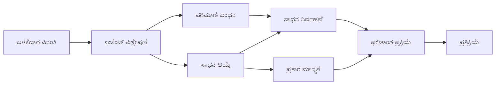

# 🛠️ Azure OpenAI (Responses API) (.NET) ಇನೊಂದಿಗೆ ಉನ್ನತ ಮಟ್ಟದ ಸಾಧನ ಬಳಕೆ

## 📋 ಅಧ್ಯಯನ ಉದ್ದೇಶಗಳು

ಈ ನೋಟ್‌ಬುಕ್ ಎಂಟರ್ಪ್ರೈಸ್-ಗ್ರೇಡ್ ಸಾಧನ ಸಂಯೋಜನೆ ಮಾದರಿಗಳನ್ನು Microsoft Agent Framework ಅನ್ನು .NET ನಲ್ಲಿ ಉಪಯೋಗಿಸಿ Azure OpenAI (Responses API) ನೊಂದಿಗೆ ತೋರಿಸುತ್ತದೆ. ನೀವು C# ನ ಬಲವಾದ ಟೈಪಿಂಗ್ ಮತ್ತು .NET ನ ಎಂಟರ್ಪ್ರೈಸ್ ವೈಶಿಷ್ಟ್ಯಗಳನ್ನು ಬಳಸಿಕೊಂಡು ಬಹು ವಿಶೇಷ ಸಾಧನಗಳೊಂದಿಗೆ ಸುಸಂಜೆ ವಾಹಿಸಿದ ಏಜೆಂಟ್ ಗಳನ್ನು ನಿರ್ಮಿಸಲು ಕಲಿಯುತ್ತೀರಿ.

### ನೀವು ಪರಿಣಿತಿಯಾಗುವ ಉನ್ನತ ಮಟ್ಟದ ಸಾಧನ ಸಾಮರ್ಥ್ಯಗಳು

- 🔧 **ಬಹು-ಸಾಧನ ವಾಸ್ತುಶಿಲ್ಪ**: ಬಹು ವಿಶೇಷ ಸಾಮರ್ಥ್ಯಗಳೊಂದಿಗೆ ಏಜೆಂಟ್‌ಗಳನ್ನು ನಿರ್ಮಿಸುವುದು
- 🎯 **ಟೈಪ್-ಸೇಫ್ ಸಾಧನ ನಿರ್ವಹಣೆ**: C# ನ ಸಂಕಲನ-ಸಮಯ ಪ್ರಮಾಣೀಕರಣವನ್ನು ಉಪಯೋಗಿಸುವುದು
- 📊 **ಎಂಟರ್ಪ್ರೈಸ್ ಸಾಧನ ಮಾದರಿಗಳು**: ಉತ್ಪಾದನಾ-ಸಿದ್ಧ ಸಾಧನ ವಿನ್ಯಾಸ ಮತ್ತು ದೋಷ ನಿರ್ವಹಣೆ
- 🔗 **ಸಾಧನ ಸಂಯೋಜನೆ**: ಜಟಿಲ ವ್ಯಾಪಾರ ಘಟಕಗಳಿಗೆ ಸಾಧನಗಳನ್ನು ಸಂಯೋಜಿಸುವುದು

## 🎯 .NET ಸಾಧನ ವಾಸ್ತುಶಿಲ್ಪದ lợiಗಳು

### ಎಂಟರ್ಪ್ರೈಸ್ ಸಾಧನ ವೈಶಿಷ್ಟ್ಯಗಳು

- **ಸಂಕಲನ-ಸಮಯ ಪ್ರಮಾಣೀಕರಣ**: ಬಲವಾದ ಟೈಪಿಂಗ್ ಸಾಧನ ಪ್ಯಾರಾಮೀಟರ್ ಸರಿಯಾಗಿರುವುದನ್ನು ಖಚಿತಪಡಿಸುತ್ತದೆ
- **ಆಧಾರ ಏಗೋಡಣ (Dependency Injection)**: ಸಾಧನ ನಿರ್ವಹಣೆಗೆ IoC ಕಂಟೈನರ್ ಏಗೋಡಣೆ
- **ಅಸಿಂಕ್ರೋನಸ್/ಅվೈಟ್ ಮಾದರಿಗಳು**: ಸಂಪನ್ಮೂಲಗಳನ್ನು ಸರಿಯಾಗಿ ನಿರ್ವಹಿಸುವ ಅಡ್ಡಬಾಧೆ ರಹಿತ ಸಾಧನ ನಿರ್ವಹಣೆ
- **ರಚನೆಯ ಲಾಗಿಂಗ್**: ಸಾಧನ ಕಾರ್ಯಾಚರಣೆಯನ್ನು ಗಮನಿಸುವ ನಿರ್ಮಿತ ಲಾಗಿಂಗ್ ನ್ನು ಏಗೋಡಿಕೆ

### ಉತ್ಪಾದನಾ-ಸಿದ್ಧ ಮಾದರಿಗಳು

- **ಅಪವಾದ ನಿರ್ವಹಣೆ**: ಟೈಪ್ ಮಾಡಿದ ಅಪವಾದಗಳೊಂದಿಗೆ ಸಮಗ್ರ ದೋಷ ನಿರ್ವಹಣೆ
- **ಸಂಪನ್ಮೂಲ ನಿರ್ವಹಣೆ**: ಸರಿಯಾದ ನಾಶಗೊಳಿಸುವಿಕೆ ಮಾದರಿಗಳು ಮತ್ತು ಮೆಮರಿ ನಿರ್ವಹಣೆ
- **ಕಾರ್ಯಕ್ಷಮತೆ ಗಮನಿಸುವಿಕೆ**: ನಿರ್ಮಿತ ಮೆಟ್ರಿಕ್ಸ್ ಮತ್ತು ಕಾರ್ಯಕ್ಷಮತೆ ಕೌಂಟರ್‌ಗಳು
- **ಕಾನ್ಫಿಗರೇಶನ್ ನಿರ್ವಹಣೆ**: ಪ್ರಮಾಣೀಕೃತ ಟೈಪ್-ಸೇಫ್ ಕಾನ್ಫಿಗರೇಶನ್

## 🔧 ತಾಂತ್ರಿಕ ವಾಸ್ತುಶಿಲ್ಪ

### ಕೋರ್ .NET ಸಾಧನ ಘಟಕಗಳು

- **Microsoft.Extensions.AI**: ಒಕ್ಕೂಟವಾದ ಸಾಧನ ಸಂಕ್ಷಿಪ್ತ ಪದರ
- **Microsoft.Agents.AI**: ಎಂಟರ್ಪ್ರೈಸ್-ಗ್ರೇಡ್ ಸಾಧನ ಸಂಯೋಜನೆ
- **Azure OpenAI (Responses API)**: ಸಂಪರ್ಕ ಅನುಸರಣೆಯೊಂದಿಗೆ ಉನ್ನತ-ಕಾರ್ಯಕ್ಷಮತೆ API ಕ್ಲೈಂಟ್

### ಸಾಧನ ನಿರ್ವಹಣೆ ಪೈಪ್‌ಲೈನ್



## 🛠️ ಸಾಧನ ವರ್ಗಗಳು ಮತ್ತು ಮಾದರಿಗಳು

### 1. **ಡೇಟಾ ಪ್ರಾಸೆಸಿಂಗ್ ಸಾಧನಗಳು**

- **ಇನ್‌ಪುಟ್ ಪ್ರಮಾಣೀಕರಣ**: ಡೇಟಾ ಅಂಕಿತಗಳೊಂದಿಗೆ ಬಲವಾದ ಟೈಪಿಂಗ್
- **ರೂಪಾಂತರ ಕಾರ್ಯಗಳು**: ಟೈಪ್-ಸೇಫ್ ಡೇಟಾ ಪರಿವರ್ತನೆ ಮತ್ತು ವಿನ್ಯಾಸ
- **ವ್ಯಾಪಾರ ಲಾಜಿಕ್**: ಡೊಮೇನ್-ನಿರ್ದಿಷ್ಟ ಲೆಕ್ಕಾಚಾರ ಮತ್ತು ವಿಶ್ಲೇಷಣೆ ಸಾಧನಗಳು
- **ಆವೃತ್ತಿ ವಿನ್ಯಾಸ**: ರಚಿಸಲಾದಉತ್ತರ ಉತ್ಪಾದನೆ

### 2. **ಸಂಯೋಜನಾ ಸಾಧನಗಳು**

- **API ಸಂಪರ್ಕಗಳು**: HttpClient ನೊಂದಿಗೆ RESTful ಸೇವೆ ಸಂಯೋಜನೆ
- **ಡೇಟಾಬೇಸ್ ಸಾಧನಗಳು**: ಡೇಟಾ ಪ್ರವೇಶಕ್ಕಾಗಿ Entity Framework ಸಂಯೋಜನೆ
- **ಫೈಲ್ ಕಾರ್ಯಗಳು**: ಪ್ರಮಾಣೀಕರಣದೊಂದಿಗೆ ಭದ್ರ ಫೈಲ್ ಸಿಸ್ಟಮ್ ಕಾರ್ಯಾಚರಣೆ
- **ಬಾಹ್ಯ ಸೇವೆಗಳು**: ಮೂರನೇ ಪಕ್ಷದ ಸೇವೆ ಸಂಯೋಜನೆ ಮಾದರಿಗಳು

### 3. **ಉಪಕಾರಂ ಸಾಧನಗಳು**

- **ಪಠ್ಯ ಪ್ರಾಸೆಸಿಂಗ್**: ಸ್ಟ್ರಿಂಗ್ ಉದ್ಯಮ ಮತ್ತು ವಿನ್ಯಾಸ ಉಪಕರಣಗಳು
- **ದಿನಾಂಕ/ಸಮಯ ಕಾರ್ಯಗಳು**: ಸಂಸ್ಕೃತಿ ತಿಳಿದ ದಿನಾಂಕ/ಸಮಯ ಲೆಕ್ಕಾಚಾರ
- **ಗಣಿತ ಸಾಧನಗಳು**: ಸ್ತರದ ಲೆಕ್ಕಾಚಾರ ಮತ್ತು ಪಾರಿಸಂಖ್ಯಾ ಕಾರ್ಯಾಚರಣೆಗಳು
- **ಪ್ರಮಾಣೀಕರಣ ಸಾಧನಗಳು**: ವ್ಯಾಪಾರ ನಿಯಮ ಪ್ರಮಾಣೀಕರಣ ಮತ್ತು ಡೇಟಾ ಪರಿಶೀಲನೆ

ಶಕ್ತಿಶಾಲಿ, ಟೈಪ್-ಸೇಫ್ ಸಾಧನ ಸಾಮರ್ಥ್ಯಗಳೊಂದಿಗೆ ಎಂಟರ್ಪ್ರೈಸ್-ಗ್ರೇಡ್ ಏಜೆಂಟ್‌ಗಳನ್ನು .NET ನಲ್ಲಿ ನಿರ್ಮಿಸಲು ಸಿದ್ಧರಾ? ಹೌದು, ಕೆಲವು ವೃತ್ತಿಪರ-ಗ್ರೇಡ್ ಪರಿಹಾರಗಳನ್ನು ರೂಪಿಸೋಣ! 🏢⚡

## 🚀 ಪ್ರಾರಂಭಿಸುವುದು

### ಪೂರ್ವಾಪೇಕ್ಸಲುಗಳು

- [.NET 10 SDK](https://dotnet.microsoft.com/download/dotnet/10.0) ಅಥವಾ ಮೇಲಿನ ಒಂದು
- ಒಂದು [Azure ಸಬ್ಸ್ಕ್ರಿಪ್ಷನ್](https://azure.microsoft.com/free/) ಜೊತೆಗೆ Azure OpenAI ಸಂಪನ್ಮೂಲ ಮತ್ತು ಮಾದರಿ ನಿಯೋಜನೆ
- [Azure CLI](https://learn.microsoft.com/cli/azure/install-azure-cli) — `az login` ಬಳಸಿ ಲಾಗಿನ್ ಆಗಿ

### ಅಗತ್ಯವಿರುವ ಪರಿಸರ ಚರಗಳು

```bash
# zsh/bash
export AZURE_OPENAI_ENDPOINT=https://<your-resource>.openai.azure.com
export AZURE_OPENAI_DEPLOYMENT=gpt-4o-mini
# ನಂತರ ಗುರುತು ಹಾಕಿ ಆದ್ದರಿಂದ AzureCliCredential ಟೋಕನ್ ಪಡೆಯಬಹುದು
az login
```

```powershell
# ಪವರ್‌ಶೆಲ್
$env:AZURE_OPENAI_ENDPOINT = "https://<your-resource>.openai.azure.com"
$env:AZURE_OPENAI_DEPLOYMENT = "gpt-4o-mini"
# ನಂತರ AzureCliCredential ಟೋಕನ್ ಪಡೆಯಲು ಸೈನ್ ಇನ್ ಆಗಿ
az login
```

### ಮಾದರಿ ಕೋಡ್

ಕೋಡ್ ಉದಾಹರಣೆಯನ್ನು ಚಾಲನೆ ಮಾಡಲು,

```bash
# zsh/bash
chmod +x ./04-dotnet-agent-framework.cs
./04-dotnet-agent-framework.cs
```

ಅಥವಾ dotnet CLI ಬಳಸಿ:

```bash
dotnet run ./04-dotnet-agent-framework.cs
```

ಸಂಪೂರ್ಣ ಕೋಡ್‌ಗೆ [`04-dotnet-agent-framework.cs`](../../../../04-tool-use/code_samples/04-dotnet-agent-framework.cs) 를 ನೋಡಿ.

```csharp
#!/usr/bin/dotnet run

#:package Microsoft.Extensions.AI@10.*
#:package Microsoft.Agents.AI.OpenAI@1.*-*
#:package Azure.AI.OpenAI@2.1.0
#:package Azure.Identity@1.13.1

using System.ComponentModel;

using Microsoft.Agents.AI;
using Microsoft.Extensions.AI;

using Azure.AI.OpenAI;
using Azure.Identity;

// Tool Function: Random Destination Generator
// This static method will be available to the agent as a callable tool
// The [Description] attribute helps the AI understand when to use this function
// This demonstrates how to create custom tools for AI agents
[Description("Provides a random vacation destination.")]
static string GetRandomDestination()
{
    // List of popular vacation destinations around the world
    // The agent will randomly select from these options
    var destinations = new List<string>
    {
        "Paris, France",
        "Tokyo, Japan",
        "New York City, USA",
        "Sydney, Australia",
        "Rome, Italy",
        "Barcelona, Spain",
        "Cape Town, South Africa",
        "Rio de Janeiro, Brazil",
        "Bangkok, Thailand",
        "Vancouver, Canada"
    };

    // Generate random index and return selected destination
    // Uses System.Random for simple random selection
    var random = new Random();
    int index = random.Next(destinations.Count);
    return destinations[index];
}

// Azure OpenAI with the Responses API (stable v1 endpoint). Sign in with `az login`.
var azureEndpoint = Environment.GetEnvironmentVariable("AZURE_OPENAI_ENDPOINT")
    ?? throw new InvalidOperationException("AZURE_OPENAI_ENDPOINT is not set.");
var deployment = Environment.GetEnvironmentVariable("AZURE_OPENAI_DEPLOYMENT") ?? "gpt-4o-mini";

var azureClient = new AzureOpenAIClient(new Uri(azureEndpoint), new AzureCliCredential());

// Define Agent Identity and Comprehensive Instructions
// Agent name for identification and logging purposes
var AGENT_NAME = "TravelAgent";

// Detailed instructions that define the agent's personality, capabilities, and behavior
// This system prompt shapes how the agent responds and interacts with users
var AGENT_INSTRUCTIONS = """
You are a helpful AI Agent that can help plan vacations for customers.

Important: When users specify a destination, always plan for that location. Only suggest random destinations when the user hasn't specified a preference.

When the conversation begins, introduce yourself with this message:
"Hello! I'm your TravelAgent assistant. I can help plan vacations and suggest interesting destinations for you. Here are some things you can ask me:
1. Plan a day trip to a specific location
2. Suggest a random vacation destination
3. Find destinations with specific features (beaches, mountains, historical sites, etc.)
4. Plan an alternative trip if you don't like my first suggestion

What kind of trip would you like me to help you plan today?"

Always prioritize user preferences. If they mention a specific destination like "Bali" or "Paris," focus your planning on that location rather than suggesting alternatives.
""";

// Create AI Agent with Advanced Travel Planning Capabilities
// Get the Responses client for the deployment and create the AI agent
// Configure agent with name, detailed instructions, and available tools
// This demonstrates the .NET agent creation pattern with full configuration
AIAgent agent = azureClient
    .GetOpenAIResponseClient(deployment)
    .CreateAIAgent(
        name: AGENT_NAME,
        instructions: AGENT_INSTRUCTIONS,
        tools: [AIFunctionFactory.Create(GetRandomDestination)]
    );

// Create New Conversation Thread for Context Management
// Initialize a new conversation thread to maintain context across multiple interactions
// Threads enable the agent to remember previous exchanges and maintain conversational state
// This is essential for multi-turn conversations and contextual understanding
AgentThread thread = agent.GetNewThread();

// Execute Agent: First Travel Planning Request
// Run the agent with an initial request that will likely trigger the random destination tool
// The agent will analyze the request, use the GetRandomDestination tool, and create an itinerary
// Using the thread parameter maintains conversation context for subsequent interactions
await foreach (var update in agent.RunStreamingAsync("Plan me a day trip", thread))
{
    await Task.Delay(10);
    Console.Write(update);
}

Console.WriteLine();

// Execute Agent: Follow-up Request with Context Awareness
// Demonstrate contextual conversation by referencing the previous response
// The agent remembers the previous destination suggestion and will provide an alternative
// This showcases the power of conversation threads and contextual understanding in .NET agents
await foreach (var update in agent.RunStreamingAsync("I don't like that destination. Plan me another vacation.", thread))
{
    await Task.Delay(10);
    Console.Write(update);
}
```

---

<!-- CO-OP TRANSLATOR DISCLAIMER START -->
**ಅಸ್ವೀಕಾರ**:
ಈ ದಸ್ತಾವೇಜು AI ಅನುವಾದ ಸೇವೆ [Co-op Translator](https://github.com/Azure/co-op-translator) ಬಳಸಿ ಅನುವಾದಿಸಲಾಗಿದೆ. ನಾವು ನಿಖರತೆಯನ್ನು ಸಾಧಿಸಲು ಪ್ರಯತ್ನಿಸುತ್ತಿದ್ದರೂ, ದಯವಿಟ್ಟು ಗಮನಿಸಿ, ಸ್ವಯಂಚಾಲಿತ ಅನುವಾದಗಳಲ್ಲಿ ದೋಷಗಳು ಅಥವಾ ಅಸಡ್ಡೆಗಳು ಇರಬಹುದು. ಮೂಲ ಭಾಷೆಯಲ್ಲಿರುವ ಮೂಲ ದಸ್ತಾವೇಜು ಪ್ರಾಮಾಣಿಕ ಮೂಲವೆಂದು ಪರಿಗಣಿಸಬೇಕು. ಪ್ರಮುಖ ಮಾಹಿತಿಗಾಗಿ, ವೃತ್ತಿಪರ ಮಾನವ ಅನುವಾದವನ್ನು ಶಿಫಾರಸು ಮಾಡಲಾಗುತ್ತದೆ. ಈ ಅನುವಾದವನ್ನು ಬಳಸುವ ಮೂಲಕ ಉಂಟಾಗುವ ಯಾವುದೇ ತಪ್ಪು ಅರ್ಥಗಳ ಅಥವಾ ತಪ್ಪು ವ್ಯಾಖ್ಯಾನಗಳ ಬಗ್ಗೆ ನಾವು ಹೊಣೆಗಾರರಲ್ಲ.
<!-- CO-OP TRANSLATOR DISCLAIMER END -->