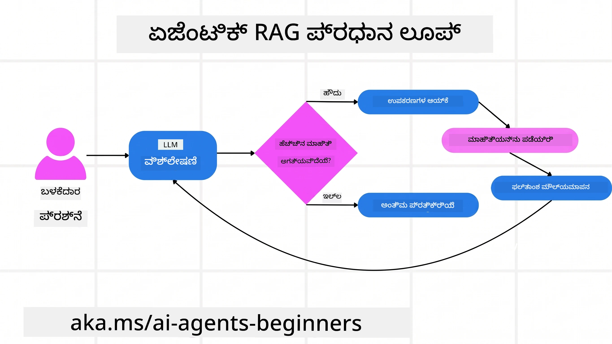
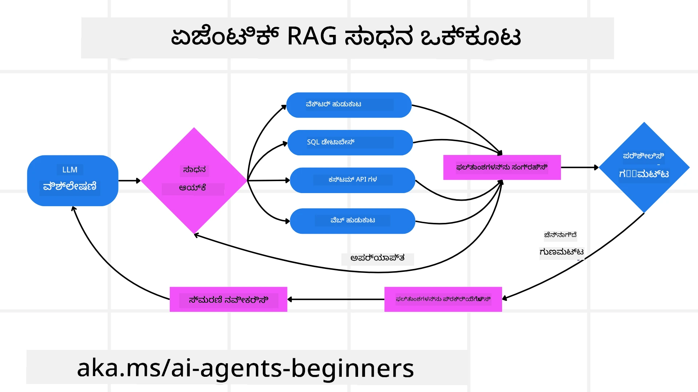
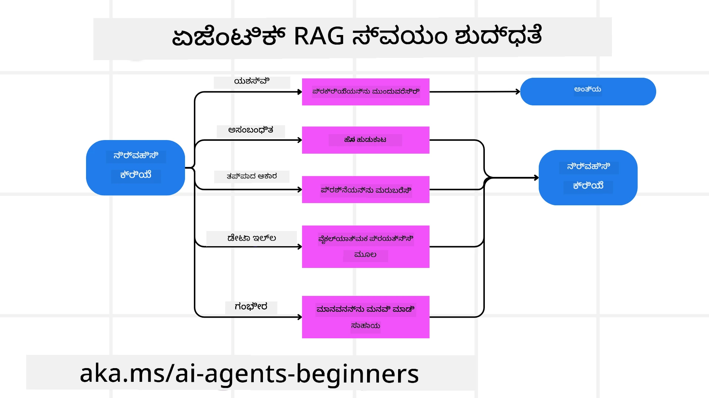
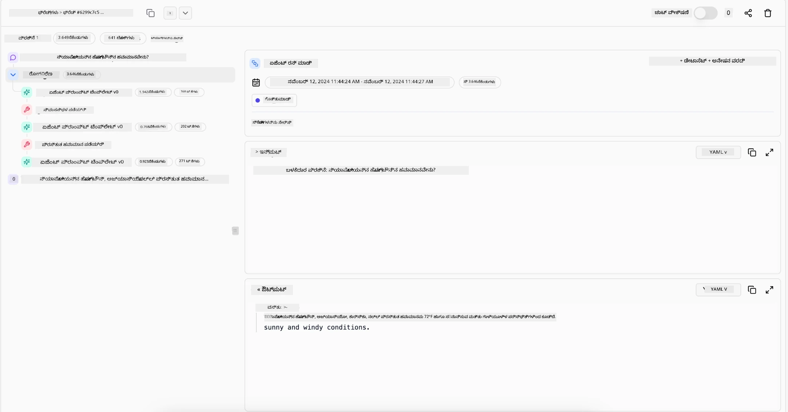

> _(ಈ ಪಾಠದ ವೀಡಿಯೋದರ್ಶನಕ್ಕೆ ಮೇಲಿನ ಚಿತ್ರವನ್ನು ಕ್ಲಿಕ್ ಮಾಡಿ)_

# Agentic RAG

ಈ ಪಾಠ Agentic Retrieval-Augmented Generation (Agentic RAG) ಎಂಬ ಉದಯೋನ್ಮುಖ AI ಪರಿಕಲ್ಪನೆಯ ಸಮಗ್ರ ಅವಲೋಕನವನ್ನು ಒದಗಿಸುತ್ತದೆ, ಇದರಲ್ಲಿ ದೊಡ್ಡ ಭಾಷಾ ಮಾದರಿಗಳು (LLMs) ಸ್ವತಃ ಮುಂದಿನ ಹಂತಗಳನ್ನು ಯೋಜಿಸುತ್ತವೆ ಮತ್ತು ಹೊರಗಿನ ಮೂಲಗಳಿಂದ ಮಾಹಿತಿ ತೆಗೆದುಕೊಳ್ಳುತ್ತವೆ. ಸ್ಥಿರವಾದ retrieval-ಮೇಲೆ-ಓದಲು ಮಾದರಿಗಳಿಗಿಂತ ವಿಭಿನ್ನವಾಗಿ, Agentic RAG ಮಾದರಿಯನ್ನು ಆವರಣ ಮಾಡಿ, ಸಾಧನ ಅಥವಾ ಕಾರ್ಯ ಕರೆಗಳ ಜೊತೆ ಬೆರಗಾಗಿರುವ ಪುನರಾವರ್ತಿತ ಕರೆಗಳನ್ನು ಒಳಗೊಂಡಿದೆ ಮತ್ತು ರಚನಾತ್ಮಕ ಔಟ್‌ಪುಟ್‌ಗಳೊಂದಿಗೆ ಕಾರ್ಯನಿರ್ವಹಿಸುತ್ತದೆ. ಸಿಸ್ಟಮ್ ಫಲಿತಾಂಶಗಳನ್ನು ಮೌಲ್ಯಮಾಪನ ಮಾಡಿ, ಪ್ರಶ್ನೆಗಳನ್ನು ಸುಧಾರಿಸುತ್ತದೆ, ಅಗತ್ಯವಿದ್ದರೆ ಹೆಚ್ಚುವರಿ ಸಾಧನಗಳನ್ನು ಕರೆಸುತ್ತದೆ ಮತ್ತು ಬದ್ಧವಾದ ಪರಿಹಾರ ಸಿಗುವವರೆಗೆ ಈ ಚಕ್ರವನ್ನು ಮುಂದುವರಿಸುತ್ತದೆ.

## ಪರಿಚಯ

ಈ ಪಾಠದಲ್ಲಿ ನಾವು ತಿಳಿಯಬೇಕಾಗಿರುವವು:

- **Agentic RAG ತಿಳಿದುಕೊಳ್ಳಿ:** ದೊಡ್ಡ ಭಾಷಾ ಮಾದರಿಗಳು (LLMs) ಸ್ವತಃ ಮುಂದಿನ ಹಂತಗಳನ್ನು ಯೋಜಿಸುವ ಮತ್ತು ಹೊರಗಿನ ಡೇಟಾ ಮೂಲಗಳಿಂದ ಮಾಹಿತಿ ತರುತ್ತಿರುವ AI ಯ ಉದಯೋನ್ಮುಖ ಪರಿಕಲ್ಪನೆ ಕುರಿತು ತಿಳಿದಿಕೊಳ್ಳಿ.
- **ಪುನರಾವರ್ತಿತ Maker-Checker ಶೈಲಿಯನ್ನು ಗ್ರಹಿಸಿ:** LLM ಗೆ ಪುನರಾವರ್ತಿತ ಕರೆಗಳನ್ನು, ಸಾಧನ ಅಥವಾ ಕಾರ್ಯಕರೆಗಳೊಂದಿಗೆ ಭೇದಿಸುತ್ತಾ ಮತ್ತು ರಚನಾತ್ಮಕ ಔಟ್‌ಪುಟ್‌ಗಳನ್ನು ಉಂಟುಮಾಡುವ ಲೋಪ್ ಅನ್ನು ಅರ್ಥಮಾಡಿ, correctness ಅನ್ನು ಸುಧಾರಿಸಲು ಮತ್ತು ದೋಷಪೂರಿತ ಪ್ರಶ್ನೆಗಳನ್ನು ಸರಿ ಮಾಡಲು.
- **ಪ್ರಯೋಗಾತ್ಮಕ ಅನ್ವಯಗಳಿಂದ ಅನ್ವೇಷಿಸಿ:** Agentic RAG ಉತ್ತಮ ಕಾರ್ಯತಂತ್ರಗಳಿಗಾಗಿದ್ದು, correctness-ಪ್ರಥಮ ಪರಿಸರಗಳು, ಸಂಕೀರ್ಣ ಡೇಟಾಬೇಸ್ ಸಂವಹನಗಳು ಮತ್ತು ವಿಸ್ತೃತ ವರ್ಕ್‌ಫ್ಲೋಗಳು ಸೇರಿದಂತೆ ವಿವಿಧ ದೃಷ್ಯಗಳನ್ನು ಗುರುತಿಸಿ.

## ಕಲಿಕೆ ಗುರಿಗಳು

ಈ ಪಾಠವನ್ನು ಪೂರ್ಣಗೊಳಿಸಿದ ಮೇಲೆ ನೀವು ಇವುಗಳನ್ನು ತಿಳಿದುಕೊಳ್ಳುವಿರಿ:

- **Agentic RAG ಅರ್ಥಮಾಡಿಕೊಳ್ಳಿ:** ದೊಡ್ಡ ಭಾಷಾ ಮಾದರಿಗಳು (LLMs) ಸ್ವತಃ ಮುಂದಿನ ಹಂತಗಳನ್ನು ಯೋಜಿಸುವ ಮತ್ತು ಹೊರಗಿನ ಡೇಟಾ ಮೂಲಗಳಿಂದ ಮಾಹಿತಿ ತರುತ್ತಿರುವ AI ಯ ಉದಯೋನ್ಮುಖ ಪರಿಕಲ್ಪನೆ ಕುರಿತು ತಿಳಿದಿರುತ್ತದೆ.
- **ಪುನರಾವರ್ತಿತ Maker-Checker ಶೈಲಿ:** LLM ಗೆ ಪುನರಾವರ್ತಿತ ಕರೆಗಳನ್ನು ಮತ್ತು ಸಾಧನ ಅಥವಾ ಕಾರ್ಯ ಪಡೆಯುವಿಕೆ ಮತ್ತು ರಚನಾತ್ಮಕ ಔಟ್‌ಪುಟ್‌ಗಳೊಂದಿಗೆ ಲೋಪ್ ಹಿನ್ನೆಲೆ ಅರ್ಥಮಾಡಿಕೊಳ್ಳಿ, correctness ಮತ್ತು ದೋಷಪೂರಿತ ಪ್ರಶ್ನೆಗಳನ್ನು ಸರಿಪಡಿಸುವಲ್ಲಿ.
- **ತರ್ಕದ ಪ್ರಕ್ರಿಯೆಯ ಆದಿಪತ್ನತೆ:** ಸಮಸ್ಯೆಗಳನ್ನು ಹೇಗೆ ಎದುರಿಸಬೇಕೋ ಕುರಿತು ನಿರ್ಧಾರಗಳನ್ನು ಸ್ವತಃ ತೆಗೆದುಕೊಳ್ಳುವ ವ್ಯವಸ್ಥೆಯ own reasoning ಪ್ರಕ್ರಿಯೆಯ ಬಗ್ಗೆ ತಿಳಿದುಕೊಳ್ಳಿ.
- **ವರ್ಕ್‌ಫ್ಲೋ:** ಒಂದು ಏಜೆಂಟಿಕ್ ಮಾದರಿ ಸ್ವತಂತ್ರವಾಗಿ ಹೊರಗಿನ ಮಾರುಕಟ್ಟೆ ಪ್ರವೃತ್ತಿ ವರದಿಗಳನ್ನು ಪಡೆದುಕೊಳ್ಳುವುದು, ಸ್ಪರ್ಧಾತ್ಮಕ ಡೇಟಾವನ್ನು ಗುರುತಿಸುವುದು, ಆಧಾರದೊಳಗಿನ ಮಾರಾಟ ಅಂಶಗಳನ್ನು ಸಂಯೋಜಿಸುವುದು, ಕಂಡುಹಿಡಿದುವನ್ನು ಸಂಶ್ಲೇಷಿಸುವುದು ಮತ್ತು వ్యೂಹವನ್ನು ಮೌಲ್ಯಮಾಪನ ಮಾಡುವುದು ಹೇಗೆ ಎಂಬುದರ ಅರಿವು.
- **ಪುನರಾವರ್ತಿತ ಲೋಪ್‌ಗಳು, ಸಾಧನ ಏಕೀಕರಣ ಮತ್ತು ಸ್ಮೃತಿ:** ಈ ಕ್ರಮದಲ್ಲಿ ಲೋಪ್ ಆಗಿ ಸಂವಹನ ಮಾಡುತ್ತದೆ, ಹಂತಗಳ ನಡುವೆಯೇ ಸ್ಥಿತಿ ಮತ್ತು ಸ್ಮೃತಿಯನ್ನು ಕಾಪಾಡಿಕೊಂಡು, ಉಲ್ಲೇಖದ ಪುನರಾವರ್ತನೆ ತಪ್ಪಿಸಿ ಮತ್ತು ಜಾಗೃತ ನಿರ್ಧಾರಗಳನ್ನು ತೆಗೆದುಕೊಳ್ಳುತ್ತದೆ.
- **ವಿಫಲತೆ ನಿಯಂತ್ರಣ ಮತ್ತು ಸ್ವಯಂ-ಸೂಧನೆ:** ಪ್ರಶ್ನೆಗಳನ್ನು ಮರುಪರಿಶೀಲನೆ ಮತ್ತು ಮರುಪ್ರಶ್ನೆ ಹಾಕುವುದು, ದೋಷ ನಿರ್ಣಾಯಕ ಸಾಧನಗಳನ್ನು ಉಪಯೋಗಿಸುವುದು ಮತ್ತು ಮಾನವ ಮೇಲ್ವಿಚಾರಣೆಯತ್ತ ಹಿಂಭಾಗ ಮತ್ತೆ ಒಪ್ಪಿಕೊಳ್ಳುವುದು ಸೇರಿದಂತೆ ಸ್ವಯಂ-ಸೂಧನೆ ತಂತ್ರಗಳನ್ನು ಅನ್ವೇಷಿಸಿ.
- **ಏಜೆನ್ಸಿಯವ ಯಥಾರ್ಹತೆಗಳು:** Agentic RAG ನ ಮર્યಾದೆಗಳನ್ನು ಅರ್ಥಮಾಡಿಕೊಳ್ಳಿ - ವಲಯ-ನಿರ್ದಿಷ್ಟ ಸ್ವಾಯತ್ತತೆ, ಮೂಲಸೌಕರ್ಯ ಅವಲಂಬನೆ ಮತ್ತು ಮಾರ್ಗಸೂಚಿಗಳಿಗೆ ಗೌರವ.
- **ಪ್ರಾಯೋಗಿಕ ಬಳಕೆ ಪ್ರಕರಣಗಳು ಮತ್ತು ಮೌಲ್ಯ:** correctness-ಪ್ರಥಮ ಪರಿಸರಗಳು, ಸಂಕೀರ್ಣ ಡೇಟಾಬೇಸ್ ಸಂವಹನಗಳು ಮತ್ತು ವಿಸ್ತೃತ ವರ್ಕ್‌ಫ್ಲೋಗಳಲ್ಲಿ Agentic RAG ನ ಶಕ್ತಿ.
- **ಶಾಸನ, ಪಾರದರ್ಶಕತೆ ಮತ್ತು ನಂಬಿಕೆ:** ವಿವರಿಸುವ ತರ್ಕದ ಮಹತ್ವ, ಭೇದಭಾವ ನಿಯಂತ್ರಣ ಮತ್ತು ಮಾನವ ಮೇಲ್ವಿಚಾರಣೆ.

## Agentic RAG ಎಂದರೆ ಏನು?

Agentic Retrieval-Augmented Generation (Agentic RAG) ಒಂದು ಉದಯೋನ್ಮುಖ AI ಪರಿಕಲ್ಪನೆ, ಇದರಲ್ಲಿ ದೊಡ್ಡ ಭಾಷಾ ಮಾದರಿಗಳು (LLMs) ಸ್ವತঃ ಮುಂದಿನ ಹಂತಗಳನ್ನು ಯೋಜಿಸಿ, ಹೊರಗಿನ ಮೂಲಗಳಿಂದ ಮಾಹಿತಿ ತರುತ್ತವೆ. ಸ್ಥಿರ retrieval-ಮೇಲೆ-ಓದಲು ಮಾದರಿಗಿಂತ, Agentic RAG LLM ಗೆ ಪುನರಾವರ್ತಿತ ಕರೆಗಳನ್ನು ಮಾಡುತ್ತದೆ, ಸಾಧನ ಅಥವಾ ಕಾರ್ಯಕರೆಗಳೊಂದಿಗೆ ವೇದಿಕೆಯ-ರಚನಾತ್ಮಕ ಔಟ್‌ಪುಟ್‌ಗಳನ್ನು ಒಳಗೊಂಡಿದೆ. ಸಿಸ್ಟಮ್ ಫಲಿತಾಂಶಗಳನ್ನು ಮೌಲ್ಯಮಾಪನ ಮಾಡಿ, ಪ್ರಶ್ನೆಗಳನ್ನು ಸುಧಾರಿಸುತ್ತದೆ, ಹೆಚ್ಚುವರಿ ಸಾಧನಗಳನ್ನು ಕರೆತರುತ್ತದೆ ಮತ್ತು ತೃಪ್ತಿದಾಯಕ ಪರಿಹಾರ ಸಿಗುವವರೆಗೆ ಈ ಚಕ್ರವನ್ನು ಮುಂದುವರಿಸುತ್ತದೆ. ಈ ಪುನರಾವರ್ತಿತ “maker-checker” ಶೈಲಿ correctness ಅನ್ನು ಸುಧಾರಿಸುತ್ತದೆ, ದೋಷಪೂರಿತ ಪ್ರಶ್ನೆಗಳನ್ನು ನಿಭಾಯಿಸುತ್ತದೆ ಮತ್ತು ಮೂಲ್ಯಯುತ ಫಲಿತಾಂಶಗಳನ್ನು ಖಾತ್ರಿಪಡಿಸುತ್ತದೆ.

ವ್ಯವಸ್ಥೆಯು ತನ್ನ ತರ್ಕ ಪ್ರಕ್ರಿಯೆಯನ್ನು ಸಕ್ರಿಯವಾಗಿ ನಿರ್ವಹಿಸುತ್ತದೆ, ವಿಫಲವಾದ ಪ್ರಶ್ನೆಗಳನ್ನು ಮರುಬರೆಯುತ್ತದೆ, ವಿಭಿನ್ನ retrieval ವಿಧಾನಗಳನ್ನು ಆರಿಸುತ್ತದೆ ಮತ್ತು ಅನೇಕ ಸಾಧನಗಳನ್ನು ಒಂದುಗೂಡಿಸುತ್ತದೆ — ಉದಾಹರಣೆಗೆ, Azure AI Search ನಲ್ಲಿ ವೆಕ್ಟರ್ ಶೋಧ, SQL ಡೇಟಾಬೇಸ್‌ಗಳು ಅಥವಾ ಕಸ್ಟಮ್ API ಗಳು — ಉತ್ತರವನ್ನು ಅಂತಿಮಗೊಳಿಸುವ ಮೊದಲು. ಏಜೆಂಟಿಕ್ ವ್ಯವಸ್ಥೆಯ ಪ್ರತ್ಯೇಕಗುಣವೆಂದರೆ ತನ್ನ ತರ್ಕ ಪ್ರಕ್ರಿಯೆಯನ್ನು ಸ್ವತಃ ಆಡಿಕೊಳ್ಳುವ ಸಾಮರ್ಥ್ಯ. ಪರಂಪರಾ RAG ಅನುಷ್ಠಾನಗಳು ಪೂರ್ವನಿರ್ದಿಷ್ಟ ಮಾರ್ಗಗಳಿಗೆ ಅವಲಂಬಿತವಾಗಿರುವಾಗ, ಏಜೆಂಟಿಕ್ ವ್ಯವಸ್ಥೆ ಮಾಹಿತಿ ಗುಣಮಟ್ಟ ಆಧರಿಸಿ ಹಂತಗಳ ಕ್ರಮವನ್ನು ಸ್ವತಃ ನಿರ್ಧರಿಸುತ್ತದೆ.

## Agentic Retrieval-Augmented Generation ಅನ್ನು ವ್ಯಾಖ್ಯಾನಿಸುವುದು (Agentic RAG)

Agentic Retrieval-Augmented Generation (Agentic RAG) ಒಂದು ಉದಯೋನ್ಮುಖ AI ಅಭಿವೃದ್ಧಿಯ ಪರಿಕಲ್ಪನೆ, ಇದರಲ್ಲಿ LLM ಗಳು ಹೊರಗಿನ ಡೇಟಾ ಮೂಲಗಳಿಂದ ಮಾಹಿತಿ ಪಡೆಯುವುದೇ ಅಲ್ಲದೆ ಸ್ವತಃ ಮುಂದಿನ ಹಂತಗಳನ್ನು ಯೋಜಿಸುತ್ತವೆ. ಸ್ಥಿರ retrieval-ಮೇಲೆ-ಓದಲು ಮಾದರಿ ಅಥವಾ ಜಾಗರೂಕವಾಗಿ ರೂಪಿತ ಪ್ರಾಂಪ್ಟ್ ಸೀಕ್ವೆನ್ಸ್‌ಗಳಿಗಿಂತ ಭಿನ್ನವಾಗಿ, Agentic RAG LLM ಗೆ ಪುನರಾವರ್ತಿತ ಕರೆಗಳ ಲೋಪ್ನೊಂದಿಗೆ, ಸಾಧನ ಅಥವಾ ಕಾರ್ಯಪೂರ್ವಕ ಕರೆಗಳೊಡನೆ ಮತ್ತು ರಚನಾತ್ಮಕ ಔಟ್‌ಪುಟ್‌ಗಳನ್ನು ಒಳಗೊಂಡಿದೆ. ಪ್ರತಿಯೊಂದು ತಿರುಗುಮುಖದಲ್ಲೂ, ಸಿಸ್ಟಮ್ ಪಡೆದ ಫಲಿತಾಂಶಗಳನ್ನು ಮೌಲ್ಯಮಾಪನ ಮಾಡಿ, ತನ್ನ ಪ್ರಶ್ನೆಗಳನ್ನು ಸುಧಾರಿಸುವುದು ಬೇಕಾ ಎಂದು ನಿರ್ಧರಿಸಿ, ಹೆಚ್ಚುವರಿ ಸಾಧನಗಳನ್ನು ಕರೆಸಿ, ತೃಪ್ತಿದಾಯಕ ಪರಿಹಾರ ಸಿಗುವವರೆಗೆ ಈ ಚಕ್ರವನ್ನು ಮುಂದುವರಿಸುತ್ತದೆ.

ಈ ಪುನರಾವರ್ತಿತ “maker-checker” ಶೈಲಿ correctness ಸುಧಾರಿಸಲು, ದೋಷಪೂರಿತ ಪ್ರಶ್ನೆಗಳನ್ನು (ಉದಾಹರಣೆ: NL2SQL) ನಿಭಾಯಿಸಲು ಹಾಗೂ ಸಮತೋಲನ, ಉನ್ನತ ಗುಣಮಟ್ಟದ ಫಲಿತಾಂಶಗಳನ್ನು ಖಾತ್ರಿ ಪಡಿಸಲು ವಿನ್ಯಾಸಗೊಳಿಸಲಾಗಿದೆ. ಜಾಗರೂಕವಾಗಿ ರೂಪಿತ ಪ್ರಾಂಪ್ಟ್ ಸರಣಿಗಳ ಮೇಲೆ ಅವಲಂಬಿಸದೇ, ಸಿಸ್ಟಮ್ ತನ್ನ ತರ್ಕ ಪ್ರಕ್ರಿಯೆಯನ್ನು ಸಕ್ರಿಯವಾಗಿ ನಿಭಾಯಿಸುತ್ತದೆ. ವಿಫಲವಾದ ಪ್ರಶ್ನೆಗಳನ್ನು ಮರುಬರೆಯಬಹುದು, ವಿಭಿನ್ನ ಮಾಹಿತಿಯನ್ನು ಆಯ್ಕೆಮಾಡಬಹುದು ಮತ್ತು ಅನೇಕ ಸಾಧನಗಳನ್ನು (ಉದಾ: Azure AI Search ನ ವೆಕ್ಟರ್ ಶೋಧ, SQL ಡೇಟಾಬೇಸ್ ಅಥವಾ ಕಸ್ಟಮ್ API) ಒಗ್ಗೂಡಿಸಬಹುದು. ಇದು ಜಟಿಲ ಸಂಯೋಜನೆ ಮೂಲಸೌಕರ್ಯಗಳ ಅಗತ್ಯವಿಲ್ಲಗೊಳಿಸುತ್ತದೆ. ಬದಲಾಗಿ, “LLM ಕರೆ → ಸಾಧನ ಬಳಕೆ → LLM ಕರೆ → …” ಎಂಬ ಸರಳ ಲೋಪ್ ನಿಂದ ಕಲಾವಿದ ಮತ್ತು ಕಡೆಗಣಿಸಲ್ಪಟ್ಟ ಔಟ್‌ಪುಟ್‌ಗಳು ಸಿಗುತ್ತವೆ.

## ತರ್ಕ ಪ್ರಕ್ರಿಯೆಯ ಸ್ವಾಧೀನತೆ

ವ್ಯವಸ್ಥೆಯನ್ನು “Agentic” ಮಾಡಿಸುವ ಮುಖ್ಯ ಗುಣವೆಂದರೆ ಅದರ ತರ್ಕ ಪ್ರಕ್ರಿಯೆಯನ್ನು ತನ್ನದೇ ಆದಂತೆ ನಡೆಸುವ ಶಕ್ತಿ. ಸಾಂಪ್ರದಾಯಿಕ RAG ಅನುಷ್ಠಾನಗಳು ಬಹುಮಾನವಾಗಿ ಮಾನವರು ಮಾದರಿಗೆ ಮಾರ್ಗವನ್ನು ಪೂರ್ವನಿಯೋಜನೆ ಮಾಡುತ್ತಾರೆ: ಯಾವಾಗ ಏನು ಪಡೆಯುವುದು ಎಂದು ತರ್ಕ ಸರಣಿಯನ್ನು ರೂಪಿಸುವುದು.
ಆದರೆ ಒಂದು ವ್ಯವಸ್ಥೆ ನಿಜವಾಗಿಯೂ Agentic ಆಗಿದ್ದರೆ, ಅದು ಒಳಗೂ जाकर ಸಮಸ್ಯೆಯನ್ನು ಹೇಗೆ ಎದುರಿಸಬೇಕು ಎಂದು ನಿರ್ಧರಿಸುತ್ತದೆ. ಅದು ಕೆವಲ ಸ್ಕ್ರಿಪ್ಟ್ ನಿರ್ವಹಿಸುವುದಲ್ಲ; ಅದು ತನ್ನ ಕಂಡುಕೊಂಡ ಮಾಹಿತಿಯ ಗುಣಮಟ್ಟ ಆಧರಿಸಿ ಹಂತಗಳ ಕ್ರಮವನ್ನು ಸ್ವಯಂ ನಿಗದಿಗೊಳಿಸುತ್ತದೆ.
ಉದಾಹರಣೆಗೆ, ಉತ್ಪನ್ನ ಪ್ರಾರಂಭ กลยุಕತೆಯನ್ನು ರಚಿಸಲು ಕೇಳಿದಾಗ, ಅದು ಸಂಪೂರ್ಣ ಸಂಶೋಧನೆ ಮತ್ತು ನಿರ್ಧಾರ ನಿರ್ವಹಣೆಯ ಕಾರ್ಯನಿರ್ವಹಣೆಯ ಸೃಷ್ಟಿ ಪ್ರಾಂಪ್ಟ್ ನಲ್ಲಿ ಮಾತ್ರ ಅವಲಂಬರಿತವಿರೋದಿಲ್ಲ. ಬದಲಿಗೆ, Agentic ಮಾದರಿ ಸ್ವತಂತ್ರವಾಗಿ ನಿರ್ಧರಿಸುತ್ತದೆ:

1. Bing Web Grounding ನ ಮೂಲಕ ಪ್ರಸಕ್ತ ಮಾರುಕಟ್ಟೆ ಪ್ರವೃತ್ತಿ ವರದಿಗಳನ್ನು ಪಡೆಯುವುದು.
2. Azure AI Search ಬಳಸಿ ಸಂಬಂಧಿತ ಸ್ಪರ್ಧಾತ್ಮಕ ಡೇಟಾವನ್ನು ಗುರುತಿಸುವುದು.
3. Azure SQL Database ಉಪಯೋಗಿಸಿ ಇತಿಹಾಸಾತ್ಮಕ ಒಳಗಿನ ಮಾರಾಟ ಅಂಶಗಳನ್ನು ಸಂಬಂಧಗೊಳಿಸುವುದು.
4. Azure OpenAI ಸೆರ್ವಿಸ್ ಮೂಲಕ ಸಂಯೋಜಿತ ವ್ಯೂಹವನ್ನು ರೂಪಿಸುವ ಮೂಲಕ ಕಂಡುಕೊಂಡುಗಳನ್ನು ಸಂಶ್ಲೇಷಿಸುವುದು.
5. ವ್ಯೂಹದ ಬಾಗಿದ್ದಡತೆ ಅಥವಾ ಅಸಮঞ্জಸತೆಗಳನ್ನು ಮೌಲ್ಯಮಾಪನ ಮಾಡುವುದು, ಅಗತ್ಯವಿದ್ದರೆ ಮತ್ತೊಂದು retrieval ಹಂತ ಕೇಳಿಸುವುದು.
ಈ ಎಲ್ಲ ಹಂತಗಳು — ಪ್ರಶ್ನೆಗಳನ್ನು ಸುಧಾರಿಸುವುದು, ಮೂಲಗಳನ್ನು ಆಯ್ಕೆಮಾಡುವುದು, “ಸಂತೋಷ” ಆಗುವವರೆಗೆ ಪುನರಾವರ್ತಿಸುವುದು — ಮಾದರಿ ನಿರ್ಧರಿಸುತ್ತದೆ, ಮಾನವನಿಂದ ಪೂರ್ವಯೋಜನೆಯಾಗಿರುವುದಿಲ್ಲ.

## ಪುನರಾವರ್ತಿತ ಲೋಪ್‌ಗಳು, ಸಾಧನ ಏಕೀಕರಣ ಮತ್ತು ಸ್ಮೃತಿ

ಒಂದು Agentic ವ್ಯವಸ್ಥೆ ಲೋಪ್ ಆಗಿ ಕಾರ್ಯನಿರ್ವಹಿಸುವ ಸಂವಹನ ಮಾದರಿಯ ಮೇಲೆ ಅವಲಂಬಿತವಾಗಿರುತ್ತದೆ:

- **ಆದಿತ್ಯ ಕರೆ:** ಬಳಕೆದಾರರ ಗುರಿ (ಅಥವಾ ಬಳಕೆದಾರ ಪ್ರಾಂಪ್ಟ್) LLM ಗೆ ಸಲ್ಲಿಸಲಾಗುತ್ತದೆ.
- **ಸಾಧನ ಕರೆ:** ಮಾದರಿ ಮಾಹಿತಿಯ ಕೊರತೆ ಅಥವಾ ಸ್ಪಷ್ಟವಲ್ಲದ ಸೂಚನೆಗಳನ್ನು ಗುರುತಿಸಿದರೆ, ಅದನ್ನು ಪರೀಕ್ಷಿಸಲು ಸಾಧನ ಅಥವಾ retrieval ವಿಧಾನ ಆಯ್ಕೆ ಮಾಡುತ್ತದೆ—ಉದಾಹರಣೆಗೆ ವೆಕ್ಟರ್ ಡೇಟಾಬೇಸ್ ಕ್ವೇರಿ (ಉದಾ: Azure AI Search ವೈಶಿಷ್ಟ್ಯದ ಖಾಸಗಿ ಡೇಟಾದ ಮೇಲೆ ಸಂಶೋಧನೆ) ಅಥವಾ ರಚನಾತ್ಮಕ SQL ಕರೆ.
- **ಮೌಲ್ಯಮಾಪನ ಮತ್ತು ಸುಧಾರಣೆ:** ಹುಡುಕಿದ ಡೇಟಾವನ್ನು ಪರಿಶೀಲಿಸಿದ ನಂತರ, ಮಾಹಿತಿಯು ಸಾಕಾಗಿದೆಯೆ ಎಂದು ನಿರ್ಧರಿಸುತ್ತದೆ; ತಪ್ಪಿದ್ದರೆ ಪ್ರಶ್ನೆಯನ್ನು ಸುಧಾರಿಸುತ್ತದೆ, ಬೇರೆ ಸಾಧನವನ್ನು ಪ್ರಯತ್ನಿಸುತ್ತದೆ ಅಥವಾ ತನ್ನ ವಿಧಾನವನ್ನು ಸರಿಪಡಿಸುತ್ತದೆ.
- **ತೃಪ್ತಿಯಾಗುವವರೆಗೆ ಪುನರಾವರ್ತನೆ:** ಈ ಚಕ್ರ ಮಾದರಿ ತೃಪ್ತಿದಾಯಕ ಸ್ಪಷ್ಟತೆ ಮತ್ತು ಸಾಕಷ್ಟು ಸಾಕ್ಷ್ಯ ಹೊಂದಿರುವ ಅಂತಿಮ ಉತ್ತರವನ್ನು ನೀಡುವ ತನಕ ಮುಂದುವರಿಯುತ್ತದೆ.
- **ಸ್ಮೃತಿ ಮತ್ತು ಸ್ಥಿತಿ:** ವ್ಯವಸ್ಥೆ ಹಂತಗಳ ಮಧ್ಯೆ ಸ್ಥಿತಿ ಮತ್ತು ಸ್ಮೃತಿಯನ್ನು ಕಾಪಾಡಿಕೊಳ್ಳುವ ಕಾರಣ, ಹಿಂದಿನ ಪ್ರಯತ್ನ ಮತ್ತು ಫಲಿತಾಂಶಗಳನ್ನು ನೆನಪಿನಲ್ಲಿಟ್ಟುಕೊಂಡು, ಪುನರಾವರ್ತಿತ ಲೋಪ್ಗಳನ್ನು ತಡೆದು, ಉತ್ತಮ ನಿರ್ಧಾರಗಳನ್ನು ತೆಗೆದುಕೊಳ್ಳುತ್ತದೆ.

ಕಾಲಕಾಲಾಂತರದಲ್ಲಿ, ಇದು ಅಭಿವೃದ್ಧಿಯಾದ ಅರಿವು ಎನ್ನುವ ಭಾವವನ್ನು ಉಂಟುಮಾಡುತ್ತದೆ, ಮತ್ತು ಮಾದರಿ ಸಂಕೀರ್ಣ, ಬಹು ಹಂತದ ಕಾರ್ಯಗಳನ್ನು ಮಾನವ ಕ್ರಮರಹಿತವಾಗಿ ಅಥವಾ ಪ್ರಾಂಪ್ಟ್ ರೂಪಾಂತರವಿಲ್ಲದೆ ಸಂಚರಿಸಲು ಸಹಾಯಮಾಡುತ್ತದೆ.

## ವಿಫಲತೆ ನಿರ್ವಹಣೆ ಮತ್ತು ಸ್ವಯಂ-ಸೂಧನೆ

Agentic RAG ಸ್ವಾಯತ್ತತೆಗೆ ನಿಭಾಯಿಸುವ ಶಕ್ತಿಶಾಲಿ ಸ್ವಯಂ-ಸಂಸ್ಕಾರ ವಿಧಾನಗಳಿವೆ. ವ್ಯವಸ್ಥೆ ಅಪಾಯದ ವಾದಗಳಲ್ಲಿ ತಡೆತಪ್ಪಿದಾಗ—ಅನರ್ಹ ಡಾಕ್ಯುಮೆಂಟ್‌ಗಳನ್ನು ಪಡೆಯುವಾಗ ಅಥವಾ ದೋಷಪೂರಿತ ಪ್ರಶ್ನೆಗಳು ಬಂದಾಗ—ಇವುಗಳು ನೆರವಾಗಬಹುದು:

- **ಪುನರಾವರ್ತನೆ ಮತ್ತು ಮರುಪ್ರಶ್ನೆ ಹಾಕುವುದು:** ಕಡಿಮೆ ಮೌಲ್ಯದ ಪ್ರತಿಕ್ರಿಯೆಗಳನ್ನು ನೀಡದೇ, ಮಾದರಿ ಹೊಸ ಶೋಧ ತಂತ್ರಗಳನ್ನು ಪ್ರಯತ್ನಿಸುತ್ತದೆ, ಡೇಟಾಬೇಸ್ ಪ್ರಶ್ನೆಗಳನ್ನು ಪುನರಚಿಸುತ್ತದೆ ಅಥವಾ ಪರ್ಯಾಯ ಡೇಟಾ ಸೆಟ್‌ಗಳನ್ನು ಅವಲೋಕಿಸುತ್ತದೆ.
- **ರೋಗನಿರ್ಣಯ ಸಾಧನಗಳನ್ನು ಉಪಯೋಗಿಸುವುದು:** ತರ್ಕ ಹಂತಗಳನ್ನು ಡಿಬಗ್ ಮಾಡಲು ಅಥವಾ ಪಡೆದ ಮಾಹಿತಿಯ ಸರಿತನವನ್ನು ದೃಢೀಕರಿಸಲು ಹೆಚ್ಚುವರಿ ಕಾರ್ಯ ಕ್ರಮಗಳನ್ನು ಕರೆಸಬಹುದು. Azure AI Tracing ಇಂತಹ ಸಾಧನಗಳು ದೃಢವಾದ ಪರಿಶೀಲನೆ ಮತ್ತು ನಿಗಾವಣೆಯಲ್ಲಿ ಸಹಕಾರಿಯಾಗುತ್ತವೆ.
- **ಮಾನವ ಮೇಲ್ವಿಚಾರಣೆಗೆ ಹಿಂತೆಗೆದು:** ಉನ್ನತ ಜವಾಬ್ದಾರಿಯ ಸಂದರ್ಭಗಳಲ್ಲಿ ಅಥವಾ ಮರುಪಡೆಯುವ ಸಂದರ್ಭದಲ್ಲಿ, ಮಾದರಿ ಅನುಮಾನವನ್ನು ಸೂಚಿಸಿ ಮಾನವ ಮಾರ್ಗದರ್ಶನ ಕೇಳಬಹುದು. ಮಾನವ ಕ್ಲಿಷ್ಟತೆಯನ್ನು ಸರಿಪಡಿಸುವ ಪ್ರತಿಕ್ರಿಯೆಯನ್ನು ನೀಡಿದ ನಂತರ, ಅದನ್ನು ಮುಂದಿಗೂ ಬಳಸಿಕೊಳ್ಳಬಹುದು.

ಈ ಪುನರಾವರ್ತಿತ ಮತ್ತು ಸಕ್ರಿಯ ವಿಧಾನ ಮಾದರಿಯನ್ನು ನಿರಂತರ ಉತ್ತಮಗೊಳಿಸುವಂತೆ ಮಾಡುತ್ತದೆ, ಇದು ಒಂದು ಬಾರಿ ಮಾಡುತ್ತಿದ್ದ ವ್ಯವಸ್ಥೆ ಅಲ್ಲ, ಆದ್ದರಿಂದ ಅವು ತನ್ನ ತಪ್ಪುಗಳಿಂದ ಕಲಿಯುತ್ತದೆ.

## ಏಜೆನ್ಸಿಯ ಸೀಮೆಗಳು

ಒಂದು ಕಾರ್ಯದಲ್ಲಿ ತನ್ನ ಸ್ವಾಯತ್ತತೆ ಇದ್ದರೂ, Agentic RAG ಕಲ್ಪನಾಶೀಲ ಸಾಮಾನ್ಯ ಬುದ್ದಿಮತ್ತೆಯ (Artificial General Intelligence) ಸಮಾನವಲ್ಲ. ಅದರ “Agentic” ಶಕ್ತಿಗಳು ಮಾನವ ಅಭಿವೃದ್ಧಿಪಡಿಸಿದ ಸಾಧನಗಳು, ಡೇಟಾ ಮೂಲಗಳು ಮತ್ತು ಧೋರಣೆಗಳೊಂದಿಗೆ ನಿರ್ಬಂಧಿತವಾಗಿದೆ. ಅದು ತನ್ನದೇ ಸಾಧನಗಳನ್ನು ಕಂಡುಹಿಡಿಯಲು ಅಥವಾ ಹೊಂದಿರುವ ವಲಯ ಮಿತಿಗಳನ್ನು ಮೀರಿ ಹೋಗಲು ಸಾಧ್ಯವಿಲ್ಲ. ಬದಲಾಗಿ, ಇದೊಂದು ಲಭ್ಯವಿರುವ ಸಂಪನ್ಮೂಲಗಳನ್ನು ಮೇಲ್ವಿಚಾರಣೆ ಮಾಡುತ್ತಾ ಉತ್ತಮ ರೀತಿಯಲ್ಲಿ ಸಂಯೋಜಿಸುವಲ್ಲಿ ದಕ್ಷವಾಗಿದೆ.
ಮತ್ತೆ ವಿವರಣೆ ನೀಡಬೇಕಾದ ಪ್ರಮುಖ ಅಂತರಗಳು:

1. **ವಲಯ-ನಿರ್ದಿಷ್ಟ ಸ್ವಾಯತ್ತತೆ:** Agentic RAG ಸಿಸ್ಟಮ್ ಗಳು ನಿರ್ದಿಷ್ಟ ಬಳಕೆದಾರ ಗುರಿಗಳನ್ನು ನಿರ್ದಿಷ್ಟಿತ ವಲಯದಲ್ಲಿ ಸಾಧಿಸಲು ಫೋಕಸ್ ಮಾಡುತ್ತವೆ, ಉದಾಹರಣೆಗೆ ಪ್ರಶ್ನೆ ಮರುಬರೆಯುವುದು ಅಥವಾ ಸಾಧನ ಆಯ್ಕೆಮಾಡುವ ಮೂಲಕ ಫಲಿತಾಂಶವನ್ನು ಸುಧಾರಿಸುವ ವಿಧಾನಗಳನ್ನು ಬಳಸುವುದು.
2. **ಮೂಲಸೌಕರ್ಯ ಅವಲಂಬನೆ:** ವ್ಯವಸ್ಥೆಯ ಸಾಮರ್ಥ್ಯಗಳು ಅಭಿವೃದ್ಧಿಪಡಿಸಿದ ಸಾಧನಗಳು ಮತ್ತು ಡೇಟಾಗಳ ಮೇಲೆ ಅವಲಂಬಿತವಾಗಿವೆ; ಮಾನವ ಹಸ್ತಕ್ಷೇಪವಿಲ್ಲದೆ ಸ್ವತಂತ್ರವಾಗಿ ಈ ಮಿತಿಗಳನ್ನು ದಾಟಲು ಸಾಧ್ಯವಿಲ್ಲ.
3. **ಮಾರ್ಗಸೂಚಿಗಳಿಗೆ ಗೌರವ:** ನೈತಿಕ ಮಾರ್ಗಸೂಚಿಗಳು, ಅನುಪಾಲನಾ ನಿಯಮಗಳು ಮತ್ತು ವ್ಯಾಪಾರ ನೀತಿಗಳು ಬಹಳ ಪ್ರಮುಖವಾಗಿವೆ. ಏಜೆಂಟ್ ಸ್ವಾತಂತ್ರ್ಯವನ್ನು ಸದ್ಯಕ್ಕಾಗಿ ಭದ್ರತೆ ಕ್ರಮಗಳು ಮತ್ತು ಮೇಲ್ವಿಚಾರಣಾ ಯಂತ್ರಾಂಶಗಳ ಮೂಲಕ ನಿಯಂತ್ರಿಸಲಾಗುತ್ತದೆ.

## ಪ್ರಾಯೋಗಿಕ ಬಳಕೆ ಪ್ರಕರಣಗಳು ಮತ್ತು ಮೌಲ್ಯವು

Agentic RAG ಪುನರಾವರ್ತಿತ ಸುಧಾರಣೆ ಮತ್ತು ನಿಖರತೆ ಅಗತ್ಯವಿರುವ ಸಂದರ್ಭದಲ್ಲಿ ಉತ್ತಮವಾಗಿರುತ್ತದೆ:

1. **ಸರಿಯಾದ ವಿಷಯ-ಪ್ರಥಮ ಪರಿಸರಗಳು:** ಅನುಪಾಲನಾ ಪರಿಶೀಲನೆಗಳು, ನಿಯಂತ್ರಣ ವಿಶ್ಲೇಷಣೆ ಅಥವಾ ಕಾನೂನು ಸಂಶೋಧನೆಯಲ್ಲಿ, Agentic ಮಾದರಿ ವಾಸ್ತವಗಳನ್ನು ಮರುಪರಿಶೀಲಿಸುವುದು, ಹಲವು ಮೂಲಗಳನ್ನು ಸಹಾಯಮಾಡುವುದೂ ಮತ್ತು ಪ್ರಶ್ನೆಗಳನ್ನು ಮರುಬರೆಯುವುದೂ ಮಾಡುತ್ತದೆ.
2. **ಸಂಕೀರ್ಣ ಡೇಟಾಬೇಸ್ ಸಂವಹನಗಳು:** ಸಂರಚಿಸಲಾದ ಡೇಟಾದ ಸಂವಹನದಲ್ಲಿ ಪ್ರಶ್ನೆಗಳು ಆಗಾಗ ತಪ್ಪಾಗಬಹುದು ಅಥವಾ ಪರಿಷ್ಕಾರ ಅಗತ್ಯವಿರುತ್ತದೆ; ವ್ಯವಸ್ಥೆ ಸ್ವತಃ ತನ್ನ ಪ್ರಶ್ನೆಗಳನ್ನು ಸುಧಾರಿಸಿ.Azure SQL ಅಥವಾ Microsoft Fabric OneLake ಬಳಸಿಕೊಂಡು ಅಂತಿಮ retrieval ಬಳಕೆದಾರರ ಉದ್ದೇಶಕ್ಕೆ ಹೊಂದಿಕೆಯಾಗುವಂತೆ ಖಚಿತಪಡಿಸಿಕೊಳ್ಳುತ್ತದೆ.
3. **ವಿಸ್ತೃತ ವರ್ಕ್‌ಫ್ಲೋಗಳು:** ದೀರ್ಘಕಾಲ ತೆಗೆದುಕೊಂಡ ಸಧನಶೀಲತೆ ಸಮಯದಲ್ಲಿ ಹೊಸ ಮಾಹಿತಿಗಳು ಸಿಗುತ್ತಾ ಸರಣಿಗಳು ರೂಪುಗೊಳ್ಳುತ್ತವೆ. Agentic RAG ಹೊಸ ಡೇಟಾವನ್ನು ನಿರಂತರವಾಗಿ ಸೇರಿಸಿ, ಸಮಸ್ಯೆಯ ಕಡೆಗಾಗಿ ತಂತ್ರಗಳನ್ನು ಬದಲಾಯಿಸುತ್ತದೆ.

## ಆಡಳಿತ, ಪಾರದರ್ಶಕತೆ ಮತ್ತು ನಂಬಿಕೆ

ಈ ವ್ಯವಸ್ಥೆಗಳು ತನ್ನ ಮಾಡಿದ ತರ್ಕದಲ್ಲಿ ಹೆಚ್ಚು ಸ್ವಾಯತ್ತತೆಯನ್ನು ಪಡೆಯುತ್ತಿದ್ದಂತೆ, ಆಡಳಿತ ಮತ್ತು ಪಾರದರ್ಶಕತೆ ಅತ್ಯವಶ್ಯಕ:

- **ವಿವರಿಸಲಾದ ತರ್ಕ:** ಮಾದರಿ ಮಾಡಿದ ಪ್ರಶ್ನೆಗಳ ಲಾಗನ್ನು, ಅವು ವಿಚಾರಿಸಿದ ಮೂಲಗಳನ್ನು ಮತ್ತು ತರುತ್ತಿರುವ ತರ್ಕ ಹಂತಗಳನ್ನು ಒದಗಿಸುತ್ತದೆ. Azure AI Content Safety ಮತ್ತು Azure AI Tracing / GenAIOps ಇಂತಹ ಸಾಧನಗಳು ಪಾರದರ್ಶಕತೆ ಕಾಯ್ದಿಡಲು ಮತ್ತು ಅಪಾಯಗಳನ್ನು ಕಡಿಮೆ ಮಾಡಲು ನೆರವು ನೀಡುತ್ತವೆ.
- **ಭೇದಭಾವ ನಿಯಂತ್ರಣೆ ಮತ್ತು ಸಮತೋಲನ retrieval:** ಅಭಿವೃದ್ಧಿಪಡಕರು ತಿಳಿವಳಿಕೆಯಲ್ಲಿ ಬದ್ಧವಾಗಿರುವ ಮೂಲಗಳನ್ನು ಗುಣಪರಿಶೀಲನೆ ಮಾಡುತ್ತಾರೆ, ಮತ್ತು ಉತ್ಪಾದಿತ ಔಟ್‌ಪುಟ್‌ಗಳನ್ನು ನಿಯಮಿತವಾಗಿ ಪರೀಕ್ಷಿಸುತ್ತಾರೆ, ಅತಿ ಉನ್ನತ ದತ್ತಾಂಶ ವಜ್ರವಿಜ್ಞಾನ ಸಂಸ್ಥೆಗಳು Azure Machine Learning ಬಳಸಿ ಕಸ್ಟಮ್ ಮಾದರಿಗಳನ್ನು ಉಪಯೋಗಿಸಿ.
- **ಮಾನವ ಮೇಲ್ವಿಚಾರಣೆ ಮತ್ತು ಅನುಪಾಲನೆ:** ಹವ್ಯಾಸಿ ಕಾರ್ಯಗಳಿಗೆ ಮಾನವ ವಿಮರ್ಶೆ ಅಗತ್ಯವಿದ್ದು, Agentic RAG ಮಾನವ ತೀರ್ಮಾನವನ್ನು ಬದಲಿಸುವುದಿಲ್ಲ — ಬದಲಾಗಿ ವಿಪುಲವಾಗಿ ಪರಿಶೀಲಿಸಿದ ಆಯ್ಕೆಗಳನ್ನು ಒದಗಿಸುವ ಮೂಲಕ ಬೆಂಬಲಿಸುತ್ತದೆ.

ಸಾರಿಗೆ ತಿಳಿದಿರುವ ಕಾರ್ಯದ ದಾಖಲೆಗಳನ್ನು ಒದಗಿಸುವ ಸಾಧನಗಳು ಅತ್ಯಂತ ಮುಖ್ಯ. ಇಲ್ಲದಿದ್ದರೆ, ಬಹು ಹಂತ ಪ್ರಕ್ರಿಯೆಯ ಡೀಬಗ್ಗಿಂಗ್ ತುಂಬಾ ಕಷ್ಟ.

Literal AI (Chainlit ಹಿಂದಿನ ಕಂಪನಿ) ನಿಂದ Agent ನ ಕಾರ್ಯದ ಉದಾಹರಣೆ ನೋಡಿರಿ:

## ಸಾರಾಂಶ

Agentic RAG ಸಂಸ್ಥೆಗಳು ಸಂಕೀರ್ಣ, ಡೇಟಾ-ಪರಿಪೂರ್ಣ ಕಾರ್ಯಗಳನ್ನು ಹೇಗೆ ಸುಲಭಗೊಳಿಸುತ್ತವೆ ಎಂಬುದರಲ್ಲಿ ಸಹಜ ವಿಕಾಸವಾಗಿದೆ. ಲೋಪ್ ಸಂವಹನ ಮಾದರಿಯನ್ನು ಅಂಗೀಕರಿಸುವ ಮೂಲಕ, ಸಾಧನಗಳನ್ನು ಸ್ವತಂತ್ರವಾಗಿ ಆಯ್ಕೆಮಾಡಿ, ಮತ್ತು ಸರ್ವೋತ್ತಮ ಫಲಿತಾಂಶ ಸಿಗುವ ತನಕ ಪ್ರಶ್ನೆಗಳನ್ನು ಸುಧಾರಿಸುವ ಮೂಲಕ, ಸಿಸ್ಟಮ್ ಸ್ಥಿರ ಪ್ರಾಂಪ್ಟ್ ಅನುಸರಿಸುವುದನ್ನು ಮೀರಿದು, ಹೆಚ್ಚು ಹೊಂದಿಕೊಳ್ಳುವ, ಸನ್ನಿವೇಶ-ಜಾಗೃತ ತೀರ್ಮಾನಕಾರನಾಗುತ್ತದೆ. ಮಾನವರ ನಿಯಂತ್ರಣ ಮತ್ತು ಆಚಾರ ಸಂಹಿತೆಗಳ ಸಹಾಯದಿಂದ, ಈ Agentic ಶಕ್ತಿಗಳು ಹೆಚ್ಚಿನ, ನೈಜ, ಉಡುಪುಗಳಿಂದ ಕೂಡಿದ AI ಸಂವಹನಗಳನ್ನು ಕೈಗೊಳ್ಳಲು ಸಹಾಯ ಮಾಡುತ್ತವೆ.

### Agentic RAG ಬಗ್ಗೆ ಇನ್ನಷ್ಟು ಪ್ರಶ್ನೆಗಳಿದೆಯೇ?

[Microsoft Foundry Discord](https://aka.ms/ai-agents/discord) ಗೆ ಸೇರಿ ಇತರೆ ಕಲಿಯುವವರೊಡನೆ ಭೇಟಿ ಮಾಡಿರಿ, ಕಚೇರಿ ಸಮಯಗಳಲ್ಲಿ ಭಾಗವಹಿಸಿ ನಿಮ್ಮ AI ಏಜೆಂಟ್ ಪ್ರಶ್ನೆಗಳಿಗೆ ಉತ್ತರಗಳನ್ನು ಪಡೆಯಿರಿ.

## ಹೆಚ್ಚುವರಿ ಸಂಪನ್ಮೂಲಗಳು
- <a href="https://learn.microsoft.com/training/modules/use-own-data-azure-openai" target="_blank">Azure OpenAI ಸೇವೆಯೊಂದಿಗೆ Retrieval Augmented Generation (RAG) ಅನ್ನು ಅನುಷ್ಠಾನಗೊಳಿಸುವುದು: ನಿಮ್ಮ ಸ್ವಂತ ಡೇಟಾವನ್ನು Azure OpenAI ಸೇವೆಯೊಂದಿಗೆ ಬಳಸುವುದು ಹೇಗೆ ಎಂಬುದನ್ನು ತಿಳಿದುಕೊಳ್ಳಿ. ಈ Microsoft Learn ಮೊಡ್ಯೂಲ್ RAG ಅನ್ನು ಅನುಷ್ಠಾನಗೊಳಿಸುವ ಕುರಿತು ಸಮಗ್ರ ಮಾರ್ಗದರ್ಶಿಕೆಯನ್ನು ಒದಗಿಸುತ್ತದೆ</a>
- <a href="https://learn.microsoft.com/azure/ai-studio/concepts/evaluation-approach-gen-ai" target="_blank">Microsoft Foundry ಅವರೊಂದಿಗೆ ಜನರೇಟಿವ್ AI ಅನ್ವಯಿಕೆಗಳ ಮೌಲ್ಯಮಾಪನ: ಈ ಲೇಖನವು ಸಾರ್ವಜನಿಕವಾಗಿ ಲಭ್ಯವಿರುವ ಡೇಟಾಸೆಟ್‌ಗಳ ಮೇಲೆ ಮಾದರಿಗಳ ಮೌಲ್ಯಮಾಪನ ಮತ್ತು ಹೋಲಿಕೆಯ ಬಗ್ಗೆ, Agentic AI ಅನ್ವಯಿಕೆಗಳು ಮತ್ತು RAG ವಾಸ್ತುಶಿಲ್ಪಗಳನ್ನು ಒಳಗೊಂಡಂತೆ, ವಿವರಿಸುತ್ತದೆ</a>
- <a href="https://weaviate.io/blog/what-is-agentic-rag" target="_blank">Agentic RAG ಎಂದರೆ ಏನು | Weaviate</a>
- <a href="https://ragaboutit.com/agentic-rag-a-complete-guide-to-agent-based-retrieval-augmented-generation/" target="_blank">Agentic RAG: ಏಜೆಂಟ್ ಆಧಾರಿತ Retrieval Augmented Generation ಗೆ ಸಂಪೂರ್ಣ ಮಾರ್ಗದರ್ಶಿ – Generation RAG ನಿಂದ ಸುದ್ದಿಗಳು</a>
- <a href="https://huggingface.co/learn/cookbook/agent_rag" target="_blank">Agentic RAG: ಕ್ವೇರಿ ಪುನರ್ವ್ಯವಸ್ಥೆ ಮತ್ತು ಸ್ವಯಂ-ಕ್ವೇರಿಯೊಂದಿಗೆ ನಿಮ್ಮ RAG ಅನ್ನು ವೇಗ್ಗೇರಿಸಿ! Hugging Face ತೆರೆಯಲಾದ ಮೂಲದ AI ಕುಕ್‌ಬುಕ್</a>
- <a href="https://youtu.be/aQ4yQXeB1Ss?si=2HUqBzHoeB5tR04U" target="_blank">RAG ಗೆ Agentic ಪದರಗಳನ್ನು ಸೇರಿಸುವುದು</a>
- <a href="https://www.youtube.com/watch?v=zeAyuLc_f3Q&t=244s" target="_blank">ಜ್ಞಾನ ಸಹಾಯಕರ ಭವಿಷ್ಯ: ಜೆರ್ರಿ ಲಿಯು</a>
- <a href="https://www.youtube.com/watch?v=AOSjiXP1jmQ" target="_blank">Agentic RAG ವ್ಯವಸ್ಥೆಗಳನ್ನು ಹೇಗೆ ನಿರ್ಮಿಸುವುದು</a>
- <a href="https://ignite.microsoft.com/sessions/BRK102?source=sessions" target="_blank">ನಿಮ್ಮ AI ಏಜೆಂಟ್‌ಗಳನ್ನು ವಿಸ್ತರಿಸಲು Microsoft Foundry Agent ಸೇವೆಯನ್ನು ಬಳಸುವುದು</a>

### ಶೈಕ್ಷಣಿಕ ಕಾಗದಗಳು

- <a href="https://arxiv.org/abs/2303.17651" target="_blank">2303.17651 Self-Refine: ಸ್ವಲ್ಪ-ಪ್ರತಿಕ್ರಿಯೆಯಿಂದ ಪುನಃ ಸಂಘಟನೆ</a>
- <a href="https://arxiv.org/abs/2303.11366" target="_blank">2303.11366 Reflexion: ಬಾಯಿಯ ಸ್ತರದ ಬಲವರ್ಧನೆ ಕಲಿಕೆಯೊಂದಿಗೆ ಭಾಷಾ ಏಜೆಂಟ್‌ಗಳು</a>
- <a href="https://arxiv.org/abs/2305.11738" target="_blank">2305.11738 CRITIC: ದೊಡ್ಡ ಭಾಷಾ ಮಾದರಿಗಳು ಟೂಲ್-ಇಂಟರಾಕ್ಟಿವ್ ಟಿಪ್ಪಣಿಯ ಮೂಲಕ ಸ್ವಯಂ-ತಪ್ಪುಗಳನ್ನು ಸರಿಪಡಿಸಬಹುದು</a>
- <a href="https://arxiv.org/abs/2501.09136" target="_blank">2501.09136 Agentic Retrieval-Augmented Generation: Agentic RAG ಕುರಿತು ಸಮೀಕ್ಷೆ</a>

## ಹಿಂದಿನ ಪಾಠ

[ಟೂಲ್ ಬಳಕೆ ವಿನ್ಯಾಸ ಮಾದರಿ](../04-tool-use/README.md)

## ಮುಂದಿನ ಪಾಠ

[ನಂಬಿಗಸ್ಥ AI ಏಜೆಂಟ್‌ಗಳನ್ನು ನಿರ್ಮಿಸುವುದು](../06-building-trustworthy-agents/README.md)

---

<!-- CO-OP TRANSLATOR DISCLAIMER START -->
**ಮುಖಪುಟ**:  
ಈ ದಸ್ತಾವೇಜು [Co-op Translator](https://github.com/Azure/co-op-translator) ಎಂಬ AI ಭಾಷಾಂತರ ಸೇವೆಯನ್ನು ಬಳಸಿಕೊಂಡು ಅನುವಾದಿಸಲಾಗಿದೆ. ನಾವು ಶುದ್ಧತೆಯಿಗಾಗಿ ಪ್ರಯತ್ನಿಸುತ್ತಿದ್ದರೂ, ಸ್ವಯಂಚಾಲಿತ ಭಾಷಾಂತರಗಳಲ್ಲಿ ತಪ್ಪುಗಳು ಅಥವಾ ಅಸತ್ಯತೆಗಳಿರಬಹುದು ಎಂಬುದಾಗಿ ದಯವಿಟ್ಟು ಗಮನವಿಟ್ಟುಕೊಳ್ಳಿ. ಮೂಲ ದಸ್ತಾವೇಜು ಅದರ ಇತ್ಯಾಧಾರ ಭಾಷೆಯಲ್ಲಿ ಅಧಿಕಾರಪೂರ್ಣ ಮೂಲ ಎಂದು ಪರಿಗಣಿಸಬೇಕು. ಅವಶ್ಯಕ ಮಾಹಿತಿಗಾಗಿ, ವೃತ್ತಿಪರ ಮಾನವ ಭಾಷಾಂತರವನ್ನು ಶಿಫಾರಸು ಮಾಡಲಾಗುತ್ತದೆ. ಈ ಭಾಷಾಂತರದ ಬಳಕೆಯಿಂದ ಉಂಟಾಗುವ ಯಾವುದೇ ಅರ್ಥಮಾಡಿಕೊಳ್ಳುವ ದೋಷಗಳು ಅಥವಾ ತಪ್ಪು ವಿವರಣೆಗಳಿಗೆ ನಾವು ಜವಾಬ್ದಾರರಾಗಿದ್ದೇವೆ ಎಂದು ಇಲ್ಲ.
<!-- CO-OP TRANSLATOR DISCLAIMER END -->