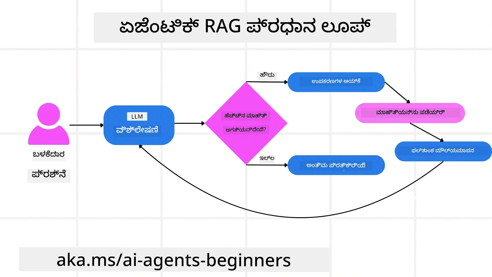
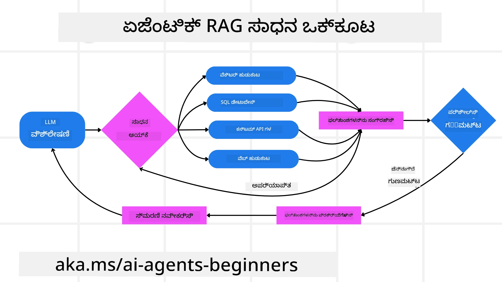
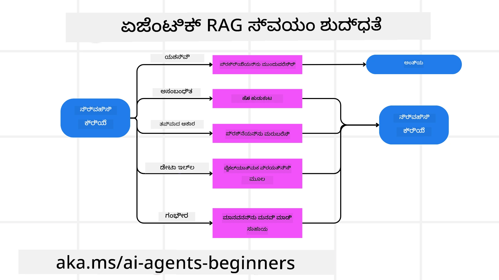
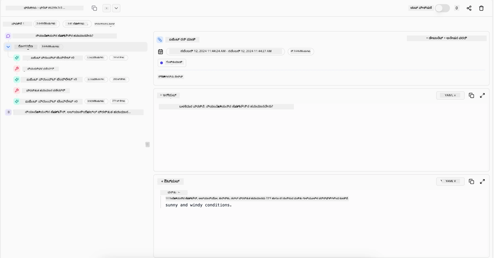

> _(ಈ ಪಾಠದ ವೀಡಿಯೊ ವೀಕ್ಷಿಸಲು ಮുകളಿನ ಚಿತ್ರವನ್ನು ಕ್ಲಿಕ್ ಮಾಡಿ)_

# ಏಜೆಂಟಿಕ್ RAG

ಈ ಪಾಠವು ಏಜೆಂಟಿಕ್ ರಿಟ್ರೀವಲ್-ಆಗ್ಮೆಂಟೆಡ್ ಜನರೇಶನ್ (Agentic RAG) ಯ ವಿಶ್ಲೇಷಣಾತ್ಮಕ ಅವಲೋಕನವನ್ನು ನೀಡುತ್ತದೆ, ಇದು ಉದಯೋನ್ಮುಖ AI ಪರಿಕಲ್ಪನೆ ಆಗಿದ್ದು, ಇಲ್ಲಿ ದೊಡ್ಡ ಭಾಷಾ ಮಾದರಿಗಳು (LLMs) ಸ್ವತಂತ್ರವಾಗಿ ಮುಂದಿನ ಹಂತಗಳನ್ನು ಯೋಜಿಸುತ್ತವೆ ಹಾಗೂ ಬಾಹ್ಯ ಮೂಲಗಳಿಂದ ಮಾಹಿತಿ ಪಡೆದೇಕು. ಸ್ಥಿರ ರಿಟ್ರೀವಲ್-ನಂತರ ಓದಲು ಮಾದರಿಗಳ ಭೇದವಾಗಿ, ಏಜೆಂಟಿಕ್ RAG LLM ಗೆ ಪುನರಾವರ್ತಿತ ಕರೆಗಳನ್ನು ಒಳಗೊಂಡಿರುತ್ತದೆ, ಉಪಕರಣ ಅಥವಾ ಕಾರ್ಯ ಕರೆಗಳ ಜೊತೆಗೆ ರಚನಾತ್ಮಕ ಔಟ್‌ಪುಟ್‍ಗಳು ಇರುತ್ತವೆ. ವ್ಯವಸ್ಥೆ ಫಲಿತಾಂಶಗಳನ್ನು ಮೌಲ್ಯಮಾಪನ ಮಾಡುತ್ತದೆ, ಪ್ರಶ್ನೆಗಳನ್ನು ಶುದ್ದೀಕರಿಸುತ್ತದೆ, ಅಗತ್ಯವಿದ್ದರೆ ಹೆಚ್ಚುವರಿ ಉಪಕರಣಗಳನ್ನು ಕರೆದು, ತೃಪ್ತಿಕರ ಪರಿಹಾರ ಪ್ರಾಪ್ತಿಯಾಗುವವರೆಗೂ ಈ ಚಕ್ರವನ್ನು ಮುಂದುವರೆಸುತ್ತದೆ.

## ಪರಿಚಯ

ಈ ಪಾಠದಲ್ಲಿ ನೀವು:

- **ಏಜೆಂಟಿಕ್ RAG ಅನ್ನು ಅರ್ಥಮಾಡಿಕೊಳ್ಳಿ:** ದೊಡ್ಡ ಭಾಷಾ ಮಾದರಿಗಳು (LLMs) ಸ್ವತಂತ್ರವಾಗಿ ಮುಂದಿನ ಹಂತಗಳನ್ನು ಯೋಜಿಸುವ ಮತ್ತು ಬಾಹ್ಯ ಡೇಟಾ ಮೂಲಗಳಿಂದ ಮಾಹಿತಿ ಪಡೆಯುವ ಉದಯೋನ್ಮುಖ AI ಪರಿಕಲ್ಪನೆ ಕುರಿತು ತಿಳಿಯಿರಿ.
- **ಪುನರಾವರ್ತಿತ ಮೆಕರ್-ಚೆಕ್ಕರ್ ಶೈಲಿಯನ್ನು ಗ್ರಹಿಸಿ:** LLM ಗೆ ಪುನರಾವರ್ತಿತ ಕರೆಗಳ ಚಕ್ರವನ್ನು, ಉಪಕರಣ ಅಥವಾ ಕಾರ್ಯ ಕರೆಗಳು ಮತ್ತು ರಚನಾತ್ಮಕ ಔಟ್‌ಪುಟ್‍ಗಳ ಜೊತೆಗೆ ಆಯಿತುಮಾಡುವುದು, ಒಂದು ಬೆರಗು ಮತ್ತು ತಪ್ಪು ರೂಪದ ಪ್ರಶ್ನೆಗಳನ್ನು ಸರಿಪಡಿಸುವ ಪ್ರಕ್ರಿಯೆ ಎಂದು ತಿಳಿಯಿರಿ.
- **ಪ್ರಾಯೋಗಿಕ ಆಯೋಜನೆಗಳನ್ನು ಅನ್ವೇಷಿಸಿ:** ಏಜೆಂಟಿಕ್ RAG ಎಲ್ಲಿ ಪರಿಣಾಮಕಾರಿಯಾಗಿ ಕೆಲಸ ಮಾಡುತ್ತದೆ, ಉದಾಹರಣೆಗೆ ಸರಿಯಾದತೆ-ಪ್ರಥಮ ಪರಿಸರಗಳು, ಸಂಕೀರ್ಣ ಡೇಟಾಬೇಸ್ ಸಂವಹನಗಳು, ದೀರ ಘಟನೆ ಕೆಲಸಗಳು.

## ಕಲಿಕೆಯ ಗುರಿಗಳು

ಈ ಪಾಠವನ್ನು ಪೂರ್ಣಗೊಳಿಸಿದ ನಂತರ ನೀವು ಹೇಗೆ/ಏನು ತಿಳಿದುಕೊಳ್ಳುತ್ತೀರಿ:

- **ಏಜೆಂಟಿಕ್ RAG ಅನ್ನು ಅರ್ಥಮಾಡಿಕೊಳ್ಳುವುದು:** ದೊಡ್ಡ ಭಾಷಾ ಮಾದರಿಗಳು (LLMs) ಸ್ವತಂತ್ರವಾಗಿ ಮುಂದಿನ ಹಂತಗಳನ್ನು ಯೋಜಿಸುವ ಮತ್ತು ಬಾಹ್ಯ ಮೂಲಗಳಿಂದ ಮಾಹಿತಿ ಪಡೆಯುವ ಉದಯೋನ್ಮುಖ AI ಪರಿಕಲ್ಪನೆ ತಿಳಿಯುವುದು.
- **ಪುನರಾವರ್ತಿತ ಮೆಕರ್-ಚೆಕ್ಕರ್ ಶೈಲಿ:** LLM ಗೆ ಪುನರಾವರ್ತಿತ ಕರೆಗಳ ಚಕ್ರ, ಉಪಕರಣ ಅಥವಾ ಕಾರ್ಯ ಕರೆಗಳು ಮತ್ತು ರಚನಾತ್ಮಕ ಔಟ್‌ಪುಟ್‍ಗಳು ಸಹಿತ, ಸರಿಹೊಂದಿಸುವಿಕೆಯನ್ನು ಉತ್ತಮಗೊಳಿಸಲು ಮತ್ತು ತಪ್ಪಾದ ಪ್ರಶ್ನೆಗಳನ್ನು ನಿರ್ವಹಿಸಲು ಬಳಸಲಾಗುವ ಪ್ರಕ್ರಿಯೆ ಅರ್ಥಮಾಡಿಕೊಳ್ಳಿ.
- **ತರ್ಕ ಪ್ರಕ್ರಿಯೆಯ ಮಾಲೀಕತ್ವ:** ಸಮಸ್ಯೆಗಳ ನಿಭಾಯಿಕೆಯ ವಿಧಾನವನ್ನು ಸ್ವತಂತ್ರವಾಗಿ ನಿರ್ಧರಿಸುವ ವ್ಯವಸ್ಥೆಯ ಸಾಮರ್ಥ್ಯವನ್ನು ಅರ್ಥಮಾಡಿಕೊಳ್ಳಿ, ಹಿಂದಿನ ನಿರ್ಧಿಷ್ಟ ಮಾರ್ಗಗಳಿಗೆ ಅವಲಂಬಿಸದೆ.
- **ವರ್ಕ್‌ಫ್ಲೋ:** ಏಜೆಂಟಿಕ್ ಮಾದರಿ ಸ್ವತಂತ್ರವಾಗಿ ಮಾರುಕಟ್ಟೆ ಪ್ರವರ್ತನೆ ವರದಿಗಳನ್ನು ಹುಡುಕುವುದು, ಸ್ಪರ್ಧಾತ್ಮಕ ಡೇಟಾವನ್ನು ಗುರುತಿಸುವುದು, ಆಂತರಿಕ ಮಾರಾಟ ಮೌಲ್ಯಗಳನ್ನು ಹೊಂದಾಣಿಕೆ ಮಾಡುವುದು, ಸಂಶ್ಲೇಷಿಸಿ ತಂತ್ರವನ್ನು ಅಸುಸ್ಥಿತಿಯಿಂದ ಮೌಲ್ಯಮಾಪನ ಮಾಡುವುದು ಹೇಗೆ ಎಂದರಿತುಕೊಳ್ಳಿ.
- **ಪುನರಾವರ್ತಿತ ಲೂಪ್ಗಳು, ಉಪಕರಣ ಸಂಯೋಜನೆ ಮತ್ತು ಸ್ಮೃತಿ:** ಲೂಪು ಸಂವಹನ ಮಾದರಿಯನ್ನು ಅವಲಂಬಿಸುವ ವ್ಯವಸ್ಥೆಯ ಬಗ್ಗೆ ತಿಳಿಯಿರಿ, ಹಂತಗಳ ನಡುವೆ ಸ್ಥಿತಿ ಮತ್ತು ಸ್ಮೃತಿಯನ್ನು ಉಳಿಸಿ, ಪುನರಾವರ್ತಿತ ಲೂಪ್ಗಳನ್ನು ತಪ್ಪಿಸಿ ಮತ್ತು ಸುಜ್ಞಾನಭರಿತ ನಿರ್ಧಾರಗಳನ್ನು ಕೈಗೊಂಡು.
- **ದೋಷಗಳು ಮತ್ತು ಆತ್ಮ-ಶುದ್ಧಿಕೆ ನಿರ್ವಹಣೆ:** ಪುನರಾವರ್ತಿತ ಹುಡುಕಾಟ, ತಪಾಸನಾ ಉಪಕರಣಗಳ ಬಳಕೆ, ಮಾನವ ಮೇಲ್ವಿಚಾರಣೆಗೆ ಮೊರೆಬಿಡುವ ಸ್ಥಿರ ಆತ್ಮ-ಶುದ್ಧಿಕರಣ ವಿಧಾನಗಳ ಬಗ್ಗೆ ತಿಳಿಯಿರಿ.
- **ಏಜೆನ್ಸಿಯ ಗಡಿಗಳು:** ಏಜೆಂಟಿಕ್ RAG ನ ಮಿತಿಗಳನ್ನು ಅರ್ಥಮಾಡಿಕೊಳ್ಳಿ, ಕ್ಷೇತ್ರ-ವಿಶೇಷ ಸ್ವಾಯತ್ತತೆ, ಮೂಲ ಸೌಕರ್ಯ ಅವಲಂಬನೆ ಮತ್ತು ಸುರಕ್ಷತಾ ಮಾರ್ಗಸೂಚಿಗಳ ಗೌರವ.
- **ಪ್ರಾಯೋಗಿಕ ಬಳಕೆ ಮತ್ತು ಮೌಲ್ಯ:** ಏಜೆಂಟಿಕ್ RAG ಎಲ್ಲಿ ಪರಿಣಾಮಕಾರಿ ಎಂಬುದನ್ನು ಗುರುತಿಸಿ, ಉದಾಹರಣೆಗೆ ಸರಿಯಾದತೆ-ಪ್ರಥಮ ಪರಿಸರಗಳು, ಸಂಕೀರ್ಣ ಡೇಟಾಬೇಸ್ ಸಂವಹನಗಳು, ದೀರ ಘಟನೆ ಕೆಲಸಗಳು.
- **ಶಾಸನ, ಪಾರದರ್ಶಕತೆ ಮತ್ತು ನಂಬಿಕೆ:** ವಿವರಣೆಯೋಗ್ಯ ತರ್ಕ, ಪಕ್ಷಪಾತ ನಿಯಂತ್ರಣ ಮತ್ತು ಮಾನವ ಮೇಲ್ವಿಚಾರಣೆಯ ಮಹತ್ತについて ತಿಳಿಯಿರಿ.

## ಏಜೆಂಟಿಕ್ RAG ಎಂದರೆ ಏನು?

ಏಜೆಂಟಿಕ್ ರಿಟ್ರೀವಲ್-ಆಗ್ಮೆಂಟೆಡ್ ಜನರೇಶನ್ (Agentic RAG) ಒಂದು ಉದಯೋನ್ಮುಖ AI ಪರಿಕಲ್ಪನೆ ಆಗಿದ್ದು, ಇಲ್ಲಿ ದೊಡ್ಡ ಭಾಷಾ ಮಾದರಿಗಳು (LLMs) ಸ್ವತಂತ್ರವಾಗಿ ಮುಂದಿನ ಹಂತಗಳನ್ನು ಯೋಜಿಸುತ್ತವೆ ಮತ್ತು ಬಾಹ್ಯ ಮೂಲಗಳಿಂದ ಮಾಹಿತಿ ಪಡೆಯುತ್ತವೆ. ಸ್ಥಿರ ರಿಟ್ರೀವಲ್-ನಂತರ ಓದಲು ಮಾದರಿಗಳ ಭೇದವಾಗಿ, Agentic RAG LLM ಗೆ ಪುನರಾವರ್ತಿತ ಕರೆಗಳನ್ನು ಒಳಗೊಂಡಿರುತ್ತದೆ, ಉಪಕರಣ ಅಥವಾ ಕಾರ್ಯ ಕರೆಗಳ ಜೊತೆಗೆ ರಚನಾತ್ಮಕ ಔಟ್‌ಪುಟ್‍ಗಳು ಇರುತ್ತವೆ. ವ್ಯವಸ್ಥೆ ಫಲಿತಾಂಶಗಳನ್ನು ಮೌಲ್ಯಮಾಪನ ಮಾಡುತ್ತದೆ, ಪ್ರಶ್ನೆಗಳನ್ನು ಶುದ್ದೀಕರಿಸುತ್ತದೆ, ಅಗತ್ಯವಿದ್ದರೆ ಹೆಚ್ಚುವರಿ ಉಪಕರಣಗಳನ್ನು ಕರೆದು, ತೃಪ್ತಿಕರ ಪರಿಹಾರ ಕಾಣುವವರೆಗೂ ಈ ಚಕ್ರವನ್ನು ಮುಂದುವರೆಸುತ್ತದೆ. ಈ ಪುನರಾವರ್ತಿತ “ಮೇಕರ್-ಚೆಕ್ಕರ್” ಶೈಲಿ ಸರಿಯಾದತೆ ಹೆಚ್ಚಿಸುತ್ತದೆ, ತಪ್ಪು ರೂಪದ ಪ್ರಶ್ನೆಗಳನ್ನು ನಿರ್ವಹಿಸುತ್ತದೆ ಮತ್ತು ಉನ್ನತ ಗುಣಮಟ್ಟದ ಫಲಿತಾಂಶವನ್ನು ಖಚಿತಪಡಿಸುತ್ತದೆ.

ವ್ಯವಸ್ಥೆ ತನ್ನ ತರ್ಕ ಪ್ರಕ್ರಿಯೆಯನ್ನು ಸಕ್ರಿಯವಾಗಿ ಹೊಂದಿಕೊಂಡು, ವಿಫಲವಾದ ಪ್ರಶ್ನೆಗಳನ್ನು ಮರುಬರೆದು, ವಿಭಿನ್ನ ರಿಟ್ರೀವಲ್ ವಿಧಾನಗಳನ್ನು ಆಯ್ಕೆಮಾಡಿ, ಅನೇಕ ಉಪಕರಣಗಳನ್ನು ಏಕೀಕರಿಸುತ್ತದೆ — ಉದಾ. ಏಜುರ್ AI ಸರ್ಚ್ ನಲ್ಲಿ ವೆಕ್ಟರ್ ಹುಡುಕಾಟ, SQL ಡೇಟಾಬೇಸ್ ಗಳು, ಅಥವಾ ಕಸ್ಟಮ್ APIs — ಇದರ ಉತ್ತರವನ್ನು ಅಂತಿಮಗೊಳಿಸುವ ಮೊದಲು. ಏಜೆಂಟಿಕ್ ವ್ಯವಸ್ಥೆಯ ವಿಭಿನ್ನ ಗುಣವೆಂದರೆ ಅದು ತನ್ನ ತರ್ಕ ಪ್ರಕ್ರಿಯೆಯನ್ನು ಸ್ವತಂತ್ರವಾಗಿ ಹೊಂದಿಕೊಳ್ಳುವ ಸಾಮರ್ಥ್ಯ. ಸಾಂಪ್ರದಾಯಿಕ RAG ಅನುಷ್ಠಾನಗಳು ನಿರ್ಧಿಷ್ಟ ಮಾರ್ಗಗಳ ಮೇಲೆ ಅವಲಂಬಿಸಿರುವುದಾದರೆ, ಏಜೆಂಟಿಕ್ ವ್ಯವಸ್ಥೆ ಮಾಹಿತಿಯ ಗುಣಮಟ್ಟದ ಆಧಾರದ ಮೇಲೆ ಹಂತಗಳ ಕ್ರಮವನ್ನು ಸ್ವಯಂಚಾಲಿತವಾಗಿ ನಿರ್ಧರಿಸುತ್ತದೆ.

## ಏಜೆಂಟಿಕ್ ರಿಟ್ರೀವಲ್-ಆಗ್ಮೆಂಟೆಡ್ ಜನರೇಶನ್ (Agentic RAG) ವಿನ್ಯಾಸ

ಏಜೆಂಟಿಕ್ ರಿಟ್ರೀವಲ್-ಆಗ್ಮೆಂಟೆಡ್ ಜನರೇಶನ್ (Agentic RAG) ಎಂದರೆ LLMs ಗಳು ಬಾಹ್ಯ ಡೇಟಾ ಮೂಲಗಳಿಂದ ಮಾಹಿತಿ ಪಡೆದುಕೊಳ್ಳುವುದರ ಜೊತೆಗೆ ತನ್ನ ಮುಂದಿನ ಹಂತಗಳನ್ನು ಸ್ವತಂತ್ರವಾಗಿ ಯೋಜಿಸುವ AI ಅಭಿವೃದ್ಧಿಯ ಉದಯೋನ್ಮುಖ ಪರಿಕಲ್ಪನೆ. ಸ್ಥಿರ ರಿಟ್ರೀವಲ್-ನಂತರ ಓದುವ ಮಾದರಿಗಳ ಅಥವಾ ಸಾಟಿಯಾದ_PROMPT ಸರಣಿಗಳ ಬದಲಾಗಿ, Agentic RAG LLM ಗೆ ಪುನರಾವರ್ತಿತ ಕರೆಗಳ ಚಕ್ರವನ್ನು ಒಳಗೊಂಡಿರುತ್ತದೆ, ಉಪಕರಣ ಅಥವಾ ಕಾರ್ಯ ಕರೆಗಳ ಜೊತೆಗೆ ರಚನಾತ್ಮಕ ಔಟ್‌ಪುಟ್‌ಗಳೊಂದಿಗೆ. ಪ್ರತಿ ಹಂತದಲ್ಲಿ, ವ್ಯವಸ್ಥೆ ಪಡೆದ ಫಲಿತಾಂಶಗಳನ್ನು ಮೌಲ್ಯಮಾಪನ ಮಾಡಿ, ಪ್ರಶ್ನೆಗಳನ್ನು ಶುದ್ಧೀಕರಿಸಬೇಕಾಗಿದೆಯೋ ಎಂಬುದನ್ನು ನಿರ್ಧರಿಸಿ, ಅಗತ್ಯವಿದ್ದರೆ ಹೆಚ್ಚುವರಿ ಉಪಕರಣಗಳನ್ನು ಕರೆದು, ತೃಪ್ತಿಕರ ಪರಿಹಾರ ಸಿಗುವವರೆಗೂ ಚಕ್ರವನ್ನು ಮುಂದುವರೆಸುತ್ತದೆ.

ಈ ಪುನರಾವರ್ತಿತ “ಮೇಕರ್-ಚೆಕ್ಕರ್” ಕಾರ್ಯಪದ್ಧತಿ ಶುದ್ದತೆಯನ್ನು ಸುಧಾರಿಸಲು, ರಚನೆಯಾದ ಡೇಟಾಬೇಸ್ಗಳಿಗೆ ತಪ್ಪಾದ ಪ್ರಶ್ನೆಗಳನ್ನು ನಿರ್ವಹಿಸಲು (ಉದಾಹರಣೆಗೆ NL2SQL), ಮತ್ತು ಸಮತೋಲನ ಮತ್ತು ಉನ್ನತ ಗುಣಮಟ್ಟದ ಫಲಿತಾಂಶಗಳನ್ನು ಖಚಿತಪಡಿಸಲು ರೂಪಿಸಲ್ಪಟ್ಟಿದೆ. ಎನುಕೊಂಡಂತೆ, ವಿಜ್ಞಾನಾದರ್ಶ_prompt ಸರಪಳಿ ಮೇಲೆ ಅವಲಂಬಿಸುವ ಬದಲು, ವ್ಯವಸ್ಥೆ ತನ್ನ ತರ್ಕ ಪ್ರಕ್ರಿಯೆಯನ್ನು ಸಕ್ರಿಯವಾಗಿ ಹೊಂದಿಕೊಂಡಿದೆ. ವಿಫಲವಾದ ಪ್ರಶ್ನೆಗಳನ್ನು ಮರುಬರೆದು, ವಿಭಿನ್ನ ರಿಟ್ರೀವಲ್ ವಿಧಾನಗಳನ್ನು ಆಯ್ಕೆಮಾಡಿ, ಅನೇಕ ಉಪಕರಣಗಳನ್ನು ಸೇರಿಸಿ — ಉದಾ. ಏಜುರ್ AI ಸರ್ಚ್ ನಲ್ಲಿ ವೆಕ್ಟರ್ ಹುಡುಕಾಟ, SQL ಡೇಟಾಬೇಸ್ ಗಳು, ಅಥವಾ ಕಸ್ಟಮ್ APIs — ಉತ್ತರವನ್ನು ಅಂತಿಮಗೊಳಿಸುವ ಮುನ್ನ. ಇದರಿಂದ ಅತ್ಯಂತ ಜಟಿಲ ಸಂಗುರುಹ ವ್ಯವಸ್ಥೆಗಳ ಅಗತ್ಯ ಕಡಿಮೆಯಾಗುತ್ತದೆ. ಬದಲಿಗೆ, “LLM ಕರೆ → ಉಪಕರಣ ಬಳಕೆ → LLM ಕರೆ → …” ಇಂತಹ ಸರಳವಾದ ಲೂಪ್ ಗುಣಮಟ್ಟದ ಮತ್ತು ದೃಢವಾದ ಔಟ್‌ಪುಟ್‌ಗಳನ್ನು ತರುವ ಸಾಧ್ಯತೆ ಇರುತ್ತದೆ.

## ತರ್ಕ ಪ್ರಕ್ರಿಯೆಯ ಮಾಲೀಕತ್ವ

ವ್ಯವಸ್ಥೆಯನ್ನು "ಏಜೆಂಟಿಕ್" ಮಾಡಲು ಪ್ರತ್ಯೇಕಿಸುವ ಗುಣವೆಂದರೆ ತನ್ನ ತರ್ಕ ಪ್ರಕ್ರಿಯೆಯನ್ನು ಸ್ವತಂತ್ರವಾಗಿ ಹೊಂದಿಕೊಳ್ಳುವ ಸಾಮರ್ಥ್ಯ. ಸಾಂಪ್ರದಾಯಿಕ RAG ಅನುಷ್ಠಾನಗಳು ಸಾಮಾನ್ಯವಾಗಿ ಮಾನವರಿಂದ ಮಾದರಿಗಾಗಿ ಒಂದು ಮಾರ್ಗವನ್ನು ಪೂರ್ವನಿರ್ಧರಿಸುವಿಕೆಯ ಮೇಲೆ ಅವಲಂಬಿಸುತ್ತವೆ: ಯಾವದನ್ನು ಯಾವಾಗ ಹಿಂಬಾಲಿಸುವುದೆಂದು ತಲೆಗೆ ತಲೆ ಕಟ್ಟುವ ಸರಪಳಿ.
ಆದರೆ ಒಂದು ವ್ಯವಸ್ಥೆ ನಿಜವಾದ ಏಜೆಂಟಿಕ್ ಆಗಿದ್ದರೆ, ಅದು ಒಳಗಿಂದಲೇ ಸಮಸ್ಯೆಯನ್ನು ಹೇಗೆ ನಿಭಾಯಿಸುವುದನ್ನು ನಿರ್ಧರಿಸುತ್ತದೆ. ಇದು ಕೇವಲ ಸ್ಕ್ರಿಪ್ಟ್ ಚಾಲನೆ ಅಲ್ಲ; ಇದು ಸ್ವತಂತ್ರವಾಗಿ ತನ್ನ ಹಂತಗಳ ಕ್ರಮವನ್ನು ಮಾಹಿತಿಯ ಗುಣಮಟ್ಟ ಆಧರಿಸಿ ನಿರ್ಧರಿಸುತ್ತದೆ.
ಉದಾಹರಣೆಗೆ, ಪ್ರಾಡಕ್ಟ್ ಲಾಂಚ್ ತಂತ್ರವನ್ನು ರಚಿಸಲು ಹೇಳಿದರೆ, ಅದು ಸಂಪೂರ್ಣ ಸಂಶೋಧನಾ ಮತ್ತು ನಿರ್ಧಾರ ಮಾಡಿಸುವ ಕಾರ್ಯಪ್ರವಾಹವನ್ನು ವಿವರಿಸುವ_PROMPT ಮೇಲೆ ಮಾತ್ರ ಅವಲಂಬಿಸುವುದಿಲ್ಲ. ಅದರ ಬದಲಿಗೆ, ಏಜೆಂಟಿಕ್ ಮಾದರಿ ಸ್ವತಂತ್ರವಾಗಿ ನಿರ್ಧರಿಸುತ್ತದೆ:

1. Bing ವೆಬ್ ಗ್ರೌಂಡಿಂಗ್ ಬಳಸಿ ಪ್ರಸ್ತುತ ಮಾರುಕಟ್ಟೆ ಪ್ರವರ್ತನೆ ವರದಿಗಳನ್ನು ಪಡೆದೇಳುವುದು
2. Azure AI Search ಬಳಸಿ ಸಂಬಂಧಿಸಿದ ಸ್ಪರ್ಧಾತ್ಮಕ ಡೇಟಾವನ್ನು ಗುರುತಿಸುವುದು.
3. Azure SQL ಡೇಟಾಬೇಸ್ ಬಳಸಿ ಐತಿಹಾಸಿಕ ಆಂತರಿಕ ಮಾರಾಟ ಮಿತಿಗಳನ್ನು ಹೊಂದಾಣಿಕೆ ಮಾಡುವುದು.
4. Azure OpenAI ಸೇವೆ ಮೂಲಕ ಸಂಯೋಜಿತ ತಂತ್ರವನ್ನು ಸಿಂಥೆಸಿಸ್ ಮಾಡುವುದು.
5. ತಂತ್ರ ವ್ಯತ್ಯಾಸಗಳನ್ನು ಅಥವಾ ಅಸಮಂಜಸತೆಗಳನ್ನು ಮೌಲ್ಯಮಾಪನ ಮಾಡಿ, ಅಗತ್ಯವಿದ್ದರೆ ಮತ್ತೊಮ್ಮೆ ಮಾಹಿತಿ ಹಿಂತೆಗೆದುಕೊಳ್ಳುವುದಕ್ಕೆ ಪ್ರೇರೇಪಿಸುವುದು.
ಈ ಎಲ್ಲ ಹಂತಗಳನ್ನು — ಪ್ರಶ್ನೆಗಳನ್ನು ಶುದ್ಧೀಕರಿಸುವುದು, ಮೂಲಗಳನ್ನು ಆಯ್ಕೆಮಾಡುವುದು, ಉತ್ತರದಿಂದ “ಸಂತೋಷ ಪಡುವವರೆಗೆ” ಮರುಹೊಂದಿಸುವುದು — ಮಾದರಿ ತಾನೇ ನಿರ್ಧರಿಸುತ್ತದೆ, ಮಾನವರು ಅವನ್ನು ಪೂರ್ವ-ಲೇಖಿತವಾಗಿ ರೂಪಿಸುವುದಿಲ್ಲ.

## ಪುನರಾವರ್ತಿತ ಲೂಪ್ಗಳು, ಉಪಕರಣ ಸಂಯೋಜನೆ ಮತ್ತು ಸ್ಮೃತಿ

ಏಜೆಂಟಿಕ್ ವ್ಯವಸ್ಥೆ ಒಂದು ಲೂಪಿನ ಸಂವಹನ ಮಾದರಿಯನ್ನು ಅವಲಂಬಿಸಿದೆ:

- **ಪ್ರಾರಂಭಿಕ ಕರೆ:** ಬಳಕೆದಾರನ ಗುರಿ (ಅಥವಾ ಬಳಕೆದಾರ_PROMPT) LLM ಗೆ ಪ್ರಸ್ತುತಪಡಿಸಲಾಗುತ್ತದೆ.
- **ಉಪಕರಣ ಕರೆ:** ಮಾದರಿ ಅಪರ್ಯಾಯ ಮಾಹಿತಿಯನ್ನು ಕಂಡುಕೊಳ್ಳದಿದ್ದರೆ ಅಥವಾ ಅಸ್ಪಷ್ಟ ಸೂಚನೆಗಳು ಇದ್ದರೆ, ಅದು ಉಪಕರಣ ಅಥವಾ ರಿಟ್ರೀವಲ್ ವಿಧಾನವನ್ನು ಆಯ್ಕೆ ಮಾಡುತ್ತದೆ — ಉದಾ. ವೆಕ್ಟರ್ ಡೇಟಾಬೇಸ್ ಪ್ರಶ್ನೆ (ಹೆಚ್ಚಾಗಿ ಏಜುರ್ AI ಸರ್ಚ್ ಹೈಬ್ರಿಡ್ ಹುಡುಕಾಟ ಖಾಸಗಿ ಡೇಟಾದ ಮೇಲೆ) ಅಥವಾ ಸಂರಚಿತ SQL ಕರೆ — ಹೆಚ್ಚಿನ ಸಾಂಧರ್ಭ ಪಡೆಯಲು.
- **ಮೌಲ್ಯಮಾಪನ ಮತ್ತು ಶುದ್ಧೀಕರಣ:** ಹಿಂತಿರುಗಿದ ಡೇಟಾವನ್ನು ಪರಿಶೀಲಿಸಿ, ವಿಷಯ ಸಾಕಾಗಿದೆಯೇ ಎಂಬುದನ್ನು ನಿರ್ಧರಿಸುತ್ತದೆ. ಇಲ್ವಪ್ಪ, ಪ್ರಶ್ನೆಯನ್ನು ಮರುಹೊಂದಿಸಿ, ಬೇರೆ ಉಪಕರಣವನ್ನು ಪ್ರಯತ್ನಿಸಿ ಅಥವಾ ತನ್ನ ಬೆಳವಣಿಗೆಯನ್ನು ಸರಿಹೊಂದಿಸುತ್ತದೆ.
- **ತೃಪ್ತಿಕರವಾಗಿ ಮುಂದುವರಿಯಿರಿ:** ಮಾದರಿ ಕಚಗುಳಿ, ಸಾಕಷ್ಟು ಸ್ಪಷ್ಟತೆ ಮತ್ತು ಸಾಕ್ಷ್ಯಗಳನ್ನು ಪಡೆದಿರುವ ತನಕ ಈ ಚಕ್ರವನ್ನು ಮುಂದುವರೆಸುತ್ತದೆ.
- **ಸ್ಮೃತಿ ಮತ್ತು ಸ್ಥಿತಿ:** ವ್ಯವಸ್ಥೆ ಹಂತಗಳ ನಡುವೆ ಸ್ಥಿತಿಯನ್ನು ಮತ್ತು ಸ್ಮೃತಿಯನ್ನು ಕಾಪಾಡಿಕೊಳ್ಳುತ್ತದೆ, ಹಿಂದೆ ಪ್ರಯತ್ನಿಸಿದ ಕೆಲಸಗಳು ಮತ್ತು ಫಲಿತಾಂಶಗಳನ್ನು ನೆನಪಿರಿಸಿಕೊಂಡು ಪುನರಾವರ್ತಿತ ಲೂಪ್ಗಳನ್ನು ತಪ್ಪಿಸಿ ಜ್ಞಾನಭರಿತ ನಿರ್ಧಾರಗಳನ್ನು ತೆಗೆದುಕೊಳ್ಳುತ್ತದೆ.

ಕಾಲಕಾಲಕ್ಕೆ, ಇದು ಅಭಿವೃದ್ಧಿಯಾದ ಅರ್ಥೈಸುವಿಕೆಗೆ ಕಾರಣವಾಗುತ್ತದೆ, ಇದು ಮಾನವರ ನಿರಂತರ ಹಸ್ತಕ್ಷೇಪ ಅಥವಾ_PROMPT ಮರುರೂಪಣೆಯ ಅಗತ್ಯವಿಲ್ಲാതെ ಸಂಕೀರ್ಣ, ಬಹುಹಂತದ ಕಾರ್ಯಗಳನ್ನು ನಿರ್ವಹಿಸಲು ಮಾದರಿಯನ್ನು ಸಾಮರ್ಥ್ಯವುಳ್ಳಂತೆ ಮಾಡುತ್ತದೆ.

## ದೋಷ ಸ್ಥಿತಿಗಳನ್ನು ನಿರ್ವಹಣೆ ಮತ್ತು ಆತ್ಮ-ತಿದ್ದುಪಡಿ

ಏಜೆಂಟಿಕ್ RAG ನ ಸ್ವಾಯತ್ತತೆ ಶಕ್ತಿಶಾಲಿ ಆತ್ಮ-ತಿದ್ದುಪಡಿ ವಿಧಾನಗಳನ್ನು ಒಳಗೊಂಡಿದೆ. ವ್ಯವಸ್ಥೆ ತೆರವು ಬದಿಗೆ ತಲುಪಿದಾಗ — ಉದಾ. ಸಂಬಂಧವಿಲ್ಲದ ದಸ್ತಾವೇಜುಗಳನ್ನು ತಲುಪಿದಾಗ ಅಥವಾ ತಪ್ಪಾದ ಪ್ರಶ್ನೆಗಳನ್ನು ಎದುರಿಸಿದಾಗ — ಅದು:

- **ಪುನರಾವರ್ತಿಸಿ ಮತ್ತು ಮರುಪ್ರಶ್ನೆ ಕೇಳಿ:** ಕಡಿಮೆ ಮೌಲ್ಯದ ಉತ್ತರಗಳನ್ನು ನೀಡುವುದಕ್ಕೆ ಬದಲು, ಮಾದರಿ ಹೊಸ ಹುಡುಕಾಟ ತಂತ್ರಗಳನ್ನು ಪ್ರಯತ್ನಿಸುತ್ತದೆ, ಡೇಟಾಬೇಸ್ ಪ್ರಶ್ನೆಗಳನ್ನು ಮರುಬರೆದು ಅಥವಾ ಬದಲಿ ಡೇಟಾ ಸೆಟ್‌ಗಳನ್ನು ನೋಡುತ್ತದೆ.
- **ನಿರೀಕ್ಷಣಾ ಉಪಕರಣಗಳ ಬಳಕೆ:** ತರ್ಕದ ಹಂತಗಳನ್ನು ಡಿಬಗ್ ಮಾಡಲು ಸಹಾಯ ಮಾಡುವ ಅಥವಾ ಪಡೆದ ಮಾಹಿತಿಯ ಸರಿಯಾದತೆ ದೃಢಪಡಿಸುವ ಹೆಚ್ಚುವರಿ ಕಾರ್ಯಗಳನ್ನು ಉದ್ಧರಿಸಬಹುದು. Azure AI Tracing ಮುಂತಾದ ಉಪಕರಣಗಳು ಶಕ್ತಿಶಾಲಿ ಗಮನಾರ್ಹತೆ ಮತ್ತು ನಿಗಾವಳಿಗೆ ಸಹಾಯ ಮಾಡಲಿವೆ.
- **ಮಾನವ ಮೇಲ್ವಿಚಾರಣೆಗೆ ಹಿಂತಿರುಗಿ:** ಅವಲೋಕನ ಅಥವಾ ಪುನರಾವರ್ತಿತ ವಿಫಲತೆಗಳಂತಹ ಆಪತ್ತುಗಳಲ್ಲಿ, ಮಾದರಿ ಅನುಮಾನವನ್ನು ಗುರುತಿಸಿ ಮಾನವ ಮಾರ್ಗದರ್ಶನವನ್ನು ಕೇಳಬಹುದು. ಮಾನವನು ಸರಿಪಡಿಸುವ ಪ್ರತಿಕ್ರಿಯೆ ನೀಡಿದ ನಂತರ, ಮಾದರಿ ಮುಂದಿನ ಬಾರಿ ಅದನ್ನು ಮುಂದುವರೆಸಬಹುದು.

ಈ ಪುನರಾವರ್ತಿತ ಮತ್ತು ಚಲನವಲನ ರೀತಿಯಲ್ಲಿ ಮಾದರಿ ನಿರಂತರವಾಗಿ ಸುಧಾರಿಸಿಕೊಂಡು ಹೋಗಲು ಸಾಧ್ಯ, ಇದು ಕೇವಲ ಒಂದು ಬಾರಿ ಕಾರ್ಯಾಚರಣೆ ಮಾಡುವ ವ್ಯವಸ್ಥೆಯಾಗದೆ, ಒಂದು ಕಲಿಯುವ ವ್ಯವಸ್ಥೆಯಾಗುತ್ತದೆ.

## ಏಜೆನ್ಸಿಯ ಗಡಿಗಳು

ಕಾರ್ಯಗಳ ಸ್ವಾಯತ್ತತೆಯಿದ್ದರೂ, ಏಜೆಂಟಿಕ್ RAG ಧಾರ್ಮಿಕ ಸಾಮಾನ್ಯ ಬುದ್ಧಿವಂತಿಕೆಯ ಹಾಗಿಲ್ಲ. ಇದರ "ಏಜೆಂಟಿಕ್" ಸಾಮರ್ಥ್ಯಗಳು ಮಾನವ ಅಭಿವೃದ್ಧಿಪಡಿಸಿದ ಉಪಕರಣಗಳು, ಡೇಟಾ ಮೂಲಗಳು ಮತ್ತು ನೀತಿಗಳ ಒಳಗೆ ಸೀಮಿತವಾಗಿವೆ. ಇದು ತನ್ನ ಸ್ವಂತ ಉಪಕರಣಗಳನ್ನು ಆವಿಷ್ಕರಿಸಲು ಅಥವಾ ಕೋಷ್ಟಕ ಮೀರಿದ ಪ್ರದೇಶಗಳಲ್ಲಿ ನಡೆದುಕೊಳ್ಳಲು ಸಾಧ್ಯವಿಲ್ಲ. ಬದಲಾಗಿ, ಇದು ಇದ್ದ ಸಂಪನ್ಮೂಲಗಳನ್ನು ಚುರುಕಾಗಿ ನಿರ್ವಹಿಸಲು ಅರ್ಹವಿದೆ.
ಮುಖ್ಯವಾಗಿ ಇತರ ಉನ್ನತ AI ರೂಪಗಳಿಗಿಂತ ಈ ಭೇದಗಳು ಇವೆ:

1. **ಕ್ಷೇತ್ರ-ವಿಶೇಷ ಸ್ವಾಯತ್ತತೆ:** ಏಜೆಂಟಿಕ್ RAG ವ್ಯವಸ್ಥೆಗಳು ಪ್ರಶಕ್ತಗೊಳಿಸಿದ ಗುರಿಗಳನ್ನು ನಿರ್ಧಿಷ್ಟ ಕ್ಷೇತ್ರದ ಒಳಗೆ ಸಾಧಿಸುವುದರಲ್ಲಿ ಗಮನ ನೀಡುತ್ತವೆ, ಪ್ರಕ್ರಿಯೆಗಳ ಉದಾಹರಣೆ: ಪ್ರಶ್ನೆ ಮರುಬರೆಯುವುದು ಅಥವಾ ಉಪಕರಣ ಆಯ್ಕೆಮಾಡುವುದು ಉತ್ತಮ ಫಲಿತಾಂಶಗಳಿಗಾಗಿ.
2. **ಮೂಲಸೌಕರ್ಯ ಅವಲಂಬಿತ:** ವ್ಯವಸ್ಥೆಯ ಸಾಮರ್ಥ್ಯಗಳು ಅಭಿವೃದ್ಧಿಪಡಿಸಿರುವ ಉಪಕರಣಗಳು ಮತ್ತು ಡೇಟಾ ಸಂಯೋಜನೆಯ ಮೇಲೆ ಅವಲಂಬಿತವಾಗಿವೆ. ಮಾನವ ಹಸ್ತಕ್ಷೇಪವಿಲ್ಲದೆ ಈ ಸೀಮಿತಗಳನ್ನು ಮೀರಲು ಸಾಧ್ಯವಿಲ್ಲ.
3. **ಸುರಕ್ಷತಾ ಮಾರ್ಗಸೂಚಿಗಳ ಗೌರವ:** ನೈತಿಕ ಮಾರ್ಗಸೂಚಿಗಳು, ಅನುಪಾಲನಾ ನಿಯಮಗಳು ಮತ್ತು ವ್ಯಾಪಾರ ನೀತಿಗಳು ತುಂಬಾ ಮಹತ್ವದವು. ಏಜೆಂಟು ವಿಮರ್ಶೆಯ ಮುನ್ನಡೆಯುವಿಕೆಯು ಸದಾ ಸುರಕ್ಷತಾ ಕ್ರಮಗಳು ಮತ್ತು ಮೇಲ್ವಿಚಾರಣಾ ವಿಧಾನಗಳಿಂದ ನಿಯಂತ್ರಿತವಾಗಿದೆ (ನಂಬಿಕೆ ಇಟ್ಟೇವೆ?)

## ಪ್ರಾಯೋಗಿಕ ಬಳಕೆ ಮತ್ತು ಮೌಲ್ಯ

ಏಜೆಂಟಿಕ್ RAG ಪುನರಾವರ್ತಿತ ಶುದ್ಧೀಕರಣ ಮತ್ತು ನಿಖರತೆಯ ಅಗತ್ಯವಿರುವ ಪರಿಸರಗಳಲ್ಲಿ ಬೆಳಗುತದೆ:

1. **ಸರಿಯಾದತೆ-ಪ್ರಥಮ ಪರಿಸರಗಳು:** ಅನುಪಾಲನಾ ಪರಿಶೀಲನೆಗಳು, ನಿಯಂತ್ರಣ ವಿಶ್ಲೇಷಣೆಗಳು ಅಥವಾ ಕಾನೂನು ಸಂಶೋಧನೆಗಳಲ್ಲಿ, ಏಜೆಂಟಿಕ್ ಮಾದರಿ ಸತ್ಯದ ಪರಿಶೀಲನೆ ನಡೆಸಬಹುದು, ಹಲವು ಮೂಲಗಳನ್ನು ಪರಾಮರ್ಶಿಸಬಹುದು ಮತ್ತು ಪ್ರಶ್ನೆಗಳನ್ನು ಮರುಬರೆದು ಸಮಗ್ರವಾಗಿ ಪರಿಶೀಲಿಸಿದ ಉತ್ತರವನ್ನು ಕೊಡಬಹುದು.
2. **ಸಂಕೀರ್ಣ ಡೇಟಾಬೇಸ್ ಸಂವಹನಗಳು:** ಬಿಡಿ ಪರೀಕ್ಷೆಗಳ ಅಥವಾ ಸರಿಪಡಿಸುವ ಅಗತ್ಯವಿರುವ ರಚನಾತ್ಮಕ ಡೇಟಾದ ಸಂಗತಿಗಳಲ್ಲಿ, ವ್ಯವಸ್ಥೆ ಸ್ವತಂತ್ರವಾಗಿ ತನ್ನ ಪ್ರಶ್ನೆಗಳನ್ನು ಮರುಹೊಂದಿಸಿ Azure SQL ಅಥವಾ Microsoft Fabric OneLake ದೊರೆತಿರುವ ಉತ್ತರವು ಬಳಕೆದಾರನ ಉದ್ದೇಶಕ್ಕೆ ಹೊಂದಿಕೆಯಾಗುವಂತೆ ನೋಡಿಕೊಳ್ಳುತ್ತದೆ.
3. **ದೀರ್ಘಾವಧಿ ಕಾರ್ಯಪ್ರವಾಹಗಳು:** ದೀರ್ಘಕಾಲ ಚಲಿಸುವ ಅಧಿವೇಶನಗಳು ಹೊಸ ಮಾಹಿತಿಯನ್ನು ಒಳಗೊಂಡಂತೆ ಬೆಳೆಯಬಹುದು. ಏಜೆಂಟಿಕ್ RAG ಪರಿಣಾಮಕಾರಿಯಾಗಿ ಹೊಸ ಡೇಟಾವನ್ನು ನಿರಂತರವಾಗಿ ಸೆರೆಹಿಡಿದು, ಸಮಸ್ಯಾ ಪ್ರದೇಶದ ಕುರಿತು ತಿಳಿದಂತೆ ತಂತ್ರಗಳನ್ನು ಬದಲಾಯಿಸುತ್ತದೆ.

## ಶಾಸನ, ಪಾರದರ್ಶಕತೆ ಮತ್ತು ನಂಬಿಕೆ

ಈ ವ್ಯವಸ್ಥೆಗಳು ತಮ್ಮ ತರ್ಕದಲ್ಲಿ ಹೆಚ್ಚು ಸ್ವಾಯತ್ತತೆ ಪಡೆಯುತ್ತಾ ಇದ್ದಂತೆ, ಶಾಸನ ಮತ್ತು ಪಾರದರ್ಶಕತೆ ಅತ್ಯಂತ ಅವಶ್ಯಕ:

- **ವಿವರಣೆ ಮಾಡಿ ತರ್ಕ:** ಮಾದರಿ ಮಾಡಿದ ಪ್ರಶ್ನೆಗಳ ಲೆಕ್ಕಾಚಾರ, ಪರಿಶೀಲಿಸಿದ ಮೂಲಗಳು, ಹಾಗೂ ನಿರ್ಧಾರ ಹಂತಗಳ ವಿವರಗಳನ್ನು ಒದಗಿಸಬಹುದು. Azure AI Content Safety ಮತ್ತು Azure AI Tracing / GenAIOps ಮುಂತಾದ ಉಪಕರಣಗಳು ಪಾರದರ್ಶಕತೆಯ ನಿರ್ವಹಣೆಗೆ ಮತ್ತು ಅಪಾಯಗಳನ್ನು ಹತೋಟಿಗೆ ತಂದಂತಕ್ಕೆ ನೆರವು ನೀಡುತ್ತವೆ.
- **ಪಕ್ಷಪಾತ ನಿಯಂತ್ರಣ ಮತ್ತು ತೂಕದಿತ ರಿಟ್ರೀವಲ್:** ಬೆಳವಣಿಗೆಯಲ್ಲಿ ಸಮತೋಲನ, ಪ್ರತಿನಿಧಿಸಬಹುದಾದ ಡೇಟಾ ಮೂಲಗಳನ್ನು ಪರಿಗಣಿಸಲು ವಿನ್ಯಾಸಿಸಲ್ಪಟ್ಟ ರಿಟ್ರೀವಲ್ ತಂತ್ರಗಳನ್ನು ಡೆವಲಪರ್‌ಗಳು ಹೊಂದಿಸಬಹುದು ಮತ್ತು ನಿಯಮಿತವಾಗಿ ಔಟ್‌ಪುಟ್ ವನ್ನು ಪರಿಶೀಲಿಸಿ Azure Machine Learning ಉಪಯೋಗಿಸುವ ಮುಂದಿನ ಮಟ್ಟದ ಡೇಟಾ ವಿಜ್ಞಾನ ಸಂಸ್ಥೆಗಳಿಗಾಗಿ ಕಸ್ಟಮ್ ಮಾದರಿಗಳ ಸಹಾಯದಿಂದ ಪಕ್ಷಪಾತ ಅಥವಾ ಸಪಾಟಕ ರೇಖೆಗಳ ಪತ್ತೆ ಮಾಡಬಹುದು.
- **ಮಾನವ ಮೇಲ್ವಿಚಾರಣೆ ಮತ್ತು ಅನುಪಾಲನೆ:** ಸಂವೇದನಶೀಲ ಕಾರ್ಯಗಳಿಗೆ, ಮಾನವ ಪರಿಶೀಲನೆ ಮುಖ್ಯ. ಏಜೆಂಟಿಕ್ RAG ಮಾನವ ನಿರ್ಣಯವನ್ನು ಬದಲಿಸುವುದಿಲ್ಲ—ಬದಲಾಗಿ ಅದನ್ನು ಬಹುಮಟ್ಟಿಗೆ ದೃಢಪಡಿಸುವ ಆಯ್ಕೆಗಳನ್ನು ಒದಗಿಸುತ್ತದೆ.

ಕ್ರಮಗಳನ್ನು ಸ್ಪಷ್ಟ ದಾಖಲಾತಿ ನೀಡುವ ಉಪಕರಣಗಳನ್ನು ಹೊಂದಿರುವುದು ಅಗತ್ಯ. ಹಾಗಿಲ್ಲದಿದ್ದರೆ, ಬಹು ಹಂತ ಪ್ರಕ್ರಿಯೆಯನ್ನು ಡಿಬಗ್ ಮಾಡುವುದು ತುಂಬಾ ಕಷ್ಟ. ಕೆಳಗಿನ ಉದಾಹರಣೆ Literal AI (Chainlit ಬೆಂಬಲದ ಕಂಪನಿ) ನಿಂದ ಏಜೆಂಟ್ ಓಡಿಕೆಯಾಗಿದೆ:

## ನಿರ್ಣಯ

ಏಜೆಂಟಿಕ್ RAG AI ವ್ಯವಸ್ಥೆಗಳು ಸಂಕೀರ್ಣ, ಡೇಟಾ ತೀವ್ರ ಕಾರ್ಯಗಳನ್ನು ನಿಭಾಯಿಸುವಲ್ಲಿ ಸಹಜ ವೃದ್ಧಿಯನ್ನು ಪ್ರತಿಪಾದಿಸುತ್ತದೆ. ಒಂದು ಲೂಪಿನ ಸಂವಹನ ಮಾದರಿಯನ್ನು ಸ್ವೀಕರಿಸುತ್ತಾ, ಸ್ವತಂತ್ರವಾಗಿ ಉಪಕರಣಗಳನ್ನು ಆಯ್ಕೆಮಾಡಿ, ಪ್ರಶ್ನೆಗಳನ್ನು ತಿದ್ದಿಕೊಳ್ಳುತ್ತಾ, ಉನ್ನತ-ಗುಣಮಟ್ಟದ ಫಲಿತಾಂಶ ಪಡೆಯುವವರೆಗೂ, ವ್ಯವಸ್ಥೆ ಸ್ಥಿರ_PROMPT ಅನುಸರಿಸುವಿಕೆಯಿಂದ ಮೀರಿದ, ಹೆಚ್ಚು ಸೂಕ್ತ, ಸಂದರ್ಭ ಅರಿತ ನಿರ್ಧಾರಕಾರನಾಗಿ ಬೆಳೆದಿದೆ. ಆದರು ಮಾನವ-ನಿರ್ಧಾರಿತ ಮೂಲಸೌಕರ್ಯಗಳು ಮತ್ತು ನೈತಿಕ ಮಾರ್ಗಸೂಚಿಗಳಲ್ಲಿ ಸೀಮಿತವಾಗಿದ್ದರೂ, ಈ ಏಜೆಂಟಿಕ್ ಸಾಮರ್ಥ್ಯಗಳು ಉದ್ಯಮಗಳು ಮತ್ತು ಅಂತಿಮ ಬಳಕೆದಾರರ ಕುರಿತಾಗಿ ಸಮೃದ್ಧ, ಚಲಿಸುವ ಮತ್ತು ಬಹುಪಯೋಗಿ AI ಸಂವಹನಗಳನ್ನು ಸಾದರಪಡಿಸಲು ಸಾಧ್ಯವಾಗಿಸುತ್ತವೆ.

### ಏಜೆಂಟಿಕ್ RAG ಬಗ್ಗೆ ಇನ್ನಷ್ಟು ಪ್ರಶ್ನೆಗಳಿವೆಯೆ?

[Microsoft Foundry Discord](https://discord.com/invite/ATgtXmAS5D) ಗೆ ಸೇರಿ ಇತರೆ ಕಲಿಯುವವರನ್ನು ಭೇಟಿಯಾಗಿರಿ, ಕಾರ್ಯಾಲಯ ಸಮಯಗಳಲ್ಲಿ ಹಾಜರಾಗಿರಿ ಮತ್ತು ನಿಮ್ಮ AI ಏಜೆಂಟ್ಗಳ ಪ್ರಶ್ನೆಗಳಿಗೆ ಉತ್ತರಗಳನ್ನು ಪಡೆಯಿರಿ.

## ಹೆಚ್ಚುವರಿ ಸಂಪನ್ಮೂಲಗಳು

- <a href="https://learn.microsoft.com/training/modules/use-own-data-azure-openai" target="_blank">Azure OpenAI ಸೇವೆೊಂದಿಗೆ ರಿಟ್ರೀವಲ್ ಆಗ್ಮೆಂಟ್ ಜನರೇಶನ್ (RAG) ಅನ್ನು ಅಳವಡಿಸುವುದು: ನಿಮ್ಮದೇ ಡೇಟಾವನ್ನು Azure OpenAI ಸೇವೆಯೊಂದಿಗೆ ಹೇಗೆ ಉಪಯೋಗಿಸುವುದು ಎಂಬುದರ ಸಂಪೂರ್ಣ ಮಾರ್ಗದರ್ಶನ ಈ Microsoft Learn מוד್ಯೂಲ್‌ನಲ್ಲಿ ನೀಡಲಾಗಿದೆ</a>
- <a href="https://learn.microsoft.com/azure/ai-studio/concepts/evaluation-approach-gen-ai" target="_blank">Microsoft Foundry ಸಹಿತ ಜನರೇಟಿವ್ AI ಅಪ್ಲಿಕೇಶನ್ ಗಳ ಮೌಲ್ಯಮಾಪನ: ಜನರೇಟಿವ್ AI ಅಪ್ಲಿಕೇಶನ್ಗಳು ಮತ್ತು RAG ವಾಸ್ತುಶಿಲ್ಪಗಳ ಮೇಲೆ ಲಭ್ಯವಿರುವ ಸಾರ್ವಜನಿಕ ಡೇಟಾಸೆಟ್‌ಗಳ ಮೌಲ್ಯಮಾಪನ ಮತ್ತು ಹೋಲಿಕೆ ಬಗ್ಗೆ ಈ ಲೇಖನದಲ್ಲಿ ವಿವರಿಸಲಾಗಿದೆ</a>
- <a href="https://weaviate.io/blog/what-is-agentic-rag" target="_blank">ಏಜೆಂಟಿಕ್ RAG ಎಂದರೆ ಏನು | Weaviate</a>
- <a href="https://ragaboutit.com/agentic-rag-a-complete-guide-to-agent-based-retrieval-augmented-generation/" target="_blank">Agentic RAG: ಏಜೆಂಟ್ ಆಧಾರಿತ ರಿಟ್ರೀವಲ್ ಆಗ್ಮೆಂಟೆಡ್ ಜನರೇಶನ್ ಕುರಿತ ಸಂಪೂರ್ಣ ಮಾರ್ಗದರ್ಶಿ – ಜನರೇಶನ್ RAG ನಿಂದ ಸುದ್ದಿ</a>

- <a href="https://huggingface.co/learn/cookbook/agent_rag" target="_blank">ಏಜೆಂಟಿಕ್ RAG: ನಿಮ್ಮ RAG ಅನ್ನು ಕ್ವೇರಿ ಮರುರೂಪಣೆ ಮತ್ತು ಸ್ವಯಂ-ಕ್ವೆರಿಯೊಂದಿಗೆ ತುರಬೋಚಾರ್ಜ್ ಮಾಡಿ! Hugging Face ಓಪನ್-ಸೋರ್ಸ್ AI ಕಿಚನ್ ಪುಸ್ತಕ</a>
- <a href="https://youtu.be/aQ4yQXeB1Ss?si=2HUqBzHoeB5tR04U" target="_blank">RAG ಗೆ ಏಜೆಂಟ್‌ನ ಶ್ರೇಣಿಗಳನ್ನು ಸೇರಿಸುವುದು</a>
- <a href="https://www.youtube.com/watch?v=zeAyuLc_f3Q&t=244s" target="_blank">ಜ್ಞಾನ ಸಹಾಯಕರ ಭವಿಷ್ಯ: ಜೆರಿ ಲೀಯೂ</a>
- <a href="https://www.youtube.com/watch?v=AOSjiXP1jmQ" target="_blank">ಏಜೆಂಟಿಕ್ RAG ವ್ಯವಸ್ಥೆಗಳನ್ನು ಹೇಗೆ ನಿರ್ಮಿಸುವುದು</a>
- <a href="https://ignite.microsoft.com/sessions/BRK102?source=sessions" target="_blank">ನಿಮ್ಮ AI ಏಜೆಂಟ್‌ಗಳನ್ನು ವಿಸ್ತರಿಸಲು Microsoft Foundry Agent Service ಬಳಸುವುದು</a>

### ಅಕಾಡೆಮಿಕ್ ಪೇಪರ್‌ಗಳು

- <a href="https://arxiv.org/abs/2303.17651" target="_blank">2303.17651 Self-Refine: ಸ್ವಯಂ-ಪ್ರತಿಕ್ರಿಯೆಯೊಂದಿಗೆ ಪುನರಾವರ್ತಿತ ಸುದಾರಣೆ</a>
- <a href="https://arxiv.org/abs/2303.11366" target="_blank">2303.11366 ರಿಫ್ಲೆಕ್ಷನ್: ಬಾಷಾ ಏಜೆಂಟ್‌ಗಳು ಬಾಯಿಬಿಕ್ಕಿ ಬಲವರ್ಧನೆ ಕಲಿಕೆಯೊಂದಿಗೆ</a>
- <a href="https://arxiv.org/abs/2305.11738" target="_blank">2305.11738 CRITIC: ದೊಡ್ಡ ಭಾಷಾ ಮಾದರಿಗಳು ಟೂಲ್-ಇಂಟರಾಕ್ಟಿವ್ ವಿಮರ್ಶನೆಯೊಂದಿಗೆ ಸ್ವಯಂ-ತಪ್ಪುಗಳನ್ನು ಸರಿಪಡಿಸಬಹುದು</a>
- <a href="https://arxiv.org/abs/2501.09136" target="_blank">2501.09136 ಏಜೆಂಟಿಕ್ ರಿಟ್ರೀವಲ್-ಆಗ್ಮೆಂಟೆಡ್ ಜನರೇಶನ್: ಏಜೆಂಟಿಕ್ RAG ಬಗ್ಗೆ ಸಮೀಕ್ಷೆ</a>

## ಹಿಂದಿನ ಪಾಠ

[ಟೂಲ್ ಬಳಕೆ ವಿನ್ಯಾಸ ಮಾದರಿ](../04-tool-use/README.md)

## ಮುಂದಿನ ಪಾಠ

[ನಂಬಿಗೆಯ AI ಏಜೆಂಟ್‌ಗಳನ್ನು ನಿರ್ಮಿಸುವುದು](../06-building-trustworthy-agents/README.md)

---

<!-- CO-OP TRANSLATOR DISCLAIMER START -->
**ಅಸ್ವೀಕಾರ**:
ಈ ದಸ್ತಾವೇಜು AI ಅನುವಾದ ಸೇವೆ [Co-op Translator](https://github.com/Azure/co-op-translator) ಬಳಸಿ ಅನುವಾದಿಸಲಾಗಿದೆ. ನಾವು ನಿಖರತೆಯನ್ನು ಸಾಧಿಸಲು ಪ್ರಯತ್ನಿಸುತ್ತಿದ್ದರೂ, ದಯವಿಟ್ಟು ಗಮನಿಸಿ, ಸ್ವಯಂಚಾಲಿತ ಅನುವಾದಗಳಲ್ಲಿ ದೋಷಗಳು ಅಥವಾ ಅಸಡ್ಡೆಗಳು ಇರಬಹುದು. ಮೂಲ ಭಾಷೆಯಲ್ಲಿರುವ ಮೂಲ ದಸ್ತಾವೇಜು ಪ್ರಾಮಾಣಿಕ ಮೂಲವೆಂದು ಪರಿಗಣಿಸಬೇಕು. ಪ್ರಮುಖ ಮಾಹಿತಿಗಾಗಿ, ವೃತ್ತಿಪರ ಮಾನವ ಅನುವಾದವನ್ನು ಶಿಫಾರಸು ಮಾಡಲಾಗುತ್ತದೆ. ಈ ಅನುವಾದವನ್ನು ಬಳಸುವ ಮೂಲಕ ಉಂಟಾಗುವ ಯಾವುದೇ ತಪ್ಪು ಅರ್ಥಗಳ ಅಥವಾ ತಪ್ಪು ವ್ಯಾಖ್ಯಾನಗಳ ಬಗ್ಗೆ ನಾವು ಹೊಣೆಗಾರರಲ್ಲ.
<!-- CO-OP TRANSLATOR DISCLAIMER END -->