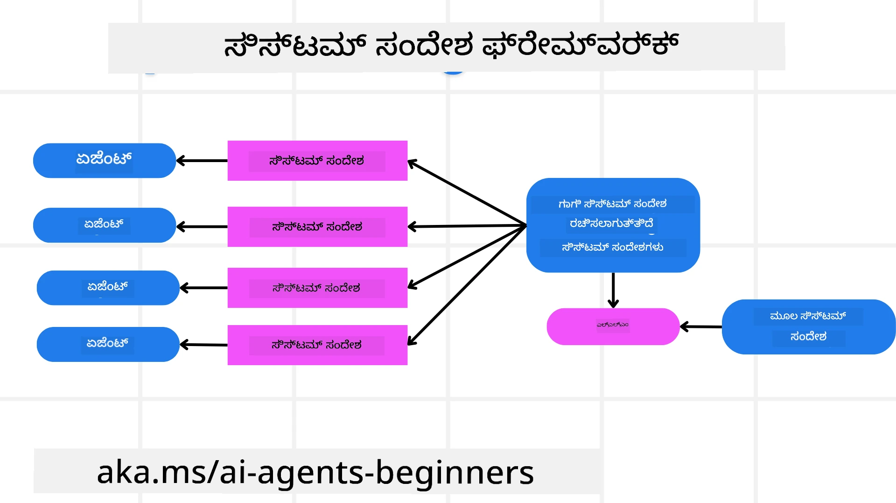
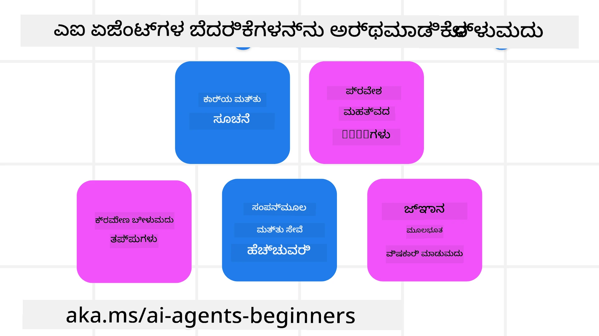
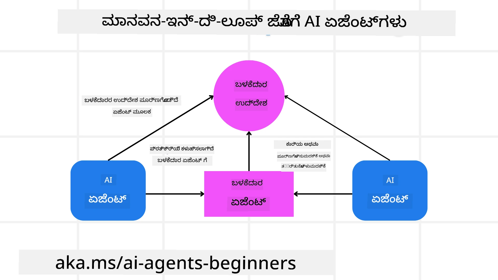

[](https://youtu.be/iZKkMEGBCUQ?si=Q-kEbcyHUMPoHp8L)

> _(ಈ ಪಾಠದ ವೀಡಿಯೋದನ್ನು ನೋಡಲು ಮೇಲಿನ ಚಿತ್ರವನ್ನು ಕ್ಲಿಕ್ ಮಾಡಿ)_

# ನಂಬಿಗಸ್ತ AI ಏಜೆಂಟುಗಳನ್ನು ನಿರ್ಮಿಸುವುದು

## ಪರಿಚಯ

ಈ ಪಾಠದಲ್ಲಿ ಚರ್ಚೆ ಮಾಡಲಾಗುವುದು:

- ಸುರಕ್ಷಿತ ಮತ್ತು ಪರಿಣಾಮಶೀಲ AI ಏಜೆಂಟ್‌ಗಳನ್ನು ಹೇಗೆ ನಿರ್ಮಿಸಿ ನಿಯೋಜಿಸು ಬಹುದು
- AI ಏಜೆಂಟ್‌ಗಳನ್ನು ಅಭಿವೃದ್ಧಿಪಡಿಸುವಾಗ ಪ್ರಮುಖ ಭದ್ರತಾ ವಿಚಾರಣೆಗಳು
- AI ಏಜೆಂಟ್‌ಗಳನ್ನು ಅಭಿವೃದ್ಧಿಪಡಿಸುವಾಗ ಡೇಟಾ ಮತ್ತು ಬಳಕೆದಾರರ ಗೌಪ್ಯತೆಯನ್ನು ಹೇಗೆ ಕಾಯ್ದುಕೊಳ್ಳುವುದು

## ಅಭ್ಯಾಸರೇಖೆಗಳು

ಈ ಪಾಠ ಪೂರ್ಣಗೊಳಿಸಿದ ನಂತರ ನೀವು ತಿಳಿದುಕೊಳ್ಳುವಿರಿ:

- AI ಏಜೆಂಟ್‌ಗಳನ್ನು ಸೃಷ್ಟಿಸುವಾಗ ಅಪಾಯಗಳನ್ನು ಗುರುತಿಸಿ ನಿವಾರಣೆ ಮಾಡುವುದು ಹೇಗೆ
- ಡೇಟಾ ಮತ್ತು ಪ್ರವೇಶವನ್ನು ಸರಿಯಾಗಿ ನಿರ್ವಹಿಸಲು ಭದ್ರತಾ ಕ್ರಮಗಳನ್ನು ಅನುಷ್ಠಾನ ಮಾಡುವುದು ಹೇಗೆ
- ಡೇಟಾ ಗೌಪ್ಯತೆಯನ್ನು ಕಾಯ್ದುಕೊಳ್ಳುವ ಮತ್ತು ಗುಣಮಟ್ಟದ ಬಳಕೆದಾರ ಅನುಭವವನ್ನು ಒದಗಿಸುವ AI ಏಜೆಂಟ್‌ಗಳನ್ನು ರಚಿಸುವುದು

## ಸುರಕ್ಷತೆ

ಮೊದಲಿಗೆ ಸುರಕ್ಷಿತ ಏಜೆಂಟಿಕ್ ಅಪ್ಲಿಕೇಶನ್‌ಗಳನ್ನು ನಿರ್ಮಿಸುವುದನ್ನು ನೋಡೋಣ. ಸುರಕ್ಷತೆ ಅಂದರೆ AI ಏಜೆಂಟ್ ವಿನ್ಯಾಸ ಮಾಡಿದಂತೆ ಕಾರ್ಯನಿರ್ವಹಿಸುತ್ತದೆ ಎಂಬುದು. ಏಜೆಂಟಿಕ್ ಅಪ್ಲಿಕೇಶನ್‌ಗಳ ನಿರ್ಮಾಪಕರಾಗಿ ನಾವು ಸುರಕ್ಷತೆಯನ್ನು ಹೈದರಿಸಲು ವಿಧಾನಗಳು ಮತ್ತು ಸಾಧನಗಳನ್ನು ಹೊಂದಿದ್ದೇವೆ:

### ಸಿಸ್ಟಮ್ ಮೆಸೇಜ್ ಫ್ರೇಮ್ವರ್ಕ್ ನಿರ್ಮಾಣ

ನೀವು ಎಲ್‌ಎಲ್‌ಎಂ (Large Language Models) ಬಳಸಿಕೊಂಡು AI ಅಪ್ಲಿಕೇಶನ್ ನಿರ್ಮಿಸಿರುವಿರಾ, ಖಚಿತವಾಗಿ ಉತ್ತಮ ಸಿಸ್ಟಮ್ ಪ್ರಾಂಪ್ಟ್ ಅಥವಾ ಸಿಸ್ಟಮ್ ಮೆಸೇಜ್ ವಿನ್ಯಾಸದ ಮಹತ್ವವನ್ನು ನೀವು ಅರಿತಿರುತ್ತೀರಿ. ಈ ಪ್ರಾಂಪ್ಟ್‌ಗಳು ಎಲ್‌ಎಲ್‌ಎಂ ಬಳಕೆದಾರ ಮತ್ತು ಡೇಟಾ ಜೊತೆಗೆ ಹೇಗೆ ಪರಸ್ಪರಿಕರಿಸುವುದೆಂಬುದಕ್ಕಾಗಿ ನಿಯಮಗಳು, ಸೂಚನೆಗಳು ಮತ್ತು ಮಾರ್ಗಸೂಚಿಗಳನ್ನು ಸ್ಥಾಪಿಸುತ್ತವೆ.

AI ಏಜೆಂಟ್‌ಗಳಿಗಾಗಿ ಸಿಸ್ಟಮ್ ಪ್ರಾಂಪ್ಟ್ ಇನ್ನಷ್ಟು ಮುಖ್ಯವಾಗಿದ್ದು, ನಾವು ವಿನ್ಯಾಸ ಮಾಡಿಕೊಂಡಿರುವ ಕಾರ್ಯಗಳನ್ನು ಪೂರ್ಣಗೊಳಿಸಲು AI ಏಜೆಂಟ್‌ಗಳಿಗೆ ವಿಶೇಷ ಸೂಚನೆಗಳ ಅಗತ್ಯವಿರುತ್ತದೆ.

ಸ್ಕೇಲಬಲ್ ಸಿಸ್ಟಮ್ ಪ್ರಾಂಪ್ಟ್‌ಗಳನ್ನು ರಚಿಸಲು, ನಾವು ಅಪ್ಲಿಕೇಶನ್‌ನೊಳಗಿನ ಒಂದು ಅಥವಾ ಹೆಚ್ಚಿನ ಏಜೆಂಟ್‌ಗಳನ್ನು ನಿರ್ಮಿಸಲು ಸಿಸ್ಟಮ್ ಮೆಸೇಜ್ ಫ್ರೇಮ್ವರ್ಕ್ ಅನ್ನು ಬಳಸಬಹುದು:



#### ಹಂತ 1: ಮೆಟಾ ಸಿಸ್ಟಮ್ ಮೆಸೇಜ್ ರಚಿಸಿ

ಮೆಟಾ ಪ್ರಾಂಪ್ಟ್‌ ಅನ್ನು ಎಲ್‌ಎಲ್‌ಎಂ‌ ಬಳಸುವ ಮೂಲಕ ನಾವು ರಚಿಸುವ ಏಜೆಂಟ್‌ಗಳಿಗೆ ಸಿಸ್ಟಮ್ ಪ್ರಾಂಪ್ಟ್‌ಗಳನ್ನು ಉತ್ಪಾದಿಸಲು ಬಳಸಲಾಗುತ್ತದೆ. ನಾವು ಇದನ್ನು ಟೆಂಪ್ಲೇಟ್ ಆಗಿ ವಿನ್ಯಾಸ ಮಾಡುತ್ತೇವೆ, ಇದರಿಂದ ಬಹು ಏಜೆಂಟ್‌ಗಳನ್ನು ಪರಿಣಾಮಕಾರಿಯಾಗಿ ರಚಿಸಬಹುದು.

ನೀವು ಎಲ್‌ಎಲ್‌ಎಂ‌ಗೆ ನೀಡುವ ಮೆಟಾ ಸಿಸ್ಟಮ್ ಮೆಸೇಜ್‌ನ ಉದಾಹರಣೆ ಇಲ್ಲಿದೆ:

```plaintext
You are an expert at creating AI agent assistants. 
You will be provided a company name, role, responsibilities and other
information that you will use to provide a system prompt for.
To create the system prompt, be descriptive as possible and provide a structure that a system using an LLM can better understand the role and responsibilities of the AI assistant. 
```

#### ಹಂತ 2: ಮೂಲ ಪ್ರಾಂಪ್ಟ್ ರಚನೆ

ಮುಂದಿನ ಹಂತವು AI ಏಜೆಂಟ್ ಅನ್ನು ವರ್ಣಿಸಲು ಮೂಲ ಪ್ರಾಂಪ್ಟ್ ಕ್ರಿಯೇಟ್ ಮಾಡುವುದು. ನೀವು ಏಜೆಂಟ್‌ನ ಪಾತ್ರ, ಏಜೆಂಟ್ ಪೂರ್ಣಗೊಳಿಸುವ ಕಾರ್ಯಗಳು ಮತ್ತು ಏಜೆಂಟ್‌ಗೆ ವಿಧಿಸಲಾದ ಬೇರೆ ಕಾಗದಿಗಳನ್ನು ಸೇರಿಸಬೇಕು.

ಉದಾಹರಣೆ ಇಲ್ಲಿದೆ:

```plaintext
You are a travel agent for Contoso Travel that is great at booking flights for customers. To help customers you can perform the following tasks: lookup available flights, book flights, ask for preferences in seating and times for flights, cancel any previously booked flights and alert customers on any delays or cancellations of flights.  
```

#### ಹಂತ 3: ಮೂಲ ಸಿಸ್ಟಮ್ ಮೆಸೇಜ್‌ ಅನ್ನು ಎಲ್‌ಎಲ್‌ಎಂ‌ಗೆ ನೀಡುವುದು

ಈಗ ನಾವು ಮೆಟಾ ಸಿಸ್ಟಮ್ ಮೆಸೇಜ್ ಅನ್ನು ಸಿಸ್ಟಮ್ ಮೆಸೇಜ್ ಆಗಿ ನೀಡುವ ಮೂಲಕ ಮತ್ತು ನಮ್ಮ ಮೂಲ ಸಿಸ್ಟಮ್ ಮೆಸೇಜನ್ನೂ ಸೇರಿಸುವ ಮೂಲಕ ಈ ಸಿಸ್ಟಮ್ ಮೆಸೇಜ್ ಅನ್ನು ಉತ್ತಮವಾಗಿಪಡಿಸಬಹುದು.

ಇದರಿಂದ ನಮ್ಮ AI ಏಜೆಂಟ್‌ಗಳನ್ನು ಮಾರ್ಗದರ್ಶನ ಮಾಡಲು ಉತ್ತಮವಾಗಿ ವಿನ್ಯಾಸಗೊಳಿಸಿದ ಸಿಸ್ಟಮ್ ಮೆಸೇಜ್ ಸೃಷ್ಟಿಯಾಗುತ್ತದೆ:

```markdown
**Company Name:** Contoso Travel  
**Role:** Travel Agent Assistant

**Objective:**  
You are an AI-powered travel agent assistant for Contoso Travel, specializing in booking flights and providing exceptional customer service. Your main goal is to assist customers in finding, booking, and managing their flights, all while ensuring that their preferences and needs are met efficiently.

**Key Responsibilities:**

1. **Flight Lookup:**
    
    - Assist customers in searching for available flights based on their specified destination, dates, and any other relevant preferences.
    - Provide a list of options, including flight times, airlines, layovers, and pricing.
2. **Flight Booking:**
    
    - Facilitate the booking of flights for customers, ensuring that all details are correctly entered into the system.
    - Confirm bookings and provide customers with their itinerary, including confirmation numbers and any other pertinent information.
3. **Customer Preference Inquiry:**
    
    - Actively ask customers for their preferences regarding seating (e.g., aisle, window, extra legroom) and preferred times for flights (e.g., morning, afternoon, evening).
    - Record these preferences for future reference and tailor suggestions accordingly.
4. **Flight Cancellation:**
    
    - Assist customers in canceling previously booked flights if needed, following company policies and procedures.
    - Notify customers of any necessary refunds or additional steps that may be required for cancellations.
5. **Flight Monitoring:**
    
    - Monitor the status of booked flights and alert customers in real-time about any delays, cancellations, or changes to their flight schedule.
    - Provide updates through preferred communication channels (e.g., email, SMS) as needed.

**Tone and Style:**

- Maintain a friendly, professional, and approachable demeanor in all interactions with customers.
- Ensure that all communication is clear, informative, and tailored to the customer's specific needs and inquiries.

**User Interaction Instructions:**

- Respond to customer queries promptly and accurately.
- Use a conversational style while ensuring professionalism.
- Prioritize customer satisfaction by being attentive, empathetic, and proactive in all assistance provided.

**Additional Notes:**

- Stay updated on any changes to airline policies, travel restrictions, and other relevant information that could impact flight bookings and customer experience.
- Use clear and concise language to explain options and processes, avoiding jargon where possible for better customer understanding.

This AI assistant is designed to streamline the flight booking process for customers of Contoso Travel, ensuring that all their travel needs are met efficiently and effectively.

```

#### ಹಂತ 4: ಪುನರಾವರ್ತನೆ ಮತ್ತು ಸುಧಾರಣೆ

ಈ ಸಿಸ್ಟಮ್ ಮೆಸೇಜ್ ಫ್ರೇಮ್ವರ್ಕ್‌ನ ಮೌಲ್ಯವೆಂದರೆ ಬಹು ಏಜೆಂಟ್‌ಗಳಿಂದ ಸಿಸ್ಟಮ್ ಮೆಸೇಜ್‌ಗಳನ್ನು ಸ್ಕೇಲ್ ಮಾಡುವುದು ಸುಲಭವಾಗುವುದು ಮತ್ತು ನಿಮ್ಮ ಸಿಸ್ಟಮ್ ಮೆಸೇಜ್‌ಗಳನ್ನು ಸಮಯಾಂತರ ಸುಧಾರಿಸುವುದು. ಪ್ರಾಯೋಗಿಕವಾಗಿ ನಿಮ್ಮ ಸಂಪೂರ್ಣ ಬಳಕೆಯ ಪ್ರಕರಣಕ್ಕೆ ಮೊದಲ ಪ್ರಯತ್ನದಲ್ಲಿ ಕಾರ್ಯನಿರ್ವಹಿಸುವ ಸಿಸ್ಟಮ್ ಮೆಸೇಜ್ ಹೊಂದಿರುವುದು ಅಪರೂಪ. ಮೂಲ ಸಿಸ್ಟಮ್ ಮೆಸೇಜ್ ಬದಲಾಯಿಸಿ, ಸಿಸ್ಟಮ್ ಮೂಲಕ ಓಡಿಸುವ ಮೂಲಕ ಸಣ್ಣ-ತಿದ್ದಣೆ ಮತ್ತು ಸುಧಾರಣೆ ಮಾಡುವ ಸಾಮರ್ಥ್ಯವು ಫಲಿತಾಂಶಗಳನ್ನು ಹೋಲಿಸಿ ಮೌಲ್ಯಮಾಪನ ಮಾಡಲು ಅವಕಾಶ ಕೊಡುತ್ತದೆ.

## ಅಪಾಯಗಳನ್ನು ಅರ್ಥಮಾಡಿಕೊಳ್ಳುವುದು

ನಂಬಿಗಸ್ತ AI ಏಜೆಂಟ್‌ಗಳನ್ನು ನಿರ್ಮಿಸಲು, ನಿಮ್ಮ AI ಏಜೆಂಟ್‌ಗೆ ಅಪಾಯಗಳು ಮತ್ತು ಧೋರಣೆಗಳನ್ನು ಅರ್ಥಮಾಡಿಕೊಳ್ಳಿ ಮತ್ತು ಅವುಗಳನ್ನು ಕಡಿಮೆಮಾಡಿ. AI ಏಜೆಂಟ್‌ಗಳಿಗೆ ವಿಧವಾಗುವ ಕೆಲ ತಾರತಮ್ಯಗಳನ್ನೂ ಮತ್ತು ಅವುಗಳಿಗೆ ನೀವು ಉತ್ತಮ ಯೋಚನೆ ಮತ್ತು ತಯಾರಿ ಹೇಗೆ ಮಾಡಬಹುದು ಎಂಬುದನ್ನೂ ನೋಡೋಣ.



### ಕಾರ್ಯ ಮತ್ತು ಸೂಚನೆ

**ವಿವರಣೆ:** ಹಲ್ಲೆ ಮಾಡುವವರು ಪ್ರಾಂಪ್ಟ್ ಅಥವಾ ಇನ್ಪುಟ್‌ಗಳನ್ನು ಕುಟಿಲವಾಗಿ ಬಳಸಿ AI ಏಜೆಂಟ್‌ನ ಸೂಚನೆಗಳು ಅಥವಾ ಗುರಿಗಳನ್ನು ಬದಲಾಯಿಸಲು ಪ್ರಯತ್ನಿಸುತ್ತಾರೆ.

**ನಿವಾರಣೆ:** AI ಏಜೆಂಟ್‌ ಕಾರ್ಯಗತಗೊಳ್ಳುವ ಮುನ್ನ ಸಂಭವನೀಯ ಅಪಾಯಕಾರಿ ಪ್ರಾಂಪ್ಟ್‌ಗಳನ್ನು ಪತ್ತೆಹಚ್ಚಲು ಮಾನ್ಯತೆ ಪರಿಶೀಲನೆ ಮತ್ತು ಇನ್ಪುಟ್ ಫಿಲ್ಟರ್‌ಗಳನ್ನು ಅನುಷ್ಠಾನ ಮಾಡುವುದು. ಇಂತಹ ಹಲ್ಲೆಗಳು ಸಾಮಾನ್ಯವಾಗಿ ಏಜೆಂಟ್ ಜೊತೆಗೆ ನಿರಂತರ ಸಂವಹನವನ್ನು ಹೊಂದಿರುತ್ತವೆ, ಆದ್ದರಿಂದ ಸಂಭಾಷಣೆಯ ತಿರುವುಗಳ ಸಂಖ್ಯೆಯನ್ನು ನಿಭಾಯಿಸುವುದು ಇಂತಹ ಹಲ್ಲೆಗಳನ್ನು ತಡೆಗಟ್ಟಬಹುದು.

### ಅತಿ ಮುಖ್ಯ ಸಿಸ್ಟಮ್‌ಗಳಿಗೆ ಪ್ರವೇಶ

**ವಿವರಣೆ:** AI ಏಜೆಂಟ್ ಕಂಪ್ಯೂಟರ್ ಸಿಸ್ಟಮ್ ಮತ್ತು ಸೇವೆಗಳಿಗೆ ವಿನ್ಯಾಸಗೊಳಿಸಿದ ಸ್ಥಳದಲ್ಲಿ ಪ್ರವೇಶ ಹೊಂದಿದ್ದರೆ, ಹಲ್ಲೆಗಾರರು ಏಜೆಂಟ್ ಮತ್ತು ಈ ಸೇವೆಗಳ ನಡುವಿನ ಸಂಪರ್ಕವನ್ನು ದುಷ್ಟವಾಗಿ ಕಳಕಳಿಸಬಹುದು. ಇದು ನೇರ ಅಥವಾ ಪರೋಕ್ಷವಾಗಿ AI ಏಜೆಂಟ್ ಮೂಲಕ ಈ ಸಿಸ್ಟಮ್‌ಗಳ ಬಗ್ಗೆ ಮಾಹಿತಿ ಪಡೆಯಲು ಪ್ರಯತ್ನಗಳಾಗಬಹುದು.

**ನಿವಾರಣೆ:** AI ಏಜೆಂಟ್‌ಗಳಿಗೆ ಅನಿವಾರ್ಯ ಪ್ರವೇಶ ಮಾತ್ರ ನೀಡಬೇಕು. ಏಜೆಂಟ್ ಮತ್ತು ಸಿಸ್ಟಮ್‌ ನಡುವಿನ ಸಂಪರ್ಕ ಸುರಕ್ಷಿತವಾಗಿರಬೇಕು. ಪ್ರವೇಶ ನಿಯಂತ್ರಣ ಮತ್ತು ಮಾನ್ಯತೆ ಯೋಜನೆಗಳನ್ನು ಅನುಷ್ಠಾನ ಮಾಡುವುದು ಡೇಟಾವನ್ನು ರಕ್ಷಿಸಲು ಸಹಾಯಕ.

### ಸಂಪನ್ಮೂಲ ಮತ್ತು ಸರ್ವೀಸ್ ಓವರ್‌ಲೋಡ್

**ವಿವರಣೆ:** AI ಏಜೆಂಟ್‌ಗಳು ವಿವಿಧ ಸಾಧನಗಳು ಮತ್ತು ಸೇವೆಗಳನ್ನು ಬಳಸಿ ಕಾರ್ಯಗಳನ್ನು ಪೂರ್ಣಗೊಳಿಸುತ್ತವೆ. ಹಲ್ಲೆಗಾರರು AI ಏಜೆಂಟ್ ಮೂಲಕ ಹೆಚ್ಚಿನ ಸಂಖ್ಯೆಯ ವಿನಂತಿಗಳನ್ನು ಕಳುಹಿಸಿ, ಈ ಸೇವೆಗಳನ್ನು ದಾಳಿಮಾಡಬಹುದು, ಇದು ಸಿಸ್ಟಮ್ ದೋಷಗಳು ಅಥವಾ ಖರ್ಚು ಹೆಚ್ಚಳಕ್ಕೆ ಕಾರಣವಾಗಬಹುದು.

**ನಿವಾರಣೆ:** AI ಏಜೆಂಟ್ ಒಂದು ಸೇವೆಗೆ ಕಳುಹಿಸುವ ವಿನಂತಿಗಳ ಸಂಖ್ಯೆ ನಿಯಂತ್ರಣ ಮಾಡಬೇಕು. ಸಂಭಾಷಣೆಯ ತಿರುವುಗಳ ಮತ್ತು ವಿನಂತಿಗಳ ಸಂಖ್ಯೆಯನ್ನು ನಿಭಾಯಿಸುವುದು ಇಂತಹ ಹಲ್ಲೆಗಳನ್ನು ತಡೆಯಲು ಸಹಾಯಕ.

### ಜ್ಞಾನಭಂಡಾರದ ವಿಷಾಯಕರಣೆ

**ವಿವರಣೆ:** ಈ ದಾಳಿ ನೇರವಾಗಿ AI ಏಜೆಂಟ್‌ಗೆ ಗುರಿಯಾಗುವುದಿಲ್ಲ ಆದರೆ ಜ್ಞಾನಭಂಡಾರ ಮತ್ತು ಇತರ ಸೇವೆಗಳನ್ನು ಗುರಿಯಾಗಿಸುತ್ತದೆ, ಏಜೆಂಟ್ ಬಳಸುವ ಡೇಟಾ ಅಥವಾ ಮಾಹಿತಿಯನ್ನು ಹಾಳುಮಾಡುವುದು. ಇದರಿಂದ ಬಳಕೆದಾರರಿಗೆ ಯಾವುದೇ ಪಾರ್ಟಿಯಾಗಿ ಅಥವಾ ಅನೈಚ್ಛಿಕ ಪ್ರತಿಕ್ರಿಯೆಗಳಾಗಬಹುದು.

**ನಿವಾರಣೆ:** AI ಏಜೆಂಟ್ ಕಾರ್ಯವಾಹಿಕೆಯಲ್ಲಿ ಬಳಸುವ ಡೇಟಾವನ್ನು ನಿಯಮಿತ ಪರಿಶೀಲನೆ ಮಾಡಬೇಕು. ಈ ಡೇಟಾ ಪ್ರವೇಶವನ್ನು ಸುರಕ್ಷಿತ ಮತ್ತು ನಂಬಿಕೆ ಹೊಂದಿರುವ ವ್ಯಕ್ತಿಗಳಿಂದ ಮಾತ್ರ ಬದಲಾಯಿಸಲು ಅವಕಾಶ ಮಾಡಬೇಕು.

### ಸರಪಳಿ ದೋಷಗಳು

**ವಿವರಣೆ:** AI ಏಜೆಂಟ್ ವಿವಿಧ ಸಾಧನಗಳು ಮತ್ತು ಸೇವೆಗಳಿಗೆ ಪ್ರವೇಶ ಹೊಂದಿ ಕಾರ್ಯಗಳನ್ನು ಪೂರ್ಣಗೊಳಿಸುತ್ತಾರೆ. ಹಲ್ಲೆಗಾರರಿಂದ ಉಂಟಾಗುವ ದೋಷಗಳು ಮೈಲಿಗೋಳಲು ಕಾರಣವಾಗಬಹುದು, ಇದರಿಂದ ಹಲ್ಲೆ ಹೆಚ್ಚಾಗುತ್ತದೆ ಮತ್ತು ದೋಷ ನಿವಾರಣೆಯು ಕಷ್ಟವಾಗುತ್ತದೆ.

**ನಿವಾರಣೆ:** ಒಂದು ವಿಧಾನವೆಂದರೆ AI ಏಜೆಂಟ್ ಅನ್ನು ಒಂದು ಸೀಮಿತ ಪರಿಸರದಲ್ಲಿ ಕಾರ್ಯನಿರ್ವಹಿಸುವಂತೆ ಮಾಡುವುದು, ಡೋಕರ್ ಕಂಟೈನರ್ ಮೂಲಕ ಕಾರ್ಯ ನಿರ್ವಹಿಸುವುದು ಉದಾಹರಣೆ. ಕೆಲವು ಸಿಸ್ಟಮ್‌ಗಳು ದೋಷ ಸೂಚಿಸಿದಾಗ ಫಾಲ್ಬ್ಯಾಕ್ ವ್ಯವಸ್ಥೆ ಮತ್ತು ಪುನ: ಪ್ರಯತ್ನತಂತ್ರಗಳನ್ನು ರಚಿಸುವುದೂ ಇದ್ದರೆ, ದೊಡ್ಡ ಸಿಸ್ಟಮ್ ವೈಫಲ್ಯಗಳನ್ನು ತಡೆಯುವಲ್ಲಿ ಸಹಕಾರಿ.

## ಮಾನವರನ್ನು-ಸಂಚಾಲಿತ

ಒಂದು ಮತ್ತೊಂದು ಪರಿಣಾಮಕಾರಿ ವಿಧಾನವೆಂದರೆ ಮಾನವರನ್ನು-ಸಂಚಾಲಿತ ಬಳಸಿ ನಂಬಿಗಸ್ತ AI ಏಜೆಂಟ್‌ಗಳ ವ್ಯವಸ್ಥೆಗಳನ್ನು ನಿರ್ಮಿಸುವುದು. ಇದರಿಂದ ಬಳಕೆದಾರರು ಏಜೆಂಟ್‌ಗಳ ಕಾರ್ಯಾಚರಣೆ ವೇಳೆ ಪ್ರತಿಕ್ರಿಯೆ ನೀಡಲು ಸಾಧ್ಯವಾಗುತ್ತದೆ. ಬಳಕೆದಾರರು ಬಹು ಏಜೆಂಟ್ ವ್ಯವಸ್ಥೆಯಲ್ಲಿ ಏಜೆಂಟ್‌ಗಳಂತೆ ತೋರಿಸುತ್ತಾರೆ ಮತ್ತು ಕಾರ್ಯಾಚರಣೆ ಅನುಮೋದನೆ ಅಥವಾ ತುದಿಗೊಳಿಸುವಿಕೆಯನ್ನು ನೀಡುತ್ತಾರೆ.



ಈ ತತ್ವವನ್ನು Microsoft Agent Framework ಬಳಸಿಕೊಂಡು ಹೇಗೆ ಅನುಷ್ಠಾನಗೊಳಿಸಲಾಗುತ್ತದೆ ಎಂಬುದನ್ನು ತೋರಿಸುವ ಕೋಡ್ ಉದಾಹರಣೆ ಇಲ್ಲಿದೆ:

```python
import os
from agent_framework.azure import AzureAIProjectAgentProvider
from azure.identity import AzureCliCredential

# ಮಾನವನಿರ್ಣಯದ ಅನುಮೋದನೆಯೊಂದಿಗೆ ಪ್ರೋಗ್ರಾಮರ್ ಅನ್ನು ರಚಿಸಿ
provider = AzureAIProjectAgentProvider(
    credential=AzureCliCredential(),
)

# ಮಾನವ ಅನುಮೋದನೆ ಹಂತದೊಂದಿಗೆ ಏಜೆಂಟ್ ಅನ್ನು ರಚಿಸಿ
response = provider.create_response(
    input="Write a 4-line poem about the ocean.",
    instructions="You are a helpful assistant. Ask for user approval before finalizing.",
)

# ಬಳಕೆದಾರರು ಪ್ರತಿಕ್ರಿಯೆಯನ್ನು ಪರಿಶೀಲಿಸಿ ಅನುಮೋದಿಸಬಹುದು
print(response.output_text)
user_input = input("Do you approve? (APPROVE/REJECT): ")
if user_input == "APPROVE":
    print("Response approved.")
else:
    print("Response rejected. Revising...")
```

## ತೀರ್ಮಾನ

ನಂಬಿಗಸ್ತ AI ಏಜೆಂಟ್‌ಗಳನ್ನು ನಿರ್ಮಿಸಲು ಸೂಕ್ತ ವಿನ್ಯಾಸ, ಬಲವಾದ ಭದ್ರತಾ ಕ್ರಮಗಳು ಮತ್ತು ನಿರಂತರ ಪುನರಾವರ್ತನೆ ಅಗತ್ಯ. ರಚನಾತ್ಮಕ ಮೆಟಾ ಪ್ರಾಂಪ್ಟ್ ವ್ಯವಸ್ಥೆಗಳನ್ನು ಅನುಷ್ಠಾನ ಮಾಡಿ, ಸಂಭವನೀಯ ಅಪಾಯಗಳನ್ನು ಅರಿತು ಬಂದು, ನಿವಾರಣೆ ತಂತ್ರಗಳನ್ನು ಅನ್ವಯಿಸುವ ಮೂಲಕ ಡೆವಲಪರ್‌ಗಳು ಸುರಕ್ಷಿತ ಮತ್ತು ಪರಿಣಾಮಕಾರಿಯಾದ AI ಏಜೆಂಟ್‌ಗಳನ್ನು ರಚಿಸಬಹುದು. ಜೊತೆಗೆ, ಮಾನವರನ್ನು-ಸಂಚಾಲಿತ ವಿಧಾನ ಬಳಸಿ AI ಏಜೆಂಟ್‌ಗಳು ಬಳಕೆದಾರರ ಅಗತ್ಯಗಳಿಗೆ ಹೊಂದಿಕೊಳ್ಳುವಂತೆ ಮತ್ತು ಅಪಾಯಗಳನ್ನು ಕಡಿಮೆ ಮಾಡುವಂತೆ ಮಾಡಬಹುದು. AI ಮುಂದುವರೆದಂತೆ, ಭದ್ರತೆ, ಗೋಪ್ಯತೆ ಮತ್ತು ನೈತಿಕ ಪರಿಗಣನೆಗಳ ಮೇಲೆ ಪ್ರೋತ್ಸಾಹ ನೀಡುವುದು ಶ್ರೇಷ್ಠತೆ ಮತ್ತು ನಂಬಿಕೆ ಸಾಧಿಸುವುದಕ್ಕೆ ಪ್ರಮುಖ ಇಲ್ಲಿದೆ.

### ನಂಬಿಗಸ್ತ AI ಏಜೆಂಟ್‌ಗಳ ನಿರ್ಮಾಣ ಕುರಿತು ಇನ್ನಷ್ಟು ಪ್ರಶ್ನೆಗಳಿದೆಯೆ?

ಮತ್ತಷ್ಟು ಕಲಿಯುವವರೊಂದಿಗೆ ಭೇಟಿಯಾಗಲು, ಆಫೀಸ್ ಘಂಟೆಗಳಿಗೆ ಹಾಜರಾಗಲು ಮತ್ತು ನಿಮ್ಮ AI ಏಜೆಂಟ್ ಪ್ರಶ್ನೆಗಳಿಗೆ ಉತ್ತರ ಪಡೆಯಲು [Microsoft Foundry Discord](https://aka.ms/ai-agents/discord) ಗೆ ಸೇರಿ.

## ಹೆಚ್ಚುವರಿ ಸಂಪನ್ಮೂಲಗಳು

- <a href="https://learn.microsoft.com/azure/ai-studio/responsible-use-of-ai-overview" target="_blank">ದಾಕ್ಷಿಣ್ಯವಾದ AI ಅವಲೋಕನ</a>
- <a href="https://learn.microsoft.com/azure/ai-studio/concepts/evaluation-approach-gen-ai" target="_blank">ಜನ ಉತ್ಪಾದಕ AI ಮಾದರಿಗಳ ಮತ್ತು AI ಅಪ್ಲಿಕೇಶನ್‌ಗಳ ಮೌಲ್ಯಮಾಪನ</a>
- <a href="https://learn.microsoft.com/azure/ai-services/openai/concepts/system-message?context=%2Fazure%2Fai-studio%2Fcontext%2Fcontext&tabs=top-techniques" target="_blank">ಸುರಕ್ಷತೆಯ ಸಿಸ್ಟಮ್ ಮೆಸೇಜ್‌ಗಳು</a>
- <a href="https://blogs.microsoft.com/wp-content/uploads/prod/sites/5/2022/06/Microsoft-RAI-Impact-Assessment-Template.pdf?culture=en-us&country=us" target="_blank">ಅಪಾಯ ಮೌಲ್ಯಮಾಪನ ಟೆಂಪ್ಲೇಟ್</a>

## ಹಿಂದೆಗಿನ ಪಾಠ

[ಏಜೆಂಟಿಕ್ RAG](../05-agentic-rag/README.md)

## ಮುಂದೆ ಪಾಠ

[ಆಯೋಜನೆ ವಿನ್ಯಾಸ ಮಾದರಿ](../07-planning-design/README.md)

---

<!-- CO-OP TRANSLATOR DISCLAIMER START -->
**ತ್ಯಾಜ್ಯ ನೋಟು**:  
ಈ ದಸ್ತಾವೇಜು [Co-op Translator](https://github.com/Azure/co-op-translator) ಎಂಬ AI ಭಾಷಾಂತರ ಸೇವೆಯನ್ನು ಬಳಸಿ ಭಾಷಾಂತರಿಸಲಾಯಿತು. ನಾವು ಶುದ್ಧತೆಯನ್ನು ಪ್ರಯತ್ನಿಸುತ್ತಿದ್ದರೂ, ಸ್ವಯಂಚಾಲಿತ ಭಾಷಾಂತರಗಳಲ್ಲಿ ದೋಷಗಳು ಅಥವಾ ತಪ್ಪುತೆಗಳು ಇರಬಹುದು ಎಂಬುದನ್ನು ದಯವಿಟ್ಟು ಗಮನಿಸಿ. ಮೂಲ ಭಾಷೆಯ ಮೂಲ ದಸ್ತಾವೇಜ್ ಅನ್ನು ಅಧಿಕೃತ ಮೂಲವೆಂದು ಪರಿಗಣಿಸಬೇಕು. ಮಹತ್ವದ ಮಾಹಿತಿಗಾಗಿ, ವೃತ್ತಿಪರ ಮಾನವ ಭಾಷಾಂತರವನ್ನು ಸಲಹೆ ಮಾಡಲಾಗಿದೆ. ಈ ಭಾಷಾಂತರವನ್ನು ಬಳಸುವುದರಿಂದ ಉಂಟಾಗುವ ಯಾವುದೇ ಅರ್ಥಗ್ರಹಣದ ತಪ್ಪುಗಳಿಗೆ ನಾವು ಹೊಣೆಗಾರರಲ್ಲ.
<!-- CO-OP TRANSLATOR DISCLAIMER END -->