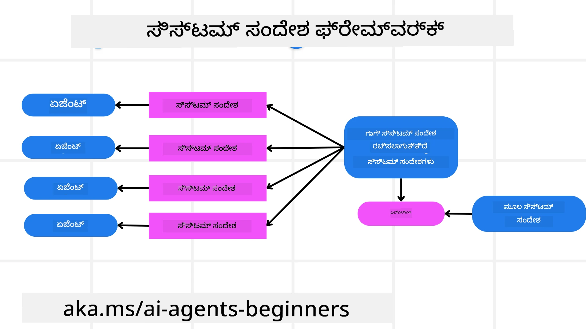
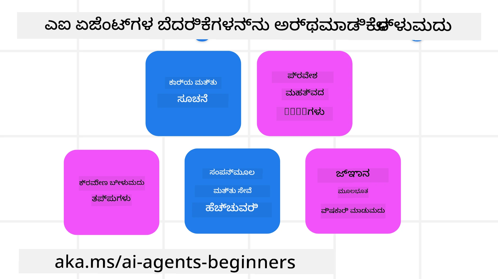
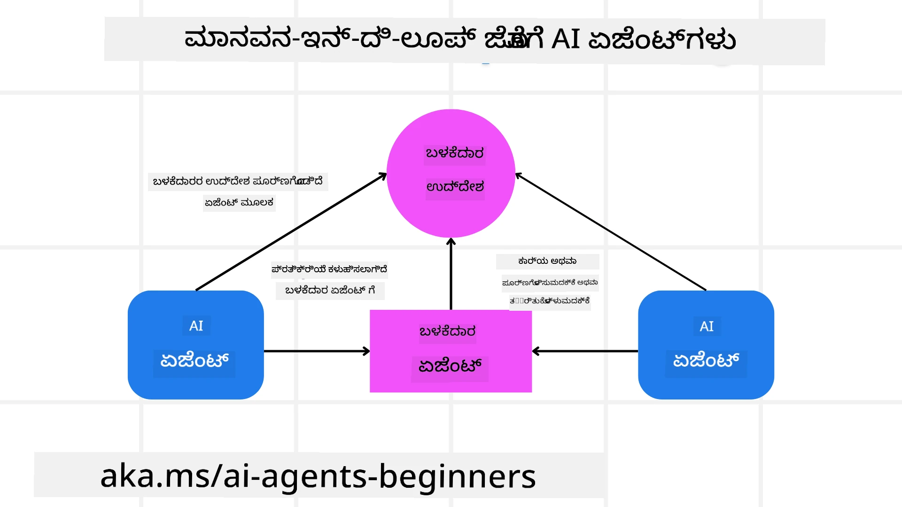

[](https://youtu.be/iZKkMEGBCUQ?si=Q-kEbcyHUMPoHp8L)

> _(ಈ ಪಾಠದ ವೀಡಿಯೋವನ್ನು ನೋಡಲು ಮೇಲಿನ ಚಿತ್ರವನ್ನು ಕ್ಲಿಕ್ ಮಾಡಿ)_

# ವಿಶ್ವಾಸಾರ್ಹ AI ಏಜೆಂಟ್‌ಗಳನ್ನು ನಿರ್ಮಿಸುವುದು

## ಪರಿಚಯ

ಈ ಪಾಠದಲ್ಲಿ ವಿವರಿಸುವುದು:

- ಸುರಕ್ಷಿತ ಮತ್ತು ಪರಿಣಾಮಕಾರಿಯಾದ AI ಏಜೆಂಟ್‌ಗಳನ್ನು ಹೇಗೆ ನಿರ್ಮಿಸಿ ಮತ್ತು ನಿಯೋಜಿಸುವುದು
- AI ಏಜೆಂಟ್‌ಗಳನ್ನು ಅಭಿವೃದ್ಧಿಪಡಿಸುವಾಗ ಪ್ರಮುಖ ಭದ್ರತಾ ಪರಿಗಣನೆಗಳು.
- AI ಏಜೆಂಟ್‌ಗಳನ್ನು ಅಭಿವೃದ್ಧಿಪಡಿಸುವಾಗ ಡೇಟಾ ಮತ್ತು ಬಳಕೆದಾರ ಗೌಪ್ಯತೆಯನ್ನು ಹೇಗೆ ಪಾಲಿಸಲು.

## ಕಲಿಕೆಯ ಗುರಿಗಳು

ಈ ಪಾಠವನ್ನು ಪೂರ್ಣಗೊಳಿಸಿದ ನಂತರ, ನೀವು ತಿಳಿಯಬೇಕಾದವು:

- AI ಏಜೆಂಟ್‌ಗಳನ್ನು ರಚಿಸುವಾಗ ಅಪಾಯಗಳನ್ನು ಗುರುತಿಸಿ ಮತ್ತು ನಿವಾರಣೆ ಮಾಡುವುದು.
- ಡೇಟಾ ಮತ್ತು ಪ್ರವೇಶವನ್ನು ಸರಿಯಾಗಿ ನಿರ್ವಹಿಸಲು ಭದ್ರತಾ ಕ್ರಮಗಳನ್ನು ಜಾರಿಗೆ ತರುವುದು.
- ಡೇಟಾ ಗೌಪ್ಯತೆಯನ್ನು ಕಾಪಾಡುವ ಮತ್ತು ಹೊಂದಿಸುವ ಗುಣಮಟ್ಟದ ಬಳಕೆದಾರ ಅನುಭವ ಒದಗಿಸುವ AI ಏಜೆಂಟ್‌ಗಳನ್ನು ರಚಿಸುವುದು.

## ಸುರಕ್ತಿ

ಮೊದಲು ನಾವು ಸುರಕ್ಷಿತ ಏಜೆಂಟ್‌ ಆಧಾರಿತ ಅಪ್ಲಿಕೇಶನ್‌ಗಳ ನಿರ್ಮಾಣವನ್ನು ನೋಡಿ. ಸುರಕ್ಷತೆ ಎಂದರೆ AI ಏಜೆಂಟ್ ವಿನ್ಯಾಸಿತಂತೆ ಕಾರ್ಯನಿರ್ವಹಿಸುವುದು. ಏಜೆಂಟ್‌ ಆಧಾರಿತ ಅಪ್ಲಿಕೇಶನ್‌ಗಳ ನಿರ್ಮಾತಾಗಳಾಗಿರುವ ನಾವು ಸರಿಯಾದ ವಿಧಾನಗಳು ಮತ್ತು ಉಪಕರಣಗಳನ್ನು ಬಳಸಿ ಸುರಕ್ಷತೆಯನ್ನು ಗರಿಷ್ಠಗೊಳಿಸಬಹುದು:

### ಸಿಸ್ಟಮ್ ಸಂದೇಶ ಫ್ರೆ임್‌ವರ್ಕ್ ರಚಿಸುವುದು

ನೀವು LLMಗಳ (ಲಾರ್ಜ್ ಲ್ಯಾಂಗ್ವೇಜ್ ಮಾದರಿಗಳು) ಬಳಸಿ AI ಅಪ್ಲಿಕೇಶನ್ ನಿರ್ಮಿಸಿದ್ದರೆ, ಬಲವಾದ ಸಿಸ್ಟಮ್ ಪ್ರಾಂಪ್ಟ್ ಅಥವಾ ಸಿಸ್ಟಮ್ ಸಂದೇಶ ರೂಪಿಸುವ ಮಹತ್ವವನ್ನು ತಿಳಿದುಕೊಂಡಿರುತ್ತೀರಿ. ಈ ಪ್ರಾಂಪ್ಟ್‌ಗಳು LLM ಬಳಕೆದಾರ ಮತ್ತು ಡೇಟಾ ಜೊತೆ ಹೇಗೆ ಸಂವಹನ ಮಾಡಬೇಕು ಎಂದು ನಿಯಮಗಳು, ಸೂಚನೆಗಳು, ಮಾರ್ಗದರ್ಶನಗಳನ್ನು ಸ್ಥಾಪಿಸುತ್ತವೆ.

AI ಏಜೆಂಟ್‌ಗಳಿಗಾಗಿ, ಸಿಸ್ಟಮ್ ಪ್ರಾಂಪ್ಟ್ ಇನ್ನೂ ಹೆಚ್ಚಿನ ಮಹತ್ವ ಹೊಂದಿದೆ ಏಕೆಂದರೆ AI ಏಜೆಂಟ್‌ಗಳಿಗೆ ನಾವು ವಿನ್ಯಾಸಗೊಳಿಸಿದ ಕಾರ್ಯಗಳನ್ನು ಪೂರ್ಣಗೊಳಿಸಲು ಅತ್ಯಂತ ನಿರ್ದಿಷ್ಟ ಸೂಚನೆಗಳ ಅಗತ್ಯವಿರುತ್ತದೆ.

ವ್ಯಾಪಕಗೊಳ್ಳುವ ಯೋಗ್ಯ ಸಿಸ್ಟಮ್ ಪ್ರಾಂಪ್ಟ್‌ಗಳನ್ನು ರಚಿಸಲು, ನಾವು ನಮ್ಮ ಅಪ್ಲಿಕೇಶನ್‌ನಲ್ಲಿ ಒಂದಿಗಿಂತ ಹೆಚ್ಚು ಏಜೆಂಟ್‌ಗಳನ್ನು ನಿರ್ಮಿಸಲು ಸಿಸ್ಟಮ್ ಸಂದೇಶ ಫ್ರೆ임್‌ವರ್ಕ್ ಬಳಸಬಹುದು:



#### ಹಂತ 1: ಮೆಟಾ ಸಿಸ್ಟಮ್ ಸಂದೇಶವನ್ನು ರಚಿಸು

ಮೆಟಾ ಪ್ರಾಂಪ್ಟ್ ಅನ್ನು LLM ಉಪಯೋಗಿಸಿ ಏಜೆಂಟ್‌ಗಳಿಗಾಗಿ ಸಿಸ್ಟಮ್ ಪ್ರಾಂಪ್ಟ್‌ಗಳನ್ನು ರಚಿಸಲು ಬಳಸಲಾಗುವುದು. ಇದು ಟೆಂಪ್ಲೇಟ್ ಆಗಿ ವಿನ್ಯಾಸಗೊಳಿಸಲಾಗುತ್ತದೆ ಹೇಗೆಂದರೆ ನಾವು ಅವಶ್ಯವಿದ್ದಲ್ಲಿ ಬಹು ಏಜೆಂಟ್‌ಗಳನ್ನು ಸುಲಭವಾಗಿ ರಚಿಸಬಹುದು.

ಇಲ್ಲಿದೆ LLMಗೆ ನಾವು ನೀಡುವ ಮೆಟಾ ಸಿಸ್ಟಮ್ ಸಂದೇಶದ ಉದಾಹರಣೆ:

```plaintext
You are an expert at creating AI agent assistants. 
You will be provided a company name, role, responsibilities and other
information that you will use to provide a system prompt for.
To create the system prompt, be descriptive as possible and provide a structure that a system using an LLM can better understand the role and responsibilities of the AI assistant. 
```

#### ಹಂತ 2: ಮೂಲ ಪ್ರಾಂಪ್ಟ್ ರಚಿಸು

ಮುಂದಿನ ಹಂತವು AI ಏಜೆಂಟ್‌ನ್ನು ವಿವರಿಸುವ ಮೂಲ ಪ್ರಾಂಪ್ಟ್ ರಚಿಸುವುದು. ನೀವು ಏಜೆಂಟ್‌ನ ಪಾತ್ರ, ಏಜೆಂಟ್ ಪೂರೈಸುವ ಕಾರ್ಯಗಳು ಮತ್ತು ಇತರೆ ಜವಾಬ್ದಾರಿಗಳನ್ನು ಸೇರಿಸಬೇಕು.

ಉದಾಹರಣೆಯಾಗಿ:

```plaintext
You are a travel agent for Contoso Travel that is great at booking flights for customers. To help customers you can perform the following tasks: lookup available flights, book flights, ask for preferences in seating and times for flights, cancel any previously booked flights and alert customers on any delays or cancellations of flights.  
```

#### ಹಂತ 3: ಮೂಲ ಸಿಸ್ಟಮ್ ಸಂದೇಶವನ್ನು LLMಗೆ ನೀಡಿ

ಈಗ ನಾವು ಈ ಸಿಸ್ಟಮ್ ಸಂದೇಶವನ್ನು ಸುಧಾರಿಸಲು, ಮೆಟಾ ಸಿಸ್ಟಮ್ ಸಂದೇಶವನ್ನು ಮತ್ತು ಮೂಲ ಸಿಸ್ಟಮ್ ಸಂದೇಶವನ್ನು ಸಿಸ್ಟಮ್ ಸಂದೇಶವಾಗಿ ಒದಗಿಸಬಹುದು.

ಇದು ನಮ್ಮ AI ಏಜೆಂಟ್‌ಗಳಿಗೆ ಮಾರ್ಗದರ್ಶನ ನೀಡಲು ಉತ್ತಮ ವಿನ್ಯಾಸದ ಸಿಸ್ಟಮ್ ಸಂದೇಶವನ್ನು ಉತ್ಪಾದಿಸುತ್ತದೆ:

```markdown
**Company Name:** Contoso Travel  
**Role:** Travel Agent Assistant

**Objective:**  
You are an AI-powered travel agent assistant for Contoso Travel, specializing in booking flights and providing exceptional customer service. Your main goal is to assist customers in finding, booking, and managing their flights, all while ensuring that their preferences and needs are met efficiently.

**Key Responsibilities:**

1. **Flight Lookup:**
    
    - Assist customers in searching for available flights based on their specified destination, dates, and any other relevant preferences.
    - Provide a list of options, including flight times, airlines, layovers, and pricing.
2. **Flight Booking:**
    
    - Facilitate the booking of flights for customers, ensuring that all details are correctly entered into the system.
    - Confirm bookings and provide customers with their itinerary, including confirmation numbers and any other pertinent information.
3. **Customer Preference Inquiry:**
    
    - Actively ask customers for their preferences regarding seating (e.g., aisle, window, extra legroom) and preferred times for flights (e.g., morning, afternoon, evening).
    - Record these preferences for future reference and tailor suggestions accordingly.
4. **Flight Cancellation:**
    
    - Assist customers in canceling previously booked flights if needed, following company policies and procedures.
    - Notify customers of any necessary refunds or additional steps that may be required for cancellations.
5. **Flight Monitoring:**
    
    - Monitor the status of booked flights and alert customers in real-time about any delays, cancellations, or changes to their flight schedule.
    - Provide updates through preferred communication channels (e.g., email, SMS) as needed.

**Tone and Style:**

- Maintain a friendly, professional, and approachable demeanor in all interactions with customers.
- Ensure that all communication is clear, informative, and tailored to the customer's specific needs and inquiries.

**User Interaction Instructions:**

- Respond to customer queries promptly and accurately.
- Use a conversational style while ensuring professionalism.
- Prioritize customer satisfaction by being attentive, empathetic, and proactive in all assistance provided.

**Additional Notes:**

- Stay updated on any changes to airline policies, travel restrictions, and other relevant information that could impact flight bookings and customer experience.
- Use clear and concise language to explain options and processes, avoiding jargon where possible for better customer understanding.

This AI assistant is designed to streamline the flight booking process for customers of Contoso Travel, ensuring that all their travel needs are met efficiently and effectively.

```

#### ಹಂತ 4: ಪುನರಾವರ್ತಿಸಲು ಮತ್ತು ಸುಧಾರಿಸಲು

ಈ ಸಿಸ್ಟಮ್ ಸಂದೇಶ ಫ್ರೆ임್‌ವರ್ಕ್‌ನ ಮೌಲ್ಯವು ಎಷ್ಟು ಏಜೆಂಟ್‌ಗಳ ಮೌಲ್ಯದಲಾದ ಸಿಸ್ಟಮ್ ಸಂದೇಶಗಳನ್ನು ಸುಲಭವಾಗಿ ನಿರ್ಮಿಸುವುದು ಮತ್ತು ನಿಮ್ಮ ಸಿಸ್ಟಮ್ ಸಂದೇಶಗಳನ್ನು ಕಾಲಕಾಲಕ್ಕೆ ಸುಧಾರಿಸುವುದಾಗಿದೆ. ನಿಮಗೆ ಮೊದಲ ಬಾರಿಗೆ ನಿಮ್ಮ ಸಂಪೂರ್ಣ ಬಳಕೆಯ ಪ್ರಕರಣಕ್ಕೆ ಕೆಲಸ ಮಾಡುವ ಸಿಸ್ಟಮ್ ಸಂದೇಶ raro ಆಗಿರುತ್ತದೆ. ಸಣ್ಣ ಬದಲಾವಣೆಗಳು ಮತ್ತು ಸುಧಾರಣೆಗಳನ್ನು ಮಾಡುವ ಮೂಲಕ ನಿಮ್ಮ ಮೂಲ ಸಿಸ್ಟಮ್ ಸಂದೇಶವನ್ನು ಬದಲಿಸಿ ಮತ್ತು ಸಿಸ್ಟಮ್ ಮೂಲಕ ಚಲಾಯಿಸುವ ಮೂಲಕ ಫಲಿತಾಂಶಗಳನ್ನು ಹೋಲಿಸಿ ಮೌಲ್ಯಮಾಪನ ಮಾಡಬಹುದು.

## ಅಪಾಯಗಳನ್ನು ಅರ್ಥಮಾಡಿಕೊಳ್ಳುವುದು

ವಿಶ್ವಾಸಾರ್ಹ AI ಏಜೆಂಟ್‌ಗಳನ್ನು ನಿರ್ಮಿಸಲು, ನಿಮ್ಮ AI ಏಜೆಂಟ್‌ಗೆ ಇರುವ ಅಪಾಯಗಳು ಮತ್ತು ಬಂಧನಗಳನ್ನು ಅರ್ಥಮಾಡಿಕೊಳ್ಳುವುದು ಮತ್ತು ನಿವಾರಣೆ ಮಾಡುವುದು ಮುಖ್ಯ. ಕೇಳಿದರೆ AI ಏಜೆಂಟ್‌ಗಳಿಗೆ ಇರುವ ಕೆಲವು ಅಪಾಯಗಳು ಯಾವುವು ಮತ್ತು ನೀವು ಅವುಗಳಿಗೆ ಹೇಗೆ ಉತ್ತಮ ಯೋಜನೆ ಮಾಡಬಹುದು ಮತ್ತು ಸಿದ್ಧತೆ ಮಾಡಬಹುದು ನೋಡೋಣ.



### ಕಾರ್ಯ ಮತ್ತು ಸೂಚನೆ

**ವಿವರಣೆ:** ದಾಳಿಪಡಿಸುವವರು AI ಏಜೆಂಟ್‌ನ ಸೂಚನೆಗಳು ಅಥವಾ ಗುರಿಗಳನ್ನು ಪ್ರಾಂಪ್ಟಿಂಗ್ ಅಥವಾ ಇನ್ಪುಟ್‌ಗಳನ್ನು манಿಪುಲೇಟ್ ಮಾಡಿ ಬದಲಾಯಿಸಲು ಯತ್ನಿಸುತ್ತಾರೆ.

**ನಿವಾರಣೆ**: ಅಪಾಯಕಾರಿ ಪ್ರಾಂಪ್ಟ್‌ಗಳನ್ನು AI ಏಜೆಂಟ್ ಪ್ರಕ್ರಿಯೆಗೆ ಒಳಪಡಿಸುವ ಮೊದಲು ಪತ್ತೆಮಾಡಲು ಮಾನ್ಯತೆ ಪರಿಶೀಲನೆಗಳು ಮತ್ತು ಇನ್ಪುಟ್ ಫಿಲ್ಟರ್‌ಗಳನ್ನು ನಡಿಸಲು. ಈ ದಾಳಿಗಳು ಸಾಮಾನ್ಯವಾಗಿ ಏಜೆಂಟ್‌ ಜೊತೆ ನಿರಂತರ ಸಂವಹನವನ್ನು ನಿರ್ಬಂಧಿಸುವ ಮೂಲಕ ಸಂಭಾಷಣೆಯ ಟTurn ಗಳ ಸಂಖ್ಯೆಯನ್ನು ನಿಯಂತ್ರಿಸುವುದು ಇನ್ನೊಂದು ತಡೆದಾರಿಕೆಯಾಗಿದೆ.

### ಪ್ರಮುಖ ವ್ಯವಸ್ಥೆಗಳ ಪ್ರವೇಶ

**ವಿವರಣೆ**: AI ಏಜೆಂಟ್‌ಗೆ ಸಂವೇದನಶೀಲ ಡೇಟಾ ಸಂಗ್ರಹಿಸುವ ವ್ಯವಸ್ಥೆಗಳು ಮತ್ತು ಸೇವೆಗಳ ಪ್ರವೇಶವಿದ್ದರೆ, ದಾಳಿಪಡಿಸುವವರು ಏಜೆಂಟ್ ಮತ್ತು ಈ ಸೇವೆಗಳ ನಡುವಿನ ಸಂವಹನವನ್ನು ಕಪಟಗೊಳಿಸಬಹುದು. ಇದು ನೇರ ದಾಳಿ ಅಥವಾ ಏಜೆಂಟ್ ಮೂಲಕ ಈ ವ್ಯವಸ್ಥೆಗಳ ಬಗ್ಗೆ ಮಾಹಿತಿಯನ್ನು ಪಡೆಯಲು ಅಪರೋಕ್ಷ ಯತ್ನಗಳಾಗಬಹುದು.

**ನಿವಾರಣೆ**: AI ಏಜೆಂಟ್‌ಗಳಿಗೆ ಅಗತ್ಯವಿರುವಷ್ಟೇ ಪ್ರವೇಶ ನೀಡಬೇಕು. ಏಜೆಂಟ್ ಮತ್ತು ವ್ಯವಸ್ಥೆಯ ನಡುವಿನ ಸಂವಹನವೂ ಭದ್ರವಾಗಿರಬೇಕು. ಉತ್ತೀರ್ಣತೆ ಮತ್ತು ಪ್ರವೇಶ ನಿಯಂತ್ರಣವನ್ನು ಜಾರಿಗೆ ತರುವುದೂ ಇನ್ನೊಂದು ರಕ್ಷಣೆ.

### ಸಂಪನ್ಮೂಲ ಮತ್ತು ಸೇವೆಯ ಓವರ್‌ಲೋಡ್ ಆಗುವುದು

**ವಿವರಣೆ:** AI ಏಜೆಂಟ್ ಕಾರ್ಯವನ್ನು ಪೂರ್ಣಗೊಳಿಸಲು ವಿವಿಧ ಉಪಕರಣಗಳು ಮತ್ತು ಸೇವೆಗಳ ಪ್ರವೇಶ ಹೊಂದಬಹುದು. ದಾಳಿಗಾರರು AI ಏಜೆಂಟ್ ಮೂಲಕ ಹೆಚ್ಚಿನ ಸಂಖ್ಯೆಯ ವಿನಂತಿಗಳನ್ನು ಕಳುಹಿಸುವ ಮೂಲಕ ಈ ಸೇವೆಗಳನ್ನು ದಾಳಿ ಮಾಡಬಹುದು, ಇದು ವ್ಯವಸ್ಥೆ ವಿಫಲತೆ ಅಥವಾ ಹೆಚ್ಚು ವೆಚ್ಚಕ್ಕೆ ಕಾರಣವಾಗಬಹುದು.

**ನಿವಾರಣೆ:** AI ಏಜೆಂಟ್ ಯಾವಷ್ಟು ವಿನಂತಿಗಳನ್ನು এবಟಿಸಬಹುದೋ ಪರಿಧಿ ನಿಗದಿಪಡಿಸಲು ನೀತಿ ಜಾರಿಗೆ ತರುವುದಿದೆ. ನಿಮ್ಮ AI ಏಜೆಂಟ್‌ಗೆ ಸಂಭಾಷಣೆ ಟTurn ಸಂಖ್ಯೆಯನ್ನು ಮತ್ತು ವಿನಂತಿಗಳನ್ನು ನಿಯಂತ್ರಿಸುವುದು ಇನ್ನೆರಡು ತಡೆ.

### ಜ್ಞಾನಭಂಡಾರ ದೂಷಣೆ

**ವಿವರಣೆ:** ಈ ರೀತಿಯ ದಾಳಿ ನೇರವಾಗಿ AI ಏಜೆಂಟ್ ಅನ್ನು ಗುರಿಯಾಗಿಸುವುದಿಲ್ಲ ಆದರೆ AI ಏಜೆಂಟ್ ಬಳಸುವ ಜ್ಞಾನಭಂಡಾರ ಮತ್ತು ಇತರೆ ಸೇವೆಗಳನ್ನು ಗುರಿಯಾಗಿಸುತ್ತದೆ. ಇದರರ್ಥ, ದಾಳಿಗಾರರು ಡೇಟಾ ಅಥವಾ ಮಾಹಿತಿಯನ್ನು ದೂಷಿತಗೊಳಿಸುವ ಮೂಲಕ AI ಏಜೆಂಟ್ ನೀಡುವ ಪ್ರತಿಸ್ಪಂದನೆಗಳು ಪರಾಗಣಿತ ಅಥವಾ ಅಸಂಬಂಧಿತವಾಗಬಹುದು.

**ನಿವಾರಣೆ:** AI ಏಜೆಂಟ್ ಬಳಸುವ ಡೇಟಾವನ್ನು ನಿಯತಕಾಲ ಪರಿಶೀಲನೆ ಮಾಡಿ. ಈ ಡೇಟಾವಿಗೆ ಪ್ರವೇಶವು ಭದ್ರವಾಗಿದ್ದು ನಂಬಿಗಸ್ತ ವ್ಯಕ್ತಿಗಳಿಂದ ಮಾತ್ರ ಬದಲಾಗಿಸಬೇಕು ಎಂದು ಖಚಿತಪಡಿಸಿಕೊಳ್ಳಿ.

### ಸರಣೀಕೃತ ದೋಷಗಳು

**ವಿವರಣೆ:** AI ಏಜೆಂಟ್ ವಿವಿಧ ಉಪಕರಣ ಮತ್ತು ಸೇವೆಗಳಿಗೆ ಪ್ರವೇಶ ಹೊಂದಿದ್ದು, ದಾಳಿಗಾರರಿಂದ ಸಂಭವಿಸುವ ದೋಷಗಳು ಇತರ ಸಂಪರ್ಕಿತ ವ್ಯವಸ್ಥೆಗಳ ವಿಫಲತೆಗಳಿಗೆ ಕಾರಣವಾಗಬಹುದು, ಇದರಿಂದ ದಾಳಿಯ ವ್ಯಾಪ್ತಿ ಹೆಚ್ಚಾಗಿ ಪತ್ತೆಮಾಡಲು ಕಷ್ಟ ಆಗಬಹುದು.

**ನಿವಾರಣೆ**: ಇದನ್ನು ತಪ್ಪಿಸಲು ಮತ್ತೊಂದು ವಿಧಾನವೆಂದರೆ AI ಏಜೆಂಟ್ ಅನ್ನು ಮುಚ್ಚುವ ಮಾಹಿತಿ ಲಭ್ಯವಿರುವ ಪರಿಸರದಲ್ಲಿ ಕಾರ್ಯನಿರ್ವಹಿಸುವಂತೆ ಮಾಡುವುದು (ಉದಾ. ಡೋಕರ್ ಕಂಟೈನರ್‌ನಲ್ಲಿ ಕಾರ್ಯನಿರ್ವಹಿಸುವುದು). ಕೆಲವು ವ್ಯವಸ್ಥೆಗಳು ದೋಷ ಸೂಚಿಸಿದಾಗ ಬ್ಯಾಕ್ಅಪ್ ವಿಧಾನಗಳು ಮತ್ತು ಪುನಃ ಪ್ರಯತ್ನಿಸುವ ತಂತ್ರಗಳನ್ನು ರಚಿಸುವುದರನ್ನೂ ಗಮನಿಸಬೇಕು.

## ಮಾನವ-ಇನ್-ದಿ-ಲೂಪ್

ವಿಶ್ವಾಸಾರ್ಹ AI ಏಜೆಂಟ್ ವ್ಯವಸ್ಥೆಗಳು ನಿರ್ಮಿಸಲು ಮತ್ತೊಂದು ಪರಿಣಾಮಕಾರಿಯಾದ ವಿಧಾನವೆಂದರೆ ಮಾನವ-ಇನ್-ದಿ-ಲೂಪ್ ಬಳಕೆ. ಇದು ಒಂದು ಪ್ರಕ್ರಿಯೆಯನ್ನು ಸೃಷ್ಟಿಸುತ್ತದೆ, ಇಲ್ಲಿ ಬಳಕೆದಾರರು ಏಜೆಂಟ್‌ಗಳ ಕಾರ್ಯಾಚರಣೆಯಲ್ಲಿ ಪ್ರತಿಕ್ರಿಯೆ ನೀಡಬಹುದು. ಬಳಕೆದಾರರು ಬಹು-ಏಜೆಂಟ್ ವ್ಯವಸ್ಥೆಯಲ್ಲಿ ಏಜೆಂಟ್‌ಗಳಂತೆ ಕಾರ್ಯನಿರ್ವಹಿಸುತ್ತಾರೆ ಮತ್ತು ಕಾರ್ಯಾಚರಣೆಯನ್ನು ಅನುಮೋದಿಸುವುದು ಅಥವಾ ಸ್ಥಗಿತಗೊಳಿಸುವುದರ ಮೂಲಕ ಪಾಲ್ಗೊಳ್ಳುತ್ತಾರೆ.



ಈ ತತ್ವವನ್ನು ಜಾರಿಗೆ ತರುವುದಕ್ಕೆ ಮೈಕ್ರೋಸಾಫ್ಟ್ ಏಜೆಂಟ್ ಫ್ರೆ임್‌ವರ್ಕ್ ಬಳಸಿ ಕೊಡೆಯ ಉದಾಹರಣೆ ಇಲ್ಲಿದೆ:

```python
import os
from agent_framework.foundry import FoundryChatClient
from azure.identity import AzureCliCredential

# ಮಾನವನ ನಿಯಂತ್ರಣ ಅನುಮೋದನೆಯೊಂದಿಗೆ ಪೂರೈಕೆದಾರನನ್ನು ನಿರ್ಮಿಸಿ
provider = FoundryChatClient(
    project_endpoint=os.environ["AZURE_AI_PROJECT_ENDPOINT"],
    model=os.environ["AZURE_AI_MODEL_DEPLOYMENT_NAME"],
    credential=AzureCliCredential(),
)

# ಮಾನವನ ಅನುಮೋದನೆ ಹಂತದೊಂದಿಗೆ ಏಜೆಂಟ್ನನ್ನು ನಿರ್ಮಿಸಿ
response = provider.create_response(
    input="Write a 4-line poem about the ocean.",
    instructions="You are a helpful assistant. Ask for user approval before finalizing.",
)

# ಬಳಕೆದಾರರು ಪ್ರತಿಕ್ರಿಯೆಯನ್ನು ಪರಿಶೀಲಿಸಿ ಅನುಮೋದಿಸಬಹುದು
print(response.output_text)
user_input = input("Do you approve? (APPROVE/REJECT): ")
if user_input == "APPROVE":
    print("Response approved.")
else:
    print("Response rejected. Revising...")
```

## ನಿವೃತ್ತಿ

ವಿಶ್ವಾಸಾರ್ಹ AI ಏಜೆಂಟ್‌ಗಳನ್ನು ನಿರ್ಮಿಸಲು ಯೋಚನೆಯ ವಿನ್ಯಾಸ, ಬಲವಾದ ಭದ್ರತಾ ಕ್ರಮಗಳು ಮತ್ತು ನಿರಂತರ ಪುನರಾವರ್ತನೆ ಅಗತ್ಯ. ರಚನೆಯ ಮೆಟಾ ಪ್ರಾಂಪ್ಟಿಂಗ್ ವ್ಯವಸ್ಥೆಗಳನ್ನು ಜಾರಿಗೆ ನಡಿಸಿ, ಸಂಭವನೀಯ ಅಪಾಯಗಳನ್ನು ಅರ್ಥಮಾಡಿಕೊಳ್ಳಿ ಮತ್ತು ನಿವಾರಣಾ ತಂತ್ರಗಳನ್ನು ಅನ್ವಯಿಸಿ, ಅಭಿವೃದ್ಧಿಪಡಿಸುವವರು ಸುರಕ್ಷಿತ ಮತ್ತು ಪರಿಣಾಮಕಾರಿಯಾದ AI ಏಜೆಂಟ್‌ಗಳನ್ನು ನಿರ್ಮಿಸಬಹುದು. ಹೆಚ್ಚುವರಿ, ಮಾನವ-ಇನ್-ದಿ-ಲೂಪ್ ದೃಷ್ಟಿಕೋನವನ್ನು ಸೇರಿಸುವುದು AI ಏಜೆಂಟ್‌ಗಳು ಬಳಕೆದಾರರ ಅಗತ್ಯಗಳಿಗೆ ಹೊಂದಿಕೊಳ್ಳಲು ಮತ್ತು ಅಪಾಯಗಳನ್ನು ಕನಿಷ್ಠಗೊಳಿಸಲು ಸಹಾಯ ಮಾಡುತ್ತದೆ. AI ಮುನ್ನಡೆಯುವಂತೆ, ಭದ್ರತೆ, ಗೌಪ್ಯತೆ ಮತ್ತು ನೈತಿಕ ವಿಚಾರಗಳ ಮೇಲೆ ಸಕ್ರೀಯ ದೃಷ್ಟಿಕೋನವನ್ನು ಕಾಪಾಡುವುದು AI ಚಾಲಿತ ವ್ಯವಸ್ಥೆಗಳಲ್ಲಿ ವಿಶ್ವಾಸ ಮತ್ತು ವಿಶ್ವಾಸಾರ್ಹತೆಯನ್ನು ಪ್ರೋತ್ಸಾಹಿಸುವಲ್ಲಿ ಪ್ರಮುಖವಾಗಿರುತ್ತದೆ.

## ಕೋಡ್ ಉದಾಹರಣೆಗಳು

- [`code_samples/06-system-message-framework.ipynb`](code_samples/06-system-message-framework.ipynb): ಮೆಟಾ-ಪ್ರಾಂಪ್ಟ್ ಸಿಸ್ಟಮ್-ಮೆಸೇಜ್ ಫ್ರೆ임್‌ವರ್ಕ್‌ನ ಹಂತ- ಹಂತದ ಪ್ರದರ್ಶಣೆ.
- [`code_samples/06-human-in-the-loop.ipynb`](code_samples/06-human-in-the-loop.ipynb): ವಿಶ್ವಾಸಾರ್ಹ ಏಜೆಂಟ್‌ಗಳಿಗಾಗಿ ಪೂರ್ವಕ್ರಿಯಾ ಅನುಮೋದನೆ ಗೇಟ್ಸ್, ಅಪಾಯ ಶ್ರೇಣಿಗೆ ಮತ್ತು ಲಾಗ್ ಪರಿಶೀಲನೆ.

### ವಿಶ್ವಾಸಾರ್ಹ AI ಏಜೆಂಟ್‌ಗಳನ್ನು ನಿರ್ಮಿಸುವ ಬಗ್ಗೆ ಇನ್ನಷ್ಟು ಪ್ರಶ್ನೆಗಳಿವೆಯೆ?

ಇತರ ಕಲಿಕಾರರನ್ನು ಭೇಟಿ ಮಾಡಲು, ಕಚೇರಿ ಸಮಯ ಅದ್ಯಯನಗಳಲ್ಲಿ ಭಾಗಿಯಾಗಲು ಮತ್ತು ನಿಮ್ಮ AI ಏಜೆಂಟ್ ಪ್ರಶ್ನೆಗಳಿಗೆ ಉತ್ತರ ಪಡೆಯಲು [Microsoft Foundry Discord](https://discord.com/invite/ATgtXmAS5D) ಗೆ ಸೇರಿಸಿ.

## ಹೆಚ್ಚುವರಿ ಸಂಪನ್ಮೂಲಗಳು

- <a href="https://learn.microsoft.com/azure/ai-studio/responsible-use-of-ai-overview" target="_blank">ಉತ್ತರದಾಯಕ AI ಅವಲೋಕನ</a>
- <a href="https://learn.microsoft.com/azure/ai-studio/concepts/evaluation-approach-gen-ai" target="_blank">ಜನರೇನಟಿವ್ AI ಮಾದರಿಗಳು ಮತ್ತು AI ಅಪ್ಲಿಕೇಶನ್‌ಗಳ ಮೌಲ್ಯಮಾಪನ</a>
- <a href="https://learn.microsoft.com/azure/ai-services/openai/concepts/system-message?context=%2Fazure%2Fai-studio%2Fcontext%2Fcontext&tabs=top-techniques" target="_blank">ಸುರಕ್ಷತಾ ಸಿಸ್ಟಮ್ ಸಂದೇಶಗಳು</a>
- <a href="https://blogs.microsoft.com/wp-content/uploads/prod/sites/5/2022/06/Microsoft-RAI-Impact-Assessment-Template.pdf?culture=en-us&country=us" target="_blank">ಅಪಾಯ ಮೌಲ್ಯಮಾಪನ ಟೆಂಪ್ಲೇಟ್</a>

## ಹಿಂದಿನ ಪಾಠ

[ಏಜೆಂಟಿಕ್ RAG](../05-agentic-rag/README.md)

## ಮುಂದಿನ ಪಾಠ

[ಯೋಜನಾ ವಿನ್ಯಾಸ ಮಾದರಿ](../07-planning-design/README.md)

---

<!-- CO-OP TRANSLATOR DISCLAIMER START -->
**ಅಸ್ವೀಕಾರ**:
ಈ ದಸ್ತಾವೇಜು AI ಅನುವಾದ ಸೇವೆ [Co-op Translator](https://github.com/Azure/co-op-translator) ಬಳಸಿ ಅನುವಾದಿಸಲಾಗಿದೆ. ನಾವು ನಿಖರತೆಯನ್ನು ಸಾಧಿಸಲು ಪ್ರಯತ್ನಿಸುತ್ತಿದ್ದರೂ, ದಯವಿಟ್ಟು ಗಮನಿಸಿ, ಸ್ವಯಂಚಾಲಿತ ಅನುವಾದಗಳಲ್ಲಿ ದೋಷಗಳು ಅಥವಾ ಅಸಡ್ಡೆಗಳು ಇರಬಹುದು. ಮೂಲ ಭಾಷೆಯಲ್ಲಿರುವ ಮೂಲ ದಸ್ತಾವೇಜು ಪ್ರಾಮಾಣಿಕ ಮೂಲವೆಂದು ಪರಿಗಣಿಸಬೇಕು. ಪ್ರಮುಖ ಮಾಹಿತಿಗಾಗಿ, ವೃತ್ತಿಪರ ಮಾನವ ಅನುವಾದವನ್ನು ಶಿಫಾರಸು ಮಾಡಲಾಗುತ್ತದೆ. ಈ ಅನುವಾದವನ್ನು ಬಳಸುವ ಮೂಲಕ ಉಂಟಾಗುವ ಯಾವುದೇ ತಪ್ಪು ಅರ್ಥಗಳ ಅಥವಾ ತಪ್ಪು ವ್ಯಾಖ್ಯಾನಗಳ ಬಗ್ಗೆ ನಾವು ಹೊಣೆಗಾರರಲ್ಲ.
<!-- CO-OP TRANSLATOR DISCLAIMER END -->