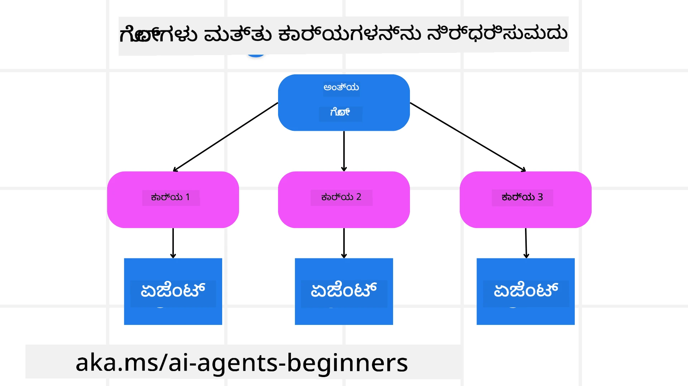

[](https://youtu.be/kPfJ2BrBCMY?si=9pYpPXp0sSbK91Dr)

> _(ಈ ಪಾಠದ ವೀಡಿಯೊ ಕಾಣಲು ಮೇಲಿನ ಚಿತ್ರವನ್ನು ಕ್ಲಿಕ್ ಮಾಡಿ)_

# ಯೋಜನೆ ವಿನ್ಯಾಸ

## ಪರಿಚಯ

ಈ ಪಾಠದಲ್ಲಿ ಈ ವಿಷಯಗಳ ಬಗ್ಗೆ ಚರ್ಚೆ ಮಾಡಲಾಗುತ್ತದೆ

* ಸ್ಪಷ್ಟ ಒಟ್ಟು ಗುರಿ ನಿರ್ಧರಿಸುವುದು ಮತ್ತು ಸಂಕೀರ್ಣ ಕಾರ್ಯವನ್ನು ನಿರ್ವಹಿಸಬಹುದಾದ ಉಪಕಾರ್ಯಗಳಾಗಿ ವಿಭಜಿಸುವುದು.
* ಆಗುಹೋಗುಗಳು ಮೆಷೀನ್-ವಾಚಕಸ್ಫರ್ಧಿತ ಪ್ರತಿಕ್ರಿಯೆಗಳಿಗೆ ರಚನಾತ್ಮಕ ಔಟ್ಪುಟ್ ಬಳಕೆ ಮಾಡುವುದು.
* ಪ್ರತ್ಯೇಕ ಕಾರ್ಯಗಳನ್ನು ಮತ್ತು ಅಪ್ರತಿಯಾಶಿತ ಇನ್‌ಪುಟ್‌ಗಳನ್ನು ನಿರ್ವಹಿಸಲು ಘಟನಾಸಕ್ತಿ ಆಧಾರಿತ ವಿಧಾನವನ್ನು ಅನ್ವಯಿಸುವುದು.

## ಕಲಿಕೆಯ ಗುರಿಗಳು

ಈ ಪಾಠವನ್ನು ಪೂರ್ಣಗೊಳಿಸಿದ ನಂತರ, ನಿಮಗೆ ಈ ವಿಷಯಗಳ ಬಗ್ಗೆ ತಿಳಿವಳಿಕೆ ಮೂಡುತ್ತದೆ:

* AI ಏಜೆಂಟ್‌ಗೆ ಒಟ್ಟು ಗುರಿಯನ್ನು ಗುರುತಿಸುವುದು ಮತ್ತು ಸೆಟು ಮಾಡುವುದರಿಂದ ಅದು ಸ್ಪಷ್ಟವಾಗಿ ಏನು ಸಾಧಿಸಬೇಕೆಂದು ತಿಳಿದುಕೊಳ್ಳುವುದು.
* ಸಂಕೀರ್ಣ ಕಾರ್ಯವನ್ನು ನಿರ್ವಹಿಸಬಹುದಾದ ಉಪಕಾರ್ಯಗಳಾಗಿ ವಿಭಜಿಸಿ ಅವುಗಳನ್ನು ಯುಕ್ತಿಗತ ಕ್ರಮದಲ್ಲಿ ಏರಿಸುವುದು.
* ಏಜೆಂಟ್‌ಗಳಿಗೆ ಸರಿಯಾದ ಸಾಧನಗಳನ್ನು (ಉದಾ: ಹುಡುಕಲಾಗಿದೆ ಸಾಧನಗಳು ಅಥವಾ ಡೇಟಾ ವಿಶ್ಲೇಷಣಾ ಸಾಧನಗಳು) ಒದಗಿಸುವುದು, ಅವನ್ನು ಯಾವಾಗ ಮತ್ತು ಹೇಗೆ ಬಳಸಬೇಕೆಂದು ನಿರ್ಧರಿಸುವುದು ಮತ್ತು ಉದ್ಭವಿಸಬಹುದಾದ ಅನಿರೀಕ್ಷಿತ ಪರಿಸ್ಥಿತಿಗಳನ್ನು ನಿರ್ವಹಿಸುವುದು.
* ಉಪಕಾರ್ಯ ಫಲಿತಾಂಶಗಳನ್ನು ಸೌಲಭ್ಯಗೊಳಿಸಿ, ಪ್ರದರ್ಶನವನ್ನು ಅಳತೆ ಮಾಡುವುದರ ಮೂಲಕ ಕೊನೆಯ ಔಟ್ಪುಟ್ ಹೆಚ್ಚಿಸುವ ಪ್ರಕ್ರಿಯೆಮಾಡುವುದು.

## ಒಟ್ಟು ಗುರಿಯನ್ನು ನಿರ್ಧರಿಸುವುದು ಮತ್ತು ಕಾರ್ಯವನ್ನು ವಿಭಜಿಸುವುದು



ಹೆಚ್ಚಿನ ನೈಜ ಜಗತ್ತಿನ ಕಾರ್ಯಗಳು ಒಂದು ಹಂತದಲ್ಲಿ ಕೈಕೊಳ್ಳಲು ತುಂಬಾ ಸಂಕೀರ್ಣವಾಗಿರುತ್ತವೆ. AI ಏಜೆಂಟ್‌ಗೆ ತನ್ನ ಯೋಜನೆ ಮತ್ತು ಕಾರ್ಯಗಳಿಗೆ ಮಾರ್ಗದರ್ಶನ ನೀಡಲು ಚುರುಕು ಗುರಿಯ ಅವಶ್ಯಕತೆ ಇರುತ್ತದೆ. ಉದಾಹರಣೆಗೆ ಗುರಿ: 

    "ಮೂರು ದಿನಗಳ ಪ್ರಯಾಣ ಯೋಜನೆ ರಚಿಸಿ."

ಸಂಪೂರ್ಣವಾಗಿ ಹೇಳಲು ಸುಲಭವಾದರೂ, ಇದನ್ನು ಇನ್ನೂ ಶೋಧಿಸಲು ಅಗತ್ಯವಿದೆ. ಗುರಿ ಸ್ಪಷ್ಟವಾಗಿರಲಿ ಎಂದರೆ ಏಜೆಂಟ್ (ಮತ್ತು ಯಾವುದೇ ಮಾನವ ಸಹಯೋಗಿಗಳು) ಸೂಕ್ತ ಫಲಿತಾಂಶ ಸಾಧಿಸಲು ಹೆಚ್ಚು ಕೇಂದ್ರೀಕರಿಸಬಹುದು, ಉದಾ: ಸಮಗ್ರ ಪ್ರಯಾಣ ಯೋಜನೆ ಬೀಳಲು ವಿಮಾನ ಆಯ್ಕೆಗಳ, ಹೋಟೆಲ್ ಶಿಫಾರಸುಗಳು ಮತ್ತು ಚಟುವಟಿಕೆ ಸಲಹೆಗಳು ಸೇರಿಸಿ.

### ಕಾರ್ಯದ ವಿಭಜನೆ

ದೊಡ್ಡ ಅಥವಾ ಸೂಕ್ಷ್ಮ ಕಾರ್ಯಗಳನ್ನು ಚಿಕ್ಕ ಚಿಕ್ಕ, ಗುರಿಗತ ಉಪಕಾರ್ಯಗಳಾಗಿ ವಿಭಜಿಸುವುದು ಹೆಚ್ಚು ನಿರ್ವಹಣೆಯಾಗಿದೆ. ಪ್ರಯಾಣ ಯೋಜನೆ ಉದಾಹರಣೆಗೆ ನೀವು ಗುರಿಯನ್ನು ವಿಭಜಿಸಬಹುದು:

* ವಿಮಾನ ಬುಕಿಂಗ್  
* ಹೋಟೆಲ್ ಬುಕಿಂಗ್  
* ಕಾರ್ ರೆಂಟಲ್  
* ವೈಯಕ್ತೀಕರಣ

ಪ್ರತಿ ಉಪಕಾರ್ಯವನ್ನು ನಿಷ್ಠೆಯಾಯಕ ಏಜೆಂಟ್‌ಗಳು ಅಥವಾ ಪ್ರಕ್ರಿಯೆಗಳು ಕೈಕೊಳ್ಳಬಹುದು. ಒಬ್ಬ ಏಜೆಂಟ್ ಉತ್ತಮ ವಿಮಾನ ದರಗಳನ್ನು ಹುಡುಕುವಲ್ಲಿ ಪರಿಣಿತನಾಗಿರಬಹುದು, ಇನ್ನೊಬ್ಬ ಹೋಟೆಲ್ ಬುಕ್ಕಿಂಗ್‌ಗಳಲ್ಲಿ ಗಮನಹರಿಸುತ್ತಾರೆ, ಇತ್ಯಾದಿ. ಸಂಯೋಜಿಸುವ ಅಥವಾ “ಡೌನ್ಸ್ಟ್ರೀಮ್” ಏಜೆಂಟ್ ಈ ಫಲಿತಾಂಶಗಳನ್ನು ಒಟ್ಟಾಗಿ ಒಂದು ಸಂಪೂರ್ಣ ಪ್ರಯಾಣ ಯೋಜನೆಯನ್ನು ಕೊನೆ ಬಳಕೆದಾರರಿಗೆ ಒದಗಿಸುತ್ತಾನೆ.

ಈ ಘಟಕೋತ್ಪನ್ನ ವಿಧಾನವು ಭಾಗಶಃ ಉತ್ತಮೀಕರಣಗಳನ್ನು ಸಹ ಅನುಮತಿಸುತ್ತದೆ. ಉದಾ: ಆಹಾರ ಶಿಫಾರಸುಗಳು ಅಥವಾ ಸ್ಥಳೀಯ ಚಟುವಟಿಕೆ ಸಲಹೆಗಳಿಗೆ ವಿಶೇಷ ಏಜೆಂಟ್‌ಗಳನ್ನು ಸೇರಿಸಬಹುದು ಮತ್ತು ಕಾಲಕ್ರಮೇಣ ಯೋಜನೆಯನ್ನು ಪುರಸ್ಕರಿಸಲು ಸಾಧ್ಯ.

### ರಚನಾತ್ಮಕ ಔಟ್ಪುಟ್

ದೊಡ್ಡ ಭಾಷಾ ಮಾದರಿಗಳು (LLMs) ರಚನಾತ್ಮಕ ಔಟ್ಪುಟ್ (ಉದಾ: JSON) ಸೃಷ್ಟಿಸಬಹುದು, ಇದು ಡೌನ್ಸ್ಟ್ರೀಮ್ ಏಜೆಂಟ್‌ಗಳು ಅಥವಾ ಸೇವೆಗಳು ವೈದ್ಯಮಾಡುವಲ್ಲಿ ಸುಲಭವಾಗಿದೆ. ಇದು ಬಹು-ಏಜೆಂಟ್ ಸಂಧರ್ಭದಲ್ಲಿ ವಿಶೇಷ ಪ್ರಸ್ತುತಕ್ಕಾಗಿವೆ, ಇದು ನಾವು ಈ ಕಾರ್ಯಗಳನ್ನು ಯೋಜನೆಯ ಔಟ್ಪುಟ್ ಬಂದ ನಂತರ ಕೈಗೊಳ್ಳಬಹುದು.

ಕೆಳಗಿನ Python ತಿದ್ದೆಲ್ಲಾ ಯೋಗ್ಯ ಏಜೆಂಟ್ ಗುರಿಯನ್ನ ತಳ್ಳುವುವು ಮತ್ತು ರಚನಾತ್ಮಕ ಯೋಜನೆ ಸೃಷ್ಟಿಸುವುದನ್ನು ತೋರಿಸುತ್ತದೆ:

```python
from pydantic import BaseModel
from enum import Enum
from typing import List, Optional, Union
import json
import os
from typing import Optional
from pprint import pprint
from agent_framework.azure import AzureAIProjectAgentProvider
from azure.identity import AzureCliCredential

class AgentEnum(str, Enum):
    FlightBooking = "flight_booking"
    HotelBooking = "hotel_booking"
    CarRental = "car_rental"
    ActivitiesBooking = "activities_booking"
    DestinationInfo = "destination_info"
    DefaultAgent = "default_agent"
    GroupChatManager = "group_chat_manager"

# ಪ್ರಯಾಣ ಉಪಕಾರ್ಯದ ಮಾದರಿ
class TravelSubTask(BaseModel):
    task_details: str
    assigned_agent: AgentEnum  # ನಾವು ಕಾರ್ಯವನ್ನು ಏಜೆಂಟ್‌ಗೆ ಹೊಂದುಗೊಳ್ಳಲು ಬಯಸುತ್ತೇವೆ

class TravelPlan(BaseModel):
    main_task: str
    subtasks: List[TravelSubTask]
    is_greeting: bool

provider = AzureAIProjectAgentProvider(credential=AzureCliCredential())

# ಬಳಕೆದಾರ ಸಂದೇಶವನ್ನು ವ್ಯಾಖ್ಯಾನಿಸಿ
system_prompt = """You are a planner agent.
    Your job is to decide which agents to run based on the user's request.
    Provide your response in JSON format with the following structure:
{'main_task': 'Plan a family trip from Singapore to Melbourne.',
 'subtasks': [{'assigned_agent': 'flight_booking',
               'task_details': 'Book round-trip flights from Singapore to '
                               'Melbourne.'}
    Below are the available agents specialised in different tasks:
    - FlightBooking: For booking flights and providing flight information
    - HotelBooking: For booking hotels and providing hotel information
    - CarRental: For booking cars and providing car rental information
    - ActivitiesBooking: For booking activities and providing activity information
    - DestinationInfo: For providing information about destinations
    - DefaultAgent: For handling general requests"""

user_message = "Create a travel plan for a family of 2 kids from Singapore to Melbourne"

response = client.create_response(input=user_message, instructions=system_prompt)

response_content = response.output_text
pprint(json.loads(response_content))
```

### ಬಹು-ಏಜೆಂಟ್ ಸಂಯೋಜನೆಯೊಂದಿಗೆ ಯೋಜನೆ ಏಜೆಂಟ್

ಈ ಉದಾಹರಣೆಯಲ್ಲಿ, ಅರ್ಥಗರ್ಭಿತ ಮಾರ್ಗದರ್ಶಕ ಏಜೆಂಟ್ ಬಳಕೆದಾರ ವಿನಂತಿ (ಉದಾ: "ನನಗೆ ನನ್ನ ಪ್ರವಾಸಕ್ಕೆ ಹೋಟೆಲ್ ಯೋಜನೆ ಬೇಕು.") ಪಡೆಯುತ್ತಾನೆ.

ಯೋಜನಾಕಾರ:

* ಹೋಟೆಲ್ ಯೋಜನೆಯನ್ನು ಸ್ವೀಕರಿಸುತ್ತಾನೆ: ಬಳಕೆದಾರ ಸಂದೇಶವನ್ನು ಸಿಸ್ಟಮ್ ಪ್ರಾಂಪ್ಟ್ ಆಧಾರದ ಮೇಲೆ (ಲಭ್ಯವಿರುವ ಏಜೆಂಟ್ ವಿವರಗಳೊಂದಿಗೆ) ಸಂಯೋಜನೆಯ ಪ್ರಯಾಣ ಯೋಜನೆಯನ್ನು ರಚಿಸುತ್ತದೆ.
* ಏಜೆಂಟ್‌ಗಳ ಪಟ್ಟಿ ಮತ್ತು ಅವರ ಸಾಧನಗಳು: ಏಜೆಂಟ್ ಪಂಜಿಯು ಫಂಕ್ಷನ್/ಸಾಧನಗಳೊಂದಿಗೆ ಏಜೆಂಟ್‌ಗಳ ಪಟ್ಟಿಯನ್ನು ಹೊಂದಿದೆ (ಉದಾ: ವಿಮಾನ, ಹೋಟೆಲ್, ಕಾರ್ ಬುಕಿಂಗ್, ಚಟುವಟಿಕೆಯಲ್ಲಿ).
* ಯೋಜನೆಯನ್ನು ಸಂಬಂಧಿತ ಏಜೆಂಟ್‌ಗಳಿಗೆ ಮಾರ್ಗದರ್ಶನ ಮಾಡುತ್ತದೆ: ಉಪಕಾರ್ಯಗಳ ಸಂಖ್ಯೆಯನ್ನು ಆಧರಿಸಿ, ಯೋಜನಾಕಾರ ಸಂದೇಶವನ್ನು ನೇರವಾಗಿaisen ಸಂಯೋಜಿತ ಏಜೆಂಟ್ ಗೆ (ಒಂದು ಕಾರ್ಯದ ಸಂದರ್ಭದಲ್ಲಿ) ಕಳುಹಿಸುವುದು ಅಥವಾ ಹಲವಾರು ಏಜೆಂಟ್ ಸಹಕಾರಕ್ಕಾಗಿ ಗುಂಪು ಚಾಟ್ ನಿರ್ವಹಣೆಯಿಂದ ಸಂಯೋಜಿಸುತ್ತದೆ.
* ಫಲಿತಾಂಶ ಸಾರಾಂಶ: ಕೊನೆಗೆ, ಯೋಜನಾಕಾರ ನಿರ್ಮಿತ ಯೋಜನೆಯನ್ನು ಸ್ಪಷ್ಟಪಡಿಸಿಕೊಂಡಿದ್ದಾನೆ.
ಕೆಳಗಿನ Python ಕೋಡ್ ಉದಾಹರಣೆ ಈ ಹಂತಗಳನ್ನು ತೋರಿಸುತ್ತದೆ:

```python

from pydantic import BaseModel

from enum import Enum
from typing import List, Optional, Union

class AgentEnum(str, Enum):
    FlightBooking = "flight_booking"
    HotelBooking = "hotel_booking"
    CarRental = "car_rental"
    ActivitiesBooking = "activities_booking"
    DestinationInfo = "destination_info"
    DefaultAgent = "default_agent"
    GroupChatManager = "group_chat_manager"

# ಪ್ರಯಾಣದ ಉಪಕಾರ್ಯ ಮಾದರಿ

class TravelSubTask(BaseModel):
    task_details: str
    assigned_agent: AgentEnum # ನಾವು ಕಾರ್ಯವನ್ನು ಏಜೆಂಟ್‌ಗೆ ನಿಗದರಿಸಬೇಕು

class TravelPlan(BaseModel):
    main_task: str
    subtasks: List[TravelSubTask]
    is_greeting: bool
import json
import os
from typing import Optional

from agent_framework.azure import AzureAIProjectAgentProvider
from azure.identity import AzureCliCredential

# ಗ್ರಾಹಕ ಅನ್ನು ರಚಿಸಿ

provider = AzureAIProjectAgentProvider(credential=AzureCliCredential())

from pprint import pprint

# ಬಳಕೆದಾರ ಸಂದೇಶವನ್ನು ವ್ಯಾಖ್ಯಾನಿಸಿ

system_prompt = """You are a planner agent.
    Your job is to decide which agents to run based on the user's request.
    Below are the available agents specialized in different tasks:
    - FlightBooking: For booking flights and providing flight information
    - HotelBooking: For booking hotels and providing hotel information
    - CarRental: For booking cars and providing car rental information
    - ActivitiesBooking: For booking activities and providing activity information
    - DestinationInfo: For providing information about destinations
    - DefaultAgent: For handling general requests"""

user_message = "Create a travel plan for a family of 2 kids from Singapore to Melbourne"

response = client.create_response(input=user_message, instructions=system_prompt)

response_content = response.output_text

# JSON ಆಗಿ ಲೋಡ್ ಮಾಡಿದ ನಂತರ ಪ್ರತಿಕ್ರಿಯೆಯ ವಿಷಯವನ್ನು ಮುದ್ರಿಸಿ

pprint(json.loads(response_content))
```

ಮುಂದಿನ ಭಾಗವು ಹಿಂದಿನ ಕೋಡ್‌ನ ಔಟ್ಪುಟ್ ಆಗಿದ್ದು, ನೀವು ಈ ರಚನಾತ್ಮಕ ಔಟ್ಪುಟ್ ಅನ್ನು `assigned_agent`ಗೆ ಮಾರ್ಗದರ್ಶಿಸಲು ಮತ್ತು ಪ್ರವಾಸ ಯೋಜನೆಯನ್ನು ಕೊನೆ ಬಳಕೆದಾರರಿಗೆ ಸಾರಾಂಶಗೊಳಿಸಲು ಬಳಸಬಹುದು.

```json
{
    "is_greeting": "False",
    "main_task": "Plan a family trip from Singapore to Melbourne.",
    "subtasks": [
        {
            "assigned_agent": "flight_booking",
            "task_details": "Book round-trip flights from Singapore to Melbourne."
        },
        {
            "assigned_agent": "hotel_booking",
            "task_details": "Find family-friendly hotels in Melbourne."
        },
        {
            "assigned_agent": "car_rental",
            "task_details": "Arrange a car rental suitable for a family of four in Melbourne."
        },
        {
            "assigned_agent": "activities_booking",
            "task_details": "List family-friendly activities in Melbourne."
        },
        {
            "assigned_agent": "destination_info",
            "task_details": "Provide information about Melbourne as a travel destination."
        }
    ]
}
```

ಹಿಂದಿನ ಕೋಡ್ ಉದಾಹರಣೆಯೊಂದಿಗೆ ಒಂದು ಉದಾಹರಣೆ ನೋಟ್ಬುಕ್ [ಇಲ್ಲಿ](07-python-agent-framework.ipynb) ದೊರಕುತ್ತದೆ.

### ಪುನರಾವರ್ತಿತ ಯೋಜನೆ

ಕನ್ನಡ ಮತ್ತು ಹಿಂದಿನ ಉಪಕಾರ್ಯದ ಫಲಿತಾಂಶ ಮುಂದಿನ ಹಂತವನ್ನು ಪ್ರಭಾವಿಸುತ್ತಿರುವ ಸಂದರ್ಭದಲ್ಲಿ ಕೆಲವು ಕಾರ್ಯಗಳು ಹಿಂದಿನ ಮತ್ತು ಮುಂದಿನ ಹಂತಗಳ ಸಂವಹನವನ್ನು ಅಥವಾ ಪುನರಾಯೋಜನೆಯನ್ನು ಅಗತ್ಯವಿರುತ್ತವೆ. ಉದಾ: ಏಜೆಂಟ್ ವಿಮಾನಗಳ ಬುಕ್ಕಿಂಗ್ ವೇಳೆ ಅಪ್ರತ್ಯಾಶಿತ ಡೇಟಾ ರೂಪವನ್ನು ಕಂಡುಹಿಡಿದರೆ, ಹೊಟೇಲ್ ಬುಕ್ಕಿಂಗ್ ಮಾಡಲು ಮುಂದುವರಿಯುವ ಮುನ್ನ ತನ್ನ ತಂತ್ರವನ್ನು ಹೊಂದಿಸಿಕೊಳ್ಳಬೇಕಾಗಬಹುದು.

ಇದಲ್ಲದೆ, ಬಳಕೆದಾರ ಪ್ರತಿಕ್ರಿಯೆ (ಉದಾ: ಮಾನವನು ಅವರು ಮೊದಲಿಗೆ ವಿಮಾನ ಬಯಸುತ್ತಾರೆ ಎಂದು ನಿರ್ಧರಿಸಿದಾಗ) ಭಾಗಶಃ ಪುನರಾಯೋಜನೆಯನ್ನು ಪ್ರೇರೇಪಿಸಬಹುದು. ಈ ಚಲನೆಯು, ಪುನರಾವರ್ತಿತ ವಿಧಾನವು ಕೊನೆದ ಮೂಲ ಪರಿಹಾರವು ನೈಜ ಜಗತಿಯಿಂದಾಗಿ ನಿಯಂತ್ರಣಗಳಿಗೆ ಮತ್ತು ಬಳಕೆದಾರನ ಪ್ರಾಧಾನ್ಯತೆಗಳಿಗೆ ತಕ್ಕಂತೆ ಹೊಂದಿಕೊಳ್ಳಲಿವೆ ಎನ್ನುವುದನ್ನು ಖಚಿತಪಡಿಸುತ್ತದೆ.

ಉದಾಹರಣೆಗೆ ಕೋಡ್

```python
from agent_framework.azure import AzureAIProjectAgentProvider
from azure.identity import AzureCliCredential
#.. ಹಿಂದಿನ ಕೋಡ್ ನಂತೆ ಮತ್ತು ಬಳಕೆದಾರರ ಇತಿಹಾಸ, ಪ್ರಸ್ತುತ ಯೋಜನೆಯನ್ನು ಪಾಸ್ ಮಾಡಿ

system_prompt = """You are a planner agent to optimize the
    Your job is to decide which agents to run based on the user's request.
    Below are the available agents specialized in different tasks:
    - FlightBooking: For booking flights and providing flight information
    - HotelBooking: For booking hotels and providing hotel information
    - CarRental: For booking cars and providing car rental information
    - ActivitiesBooking: For booking activities and providing activity information
    - DestinationInfo: For providing information about destinations
    - DefaultAgent: For handling general requests"""

user_message = "Create a travel plan for a family of 2 kids from Singapore to Melbourne"

response = client.create_response(
    input=user_message,
    instructions=system_prompt,
    context=f"Previous travel plan - {TravelPlan}",
)
# ..punyaಮಂತ್ರಣೆಯನ್ನು ಪುನಃಯೋಜಿಸಿ ಮತ್ತು ಕಾರ್ಯಗಳನ್ನು ಬದ್ಧ ಏಜೆಂಟ್ಗೆ ಕಳುಹಿಸಿ
```

ವಿವರವಾದ ಯೋಜನೆಗಾಗಿ Magnetic One <a href="https://www.microsoft.com/research/articles/magentic-one-a-generalist-multi-agent-system-for-solving-complex-tasks" target="_blank">ಬ್ಲಾಗ್‌ಪೋಸ್ಟ್</a> ಅನ್ನು ನೋಡಿ ಸಂಕೀರ್ಣ ಕಾರ್ಯಗಳನ್ನು ಪರಿಹರಿಸಲು.

## ಸಾರಾಂಶ

ಈ ಲೇಖನದಲ್ಲಿ ನಾವು ಪ್ಲ್ಯಾನರ್ ಅನ್ನು ಉದಾಹರಣೆ ಮಾಡಿದ್ದೇವೆ, ಅದು ಲಭ್ಯವಿರುವ ಏಜೆಂಟ್‌ಗಳನ್ನು پسندಪಟ್ಟು ಅಥವಾ ಆಯ್ಕೆ ಮಾಡಬಹುದು. ಪ್ಲ್ಯಾನರ್ ಔಟ್ಪುಟ್ ಉಂಟಾಗುವ ಕಾರ್ಯಗಳನ್ನು ವಿಭಜಿಸಿ ಅವುಗಳನ್ನು ಏಜೆಂಟ್‌ಗಳಿಗೆ ಹಂಚುತ್ತದೆ, ಹಾಗು ಅವುನಿರ್ವಹಿಸಲಾಗುತ್ತದೆ ಎಂದು ಅಂದುಕೊಳ್ಳಲಾಗಿದೆ. ಏಜೆಂಟ್‌ಗಳಿಗೆ ಆ ಕಾರ್ಯವನ್ನು ಕಾರ್ಯಗತಗೊಳಿಸಲು ಅಗತ್ಯವಿರುವ ಕಾರ್ಯಗಳು/ಸಾಧನಗಳಿಗೆ ಪ್ರವೇಶವಿದೆ. ಏಜೆಂಟ್‌ಗಳ ಹೊರತಾಗಿಯೂ, ನೀವು ಪರಾವಲೋಕನ, ಸಾರಾಂಶಕಾರ ಮತ್ತು ರೌಂಡ್ ರಾಬಿನ್ ಚಾಟ್ ಲాంటి ಮಾದರಿಗಳನ್ನು ಸೇರಿಸಬಹುದು, ಇವುಗಳನ್ನು ಹೆಚ್ಚಿನ ಅನುಕೂಲಕ್ಕಾಗಿ.

## ಹೆಚ್ಚುವರಿ ಸಂಪನ್ಮೂಲಗಳು

Magentic One - ಸಂಕೀರ್ಣ ಕಾರ್ಯಗಳ ಪರಿಹಾರಕ್ಕಾಗಿ ಸಾಮಾನ್ಯ ಬಹು-ಏಜೆಂಟ್ ವ್ಯವಸ್ಥೆಯಾಗಿದ್ದು, ಸವಾಲಿನ ಎಜೆಂಟಿಕ್ ಮೌಲ್ಯಮಾಪನಗಳಲ್ಲಿ ಅದ್ಭುತ ಫಲಿತಾಂಶಗಳನ್ನು ಗಳಿಸಿದೆ. ಉಲ್ಲೇಖ: <a href="https://www.microsoft.com/research/articles/magentic-one-a-generalist-multi-agent-system-for-solving-complex-tasks" target="_blank">Magentic One</a>. ಈ ಜಾರಿಗೆ, ಸಂಯೋಜಕ ಕಾರ್ಯ ನಿರ್ದಿಷ್ಟ ಯೋಜನೆಗಳನ್ನು ರಚಿಸಿ ಅವುಗಳನ್ನು ಲಭ್ಯವಿರುವ ಏಜೆಂಟ್‌ಗಳಿಗೆ ವಹಿಸುತ್ತದೆ. ಯೋಜನೆಗೆ ಜೊತೆಗೆ ಸಂಯೋಜಕ ಕಾರ್ಯ ಪ್ರಗತಿ ನಿಗಾ ಮತ್ತು ಅಗತ್ಯವಿದ್ದರೆ ಮರು-ಯೋಜನೆ ಮಾಡುವ ನಿರ್ವಹಣಾ ವ್ಯವಸ್ಥೆಯನ್ನು ಬಳಕೆಮಾಡುತ್ತದೆ.

### ಯೋಜನೆ ವಿನ್ಯಾಸ ಮಾದರಿಯ ಬಗ್ಗೆ ಮತ್ತಷ್ಟು ಪ್ರಶ್ನೆಗಳಿದ್ದರೆ?

[Microsoft Foundry Discord](https://aka.ms/ai-agents/discord) ಗೆ ಸೇರಿ ಇತರ ಕಲಿಯುತ್ತಿರುವವರನ್ನು ಭೇಟಿಯಾಗಿರಿ, ಕಾರ್ಯಕಾಲಗಳಲ್ಲಿ ಪಾಲ್ಗೊಳ್ಳಿ ಮತ್ತು ನಿಮ್ಮ AI ಏಜೆಂಟ್ ಪ್ರಶ್ನೆಗಳಿಗೆ ಉತ್ತರ ಪಡೆಯಿರಿ.

## ಹಿಂದಿನ ಪಾಠ

[ನಂಬಬಹುದಾದ AI ಏಜೆಂಟ್ ನಿರ್ಮಿಸಲಾಗುವುದು](../06-building-trustworthy-agents/README.md)

## ಮುಂದಿನ ಪಾಠ

[ಬಹು-ಏಜೆಂಟ್ ವಿನ್ಯಾಸ ಮಾದರಿ](../08-multi-agent/README.md)

---

<!-- CO-OP TRANSLATOR DISCLAIMER START -->
**ಅಸ್ವೀಕರಣಿಕೆ**:  
ಈ ಡಾಕ್ಯುಮೆಂಟ್ ಅನ್ನು AI ಭಾಷಾಂತರ ಸೇವೆ [Co-op Translator](https://github.com/Azure/co-op-translator) ಬಳಸಿ ಭಾಷಾಂತರಿಸಲಾಗಿದೆ. ನಾವು ನಿಖರತೆಯಿಗಾಗಿ ಪ್ರಯತ್ನಿಸುತ್ತಿದ್ದರೂ, ಸ್ವಯಂಚಾಲಿತ ಭಾಷಾಂತರಗಳಲ್ಲಿ ದೋಷಗಳು ಅಥವಾ ಅಸತ್ಯತೆಗಳು ಇರುವ ಸಾಧ್ಯತೆ ಇದೆ. ಮೂಲ ಭಾಷೆಯಲ್ಲಿನ ದಾಖಲೆಗಳನ್ನು ಅಧಿಕೃತ ಆಧಾರವಾಗಿ ಪರಿಗಣಿಸಬೇಕು. ಮಹತ್ವಪೂರ್ಣ ಮಾಹಿತಿಗಾಗಿ ವೃತ್ತಿಪರ ಮಾನವ ಭಾಷಾಂತರವನ್ನು ಶಿಫಾರಸು ಮಾಡಲಾಗುತ್ತದೆ. ಈ ಭಾಷಾಂತರ ಬಳಕೆಯಿಂದ ಉಂಟಾಗುವ ಯಾವುದೇ ಅರ್ಥಗೈಕೆ ತಪ್ಪುಗಳಿಗೆ ನಾವು ಜವಾಬ್ದಾರಿಯಾಗಿ ಇರುವುದಿಲ್ಲ.
<!-- CO-OP TRANSLATOR DISCLAIMER END -->