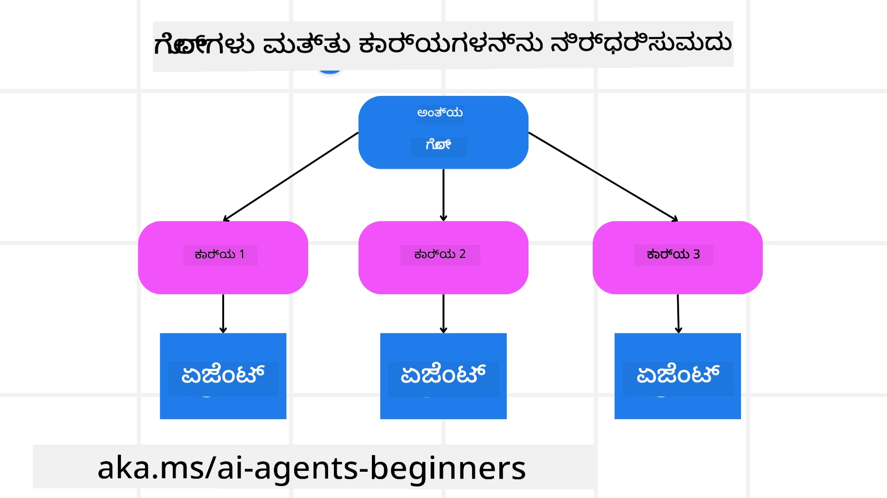

[](https://youtu.be/kPfJ2BrBCMY?si=9pYpPXp0sSbK91Dr)

> _(ಈ ಪಾಠದ ವಿಡಿಯೋವನ್ನು ವೀಕ್ಷಿಸಲು ಮೇಲಿನ ಚಿತ್ರವನ್ನು ಕ್ಲಿಕ್ ಮಾಡಿ)_

# ಪ್ಲ್ಯಾನಿಂಗ್ ಡಿಸೈನ್

## ಪರಿಚಯ

ಈ ಪಾಠದಲ್ಲಿ ನಾವು ನೋಡಬಹುದಾದವು

* ಸ್ಪಷ್ಟವಾದ ಒಟ್ಟು ಗುರಿಯನ್ನು ನಿರ್ಧರಿಸಿ, ಸಂಕೀರ್ಣ ಕೆಲಸವನ್ನು ನಿರ್ವಹಣಾ ಕಾರ್ಯಗಳಾಗಿ ವಿಭಾಗಿಸುವುದು.
* ಹೆಚ್ಚು ವಿಶ್ವಾಸಾರ್ಹ ಮತ್ತು ಯಂತ್ರ ಓದುವಿಕೆಗೆ ಸೂಕ್ತವಾದ ನಿರ್ಮಿತ ಔಟ್ಪುಟ್ ಅನ್ನು ಬಳಸುವುದು.
* ಡೈನಾಮಿಕ್ ಕಾರ್ಯಗಳು ಮತ್ತು ಅಕಸ್ಮಾತ್ ಇನ್‌ಪುಟ್‌ಗಳನ್ನು ನಿಭಾಯಿಸಲು ಘಟನೆಚಾಲಿತ (ಇವೆಂಟ್ ಚಾಲಿತ) ವಿಧಾನವನ್ನು ಅನ್ವಯಿಸುವುದು.

## ಕಲಿಕೆ ಗುರಿಗಳು

ಈ ಪಾಠವನ್ನು ಪೂರ್ಣಗೊಳಿಸಿದ ನಂತರ, ನಿಮಗೆ ಇವುಗಳ ಕುರಿತು ಅರಿವು ಮೂಡಲಿದೆ:

* AI ಏಜೆಂಟ್‌ಗಾಗಿ ಒಟ್ಟು ಗುರಿಯನ್ನು ಗುರುತಿಸಿ ಮತ್ತು ಸ್ಥಾಪಿಸಿ, ಅದು ಯಾವುದನ್ನು ಸಾಧಿಸಬೇಕೆಂದು ಸ್ಪಷ್ಟವಾಗಿ ತಿಳಿದುಕೊಳ್ಳಲಿ.
* ಸಂಕೀರ್ಣ ಕಾರ್ಯವನ್ನು ನಿರ್ವಹಣೀಯ ಉಪಕಾರ್ಯಗಳಾಗಿ ವಿಭಾಗಿಸಿ ಮತ್ತು ಅವುಗಳನ್ನು ತಾರ್ಕಿಕ ಕ್ರಮದಲ್ಲಿ ಸಂಘಟಿಸಿ.
* ಏಜೆಂಟ್‌ಗಳನ್ನು ಸರಿಯಾದ ಸಾಧನಗಳೊಂದಿಗೆ (ಉದಾ: ಹುಡುಕಿ ಸಾಧನಗಳು ಅಥವಾ ಡೇಟಾ ವಿಶ್ಲೇಷಣಾ ಸಾಧನಗಳು) ಸಜ್ಜುಗೊಳಿಸಿ, ಅವುಗಳನ್ನು ಯಾವಾಗ ಮತ್ತು ಹೇಗೆ ಉಪಯೋಗಿಸಬೇಕೆಂದು ನಿರ್ಧರಿಸಿ, ಮತ್ತು ಉದ್ಭವಿಸುವ ಅಕಸ್ಮಾತ್ ಪರಿಸ್ಥಿತಿಗಳನ್ನು ನಿರ್ವಹಿಸಿ.
* ಉಪಕಾರ್ಯ ಫಲಿತಾಂಶಗಳನ್ನು ಮೌಲ್ಯಮಾಪನ ಮಾಡಿ, ಕಾರ್ಯಕ್ಷಮತೆಯನ್ನು ಅಳೆಯಿರಿ ಮತ್ತು ಅಂತಿಮ ಔಟ್ಪುಟ್ ಅನ್ನು ಸುಧಾರಿಸಲು ಕ್ರಮಗಳನ್ನು ಪುನರಾವರ್ತಿಸಿ.

## ಒಟ್ಟು ಗುರಿಯ ನಿರ್ವಾಚನ ಮತ್ತು ಕೆಲಸ ವಿಭಾಗ



ಬಹುಮಟ್ಟಿನ ಸಂಬಂಧಿತ ಕಾರ್ಯಗಳನ್ನು ಒಂದು ಹಂತದಲ್ಲಿ ನಿಭಾಯಿಸುವುದು ಬಹಳ ಕಷ್ಟವಾಗಿ ಇರುತ್ತದೆ. AI ಏಜೆಂಟ್‌ಗಾಗಿ ಸರಳವಾದ ಗುರಿ ಬೇಕಾಗುತ್ತದೆ ಅದು ಪ್ಲ್ಯಾನಿಂಗ್ ಮತ್ತು ಕಾರ್ಯಾಚರಣೆಗಳನ್ನು ಮಾರ್ಗದರ್ಶಿಸುತ್ತದೆ. ಉದಾಹರಣೆಗೆ, ಗುರಿ ಯನ್ನು ಪರಿಗಣಿಸಿ:

    "3-ದಿನಗಳ ಪ್ರವಾಸಿ ಕಾರ್ಯಕ್ರಮವನ್ನು ರಚಿಸಿ."

ಇದು ಸರಳವಾಗಿ ಹೇಳುತ್ತದೆ, ಆದರೆ ಇನ್ನೂ ಸುಧಾರಣೆ ಅಗತ್ಯವಿದೆ. ಗುರಿ ಸ್ಪಷ್ಟವಾದರೆ, ಏಜೆಂಟ್ (ಮತ್ತು ಯಾವುದೇ ಮಾನವ ಸಹಯೋಗಿಗಳೂ) ಸರಿಯಾದ ಫಲಿತಾಂಶವನ್ನು ಸಾಧಿಸುವ ದಿಕ್ಕಿನಲ್ಲಿ ಹೆಚ್ಚು ಕೇಂದ್ರೀಕರಿಸಬಹುದು, ಉದಾ: ವಿಮಾನ ಮಾರ್ಗಗಳು, ಹೋಟೆಲ್ ಶಿಫಾರಸ್ಸುಗಳು ಮತ್ತು ಸક્રಿಯ ಸೂಚನೆಗಳನ್ನು ಒಳಗೊಂಡ ಸಮಗ್ರ ಕಾರ್ಯಕ್ರಮವನ್ನು ರೂಪಿಸುವುದು.

### ಕಾರ್ಯ ವಿಭಾಗಕರಣ

ದೊಡ್ಡ ಅಥವಾ ಸಂಕೀರ್ಣ ಕಾರ್ಯಗಳನ್ನು ಚಿಕ್ಕ, ಗುರಿ ಆಧಾರಿತ ಉಪಕಾರ್ಯಗಳಾಗಿ ಭಾಗಿಸಿದರೆ ಅವು ನಿರ್ವಹಣೀಯವಾಗುತ್ತವೆ.
ಪ್ರವಾಸಿ ಕಾರ್ಯಕ್ರಮದ ಉದಾಹರಣೆಗಾಗಿ, ಗುರಿಯನ್ನು ಈ ಕೆಳಗಿನಂತೆ ವಿಭಾಗಿಸಬಹುದು:

* ವಿಮಾನ ಬುಕಿಂಗ್
* ಹೋಟೆಲ್ ಬುಕಿಂಗ್
* ಕಾರು ಬಾಡಿಗೆ
* ವೈಯಕ್ತಿಕೀಕರಣ

ಪ್ರತಿ ಉಪಕಾರ್ಯವನ್ನು ಕೇವಲ ಒಂದಿಷ್ಟು ಏಜೆಂಟ್‌ಗಳು ಅಥವಾ ಪ್ರಕ್ರಿಯೆಗಳು ನಿಭಾಯಿಸಬಹುದು. ಒಂದು ಏಜೆಂಟ್ ಉತ್ತಮ ವಿಮಾನ ದೀಲ್ಗಳಿಗಾಗಿ ಹುಡುಕಲಿದೆ, ಮತ್ತೊಂದು ಹೋಟೆಲ್ ಬುಕಿಂಗ್ ಮೇಲೆ ಗಮನ ನೀಡುತ್ತದೆ, ಹಾಗೆಯೇ ಮುಂದುವರಿಯುತ್ತದೆ. ಸಂಯೋಜಕ ಅಥವಾ "ಡೌನ್‌ಸ್ಟ್ರೀಮ್" ಏಜೆಂಟ್ ಈ ಫಲಿತಾಂಶಗಳನ್ನು ಒಂದು ಸಮಗ್ರ ಪ್ರವಾಸಿ ಕಾರ್ಯಕ್ರಮವಾಗಿ ಬಳಕೆದಾರರಿಗೆ ತಲುಪಿಸಲು ಸಂಯೋಜಿಸುತ್ತದೆ.

ಈ ಘಟಕಾತ್ಮಕ ವಿಧಾನವು ಕ್ರಮೇಣ ಸುಧಾರಣೆಗಳಿಗೆ ಸಹ ಅವಕಾಶ ನೀಡುತ್ತದೆ. ಉದಾಹರಣೆಗೆ, ಆಹಾರ ಶಿಫಾರಸುಗಳು ಅಥವಾ ಸ್ಥಳೀಯ ಚಟುವಟಿಕೆ ಸಲಹೆಗಳಿಗೆ ವಿಶೇಷ ಏಜೆಂಟ್‌ಗಳನ್ನು ಸೇರಿಸಬಹುದು ಮತ್ತು ಸಮಯದೊಂದಿಗೆ ಕಾರ್ಯಕ್ರಮವನ್ನು ಸುಧಾರಿಸಬಹುದು.

### ನಿರ್ಮಿತ ಔಟ್ಪುಟ್

ದೊಡ್ಡ ಭಾಷಾ ಮಾದರಿಗಳು (LLMs) JSON ಮುಂತಾದ ನಿರ್ಮಿತ ಔಟ್ಪುಟ್ ಅನ್ನು ರಚಿಸಬಹುದು, ಇದನ್ನು ಡೌನ್‌ಸ್ಟ್ರೀಮ್ ಏಜೆಂಟ್‌ಗಳು ಅಥವಾ ಸೇವೆಗಳು ಸುಲಭವಾಗಿ ಪಾಸುಮಾಡಿ ಪ್ರಕ್ರಿಯೆ ಮಾಡಬಹುದು. ಇದು ಬಹು-ಏಜೆಂಟ್ ಸನ್ನಿವೇಶದಲ್ಲಿ ವಿಶೇಷವಾಗಿ ಉಪಯುಕ್ತ, ಇಲ್ಲಿ ಈ ಕಾರ್ಯಗಳನ್ನು ನೀವು ಪ್ಲ್ಯಾನಿಂಗ್ ಔಟ್ಪುಟ್ ಬಂದ ನಂತರ ಕಾರ್ಯಗತಗೊಳಿಸಬಹುದು.

ಕೆಳಗಿನ ಪೈಥಾನ್ ಉದಾಹರಣೆಯಲ್ಲಿ ಸರಳ ಪ್ಲ್ಯಾನಿಂಗ್ ಏಜೆಂಟ್ ಗುರಿಯನ್ನು ಉಪಕಾರ್ಯಗಳಿಗೆ ವಿಭಾಗಿಸಿ ಮತ್ತು ನಿರ್ಮಿತ ಯೋಜನೆಯನ್ನು ರಚಿಸುವುದು ತೋರಿಸಲಾಗಿದೆ:

```python
from pydantic import BaseModel
from enum import Enum
from typing import List, Optional, Union
import json
import os
from typing import Optional
from pprint import pprint
from agent_framework.foundry import FoundryChatClient
from azure.identity import AzureCliCredential

class AgentEnum(str, Enum):
    FlightBooking = "flight_booking"
    HotelBooking = "hotel_booking"
    CarRental = "car_rental"
    ActivitiesBooking = "activities_booking"
    DestinationInfo = "destination_info"
    DefaultAgent = "default_agent"
    GroupChatManager = "group_chat_manager"

# ಪ್ರಯಾಣ ಉಪಕಾರ್ಯದ ಮಾದರಿ
class TravelSubTask(BaseModel):
    task_details: str
    assigned_agent: AgentEnum  # ನಾವು ಕಾರ್ಯವನ್ನು ಏಜೆಂಟ್‌ಗೆ ನಿಯುಕ್ತಗೊಳಿಸಲು ಬಯಸುತ್ತೇವೆ

class TravelPlan(BaseModel):
    main_task: str
    subtasks: List[TravelSubTask]
    is_greeting: bool

provider = FoundryChatClient(
    project_endpoint=os.environ["AZURE_AI_PROJECT_ENDPOINT"],
    model=os.environ["AZURE_AI_MODEL_DEPLOYMENT_NAME"],
    credential=AzureCliCredential(),
)

# ಬಳಕೆದಾರ ಸಂದೇಶವನ್ನು ವ್ಯಾಖ್ಯಾನಿಸಿ
system_prompt = """You are a planner agent.
    Your job is to decide which agents to run based on the user's request.
    Provide your response in JSON format with the following structure:
{'main_task': 'Plan a family trip from Singapore to Melbourne.',
 'subtasks': [{'assigned_agent': 'flight_booking',
               'task_details': 'Book round-trip flights from Singapore to '
                               'Melbourne.'}
    Below are the available agents specialised in different tasks:
    - FlightBooking: For booking flights and providing flight information
    - HotelBooking: For booking hotels and providing hotel information
    - CarRental: For booking cars and providing car rental information
    - ActivitiesBooking: For booking activities and providing activity information
    - DestinationInfo: For providing information about destinations
    - DefaultAgent: For handling general requests"""

user_message = "Create a travel plan for a family of 2 kids from Singapore to Melbourne"

response = client.create_response(input=user_message, instructions=system_prompt)

response_content = response.output_text
pprint(json.loads(response_content))
```

### ಬಹು-ಏಜೆಂಟ್ ಸಂಯೋಜನೆೊಂದಿಗೆ ಯೋಜನಾ ಏಜೆಂಟ್

ಈ ಉದಾಹರಣೆಯಲ್ಲಿ, Semantic Router ಏಜೆಂಟ್ ಬಳಕೆದಾರನ ವಿನಂತಿಯನ್ನು (ಉದಾ: "ನನಗೆ ನನ್ನ ಪ್ರವಾಸಕ್ಕೆ ಹೋಟೆಲ್ ಯೋಜನೆ ಬೇಕು") ಸ್ವೀಕರಿಸುತ್ತದೆ.

ನಂತರ, ಪ್ಲ್ಯಾನರ್:

* ಹೋಟೆಲ್ ಯೋಜನೆ ಪಡೆದಿದೆ: ಬಳಕೆದಾರನ ಸಂದೇಶವನ್ನು ತೆಗೆದುಕೊಂಡು, ವ್ಯವಸ್ಥಾ ಪ್ರಾಂಪ್ಟ್ ಆಧಾರದಲ್ಲಿದ್ದು (ಲಭ್ಯವಿರುವ ಏಜೆಂಟ್ ವಿವರಗಳನ್ನು ಸೇರಿಸಿ) ಸಂಕೀರ್ಣ ಪ್ರವಾಸಿ ಯೋಜನೆಯನ್ನು ರಚಿಸುತ್ತದೆ.
* ಏಜೆಂಟ್‌ಗಳ ಪಟ್ಟಿಯನ್ನು ಮತ್ತು ಅವರ ಸಾಧನಗಳನ್ನು ಪಟ್ಟಿ ಮಾಡುತ್ತದೆ: ಏಜೆಂಟ್ ದಾಖಲೆವು ಏಜೆಂಟ್‌ಗಳ (ಉದಾ: ವಿಮಾನ, ಹೋಟೆಲ್, ಕಾರು ಬಾಡಿಗೆ ಮತ್ತು ಚಟುವಟಿಕೆಗಳಿಗೆ) ಪಟ್ಟಿ ಮತ್ತು ಅವರು ಒದಗಿಸುವ ಕಾರ್ಯಗಳು ಅಥವಾ ಸಾಧನಗಳನ್ನು ಹೊಂದಿದೆ.
* ಯೋಜನೆಯನ್ನು ಪ್ರತ್ಯೇಷ್ ಏಜೆಂಟ್‌ಗಳಿಗೆ ರವಾನೆ ಮಾಡುತ್ತದೆ: ಉಪಕಾರ್ಯಗಳ ಸಂಖ್ಯೆಯ ಪಡಿತರವಾಗಿ, ಪ್ಲ್ಯಾನರ್ ಸಂದೇಶವನ್ನು ನೇರವಾಗಿ ಒಂದು ನಿಶ್ಚಿತ ಏಜೆಂಟ್‌ಗೆ ಕಳುಹಿಸಲುತ್ತದೆ (ಏಕ-ಉಪಕಾರ್ಯ ಸನ್ನಿವೇಶಗಳಿಗೆ) ಅಥವಾ ಬಹು-ಏಜೆಂಟ್ ಸಹಯೋಗಕ್ಕೆ ಗುಂಪು ಚಾಟ್ ನಿರ್ವಹಣೆಯಿಂದ ಸಮನ್ವಯಗೊಳಿಸುತ್ತದೆ.
* ಫಲಿತಾಂಶದ ಸಾರಾಂಶ ಒದಗಿಸುತ್ತದೆ: ಕೊನೆಗೆ, ಪ್ಲ್ಯಾನರ್ ಸೃಷ್ಟಿಸಿದ ಯೋಜನೆಯನ್ನು ಸ್ಪಷ್ಟತೆಗೆ ಸಾರಾಂಶಿಸುತ್ತದೆ.
ಕೆಳಗಿನ ಪೈಥಾನ್ ಕೋಡ್ ಮಾದರಿ ಈ ಹಂತಗಳನ್ನು ವಿವರಿಸುತ್ತದೆ:

```python

from pydantic import BaseModel

from enum import Enum
from typing import List, Optional, Union

class AgentEnum(str, Enum):
    FlightBooking = "flight_booking"
    HotelBooking = "hotel_booking"
    CarRental = "car_rental"
    ActivitiesBooking = "activities_booking"
    DestinationInfo = "destination_info"
    DefaultAgent = "default_agent"
    GroupChatManager = "group_chat_manager"

# ಪ್ರಯಾಣ ಉಪಕಾರ್ಯ ಮಾದರಿ

class TravelSubTask(BaseModel):
    task_details: str
    assigned_agent: AgentEnum # ನಾವು ಕಾರ್ಯವನ್ನು ಏಜೆಂಟ್‌ಗೆ ಹಂಚಲು ಬಯಸುತ್ತೇವೆ

class TravelPlan(BaseModel):
    main_task: str
    subtasks: List[TravelSubTask]
    is_greeting: bool
import json
import os
from typing import Optional

from agent_framework.foundry import FoundryChatClient
from azure.identity import AzureCliCredential

# ಗ್ರಾಹಕನನ್ನು ರಚಿಸಿ

provider = FoundryChatClient(
    project_endpoint=os.environ["AZURE_AI_PROJECT_ENDPOINT"],
    model=os.environ["AZURE_AI_MODEL_DEPLOYMENT_NAME"],
    credential=AzureCliCredential(),
)

from pprint import pprint

# ಬಳಕೆದಾರ ಸಂದೇಶವನ್ನು ವ್ಯಾಖ್ಯಾನಿಸಿ

system_prompt = """You are a planner agent.
    Your job is to decide which agents to run based on the user's request.
    Below are the available agents specialized in different tasks:
    - FlightBooking: For booking flights and providing flight information
    - HotelBooking: For booking hotels and providing hotel information
    - CarRental: For booking cars and providing car rental information
    - ActivitiesBooking: For booking activities and providing activity information
    - DestinationInfo: For providing information about destinations
    - DefaultAgent: For handling general requests"""

user_message = "Create a travel plan for a family of 2 kids from Singapore to Melbourne"

response = client.create_response(input=user_message, instructions=system_prompt)

response_content = response.output_text

# JSON ಆಗಿ ಲೋಡ್ ಮಾಡಿದ ನಂತರ ಪ್ರತಿಕ್ರಿಯೆಯ ವಿಷಯವನ್ನು ಮುದ್ರಿಸಿ

pprint(json.loads(response_content))
```

ಮುಂದಿನ ಆಧಾರಿನ್ನೆಂದರೆ ಹೀಗೆ ತೆಗೆದುಕೊಂಡ ಔಟ್ಪುಟ್ ಆಗಿದ್ದು, ನೀವು ಈ ನಿರ್ಮಿತ ಔಟ್ಪುಟ್ ಅನ್ನು `assigned_agent` ಗೆ ಮಾರ್ಗಸೂಚು ಮಾಡಬಹುದು ಮತ್ತು ಪ್ರವಾಸಿ ಯೋಜನೆಯನ್ನು ಅಂತಿಮ ಬಳಕೆದಾರರಿಗೆ ಸಾರಾಂಶಿಸಬಹುದು.

```json
{
    "is_greeting": "False",
    "main_task": "Plan a family trip from Singapore to Melbourne.",
    "subtasks": [
        {
            "assigned_agent": "flight_booking",
            "task_details": "Book round-trip flights from Singapore to Melbourne."
        },
        {
            "assigned_agent": "hotel_booking",
            "task_details": "Find family-friendly hotels in Melbourne."
        },
        {
            "assigned_agent": "car_rental",
            "task_details": "Arrange a car rental suitable for a family of four in Melbourne."
        },
        {
            "assigned_agent": "activities_booking",
            "task_details": "List family-friendly activities in Melbourne."
        },
        {
            "assigned_agent": "destination_info",
            "task_details": "Provide information about Melbourne as a travel destination."
        }
    ]
}
```

ಮೊದಲು ನೀಡಲಾದ ಕೋಡ್ ಉದಾಹರಣೆಯೊಂದಿಗೆ ಒಂದು ಉದಾಹರಣಾ ನೋಟ್ ಬುಕ್ ಇಲ್ಲಿ ಲಭ್ಯವಿದೆ [ಇಲ್ಲಿ](./code_samples/07-python-agent-framework.ipynb).

### ಪುನರಾವರ್ತಿತ ಯೋಜನೆ

ಕೆಲವು ಕಾರ್ಯಗಳು ಹಿಂದಿನ ಮತ್ತು ಮುಂದಿನ ಕರೆಗಳೊಂದಿಗೆ ಅಥವಾ ಪುನಃ ಯೋಜನೆ ಅಗತ್ಯವಿರಬಹುದು, ಒಂದು ಉಪಕಾರ್ಯದ ಫಲಿತಾಂಶವು ಮುಂದಿನ ಕಾರ್ಯದ ನಿರ್ಧಾರಕ್ಕೆ ಪ್ರಭಾವ ಬೀರುತ್ತದೆ. ಉದಾ: ಏಜೆಂಟ್ ವಿಮಾನ ಬುಕಿಂಗ್ ವೇಳೆ ಅಕಸ್ಮಾತ್ ಡೇಟಾ ಸ್ವರೂಪವನ್ನು ಕಂಡುಹಿಡಿದರೆ, ಅದು ಹೋಟೆಲ್ ಬುಕಿಂಗ್ ಮಾಡಲು ಮುಂದುವರಿಯುವ ಮೊದಲು ತನ್ನ ರೂಪರೇಖೆಯನ್ನು ಹೊಂದಿಕೊಳ್ಳಬೇಕಾಗಬಹುದು.

ಜೊತೆಗೆ, ಬಳಕೆದಾರರ ಪ್ರತಿಕ್ರಿಯೆ (ಉದಾ: ಮಾನವನೊಬ್ಬನು ಮೊದಲ ವಿಮಾನವನ್ನು ಇಷ್ಟಪಡುತ್ತಾನೆಂಬ ನಿರ್ಧಾರ) ಭಾಗಶಃ ಪುನಃ ಯೋಜನೆಯನ್ನು ಪ್ರೇರೇಪಿಸಬಹುದು. ಈ ಡೈನಾಮಿಕ್, ಪುನರಾವರ್ತಿತ ವಿಧಾನವು ಅಂತಿಮ ಪರಿಹಾರವು ವಾಸ್ತವಿಕ ಸೀಮಿತತೆಗಳಿಗೂ ಮತ್ತು ಅಭಿವೃದ್ದಿ ಹೊಂದಿದ ಬಳಕೆದಾರ ಅಭಿಪ್ರಾಯಗಳಿಗೆ ಅನುಗುಣವಾಗಿರುವುದಾಗಿ ಖಚಿತಪಡಿಸುತ್ತದೆ.

ಉದಾಹರಣೆಯಾಗಿ ಕೋಡ್

```python
import os
from agent_framework.foundry import FoundryChatClient
from azure.identity import AzureCliCredential
#.. ಹಿಂದೆಗಿನ ಕೋಡ್‌ನಂತೆಯೇ ಮತ್ತು ಬಳಕೆದಾರ ಇತಿಹಾಸ, ಪ್ರಸ್ತುತ ಯೋಜನೆಯನ್ನು ಮುಂದುವರಿಸಿ

system_prompt = """You are a planner agent to optimize the
    Your job is to decide which agents to run based on the user's request.
    Below are the available agents specialized in different tasks:
    - FlightBooking: For booking flights and providing flight information
    - HotelBooking: For booking hotels and providing hotel information
    - CarRental: For booking cars and providing car rental information
    - ActivitiesBooking: For booking activities and providing activity information
    - DestinationInfo: For providing information about destinations
    - DefaultAgent: For handling general requests"""

user_message = "Create a travel plan for a family of 2 kids from Singapore to Melbourne"

response = client.create_response(
    input=user_message,
    instructions=system_prompt,
    context=f"Previous travel plan - {TravelPlan}",
)
# .. ಮರು ಯೋಜನೆ ಮಾಡಿ ಮತ್ತು ಟಾಸ್ಕ್‌ಗಳನ್ನು ಸಂಬಂಧಿಸಿದ ಏಜೆಂಟ್‌ಗಳಿಗೆ ಕಳುಹಿಸಿ
```

ಸಂಕೀರ್ಣ ಕಾರ್ಯಗಳನ್ನು ನಿರ್ವಹಿಸಲು Magnetic One <a href="https://www.microsoft.com/research/articles/magentic-one-a-generalist-multi-agent-system-for-solving-complex-tasks" target="_blank">ಬ್ಲಾಗ್‌ಪೋಸ್ಟ್</a> ಅನ್ನು ನೋಡಿ.

## ಸಾರಾಂಶ

ಈ ಲೇಖನದಲ್ಲಿ, ನಾವು ಲಭ್ಯವಿರುವ ಏಜೆಂಟ್‌ಗಳನ್ನು ಡೈನಾಮಿಕ್ ಆಗಿ ಆರಿಸಬಹುದಾದ ಪ್ಲ್ಯಾನರ್ ಸೃಷ್ಟಿಸುವ ವಿಧಾನವನ್ನು ನೋಡಿದ್ದೇವೆ. ಪ್ಲ್ಯಾನರ್ ಔಟ್ಪುಟ್ ಕಾರ್ಯಗಳನ್ನು ವಿಭಾಗಿಸಿ ಮತ್ತು ಏಜೆಂಟ್‌ಗಳಿಗೆ ನಿಯೋಜಿಸುತ್ತದೆ, ಆದ್ದರಿಂದ ಅವು ಜಾರಿಗೆ ಬರುವುದಕ್ಕೆ ಸಾಧ್ಯವಾಗುತ್ತದೆ. ಏಜೆಂಟ್‌ಗಳಿಗೆ ಕಾರ್ಯ ಮಾಡಲು ಅಗತ್ಯವಿರುವ ಕಾರ್ಯಗಳು/ಸಾಧನಗಳಿಗೆ ಪ್ರವೇಶವಿರುತ್ತದೆ ಎಂದು ಪರಿಗಣಿಸಲಾಗಿದೆ. ಏಜೆಂಟ್‌ಗಳಿಗೆ ಸೇರಿಯಾಗಿ ವಿನಿಬಂಧನೆ, ಸಾರಾಂಶಕರ ಮತ್ತು ರೌಂಡ್ ರಾಬಿನ್ ಚಾಟ್ ಮುಂತಾದ ಇತರ ಪ್ಯಾಟರ್ನ್‌ಗಳನ್ನೂ ಸೇರಿಸಬಹುದು.

## ಹೆಚ್ಚುವರಿ ಸಂಪನ್ಮೂಲಗಳು

Magnetic One - ಸಂಕೀರ್ಣ ಕಾರ್ಯಗಳನ್ನು ಪೂರೈಸುವ ಸಾಮಾನ್ಯ ಬಹು-ಏಜೆಂಟ್ ವ್ಯವಸ್ಥೆಯಾಗಿದೆ ಮತ್ತು ಬಗೆಬಗೆಯ ಸಾಹಸಾತ್ಮಕ ಏಜೆಂಟಿಕ್ ಬೆಂಚ್ಮಾರ್ಕ್‌ಗಳ ಮೇಲೆಚಾರ್ಟಿಂಗ್ ಫಲಿತಾಂಶಗಳನ್ನು ಸಾಧಿಸಿದೆ. ಉಲ್ಲೇಖ: <a href="https://www.microsoft.com/research/articles/magentic-one-a-generalist-multi-agent-system-for-solving-complex-tasks" target="_blank">Magnetic One</a>. ಈ ಅನುಷ್ಠಾನದಲ್ಲಿ ನಿರ್ವಾಹಕ ಕಾರ್ಯ ನಿರ್ದಿಷ್ಟ ಯೋಜನೆಗಳನ್ನು ರಚಿಸಿ ಅವುಗಳನ್ನು ಲಭ್ಯವಿರುವ ಏಜೆಂಟ್‌ಗಳಿಗೆ ನಿಯೋಜಿಸುತ್ತದೆ. ಯೋಜನೆಗೆ ಜೊತೆಗೆ, ನಿರ್ವಾಹಕ ಕಾರ್ಯ ಪ್ರಗತಿಯನ್ನು ಗುರುತಿಸಲು ಮತ್ತು ಬೇಕಾದರೆ ಪುನಃ ಯೋಜಿಸಲು ಟ್ರ್ಯಾಕಿಂಗ್ ವ್ಯವಸ್ಥೆಯನ್ನು بھی ಉಪಯೋಗಿಸುತ್ತದೆ.

### ಪ್ಲ್ಯಾನಿಂಗ್ ಡಿಸೈನ್ ಪ್ಯಾಟರ್ನ್ ಕುರಿತು ಇನ್ನಷ್ಟು ಪ್ರಶ್ನೆಗಳಿವೆಯೇ?

[Microsoft Foundry Discord](https://discord.com/invite/ATgtXmAS5D) ನಲ್ಲಿ ಸೇರಿರಿ ಮತ್ತು ಇತರ ಕಲಿಯುವವರಿಗೆ ಭೇಟಿ ನೀಡಿ, ಆಫೀಸ್ ಸಮಯಗಳಲ್ಲಿ ಹಾಜರಾಗಿ ನಿಮ್ಮ AI ಏಜೆಂಟ್ ಪ್ರಶ್ನೆಗಳ ಉತ್ತರ ಪಡೆಯಿರಿ.

## ಹಿಂದಿನ ಪಾಠ

[ನಂಬಿಕೆಬರೆಯಬಹುದಾದ AI ಏಜೆಂಟ್‌ಗಳ ನಿರ್ಮಾಣ](../06-building-trustworthy-agents/README.md)

## ಮುಂದಿನ ಪಾಠ

[ಬಹು-ಏಜೆಂಟ್ ಡಿಸೈನ್ ಪ್ಯಾಟರ್ನ್](../08-multi-agent/README.md)

---

<!-- CO-OP TRANSLATOR DISCLAIMER START -->
**ಅಸ್ವೀಕಾರ**:
ಈ ದಸ್ತಾವೇಜು AI ಅನುವಾದ ಸೇವೆ [Co-op Translator](https://github.com/Azure/co-op-translator) ಬಳಸಿ ಅನುವಾದಿಸಲಾಗಿದೆ. ನಾವು ನಿಖರತೆಯನ್ನು ಸಾಧಿಸಲು ಪ್ರಯತ್ನಿಸುತ್ತಿದ್ದರೂ, ದಯವಿಟ್ಟು ಗಮನಿಸಿ, ಸ್ವಯಂಚಾಲಿತ ಅನುವಾದಗಳಲ್ಲಿ ದೋಷಗಳು ಅಥವಾ ಅಸಡ್ಡೆಗಳು ಇರಬಹುದು. ಮೂಲ ಭಾಷೆಯಲ್ಲಿರುವ ಮೂಲ ದಸ್ತಾವೇಜು ಪ್ರಾಮಾಣಿಕ ಮೂಲವೆಂದು ಪರಿಗಣಿಸಬೇಕು. ಪ್ರಮುಖ ಮಾಹಿತಿಗಾಗಿ, ವೃತ್ತಿಪರ ಮಾನವ ಅನುವಾದವನ್ನು ಶಿಫಾರಸು ಮಾಡಲಾಗುತ್ತದೆ. ಈ ಅನುವಾದವನ್ನು ಬಳಸುವ ಮೂಲಕ ಉಂಟಾಗುವ ಯಾವುದೇ ತಪ್ಪು ಅರ್ಥಗಳ ಅಥವಾ ತಪ್ಪು ವ್ಯಾಖ್ಯಾನಗಳ ಬಗ್ಗೆ ನಾವು ಹೊಣೆಗಾರರಲ್ಲ.
<!-- CO-OP TRANSLATOR DISCLAIMER END -->