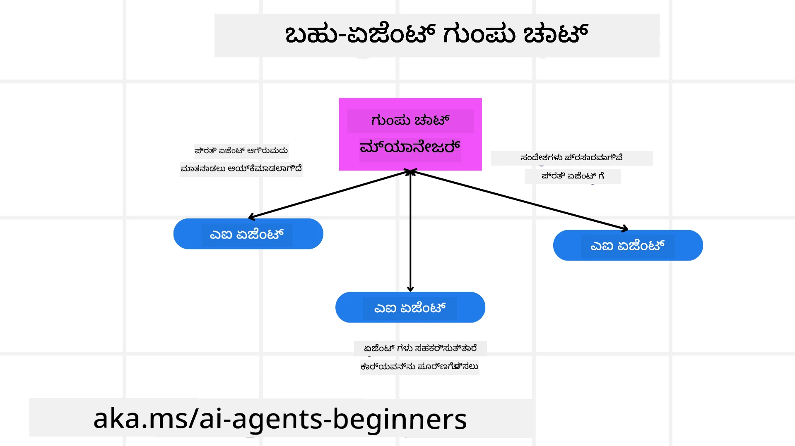
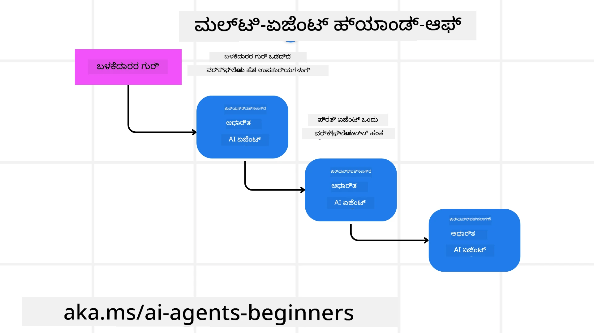
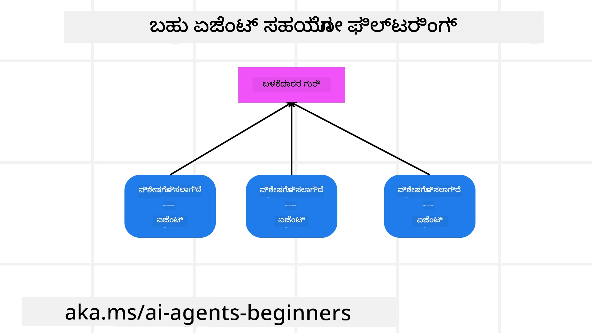

> _(ಈ ಪಾಠದ ವೀಡಿಯೋವನ್ನು ವೀಕ್ಷಿಸಲು ಮೇಲಿನ ಚಿತ್ರವನ್ನು ಕ್ಲಿಕ್ ಮಾಡಿ)_

# ಮಲ್ಟಿ-ಏಜೆಂಟ್ ವಿನ್ಯಾಸ ಮಾದರಿಗಳು

ನೀವು ಹಲವು ಏಜೆಂಟುಗಳನ್ನು ಒಳಗೊಂಡಿರುವ ಯೋಜನೆ üzerinde ಕೆಲಸಮಾಡತೊಡಗಿದಂತೆ ನೀವು ಮಲ್ಟಿ-ಏಜೆಂಟ್ ವಿನ್ಯಾಸ ಮಾದರೆಯನ್ನು ಪರಿಗಣಿಸಬೇಕಾಗುತ್ತದೆ. ಆದಾಗ್ಯೂ, ಮಲ್ಟಿ-ಏಜೆಂಟ್‌ಗೆ 언제 ಬದಲಾಗಬೇಕು ಮತ್ತು ಅದರ ಪ್ರಯೋಜನಗಳು ಏನೆಂದು ತಕ್ಷಣ ಸ್ಪಷ್ಟವಾಗಿಲ್ಲದಿರಬಹುದು.

## ಪರಿಚಯ

ಈ ಪಾಠದಲ್ಲಿ, ನಾವು ಕೆಳಗಿನ ಪ್ರಶ್ನೆಗಳಿಗೆ ಉತ್ತರಿಸುವ ಪ್ರಯತ್ನ ಮಾಡುತ್ತಿದ್ದೇವೆ:

- ಮಲ್ಟಿ-ಏಜೆಂಟ್‌ಗಳು ಅನ್ವಯಿಸುವ ಸಂದರ್ಭಗಳು ಯಾವುದು?
- ಒಂದೇ ಏಜೆಂಟ್ ನಿಂದ ಹಲವಾರು ಕೆಲಸಗಳನ್ನು ಮಾಡುವದಕ್ಕಿಂತ ಮಲ್ಟಿ-ಏಜೆಂಟ್‌ಗಳನ್ನು ಬಳಸುವುದರಿಂದ ಏನು ಲಾಭ ಆಗುತ್ತದೆ?
- ಮಲ್ಟಿ-ಏಜೆಂಟ್ ವಿನ್ಯಾಸ ಮಾದರಿಯನ್ನು ಜಾರಿಗೆ ತರುವ ಮುಖ್ಯ ಘಟಕಗಳು ಯಾವವು?
- ಹಲವಾರು ಏಜೆಂಟ್‌ಗಳು ಪರಸ್ಪರ ಹೇಗೆ ಸಂವಹನ ಮಾಡುತ್ತಿದ್ದಾರೋ ಅದರಲ್ಲಿ ನಮಗೆ ಹೇಗೆ ಮನವಿ ಸಿಗುತ್ತದೆ?

## ಕಲಿಕೆಯ ಗುರಿಗಳು

ಈ ಪಾಠದ ನಂತರ, ನೀವು ಈಕೆಲಸಗಳಿಗೆ ಸಿದ್ಧರಾಗಿರಬೇಕು:

- ಮಲ್ಟಿ-ಏಜೆಂಟ್‌ಗಳನ್ನು ಅನ್ವಯಿಸುವ ಸಂದರ್ಭಗಳನ್ನು ಗುರುತಿಸುವುದು
- ಒಬ್ಬ ಏಜೆಂಟ್ ಎದುರಿಸುವುದಕ್ಕಿಂತ ಮಲ್ಟಿ-ಏಜೆಂಟ್‌ಗಳನ್ನು ಬಳಸದ ಮನವಿ ಗುರುತಿಸುವುದು
- ಮಲ್ಟಿ-ಏಜೆಂಟ್ ವಿನ್ಯಾಸ ಮಾದರಿಯ ಮುಖ್ಯ ಘಟಕಗಳನ್ನು ಅರ್ಥಮಾಡಿಕೊಳ್ಳುವುದು

ವিস্তೃತ ಚಿತ್ರಣವೇನು?

*ಮಲ್ಟಿ-ಏಜೆಂಟ್ ಗಳು ಒಟ್ಟಾರೆ ಗುರಿಯನ್ನು ಸಾಧಿಸಲು ಹಲವಾರು ಏಜೆಂಟ್‌ಗಳು ಒಟ್ಟಾಗಿ ಕಾರ್ಯನಿರ್ವಹಿಸುವ ವಿನ್ಯಾಸ ಮಾದರಿಯಾಗಿದೆ*.

ಈ ಮಾದರಿ ರೋಬೋಟಿಕ್ಸ್, ಸ್ವಯಂಚಾಲಿತ ವ್ಯವಸ್ಥೆಗಳು ಮತ್ತು ವಿತರಣಾ ಗಣನೆಯಂತಹ ವಿವಿಧ ಕ್ಷೇತ್ರಗಳಲ್ಲಿ ವ್ಯಾಪಕವಾಗಿ ಬಳಸಲಾಗುತ್ತದೆ.

## ಮಲ್ಟಿ-ಏಜೆಂಟ್‌ಗಳು ಅನ್ವಯಿಸುವ ಸಂದರ್ಭಗಳು

ಹೀಗಾಗಿ ಮಲ್ಟಿ-ಏಜೆಂಟ್‌ಗಳನ್ನು ಬಳಸಲು ಉತ್ತಮವಾದ ಸಂದರ್ಭದಲ್ಲಿ ಯಾವುದು? ಉತ್ತರವೆಂದರೆ, ಹಲವಾರು ಸಂದರ್ಭಗಳಿವೆ, ವಿಶೇಷವಾಗಿ ಕೆಳಗಿನ ಪ್ರಕರಣಗಳಲ್ಲಿ ಬಹಳ ಪ್ರಯೋಜನಕಾರಿಯಾಗಿದೆ:

- **ದೊಡ್ಡ ಕಾರ್ಯಬೋঝೆಗಳು**: ದೊಡ್ಡ ಕಾರ್ಯಬೋಳೆಯು ಚಿಕ್ಕ ಕಾರ್ಯಗಳಿಗೆ ವಿಭಜಿಸಿ ವಿಭಿನ್ನ ಏಜೆಂಟ್‌ಗಳಿಗೆ ವಹಿಸಬಹುದು, ಇದರಿಂದ ಸಮಂತರಗವಾಗಿ ಪ್ರಕ್ರಿಯೆ ನಡೆಯುವುದು ಮತ್ತು ತ್ವರಿತ ಪೂರ್ಣಗೊಳ್ಳುವುದು ಸಾಧ್ಯ. ಉದಾಹರಣೆಗೆ, ದೊಡ್ಡ ಡೇಟಾ ಪ್ರಕ್ರಿಯೆ ಕಾರ್ಯದಲ್ಲಿದೆ.
- **ಸಂಕೀರ್ಣ ಕಾರ್ಯಗಳು**: ದೊಡ್ಡ ಕಾರ್ಯಬೋಳೆಯಂತೆ ಸಂಕೀರ್ಣ ಕಾರ್ಯಗಳನ್ನು ಚಿಕ್ಕ ಉಪಕಾರ್ಯಗಳಿಗೆ ವಿಭಜಿಸಿ, ಪ್ರತಿ ಏಜೆಂಟ್ ನಿರ್ದಿಷ್ಟ ಕಾರ್ಯಾಂಶದಲ್ಲಿ ಪರಿಣತಿಯನ್ನು ಹೊಂದಿರಬೇಕು. ಸ್ವಯಂಚಾಲಿತ ವಾಹನಗಳ ಉದಾಹರಣೆ ಇದು, ಇಲ್ಲಿ ವಿಭಿನ್ನ ಏಜೆಂಟ್‌ಗಳು ನ್ಯಾವಿಗೇಶನ್, ಅಡ್ಡಿ ಪತ್ತೆಮಾಡುವುದು ಮತ್ತು ಇತರ ವಾಹನಗಳೊಡನೆ ಸಂವಹನ ನಡೆಸುವುದು ನಿರ್ವಹಿಸುತ್ತವೆ.
- **ವಿವಿಧ ಪರಿಣತಿ**: ವಿಭಿನ್ನ ಏಜೆಂಟ್‌ಗಳು ವಿಭಿನ್ನ ಕ್ಷೇತ್ರಗಳಲ್ಲಿ ಪರಿಣತಿಯನ್ನು ಹೊಂದಿರುತ್ತಾರೆ, ಇದು ಒಬ್ಬ ಏಜೆಂಟ್‌ಗಿಂತ ಹೆಚ್ಚು ಪರಿಣಾಮಕಾರಿಯಾಗಿ ವಿವಿಧ ಕಾರ್ಯಾಂಶಗಳನ್ನು ನಿರ್ವಹಿಸಲು ಅನುಮತ ಮಾಡುತ್ತದೆ. ಹೆಲ್ತ್ ಕೇರಿನ ಉದಾಹರಣೆಯನ್ನು ತೆಗೆದುಕೊಂಡರೆ, ಏಜೆಂಟ್‌ಗಳು ರೋಗಪರೀಕ್ಷೆ, ಚಿಕಿತ್ಸಾ ಯೋಜನೆಗಳು ಮತ್ತು ರೋಗಿ ಮೇಲ್ವಿಚಾರಣೆಯನ್ನು ನಿರ್ವಹಿಸುತ್ತವೆ.

## ಒಬ್ಬ ಏಜೆಂಟ್ ಮೇಲೆ ಮಲ್ಟಿ-ಏಜೆಂಟ್‌ಗಳನ್ನು ಬಳಸುವುದರಿಂದ ಲಾಭಗಳು

ಒಬ್ಬ ಏಜೆಂಟ್ ವ್ಯವಸ್ಥೆ ಸರಳ ಕಾರ್ಯಗಳಿಗೆ ಚೆನ್ನಾಗಿ ಕೆಲಸ ಮಾಡಬಹುದು, ಆದರೆ ಸಂಕೀರ್ಣ ಕಾರ್ಯಗಳಿಗೆ, ಮಲ್ಟಿ-ಏಜೆಂಟ್ ಬಳಕೆ ಅನೇಕ ಲಾಭಗಳನ್ನು ನೀಡುತ್ತದೆ:

- **ಪರಿಣತಿ (Specialization)**: ಪ್ರತಿಯೊಬ್ಬ ಏಜೆಂಟ್ ನಿರ್ದಿಷ್ಟ ಕಾರ್ಯಕ್ಕಾಗಿ ಪರಿಣತಿ ಹೊಂದಿರುತ್ತಾನೆ. ಒಬ್ಬ ಏಜೆಂಟ್‌ನಲ್ಲಿ ಪರಿಣತಿಯ ಕೊರತೆ ಇದ್ದರೆ, ಆ ಏಜೆಂಟ್ ಎಲ್ಲಾ ಕೆಲಸಗಳನ್ನು ಮಾಡಲು ಶಕ್ತನಾಗಿದ್ದರೂ ಸಂಕೀರ್ಣ ಕಾರ್ಯ ಎದುರಿಸಿದಾಗ ಗೊಂದಲಕ್ಕೆ ಒಳಗಾಗಬಹುದು. ಉದಾಹರಣೆಗೆ, ಅದು ತನ್ನ ಸಂಗತಿಗೆ ಸರಿಹೊಂದದ ಕಾರ್ಯವನ್ನು ಮಾಡಬಹುದಾಗಿದೆ.
- **ಸ್ಟರೇಶ್ಯಾಬಿಲಿಟಿ (Scalability)**: ಗರಿಷ್ಠ ಏಜೆಂಟ್‌ಗಳನ್ನು ಸೇರಿಸುವ ಮೂಲಕ ವ್ಯವಸ್ಥೆಯನ್ನು ವಿಸ್ತರಿಸುವುದು ಸುಲಭ, ಬೆರಗಿನ ಏಜೆಂಟ್ ಮೂಲಕ ವ್ಯವಸ್ಥೆ ಬಾಧೆಯನ್ನು ನಿವಾರಿಸುವುದಕ್ಕಿಂತ.
- **ತಪ್ಪು ಸಹನೆ (Fault Tolerance)**: ಒಬ್ಬ ಏಜೆಂಟ್ ವಿಫಲವಾದರೂ, ಇತರರು ಕಾರ್ಯನಿರ್ವಹಣೆಯಾಗಿದ್ದು, ವ್ಯವಸ್ಥೆಯ ವಿಶ್ವಾಸಾರ್ಹತೆಯನ್ನು ಖಚಿತಪಡಿಸುತ್ತದೆ.

ಉದಾಹರಣೆಗೆ, ಬಳಕೆದಾರನಿಗಾಗಿ ಪ್ರವಾಸ ಬುಕ್ಕಿಂಗ್ ಮಾಡಿ. ಒಬ್ಬ ಏಜೆಂಟ್ ವ್ಯವಸ್ಥೆ ಪ್ರವಾಸ ಬುಕ್ಕಿಂಗ್ ಪ್ರಕ್ರಿಯೆಯ ಎಲ್ಲಾ ಹಂತಗಳನ್ನು ನಿಭಾಯಿಸಬೇಕಾಗುತ್ತದೆ - ವಿಮಾನಗಳ ಹುಡುಕೆ, ಹೋಟೆಲ್ ಮತ್ತು ಕಾಡಿ ಮೆಕ್ಯಾನಿಕ್ಸ್ ಬುಕ್ಕಿಂಗ್ ಇತ್ಯಾದಿ. ಒಬ್ಬ ಏಜೆಂಟ್ ಈ ಎಲ್ಲ ಕಾರ್ಯಗಳಿಗೆ ಯಂತ್ರೋಪಕರಣಗಳನ್ನು ಹೊಂದಿದೆಯಾದರೆ, ಇದು ನಿರ್ವಹಿಸಲು, ವಿಸ್ತರಿಸಲು ಕಷ್ಟದ ಸಂಕೀರ್ಣವಾದ ವ್ಯವಸ್ಥೆ ಆಗುತ್ತದೆ. ಮಲ್ಟಿ-ಏಜೆಂಡ್ ವ್ಯವಸ್ಥೆ, ಬದಲಿ, ವಿಭಿನ್ನ ಏಜೆಂಟ್‌ಗಳು ವಿಮಾನ ಹುಡುಕಾಟ, ಹೋಟೆಲ್ ಬುಕ್ಕಿಂಗ್ ಮತ್ತು ಕಾಡಿ ಮೆಕ್ಯಾನಿಕ್ಸ್ ಬುಕ್ಕಿಂಗ್‌ನಲ್ಲಿ ಪರಿಣತಿಯನ್ನು ಒದಗಿಸುತ್ತವೆ. ಇದರಿಂದ ವ್ಯವಸ್ಥೆ ಹೆಚ್ಚು ಮೋಡ್ಯೂಲರ್, ನಿರ್ವಹಣೆಗೆ ಸುಲಭ ಮತ್ತು ವಿಸ್ತರಿಸಲು ಸಾಧ್ಯ.

ತಾಳSpent ಕೊನೆಯಲ್ಲಿ, ಒಂದು ತಾಯಿ-ತಂದೆ ಅಂಗಡಿಯಾಗಿ ನಡೆಸಲಾದ ಪ್ರವಾಸ ಬ್ಯೂಯರೋ ಮತ್ತು ಫ್ರಾಂಚೈಸಿಯಾಗಿ ಜಾರಿ ಮಾಡಲಾದ ವ್ಯವಸ್ಥೆಯ ಹೋಲಿಕೆ ಮಾಡಬಹುದು. ತಾಯಿ-ತಂದೆ ಅಂಗಡಿ ಪ್ರವಾಸ ಬುಕ್ಕಿಂಗ್ ಪ್ರಕ್ರಿಯೆಯ ಎಲ್ಲ ವಿಭಾಗಗಳನ್ನು ಒಬ್ಬ ಏಜೆಂಟ್ ನಡೆಸುತ್ತದೆ, ಫ್ರಾಂಚೈಸ್ ವಿವಿಧ ವಿಭಾಗಗಳನ್ನು ವಿವಿಧ ಏಜೆಂಟ್‌ಗಳಿಗೆ ನೀಡುತ್ತದೆ.

## ಮಲ್ಟಿ-ಏಜೆಂಟ್ ವಿನ್ಯಾಸ ಮಾದರಿಯನ್ನು ಜಾರಿಗೆ ತರುವ ಮುಖ್ಯ ಘಟಕಗಳು

ಮಲ್ಟಿ-ಏಜೆಂಟ್ ವಿನ್ಯಾಸ ಮಾದರಿಯನ್ನು ಜಾರಿಗೆ ತೊಳಗಿಸುವ ಮೊದಲು, ನೀವು ಈ ಮಾದರಿಯನ್ನು ನಿರ್ಮಿಸುವ ಮುಖ್ಯ ಘಟಕಗಳನ್ನು ಅರ್ಥಮಾಡಿಕೊಳ್ಳಬೇಕು.

ಮತ್ತೆ ಬಳಕೆದಾರನಿಗಾಗಿ ಪ್ರವಾಸ ಬುಕ್ಕಿಂಗ್ ಉದಾಹರಣೆಗೆ ನೋಡೋಣ. ಇಲ್ಲಿ, ಮುಖ್ಯ ಘಟಕಗಳು ಇವುಗಳಾಗಿವೆ:

- **ಏಜೆಂಟ್ ಸಂವಹನ**: ವಿಮಾನ ಹುಡುಕುತ್ತಿರುವ, ಹೋಟೆಲ್ ಹಾಗೂ ಕಾಡಿ ಬುಕ್ಕಿಂಗ್ ಮಾಡುತ್ತಿರುವ ಏಜೆಂಟ್‌ಗಳು ಬಳಕೆದಾರನ ಆದ್ಯತೆಗಳು ಮತ್ತು ಮರುಕಳುವಿಕೆಗಳನ್ನು ಹಂಚಿಕೊಳ್ಳಲು ಸಂವಹನ ಮಾಡಬೇಕಾಗುತ್ತದೆ. ಸಂವಹನಕ್ಕೆ ಪ್ರೋಟೋಕಾಲ್ ಮತ್ತು ಕ್ರಮಗಳನ್ನು ನಿರ್ಧರಿಸಬೇಕಾಗುತ್ತದೆ. ವಿಶೇಷವಾಗಿ, ವಿಮಾನ ಹುಡುಕುತ್ತಿರುವ ಏಜೆಂಟ್ ಹೋಟೆಲ್ ಬುಕ್ಕಿಂಗ್ ಏಜೆಂಟ್ ಜೊತೆಗೆ ಸಂವಹನ ಮಾಡಿ ಹೋಟೆಲ್ ವಿವರಣೆಗಳು ವಿಮಾನ ಪ್ರಯಾಣ ಅಮೂಲ್ಯ ದಿನಾಂಕಗಳಿಗೆ ಹೊಂದಿಕೆಯಾಗುವುದನ್ನು ಖಚಿತಪಡಿಸಬೇಕು. ಇದಕ್ಕೆ, ಯಾವ ಏಜೆಂಟ್‌ಗಳು ಯಾವ ಮಾಹಿತಿ ಹಂಚಿಕೊಳ್ಳುತ್ತಿವೆ ಮತ್ತು ಹೇಗೆ ಹಂಚಿಕೊಳ್ಳುತ್ತಿವೆ ಎಂಬುದನ್ನು ನಿರ್ಧರಿಸುವ ಅಗತ್ಯವಿದೆ.
- **ಅನುಷ್ಠಾನ ಸಂಯೋಜನೆಗಳು**: ಏಜೆಂಟ್‌ಗಳು ತಮ್ಮ ಕ್ರಿಯೆಗಳ ಸಂಯೋಜನೆ ಮಾಡಿ ಬಳಕೆದಾರನ ಆದ್ಯತೆಗಳು ಮತ್ತು ಮರುಕಳುವಿಕೆಗಳನ್ನು ಪೂರೈಸಬೇಕು. ಉದಾಹರಣೆಗೆ, ಬಳಕೆದಾರನ ಆದ್ಯತೆ ಹೋಟೆಲ್ನು ವಿಮಾನ ನಿಲ್ದಾಣದ ಹತ್ತಿರ ಬೇಕು ಆದರೆ ಮರುಕಳುವಿಕೆ ಬಾಡಿಗೆ ಕಾರುಗಳು ಕೇವಲ ವಿಮಾನ ನಿಲ್ದಾಣ ಬಳಿ ದೊರೆಯುತ್ತವೆ ಅಂತಿದ್ದಲ್ಲಿ, ಹೋಟೆಲ್ ಬುಕ್ಕಿಂಗ್ ಏಜೆಂಟ್ ಮತ್ತು ಬಾಡಿಗೆ ಕಾರು ಬುಕ್ಕಿಂಗ್ ಏಜೆಂಟ್ ಸಂಯೋಜನೆ ಮಾಡಬೇಕಾಗುತ್ತದೆ. ಇದರರ್ಥ, ಏಜೆಂಟ್‌ಗಳು ತಮ್ಮ ಆಕ್ಷನ್‌ಗಳನ್ನು ಹೇಗೆ ಸಂಯೋಜಿಸುತ್ತಿವೆ ಎಂಬುದನ್ನು ತೀರ್ಮಾನಿಸಬೇಕಾಗುತ್ತದೆ.
- **ಏಜೆಂಟ್ ವಾಸ್ತುಶಿಲ್ಪ**: ಏಜೆಂಟ್‌ಗಳು ನಿರ್ಧಾರಗಳನ್ನು ತೆಗೆದುಕೊಳ್ಳಲು ಮತ್ತು ಬಳಕೆದಾರನ ಸಂವಹನದಿಂದ ಕಲಿಯಲು ಆಂತರಿಕ ನಿರ್ಮಾಣ ಹೊಂದಿರಬೇಕು. ಉದಾಹರಣೆಗೆ, ವಿಮಾನ ಹುಡುಕುತ್ತಿರುವ ಏಜೆಂಟ್ ಯಾವ ವಿಮಾನಗಳನ್ನು ಶಿಫಾರಸು ಮಾಡಬೇಕೆಂದು ನಿರ್ಧರಿಸಲು ಸಿದ್ಧವಾಗಿರಬೇಕು. ಇದು ಏಜೆಂಟ್‌ಗಳು ಹೇಗೆ ನಿರ್ಧಾರ ತೆಗೆದುಕೊಳ್ಳುತ್ತವೆ ಮತ್ತು ಬಳಕೆದಾರರ ಜೊತೆ ಸಂವಹನದಿಂದ ಹೇಗೆ ಕಲಿಯುತ್ತವೆ ಎಂಬುದನ್ನು ನಿರ್ಧರಿಸುವುದಾಗಿದೆ. ಉದಾಹರಣೆಗೆ, ವಿಮಾನ ಶಿಫಾರಸು ಮಾಡುವ ಏಜೆಂಟ್ ಪೂರ್ತಿಯಾಗಿ ಯಂತ್ರ ಕಲಿಕೆಯ ಮಾದರಿ ಬಳಸಬಹುದು.
- **ಮಲ್ಟಿ-ಏಜೆಂಟ್ ಸಂವಹನಕ್ಕೆ ಗೋಚರತೆ**: ಹಲವಾರು ಏಜೆಂಟ್‌ಗಳು ಪರಸ್ಪರ ಹೇಗೆ ಕಾರ್ಯನಿರ್ವಹಿಸುತ್ತಿದ್ದಾರೋ ಅದರಲ್ಲಿ ಗೋಚರತೆ ಬೇಕಾಗಿದೆ. ಲಾಗಿಂಗ್ ಮತ್ತು ವೀಕ್ಷಣೆ ಉಪಕರಣಗಳು, ದೃಶ್ಯಚಿತ್ರಣ ಉಪಕರಣಗಳು, ಕಾರ್ಯಕ್ಷಮತೆ ದೂರ ಅನ್ಕೆಗಳು ಇದಕ್ಕೆ ಉದಾಹರಣೆ.
- **ಮಲ್ಟಿ-ಏಜೆಂಟ್ ಮಾದರಿಗಳು**: ಕೇಂದ್ರಸಾಧಿತ, ವಿಕೇಂದ್ರಸಾಧಿತ ಮತ್ತು ಸಂಯೋಜಿತ ವಾಸ್ತುಶಿಲ್ಪಗಳಂತಹ ವಿವಿಧ ಮಾದರಿಗಳಿವೆ. ನಿಮ್ಮ ಬಳಕೆಗೆ ಉಚಿತವಿರುವ ಮಾದರಿಯನ್ನು ಆಯ್ಕೆ ಮಾಡಬೇಕಾಗುತ್ತದೆ.
- **ಮಾನವ ನಡುವಣಿಯಲ್ಲಿ**: ಬಹುತೇಕ ಪ್ರಕರಣಗಳಲ್ಲಿ, ಮಾನವ ಮಧ್ಯಸ್ಥನು ಇರುತ್ತಾನೆ ಮತ್ತು ಅವನು ಯಾವಾಗ ಹಸ್ತಕ್ಷೇಪ ಅಗತ್ಯವಿದೆ ಅಂತ ಹೇಳಬೇಕಾಗುತ್ತದೆ. ಉದಾಹರಣೆಗೆ, ಏಜೆಂಟ್‌ಗಳು ಶಿಫಾರಸು ಮಾಡದ ವಿಮಾನ ಅಥವಾ ಹೋಟೆಲ್ ಹಿಂದೆ ಮಾನವ ತನಿಖೆ ಕೇಳಬಹುದು ಅಥವಾ ಬುಕ್ಕಿಂಗ್ ಮೊದಲು ದೃಢೀಕರಣ ಕೇಳಬಹುದು.

## ಮಲ್ಟಿ-ಏಜೆಂಟ್ ಸಂವಹನಕ್ಕೆ ಗೋಚರತೆ

ಹಲವಾರು ಏಜೆಂಟ್‌ಗಳು ಪರಸ್ಪರ ಹೇಗೆ ಸಂವಹನ ನಡೆಸುತ್ತಾರೋ ಅದಕ್ಕೆ ಗೋಚರತೆ ಇದುವೇ ಮುಖ್ಯ. ಇದರಿಂದ ದೋಷ ಪರಿಹಾರ, ಕಾರ್ಯದಕ್ಷತೆ ಸುಧಾರಣೆ ಮತ್ತು ವ್ಯವಸ್ಥೆಯ ಸಮಗ್ರ ಪರಿಣಾಮಕಾರಿತ್ವ ಖಚಿತವಾಗುತ್ತದೆ. ಇದಕ್ಕಾಗಿ, ಏಜೆಂಟ್ ಚಟುವಟಿಕೆಗಳು ಮತ್ತು ಸಂವಹನಗಳನ್ನು ಅಳವಡಿಸಲು ಲಾಗಿಂಗ್, ವೀಕ್ಷಣೆ, ದೃಶ್ಯಪಟ ಮತ್ತು ಕಾರ್ಯಕ್ಷಮತಾ ಮ್ಯಾಪಿಂಗ್ ಟೂಲ್‌ಗಳು ಬೇಕಾಗುತ್ತವೆ.

ಉದಾಹರಣೆಗೆ, ಬಳಕೆದಾರನ ಪ್ರವಾಸ ಬುಕ್ಕಿಂಗ್‌ಗಾಗಿ ಏಜೆಂಟ್‌ಗಳ ಸ್ಥಿತಿಯನ್ನು ತೋರಿಸುವ ಡ್ಯಾಶ್‌ಬೋರ್ಡ್ ವಿಧಿಸಲು ಸಾಧ್ಯ. ಇಲ್ಲಿ, ಬಳಕೆದಾರನ ಆದ್ಯತೆಗಳು, ಮರುಕಳುವಿಕೆಗಳು, ಮತ್ತು ಏಜೆಂಟ್‌ಗಳ ನಡುವೆ ಸಂವಹನಗಳು ತೋರಲಾಗುತ್ತದೆ. ಪ್ರಯಾಣ ದಿನಾಂಕ, ವಿಮಾನ ಶಿಫಾರಸುಗಳು, ಹೋಟೆಲ್ ಶಿಫಾರಸುಗಳು ಮತ್ತು ಬಾಡಿಗೆ ಕಾರು ಶಿಫಾರಸುಗಳು ಈ ಡ್ಯಾಶ್‌ಬೋರ್ಡ್‌ನಲ್ಲಿ ಕಾಣಬಹುದು. ಇದರಿಂದ ಏಜೆಂಟ್‌ಗಳು ಹೇಗೆ ಸಂವಹನ ಮಾಡುತ್ತಿದ್ದಾರೆ ಮತ್ತು ಬಳಕೆದಾರನ ಆದ್ಯತೆಗಳು ಪೂರ್ಣಗೊಳ್ಳುತ್ತಿದೆಯೇ ಎಂಬುದರ ಸ್ಪಷ್ಟ ದರ್ಶನ ಸಿಗುತ್ತದೆ.

ಈ ನಿಯಮಗಳನ್ನೂ ವಿವರವಾಗಿ ನೋಡಿ:

- **ಲಾಗಿಂಗ್ ಮತ್ತು ವೀಕ್ಷಣೆ ಉಪಕರಣಗಳು**: ಪ್ರತಿ ಏಜೆಂಟ್ ಕೈಗೊಳ್ಳುವ ಕ್ರಿಯೆಗಳ ಲಾಗಿಂಗ್ ಇಡುವುದು ಮುಖ್ಯ. ಲಾಗ್ ಪ್ರವೇಶದಲ್ಲಿ ಯಾವ ಏಜೆಂಟ್ ಎಂತಹ ಕ್ರಿಯೆ ಮಾಡಿಕೊಂಡಿತು, ಯಾವಾಗ, ಮತ್ತು ಕ್ರಿಯೆಯ ಫಲಿತಾಂಶ ಏನು ಎಂಬ ಮಾಹಿತಿ ಸೇರಿರಬೇಕು. ಇದು ದೋಷ ಪರಿಹಾರ, ಕಾರ್ಯಕ್ಷಮತೆ ಸುಧಾರಣೆ ಮತ್ತು ಇತರೆ ಕಾರ್ಯಗಳಿಗೆ ಉಪಯುಕ್ತವಾಗಿದೆ.
- **ದೃಶ್ಯಪಟ ಉಪಕರಣಗಳು**: ಏಜೆಂಟ್‌ಗಳ ನಡುವಿನ ಸಂವಹನವನ್ನು ಸ್ಪಷ್ಟವಾಗಿ ನೋಡಲು ದೃಶ್ಯಪಟ ಉಪಕರಣಗಳು ಸಹಾಯಕ. ಉದಾಹರಣೆಗೆ ಒಂದು ಗ್ರಾಫ್ ಸಂಪರ್ಕ ಹಾದಿಗಳನ್ನು ತೋರಿಸಬಹುದು. ಇದರಿಂದ ಅನಗತ್ಯ ಟ್ರಾಫಿಕ್, ಸಮರ್ಪಕತೆ ಇಲ್ಲದ ಭಾಗಗಳನ್ನು ಗುರುತಿಸಬಹುದು.
- **ಕಾರ್ಯಕ್ಷಮತಾ ಅಳತೆಗಳು**: ಕಾರ್ಯ ಸೂಕ್ತತೆಯನ್ನು ಅಳೆಯಲು ಕಾರ್ಯಕ್ಷಮತಾ ಮ್ಯಾಪಿಂಗ್ ಉಪಯೋಗಿಸುವುದು ಮುಖ್ಯ. ಕಾರ್ಯ ಪೂರ್ಣಗೊಳ್ಳುವ ಕಾಲ, ಕೆಲಸದ ಪ್ರಮಾಣ, ಶಿಫಾರಸುಗಳ ನಿಖರತೆ ಮುಂತಾದವುಗಳನ್ನು ಅಳೆಯಬಹುದು. ಇದರಿಂದ ಸುಧಾರಣೆಕ್ಕೆ ಅವಕಾಶ ಸಿಗುತ್ತದೆ ಮತ್ತು ವ್ಯವಸ್ಥೆಯನ್ನು ಸಮರ್ಪಕಗೊಳಿಸಬಹುದು.

## ಮಲ್ಟಿ-ಏಜೆಂಟ್ ಮಾದರಿಗಳು

ನಾವು ಮಲ್ಟಿ-ಏಜೆಂಟ್ ಆಪ್ಗಳ ನಿರ್ಮಾಣಕ್ಕೆ ಬೇರೊಂದು ದೃಷ್ಟಾಮುಖ ನೀಡುವ ಕೆಲವು ಸ್ಪಷ್ಟ ಮಾದರಿಗಳನ್ನು ನೋಡೋಣ. ಕೆಲವೆಂದು ಗಮನಾರ್ಹ ಮಾದರಿಗಳು:

### ಗುಂಪು ಚಾಟ್

ಈ ಮಾದರಿ ಗುಂಪು ಚಾಟ್ ಅಪ್ಲಿಕೇಶನ್ನನ್ನು ರಚಿಸಲು ಉಪಯುಕ್ತ, ಅಲ್ಲಿ ವಿವಿಧ ಏಜೆಂಟ್‌ಗಳು ಪರಸ್ಪರ ಸಂವಹನ ಮಾಡಬಹುದು. ಸಾಮಾನ್ಯ ಬಳಕೆ, ತಂಡ ಸಹಕಾರ, ಗ್ರಾಹಕರ ಬೆಂಬಲ ಮತ್ತು ಸಾಮಾಜಿಕ ಜಾಲತಾಣಗಳಿವೆ.

ಈ ಮಾದರಿಯಲ್ಲಿ, ಪ್ರತಿಯೊಂದು ಏಜೆಂಟ್ ಗುಂಪು ಚಾಟ್‌ನಲ್ಲಿನ ಬಳಕೆದಾರನ್ನು ಪ್ರತಿನಿಧಿಸುತ್ತದೆ ಮತ್ತು ಸಂದೇಶಗಳನ್ನು ಸಂದೇಶ ಪ್ರೋಟೋಕಾಲ್ ಬಳಸಿ ವಿನಿಮಯ ಮಾಡುತ್ತಾರೆ. ಏಜೆಂಟ್‌ಗಳು ಗುಂಪಿಗೆ ಸಂದೇಶಗಳನ್ನು ಕಳುಹಿಸಬಹುದು, ಗುಂಪಿನಿಂದ ಸಂದೇಶಗಳನ್ನು ಸ್ವೀಕರಿಸಬಹುದು ಮತ್ತು ಇತರ ಏಜೆಂಟ್‌ಗಳಿಂದ ಬಂದ ಸಂದೇಶಗಳಿಗೆ ಪ್ರತಿಕ್ರಿಯಿಸಬಹುದು.

ಈ ಮಾದರಿ ಕೇಂದ್ರಿತ ವಾಸ್ತುಶಿಲ್ಪ ಬಳಸಿ ಎಲ್ಲ ಸಂದೇಶಗಳನ್ನು ಕೇಂದ್ರದಲ್ಲಿನ ಸರ್ವರ್ ಮೂಲಕ ಮಾರ್ಗದರ್ಶನ ಮಾಡುವುದಾಗಿ ಅಥವಾ ವಿಕೇಂದ್ರಿತ ವಾಸ್ತುಶಿಲ್ಪದಲ್ಲಿ ಸಂದೇಶಗಳ ನೇರ ವಿನಿಮಯವಾಗುವಂತೆ ಜಾರಿಗೆ ತರಬಹುದು.

### ಹ್ಯಾಂಡ್-ಆಫ್

ಈ ಮಾದರಿ ಬಹು ಏಜೆಂಟ್‌ಗಳಿಗೆ ಪರಸ್ಪರ ಕಾರ್ಯಗಳನ್ನು ಹಸ್ತಾಂತರಿಸುವ ಅಪ್ಲಿಕೇಶನ್ ರಚಿಸಲು ಸಹಾಯಕ.

ಪ್ರಮುಖ ಬಳಕೆ ಸಹಾಯ ಸಂಬಂಧಿ, ಕಾರ್ಯ ನಿರ್ವಹಣೆ, ಮತ್ತು ವರ್ಕ್‌ಫ್ಲೋ ಆಟೋಮೇಶನ್.

ಈ ಮಾದರಿಯಲ್ಲಿ, ಪ್ರತಿ ಏಜೆಂಟ್ ಒಂದು ಕೆಲಸ ಅಥವಾ ವರ್ಕ್‌ಫ್ಲೋದಲ್ಲಿ ಒಂದು ಹಂತವನ್ನು ಪ್ರತಿನಿಧಿಸುತ್ತದೆ ಮತ್ತು ಪೂರ್ವನಿರ್ಧರಿಸಿದ ನಿಯಮಗಳ ಪ್ರಕಾರ ಕಾರ್ಯಗಳನ್ನು ಹಸ್ತಾಂತರಿಸುತ್ತದೆ.

### ಸಹಯೋಗಿ ಫಿಲ್ಟರಿಂಗ್

ಈ ಮಾದರಿ, ಬಹು ಏಜೆಂಟ್‌ಗಳು ಬಳಕೆದಾರರಿಗೆ ಶಿಫಾರಸುಗಳನ್ನು ಮಾಡಲು ಒಟ್ಟಿಗೆ ಸಹಕರಿಸುವ ಅಪ್ಲಿಕೇಶನ್ ನಿರ್ಮಿಸಲು ಉಪಯುಕ್ತ.

ಏಕೆಂದರೆ, ಪ್ರತಿಯೊಬ್ಬ ಏಜೆಂಟ್ ವಿಭಿನ್ನ ಕ್ಷೇತ್ರಗಳಲ್ಲಿ ಪರಿಣತಿ ಹೊಂದಿರುತ್ತಾನೆ ಮತ್ತು ಶಿಫಾರಸು ಪ್ರಕ್ರಿಯೆಯಲ್ಲಿ ವಿಭಿನ್ನ ರೀತಿಯಲ್ಲಿ ಸಹಾಯ ಮಾಡುತ್ತಾನೆ.

ಓ ಉದಾಹರಣೆ ತೆಗೆದುಕೊಳ್ಳೋಣ, ಬಳಕೆದಾರನು ಶೇರು ಮಾರುಕಟ್ಟೆಯಲ್ಲಿ ಉತ್ತಮ ಶೇರು ಯಾವುದು ಎಂಬ ಶಿಫಾರಸು ಕೇಳುತ್ತಿದ್ದಾರೆ.

- **ಕೈಗಾರಿಕಾ ಪರಿಣತಿ**: ಒಂದು ಏಜೆಂಟ್ ನಿರ್ದಿಷ್ಟ ಕೈಗಾರಿಕೆಗೆ ಪರಿಣತಿ ಹೊಂದಿರಬಹುದು.
- **ತಾಂತ್ರಿಕ ವಿಶ್ಲೇಷಣೆ**: ಮತ್ತೊಂದು ಏಜೆಂಟ್ ತಾಂತ್ರಿಕ ವಿಶ್ಲೇಷಣೆಗೆ ಪರಿಣತಿ ಹೊಂದಿರಬಹುದು.
- **ಮೂಲಭೂತ ವಿಶ್ಲೇಷಣೆ**: ಇನ್ನೊಂದು ಏಜೆಂಟ್ ಮೂಲಭೂತ ವಿಶ್ಲೇಷಣೆ ಕ್ಷೇತ್ರದಲ್ಲಿ ಪರಿಣತಿ ಹೊಂದಿರಬಹುದು. ಸಹಕೋರ್ಪ.mallಿದರೆ, ಈ ಏಜೆಂಟ್‌ಗಳು ಬಳಕೆದಾರರಿಗೆ ಸಮಗ್ರವಾದ ಶಿಫಾರಸುಗಳನ್ನು ನೀಡಬಹುದಾಗುತ್ತದೆ.

## ಸೇರಿದ ಘಟನೆ: ಹಣ ಮರಳಿಸುವಿಕೆ ಪ್ರಕ್ರಿಯೆ

ಉದಾಹರಣೆಗೆ, ಗ್ರಾಹಕೊಬ್ಬನು ಉತ್ಪನ್ನಕ್ಕೆ ಹಣ ಮರಳಿಸುವಿಕೆ ಪಡೆಯಲು ಪ್ರಯತ್ನಿಸುತ್ತಿದ್ದಾರೆ ಬಂದ್ರೆ, ಈ ಪ್ರಕ್ರಿಯೆಯಲ್ಲಿ ಹಲವಾರು ಏಜೆಂಟ್‌ಗಳು ಭಾಗಿಯಾಗಬಹುದು. ಆದರೆ ನಾವು ಈ ಪ್ರಕ್ರಿಯೆಗೆ ವಿಶೇಷ ಏಜೆಂಟ್‌ಗಳಾದವರನ್ನು ಮತ್ತು ನಿಮ್ಮ ವ್ಯವಹಾರದ ಇತರೆ ಭಾಗಗಳಲ್ಲಿ ಬಳಸಬಹುದಾದ ಸಾಮಾನ್ಯ ಏಜೆಂಟ್‌ಗಳಾಗಿ ವಿಭಜಿಸೋಣ.

**ಹಣ ಮರಳಿಸುವಿಕೆ ಪ್ರಕ್ರಿಯೆಗೆ ವಿಶೇಷ ಏಜೆಂಟ್ ಗಳು**:

ಈ ಕೆಳಗಿನ ಏಜೆಂಟ್‌ಗಳು ಹಣ ಮರಳಿಸುವಿಕೆ ಪ್ರಕ್ರಿಯೆಯಲ್ಲಿ ಭಾಗಿಯಾಗಬಹುದು:

- **ಗ್ರಾಹಕ ಏಜೆಂಟ್**: ಈ ಏಜೆಂಟ್ ಗ್ರಾಹಕರನ್ನು ಪ್ರತಿನಿಧಿಸಿ, ಹಣ ಮರಳಿಸುವಿಕೆ ಪ್ರಕ್ರಿಯೆಯನ್ನು ಪ್ರಾರಂಭಿಸುವ ಜವಾಬ್ದಾರಿಯಾಗಿರುತ್ತದೆ.
- **ಮಾರಾಟದ ಏಜೆಂಟ್**: ಮಾರಾಟದ ಏಜೆಂಟ್ ಹಣ ಮರಳಿಸುವಿಕೆಯನ್ನು ਪ੍ਰಕ್ರಿಯಿಸಿರುವ ಜವಾಬ್ದಾರಿಗಳು ಇರುತ್ತವೆ.
- **ಪಾವತಿ ಏಜೆಂಟ್**: ಪಾವತಿ ಪ್ರಕ್ರಿಯೆಯನ್ನು ಪ್ರತಿನಿಧಿಸಿ, ಗ್ರಾಹಕರ ಪಾವತಿಯನ್ನು ಮರಳಿಸುವ ಕಾರ್ಯವನ್ನು ನಿಭಾಯಿಸುವ ಜವಾಬ್ದಾರಿಯು ಇರುತ್ತದೆ.
- **ತೀರ್ಮಾನ ಏಜೆಂಟ್**: ಸಮಸ್ಯೆಗಳ ಪರಿಹಾರ ಪ್ರಕ್ರಿಯೆಯನ್ನು ನಿರ್ವಹಿಸುವ ಜವಾಬ್ದಾರಿಯೂ ಇದೆ.
- **ಅನುಕೂಲತೆ ಏಜೆಂಟ್**: ನಿಯಮಗಳು ಮತ್ತು ಧೋರಣೆಗಳ ಅನುಕೂಲವಾಗಿ ಹಣ ಮರಳಿಸುವಿಕೆಯ ನಿಯಮಗಳಿಗೆ ಅನುಸರಿಸುವುದನ್ನು ಖಚಿತಪಡಿಸುವುದು.

**ಸಾಮಾನ್ಯ ಏಜೆಂಟ್ ಗಳು**:

ಈ ಏಜೆಂಟ್‌ಗಳು ನಿಮ್ಮ ವ್ಯವಹಾರದ ಇತರೆ ಭಾಗಗಳಲ್ಲೂ ಬಳಸಬಹುದು.

- **ಶಿಪ್ಪಿಂಗ್ ಏಜೆಂಟ್**: ಈ ಏಜೆಂಟ್ ವಸ್ತುವನ್ನು ಮಾರಾಟದ ಕಡೆಗೆ ಹಿಂದಿರುಗಿಸುತ್ತಿರುವ ವಿತರಣೆ ಪ್ರಕ್ರಿಯೆಯನ್ನು ನಿರ್ವಹಿಸುತ್ತದೆ. ಇದು ಮರಳಿಸುವಿಕೆ ಮತ್ತು ಸಾಮಾನ್ಯ ವಿತರಣೆಗೆ ಉಪಯುಕ್ತ.
- **ಪ್ರತಿಕ್ರಿಯೆ ಏಜೆಂಟ್**: ಗ್ರಾಹಕರಿಂದ ಪ್ರತಿಕ್ರಿಯೆ ಸಂಗ್ರಹಿಸುವ ಪ್ರಕ್ರಿಯೆಯನ್ನು ನಿಭಾಯಿಸುತ್ತದೆ. ಪ್ರಕ್ರಿಯೆಯ ಯಾವುದೇ ಸಮಯದಲ್ಲಿ ಈ ಪ್ರತಿಕ್ರಿಯೆ ಸಂಗ್ರಹಿಸಬಹುದು.
- **ಎಸ್ಕಲೇಷನ್ ಏಜೆಂಟ್**: ಸಮಸ್ಯೆಗಳನ್ನು ಏರಿಕೆಯ ಮಟ್ಟದ ಬೆಂಬಲಕ್ಕೆ ಹೊರಸೂಡುವುದು.
- **ಅಧಿನೋಟಿ ಏಜೆಂಟ್**: ಮರಳಿಸುವಿಕೆ ಪ್ರಕ್ರಿಯೆಯ ವಿವಿಧ ಹಂತಗಳಲ್ಲಿ ಗ್ರಾಹಕರಿಗೆ ಅಧಿನೋಟಿಗಳನ್ನು ಕಳುಹಿಸುವುದು.
- **ವಿಶ್ಲೇಷಣೆ ಏಜೆಂಟ್**: ಮರಳಿಸುವಿಕೆ ಸಂಬಂಧಿ ಡೇಟಾ ವಿಶ್ಲೇಷಣೆ.
- **ಆಡಿಟ್ ಏಜೆಂಟ್**: ಮರಳಿಸುವಿಕೆ ಸರಿಯಾಗಿ ನಡೆಯುತ್ತಿರುವುದನ್ನು ಪರಿಶೀಲಿಸುವುದು.
- **ವರದಿ ಏಜೆಂಟ್**: ಮರಳಿಸುವಿಕೆ ಕುರಿತ ವರದಿಗಳನ್ನು ತಯಾರಿಸುವುದು.
- **ಜ್ಞಾನ ಏಜೆಂಟ್**: ಮರಳಿಸುವಿಕೆ ಮತ್ತು ಇತರ ವ್ಯವಹಾರದ ವಿಷಯಗಳ ಜ್ಞಾನಾಧಾರ ಕಾಯುವಿಕೆ.
- **ಸುರಕ್ಷತೆ ಏಜೆಂಟ್**: ಮರಳಿಸುವಿಕೆ ಪ್ರಕ್ರಿಯೆಯಲ್ಲಿ ಸುರಕ್ಷತೆ ಖಚಿತಪಡಿಸುವುದು.
- **ಗುಣಮಟ್ಟ ಏಜೆಂಟ್**: ಮರಳಿಸುವಿಕೆ ಪ್ರಕ್ರಿಯೆಯ ಗುಣಮಟ್ಟವನ್ನು ನಿರ್ವಹಿಸುವುದು.

ಹಣ ಮರಳಿಸುವಿಕೆ ಪ್ರಕ್ರಿಯೆಗೆ ವಿಶೇಷವಾಗಿ ಮತ್ತು ಸಾಮಾನ್ಯವಾಗಿ ಬಳಸಬಹುದಾದ ಏಜೆಂಟ್‌ಗಳ ವಿವರಗಳು ಹೊಂದಿವೆ. ನಿಮ್ಮ ಮಲ್ಟಿ-ಏಜೆಂಟ್ ವ್ಯವಸ್ಥೆಯಲ್ಲಿ ಯಾವ ಏಜೆಂಟ್‌ಗಳನ್ನು ಬಳಸಬೇಕೆಂಬುದರ ಮೇಲೆ ನಿಮಗೆ ಅರ್ಥಮಾಡಿಕೊಡುತ್ತದೆ ಎಂಬ ನಿರೀಕ್ಷೆಯಿದೆ.

## ಕಾರ್ಯ

ಗ್ರಾಹಕ ಬೆಂಬಲ ಪ್ರಕ್ರಿಯೆಗೆ ಮಲ್ಟಿ-ಏಜೆಂಟ್ ವ್ಯವಸ್ಥೆಯನ್ನು ವಿನ್ಯಾಸಗೊಳಿಸಿ. ಈ ಪ್ರಕ್ರಿಯೆಯಲ್ಲಿ ಭಾಗವಹಿಸುವ ಏಜೆಂಟ್‌ಗಳನ್ನು ಗುರುತಿಸಿ, ಅವರ ಪಾತ್ರಗಳು ಮತ್ತು ಜವಾಬ್ದಾರಿಗಳು ಯಾರು, ಮತ್ತು ಇವರು ಪರಸ್ಪರ ಹೇಗೆ ಸಂವಹನ ಮಾಡುತ್ತಾರೆ ಎಂಬುದನ್ನು ವಿವರಿಸಿ. ಗ್ರಾಹಕ ಬೆಂಬಲಕ್ಕೆ ವಿಶೇಷ ಏಜೆಂಟ್‌ಗಳೂ ಮತ್ತು ನಿಮ್ಮ ವ್ಯವಹಾರದ ಇತರೆ ಭಾಗಗಳಲ್ಲಿ ಬಳಸಲಾದ ಸಾಮಾನ್ಯ ಏಜೆಂಟ್‌ಗಳೂ ಇಬ್ಬರನ್ನೂ ಪರಿಗಣಿಸಿ.
> ಕೆಳಗಿನ ಪರಿಹಾರವನ್ನು ಓದಲು ಮೊದಲು ನೀವು ಯೋಚಿಸಿ, ನೀವು ಭಾವಿಸುವುದಕ್ಕಿಂತ ಹೆಚ್ಚು ಏಜೆಂಟ್‌ಗಳು ಬೇಕಾಗಬಹುದು.

> TIP: ಗ್ರಾಹಕ ಬೆಂಬಲ ಪ್ರಕ್ರಿಯೆಯ ವಿವಿಧ ಹಂತಗಳನ್ನು ಯೋಚಿಸಿ ಮತ್ತು ಯಾವುದೇ ವ್ಯವಸ್ಥೆಗೆ ಬೇಕಾಗುವ ಏಜೆಂಟ್‌ಗಳ बारे में גם ಪರಿಗಣಿಸಿ.

## ಪರಿಹಾರ

[ಪರಿಹಾರ](./solution/solution.md)

## ಜ್ಞಾನ ಪರೀಕ್ಷೆಗಳು

ಪ್ರಶ್ನೆ: ನೀವು ಬಹು-ಏಜೆಂಟ್‌ಗಳನ್ನು ಯಾವಾಗ ಬಳಸಬೇಕು ಎಂದು ಪರಿಗಣಿಸಬೇಕು?

- [ ] A1: ನಿಮ್ಮ ಬಳಿ ಸಣ್ಣ ಕಾರ್ಯಭಾರ ಮತ್ತು ಸರಳ ಕಾರ್ಯವಿದೆ ಎಲ್ಲಿ.
- [ ] A2: ನಿಮ್ಮ ಬಳಿ ದೊಡ್ಡ ಕಾರ್ಯಭಾರ ಇದೆ ಎಲ್ಲಿ.
- [ ] A3: ನಿಮ್ಮ ಬಳಿ ಸರಳ ಕಾರ್ಯವಿದೆ ಎಲ್ಲಿ.

[ಪರಿಹಾರ ಕ್ವಿಜ್](./solution/solution-quiz.md)

## ಸಾರಾಂಶ

ಈ ಪಾಠದಲ್ಲಿ, ನಾವು ಬಹು-ಏಜೆಂಟ್ ವಿನ್ಯಾಸ ಮಾದರಿಯನ್ನು ಪರಿಶೀಲಿಸಿದ್ದೇವೆ, ಬಹು-ಏಜೆಂಟ್‌ಗಳು ಅನ್ವಯಿಸುವ ಸಂದರ್ಭಗಳು, ಒಂದೇ ಏಜೆಂಟ್ ಗೆ ಹೋಲಿಸಿದಾಗ ಬಹು-ಏಜೆಂಟ್‌ಗಳನ್ನು ಬಳಸುವ ಲಾಭಗಳು, ಬಹು-ಏಜೆಂಟ್ ವಿನ್ಯಾಸ ಮಾದರಿಯನ್ನು ಜಾರಿಗೊಳಿಸುವ ಮೂಲ ಘಟಕಗಳು ಮತ್ತು ಅನೇಕ ಏಜೆಂಟ್‌ಗಳು ಪರಸ್ಪರ ಹೇಗೆ ಸಂವಹನ ಮಾಡಿಕೊಂಡಿರುವುದರ ಮೇಲೆ ದೃಷ್ಟಿಕೋನವನ್ನು ಹೊಂದುವುದರ ಬಗ್ಗೆ.

### ಬಹು-ಏಜೆಂಟ್ ವಿನ್ಯಾಸ ಮಾದರಿಯ ಬಗ್ಗೆ ಇನ್ನಷ್ಟು ಪ್ರಶ್ನೆಗಳಿದ್ದಾರಾ?

ಇತರ ಕಲಿಕೆಯವರನ್ನು ಭೇಟಿ ಮಾಡು, ಕಾರ್ಯಾಲಯ ಸಮಯಗಳಲ್ಲಿ ಹಾಜರಾಗು ಮತ್ತು ನಿಮ್ಮ AI ಏಜೆಂಟ್‌ಗಳ ಪ್ರಶ್ನೆಗಳಿಗೆ ಉತ್ತರಗಳನ್ನು ಪಡೆಯಲು [Microsoft Foundry ಡಿಸ್ಕಾರ್ಡ್](https://aka.ms/ai-agents/discord) ಗೆ ಸೇರಿ.

## ಹೆಚ್ಚುವರಿ ಸಂಪನ್ಮೂಲಗಳು

- <a href="https://learn.microsoft.com/azure/ai-services/agents/overview" target="_blank">Microsoft ಏಜೆಂಟ್ ಫ್ರೇಂವರ್ಕ್ ಡಾಕ್ಯುಮೆಂಟೇಶನ್</a>
- <a href="https://www.analyticsvidhya.com/blog/2024/10/agentic-design-patterns/" target="_blank">ಎಜೆಂಟಿಕ್ ವಿನ್ಯಾಸ ಮಾದರಿಗಳು</a>

## ಹಿಂದಿನ ಪಾಠ

[ಯೋಜನೆ ವಿನ್ಯಾಸ](../07-planning-design/README.md)

## ಮುಂದಿನ ಪಾಠ

[AI ಏಜೆಂಟ್‌ಗಳಲ್ಲಿ ಮೆಟಾಕಾಗ್ನಿಷನ್](../09-metacognition/README.md)

---

<!-- CO-OP TRANSLATOR DISCLAIMER START -->
**ತ್ಯಜ್ಯವಾಕ್ಯ**:
ಈ ದಾಖಲೆ AI ಅನುವಾದ ಸೇವೆ [Co-op Translator](https://github.com/Azure/co-op-translator) ಬಳಸಿ ಅನುವಾದಿಸಲಾಗಿದೆ. ನಾವು ಶುದ್ಧತೆಯೊಂದಿಗೆ ಪ್ರಯತ್ನಿಸುತ್ತಿದ್ದರೂ, ಸ್ವಯಂಚಾಲಿತ ಅನುವಾದಗಳಲ್ಲಿ ತಪ್ಪುಗಳು ಅಥವಾ ಅಸತ್ಯತೆಯು ಇರಬಹುದೆಂದು ದಯವಿಟ್ಟು ಗಮನಿಸಿ. ಮೂಲ ಭಾಷೆಯಲ್ಲಿರುವ ಮೂಲ ದಾಖಲೆ ಪ್ರಾಧಿಕಾರಪೂರ್ಣ ಮೂಲ ಎಂದು ಪರಿಗಣಿಸಬೇಕು. ಗಂಭೀರ ಮಾಹಿತಿಗಾಗಿ, ವೃತ್ತಿಪರ ಮಾನವ ಅನುವಾದವನ್ನು ಶಿಫಾರಸು ಮಾಡಲಾಗುತ್ತದೆ. ಈ ಅನುವಾದ ಬಳಕೆಯಿಂದ ಉದ್ಭವಿಸುವ ಯಾವುದೇ ತಪ್ಪುಮಾಲಿಕೆ ಅಥವಾ ತಪ್ಪುವಿವರಣೆಗಳಿಗೆ ನಾವು ಹೊಣೆಗಾರರಲ್ಲ.
<!-- CO-OP TRANSLATOR DISCLAIMER END -->