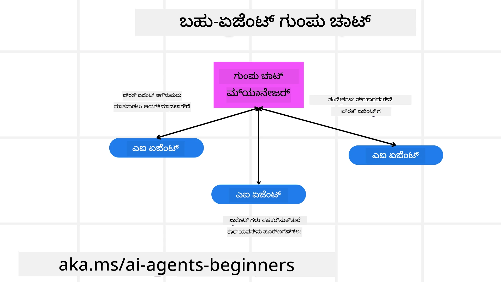
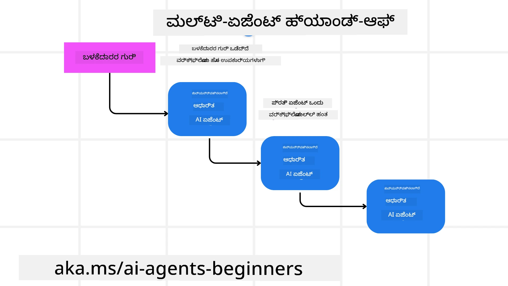
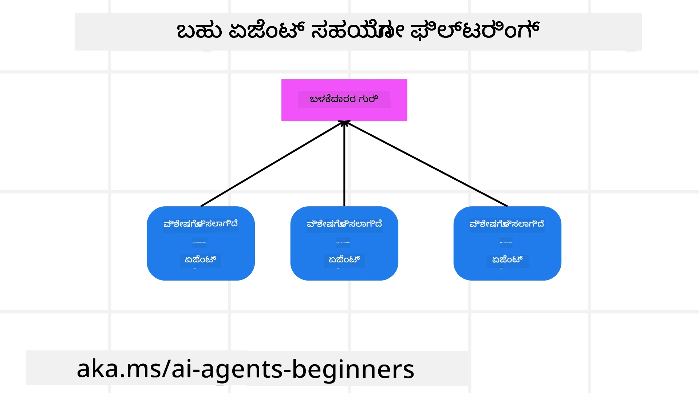

> _(ಈ ಪಾಠದ ವಿಡಿಯೋವನ್ನು ವೀಕ್ಷಿಸಲು ಮೇಲಿನ ಚಿತ್ರವನ್ನು ಕ್ಲಿಕ್ ಮಾಡಿ)_

# ಬಹು-ಏಜೆಂಟ್ ವಿನ್ಯಾಸ ಮಾದರಿಗಳು

ನೀವು ಬಹು ಏಜೆಂಟ್ ಹೊಂದಿರುವ ಯೋಜನೆ ಮೇಲೆ ಕೆಲಸ ಪ್ರಾರಂಭಿಸಿದಷ್ಟೇ, ನೀವು ಬಹು-ಏಜೆಂಟ್ ವಿನ್ಯಾಸ ಮಾದರಿಯನ್ನು ಪರಿಗಣಿಸಬೇಕಾಗುತ್ತದೆ. ಆದರೆ, ಬಹು ಏಜೆಂಟ್‌ಗಳಿಗೆ 언제 ಪ್ರಸಕ್ತಿಸಲು ಮತ್ತು ಅವುಗಳ ಲಾಭ ಎಂದಾದರೂ ಸ್ಪಷ್ಟವಾಗುವುದಿಲ್ಲ.

## ಪರಿಚಯ

ಈ ಪಾಠದಲ್ಲಿ ನಾವು ಕೆಳಗಿನ ಪ್ರಶ್ನೆಗಳಿಗೆ ಉತ್ತರ ಹುಡುಕುತ್ತಿದ್ದೇವೆ:

- ಬಹು-ಏಜೆಂಟ್‌ಗಳನ್ನು ಅನ್ವಯಿಸುವ ಸಂದರ್ಭಾವಳಿಗಳು ಯಾವುದುವು?
- ಒಂದೇ ಏಜೆಂಟ್ ಹಲವಾರು ಕೆಲಸಗಳನ್ನು ಮಾಡುವದಕ್ಕಿಂತ ಬಹು-ಏಜೆಂಟ್ ಬಳಕೆಯ ಲಾಭಗಳು ಯಾವುವು?
- ಬಹು-ಏಜೆಂಟ್ ವಿನ್ಯಾಸ ಮಾದರಿಯನ್ನು ಅನುಷ್ಠಾನಗೊಳಿಸಲು ಅವಶ್ಯಕವಾದ ಹೀನಕಟ್ಟುಗಳು ಯಾವುವು?
- ಬಹು ಏಜೆಂಟ್‌ಗಳು ಪರಸ್ಪರ ಹೇಗೆ ಸಂವಹನ ಮಾಡುತ್ತಿರುವುದನ್ನು ನಾವು ಹೇಗೆ ನೋಡಿಕೊಳ್ಳಬಹುದು?

## ಅಧ್ಯಯನ ಗುರಿಗಳು

ಈ ಪಾಠದ ನಂತರ, ನೀವು ಇವುಗಳನ್ನು ತಿಳಿದುಕೊಳ್ಳಬೇಕು:

- ಬಹು-ಏಜೆಂಟ್‌ಗಳು ಅನ್ವಯಿಸುವ ಪರಿಸ್ಥಿತಿಗಳನ್ನು ಗುರುತಿಸಿ
- ಒಂದೇ ಏಜೆಂಟ್ ಜೊತೆಗೆ ಹೋಲಿಸಿದಾಗ ಬಹು-ಏಜೆಂಟ್ ಬಳಕೆಯ ಲಾಭಗಳನ್ನು ಅರ್ಥಮಾಡಿಕೊಳ್ಳಿ.
- ಬಹು-ಏಜೆಂಟ್ ವಿನ್ಯಾಸ ಮಾದರಿಯ ಹೀನಕಟ್ಟುಗಳನ್ನು ಆಳವಾಗಿ ತಿಳಿದುಕೊಳ್ಳಿ.

ದೊಡ್ಡ ಚಿತ್ರವೇನು?

*ಬಹು ಏಜೆಂಟ್‌ಗಳು ಒಟ್ಟಾಗಿ ಸಾಮಾನ್ಯ ಗುರಿಯನ್ನು ಸಾಧಿಸಲು ಕೆಲಸ ಮಾಡಬಹುದಾದ ವಿನ್ಯಾಸ ಮಾದರಿಯಾಗಿದೆ*.

ಇದು ರೋಬೋಟಿಕ್ಸ್, ಸ್ವಾಯತ್ತ ವ್ಯವಸ್ಥೆಗಳು ಮತ್ತು ವಿತರಣಾ ಗಣನೆ ಸೇರಿದಂತೆ ವಿವಿಧ ಕ್ಷೇತ್ರಗಳಲ್ಲಿ ವ್ಯಾಪಕವಾಗಿ ಬಳಕೆಯಾಗುತ್ತದೆ.

## ಬಹು-ಏಜೆಂಟ್‌ಗಳು ಅನ್ವಯಿಸುವ ಸಂದರ್ಭಗಳು

ಬಹು ಏಜೆಂಟ್‌ಗಳನ್ನು ಬಳಸಲು ಸೂಕ್ತವಾಗಿರುವ ಸಂದರ್ಭಾವಳಿಗಳೇನು? ಉತ್ತರವೆಂದರೆ ಹಲವಾರು ಸಂದರ್ಭಗಳಲ್ಲಿ ಬಹು ಏಜೆಂಟ್ ಬಳಕೆ ಲಾಭಕರ, ಇದರಲ್ಲಿ ವಿಶೇಷವಾಗಿ ಹೀಗಿವೆ:

- **ವಿಶಾಲ ಕಾರ್ಯಭಾರಗಳು**: ವಿಶಾಲ ಕಾರ್ಯಭಾರಗಳನ್ನು ಚಿಕ್ಕ ಚಿಕ್ಕ ಕಾರ್ಯಗಳಾಗಿ ವಿಭಜಿಸಿ ವಿಭಿನ್ನ ಏಜೆಂಟ್‌ಗಳಿಗೆ ಹಂಚಬಹುದು, ಇದು ಸಾನ್ನಿಧ್ಯ ಪ್ರಕ್ರಿಯೆಗೆ ಮತ್ತು ವೇಗದ ಪೂರ್ಣತೆಗೆ ಸಹಾಯ ಮಾಡುತ್ತದೆ. ಉದಾಹರಣೆಗೆ, ದೊಡ್ಡ ಡೇಟಾ ಸಂಸ್ಕರಣಾ ಕಾರ್ಯದಲ್ಲಿ.
- **ಸಂಕೀರ್ಣ ಕಾರ್ಯಗಳು**: ವಿಶಾಲ ಕಾರ್ಯಭಾರಗಳಂತೆ, ಸಂಕೀರ್ಣ ಕಾರ್ಯಗಳ ತುಂಡುಗಳನ್ನು ವಿಭಜಿಸಿ ವಿಭಿನ್ನ ಏಜೆಂಟ್‌ಗಳಿಗೆ ಕೊಡಬಹುದು, ಪ್ರತಿ ಏಜೆಂಟ್ ಕಾರ್ಯದ ನಿರ್ದಿಷ್ಟ ಭಾಗದಲ್ಲಿ ಪರಿಣತಿ ಸಾಧಿಸುವುದು. ಉದಾಹರಣೆಗೆ, ಸ್ವಾಯತ್ತ ವಾಹನಗಳಲ್ಲಿ ಸರ್ಕಾರೆ ಪ್ರವೇಶ, ಅಡ್ಡಿಬಾರೆ ಗುರುತಿಸುವಿಕೆ ಮತ್ತು ಇತರ ವಾಹನಗಳೊಂದಿಗೆ ಸಂವಹನವನ್ನು ನಿರ್ವಹಿಸುವುದು ವಿವಿಧ ಏಜೆಂಟ್‌ಗಳ ಕೆಲಸ.
- **ವೈವಿಧ್ಯತಾಪೂರ್ವಕ ಪರಿಣತಿ**: ವಿಭಿನ್ನ ಏಜೆಂಟ್‌ಗಳು ವಿಭಿನ್ನ ಕ್ಷೇತ್ರಗಳಲ್ಲಿ ಪರಿಣತಿ ಹೊಂದಿರಬಹುದು, ಆದ್ದರಿಂದ ಒಟ್ಟಾರೆ ಒಂದು ಏಜೆಂಟ್ ಆದರೆ ಹೆಚ್ಚು ಪರಿಣಾಮಕಾರಿಯಾಗಿ ನಿರ್ವಹಿಸಬಹುದು. ಉದಾಹರಣೆಗೆ, ಆರೋಗ್ಯರಕ್ಷಣದಲ್ಲಿ ಒಂದು ಏಜೆಂಟ್ ರೋಗನಿರ್ಣಯ, ಮತ್ತೊಂದು ಚಿಕಿತ್ಸೆ ಯೋಜನೆ, ಇನ್ನೊಂದು ರೋಗಿಗಳ ಮೇಲ್ವಿಚಾರಣೆ ಮಾಡಬಹುದು.

## ಒಂದೇ ಏಜೆಂಟ್ ಹೋಲಿಸಿದಾಗ ಬಹು-ಏಜೆಂಟ್ ಬಳಕೆಯ ಲಾಭಗಳು

ಸರಳ ಕಾರ್ಯಗಳಿಗೆ ಒಂದು ಏಜೆಂಟ್ ವ್ಯವಸ್ಥೆ ಸಹಾಯಕವಾಗಬಹುದು, ಆದರೆ ಸಂಕೀರ್ಣ ಕಾರ್ಯಗಳಿಗೆ ಬಹು-ಏಜೆಂಟ್ ಬಳಸುವುದು ಹಲವು ಲಾಭಗಳನ್ನು ನೀಡುತ್ತದೆ:

- **ವಿಶೇಷತೆ**: ಪ್ರತಿ ಏಜೆಂಟ್ ಒಂದು ನಿಶ್ಚಿತ ಕಾರ್ಯದಲ್ಲಿ ಪರಿಣತಿಯುಳ್ಳವನು ಆಗಿರಬಹುದೆಂದು. ಒಬ್ಬ ಏಜೆಂಟ್ ಎಲ್ಲವನ್ನೂ ಮಾಡಬಲ್ಲನು ಆದರೆ ಸಂಕೀರ್ಣ ಕಾರ್ಯ ಎದುರಿಸಿದಾಗ ತಲೆತಾಗಿ ತಪ್ಪಾಗಿ ಕೆಲಸ ಮಾಡಬಹುದು.
- **ತೂಕಪಡೆಯುವಿಕೆ**: ಒಂದೇ ಏಜೆಂಟ್ ಮೇಲೆ ಹೆಚ್ಚು ಹೊಣೆಮಾಡುವುದಕ್ಕಿಂತ ಹಲವಾರು ಏಜೆಂಟ್‌ಗಳನ್ನು ಸೇರಿಸುವುದು ಸರಳ.
- **ತಪ್ಪು ಸಹನಶೀಲತೆ**: ಒಂದು ಏಜೆಂಟ್ ವೈಫಲ್ಯವಾದರೆ ಬೇರೆ ಏಜೆಂಟ್‌ಗಳು ಕಾರ್ಯ ನಿರ್ವಹಣೆ ಮುಂದುವರೆಸಬಹುದು, ವ್ಯವಸ್ಥೆಯ ವಿಶ್ವಾಸಾರ್ಹತೆ ಕಾಯ್ದುಕೊಳ್ಳಲು.

ಉದಾಹರಣೆಗೆ, ಬಳಕೆದಾರರಿಗಾಗಿ ಒಂದು ಪ್ರವಾಸ ಬುಕಿಂಗ್‌ ಅನ್ನು ಮಾಡೋಣ. ಒಂದೇ ಏಜೆಂಟ್ ತನ್ನ ಎಲ್ಲಾ ಕಾರ್ಯಗಳನ್ನು, ಹಾರಾಟ ಹುಡುಕುವುದು, ಹೋಟೆಲ್ ಮತ್ತು ಕಾರು ಬುಕಿಂಗ್ ಮಾಡುವುದು ಮುಂತಾದವನ್ನೆಲ್ಲಾ ನಿರ್ವಹಿಸಬೇಕಾಗುತ್ತದೆ. ಇದಕ್ಕಾಗಿ ಏಜೆಂಟ್‌ ಬಳಿ ಎಲ್ಲಾ ಸಾಧನಗಳನ್ನು ಹೊಂದಿರಬೇಕಾಗುತ್ತದೆ, ಇದು ಬೃಹತ್, ನಿರ್ವಹಣೆಗೆ ಕಷ್ಟವಾದ ವ್ಯವಸ್ಥೆಯಾಗಬಹುದು. ಇನ್ನೊಂದು ಕಡೆ, ಬಹು-ಏಜೆಂಟ್ ವ್ಯವಸ್ಥೆಯಲ್ಲಿ ವಿಭಿನ್ನ ಏಜೆಂಟ್‌ಗಳು ಹಾರಾಟ, ಹೋಟೆಲ್, ಕಾರು ಬುಕಿಂಗ್‌ಗಳಲ್ಲಿ ಪರಿಣತಿಗಳು ದೊರಕುತ್ತವೆ. ಇದು ವ್ಯವಸ್ಥೆಯನ್ನು modular ಆಗಿ ಇಟ್ಟುಕೊಳ್ಳುತ್ತದೆ, ನಿರ್ವಹಣೆ ಸುಲಭವಾಗುತ್ತದೆ ಮತ್ತು ತೂಕಪಡೆಯುವಿಕೆ ಸುಲಭ.

ಇದನ್ನು ಮಾವ-ತಾಯಿ ಅಂಗಡಿಯ ಪ್ರವಾಸ ಬ್ಯೂರೋ ಮತ್ತು franchise ಆಧಾರಿತ ಪ್ರವಾಸ ಬ್ಯೂರೋ ಹೋಲಿಕೆಮಾಡಿ ನೋಡಿಯಿರಿ. ಮಾವ-ತಾಯಿ ಅಂಗಡಿಯ ಪ್ರವಾಸ ಬುಕಿಂಗ್‌ ಎಲ್ಲಾ ಕಾರ್ಯಗಳನ್ನು ಒಂದೇ ಏಜೆಂಟ್ ನಿರ್ವಹಿಸುವುದು, franchise ಬ್ಯೂರೋ ಹಲವು ಏಜೆಂಟ್‌ಗಳು ವಿಭಿನ್ನ ಕಾರ್ಯಗಳನ್ನು ನಿರ್ವಹಿಸುವುದು.

## ಬಹು-ಏಜೆಂಟ್ ವಿನ್ಯಾಸ ಮಾದರಿಯನ್ನು ಅನುಷ್ಟಾನಗೊಳಿಸುವ ಹೀನಕಟ್ಟುಗಳು

ಬಹು-ಏಜೆಂಟ್ ವಿನ್ಯಾಸ ಮಾದರಿಯನ್ನು ಅನುಷ್ಠಾನಗೊಳಿಸುವ ಮೊದಲೇ, ಈ ಮಾದರಿಯನ್ನು ರೂಪಿಸುವ ಹೀನಕಟ್ಟುಗಳನ್ನು ತಿಳಿದುಕೊಳ್ಳಬೇಕು.

ಮತ್ತೆ ಬಳಕೆದಾರರ ಪ್ರವಾಸ ಬುಕಿಂಗ್ ಮಾದರಿಯನ್ನು ಪರಿಗಣಿಸಿ. ಹೀನಕಟ್ಟುಗಳೇ ಇವುಗಳು:

- **ಏಜೆಂಟ್ ಸಂವಹನ**: ಹಾರಾಟ ಹುಡುಕುವ, ಹೋಟೆಲ್ ಮತ್ತು ಕಾರು ಬುಕಿಂಗ್ ಮಾಡುವ ಏಜೆಂಟ್‌ಗಳಿಗೆ ಬಳಕೆದಾರರ ಇಚ್ಛೆಗಳು ಮತ್ತು ನಿರ್ಬಂಧಗಳ ಕುರಿತ ಮಾಹಿತಿ ಹಂಚಿಕೊಳ್ಳಬೇಕಾಗುತ್ತದೆ. ಈ ಸಂವಹನಕ್ಕಾಗಿ ಪ್ರೋಟೋಕಾಲ್ ಮತ್ತು ವಿಧಾನಗಳ ಆಯ್ಕೆ ಮಾಡಬೇಕಾಗುತ್ತದೆ. ಉದಾಹರಣೆಗೆ ಹಾರಾಟ ಹುಡುಕುವ ಏಜೆಂಟ್ ಹೋಟೆಲ್ ಬುಕ್ಕಿಂಗ್ ಏಜೆಂಟ್ ಜೊತೆ ಸಂವಹನ ಮಾಡಿ ಹೋಟೆಲ್ ಹಾರಾಟದ ದಿನಾಂಕಗಳಿಗೆ ಹೊಂದಿಕೊಳ್ಳುವಂತೆ ನೋಡಬೇಕು. ಇದರರ್ಥ ಏಜೆಂಟ್‌ಗಳು ಯಾವ ಮಾಹಿತಿಯನ್ನು ಹಂಚಿಕೊಳ್ಳುತ್ತಿದ್ದಾರೆ ಮತ್ತು ಹೇಗೆ ಹಂಚಿಕೊಳ್ಳುತ್ತಾರೆ ಎಂಬುದನ್ನು ನಿರ್ಧಾರ ಮಾಡಬೇಕಾಗುತ್ತದೆ.
- **ಸಮ್ಮೇಳನ ತಂತ್ರಗಳು**: ಏಜೆಂಟ್‌ಗಳು ಬಳಕೆದಾರರ ಇಚ್ಛೆಗಳು ಮತ್ತು ನಿಯಮಗಳಿಗೆ ಅನುಗುಣವಾಗಿ ಕಾರ್ಯತಾಳಿಕೊಳ್ಳಲು ಸಮ್ಮೇಳನ ಮಾಡಬೇಕು. ಉದಾಹರಣೆಗೆ, ಬಳಕೆದಾರ ಹೋಟೆಲ್ ವಿಮಾನ ನಿಲ್ದಾಣ ಸಮೀಪದಲ್ಲಿರಬೇಕು ಎಂದು ಬಯಸಬಹುದು, ಆದರೆ ಕಾರು ಬುಕಿಂಗ್ ಕೇವಲ ವಿಮಾನ ನಿಲ್ದಾಣದಲ್ಲಿಯೇ ಲಭ್ಯವಿದೆ. ಹೀಗಾಗಿ ಹೋಟೆಲ್ ಬುಕ್ಕಿಂಗ್ ಏಜೆಂಟ್ ಕಾರು ಬುಕಿಂಗ್ ಏಜೆಂಟ್ ಜೊತೆ ಸಮನ್ವಯಿಸಿಕೊಂಡು ಈ ನಿಯಮಗಳನ್ನು ಪಾಲಿಸುತ್ತಿರಬೇಕು. ಅದಕ್ಕೆ ಏಜೆಂಟ್‌ಗಳು ತಮ್ಮ ಕಾರ್ಯಗಳನ್ನು ಹೇಗೆ ಸಮನ್ವಯಿಸುತ್ತಿವೆ ಎಂಬುದರ ನಿರ್ಧಾರ ಮಾಡಬೇಕಾಗುತ್ತದೆ.
- **ಏಜೆಂಟ್ ಗತಿಯಾದ್ರಚನೆ**: ಏಜೆಂಟ್‌ಗಳಿಗೆ ನಿರ್ಣಯ ತಲುಪಲು ಮತ್ತು ಬಳಕೆದಾರನೊಂದಿಗೆ ಸಂವಹನದಿಂದ ಕಲಿಯಲು ಒಳಾಂಗಣ ರಚನೆ ಬೇಕಾಗುತ್ತದೆ. ಉದಾಹರಣೆಗೆ ಹಾರಾಟ ಹುಡುಕುವ ಏಜೆಂಟ್ ತನ್ನಅಂತರಂಗದಲ್ಲಿ ಯಂತ್ರ ಕಲಿಕಾ ಮಾದರಿಯನ್ನು ಉಪಯೋಗಿಸಿ ಹಿಂದಿನ ಇಚ್ಛೆಗಳ ಆಧಾರದ ಮೇಲೆ ಹಾರಾಟ ಶಿಫಾರಸು ಮಾಡಬಹುದು. ಇದಕ್ಕೆ ಏಜೆಂಟ್‌ಗಳು ತಮ್ಮ ನಿರ್ಣಯಗಳನ್ನು ಹೇಗೆ ತಗೊಳ್ಳುತ್ತಾರೆ ಹಾಗೂ ಬಳಕೆದಾರನೊಡನೆ ಸಂವಹನದಿಂದ ಹೇಗೆ ಕಲಿಯುತ್ತಾರೆ ಎಂಬುದನ್ನು ನಿರ್ಧರಿಸಬೇಕು.
- **ಬಹು-ಏಜೆಂಟ್ ಸಂವಹನದ ವಿವರಗಳು**: ಏಜೆಂಟ್‌ಗಳು ಪರಸ್ಪರ ಹೇಗೆ ಸಂವಹನ ಮಾಡುತ್ತಿರುತ್ತಾರೆ ಎಂಬುದನ್ನು ನೋಡಲು ನೋಡಿಕೊಳ್ಳಬೇಕು. ಇದು ಡೆಬಗ್ ಮಾಡುವುದು, ಸುಧಾರಣೆಗೊಳಿಸುವುದು ಮತ್ತು ಅವಲೋಕನಕ್ಕೆ ಮುಖ್ಯ. ಇದಕ್ಕಾಗಿ ಲಾಗಿಂಗ್, ಮಾನಿಟರಿಂಗ್ ಸಾಧನಗಳು, ದೃಶ್ಯೀಕರಣ ಸಾಧನಗಳು ಮತ್ತು ಕಾರ್ಯಕ್ಷಮತಾ ಅಳತೆಗಳು ಬೇಕಾಗಬಹುದು.
- **ಬಹು-ಏಜೆಂಟ್ ಮಾದರಿಗಳು**: ಬಹು-ಏಜೆಂಟ್ ವ್ಯವಸ್ಥೆಗಳ ನಿರ್ಮಾಣಕ್ಕೆ ವಿವಿಧ ಮಾದರಿಗಳಿವೆ, ಉದಾಹರಣೆಗೆ ಕೇಂದ್ರೀಕೃತ, ವಿಕೇಂದ್ರೀಕೃತ ಮತ್ತು ಸಂಯುಕ್ತ ಸೂತ್ರಗಳು. ನಿಮ್ಮ ಬಳಕೆಗೆ ಸೂಕ್ತ ಮಾದರಿಯನ್ನು ಆಯ್ಕೆಮಾಡಿಕೊಳ್ಳಿ.
- **ಮಾನವ ಸಹಭಾಗಿತ್ವ**: ಬಹುತೇಕದ ಸ್ಥಿತಿಗಳಲ್ಲಿ ಇಡೀ ಪ್ರಕ್ರಿಯೆಯಲ್ಲಿ ಮಾನವನ ಪಾಲ್ಗೊಳ್ಳುವಿಕೆಯಿರುತ್ತದೆ ಮತ್ತು ಏಜೆಂಟ್‌ಗಳಿಗೆ ಮಾನವರ ಹಸ್ತಕ್ಷೇಪ ಬೇಡಿಕೆ ಮಾಡುವಾಗ ಸೂಚಿಸಬೇಕಾಗುತ್ತದೆ. ಉದಾಹರಣೆಗೆ, ಬಳಕೆದಾರ ಇಲ್ಲದ ಹೋಟೆಲ್ ಅಥವಾ ಹಾರಾಟವನ್ನು ಕೇಳಿದಾಗ ಅಥವಾ ಬುಕಿಂಗ್ ಮುಚ್ಚುವ ಮೊದಲು ದೃಢೀಕರಣ ಕೇಳಬೇಕಾಗುತ್ತದೆ.

## ಬಹು-ಏಜೆಂಟ್ ಸಂವಹನದ ಅವಲೋಕನ

ಏಜೆಂಟ್‌ಗಳು ಪರಸ್ಪರ ಹೇಗೆ ಸಂವಹನ ಮಾಡುತ್ತಿರುವುದನ್ನು ಪರಿಶೀಲಿಸುವುದು ಬಹದ್ದಾದದ್ದು. ಇದು ಡೆಬಗ್, ಸುಧಾರಣೆ ಮತ್ತು ವ್ಯವಸ್ಥೆಯ ಪರಿಣಾಮಕಾರಿತ್ವ ದೃಢೀಕರಣಕ್ಕಾಗಿ ಮುಖ್ಯ. ಇದಕ್ಕಾಗಿ ಲಾಗಿಂಗ್ ಮತ್ತು ಸ್ಮರಣೆ ಸಲಕರಣಗಳು, ದೃಶ್ಯೀಕರಣ ಸಾಧನಗಳು ಮತ್ತು ಕಾರ್ಯಕ್ಷಮತಾ ಅಳತೆಗಳು ಬೇಕಾಗಬಹುದು.

ಉದಾಹರಣೆಗೆ, ಬಳಕೆದಾರರ ಪ್ರವಾಸ ಬುಕಿಂಗ್ ಸಂದರ್ಭದಲ್ಲಿ, ಪ್ರತಿಯೊಂದು ಏಜೆಂಟ್ ಸ್ಥಿತಿಯನ್ನು, ಬಳಕೆದಾರರ ಇಚ್ಛೆಗಳು ಮತ್ತು ನಿಯಮಗಳನ್ನು ಹಾಗೂ ಏಜೆಂಟ್‌ಗಳ ನಡುವಿನ ಸಂವಹನವನ್ನು ತೋರಿಸುವ ಡ್ಯಾಶ್ಬೋರ್ಡ್ ಇರುವುದು ಸಹಾಯಕ. ಇದರಲ್ಲಿ ಬಳಕೆದಾರರ ಪ್ರಯಾಣ ದಿನಾಂಕಗಳು, ಹಾರಾಟ ಏಜೆಂಟ್ ಶಿಫಾರಸು ಮಾಡಿದ ಹಾರಾಟಗಳು, ಹೋಟೆಲ್ ಏಜೆಂಟ್ ಶಿಫಾರಸು ಮಾಡಿದ ಹೋಟೆಲ್‌ಗಳು ಮತ್ತು ಕಾರು ಬುಕಿಂಗ್ ಏಜೆಂಟ್ ಶಿಫಾರಸು ಮಾಡಿದ ಕಾರುಗಳು ಕಾಣಬಹುದು. ಇದರಿಂದ ಏಜೆಂಟ್‌ಗಳು ಪರಸ್ಪರ ಹೇಗೆ ಸಂವಹನ ಮಾಡುತ್ತಿದ್ದಾರೆ ಮತ್ತು ಬಳಕೆದಾರರ ಇಚ್ಛೆಗಳು ಮತ್ತು ನಿಯಮಗಳು ಈಡಾಗುತ್ತಾ ಇದೆಯೇ ಎಂಬುವದು ನಿಗದಿಯಾಗುತ್ತದೆ.

ಪ್ರತಿಯೊಂದು ಅಂಶವನ್ನು ಹೆಚ್ಚಿನ ವಿವರದಲ್ಲಿ ನೋಡೋಣ.

- **ಲಾಗಿಂಗ್ ಮತ್ತು ಮಾನಿಟರಿಂಗ್ ಸಾಧನಗಳು**: ಪ್ರತಿಯೊಂದು ಆಗುಹೋಗಿನ ಕೆಲಸವನ್ನು ಲಾಗ್ ಮಾಡಬೇಕು. ಲಾಗ್ ದಾಖಲಣೆಯಲ್ಲಿ ಕಾರ್ಯವನ್ನು ಕೈಗೊಂಡ ಏಜೆಂಟ್, ಕೈಗೊಳ್ಳಿದ ಕೆಲಸ, ಕಾರ್ಯದ ಸಮಯ ಮತ್ತು ಫಲಿತಾಂಶನ ಮಾಹಿತಿಯನ್ನು ಇರಿಸಬೇಕು. ಇದನ್ನು ಡೆಬಗ್, ಉತ್ತಮಗೊಳಿಸುವಿಕೆ ಹಾಗೂ ಇತರ ಹುಗ್ಗುಗಳಿಗೆ ಬಳಸಬಹುದು.

- **ದೃಶ್ಯೀಕರಣ ಸಾಧನಗಳು**: ಏಜೆಂಟ್‌ಗಳ ಮಧ್ಯೆ ಸಂವಹನವನ್ನು ಸರಳವಾಗಿ ನೋಡಲು ಸಹಾಯ. ಉದಾಹರಣೆಗೆ, ಮಾಹಿತಿಯ ಹರಿವು ಚಿತ್ರಿಸುವ ಗ್ರಾಫ್. ಇದರಿಂದ bottle necks, ಕಾರ್ಯಕ್ಷಮತೆಯ ದುರ್ಬಲತೆ, ಇತ್ಯಾದಿ ಕಾಣಬಹುದು.

- **ಕಾರ್ಯಕ್ಷಮತಾ ಅಳತೆಗಳು**: ಬಹು-ಏಜೆಂಟ್ ವ್ಯವಸ್ಥೆಯ ಪರಿಣಾಮಕಾರಿತ್ವವನ್ನೂ ಅಳೆಯಲು ಸಹಾಯ. ಉದಾಹರಣೆಗೆ, ಕಾರ್ಯ ತಲುಪುವ ಸಮಯ, ಸಮಯಕ್ಕೆ ಪೂರ್ಣಗೊಂಡ ಕಾರ್ಯಗಳ ಸಂಖ್ಯೆ ಮತ್ತು ಶಿಫಾರಸುಗಳ ನಿಖರತೆ ಗ್ರಹಿಸಲು. ಇದರಿಂದ ಸುಧಾರಣೆಯ ಜಾಗಗಳನ್ನು ಗುರುತಿಸಿ ವ್ಯವಸ್ಥೆಯನ್ನು ಉತ್ತಮಗೊಳಿಸಬಹುದು.

## ಬಹು-ಏಜೆಂಟ್ ಮಾದರಿಗಳು

ಬಹು-ಏಜೆಂಟ್ ಆ್ಯಪ್ಸ್ ಸೃಷ್ಟಿಸಲು ಕೆಲವು ಸ್ಪಷ್ಟ ಮಾದರಿಗಳನ್ನು ಇಳಿದು ನೋಡೋಣ. ಇಲ್ಲಿ ಗಮನಿಸಬೇಕಾದ ಕೆಲವು ಮಹತ್ವದ ಮಾದರಿಗಳು ಇವೆ:

### ಗುಂಪು ಸಂಭಾಷಣೆ

ಈ ಮಾದರಿ ಬಹು ಏಜೆಂಟ್‌ಗಳು ಪರಸ್ಪರ ಮಾತನಾಡುವ ಗುಂಪು ಚಾಟ್ ಆಪ್ಲಿಕೇಶನ್ ರಚಿಸಲು ಉಪಯುಕ್ತ. ಸಾಮಾನ್ಯ ಬಳಕೆಗಳೆಂದು ತಂಡ ಸಹಕಾರ, ಗ್ರಾಹಕ ಬೆಂಬಲ, ಸಾಮಾಜಿಕ ಜಾಲತಾಣಗಳು.

ಈ ಮಾದರಿಯಲ್ಲಿ ಪ್ರತಿಯೊಂದು ಏಜೆಂಟ್ ಗುಂಪಿನ ಬಳಕೆದಾರರನ್ನಾಗಿ ಪ್ರತಿನಿಧಿಸುತ್ತದೆ, ಮತ್ತು ಸಂದೇಶಗಳನ್ನು ಸಂದೇಶ ಪ್ರೋಟೋಕಾಲ್ ನಿಂದ ವಿನಿಮಯ ಮಾಡಿಕೊಳ್ಳುತ್ತದೆ. ಏಜೆಂಟ್‌ಗಳು ಗುಂಪಿನ ಚಾಟ್‌ಗೆ ಸಂದೇಶಗಳನ್ನು ಕಳುಹಿಸಬಹುದು, ಗುಂಪಿನಿಂದ ಸಂದೇಶಗಳನ್ನು ಸ್ವೀಕರಿಸಬಹುದು, ಮತ್ತು ಇತರ ಏಜೆಂಟ್ ಸಂದೇಶಗಳಿಗೆ ಪ್ರತಿಕ್ರಿಯಿಸಬಹುದು.

ಈ ಮಾದರಿಯನ್ನು ಎಲ್ಲ ಸಂದೇಶಗಳನ್ನು ಕೇಂದ್ರೀಕೃತ ಸರ್ವರ್ ಮೂಲಕ ಮಾರ್ಗಸೂಚಿತಾ ಪಡುವ centralized ವಾಸ್ತುಶಿಲ್ಪ ಅಥವಾ ಯಥಾಸ್ಥಿತಿಯಲ್ಲಿ ಸಂದೇಶಗಳನ್ನು ನೇರ ವಿನಿಮಯ ಮಾಡುವ ವಿಕೇಂದ್ರೀಕೃತ ಆರ್ಕಿಟೆಕ್ಚರ್ ಬಳಸಬಹುದು.

### ಕಾರ್ಯ ಹಸ್ತಾಂತರ

ಈ ಮಾದರಿ ಬಹು ಏಜೆಂಟ್‌ಗಳು ಪರಸ್ಪರ ಕಾರ್ಯ ಹಸ್ತಾಂತರ ಮಾಡಲು ಬಯಸುವ ಆಪ್ಲಿಕೇಶನಿಗಾಗಿ ಉಪಯುಕ್ತ.

ಸಾಮಾನ್ಯ ಬಳಕೆಗಳು ಗ್ರಾಹಕ ಬೆಂಬಲ, ಕಾರ್ಯ ನಿರ್ವಹಣೆ ಮತ್ತು ಕೆಲಸದ ಸುಗಮೀಕರಣ.

ಈ ಮಾದರಿಯಲ್ಲಿ ಪ್ರತಿಯೊಂದು ಏಜೆಂಟ್ ಕಾರ್ಯ ಅಥವಾ ಕೆಲಸದ ಹಂತವನ್ನಾಗಿ ಪ್ರತಿನಿಧಿಸುತ್ತದೆ, ಮತ್ತು ಪೂರ್ವನಿಗದಿ ನಿಯಮಗಳ ಪ್ರಕಾರ ಕಾರ್ಯಗಳನ್ನು ಹಸ್ತಾಂತರ ಮಾಡಬಹುದು.

### ಸಹಕಾರಿಯಾಗಿ ಫಿಲ್ಟರಿಂಗ್

ಈ ಮಾದರಿ ಬಹು ಏಜೆಂಟ್‌ಗಳು ಸಹಕರಿಸಿ ಬಳಕೆದಾರರಿಗೆ ಶಿಫಾರಸುಗಳನ್ನು ಮಾಡುವ ಆಪ್ಲಿಕೇಶನಿಗೆ ಉಪಯುಕ್ತ.

ಏಕೆ ಹಲವಾರು ಏಜೆಂಟ್ ಸಹಕರಿಸುವುದು ಬೇಕಾದರೆ, ಪ್ರತಿಯೊಂದು ಏಜೆಂಟ್ ವಿಭಿನ್ನ ಪರಿಣತಿಯನ್ನು ಹೊಂದಿದ್ದು ಶಿಫಾರಸು ಪ್ರಕ್ರಿಯೆಗೆ ವಿಭಿನ್ನ ರೀತಿಯಲ್ಲಿ ಸಹಾಯ ಮಾಡಬಹುದು.

ಉದಾಹರಣೆಗೆ, ಬಳಕೆದಾರನು ಷೇರು ಮಾರುಕಟ್ಟೆಯಿಂದ ಉತ್ತಮ ಷೇರು ಶಿಫಾರಸು ತಿಳಿಸಲು ಬಯಸುವ ಚಟುವಟಿಕೆಯಲ್ಲಿ.

- **ವ್ಯವಸಾಯ ಪರಿಣತಿ**: ಒಂದು ಏಜೆಂಟ್ ನಿಶ್ಚಿತ ಉದ್ಯಮದಲ್ಲಿ ತಜ್ಞರಾಗಿರಬಹುದು.
- **ತಾಂತ್ರಿಕ ವಿಶ್ಲೇಷಣೆ**: ಇನ್ನೊಂದು ಏಜೆಂಟ್ ತಾಂತ್ರಿಕ ವಿಶ್ಲೇಷಣೆಯ ತಜ್ಞ.
- **ಮೂಲಭೂತ ವಿಶ್ಲೇಷಣೆ**: ಮತ್ತೊಂದು ಏಜೆಂಟ್ ಮೂಲಭೂತ ವಿಶ್ಲೇಷಣೆಯ ತಜ್ಞ. ಸಹಕರನೆಯಿಂದ ಈ ಏಜೆಂಟ್‌ಗಳು ಬಳಕೆದಾರರಿಗೆ ಸಮಗ್ರ ಶಿಫಾರಸು ನೀಡಬಹುದು.

## ಘಟನೆ: ಮರುಪಾವತಿ ಪ್ರಕ್ರಿಯೆ

ಗ್ರಾಹಕರಿಗೆ ಉತ್ಪನ್ನದ ಮರುಪಾವತಿ ಮಾಡಲು ಪ್ರಯತ್ನಿಸುವ ಘಟನೆ ಪರಿಗಣಿಸಿ, ಈ ಪ್ರಕ್ರಿಯೆಯಲ್ಲಿ ಹಲವಾರು ಏಜೆಂಟ್‌ಗಳು ಜೋಡಿಯಾಗಬಹುದು, ಅದರಲ್ಲಿ ಮರುಪಾವತಿ ನಿರ್ದಿಷ್ಟ ಏಜೆಂಟ್‌ಗಳು ಮತ್ತು ವ್ಯಾಪಾರದ ಇತರ ಭಾಗಗಳಲ್ಲಿ ಉಪಯೋಗಿಸಬಹುದಾದ ಸಾಮಾನ್ಯ ಏಜೆಂಟ್‌ಗಳಿಗೆ ವಿಭಜಿಸೋಣ.

**ಮರುಪಾವತಿ ಪ್ರಕ್ರಿಯೆ ನಿರ್ದಿಷ್ಟ ಏಜೆಂಟ್‌ಗಳು**:

ಈ ಕೆಳಗಿನ ಏಜೆಂಟ್‌ಗಳು ಮರುಪಾವತಿ ಪ್ರಕ್ರಿಯೆಯಲ್ಲಿ ಪಾಲ್ಗೊಳ್ಳಬಹುದು:

- **ಗ್ರಾಹಕ ಏಜೆಂಟ್**: ಗ್ರಾಹಕರನ್ನು ಪ್ರತಿನಿಧಿಸಿ ಮರುಪಾವತಿಯನ್ನು ಪ್ರಾರಂಭಿಸುವ ಜವಾಬ್ದಾರಿ.
- **ಮಾರಾಟದ ಏಜೆಂಟ್**: ಮಾರಾಟದ ಪ್ರತಿನಿಧಿ, ಮರುಪಾವತಿ ಪ್ರಕ್ರಿಯೆಯನ್ನು ನಿರ್ವಹಿಸುವ ಜವಾಬ್ದಾರಿ.
- **ಪಾವತಿ ಏಜೆಂಟ್**: ಪಾವತಿ ಪ್ರಕ್ರಿಯೆಯ ಪ್ರತಿನಿಧಿ, ಗ್ರಾಹಕರಿಗೆ ಪಾವತಿ ಮರುಪಾವತಿಸುವ ಜವಾಬ್ದಾರಿ.
- **ತೀರ್ಮಾನ ಏಜೆಂಟ್**: ಮರುಪಾವತಿ ಪ್ರಕ್ರಿಯೆಯಲ್ಲಿನ ಸಮಸ್ಯೆಗಳನ್ನು ಪರಿಹರಿಸುವ ಜವಾಬ್ದಾರಿ.
- **ಅನುಕೂಲತೆ ಏಜೆಂಟ್**: ಮರುಪಾವತಿ ಪ್ರಕ್ರಿಯೆಯು ನಿಯಮ ಮತ್ತು ನೀತಿಗಳ ಪಾಲನೆ ಆಗುವಂತೆ ನೋಡಿಕೊಳ್ಳುವ ಜವಾಬ್ದಾರಿ.

**ಸಾಮಾನ್ಯ ಏಜೆಂಟ್‌ಗಳು**:

ಇವು ನಿಮ್ಮ ವ್ಯವಹಾರದ ಇತರ ಭಾಗಗಳಲ್ಲಿ ಕೂಡ ಉಪಯೋಗಿಸಬಹುದು.

- **ಸಪ್ಲೈ ಏಜೆಂಟ್**: ಶಿಪ್ಪಿಂಗ್ ಪ್ರಕ್ರಿಯೆಯ ಪ್ರತಿನಿಧಿ, ಉತ್ಪನ್ನವನ್ನು ಮಾರಾಟಗಾರರಿಗೆ ಹಿಂದಿರುಗಿಸುವ ಜವಾಬ್ದಾರಿ. ಮರುಪಾವತಿ ಮತ್ತು ಸಾಮಾನ್ಯ ಶಿಪ್ಪಿಂಗ್ ಎರಡಕ್ಕೂ ಬಳಸಬಹುದಾಗಿದೆ.
- **ಪ್ರತಿಕ್ರಿಯೆ ಏಜೆಂಟ್**: ಗ್ರಾಹಕರಿಂದ ಪ್ರತಿಕ್ರಿಯೆ ಸಂಗ್ರಹಿಸುವ ಜವಾಬ್ದಾರಿ. ಇದು ಯಾವಾಗ ಬೇಕಾದರೂ ಮಾಡಬಹುದಾದುದಾಗಿದೆ, ಮರುಪಾವತಿ ವೇಳೆ ಮಾತ್ರವಲ್ಲ.
- **ಹೆಚ್ಚುವರಿ ಏಜೆಂಟ್**: ಸಮಸ್ಯೆಗಳನ್ನು ಮೇಲು ಮಟ್ಟದ ಬೆಂಬಲಕ್ಕೆ ವರ್ಗಾಯಿಸುವ ಜವಾಬ್ದಾರಿ. ಯಾವುದೇ ಪ್ರಕ್ರಿಯೆಗೆ ಇದನ್ನು ಉಪಯೋಗಿಸಬಹುದು.
- **notifications agent**: ಮರುಪಾವತಿ ಪ್ರಕ್ರಿಯೆಯ ವಿವಿಧ ಹಂತಗಳಲ್ಲಿ ಗ್ರಾಹಕರಿಗೆ ನೋಟಿಫಿಕೇಶನ್‌ಗಳನ್ನು ಕಳುಹಿಸುವ ಜವಾಬ್ದಾರಿ.
- **ವಿಶ್ಲೇಷಣೆ ಏಜೆಂಟ್**: ಮರುಪಾವತಿ ಸಂಬಂಧಿತ ಡೇಟಾ ವಿಶ್ಲೇಷಿಸುವ ಜವಾಬ್ದಾರಿ.
- **ಆಡಿಟ್ ಏಜೆಂಟ್**: ಮರುಪಾವತಿ ಪ್ರಕ್ರಿಯೆಯ ಪರಿಶೀಲನೆ ಹಾಗೂ ಸರಿಯಾದ ಅನುಷ್ಟಾನ ಮಾಡಲಾಗುತ್ತಿದೆ ಎಂದು ಖಚಿತಪಡಿಸುವ ಜವಾಬ್ದಾರಿ.
- **ರಿಪೋರ್ಟಿಂಗ್ ಏಜೆಂಟ್**: ಮರುಪಾವತಿ ಪ್ರಕ್ರಿಯೆಯ رپور್ಟ್ ತಯಾರಿಸುವ ಜವಾಬ್ದಾರಿ.
- **ಜ್ಞಾನ ಏಜೆಂಟ್**: ಮರುಪಾವತಿ ಸಂಬಂಧಿತ ಜ್ಞಾನಾಧಾರ ಖಚಿತಪಡಿಸುವ ಜವಾಬ್ದಾರಿ. ಇದು ಮರುಪಾವತಿ ಮತ್ತು ವ್ಯವಹಾರದ ಬೇರೆ ಭಾಗಗಳ ವಿಜ್ಞಾನ ತಿಳಿದುಕೊಳ್ಳಬಹುದು.
- **ಸುರಕ್ಷತೆ ಏಜೆಂಟ್**: ಮರುಪಾವತಿ ಪ್ರಕ್ರಿಯೆಯ ಸುರಕ್ಷತೆಗೆ ಜವಾಬ್ದಾರ.
- **ಗುಣಮಟ್ಟ ಏಜೆಂಟ್**: ಮರುಪಾವತಿ ಪ್ರಕ್ರಿಯೆಯ ಗುಣಮಟ್ಟ ಖಚಿತಪಡಿಸುವ ಜವಾಬ್ದಾರಿ.

ಇವುವು ನಿರ್ದಿಷ್ಟ ಮರುಪಾವತಿ ಪ್ರಕ್ರಿಯೆಯ ಗೆ ಪ್ರಾಯೋಜಿಸಲ್ಪಟ್ಟ ಏಜೆಂಟ್‌ಗಳಾದರೂ ಎರಡೂ ನಿಮ್ಮ ವ್ಯವಹಾರದ ಇತರ ಹಂತಗಳಲ್ಲೂ ಉಪಯೋಗಿಸುವ ಸಾಮಾನ್ಯ ಏಜೆಂಟ್‌ಗಳಾಗಿ ಕೂಡ ಕಾಣಬಹುದು. ಇದು ನಿಮ್ಮ ಬಹು-ಏಜೆಂಟ್ ವ್ಯವಸ್ಥೆಯಲ್ಲಿ ಯಾವ ಏಜೆಂಟ್‌ಗಳನ್ನು ತೆಗೆದುಕೊಳ್ಳಬೇಕೆಂದು ತೀರ್ಮಾನಿಸಲು ಸಹಾಯ ಮಾಡುತ್ತದೆ ಎಂದು ಆಶಿಸುತ್ತೇವೆ.

## ಜವಾಬ್ದಾರಿ

ಗ್ರಾಹಕ ಬೆಂಬಲ ಪ್ರಕ್ರಿಯೆಗೆ ಬಹು-ಏಜೆಂಟ್ ವ್ಯವಸ್ಥೆಯ ವಿನ್ಯಾಸ ಮಾಡಿ. ಪ್ರಕ್ರಿಯೆಯಲ್ಲಿ ಪಾಲ್ಗೊಂಡವರೇನು, ಅವರ ಪಾತ್ರಗಳು ಮತ್ತು ಜವಾಬ್ದಾರಿಗಳು ಯಾವುವು, ಮತ್ತು ಅವರು ಪರಸ್ಪರ ಹೇಗೆ ಸಂವಹನ ಮಾಡುತ್ತಾರೆ ಎಂಬುದನ್ನು ಗುರುತಿಸಿ. ಗ್ರಾಹಕ ಬೆಂಬಲ ಹಾಗೂ ಉದ್ಯಮದ ಇತರ ಭಾಗಗಳಲ್ಲಿ ಬಳಸಬಹುದಾದ ಸಾಮಾನ್ಯ ಏಜೆಂಟ್‌ಗಳನ್ನೂ ಪರಿಗಣಿಸಿ.

> ಕೆಳಕಂಡ ಪರಿಹಾರವನ್ನು ಓದಲು ಮೊದಲು ಚಿಂತಿಸಿ, ನೀವು ಊಹಿಸುವುದಕ್ಕಿಂತ ಹೆಚ್ಚು ಏಜೆಂಟ್ಗಳು ಬೇಕಾಗಬಹುದು.

> TIP: ಗ್ರಾಹಕ ಬೆಂಬಲ ಪ್ರಕ್ರಿಯೆಯ ವಿಭಿನ್ನ ಹಂತಗಳನ್ನು ಮತ್ತು ಯಾವುದೇ ವ್ಯವಸ್ಥೆಗೆ ಬೇಕಾಗುವ ಏಜೆಂಟ್‌ಗಳನ್ನು ಪರಿಗಣಿಸಿ.

## ಪರಿಹಾರ

[ಪರಿಹಾರ](./solution/solution.md)

## ಜ್ಞಾನ ಪರಿಶೀಲನೆಗಳು

### ಪ್ರಶ್ನೆ 1

ಬಹು ಏಜೆಂಟ್ ವ್ಯವಸ್ಥೆಗೆ ಯಾವ ದೃಶ್ಯಾವಳಿಯು ಅತ್ಯುತ್ತಮ ಹೊಂದಿಕೆಯಾಗುತ್ತದೆ?

- [ ] A1: ಒಂದು ಬೆಂಬಲ ಬಾಟ್ ಒಂದು ಜ್ಞಾನ ಕೀಳಿನಿಂದ ಮತ್ತು ಸಣ್ಣ ಸಾಧನಗಳ ಸಮೂಹದಿಂದ ಸಾಮಾನ್ಯ ಪ್ರಶ್ನೆಗಳಿಗೆ ಉತ್ತರಿಸುತ್ತಿದೆ.
- [ ] A2: ಹಣ ಹಿಂತಿರುಗಿಸುವ ಕಾರ್ಯಪ್ರವಾಹವು ಪ್ರತ್ಯೇಕ ಮೋಸ, ಪಾವತಿ ಮತ್ತು ಅನುಕೂಲತೆ ಪಾತ್ರಗಳನ್ನು ಅಗತ್ಯವಿದೆ, ಪ್ರತಿಯೊಂದು ತಮ್ಮ ಸಾಧನಗಳೊಂದಿಗೆ, ಹಾಗೂ ಅವರ ಫಲಿತಾಂಶಗಳನ್ನು সমತೋಲನಗೊಳಿಸಬೇಕು.
- [ ] A3: ಅದೇ ಸರಳ ವರ್ಗೀಕರಣ ವಿನಂತಿ ಪ್ರತಿ ಗಂಟೆಗೆ ಸಾವಿರಾರು ಬಾರಿ ಬರುತ್ತದೆ.

### ಪ್ರಶ್ನೆ 2

ಸಾಮಾನ್ಯವಾಗಿ ಒಬ್ಬ ಏಜೆಂಟ್ ಎప్పుడు ಉತ್ತಮ ಆಯ್ಕೆ ಆಗಿರುತ್ತದೆ?

- [ ] A1: ಕಾರ್ಯವನ್ನು ಒಂದು ಸೂಚನೆ ಮತ್ತು ಸಾಧನಗಳೊಂದಿಗೆ ನಿರ್ವಹಿಸಬಹುದು, ವಿಶೇಷ ಜ್ಞಾನ ಹಸ್ತಾಂತರಗಳಿಲ್ಲದೆ.
- [ ] A2: ಏಜೆಂಟ್ ಎರಡು ಅಥವಾ ಹೆಚ್ಚು ಸಾಧನಗಳಿಗೆ ಪ್ರವೇಶ ಹೊಂದಿರುತ್ತಾನೆ.
- [ ] A3: ಕಾರ್ಯಪ್ರವಾಹದಲ್ಲಿ ವಿಭಿನ್ನ ಅನುವಾದಗಳು, ವಿಭಿನ್ನ ಅನುಮತಿಗಳು ಮತ್ತು ಸ್ವತಂತ್ರ ಪರಿಶೀಲನಾ ಟ್ರೇಲ್ಗಳು ಅಗತ್ಯವಿದೆ.

[ಪರಿಹಾರ ಕ್ವಿಜ್](./solution/solution-quiz.md)

## ಸಾರಾಂಶ

ಈ পাঠದಲ್ಲಿ, ನಾವು ಬಹು ಏಜೆಂಟ್ ವಿನ್ಯಾಸ ಮಾದರಿಯನ್ನು ಪರಿಗಣಿಸಿದ್ದೇವೆ, ಬಹು ಏಜೆಂಟ್ ಬಳಸಬಹುದಾದ ದೃಶ್ಯಗಳು, ಒಬ್ಬ ಏಜೆಂಟ್ కు ಹೋಲಿಸಿಕೊಂಡಾಗ ಬಹು ಏಜೆಂಟ್‌ಗಳ ಪ್ರಯೋಜನಗಳು, ಬಹು ಏಜೆಂಟ್ ವಿನ್ಯಾಸ ಮಾದರಿಯನ್ನು ಅನುಷ್ಠಾನಗೊಳಿಸುವ ಮೂಲಭಾಗಗಳು ಮತ್ತು ಹಲವಾರು ಏಜೆಂಟ್ ಗಳು ಪರಸ್ಪರ ಹೇಗೆ ಸಂವಹನ ಮಾಡುತ್ತಿದ್ದಾರೆ ಎಂಬುದನ್ನು ಹೇಗೆ ಗಮನಿಸುವುದು ಎಂಬುದನ್ನು ನೋಡಿದ್ದೇವೆ.

### ಬಹು ಏಜೆಂಟ್ ವಿನ್ಯಾಸ ಮಾದರಿಯ ಬಗ್ಗೆ ಹೆಚ್ಚಿನ ಪ್ರಶ್ನೆಗಳಿದ್ದರೆ?

[Microsoft Foundry Discord](https://discord.com/invite/ATgtXmAS5D) ಗೆ ಸೇರಿ ಇತರ ಕಲಿಕಾರ್ಥಿಗಳನ್ನು ಭೇಟಿ ಮಾಡಿ, ಕಾರ್ಯಾಲಯ ಸಮಯದಲ್ಲಿ ಭಾಗವಹಿಸಿ ಮತ್ತು ನಿಮ್ಮ AI ಏಜೆಂಟ್ ಪ್ರಶ್ನೆಗಳಿಗೆ ಉತ್ತರ ಪಡೆಯಿರಿ.

## ಹೆಚ್ಚುವರಿ ಸಂಪನ್ಮೂಲಗಳು

- <a href="https://learn.microsoft.com/azure/ai-services/agents/overview" target="_blank">Microsoft Agent Framework ಡಾಕ್ಯುಮೆಂಟೇಷನ್</a>
- <a href="https://www.analyticsvidhya.com/blog/2024/10/agentic-design-patterns/" target="_blank">Agentic ವಿನ್ಯಾಸ ಮಾದರಿಗಳು</a>

## ಹಿಂದಿನ ಪಾಠ

[ಯೋಜನೆ ವಿನ್ಯಾಸ](../07-planning-design/README.md)

## ಮುಂದಿನ ಪಾಠ

[AI ಏಜೆಂಟ್‌ಗಳಲ್ಲಿ ಮೆಟಾಕಾಗ್ನಿಶನ್](../09-metacognition/README.md)

---

<!-- CO-OP TRANSLATOR DISCLAIMER START -->
**ಅಸ್ವೀಕಾರ**:
ಈ ದಸ್ತಾವೇಜು AI ಅನುವಾದ ಸೇವೆ [Co-op Translator](https://github.com/Azure/co-op-translator) ಬಳಸಿ ಅನುವಾದಿಸಲಾಗಿದೆ. ನಾವು ನಿಖರತೆಯನ್ನು ಸಾಧಿಸಲು ಪ್ರಯತ್ನಿಸುತ್ತಿದ್ದರೂ, ದಯವಿಟ್ಟು ಗಮನಿಸಿ, ಸ್ವಯಂಚಾಲಿತ ಅನುವಾದಗಳಲ್ಲಿ ದೋಷಗಳು ಅಥವಾ ಅಸಡ್ಡೆಗಳು ಇರಬಹುದು. ಮೂಲ ಭಾಷೆಯಲ್ಲಿರುವ ಮೂಲ ದಸ್ತಾವೇಜು ಪ್ರಾಮಾಣಿಕ ಮೂಲವೆಂದು ಪರಿಗಣಿಸಬೇಕು. ಪ್ರಮುಖ ಮಾಹಿತಿಗಾಗಿ, ವೃತ್ತಿಪರ ಮಾನವ ಅನುವಾದವನ್ನು ಶಿಫಾರಸು ಮಾಡಲಾಗುತ್ತದೆ. ಈ ಅನುವಾದವನ್ನು ಬಳಸುವ ಮೂಲಕ ಉಂಟಾಗುವ ಯಾವುದೇ ತಪ್ಪು ಅರ್ಥಗಳ ಅಥವಾ ತಪ್ಪು ವ್ಯಾಖ್ಯಾನಗಳ ಬಗ್ಗೆ ನಾವು ಹೊಣೆಗಾರರಲ್ಲ.
<!-- CO-OP TRANSLATOR DISCLAIMER END -->