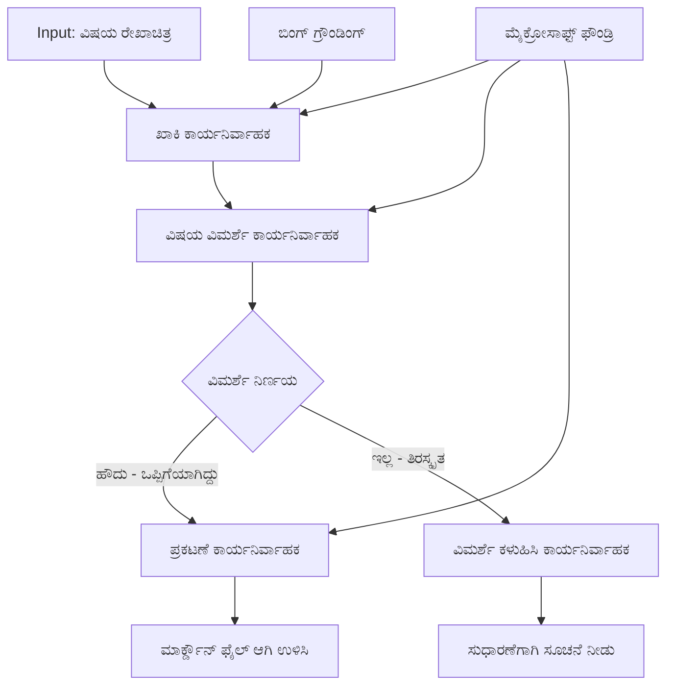

# 🔀 ಮೈಕ್ರೋಸಾಫ್ಟ್ ಫೌಂಡ್ರಿ (.NET) ಜೊತೆ ಶರತುಪದ ಏಜೆಂಟ್ ವರ್ಕ್‌ಫ್ಲೋಗಳು

## 📋 ಬುದ್ಧಿಮತ್ತೆಯ ನಿರ್ಧಾರಾಧಾರಿತ ವರ್ಕ್‌ಫ್ಲೋ ಟ್ಯುಟೋರಿಯಲ್

ಈ ನೋಟ್‌ಬುಕ್ ಮೈಕ್ರೋಸಾಫ್ಟ್ ಫೌಂಡ್ರಿ ಮತ್ತು ಮೈಕ್ರೋಸಾಫ್ಟ್ ಏಜೆಂಟ್ ಫ್ರೇಮ್ವರ್ಕ್ ಫಾರ್ .NET ಬಳಸಿ **ಶರತುಪದ ವರ್ಕ್‌ಫ್ಲೋ ಮಾದರಿಗಳನ್ನು** ಪ್ರದರ್ಶಿಸುತ್ತದೆ. ನಿಮಗೆ ವಿಧಾನಸಂಕೀರ್ಣ, ನಿರ್ಧಾರ ಚಾಲಿತ ವರ್ಕ್‌ಫ್ಲೋಗಳನ್ನು ನಿರ್ಮಿಸುವ ವಿಧಾನ ತಿಳಿಯುತ್ತದೆ, ಇದು AI ವಿಶ್ಲೇಷಣೆ, ವ್ಯವಹಾರ ನಿಯಮಗಳು ಮತ್ತು ಡೈನಾಮಿಕ್ ಶರತ್ತುಗಳ ಆಧಾರದ ಮೇಲೆ ಪ್ರಕ್ರಿಯೆಯನ್ನು ಬುದ್ಧಿವಂತಿಕೆಯಿಂದ ಮಾರ್ಗದರ್ಶಿಸುತ್ತದೆ, ಪ್ರಧಾನ ಮಟ್ಟದ ಸ್ವಯಂಕ್ರಿಯ ಸಾರ್ವಜನಿಕರಿಗೆ.

## 🎯 ಕಲಿಕೆಯ ಉದ್ದೇಶಗಳು

### 🧠 **ಬುದ್ಧಿಮತ್ತೆಯ ನಿರ್ಧಾರ ವಿನ್ಯಾಸಶಾಸ್ತ್ರ**
- **ಶರತುಪದ ಲಾಜಿಕ್ ಜಾರಿಗೊಳಿಸುವಿಕೆ**: ಬಹು ಶಾಖೆಗಳೊಂದಿಗೆ ಸಂಕೀರ್ಣ ನಿರ್ಧಾರ ಮರಗಳನ್ನು ನಿರ್ಮಿಸಿ
- **AI ಚಾಲಿತ ಮಾರ್ಗದರ್ಶನ**: ಮೈಕ್ರೋಸಾಫ್ಟ್ ಫೌಂಡ್ರಿ ಮಾದರಿಗಳನ್ನು ಬಳಸಿ ಬುದ್ಧಿವಂತಿಕೆಯ ಜೋಪಾನ ನಿರ್ಧಾರಗಳನ್ನು ಮಾಡಿರಿ
- **ಡೈನಾಮಿಕ್ ವರ್ಕ್‌ಫ್ಲೋ ಹೊಂದಿಕೆ**: ಚಾಲನಾ ವಿಶ್ಲೇಷಣೆ ಮತ್ತು ಶರತ್ತುಗಳ ಆಧಾರದ ಮೇಲೆ ವರ್ಕ್‌ಫ್ಲೋ ವರ್ತನೆಯನ್ನು ತಿದ್ದು
- **ಸೈರಾಂಶ ನಿಯಮ ಸಂಯೋಜನೆ**: ವ್ಯವಹಾರ ಲಾಜಿಕ್ ಮತ್ತು ಅನುಪಾಲನಾ ಅಗತ್ಯಗಳನ್ನು ವರ್ಕ್‌ಫ್ಲೋಗಳಲ್ಲಿ ಸೇರಿಸಿ

### 🔀 **ಆಧುನಿಕ ಶರತುಪದ ಮಾದರಿಗಳು**
- **ಬಹು ಮಾನದಂಡ ನಿರ್ಧಾರ ಕೈಗೊಳ್ಳುವಿಕೆ**: ಮಾರ್ಗದರ್ಶನ ನಿರ್ಧಾರಗಳಿಗೆ ಹಲವು ಕಾರಣಗಳನ್ನು ಮೌಲ್ಯಮಾಪನ ಮಾಡಿ
- **ಸಂದರ್ಭ ಬುದ್ಧಿವಂತ ಪ್ರಕ್ರಿಯೆ**: ಸಂಗ್ರಹಿತ ವರ್ಕ್‌ಫ್ಲೋ ಸಂಧರ್ಭ ಮತ್ತು ಇತಿಹಾಸ ಆಧಾರದ ಮೇಲೆ ನಿರ್ಧಾರ ಮಾಡಿ
- **ಅನೂಕೂಲಿತ ವರ್ಕ್‌ಫ್ಲೋ ತಿದ್ದು**: ನೈಜ ಸಮಯದ ಶರತ್ತುಗಳ ಆಧಾರದ ಮೇಲೆ ಪ್ರಕ್ರಿಯೆ ಮಾರ್ಗಗಳನ್ನು ಡೈನಾಮಿಕ್ ಆಗಿ ಹೊಂದಿಸಿ
- **ನಿಯಮ ಎಂಜಿನ್ ಸಂಯೋಜನೆ**: ಸಮಗ್ರ ವ್ಯವಹಾರ ನಿಯಮ ಎಂಜಿನ್‌ಗಳನ್ನು ವರ್ಕ್‌ಫ್ಲೋಗಳ ಒಳಗಾಗಿ ಜಾರಿ ಮಾಡಿ

### 🏢 **ಎಂಟರ್‌ಪ್ರೈಸ್ ಶರತುಪದ ಅಪ್ಲಿಕೆಶನ್ಗಳು**
- **ಡಾಕ್ಯುಮೆಂಟ್ ವರ್ಗಾವಣೆ & ಮಾರ್ಗದರ್ಶನ**: ಸ್ವಯಂಚಾಲಿತವಾಗಿ ಡಾಕ್ಯುಮೆಂಟ್‌ಗಳನ್ನು ತಕ್ಕಿರುವ ವರ್ಕ್‌ಫ್ಲೋಗಳಿಗೆ ವರ್ಗಿಸಿ ಮತ್ತು ಮಾರ್ಗದರ್ಶಿಸಿ
- **ಗ್ರಾಹಕ ಸೇವೆ ತ್ರಿಯಾಗ್**: ಗ್ರಾಹಕ ವಿಚಾರಣೆಗಳಿಗೆ ನಿಸರ್ಗಬದ್ಧ ಮಾರ್ಗದರ್ಶನ ವರ್ಗಗಳು ಹೆಚ್ಚು ಪರಿಣಿತ ತಂಡಗಳಿಗೆ
- **ಅನુપಾಲನೆ & ಅಪಾಯ ಪ್ರಾಸೆಸಿಂಗ್**: ಅಪಾಯ ಮೌಲ್ಯಮಾಪನದ ಆಧಾರದ ಮೇಲೆ ವಿವಿಧ ಪರಿಶೀಲನೆ ಮತ್ತು ವಿಮರ್ಶಾ ಪ್ರಕ್ರಿಯೆಗಳ ಅನ್ವಯಣೆ
- **ಗುಣಮಟ್ಟ ಖಚಿತೀಕರಿಸುವ ವರ್ಕ್‌ಫ್ಲೋಗಳು**: ಗುಣಮಟ್ಟ ಮಾನದಂಡಗಳ ಆಧಾರದ ಮೇಲೆ ತಕ್ಕ ಪರಿಶೀಲನೆ ಮಾರ್ಗಗಳ ಮೂಲಕ ವಿಷಯ ಮಾರ್ಗದರ್ಶಿಸಿ

## ⚙️ ಪೂರ್ವಶರತ್ತುಗಳು ಮತ್ತು ಸೆಟಪ್

### 📦 **ಅವಶ್ಯಕ ನ್ಯೂಗೇಟ್ ಪ್ಯಾಕೇಜುಗಳು**

ಶರತುಪದ ವರ್ಕ್‌ಫ್ಲೋ ಪ್ರಾಸೆಸಿಂಗ್‌ಗೆ ಪ್ರಗತಿಪರ ಪ್ಯಾಕೇಜುಗಳು:

```xml
<!-- Core AI Framework -->
<PackageReference Include="Microsoft.Extensions.AI" Version="9.9.0" />

<!-- Azure AI Agents with Persistent State -->
<PackageReference Include="Azure.AI.Agents.Persistent" Version="1.2.0-beta.5" />

<!-- Azure Identity and Utilities -->
<PackageReference Include="Azure.Identity" Version="1.15.0" />
<PackageReference Include="System.Linq.Async" Version="6.0.3" />
<PackageReference Include="DotNetEnv" Version="3.1.1" />

<!-- Local Workflow Framework References -->
<!-- Microsoft.Agents.Workflows.dll - Advanced workflow orchestration -->
<!-- Microsoft.Agents.AI.AzureAI.dll - Microsoft Foundry integration -->
<!-- Microsoft.Agents.AI.dll - Core agent abstractions -->
```

### 🔑 **ಮೈಕ್ರೋಸಾಫ್ಟ್ ಫೌಂಡ್ರಿ ಸಂರಚನೆ**

**ಅವಶ್ಯಕ ಏಜ್ಯುರ್ ಸಂಪನ್ಮೂಲಗಳು:**
- ಶರತುಪದ ಪ್ರಾಸೆಸಿಂಗ್ ಮಾದರಿಗಳೊಂದಿಗೆ ಮೈಕ್ರೋಸಾಫ್ಟ್ ಫೌಂಡ್ರಿ ಕಾರ್ಯಾಗಾರ
- ಸೂಕ್ತ ಗಣನೆ ಮಿತಿಗಳು ಮತ್ತು ಅನುಮತಿಗಳೊಂದಿಗೆ ಏಜ್ಯೂರ್ ಸದಸ್ಯತ್ವ
- ನಿರ್ಧಾರ ಕೈಗೊಳ್ಳುವಿಕೆ ಹಾಗೂ ವಿಷಯ ವಿಶ್ಲೇಷಣೆಗೆ ನಿಯೋಜಿಸಲಾದ AI ಮಾದರಿಗಳು
- (ಐಚ್ಛಿಕ) Bing Search API ಸಂಪರ್ಕ ಜಮಾಕೃತ ಫಲಕ ಸಾಮರ್ಥ್ಯಗಳಿಗೆ

**ಪರಿಸರ ಸಂರಚನೆ (.env ಫೈಲ್):**
```env
# Microsoft Foundry Configuration
AZURE_AI_PROJECT_ENDPOINT=https://your-project.cognitiveservices.azure.com/
BING_CONNECTION_ID=your-bing-connection-id
```

**ಪ್ರಾಮಾಣೀಕರಣ ಸೆಟಪ್:**
```csharp
// Azure CLI or Managed Identity authentication
using Azure.Identity;
var credential = new AzureCliCredential();

// Load environment configuration
DotNetEnv.Env.Load("../../../.env");
```

### 🏗️ **ಶರತುಪದ ವರ್ಕ್‌ಫ್ಲೋ ವಾಸ್ತುಶಿಲ್ಪ**



**ಪ್ರಮುಖ ಘಟಕಗಳು:**
- **ಡ್ರಾಫ್ಟ್ ಎಕ್ಸಿಕ್ಯೂಟರ್**: ರೂಪರೇಖೆಗಳಿಂದ ಪ್ರಾರಂಭಿಕ ವಿಷಯ ಡ್ರಾಫ್ಟ್‌ಗಳನ್ನು ಸೃಷ್ಟಿಸುವ AI ಏಜೆಂಟ್
- **ವಿಷಯ ವಿಮರ್ಶೆ ಎಕ್ಸಿಕ್ಯೂಟರ್**: ಡ್ರಾಫ್ಟ್ ಗುಣಮಟ್ಟ ಮತ್ತು ಅನುಪಾಲನೆಯನ್ನು ಆಕಲಿಸುವ AI ಏಜೆಂಟ್
- **ಶರತುಪದ ಮಾರ್ಗದರ್ಶನ**: ವಿಮರ್ಶಾ ಫಲಿತಾಂಶಗಳ ಆಧಾರದ ಮೇಲೆ ಮಾರ್ಗದರ್ಶನ ನಿರ್ಧಾರ ಲಾಜಿಕ್
- **ಪ್ರಕಾಶನ / ವಿಮರ್ಶಾ ಮಾರ್ಗಗಳು**: ಅನುಮೋದಿತ ಮತ್ತು ನಿರಾಕೃತ ವಿಷಯಗಳಿಗೆ ಪ್ರತ್ಯೇಕ ಪ್ರಕ್ರಿಯೆ ಮಾರ್ಗಗಳು
- **ಸ್ಥಿತಿ ನಿರ್ವಹಣೆ**: ಸಂಪೂರ್ಣ ವರ್ಕ್‌ಫ್ಲೋದಲ್ಲಿ ವಿಷಯ ಮತ್ತು ವಿಮರ್ಶೆ ಸಂಧರ್ಭವನ್ನು ನಿರ್ವಹಿಸುತ್ತದೆ

## 🎨 **ಶರತುಪದ ವರ್ಕ್‌ಫ್ಲೋ ವಿನ್ಯಾಸ ಮಾದರಿಗಳು**

### 📋 **ಗುಣಮಟ್ಟ ದ್ವಾರಗಳೊಂದಿಗೆ ವಿಷಯ ಉತ್ಪಾದನೆ**
```
Outline → Draft Creation → Quality Review → {Approve: Publish | Reject: Revise}
```

### 🎯 **ಅಪಾಯಾಧಾರಿತ ಡಾಕ್ಯುಮೆಂಟ್ ಪ್ರಾಸೆಸಿಂಗ್**
```
Document → Risk Assessment → {Low: Standard | High: Enhanced Review}
```

### 🔍 **ಬುದ್ಧಿವಂತ ಗ್ರಾಹಕ ಸೇವೆ ಮಾರ್ಗದರ್ಶನ**
```
Customer Query → Analysis → {Simple: FAQ Bot | Complex: Human Agent}
```

### 💼 **ಅನುಪಾಲನಾ ಚಾಲಿತ ವರ್ಕ್‌ಫ್ಲೋಗಳು**
```
Content → Compliance Check → {Pass: Publish | Fail: Legal Review}
```

## 🏢 **ಎಂಟರ್‌ಪ್ರೈಸ್ ಶರತುಪದ ಲಾಭಗಳು**

### 🎯 **ಬುದ್ಧಿಮತ್ತೆಯ ಸ್ವಯಂಕ್ರಿಯಾತ್ಮಕತೆ**
- **ಸ್ಮಾರ್ಟ್ ನಿರ್ಧಾರ ಕೈಗೊಳ್ಳುವಿಕೆ**: ವಿಷಯ ವಿಶ್ಲೇಷಣೆ ಮತ್ತು ಸಂಧರ್ಭ ಆಧಾರದ AI ಚಾಲಿತ ಮಾರ್ಗದರ್ಶನ ನಿರ್ಧಾರಗಳು
- **ಅನೂಕೂಲಿತ ಪ್ರಕ್ರಿಯೆ**: ಬದಲಾಗುತ್ತಿರುವ ಶರತ್ತುಗಳ ಆಧಾರದ ಮೇಲೆ ಸ್ವಯಂಚಾಲಿತವಾಗಿ ಹೊಂದಿಕೊಳ್ಳುವ ವರ್ಕ್‌ಫ್ಲೋಗಳು
- **ವ್ಯವಹಾರ ನಿಯಮ ಜಾರಿ**: ಸಂಕೀರ್ಣ ವ್ಯವಹಾರ ನಿಯಮ ಮತ್ತು ನೀತಿಗಳ ಸ್ವಯಂಚಾಲಿತ ಅನ್ವಯಣೆ
- **ಸಂಧರ್ಭಮಾನ ಮಾರ್ಗದರ್ಶನ**: ಪೂರ್ಣ ವರ್ಕ್‌ಫ್ಲೋ ಇತಿಹಾಸ ಮತ್ತು ಸಂಗ್ರಹಿತ ಸಂಧರ್ಭಗಳ ಆಧಾರದ ನಿರ್ಧಾರಗಳು

### 📈 **ಚಾರಿಕಾತ್ಮಕ ಮೇಲುಗುಣತೆ**
- **ಉತ್ತಮ ಸಂಪನ್ಮೂಲ ಹಂಚಿಕೆ**: ಅತ್ಯುತ್ತಮ ಪರಿಣಿತ ಮತ್ತು ಪ್ರಕ್ರಿಯೆಗಳತ್ತ ಕೆಲಸವನ್ನು ಮಾರ್ಗದರ್ಶಿಸಿ
- **ಕಡಿಮೆ ಕೈಯುಕ್ತ ಹಸ್ತಕ್ಷೇಪ**: ಸ್ವಯಂ ನಿರ್ಧಾರ ಕೈಗೊಳ್ಳುವಿಕೆ ಮಾನವನ ಮಾರ್ಗದರ್ಶನ ಅಗತ್ಯ ಕಡಿಮೆ ಮಾಡುತ್ತದೆ
- **ವೇಗದ ಪರಿಹಾರ ಸಮಯಗಳು**: ತಕ್ಕ ಪರಿಣತಿಗೆ ನೇರ ಮಾರ್ಗದರ್ಶನ ಮತ್ತು ಪ್ರಕ್ರಿಯೆ ಸಾಮರ್ಥ್ಯಗಳೊಂದಿಗೆ
- **ಸತತ ಅನ್ವಯಣೆ**: ವ್ಯವಹಾರ ನಿಯಮಗಳು ಮತ್ತು ನಿರ್ಧಾರ ಮಾನದಂಡಗಳ ಸಮಾನ ಪರಿಣಾಮಕಾರಿತ್ವ

### 🛡️ **ಅಪಾಯ ನಿರ್ವಹಣೆ & ಅನುಪಾಲನೆ**
- **ಸ್ವಯಂಚಾಲಿತ ಅಪಾಯ ಮೌಲ್ಯಮಾಪನ**: ವಿಷಯ ಮತ್ತು ಪರಿಸ್ಥಿತಿಯ ಅಪಾಯ ಮಟ್ಟಗಳ AI ಆಧಾರಿತ ಮೌಲ್ಯಮಾಪನ
- **ಅನುಪಾಲನಾ ಜಾರಿ**: ಅಗತ್ಯ ನಿಯಂತ್ರಣ ಪ್ರಕ್ರಿಯೆಗಳ ಮೂಲಕ ಸ್ವಯಂಚಾಲಿತ ಮಾರ್ಗದರ್ಶನ
- **ಭದ್ರತಾ ಪ್ರೋಟೋಕಾಲ್ ಅನ್ವಯಣೆ**: ಅಪಾಯ ಮೌಲ್ಯಮಾಪನ ಆಧಾರದ ಮೇಲೆ ವೃದ್ಧಿಸಿದ ಭದ್ರತೆ ಕ್ರಮಗಳು
- **ಆಡಿಟ್ ಟ್ರೇಲ್ ನಿರ್ವಹಣೆ**: ಮಾರ್ಗದರ್ಶನ ನಿರ್ಧಾರಗಳ ಪೂರ್ಣ ದಾಖಲೆ ಮತ್ತು ಕಾರಣಾಶಕ್ತಿಯನ್ನು ಉಳಿಸುವಿಕೆ

### 📊 **ವಿಶ್ಲೇಷಣೆಗಳು ಮತ್ತು ನಿರಂತರ ಸುಧಾರಣೆ**
- **ನಿರ್ಧಾರ ವಿಶ್ಲೇಷಣೆ**: ಮಾರ್ಗದರ್ಶನ ನಿರ್ಧಾರಗಳ ಪರಿಣಾಮಕಾರಿ ಮತ್ತು ನಿಖರತೆ ಪರಿಶೀಲನೆ
- **ಮಾದರಿ ಗುರುತು**: ಸಮಯಕಾಲದಲ್ಲಿ ಮಾರ್ಗದರ್ಶನ ನಿರ್ಧಾರಗಳಲ್ಲಿ ಪ್ರವೃತ್ತಿ ಮತ್ತು ಮಾದರಿಗಳನ್ನು ಗುರುತಿಸಿ
- **ಕಾರ್ಯಕ್ಷಮತೆ ಸುಧಾರಣೆ**: ನಿರ್ಧಾರ ಮಾನದಂಡಗಳು ಮತ್ತು ಮಾರ್ಗದರ್ಶನ ದಕ್ಷತೆಯ ನಿರಂತರ ಸುಧಾರಣೆ
- **ವ್ಯವಹಾರ ಬುದ್ಧಿವಂತಿಕೆ**: ವಿಷಯ ಲಕ್ಷಣಗಳು ಮತ್ತು ಪ್ರಾಸೆಸಿಂಗ್ ಅಗತ್ಯಗಳ ಬಗ್ಗೆ ಒಳನೋಟ

### 🔧 **ತಾಂತ್ರಿಕ ಮೇಲುಗುಣತೆ**
- **ಸ್ಥಿರ ಸ್ಥಿತಿ ನಿರ್ವಹಣೆ**: ವರ್ಕ್‌ಫ್ಲೋ ಕಾರ್ಯಚಟುವಟಿಕೆಯಲ್ಲಿ ಸಂಕೀರ್ಣ ಸ್ಥಿತಿಯನ್ನು ಉಳಿಸುವಿಕೆ
- **ವಿಸ್ತರಿಸಬಹುದಾದ ವಾಸ್ತುಶಿಲ್ಪ**: ಹೆಚ್ಚು ಪ್ರಮಾಣದ ಶರತುಪದ ಪ್ರಾಸೆಸಿಂಗ್ ಅಗತ್ಯಗಳನ್ನು ಪೂರೈಸುವಿಕೆ
- **ಸಂಯೋಜನಾ ಸಾಮರ್ಥ್ಯಗಳು**: ಇರುವ ವ್ಯವಹಾರ ವ್ಯವಸ್ಥೆ ಮತ್ತು ಪ್ರಕ್ರಿಯೆಗಳೊಂದಿಗೆ ಸುಗಮ ಸಂಯೋಜನೆ
- **ನಿಗಾದಾರಿಕೆ & ಗಮನಾರ್ಹತೆ**: ವರ್ಕ್‌ಫ್ಲೋ ಪ್ರದರ್ಶನ ಮತ್ತು ನಿರ್ಧಾರಗಳ ಸಮಗ್ರ ಅನುಸರಣೆ

.NET ಜೊತೆ ಬುದ್ಧಿವಂತ, ನಿರ್ಧಾರ ಚಾಲಿತ ಎಂಟರ್‌ಪ್ರೈಸ್ ವರ್ಕ್‌ಫ್ಲೋಗಳನ್ನು ನಿರ್ಮಿಸೋಣ! 🚀

## 💻 ಕೋಡ್ ಕಾರ್ಯಾಚರಣೆ

ಸಂಪೂರ್ಣ ಜಾರಿಗೊಳಿಸುವಿಕೆ `04.dotnet-agent-framework-workflow-aifoundry-condition.cs` ನಲ್ಲಿ ಲಭ್ಯವಿದೆ. ಇದು **ಗುಣಮಟ್ಟ ದ್ವಾರಗಳೊಂದಿಗೆ ವಿಷಯ ಉತ್ಪಾದನಾ ವರ್ಕ್‌ಫ್ಲೋ** ಅನ್ನು ತೋರಿಸುತ್ತದೆ:

### 🏗️ **ವರ್ಕ್‌ಫ್ಲೋ ವಾಸ್ತುಶಿಲ್ಪ**

```
Content Outline → Draft Creation → Quality Review → Conditional Routing:
                                                      ├─ Approved (>200 words) → Publish
                                                      └─ Rejected (<200 words) → Review Notification
```

**ವರ್ಕ್‌ಫ್ಲೋದಲ್ಲಿನ ಏಜೆಂಟ್ಸ್:**
1. **ಇವೆಂಜೆಲಿಸ್ಟ್ ಏಜೆಂಟ್**: ರೂಪರೇಖೆಯಿಂದ ಟ್ಯುಟೋರಿಯಲ್ ಡ್ರಾಫ್ಟ್‌ಗಳನ್ನು Bing ಗ್ರೌಂಡಿಂಗ್ ಬಳಸಿ ರಚಿಸುವುದು
2. **ವಿಷಯ ವಿಮರ್ಶಕ ಏಜೆಂಟ್**: ಡ್ರಾಫ್ಟ್ ಗುಣಮಟ್ಟವನ್ನು ಮೌಲ್ಯಮಾಪನ (ಪದಗಳ ಎಣಿಕೆ, ಪೂರ್ಣತೆ)
3. **ಪ್ರಕಾಶಕರ ಏಜೆಂಟ್**: ಅನುಮೋದಿತ ವಿಷಯವನ್ನು ಟೈಮ್‍ಸ್ಟ್ಯಾಂಪ್ ಮಾಡಲಾದ Markdown ಫೈಲ್ ಗಾಗಿ ಉಳಿಸುವುದು

**ಕಸ್ಟಮ್ ಎಕ್ಸಿಕ್ಯೂಟರ್‌ಗಳು:**
1. **ಡ್ರಾಫ್ಟ್ ಎಕ್ಸಿಕ್ಯೂಟರ್**: ಡ್ರಾಫ್ಟ್ ರಚನೆ ಕಾರ್ಯನಿರ್ವಹಣೆ
2. **ವಿಷಯ ವಿಮರ್ಶೆ ಎಕ್ಸಿಕ್ಯೂಟರ್**: ಗುಣಮಟ್ಟ ಮೌಲ್ಯಮಾಪನ ನಿರ್ವಹಣೆ
3. **ಪ್ರಕಾಶನ ಎಕ್ಸಿಕ್ಯೂಟರ್**: ಅನುಮೋದಿತ ವಿಷಯ ಪ್ರಕಟಣೆ ನಿರ್ವಹಣೆ
4. **ಸೆಂಡ್ ವಿಮರ್ಶೆ ಎಕ್ಸಿಕ್ಯೂಟರ್**: ನಿರಾಕೃತ ವಿಷಯದ ಸೂಚನೆಗಳನ್ನು ನಿರ್ವಹಣೆ

### 🚀 ಉದಾಹರಣೆ ಕಾರ್ಯಾಚರಣೆ

**ಪೂರ್ವಶರತ್ತುಗಳು:**
- ಮೈಕ್ರೋಸಾಫ್ಟ್ ಫೌಂಡ್ರಿ ಕಾರ್ಯಾಗಾರ ಸಂರಚಿಸಲಾಗಿದೆ
- ಏಜ್ಯೂರ್ CLI ಪ್ರಾಮಾಣೀಕರಣ (`az login`)
- (ಐಚ್ಛಿಕ) ಗ್ರೌಂಡಿಂಗ್‌ಗೆ Bing Search ಸಂಪರ್ಕ

```bash
# ಸ್ಕ್ರಿಪ್ಟ್ ಅನ್ನು ಕಾರ್ಯಾನುಷ್ಠಾನ ಯೋಗ್ಯವಾಗಿರಿಸಿ (ಯುನಿಕ್ಸ್/ಲಿನಕ್ಸ್/ಮ್ಯಾಕ್‌ಒಎಸ್)
chmod +x 04.dotnet-agent-framework-workflow-aifoundry-condition.cs

# ಷರತ್ತುಪೂರ್ಣ ಕೆಲಸಪ್ರವಾಹವನ್ನು ಚಾಲನೆಮಾಡಿ
./04.dotnet-agent-framework-workflow-aifoundry-condition.cs
```

ಅಥವಾ ವಿಂಡೋಸ್‌ನಲ್ಲಿ:
```powershell
dotnet run 04.dotnet-agent-framework-workflow-aifoundry-condition.cs
```

### 📝 ನಿರೀಕ್ಷಿತ ಫಲಿತಾಂಶ

ವರ್ಕ್‌ಫ್ಲೋ ಮಾಡುವುದು:
1. **ಏಜೆಂಟ್ಸ್ ಸೃಷ್ಟಿಸಿ**: ಮೂವರು ಪರಿಣತರ ಮೈಕ್ರೋಸಾಫ್ಟ್ ಫೌಂಡ್ರಿ ಏಜೆಂಟ್‌ಗಳನ್ನು ಪ್ರಾರಂಭಿಸಿ
2. **ಡ್ರಾಫ್ಟ್ ರಚನೆ**: ಉಳಿದಿರುವ ರೂಪರೇಖೆಯಿಂದ ಒಂದ ಉತ್ತಮ ಟ್ಯುಟೋರಿಯಲ್ ಡ್ರಾಫ್ಟ್ ರಚಿಸುವ ಡ್ರಾಫ್ಟ್ ಏಜೆಂಟ್
3. **ವಿಷಯ ವಿಮರ್ಶೆ**: ವಿಷಯ ವಿಮರ್ಶಕ ಡ್ರಾಫ್ಟ್ ಗುಣಮಟ್ಟವನ್ನು ಮೌಲ್ಯಮಾಪನ ಮಾಡುತ್ತಾನೆ
4. **ಶರತುಪದ ಮಾರ್ಗದರ್ಶನ**:
   - **ಅನುಮೋದನೆ ಇದ್ದರೆ (>200 ಪದಗಳು)**: ಪ್ರಕಾಶನ ಎಕ್ಸಿಕ್ಯೂಟರ್ Markdown ಫೈಲ್ ಆಗಿ ಉಳಿಸುತ್ತದೆ
   - **ನಿರಾಕರಣೆ ಇದ್ದರೆ (<200 ಪದಗಳು)**: ವಿಮರ್ಶೆ ಸೂಚನೆ ಕಳುಹಿಸುತ್ತದೆ
5. **ಫಲಿತಾಂಶ ಪ್ರದರ್ಶನ**: ಅಂತಿಮ ವರ್ಕ್‌ಫ್ಲೋ ಫಲಿತಾಂಶ ತೋರಿಸುವುದು

### 🔧 ಕಸ್ಟಮೈಜೆಶನ್ ಆಯ್ಕೆಗಳು

**ವಿಮರ್ಶಾ ಮಾನದಂಡಗಳನ್ನು ತಿದ್ದುಪಡಿ ಮಾಡಿರಿ:**
```csharp
const string ContentReviewerInstructions = @"
You are a content reviewer...
1. Check if content is more than 500 words (instead of 200)
2. Verify technical accuracy
3. Ensure proper formatting
...";
```

**ಹೆಚ್ಚು ಶರತುಪದ ಮಾರ್ಗಗಳನ್ನು ಸೇರಿಸಿ:**
```csharp
var workflow = new WorkflowBuilder(draftExecutor)
    .AddEdge(draftExecutor, contentReviewerExecutor)
    .AddEdge(contentReviewerExecutor, publishExecutor, condition: GetCondition("Excellent"))
    .AddEdge(contentReviewerExecutor, editExecutor, condition: GetCondition("Good"))
    .AddEdge(contentReviewerExecutor, sendReviewerExecutor, condition: GetCondition("Poor"))
    .Build();
```

**ವಿಷಯ ಅಗತ್ಯಗಳನ್ನು ಬದಲಿಸಿ:**
```csharp
string OUTLINE_Content = @"
# Your Custom Topic
## Section 1
https://your-reference-url
## Section 2
...
";
```

### 🎯 ನೈಜ ಜಗತ್ತಿನ ಅನ್ವಯಿಕೆಗಳು

ಈ ಶರತುಪದ ವರ್ಕ್‌ಫ್ಲೋ ಮಾದರಿಯು ಸೂಕ್ತವಾಗಿದೆ:
- **ವಿಷಯ ನಿರ್ವಹಣಾ ವ್ಯವಸ್ಥೆಗಳು**: ಗುಣಮಟ್ಟ ದ್ವಾರಗಳೊಂದಿಗೆ ಸ್ವಯಂಚಾಲಿತ ಸಂಪಾದಕೀಯ ವರ್ಕ್‌ಫ್ಲೋಗಳು
- **ಡಾಕ್ಯುಮೆಂಟ್ ಪ್ರಾಸೆಸಿಂಗ್**: ವರ್ಗೀಕರಣ ಮತ್ತು ಅನುಪಾಲನ ಆಧಾರದ ಮೇಲೆ ಡಾಕ್ಯುಮೆಂಟ್‌ಗಳನ್ನು ಮಾರ್ಗದರ್ಶಿಸಲು
- **ಗ್ರಾಹಕ ಬೆಂಬಲ**: ಕಠಿಣತೆ ಮತ್ತು ತುರ್ತು ಆಧಾರದ ಮೇಲೆ ಬುದ್ಧಿವಂತ ಟಿಕೆಟ್ ಮಾರ್ಗದರ್ಶನ
- **ಕಾನೂನು ವಿಮರ್ಶೆ**: ಅಪಾಯ ಮೌಲ್ಯಮಾಪನ ಮತ್ತು ಮೌಲ್ಯದ ಆಧಾರದ ಮೇಲೆ ಒಪ್ಪಂದ ಮಾರ್ಗದರ್ಶನ
- **ಮಾನವ ಸಂಸಾಧನ ಪ್ರಕ್ರಿಯೆಗಳು**: ಅರ್ಜಿಗಳನ್ನು ತಕ್ಕಸರಿಯಾಗಿ ಪರಿವೀಕ್ಷಣಾ ವರ್ಕ್‌ಫ್ಲೋ ಮೂಲಕ ಮಾರ್ಗದರ್ಶನ

### 🔍 ಶರತುಪದ ಲಾಜಿಕ್ ಅರ್ಥಮಾಡಿಕೊಳ್ಳುವುದು

**ಶರತ್ತು ಕಾರ್ಯಾಚರಣೆ:**
```csharp
public Func<object?, bool> GetCondition(string expectedResult) =>
    reviewResult => reviewResult is ReviewResult review && review.Result == expectedResult;
```

ಈ ಕಾರ್ಯವು ಒಂದು ಪ್ರೆಡಿಕೇಟ್ ಅನ್ನು ಸೃಷ್ಟಿಸುತ್ತದೆ ಅದು:
1. ಫಲಿತಾಂಶ `ReviewResult` ಪ್ರಕಾರದಿದೆಯೇ ಎಂದು ಪರಿಶೀಲಿಸುತ್ತದೆ
2. `Result` ಗುಣಲಕ್ಷಣವನ್ನು ನಿರೀಕ್ಷಿತ ಮೌಲ್ಯಕ್ಕೆ ಹೋಲಿಸುತ್ತದೆ
3. ಮಾರ್ಗದರ್ಶನ ತೀರ್ಮಾನಕ್ಕೆ ಸತ್ಯ/ಅಸತ್ಯವನ್ನು ಹಿಂತಿರುಗಿಸುತ್ತದೆ

**ಶರತ್ತುಗಳೊಂದಿಗೆ ವರ್ಕ್‌ಫ್ಲೋ ಅಂಚುಗಳು:**
```csharp
.AddEdge(contentReviewerExecutor, publishExecutor, condition: GetCondition("Yes"))
.AddEdge(contentReviewerExecutor, sendReviewerExecutor, condition: GetCondition("No"))
```

### 📊 ಪ್ರಗತಿಶೀಲ ವೈಶಿಷ್ಟ್ಯಗಳು

**JSON ಸ್ಕೀಮಾ ಮಾಪನ:**
ವರ್ಕ್‌ಫ್ಲೋ ಸಂರಚಿತ ಪ್ರತಿಕ್ರಿಯೆಗಳ ಖಚಿತಿಗಾಗಿ JSON ಸ್ಕೀಮಾಗಳನ್ನು ಬಳಸುತ್ತದೆ:

```csharp
// Define response structure
public class ReviewResult
{
    [JsonPropertyName("review_result")]
    public string Result { get; set; } = string.Empty;
    
    [JsonPropertyName("reason")]
    public string Reason { get; set; } = string.Empty;
    
    [JsonPropertyName("draft_content")]
    public string DraftContent { get; set; } = string.Empty;
}

// Apply to agent
ResponseFormat = ChatResponseFormat.ForJsonSchema(
    AIJsonUtilities.CreateJsonSchema(typeof(ReviewResult)), 
    "ReviewResult", 
    "Review Result From DraftContent"
)
```

**Bing ಗ್ರೌಂಡಿಂಗ್ ಸಂಯೋಜನೆ:**
ವೆವಂಜೆಲಿಸ್ಟ್ ಏಜೆಂಟ್ ನೈಜ ಸಮಯದ ಮಾಹಿತಿಗೆ ಪ್ರವೇಶ ಪಡೆಯಲು Bing ಗ್ರೌಂಡಿಂಗ್ ಬಳಸುತ್ತದೆ:

```csharp
var bingGroundingConfig = new BingGroundingSearchConfiguration(bing_conn_id);
BingGroundingToolDefinition bingGroundingTool = new(
    new BingGroundingSearchToolParameters([bingGroundingConfig])
);
```

ಇದರಿಂದ ಏಜೆಂಟ್ ರೂಪರೇಖೆಯಲ್ಲಿರುವ URLs ಅನುಸರಿಸಲು ಮತ್ತು ಪ್ರಸ್ತುತ ಮಾಹಿತಿಯನ್ನು ಪಡೆದುಕೊಳ್ಳಲು ಸಾಧ್ಯವಾಗುತ್ತದೆ.

### 🛡️ ದೋಷ ನಿರ್ವಹಣೆ

ವರ್ಕ್‌ಫ್ಲೋ ನಿರಾಕೃತ ವಿಷಯಗಳಿಗೆ ದೃಢ ದೋಷ ನಿರ್ವಹಣೆಯನ್ನೊಳಗೊಂಡಿದೆ:
- ವಿಮರ್ಶೆ ವೈಫಲ್ಯಗಳು ಪರ್ಯಾಯ ಮಾರ್ಗವನ್ನು ಪ್ರಾರಂಭಿಸುತ್ತವೆ
- ನಿರಾಕರಣೆ ಕಾರಣಗಳ ಸ್ಪಷ್ಟವಾದ ಸೂಚನೆಗಳನ್ನು ನೀಡುತ್ತವೆ
- ವಿಷಯ ಪರಿಷ್ಕರಣೆಗೆ ಸಂರಕ್ಷಿಸಲಾಗುತ್ತದೆ

### 🔄 ವರ್ಕ್‌ಫ್ಲೋ ವಿಸ್ತರಣೆ

**ಪರಿಷ್ಕರಣೆ ಲೂಪ್ ಸೇರಿಸಿ:**
ಸ್ವಯಂಚಾಲಿತವಾಗಿ ಪರಿಷ್ಕರಿಸಿದ ಡ್ರಾಫ್ಟ್‌ಗಳನ್ನು ಪುನಃ ರಚಿಸುವ ಪ್ರತಿಕ್ರಿಯಾ ಲೂಪ್ ಅನ್ನು ಸೃಷ್ಟಿಸಿ:

```csharp
.AddEdge(contentReviewerExecutor, publishExecutor, condition: GetCondition("Yes"))
.AddEdge(contentReviewerExecutor, draftExecutor, condition: GetCondition("No")) // Loop back
```

**ಬಹುಮಟ್ಟದ ವಿಮರ್ಶೆ ಜಾರಿ:**
ಬೇರೆ ಬೇರೆ ಮಾನದಂಡಗಳೊಂದಿಗೆ ಅನೇಕ ವಿಮರ್ಶಾ ಹಂತಗಳನ್ನು ಸೇರಿಸಿ:

```csharp
.AddEdge(draftExecutor, technicalReviewer)
.AddEdge(technicalReviewer, editorialReviewer, condition: GetCondition("TechPass"))
.AddEdge(editorialReviewer, publishExecutor, condition: GetCondition("EditPass"))
```

ಈ ಶರತುಪದ ವರ್ಕ್‌ಫ್ಲೋ ಮಾದರಿ ಸಂಕೀರ್ಣ, ಬುದ್ಧಿವಂತ ಎಂಟರ್‌ಪ್ರೈಸ್ ಸ್ವಯಂಕ್ರಿಯಾತ್ಮಕ ವ್ಯವಸ್ಥೆಗಳನ್ನು ನಿರ್ಮಿಸಲು ಆಧಾರವನ್ನು ಒದಗಿಸುತ್ತದೆ! 🚀

---

<!-- CO-OP TRANSLATOR DISCLAIMER START -->
**ಅಸ್ವೀಕಾರ**:
ಈ ದಸ್ತಾವೇಜು AI ಅನುವಾದ ಸೇವೆ [Co-op Translator](https://github.com/Azure/co-op-translator) ಬಳಸಿ ಅನುವಾದಿಸಲಾಗಿದೆ. ನಾವು ನಿಖರತೆಯನ್ನು ಸಾಧಿಸಲು ಪ್ರಯತ್ನಿಸುತ್ತಿದ್ದರೂ, ದಯವಿಟ್ಟು ಗಮನಿಸಿ, ಸ್ವಯಂಚಾಲಿತ ಅನುವಾದಗಳಲ್ಲಿ ದೋಷಗಳು ಅಥವಾ ಅಸಡ್ಡೆಗಳು ಇರಬಹುದು. ಮೂಲ ಭಾಷೆಯಲ್ಲಿರುವ ಮೂಲ ದಸ್ತಾವೇಜು ಪ್ರಾಮಾಣಿಕ ಮೂಲವೆಂದು ಪರಿಗಣಿಸಬೇಕು. ಪ್ರಮುಖ ಮಾಹಿತಿಗಾಗಿ, ವೃತ್ತಿಪರ ಮಾನವ ಅನುವಾದವನ್ನು ಶಿಫಾರಸು ಮಾಡಲಾಗುತ್ತದೆ. ಈ ಅನುವಾದವನ್ನು ಬಳಸುವ ಮೂಲಕ ಉಂಟಾಗುವ ಯಾವುದೇ ತಪ್ಪು ಅರ್ಥಗಳ ಅಥವಾ ತಪ್ಪು ವ್ಯಾಖ್ಯಾನಗಳ ಬಗ್ಗೆ ನಾವು ಹೊಣೆಗಾರರಲ್ಲ.
<!-- CO-OP TRANSLATOR DISCLAIMER END -->