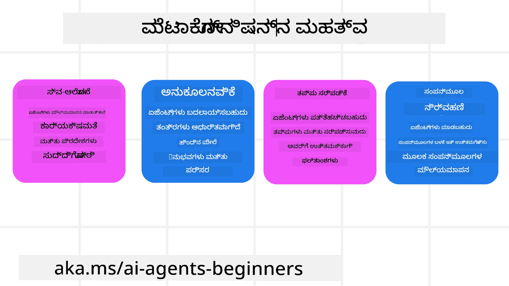
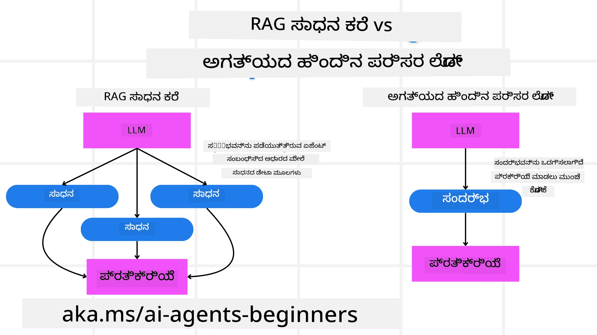

[](https://youtu.be/His9R6gw6Ec?si=3_RMb8VprNvdLRhX)

> _(ಈ ಪಾಠದ ವೀಡಿಯೋವನ್ನು ವೀಕ್ಷಿಸಲು ಮೇಲಿನ ಚಿತ್ರವನ್ನು ಕ್ಲಿಕ್ ಮಾಡಿ)_
# AI ಏಜಂಟುಗಳಲ್ಲಿ ಮೆಟಾಕಾಗ್ನಿಶನ್

## ಪರಿಚಯ

AI ಏಜಂಟುಗಳಲ್ಲಿ ಮೆಟಾಕಾಗ್ನಿಶನ್ ಬಗ್ಗೆ ಪಾಠಕ್ಕೆ ಸ್ವಾಗತ! AI ಏಜಂಟುಗಳು ತಮ್ಮ ಸ್ವಂತ ಚಿಂತನೆ ಪ್ರಕ್ರಿಯೆಗಳನ್ನು ಹೇಗೆ ಆಲೋಚಿಸುತ್ತವೆ ಎಂಬುದರ ಬಗ್ಗೆ ಆಸಕ್ತಿ ಹೊಂದಿರುವ ಆರಂಭಿಕರಿಗಾಗಿ ಈ ಅಧ್ಯಾಯ ವಿನ್ಯಾಸಗೊಳಿಸಲಾಗಿದೆ. ಈ ಪಾಠದ ಅಂತ್ಯದಲ್ಲಿ, ನೀವು ಪ್ರಮುಖ ಕಲ್ಪನೆಗಳನ್ನು ಅರ್ಥಮಾಡಿಕೊಂಡಿರುತ್ತೀರಿ ಮತ್ತು AI ಏಜಂಟ್ ವಿನ್ಯಾಸದಲ್ಲಿ ಮೆಟಾಕಾಗ್ನಿಶನ್ನನ್ನು ಅನ್ವಯಿಸಲು ಪ್ರಾಯೋಗಿಕ ಉದಾಹರಣೆಗಳೊಂದಿಗೆ ಸಜ್ಜಾಗಿರುತ್ತೀರಿ.

## ಕಲಿಕಾ ಗುರಿಗಳು

ಈ ಪಾಠವನ್ನು ಮುಗಿಸಿದ ನಂತರ, ನೀವು ಈ ಕೆಳಗಿನವುಗಳನ್ನು ಸಾಧ್ಯತೆ ಮಾಡಬಹುದು:

1. ಏಜಂಟ್ ವ್ಯಾಖ್ಯಾನಗಳಲ್ಲಿ ತರ್ಕ ಲೂಪ್ಗಳ ಪರಿಣಾಮಗಳನ್ನು ಅರ್ಥಮಾಡಿಕೊಳ್ಳಿ.
2. ಸ್ವಯಂ-ನಿರ್ವಹಣಾ ಏಜಂಟ್‌ಗಳಿಗೆ ಸಹಾಯ ಮಾಡಲು ಯೋಜನೆ ಮತ್ತು ಮೌಲ್ಯಮಾಪನ ತಂತ್ರಗಳನ್ನು ಬಳಸಿ.
3. ಕಾರ್ಯಗಳನ್ನು ಸಾಧಿಸಲು ಕೋಡ್ ತಿದ್ದುಪಡಿ ಮಾಡಲು ಶಕ್ತಿಯುಳ್ಳ ನಿಮ್ಮ ಸ್ವಂತ ಏಜಂಟುಗಳನ್ನು ರಚಿಸಿ.

## ಮೆಟಾಕಾಗ್ನಿಶನ್‌ಗೆ ಪರಿಚಯ

ಮೆಟಾಕಾಗ್ನಿಶನ್ ಅಂದರೆ ಒಂದು ವ್ಯಕ್ತಿಯ ಸ್ವಂತ ಚಿಂತನೆಯ ಬಗ್ಗೆ ಆಲೋಚಿಸುವ ಮೇಲ್ಗಡೆಯ ಜ್ಞಾನಾತ್ಮಕ ಪ್ರಕ್ರಿಯೆಗಳು. AI ಏಜಂಟುಗಳಿಗಾಗಿ, ಇದರಿಂದಾಗಿ ಸ್ವಂತ ಜಾಗೃತಿ ಮತ್ತು ಹಿಂದಿನ ಅನುಭವಗಳ ಆಧಾರದ ಮೇಲೆ ತನ್ನ ಕ್ರಿಯೆಗಳನ್ನು ಮೌಲ್ಯಮಾಪನ ಮಾಡಿ ಸರಿಹೊಂದಿಸುವ ಸಾಮರ್ಥ್ಯವಿರುತ್ತದೆ. “ಚಿಂತನೆ ಬಗ್ಗೆ ಚಿಂತನೆ” ಎಂಬುದು ಏಜಂಟಿಕ್ AI ವ್ಯವಸ್ಥೆಗಳ ಅಭಿವೃದ್ಧಿಯಲ್ಲಿ ಪ್ರಮುಖ ಕಲ್ಪನೆ. ಇದು AI ವ್ಯವಸ್ಥೆಗಳು ತಮ್ಮ ಸ್ವಂತ ಆಂತರಿಕ ಪ್ರಕ್ರಿಯೆಗಳ ಬಗ್ಗೆ ಜಾಗೃತ ಇರಬೇಕು ಮತ್ತು ತಮ್ಮ ವರ್ತನೆಯನ್ನು ಗಮನಿಸಿ, ನಿಯಂತ್ರಿಸಿ, ಹೊಂದಿಕೊಳ್ಳುವಂತೆ ಮಾಡಲು ಸಾಧ್ಯವಾಗುವುದು. ನಾವು ಯಂತ್ರವ ಸ್ನೇಹಿತರಿಗೆ ಅಥವಾ ಸಮಸ್ಯೆಯನ್ನು ನೋಡುತ್ತಿರುವಾಗ ಮಾಡುವಂತೆ. ಈ ಸ್ವ-ಜಾಗೃತಿ AI ವ್ಯವಸ್ಥೆಗಳ ಉತ್ತಮ ನಿರ್ಧಾರಗಳನ್ನು ಕೈಗೊಳ್ಳಲು, ದೋಷಗಳನ್ನು ಗುರುತಿಸಲು ಮತ್ತು ಸಮಯದೊಂದಿಗೆ ಅವರ ಕಾರ್ಯಕ್ಷಮತೆಯನ್ನು ಸುಧಾರಿಸಲು ಸಹಾಯ ಮಾಡಬಹುದು - ಮತ್ತೆ ಟೂರಿಂಗ್ ಪರೀಕ್ಷಣೆಗೆ ಮತ್ತು AI ತೆಗೆದುಕೊಳ್ಳುವ ಬಗ್ಗೆ ಚರ್ಚೆಗೆ ಸಂಪರ್ಕ.

ಏಜಂಟಿಕ್ AI ವ್ಯವಸ್ಥೆಗಳ ಸಂದ್ರಭದಲ್ಲಿ, ಮೆಟಾಕಾಗ್ನಿಶನ್ ಅನೇಕ ಸವಾಲುಗಳನ್ನು ಪರಿಹರಿಸಲು ಸಹಾಯ ಮಾಡಬಹುದು, ಉದಾಹರಣೆಗೆ:
- ಪಾರದರ್ಶಕತೆ: AI ವ್ಯವಸ್ಥೆಗಳು ತಮ್ಮ ತರ್ಕ ಮತ್ತು ನಿರ್ಧಾರಗಳನ್ನು ವಿವರಿಸಲು ಸಾಧ್ಯವಾಗುವಂತೆ ಮಾಡುವುದು.
- ತರ್ಕ: AI ವ್ಯವಸ್ಥೆಗಳ ಮಾಹಿತಿಯನ್ನು ಸಂಶ್ಲೇಷಿಸಿ ಶ್ರೇಷ್ಟ ನಿರ್ಧಾರಗಳನ್ನು ಕೈಗೊಳ್ಳುವ ಸಾಮರ್ಥ್ಯವನ್ನು ವೃದ್ಧಿಸುವುದು.
- ಹೊಂದಿಕೆ: AI ವ್ಯವಸ್ಥೆಗಳು ಹೊಸ ಪರಿಸರಗಳು ಮತ್ತು ಬದಲಾಗುತ್ತಿರುವ ಪರಿಸ್ಥಿತಿಗಳಿಗೆ ಹೊಂದಿಕೊಳ್ಳಲು ಅನುಮತಿಸಿಕೊಳಕು.
- ಗ್ರಹಿಕೆ: ಪರಿಸರದಿಂದದತ್ತ ಮಾಹಿತಿಗಳನ್ನು ಗುರುತಿಸಿ ಅನುವಾದಿಸುವ AI ವ್ಯವಸ್ಥೆಗಳ ನಿಖರತೆಯನ್ನು ಹೆಚ್ಚಿಸುವುದು.

### ಮೆಟಾಕಾಗ್ನಿಶನ್ ಎಂದರೇನು?

ಮೆಟಾಕಾಗ್ನಿಶನ್ ಅಥವಾ "ಚಿಂತನೆ ಬಗ್ಗೆ ಚಿಂತನೆ" ಅಂದರೆ ಸ್ವಂತ ಜಾಗೃತಿ ಮತ್ತು ತನ್ನ ಜ್ಞಾನಾತ್ಮಕ ಪ್ರಕ್ರಿಯೆಗಳ ಸ್ವಯಂ ನಿಯಂತ್ರಣವನ್ನು ಒಳಗೊಂಡ ಮೇಲ್ಗಡೆಯ ಜ್ಞಾನಾತ್ಮಕ ಪ್ರಕ್ರಿಯೆ. AI ಕ್ಷೇತ್ರದಲ್ಲಿ, ಮೆಟಾಕಾಗ್ನಿಶನ್ ಏಜಂಟುಗಳನ್ನು ತಮ್ಮ ತಂತ್ರಗಳು ಮತ್ತು ಕ್ರಿಯೆಗಳನ್ನು ಮೌಲ್ಯಮಾಪನ ಮಾಡಿ ಹೊಂದಿಕೊಳ್ಳುವ ಸಾಮರ್ಥ್ಯವನ್ನು ನೀಡುತ್ತದೆ, ಇದರಿಂದ ಸಮಸ್ಯೆ ಪರಿಹಾರ ಮತ್ತು ನಿರ್ಧಾರ ಕೈಗಾರಿಕೆ ಸಾಮರ್ಥ್ಯಗಳು ಉತ್ತಮಗೊಳ್ಳುತ್ತವೆ. ಮೆಟಾಕಾಗ್ನಿಶನ್‌ನ್ನು ಅರ್ಥಮಾಡಿಕೊಂಡರೆ, ನೀವು ಉತ್ತಮ ಬುದ್ಧಿವಂತಿಕೆ ಮತ್ತು ಹೆಚ್ಚು ಹೊಂದಿಕೊಳ್ಳುವ ಮತ್ತು ಪರಿಣಾಮಕಾರಿ AI ಏಜಂಟುಗಳನ್ನು ವಿನ್ಯಾಸ ಮಾಡಬಹುದು. ನಿಜವಾದ ಮೆಟಾಕಾಗ್ನಿಶನ్లో ನೀವು AI ತನ್ನ ಸ್ವಂತ ತರ್ಕದ ಬಗ್ಗೆ ಸ್ಪಷ್ಟವಾಗಿ ಚಿಂತಿಸುತ್ತಿರುವುದನ್ನು ಕಾಣುತ್ತೀರಿ.

ಉದಾಹರಣೆ: “ಬೆಲೆ ಕಡಿಮೆ ಎತ್ತರದ ವಿಮಾನಗಳನ್ನು ಪ್ರಾಥಮಿಕತೆ ನೀಡಿದ್ದೆನು ಏಕೆಂದರೆ... ನೇರ ವಿಮಾನಗಳನ್ನು ತಪ್ಪಿಸುವ ಸಾಧ್ಯತೆ ಇದೆ, ಆದ್ದರಿಂದ ಮತ್ತೊಮ್ಮೆ ಪರಿಶೀಲಿಸುತ್ತೇನೆ.”  
ಒಂದು ನಿರ್ದಿಷ್ಟ ಮಾರ್ಗವನ್ನು ಆಯ್ಕೆಮಾಡಿದ ಬಗ್ಗೆ ಗಮನವಿಟ್ಟು ಇರುವುದು.  
- ಹಳೆಯ ಬಳಕೆದಾರ ಇಚ್ಛೆಗಳು ಮೇಲೆ ಹೆಚ್ಚು ಅವಲಂಬಿಸಿದ್ದು ತಪ್ಪು ಮಾಡಿದೆ ಎಂದು ಗಮನಿಸಿ, ಆದ್ದರಿಂದ ಅಂತಿಮ ಶಿಫಾರಸಿನ ಬದಲಾಗಿ ನಿರ್ಧಾರ ತಂತ್ರವನ್ನು ಬದಲಾಯಿಸುತ್ತದೆ.  
- “ಬಳಕೆದಾರನು ‘ತೀವ್ರ ಜನಸಂಕುಲನ’ ಅನ್ನು ಉಲ್ಲೇಖಿಸಿದಾಗ, ಕೋಣಿತಕ್ಕಿಂತ ಹೆಚ್ಚು ಜನಪ್ರಿಯ ಆಕರ್ಷಣೆಗಳನ್ನೇ ನಿಷೇಧಿಸುವುದಲ್ಲದೆ, ಪ್ರತಿಯೊಮ್ಮೆ ಜನಪ್ರಿಯತೆ ಆಧಾರದಲ್ಲಿ ‘ಟಾಪ್ ಆಕರ್ಷಣೆ’ ಆಯ್ಕೆ ಮಾಡುವ ವಿಧಾನ ದೋಷಪೂರಿತವಾಗಿದೆ” ಎಂಬ ಮಾದರಿಗಳನ್ನು ವಿಶ್ಲೇಷಿಸುತ್ತದೆ.

### AI ಏಜಂಟುಗಳಲ್ಲಿ ಮೆಟಾಕಾಗ್ನಿಶನ್ ಮಹತ್ವ

ಮೆಟಾಕಾಗ್ನಿಶನ್ AI ಏಜಂಟ್ ವಿನ್ಯಾಸದಲ್ಲಿ ಕೆಲವು ಪ್ರಮುಖ ಕಾರಣಗಳಿಗೆ ಮಹತ್ವಪೂರ್ಣ ಪಾತ್ರ ವಹಿಸುತ್ತದೆ:



- ಸ್ವ-ಪರಿಶೀಲನೆ: ಏಜಂಟುಗಳು ತಮ್ಮ ಸ್ವಂತ ಕಾರ್ಯಕ್ಷಮತೆಯನ್ನು ವಿಮರ್ಶಿಸಿ ಸುදුಧೆಗೆ ಆಸಕ್ತ ಪ್ರದೇಶಗಳನ್ನು ಗುರುತಿಸಬಹುದು.  
- ಹೊಂದಿಕೊಳ್ಳುವಿಕೆಯನ್ನು: ಹಿಂದಿನ ಅನುಭವಗಳು ಮತ್ತು ಬದಲಿರುವ ಪರಿಸರಗಳಿಗೆ ಅನುಗುಣವಾಗಿ ತಂತ್ರಗಳನ್ನು ತಿದ್ದುಪಡಿ ಮಾಡಬಹುದು.  
- ದೋಷ ಸರಿಪಡಿಸುವಿಕೆ: ದೋಷಗಳನ್ನು ತಾನಾಗಿಯೇ ಗುರುತಿಸಲೂ ಸರಿಪಡಿಸಬಹುದು, ಇದರಿಂದ ನಿಖರ ಫಲಿತಾಂಶಗಳಾಗುತ್ತವೆ.  
- ಸಂಪನ್ಮೂಲ ನಿರ್ವಹಣೆ: ಸಮಯ ಮತ್ತು ಗಣನೆ ಶಕ್ತಿಮಾಡುವಿಕೆ ಸೇರಿದಂತೆ ಸಂಪನ್ಮೂಲಗಳನ್ನು ಯೋಜನೆ ಮತ್ತು ಮೌಲ್ಯಮಾಪನ ಮೂಲಕ ಉತ್ತಮಗೊಳಿಸಬಹುದು.

## AI ಏಜಂಟ್ ಘಟಕಗಳು

ಮೆಟಾಕಾಗ್ನಿಟಿವ್ ಪ್ರಕ್ರಿಯೆಯಲ್ಲಿಗೆ ಮುನ್ನಡೆಸುವ ಮುನ್ನ, AI ಏಜಂಟ್ ಮೂಲ ಘಟಕಗಳನ್ನು ಅರ್ಥಮಾಡಿಕೊಳ್ಳುವುದು ಅಗತ್ಯ. ಸಾಮಾನ್ಯವಾಗಿ AI ಏಜಂಟ್ ಇವುಗಳನ್ನು ಒಳಗೊಂಡಿರುತ್ತದೆ:

- ಪರ್ಸೋನಾ: ಏಜಂಟ್ ವ್ಯಕ್ತಿತ್ವ ಮತ್ತು ಲಕ್ಷಣಗಳು, ಬಳಕೆದಾರರೊಂದಿಗೆ ಅದರ ಸಂವಹನವನ್ನು ವಿವರಿಸುತ್ತದೆ.  
- ಉಪಕರಣಗಳು: ಏಜಂಟ್ ನಡೆಸಬಲಿರುವ ಸಾಮರ್ಥ್ಯಗಳು ಮತ್ತು ಕಾರ್ಯಗಳು.  
- ಕೌಶಲ್ಯಗಳು: ಏಜಂಟ್ ಹೊಂದಿರುವ ಜ್ಞಾನ ಮತ್ತು ತಜ್ಞತೆಗಳು.

ಈ ಘಟಕಗಳು ನಿರ್ದಿಷ್ಟ ಕಾರ್ಯಗಳನ್ನು ನಿರ್ವಹಿಸಲು "ತಜ್ಞತಾ ಘಟಕ" ರಚಿಸಲು ಜೊತೆಗೂಡಿ ಕಾರ್ಯನಿರ್ವಹಿಸುತ್ತವೆ.

**ಉದಾಹರಣೆ**:  
ಒಂದು ಪ್ರವಾಸಿ ಏಜಂಟ್ ಯಾರು ನಿಮ್ಮ ರಜೆ ಯೋಜಿಸುತ್ತಾನೆ ಮತ್ತು πραγμα-ಕಾಲದ ಡೇಟಾ ಮತ್ತು ಹಳೆಯ ಗ್ರಾಹಕರ ಪ್ರಯಾಣ ಅನುಭವಗಳ ಆಧಾರದ ಮೇಲೆ ಮಾರ್ಗವನ್ನು ತಿದ್ದುಪಡಿ ಮಾಡುತ್ತಾನೆ.

### ಉದಾಹರಣೆ: ಪ್ರವಾಸಿ ಏಜಂಟ್ ಸೇವೆಯಲ್ಲಿ ಮೆಟಾಕಾಗ್ನಿಶನ್

ನೀವು AI ಚಾಲಿತ ಪ್ರವಾಸಿ ಏಜಂಟ್ ಸೇವೆಯನ್ನು ವಿನ್ಯಾಸ ಮಾಡುತ್ತಿರುವುದು ಕಲ್ಪಿಸಿಕೊಳ್ಳಿ. ಈ ಏಜಂಟ್, "ಪ್ರವಾಸಿ ಏಜಂಟ್," ಬಳಕೆದಾರರಿಗೆ ಅವರ ರಜೆ ಯೋಜನೆಯಲ್ಲಿ ಸಹಾಯ ಮಾಡುತ್ತದೆ. ಮೆಟಾಕಾಗ್ನಿಶನ್ ಸೇರಿಸಲು, ಪ್ರವಾಸಿ ಏಜಂಟ್ ತನ್ನ ಕ್ರಿಯೆಗಳನ್ನೇ ಸ್ವ-ಜಾಗೃತಿ ಮತ್ತು ಹಳೆಯ ಅನುಭವಗಳ ಆಧಾರದಲ್ಲಿ ಮೌಲ್ಯಮಾಪನ ಮಾಡಿ ಸರಿಹೊಂದಿಸಬೇಕು. ಮೆಟಾಕಾಗ್ನಿಶನ್ ಇಲ್ಲಿ ಹೇಗೆ ಪಾತ್ರ ವಹಿಸಬಹುದು:

#### ಪ್ರಸ್ತುತ ಕಾರ್ಯ

ಪ್ರಸ್ತುತ ಕಾರ್ಯ ಬಳಕೆದಾರನಿಗೆ ಪ್ಯಾರಿಸ್ ಗೆ ಭಟ್ಣಿಸಲು ಸಹಾಯ ಮಾಡುವುದು.

#### ಕಾರ್ಯವನ್ನು ಪೂರ್ಣಗೊಳಿಸುವ ಹಂತಗಳು

1. **ಬಳಕೆದಾರ ಇಚ್ಛೆಗಳ ಸಂಗ್ರಹಣೆ**: ಬಳಕೆದಾರನ ಪ್ರಯಾಣ ದಿನಾಂಕಗಳು, ಬಜೆಟ್, ಆಸಕ್ತಿಗಳು (ಉದಾ: ಮ್ಯೂಸಿಯಂಗಳು, ಆಹಾರ, ಶಾಪಿಂಗ್) ಮತ್ತು ಯಾವುದೇ ವಿಶೇಷ ಅಗತ್ಯಗಳನ್ನು ಕೇಳಿ.  
2. **ಮಾಹಿತಿಯನ್ನು ಸಂಗ್ರಹಿಸುವುದು**: ಬಳಕೆದಾರನ ಇಚ್ಛೆಗಳಿಗೆ ತಕ್ಕ ವಿಮಾನ ಮಾರ್ಗಗಳು, ವಾಸಸ್ಥಳಗಳು, ಆಕರ್ಷಣೆಗಳು ಮತ್ತು ಭೋಜನಸ್ಥಳಗಳನ್ನು ಹುಡುಕಿ.  
3. **ಶಿಫಾರಸುಗಳನ್ನು ತಯಾರಿಸುವುದು**: ವಿಮಾನ ವಿವರಗಳು, ಹೋಟೆಲ್ ಹಬ್ಬುಕಟ್ಟುಗಳು ಮತ್ತು ಸೂಚಿಸಿದ ಚಟುವಟಿಕೆಗಳೊಂದಿಗೆ ವೈಯಕ್ತಿಕ ಪಥವು ಸೃಷ್ಟಿಸಿ.  
4. **ಪ್ರತಿಕ್ರಿಯೆಯ ಆಧಾರದ ಮೇಲೆ ಸರಿಹೊಂದಿಸಲು**: ಶಿಫಾರಸುಗಳ ಕುರಿತಾಗಿ ಬಳಕೆದಾರನ ಪ್ರತಿಕ್ರಿಯೆಯನ್ನು ಕೇಳಿ ಬೇಕಾದ ಬದಲಾವಣೆಗಳನ್ನು ಮಾಡಿ.

#### ಅಗತ್ಯ ಸಂಪನ್ಮೂಲಗಳು

- ವಿಮಾನ ಮತ್ತು ಹೋಟೆಲ್ ಬುಕಿಂಗ್ ಡೇಟಾಬೇಸ್‌ಗಳಿಗೆ ಪ್ರವೇಶ.  
- ಪ್ಯಾರಿಸ್ ಆಕರ್ಷಣೆಗಳ ಮತ್ತು ರೆಸ್ಟೋರೆಂಟ್‌ಗಳ ಕುರಿತು ಮಾಹಿತಿ.  
- ಹಿಂದಿನ ಸಂವಹನಗಳಿಂದ ಬಳಕೆದಾರ ಪ್ರತಿಕ್ರಿಯಾ ಡೇಟಾ.

#### ಅನುಭವ ಮತ್ತು ಸ್ವ-ಪರಿಶೀಲನೆ

ಪ್ರವಾಸಿ ಏಜಂಟ್ ತನ್ನ ಪ್ರದರ್ಶನವನ್ನು ಮೌಲ್ಯಮಾಪನ ಮಾಡಲು ಮತ್ತು ಹಿಂದಿನ ಅನುಭವಗಳಿಂದ ಕಲಿಯಲು ಮೆಟಾಕಾಗ್ನಿಶನ್ ಬಳಸುತ್ತದೆ. ಉದಾಹರಣೆಗೆ:

1. **ಬಳಕೆದಾರ ಪ್ರತಿಕ್ರಿಯೆಯ ವಿಶ್ಲೇಷಣೆ**: ಪ್ರವಾಸಿ ಏಜಂಟ್ ಬಳಕೆದಾರನ ಪ್ರತಿಕ್ರಿಯೆಯನ್ನು ಪರಿಶೀಲಿಸಿ ಯಾವ ಶಿಫಾರಸುಗಳು ಒಳ್ಳೆಯಗೆ ಸ್ವೀಕರಿಸಲ್ಪಟ್ಟವು ಮತ್ತು ಯಾವವು ಅಲ್ಲ ಎಂಬುದನ್ನು ಗುರುತಿಸುತ್ತದೆ. ಬದಲಾವಣೆಗಳನ್ನು ಅನ್ವಯಿಸುತ್ತದೆ.  
2. **ಹೊಂದಿಕೆ:** ಬಳಕೆದಾರನು ಮುಂಚೆ ಜನಸಂಪುಟದಿಂದ ಅಸಹ್ಯ ವಹಿಸಿದ್ದರೆ, ಪ್ರವಾಸಿ ಏಜಂಟ್ ಭವಿಷ್ಯದಲ್ಲಿ ಜನಪ್ರಿಯ ಪ್ರವಾಸಿ ಸ್ಥಳಗಳನ್ನು ಪೀಕ್ ಸಮಯದಲ್ಲಿ ಶಿಫಾರಸು ಮಾಡೋದನ್ನು ತಪ್ಪಿಸುತ್ತದೆ.  
3. **ದೋಷ ಸರಿಪಡಿಸುವಿಕೆ**: ಹಳೇ ಬುಕ್ಕಿಂಗ್ನಲ್ಲಿ ಹೋಟೆಲ್ ಸಂಪೂರ್ಣ ಬುಕಿಂಗ್ ಆಗಿದ್ದ ಪರಿಣಾಮ ದೋಷವಾಯಿತು ಎಂದಾದರೆ, ಶಿಫಾರಸು ಮಾಡಲು ಹಿಂದಿನ ಸೇವೆಗಳ ಪರಿಶೀಲನೆಯನ್ನು ಕಠಿಣಗೊಳಿಸುವುದು.

#### ಪ್ರಾಯೋಗಿಕ ಡೆವಲಪರ್ ಉದಾಹರಣೆ

ಮೆಟಾಕಾಗ್ನಿಶನ್ ನ್ನು ಸೇರಿಸುವಾಗ ಪ್ರವಾಸಿ ಏಜಂಟ್ ಕೋಡ್ ಸರಳ ಉದಾಹರಣೆ:

```python
class Travel_Agent:
    def __init__(self):
        self.user_preferences = {}
        self.experience_data = []

    def gather_preferences(self, preferences):
        self.user_preferences = preferences

    def retrieve_information(self):
        # ಇಚ್ಛೆಗಳ ಆಧಾರದ ಮೇಲೆ ವಿಮಾನಗಳ, ಹೋಟೆಲ್‌ಗಳ ಮತ್ತು ಆಕರ್ಷಣೆಗಳ ಹುಡುಕಿಕೊಳ್ಳಿ
        flights = search_flights(self.user_preferences)
        hotels = search_hotels(self.user_preferences)
        attractions = search_attractions(self.user_preferences)
        return flights, hotels, attractions

    def generate_recommendations(self):
        flights, hotels, attractions = self.retrieve_information()
        itinerary = create_itinerary(flights, hotels, attractions)
        return itinerary

    def adjust_based_on_feedback(self, feedback):
        self.experience_data.append(feedback)
        # ಪ್ರತಿಕ್ರಿಯೆಯನ್ನು ವಿಶ್ಲೇಷಿಸಿ ಮತ್ತು ಭವಿಷ್ಯದ ಶಿಫಾರಸುಗಳನ್ನು ಸರಿಹೊಂದಿಸಿ
        self.user_preferences = adjust_preferences(self.user_preferences, feedback)

# ಉದಾಹರಣೆಯ ಬಳಕೆ
travel_agent = Travel_Agent()
preferences = {
    "destination": "Paris",
    "dates": "2025-04-01 to 2025-04-10",
    "budget": "moderate",
    "interests": ["museums", "cuisine"]
}
travel_agent.gather_preferences(preferences)
itinerary = travel_agent.generate_recommendations()
print("Suggested Itinerary:", itinerary)
feedback = {"liked": ["Louvre Museum"], "disliked": ["Eiffel Tower (too crowded)"]}
travel_agent.adjust_based_on_feedback(feedback)
```


#### ಮೆಟಾಕಾಗ್ನಿಶನ್ ಮಹತ್ವ

- **ಸ್ವ-ಪರಿಶೀಲನೆ**: ಏಜಂಟ್‌ಗಳು ತಮ್ಮ ಕಾರ್ಯಕ್ಷಮತೆಯನ್ನು ವಿಶ್ಲೇಷಿಸಿ ಸುಧಾರಣೆ ಬರೆಯುವ ಸ್ಥಳಗಳನ್ನು ಗುರುತಿಸಬಹುದು.  
- **ಹೊಂದಿಕೆ**: ಪ್ರತಿಕ್ರಿಯೆ ಮತ್ತು ಬದಲುವ ದಶೆಗಳ ಆಧಾರದ ಮೇಲೆ ತಂತ್ರಗಳನ್ನು ತಿದ್ದುಪಡಿ ಮಾಡಬಹುದು.  
- **ದೋಷ ಸರಿಪಡಿಸುವಿಕೆ**: ಏಜಂಟ್‌ಗಳು ಸ್ವಯಂಚಾಲಿತವಾಗಿ ದೋಷಗಳನ್ನು ಗುರುತು ಮಾಡಿ ಸರಿಪಡಿಸಬಹುದು.  
- **ಸಂಪನ್ಮೂಲ ನಿರ್ವಹಣೆ**: ಸಮಯ ಮತ್ತು ಗಣಿತ ಶಕ್ತಿಯಂತಹ ಸಂಪನ್ಮೂಲಗಳ ಬಳಕೆಯನ್ನು ಪರಿಣಾಮಕಾರಿಯಾಗಿ ಮಾಡಲು ಸಾಧ್ಯ.

ಮೆಟಾಕಾಗ್ನಿಶನ್ ಸೇರಿಸುವ ಮೂಲಕ, ಪ್ರವಾಸಿ ಏಜಂಟು ಹೆಚ್ಚು ವೈಯಕ್ತಿಕಕರಿಸಿದ ಮತ್ತು ನಿಖರವಾದ ಪ್ರವಾಸ ಶಿಫಾರಸುಗಳನ್ನು ಒದಗಿಸುವುದಕ್ಕೆ ಸಾಧ್ಯ, ಸಹಜವಾಗಿ ಬಳಕೆದಾರ ಅನುಭವವನ್ನು ಸುಧಾರಿಸುತ್ತದೆ.

---

## 2. ಏಜಂಟ್‌ಗಳಲ್ಲಿ ಯೋಜನೆ

ಯೋಜನೆ AI ಏಜಂಟ್ ವರ್ತನೆಯಲ್ಲಿ ಮಹತ್ವದ घटಕವಾಗಿದೆ. ಇದು ಗುರಿಯನ್ನು ಸಾಧಿಸಲು ಅಗತ್ಯ ಹಂತಗಳನ್ನು ನಿರೂಪಿಸುತ್ತದೆ, ಪ್ರಸ್ತುತ ಸ್ಥಿತಿ, ಸಂಪನ್ಮೂಲಗಳು ಮತ್ತು ಸಾಧ್ಯ ಅಡಚಣೆಗಳನ್ನು ಪರಿಗಣಿಸಿ.

### ಯೋಜನೆಯ ಅಂಶಗಳು

- **ಪ್ರಸ್ತುತ ಕಾರ್ಯ**: ಕಾರ್ಯವನ್ನು ಸ್ಪಷ್ಟವಾಗಿ ನಿರ್ಧರಿಸುವುದು.  
- **ಕಾರ್ಯ ಪೂರ್ಣಗೊಳಿಸುವ ಹಂತಗಳು**: ಕಾರ್ಯವನ್ನು ನಿರ್ವಹಣೀಯ ಹಂತಗಳಾಗಿ ವಿಭಜಿಸುವುದು.  
- **ಅಗತ್ಯ ಸಂಪನ್ಮೂಲಗಳು**: ಅವಗಾಹನೆಯ ಸಂಪನ್ಮೂಲಗಳನ್ನು ಗುರುತಿಸುವುದು.  
- **ಅನುಭವ**: ಹಳೆಯ ಅನುಭವಗಳನ್ನು ಯೋಜನೆಗೆ ಉಪಯೋಗಿಸುವುದು.

**ಉದಾಹರಣೆ**:  
ಪ್ರವಾಸಿ ಏಜಂಟ್ ಬಳಕೆದಾರರ ಪ್ರವಾಸ ಯೋಜನೆಗೆ ಸಹಾಯ ಮಾಡಲು ತೆಗೆದುಕೊಂಡ ಹಂತಗಳು:

### ಪ್ರವಾಸಿ ಏಜಂಟ್ ಹಂತಗಳು

1. **ಬಳಕೆದಾರ ಇಚ್ಛೆಗಳ ಸಂಗ್ರಹಣೆ**  
   - ಪ್ರಯಾಣ ದಿನಾಂಕಗಳು, ಬಜೆಟ್, ಆಸಕ್ತಿಗಳು ಮತ್ತು ಯಾವುದೇ ವಿಶೇಷ ಅಗತ್ಯಗಳ ಬಗ್ಗೆ ಬಳಕೆದಾರರಿಂದ ವಿವರಗಳನ್ನು ಕೇಳಿ.  
   - ಉದಾ: "ನೀವು ಯಾವಾಗ ಪ್ರಯಾಣ ಮಾಡುತ್ತೀರಿ?" "ನಿಮ್ಮ ಬಜೆಟ್ ಶ್ರೇಣಿ ಏನು?" "ನೀವು ರಜೆ ಕ್ಯಾಲು ಮಾಡಿದಾಗ ಯಾವ ಚಟುವಟಿಕೆಗಳನ್ನು ಇಷ್ಟಪಡುತ್ತೀರಿ?"

2. **ಮಾಹಿತಿಯನ್ನು ಸಂಗ್ರಹಿಸುವುದು**  
   - ಬಳಕೆದಾರ ಇಚ್ಛೆಗಳ ಆಧಾರದ ಮೇಲೆ ಸಂಬಂಧಿಸಿದ ಪ್ರಯಾಣ ಆಯ್ಕೆಯನ್ನು ಹುಡುಕಿ.  
   - **ವಿಮಾನಗಳು**: ಬಳಕೆದಾರನ ಬಜೆಟ್ ಮತ್ತು ಇಷ್ಟದ ಪ್ರಯಾಣ ದಿನಾಂಕಗಳ ಒಳಗೆ ಲಭ್ಯವಿರುವ ವಿಮಾನಗಳನ್ನು ಕಂಡುಹಿಡಿಯಿರಿ.  
   - **ವಾಸಸ್ಥಳಗಳು**: ಸ್ಥಳ, ಬೆಲೆ ಮತ್ತು ಸೌಕರ್ಯಗಳಿಗೆ ಅನುಗುಣವಾಗಿ ಹೋಟೆಲ್ ಅಥವಾ ಬಾಡಿಗೆ ಪ್ರದೇಶಗಳನ್ನು ಹುಡುಕಿ.  
   - **ಆಕರ್ಷಣೆಗಳು ಮತ್ತು ರೆಸ್ಟೋರೆಂಟ್‌ಗಳು**: ಬಳಕೆದಾರ ಆಸಕ್ತಿಗೆ ಹೊಂದಿಕೊಂಡ ಜನಪ್ರಿಯ ಆಕರ್ಷಣೆಗಳು ಮತ್ತು ಆಹಾರ ಆಯ್ಕೆಯನ್ನು ಗುರುತಿಸಿ.

3. **ಶಿಫಾರಸುಗಳನ್ನು ತಯಾರಿಸುವುದು**  
   - ಸಂಗ್ರಹಿಸಿದ ಮಾಹಿತಿಯನ್ನು ವೈಯಕ್ತಿಕ ವೈಯರ್ತಿತಿನ ಯೋಜನೆಯಾಗಿ ಸಂಗ್ರಹಿಸಿ.  
   - ಪ್ರಯಾಣ ವಿವರಗಳು, ಹೋಟೆಲ್ ಬುಕ್ಕಿಂಗ್ ಮತ್ತು ಸೂಚಿಸಿದ ಚಟುವಟಿಕೆಗಳ ಜೊತೆಗೆ ಶಿಫಾರಸುಗಳನ್ನು ಬಳಕೆದಾರನ ಇಚ್ಛೆಗಳಂತೆ ಹೊಂದಿಸಿ.

4. **ಬಳಕೆದಾರರಿಗೆ ಯೋಜನೆಯನ್ನು ಪ್ರಸ್ತುತಪಡಿಸುವುದು**  
   - ಬಳಕೆದಾರರಿಂದ ವಿಮರ್ಶನಕ್ಕಾಗಿ ಪ್ರಸ್ತುತ ಪಥವನ್ನು ಹಂಚಿಕೊಳ್ಳಿ.  
   - ಉದಾ: "ನಿಮ್ಮ ಪ್ಯಾರಿಸ್ ಪ್ರಯಾಣಕ್ಕಾಗಿ ಶಿಫಾರಸು ಮಾಡಲಾದ ಯೋಜನೆ ಇದಾಗಿದೆ. ಇದರಲ್ಲಿ ವಿಮಾನ ವಿವರಗಳು, ಹೋಟೆಲ್ ಬುಕ್ಕಿಂಗ್‌ಗಳು ಮತ್ತು ಶಿಫಾರಸು ಮಾಡಿದ ಚಟುವಟಿಕೆಗಳು ಸೇರಿವೆ. ನಿಮ್ಮ ಅಭಿಪ್ರಾಯವೇನು?"

5. **ಪ್ರತಿಕ್ರಿಯೆ ಸಂಗ್ರಹಣೆ**  
   - ಪ್ರಸ್ತಾಪಿತ ಯೋಜನೆಯ ಬಗ್ಗೆ ಬಳಕೆದಾರರಿಂದ ಪ್ರತಿಕ್ರಿಯೆಯನ್ನು ಕೇಳಿ.  
   - ಉದಾ: "ನೀವು ವಿಮಾನ ಆಯ್ಕೆಗಳನ್ನು ಇಷ್ಟಪಡುವಿರಾ?" "ಹೋಟೆಲ್ ನಿಮ್ಮ ಅಗತ್ಯಗಳಿಗೆ ಸರಿಹೋಗುತ್ತದೆಯೆ?" "ನೀವು ಸೇರಿಸಬೇಕೆಂದು ಅಥವಾ ತೆಗೆದುಹಾಕಬೇಕೆಂದು ಬಯಸುವ ಚಟುವಟಿಕೆಗಳೇನಾ?"

6. **ಪ್ರತಿಕ್ರಿಯೆಯ ಆಧಾರದ ಮೇಲೆ ಸರಿಹೊಂದಿಸುವುದು**  
   - ಬಳಕೆದಾರನ ಪ್ರತಿಕ್ರಿಯೆಯ ಪ್ರಕಾರ ಯೋಜನೆಯನ್ನು ತಿದ್ದುಪಡಿ ಮಾಡು.  
   - ವಿಮಾನ, ವಾಸಸ್ಥಳ ಮತ್ತು ಚಟುವಟಿಕೆ ಶಿಫಾರಸುಗಳನ್ನು ಬದಲಿಸಿ.

7. **ಅಂತಿಮ ದೃಢೀಕರಣ**  
   - ತಿದ್ದುಪಡಿ ಮಾಡಿದ ಪಥವನ್ನು ಬಳಕೆದಾರನಿಗೆ ಅಂತಿಮ ದೃಢೀಕರಣಕ್ಕಾಗಿ ಪ್ರದರ್ಶಿಸು.  
   - ಉದಾ: "ನಾನು ನಿಮ್ಮ ಪ್ರತಿಕ್ರಿಯೆಯ ಆಧಾರದ ಮೇಲೆ ಬದಲಾವಣೆ ಮಾಡಿದ್ದೇನೆ. ತಿದ್ದುಪಡಿ ಮಾಡಿದ ಯೋಜನೆ ಇಲ್ಲಿದೆ. ಎಲ್ಲವೂ ಸರಿಯೇ?"

8. **ಬುಕ್ಕಿಂಗ್ ಮತ್ತು ದೃಢೀಕರಣ**  
   - ಬಳಕೆದಾರನು ಯೋಜನೆಯನ್ನು ಒಪ್ಪಿದ ನಂತರ, ವಿಮಾನ, ವಾಸಸ್ಥળಗಳು ಮತ್ತು ಪೂರ್ವಸಿದ್ಧಪಡಿಸಲಾದ ಚಟುವಟಿಕೆಗಳನ್ನು ಬುಕ್ ಮಾಡಿ.  
   - ದೃಢೀಕರಣ ವಿವರಗಳನ್ನು ಬಳಕೆದಾರರಿಗೆ ಕಳುಹಿಸಿ.

9. **ನಿರಂತರ ಬೆಂಬಲ ಒದಗಿಸುವುದು**  
   - ಪ್ರಯಾಣದ ಮೊದಲು ಮತ್ತು ವೇಳೆ ಯಾವುದೇ ಬದಲಾವಣೆಗಳು ಅಥವಾ ಹೆಚ್ಚುವರಿ ವಿನಂತಿಗಳಿಗೆ ಸಹಾಯ ಮಾಡಲು ಲಭ್ಯವಿರಿ.  
   - ಉದಾ: "ನಿಮ್ಮ ಪ್ರಯಾಣದ ಸಮಯದಲ್ಲಿ ಯಾವುದೇ ಹೆಚ್ಚಿನ ಸಹಾಯ ಬೇಕಾದರೆ, ಯಾವುದೇ ಸಮಯದಲ್ಲಿಯೂ ನನ್ನನ್ನು ಸಂಪರ್ಕಿಸಿ!"

### ಉದಾಹರಣೆಯ ಸಂवाद

```python
class Travel_Agent:
    def __init__(self):
        self.user_preferences = {}
        self.experience_data = []

    def gather_preferences(self, preferences):
        self.user_preferences = preferences

    def retrieve_information(self):
        flights = search_flights(self.user_preferences)
        hotels = search_hotels(self.user_preferences)
        attractions = search_attractions(self.user_preferences)
        return flights, hotels, attractions

    def generate_recommendations(self):
        flights, hotels, attractions = self.retrieve_information()
        itinerary = create_itinerary(flights, hotels, attractions)
        return itinerary

    def adjust_based_on_feedback(self, feedback):
        self.experience_data.append(feedback)
        self.user_preferences = adjust_preferences(self.user_preferences, feedback)

# ಬುಕ್ಕಿಂಗ್ ವಿನಂತಿಯೊಳಗಿನ ಉದಾಹರಣೆ ಬಳಕೆ
travel_agent = Travel_Agent()
preferences = {
    "destination": "Paris",
    "dates": "2025-04-01 to 2025-04-10",
    "budget": "moderate",
    "interests": ["museums", "cuisine"]
}
travel_agent.gather_preferences(preferences)
itinerary = travel_agent.generate_recommendations()
print("Suggested Itinerary:", itinerary)
feedback = {"liked": ["Louvre Museum"], "disliked": ["Eiffel Tower (too crowded)"]}
travel_agent.adjust_based_on_feedback(feedback)
```


## 3. ಸರಿಪಡಿಸುವ RAG ವ್ಯವಸ್ಥೆ

ಮೊದಲಿಗೆ RAG ಟೂಲ್ ಮತ್ತು ಮುಂಚಿತ ಸತ್ಸಂಹಿತ ಲೋಡ್ ನಡುವಿನ ವ್ಯತ್ಯಾಸವನ್ನು ಅರ್ಥಮಾಡಿಕೊಳ್ಳೋಣ



### ರಿಟ್ರಿವಲ್-ಒಗ್ಗೂಡಿಸಿದ ಜನರೇಷನ್ (RAG)

RAG ერთი ಪುನಃ ಪ್ರಾಪ್ತಿಸು ವ್ಯವಸ್ಥೆಯನ್ನು ಜನರೇಟಿವ್ ಮಾದರಿಯೊಡನೆ ಸಂಯೋಜಿಸುತ್ತದೆ. ಪ್ರಶ್ನೆ ಸಲ್ಲಿಸಿದಾಗ, ಪುನಃ ಪ್ರಾಪ್ತಿಸು ವ್ಯವಸ್ಥೆ ಬಾಹ್ಯ ಮೂಲದಿಂದ ಸಂಬಂಧಿತ ದಾಖಲೆಗಳು ಅಥವಾ ಡೇಟಾವನ್ನು ತರಿಸುತ್ತದೆ ಮತ್ತು ಈ ಮಾಹಿತಿಯನ್ನು ಜನರೇಟಿವ್ ಮಾದರಿಯ ಇನ್ಪುಟ್ ಅನ್ನು ಪೂರೆಸಲು ಬಳಸಲಾಗುತ್ತದೆ. ಇದರಿಂದ ಮಾದರಿ ಹೆಚ್ಚು ನಿಖರ ಮತ್ತು ಸನ್ನಿಬಂಧಿತ ಉತ್ತರಗಳನ್ನು ರಚಿಸಲು ಸಹಾಯವಾಗುತ್ತದೆ.

RAG ವ್ಯವಸ್ಥೆಯಲ್ಲಿ, ಏಜಂಟ್ ಜ್ಞಾನಕೋಶದಿಂದ ಸಂಬಂಧಿತ ಮಾಹಿತಿಯನ್ನು ತರಿಸಿ ಅದನ್ನು ಸೂಕ್ತ ಉತ್ತರಗಳು ಅಥವಾ ಕ್ರಮಗಳನ್ನು ಸೃಷ್ಟಿಸುವುದಕ್ಕೆ ಬಳಸುತ್ತದೆ.

### ಸರಿಪಡಿಸುವ RAG ವಿಧಾನ

ಸರಿಪಡಿಸುವ RAG ವಿಧಾನದಲ್ಲಿ RAG ತಂತ್ರಗಳನ್ನು ಬಳಸಿಕೊಂಡು ದೋಷಗಳನ್ನು ಸರಿಪಡಿಸುವ ಮತ್ತು AI ಏಜಂಟ್ ನ ನಿಖರತೆಯನ್ನು ಸುಧಾರಿಸುವುದು ಮುಖ್ಯ. ಇದರಲ್ಲಿ ಇವುಗಳಿವೆ:

1. **ಪ್ರಾಂಪ್ಟಿಂಗ್ ತಂತ್ರ**: ಏಜಂಟ್ ಅನ್ನು ಸಂಬಂಧಿತ ಮಾಹಿತಿ ತರಿಸಲು ನಿದೇಶಿಸುವ ವಿಶೇಷ ಪ್ರಾಂಪ್ಟ್‌ಗಳನ್ನು ಉಪಯೋಗಿಸುವುದು.  
2. **ಉಪಕರಣ**: ಏಜಂಟ್ ಪಡೆದುಕೊಂಡ ಮಾಹಿತಿಯ ಪ್ರಾಮುಖ್ಯತೆ ಮೌಲ್ಯಮಾಪನ ಮಾಡುವ ಅಲ್ಗಾರಿದಮ್‌ಗಳು ಮತ್ತು ಪ್ರಕ್ರಿಯೆಗಳ ನಿಭಾಯಿಸುವಿಕೆ.  
3. **ಮೌಲ್ಯಮಾಪನ**: ನಿರಂತರವಾಗಿ ಏಜಂಟ್ ನ ಕಾರ್ಯಕ್ಷಮತೆಯನ್ನು ಪರೀಕ್ಷಿಸುವುದು ಮತ್ತು ನಿಖರತೆ ಮತ್ತು ದಕ್ಷತೆ ಹೆಚ್ಚಿಸುವುದಕ್ಕಾಗಿ ತಿದ್ದುಪಡಿ ಮಾಡುವುದು.

#### ಉದಾಹರಣೆ: ಶೋಧನೆ ಏಜಂಟ್ ನಲ್ಲಿ ಸರಿಪಡಿಸುವ RAG

ಬೆಳಗಿನ ಶೋಧನೆ ಏಜಂಟ್ ವೆಬ್‌ ನಿಂದ ಬಳಕೆದಾರ ಪ್ರಶ್ನೆಗಳಿಗೆ ಉತ್ತರಿಸಲು ಮಾಹಿತಿ ತರಿಕೊಳ್ಳುತ್ತದೆ ಏನು ಗೊತ್ತಾಗುತ್ತದೆ ಎನ್ನೋಣ. ಸರಿಪಡಿಸುವ RAG ವಿಧಾನದಲ್ಲಿ ಇರಬಹುದು:

1. **ಪ್ರಾಂಪ್ಟಿಂಗ್ ತಂತ್ರ**: ಬಳಕೆದಾರನ ಇನ್‌ಪುಟ್ ಮೇಲೆ ಆಧಾರಿತ ಶೋಧನಾ ಪ್ರಶ್ನಿಗಳನ್ನು ರೂಪಿಸುವುದು.  
2. **ಉಪಕರಣ**: ಶೋಧ ಫಲಿತಾಂಶಗಳನ್ನು ಶ್ರೇಣೀಕರಿಸುವುದು ಮತ್ತು ವಿದಾಯ ಮಾಡುವುದಕ್ಕಾಗಿ ನೈಸರ್ಗಿಕ ಭಾಷಾ ಸಂಸ್ಕರಣೆ ಮತ್ತು ಯಂತ್ರ ಅಧ್ಯಯನ ಅಲ್ಗಾರಿದಮ್‌ಗಳನ್ನು ಉಪಯೋಗಿಸುವುದು.  
3. **ಮೌಲ್ಯಮಾಪನ**: ಬಳಕೆದಾರ ಪ್ರತಿಕ್ರಿಯೆಯನ್ನು ವಿಶ್ಲೇಷಿಸಿ ವಶವಹಿಸಿದ ಮಾಹಿತಿಯ ತಪ್ಪುಗಳನ್ನು ಗುರುತಿಸಿ ಸರಿಪಡಿಸುವುದು.

### ಪ್ರವಾಸಿ ಏಜಂಟ್‌ನಲ್ಲಿ ಸರಿಪಡಿಸುವ RAG

ಸರಿಪಡಿಸುವ RAG (Retrieval-Augmented Generation) AI ಯ ಮಾಹಿತಿಯನ್ನು ತರಿಸುವ ಮತ್ತು ಉತ್ಪಾದಿಸುವ ಸಾಮರ್ಥ್ಯವನ್ನು ಹೆಚ್ಚಿಸುವ ಜೊತೆಗೆ ತಪ್ಪುಗಳನ್ನು ಸರಿಪಡಿಸುವ ಮೂಲಕ ನಿಖರತೆ ಅನುವಿಡಿಸುತ್ತದೆ. how ಪ್ರವಾಸಿ ಏಜಂಟ್ ಸರಿಪಡಿಸುವ RAG ವಿಧಾನವನ್ನು ಬಳಸಿಕೊಂಡು ಹೆಚ್ಚು ನಿಖರ ಮತ್ತು ಸಂಬಂಧಿತ ಪ್ರವಾಸ ಶಿಫಾರಸುಗಳನ್ನು ಕೊಡುತ್ತದೆ ಎಂಬುದನ್ನು ನೋಡೋಣ.

ಇದು ಒಳಗೊಂಡಿದೆ:

- **ಪ್ರಾಂಪ್ಟಿಂಗ್ ತಂತ್ರ:** ಏಜಂಟ್ ಸಂಬಂಧಿತ ಮಾಹಿತಿಯನ್ನು ತರಿಸಲು ವಿಶೇಷ ಪ್ರಾಂಪ್ಟ್‌ಗಳನ್ನು ಉಪಯೋಗಿಸುವುದು.  
- **ಉಪಕರಣ:** ಪಡೆದುಕೊಂಡ ಮಾಹಿತಿಯ ಪ್ರಾಮುಖ್ಯತೆ ಮೌಲ್ಯಮಾಪನ ಮತ್ತು ನಿಖರ ಉತ್ತರಗಳನ್ನು ಸೃಷ್ಟಿಸುವ ತಂತ್ರಗಳು ಮತ್ತು ಪ್ರಕ್ರಿಯೆಗಳು.  
- **ಮೌಲ್ಯಮಾಪನ:** ಏಜಂಟ್ ಕಾರ್ಯಕ್ಷಮತೆಯ ಪರಿಶೀಲನೆ ಮತ್ತು ನಿಖರತೆ ಮತ್ತು ದಕ್ಷತೆಯನ್ನು ಹೆಚ್ಚಿಸಲು ನಿರಂತರ ತಿದ್ದುಪಡಿ.

#### ಪ್ರವಾಸಿ ಏಜಂಟ್‌ನಲ್ಲಿ ಸರಿಪಡಿಸುವ RAG ಅನುಷ್ಟಾನದ ಹಂತಗಳು

1. **ಆರಂಭಿಕ ಬಳಕೆದಾರ ಸಂವಾದ**  
   - ಪ್ರವಾಸಿ ಏಜಂಟ್ ಬಳಕೆದಾರರಿಂದ ಗಮ್ಯಸ್ಥಾನ, ಪ್ರಯಾಣ ದಿನಾಂಕಗಳು, ಬಜೆಟ್ ಮತ್ತು ಆಸಕ್ತಿಗಳ ಬಗ್ಗೆ ಆರಂಭಿಕ ಇಚ್ಛೆಗಳನ್ನು ಸಂಗ್ರಹಿಸುತ್ತದೆ.  
   - ಉದಾಹರಣೆ:

     ```python
     preferences = {
         "destination": "Paris",
         "dates": "2025-04-01 to 2025-04-10",
         "budget": "moderate",
         "interests": ["museums", "cuisine"]
     }
     ```

2. **ಮಾಹಿತಿ ಸಂಗ್ರಹಣೆ**  
   - ಬಳಕೆದಾರ ಇಚ್ಛೆಗಳ ಆಧಾರದ ಮೇಲೆ ವಿಮಾನ, ವಾಸಸ್ಥಳಗಳು, ಆಕರ್ಷಣೆಗಳು ಮತ್ತು ರೆಸ್ಟೋರೆಂಟ್ ಗಳ ಕುರಿತು ಮಾಹಿತಿ ಸಂಗ್ರಹಿಸುತ್ತದೆ.  
   - ಉದಾಹರಣೆ:

     ```python
     flights = search_flights(preferences)
     hotels = search_hotels(preferences)
     attractions = search_attractions(preferences)
     ```

3. **ಆರಂಭಿಕ ಶಿಫಾರಸುಗಳನ್ನು ತಯಾರಿಸುವುದು**  
   - ಸಂಗ್ರಹಿಸಿದ ಮಾಹಿತಿಯನ್ನು ಬಳಸಿಕೊಂಡು ವೈಯಕ್ತಿಕ ಪಥವನ್ನು ರಚಿಸುತ್ತದೆ.  
   - ಉದಾಹರಣೆ:

     ```python
     itinerary = create_itinerary(flights, hotels, attractions)
     print("Suggested Itinerary:", itinerary)
     ```

4. **ಬಳಕೆದಾರ ಪ್ರತಿಕ್ರಿಯೆ ಸಂಗ್ರಹಣೆ**  
   - ಆರಂಭಿಕ ಶಿಫಾರಸುಗಳ ಕುರಿತು ಬಳಕೆದಾರನ ಪ್ರತಿಕ್ರಿಯೆಯನ್ನು ಕೇಳುತ್ತದೆ.  
   - ಉದಾಹರಣೆ:

     ```python
     feedback = {
         "liked": ["Louvre Museum"],
         "disliked": ["Eiffel Tower (too crowded)"]
     }
     ```

5. **ಸರಿಪಡಿಸುವ RAG ಪ್ರಕ್ರಿಯೆ**  
   - **ಪ್ರಾಂಪ್ಟಿಂಗ್ ತಂತ್ರ:** ಬಳಕೆದಾರ ಪ್ರತಿಕ್ರಿಯೆಯ ಆಧಾರದ ಮೇಲೆ ಹೊಸ ಶೋಧ ಪ್ರಶ್ನೆಗಳನ್ನು ರೂಪಿಸುವುದು.  
     - ಉದಾಹರಣೆ:

       ```python
       if "disliked" in feedback:
           preferences["avoid"] = feedback["disliked"]
       ```

   - **ಉಪಕರಣ:** ಹೊಸ ಶೋಧ ಫಲಿತಾಂಶಗಳನ್ನು ಶ್ರೇಣೀಕರಿಸಿ, ಬಳಕೆದಾರ ಪ್ರತಿಕ್ರಿಯೆಯ ಪ್ರಾಮುಖ್ಯತೆಯ ಮೇಲೆ ಒತ್ತಡ ನೀಡುವ ಮೂಲಕ ಆಯ್ಕೆಮಾಡುವುದು.  
     - ಉದಾಹರಣೆ:

       ```python
       new_attractions = search_attractions(preferences)
       new_itinerary = create_itinerary(flights, hotels, new_attractions)
       print("Updated Itinerary:", new_itinerary)
       ```

   - **ಮೌಲ್ಯಮಾಪನ:** ಬಳಕೆದಾರ ಪ್ರತಿಕ್ರಿಯೆಯನ್ನು ವಿಶ್ಲೇಷಿಸಿ ಸ್ವಯಂ ಶಿಫಾರಸುಗಳ ನಿಖರತೆ ಮತ್ತು ಸಂಬಂಧಿತತೆಯನ್ನು ನಿರಂತರವಾಗಿ ಮೌಲ್ಯಮಾಪನ ಮಾಡಿ ತಿದ್ದುಪಡಿ ಮಾಡುತ್ತದೆ.  
     - ಉದಾಹರಣೆ:

       ```python
       def adjust_preferences(preferences, feedback):
           if "liked" in feedback:
               preferences["favorites"] = feedback["liked"]
           if "disliked" in feedback:
               preferences["avoid"] = feedback["disliked"]
           return preferences

       preferences = adjust_preferences(preferences, feedback)
       ```

#### ಪ್ರಾಯೋಗಿಕ ಉದಾಹರಣೆ

ಸರಿಪಡಿಸುವ RAG ವಿಧಾನವನ್ನು ಪ್ರವಾಸಿ ಏಜಂಟ್‌ನಲ್ಲಿ ಸೇರಿಸುವ ಸರಳ ಪೈಥಾನ್ ಕೋಡ್ ಉದಾಹರಣೆ:

```python
class Travel_Agent:
    def __init__(self):
        self.user_preferences = {}
        self.experience_data = []

    def gather_preferences(self, preferences):
        self.user_preferences = preferences

    def retrieve_information(self):
        flights = search_flights(self.user_preferences)
        hotels = search_hotels(self.user_preferences)
        attractions = search_attractions(self.user_preferences)
        return flights, hotels, attractions

    def generate_recommendations(self):
        flights, hotels, attractions = self.retrieve_information()
        itinerary = create_itinerary(flights, hotels, attractions)
        return itinerary

    def adjust_based_on_feedback(self, feedback):
        self.experience_data.append(feedback)
        self.user_preferences = adjust_preferences(self.user_preferences, feedback)
        new_itinerary = self.generate_recommendations()
        return new_itinerary

# ಉದಾಹರಣೆಯ ಬಳಕೆ
travel_agent = Travel_Agent()
preferences = {
    "destination": "Paris",
    "dates": "2025-04-01 to 2025-04-10",
    "budget": "moderate",
    "interests": ["museums", "cuisine"]
}
travel_agent.gather_preferences(preferences)
itinerary = travel_agent.generate_recommendations()
print("Suggested Itinerary:", itinerary)
feedback = {"liked": ["Louvre Museum"], "disliked": ["Eiffel Tower (too crowded)"]}
new_itinerary = travel_agent.adjust_based_on_feedback(feedback)
print("Updated Itinerary:", new_itinerary)
```

### ಮುಂಚಿತ ಸತ್ಸಂಹಿತ ಲೋಡ್
ಪ್ರಿ-ಎಂಪ್ಟಿವ್ ಕಾಂಟೆಕ್ಸ್ಟ್ ಲೋಡ್ ಅಂದ್ರೆ ಪ್ರಶ್ನೆಯನ್ನು ಪ್ರಕ್ರಿಯೆಗೊಳಿಸುವ ಮೊದಲು ಸಂಬಂಧಿಸಿದ ಸಾಂದರ್ಭಿಕ ಅಥವಾ ಹಿನ್ನೆಲೆ ಮಾಹಿತಿಯನ್ನು ಮಾದರಿಗೆ ಲೋಡ್ ಮಾಡುವುದು. ಇದರರ್ಥ ಮಾದರಿಗೆ ಪ್ರಾರಂಭದಿಂದಲೇ ಈ ಮಾಹಿತಿ ಲಭ್ಯವಾಗುತ್ತದೆ, ಇದು ಹೆಚ್ಚುವರಿ ಡೇಟಾ ಪಡೆಯದೆ ಹೆಚ್ಚು ತಥ್ಯಾನುಕೂಲ ಉತ್ತರಗಳನ್ನು ರಚಿಸಲು ಸಹಾಯ ಮಾಡಬಹುದು.

ಇದು ಪೈಥಾನ್ನಲ್ಲಿ ಟ್ರಾವಲ್ ಏಜೆಂಟ್ ಅನ್ವಯಿಕೆಗೆ ಪ್ರಿ-ಎಂಪ್ಟಿವ್ ಕಾಂಟೆಕ್ಸ್ಟ್ ಲೋಡ್ ಹೇಗೆ ಕಾಣಬಹುದು ಎಂಬ ಸರಳ ಉದಾಹರಣೆ:

```python
class TravelAgent:
    def __init__(self):
        # ಜನಪ್ರಿಯ ಗಮ್ಯಸ್ಥಾನಗಳು ಮತ್ತು ಅವುಗಳ ಮಾಹಿತಿಯನ್ನು ಮಿಂದುವರಿಸಿ
        self.context = {
            "Paris": {"country": "France", "currency": "Euro", "language": "French", "attractions": ["Eiffel Tower", "Louvre Museum"]},
            "Tokyo": {"country": "Japan", "currency": "Yen", "language": "Japanese", "attractions": ["Tokyo Tower", "Shibuya Crossing"]},
            "New York": {"country": "USA", "currency": "Dollar", "language": "English", "attractions": ["Statue of Liberty", "Times Square"]},
            "Sydney": {"country": "Australia", "currency": "Dollar", "language": "English", "attractions": ["Sydney Opera House", "Bondi Beach"]}
        }

    def get_destination_info(self, destination):
        # ಪೂರ್ವ-ಲೋಡ್ ಮಾಡಿದ ಸಂದರ್ಭದಿಂದ ಗಮ್ಯಸ್ಥಾನದ ಮಾಹಿತಿಯನ್ನು ಪಡೆದುಕೊಳ್ಳಿ
        info = self.context.get(destination)
        if info:
            return f"{destination}:\nCountry: {info['country']}\nCurrency: {info['currency']}\nLanguage: {info['language']}\nAttractions: {', '.join(info['attractions'])}"
        else:
            return f"Sorry, we don't have information on {destination}."

# ಉದಾಹರಣೆಯ ಬಳಕೆ
travel_agent = TravelAgent()
print(travel_agent.get_destination_info("Paris"))
print(travel_agent.get_destination_info("Tokyo"))
```

#### ವಿವರಣೆ

1. **ಆರಂಭಿಕೆ (`__init__` ವಿಧಾನ)**: `TravelAgent` ಕ್ಲಾಸ್ ಪ್ಯಾರಿಸ್, ಟೊಕಿಯೋ, ನ್ಯೂಯಾರ್ಕ್, ಸಿಡ್ನಿ ಮುಂತಾದ ಜನಪ್ರಿಯ ಗಮ್ಯಸ್ಥಳಗಳ ಬಗ್ಗೆ ಮಾಹಿತಿ ಹೊಂದಿರುವ ಡಿಕ್ಷನರಿ ಅನ್ನು ಮುಂಚಿತವಾಗಿ ಲೋಡ್ ಮಾಡುತ್ತದೆ. ಈ ಡಿಕ್ಷನರಿಯಲ್ಲಿ ಪ್ರತಿ ಗಮ್ಯಸ್ಥಳದ ದೇಶ, ಕರೆನ್ಸಿ, ಭಾಷೆ ಮತ್ತು ಪ್ರಮುಖ ಆಕರ್ಷಣೆಗಳ ವಿವರಗಳಿರುವುದು.

2. **ಮಾಹಿತಿಯನ್ನು ಪಡೆಯುವಿಕೆ (`get_destination_info` ವಿಧಾನ)**: ಬಳಕೆದಾರರು ನಿರ್ದಿಷ್ಟ ಗಮ್ಯಸ್ಥಳದ ಬಗ್ಗೆ ವಿಚಾರಿಸಿದಾಗ, `get_destination_info` ವಿಧಾನ ಮುಂಚಿತವಾಗಿ ಲೋಡ್ ಮಾಡಲಾದ ಕಾಂಟೆಕ್ಸ್ಟ್ ಡಿಕ್ಷನರಿ ನಿಂದ ಸಂಬಂಧಿಸಿದ ಮಾಹಿತಿಯನ್ನು ಪಡೆಯುತ್ತದೆ.

ಕಾಂಟೆಕ್ಸ್ಟ್ ಅನ್ನು ಮುಂಚಿತವಾಗಿ ಲೋಡ್ ಮಾಡುವುದರಿಂದ, ಟ್ರಾವಲ್ ಏಜೆಂಟ್ ಅನ್ವಯಿಕೆವನ್ನು ಬಳಕೆದಾರ ಪ್ರಶ್ನೆಗಳಿಗೆ ತ್ವರಿತವಾಗಿ ಉತ್ತರ ನೀಡಲು ಸಾಧ್ಯ, ಈ ಮಾಹಿತಿ ಬಾಹ್ಯ ಮೂಲದಿಂದ ನೇರವಾಗಿ ಪಡೆಯಬೇಕಾಗಿಲ್ಲ. ಇದು ಅನ್ವಯಿಕೆಯನ್ನು ಹೆಚ್ಚು ಪರಿಣಾಮಶೀಲ ಮತ್ತು ಪ್ರತಿಕ್ರಿಯಾಶೀಲಮಾಡುತ್ತದೆ.

### ಗುರಿಯನ್ನು ಹೊಂದಿಸಿ ಯೋಜನೆಯನ್ನು ಪ್ರಾರಂಭಿಸಿ, ನಂತರ ಪುನರಾವರ್ತಿಸಿ

ಗುರಿಯನ್ನು ಹೊಂದಿಸಿ ಯೋಜನೆಯನ್ನು ಪ್ರಾರಂಭಿಸುವುದು ಸ್ಪಷ್ಟವಾದ ಗುರಿಯನ್ನು ಅಥವಾ ಚSeedಸರ್ಥ ಫಲಿತಾಂಶವನ್ನು ಮೊದಲು ನಿಗದಿಪಡಿಸುವುದಾಗಿದೆ. ಈ ಗುರಿಯನ್ನು ಮೊದಲೇ ನಿಗದಿ ಮಾಡಿಕೊಳ್ಳುವುದರಿಂದ, ಮಾದರಿ ಅದನ್ನು ಮಾರ್ಗದರ್ಶಕ ತತ್ವವಾಗಿ ಉಪಯೋಗಿಸಿ ಪುನರಾವರ್ತನೆ ಪ್ರಕ್ರಿಯೆಯಾದ್ರಷ್ಟಿ ಸಾಗುತ್ತದೆ. ಇದು ಪ್ರತಿ ಪುನರಾವರ್ತನೆ ಗುರಿ ಸಾಧನೆಗೆ ಸಮೀಪವಾಗುವಂತೆ ಮಾಡುತ್ತದೆ, ಪ್ರಕ್ರಿಯೆಯನ್ನು ಹೆಚ್ಚು ಪರಿಣಾಮಕಾರಿಯಾಗಿ ಮತ್ತು ಕೇಂದ್ರೀಕೃತ ಮಾಡುತ್ತದೆ.

ಇದು ಟ್ರಾವಲ್ ಏಜೆಂಟ್ ಅನ್ವಯಿಕೆಯಲ್ಲಿ ಲಾಕ್ಷಣಿಕವಾಗಿ ಗುರಿಯನ್ನು ಹೊಂದಿಸಿ ಯೋಜನೆಯನ್ನು ಪುನರಾವರ್ತಿಸುವುದು ಹೇಗೆ ಕಾಣಬಹುದು ಎಂಬ ಉದಾಹರಣೆ:

### ಘಟನೆ

ಟ್ರಾವಲ್ ಏಜೆಂಟ್ ತನ್ನ ಗ್ರಾಹಕನ ಆರೈಸು ಮತ್ತು ಬಜೆಟ್ ಆಧರಿಸಿ ಕಸ್ಟಮೈಸ್ ಮಾಡಿದ ರಜೆ ಯೋಜನೆಯನ್ನು ರೂಪಿಸಲು ಬಯಸುತ್ತಾರೆ. ಗುರಿಯೇ ಗ್ರಾಹಕನ ತೃಪ್ತಿಯನ್ನು ಗರಿಷ್ಠಗೊಳಿಸುವಂತಹ ಪ್ರಯಾಣ ಯೋಜನೆಯನ್ನು ಸೃಷ್ಟಿಸುವುದು.

### ಹಂತಗಳು

1. ಗ್ರಾಹಕನ ಅಸ್ವಾತ್ತಗಳು ಮತ್ತು ಬಜೆಟ್ ನಿಗದಿ ಮಾಡುವುದು.
2. ಈ ಅಸ್ವಾತ್ತಗಳ ಆಧಾರದ ಮೇಲೆ ಪ್ರಾಥಮಿಕ ಯೋಜನೆಯನ್ನು ಗುರಿಯಾಗಿ ಆರಂಭಿಸುವುದು.
3. ಗ್ರಾಹಕನ ತೃಪ್ತಿಗೆ ಅನುಗುಣವಾಗಿ ಯೋಜನೆಯನ್ನು ಪುನರಾವರ್ತಿಸಿ ಸುಧಾರಿಸುವುದು.

#### ಪೈಥಾನ್ ಕೋಡ್

```python
class TravelAgent:
    def __init__(self, destinations):
        self.destinations = destinations

    def bootstrap_plan(self, preferences, budget):
        plan = []
        total_cost = 0

        for destination in self.destinations:
            if total_cost + destination['cost'] <= budget and self.match_preferences(destination, preferences):
                plan.append(destination)
                total_cost += destination['cost']

        return plan

    def match_preferences(self, destination, preferences):
        for key, value in preferences.items():
            if destination.get(key) != value:
                return False
        return True

    def iterate_plan(self, plan, preferences, budget):
        for i in range(len(plan)):
            for destination in self.destinations:
                if destination not in plan and self.match_preferences(destination, preferences) and self.calculate_cost(plan, destination) <= budget:
                    plan[i] = destination
                    break
        return plan

    def calculate_cost(self, plan, new_destination):
        return sum(destination['cost'] for destination in plan) + new_destination['cost']

# ಉದಾಹರಣೆಯ ಬಳಕೆ
destinations = [
    {"name": "Paris", "cost": 1000, "activity": "sightseeing"},
    {"name": "Tokyo", "cost": 1200, "activity": "shopping"},
    {"name": "New York", "cost": 900, "activity": "sightseeing"},
    {"name": "Sydney", "cost": 1100, "activity": "beach"},
]

preferences = {"activity": "sightseeing"}
budget = 2000

travel_agent = TravelAgent(destinations)
initial_plan = travel_agent.bootstrap_plan(preferences, budget)
print("Initial Plan:", initial_plan)

refined_plan = travel_agent.iterate_plan(initial_plan, preferences, budget)
print("Refined Plan:", refined_plan)
```

#### ಕೋಡ್ ವಿವರಣೆ

1. **ಆರಂಭಿಕೆ (`__init__` ವಿಧಾನ)**: `TravelAgent` ಕ್ಲಾಸ್ ವಿವಿಧ ಭಾವಿ ಗಮ್ಯಸ್ಥಳಗಳ ಪಟ್ಟಿಯಿಂದ ಪ್ರಾರಂಭವಾಗುತ್ತದೆ, ಪ್ರತಿ ಗಮ್ಯಸ್ಥಳದ ಹೆಸರು, ವೆಚ್ಚ ಮತ್ತು ಚಟುವಟಿಕೆ ವಿಧಗಳು ಸೂಚಿಸಿರುವುದು.

2. **ಯೋಜನೆಯನ್ನು ಪ್ರಾರಂಭಿಸುವುದು (`bootstrap_plan` ವಿಧಾನ)**: ಈ ವಿಧಾನ ಗ್ರಾಹಕನ ಅಸ್ವಾತ್ತಗಳು ಮತ್ತು ಬಜೆಟ್ ಆಧರಿಸಿ ಪ್ರಾಥಮಿಕ ಪ್ರಯಾಣ ಯೋಜನೆಯನ್ನು ಸೃಷ್ಟಿಸುತ್ತದೆ. ಪಟ್ಟಿಯ ಗಮ್ಯಸ್ಥಳಗಳನ್ನು ಒಂದು-ಒಂದು ಪರಿಶೀಲಿಸಿ, ಅವು ಗ್ರಾಹಕನ ಆಸಕ್ತಿಗೆ ಹೊಂದಿಕೆಯಾಗಿದ್ದರೆ ಮತ್ತು ಬಜೆಟ್ ಒಳಗೆ ಇದ್ದರೆ ಯೋಜನೆಯಲ್ಲಿ ಸೇರುತ್ತವೆ.

3. **ಅಸ್ವಾತ್ತಗಳ ಹೊಂದಾಣಿಕೆ (`match_preferences` ವಿಧಾನ)**: ಈ ವಿಧಾನ ಗಮ್ಯಸ್ಥಳವು ಗ್ರಾಹಕನ ಅಸ್ವಾತ್ತಗಳಿಗೆ ಹೊಂದಾಣಿಕೆ ಮಾಡಿತೇ ಎಂದು ಪರಿಶೀಲಿಸುತ್ತದೆ.

4. **ಯೋಜನೆಯನ್ನು ಪುನರಾವರ್ತಿಸುವುದು (`iterate_plan` ವಿಧಾನ)**: ಈ ವಿಧಾನ ಪ್ರಾಥಮಿಕ ಯೋಜನೆಯನ್ನು ಸುಧಾರಿಸಲು ಪ್ರಯತ್ನಿಸುತ್ತದೆ, ಪ್ರತಿ ಗಮ್ಯಸ್ಥಳವನ್ನು ಉತ್ತಮ ಹೊಂದಾಣಿಕೆಯೊಂದಿಗಿನ ಬದಲಾವಣೆ ಮಾಡುತ್ತದೆ, ಗ್ರಾಹಕನ ಅಸ್ವಾತ್ತಗಳು ಮತ್ತು ಬಜೆಟ್ ಮಿತಿಗಳನ್ನು ಗಮನಿಸಿ.

5. **ವೆಚ್ಚ ಲೆಕ್ಕಾಚಾರ (`calculate_cost` ವಿಧಾನ)**: ಈ ವಿಧಾನ ಪ್ರಸ್ತುತ ಯೋಜನೆಯ ಒಟ್ಟು ವೆಚ್ಚವನ್ನು ಲೆಕ್ಕಗೊಳಿಸುತ್ತದೆ, ಹೊಸ ಗಮ್ಯಸ್ಥಳ ಸೇರಿಸಿದ ಮೇಲೆ.

#### ಉದಾಹರಣಾ ಬಳಕೆ

- **ಆರಂಭಿಕ ಯೋಜನೆ**: ಟ್ರಾವಲ್ ಏಜೆಂಟ್ ವ್ಯೂಹಾತ್ಮಕ ತಾಣ ವೀಕ್ಷಣೆಗಾಗಿ ಗ್ರಾಹಕನ ಆಸಕ್ತಿಗಾಗಿ ಮತ್ತು $2000 ಬಜೆಟ್ ಬಗ್ಗೆ ಪ್ರಾಥಮಿಕ ಯೋಜನೆಯನ್ನು ಸೃಷ್ಟಿಸುತ್ತದೆ.
- **ಸುಧಾರಿತ ಯೋಜನೆ**: ಟ್ರಾವಲ್ ಏಜೆಂಟ್ ಈ ಯೋಜನೆಯನ್ನು ಪುನರಾವರ್ತಿಸಿ, ಗ್ರಾಹಕನ ಆಸಕ್ತಿಗಳು ಮತ್ತು ಬಜೆಟ್ ಅನುಗುಣವಾಗಿ ಸುಧಾರಿಸುತ್ತದೆ.

ಗುರುತಿಸಿಕೊಂಡ ಗುರಿಯನ್ನು ಹೊಂದಿಸಿ ಮತ್ತು ಪುನರಾವರ್ತಿಸುವ ಮೂಲಕ, ಟ್ರಾವಲ್ ಏಜೆಂಟ್ ಗ್ರಾಹಕನಿಗೆ ಕಸ್ಟಮೈಸ್ ಆಗಿದ, ಹೆಚ್ಚಿನ ಪರಿಣಾಮಕಾರಿ ಪ್ರಯಾಣ ಯೋಜನೆಯನ್ನು ಸೃಷ್ಟಿಸುತ್ತಾರೆ. ಈ ವಿಧಾನವು ಪ್ರಾರಂಭದಿಂದಲೇ ಗ್ರಾಹಕನ ಅಸ್ವಾತ್ತಗಳು ಮತ್ತು ಬಜೆಟ್ ಗಾತ್ರದಲ್ಲಿ ಯೋಜನೆಯನ್ನು ಹೊಂದಿಸುವುದನ್ನು ಖಾತ್ರಿ ಪಡಿಸುತ್ತದೆ ಮತ್ತು ಪ್ರತಿ ಪುನರಾವರ್ತನೆ ಮೂಲಕ ಸುಧಾರಿಸುತ್ತದೆ.

### LLM ನಿಂದ ಮರುಚರಂಡಿ ಮತ್ತು ಅಂಕೆಗಳ ಲಾಭ

ಲಾರ್ಜ್ ಲ್ಯಾಂಗ್ವೇಜ್ ಮಾದರಿಗಳನ್ನು (LLMs) ಮರುಚರಂಡಿ ಮತ್ತು ಅಂಕೆಗಳನ್ನು ನೀಡಲು ಬಳಸಬಹುದು, ಇದು ಪಡೆದ ದಾಖಲೆಗಳು ಅಥವಾ ರಚಿಸಲಾದ ಉತ್ತರಗಳ ಸಾಂಗತ್ಯ ಮತ್ತು ಗುಣಮಟ್ಟವನ್ನು ಅಳವಡಿಸುವಲ್ಲಿ ಸಹಾಯ ಮಾಡುತ್ತದೆ. ಇದು ಹೇಗೆ ಕಾರ್ಯನಿರ್ವಹಿಸುತ್ತದೆ:

**ಪರಿಗ್ರಹಣೆ:** ಪ್ರಾಥಮಿಕ ಪರಿಗ್ರಹಣ ಹಂತವು ಪ್ರಶ್ನೆಯ ಆಧಾರದ ಮೇಲೆ ಅಭ್ಯರ್ಥಿ ದಾಖಲೆಗಳು ಅಥವಾ ಉತ್ತರಗಳ ಸಮೂಹವನ್ನು ಪಡೆಯುತ್ತದೆ.

**ಮರುಚರಂಡಿ:** LLM ಗಳವು ಈ ಅಭ್ಯರ್ಥಿಗಳನ್ನು ಮೌಲ್ಯಮಾಪನ ಮಾಡಿ, ಸಂಬಂಧಿತತೆ ಮತ್ತು ಗುಣಮಟ್ಟದ ಆಧಾರದ ಮೇಲೆ ಪುನರ್ ಕ್ರಮಿಸಿದೆ. ಇದರಿಂದ ಹೆಚ್ಚಿನ ಸಂಬಂಧಿತ ಮತ್ತು ಉನ್ನತ ಗುಣಮಟ್ಟದ ಮಾಹಿತಿ ಮೊದಲಿಗೆ ನೀಡಲ್ಪಡುವುದು ಖಚಿತ.

**ಅಂಕೆ ನೀಡುವುದು:** LLM ಪ್ರತಿ ಅಭ್ಯರ್ಥಿಗೆ ಅಂಕೆಗಳು ನೀಡುತ್ತದೆ, ಅವುಗಳ ಸಂಬಂಧಿತತೆ ಮತ್ತು ಗುಣಮಟ್ಟವನ್ನು ಪ್ರತಿಬಿಂಬಿಸುತ್ತದೆ. ಇದು ಬಳಕೆದಾರನಿಗೆ ಅತ್ಯುತ್ತಮ ಉತ್ತರ ಅಥವಾ ದಾಖಲೆ ಆಯ್ಕೆ ಮಾಡಲು ಸಹಾಯ ಮಾಡುತ್ತದೆ.

LLM ಗಳನ್ನು ಮರುಚರಂಡಿ ಮತ್ತು ಅಂಕೆಗಳನ್ನು ನೀಡಲು ಬಳಸಿ, ವ್ಯವಸ್ಥೆಯು ಸ್ಪಷ್ಟ ಮತ್ತು ಸಾಂದರ್ಭಿಕವಾಗಿ ಸೂಕ್ತ ಮಾಹಿತಿಯನ್ನು ಒದಗಿಸುತ್ತದೆ, ಬಳಕೆದಾರ ಅನುಭವವನ್ನು ಉನ್ನತಮಾಡುತ್ತದೆ.

ಇದು ಪೈಥಾನ್‌ನಲ್ಲಿ ಬಳಕೆದಾರ ಅಸ್ವಾತ್ತಗಳ ಆಧಾರದ ಮೇಲೆ LLM ಬಳಸಿಕೊಂಡು ಟ್ರಾವಲ್ ಏಜೆಂಟ್ ಗಳು ಬ್ಯವಹರಿಸುವುವೈ ನುಡಿದಂತೆ ಉದಾಹರಣೆ:

#### ಘಟನೆ - ಆಸಕ್ತಿಗಳ ಆಧಾರಿತ ಪ್ರಯಾಣ

ಟ್ರಾವಲ್ ಏಜೆಂಟ್ ತನ್ನ ಗ್ರಾಹಕನ ಆಸಕ್ತಿಗಳ ಆಧಾರದ ಮೇಲೆ ಅತ್ಯುತ್ತಮ ಪ್ರಯಾಣ ಸ್ಥಳಗಳನ್ನು ಶಿಫಾರಸು ಮಾಡಲು ಬಯಸುತ್ತಾರೆ. LLM ಸ್ಥಳಗಳನ್ನು ಮರುಚರಂಡಿ ಮತ್ತು ಅಂಕೆ ನೀಡುವ ಮೂಲಕ ಅತ್ಯಂತ ಸಂಬಂಧಿತ ಆಯ್ಕೆಗಳನ್ನು ಒದಗಿಸುತ್ತದೆ.

#### ಹಂತಗಳು:

1. ಬಳಕೆದಾರ ಅಸ್ವಾತ್ತಗಳನ್ನು ಸಂಗ್ರಹಿಸಿ.
2. ಭವಿಷ್ಯ ಪ್ರಯಾಣ ಸ್ಥಳಗಳ ಪಟ್ಟಿಯನ್ನು ಪಡೆಯಿ.
3. LLM ಉಪಯೋಗಿಸಿ ಸ್ಥಳಗಳನ್ನು ಮರುಚರಂಡಿ ಮಾಡಿ ಅಂಕೆ ನೀಡಿ.

ಮುಂದಿನ ಉದಾಹರಣೆಯನ್ನು Azure OpenAI ಸೇವೆಗಳೊಂದಿಗೆ ಬಳಸಲು ಹೇಗೆ ಅಪ್‌ಡೇಟ್ ಮಾಡಬಹುದು:

#### ಅಗತ್ಯತೆಗಳು

1. ನಿಮಗೆ Azure ಸಬ್ಸ್ಕ್ರಿಪ್ಷನ್ ಬೇಕು.
2. Azure OpenAI ಸಂಪನ್ಮೂಲವನ್ನು ಸೃಷ್ಟಿಸಿ ನಿಮ್ಮ API ಕೀ ಪಡೆದಿರಬೇಕು.

#### ಉದಾಹರಣಾ ಪೈಥಾನ್ ಕೋಡ್

```python
import requests
import json

class TravelAgent:
    def __init__(self, destinations):
        self.destinations = destinations

    def get_recommendations(self, preferences, api_key, endpoint):
        # ಆಗುರ್ ಓಪನ್‌ಎಐಗಾಗಿ ಪ್ರಾಂಪ್ಟ್ ರಚಿಸಿ
        prompt = self.generate_prompt(preferences)
        
        # ವಿನಂತಿಗೆ ಶೀರ್ಷಿಕೆಗಳು ಮತ್ತು ಪೇಲೋಡ್ ಅನ್ನು నిర్వಚಿಸಿ
        headers = {
            'Content-Type': 'application/json',
            'Authorization': f'Bearer {api_key}'
        }
        payload = {
            "prompt": prompt,
            "max_tokens": 150,
            "temperature": 0.7
        }
        
        # ಪುನಃ ಶ್ರೇಣೀಕೃತ ಮತ್ತು ಅಂಕಿತ ಗಮ್ಯಸ್ಥಾನಗಳನ್ನು ಪಡೆಯಲು ಆಗುರ್ ಓಪನ್‌ಎಐ ಎಪಿಐ ಅನ್ನು ಕರೆ ಮಾಡಿ
        response = requests.post(endpoint, headers=headers, json=payload)
        response_data = response.json()
        
        # ಶಿಫಾರಸುಗಳನ್ನು ಹೊರತೆಗೆಯಿರಿ ಮತ್ತು ಹಿಂದಿರುಗಿಸಿ
        recommendations = response_data['choices'][0]['text'].strip().split('\n')
        return recommendations

    def generate_prompt(self, preferences):
        prompt = "Here are the travel destinations ranked and scored based on the following user preferences:\n"
        for key, value in preferences.items():
            prompt += f"{key}: {value}\n"
        prompt += "\nDestinations:\n"
        for destination in self.destinations:
            prompt += f"- {destination['name']}: {destination['description']}\n"
        return prompt

# ಉದಾಹರಣಾ ಬಳಕೆ
destinations = [
    {"name": "Paris", "description": "City of lights, known for its art, fashion, and culture."},
    {"name": "Tokyo", "description": "Vibrant city, famous for its modernity and traditional temples."},
    {"name": "New York", "description": "The city that never sleeps, with iconic landmarks and diverse culture."},
    {"name": "Sydney", "description": "Beautiful harbour city, known for its opera house and stunning beaches."},
]

preferences = {"activity": "sightseeing", "culture": "diverse"}
api_key = 'your_azure_openai_api_key'
endpoint = 'https://your-endpoint.com/openai/deployments/your-deployment-name/completions?api-version=2022-12-01'

travel_agent = TravelAgent(destinations)
recommendations = travel_agent.get_recommendations(preferences, api_key, endpoint)
print("Recommended Destinations:")
for rec in recommendations:
    print(rec)
```

#### ಕೋಡ್ ವಿವರಣೆ - ಅಸ್ವಾತ್ತ ಪುಸ್ತಕಕಾರ

1. **ಆರಂಭಿಕೆ**: `TravelAgent` ಕ್ಲಾಸ್ ಭವಿಷ್ಯ ಪ್ರಯಾಣ ಸ್ಥಳಗಳ ಪಟ್ಟಿಯನ್ನು ಹೊಂದಿರುತ್ತೆ, ಪ್ರತಿಯೊಂದರಲ್ಲಿ ಹೆಸರು ಮತ್ತು ವಿವರಣೆ ಇರುತ್ತವೆ.

2. **ಶಿಫಾರಸುಗಳನ್ನು ಪಡೆಯುವುದು (`get_recommendations` ವಿಧಾನ)**: ಈ ವಿಧಾನ ಬಳಕೆದಾರನ ಅಸ್ವಾತ್ತಗಳ ಆಧಾರದ ಮೇಲೆ Azure OpenAI ಸೇವೆಗೆ ಪ್ರಾಂಪ್ಟ್ ತಯಾರಿಸಿ, HTTP POST ವಿನಂತಿ ಮೂಲಕ ರಂಕಾದ ಮತ್ತು ಅಂಕೇಯಿಸಲಾದ ಸ್ಥಳಗಳನ್ನು ಪಡೆಯುತ್ತದೆ.

3. **ಪ್ರಾಂಪ್ಟ್ ತಯಾರಿಕೆ (`generate_prompt` ವಿಧಾನ)**: ಈ ವಿಧಾನ ಬಳಕೆದಾರನ ಅಸ್ವಾತ್ತಗಳು ಮತ್ತು ಸ್ಥಳಗಳ ಪಟ್ಟಿಯನ್ನು ಒಳಗೊಂಡಂತೆ Azure OpenAI ಗೆ ಪ್ರಾಂಪ್ಟ್ ರಚಿಸುತ್ತದೆ. ಪ್ರಾಂಪ್ಟ್ ಮಾದರಿಯನ್ನು ನೀಡಲಾದ ಅಸ್ವಾತ್ತಗಳ ಆಧಾರದ ಮೇಲೆ ಸ್ಥಳಗಳನ್ನು ಮರುಚರಂಡಿ ಮತ್ತು ಅಂಕೆ ನೀಡಲು ನಿರ್ದೇಶಿಸುತ್ತದೆ.

4. **API ಕರೆ**: `requests` ಪೈಥಾನ್ ಲೈಬ್ರರಿ ಬಳಸಿಕೊಂಡು Azure OpenAI API ಗೆ HTTP POST ವಿನಂತಿ ಮಾಡಲಾಗುತ್ತದೆ. ಪ್ರತಿಕ್ರಿಯೆಯಲ್ಲಿ ಮರುಚರಂಡಿ ಮತ್ತು ಅಂಕೇಯಿಸಲಾದ ಸ್ಥಳಗಳು լինುತ್ತವೆ.

5. **ಉದಾಹರಣಾ ಬಳಕೆ**: ಟ್ರಾವಲ್ ಏಜೆಂಟ್ ಬಳಕೆದಾರರ ಅಸ್ವಾತ್ತಗಳನ್ನು (ಯಾವುದಾದರೂ ತಳಹದಿ ವೀಕ್ಷಣೆ ಮತ್ತು ವೈವಿಧ್ಯಮಯ ಸಂಸ್ಕೃತಿ ಇಚ್ಛೆ) ಸಂಗ್ರಹಿಸಿ, Azure OpenAI ಸೇವೆಯನ್ನು ಬಳಸಿ ಮರುಚರಂಡಿ ಮತ್ತು ಅಂಕೇಯಿಸಲಾದ ಶಿಫಾರಸುಗಳನ್ನು ಪಡೆಯುತ್ತಾರೆ.

`your_azure_openai_api_key` ಅನ್ನು ನಿಮ್ಮ ನಿಜವಾದ Azure OpenAI API ಕೀ ಹಾಗೂ `https://your-endpoint.com/...` ಅನ್ನು ನಿಮ್ಮ Azure OpenAI ವ್ಯವಹಾರಕ್ಕೆ ಹೊಂದುವ URL ಗೆ ಬದಲಾಯಿಸುವುದು ತಪ್ಪದೇ ಮಾಡಿರಿ.

LLM ಬಳಸಿ ಮರುಚರಂಡಿ ಮತ್ತು ಅಂಕೆಗಳನ್ನು ಅಳವಡಿಸುವ ಮೂಲಕ, ಟ್ರಾವಲ್ ಏಜೆಂಟ್ ಗಳು ಗರಿಷ್ಠ ವೈಯಕ್ತಿಕವಾದ ಜೊತೆಗೂಡಿದ ಪ್ರಯಾಣ ಶಿಫಾರಸುಗಳನ್ನು ನೀಡಬಹುದು, ಇದರಿಂದ ಬಳಕೆದಾರರ ಅನುಭವವನ್ನು ಸುಧಾರಿಸುತ್ತದೆ.

### RAG: ಪ್ರಾಂಪ್ಟ್ ತಂತ್ರಜ್ಞಾನವೋ ಉಪಕರಣವೋ?

Retrieval-Augmented Generation (RAG) ಎಐ ಏಜೆಂಟ್ ಗಳ ಅಭಿವೃದ್ಧಿಯಲ್ಲಿ ಪ್ರಾಂಪ್ಟಿಂಗ್ ತಂತ್ರಜ್ಞಾನ ಅಥವಾ ಉಪಕರಣ ಎಂಬ ಎರಡೂ ಆಗಿರಬಹುದು. ಇವುಗಳ ಭೇದವನ್ನು ಅರ್ಥಮಾಡಿಕೊಳ್ಳುವುದರಿಂದ RAG ಯನ್ನು ನಿಮ್ಮ ಯೋಜನೆಗಳಲ್ಲಿ ಹೆಚ್ಚು ಪರಿಣಾಮಕಾರಿಯಾಗಿ ಬಳಸಬಹುದು.

#### ಪ್ರಾಂಪ್ಟ್ ತಂತ್ರಜ್ಞಾನವಾಗಿ RAG

**ಅರ್ಥವೇನು?**

- ಪ್ರಾಂಪ್ಟ್ ತಂತ್ರಜ್ಞಾನವಾಗಿ, RAG ಮುಖ್ಯಗೋವೇದು ವಿಷಯವನ್ನು ಹುಡುಕಲು ವಿವರಣೆ ಅಥವಾ ಪ್ರಶ್ನೆಗಳನ್ನು ಕರೆಯುವಿಕೆ ಮಾಡುವುದು. ಅದು ದೊಡ್ಡ ಡೇಟಾಬೇಸ್ ಅಥವಾ ಜ್ಞಾನಾಂಶದಿಂದ ಮಾಹಿತಿ ಪಡೆಯಲು ಉಪಯೋಗವಾಗುತ್ತದೆ. ಈ ಮಾಹಿತಿಯನ್ನು ಉತ್ತರಗಳ ಸೃಷ್ಟಿಗೆ ಬಳಸುತ್ತಾರೆ.

**ಹೇಳುವ ವಿಧಾನ:**

1. **ಪ್ರಾಂಪ್ಟ್ ರೂಪಿಸುವುದು**: ಕಾರ್ಯ ಅಥವಾ ಬಳಕೆದಾರอิน್ನುಟ್ ಆಧಾರಿಸಿ ಸೂಕ್ತವಾದ ಪ್ರಶ್ನೆಗಳು ಅಥವಾ ಪ್ರಾಂಪ್ಟ್ ಗಳು ರಚಿಸುವುದು.
2. **ಮಾಹಿತಿ ಪಡೆಯುವುದು**: ಬರೆದ ಪ್ರಾಂಪ್ಟ್ ಗಳಿಂದ ಸಂಬಂಧಿತ ಮಾಹಿತಿಯನ್ನು ಹುಡುಕುವುದು.
3. **ಉತ್ತರ ಸೃಷ್ಟಿ**: ಪಡೆದ ಮಾಹಿತಿಯನ್ನು ಜನರೇಟಿವ್ AI ಮಾದರಿಗಳೊಂದಿಗೆ ಕombine ಮಾಡಿ ಸಮಗ್ರ ಮತ್ತು ಸಮನ್ವಿತ ಉತ್ತರವನ್ನು ನೀಡುವುದು.

**ಟ್ರಾವಲ್ ಏಜೆಂಟ್ ಉದಾಹರಣೆ**:

- ಬಳಕೆದಾರ ಇನ್‌ಪುಟ್: "ನನಗೆ ಪ್ಯಾರಿಸಿನ ಮ್ಯೂಸಿಯಮ್ಗಳನ್ನು ಭೇಟಿ ಮಾಡಬೇಕು."
- ಪ್ರಾಂಪ್ಟ್: "ಪ್ಯಾರಿಸಿನ ಪ್ರಮುಖ ಮ್ಯೂಸಿಯಂಗಳ ಪಟ್ಟಿ ಕೊಡು."
- ಮಾಹಿತಿ: ಲೂವ್ರೆ ಮ್ಯೂಸಿಯಂ, ಮ್ಯೂಸಿಯಂ ದ'ಅರ್ಸೇ ಮುಂತಾದ ವಿವರಗಳು.
- ನಿರ್ಮಿತ ಉತ್ತರ: "ಇವು ಪ್ಯಾರಿಸಿನ ಕೆಲವು ಪ್ರಮುಖ ಮ್ಯೂಸಿಯಂಗಳಾಗಿವೆ: ಲೂವ್ರೆ ಮ್ಯೂಸಿಯಂ, ಮ್ಯೂಸಿಯಂ ದ'ಅರ್ಸೇ, ಸೆಂಟರ್ ಪೋಂಪಿಡೂ."

#### ಉಪಕರಣವಾಗಿ RAG

**ಅರ್ಥವೇನು?**

- RAG ಒಂದು ಏಐ ವ್ಯವಸ್ಥೆಯ ಒಳಗೆ ಆರ್ಥಿಕ ಪ್ರಕ್ರಿಯೆಯನ್ನು ಸ್ವಯಂಚಾಲಿತಗೊಳಿಸುವ ಸঙ্কಲನ ವ್ಯವಸ್ಥೆಯಾಗಿದೆ, ತರಬೇತುದಾರರು ಪ್ರತಿಯೊಬ್ಬ ಪ್ರಶ್ನೆಗೆ ಪ್ರಾಂಪ್ಟ್ ರೂಪಿಸುವ ತೊಂದರೆ ಇಲ್ಲದೆ ದೊಡ್ಡ ಮಟ್ಟದ AI ಕಾರ್ಯಾಚರಣೆಗಳನ್ನು ಅನುಷ್ಠಾನಗೊಳಿಸಲು ಸಹಾಯ ಮಾಡುತ್ತದೆ.

**ಹೇಳುವ ವಿಧಾನ:**

1. **ಸಂಯೋಜನೆ**: RAG ಅನ್ನು ಏಜಂಟ್ ವಾಸ್ತವಿಕತೆಯೊಳಗೆ ಸಂಯೋಜಿಸಿ, ಸ್ವಯಂಚಾಲಿತವಾಗಿ ಮಾಹಿತಿ ಪಡೆಯುವಿಕೆ ಮತ್ತು ಉತ್ತರ ಸೃಷ್ಟಿಯನ್ನು ನಿರ್ವಹಿಸಲು.
2. **ಸ್ವಯಂಚಾಲನೆ**: ಬಳಕೆದಾರ ಇನ್‌ಪುಟ್ ಗಿಂತ ಉತ್ತರ ಸೃಷ್ಟಿ ತನಕ ಪ್ರತ್ಯಕ್ಷ ಪ್ರಾಂಪ್ಟ್ ಅಗತ್ಯವಿಲ್ಲದೆ ಪ್ರಕ್ರಿಯೆ ನಿರ್ವಹಣೆ.
3. **ಕಾರ್ಯಕ್ಷಮತೆ**: ತಕ್ಷಣವೂ ಮತ್ತು ನಿಖರವಾಗಿ ಉತ್ತರಗಳನ್ನು ನೀಡಲು retrieval ಮತ್ತು generation ಪ್ರಕ್ರಿಯೆಯನ್ನು ಸುಗಮಗೊಳಿಸುವುದು.

**ಟ್ರಾವಲ್ ಏಜೆಂಟ್ ಉದಾಹರಣೆ**:

- ಬಳಕೆದಾರ ಇನ್‌ಪುಟ್: "ನನಗೆ ಪ್ಯಾರಿಸಿನ ಮ್ಯೂಸಿಯಮ್ಗಳನ್ನು ಭೇಟಿ ಮಾಡಬೇಕು."
- RAG ಉಪಕರಣ: ಸ್ವಯಂಚಾಲಿತವಾಗಿ ಮ್ಯೂಸಿಯಂಗಳ ಬಗ್ಗೆ ಮಾಹಿತಿ ಪಡೆಯುತ್ತದೆ ಮತ್ತು ಉತ್ತರ ರಚಿಸುತ್ತದೆ.
- ಉತ್ತರ: "ಇವು ಪ್ಯಾರಿಸಿನ ಪ್ರಮುಖ ಮ್ಯೂಸಿಯಂಗಳಾಗಿವೆ: ಲೂವ್ರೆ, ಮ್ಯೂಸಿಯಂ ದ'ಅರ್ಸೇ, ಸೆಂಟರ್ ಪೋಂಪಿಡೂ."

### ಹೋಲಿಕೆ

| ಅಂಶ                   | ಪ್ರಾಂಪ್ಟ್ ತಂತ್ರಜ್ಞಾನ                                    | ಉಪಕರಣ                                               |
|------------------------|-------------------------------------------------------|-------------------------------------------------------|
| **ಮೆನುಯಲ್ vs ಸ್ವಯಂಚಾಲಿತ** | ಪ್ರತಿಯೊಂದು ಪ್ರಶ್ನೆಗೆ ಪ್ರಾಂಪ್ಟ್ ತಿಳವಾಗಿ ರೂಪಿಸುವುದು          | retrieval ಮತ್ತು generation ಪ್ರಕ್ರಿಯೆಯನ್ನು ಸ್ವಯಂಚಾಲಿತಗೊಳಿಸುವುದು  |
| **ನಿಯಂತ್ರಣ**           | retrieval ಪ್ರಕ್ರಿಯೆ ಮೇಲೆ ಹೆಚ್ಚಿನ ನಿಯಂತ್ರಣ ನೀಡುತ್ತದೆ      | retrieval ಮತ್ತು generation ಸ್ವಯಂಚಾಲಿತಗೊಳ್ಳುತ್ತದೆ        |
| **ಸ್ಥಿತಿಸ್ಥಾಪಕತೆ**     | ವಿಶೇಷ ಅಗತ್ಯಗಳಿಗೆ ಕಸ್ಟಮೈಸ್ ಮಾಡಿದ ಪ್ರಾಂಪ್ಟ್ ಗಳಿಗೆ ಅವಕಾಶ  | ದೊಡ್ಡ ಮಟ್ಟದ ಅನ್ವಯಗಳಿಗೆ ಹೆಚ್ಚು ಪರಿಣಾಮಕಾರೀ          |
| **ತೊಂದರೆ**            | ಪ್ರಾಂಪ್ಟ್ ರೂಪಿಸುವಿಕೆ ಮತ್ತು ತಿದ್ದುಪಡಿ ಅಗತ್ಯವಿದೆ              | ಏಐ ಏಜಂಟ್ ವಾಸ್ತವಿಕತೆಯಲ್ಲಿ ಏಕೆತರುವಿಕೆ ಸುಲಭ           |

### ವ್ಯವಹಾರಿಕ ಉದಾಹರಣೆಗಳು

**ಪ್ರಾಂಪ್ಟ್ ತಂತ್ರಜ್ಞಾನ ಉದಾಹರಣೆ**:

```python
def search_museums_in_paris():
    prompt = "Find top museums in Paris"
    search_results = search_web(prompt)
    return search_results

museums = search_museums_in_paris()
print("Top Museums in Paris:", museums)
```

**ಉಪಕರಣ ಉದಾಹರಣೆ**:

```python
class Travel_Agent:
    def __init__(self):
        self.rag_tool = RAGTool()

    def get_museums_in_paris(self):
        user_input = "I want to visit museums in Paris."
        response = self.rag_tool.retrieve_and_generate(user_input)
        return response

travel_agent = Travel_Agent()
museums = travel_agent.get_museums_in_paris()
print("Top Museums in Paris:", museums)
```

### ಸಂಬಂಧಿತತೆಗೆ ಮೌಲ್ಯಮಾಪನ

ಸಂಬಂಧಿತತೆಗೆ ಮೌಲ್ಯಮಾಪನವು ಏಐ ಏಜೆಂಟ್ ಕಾರ್ಯಕ್ಷಮತೆಗಾಗಿ ಅತ್ಯಂತ ಮಹತ್ವದ್ದಾಗಿದ್ದು, ಏಜೆಂಟ್ ಕಂಡುಹಿಡಿದ ಮತ್ತು ರಚಿಸಿರುವ ಮಾಹಿತಿ ಬಳಕೆದಾರನಿಗೆ ಸೂಕ್ತ, ನಿಖರ ಹಾಗೂ ಉಪಯುಕ್ತವಾಗಿರಬೇಕೆಂಬುದನ್ನು ಖಾತ್ರಿ ಪಡಿಸುತ್ತದೆ. ಸಂಬಂಧಿತತೆ ಮೌಲ್ಯಮಾಪನ ಹೇಗೆ ಮಾಡಬೇಕು ಎಂಬುದರ ಪ್ರಾಯೋಗಿಕ ಉದಾಹರಣೆ ಮತ್ತು ತಂತ್ರಗಳನ್ನು ಪರಿಶೀಲಿಸೋಣ.

#### ಸಂಬಂಧಿತತೆಯ ಪ್ರಮುಖ ಸಂಜ್ಞಾನಗಳು

1. **ಕಾಂಟೆಕ್ಸ್ಟ್ ಅರಿವು**:
   - ಏಜೆಂಟ್ ಬಳಕೆದಾರನ ಪ್ರಶ್ನೆಯ ಸಾಂದರ್ಭವನ್ನು ಅರ್ಥಮಾಡಿಕೊಂಡು ಸಂಬಂಧಿತ ಮಾಹಿತಿಯನ್ನು ಹುಡುಕಬೇಕು.
   - ಉದಾಹರಣೆ: "ಪ್ಯಾರಿಸಿನ ಉತ್ತಮ ಉಪಾಹಾರಗಾರಿಕೆ" ಎಂದು ಕೇಳಿದರೆ, ಬಳಕೆದಾರನ ಇಚ್ಛೆ, ಊಟವಿಧಾನ ಮತ್ತು ಬಜೆಟ್ ಅನ್ನು ಗಮನಿಸಬೇಕಾಗುತ್ತದೆ.

2. **ನಿಖರತೆ**:
   - ನೀಡಲಾದ ಮಾಹಿತಿ ತತ್ವាន್ವಿತವಾಗಿ ಸರಿಯಾಗಿರಬೇಕು ಮತ್ತು ನವೀನ್ ಆಗಿರಬೇಕು.
   - ಉದಾಹರಣೆ: ಮುಚ್ಚಿ ಹೋದ ಅಥವಾ ಹಳೆ ವಿಮರ್ಶೆಗಳ ಬಗ್ಗೆಲ್ಲದೆ ಪ್ರಸ್ತುತ ತೆರೆದ ಉಪಾಹಾರಗಾರಿಕೆಗಳನ್ನು ಶಿಫಾರಸು ಮಾಡುವುದು.

3. **ಬಳಕೆದಾರ ಉದ್ದೇಶ**:
   - ಪ್ರಶ್ನೆಯ ಹಿಂದೆ ಬಳಕೆದಾರನ ಉದ್ದೇಶವನ್ನು ಅರ್ಥಮಾಡಿಕೊಳ್ಳಬೇಕು.
   - ಉದಾಹರಣೆ: "ಬೆಲೆಯಲ್ಲದೆ ಹೋಟೆಲ್ಗಳು" ಎಂದು ಕೇಳಿದರೆ, ಅಂದಾಜು ಬೆಲೆಯ ಹೋಟೆಲ್ಗಳನ್ನು ಮೊದಲಿಗೆ ನೀಡುವುದು.

4. **ಪ್ರತಿಕ್ರಿಯೆಯ ಲೂಪ್**:
   - ನಿರಂತರವಾಗಿ ಬಳಕೆದಾರ ಪ್ರತಿಕ್ರಿಯೆ ಸಂಗ್ರಹಿಸಿ ಈ ಪ್ರಕ್ರಿಯೆಯನ್ನು ಉತ್ತಮಗೊಳಿಸುವುದು.
   - ಉದಾಹರಣೆ: ಹಿಂದಿನ ಶಿಫಾರಸುಗಳ ಬಗ್ಗೆ ಬಳಕೆದಾರನ ಮೌಲ್ಯಮಾಪನವನ್ನು ಬಯಸುವ ಮೂಲಕ ಮುಂದಿನ ಉತ್ತರಗಳನ್ನು ಸುಧಾರಿಸಿ.

#### ಸಂಬಂಧಿತತೆಗೆ ಮೌಲ್ಯಮಾಪನದ ತಂತ್ರಗಳು

1. **ಸಂಬಂಧಿತತೆ ಅಂಕನಿರ್ಣಯ**:
   - ಪ್ರತಿಯೊಂದು ಹುಡುಕುಗೊತ್ತಿಗೆ ಅವಳ ಅಸ್ವಾತ್ತ ಮತ್ತು ಪ್ರಶ್ನೆಗೆ ಹೊಂದಾಣಿಕೆಯ ಆಧಾರದ ಮೇಲೆ ಅಂಕೆ ನೀಡುವುದು.
   - ಉದಾಹರಣೆ:

     ```python
     def relevance_score(item, query):
         score = 0
         if item['category'] in query['interests']:
             score += 1
         if item['price'] <= query['budget']:
             score += 1
         if item['location'] == query['destination']:
             score += 1
         return score
     ```

2. **ಫಿಲ್ಟರಿಂಗ್ ಮತ್ತು ಕ್ರಮವ್ಯವಸ್ಥೆ**:
   - ಸಂಬಂಧವಿಲ್ಲದ ವಸ್ತುಗಳನ್ನು ತೊರೆದು ಉಳಿದவற்றನ್ನು ಅಂಕೆಗಳ ಆಧಾರದ ಮೇಲೆ ಕ್ರಮವ್ಯವಸ್ಥಿಸು.
   - ಉದಾಹರಣೆ:

     ```python
     def filter_and_rank(items, query):
         ranked_items = sorted(items, key=lambda item: relevance_score(item, query), reverse=True)
         return ranked_items[:10]  # ಶೀರ್ಷ 10 ಸಂಬಂಧಿತ ಐಟಂಗಳನ್ನು ಹಿಂತಿರುಗಿಸಿ
     ```

3. **ನ್ಯಾಚುರಲ್ ಲ್ಯಾಂಗ್ವೇಜ್ ಪ್ರೊಸೆಸಿಂಗ್ (NLP)**:
   - ಬಳಕೆದಾರನ ಕೇಳುವಿಕೆಯ ಭಾಷೆಯನ್ನು ಅರ್ಥಮಾಡಿಕೊಂಡು ಅತ್ಯಂತ ಸಂಬಂಧಿತ ಮಾಹಿತಿಯನ್ನು ಹುಡುಕು.
   - ಉದಾಹರಣೆ:

     ```python
     def process_query(query):
         # ಬಳಕೆದಾರರ ಕೇಳಿಗೆಯಿಂದ ಮುಖ್ಯ ಮಾಹಿತಿಯನ್ನು ಹೊರತೆಗೆಯಲು NLP ಅನ್ನು ಬಳಸಿರಿ
         processed_query = nlp(query)
         return processed_query
     ```

4. **ಬಳಕೆದಾರ ಪ್ರತಿಕ್ರಿಯೆ ಸಂಯೋಜನೆ**:
   - ನೀಡಲಾದ ಶಿಫಾರಸುಗಳ ಬಗ್ಗೆ ಬಳಕೆದಾರ ಪ್ರತಿಕ್ರಿಯೆ ಸಂಗ್ರಹಿಸಿ, ಮುಂದಿನ ಸಂಬಂಧಿತತೆಯ ಅಂಕಾನಿರ್ಣಯಕ್ಕೆ ಬಳಸುವುದು.
   - ಉದಾಹರಣೆ:

     ```python
     def adjust_based_on_feedback(feedback, items):
         for item in items:
             if item['name'] in feedback['liked']:
                 item['relevance'] += 1
             if item['name'] in feedback['disliked']:
                 item['relevance'] -= 1
         return items
     ```

#### ಉದಾಹರಣೆ: ಟ್ರಾವಲ್ ಏಜೆಂಟ್ ನಲ್ಲಿ ಸಂಬಂಧಿತತೆ ಮೌಲ್ಯಮಾಪನ

ಟ್ರಾವಲ್ ಏಜೆಂಟ್ ಪ್ರಯಾಣ ಶಿಫಾರಸುಗಳ ಸಂಬಂಧಿತತೆಯನ್ನು ಮೌಲ್ಯಮಾಪನ ಮಾಡುವ ಪ್ರಾಯೋಗಿಕ ಉದಾಹರಣೆ:

```python
class Travel_Agent:
    def __init__(self):
        self.user_preferences = {}
        self.experience_data = []

    def gather_preferences(self, preferences):
        self.user_preferences = preferences

    def retrieve_information(self):
        flights = search_flights(self.user_preferences)
        hotels = search_hotels(self.user_preferences)
        attractions = search_attractions(self.user_preferences)
        return flights, hotels, attractions

    def generate_recommendations(self):
        flights, hotels, attractions = self.retrieve_information()
        ranked_hotels = self.filter_and_rank(hotels, self.user_preferences)
        itinerary = create_itinerary(flights, ranked_hotels, attractions)
        return itinerary

    def filter_and_rank(self, items, query):
        ranked_items = sorted(items, key=lambda item: self.relevance_score(item, query), reverse=True)
        return ranked_items[:10]  # ಶ್ರೇಷ್ಟ 10 ಸಂಬಂಧಿತ ಐಟಂಗಳನ್ನು ಹಿಂತಿರುಗಿಸಿ

    def relevance_score(self, item, query):
        score = 0
        if item['category'] in query['interests']:
            score += 1
        if item['price'] <= query['budget']:
            score += 1
        if item['location'] == query['destination']:
            score += 1
        return score

    def adjust_based_on_feedback(self, feedback, items):
        for item in items:
            if item['name'] in feedback['liked']:
                item['relevance'] += 1
            if item['name'] in feedback['disliked']:
                item['relevance'] -= 1
        return items

# ಉದಾಹರಣೆಯ ಬಳಕೆ
travel_agent = Travel_Agent()
preferences = {
    "destination": "Paris",
    "dates": "2025-04-01 to 2025-04-10",
    "budget": "moderate",
    "interests": ["museums", "cuisine"]
}
travel_agent.gather_preferences(preferences)
itinerary = travel_agent.generate_recommendations()
print("Suggested Itinerary:", itinerary)
feedback = {"liked": ["Louvre Museum"], "disliked": ["Eiffel Tower (too crowded)"]}
updated_items = travel_agent.adjust_based_on_feedback(feedback, itinerary['hotels'])
print("Updated Itinerary with Feedback:", updated_items)
```

### ಉದ್ದೇಶದೊಂದಿಗೆ ಹುಡುಕಾಟ

ಉದ್ದೇಶವನ್ನು ಹೊಂದಿ ಹುಡುಕು ಎಂದರೆ ಬಳಕೆದಾರರ ಪ್ರಶ್ನೆಯ ಹಿಂದಿನ ಗುರಿಯನ್ನು ಅರ್ಥಮಾಡಿಕೊಂಡು ಅತ್ಯಂತ ಸಂಬಂಧಿತ ಮತ್ತು ಉಪಯುಕ್ತ ಮಾಹಿತಿಯನ್ನು ತರುವಿಕೆ. ಇದು ಕೇವಲ ಕೀವರ್ಡ್ ಹೊಂದಾಣಿಕೆಯಲ್ಲಿ ನಿಂತಿಲ್ಲ, ಬಳಕೆದಾರನ ನಿಜವಾದ ಅಗತ್ಯ ಮತ್ತು ಸಾಂದರ್ಭತೆಯನ್ನು ಗ್ರಹಿಸುವುದರಲ್ಲಿ ನೆಲೆಸಿದೆ.

#### ಉದ್ದೇಶ ಹೊಂದಿ ಹುಡುಕಾಟದ ಪ್ರಮುಖ ಸಂಜ್ಞಾನಗಳು

1. **ಬಳಕೆದಾರ ಉದ್ದೇಶ ಅರ್ಥಮಾಡಿಕೊಳ್ಳುವುದು**:
   - ಬಳಕೆದಾರ ಉದ್ದೇಶವನ್ನು ಮೂರು ಮುಖ್ಯ ವಿಧಗಳಾಗಿ ವರ್ಗೀಕರಿಸಬಹುದು: ಮಾಹಿತಿ ಹುಡುಕುವ, ನ್ಯಾವಿಗೇಶನ್ ಮತ್ತು ವಹಿವಾಟುಚೇತರಿಕೆ.
     - **ಮಾಹಿತಿ ಉದ್ದೇಶ**: ವಿಷಯದ ಬಗ್ಗೆ ಮಾಹಿತಿ ಕೋರಿಕೆ (ಉದಾ: "ಪ್ಯಾರಿಸಿನ ಉತ್ತಮ ಮ್ಯೂಸಿಯಂಗಳೇನೂ?")
     - **ನ್ಯಾವಿಗೇಶನ್ ಉದ್ದೇಶ**: ನಿರ್ದಿಷ್ಟ ಜಾಲತಾಣ ಅಥವಾ ಪುಟಕ್ಕೆ ಹೋಗಲು ಬಯಸುವಿಕೆ (ಉದಾ: "ಲೂವ್ರೆ ಮ್ಯೂಸಿಯಂ ಅಧಿಕಾರಿ ಜಾಲತಾಣ")
     - **ವಹಿವಾಟು ಉದ್ದೇಶ**: ಟಿಕೆಟ್ ಬುಕ್ಕಿಂಗ್ ಅಥವಾ ಖರೀದಿ ಮಾಡಲು ಉದ್ದೇಶ (ಉದಾ: "ಪ್ಯಾರಿಸ್‌ಗೆ ವಿಮಾನ ಟಿಕೆಟ್ ಬುಕ್ ಮಾಡಿ")

2. **ಕಾಂಟೆಕ್ಸ್ಟ್ ಅರಿವು**:
   - ಬಳಕೆದಾರರ ಮೊದಲಿನ ಸಂವಾದ, ಆಸಕ್ತಿ, ಮತ್ತು ಪ್ರಸ್ತುತ ಪ್ರಶ್ನೆಯ ವಿವರಗಳನ್ನು ವಿಶ್ಲೇಷಿಸಿ ಉದ್ದೇಶವನ್ನು ಸರಿಯಾಗಿ ಗುರುತಿಸುವುದು.

3. **ನ್ಯಾಚುರಲ್ ಲ್ಯಾಂಗ್ವೇಜ್ ಪ್ರೊಸೆಸಿಂಗ್ (NLP)**:
   - ಬಳಕೆದಾರರ ನೈಸರ್ಗಿಕ ಭಾಷೆ ಪ್ರಶ್ನೆಗಳನ್ನು entity recognition, ಮನೋಭಾವ ವಿಶ್ಲೇಷಣೆ, ಮತ್ತು ಪ್ರಶ್ನೆ ವಿಶ್ಲೇಷಣೆ ಮೂಲಕ ಅರ್ಥಮಾಡಿಕೊಳ್ಳುವಿಕೆಗೆ NLP ಉಪಯೋಗಿಸುವುದು.

4. **ವೈಯಕ್ತಿಕಗೊಳಿಸುವಿಕೆ**:
   - ಬಳಕೆದಾರರ ಇತಿಹಾಸ, ಆಸಕ್ತಿಗಳು ಮತ್ತು ಪ್ರತಿಕ್ರಿಯೆಗಳ ಆವಲಂಬಿಸಿ ಹುಡುಕಾಟ ಫಲಿತಾಂಶಗಳನ್ನು ವೈಯಕ್ತಿಕಗೊಳಿಸುವುದು ಸಂಬಂಧಿತತೆಯನ್ನು ಹೆಚ್ಚಿಸುತ್ತದೆ.

#### ಪ್ರಾಯೋಗಿಕ ಉದಾಹರಣೆ: ಟ್ರಾವಲ್ ಏಜೆಂಟ್ ನಲ್ಲಿ ಉದ್ದೇಶ ಹೊಂದಿ ಹುಡುಕಾಟ

ಟ್ರಾವಲ್ ಏಜೆಂಟ್ ಉದಾಹರಣೆಯಲ್ಲಿ ಉದ್ದೇಶ ಹೊಂದಿ ಹುಡುಕಾಟವನ್ನು ಹೇಗೆ ಪ್ರಯೋಗಿಸಬಹುದು:

1. **ಬಳಕೆದಾರ ಅಸ್ವಾತ್ತ ಸೇರಿಸುವುದು**

   ```python
   class Travel_Agent:
       def __init__(self):
           self.user_preferences = {}

       def gather_preferences(self, preferences):
           self.user_preferences = preferences
   ```

2. **ಬಳಕೆದಾರ ಉದ್ದೇಶವನ್ನು ಅರ್ಥಮಾಡಿಕೊಳ್ಳುವುದು**

   ```python
   def identify_intent(query):
       if "book" in query or "purchase" in query:
           return "transactional"
       elif "website" in query or "official" in query:
           return "navigational"
       else:
           return "informational"
   ```

3. **ಕಾಂಟೆಕ್ಸ್ಟ್ ಅರಿವು**


   ```python
   def analyze_context(query, user_history):
       # ವರ್ತಮಾನ ಪ್ರಶ್ನೆಯನ್ನು ಬಳಕೆದಾರರ ಇತಿಹಾಸದೊಂದಿಗೆ ಸಂಯೋಜಿಸಿ ಸन्दರ್ಭವನ್ನು ಅರ್ಥಮಾಡಿಕೊಳ್ಳಿ
       context = {
           "current_query": query,
           "user_history": user_history
       }
       return context
   ```

4. **ಫಲಿತಾಂಶಗಳನ್ನು ಹುಡುಕಿ ಮತ್ತು ವೈಯಕ್ತಿಕಗೊಳಿಸಿ**

   ```python
   def search_with_intent(query, preferences, user_history):
       intent = identify_intent(query)
       context = analyze_context(query, user_history)
       if intent == "informational":
           search_results = search_information(query, preferences)
       elif intent == "navigational":
           search_results = search_navigation(query)
       elif intent == "transactional":
           search_results = search_transaction(query, preferences)
       personalized_results = personalize_results(search_results, user_history)
       return personalized_results

   def search_information(query, preferences):
       # ಮಾಹಿತಿಪೂರಿತ ಉದ್ದೇಶಕ್ಕಾಗಿ ಉದಾಹರಣೆ ಶೋಧ ತರ್ಕ
       results = search_web(f"best {preferences['interests']} in {preferences['destination']}")
       return results

   def search_navigation(query):
       # ನಾವಿಗೇಶನಲ್ ಉದ್ದೇಶಕ್ಕಾಗಿ ಉದಾಹರಣೆ ಶೋಧ ತರ್ಕ
       results = search_web(query)
       return results

   def search_transaction(query, preferences):
       # ವ್ಯವಹಾರಿಕ ಉದ್ದೇಶಕ್ಕಾಗಿ ಉದಾಹರಣೆ ಶೋಧ ತರ್ಕ
       results = search_web(f"book {query} to {preferences['destination']}")
       return results

   def personalize_results(results, user_history):
       # ವೈಯಕ್ತಿಕೀಕರಣ ತರ್ಕದ ಉದಾಹರಣೆ
       personalized = [result for result in results if result not in user_history]
       return personalized[:10]  # ಮೇಲ್ದರ್ಜೆಯ 10 ವೈಯಕ್ತಿಕೃತ ಫಲಿತಾಂಶಗಳನ್ನು ಹಿಂತಿರುಗಿಸಿ
   ```

5. **ಉದಾಹರಣೆಯ ಬಳಕೆ**

   ```python
   travel_agent = Travel_Agent()
   preferences = {
       "destination": "Paris",
       "interests": ["museums", "cuisine"]
   }
   travel_agent.gather_preferences(preferences)
   user_history = ["Louvre Museum website", "Book flight to Paris"]
   query = "best museums in Paris"
   results = search_with_intent(query, preferences, user_history)
   print("Search Results:", results)
   ```

---

## 4. ಸಾಧನವಾಗಿ ಕೋಡ್ ರಚನೆ

ಕೋಡ್ ರಚಿಸುವ ಏಜೆಂಟ್‌ಗಳು ಕಠಿಣ ಸಮಸ್ಯೆಗಳನ್ನು ಪರಿಹರಿಸಲು ಮತ್ತು ಕಾರ್ಯಗಳನ್ನು ಸ್ವಯಂಚಾಲಿತಗೊಳಿಸಲು ಕೋಡ್ ಬರೆಯಲು ಮತ್ತು ನಿರ್ವಹಿಸಲು AI ಮಾದರಿಗಳನ್ನು ಬಳಸುತ್ತವೆ.

### ಕೋಡ್ ರಚಿಸುವ ಏಜೆಂಟ್‌ಗಳು

ಕೋಡ್ ರಚಿಸುವ ಏಜೆಂಟ್‌ಗಳು ಜನರೇಟಿವ್ AI ಮಾದರಿಗಳನ್ನು ಬಳಸಿಕೊಂಡು ಕೋಡ್ ಬರೆಯಲು ಮತ್ತು ಕಾರ್ಯಗತಗೊಳಿಸಲು ಬಳಸುತ್ತವೆ. ಈ ಏಜೆಂಟ್‌ಗಳು ವಿವಿಧ ಪ್ರೋಗ್ರಾಮಿಂಗ್ ಭಾಷೆಗಳಲ್ಲಿಉತ್ತರಗಳನ್ನು ರಚಿಸುವುದರಿಂದ ಮತ್ತು ಚಾಲನೆ ಮಾಡುವುದರಿಂದ ಕಠಿಣ ಸಮಸ್ಯೆಗಳನ್ನು ಪರಿಹರಿಸಲು, ಕಾರ್ಯಾಚರಣೆಗಳನ್ನು ಸ್ವಯಂಚಾಲಿತಗೊಳಿಸಲು ಮತ್ತು ಬೆಲೆಬಾಳುವ洞ಾಶಗಳನ್ನು ಒದಗಿಸಲು ಸಾಮರ್ಥ್ಯ ಹೊಂದಿವೆ.

#### ವಿಭಿನ್ನ ಯಥಾರ್ಥ ಅನ್ವಯಿಕೆಗಳು

1. **ಸ್ವಯಂಚಾಲಿತ ಕೋಡ್ ರಚನೆ**: ನಿರ್ದಿಷ್ಟ ಕಾರ್ಯಗಳಿಗಾಗಿ, ಡೇಟಾ ವಿಶ್ಲೇಷಣೆ, ವೆಬ್ ಸ್ಕ್ರಾಪಿಂಗ್ ಅಥವಾ ಯಂತ್ರ ಅಧ್ಯಯನಕ್ಕೆ ಕೋಡ್ ಸ್ನಿಪೆಟ್‌ಗಳನ್ನು ರಚಿಸಿ.
2. **RAG ಆಗಿರುವ SQL**: ಡೇಟಾಬೇಸ್‌ಗಳಿಂದ ಡೇಟಾವನ್ನು ಪಡೆಯಲು ಮತ್ತು ಸಂಶೋಧಿಸಲು SQL ಪ್ರಶ್ನೆಗಳನ್ನು ಬಳಸಿ.
3. **ಸಮಸ್ಯೆ ಪರಿಹಾರ**: ನಿರ್ದಿಷ್ಟ ಸಮಸ್ಯೆಗಳನ್ನು ಪರಿಹರಿಸಲು ಅಲ್ಗೋರಿ ಧಮ್ಗಳನ್ನು ಸುಧಾರಿಸುವುದಾದಂತೆ ಕೋಡ್ ರಚಿಸಿ, ಕಾರ್ಯಗತಗೊಳಿಸಿ.

#### ಉದಾಹರಣೆ: ಡೇಟಾ ವಿಶ್ಲೇಷಣೆಗೆ ಕೋಡ್ ರಚಿಸುವ ಏಜೆಂಟ್

ನೀವು ಕೋಡ್ ರಚಿಸುವ ಏಜೆಂಟ್ ಅನ್ನು ವಿನ್ಯಾಸಮಾಡುತ್ತೀರಿ ಎಂದು ಊಹಿಸಿ. ಇದು ಹೇಗೆ ಕಾರ್ಯನಿರ್ವಹಿಸಬಹುದು:

1. **ಕಾರ್ಯ**: ಡೇಟಾ ಸೆಟ್ ಅನ್ನು ವಿಶ್ಲೇಷಿಸಿ ಪ್ರವೃತ್ತಿಗಳು ಮತ್ತು ಮಾದರಿಗಳನ್ನು ಗುರುತಿಸುವುದು.
2. **ಹಂತಗಳು**:
   - ಡೇಟಾ ಒಂದು ಡೇಟಾ ವಿಶ್ಲೇಷಣಾ ಸಾಧನಕ್ಕೆ ಲೋಡ್ ಮಾಡಿ.
   - ಡೇಟಾವನ್ನು ಫಿಲ್ಟರ್ ಮತ್ತು ಜೊತೆಗೊಂದಣೆಗೆ SQL ಪ್ರಶ್ನೆಗಳನ್ನು ರಚಿಸಿ.
   - ಪ್ರಶ್ನೆಗಳನ್ನು ನಿರ್ವಹಿಸಿ ಫಲಿತಾಂಶಗಳನ್ನು ಪಡೆಯಿರಿ.
   - ಫಲಿತಾಂಶಗಳನ್ನು ಬಳಸಿ ದೃಶ್ಯವಲ್ಲಿಕೆಗಳು ಮತ್ತು洞ಾಶಗಳನ್ನು ರಚಿಸಿ.
3. **ಅಗತ್ಯ ಸಂಪನ್ಮೂಲಗಳು**: ಡೇಟಾ ಸೆಟ್ ಗೆ ಪ್ರವೇಶ, ಡೇಟಾ ವಿಶ್ಲೇಷಣಾ ಸಾಧನಗಳು ಮತ್ತು SQL ಸಾಮರ್ಥ್ಯಗಳು.
4. **ಅನುಭವ**: ಭೂತಕಾಲದ ವಿಶ್ಲೇಷಣಾ ಫಲಿತಾಂಶಗಳನ್ನು ಬಳಸಿಕೊಂಡು ಭವಿಷ್ಯದ ವಿಶ್ಲೇಷಣೆಯ ಸಮರ್ಥತೆ ಮತ್ತು ಸುದ್ಧಿಬುದ್ದಿಯನ್ನು ಸುಧಾರಿಸು.

### ಉದಾಹರಣೆ: ಪ್ರಯಾಣ ಏಜೆಂಟ್‌ಗೆ ಕೋಡ್ ರಚಿಸುವ ಏಜೆಂಟ್

ಈ ಉದಾಹರಣೆಯಲ್ಲಿ, ನಾವು ಪ್ರಯಾಣ ಯೋಜನೆ ಮಾಡಲು ಸಹಾಯ ಮಾಡುವ ಕೋಡ್ ರಚಿಸುವ ಏಜೆಂಟ್, "ಪ್ರಯಾಣ ಏಜೆಂಟ್" ವಿನ್ಯಾಸದಲ್ಲಿ ಸಹಾಯ ಮಾಡುತ್ತೇವೆ. ಇದು ಜನರೇಟಿವ್ AI ಬಳಸಿ, ಪ್ರಯಾಣ ಆಯ್ಕೆಗಳು, ಫಲಿತಾಂಶಗಳನ್ನು ತೆಗೆಯುವುದು, ವಿವರಣೆಗಳನ್ನು ಸಂಗ್ರಹಿಸುವಂತಹ ಕಾರ್ಯಗಳನ್ನು ನಿಭಾಯಿಸಬಹುದು.

#### ಕೋಡ್ ರಚಿಸುವ ಏಜೆಂಟ್ ಅವಲೋಕನ

1. **ಬಳಕೆದಾರರಿಗೆ ಇಷ್ಟಾನಿಷ್ಟ ಸಂಗ್ರಹಣೆ**: ಗಮ್ಯಸ್ಥಾನ, ಪ್ರಯಾಣದ ದಿನಾಂಕಗಳು, ಬಜೆಟ್ ಮತ್ತು ಆಸಕ್ತಿಗಳನ್ನು ಬಳಕೆದಾರರಿಂದ ಸಂಗ್ರಹಿಸುತ್ತದೆ.
2. **ಡೇಟಾ ಪಡೆಯಲು ಕೋಡ್ ರಚನೆ**: ವಿಮಾನ, ಹೋಟೆಲ್ ಮತ್ತು ಆಕರ್ಷಣೆಗಳ ಡೇಟಾವನ್ನು ಪಡೆಯಲು ಕೋಡ್ ಸ್ನಿಪೆಟ್‌ಗಳನ್ನು ರಚಿಸುತ್ತದೆ.
3. **ಸೃಷ್ಟಿಸಲಾದ ಕೋಡ್ ಕಾರ್ಯಗತಗೊಳಿಸುವುದು**: ವಾಸ್ತವಿಕ ಸಮಯದಲ್ಲಿ ಮಾಹಿತಿ ಪಡೆಯಲು ಕೋಡ್ ಅನ್ನು ಚಾಲನೆ ಮಾಡುವುದು.
4. **ಯಾತ್ರಾ ವಿವರ ರಚನೆ**: ಪಡೆಯಲಾದ ಡೇಟಾವನ್ನು ವೈಯಕ್ತಿಕ ಯಾತ್ರಾ ಯೋಜನೆಗೆ ಸಂಯೋಜಿಸು.
5. **ಪ್ರತಿಕ್ರಿಯೆಯ ಆಧಾರದ ಮೇಲೆ調整ಿಸುವುದು**: ಬಳಕೆದಾರರ ಪ್ರತಿಕ್ರಿಯೆಯನ್ನು ಪಡೆಯುವುದು ಮತ್ತು ಫಲಿತಾಂಶಗಳನ್ನು ಸುಧಾರಿಸಲು ಅವಶ್ಯಕತೆಯಾದಲ್ಲಿ ಕೋಡ್ ಪುನಃ ರಚಿಸುವುದು.

#### ಹಂತದಡಿ ಅನುಷ್ಠಾನ

1. **ಬಳಕೆದಾರರಿಂದ ಇಷ್ಟಾನಿಷ್ಟ ಸಂಗ್ರಹಣೆ**

   ```python
   class Travel_Agent:
       def __init__(self):
           self.user_preferences = {}

       def gather_preferences(self, preferences):
           self.user_preferences = preferences
   ```

2. **ಡೇಟಾ ಪಡೆಯಲು ಕೋಡ್ ರಚನೆ**

   ```python
   def generate_code_to_fetch_data(preferences):
       # ಉದಾಹರಣೆ: ಬಳಕೆದಾರರ ಆಯ್ಕೆಮಾಡಿಕೊಡಿದಮೇಲೆ ವಿಮಾನಗಳಿಗೆ ಹುಡುಕಲು ಕೋಡ್ ರಚಿಸಿ
       code = f"""
       def search_flights():
           import requests
           response = requests.get('https://api.example.com/flights', params={preferences})
           return response.json()
       """
       return code

   def generate_code_to_fetch_hotels(preferences):
       # ಉದಾಹರಣೆ: ಹೋಟೆಲ್ಗಳಿಗಾಗಿ ಹುಡುಕಲು ಕೋಡ್ ರಚಿಸಿ
       code = f"""
       def search_hotels():
           import requests
           response = requests.get('https://api.example.com/hotels', params={preferences})
           return response.json()
       """
       return code
   ```

3. **ಕೋಡ್ ಕಾರ್ಯಗತಗೊಳಿಸುವುದು**

   ```python
   def execute_code(code):
       # exec ಬಳಸಿ ರಚಿಸಲಾದ ಕೋಡ್ ಅನ್ನು ಕಾರ್ಯನಿರ್ವಹಿಸಿ
       exec(code)
       result = locals()
       return result

   travel_agent = Travel_Agent()
   preferences = {
       "destination": "Paris",
       "dates": "2025-04-01 to 2025-04-10",
       "budget": "moderate",
       "interests": ["museums", "cuisine"]
   }
   travel_agent.gather_preferences(preferences)
   
   flight_code = generate_code_to_fetch_data(preferences)
   hotel_code = generate_code_to_fetch_hotels(preferences)
   
   flights = execute_code(flight_code)
   hotels = execute_code(hotel_code)

   print("Flight Options:", flights)
   print("Hotel Options:", hotels)
   ```

4. **ಯಾತ್ರಿಕಾ ವಿವರ ರಚನೆ**

   ```python
   def generate_itinerary(flights, hotels, attractions):
       itinerary = {
           "flights": flights,
           "hotels": hotels,
           "attractions": attractions
       }
       return itinerary

   attractions = search_attractions(preferences)
   itinerary = generate_itinerary(flights, hotels, attractions)
   print("Suggested Itinerary:", itinerary)
   ```

5. **ಪ್ರತಿಕ್ರಿಯೆಯ ಆಧಾರದ ಮೇಲೆ調整ಿಸುವುದು**

   ```python
   def adjust_based_on_feedback(feedback, preferences):
       # ಬಳಕೆದಾರ ಪ್ರತಿಕ್ರಿಯೆಯ ಆಧಾರದ ಮೇಲೆ ಮೆಚ್ಚುಗೆಗಳನ್ನು ಹೊಂದಿಸಿ
       if "liked" in feedback:
           preferences["favorites"] = feedback["liked"]
       if "disliked" in feedback:
           preferences["avoid"] = feedback["disliked"]
       return preferences

   feedback = {"liked": ["Louvre Museum"], "disliked": ["Eiffel Tower (too crowded)"]}
   updated_preferences = adjust_based_on_feedback(feedback, preferences)
   
   # ನವೀಕರಿಸಿದ ಮೆಚ್ಚುಗೆಗಳೊಂದಿಗೆ ಕೋಡ್ ಅನ್ನು ಮರುರಚಿಸಿ ಮತ್ತು ನಿರ್ವಹಿಸಿ
   updated_flight_code = generate_code_to_fetch_data(updated_preferences)
   updated_hotel_code = generate_code_to_fetch_hotels(updated_preferences)
   
   updated_flights = execute_code(updated_flight_code)
   updated_hotels = execute_code(updated_hotel_code)
   
   updated_itinerary = generate_itinerary(updated_flights, updated_hotels, attractions)
   print("Updated Itinerary:", updated_itinerary)
   ```

### ಪರಿಸರ ಅರಿವು ಮತ್ತು ಯುಕ್ತಿಶಾಸ್ತ್ರ ಉಪಯೋಗಿಸುವುದು

ಕೋಶồng ಗಾತ್ರದ ಪ್ರಕಾರ ಶೋಈ ಆವಶ್ಯಕತೆ ಚಿತ್ರದ ಪ್ರಕ್ರಿಯೆಯನ್ನು ಹಿಂಡಿಸಲು ಪರಿಸರ ಅರಿವು ಮತ್ತು ಯುಕ್ತಿಶಾಸ್ತ್ರವನ್ನು ಉಪಯೋಗಿಸಬಹುದು.

ನೀವು ಈ ವಿಧಾನವನ್ನು ಹೇಗೆ ಬಳಸಬಹುದು ಎಂಬ ಉದಾಹರಣೆ ಇಲ್ಲಿ ಇದೆ:

1. **ಶೋಚಿತ್ರವನ್ನು ಅರ್ಥಮಾಡಿಕೊಳ್ಳುವುದು**: ವ್ಯವಸ್ಥೆ ಶೋಚಿತ್ರವನ್ನು ಅರ್ಥಮಾಡಿಕೊಳ್ಳುತ್ತದೆ ಮತ್ತು ಈ ಮಾಹಿತಿಯನ್ನು ಪ್ರಶ್ನೆ ರಚನೆಗೆ ನೇರವಾಗಿ ಉಪಯೋಗಿಸುತ್ತದೆ.
2. **ಪ್ರತಿಕ್ರಿಯೆ ಆಧಾರದ ಮೇಲೆ調整ಿಸುವುದು**: ಬಳಕೆದಾರ ಇಷ್ಟಾನಿಷ್ಟಗಳನ್ನು ಪ್ರತಿಕ್ರಿಯೆಯ ಆಧಾರದ ಮೇಲೆ調整ಿಸುತ್ತದೆ ಮತ್ತು ಯಾವ ಕ್ಷೇತ್ರಗಳನ್ನು ಹೊಸದಾಗಿ ಪುನರಾವೃತ್ತಿಸಬೇಕೋ ಯುಕ್ತಿ ಮಾಡುತ್ತದೆ.
3. **ಪ್ರಶ್ನೆಗಳನ್ನು ರಚಿಸಿ ಮತ್ತು ಕಾರ್ಯಗತಗೊಳಿಸುವುದು**:調整ಿಸಿದ ಇಷ್ಟಾನಿಷ್ಟ ಆಧಾರದ ಮೇಲೆ ವಿಮಾನ ಮತ್ತು ಹೋಟೆಲ್ ಡೇಟಾ ಪಡೆಯಲು ಪ್ರಶ್ನೆಗಳನ್ನು ರಚಿಸಿ ಮತ್ತು ಅದನ್ನು ಕಾರ್ಯಗತಗೊಳಿಸುತ್ತದೆ.

ಈ ಕಲ್ಪನೆಯನ್ನು ಒಳಗೊಂಡಿರುವ ಅಧುನಿಕ Python ಕೋಡ್ ಉದಾಹರಣೆ ಇಲ್ಲಿದೆ:

```python
def adjust_based_on_feedback(feedback, preferences, schema):
    # ಬಳಕೆದಾರ ಪ್ರತಿಕ್ರಿಯೆಯ ಆಧಾರದ ಮೇಲೆ ಆಯ್ಕೆಗಳು ಸರಿಹೊಂದಿಸಿ
    if "liked" in feedback:
        preferences["favorites"] = feedback["liked"]
    if "disliked" in feedback:
        preferences["avoid"] = feedback["disliked"]
    # ಸಂಬಂಧಿತ ಇತರೆ ಆಯ್ಕೆಗಳನ್ನು ಸರಿಹೊಂದಿಸಲು ಸ್ಕೀಮಾ ಆಧಾರಿತ ತರ್ಕ
    for field in schema:
        if field in preferences:
            preferences[field] = adjust_based_on_environment(feedback, field, schema)
    return preferences

def adjust_based_on_environment(feedback, field, schema):
    # ಸ್ಕೀಮಾ ಮತ್ತು ಪ್ರತಿಕ್ರಿಯೆಯ ಆಧಾರದ ಮೇಲೆ ಆಯ್ಕೆಗಳು ಸರಿಹೊಂದಿಸಲು ಕಸ್ಟಮ್ ಲಾಜಿಕ್
    if field in feedback["liked"]:
        return schema[field]["positive_adjustment"]
    elif field in feedback["disliked"]:
        return schema[field]["negative_adjustment"]
    return schema[field]["default"]

def generate_code_to_fetch_data(preferences):
    # ನವೀಕರಿಸಲಾದ ಆಯ್ಕೆಗಳ ಆಧಾರದ ಮೇಲೆ ವಿಮಾನ ಟಿಕೆಟ್ ದತ್ತಾಂಶವನ್ನು ಪಡೆಯಲು ಕೋಡ್ ರಚಿಸಿ
    return f"fetch_flights(preferences={preferences})"

def generate_code_to_fetch_hotels(preferences):
    # ನವೀಕರಿಸಲಾದ ಆಯ್ಕೆಗಳ ಆಧಾರದ ಮೇಲೆ ಹೋಟೆಲ್ ದತ್ತಾಂಶವನ್ನು ಪಡೆಯಲು ಕೋಡ್ ರಚಿಸಿ
    return f"fetch_hotels(preferences={preferences})"

def execute_code(code):
    # ಕೋಡ್ ನ ಅನುಷ್ಠಾನವನ್ನು ಅನುಕರಿಸಿ ಮತ್ತು ನಕಲಿ ದತ್ತಾಂಶವನ್ನು ಹಿಂತಿರುಗಿಸಿ
    return {"data": f"Executed: {code}"}

def generate_itinerary(flights, hotels, attractions):
    # ವಿಮಾನಗಳು, ಹೋಟೆಲುಗಳು ಮತ್ತು ಆಕರ್ಷಣೆಗಳ ಆಧಾರದ ಮೇಲೆ ಪ್ರವಾಸ ವೇಳಾಪಟ್ಟಿಯನ್ನು ರಚಿಸಿ
    return {"flights": flights, "hotels": hotels, "attractions": attractions}

# ಉದಾಹರಣೆಯ ಸ್ಕೀಮಾ
schema = {
    "favorites": {"positive_adjustment": "increase", "negative_adjustment": "decrease", "default": "neutral"},
    "avoid": {"positive_adjustment": "decrease", "negative_adjustment": "increase", "default": "neutral"}
}

# ಉದಾಹರಣೆಯ ಬಳಕೆ
preferences = {"favorites": "sightseeing", "avoid": "crowded places"}
feedback = {"liked": ["Louvre Museum"], "disliked": ["Eiffel Tower (too crowded)"]}
updated_preferences = adjust_based_on_feedback(feedback, preferences, schema)

# ನವೀಕರಿಸಿದ ಆಯ್ಕೆಗಳೊಂದಿಗೆ ಕೋಡ್ ಮರು ಉತ್ಪಾದಿಸಿ ಮತ್ತು ನಿರ್ವಹಿಸಿ
updated_flight_code = generate_code_to_fetch_data(updated_preferences)
updated_hotel_code = generate_code_to_fetch_hotels(updated_preferences)

updated_flights = execute_code(updated_flight_code)
updated_hotels = execute_code(updated_hotel_code)

updated_itinerary = generate_itinerary(updated_flights, updated_hotels, feedback["liked"])
print("Updated Itinerary:", updated_itinerary)
```

#### ವಿವರಣೆ - ಪ್ರತಿಕ್ರಿಯೆಯ ಆಧಾರದ ಮೇಲೆ ಬುಕಿಂಗ್

1. **ಶೋಚಿತ್ರ ಅರಿವಿನಲಿ**: `schema` ನಿಘಂಟು ಪ್ರತಿಕ್ರಿಯೆ ಆಧಾರದ ಮೇಲೆ ಇಷ್ಟಾನಿಷ್ಟಗಳನ್ನು調整ಿಸುವ ವಿಧಾನವನ್ನು ವಿವರಿಸುತ್ತದೆ. ಇದು `favorites` ಮತ್ತು `avoid` ಕ್ಷೇತ್ರಗಳನ್ನು ಒಳಗೊಂಡಿದ್ದು, ಸಮನ್ವಿತ調整ಗಳನ್ನು ಹೊಂದಿದೆ.
2. **調整関数 (`adjust_based_on_feedback` ವಿಧಾನ)**: ಈ ವಿಧಾನ ಬಳಕೆದಾರರ ಪ್ರತಿಕ್ರಿಯೆ ಮತ್ತು ಶೋಚಿತ್ರ ಆಧಾರದ ಮೇಲೆ ಇಷ್ಟಾನಿಷ್ಟಗಳನ್ನು調整ಿಸುತ್ತದೆ.
3. **ಪರಿಸರ ಆಧಾರಿತ調整 (`adjust_based_on_environment` ವಿಧಾನ)**: ಈ ವಿಧಾನ ಶೋಚಿತ್ರ ಮತ್ತು ಪ್ರತಿಕ್ರಿಯೆಯ ಆಧಾರದ ಮೇಲೆ調整ಗಳನ್ನು ವೈಯಕ್ತೀಕರಿಸುತ್ತದೆ.
4. **ಪ್ರಶ್ನೆ ರಚನೆ ಮತ್ತು ಕಾರ್ಯಗತಗೊಳಿಸುವುದು**:調整ಿಸಿದ ಇಷ್ಟಾನಿಷ್ಟ ಆಧಾರದ ಮೇಲೆ ವಿನೋದ ಮತ್ತು ಹೋಟೆಲ್ ಡೇಟಾ ಪಡೆಯಲು ಕೋಡ್ ರಚಿಸಿ ಕಾರ್ಯಗತಗೊಳಿಸುವುದು.
5. **ಯಾತ್ರಾ ವಿವರ ರಚನೆ**: ಹೊಸ ವಿಮಾನ, ಹೋಟೆಲ್ ಮತ್ತು ಆಕರ್ಷಣೆಗಳ ಆಧಾರದ ಮೇಲೆ ಸುಧಾರಿತ ಯಾತ್ರಾ ವಿವರವನ್ನು ತಯಾರಿಸುವುದು.

ವ್ಯವಸ್ಥೆಯನ್ನು ಪರಿಸರ ಅರಿವಿನಿಂದ ಸಮೃತಿಗೊಳ್ಳುವ ಹಾಗೆ ಮಾಡಿ ಮತ್ತು ಶೋಚಿತ್ತನೆಯ ಆಧಾರದ ಮೇಲೆ ಯುಕ್ತಿಶಾಸ್ತ್ರ ಜೋಡಿಸುವ ಮೂಲಕ, ಹೆಚ್ಚು ನಿಖರ ಮತ್ತು ಪ್ರಾಸಂಗಿಕ ಪ್ರಶ್ನೆಗಳನ್ನು ರಚಿಸುವುದು ಸಾಧ್ಯವಾಗುತ್ತದೆ. ಇದು ಉತ್ತಮ ಪ್ರಯಾಣ ಶಿಫಾರಸುಗಳನ್ನೂ ಹೆಚ್ಚು ವೈಯಕ್ತಿಕ ಅನುಭವ ಮಾಡಿಸುವುದಕ್ಕೂ ಕಾರಣವಾಗುತ್ತದೆ.

### SQL ಅನ್ನು Retrieval-Augmented Generation (RAG) ತಂತ್ರವಾಗಿ ಬಳಸುವುದು

SQL (ಸಂರಚಿತ ಪ್ರಶ್ನಾ ಭಾಷೆ) ಡೇಟಾಬೇಸ್‌ಗಳೊಂದಿಗೆ ಸಂವಹನ ಮಾಡಲು ಶಕ್ತಿಶಾಲಿ ಸಾಧನವಾಗಿದೆ. retrieval-augmented generation (RAG) ವ್ಯವಹಾರದಲ್ಲಿ ಬಳಸುವಾಗ, SQL ಡೇಟಾಬೇಸ್‌ನಿಂದ ಸಂಬಂಧಿಸಿದ ದತ್ತಾಂಶವನ್ನು ಪಡೆಯಲು ಏಜೆಂಟ್‌ಗಳಿಗೆ ಬಳಸಬಹುದು, ಇದರಿಂದ ಉತ್ತರಗಳು ಅಥವಾ ಕಾರ್ಯಗಳನ್ನು ಉತ್ಪಾದಿಸಲು ಸಾಧ್ಯವಾಗುತ್ತದೆ. ಪ್ರಯಾಣ ಏಜೆಂಟ್ ಸಿದ್ಧಾಂತದಲ್ಲಿ SQL ಅನ್ನು Retrieval-Augmented Generation ತಂತ್ರವಾಗಿ ಹೇಗೆ ಬಳಸಬಹುದು ಎಂಬುದನ್ನು ನೋಡೋಣ.

#### ಪ್ರಮುಖ ಧಾರಣೆಗಳು

1. **ಡೇಟಾಬೇಸ್ ಸಂವಹನ**:
   - SQL ಡೇಟಾಬೇಸ್‌ಗಳನ್ನು ಪ್ರಶ್ನಿಸಲು, ಸಂಬಂಧಿಸಿದ ಮಾಹಿತಿಯನ್ನು ಪಡೆಯಲು ಮತ್ತು ಡೇಟಾ ಕಾರ್ಯಾಚರಣೆ ಮಾಡಲು ಬಳಸಲಾಗುತ್ತದೆ.
   - ಉದಾಹರಣೆ: ವಿಮಾನ ವಿವರಗಳು, ಹೋಟೆಲ್ ಮಾಹಿತಿ ಮತ್ತು ಆಕರ್ಷಣೆಗಳನ್ನು ಪ್ರಯಾಣ ಡೇಟಾಬೇಸ್‌ನಿಂದ ಪಡೆಯುವುದು.

2. **RAG ಜೊತೆ ಓಟು**:
   - ಬಳಕೆದಾರ ಇನ್ಪುಟ್ ಮತ್ತು ಇಷ್ಟಾನಿಷ್ಟಗಳ ಆಧಾರದ ಮೇಲೆ SQL ಪ್ರಶ್ನೆಗಳು ರಚನೆಯಾಗುತ್ತವೆ.
   - ಪಡೆಯಲಾದ ಡೇಟಾ ವೈಯಕ್ತಿಕ ಶಿಫಾರಸುಗಳ ಅಥವಾ ಕ್ರಿಯೆಗಳ ರಚನೆಯಲ್ಲಿ ಬಳಸಲಾಗುತ್ತದೆ.

3. **ಸಕ್ರಿಯ ಪ್ರಶ್ನೆ ರಚನೆ**:
   - AI ಏಜೆಂಟ್ ಸನ್ನಿಹಿತ ಮತ್ತು ಬಳಕೆದಾರ ಅವಶ್ಯಕತೆಗಳ ಆಧಾರದ ಮೇಲೆ ಕ್ರಿಯಾತ್ಮಕ SQL ಪ್ರಶ್ನೆಗಳನ್ನು ರಚಿಸುತ್ತದೆ.
   - ಉದಾಹರಣೆ: ಬಜೆಟ್, ದಿನಾಂಕ ಮತ್ತು ಆಸಕ್ತಿಗಳ ಆಧಾರದ ಮೇಲೆ SQL ಪ್ರಶ್ನೆಗಳನ್ನು ವೈಯಕ್ತೀಕರಿಸುವುದು.

#### ಅನ್ವಯಿಕೆಗಳು

- **ಸ್ವಯಂಚಾಲಿತ ಕೋಡ್ ರಚನೆ**: ನಿರ್ದಿಷ್ಟ ಕಾರ್ಯಗಳಿಗಾಗಿ ಕೋಡ್ ಸ್ನಿಪೆಟ್‌ಗಳನ್ನು ರಚಿಸುವುದು.
- **RAG ಆಗಿರುವ SQL**: డೇಟಾವನ್ನು వ్యవహರಿಸಲು SQL ಪ್ರಶ್ನೆಗಳನ್ನು ಬಳಸುವುದು.
- **ಸಮಸ್ಯೆ ಪರಿಹಾರ**: ಸಮಸ್ಯೆಗಳನ್ನು ಪರಿಹರಿಸಲು ಕೋಡ್ ರಚಿಸಿ ಮತ್ತು ಕಾರ್ಯಗತಗೊಳಿಸುವುದು.

**ಉದಾಹರಣೆ**:
ಡೇಟಾ ವಿಶ್ಲೇಷಣಾ ಏಜೆಂಟ್:

1. **ಕಾರ್ಯ**: ಪ್ರವೃತ್ತಿಗಳನ್ನು ಕಂಡುಹಿಡಿಯಲು ಡೇಟಾ ಸೆಟ್ ಅನ್ನು ವಿಶ್ಲೇಷಿಸುವುದು.
2. **ಹಂತಗಳು**:
   - ಡೇಟಾ ಲೋಡ್ ಮಾಡುವುದು.
   - ಡೇಟಾವನ್ನು ಫಿಲ್ಟರ್ ಮಾಡಲು SQL ಪ್ರಶ್ನೆಗಳನ್ನು ರಚಿಸುವುದು.
   - ಪ್ರಶ್ನೆಗಳನ್ನು ಕಾರ್ಯಗತಗೊಳಿಸಿ ಫಲಿತಾಂಶಗಳನ್ನು ಪಡೆಯುವುದು.
   - ದೃಶ್ಯ ವಲ್ಲಿಕೆ ಮತ್ತು洞ಾಶಗಳನ್ನು ರಚಿಸುವುದು.
3. **ಸಂಪನ್ಮೂಲಗಳು**: ಡೇಟಾವಿಗೆ ಪ್ರವೇಶ, SQL ಸಾಮರ್ಥ್ಯಗಳು.
4. **ಅನುಭವ**: ಭೂತ ಫಲಿತಾಂಶಗಳನ್ನು ಉಪಯೋಗಿಸಿ ಭವಿಷ್ಯದ ವಿಶ್ಲೇಷಣೆಯನ್ನು ಸುಧಾರಿಸುವುದು.

#### ಪ್ರಯಾಣ ಏಜೆಂಟ್‌ನಲ್ಲಿ SQL ಬಳಕೆ: ಕಾರ್ಯನಿರ್ವಹಣೆಯ ಉದಾಹರಣೆ

1. **ಬಳಕೆದಾರ ಇಷ್ಟಾನಿಷ್ಟ ಸಂಗ್ರಹಣೆ**

   ```python
   class Travel_Agent:
       def __init__(self):
           self.user_preferences = {}

       def gather_preferences(self, preferences):
           self.user_preferences = preferences
   ```

2. **SQL ಪ್ರಶ್ನೆಗಳ ರಚನೆ**

   ```python
   def generate_sql_query(table, preferences):
       query = f"SELECT * FROM {table} WHERE "
       conditions = []
       for key, value in preferences.items():
           conditions.append(f"{key}='{value}'")
       query += " AND ".join(conditions)
       return query
   ```

3. **SQL ಪ್ರಶ್ನೆಗಳು ಕಾರ್ಯಗತಗೊಳಿಸುವುದು**

   ```python
   import sqlite3

   def execute_sql_query(query, database="travel.db"):
       connection = sqlite3.connect(database)
       cursor = connection.cursor()
       cursor.execute(query)
       results = cursor.fetchall()
       connection.close()
       return results
   ```

4. **ಶಿಫಾರಸುಗಳ ರಚನೆ**

   ```python
   def generate_recommendations(preferences):
       flight_query = generate_sql_query("flights", preferences)
       hotel_query = generate_sql_query("hotels", preferences)
       attraction_query = generate_sql_query("attractions", preferences)
       
       flights = execute_sql_query(flight_query)
       hotels = execute_sql_query(hotel_query)
       attractions = execute_sql_query(attraction_query)
       
       itinerary = {
           "flights": flights,
           "hotels": hotels,
           "attractions": attractions
       }
       return itinerary

   travel_agent = Travel_Agent()
   preferences = {
       "destination": "Paris",
       "dates": "2025-04-01 to 2025-04-10",
       "budget": "moderate",
       "interests": ["museums", "cuisine"]
   }
   travel_agent.gather_preferences(preferences)
   itinerary = generate_recommendations(preferences)
   print("Suggested Itinerary:", itinerary)
   ```

#### SQL ಪ್ರಶ್ನೆಗಳ ಉದಾಹರಣೆ

1. **ವಿಮಾನ ಪ್ರಶ್ನೆ**

   ```sql
   SELECT * FROM flights WHERE destination='Paris' AND dates='2025-04-01 to 2025-04-10' AND budget='moderate';
   ```

2. **ಹೋಟೆಲ್ ಪ್ರಶ್ನೆ**

   ```sql
   SELECT * FROM hotels WHERE destination='Paris' AND budget='moderate';
   ```

3. **ಆಕರ್ಷಣೆ ಪ್ರಶ್ನೆ**

   ```sql
   SELECT * FROM attractions WHERE destination='Paris' AND interests='museums, cuisine';
   ```

Retrieval-Augmented Generation (RAG) ತಂತ್ರದ ಭಾಗವಾಗಿ SQL ಬಳಸುವುದರಿಂದ, ಪ್ರಯಾಣ ಏಜೆಂಟ್‍ಗಳಂತಹ AI ಏಜೆಂಟ್‌ಗಳು ಪ್ರಾಸಂಗಿಕ ಡೇಟಾವನ್ನು ಡೈನಾಮಿಕ್‌గా ಪಡೆದು ಯಶಸ್ವಿಯಾಗಿ ವೈಯಕ್ತಿಕ ಶಿಫಾರಸುಗಳನ್ನು ಒದಗಿಸಬಹುದು.

### ಮೆಟಾಕಾಗ್ನಿಷನ್ ಉದಾಹರಣೆ

ಹೀಗಾಗಿ ಮೆಟಾಕಾಗ್ನಿಷನ್ ಅನುಷ್ಠಾನವನ್ನು ಪ್ರದರ್ಶಿಸಲು, ಸಮಸ್ಯೆ ಪರಿಹರಿಸುವಾಗ ತನ್ನ ನಿರ್ಧಾರ ಪ್ರಕ್ರಿಯೆಯನ್ನು *ಪರಿಶೀಲಿಸುವ* ಸರಳ ಏಜೆಂಟ್ ಅನ್ನು ರಚಿಸೋಣ. ಈ ಉದಾಹರಣೆಗೆ, ನಾವು ಒಂದು ವ್ಯವಸ್ಥೆಯನ್ನು ನಿರ್ಮಿಸುತ್ತೇವೆ, ಅದು ಹೊಟೇಲ್ ಆಯ್ಕೆಯನ್ನು ಬೆಲೆ ಮತ್ತು ಗುಣಮಟ್ಟದ ಸಂಯೋಜನೆಯ ಆಧಾರದಲ್ಲಿ ಬಗೆಹರಿಸಲು ಯತ್ನಿಸುತ್ತದೆ, ಅದು ತನ್ನ ಯುಕ್ತಿಶಾಸ್ತ್ರವನ್ನು ತಪಾಸಿಸಿಕೊಂಡು, ತಪ್ಪುಗಳು ಅಥವಾ ಕಡಿಮೆ ಗುಣಮಟ್ಟದ ಆಯ್ಕೆ ಮಾಡಿರುವಾಗ ತನುಹೆಚಳುಕೆಯಂತೆ ತಂತ್ರವನ್ನು調整ಿಸುವದು.

ನಾವು ಈ ವಿಧಾನವನ್ನು ಸರಳ ಉದಾಹರಣೆಯಿಂದ ಅನುಕರಿಸುತ್ತೇವೆ, ಇದು ಏಜೆಂಟ್ ಹಲವು ಹೊಟೇಲ್ ಆಯ್ಕೆಗಳನ್ನು "ಅತಿ ಕಡಿಮೆ ಬೆಲೆಯ" ಆಯ್ಕೆಗೆ ಸೇರಿಸಿ, ನಂತರ ತನ್ನ ನಿರ್ಧಾರಗಳನ್ನು ಪರಿಗಣಿಸಿ ತಕ್ಕ調整ಗಳನ್ನು ಮಾಡುತ್ತದೆ.

#### ಮೆಟಾಕಾಗ್ನಿಷನ್ ಹೇಗೆ ಪ್ರದರ್ಶಿಸುತ್ತದೆ:

1. **ಪ್ರಾಥಮಿಕ ನಿರ್ಧಾರ**: ಏಜೆಂಟ್ ಅತ್ಯಂತ ಕಡಿಮೆ ಬೆಲೆಯ ಹೊಟೇಲ್ ಆಯ್ಕೆ ಮಾಡುತ್ತದೆ, ಗುಣಮಟ್ಟದ ಪರಿಣಾಮವನ್ನು ಅರ್ಥಮಾಡಿಕೊಳ್ಳದೆ.
2. **ಪರಿಶೀಲನೆ ಮತ್ತು ಮೌಲ್ಯಮಾಪನ**: ಆರಂಭಿಕ ಆಯ್ಕೆಯ ನಂತರ, ಬಳಕೆದಾರರ ಪ್ರತಿಕ್ರಿಯೆಗಳ ಮೂಲಕ "ಕೆಟ್ಟ" ಆಯ್ಕೆ olup ಇಲ್ಲವೊ ಎಂಬುದನ್ನು ಪರಿಶೀಲಿಸುತ್ತದೆ. ಕಡಿಮೆ ಗುಣಮಟ್ಟ ಕಂಡುಬಂದರೆ, ಇದು ತನ್ನ ಯುಕ್ತಿಶಾಸ್ತ್ರವನ್ನು ಪರಿಗಣಿಸುತ್ತದೆ.
3. **ತಂತ್ರ調整**: reflexão ಆಧಾರದ ಮೆಟ್ಟಿಲಾಗಿ, ಏಜೆಂಟ್ ತಂತ್ರವನ್ನು "ಅತಿ ಕಡಿಮೆ ಬೆಲೆ" ಇಂದ "ಅತಿ მაღალი ಗುಣಮಟ್ಟ" ಗೆ ಬದಲಾಯಿಸಿ ತನ್ನ ನಿರ್ಧಾರ ಪ್ರಕ್ರಿಯೆಯನ್ನು ಮುಂದಿನ ಚೊಚ್ಚಲეობაში ಸುಧಾರಿಸುತ್ತದೆ.

ಇದು ಒಂದು ಉದಾಹರಣೆ:

```python
class HotelRecommendationAgent:
    def __init__(self):
        self.previous_choices = []  # ಮೊದಲೆ ಆಯ್ದ ಹೋಟೆಲುಗಳನ್ನು ಸಂಗ್ರಹಿಸುತ್ತದೆ
        self.corrected_choices = []  # ಸರಿಪಡಿಸಲಾದ ಆಯ್ದ ವಿಕಲ್ಪಗಳನ್ನು ಸಂಗ್ರಹಿಸುತ್ತದೆ
        self.recommendation_strategies = ['cheapest', 'highest_quality']  # ಲಭ್ಯವಿರುವ ತಂತ್ರಗಳು

    def recommend_hotel(self, hotels, strategy):
        """
        Recommend a hotel based on the chosen strategy.
        The strategy can either be 'cheapest' or 'highest_quality'.
        """
        if strategy == 'cheapest':
            recommended = min(hotels, key=lambda x: x['price'])
        elif strategy == 'highest_quality':
            recommended = max(hotels, key=lambda x: x['quality'])
        else:
            recommended = None
        self.previous_choices.append((strategy, recommended))
        return recommended

    def reflect_on_choice(self):
        """
        Reflect on the last choice made and decide if the agent should adjust its strategy.
        The agent considers if the previous choice led to a poor outcome.
        """
        if not self.previous_choices:
            return "No choices made yet."

        last_choice_strategy, last_choice = self.previous_choices[-1]
        # ಕೊನೆಯ ಆಯ್ಕೆ ಚೆನ್ನಾಗಿದೆಯೇ ಅಥವಾ ಇಲ್ಲವೇ ಎಂಬುದನ್ನು ತಿಳಿಸುವ ಬಳಕೆದಾರ ಪ್ರತಿಕ್ರಿಯೆಯನ್ನು ನಾವು ಮಾತ್ರವಲ್ಲ ಹೊರತುಪಡಿಸೋಣ
        user_feedback = self.get_user_feedback(last_choice)

        if user_feedback == "bad":
            # ಹಿಂದೆ ತೃಪ್ತಿಕರವಾಗದ ಆಯ್ಕೆಯಿದ್ದರೆ ತಂತ್ರವನ್ನು ಹೊಂದಿಸಿ
            new_strategy = 'highest_quality' if last_choice_strategy == 'cheapest' else 'cheapest'
            self.corrected_choices.append((new_strategy, last_choice))
            return f"Reflecting on choice. Adjusting strategy to {new_strategy}."
        else:
            return "The choice was good. No need to adjust."

    def get_user_feedback(self, hotel):
        """
        Simulate user feedback based on hotel attributes.
        For simplicity, assume if the hotel is too cheap, the feedback is "bad".
        If the hotel has quality less than 7, feedback is "bad".
        """
        if hotel['price'] < 100 or hotel['quality'] < 7:
            return "bad"
        return "good"

# ಹೋಟೆಲುಗಳ ಪಟ್ಟಿ (ಬೆಲೆ ಮತ್ತು ಗುಣಮಟ್ಟ) ಅನ್ನು ಅನುಕರಿಸಿ
hotels = [
    {'name': 'Budget Inn', 'price': 80, 'quality': 6},
    {'name': 'Comfort Suites', 'price': 120, 'quality': 8},
    {'name': 'Luxury Stay', 'price': 200, 'quality': 9}
]

# ಏಜೆಂಟನ್ನು ರಚಿಸಿ
agent = HotelRecommendationAgent()

# ಹಂತ 1: ಏಜೆಂಟ್ "ಅತ್ಯಂತ ಕಡಿಮೆ ಬೆಲೆ" ತಂತ್ರವನ್ನು ಬಳಸಿ ಹೋಟೆಲು ಶಿಫಾರಸು ಮಾಡುತ್ತಾನೆ
recommended_hotel = agent.recommend_hotel(hotels, 'cheapest')
print(f"Recommended hotel (cheapest): {recommended_hotel['name']}")

# ಹಂತ 2: ಏಜೆಂಟ್ ಆಯ್ಕೆಯನ್ನು ಪರಿಗಣಿಸಿ ತಂತ್ರವನ್ನು ಅವಶ್ಯಕತೆ ಇದ್ದರೆ ಹೊಂದಿಸುತ್ತದೆ
reflection_result = agent.reflect_on_choice()
print(reflection_result)

# ಹಂತ 3: ಏಜೆಂಟ್ ಮತ್ತೆ ಶಿಫಾರಸು ಮಾಡುತ್ತಾನೆ, ಈ ಸಲ ಹೊಂದಿಸಲಾದ ತಂತ್ರವನ್ನು ಬಳಸಿ
adjusted_recommendation = agent.recommend_hotel(hotels, 'highest_quality')
print(f"Adjusted hotel recommendation (highest_quality): {adjusted_recommendation['name']}")
```

#### ಏಜೆಂಟ್‌ನ ಮೆಟಾಕಾಗ್ನಿಷನ್ ಸಾಮರ್ಥ್ಯಗಳು

ಪ್ರಮುಖವು ಏಜೆಂಟ್ ತನ್ನ ಹಿಂದಿನ ಆಯ್ಕೆ ಮತ್ತು ನಿರ್ಧಾರಕ್ರಮವನ್ನು ಮೌಲ್ಯಮಾಪನ ಮಾಡಲು ಮತ್ತು ಆ ಪರಿಶೀಲನೆ ಆಧಾರದ ಮೇಲೆ ತಂತ್ರ調整 ಮಾಡಲು ಸಮರ್ಥವಾಗಿದೆ ಎಂದು.

ಇದು ಮೆಟಾಕಾಗ್ನಿಷನ್‌ನ ಸರಳರೂಪ, ಇಲ್ಲಿ ವ್ಯವಸ್ಥೆ ಆಂತರಿಕ ಪ್ರತಿಕ್ರಿಯೆ ಆಧಾರದ ಮೇಲೆ ತನ್ನ ಯುಕ್ತಿಶಾಸ್ತ್ರವನ್ನು調整ಿಸುತ್ತದೆ.

### ಸಮಾಪ್ತಿ

ಮೆಟಾಕಾಗ್ನಿಷನ್ ಒಂದು ಶಕ್ತಿಶಾಲಿ ಸಾಧನ, ಇದು AI ಏಜೆಂಟ್‌ಗಳ ಸಾಮರ್ಥ್ಯಗಳನ್ನು ಅತಿ ಹೆಚ್ಚು ಹೆಚ್ಚಿಸಬಹುದು. ಮೆಟಾಕಾಗ್ನಿಟಿವ್ ಪ್ರಕ್ರಿಯೆಗಳನ್ನು ಒಳಗೊಳ್ಳಿಸುವ ಮೂಲಕ, ನೀವು ಜ್ಞಾನಪೂರ್ಣ, ಹೊಂದಿಕೆಯಾಗುವ ಮತ್ತು ಪರಿಣಾಮಕಾರಿಯಾಗಿರುವ ಏಜೆಂಟ್‌ಗಳನ್ನು ವಿನ್ಯಾಸಮಾಡಬಹುದು. ಹೆಚ್ಚಿನ ಸಂಪನ್ಮೂಲಗಳನ್ನು ಬಳಸಿಕೊಂಡು AI ಏಜೆಂಟ್‌ಗಳಲ್ಲಿ ಮೆಟಾಕಾಗ್ನಿಷನ್‌ನ ರೋಮ್ಯಾಸಕರ ಲೋಕವನ್ನು ಇನ್ನಷ್ಟು ಅನ್ವೇಷಿಸಿ.

### ಮೆಟಾಕಾಗ್ನಿಷನ್ ವಿನ್ಯಾಸ ಮಾದರಿಯ ಬಗ್ಗೆ ಇನ್ನಷ್ಟು ಪ್ರಶ್ನೆಗಳಿದ್ದರೆ?

ಇತರ ಉಪನ್ಯಾಸಕರನ್ನು ಭೇಟಿ ಮಾಡಿ, ಕಛೇರಿಯ ಗಂಟೆಗಳಿಗೆ ಹಾಜರಾಗಿರಿ ಮತ್ತು ನಿಮ್ಮ AI ಏಜೆಂಟ್ ಪ್ರಶ್ನೆಗಳಿಗೆ ಉತ್ತರ ಪಡೆಯಲು [Microsoft Foundry Discord](https://aka.ms/ai-agents/discord) ಸೇರಿದಿರಿ.

## ಹಿಂದಿನ ಪಾಠ

[ಮಲ್ಟಿ-ಏಜೆಂಟ್ ವಿನ್ಯಾಸ ಮಾದರಿ](../08-multi-agent/README.md)

## ಮುಂದಿನ ಪಾಠ

[ಉತ್ಪಾದನೆಯಲ್ಲಿ AI ಏಜೆಂಟ್‌ಗಳು](../10-ai-agents-production/README.md)

---

<!-- CO-OP TRANSLATOR DISCLAIMER START -->
**ಅಸ್ಪಷ್ಟತೆ**:  
ಈ ದಾಖಲೆಯನ್ನು AI ಅನುವಾದ ಸೇವೆ [Co-op Translator](https://github.com/Azure/co-op-translator) ಉಪಯೋಗಿಸಿ ಅನುವದಿಸಲಾಗಿದೆ. ನಾವು ಸರಿಯಾದ ಅನುವಾದ ಮಾಡಲು ಪ್ರಯತ್ನಿಸುತ್ತಿದ್ದರೂ, ಸ್ವಯಂಚಾಲಿತ ಅನುವಾದಗಳಲ್ಲಿ ತಪ್ಪುಗಳು ಅಥವಾ ಅಸ್ಪಷ್ಟತೆಗಳಿರಬಹುದು ಎಂಬುದನ್ನು ದಯವಿಟ್ಟು ಗಮನಿಸಿ. ಮೂಲ ಭಾಷೆಯಲ್ಲಿ ಇರುವ ಅಸಲಿ ದಸ್ತಾವೇಜನ್ನು ಪ್ರಾಮಾಣಿಕ ಮೂಲವಾಗಿ ಪರಿಗಣಿಸಲಾಗುತ್ತದೆ. ಪ್ರಮುಖ ಮಾಹಿತಿಗಳಿಗಾಗಿ ವೃತ್ತಿಪರ ಮಾನವ ಅನುವಾದವನ್ನು ಶಿಫಾರಸು ಮಾಡಲಾಗುತ್ತದೆ. ಈ ಅನುವಾದದ ಬಳಕೆಯಿಂದ ಉಂಟಾಗುವ ಯಾವುದೇ ತಪ್ಪುತಪ್ಪುಗಳು ಅಥವಾ ಅರ್ಥಮಾಡಿಕೊಳ್ಳುವ ದೋಷಗಳಿಗೆ ನಾವು ಜವಾಬ್ದಾರರಾಗಿರಲ್ಲ.
<!-- CO-OP TRANSLATOR DISCLAIMER END -->