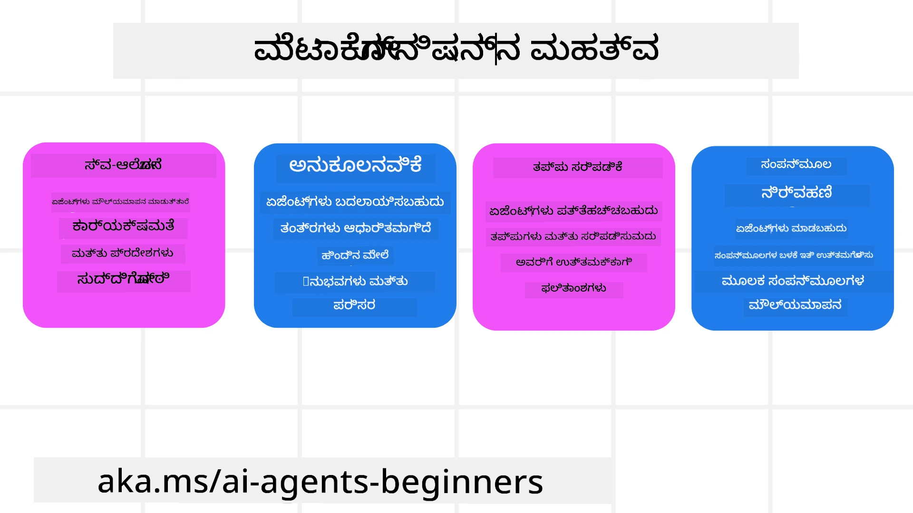
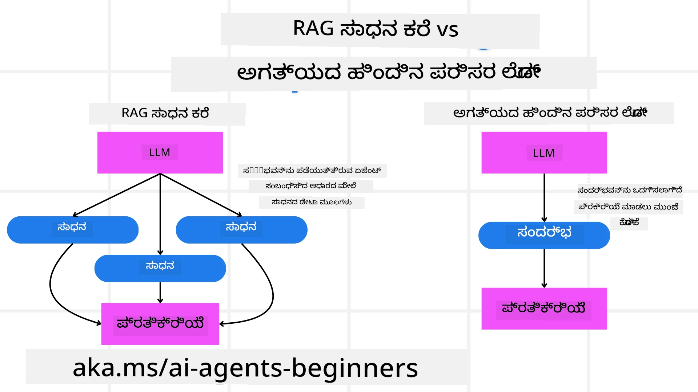

[](https://youtu.be/His9R6gw6Ec?si=3_RMb8VprNvdLRhX)

> _(ಈ ಪಾಠದ ವೀಡಿಯೊವನ್ನು ನೋಡಲು ಮೇಲಿನ ಚಿತ್ರವನ್ನು ಕ್ಲಿಕ್ ಮಾಡಿ)_
# AI ಏಜೆಂಟ್‌ಗಳಲ್ಲಿನ ಮೆಟಾಕಾಗ್ನಿಷನ್

## ಪರಿಚಯ

ನಿಮ್ಮ സ്വന്തം ಆಲೋಚನೆ ಪ್ರಕ್ರಿಯೆಗಳ ಬಗ್ಗೆ AI ಏಜೆಂಟ್‌ಗಳು ಹೇಗೆ ಯೋಚಿಸಬಹುದೆಂದು ಕತೆಯಾದವರು ಈ ಅಧ್ಯಾಯಕ್ಕೆ ಸ್ವಾಗತ! ಈ ಅಧ್ಯಾಯವು ಬಿಗಿನ್ನರ್ಸ್‌ಗಾಗಿ ವಿನ್ಯಾಸಗೊಳಿಸಲಾಗಿದ್ದು, AI ಏಜೆಂಟ್‌ಗಳು ತಮ್ಮ ಸ್ವಂತ ಯೋಚನೆ ಪ್ರಕ್ರಿಯೆಗಳ ಬಗ್ಗೆ ಹೇಗೆ ಯೋಚಿಸಬಲ್ಲವು ಎಂಬುದನ್ನು ತಿಳಿದುಕೊಳ್ಳಲು ದೋರಿಸುತ್ತದೆ. ಈ ಪಾಠದ ಅಂತ್ಯದಲ್ಲಿ, ನೀವು ಪ್ರಮುಖ ಸಂಪ್ರದಾಯಗಳನ್ನು ಅರ್ಥಮಾಡಿಕೊಳ್ಳುವಿರಿ ಮತ್ತು AI ಏಜೆಂಟ್ ವಿನ್ಯಾಸದಲ್ಲಿ ಮೆಟಾಕಾಗ್ನಿಷನ್ ಅನ್ನು ಅನ್ವಯಿಸಲು ನೈಪుణ್ಯಾತ್ಮಕ ಉದಾಹರಣೆಗಳನ್ನು ಬಳಸಲು ಸಜ್ಜಾಗಿರುವಿರಿ.

## ಕಲಿಕೆಯ ಗುರಿಗಳು

ಈ ಪಾಠವನ್ನು ಮುಗಿಸಿದ ನಂತರ, ನೀವು ಸಾಧ್ಯವಾಗುವುದು:

1. ಏಜೆಂಟ್ ವ್ಯಾಖ್ಯಾನಗಳಲ್ಲಿ ತರ್ಕದ ಸುತ್ತಲೂ ಪರಿಣಾಮಗಳನ್ನು ಅರ್ಥಮಾಡಿಕೊಳ್ಳುವುದು.
2. ಸ್ವಯಂ-ತಿದ್ದುವ ಏಜೆಂಟ್‌ಗಳಿಗೆ ನೆರವಾಗಲು ಯೋಜನೆ ಮತ್ತು ಮೌಲ್ಯಮಾಪನ ತಂತ್ರಗಳನ್ನು ಬಳಸುವುದು.
3. ಕಾರ್ಯಗಳನ್ನು ನೆರವೇರಿಸಲು ಕೋಡ್ ಅನ್ನು ಮಾನಿಪ್ಯುಲೇಟ್ ಮಾಡುವ ನಿಮ್ಮ ಸ್ವಂತ ಏಜೆಂಟ್‌ಗಳನ್ನು ರಚಿಸುವುದು.

## ಮೆಟಾಕಾಗ್ನಿಷನ್ ಪರಿಚಯ

ಮೆಟಾಕಾಗ್ನಿಷನ್ ಎಂದರೆ ಒಬ್ಬನು ತನ್ನ ಸ್ವಂತ ಯೋಚನೆಯ ಬಗ್ಗೆ ಯೋಚಿಸುವ ಉಚ್ಛ ಮಟ್ಟದ ಜ್ಞಾನಾತ್ಮಕ ಪ್ರಕ್ರಿಯೆಗಳು. AI ಏಜೆಂಟ್‌ಗಳಿಗಾಗಿ, ಇದು ಸ್ವಯಂ-ಜಾಗರಣೆ ಮತ್ತು ಕಳೆದ ಅನುಭವಗಳ ಆಧಾರದ ಮೇಲೆ ತಮ್ಮ ಕ್ರಿಯೆಗಳನ್ನು ಮೌಲ್ಯಮಾಪನ ಮಾಡಿ ಸಮಾಯೋಜಿಸಲು ಸಾಧ್ಯವಾಗುವುದು. ಮೆಟಾಕಾಗ್ನಿಷನ್, ಅಥವಾ "ಯೋಚನೆಯ ಬಗ್ಗೆ ಯೋಚಿಸುವುದು" ಎಂದರೆ ಏಜೆಂಟಿಕ್ AI ವ್ಯವಸ್ಥೆಗಳ ಅಭಿವೃದ್ಧಿಯಲ್ಲಿ ಮಹತ್ವಪೂರ್ಣ ಸಂಪ್ರದಾಯವಾಗಿದೆ. ಇದು AI ವ್ಯವಸ್ಥೆಗಳು ತಮ್ಮ ಸ್ವಂತ ಆಂತರಿಕ ಪ್ರಕ್ರಿಯೆಗಳ ಪತ್ತೆಹಚ್ಚಲು, ನಿಯಂತ್ರಣ ಮಾಡಲು ಮತ್ತು ತಮ್ಮ ವರ್ತನೆಗಳನ್ನು ಅನ್ವಯಿಸಿಕೊಳ್ಳಲು ಸಾಧ್ಯವಾಗುತ್ತದೆ. ನಾವು ಸಮಸ್ಯೆಯನ್ನು ಗಮನಿಸಿದಂತೆ ಅಥವಾ ಪರಿಸರವನ್ನು ಓದಿ ಗ್ರಹಿಸುವಂತೆ ಇದೂ ಸಹ. ಈ ಸ್ವಯಂ-ಜಾಗರಣೆ AI ವ್ಯವಸ್ಥೆಗಳಿಗೆ ಉತ್ತಮ ನಿರ್ಧಾರಗಳನ್ನು ತೆಗೆದುಕೊಳ್ಳಲು, ತಪ್ಪುಗಳನ್ನ ಗುರುತಿಸಲು ಮತ್ತು ಸಮಯಕ್ಕೆ ತಕ್ಕಂತೆ ಕಾರ್ಯಕ್ಷಮತೆಯನ್ನು ಸುಧಾರಿಸಲು ಸಹಾಯ ಮಾಡುತ್ತದೆ—ಮತ್ತೆ ಟ್ಯೂರಿಂಗ್ ಪರೀಕ್ಷೆಗೆ ಮತ್ತು AI takeover ಕುರಿತು ಚರ್ಚೆಗೆ ಹಿಂತಿರುಗುವಂತೆ.

ಏಜೆಂಟಿಕ್ AI ವ್ಯವಸ್ಥೆಗಳ ಸಂದರ್ಭದಲ್ಲಿ, ಮೆಟಾಕಾಗ್ನಿಷನ್ ಹಲವಾರು ಸವಾಲುಗಳಿಗೆ ಪರಿಹಾರ ನೀಡಲು ಸಹಾಯ ಮಾಡಬಹುದು, ಉದಾಹರಣೆಗೆ:
- ಪಾರದರ್ಶಕತೆ: AI ವ್ಯವಸ್ಥೆಗಳು ತಮಗೆದ ನಿಯತಿಗಳನ್ನು ಮತ್ತು ನಿರ್ಧಾರಗಳನ್ನು ವಿವರಿಸಬಲ್ಲಂತೆ ಮಾಡುವುದು.
- ತರ್ಕ: AI ವ್ಯವಸ್ಥೆಗಳು ಮಾಹಿತಿಯನ್ನು ಸಂಯೋಜಿಸಲು ಮತ್ತು ಸಾಮಾನ್ಯ ನಿರ್ಧಾರಗಳನ್ನು ತಗೆದುಕೊಳ್ಳಲು ಸಾಮರ್ಥ್ಯವನ್ನು ಹೆಚ್ಚಿಸುವುದು.
- ಹೊಂದಾಣಿಕೆ: ಹೊಸ ಪರಿಸರಗಳಿಗೆ ಮತ್ತು ಬದಲಾದ ಪರಿಸ್ಥಿತಿಗಳಿಗೆ AI ವ್ಯವಸ್ಥೆಗಳು ಹೊಂದಿಕೊಳ್ಳಲು ಅವಕಾಶ ನೀಡುವುದು.
- ಧಾರ್ಮಿಕತೆ: ತಮ್ಮ ಪರಿಸರದಿಂದ ಪಡೆದ ಡೇಟಾವನ್ನು ಗುರುತಿಸಿ ದೃಢೀಕರಿಸುವಲ್ಲಿ AI ವ್ಯವಸ್ಥೆಗಳ ನಿಖರತೆಯನ್ನು ಹೆಚ್ಚಿಸುವುದು.

### ಮೆಟಾಕಾಗ್ನಿಷನ್ ಎಂದರೆ ಏನು?

ಮೆಟಾಕಾಗ್ನಿಷನ್, ಅಥವಾ "ಯೋಚನೆಯ ಬಗ್ಗೆ ಯೋಚಿಸುವುದು," ಎಂಬುದು ಉಚ್ಛ ಮಟ್ಟದ ಜ್ಞಾನಾತ್ಮಕ ಪ್ರಕ್ರಿಯೆ ಆಗಿದ್ದು, ತನ್ನ ಸ್ವಂತ ಜ್ಞಾನಾತ್ಮಕ ಪ್ರಕ್ರಿಯೆಗಳ ಸ್ವಯಂ-ಜಾಗರಣೆ ಮತ್ತು ನಿಯಂತ್ರಣವನ್ನು ಒಳಗೊಂಡಿದೆ. AI ಕ್ಷೇತ್ರದಲ್ಲಿ, ಮೆಟಾಕಾಗ್ನಿಷನ್ ಏಜೆಂಟ್ ಗಳಿಗೆ ತಮ್ಮ ತಂತ್ರಗಳು ಮತ್ತು ಕಾರ್ಯಗಳನ್ನು ಮೌಲ್ಯಮಾಪನ ಮಾಡಿ ಹೊಂದಿಕೊಳ್ಳಲು ಶಕ್ತಿ ನೀಡುತ್ತದೆ, ಇದು ಸಮಸ್ಯೆ ಪರಿಹಾರ ಮತ್ತು ನಿರ್ಧಾರ ತಗೆದುಕೊಳ್ಳುವ ಸಾಮರ್ಥ್ಯವನ್ನು ಉತ್ತೇಜಿಸುತ್ತದೆ. ಮೆಟಾಕಾಗ್ನಿಷನ್ ಅರ್ಥಮಾಡಿಕೊಂಡು, ನೀವು ಹೆಚ್ಚು ಬುದ್ಧಿವಂತ ಮತ್ತು ಹೆಚ್ಚು ಹೊಂದಿಕೊಳ್ಳುವಷ್ಟು ಹಾಗೂ ಪರಿಣಾಮಕಾರಿ AI ಏಜೆಂಟ್‌ಗಳನ್ನು ರೂಪಿಸಬಹುದು. ನಿಜವಾದ ಮೆಟಾಕಾಗ್ನಿಷನ್‌ನಲ್ಲಿ, AI ಸ್ಪಷ್ಟವಾಗಿ ತನ್ನ ಸ್ವಂತ ತರ್ಕದ ಬಗ್ಗೆ ವಾದಿಸುತ್ತದೆ.

ಉದಾಹರಣೆ: “ನಾನು ತಗ್ಗು ಬಿಳೇನಲಿಯ ವಿಮಾನಗಳನ್ನು ಆದ್ಯತೆ ನೀಡಿದೆ ಬ೦ದರೆ… ನೇರ ವಿಮಾನವನ್ನು ತಪ್ಪಿಸುತ್ತಿರುವಿರಬಹುದು, ಹಾಗಾಗಿ ನಾನು ಮತ್ತೆ ಪರಿಶೀಲನೆ ಮಾಡುತ್ತೇನೆ.”
ಯಾವ ಮಾರ್ಗವನ್ನು ಆಯ್ದುಕೊಂಡಿತು ಎಂಬುದನ್ನು ನೋಟವಿಡುವುದು.
- ಯೂಸರ್ ಪ್ರಾಧಾನ್ಯತೆಯ ಮೇಲೆ ಅಧಿಕ ಅವಲಂಬಿಸಿಕೊಂಡು ತಪ್ಪು ಮಾಡಿದ ಕಾರಣ, ಅದು ಪರಿಹಾರ ತಂತ್ರವನ್ನು ಮಾತ್ರವಲ್ಲದೆ ಅಂತಿಮ ಶಿಫಾರಸು ಕ್ಕೆ ಬದಲಾವಣೆ ಮಾಡುತ್ತದೆ.
- “ಯೂಸರನು ‘ಬಹಳ ಜನಸಾಗರ’ ಎಂದು ಪ್ರಣಾಳಿಸುವಾಗ, ನಾನು ಕೆಲ ಆಕರ್ಷಣೆಗಳನ್ನು ತೆಗೆದುಹಾಕಬೇಕು ಮಾತ್ರವಲ್ಲದೆ, ನಾನು ಯಥಾರ್ಥತೆಯ ಪ್ರಕಾರ ‘ಮುಖ್ಯ ಆಕರ್ಷಣೆಗಳನ್ನು’ ಆಯ್ಕೆ ಮಾಡುವ ವಿಧಾನವು ತಪ್ಪಾಗಿದೆ ಎಂದು ಪರಿಗಣಿಸಬೇಕು” ಎಂಬ ಮಾದರಿಗಳನ್ನು ಗುರುತಿಸುವುದು.

### AI ಏಜೆಂಟ್‌ಗಳಲ್ಲಿ ಮೆಟಾಕಾಗ್ನಿಷನ್ ಮಹತ್ವ

ಮೆಟಾಕಾಗ್ನಿಷನ್ ಅನೇಕ ಕಾರಣಗಳಿಗಾಗಿ AI ಏಜೆಂಟ್ ವಿನ್ಯಾಸದಲ್ಲಿ ಮಹತ್ವದ್ದಾಗಿದೆ:



- ಸ್ವಯಂ-ಪರಿಶೀಲನೆ: ಏಜೆಂಟ್‌ಗಳು ತಮ್ಮ ಕಾರ್ಯಕ್ಷಮತೆಯನ್ನು ಎದುರಿಸಿ ಸುಧಾರಣೆಗೆ ವಿಷಯಗಳನ್ನು ಗುರುತಿಸುವುದು.
- ಹೊಂದಾಣಿಕೆ: ಹಳೆಯ ಅನುಭವಗಳು ಮತ್ತು ಬದಲಾದ ಪರಿಸರಗಳ ಆಧಾರದ ಮೇಲೆ ತಂತ್ರಗಳನ್ನು ಬದಲಿಸಿಕೊಳ್ಳುವುದು.
- ದೋಷ ತಿದ್ದುವಿಕೆ: ಏಜೆಂಟ್‌ಗಳು ಸ್ವಯಂಚಾಲಿತವಾಗಿ ದೋಷಗಳನ್ನು ಕಂಡುಹಿಡಿದು ಸರಿಪಡಿಸುವುದು, ಇದು ಹೆಚ್ಚು ನಿಖರ ಫಲಿತಾಂಶಗಳಿಗೆ ಕಾರಣವಾಗುತ್ತದೆ.
- ಸಂಪನ್ಮೂಲ ನಿರ್ವಹಣೆ: ಸಮಯ ಮತ್ತು ಗಣಕಶಕ್ತಿ ಮುಂತಾದ ಸಂಪನ್ಮೂಲಗಳ ಬಳಕೆಯನ್ನು ಯೋಜಿಸಿ ಮೌಲ್ಯಮಾಪನ ಮಾಡುತ್ತಾ ಸುಧಾರಿಸುವುದು.

## AI ಏಜೆಂಟ್‌ನ ಘಟಕಗಳು

ಮೆಟಾಕಾಗ್ನಿಟಿವ್ ಪ್ರಕ್ರಿಯೆಗಳನ್ನು ತೊಡಗಿಕೊಳ್ಳುವ ಮೊದಲು, AI ಏಜೆಂಟ್‌ನ ಮೂಲಭೂತ ಘಟಕಗಳನ್ನು ಅರ್ಥಮಾಡಿಕೊಳ್ಳುವುದು ಅಗತ್ಯ. ಒಂದು AI ಏಜೆಂಟ್ ಸಾಮಾನ್ಯವಾಗಿ ಈ ಭಾಗಗಳಿಂದ ಕೂಡಿದೆ:

- ವ್ಯಕ್ತಿತ್ವ: ಏಜೆಂಟ್ ಹೇಗೆ ಬಳಕೆದಾರರ ಜೊತೆ ವರ್ತಿಸುತ್ತದೆ ಎನ್ನುವ ವ್ಯಕ್ತಿತ್ವ ಮತ್ತು ಲಕ್ಷಣಗಳು.
- ಉಪಕರಣಗಳು: ಏಜೆಂಟ್ ನೈಸರ್ಗಿಕವಾಗಿ ಬಾಧ್ಯತೆ ಅನುಷ್ಠಾನ ಮಾಡಬಲ್ಲ ಸಾಮರ್ಥ್ಯಗಳು.
- ಕೌಶಲ್ಯಗಳು: ಏಜೆಂಟ್ ಹೊಂದಿರುವ ಜ್ಞಾನ ಮತ್ತು ಪರಿಣತಿ.

ಈ ಘಟಕಗಳು ಶ್ರೇಷ್ಟತೆಯ ಏಕಕವಾಗಿ ಕಾರ್ಯನಿರ್ವಹಿಸುತ್ತವೆ, ನಿರ್ದಿಷ್ಟ ಕಾರ್ಯಗಳನ್ನು ನೆರವೇರಿಸಲು.

**ಉದಾಹರಣೆ**:
ರಿಯಲ್-ಟೈಮ್ ಡೇಟಾ ಮತ್ತು ಹಳೆಯ ಗ್ರಾಹಕ ಪ್ರಯಾಣ ಅನುಭವಗಳ ಆಧಾರದ ಮೇಲೆ ತನ್ನ ಮಾರ್ಗವನ್ನು ಹೊಂದಿಸುವ ಪ್ರವಾಸ ಏಜೆಂಟ್ ಸೇವೆಯನ್ನು ಪರಿಗಣಿಸಿ.

### ಉದಾಹರಣೆ: ಪ್ರವಾಸ ಏಜೆಂಟ್ ಸೇವೆಯಲ್ಲಿ ಮೆಟಾಕಾಗ್ನಿಷನ್

ನೀವು AI ಚಾಲಿತ ಪ್ರವಾಸ ಏಜೆಂಟ್ ಸೇವೆಯನ್ನು ವಿನ್ಯಾಸಗೊಳಿಸುತ್ತಿದ್ದೀರಿ ಎಂದು ಊಹಿಸಿ. ಈ ಏಜೆಂಟ್ "ಪ್ರವಾಸ ಏಜೆಂಟ್" ಯು ಬಳಕೆದಾರರಿಗೆ ಅವರ ರಜೆ ಯೋಜನೆಯಲ್ಲಿ ಸಹಾಯ ಮಾಡುತ್ತದೆ. ಮೆಟಾಕಾಗ್ನಿಷನ್ ಅನ್ನು ಸೇರಿಸಲು, ಪ್ರವಾಸ ಏಜೆಂಟ್ ತನ್ನ ಸ್ವಯಂ-ಜಾಗರಣೆ ಮತ್ತು ಹಳೆಯ ಅನುಭವಗಳ ಆಧಾರದ ಮೇಲೆ ತನ್ನ ಕ್ರಿಯೆಗಳನ್ನು ಮೌಲ್ಯಮಾಪನ ಮಾಡಿ ಹೊಂದಿಸಬೇಕು. ಮೆಟಾಕಾಗ್ನಿಷನ್ ಹೇಗೆ ಪಾತ್ರವಹಿಸಬಹುದು ಎಂಬುದನ್ನು ನೋಡಿರಿ:

#### ಪ್ರಸ್ತುತ ಕಾರ್ಯ

ಪ್ರಸ್ತುತ ಕಾರ್ಯ ಬಳಕೆದಾರನಿಗೆ ಪ್ಯಾರಿಸ್ ಗೆ ಪ್ರಯಾಣದ ಯೋಜನೆಯನ್ನು ನೆರವೇರಿಸುವುದು.

#### ಕಾರ್ಯ ಪೂರ್ಣಗೊಳಿಸುವ ಹಂತಗಳು

1. **ಬಳಕೆದಾರ ಸ್ನೇಹಪೂರ್ವಕತೆ ಸಂಗ್ರಹಿಸು**: ಬಳಕೆದಾರನಿಗೆ ಅವರ ಪ್ರಯಾಣ ದಿನಾಂಕಗಳು, ಬಜೆಟ್, ಆಸಕ್ತಿಗಳು (ಉದಾ: ಮ್ಯೂಸಿಯಂ, ಆಹಾರ, ಖರೀದಿ) ಮತ್ತು ಯಾವುದೇ ವಿಶೇಷ ಅವಶ್ಯಕತೆಗಳ ಬಗ್ಗೆ ಕೇಳಿ.
2. **ಮಾಹಿತಿ ಸಂಗ್ರಹಿಸು**: ಬಳಕೆದಾರನ ವಂಚನೆಗಳಿಗೆ ಹೊಂದಿಕೊಂಡ ವಿಮಾನ, ವಸತಿ, ಆಕರ್ಷಣೆಗಳು ಮತ್ತು ರೆಸ್ಟೋರೆಂಟ್ ಬಗ್ಗೆ ಹುಡುಕಿ.
3. **ಶಿಫಾರಸುಗಳು ತಯಾರಿಸು**: ವಿಮಾನ ವಿವರಗಳು, ಹೋಟೆಲ್ ರಿಸರ್ವೇಷನ್‌ಗಳು ಮತ್ತು ಶಿಫಾರಸು ಮಾಡಲ್ಪಟ್ಟ ಚಟುವಟಿಕೆಗಳೊಂದಿಗೆ ವೈಯಕ್ತಿಕ ಕಾರ್ಯತಾಳಿಕೆ ನೀಡಿ.
4. **ಪ್ರತಿಕ್ರಿಯೆಯಿಂದ ಹೊಂದಾಣಿಕೆ ಮಾಡು**: ಶಿಫಾರಸುಗಳ ಬಗ್ಗೆ ಬಳಕೆದಾರ ಪ್ರತಿಕ್ರಿಯೆಯನ್ನು ಕೇಳಿ ಮುಭಾಗ ಬದಲಾವಣೆ ಮಾಡು.

#### ಅಗತ್ಯ ಸಂಪನ್ಮೂಲಗಳು

- ವಿಮಾನ ಮತ್ತು ಹೋಟೆಲ್ ಬುಕ್ಕಿಂಗ್ ಡೇಟಾಬೇಸ್‌ಗಳಿಗೆ ಪ್ರವೇಶ.
- ಪ್ಯಾರಿಸ್ ಆಕರ್ಷಣೆಗಳು ಮತ್ತು ರೆಸ್ಟೊರೆಂಟ್‌ಗಳ ಮಾಹಿತಿ.
- ಹಿಂದಿನ ಸಂವಾದಗಳಿಂದ ಬಳಕೆದಾರ ಪ್ರತಿಕ್ರಿಯೆ ಡೇಟಾ.

#### ಅನುಭವ ಮತ್ತು ಸ್ವಯಂ-ಪರಿಶೀಲನೆ

ಪ್ರವಾಸ ಏಜೆಂಟ್ ತನ್ನ ಕಾರ್ಯಕ್ಷಮತೆಯನ್ನು ಮೌಲ್ಯಮಾಪನ ಮಾಡಿ ಹಳೆಯ ಅನುಭವಗಳಿಂದ ಕಲಿಯಲು ಮೆಟಾಕಾಗ್ನಿಷನ್ ಬಳಸುತ್ತದೆ. ಉದಾಹರಣೆಗೆ:

1. **ಬಳಕೆದಾರ ಪ್ರತಿಕ್ರಿಯೆ ವಿಶ್ಲೇಷಣೆ**: ಪ್ರವಾಸ ಏಜೆಂಟ್ ಯೂಸರ್ ಪ್ರತಿಕ್ರಿಯೆಗಳನ್ನು ಪರಿಶೀಲಿಸಿ ಯಾವ ಶಿಫಾರಸುಗಳು ಒಪ್ಪಿಕೊಳ್ಳಲ್ಪಟ್ಟವು ಮತ್ತು ಯಾವವು ಅಲ್ಲವೆಂದು ಗುರುತಿಸುತ್ತದೆ. ಅದು ತಮ್ಮ ಭವಿಷ್ಯದ ಶಿಫಾರಸುಗಳನ್ನು ಹೊಂದಿಕೊಳ್ಳುತ್ತದೆ.
2. **ಹೊಂದಾಣಿಕೆ**: ಬಳಕೆದಾರ ಮೊದಲು ಜನಸಾಗರದ ಸ್ಥಳಗಳನ್ನು ಇಷ್ಟಪಡದಿದ್ದರೆ, ಪ್ರವಾಸ ಏಜೆಂಟ್ ಭವಿಷ್ಯದಲ್ಲಿ ಜನಪ್ರಿಯ ಪ್ರವಾಸಿ ತಾಣಗಳನ್ನು ಶಿಫಾರಸು ಮಾಡುವುದನ್ನು ತಪ್ಪಿಸುತ್ತದೆ.
3. **ದೋಷ ತಿದ್ದುವಿಕೆ**: ಹಿಂದಿನ ಬುಕ್ಕಿಂಗ್ ನೊಂದಾಯಿಸುವುದರಲ್ಲಿ ತಪ್ಪು ಮಾಡಿದರೆ, ಪ್ರಯಾಣ ಏಜೆಂಟ್ ಸೂಚನೆಗಳಿಗೆ ಮುಂಚಿತ ಪರೀಕ್ಷಾ ಕ್ರಮಗಳನ್ನು ಕಟ್ಟಿ ಮಾಡುತ್ತದೆ.

#### ಅಭ್ಯಾಸಶೀಲ ಡೆವಲಪರ್ ಉದಾಹರಣೆ

ಮೆಟಾಕಾಗ್ನಿಷನ್ ಸೇರಿಸುವಾಗ ಪ್ರವಾಸ ಏಜೆಂಟ್‌ನ ಕೋಡ್ ಹೇಗೆ ಕಾಣಬಹುದು ಎಂಬ ಸರಳೀಕೃತ ಉದಾಹರಣೆ:

```python
class Travel_Agent:
    def __init__(self):
        self.user_preferences = {}
        self.experience_data = []

    def gather_preferences(self, preferences):
        self.user_preferences = preferences

    def retrieve_information(self):
        # ಇಚ್ಛೆಗಳ ಆಧಾರದ ಮೇಲೆ ವಿಮಾನಗಳು, ಹೊಟೇಲ್ಗಳು ಮತ್ತು ಆಕರ್ಷಣೆಗಳನ್ನು ಶೋಧಿಸಿ
        flights = search_flights(self.user_preferences)
        hotels = search_hotels(self.user_preferences)
        attractions = search_attractions(self.user_preferences)
        return flights, hotels, attractions

    def generate_recommendations(self):
        flights, hotels, attractions = self.retrieve_information()
        itinerary = create_itinerary(flights, hotels, attractions)
        return itinerary

    def adjust_based_on_feedback(self, feedback):
        self.experience_data.append(feedback)
        # ಪ್ರತಿಕ್ರೀಯೆ ವಿಶ್ಲೇಷಿಸಿ ಮತ್ತು ಭವಿಷ್ಯದಲ್ಲಿ ಶಿಫಾರಸುಗಳನ್ನು ಹೊಂದಿಸಿ
        self.user_preferences = adjust_preferences(self.user_preferences, feedback)

# ಉದಾಹರಣೆಯ ಬಳಕೆ
travel_agent = Travel_Agent()
preferences = {
    "destination": "Paris",
    "dates": "2025-04-01 to 2025-04-10",
    "budget": "moderate",
    "interests": ["museums", "cuisine"]
}
travel_agent.gather_preferences(preferences)
itinerary = travel_agent.generate_recommendations()
print("Suggested Itinerary:", itinerary)
feedback = {"liked": ["Louvre Museum"], "disliked": ["Eiffel Tower (too crowded)"]}
travel_agent.adjust_based_on_feedback(feedback)
```

#### ಮೆಟಾಕಾಗ್ನಿಷನ್ ಪ್ರಾಮುಖ್ಯತೆ

- **ಸ್ವಯಂ-ಪರಿಶೀಲನೆ**: ಏಜೆಂಟ್‌ಗಳು ತಮ್ಮ ಕಾರ್ಯಕ್ಷಮತೆಯನ್ನು ವಿಶ್ಲೇಷಿಸಿ ಸುಧಾರಣೆಗೆ ವಿಷಯಗಳನ್ನು ಗುರುತಿಸಿದೆ.
- **ಹೊಂದಾಣಿಕೆ**: ಪ್ರತಿಕ್ರಿಯೆ ಮತ್ತು ಬದಲಾಯಿಸುವ ಪರಿಸ್ಥಿತಿಗಳಲ್ಲಿ ತಂತ್ರಗಳನ್ನು ಬದಲಿಸಬಹುದು.
- **ದೋಷ ತಿದ್ದುವಿಕೆ**: ಸ್ವಯಂಚಾಲಿತವಾಗಿ ದೋಷಗಳನ್ನು ಕಂಡು ಸರಿಪಡಿಸಬಹುದು.
- **ಸಂಪನ್ಮೂಲ ನಿರ್ವಹಣೆ**: ಸಮಯ ಮತ್ತು ಗಣಕ ಶಕ್ತಿಯನ್ನು ಸಮರ್ಪಕವಾಗಿ ಬಳಕೆ ಮಾಡುವಿಕೆ.

ಮೆಟಾಕಾಗ್ನಿಷನ್ ಅನ್ನು ಸೇರಿಸುವ ಮೂಲಕ, ಪ್ರವಾಸ ಏಜೆಂಟ್ ಹೆಚ್ಚು ವೈಯಕ್ತಿಕ ಮತ್ತು ನಿಖರವಾದ ಪ್ರಯಾಣ ಶಿಫಾರಸುಗಳನ್ನು ನೀಡಬಹುದು, ಹೀಗೆ ಬಳಕೆದಾರ ಅನುಭವವನ್ನು ಸುಧಾರಿಸುತ್ತದೆ.

---

## 2. ಏಜೆಂಟ್‌ಗಳಲ್ಲಿ ಯೋಜನೆ

ಯೋಜನೆ AI ಏಜೆಂಟ್ ವರ್ತನೆಯ ಪ್ರಮುಖ ಅಂಗವಾಗಿದೆ. ಇದು ಗುರಿಯನ್ನು ಸಾಧಿಸಲು ಬೇಕಾದ ಹಂತಗಳನ್ನು ಸರಳವಾಗಿ ರೂಪಿಸುವುದನ್ನು ಒಳಗೊಂಡಿದ್ದು, ಪ್ರಸ್ತುತ ಸ್ಥಿತಿ, ಸಂಪನ್ಮೂಲಗಳು ಮತ್ತು ಅಡ್ಡಿಭಾಗಗಳನ್ನು ಪರಿಗಣಿಸುತ್ತದೆ.

### ಯೋಜನೆಯ ಅಂಶಗಳು

- **ಪ್ರಸ್ತುತ ಕಾರ್ಯ**: ಕಾರ್ಯವನ್ನು ಸ್ಪಷ್ಟವಾಗಿ ವ್ಯಾಖ್ಯಾನಿಸು.
- **ಕಾರ್ಯ ಪೂರ್ಣಗೊಳಿಸುವ ಹಂತಗಳು**: ಕಾರ್ಯವನ್ನು ನಿರ್ವಹಣೀಯ ಹಂತಗಳಿಗೆ ಹಂಚು.
- **ಆವಶ್ಯಕ ಸಂಪನ್ಮೂಲಗಳು**: ಅಗತ್ಯ ಸಂಪನ್ಮೂಲಗಳನ್ನು ಗುರುತಿಸು.
- **ಅನುಭವ**: ಹಳೆಯ ಅನುಭವಗಳನ್ನು ಯೋಜನೆಗೆ ಬಳಸಿಕೊಳ್ಳು.

**ಉದಾಹರಣೆ**:
ಪ್ರವಾಸ ಏಜೆಂಟ್ ತನ್ನ ಬಳಕೆದಾರರ ಪ್ರಯಾಣವನ್ನು ಪರಿಣಾಮಕಾರಿಯಾಗಿ ಯೋಜಿಸಲು ಇವುಗಳನ್ನು ಅನುಸರಿಸುತ್ತದೆ:

### ಪ್ರವಾಸ ಏಜೆಂಟ್‌ಗಾಗಿ ಹಂತಗಳು

1. **ಬಳಕೆದಾರ ಸ್ನೇಹಪೂರ್ವಕತೆ ಸಂಗ್ರಹಿಸು**
   - ಪ್ರಯಾಣ ದಿನಾಂಕಗಳು, ಬಜೆಟ್, ಆಸಕ್ತಿಗಳು ಮತ್ತು ವಿಶೇಷ ಅವಶ್ಯಕತೆಗಳ ಬಗ್ಗೆ ಬಳಕೆದಾರನಿಂದ ಮಾಹಿತಿ ಸಂಗ್ರಹಿಸು.
   - ಉದಾಹರಣೆಗಳು: "ನೀವು ಯಾವಾಗ ಪ್ರಯಾಣ ಮಾಡಲು ಯೋಜಿಸುತ್ತಿದ್ದೀರಿ?" "ನಿಮ್ಮ ಬಜೆಟ್ ಎಷ್ಟು?" "ನೀವು ರಜಾದ ಸಮಯದಲ್ಲಿ ಯಾವ ಚಟುವಟಿಕೆಗಳನ್ನು ಇಷ್ಟಪಡುವಿರಿ?"

2. **ಮಾಹಿತಿ ಸಂಗ್ರಹಿಸು**
   - ಬಳಕೆದಾರದ ಆಸಕ್ತಿಗಳ ಆಧಾರದ ಮೇಲೆ ಸಂಬಂಧಿಸಿದ ಪ್ರವಾಸ ಆಯ್ಕೆಗಳು ಹುಡುಕಿ.
   - **ವಿಮಾನಗಳು**: ಬಳಕೆದಾರನ ಬಜೆಟ್ ಮತ್ತು ಆಯ್ಕೆದ ದಿನಾಂಕಗಳಲ್ಲಿ ಲಭ್ಯವಿರುವ ವಿಮಾನಗಳನ್ನು ಹುಡುಕಿ.
   - ** ವಸತಿ ಸಂಯೋಜನೆಗಳು **: ಬಳಕೆದಾರ ಅಸ್ಥಾನ, ಬೆಲೆ ಮತ್ತು ಸೌಲಭ್ಯಗಳಿಗೆ ಹೊಂದಿಕೊಳ್ಳುವ ಹೋಟೆಲ್ ಅಥವಾ ಬಾಡಿಗೆ ಜಾಗಗಳನ್ನು ಕಂಡುಹಿಡಿ.
   - **ಆಕರ್ಷಣೆಗಳು ಮತ್ತು ರೆಸ್ಟೋರೆಂಟ್‌ಗಳು**: ಬಳಕೆದಾರರ ಆಸಕ್ತಿಗೆ ಹೊಂದಿಕೊಂಡ ಜನಪ್ರಿಯ ಹಣೆಪಟ್ಟಿ, ಚಟುವಟಿಕೆ ಮತ್ತು ಆಹಾರ ಆಯ್ಕೆಗಳು ಗುರುತು ಮಾಡಿ.

3. **ಶಿಫಾರಸುಗಳು ತಯಾರಿಸು**
   - ಸಂಗ್ರಹಿಸಿದ ಮಾಹಿತಿಯನ್ನು ವೈಯಕ್ತಿಕ ತಾಣಕ್ರಮವಾಗಿ ಸಿದ್ಧಪಡಿಸು.
   - ವಿಮಾನ ಆಯ್ಕೆಗಳು, ಹೋಟೆಲ್ ಬುಕ್ಕಿಂಗ್‌ಗಳು ಮತ್ತು ಶಿಫಾರಸು ಮಾಡಿದ ಚಟುವಟಿಕೆಗಳ ವಿವರಗಳನ್ನು ನೀಡುವುದರ ಮೂಲಕ ಬಳಕೆದಾರನ ಇಚ್ಛೆಯಕ್ಕೆ ಹೊಂದಿಕೊಳ್ಳು.

4. **ಬಳಕೆದಾರನಿಗೆ Itinerary ಅನ್ನು ಪ್ರದರ್ಶಿಸು**
   - ಬಳಕೆದಾರನ ಪರಿಶೀಲನೆಗಾಗಿ ಪ್ರಸ್ತಾವಿತ Itinerary ಅನ್ನು ಹಂಚಿಕೊಳ್ಳು.
   - ಉದಾಹರಣೆ: "ನಿಮ್ಮ ಪ್ಯಾರಿಸ್ ಪ್ರವಾಸದ ಸಲುವಾಗಿ ಇದು ಶಿಫಾರಸು ಮಾಡಲಾದ Itinerary ಆಗಿದೆ. ಇದರಲ್ಲಿ ವಿಮಾನ ವಿವರಗಳು, ಹೋಟೆಲ್ ಬುಕ್ಕಿಂಗ್‌ಗಳು ಮತ್ತು ಶಿಫಾರಸುಚೈನ ಚಟುವಟಿಕೆಗಳು ಮತ್ತು ರೆಸ್ಟೋರೆಂಟ್‌ಗಳ ಪಟ್ಟಿ ಇದೆ. ನಿಮ್ಮ ಅಭಿಪ್ರಾಯ ತಿಳಿಸಿ!"

5. **ಪ್ರತಿಕ್ರಿಯೆ ಸಂಗ್ರಹಿಸು**
   - ಶಿಫಾರಸು Itinerary ಕುರಿತು ಬಳಕೆದಾರರಿಂದ ಪ್ರತಿಕ್ರಿಯೆ ಕೇಳಿ.
   - ಉದಾಹರಣೆಗಳು: "ನೀವು ವಿಮಾನ ಆಯ್ಕೆಗಳನ್ನು ಇಷ್ಟಪಟ್ಟಿರೇ?" "ಹೋಟೆಲ್ ನಿಮ್ಮ ಅಗತ್ಯಗಳಿಗೆ ಸೂಕ್ತವಾಗಿದೆಯೇ?" "ನೀವು ಯಾವುದಾದರೂ ಚಟುವಟಿಕೆಗಳನ್ನು ಸೇರಿಸಲು ಅಥವಾ ತೆಗೆದುಹಾಕಲು ಬಯಸುತ್ತೀರಾ?"

6. **ಪ್ರತಿಕ್ರಿಯೆಯ ಆಧಾರದ ಮೇಲೆ ಹೊಂದಾಣಿಕೆ ಮಾಡು**
   - ಬಳಕೆದಾರ ಪ್ರತಿಕ್ರಿಯೆಯ ಆಧಾರದ ಮೇಲೆ Itinerary ತಿದ್ದುಪಡಿಗಳನ್ನು ಮಾಡಿ.
   - ವಿಮಾನ, ವಸತಿ ಮತ್ತು ಚಟುವಟಿಕೆ ಶಿಫಾರಸುಗಳ ತಿದ್ದುಪಡಿ ಮಾಡೋಣ, ಬಳಕೆದಾರನ ಇಚ್ಛೆಗೆ ಹೆಚ್ಚು ಹೊಂದಿಕೊಳ್ಳುವಂತೆ ಮಾಡಿ.

7. **ಅಂತಿಮ ದೃಢೀಕರಣ**
   - ತಿದ್ದುಪಡಿಸಲಾದ Itinerary ಅನ್ನು ಬಳಕೆದಾರನ ಅಂತಿಮ ದೃಢೀಕರಣಕ್ಕಾಗಿ ತೋರಿ.
   - ಉದಾಹರಣೆ: "ನಿಮ್ಮ ಪ್ರತಿಕ್ರಿಯೆಯ ಆಧಾರದ ಮೇಲೆ ನಾನಿದು ಬದಲಾವಣೆ ಮಾಡಿದ್ದೇನೆ. ಹೊಸ Itinerary ಇಲ್ಲಿ ಇದೆ. ಎಲ್ಲವೂ ಸರಿಯೇ?"

8. **ಬುಕ್ಕಿಂಗ್ ಮಾಡಿ ಮತ್ತು ದೃಢೀಕರಣೆ ನೀಡು**
   - ಬಳಕೆದಾರ ಈ Itinerary ಅನ್ನು ಅಂಗೀಕರಿಸಿದ ಮೇಲೆ, ವಿಮಾನಗಳು, ವಸತಿ ಮತ್ತು ಪೂರ್ವ-ಯೋಜಿತ ಚಟುವಟಿಕೆಗಳನ್ನು ಬುಕ್ ಮಾಡಿ.
   - ದೃಢೀಕರಣ ವಿವರಗಳನ್ನು ಬಳಕೆದಾರನಿಗೆ ಕಳುಹಿಸಿ.

9. **ಮುಂದುವರೆದ ಬೆಂಬಲ ಒದಗಿಸು**
   - ಪ್ರಯಾಣದ ಮುಂಚಿತ ಹಾಗೂ ವೇಳೆ ಯಾವುದೇ ಬದಲಾವಣೆಗಳು ಅಥವಾ ಹೆಚ್ಚುವರಿ ವಿನಂತಿಗಳಿಗೆ ಬೆಂಬಲ ನೀಡಲು ಸಿದ್ಧವಾಗಿರು.
   - ಉದಾಹರಣೆ: "ನಿಮ್ಮ ಪ್ರಯಾಣದ ವೇಳೆಯಲ್ಲಿ ಯಾವುದೇ ಸಹಾಯ ಬೇಕಾದರೆ, ನನಗೆ ಯಾವುದೇ ಸಮಯ ಸಂಪರ್ಕಿಸಿ!"

### ಉದಾಹರಣೆಯ ಸಂವಾದ

```python
class Travel_Agent:
    def __init__(self):
        self.user_preferences = {}
        self.experience_data = []

    def gather_preferences(self, preferences):
        self.user_preferences = preferences

    def retrieve_information(self):
        flights = search_flights(self.user_preferences)
        hotels = search_hotels(self.user_preferences)
        attractions = search_attractions(self.user_preferences)
        return flights, hotels, attractions

    def generate_recommendations(self):
        flights, hotels, attractions = self.retrieve_information()
        itinerary = create_itinerary(flights, hotels, attractions)
        return itinerary

    def adjust_based_on_feedback(self, feedback):
        self.experience_data.append(feedback)
        self.user_preferences = adjust_preferences(self.user_preferences, feedback)

# ಬುಯಿಂಗ್ ವಿನಂತಿಯೊಳಗಿನ ಉದಾಹರಣೆಯ ಬಳಕೆ
travel_agent = Travel_Agent()
preferences = {
    "destination": "Paris",
    "dates": "2025-04-01 to 2025-04-10",
    "budget": "moderate",
    "interests": ["museums", "cuisine"]
}
travel_agent.gather_preferences(preferences)
itinerary = travel_agent.generate_recommendations()
print("Suggested Itinerary:", itinerary)
feedback = {"liked": ["Louvre Museum"], "disliked": ["Eiffel Tower (too crowded)"]}
travel_agent.adjust_based_on_feedback(feedback)
```

## 3. ತಿದ್ದುವ RAG ವ್ಯವಸ್ಥೆ

ಮೊದಲು RAG ಉಪಕರಣ ಮತ್ತು മുമ്പೆಚ್ಚರಿಕೆಯ ಸನ್ನಿವೇಶ ಲೋಡಿಂಗ್ ನಡುವಿನ ಭೇದವನ್ನು ತಿಳಿದುಕೊಳ್ಳೋಣ



### Retrieval-Augmented Generation (RAG)

RAG ರಿಟ್ರೀವಲ್ ವ್ಯವಸ್ಥೆಯನ್ನು ಜನರೇಟಿವ್ ಮಾದರಿಯೊಂದಿಗೆಯಾಗಿ ಸಂಯೋಜಿಸುತ್ತದೆ. ಪ್ರಶ್ನೆ ಮಾಡಿದಾಗ, ರಿಟ್ರೀವಲ್ ವ್ಯವಸ್ಥೆ ಸಂಬಂಧಿತ ಡಾಕ್ಯುಮೆಂಟ್‌ಗಳು ಅಥವಾ ಡೇಟಾವನ್ನು ಬಾಹ್ಯ ಆಧಾರದಿಂದ ತರಿಸಿ, ಮತ್ತು ಈ ಪಡೆದ ಮಾಹಿತಿಯನ್ನು ಜನರೇಟಿವ್ ಮಾದರಿಯ ಇನ್ಪುಟ್ ಆಗಿ ಬಳಸುತ್ತದೆ. ಇದರಿಂದ ಮಾದರಿ ಹೆಚ್ಚು ನಿಖರ ಮತ್ತು ಸನ್ನಿವೇಶ ಸಂಬಂಧಿತ ಪ್ರತಿಕ್ರಿಯೆಗಳನ್ನು ತಯಾರಿಸಬಹುದು.

RAG ವ್ಯವಸ್ಥೆಯಲ್ಲಿ, ಏಜೆಂಟ್ ಜ್ಞಾನಾಧಾರದಿಂದ ಸಂಬಂಧಿತ ಮಾಹಿತಿಯನ್ನು ರಿಟ್ರೀವ್ ಮಾಡಿ ಸೂಕ್ತ ಪ್ರತಿಕ್ರಿಯೆಗಳು ಅಥವಾ ಕ್ರಮಗಳನ್ನು ತಯಾರಿಸಲು ಬಳಸುತ್ತದೆ.

### ತಿದ್ದುವ RAG ವಿಧಾನ

ತಿದ್ದುವ RAG ವಿಧಾನವು RAG ತಂತ್ರಗಳನ್ನು ದೋಷಗಳನ್ನು ಸರಿಪಡಿಸಲು ಮತ್ತು AI ಏಜೆಂಟ್ ನ ನಿಖರತೆಯನ್ನು ಸುಧಾರಿಸಲು ಕೈಗೆತ್ತಿಕೊಳ್ಳುತ್ತದೆ. ಇದರಲ್ಲಿ ಇದ್ದಂತೆ:

1. **ಪ್ರಾಂಪ್ಟಿಂಗ್ ತಂತ್ರ**: ಸಂಬಂಧಿತ ಮಾಹಿತಿಯನ್ನು ರಿಟ್ರೀವ್ ಮಾಡಲು ಏಜೆಂಟ್ ನೀಡಲಾದ ನಿಶ್ಚಿತ ಪ್ರಾಂಪ್ಟ್‌ಗಳನ್ನು ಬಳಸುವುದು.
2. **ಉಪಕರಣ**: ರಿಟ್ರೀವ್ ಮಾಡಿದ ಮಾಹಿತಿಯ ಪ್ರಾಮಾಣಿಕತೆಯನ್ನು ಮೌಲ್ಯಮಾಪನ ಮಾಡಿಸಲು ಹಾಗೂ ನಿಖರ ಪ್ರತಿಕ್ರಿಯೆಗಳನ್ನು ತಯಾರಿಸಲು ಆಲ್ಗಾರಿದ್ಮುಗಳು ಮತ್ತು ವ್ಯವಸ್ಥೆಗಳು.
3. **ಮೌಲ್ಯಮಾಪನ**: ಏಜೆಂಟ್ ಕಾರ್ಯಕ್ಷಮತೆಯನ್ನು ನಿರಂತರವಾಗಿ ಮೌಲ್ಯಮಾಪನ ಮಾಡಿ, ನಿಖರತೆ ಹಾಗೂ ಪರಿಣಾಮಕಾರಿತ್ವ ಹೆಚ್ಚಿಸಲು ತಿದ್ದುಪಡಿಗಳು.

#### ಉದಾಹರಣೆ: ಶೋಧ ಏಜೆಂಟ್‌ನಲ್ಲಿ ತಿದ್ದುವ RAG

ಬಳಕೆದಾರ ಪ್ರಶ್ನೆಗಳಿಗೆ ಜಾಲತಾಣದಿಂದ ಮಾಹಿತಿ ರಿಟ್ರೀವ್ ಮಾಡುವ ಶೋಧ ಏಜೆಂಟ್ ಕುರಿತು ಪರಿಗಣನೆ ಮಾಡಿ. ತಿದ್ದುವ RAG ವಿಧಾನದಲ್ಲಿ ಇದಾಗಬಹುದು:

1. **ಪ್ರಾಂಪ್ಟಿಂಗ್ ತಂತ್ರ**: ಬಳಕೆದಾರನ ಇನ್ಪುಟ್ ಆಧಾರಿತ ಶೋಧ ಪ್ರಶ್ನೆಗಳ ರೂಪಸುತೆಗೊಳಿಸುವುದು.
2. **ಉಪಕರಣ**: ನೈಸರ್ಗಿಕ ಭಾಷೆ ಪ್ರಕ್ರಿಯೆ ಮತ್ತು ಯಂತ್ರ ಅಧ್ಯಯನ ಆಲ್ಗಾರಿತ್ಮ್‌ಗಳನ್ನು ಬಳಸಿಕೊಂಡು ಶೋಧ ಫಲಿತಾಂಶಗಳನ್ನು ಶ್ರೇಣೀಕರಿಸಲು ಮತ್ತು ಫಿಲ್ಟರ್ ಮಾಡಲು.
3. **ಮೌಲ್ಯಮಾಪನ**: ಬಳಕೆದಾರ ಪ್ರತಿಕ್ರಿಯೆಯನ್ನು ವಿಶ್ಲೇಷಿಸಿ ರಿಟ್ರೀವ್ ಮಾಡಿದ ಮಾಹಿತಿಯ ತಪ್ಪುಗಳನ್ನು ಗುರುತಿಸಿ ಸರಿಪಡಿಸುವುದು.

### ಪ್ರವಾಸ ಏಜೆಂಟ್‌ನಲ್ಲಿ ತಿದ್ದುವ RAG

ತಿದ್ದುವ RAG (Retrieval-Augmented Generation) AI ನ ರಿಟ್ರೀವ್ ಮತ್ತು ಜನರೇಟ್ ಮಾಡುವ ಸಾಮರ್ಥ್ಯವನ್ನು ಹೆಚ್ಚಿಸುತ್ತದೆ, ಮತ್ತು ಯಾವುದೇ ಅಸತ್ಯತೆಗಳನ್ನು ತಿದ್ದುತ್ತದೆ. ಪ್ರವಾಸ ಏಜೆಂಟ್ ಹೇಗೆ ತಿದ್ದುವ RAG ವಿಧಾನ ಬಳಸಿ ಹೆಚ್ಚು ನಿಖರ ಮತ್ತು ಸಂಬಂಧಿತ ಪ್ರಯಾಣ ಶಿಫಾರಸುಗಳನ್ನು ನೀಡಬಹುದು ನೋಡೋಣ.

ಇದು ಇರಬಹುದು:

- **ಪ್ರಾಂಪ್ಟಿಂಗ್ ತಂತ್ರ:** ಸಂಬಂಧಿತ ಮಾಹಿತಿಯನ್ನು ರಿಟ್ರೀವ್ ಮಾಡಲು ಏಜೆಂಟ್ ಗೆ ನಿರ್ದಿಷ್ಟ ಪ್ರಾಂಪ್ಟ್‌ಗಳನ್ನು ಬಳಸಿ ದಾರಿ ನಿಡುವುದು.
- **ಉಪಕರಣ:** ರಿಟ್ರೀವ್ ಮಾಡಿದ ಮಾಹಿತಿಯ ಪ್ರಾಮುಖ್ಯತೆಯನ್ನು ಮೌಲ್ಯಮಾಪನ ಮಾಡಲು ಮತ್ತು ನಿಖರ ಪ್ರತಿಕ್ರಿಯೆಗಳನ್ನು ತಯಾರಿಸಲು ಆಲ್ಗಾರಿದ್ಮುಗಳು ಮತ್ತು ವ್ಯವಸ್ಥೆಗಳನ್ನು ಜಾರಿ ಮಾಡುವುದು.
- **ಮೌಲ್ಯಮಾಪನ:** ಏಜೆಂಟ್ ಕಾರ್ಯಕ್ಷಮತೆಯನ್ನು ನಿರಂತರವಾಗಿ ಮೌಲ್ಯಮಾಪನ ಮಾಡಿ, ನಿಖರತೆ ಮತ್ತು ಪರಿಣಾಮಕಾರಿತ್ವವನ್ನು ಹೆಚ್ಚಿಸಲು ತಿದ್ದುಪಡಿಗಳನ್ನು ಮಾಡುವುದು.

#### ಪ್ರವಾಸ ಏಜೆಂಟ್‌ನಲ್ಲಿ ತಿದ್ದುವ RAG ಜಾರಿ ಹಂತಗಳು

1. **ಆರಂಭಿಕ ಬಳಕೆದಾರ ಸಂವಾದ**
   - ಗುರಿ, ಪ್ರಯಾಣ ದಿನಾಂಕಗಳು, ಬಜೆಟ್ ಮತ್ತು ಆಸಕ್ತಿಗಳಂತಹ ಆರಂಭಿಕ ಪ್ಯಾಂಡೆ ಕಾರಣಗಳು ಸಂಗ್ರಹಣೆ.
   - ಉದಾಹರಣೆ:

     ```python
     preferences = {
         "destination": "Paris",
         "dates": "2025-04-01 to 2025-04-10",
         "budget": "moderate",
         "interests": ["museums", "cuisine"]
     }
     ```

2. **ಮಾಹಿತಿ ರಿಟ್ರೀವ್**
   - ಬಳಕೆದಾರ ಇಚ್ಛೆಗಳ ಆಧಾರದಲ್ಲಿ ವಿಮಾನ, ವಸತಿ, ಆಕರ್ಷಣೆಗಳು ಮತ್ತು ರೆಸ್ಟೋರೆಂಟ್ ಬಗ್ಗೆ ಮಾಹಿತಿ ಸಂಗ್ರಹಣೆ.
   - ಉದಾಹರಣೆ:

     ```python
     flights = search_flights(preferences)
     hotels = search_hotels(preferences)
     attractions = search_attractions(preferences)
     ```

3. **ಆರಂಭಿಕ ಶಿಫಾರಸುಗಳ ತಯಾರಿ**
   - ಸಂಗ್ರಹಿತ ಮಾಹಿತಿಯಿಂದ ವೈಯಕ್ತಿಕ Itinerary ರಚನೆ.
   - ಉದಾಹರಣೆ:

     ```python
     itinerary = create_itinerary(flights, hotels, attractions)
     print("Suggested Itinerary:", itinerary)
     ```

4. **ಬಳಕೆದಾರ ಪ್ರತಿಕ್ರಿಯೆ ಸಂಗ್ರಹಣೆ**
   - ಆರಂಭಿಕ ಶಿಫಾರಸುಗಳ ಕುರಿತು ಬಳಕೆದಾರ ಪ್ರತಿಕ್ರಿಯೆ ಕೇಳುವುದು.
   - ಉದಾಹರಣೆ:

     ```python
     feedback = {
         "liked": ["Louvre Museum"],
         "disliked": ["Eiffel Tower (too crowded)"]
     }
     ```

5. **ತಿದ್ದುವ RAG ಪ್ರಕ್ರಿಯೆ**
   - **ಪ್ರಾಂಪ್ಟಿಂಗ್ ತಂತ್ರ**: ಬಳಕೆದಾರ ಪ್ರತಿಕ್ರಿಯೆ ಆಧಾರದ ಮೇಲೆ ಹೊಸ ಶೋಧ ಪ್ರಶ್ನೆಗಳ ರೂಪುಗೊಳನೆ.
     - ಉದಾಹರಣೆ:

       ```python
       if "disliked" in feedback:
           preferences["avoid"] = feedback["disliked"]
       ```

   - **ಉಪಕರಣ**: ಬಳಕೆದಾರ ಪ್ರತಿಕ್ರಿಯೆ ಆಧಾರಿತ ಸಂಬಂಧಿತತೆಯನ್ನು ಒತ್ತಿಹೇಳಿ ಹೊಸ ಶೋಧ ಫಲಿತಾಂಶಗಳನ್ನು ಶ್ರೇಣೀಕರಿಸಿ ಮತ್ತು ಫಿಲ್ಟರ್ ಮಾಡುವ ಪ್ರಕ್ರಿಯೆ.
     - ಉದಾಹರಣೆ:

       ```python
       new_attractions = search_attractions(preferences)
       new_itinerary = create_itinerary(flights, hotels, new_attractions)
       print("Updated Itinerary:", new_itinerary)
       ```

   - **ಮೌಲ್ಯಮಾಪನ**: ಬಳಕೆದಾರ ಪ್ರತಿಕ್ರಿಯೆಗಳನ್ನು ವಿಶ್ಲೇಷಿಸಿ ಶಿಫಾರಸುಗಳ ಸಮರ್ಪಕತೆ ಮತ್ತು ನಿಖರತೆಯನ್ನು ನಿರಂತರವಾಗಿ ಮೌಲ್ಯಮಾಪನ ಮಾಡಿ ತಿದ್ದುಪಡಿಗಳು.
     - ಉದಾಹರಣೆ:

       ```python
       def adjust_preferences(preferences, feedback):
           if "liked" in feedback:
               preferences["favorites"] = feedback["liked"]
           if "disliked" in feedback:
               preferences["avoid"] = feedback["disliked"]
           return preferences

       preferences = adjust_preferences(preferences, feedback)
       ```

#### ಪ್ರಾಯೋಗಿಕ ಉದಾಹರಣೆ

ಇಲ್ಲಿ ಪ್ರವಾಸ ಏಜೆಂಟ್‌ನಲ್ಲಿ ತಿದ್ದುವ RAG ವಿಧಾನವನ್ನು ಸೇರಿಸಿದ ಸರಳ ಪೈಥಾನ್ ಕೋಡ್ ಉದಾಹರಣೆ ಇದೆ:

```python
class Travel_Agent:
    def __init__(self):
        self.user_preferences = {}
        self.experience_data = []

    def gather_preferences(self, preferences):
        self.user_preferences = preferences

    def retrieve_information(self):
        flights = search_flights(self.user_preferences)
        hotels = search_hotels(self.user_preferences)
        attractions = search_attractions(self.user_preferences)
        return flights, hotels, attractions

    def generate_recommendations(self):
        flights, hotels, attractions = self.retrieve_information()
        itinerary = create_itinerary(flights, hotels, attractions)
        return itinerary

    def adjust_based_on_feedback(self, feedback):
        self.experience_data.append(feedback)
        self.user_preferences = adjust_preferences(self.user_preferences, feedback)
        new_itinerary = self.generate_recommendations()
        return new_itinerary

# ಉದಾಹರಣೆ ಬಳಕೆ
travel_agent = Travel_Agent()
preferences = {
    "destination": "Paris",
    "dates": "2025-04-01 to 2025-04-10",
    "budget": "moderate",
    "interests": ["museums", "cuisine"]
}
travel_agent.gather_preferences(preferences)
itinerary = travel_agent.generate_recommendations()
print("Suggested Itinerary:", itinerary)
feedback = {"liked": ["Louvre Museum"], "disliked": ["Eiffel Tower (too crowded)"]}
new_itinerary = travel_agent.adjust_based_on_feedback(feedback)
print("Updated Itinerary:", new_itinerary)
```

### ಮೊದಲಿಗಾಡುವ ಸಂದರ್ಭದಲ್ಲಿ ಸನ್ನಿವೇಶ ಲೋಡ್


ಮುಂಚಿತವಾಗಿ ಮಾಹಿತಿ ಲೋಡ್ ಮಾಡುವುದರಲ್ಲಿ ಕನ್ಸೆಪ್ಟ್ ಅಥವಾ ಹಿನ್ನೆಲೆ ಮಾಹಿತಿಯನ್ನು ಕೇಳಿದ ಪ್ರಶ್ನೆ ಪ್ರಕ್ರಿಯೆಗೊಳಿಸುವ ಮೊದಲು ಮಾದರಿಯಲ್ಲಿ ಲೋಡ್ ಮಾಡುವುದು ಸೇರಿವೆ. ಇದರಿಂದ ಮಾದರಿಗೆ ಪ್ರಾರಂಭದಿಂದಲೇ ಈ ಮಾಹಿತಿಗೆ ಪ್ರಾಪ್ತಿಯಾಗುತ್ತದೆ, ಮತ್ತು ಅದು ಹೆಚ್ಚುವರಿ ದತ್ತಾಂಶವನ್ನು ಪ್ರಕ್ರಿಯೆಯ ಸಮಯದಲ್ಲಿ ಪಡೆದಿಲ್ಲದೆ ಹೆಚ್ಚು ತಿಳಿವಳಿಕೆಯುಳ್ಳ ಪ್ರತಿಕ್ರಿಯೆಗಳನ್ನು ರೂಪಿಸಲು ಸಹಾಯ ಮಾಡುತ್ತದೆ.

ಇದು ಪೈಥಾನ್‌ನಲ್ಲಿ ಟ್ರಾವೆಲ್ ಏಜೆಂಟ್ ಅಪ್ಲಿಕೇಶನ್‌ಗೆ ಮುಂಚಿತವಾಗಿ ಮಾಹಿತಿ ಲೋಡ್ ಮಾಡುವ ಉದಾಹರಣೆಯ ಸರಳ ರೂಪವಾಗಿದೆ:

```python
class TravelAgent:
    def __init__(self):
        # ಜನಪ್ರಿಯ ಗಮ್ಯಸ್ಥಳಗಳನ್ನು ಮತ್ತು ಅವುಗಳ ಮಾಹಿತಿಯನ್ನು ಪೂರ್ವಲೋಡ್ ಮಾಡಿ
        self.context = {
            "Paris": {"country": "France", "currency": "Euro", "language": "French", "attractions": ["Eiffel Tower", "Louvre Museum"]},
            "Tokyo": {"country": "Japan", "currency": "Yen", "language": "Japanese", "attractions": ["Tokyo Tower", "Shibuya Crossing"]},
            "New York": {"country": "USA", "currency": "Dollar", "language": "English", "attractions": ["Statue of Liberty", "Times Square"]},
            "Sydney": {"country": "Australia", "currency": "Dollar", "language": "English", "attractions": ["Sydney Opera House", "Bondi Beach"]}
        }

    def get_destination_info(self, destination):
        # ಪೂರ್ವಲೋಡ್ ಮಾಡಲಾದ ಪ್ರಾಸಂಗಿಕತೆಗಿಂದ ಗಮ್ಯಸ್ಥಳದ ಮಾಹಿತಿಯನ್ನು ಪಡೆದುಕೊಳ್ಳಿ
        info = self.context.get(destination)
        if info:
            return f"{destination}:\nCountry: {info['country']}\nCurrency: {info['currency']}\nLanguage: {info['language']}\nAttractions: {', '.join(info['attractions'])}"
        else:
            return f"Sorry, we don't have information on {destination}."

# ಉದಾಹರಣಾ ಬಳಕೆ
travel_agent = TravelAgent()
print(travel_agent.get_destination_info("Paris"))
print(travel_agent.get_destination_info("Tokyo"))
```

#### ವಿವರಣೆ

1. **ಆರಂಬಿಕರಣ (`__init__` ವಿಧಾನ)**: `TravelAgent` ಕ್ಲಾಸ್ ಪ್ಯಾರಿಸ್, ಟೊಕಿಯೋ, ನ್ಯೂಯಾರ್ಕ್ ಮತ್ತು ಸಿಡ್ನಿ ಮುಂತಾದ ಜನಪ್ರಿಯ ಗಮ್ಯಸ್ಥಳಗಳ ಮಾಹಿತಿಯನ್ನು ಅಟಕಿಟ್ಟ ಡಿಕ್ಷನರಿ ಪ್ರಿ-ಲೋಡ್ ಮಾಡುತ್ತದೆ. ಈ ಡಿಕ್ಷನರಿಯಲ್ಲಿ ಪ್ರತಿ ಗಮ್ಯಸ್ಥಳದ ದೇಶ, ಕರೆನ್ಸಿ, ಭಾಷೆ ಮತ್ತು ಮುಖ್ಯ ಆಕರ್ಷಣೆಗಳನ್ನು ಒಳಗೊಂಡಿದೆ.

2. **ಮಾಹಿತಿ ಪಡೆಯುವುದು (`get_destination_info` ವಿಧಾನ)**: ಬಳಕೆದಾರರು ಒಂದು ನಿರ್ದಿಷ್ಟ ಗಮ್ಯಸ್ಥಳ ಬಗ್ಗೆ ಪ್ರಶ್ನೆ ಮಾಡಿದಾಗ, `get_destination_info` ವಿಧಾನವು ಮುಂಚಿತವಾಗಿ ಲೋಡ್ ಮಾಡಲಾದ ಡಿಕ್ಷನರಿ నుంచి ಸಂಬಂಧಿತ ಮಾಹಿತಿಯನ್ನು ತರುತ್ತದೆ.

ಮುಂಚಿತವಾಗಿ ಮಾಹಿತಿ ಲೋಡ್ ಮಾಡುವುದರಿಂದ, ಟ್ರಾವೆಲ್ ಏಜೆಂಟ್ ಅಪ್ಲಿಕೇಶನ್ ಬಾಹ್ಯ ಮೂಲದಿಂದ ಆ ಮಾಹಿತಿಯನ್ನು ರಿಯಲ್-ಟೈಂನಲ್ಲಿ ಪಡೆದಿಲ್ಲದೆ ಬಳಕೆದಾರರ ಪ್ರಶ್ನೆಗಳಿಗೆ ತ್ವರಿತವಾಗಿ ಪ್ರತಿಕ್ರಿಯಿಸಬಹುದು. ಇದು ಅಪ್ಲಿಕೇಶನ್‌ ಅನ್ನು ಹೆಚ್ಚು ಪರಿಣಾಮಕಾರಿಯಾಗಿ ಮತ್ತು ಸ್ಪಂದನಶೀಲವಾಗಿಸುತ್ತದೆ.

### ಗುರಿಯನ್ನು ಹೊಂದಿಸಿ ಯೋಜನೆಯನ್ನು ಆರಂಭಿಸಿ ಪುನರಾವರ್ತನೆ ಮಾಡಲು

ಗುರಿಯನ್ನು ಹೊಂದಿಸಿ ಯೋಜನೆಯನ್ನು ಆರಂಭಿಸುವುದರಲ್ಲಿ ಸ್ಪಷ್ಟ ಉದ್ದೇಶ ಅಥವಾ ಗುರಿಯನ್ನು ಮನಸ್ಸಿನಲ್ಲಿ ಇಟ್ಟುಕೊಳ್ಳುವುದು ಸೇರಿದ್ದು, ಈ ಗುರಿಯನ್ನು ಮೊದಲೇ ನಿರ್ಧರಿಸುವ ಮೂಲಕ ಮಾದರಿಯು ಪುನರಾವರ್ತನಾ ಪ್ರಕ್ರಿಯೆಯಲ್ಲಿ ಮಾರ್ಗದರ್ಶಕ ತತ್ವವಾಗಿ ಇದನ್ನು ಬಳಸದಕೊಳ್ಳಬಹುದು. ಇದರಿಂದ ಪ್ರತಿ ಪುನರಾವರ್ತನೆಯು ಗುರಿ ಪಡೆದಿಕೆಗೆ ಹತ್ತಿರವಾಗುತ್ತದೆ ಮತ್ತು ಪ್ರಕ್ರಿಯೆ ಹೆಚ್ಚು ಪರಿಣಾಮಕಾರಿ ಮತ್ತು ಕೇಂದ್ರೀಕೃತವಾಗುತ್ತದೆ.

ಇದೋ ಪೈಥಾನ್‌ನಲ್ಲಿ ಟ್ರಾವೆಲ್ ಏಜೆಂಟ್‌ಗೆ ಗುರಿಯೊಂದಿಗೆ ಯೋಜನೆಯನ್ನು ಆರಂಭಿಸಿ ಪುನರಾವರ್ತಿಸಲು ಉದಾಹರಣೆ:

### ಪರಿಸ್ಥಿತಿ

ಟ್ರಾವೆಲ್ ಏಜೆಂಟ್ ಗ್ರಾಹಕನಿಗೆ ಕಸ್ಟಮೈಸ್ ಮಾಡಿದ ರಜೆ ಯೋಜನೆಯನ್ನು ಮಾಡಬೇಕು. ಗುರಿ ಎಂದರೆ ಗ್ರಾಹಕರ ಇಚ್ಚೆಗಳು ಮತ್ತು ಬಜೆಟ್ ಆಧಾರಿತವಾಗಿ ಅವರ ತೃಪ್ತಿಯನ್ನು ಗರಿಹಣಗೊಳಿಸುವ ಪ್ರಯಾಣ ಯೋಜನೆಯನ್ನು ಸೃಷ್ಟಿಸುವುದು.

### ಹಂತಗಳು

1. ಗ್ರಾಹಕರ ಇಚ್ಚೆಗಳು ಮತ್ತು ಬಜೆಟ್ ಅನ್ನು ನಿರ್ಧರಿಸು.
2. ಈ ಇಚ್ಚೆಗಳ ಆಧಾರದಲ್ಲಿ ಆರಂಭಿಕ ಯೋಜನೆಯನ್ನು ಸ್ರಷ್ಟಿಸು.
3. ಗ್ರಾಹಕರ ತೃಪ್ತಿಗಾಗಿ ಯೋಜನೆಯನ್ನು ಸುಧಾರಣೆ ಮಾಡಲು ಪುನರಾವರ್ತಿಸು.

#### ಪೈಥಾನ್ ಕೋಡ್

```python
class TravelAgent:
    def __init__(self, destinations):
        self.destinations = destinations

    def bootstrap_plan(self, preferences, budget):
        plan = []
        total_cost = 0

        for destination in self.destinations:
            if total_cost + destination['cost'] <= budget and self.match_preferences(destination, preferences):
                plan.append(destination)
                total_cost += destination['cost']

        return plan

    def match_preferences(self, destination, preferences):
        for key, value in preferences.items():
            if destination.get(key) != value:
                return False
        return True

    def iterate_plan(self, plan, preferences, budget):
        for i in range(len(plan)):
            for destination in self.destinations:
                if destination not in plan and self.match_preferences(destination, preferences) and self.calculate_cost(plan, destination) <= budget:
                    plan[i] = destination
                    break
        return plan

    def calculate_cost(self, plan, new_destination):
        return sum(destination['cost'] for destination in plan) + new_destination['cost']

# ಉದಾಹರಣೆಯ ಬಳಕೆ
destinations = [
    {"name": "Paris", "cost": 1000, "activity": "sightseeing"},
    {"name": "Tokyo", "cost": 1200, "activity": "shopping"},
    {"name": "New York", "cost": 900, "activity": "sightseeing"},
    {"name": "Sydney", "cost": 1100, "activity": "beach"},
]

preferences = {"activity": "sightseeing"}
budget = 2000

travel_agent = TravelAgent(destinations)
initial_plan = travel_agent.bootstrap_plan(preferences, budget)
print("Initial Plan:", initial_plan)

refined_plan = travel_agent.iterate_plan(initial_plan, preferences, budget)
print("Refined Plan:", refined_plan)
```

#### ಕೋಡ್ ವಿವರಣೆ

1. **ಆರಂಬಿಕರಣ (`__init__` ವಿಧಾನ)**: `TravelAgent` ಕ್ಲಾಸ್ ಸೇರಿಸುವ ಗಮ್ಯಸ್ಥಳಗಳ ಪಟ್ಟಿಯೊಂದಿಗೆ ಪ್ರಾರಂಭವಾಗುತ್ತದೆ. ಪ್ರತಿ ಟಾರ್ಗೆಟ್ ಗಮ್ಯಸ್ಥಳದ ಹೆಸರು, ವೆಚ್ಚ, ಚಟುವಟಿಕೆ ವಿಧಗಳು ಇತ್ಯಾದಿ ಗುಣಗಳನ್ನು ಹೊಂದಿರುತ್ತವೆ.

2. **ಯೋಜನೆಯನ್ನು ಆರಂಭಿಸುವುದು (`bootstrap_plan` ವಿಧಾನ)**: ಈ ವಿಧಾನ ಗ್ರಾಹಕರ ಇಚ್ಚೆಗಳು ಮತ್ತು ಬಜೆಟ್ ಆಧರಿಸಿ ಪ್ರಾಥಮಿಕ ಪ್ರಯಾಣ ಯೋಜನೆಯನ್ನು ರಚಿಸುತ್ತದೆ. ಗಮ್ಯಸ್ಥಳಗಳ ಪಟ್ಟಿಯಲ್ಲಿ ಪುನರಾವರ್ತಿಸಿ ಇಚ್ಚೆಗಳಿಗೆ ಹೊಂದಿಕೊಂಡು ಮತ್ತು ಬಜೆಟ್ ಮಿತಿ ಜೋಡಿಸಿದ ಹೇಳಿಕೆಯನ್ನು ಯೋಜನೆಯಲ್ಲಿ ಸೇರಿಸುತ್ತದೆ.

3. **ಇಚ್ಚೆಗಳನ್ನು ಹೊಂದಿಸುವುದು (`match_preferences` ವಿಧಾನ)**: ಈ ವಿಧಾನ ಒಂದು ಗಮ್ಯಸ್ಥಳ ಗ್ರಾಹಕರ ಇಚ್ಚೆಗಳಿಗೆ ಹೊಂದಿಕೆಯಾಗಿದೆಯೇ ಎಂದು ಪರಿಶೀಲಿಸುತ್ತದೆ.

4. **ಯೋಜನೆಯನ್ನು ಪುನರಾವರ್ತಿಸುವುದು (`iterate_plan` ವಿಧಾನ)**: ಈ ವಿಧಾನ ಪ್ರಾಥಮಿಕ ಯೋಜನೆಯನ್ನು ಸುಧಾರಣೆಗೆ ಪ್ರಯೋಗಿಸುತ್ತವೆ, ಪ್ರತಿ ಗಮ್ಯಸ್ಥಳವನ್ನು ಉತ್ತಮ ಹೊಂದಿಕೆಗಳಿಗೆ ಬದಲಿಸಲು ಪ್ರಯತ್ನಿಸುವ ಮೂಲಕ ಗ್ರಾಹಕರ ಇಚ್ಚೆ ಮತ್ತು ಬಜೆಟ್ ನಿಯಮಗಳನ್ನು ಗಮನದಲ್ಲಿಟ್ಟುಕೊಳ್ಳುತ್ತದೆ.

5. **ವೆಚ್ಚ ಗಣನೆ (`calculate_cost` ವಿಧಾನ)**: ಈ ವಿಧಾನ ಪ್ರಸ್ತುತ ಯೋಜನೆಯ ಒಟ್ಟು ವೆಚ್ಚವನ್ನು, ಹೊಸ ಗಮ್ಯಸ್ಥಳ ಸೇರಿಸಿ ಲೆಕ್ಕಿಸುತ್ತದೆ.

#### ಉದಾಹರಣಾ ಬಳಕೆ

- **ಆರಂಭಿಕ ಯೋಜನೆ**: ಟ್ರಾವೆಲ್ ಏಜೆಂಟ್ ಗ್ರಾಹಕರ ದೃಷ್ಟಿ sightseeing ಮತ್ತು $2000 ಬಜೆಟ್ ಆಧಾರಿಸಿದ ಆರಂಭಿಕ ಯೋಜನೆಯನ್ನು ರೂಪಿಸುತ್ತದೆ.
- **ಸುಧಾರಿತ ಯೋಜನೆ**: ಟ್ರಾವೆಲ್ ಏಜೆಂಟ್ ಯೋಜನೆಯನ್ನು ಪುನರಾವರ್ತಿಸಿ, ಗ್ರಾಹಕರ ಇಚ್ಚೆಗಳು ಮತ್ತು ಬಜೆಟ್ ಆಧಾರದಲ್ಲಿ ಪರಿಷ್ಕರಿಸುತ್ತದೆ.

ಗುರಿಯನ್ನು ಸ್ಪಷ್ಟವಾಗಿ ಹೊಂದಿಸಿ (ಉದಾಹರಣೆಗೆ, ಗ್ರಾಹಕ ತೃಪ್ತಿಯನ್ನು ಗರಿಹಣಗೊಳಿಸುವುದು) ಯೋಜನೆಯನ್ನು ಶುರುಮಾಡಿ, ಪುನರಾವರ್ತಿಸುವ ಮೂಲಕ, ಟವೈಲ್ ಏಜೆಂಟ್ ಗ್ರಾಹಕರಿಗೆ ಕಸ್ಟಮೈಸ್ ಮತ್ತು ಉತ್ತಮಗೊಳಿಸಿದ ಪ್ರಯಾಣ ಚಿತ್ತಾರವನ್ನು ರೂಪಿಸಬಹುದು. ಈ ವಿಧಾನವು ಆರಂಭದಿಂದಲೂ ಗ್ರಾಹಕರ ಇಚ್ಚೆಗಳು ಮತ್ತು ಬಜೆಟ್ನೊಂದಿಗೆ ಸಂಯೋಜಿಸಿ, ಪ್ರತೀ ಪುನರಾವರ್ತನೆಯೊಂದಿಗೆ ಸುಧಾರಿಸುತ್ತದೆ.

### ಮರುಶ್ರೇಣೀಕರಣ ಮತ್ತು ಅಂಕಯೋಜನೆಗೆ LLM ಪ್ರಯೋಜನ ಪಡೆಯುವುದು

ದೊಡ್ಡ ಭಾಷಾ ಮಾದರಿಗಳನ್ನು (LLMs) ಮರುಶ್ರೇಣೀಕರಣ ಮತ್ತು ಅಂಕಯೋಜನೆಗೆ ಬಳಸಬಹುದು, ದೊರೆತ ಡಾಕ್ಯುಮೆಂಟ್‌ಗಳು ಅಥವಾ ರಚಿಸಲಾದ ಸ್ಪಂದನೆಗಳ ಪ್ರಾಮಾಣಿಕತೆ ಮತ್ತು ಗುಣಮಟ್ಟವನ್ನು ಮೌಲ್ಯಮಾಪನ ಮಾಡುವ ಮೂಲಕ. ಇದರ ಕಾರ್ಯ ವಿಧಾನ ಹೀಗಿದೆ:

**ಮತ್ತೆ ಪಡೆಯುವುದು:** ಆರಂಭಿಕ retrieval ಹಂತವು ಪ್ರಶ್ನೆಯ ಆಧಾರದಲ್ಲಿ ಪ್ರತಿಭಾವಂತ ಡಾಕ್ಯುಮೆಂಟ್‌ಗಳು ಅಥವಾ ಸ್ಪಂದನೆಗಳ ಸಮೂಹವನ್ನು ತರುತ್ತದೆ.

**ಮರುಶ್ರೇಣೀಕರಣ:** LLM ಅವರು ಈ ಅಭ್ಯರ್ಥಿಗಳನ್ನು ಅವುಗಳ ಪ್ರಸ್ತುತತೆ ಮತ್ತು ಗುಣಮಟ್ಟ ಆಧಾರದಲ್ಲಿ ಮರುಶ್ರೇಣೀಕರಿಸುತ್ತದೆ. ಈ ಹಂತದಲ್ಲಿ ಅತ್ಯಂತ ಸಂಬಂಧಿತ ಮತ್ತು ಉತ್ತಮ ಗುಣಮಟ್ಟದ ಮಾಹಿತಿಯನ್ನು ಮೊದಲಿಗೆ ಪ್ರದರ್ಶಿಸಲಾಗುತ್ತದೆ.

**ಅಂಕಯೋಜನೆ:** LLM ಪ್ರತಿ ಅಭ್ಯರ್ಥಿಗೆ ಅಂಕಗಳನ್ನು ನೀಡುತ್ತದೆ, ಅವುಗಳ ಪ್ರಸ್ತುತತೆ ಮತ್ತು ಗುಣಮಟ್ಟವನ್ನು ಪ್ರತಿಬಿಂಬಿಸುವಂತೆ. ಇದು ಬಳಕೆದಾರರಿಗೆ ಅತ್ಯುತ್ತಮ ಪ್ರತಿಕ್ರಿಯೆ ಅಥವಾ ಡಾಕ್ಯುಮೆಂಟ್ ಆಯ್ಕೆ ಮಾಡಲು ಸಹಾಯ ಮಾಡುತ್ತದೆ.

LLM ಗಳನ್ನು ಮರುಶ್ರೇಣೀಕರಣ ಮತ್ತು ಅಂಕಯೋಜನೆಗೆ ಬಳಸುವುದರಿಂದ, ವ್ಯವಸ್ಥೆ ಹೆಚ್ಚಿನ ಖಚಿತತೆ ಮತ್ತು ಸನ್ನಿವೇಶಕ್ಕೆ ಸಂಬಂಧಿಸಿದ ಮಾಹಿತಿಯನ್ನು ನೀಡಬಹುದು, ಪರಿಣಾಮವಾಗಿ ಬಳಕೆದಾರರ ಅನುಭವವನ್ನು ಸುಧಾರಿಸುತ್ತದೆ.

ಇಲ್ಲಿ ಒಂದು ಉದಾಹರಣೆ ಇತ್ತು, ಟ್ರಾವೆಲ್ ಏಜೆಂಟ್ ಬಳಕೆದಾರ ಇಚ್ಚೆಗಳ ಆಧಾರದಲ್ಲಿ ಪ್ರಯಾಣ ಗಮ್ಯಸ್ಥಳಗಳನ್ನು ಮರುಶ್ರೇಣೀಕರಿಸಲು ಮತ್ತು ಅಂಕಯೋಜನೆಗೆ ದೊಡ್ಡ ಭಾಷಾ ಮಾದರಿಯನ್ನು (LLM) ಹೇಗೆ ಬಳಸಿ ಶಕ್ತಿಗಳಿಗೆ ಹೀಗೆ:

#### ಪರಿಸ್ಥಿತಿ - ಇಚ್ಚೆಗಳ ಆಧಾರಿತ ಪ್ರಯಾಣ

ಟ್ರಾವೆಲ್ ಏಜೆಂಟ್ ಗ್ರಾಹಕರ ಇಚ್ಚೆಗಳ ಆಧಾರದಲ್ಲಿ ಅತ್ಯುತ್ತಮ ಪ್ರಯಾಣ ಗಮ್ಯಸ್ಥಳಗಳನ್ನು ಶಿಫಾರಸು ಮಾಡಲು ಇಚ್ಛಿಸುತ್ತಾನೆ. LLM ಅವುಗಳನ್ನು ಮರುಶ್ರೇಣೀಕರಿಸಲು ಮತ್ತು ಅಂಕಯೋಜನೆ ಮಾಡಲು ಸಹಾಯ ಮಾಡುತ್ತದೆ ಹಾಗಾದರೆ ಅತ್ಯಂತ ಸಂಬಂಧಿತ ಆಯ್ಕೆಗಳು ಪ್ರದರ್ಶಿಸಲಾಗುತ್ತವೆ.

#### ಹಂತಗಳು:

1. ಬಳಕೆದಾರರ ಇಚ್ಚೆಗಳನ್ನು ಸಂಗ್ರಹಿಸಿ.
2. ಸಂಭಾವ್ಯ ಪ್ರಯಾಣ ಗಮ್ಯಸ್ಥಳಗಳ ಪಟ್ಟಿಯನ್ನು ಮೇಲೋ.
3. LLM ಬಳಸಿ ಬಳಕೆದಾರರ ಇಚ್ಚೆಗಳ ಆಧಾರದಲ್ಲಿ ಗಮ್ಯಸ್ಥಳಗಳನ್ನು ಮರುಶ್ರೇಣೀಕರಿಸಿ ಮತ್ತು ಅಂಕಿಸು.

ಹಿಂದಿನ ಉದಾಹರಣೆಯನ್ನ ಹೋಗೂಪಿ Azure OpenAI ಸೇವೆಗಳನ್ನು ಹೇಗೆ ಬಳಸಬಹುದು:

#### ಅಗತ್ಯತೆಗಳು

1. ನಿಮಗೆ Azure ಚಂದಾದಾರಿಕೆ ಇರಬೇಕು.
2. Azure OpenAI ಸಂಪನ್ಮೂಲವನ್ನು ರಚಿಸಿ ಮತ್ತು ನಿಮ್ಮ API ಕೀ ಪಡೆಯಿರಿ.

#### ಉದಾಹರಣೆ ಪೈಥಾನ್ ಕೋಡ್

```python
import requests
import json

class TravelAgent:
    def __init__(self, destinations):
        self.destinations = destinations

    def get_recommendations(self, preferences, api_key, endpoint):
        # ಅಜೂರ್ ಓಪನ್‌ಎಐಗಾಗಿ ಪ್ರಾಂಪ್ಟ್ ರಚಿಸಿ
        prompt = self.generate_prompt(preferences)
        
        # ವಿನಂತಿಗಾಗಿ ಶೀರ್ಷಿಕೆಗಳು ಮತ್ತು ಪೇಲೋಡ್ ಅನ್ನು ನಿರ್ಧರಿಸಿ
        headers = {
            'Content-Type': 'application/json',
            'Authorization': f'Bearer {api_key}'
        }
        payload = {
            "prompt": prompt,
            "max_tokens": 150,
            "temperature": 0.7
        }
        
        # ಮರುಶ್ರೇಣಿಬದ್ಧ ಮತ್ತು ಅಂಕಗಳನ್ನು ಹೊಂದಿರುವ ಗಮ್ಯಸ್ಥಾನಗಳನ್ನು ಪಡೆಯಲು ಅಜೂರ್ ಓಪನ್‌ಎಐ API ಅನ್ನು ಕರೆ ಮಾಡಿ
        response = requests.post(endpoint, headers=headers, json=payload)
        response_data = response.json()
        
        # ಶಿಫಾರಸುಗಳನ್ನು ತೆಗೆಯಿರಿ ಮತ್ತು ಹಿಂತಿರುಗಿಸಿ
        recommendations = response_data['choices'][0]['text'].strip().split('\n')
        return recommendations

    def generate_prompt(self, preferences):
        prompt = "Here are the travel destinations ranked and scored based on the following user preferences:\n"
        for key, value in preferences.items():
            prompt += f"{key}: {value}\n"
        prompt += "\nDestinations:\n"
        for destination in self.destinations:
            prompt += f"- {destination['name']}: {destination['description']}\n"
        return prompt

# ಉದಾಹರಣಾ ಬಳಕೆಯು
destinations = [
    {"name": "Paris", "description": "City of lights, known for its art, fashion, and culture."},
    {"name": "Tokyo", "description": "Vibrant city, famous for its modernity and traditional temples."},
    {"name": "New York", "description": "The city that never sleeps, with iconic landmarks and diverse culture."},
    {"name": "Sydney", "description": "Beautiful harbour city, known for its opera house and stunning beaches."},
]

preferences = {"activity": "sightseeing", "culture": "diverse"}
api_key = 'your_azure_openai_api_key'
endpoint = 'https://your-endpoint.com/openai/deployments/your-deployment-name/completions?api-version=2022-12-01'

travel_agent = TravelAgent(destinations)
recommendations = travel_agent.get_recommendations(preferences, api_key, endpoint)
print("Recommended Destinations:")
for rec in recommendations:
    print(rec)
```

#### ಕೋಡ್ ವಿವರಣೆ - ಇಚ್ಚೆ ಬುಕ್ಕರ್

1. **ಆರಂಭಿಕरण**: `TravelAgent` ಕ್ಲಾಸ್ ಸಂಭಾವ್ಯ ಪ್ರಯಾಣ ಗಮ್ಯಸ್ಥಳಗಳ ಪಟ್ಟಿಯೊಂದಿಗೆ ಪ್ರಾರಂಭವಾಗುತ್ತದೆ, ಪ್ರತಿ ಗಮ್ಯಸ್ಥಳದ ಹೆಸರು ಮತ್ತು ವಿವರಣೆಗಳ ಗುಣವಶಗಳೊಂದಿಗೆ.

2. **ಶಿಫಾರಸುಗಳನ್ನು ಪಡೆಯುವುದು (`get_recommendations` ವಿಧಾನ)**: ಈ ವಿಧಾನ ಬಳಕೆದಾರರ ಇಚ್ಚೆಗಳನ್ನು ಆಧಾರಿತವಾಗಿ Azure OpenAI ಸೇವೆಗೆ ಪ್ರಾಂಪ್ಟ್ ರಚಿಸಿ, Azure OpenAI API ಗೆ HTTP POST ವಿನಂತಿಯನ್ನು ಮಾಡುತ್ತದೆ, ಮರುಶ್ರೇಣೀಕೃತ ಮತ್ತು ಅಂಕಿತ ಗಮ್ಯಸ್ಥಳಗಳನ್ನು ಪಡೆಯಲು.

3. **ಪ್ರಾಂಪ್ಟ್ ರಚನೆ (`generate_prompt` ವಿಧಾನ)**: ಈ ವಿಧಾನ ಬಳಕೆದಾರ ಇಚ್ಚೆಗಳು ಮತ್ತು ಗಮ್ಯಸ್ಥಳಗಳ ಪಟ್ಟಿಯನ್ನು ಒಳಗೊಂಡಿರುವ Azure OpenAI ಗೆ ಪ್ರಾಂಪ್ಟ್ ರಚಿಸುತ್ತದೆ. ಪ್ರಾಂಪ್ಟ್ ಮಾದರಿಯನ್ನು ನೀಡಲಾದ ಇಚ್ಚೆಗಳ ಆಧಾರದಲ್ಲಿ ಗಮ್ಯಸ್ಥಳಗಳನ್ನು ಮರುಶ್ರೇಣೀಕರಿಸಲು ಮತ್ತು ಅಂಕಿಸಲು ಮಾರ್ಗದರ್ಶನ ಮಾಡುತ್ತದೆ.

4. **API ಕಾಲ್**: `requests` ಗ್ರಂಥಾಲಯವನ್ನು ಬಳಸಿ Azure OpenAI API ಎಂಡ್ಪಾಯಿಂಟ್ ಗೆ HTTP POST ವಿನಂತಿಯನ್ನು ಮಾಡುತ್ತದೆ. ಪ್ರತಿಕ್ರಿಯೆಯಲ್ಲಿ ಮರುಶ್ರೇಣೀಕೃತ ಮತ್ತು ಅಂಕಿತ ಗಮ್ಯಸ್ಥಳಗಳಿವೆ.

5. **ಉದಾಹರಣೆ ಬಳಕೆ**: ಟ್ರಾವೆಲ್ ಏಜೆಂಟ್ ಬಳಕೆದಾರ ಇಚ್ಚೆಗಳನ್ನು ಸಂಗ್ರಹಿಸಿ (ಉದಾ: ಪ್ರವಾಸ ಮತ್ತು ವೈವಿಧ್ಯಮಯ ಸಂಸ್ಕೃತಿ ಆಸಕ್ತಿ) Azure OpenAI ಸೇವೆಯನ್ನು ಬಳಸಿಕೊಂಡು ಮರುಶ್ರೇಣೀಕೃತ ಮತ್ತು ಅಂಕಿತ ಶಿಫಾರಸುಗಳನ್ನು ಪಡೆಯುತ್ತದೆ.

`your_azure_openai_api_key`ನ್ನು ನಿಮ್ಮ ವಾಸ್ತವಿಕ Azure OpenAI API ಕೀಗೆ, ಮತ್ತು `https://your-endpoint.com/...` ಅನ್ನು ನಿಮ್ಮ Azure OpenAI ಜಾಲ ವ್ಯವಸ್ಥಾಪನೆಯ ವಾಸ್ತವಿಕ ಎಂಡ್ಪಾಯಿಂಟ್ URL ಗೆ ಬದಲಾಯಿಸುವುದು ಖಚಿತಪಡಿಸಿಕೊಳ್ಳಿ.

LLM ಅನ್ನು ಮರುಶ್ರೇಣೀಕರಣ ಮತ್ತು ಅಂಕಯೋಜನೆಗಾಗಿ ಉಪಯೋಗಿಸುವ ಮೂಲಕ, ಟ್ರಾವೆಲ್ ಏಜೆಂಟ್ ಗ್ರಾಹಕರಿಗೆ ಹೆಚ್ಚು ವೈಯಕ್ತಿಕೀಕೃತ ಮತ್ತು ಸಂಬಂಧಿತ ಪ್ರಯಾಣಿ ಶಿಫಾರಸುಗಳನ್ನು ನೀಡಬಹುದು, ಅವರ ಸಮಗ್ರ ಅನುಭವವನ್ನು ಸುಧಾರಿಸುತ್ತದೆ.

### RAG: ಪ್ರಾಂಪ್ಟಿಂಗ್ ತಂತ್ರಜ್ಞಾನ vs ಉಪಕರಣ

Retrieval-Augmented Generation (RAG) ಏಐ ಏಜೆಂಟ್‌ಗಳ ಅಭಿವೃದ್ಧಿಯಲ್ಲಿ ಪ್ರಾಂಪ್ಟಿಂಗ್ ತಂತ್ರಜ್ಞಾನ ಮತ್ತು ಉಪಕರಣ ಎರಡಾಗಿಯೂ ಇರಬಹುದು. ಇವುಗಳ ವಿಭಜನೆ ತಿಳಿದುಕೊಳ್ಳುವುದು ನಿಮ್ಮ ಯೋಜನೆಯಲ್ಲಿ RAG ಅನ್ನು ಪರಿಣಾಮಕಾರಿಯಾಗಿ ಬಳಸಲು ಸಹಾಯ ಮಾಡುತ್ತದೆ.

#### ಪ್ರಾಂಪ್ಟಿಂಗ್ ತಂತ್ರಜ್ಞಾನವಾಗಿ RAG

**ಇದು ಏನು?**

- ಪ್ರಾಂಪ್ಟಿಂಗ್ ತಂತ್ರಜ್ಞಾನವಾಗಿ, RAG ಇದು ದೊಡ್ಡ ಸಾಹಿತ್ಯ ಅಥವಾ ಡೇಟಾಬೇಸ್ ನಲ್ಲಿ ಸಂಬಂಧಿಸಿದ ಮಾಹಿತಿ ಪಡೆಯಲು ನಿರ್ದಿಷ್ಟ ಪ್ರಶ್ನೆಗಳು ಅಥವಾ ಪ್ರಾಂಪ್ಟ್ಗಳನ್ನು ರೂಪಿಸುವುದನ್ನು ಒಳಗೊಂಡಿದೆ. ಈ ಮಾಹಿತಿಯನ್ನು ನಂತರ ಸ್ಪಂದನೆಗಳ ಅಥವಾ ಕ್ರಿಯೆಗಳ ತಯಾರಿಕೆಗೆ ಬಳಸಲಾಗುತ್ತದೆ.

**ಇದನ್ನು ಹೇಗೆ ಮಾಡುತ್ತದೆ:**

1. **ಪ್ರಾಂಪ್ಟ್ಗಳ ರಚನೆ**: ಕೆಲಸ ಅಥವಾ ಬಳಕೆದಾರರ ಇನ್ಪುಟ್ ಆಧಾರಿತವಾಗಿ ಚೆನ್ನಾಗಿ ರಚಿಸಲಾದ ಪ್ರಾಂಪ್ಟ್ಗಳನ್ನು ಸೃಷ್ಟಿಸು.
2. **ಮಾಹಿತಿ ಹಂತದಿಂದ ಪಡೆದುಕೊಳ್ಳುವುದು**: ಈ ಪ್ರಾಂಪ್ಟ್ಗಳನ್ನು ಬಳಸಿ ಈಗಾಗಲೇ ಇದ್ದ ಜ್ಞಾನಮೂಲ ಅಥವಾ ಡೇಟಾಸೆಟ್‌ನಿಂದ ಸಂಬಂಧಿಸಿದ ಮಾಹಿತಿ ಹುಡುಕು.
3. **ಪ್ರತಿಕ್ರಿಯೆ ರೂಪಿಸು**: ಪತ್ತೆಯಾದ ಮಾಹಿತಿಯನ್ನು ಜನರೇಟಿವ್ ಏಐ ಮಾದರಿಗಳೊಂದಿಗೆ ಸೇರ್ಸಿ ಸಮಗ್ರ ಮತ್ತು ಸुसಂಗತ ಪ್ರತಿಕ್ರಿಯೆಯನ್ನು ತಯಾರಿಸು.

**ಟ್ರಾವೆಲ್ ಏಜೆಂಟ್ ಉದಾಹರಣೆಯಲ್ಲಿ:**

- ಬಳಕೆದಾರ ಇನ್ಪುಟ್: "ನಾನು ಪ್ಯಾರಿಸ್‌ನಲ್ಲಿ ಮ್ಯೂಸಿಯಂಗಳಿಗೆ ಭೇಟಿ ನೀಡಲು ಬಯಸುತ್ತಿದ್ದೇನೆ."
- ಪ್ರಾಂಪ್ಟ್: "ಪ್ಯಾರಿಸ್‌ನ ಅತ್ಯುತ್ತಮ ಮ್ಯೂಸಿಯಂಗಳನ್ನು ಹುಡುಕಿ."
- ಪಡೆದ ಮಾಹಿತಿ: ಲುವ್ರೆ್ ಮ್ಯೂಸಿಯಂ, ಮುಸೆ ದೋರಸ್ಯ್ ಮುಂತಾದ ವಿವರಗಳು.
- ತಯಾರಿಸಿದ ಪ್ರತಿಕ್ರಿಯೆ: "ಇಲ್ಲಿ ಪ್ಯಾರಿಸ್‌ನ ಕೆಲವು ಪ್ರತಿಷ್ಟಿತ ಮ್ಯೂಸಿಯಂಗಳಿವೆ: ಲುವ್ರೆ ಮ್ಯೂಸಿಯಂ, ಮುಸೆ ದೋರಸ್ಯ್ ಮತ್ತು ಸೆಂಟರ್ ಪೋಂಪಿಡೂ."

#### ಉಪಕರಣವಾಗಿ RAG

**ಇದು ಏನು?**

- ಉಪಕರಣವಾಗಿ, RAG ಇದು retrieval ಮತ್ತು generation ಪ್ರಕ್ರಿಯೆಗಳನ್ನು ಸ್ವಯಂಚಾಲಿತಗೊಳಿಸುವ ಸಂಯೋಜಿತ ವ್ಯವಸ್ಥೆಯಾಗಿದ್ದು, ಪ್ರತಿ ಪ್ರಶ್ನೆಗಾಗಿ ಕೈಯಿಂದ ಪ್ರಾಂಪ್ಟ್ಗಳ ನಿರ್ಮಾಣ ಮಾಡುವ ಅಗತ್ಯವಿಲ್ಲದೆ ಗುಣಮಟ್ಟದ ಏಐ ಕಾರ್ಯಕ್ಷಮತೆಯನ್ನು ಸುಲಭವಾಗಿ ಅಭಿವೃದ್ಧಿಪಡಿಸಲು ಸಹಾಯ ಮಾಡುತ್ತದೆ.

**ಇದನ್ನು ಹೇಗೆ ಮಾಡುತ್ತದೆ:**

1. **ಸಂಯೋಜನೆ**: RAG ಅನ್ನು ಏಐ ಏಜೆಂಟ್ ಆರ್ಕಿಟೆಕ್ಚರ್ ಒಳಗೆ ಸೇರಿಸಿ, ಇದು retrieval ಮತ್ತು generation ಕೆಲಸಗಳನ್ನು ಸ್ವಯಂಚಾಲಿತವಾಗಿ ನಿರ್ವಹಿಸುತ್ತದೆ.
2. **ಸ್ವಯಂಚಾಲನೆ**: ಈ ಉಪಕরণ ಪ್ರತಿ ಹಂತಕ್ಕೆ ಸ್ಪಷ್ಟ ಪ್ರಾಂಪ್ಟ್ಗಳ ಅಗತ್ಯವಿಲ್ಲದೆ ಬಳಕೆದಾರರ ಇನ್ಪುಟ್‌ಗಳ ಸ್ವೀಕಾರದಿಂದ ಕೊನೆಯಲ್ಲಿ ಸ್ಪಂದನೆಗಳ ನಿರ್ಮಾಣವನ್ನು ನಿಭಾಯಿಸುತ್ತದೆ.
3. **ಕಾರ್ಯಕ್ಷಮತೆ**: retrieval ಮತ್ತು generation ಪ್ರಕ್ರಿಯೆಯನ್ನು ಸರಳಗೊಳಿಸಿ ಏಜೆಂಟಿನ ಕಾರ್ಯಕ್ಷಮತೆಯನ್ನು ಹೆಚ್ಚಿಸುತ್ತದೆ, ವೇಗವಾಗಿ ಹಾಗೂ ನಿಖರ ಪ್ರತಿಕ್ರಿಯೆಗಳನ್ನು ಸಾಧ್ಯಮಾಡುತ್ತದೆ.

**ಟ್ರಾವೆಲ್ ಏಜೆಂಟ್ ಉದಾಹರಣೆಯಲ್ಲಿ:**

- ಬಳಕೆದಾರ ಇನ್ಪುಟ್: "ನಾನು ಪ್ಯಾರಿಸ್ ನಲ್ಲಿ ಮ್ಯೂಸಿಯಂಗಳಿಗೆ ಭೇಟಿ ನೀಡಲು ಬಯಸುತ್ತೇನೆ."
- RAG ಉಪಕರಣ: ಸ್ವಯಂಚಾಲಿತವಾಗಿ ಮ್ಯೂಸಿಯಂಗಳ ಬಗ್ಗೆ ಮಾಹಿತಿ ಪಡೆದು ಪ್ರತಿಕ್ರಿಯೆ ರಚಿಸುತ್ತದೆ.
- ತಯಾರಿಸಿದ ಪ್ರತಿಕ್ರಿಯೆ: "ಇಲ್ಲಿ ಪ್ಯಾರಿಸ್‌ನ ಕೆಲವು ಪ್ರತಿಷ್ಟಿತ ಮ್ಯೂಸಿಯಂಗಳಿವೆ: ಲುವ್ರೆ ಮ್ಯೂಸಿಯಂ, ಮುಸೆ ದೋರಸ್ಯ್ ಮತ್ತು ಸೆಂಟರ್ ಪೋಂಪಿಡೂ."

### ಹೋಲಿಕೆ

| ಬ್ಯಾಂಧವ್ಯ                | ಪ್ರಾಂಪ್ಟಿಂಗ್ ತಂತ್ರಜ್ಞಾನ                                      | ಉಪಕರಣ                                                |
|------------------------|---------------------------------------------------------------|------------------------------------------------------|
| ** ಕೈಯಿಂದ ವಿಜ್ಞಾನ vs ಸ್ವಯಂಚಾಲಿತ** | ಪ್ರತಿ ಪ್ರಶ್ನೆಗಾಗಿ ಕೈಯಿಂದ ಪ್ರಾಂಪ್ಟ್ ರೂಪಿಸು.                       | retrieval ಮತ್ತು generation ಪ್ರಕ್ರಿಯೆಗಳು ಸ್ವಯಂಚಾಲಿತ.    |
| **ನಿಯಂತ್ರಣ**           | retrieval ಪ್ರಕ್ರಿಯೆಯ ಮೇರೆಗೆ ಹೆಚ್ಚು ನಿಯಂತ್ರಣ ನೀಡುತ್ತದೆ.          | retrieval ಮತ್ತು generation ಮರುಕಳಿಸುವಿಕೆ ಮತ್ತು ಸ್ವಯಂಚಾಲನೆ. |
| **ಲವಚಿಕತೆ**            | ನಿರ್ದಿಷ್ಟ ಅಗತ್ಯಗಳಿಗೆ ಹೊಂದಿಕೆಯಾಗುವ ಪ್ರಾಂಪ್ಟ್ಗಳನ್ನು ಅನುವರ್ತಿಸುತ್ತದೆ. | ವಿಶಾಲ ಆಳಿಯಲ್ಲಿ ಜಾರಿಗೆ ಮತ್ತಷ್ಟು ಪರಿಣಾಮಕಾರಿ.           |
| **ಸಂಕೀರ್ಣತೆ**          | ಪ್ರಾಂಪ್ಟ್ಗಳ ವಿನ್ಯಾಸ ಮತ್ತು ಸುಧಾರಣೆಗೆ ಅಗತ್ಯ.                        | ಏಐ ಏಜೆಂಟ್ ಆರ್ಕಿಟೆಕ್ಚರ್ ಒಳಗೆ ಸುಲಭವಾಗಿ ಸಂಯೋಜಿಸಲು.      |

### ಆಚಾರ್ಯ ಜ್ಞಾಪನೆಗಳು

**ಪ್ರಾಂಪ್ಟಿಂಗ್ ತಂತ್ರಜ್ಞಾನ ಉದಾಹರಣೆ:**

```python
def search_museums_in_paris():
    prompt = "Find top museums in Paris"
    search_results = search_web(prompt)
    return search_results

museums = search_museums_in_paris()
print("Top Museums in Paris:", museums)
```

**ಉಪಕರಣದ ಉದಾಹರಣೆ:**

```python
class Travel_Agent:
    def __init__(self):
        self.rag_tool = RAGTool()

    def get_museums_in_paris(self):
        user_input = "I want to visit museums in Paris."
        response = self.rag_tool.retrieve_and_generate(user_input)
        return response

travel_agent = Travel_Agent()
museums = travel_agent.get_museums_in_paris()
print("Top Museums in Paris:", museums)
```

### ಸಂಬಂಧಿತತೆಯನ್ನು ಮೌಲ್ಯಮಾಪನ

ಸಂಬಂಧಿತತೆಯ ಮೌಲ್ಯಮಾಪನವು ಏಐ ಏಜೆಂಟ್ ಕಾರ್ಯಕ್ಷಮತೆಯ ಪ್ರಮುಖ ಅಂಶ. ಅದು ಏಜೆಂಟ್ Retrieved ಹಾಗೂ Generated ಮಾಹಿತಿಯು ಬಳಕೆದಾರರ ಅಗತ್ಯಗಳಿಗೆ ಸೂಕ್ತ, ನಿರ್ಭೂಲ ಮತ್ತು ಉಪಯುಕ್ತವಾಗಿದೆ ಎಂಬುದನ್ನು ಖಚಿತಪಡಿಸುತ್ತದೆ. ಸಂಬಂಧಿತತೆಯನ್ನು ಮೌಲ್ಯಮಾಪನ ಮಾಡುವ ವಿಧಾನಗಳನ್ನು, ಪ್ರಾಯೋಗಿಕ ಉದಾಹರಣೆಗಳನ್ನು ಮತ್ತು ತಂತ್ರಗಳನ್ನು ನೋಡೋಣ.

#### ಸಂಬಂಧಿತತೆಯನ್ನು ಮೌಲ್ಯಮಾಪನ ಮಾಡುವ ಮುಖ್ಯ ಸಂರಚನೆಗಳು

1. **ಪರಿಸ್ಥಿತಿಯ ಅರಿವು**:
   - ಏಜೆಂಟ್ ಬಳಕೆದಾರರ ಪ್ರಶ್ನೆಯ ಪರಿಸ್ಥಿತಿಯನ್ನು ಅರ್ಥಮಾಡಿಕೊಳ್ಳಬೇಕು ಮತ್ತು ಸಂಬಂಧಿತ ಮಾಹಿತಿಯನ್ನು ಪಡೆದು ರಚಿಸಬೇಕು.
   - ಉದಾಹರಣೆ: "ಪ್ಯಾರಿಸ್‌ನಲ್ಲಿ ಅತ್ಯುತ್ತಮ ರೆಸ್ಟೋರೆಂಟ್‌ಗಳು" ಎಂದು ಕೇಳಿದಾಗ, ಏಜೆಂಟ್ ಬಳಕೆದಾರರ ಕುಸುಮೈಸದ, ಬಜೆಟ್ ಮುಂತಾದ ಇಚ್ಛೆಗಳನ್ನು ಪರಿಗಣಿಸಬೇಕು.

2. **ನಿಖರತೆ**:
   - ಏಜೆಂಟ್ ನೀಡುವ ಮಾಹಿತಿ ವಾಸ್ತವಿಕ ಮತ್ತು ಇಷ್ಟು ಕಾಲದಿಂದ ನವೀಕರಿಸಲ್ಪಟ್ಟಿರಬೇಕು.
   - ಉದಾಹರಣೆ: ಈಗ ತೆರೆಯಲಾಗಿರುವ ಹೊಸ ವಿಮರ್ಶೆ ಹೊಂದಿರುವ ರೆಸ್ಟೋರೆಂಟ್‌ಗಳನ್ನು ಶಿಫಾರಸು ಮಾಡಬೇಕು, ಹಳೆಯ ಅಥವಾ ಮುಚ್ಚಿದ ಆಯ್ಕೆಗಳನ್ನು ಅಲ್ಲ.

3. **ಬಳಕೆದಾರರ ಉದ್ದೇಶ**:
   - ಏಜೆಂಟ್ ಕೇಳಿದ ಪ್ರಶ್ನೆಯ ಹಿಂದೆ ಇರುವ ಬಳಕೆದಾರರ ಉದ್ದೇಶವನ್ನು ಪತ್ತೆಮಾಡಿ ಅತ್ಯಂತ ಸಂಬಂಧಿತ ಮಾಹಿತಿಯನ್ನು ಕೊಡಬೇಕು.
   - ಉದಾಹರಣೆ: "ಬಜೆಟ್ ಸ್ನೇಹಿ ಹೋಟೆಲ್‌ಗಳು" ಎಂದು ಕೇಳಿದಾಗ, ಕಡಿಮೆ ದರದ ಆಯ್ಕೆಗಳು ಪ್ರಾಮುಖ್ಯತೆಯನ್ನು ಪಡೆಯಬೇಕು.

4. **ಫೀಡ್ಬ್ಯಾಕ್ ಲೂಪ್**:
   - ಸರಳವಾಗಿ ಬಳಕೆದಾರರ ಪ್ರತಿಕ್ರಿಯೆ ಸಂಗ್ರಹಿಸಿ ಮತ್ತು ವಿಶ್ಲೇಷಿಸಿ, ಸಂಬಂಧಿತತೆಯ ಮೌಲ್ಯಮಾಪನವನ್ನು ಸುಧರಿಸಬಹುದು.
   - ಉದಾಹರಣೆ: ಹಿಂದಿನ ಶಿಫಾರಸುಗಳ ಬಳಕೆದಾರರ ರೇಟಿಂಗ್‌ಗಳು ಮತ್ತು ಪ್ರತಿಕ್ರಿಯೆಗಳನ್ನು ಒಳಗೊಂಡಿರಿಸಿ ಮುಂದಿನ ಸ್ಪಂದನೆಗಳನ್ನು ಉತ್ತಮಗೊಳಿಸುವಿಕೆ.

#### ಸಂಬಂಧಿತತೆಯನ್ನು ಮೌಲ್ಯಮಾಪನ ಮಾಡುವ ಪ್ರಾಯೋಗಿಕ ತಂತ್ರಗಳು

1. **ಸಂಬಂಧಿತತೆ ಅಂಕೀಕರಣ**:
   - ಪ್ರತಿಯೊಂದು ಪಡೆದ ಐಟಂ ಗೆ ಬಳಕೆದಾರರ ಪ್ರಶ್ನೆ ಮತ್ತು ಇಚ್ಛೆಗಳ ಹೋಲಿಕೆ ಆಧಾರಿತ ಸಂಬಂಧಿತತೆ ಅಂಕ ನೀಡುವುದು.
   - ಉದಾಹರಣೆ:

     ```python
     def relevance_score(item, query):
         score = 0
         if item['category'] in query['interests']:
             score += 1
         if item['price'] <= query['budget']:
             score += 1
         if item['location'] == query['destination']:
             score += 1
         return score
     ```

2. **ಶುಧ್ಧಗೊಳಿಸುವಿಕೆ ಮತ್ತು ಶ್ರೇಣೀಕರಣ**:
   - ಅನಸಂಬಂಧಿತ ಐಟಂಗಳನ್ನು ತೆಗೆದುಹಾಕಿ, ಉಳಿದವುಗಳನ್ನು ಸಂಬಂಧಿತತೆ ಅಂಕಗಳ ಆಧಾರದಲ್ಲಿ ಶ್ರೇಣೀಕರಿಸುವುದು.
   - ಉದಾಹರಣೆ:

     ```python
     def filter_and_rank(items, query):
         ranked_items = sorted(items, key=lambda item: relevance_score(item, query), reverse=True)
         return ranked_items[:10]  # ಟಾಪ್ 10 ಸಂಬಂಧಿತ ಐಟಂಗಳನ್ನು ಹಿಂತಿರುಗಿಸಿ
     ```

3. **ಸಹಜ ಭಾಷಾ ಪ್ರಕ್ರಿಯೆ (NLP)**:
   - ಬಳಕೆದಾರರ ಪ್ರಶ್ನೆಯನ್ನು ಅರ್ಥಮಾಡಿಕೊಳ್ಳಲು ಮತ್ತು ಸಂಬಂಧಿತ ಮಾಹಿತಿಯನ್ನು ಪಡೆಯಲು NLP ತಂತ್ರಗಳನ್ನು ಬಳಸುವುದು.
   - ಉದಾಹರಣೆ:

     ```python
     def process_query(query):
         # ಬಳಕೆದಾರರ ಪ್ರಶ್ನೆಯಿಂದ ಪ್ರಮುಖ ಮಾಹಿತಿಯನ್ನು ಪಡೆಯಲು NLP ಬಳಸಿರಿ
         processed_query = nlp(query)
         return processed_query
     ```

4. **ಬಳಕೆದಾರ ಸಂ Feedback ಇಂಟಿಗ್ರೇಶನ್**:
   - ನೀಡಲಾದ ಶಿಫಾರಸುಗಳ ಮೇಲೆ ಬಳಕೆದಾರ ಪ್ರತಿಕ್ರಿಯೆಯನ್ನು ಸಂಗ್ರಹಿಸಿ, ಮುಂದೆ ಸಂಬಂಧಿತತೆಯ ಮೌಲ್ಯಮಾಪನಗಳನ್ನು ಸರಿಹೊಂದಿಸುವುದು.
   - ಉದಾಹರಣೆ:

     ```python
     def adjust_based_on_feedback(feedback, items):
         for item in items:
             if item['name'] in feedback['liked']:
                 item['relevance'] += 1
             if item['name'] in feedback['disliked']:
                 item['relevance'] -= 1
         return items
     ```

#### ಉದಾಹರಣೆ: ಟ್ರಾವೆಲ್ ಏಜಂಟ್‌ನಲ್ಲಿ ಸಂಬಂಧಿತತೆಯ ಮೌಲ್ಯಮಾಪನ

ಇಲ್ಲಿ ಟ್ರಾವೆಲ್ ಏಜೆಂಟ್ ಹೇಗೆ ಪ್ರಯಾಣ ಶಿಫಾರಸುಗಳ ಸಂಬಂಧಿತತೆಯನ್ನು ಮೌಲ್ಯಮಾಪನ ಮಾಡುತ್ತದೆ ಎಂಬ ಪ್ರಾಯೋಗಿಕ ಉದಾಹರಣೆ ಇದೆ:

```python
class Travel_Agent:
    def __init__(self):
        self.user_preferences = {}
        self.experience_data = []

    def gather_preferences(self, preferences):
        self.user_preferences = preferences

    def retrieve_information(self):
        flights = search_flights(self.user_preferences)
        hotels = search_hotels(self.user_preferences)
        attractions = search_attractions(self.user_preferences)
        return flights, hotels, attractions

    def generate_recommendations(self):
        flights, hotels, attractions = self.retrieve_information()
        ranked_hotels = self.filter_and_rank(hotels, self.user_preferences)
        itinerary = create_itinerary(flights, ranked_hotels, attractions)
        return itinerary

    def filter_and_rank(self, items, query):
        ranked_items = sorted(items, key=lambda item: self.relevance_score(item, query), reverse=True)
        return ranked_items[:10]  # ಮೇಲಿನ 10 ಸಂಬಂಧಿತ ಐಟಂಗಳನ್ನು ಹಿಂತಿರುಗಿಸಿ

    def relevance_score(self, item, query):
        score = 0
        if item['category'] in query['interests']:
            score += 1
        if item['price'] <= query['budget']:
            score += 1
        if item['location'] == query['destination']:
            score += 1
        return score

    def adjust_based_on_feedback(self, feedback, items):
        for item in items:
            if item['name'] in feedback['liked']:
                item['relevance'] += 1
            if item['name'] in feedback['disliked']:
                item['relevance'] -= 1
        return items

# ಉದಾಹರಣೆಯ ಬಳಕೆ
travel_agent = Travel_Agent()
preferences = {
    "destination": "Paris",
    "dates": "2025-04-01 to 2025-04-10",
    "budget": "moderate",
    "interests": ["museums", "cuisine"]
}
travel_agent.gather_preferences(preferences)
itinerary = travel_agent.generate_recommendations()
print("Suggested Itinerary:", itinerary)
feedback = {"liked": ["Louvre Museum"], "disliked": ["Eiffel Tower (too crowded)"]}
updated_items = travel_agent.adjust_based_on_feedback(feedback, itinerary['hotels'])
print("Updated Itinerary with Feedback:", updated_items)
```

### ಉದ್ದೇಶದೊಂದಿಗೆ ಹುಡುಕಾಟ

ಉದ್ದೇಶದೊಂದಿಗೆ ಹುಡುಕಾಟ ಎಂದರೆ ಬಳಕೆದಾರ ಪ್ರಶ್ನೆಯ ಹಿಂದೆ ಇರುವ ಉದ್ದೇಶ ಅಥವಾ ಗುರಿಯನ್ನು ಅರ್ಥಮಾಡಿಕೊಳ್ಳಿ ಅವರು ಬೇಕಾದ ಅತ್ಯಂತ ಸಂಬಂಧಿತ ಮತ್ತು ಉಪಯುಕ್ತ ಮಾಹಿತಿಯನ್ನು ಪಡೆಯುವ ವಿಧಾನ. ಇದು ಕೀವರ್ಡ್ ಹೊಂದಿಕೆಗೆ ಮೀರಿತು ಬಳಕೆದಾರರ ಆವಶ್ಯಕತೆ ಮತ್ತು ಪರಿಸ್ಥಿತಿಯನ್ನು ಗ್ರಹಿಸುವುದರಲ್ಲಿ ಕೇಂದ್ರೀತಿದೆ.

#### ಉದ್ದೇಶದೊಂದಿಗೆ ಹುಡುಕಾಟದಲ್ಲಿ ಪ್ರಮುಖ ಸಂರಚನೆಗಳು

1. **ಬಳಕೆದಾರರ ಉದ್ದೇಶವನ್ನು ಅರ್ಥಮಾಡಿಕೊಳ್ಳುವುದು**:
   - ಬಳಕೆದಾರರ ಉದ್ದೇಶವನ್ನು ಮೂರು ಪ್ರಮುಖ ವಿಧಗಳಾಗಿ ವರ್ಗೀಕರಿಸಬಹುದು: ಮಾಹಿತಿ ಸಂಗ್ರಹಣೆ, ನಾವಿಗೇಶನ್, ಮತ್ತು ವ್ಯವಹಾರ.
     - **ಮಾಹಿತಿ ಉದ್ದೇಶ**: ಬಳಕೆದಾರ ಹಿನ್ನಲೆಯ ಮಾಹಿತಿಯನ್ನು ಹುಡುಕುತ್ತಾನೆ (ಉದಾ: "ಪ್ಯಾರಿಸ್‌ನ ಅತ್ಯುತ್ತಮ ಮ್ಯೂಸಿಯಂಗಳಲ್ಲಿ ಏನು ಇದೆ?").
     - **ನಾವಿಗೇಶನ್ ಉದ್ದೇಶ**: ಬಳಕೆದಾರ ನಿರ್ದಿಷ್ಟ ಜಾಲತಾಣ ಅಥವಾ ಪುಟಕ್ಕೆ ನಾವಿಗೇಟ್ ಬಯಸುತ್ತಾನೆ (ಉದಾ: "ಲುವ್ರೆ ಮ್ಯೂಸಿಯಂ ಅಧಿಕೃತ ಜಾಲತಾಣ").
     - **ವ್ಯವಹಾರ ಉದ್ದೇಶ**: ಬಳಕೆದಾರ ವ್ಯವಹಾರವನ್ನು ನಿರ್ವಹಿಸಲು ಬಯಸುತ್ತಾನೆ, ಹೀಗೆ ವಿಮಾನ ಟಿಕೆಟ್ ಬುಕ್ ಮಾಡುವುದು ಅಥವಾ ಖರೀದಿ ಮಾಡುವುದು (ಉದಾ: "ಪ್ಯಾರಿಸ್‌ಗೆ ವಿಮಾನ ಟಿಕೆಟ್ ಬುಕ್ ಮಾಡಿ").

2. **ಪರಿಸ್ಥಿತಿಯ ಅರಿವು**:
   - ಬಳಕೆದಾರರ ಇತ್ತೀಚಿನ ಸಂವಹನಗಳು, ಇಚ್ಛೆಗಳು ಮತ್ತು ಪ್ರಸ್ತುತ ಪ್ರಶ್ನೆಯ ವಿವರಗಳನ್ನು ಪರಿಶೀಲಿಸುವ ಮೂಲಕ ಉದ್ದೇಶವನ್ನು ಖಚಿತಪಡಿಸಿಕೊಳ್ಳುವುದು.

3. **ಸಹಜ ಭಾಷಾ ಪ್ರಕ್ರಿಯೆ (NLP)**:
   - ಬಳಕೆದಾರರಿಂದ ನೀಡಲ್ಪಟ್ಟ ನೈಸರ್ಗಿಕ ಭಾಷೆ ಪ್ರಶ್ನೆಗಳನ್ನು ಅರ್ಥಮಾಡಿಕೊಳ್ಳಲು ಮತ್ತು ಅನುವಾದಿಸಲು NLP ತಂತ್ರಗಳನ್ನು ಬಳಸುವುದು. ಇದರಲ್ಲಿ ಘಟಕ ಗುರುತುಹಿಡಿಯುವುದು, ಭಾವ ವಿನ್ಯಾಸ, ಮತ್ತು ಪ್ರಶ್ನೆ ವಿಂಗಡನೆ ಇರಬಹುದು.

4. **ವೈಯಕ್ತಿಕೀಕರಣ**:
   - ಬಳಕೆದಾರರ ಇತಿಹಾಸ, ಇಚ್ಛೆಗಳು ಮತ್ತು ಪ್ರತಿಕ್ರಿಯೆಗಳ ಆಧಾರದಲ್ಲಿ ಹುಡುಕಾಟ ಫಲಿತಾಂಶಗಳನ್ನು ವೈಯಕ್ತೀಕರಿಸುವುದರಿಂದ ಸಂಬಂಧಿತತೆಯನ್ನು ಉತ್ತಮಗೊಳಿಸುತ್ತದೆ.

#### ಪ್ರಾಯೋಗಿಕ ಉದಾಹರಣೆ: ಟ್ರಾವೆಲ್ ಏಜೆಂಟ್‌ನಲ್ಲಿ ಉದ್ದೇಶದೊಂದಿಗೆ ಹುಡುಕಾಟ

ಟ್ರಾವೆಲ್ ಏಜೆಂಟ್ ಉದಾಹರಣೆಯನ್ನು ತೆಗೆದುಕೊಂಡು, ಉದ್ದೇಶದೊಂದಿಗೆ ಹುಡುಕಾಟವನ್ನು ಹೇಗೆ ಅನುಷ್ಠಾನ ಮಾಡಬಹುದು ನೋಡೋಣ.

1. **ಬಳಕೆದಾರರ ಇಚ್ಚೆಗಳ ಸಂಗ್ರಹಣೆ**

   ```python
   class Travel_Agent:
       def __init__(self):
           self.user_preferences = {}

       def gather_preferences(self, preferences):
           self.user_preferences = preferences
   ```

2. **ಬಳಕೆದಾರರ ಉದ್ದೇಶವನ್ನು ಅರ್ಥಮಾಡಿಕೊಳ್ಳುವುದು**

   ```python
   def identify_intent(query):
       if "book" in query or "purchase" in query:
           return "transactional"
       elif "website" in query or "official" in query:
           return "navigational"
       else:
           return "informational"
   ```

3. **ಪರಿಸ್ಥಿತಿಯ ಅರಿವು**


   ```python
   def analyze_context(query, user_history):
       # ಪ್ರಸ್ತುತ ವಿಚಾರಣೆಯನ್ನು ಬಳಕೆದಾರ ಇತಿಹಾಸದೊಂದಿಗೆ ಸಂಯೋಜಿಸಿ ಪ್ರಾಸಂಗಿಕತೆಯನ್ನು ಅರ್ಥಮಾಡಿಕೊಳ್ಳಿ
       context = {
           "current_query": query,
           "user_history": user_history
       }
       return context
   ```

4. **ಹುಡುಕಿ ಮತ್ತು ವೈಯಕ್ತಿಕೃತ ಫಲಿತಾಂಶಗಳನ್ನು ನೀಡು**

   ```python
   def search_with_intent(query, preferences, user_history):
       intent = identify_intent(query)
       context = analyze_context(query, user_history)
       if intent == "informational":
           search_results = search_information(query, preferences)
       elif intent == "navigational":
           search_results = search_navigation(query)
       elif intent == "transactional":
           search_results = search_transaction(query, preferences)
       personalized_results = personalize_results(search_results, user_history)
       return personalized_results

   def search_information(query, preferences):
       # ಮಾಹಿತಿಗೊಳಗಿನ ಉದ್ದೇಶಕ್ಕೆ ಉದಾಹರಣೆಯ ಹುಡುಕಾಟ ತಂತ್ರಜ್ಞಾನ
       results = search_web(f"best {preferences['interests']} in {preferences['destination']}")
       return results

   def search_navigation(query):
       # ನವಿಗೇಶನ ಉದ್ದೇಶಕ್ಕಾಗಿ ಉದಾಹರಣೆಯ ಹುಡುಕಾಟ ತಂತ್ರಜ್ಞಾನ
       results = search_web(query)
       return results

   def search_transaction(query, preferences):
       # ವಹಿವಾಟು ಉದ್ದೇಶಕ್ಕಾಗಿ ಉದಾಹರಣೆಯ ಹುಡುಕಾಟ ತಂತ್ರಜ್ಞಾನ
       results = search_web(f"book {query} to {preferences['destination']}")
       return results

   def personalize_results(results, user_history):
       # ಉದಾಹರಣೆಯ ವೈಯಕ್ತೀಕರಣ ತಂತ್ರಜ್ಞಾನ
       personalized = [result for result in results if result not in user_history]
       return personalized[:10]  # ಮೇಲೆಗಿನ 10 ವೈಯಕ್ತೀಕೃತ ಫಲಿತಾಂಶಗಳನ್ನು ನೀಡು
   ```

5. **ಉದಾಹರಣೆಯ ಬಳಕೆ**

   ```python
   travel_agent = Travel_Agent()
   preferences = {
       "destination": "Paris",
       "interests": ["museums", "cuisine"]
   }
   travel_agent.gather_preferences(preferences)
   user_history = ["Louvre Museum website", "Book flight to Paris"]
   query = "best museums in Paris"
   results = search_with_intent(query, preferences, user_history)
   print("Search Results:", results)
   ```

---

## 4. ಉಪಕರಣವಾಗಿ ಕೋಡ್ ಇಶ್ಶು ಮಾಡುವುದು

ಕೋಡ್ ಇಶ್ಶು ಮಾಡುವ ಏಜೆಂಟುಗಳು ಗಮ್ಯತೆ ಸಮಸ್ಯೆಗಳನ್ನು ಪರಿಹರಿಸಲು ಮತ್ತು ಕಾರ್ಯಗಳನ್ನು ಸ್ವಯಂಚಾಲಿತಗೊಳಿಸಲು AI ಮಾದರಿಗಳನ್ನು ಬಳಸಿಕೊಂಡು ಕೋಡ್ ಬರೆದು ಕಾರ್ಯನಿರ್ವಹಿಸುತ್ತವೆ.

### ಕೋಡ್ ಇಶ್ಶು ಮಾಡುವ ಏಜೆಂಟುಗಳು

ಕೋಡ್ ಇಶ್ಶು ಮಾಡುವ ಏಜೆಂಟುಗಳು ರಚನಾತ್ಮಕ AI ಮಾದರಿಗಳನ್ನು ಬಳಸಿಕೊಂಡು ಕೋಡ್ ಬರೆದು ಕಾರ್ಯನಿರ್ವಹಿಸುತ್ತವೆ. ಈ ಏಜೆಂಟುಗಳು ಗಮ್ಯತೆ ಸಮಸ್ಯೆಗಳನ್ನು ಪರಿಹರಿಸಲು, ಕಾರ್ಯಗಳನ್ನು ಸ್ವಯಂಚಾಲಿತಗೊಳಿಸಲು ಮತ್ತು ವಿವಿಧ ಪ್ರೋಗ್ರಾಮಿಂಗ್ ಭಾಷೆಗಳಲ್ಲಿ ಕೋಡ್ ಅನ್ನು ರಚಿಸಿ ಚಾಲನೆ ಮಾಡಿ ಅಮೂಲ್ಯ ಒಳನೋಟಗಳನ್ನು ನೀಡಬಹುದು.

#### ವ್ಯವಹಾರಿಕ ಅನ್ವಯಿಕೆಗಳು

1. **ಸ್ವಯಂಚಾಲಿತ ಕೋಡ್ ರಚನೆ**: ದತ್ತಾಂಶ ವಿಶ್ಲೇಷಣೆ, ವೆಬ್ ಸ್ಕ್ರ್ಯಾಪಿಂಗ್ ಅಥವಾ ಯಂತ್ರ शिक्षಣೆ ಮುಂತಾದ ಕಾರ್‍ಯಗಳಿಗೆ ಕೋಡ್ ತುಂಡುಗಳನ್ನು ರಚಿಸು.
2. **RAG ಆಗಿರುವ SQL**: ಡೇಟಾಬೇಸ್‌ಗಳಿಂದ ಡೇಟಾವನ್ನು ಪಡೆಯಲು ಮತ್ತು ಸಂಚರಿಸಲು SQL ಪ್ರಶ್ನೆಗಳನ್ನು ಬಳಸು.
3. **ಸಮಸ್ಯೆ ಪರಿಹಾರ**: ನಿರ್ದಿಷ್ಟ ಸಮಸ್ಯೆಗಳಿಗೆ ಸೂಕ್ತವಾದ ಕೋಡ್ ರಚಿಸಿ ಮತ್ತು ಕಾರ್ಯನಿರ್ವಹಿಸು, ಉದಾಹರಣೆಗೆ ಅಲ್ಗಾರಿದಮ್‌ಗಳ оптимೈಸೇಷನ್ ಅಥವಾ ದತ್ತಾಂಶ ವಿಶ್ಲೇಷಣೆ.

#### ಉದಾಹರಣೆ: ದತ್ತಾಂಶ ವಿಶ್ಲೇಷಣೆಗೆ ಕೋಡ್ ಇಶ್ಶು ಮಾಡುವ ಏಜೆಂಟ್

ನೀವು ಕೋಡ್ ಇಶ್ಶು ಮಾಡುವ ಏಜೆಂಟ್ ಅನ್ನು ವಿನ್ಯಾಸಗೊಳಿಸುತ್ತಿದ್ದೀರಿ ಎಂದು تصورಮಾಡಿ. ಇದರ ಕಾರ್ಯವಿಧಾನ ಇದೇ ರೀತಿ ಇರಬಹುದು:

1. **ಕಾರ್ಯ**: ದತ್ತಾಂಶವನ್ನು ವಿಶ್ಲೇಷಿಸಿ ಪ್ರವೃತ್ತಿಗಳು ಮತ್ತು ಮಾದರಿಗಳನ್ನು ಗುರುತಿಸು.
2. **ಹಂತಗಳು**:
   - ದತ್ತಾಂಶವನ್ನು ದತ್ತಾಂಶ ವಿಶ್ಲೇಷಣಾ ಸಾಧನದಲ್ಲಿ ಲೋಡ್ ಮಾಡು.
   - ಡೇಟಾವನ್ನು ಫಿಲ್ಟರ್ ಮತ್ತು ಸಂಗ್ರಹಿಸಲು SQL ಪ್ರಶ್ನೆಗಳನ್ನು ರಚಿಸು.
   - ಪ್ರಶ್ನೆಗಳನ್ನು ಕಾರ್ಯನಿರ್ವಹಿಸಿ ಫಲಿತಾಂಶಗಳನ್ನು ಪಡೆಯು.
   - ಫಲಿತಾಂಶಗಳನ್ನು ಬಳಸಿಕೊಂಡು ದೃಶ್ಯೀಕರಣಗಳು ಮತ್ತು ಒಳನೋಟಗಳನ್ನು ರಚಿಸು.
3. **ಅವಶ್ಯಕ ಸಂಪನ್ಮೂಲಗಳು**: ದತ್ತಾಸೇತ, ದತ್ತಾಂಶ ವಿಶ್ಲೇಷಣಾ ಸಾಧನಗಳು ಮತ್ತು SQL ಸಾಮರ್ಥ್ಯಗಳು.
4. **ಅನುಭವ**: ಭವಿಷ್ಯದ ವಿಶ್ಲೇಷಣೆಯು ಹೆಚ್ಚು ನಿಖರವಾಗಲು ಮತ್ತು ಸಂಬಂಧಿಸಿ ಇರಲು ಹಿಂದಿನ ವಿಶ್ಲೇಷಣಾ ಫಲಿತಾಂಶಗಳನ್ನು ಬಳಸು.

### ಉದಾಹರಣೆ: ಪ್ರಯಾಣ ಏಜೆಂಟ್ ಗೆ ಕೋಡ್ ಇಶ್ಶು ಮಾಡುವ ಏಜೆಂಟ್

ಈ ಉದಾಹರಣೆಯಲ್ಲಿ, ನಾವು ಪ್ರಯಾಣ ಯೋಜನೆ ಮಾಡುವಲ್ಲಿ ಬಳಕೆದಾರರಿಗೆ ಸಹಾಯ ಮಾಡಲು ಕೋಡ್ ಇಶ್ಶು ಮಾಡುವ ಏಜೆಂಟ್, ಪ್ರಯಾಣ ಏಜೆಂಟ್ ಅನ್ನು ವಿನ್ಯಾಸಗೊಳಿಸೋಣ. ಜನರೇಟಿವ್ AI ಬಳಸಿ ಪ್ರಯಾಣ ಆಯ್ಕೆಗಳು, ಫಲಿತಾಂಶ ವಿನ್ಯಾಸ ಮತ್ತು ಯೋಜನೆ ರಚಿಸುವಂತಹ ಕಾರ್ಯಗಳನ್ನು ಈ ಏಜೆಂಟ್ ನಿರ್ವಹಿಸಬಹುದು.

#### ಕೋಡ್ ಇಶ್ಶು ಮಾಡುವ ಏಜೆಂಟ್‌ನ ಅವಲೋಕನ

1. **ಬಳಕೆದಾರ ವೃಂದಗಳನ್ನು ಸಂಗ್ರಹಿಸುವುದು**: ಗಮ್ಯಸ್ಥಾನ, ಪ್ರಯಾಣ ದಿನಾಂಕಗಳು, ಬಜೆಟ್ ಮತ್ತು ಆಸಕ್ತಿಗಳನ್ನು ಸಂಗ್ರಹಿಸುತ್ತದೆ.
2. **ಡೇಟಾ ಪಡೆಯಲು ಕೋಡ್ ರಚನೆ**: ವಿಮಾನ, ಹೋಟೆಲ್ ಮತ್ತು ಆಕರ್ಷಣೆಯ ಮಾಹಿತಿ ಪಡೆಯಲು ಕೋಡ್ ತುಂಡುಗಳನ್ನು ರಚಿಸುತ್ತದೆ.
3. **ರಚಿಸಲಾದ ಕೋಡ್ ಚಲಿಸುವುದು**: ನೈಸರ್ಗಿಕ ಮಾಹಿತಿಯನ್ನು ಪಡೆಯಲು ರಚಿಸಲಾದ ಕೋಡ್ ಅನ್ನು ಕಾರ್ಯನಿರ್ವಹಿಸುತ್ತದೆ.
4. **ಯೋಜನೆ ರಚನೆ**: ಪರ್ಸನಲೈಜ್ಡ್ ಪ್ರಯಾಣ ಯೋಜನೆಯಲ್ಲಿ ಡೇಟಾವನ್ನು ಸಂಯೋಜಿಸುತ್ತದೆ.
5. **ಪ್ರತಿಕ್ರಿಯೆ ಆಧಾರಿತ ಸರಿಪಡಿಕೆ**: ಬಳಕೆದಾರ ಪ್ರತಿಕ್ರಿಯೆಯನ್ನು ಸ್ವೀರಿ, ಫಲಿತಾಂಶಗಳನ್ನು ಪರಿಷ್ಕರಿಸಲು ಕೋಡ್ ನವೀಕರಿಸುತ್ತದೆ.

#### ಹಂತದಿಂದ ಹಂತಕ್ಕೆ ಅನುಷ್ಠಾನ

1. **ಬಳಕೆದಾರ ವೃಂದಗಳನ್ನು ಸಂಗ್ರಹಿಸುವುದು**

   ```python
   class Travel_Agent:
       def __init__(self):
           self.user_preferences = {}

       def gather_preferences(self, preferences):
           self.user_preferences = preferences
   ```

2. **ಡೇಟಾ ಪಡೆಯಲು ಕೋಡ್ ರಚನೆ**

   ```python
   def generate_code_to_fetch_data(preferences):
       # ಉದಾಹರಣೆ: ಬಳಕೆದಾರರ ಆಸಕ್ತಿಗಳ ಆಧಾರದ ಮೇಲೆ ಹಡಗಿನ Tikಟಗಳನ್ನು ಹುಡುಕುವ ಕೋಡ್ ರಚಿಸಿ
       code = f"""
       def search_flights():
           import requests
           response = requests.get('https://api.example.com/flights', params={preferences})
           return response.json()
       """
       return code

   def generate_code_to_fetch_hotels(preferences):
       # ಉದಾಹರಣೆ: ಹೊಟೇಲ್‌ಗಳನ್ನು ಹುಡುಕಲು ಕೋಡ್ ರಚಿಸಿ
       code = f"""
       def search_hotels():
           import requests
           response = requests.get('https://api.example.com/hotels', params={preferences})
           return response.json()
       """
       return code
   ```

3. **ರಚಿಸಲಾದ ಕೋಡ್ ಕಾರ್ಯನಿರ್ವಹಣೆ**

   ```python
   def execute_code(code):
       # exec ಬಳಸಿ ಸೃಷ್ಟಿಸಲಾದ ಕೋಡ್ ಅನ್ನು ನಿರ್ವಹಿಸಿ
       exec(code)
       result = locals()
       return result

   travel_agent = Travel_Agent()
   preferences = {
       "destination": "Paris",
       "dates": "2025-04-01 to 2025-04-10",
       "budget": "moderate",
       "interests": ["museums", "cuisine"]
   }
   travel_agent.gather_preferences(preferences)
   
   flight_code = generate_code_to_fetch_data(preferences)
   hotel_code = generate_code_to_fetch_hotels(preferences)
   
   flights = execute_code(flight_code)
   hotels = execute_code(hotel_code)

   print("Flight Options:", flights)
   print("Hotel Options:", hotels)
   ```

4. **ಯೋಜನೆ ರಚನೆ**

   ```python
   def generate_itinerary(flights, hotels, attractions):
       itinerary = {
           "flights": flights,
           "hotels": hotels,
           "attractions": attractions
       }
       return itinerary

   attractions = search_attractions(preferences)
   itinerary = generate_itinerary(flights, hotels, attractions)
   print("Suggested Itinerary:", itinerary)
   ```

5. **ಪ್ರತಿಕ್ರಿಯೆ ಆಧಾರಿತ ಸರಿಪಡಿಕೆ**

   ```python
   def adjust_based_on_feedback(feedback, preferences):
       # ಬಳಕೆದಾರನ ಪ್ರತಿಕ್ರಿಯೆಯಿಂದ ಆimbalಕಗಳನ್ನು ಹೊಂದಿಸಿ
       if "liked" in feedback:
           preferences["favorites"] = feedback["liked"]
       if "disliked" in feedback:
           preferences["avoid"] = feedback["disliked"]
       return preferences

   feedback = {"liked": ["Louvre Museum"], "disliked": ["Eiffel Tower (too crowded)"]}
   updated_preferences = adjust_based_on_feedback(feedback, preferences)
   
   # ನವೀಕೃತ ಆimbalಕಗಳೊಂದಿಗೆ ಕೋಡ್ ಪುನಃ ಉತ್ಪತ್ತಿಗೊಳಿಸಿ ಮತ್ತು ನಿರ್ವಹಿಸಿ
   updated_flight_code = generate_code_to_fetch_data(updated_preferences)
   updated_hotel_code = generate_code_to_fetch_hotels(updated_preferences)
   
   updated_flights = execute_code(updated_flight_code)
   updated_hotels = execute_code(updated_hotel_code)
   
   updated_itinerary = generate_itinerary(updated_flights, updated_hotels, attractions)
   print("Updated Itinerary:", updated_itinerary)
   ```

### ಪರಿಸರ ಅರಿವು ಮತ್ತು ತರ್ಕಶಕ್ತಿಯನ್ನು ಬಳಸಿಕೊಳ್ಳುವುದು

ಟೇಬಲ್‌ನ ಯೋಜನೆ ಆಧರಿಸಿದ್ದು, ಪರಿಸರ ಅರಿವು ಮತ್ತು ತರ್ಕಶಕ್ತಿಯನ್ನು ಮಾರ್ಗದರ್ಶನವಾಗಿ ಬಳಸಿಕೊಂಡು ಪ್ರಶ್ನೆ ರಚನೆ ಪ್ರಕ್ರಿಯೆಯನ್ನು ಸುಧಾರಿಸಬಹುದು.

ಇದು ಹೇಗೆ ಸಾಧ್ಯವೋ ಅದಕ್ಕೆ ಉದಾಹರಣೆ ಇಲ್ಲಿದೆ:

1. **ಯೋಜನೆಯನ್ನು ಅರ್ಥಮಾಡಿಕೊಳ್ಳುವುದು**: ವ್ಯವಸ್ಥೆಯನ್ನು ಟೇಬಲ್ ಯೋಜನೆಯನ್ನು ಅರ್ಥಮಾಡಿಕೊಂಡು ಈ ಮಾಹಿತಿಯನ್ನು ಪ್ರಶ್ನೆ ರಚನೆಗೆ ಆಧಾರವಾಗಿ ಬಳಸುತ್ತದೆ.
2. **ಪ್ರತಿಕ್ರಿಯೆಯ ಆಧಾರದಲ್ಲಿ ಸರಿಪಡಿಕೆಗಳು**: ಬಳಕೆದಾರ ಪ್ರತಿಕ್ರಿಯೆಯ ಆಧಾರದಲ್ಲಿ ಪ್ರಾಧಾನ್ಯಗಳನ್ನು ಸರಿಪಡಿಸಿ ಮತ್ತು ಯಾವ ಕ್ಷೇತ್ರಗಳನ್ನು ನವೀಕರಿಸಬೇಕೆಂದು ತರ್ಕಚ್ಚಳಿಸುವುದು.
3. **ಪ್ರಶ್ನೆಗಳನ್ನು ರಚಿಸಿ ಮತ್ತು ಕಾರ್ಯನಿರ್ವಹಿಸುವುದು**: ನವೀಕರಿಸಿದ ಆಯ್ಕೆಗಳನ್ನು ಆಧರಿಸಿ ವಿಮಾನ ಮತ್ತು ಹೋಟೆಲ್ ಡೇಟಾವನ್ನು ಪಡೆದು ಕಾರ್ಯನಿರ್ವಹಿಸಲು ವ್ಯವಸ್ಥೆಗೊಳ್ಳುತ್ತದೆ.

ಈ ತತ್ವಗಳನ್ನು ಒಳಗೊಂಡ Python ಕೋಡ್ ಉದಾಹರಣೆಯು ಇಲ್ಲಿದೆ:

```python
def adjust_based_on_feedback(feedback, preferences, schema):
    # ಬಳಕೆದಾರ ಪ್ರತಿಕ್ರಿಯೆಯ ಆಧಾರದಲ್ಲಿ ಆದ್ಯತೆಗಳನ್ನು ಸರಿಹೊಂದಿಸಿ
    if "liked" in feedback:
        preferences["favorites"] = feedback["liked"]
    if "disliked" in feedback:
        preferences["avoid"] = feedback["disliked"]
    # ಸಂಬಂಧಿತ ಇತರ ಆದ್ಯತೆಗಳನ್ನು ಸರಿಹೊಂದಿಸಲು ಸ್ಕೀಮಾ ಆಧರಿತ যুক্তಿ
    for field in schema:
        if field in preferences:
            preferences[field] = adjust_based_on_environment(feedback, field, schema)
    return preferences

def adjust_based_on_environment(feedback, field, schema):
    # ಸ್ಕೀಮಾ ಮತ್ತು ಪ್ರತಿಕ್ರಿಯೆಯ ಆಧಾರದ ಮೇಲೆ ಆದ್ಯತೆಗಳನ್ನು ಸರಿಹೊಂದಿಸಲು ಕಸ್ಟಮ್ ಲಾಜಿಕ್
    if field in feedback["liked"]:
        return schema[field]["positive_adjustment"]
    elif field in feedback["disliked"]:
        return schema[field]["negative_adjustment"]
    return schema[field]["default"]

def generate_code_to_fetch_data(preferences):
    # ನವೀಕರಿಸಿದ ಆದ್ಯತೆಗಳ ಆಧಾರದಲ್ಲಿ ವಿಮಾನ ಡೇಟಾವನ್ನು ಪಡೆಯಲು ಕೋಡ್ ರಚಿಸಿ
    return f"fetch_flights(preferences={preferences})"

def generate_code_to_fetch_hotels(preferences):
    # ನವೀಕರಿಸಿದ ಆದ್ಯತೆಗಳ ಆಧಾರದಲ್ಲಿ ಹೋಟೆಲ್ ಡೇಟಾವನ್ನು ಪಡೆಯಲು ಕೋಡ್ ರಚಿಸಿ
    return f"fetch_hotels(preferences={preferences})"

def execute_code(code):
    # ಕೋಡ್ ನ ಪ್ರತಿಫಲನೆಯನ್ನು ಅನುಕರಿಸಿ ಮತ್ತು ಮೋಕ್ ಡೇಟಾವನ್ನು ಹಿಂತಿರುಗಿಸಿ
    return {"data": f"Executed: {code}"}

def generate_itinerary(flights, hotels, attractions):
    # ವಿಮಾನಗಳು, ಹೋಟೆಲ್‌ಗಳು ಮತ್ತು ಆಕರ್ಷಣೆಗಳ ಆಧಾರದ ಮೇಲೆ ಪ್ರಯಾಣಕ್ರಮ ರಚಿಸಿ
    return {"flights": flights, "hotels": hotels, "attractions": attractions}

# ಉದಾಹರಣೆ ಸ್ಕೀಮಾ
schema = {
    "favorites": {"positive_adjustment": "increase", "negative_adjustment": "decrease", "default": "neutral"},
    "avoid": {"positive_adjustment": "decrease", "negative_adjustment": "increase", "default": "neutral"}
}

# ಉದಾಹರಣೆ ಬಳಕೆ
preferences = {"favorites": "sightseeing", "avoid": "crowded places"}
feedback = {"liked": ["Louvre Museum"], "disliked": ["Eiffel Tower (too crowded)"]}
updated_preferences = adjust_based_on_feedback(feedback, preferences, schema)

# ನವೀಕರಿಸಿದ ಆದ್ಯತೆಗಳೊಂದಿಗೆ ಕೋಡ್ ಪುನಃ ರಚಿಸಿ ಮತ್ತು ನಿರ್ವಹಿಸಿ
updated_flight_code = generate_code_to_fetch_data(updated_preferences)
updated_hotel_code = generate_code_to_fetch_hotels(updated_preferences)

updated_flights = execute_code(updated_flight_code)
updated_hotels = execute_code(updated_hotel_code)

updated_itinerary = generate_itinerary(updated_flights, updated_hotels, feedback["liked"])
print("Updated Itinerary:", updated_itinerary)
```

#### ವಿವರಣೆ - ಪ್ರತಿಕ್ರಿಯೆಯ ಆಧಾರದ ಬುಕ್ಕಿಂಗ್

1. **ಯೋಜನೆ ಅರಿವು**: `schema` ಶಬ್ದಕೋಶವು ಪ್ರತಿಕ್ರಿಯೆಯ ಆಧಾರದ ಮೇಲೆ ಪ್ರಾಧಾನ್ಯಗಳನ್ನು ಹೇಗೆ ಹೊಂದಿಸಲಾಗುತ್ತಿದೆ ಎಂಬುದನ್ನು ವ್ಯಾಖ್ಯಾನಿಸುತ್ತದೆ. ಇದರಲ್ಲಿ `favorites` ಮತ್ತು `avoid` ಜೋಡಣೆಯು ಒಳಗೊಂಡಿದೆ.
2. **ಪ್ರತಿಕ್ರಿಯೆಯ ಆಧಾರದ ಸರಿಪಡಿಕೆ (`adjust_based_on_feedback` ವಿಧಾನ)**: ಬಳಕೆದಾರ反馈 ಆಧಾರದಲ್ಲಿ ಪ್ರಾಧಾನ್ಯಗಳನ್ನು ಸರಿಪಡಿಸುತ್ತದೆ.
3. **ಪರಿಸರ ಆಧಾರಿತ ಸರಿಪಡಿಕೆಗಳು (`adjust_based_on_environment` ವಿಧಾನ)**: ಯೋಜನೆ ಮತ್ತು ಪ್ರತಿಕ್ರಿಯೆಯನ್ನು ಆಧರಿಸಿ ಸೆಟ್ಟಿಂಗ್‌ಗಳನ್ನು ಹೊಂದಿಸುತ್ತದೆ.
4. **ಪ್ರಶ್ನೆ ರಚನೆ ಮತ್ತು ಕಾರ್ಯನಿರ್ವಹಣೆ**: ಸಮರ್ಪಕವಾದ ಪ್ರಶ್ನೆಗಳನ್ನು ರಚಿಸಿ ಕಾರ್ಯನಿರ್ವಹಿಸಿ ನವೀಕೃತ ವಿಮಾನ ಮತ್ತು ಹೋಟೆಲ್ ಮಾಹಿತಿ ಪಡೆಯುತ್ತದೆ.
5. **ಯೋಜನೆ ರಚನೆ**: ನವೀಕೃತ ವಿಮಾನ, ಹೋಟೆಲ್ ಮತ್ತು ಆಕರ್ಷಣೆ ಮಾಹಿತಿಯನ್ನು ಆಧರಿಸಿ ಪ್ರಯಾಣ ಯೋಜನೆಯನ್ನು ರಚಿಸುತ್ತದೆ.

ವ್ಯವಸ್ಥೆಯನ್ನು ಪರಿಸರ ಅರಿವಿನಿಂದ ಮತ್ತು ಯೋಜನೆಯ ಆಧಾರದಿಂದ ಕೆಲಸ ಮಾಡುವಂತೆ ಮಾಡಿರಿಸಿಕೊಂಡರೆ, ಹೆಚ್ಚು ನಿಖರವಾದ ಮತ್ತು ಸಂಬಂಧಿಸಿದ ಪ್ರಶ್ನೆಗಳನ್ನು ರಚಿಸಿ, ಉತ್ತಮ ಪ್ರಯಾಣ ಸಲಹೆಗಳನ್ನು ಕೊಡುತ್ತದೆಯೆಂದು ಮಾಡಬಹುದು ಮತ್ತು ಬಳಕೆದಾರ ಅನುಭವವನ್ನು ವೈಯಕ್ತಿಕೃತಗೊಳಿಸಬಹುದು.

### RAG ತಂತ್ರವಾಗಿ SQL ಬಳಕೆ

SQL (ಸಂರಚಿತ ಪ್ರಶ್ನಾ ಭಾಷೆ) ಡೇಟಾಬೇಸ್‌ಗಳೊಂದಿಗೆ ಸಂವಹನ ಮಾಡಲು ಶಕ್ತಿವಂತ ಉಪಕರಣ. Retrieval-Augmented Generation (RAG) ವಿಧಾನದಲ್ಲಿ ಬಳಸುವಾಗ, SQL ಡೇಟಾಬೇಸ್‌ಗಳಿಂದ ಸೂಕ್ತ ಮಾಹಿತಿಯನ್ನು ಪಡೆಯಲು ಸಹಾಯಮಾಡುತ್ತದೆ ಮತ್ತು AI ಏಜೆಂಟುಗಳ ಉತ್ತರಗಳನ್ನು ಅಥವಾ ಕ್ರಮಗಳನ್ನು ರಚಿಸಲು ಸಹಾಯಮಾಡುತ್ತದೆ. ಟ್ರಾವೆಲ್ ಏಜೆಂಟ್ ಸಂದರ್ಭದಲ್ಲಿ SQL ಅನ್ನು RAG ತಂತ್ರವಾಗಿ ಹೇಗೆ ಬಳಸಬಹುದು ಎಂಬುದನ್ನು ಇಲ್ಲಿ ನೋಡೋಣ.

#### ಮುಖ್ಯ ತತ್ವಗಳು

1. **ಡೇಟಾಬೇಸ್ ಸಂವಹನ**:
   - SQL ಡೇಟಾಬೇಸ್‌ಗಳನ್ನು ಪ್ರಶ್ನಿಸಿ, ಸಂಬಂಧದ ಮಾಹಿತಿಯನ್ನು ಪಡೆಯಲು ಮತ್ತು ಡೇಟಾವನ್ನು ಸಂಚರಿಸಲು ಬಳಸಲಾಗುತ್ತದೆ.
   - ಉದಾಹರಣೆ: ವಿಮಾನ ವಿವರಗಳು, ಹೋಟೆಲ್ ಮಾಹಿತಿ ಮತ್ತು ಆಕರ್ಷಣೆಗಳನ್ನು ಪಡೆಯುವುದು.

2. **RAG ಜೊತೆಗೆ ಏಕೀಕರಣ**:
   - ಬಳಕೆದಾರ ಇನ್‌ಪುಟ್ ಮತ್ತು ಮುನ್ನೆಚ್ಚರಿಕೆಗಳನ್ನು ಆಧರಿಸಿ SQL ಪ್ರಶ್ನೆಗಳನ್ನು ರಚಿಸಲಾಗುತ್ತದೆ.
   - ಪಡೆಯಲಾದ ಡೇಟಾ ವೈಯಕ್ತಿಕೃತ ಶಿಫಾರಸುಗಳು ಅಥವಾ ಕ್ರಮಗಳನ್ನು ರಚಿಸಲು ಬಳಸಲಾಗುತ್ತದೆ.

3. **ಡೈನಾಮಿಕ್ ಪ್ರಶ್ನೆ ರಚನೆ**:
   - AI ಏಜೆಂಟ್ ಸಂದರ್ಭ ಮತ್ತು ಬಳಕೆದಾರ ಅಗತ್ಯಗಳ ಆಧಾರದಲ್ಲಿ ಡೈನಾಮಿಕ್ SQL ಪ್ರಶ್ನೆಗಳನ್ನು ರಚಿಸುತ್ತದೆ.
   - ಉದಾಹರಣೆ: ಬಜೆಟ್, ದಿನಾಂಕಗಳು ಮತ್ತು ಆಸಕ್ತಿಗಳನ್ನು ಆಧರಿಸಿ SQL ಪ್ರಶ್ನೆಗಳನ್ನು ಕಸ್ಟಮೈಸ್ ಮಾಡುವುದು.

#### ಅನ್ವಯಿಕೆಗಳು

- **ಸ್ವಯಂಚಾಲಿತ ಕೋಡ್ ರಚನೆ**: ನಿರ್ದಿಷ್ಟ ಕಾರ್ಯಗಳಿಗೆ ಕೋಡ್ ತುಂಡುಗಳನ್ನು ರಚಿಸುವುದು.
- **RAG ಆಗಿ SQL**: ಡೇಟಾನ ನಡಿಸುವುದಕ್ಕೆ SQL ಬಳಕೆ.
- **ಸಮಸ್ಯೆ ಪರಿಹಾರ**: ಸಮಸ್ಯೆಗಳನ್ನು ಪರಿಹರಿಸಲು ಕೋಡ್ ರಚಿಸಿ ಕಾರ್ಯನಿರ್ವಹಿಸುವುದು.

**ಉದಾಹರಣೆ**:
ದತ್ತಾಂಶ ವಿಶ್ಲೇಷಣಾ ಏಜೆಂಟ್:

1. **ಕಾರ್ಯ**: ಪ್ರವೃತ್ತಿಗಳನ್ನು ಕಂಡುಹಿಡಿಯಲು ದತ್ತಾಸೇತವನ್ನು ವಿಶ್ಲೇಷಿಸುವುದು.
2. **ಹಂತಗಳು**:
   - ದತ್ತಾಸೇತ ಲೋಡ್ ಮಾಡುವುದು.
   - ಡೇಟಾವನ್ನು ಫಿಲ್ಟರ್ ಮಾಡಲು SQL ಪ್ರಶ್ನೆಗಳನ್ನು ರಚಿಸುವುದು.
   - ಪ್ರಶ್ನೆಗಳನ್ನು ಕಾರ್ಯನಿರ್ವಹಿಸಿ ಫಲಿತಾಂಶ ಪಡೆಯುವುದು.
   - ದೃಶ್ಯೀಕರಣ ಮತ್ತು ಒಳನೋಟಗಳನ್ನು ರಚಿಸುವುದು.
3. **ಸಂಪನ್ಮೂಲಗಳು**: ದತ್ತಾಸೇತ ಪ್ರವೇಶ, SQL ಸಾಮರ್ಥ್ಯಗಳು.
4. **ಅನುಭವ**: ಭವಿಷ್ಯದ ವಿಶ್ಲೇಷಣೆಯನ್ನು ಸುಧಾರಿಸಲು ಹಳೆಯ ಫಲಿತಾಂಶಗಳನ್ನು ಬಳಸುವುದು.

#### ಪ್ರಯಾಣ ಏಜೆಂಟ್‌ನಲ್ಲಿ SQL ಬಳಕೆಯ ಪ್ರಾಯೋಗಿಕ ಉದಾಹರಣೆ

1. **ಬಳಕೆದಾರ ವೃಂದಗಳನ್ನು ಸಂಗ್ರಹಿಸುವುದು**

   ```python
   class Travel_Agent:
       def __init__(self):
           self.user_preferences = {}

       def gather_preferences(self, preferences):
           self.user_preferences = preferences
   ```

2. **SQL ಪ್ರಶ್ನೆಗಳನ್ನು ರಚಿಸುವುದು**

   ```python
   def generate_sql_query(table, preferences):
       query = f"SELECT * FROM {table} WHERE "
       conditions = []
       for key, value in preferences.items():
           conditions.append(f"{key}='{value}'")
       query += " AND ".join(conditions)
       return query
   ```

3. **SQL ಪ್ರಶ್ನೆಗಳನ್ನು ಕಾರ್ಯನಿರ್ವಹಿಸುವುದು**

   ```python
   import sqlite3

   def execute_sql_query(query, database="travel.db"):
       connection = sqlite3.connect(database)
       cursor = connection.cursor()
       cursor.execute(query)
       results = cursor.fetchall()
       connection.close()
       return results
   ```

4. **ಶಿಫಾರಸುಗಳನ್ನು ರಚಿಸುವುದು**

   ```python
   def generate_recommendations(preferences):
       flight_query = generate_sql_query("flights", preferences)
       hotel_query = generate_sql_query("hotels", preferences)
       attraction_query = generate_sql_query("attractions", preferences)
       
       flights = execute_sql_query(flight_query)
       hotels = execute_sql_query(hotel_query)
       attractions = execute_sql_query(attraction_query)
       
       itinerary = {
           "flights": flights,
           "hotels": hotels,
           "attractions": attractions
       }
       return itinerary

   travel_agent = Travel_Agent()
   preferences = {
       "destination": "Paris",
       "dates": "2025-04-01 to 2025-04-10",
       "budget": "moderate",
       "interests": ["museums", "cuisine"]
   }
   travel_agent.gather_preferences(preferences)
   itinerary = generate_recommendations(preferences)
   print("Suggested Itinerary:", itinerary)
   ```

#### ಉದಾಹರಣೆಯ SQL ಪ್ರಶ್ನೆಗಳು

1. **ವಿಮಾನ ಪ್ರಶ್ನೆ**

   ```sql
   SELECT * FROM flights WHERE destination='Paris' AND dates='2025-04-01 to 2025-04-10' AND budget='moderate';
   ```

2. **ಹೋಟೆಲ್ ಪ್ರಶ್ನೆ**

   ```sql
   SELECT * FROM hotels WHERE destination='Paris' AND budget='moderate';
   ```

3. **ಆಕರ್ಷಣೆಯ ಪ್ರಶ್ನೆ**

   ```sql
   SELECT * FROM attractions WHERE destination='Paris' AND interests='museums, cuisine';
   ```

Retrieval-Augmented Generation (RAG) ತಂತ್ರದ ಭಾಗವಾಗಿ SQL ಬಳಸಿ, ಟ್ರಾವೆಲ್ ಏಜೆಂಟ್‌ಗಳಂತಹ AI ಏಜೆಂಟ್‌ಗಳು ಸಂಬಂಧಿಸಿದ ಡೇಟಾವನ್ನು ನಡಿಸಿ ಸರಿಯಾದ ಮತ್ತು ವೈಯಕ್ತಿಕೃತ ಶಿಫಾರಸುಗಳನ್ನು ನೀಡಬಹುದು.

### ಮೆಟಾಕಾಗ್ನಿಷನ್ ಉದಾಹರಣೆ

ಆದ್ದರಿಂದ ಮೆಟಾಕಾಗ್ನಿಷನ್ ಅನುಷ್ಠಾನವನ್ನು ತೋರಿಸಲು, ನಾವು ಬೋಧನೆಯನ್ನು ಮುಚ್ಚಿ ಸಮಸ್ಯೆ ಪರಿಹರಿಸುವಾಗ *ದಯವಿಟ್ಟು ಅದರ ನಿರ್ಧಾರ ಪ್ರಕ್ರಿಯೆ ಕುರಿತು ಚಿಂತಿಸುವ* ಸರಳ ಏಜೆಂಟ್ ರಚಿಸೋಣ. ಈ ಉದಾಹರಣೆಯಲ್ಲಿ, ಒಂದು ಸಿಸ್ಟಮ್ನಲ್ಲಿ ಏಜೆಂಟ್ ಹೋಟೆಲ್ ಆಯ್ಕೆಯನ್ನು ಉತ್ತಮಗೊಳಿಸಲು ಪ್ರಯತ್ನಿಸುತ್ತದೆ, ನಂತರ ಅದರ ತರ್ಕವನ್ನು ವಿಶ್ಲೇಷಿಸಿ ತಪ್ಪುಗಳು ಅಥವಾ ಅಲ್ಪಮುಖ್ಯ ಆಯ್ಕೆಗಳಿದ್ದಾಗ ತನ್ನ ತಂತ್ರವನ್ನು ಸರಿಪಡಿಸುತ್ತದೆ.

ನಾವು ಬೆಲೆ ಮತ್ತು ಗುಣಮಟ್ಟದ ಬೆರವಿನಿಂದ ಹೋಟೆಲ್ ಆಯ್ಕೆಮಾಡುವ ಸರಳ ಉದಾಹರಣೆಯನ್ನು ಅನುಕರಿಸೋಣ, ಆದರೆ ಅದು ತನ್ನ ನಿರ್ಧಾರಗಳ ಮೇಲೆ "ಪರಿಶೀಲನೆ" ಮಾಡಿ ತಕ್ಕಮಟ್ಟಿಗೆ ಸರಿಪಡುತ್ತದೆ.

#### ಇದು ಮೆಟಾಕಾಗ್ನಿಷನ್ ಅನ್ನು ಹೇಗೆ ತೋರಿಸುತ್ತದೆ:

1. **ಪ್ರಾಥಮಿಕ ನಿರ್ಧಾರ**: ಏಜೆಂಟ್ ಗುಣಮಟ್ಟದ ಪರಿಣಾಮವನ್ನು ಬರೆದಿಲ್ಲದೆ ಅಗ್ಗದ ಹೋಟೆಲ್ ಆಯ್ಕೆಯನ್ನು ಮಾಡುತ್ತದೆ.
2. **ಪರಿಶೀಲನೆ ಮತ್ತು ಮೌಲ್ಯಮಾಪನ**: ಪ್ರಾಥಮಿಕ ಆಯ್ಕೆಯಲ್ಲಿ, ಬಳಕೆದಾರ ಪ್ರತಿಕ್ರಿಯೆಯನ್ನು ಬಳಸಿ ಏಜೆಂಟ್ "ಕೆಟ್ಟ" ಆಯ್ಕೆಯ olup ಇಲ್ಲವೆಂದು ಪರಿಶೀಲಿಸುತ್ತದೆ. ಹೋಟೆಲ್ ಗುಣಮಟ್ಟ ತಗ್ಗಿದ್ದರೆ, ತನ್ನ ತರ್ಕವನ್ನು ಪರಿಗಣಿಸುತ್ತದೆ.
3. **ತಂತ್ರ ಸರಿಪಡಿಕೆ**: ಪರಿಶೀಲನೆಯ ಆಧಾರದ ಮೇಲೆ ತನ್ನ ತಂತ್ರವನ್ನು ಸರಿಪಡಿಸುತ್ತದೆ, "ಅಗ್ಗದ" ನಿಂದ "ಅತ್ಯುತ್ತಮ ಗುಣಮಟ್ಟ" ಆಯ್ಕೆಗೆ ಬದಲಾಯಿಸಿ, ಭವಿಷ್ಯದ ನಿರ್ಧಾರಗಳ ಗುಣಮಟ್ಟವನ್ನು ಹೆಚ್ಚಿಸುತ್ತದೆ.

ಇಲ್ಲಿದೆ ಉದಾಹರಣೆ:

```python
class HotelRecommendationAgent:
    def __init__(self):
        self.previous_choices = []  # ಹಿಂದೆ ಆರಿಸಿಕೊಂಡಿರುವ ಹೋಟೆಲ್ಗಳನ್ನು ಸಂಗ್ರಹಿಸುತ್ತದೆ
        self.corrected_choices = []  # ಸರಿಪಡಿಸಿದ ಆಯ್ಕೆಗಳು ಸಂಗ್ರಹಿಸಲಾಗುತ್ತದೆ
        self.recommendation_strategies = ['cheapest', 'highest_quality']  # ಲಭ್ಯವಿರುವ ಯೋಜನೆಗಳು

    def recommend_hotel(self, hotels, strategy):
        """
        Recommend a hotel based on the chosen strategy.
        The strategy can either be 'cheapest' or 'highest_quality'.
        """
        if strategy == 'cheapest':
            recommended = min(hotels, key=lambda x: x['price'])
        elif strategy == 'highest_quality':
            recommended = max(hotels, key=lambda x: x['quality'])
        else:
            recommended = None
        self.previous_choices.append((strategy, recommended))
        return recommended

    def reflect_on_choice(self):
        """
        Reflect on the last choice made and decide if the agent should adjust its strategy.
        The agent considers if the previous choice led to a poor outcome.
        """
        if not self.previous_choices:
            return "No choices made yet."

        last_choice_strategy, last_choice = self.previous_choices[-1]
        # ಕಳೆದ ಆಯ್ಕೆ ಉತ್ತಮವಿದೆಯೇ ಇಲ್ಲವೇ ಎಂಬುದನ್ನು ತಿಳಿಸುವ ಬಳಕೆದಾರ ಪ್ರತಿಕ್ರಿಯೆಯಿದೆ ಎಂದು ಊಹಿಸೋಣ
        user_feedback = self.get_user_feedback(last_choice)

        if user_feedback == "bad":
            # ಹಿಂದಿನ ಆಯ್ಕೆ ಅಸಮಾಧಾನಕರವಾಗಿದೆ ಅಂದ್ರೆ ಯೋಜನೆಯನ್ನು ಸರಿಪಡಿಸಿ
            new_strategy = 'highest_quality' if last_choice_strategy == 'cheapest' else 'cheapest'
            self.corrected_choices.append((new_strategy, last_choice))
            return f"Reflecting on choice. Adjusting strategy to {new_strategy}."
        else:
            return "The choice was good. No need to adjust."

    def get_user_feedback(self, hotel):
        """
        Simulate user feedback based on hotel attributes.
        For simplicity, assume if the hotel is too cheap, the feedback is "bad".
        If the hotel has quality less than 7, feedback is "bad".
        """
        if hotel['price'] < 100 or hotel['quality'] < 7:
            return "bad"
        return "good"

# ಹೋಟೆಲ್ಗಳ ಪಟ್ಟಿ (ಬೆಲೆ ಮತ್ತು ಗುಣಮಟ್ಟ) ಅಭ್ಯಾಸ ಮಾಡಿ
hotels = [
    {'name': 'Budget Inn', 'price': 80, 'quality': 6},
    {'name': 'Comfort Suites', 'price': 120, 'quality': 8},
    {'name': 'Luxury Stay', 'price': 200, 'quality': 9}
]

# ಏಜೆಂಟ್ ರಚಿಸಿ
agent = HotelRecommendationAgent()

# ಹಂತ 1: ಏಜೆಂಟ್ "ಸಗ್ಗಣ" ಆವೃತ್ತಿಯನ್ನು ಬಳಸಿ ಹೋಟೆಲನ್ನು ಶಿಫಾರಸು ಮಾಡುತ್ತಾನೆ
recommended_hotel = agent.recommend_hotel(hotels, 'cheapest')
print(f"Recommended hotel (cheapest): {recommended_hotel['name']}")

# ಹಂತ 2: ಏಜೆಂಟ್ ಆಯ್ಕೆ ಬಗ್ಗೆ ಪರಿಗಣಿಸಿ ಅಗತ್ಯವಿದ್ದರೆ ಯೋಜನೆಯನ್ನು ಸರಿಪಡಿಸುತ್ತಾನೆ
reflection_result = agent.reflect_on_choice()
print(reflection_result)

# ಹಂತ 3: ಏಜೆಂಟ್ ಮತ್ತೆ ಶಿಫಾರಸು ಮಾಡುತ್ತಾನೆ, ಈ ಬಾರಿ ಸರಿಪಡಿಸಿದ ಯೋಜನೆಯನ್ನು ಬಳಸಿ
adjusted_recommendation = agent.recommend_hotel(hotels, 'highest_quality')
print(f"Adjusted hotel recommendation (highest_quality): {adjusted_recommendation['name']}")
```

#### ಏಜೆಂಟ್‌ಗಳ ಮೆಟಾಕಾಗ್ನಿಷನ್ ಸಾಮರ್ಥ್ಯಗಳು

ಮುಖ್ಯ ಅಂಶಗಳು:
- ತನ್ನ ಹಳೆಯ ಆಯ್ಕೆಮಾಡಿದ ನಿರ್ಧಾರ ಪ್ರಕ್ರಿಯೆಯನ್ನು ಮೌಲ್ಯಮಾಪನ ಮಾಡುವುದು.
- ಆ ಪರಿಶೀಲನೆಯನ್ನು ಆಧರಿಸಿ ತಂತ್ರವನ್ನು ಸರಿಪಡಿಸುವುದು, ಅಂದರೆ ಮೆಟಾಕಾಗ್ನಿಷನ್ ಕ್ರಿಯೆಯಲ್ಲಿ.

ಇದು ಒಂದು ಸರಳ ಮೆಟಾಕಾಗ್ನಿಷನಿನ ರೂಪವಾಗಿದೆ, ಇಲ್ಲಿ ಸಿಸ್ಟಮ್ ಆಂತರಿಕ ಪ್ರತಿಕ್ರಿಯೆಯ ಆಧಾರವಾಗಿ ತನ್ನ ತರ್ಕವನ್ನು ಸರಿಪಡಿಸಲು ಸಾಮರ್ಥ್ಯ ಹೊಂದಿದೆ.

### ಸಮಾರೋಪ

ಮೆಟಾಕಾಗ್ನಿಷನ್ ಶಕ್ತಿಶಾಲಿ ಉಪಕರಣವಾಗಿದೆ, ಇದು AI ಏಜೆಂಟ್‌ಗಳ ಸಾಮರ್ಥ್ಯಗಳನ್ನು ಬಹಳ ಮೆರಗಿಸುತ್ತದೆ. ಮೆಟಾಕಾಗ್ನಿಟಿವ್ ಪ್ರಕ್ರಿಯೆಗಳನ್ನು ಅಳವಡಿಸುವ ಮೂಲಕ, ನೀವು ಹೆಚ್ಚು ಬುದ್ಧಿವಂತ, ಅನುಕೂಲವಾಗುವ ಮತ್ತು ಪರಿಣಾಮಕಾರಿಯಾದ ಏಜೆಂಟ್‌ಗಳನ್ನು ವಿನ್ಯಾಸಗೊಳಿಸಬಹುದು. ಹೆಚ್ಚಿನ ಸಂಪನ್ಮೂಲಗಳನ್ನು ಬಳಸಿ AI ಏಜೆಂಟ್‌ಗಳಲ್ಲಿ ಮೆಟಾಕಾಗ್ನಿಷನಿನ ರೋಚಕ ಲೋಕವನ್ನು ಮತ್ತಷ್ಟು ಅನ್ವೇಷಿಸಿ.

### ಮೆಟಾಕಾಗ್ನಿಷನ್ ವಿನ್ಯಾಸ ಮಾದರಿಯ ಬಗ್ಗೆ ಹೆಚ್ಚಿನ ಪ್ರಶ್ನೆಗಳಿದೆಯಾ?

ನೀವು [Microsoft Foundry Discord](https://discord.com/invite/ATgtXmAS5D) ಸೇರಿ ಇತರ ಕಲಿಯುತ್ತಿರುವವರನ್ನು ಭೇಟಿಯಾಗಿರಿ, ಕಾರ್ಯಾಲಯ ಸಮಯಗಳಿಗೆ ಹಾಜರಾಗಿರಿ ಮತ್ತು ನಿಮ್ಮ AI ಏಜೆಂಟ್ ಪ್ರಶ್ನೆಗಳಿಗೆ ಉತ್ತರಗಳನ್ನು ಪಡೆದುಕೊಳ್ಳಿ.

## ಹಿಂದಿನ ಪಾಠ

[ಬহು-ಏಜೆಂಟ್ ವಿನ್ಯಾಸ ಮಾದರಿ](../08-multi-agent/README.md)

## ಮುಂದಿನ ಪಾಠ

[ಉತ್ಪಾದನೆದಲ್ಲಿ AI ಏಜೆಂಟ್‌ಗಳು](../10-ai-agents-production/README.md)

---

<!-- CO-OP TRANSLATOR DISCLAIMER START -->
**ಅಸ್ವೀಕಾರ**:
ಈ ದಸ್ತಾವೇಜು AI ಅನುವಾದ ಸೇವೆ [Co-op Translator](https://github.com/Azure/co-op-translator) ಬಳಸಿ ಅನುವಾದಿಸಲಾಗಿದೆ. ನಾವು ನಿಖರತೆಯನ್ನು ಸಾಧಿಸಲು ಪ್ರಯತ್ನಿಸುತ್ತಿದ್ದರೂ, ದಯವಿಟ್ಟು ಗಮನಿಸಿ, ಸ್ವಯಂಚಾಲಿತ ಅನುವಾದಗಳಲ್ಲಿ ದೋಷಗಳು ಅಥವಾ ಅಸಡ್ಡೆಗಳು ಇರಬಹುದು. ಮೂಲ ಭಾಷೆಯಲ್ಲಿರುವ ಮೂಲ ದಸ್ತಾವೇಜು ಪ್ರಾಮಾಣಿಕ ಮೂಲವೆಂದು ಪರಿಗಣಿಸಬೇಕು. ಪ್ರಮುಖ ಮಾಹಿತಿಗಾಗಿ, ವೃತ್ತಿಪರ ಮಾನವ ಅನುವಾದವನ್ನು ಶಿಫಾರಸು ಮಾಡಲಾಗುತ್ತದೆ. ಈ ಅನುವಾದವನ್ನು ಬಳಸುವ ಮೂಲಕ ಉಂಟಾಗುವ ಯಾವುದೇ ತಪ್ಪು ಅರ್ಥಗಳ ಅಥವಾ ತಪ್ಪು ವ್ಯಾಖ್ಯಾನಗಳ ಬಗ್ಗೆ ನಾವು ಹೊಣೆಗಾರರಲ್ಲ.
<!-- CO-OP TRANSLATOR DISCLAIMER END -->