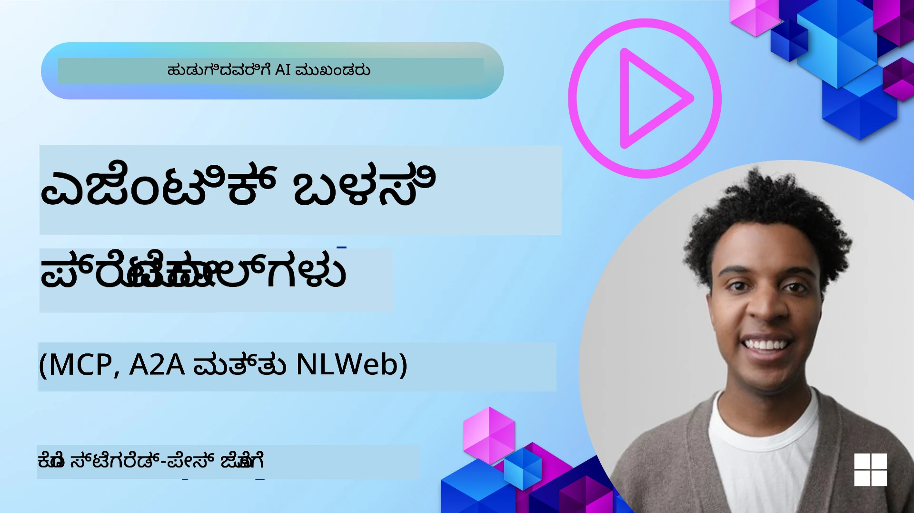
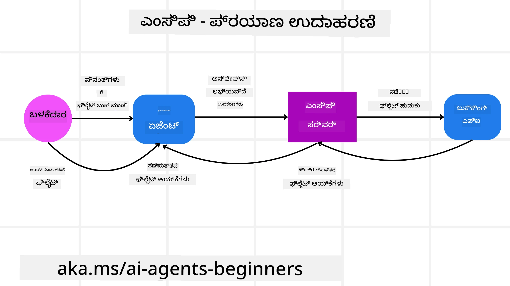
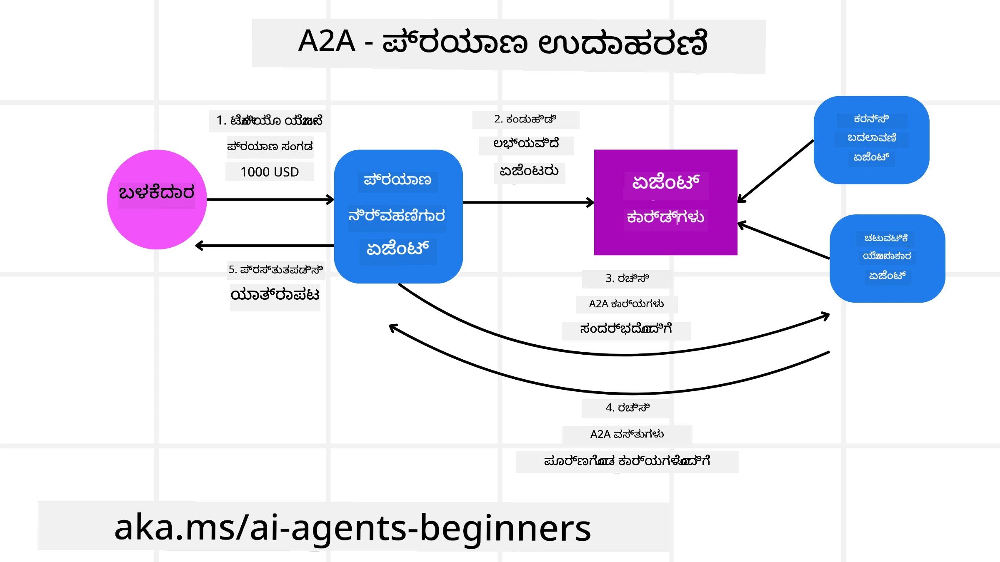
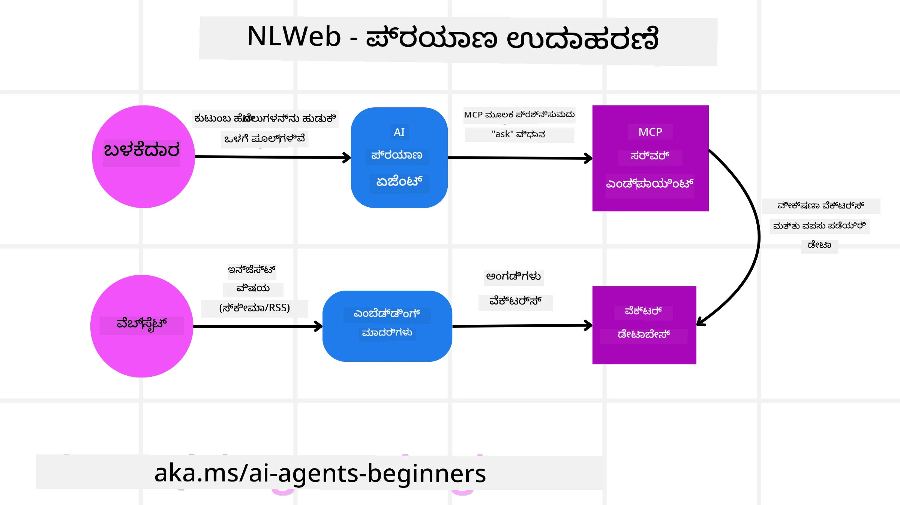

# Agentic ಪ್ರೊಟೋಕಾಲ್‌ಗಳನ್ನು ಬಳಸುವುದು (MCP, A2A ಮತ್ತು NLWeb)

> _(ಈ ಪಾಠದ ವೀಡಿಯೋವನ್ನು ವೀಕ್ಷಿಸಲು ಮೇಲಿನ ಚಿತ್ರವನ್ನು ಕ್ಲಿಕ್ ಮಾಡಿ)_

AI ಏಜೆಂಟ್ಗಳ ಬಳಕೆ ಬೆಳೆಯುತ್ತಿರುವಂತೆ, ಮಾನkiIಕರಣ, ಭದ್ರತೆ ಮತ್ತು ಮುಕ್ತ ಡೆವಲಪ್‌ಮೆಂಟ್‌ನ್ನು ಬೆಂಬಲಿಸುವ ಪ್ರೊಟೋಕಾಲ್‌ಗಳ ಅಗತ್ಯವೂ ಹೆಚ್ಚುತ್ತಿದೆ. ಈ ಪಾಠದಲ್ಲಿ, ಈ ಅಗತ್ಯವನ್ನು ಪೂರೈಸಲು ಉದ್ದೇಶಿಸಿರುವ 3 ಪ್ರೊಟೋಕಾಲ್‌ಗಳನ್ನು ನಾವು ಪರಿಚಯಿಸೋಣ — Model Context Protocol (MCP), Agent to Agent (A2A) ಮತ್ತು Natural Language Web (NLWeb).

## ಪರಿಚಯ

ಈ ಪಾಠದಲ್ಲಿ ನಾವು ಕವರ್ ಮಾಡೋದ್ದು:

• **MCP** ಹೇಗೆ AI ಏಜೆಂಟ್ಗಳಿಗೆ ಹೊರಗಿನ ಉಪಕರಣಗಳು ಮತ್ತು ದತ್ತಾಂಶಕ್ಕೆ ಪ್ರವೇಶವನ್ನು ಒದಗಿಸುವ ಮೂಲಕ ಬಳಕೆದಾರರ ಕಾರ್ಯಗಳನ್ನು ಪೂರ್ಣಗೊಳಿಸಲು ನೆರವಾಗುತ್ತದೆ ಎಂಬುದನ್ನು.

• **A2A** ಹೀಗೆಯೇ ವಿಭಿನ್ನ AI ಏಜೆಂಟ್‌ಗಳ ನಡುವೆ ಸಂವಹನ ಮತ್ತು ಸಹಕಾರವನ್ನು ಹೇಗೆ സാധ್ಯಗೊಳಿಸುತ್ತದೆ ಎಂಬುದನ್ನು.

• **NLWeb** ಯಾವುದೇ ವೆಬ್‌ಸೈಟ್‌ಗೆ ನೈಸರ್ಗಿಕ ಭಾಷಾ ಇಂಟರ್‌ಫೇಸ್‌ಗಳನ್ನು ತರಿಸುವ ಮೂಲಕ AI ಏಜೆಂಟ್‌ಗಳು ವಿಷಯವನ್ನು ಅನ್ವೇಷಿಸಿ ಸಂವಹನ ನಡೆಸಲು ಹೇಗೆ ಸಾಧ್ಯವಾಗುತ್ತದೆ ಎಂಬುದನ್ನು.

## ಕಲಿಕೆ ಗುರಿಗಳು

• **ಗುರಿ ಗುರುತಿಸು** MCP, A2A, ಮತ್ತು NLWeb ಗಳ ಪ್ರಮುಖ ಉದ್ದೇಶಗಳು ಮತ್ತು ಪ್ರಯೋಜನಗಳನ್ನು AI ಏಜೆಂಟ್ಗಳ ಪ್ರ_CONTEXTನೆಯಲ್ಲಿ.

• **ವಿವರಣೆ ನೀಡಿ** ಪ್ರತಿಯೊಂದು ಪ್ರೊಟೋಕಾಲ್ ಹೇಗೆ LLM, ಉಪಕರಣಗಳು ಮತ್ತು ಇತರ ಏಜೆಂಟ್ಗಳ ನಡುವಣ ಸಂವಹನ ಮತ್ತು ಪರಸ್ಪರ ಕ್ರಿಯೆಯನ್ನು ಸುಗಮಗೊಳಿಸುತ್ತದೆ ಎಂಬುದನ್ನು.

• **ಗುರುತಿಸಿ** ಜಟಿಲ ಏಜೆಂಟಿಕ್ ಸಿಸ್ಟಮ್‌ಗಳ ನಿರ್ಮಾಣದಲ್ಲಿ ಪ್ರತಿ ಪ್ರೊಟೋಕಾಲ್ ಯಾವುದೇ ವಿಭಿನ್ನ ಪಾತ್ರವನ್ನು ನಿಭಾಯಿಸುತ್ತದೆಯೋ ಅವುಗಳನ್ನು.

## Model Context Protocol

**Model Context Protocol (MCP)** ಒಂದು ಮುಕ್ತ ಮಾನಕಿIಕರಣವಾಗಿದ್ದು, ಅಪ್ಲಿಕೇಶನ್‌ಗಳಿಗೆ LLM ಗಳಿಗೆ ತಾತ್ತ್ವಿಕವಾದ ಸಂದರ್ಭ(ಕಾಂಟೆಕ್ಸ್ಟ್) ಮತ್ತು ಉಪಕರಣಗಳನ್ನು ಸ್ಟ್ಯಾಂಡರ್ಡೈಸ್ಡ್ ರೀತಿಯಲ್ಲಿ ಒದಗಿಸಲು ಸಾಧಿಸುತ್ತದೆ. ಇದು ವಿಭಿನ್ನ ದತ್ತಾಸ್ಟೋತ್ರಗಳು ಮತ್ತು ಉಪಕರಣಗಳಿಗೆ AI ಏಜೆಂಟ್‌ಗಳು ಸुसಂಗತ ರೀತಿಯಲ್ಲಿ ಸಂಪರ್ಕಿಸಬಹುದಾದ "ವಿಶ್ವವ್ಯಾಪಿ ಅಡಾಪ್ಟರ್"ನಂತೆ ಕಾರ್ಯನಿರ್ವಹಿಸಲು ಅನುಮತಿಸುತ್ತದೆ.

MCP ಯ ಘಟಕಗಳು, ನೇರ API ಬಳಕೆಯೊಂದಿಗೆ ಹೊಂದಿರುವ ಲಾಭಗಳು ಮತ್ತು AI ಏಜೆಂಟ್‌ಗಳು MCP ಸರ್ವರ್ ಅನ್ನು ಹೇಗೆ ಬಳಸಬಹುದು ಎಂಬ ಉದಾಹರಣೆಯನ್ನು ನೋಡೋಣ.

### MCP ಮೂಲ ಘಟಕಗಳು

MCP ಒಂದು **ಗ್ರಾಹಕ-ಸರ್ವರ್ ವಾಸ್ತುಶಿಲ್ಪ**ದಲ್ಲಿ ಕಾರ್ಯನಿರ್ವಹಿಸುತ್ತದೆ ಮತ್ತು ಮೂಲ ಘಟಕಗಳು ಇವು:

• **ಹೋಸ್ಟ್‌ಗಳು** (Hosts) LLM ಆಪ್ಲಿಕೇಶನ್ಗಳು (ಉದಾಹರಣೆಗೆ VSCode ನಂತಹ ಕೋಡ್ ಎಡಿಟರ್) ಇವು MCP ಸರ್ವರ್ ಗೆ ಸಂಪರ್ಕ ಪ್ರಾರಂಭಿಸುತ್ತವೆ.

• **ಕ್ಲೈಂಟ್‌ಗಳು** (Clients) ಹೋಸ್ಟ್ ಅಪ್ಲಿಕೇಶನ್ ಒಳಗಿನ ಘಟಕಗಳು, ಸರ್ವರ್‌ಗಳೊಂದಿಗೆ ಒನ್-ಟು-ಒನ್ ಸಂಪರ್ಕಗಳನ್ನು ಕಾಯ್ದಿರಿಸುತ್ತವೆ.

• **ಸರ್ವರ್‌ಗಳು** (Servers) ನಿರ್ದಿಷ್ಟ ಸಾಮರ್ಥ್ಯಗಳನ್ನು ಬಹಿರಂಗಗೊಳಿಸುವ ಹೊಮ್ಮಲಾದ ಕಾರ್ಯಕ್ರಮಗಳಾಗಿವೆ.

ಪ್ರೊಟೋಕಾಲ್‌ನಲ್ಲಿ ಮೂರು ಮೂಲ ಪ್ರಿಮಿಟಿವೆಗಳಿವೆ, ಅವು MCP ಸರ್ವರ್‌ನ ಸಾಮರ್ಥ್ಯಗಳಾಗಿವೆ:

• **ಉಪಕರಣಗಳು**: AI ಏಜೆಂಟ್ ಒಂದು ಕ್ರಿಯೆಯನ್ನು ನೆರವೇರಿಸಲು ಕರೆ ಮಾಡಬಹುದಾದ ವಿಭಜಿತ ಕ್ರಿಯೆಗಳು ಅಥವಾ ಫಂಕ್ಷನ್‌ಗಳು. ಉದಾಹರಣೆಗೆ, ಹವಾಮಾನ ಸೇವೆ "get weather" ಉಪಕರಣವನ್ನು ಬಹಿರಂಗಗೊಳಿಸಬಹುದು, ಅಥವಾ e-commerce ಸರ್ವರ್ "purchase product" ಉಪಕರಣವನ್ನು ಬಹಿರಂಗಗೊಳಿಸಬಹುದು. MCP ಸರ್ವರ್‌ಗಳು তাদের capabilities ಪಟ್ಟಿಯಲ್ಲಿ ಪ್ರತಿ ಉಪಕರಣದ ಹೆಸರು, ವಿವರಣೆ ಮತ್ತು ಇನ್‌ಪುಟ್/ಔಟ್‌ಪುಟ್ ಸ್ಕೀಮಾ ಅನ್ನು ಪ್ರಕಟಿಸುತ್ತವೆ.

• **ಸಂಪನ್ಮೂಲಗಳು**: MCP ಸರ್ವರ್ ಒದಗಿಸಬಹುದಾದ ಓದಲು-ಮಾತ್ರದ ದತ್ತಾಂಶ ಐಟಮ್‌ಗಳು ಅಥವಾ ದಸ್ತಾವೇಜುಗಳು; ಕ್ಲೈಂಟ್‌ಗಳು ಅವನ್ನು ಅಗತ್ಯದಂತೆ ಪಡೆದುಕೊಳ್ಳಬಹುದು. ಉದಾಹರಣೆಗಳಾಗಿ ಫೈಲ್ ವಿಷಯಗಳು, ಡೇಟಾಬೇಸ್ ದಾಖಲೆಗಳು ಅಥವಾ ಲಾಗ್ ಫೈಲ್‌ಗಳು. ಸಂಪನ್ಮೂಲಗಳು ಪಠ್ಯ (ಕೋಡ್ ಅಥವಾ JSON ಹೀಗೆ) ಅಥವಾ ಬೈನರಿ (ಚಿತ್ರಗಳು ಅಥವಾ PDFs ಹೀಗೆ) ಆಗಿರಬಹುದು.

• **ಪ್ರಾಂಪ್ಟ್‌ಗಳು**: ಪೂರ್ವನಿರ್ಧರಿತ ಟೆಂಪ್ಲೇಟುಗಳು, ურსೆಗಳಿಗಾಗಿ ಸೂಚಿತ ಪ್ರಾಂಪ್ಟ್‌ಗಳನ್ನು ಒದಗಿಸುತ್ತವೆ ಮತ್ತು ಹೆಚ್ಚು ಸಂಕೀರ್ಣ ವರ್ಕ್‌ಫ್ಲೋಗಳನ್ನು ಅನುಕೂಲ ಮಾಡಿಸುತ್ತವೆ.

### MCP ನ ಪ್ರಯೋಜನಗಳು

MCP AI ಏಜೆಂಟ್‌ಗಳಿಗೆ ಗಮನಾರ್ಹ ಪ್ರಯೋಜನಗಳನ್ನು ನೀಡುತ್ತದೆ:

• **ಡೈನಾಮಿಕ್ ಟೂಲ್ ಕಂಡುಹಿಡಿಯುವಿಕೆ**: ಏಜೆಂಟ್‌ಗಳು ಸರ್ವರ್‌ಗಳಿಂದ ಲಭ್ಯವಿರುವ ಉಪಕರಣಗಳ ಪಟ್ಟಿಯನ್ನು ಹಾಗೂ ಅವು ಏನು ಮಾಡುತ್ತವೆ ಎಂಬ ವಿವರಣೆಗಳನ್ನು ಡೈನಾಮಿಕವಾಗಿ ಪಡೆದುಕೊಳ್ಳಬಹುದು. ಪರಂಪರাগত API ಗಳೊಂದಿಗೆ ಸಂಬಂಧಿಸಿದಂತೆ, ಅವು ಸಾಮಾನ್ಯವಾಗಿ ಇಂಟಿಗ್ರೇಶನ್‌ಗಳಿಗೆ ಸ್ಥಿರ ಕೋಡಿಂಗ್ ಅಗತ್ಯವಿರುತ್ತದೆ ಮತ್ತು ಯಾವುದೇ API ಬದಲೆ ಏನೆಂದರೆ ಕೋಡ್ ಅಪ್ಡೇಟ್‌ಗಳು ಬೇಕಾಗುತ್ತವೆ. MCP ಒಂದು "ಒಮ್ಮೆ ಏನು ಇಂಟಿಗ್ರೇಟ್ ಮಾಡಿ" ಎಂಬ ನಾಂದಿದ ಗೌರವ ನೀಡುತ್ತದೆ, ಇದು ಹೆಚ್ಚು ಹೊಂದಿಕೊಳ್ಳುವಿಕೆಯನ್ನು ತರುತ್ತದೆ.

• **ವಿಭಿನ್ನ LLM ಗಳ ನಡುವೆ ಇಂಟರ್‌ಆಪೆರಬಿಲಿಟಿ**: MCP ವಿಭಿನ್ನ LLM ಗಳ ಮಧ್ಯೆ ಕಾರ್ಯನಿರ್ವಹಿಸುತ್ತದೆ, ಉತ್ತಮ ಕಾರ್ಯಕ್ಷಮತೆಯನ್ನು ಪರಿಶೀಲಿಸಲು ಕೋರ್ ಮಾದರಿಗಳನ್ನು ಬದಲಾಯಿಸುವ ಲವಚಿಕತೆಯನ್ನು ಒದಗಿಸುತ್ತದೆ.

• **ಸ್ಟ್ಯಾಂಡರ್ಡೈಸ್‌ಡ್ ಭದ್ರತೆ**: MCP ಒಂದು ಸ್ಟ್ಯಾಂಡರ್ಡ್ ಪ್ರಾಮಾಣೀಕರಣ ವಿಧಾನವನ್ನು ಒಳಗೊಂಡಿದೆ, ಹೆಚ್ಚುವರಿ MCP ಸರ್ವರ್‌ಗಳಿಗೆ ಪ್ರವೇಶದ scalability ಸುಧಾರಿಸುತ್ತದೆ. ಇದು ವಿವಿಧ ಪರಂಪರাগত API ಗಾಗಿ ವಿಭಿನ್ನ ಕೀಗಳು ಮತ್ತು ಪ್ರಾಮಾಣೀಕರಣ ವಿಧಗಳನ್ನು ನಿರ್ವಹಿಸುವದಕ್ಕಿಂತ ಸರಳವಾಗಿದೆ.

### MCP ಉದಾಹರಣೆ

ಏಕೆಂದರೆ ಬಳಕೆದಾರನು MCP ಮೂಲಕ ಚಲಾಯಿಸುವ AI ಸಹಾಯಕದಿಂದ ವಿಮಾನ ಹಕ್ಕು ಬುಕ್ಕಿಂಗ್ ಮಾಡಲು ಬಯಸುತ್ತಾನೆ ಎಂದು ಕಲ್ಪಿಸೋಣ.

1. **ಸಂಪರ್ಕ**: AI ಸಹಾಯಕ (MCP ಕ್ಲೈಂಟ್) ಏರ್‌ಲೈನ್ ಒದಗಿಸಿರುವ MCP ಸರ್ವರ್‌ಗೆ ಸಂಪರ್ಕ ಕಲ್ಪಿಸುತ್ತದೆ.

2. **ಉಪಕರಣ ಕಂಡುಹಿಡಿಯುವಿಕೆ**: ಕ್ಲೈಂಟ್ ಏರ್‌ಲೈನ್‌ನ MCP ಸರ್ವರ್‌ಗೆ, "ನಿಮ್ಮ ಬಳಿ ಯಾವ ಉಪಕರಣಗಳಿವೆ?" ಎಂದು ಕೇಳುತ್ತದೆ. ಸರ್ವರ್ "search flights" ಮತ್ತು "book flights" ಹೀಗೆ ಉಪಕರಣಗಳನ್ನು ಪ್ರತಿಕ್ರಿಯಿಸುತ್ತದೆ.

3. **ಉಪಕರಣ ಕರೆಯುವಿಕೆ**: ನಂತರ ನೀವು AI ಸಹಾಯಕನಿಗೆ, "ದಯವಿಟ್ಟು Portland ನಿಂದ Honolulu ಗೆ ವಿಮಾನವನ್ನು ಹುಡುಕಿ" ಎಂದು ಕೇಳುತ್ತೀರಿ. AI ಸಹಾಯಕದ LLM ಬಳಸಿಕೊಂಡು, ಅದು "search flights" ಉಪಕರಣವನ್ನು ಕರೆ ಮಾಡಬೇಕೆಂದು ಗುರುತಿಸಿ ಸಂಬಂಧಿಸಿದ ಪಾರಾಮೀಟರ್‌ಗಳನ್ನು (ಆರಿಜಿನ್, ಡೆಸ್ಟಿನೇಶನ್) MCP ಸರ್ವರ್‌ಗೆ ಕಳುಹಿಸುತ್ತದೆ.

4. **ನಿರ್ವಹಣೆ ಮತ್ತು ಪ್ರತಿಕ್ರಿಯೆ**: MCP ಸರ್ವರ್ ರ್ಯಾಪರ್‌ನಂತೆ ಕಾರ್ಯನಿರ್ವಹಿಸಿ ಏರ್‌ಲೈನ್‌ನ ಆಂತರಿಕ ಬುಕ್ಕಿಂಗ್ API ಗೆ ನೇರ ಕರೆ ಮಾಡುತ್ತದೆ. ನಂತರ ಅದು ವಿಮಾನ ಮಾಹಿತಿಯನ್ನು (ಉದಾ., JSON ದತ್ತಾಂಶ) ಪಡೆಯುತ್ತದೆ ಮತ್ತು AI ಸಹಾಯಕಗೆ ಕಳುಹಿಸುತ್ತದೆ.

5. **ಮುಂದುವರೆದ ಸಂವಹನ**: AI ಸಹಾಯಕ ವಿಮಾನ ಆಯ್ಕೆಗಳನ್ನು ತೋರಿಸುತ್ತದೆ. ನೀವು ಒಂದು ವಿಮಾನ ಆಯ್ಕೆಮಾಡಿದ ಮೇಲೆ, ಸಹಾಯಕ ಅದೇ MCP ಸರ್ವರ್‌ನಲ್ಲಿ "book flight" ಉಪಕರಣವನ್ನು ಕರೆ ಮಾಡಬಹುದು ಮತ್ತು ಬುಕ್ಕಿಂಗ್ ಪೂರ್ಣಗೊಳ್ಳುತ್ತದೆ.

## Agent-to-Agent Protocol (A2A)

MCP LLM ಗಳು ಮತ್ತು ಉಪಕರಣಗಳನ್ನು ಸಂಪರ್ಕಿಸುವುದರಲ್ಲಿ ಗಮನ ಹರಿಸುವಾಗ, **Agent-to-Agent (A2A) ಪ್ರೊಟೋಕಾಲ್** ಅದ್ದೊಂದು ಹೆಜ್ಜೆ ಮುಂದೆ ಹೋಗಿ ವಿಭಿನ್ನ AI ಏಜೆಂಟ್‌ಗಳ ನಡುವಿನ ಸಂವಹನ ಮತ್ತು ಸಹಕಾರವನ್ನು ಸಾಧ್ಯಮಾಡುತ್ತದೆ. A2A ವಿವಿಧ ಸಂಸ್ಥೆಗಳು, ಪರಿಸರಗಳು ಮತ್ತು ತಂತ್ರಜ್ಞಾನ ಸ್ಟ್ಯಾಕ್‌ಗಳ ನಡುವೆ AI ಏಜೆಂಟ್‌ಗಳನ್ನು ಸಂಪರ್ಕಿಸಿ ಸಾಮೂಹಿಕ ಕಾರ್ಯವನ್ನು ಪೂರ್ಣಗೊಳಿಸಲು ನೆರವಾಗುತ್ತದೆ.

ನಾವು A2A ಯ ಘಟಕಗಳು ಮತ್ತು ಪ್ರಯೋಜನಗಳನ್ನು ಮತ್ತು ನಮ್ಮ ಟ್ರಾವೆಲ್ ಅಪ್ಲಿಕೇಶನ್ ಉದಾಹರಣೆಯಲ್ಲಿನ ಅನ್ವಯವನ್ನು ಪರೀಕ್ಷಿಸೋಣ.

### A2A ಮೂಲ ಘಟಕಗಳು

A2A ಏಜೆಂಟ್‌ಗಳ ನಡುವೆ ಸಂವಹನವನ್ನು ಸಕ್ರಿಯಗೊಳಿಸುವದಕ್ಕೆ ಮತ್ತು ಅವುಗಳನ್ನು ಬಳಕೆದಾರನ ಉಪಕಾರ್ಯದ ಉಪಕಾರ್ಯಗಳನ್ನು ಪೂರ್ಣಗೊಳಿಸಲು ಒಟ್ಟಿಗೆ ಕೆಲಸ ಮಾಡುವಂತೆ ಮಾಡುತ್ತದೆ. ಪ್ರತಿ ಘಟಕ ಈ ಪ್ರೊಟೋಕಾಲ್‌ಗೆ ಈ ರೀತಿ ಕೊಡುಗೆ ನೀಡುತ್ತದೆ:

#### ಏಜೆಂಟ್ ಕಾರ್ಡ್

MCP ಸರ್ವರ್ ಹೇಗೆ ಉಪಕರಣಗಳ ಪಟ್ಟಿಯನ್ನು ಹಂಚಿಕೊಳ್ಳುತ್ತದೆ ಎಂಬುದರಂತೆ, ಏಜೆಂಟ್ ಕಾರ್ಡ್‌ನಲ್ಲಿ ಈವರೆ:

- ಏಜೆಂಟ್‌ನ ಹೆಸರು.
- ಅದು ಸಾಮಾನ್ಯವಾಗಿ ಪೂರ್ಣಗೊಳಿಸುವ ಕಾರ್ಯಗಳ ವರ್ಣನೆ.
- ಇತರ ಏಜೆಂಟ್‌ಗಳು (ಅಥವಾ ಮಾನವ ಬಳಕೆದಾರರು) ಯಾವಾಗ ಮತ್ತು ಏಕೆ ಆ ಏಜೆಂಟ್ ಅನ್ನು ಕರೆಮಾಡಬೇಕು ಎಂಬುದನ್ನು ಸಹಾಯಮಾಡುವ ವಿವರಣೆಗಳೊಂದಿಗೆ ವಿಶೇಷ ಕೌಶಲ್ಯಗಳ ಪಟ್ಟಿಯೊಂದು.
- ಏಜೆಂಟ್‌ನ ಪ್ರಸ್ತುತ Endpoint URL
- ಏಜೆಂಟ್‌ನ ಆವೃತ್ತಿ ಮತ್ತು ಸಾಮರ್ಥ್ಯಗಳು, ಉದಾಹರಣೆಗೆ ಸ್ಟ್ರೀಮಿಂಗ್ ಪ್ರತಿಕ್ರಿಯೆಗಳು ಮತ್ತು ಪುಶ್ ನೋಟಿಫಿಕೇಶನ್ಗಳು.

#### ಏಜೆಂಟ್ ಎಕ್ಸಿಕ್ಯೂಟರ್

ಏಜೆಂಟ್ ಎಕ್ಸಿಕ್ಯೂಟರ್ ದೆ ಸಂಭಾಳಿಸುವುದು **ಬಯಲಿನ ಏಜೆಂಟ್‌ಗೆ ಬಳಕೆದಾರ ಚಾಟ್ ಕಾಂಟೆಕ್ಸ್ಟ್ ಅನ್ನು ಪಾಸು ಮಾಡುವುದು**; ದೂರದ ಏಜೆಂಟ್‌ಗೆ ಈ ಕಾರ್ಯವನ್ನು ಅರ್ಥಮಾಡಿಕೊಳ್ಳಲು ಇದು ಅಗತ್ಯ. A2A ಸರ್ವರ್‌ನಲ್ಲಿ, ಒಂದು ಏಜೆಂಟ್ ತನ್ನದೇ LLM ಅನ್ನು ಬಳಸಿ ಒಳಹೊರಗಿನ ವಿನಂತಿಗಳನ್ನು ಪಾರ್ಸ್ ಮಾಡಿ ತನ್ನ ಆಂತರಿಕ ಉಪಕರಣಗಳನ್ನು ಬಳಸಿಕೊಂಡು ಕಾರ್ಯಗಳನ್ನು ನಿರ್ವಹಿಸುತ್ತದೆ.

#### ಆರ್ಟಿಫ್ಯಾಕ್ಟ್

ಒಂದು ದೂರದ ಏಜೆಂಟ್ ವಿನಂತಿಸಿದ ಕಾರ್ಯವನ್ನು ಪೂರ್ಣಗೊಳಿಸಿದ ನಂತರ, ಅದರ ಕೆಲಸದ ಉತ್ಪನ್ನವನ್ನು ಆರ್ಟಿಫ್ಯಾಕ್ಟ್ ಎಂದು ರಚಿಸಲಾಗುತ್ತದೆ. ಒಂದು ಆರ್ಟಿಫ್ಯಾಕ್ಟ್‌ನಲ್ಲಿ **ಏಜೆಂಟ್‌ನ ಕಾರ್ಯದ ಫಲಿತಾಂಶ** ಉಂಟು, **ಯಾವುದನ್ನು ಪೂರ್ಣಗೊಳಿಸಲಾಯಿತು ಎಂಬ ವಿವರಣೆ**, ಮತ್ತು ಪ್ರೋಟೋಕಾಲ್ ಮೂಲಕ ಕಳುಹಿಸಲಾದ **ಪಠ್ಯ ಕಾಂಟೆಕ್ಸ್ಟ್** ಇದ್ದೇ ಇರುತ್ತದೆ. ಆರ್ಟಿಫ್ಯಾಕ್ಟ್ ಕಳುಹಿಸಿದ ಬಳಿಕ, ಅವಶ್ಯಕತೆಗಾಗುವವರೆಗೆ ದೂರದ ಏಜೆಂಟ್‌ನೊಂದಿಗೆ ಸಂಪರ್ಕ ಮುಚ್ಚಲಾಗುತ್ತದೆ.

#### ಈವೆಂಟ್ ಕ್ಯೂ

ಈ ಘಟಕವು **ನವೀಕರಣಗಳನ್ನು ಸಂಭಾಳಿಸುವುದು ಮತ್ತು ಸಂದೇಶಗಳನ್ನು ಹಂಚುವುದು** ನೋಡಿಕೊಳ್ಳುತ್ತದೆ. ವಿಶೇಷವಾಗಿ ಉತ್ಥಾಪನದಲ್ಲಿರುವ ಏಜೆಂಟಿಕ್ ಸಿಸ್ಟಮ್‌ಗಳಲ್ಲಿ, ಕಾರ್ಯ ಪೂರ್ಣಗೊಳ್ಳುವವರೆಗೂ ಏಜೆಂಟ್ಗಳ ನಡುವಣ ಸಂಪರ್ಕ ಮುಚ್ಚದಂತೆ ಕಾಯುವುದಕ್ಕಾಗಿ ಇದು ಬಹಳ ಮುಖ್ಯ, ಏಕೆಂದರೆ ಕೆಲವು ಕಾರ್ಯಗಳ ಸ್ವಲ್ಪ ಹೆಚ್ಚು ಸಮಯ ಹಿಡಿಯಬಹುದು.

### A2A ಯ ಪ್ರಯೋಜನಗಳು

• **ಮೇಕಲಾದ ಸಹಕಾರ**: ವಿಭಿನ್ನ vendor ಗಳು ಮತ್ತು ವೇದಿಕೆಗಳ ಏಜೆಂಟ್‌ಗಳಿಗೆ ಪರಸ್ಪರ ಸಂವಹನ, ಕಾಂಟೆಕ್ಸ್ಟ್ ಹಂಚಿಕೊಳ್ಳುವಿಕೆ ಮತ್ತು ಒಟ್ಟಾಗಿ ಕೆಲಸ ಮಾಡುವ ಸಾಮರ್ಥ್ಯ ಒದಗಿಸುತ್ತದೆ, ಪರಂಪರಾ ಬಳಸುವ ವ್ಯವಸ್ಥೆಗಳಲ್ಲಿ ನಿಭಾಯಿಸದ ಸ್ವಯಂಚಾಲಿತತೆಗೆ ಸಹಾಯಮಾಡುತ್ತದೆ.

• **ಮಾದರಿ ಆಯ್ಕೆ ಲವಚಿಕತೆ**: ಪ್ರತಿಯೊಂದು A2A ಏಜೆಂಟ್ ತನ್ನ ವಿನಂತಿಗಳನ್ನು ಸೇವೆಗೈಯಲು ಯಾವ LLM ಅನ್ನು ಬಳಸುವುದು ಎಂದು ತಾನೇ ನಿರ್ಧರಿಸಬಹುದು, ಇದು ಪ್ರತಿ ಏಜೆಂಟ್ ಗೆ ಅನುಗುಣವಾದ ಅಥವಾ ಫೈನ್-ಟ್ಯೂನಡ್ ಮಾದರಿಗಳನ್ನು ಬಳಸಲು ಅವಕಾಶ ನೀಡುತ್ತದೆ, MCP ಸಂದರ್ಭದಲ್ಲಿ ಕೆಲವು ಸಂಜ್ಞೆಗಳಲ್ಲಿ ಒಂದೇ LLM ಸಂಪರ್ಕ ಇರುವುದಿಲ್ಲ.

• **ಒಳನಿರ್ಮಿತ ಪ್ರಾಮಾಣೀಕರಣ**: ಪ್ರಾಮಾಣೀಕರಣವು ನೇರವಾಗಿ A2A ಪ್ರೊಟೋಕಾಲ್‌ಗೆ ಎम्बೆಡ್ ಆಗಿದೆ, ಏಜೆಂಟ್ ಸಂವಹನಗಳಿಗೆ ಬಲವಾದ ಭದ್ರತಾ ಫ್ರೇಮ್ವರ್ಕ್ ಅನ್ನು ಒದಗಿಸುತ್ತದೆ.

### A2A ಉದಾಹರಣೆ

ನಮ್ಮ ಪ್ರಯಾಣ ಬುಕ್ಕಿಂಗ್ ದೃಶ್ಯವನ್ನು ವಿಸ್ತರಿಸುತ್ತೇವೆ, ಆದರೆ ಈ ಬಾರಿ A2A ಬಳಸಿ.

1. **ಬಳಕೆದಾರ ವಿನಂತಿ ಮಲ್ಟಿ-ಏಜೆಂಟ್‌ಗೆ**: ಬಳಕೆದಾರನು "ದಯವಿಟ್ಟು ಮುಂದಿನ ವಾರ Honolulu ಗೆ ಸಂಪೂರ್ಣ ಪ್ರಯಾಣವನ್ನು ಬುಕ್ ಮಾಡಿ, ವಿಮಾನಗಳು, ಒಂದು ಹೋಟೆಲ್ ಮತ್ತು ರೆಂಟಲ್ ಕಾರ್ ಸೇರಿ" ಎಂದು ಹೇಳಿ "ಟ್ರಾವೆಲ್ ಏಜೆಂಟ್" A2A ಕ್ಲೈಂಟ್/ಏಜೆಂಟ್‌ನೊಂದಿಗೆ ಸಂವಹನ ಮಾಡಬಹುದು.

2. **ಟ್ರಾವೆಲ್ ಏಜೆಂಟ್ ಮೂಲಕ ಒರ್ಕೆಸ್ಟ್ರೇಶನ್**: ಟ್ರಾವೆಲ್ ಏಜೆಂಟ್ ಈ ಸಂಕೀರ್ಣ ವಿನಂತಿಯನ್ನು ಪಡೆಯುತ್ತದೆ. ಅದರ LLM ಉಪಯೋಗಿಸಿ ಕಾರ್ಯವನ್ನು ನಿರ್ಧರಿಸುತ್ತದೆ ಮತ್ತು ಅದು ವಿಶೇಷ ಏಜೆಂಟ್‌ಗಳ ಜೊತೆ ಸಂವಹನ ಮಾಡಬೇಕೆಂದು ತೀರ್ಮಾನಿಸುತ್ತದೆ.

3. **ಏಜೆಂಟ್‌ಗಳ ನಡುವಣ ಸಂವಹನ**: ಟ್ರಾವೆಲ್ ಏಜೆಂಟ್ ನಂತರ A2A ಪ್ರೊಟೋಕಾಲ್ ಬಳಸಿ ಡೌನ್‌ಸ್ಟ್ರೀಮ್ ಏಜೆಂಟ್‌ಗಳಿಗೆ, ಉದಾಹರಣೆಗೆ "Airline Agent", "Hotel Agent", ಮತ್ತು "Car Rental Agent" ಗಳಿಗೆ ಸಂಪರ್ಕ ಮಾಡುತ್ತದೆ — ಇವು ಬೇರೆ ಬೇರೆ ಕಂಪನಿಗಳಿಂದ ರಚಿಸಲ್ಪಟ್ಟಿರಬಹುದು.

4. **ಹಣಿಕೆಯಾಗಿಸಿದ ಕಾರ್ಯ ನಿರ್ವಹಣೆ**: ಟ್ರಾವೆಲ್ ಏಜೆಂಟ್ ಈ ವಿಶೇಷ ಏಜೆಂಟ್‌ಗಳಿಗೆ ನಿಗದಿತ ಕಾರ್ಯಗಳನ್ನು ಕಳುಹಿಸುತ್ತದೆ (ಉದಾ., "Find flights to Honolulu", "Book a hotel", "Rent a car"). ಪ್ರತ್ಯೇಕವಾದ ಈ ಏಜೆಂಟ್‌ಗಳು ತಮ್ಮದೇ LLM ಗಳು ಮತ್ತು ತಮ್ಮದೇ ಉಪಕರಣಗಳನ್ನು (ಅವು MCP ಸರ್ವರ್‌ಗಳಾಗಿರಬಹುದೇ) ಬಳಸಿಕೊಂಡು ಬುಕ್ಕಿಂಗ್‌ನ ತಮ್ಮ ಭಾಗವನ್ನು ನಿರ್ವಹಿಸುತ್ತವೆ.

5. **ಸಂಗ್ರಹಿತ ಪ್ರತಿಕ್ರಿಯೆ**: ಎಲ್ಲಾ ಡೌನ್‌ಸ್ಟ್ರೀಮ್ ಏಜೆಂಟ್‌ಗಳು ತಮ್ಮ ಕೆಲಸವನ್ನು ಪೂರ್ಣಗೊಳಿಸಿದ ನಂತರ, ಟ್ರಾವೆಲ್ ಏಜೆಂಟ್ ಫಲಿತಾಂಶಗಳನ್ನು (ವಿಮಾನ ವಿವರಗಳು, ಹೋಟೆಲ್ ದೃಢತರಣ, ಕಾರ್ ರೆಂಟಲ್ ಬುಕ್ಕಿಂಗ್) ಸಂಯೋಜಿಸಿ ಬಳಕೆದಾರರಿಗೆ ಸಮಗ್ರ, ಚಾಟ಼್್ ಶೈಲಿಯ ಪ್ರತಿಕ್ರಿಯೆಯನ್ನು ಕಳುಹಿಸುತ್ತದೆ.

## Natural Language Web (NLWeb)

ವೆಬ್‌ಸೈಟ್‌ಗಳು ಇಂಟರ್ನೆಟ್‌ನಲ್ಲಿ ಬಳಕೆದಾರರು ಮಾಹಿತಿಯನ್ನು ಮತ್ತು ದತ್ತಾಂಶವನ್ನು ಪ್ರವೇಶಿಸಲು ಪ್ರಮುಖ ಮಾಧ್ಯಮವಾಗಿವೆ.

ನಾವು NLWeb ನ ವಿಭಿನ್ನ ಘಟಕಗಳನ್ನು, NLWeb ನ ಪ್ರಯೋಜನಗಳನ್ನು ಮತ್ತು ನಮ್ಮ ಟ್ರಾವೆಲ್ ಅಪ್ಲಿಕೇಶನ್ ಮೂಲಕ NLWeb ಹೇಗೆ ಕಾರ್ಯನಿರ್ವಹಿಸುತ್ತದೆ ಎಂಬುದನ್ನು ಉದಾಹರಣೆಯೊಂದಿಗೆ ನೋಡೋಣ.

### NLWeb ಯ ಘಟಕಗಳು

- **NLWeb ಅಪ್ಲಿಕೇಶನ್ (ಕೋರ್ ಸರ್ವಿಸ್ ಕೋಡ್)**: ನೈಸರ್ಗಿಕ ಭಾಷಾ ಪ್ರಶ್ನೆಗಳನ್ನು ಪ್ರಕ್ರಿಯೆಗೊಳಿಸುವ ವ್ಯವಸ್ಥೆ. ಇದು ವೇದಿಕೆಯ ವಿವಿಧ ಭಾಗಗಳನ್ನು ಸಂಪರ್ಕಿಸಿ ಪ್ರತಿಕ್ರಿಯೆಗಳನ್ನು ರಚಿಸುತ್ತದೆ. ನೀವು ಇದನ್ನು ವೆಬ್ ಸೈಟ್‌ನ ನೈಸರ್ಗಿಕ ಭಾಷಾ ವೈಶಿಷ್ಟ್ಯಗಳ ಕಾರ್ಯಚಾಲಕ ಎಂಜಿನ್ ಎಂದು ಯೋಚಿಸಬಹುದು.

- **NLWeb ಪ್ರೊಟೋಕಾಲ್**: ವೆಬ್‌ಸೈಟ್ ಸಹಿತ ನೈಸರ್ಗಿಕ ಭಾಷಾ ಸಂವಹನಕ್ಕೆ ಒಂದು **ಮೂಲ ನಿಯಮಗಳ ಸೆಟ್**. ಇದು ಪ್ರತಿಕ್ರಿಯೆಗಳನ್ನು JSON ಫಾರ್ಮಾಟ್‌ನಲ್ಲಿ (ಬಹುಶಃ Schema.org ಅನ್ನು ಬಳಸಿ) ಕಳುಹಿಸುತ್ತದೆ. ಇದರಿಂದ “AI ವೆಬ್” ಗೆ ಸರಳ ಆಧಾರವನ್ನು ಸೃಷ್ಟಿಸುವ ಉದ್ದೇಶ ಇದೆ, HTML ಆನ್ಲೈನಿನಲ್ಲಿ ಡಾಕ್ಯುಮೆಂಟ್‌ಗಳನ್ನು ಹಂಚಿಕೊಳ್ಳಲು ಸಾಧ್ಯವ 만든ುದರಂತೆ.

- **MCP ಸರ್ವರ್ (Model Context Protocol Endpoint)**: ಪ್ರತಿ NLWeb ಸೆಟಪ್ ಕೂಡ MCP ಸರ್ವರ್ ಆಗಿ ಕಾರ್ಯನಿರ್ವಹಿಸುತ್ತದೆ. ಇದರರ್ಥ ಇದು **ಉಪಕರಣಗಳು (ಹೆಚ್ "ask" ವಿಧಾನ) ಮತ್ತು ದತ್ತಾಂಶವನ್ನು** ಇತರ AI ವ್ಯವಸ್ಥೆಯೊಂದಿಗೆ ಹಂಚಿಕೊಳ್ಳಬಹುದು. ಪ್ರಾಯೋಗಿಕವಾಗಿ, ಇದು ವೆಬ್‌ಸೈಟ್‌ನ ವಿಷಯ ಮತ್ತು ಸಾಮರ್ಥ್ಯಗಳನ್ನು AI ಏಜೆಂಟ್‌ಗಳು ಬಳಸಿಸಬಲ್ಲಂತೆ ಮಾಡುತ್ತದೆ, ಹಾಗೂ ಸೈಟ್ ಅನ್ನು ವಿಶಾಲ “ಏಜೆಂಟ್ ಪರಿಸರ”ದ ಭಾಗವಾದಂತೆ ಮಾಡುತ್ತದೆ.

- **ಎಂಬೆಡ್ಡಿಂಗ್ ಮಾದರಿಗಳು**: ಈ ಮಾದರಿಗಳು ವೆಬ್‌ಸೈಟ್ ವಿಷಯವನ್ನು ಸಂಖ್ಯಾತ್ಮಕ ಪ್ರತಿನಿಧಿಗಳಾದ ವೆಕ್ಟರ್‌ಗಳ (ಎಂಬೆಡ್ಡಿಂಗ್‌ಗಳು) ಆಗಿ ಪರಿವರ್ತಿಸಲು ಬಳಸಲಾಗುತ್ತವೆ. ಈ ವೆಕ್ಟರ್‌ಗಳು ಕಂಪ್ಯೂಟರ್‌ಗಳಿಗೆ ಅರ್ಥ ಸೂಚಿಸುವ ರೀತಿಯಲ್ಲಿ ಹೋಲಿಕೆ ಮತ್ತು ಹುಡುಕಾಟ ಸಾಧ್ಯವಾಗುವಂತೆ ಗ್ರಹಣ ಮಾಡುತ್ತವೆ. ಅವುಗಳನ್ನು ವಿಶೇಷ ಡೇಟಾಬೇಸಿನಲ್ಲಿ ಸಂಗ್ರಹಿಸಲಾಗುತ್ತದೆ, ಮತ್ತು ಬಳಕೆದಾರರು ಯಾವ ಎಂಬೆಡ್ಡಿಂಗ್ ಮಾದರಿಯನ್ನು ಬಳಸಬೇಕೆಂದು ಆಯ್ಕೆ ಮಾಡಬಹುದು.

- **ವೆಕ್ಟರ್ ಡೇಟಾಬೇಸ್ (ರೆಟ್ರೀವಲ್ ಮೆಕಾನಿಸಮ್)**: ಈ ಡೇಟಾಬೇಸ್ ವೆಬ್‌ಸೈಟ್ ವಿಷಯದ ಎಂಬೆಡ್ಡಿಂಗ್‌ಗಳನ್ನು ಸಂಗ್ರಹಿಸುತ್ತದೆ. ಯಾರಾದರೊಂದು ಪ್ರಶ್ನೆ ಕೇಳಿದಾಗ, NLWeb ವೇಕ್ಟರ್ ಡೇಟಾಬೇಸ್ ಅನ್ನು ಪರಿಶೀಲಿಸಿ ಅತ್ಯಂತ ಸಂಬಂಧಿತ ಮಾಹಿತಿಯನ್ನು ઝડપವಾಗಿ ಕಂಡುಹಿಡಿಸುತ್ತದೆ. ಇದು ಸಮಾನತೆಯ ಮೂಲಕ ರ್ಯಾನ್ಕ್ ಮಾಡಿದ ಉತ್ತರಗಳ ವೇಗದ ಪಟ್ಟಿಯನ್ನು ನೀಡುತ್ತದೆ. NLWeb Qdrant, Snowflake, Milvus, Azure AI Search ಮತ್ತು Elasticsearch ಹೀಗೆ ವಿವಿಧ ವೆಕ್ಟರ್ ಸಂಗ್ರಹಣಾ ವ್ಯವಸ್ಥೆಗಳೊಂದಿಗೆ ಕಾರ್ಯನಿರ್ವಹಿಸುತ್ತದೆ.

### NLWeb ಉದಾಹರಣೆ ಮೂಲಕ

ಮತ್ತೊಮ್ಮೆ ನಮ್ಮ ಟ್ರಾವೆಲ್ ಬುಕ್ಕಿಂಗ್ ವೆಬ್‌ಸೈಟ್ ಅನ್ನು ಪರಿಗಣಿಸೋಣ, ಆದರೆ ಈ ಬಾರಿ ಅದು NLWeb ಮೂಲಕ ಚಾಲಿತವಾಗಿದೆ.

1. **ದತ್ತಾ ಇಂಜೆಶನ್**: ಟ್ರಾವೆಲ್ ವೆಬ್‌ಸೈಟ್‌ನ ಇತ್ತೀಚಿನ ಉತ್ಪನ್ನ ಕ್ಯಾಟಲॉग‌ಗಳು (ಉದಾ., ವಿಮಾನ ಪಟ್ಟಿಗಳು, ಹೋಟೆಲ್ ವರ್ಣನೆಗಳು, ಟೂರ್ ಪ್ಯಾಕೇಜ್‌ಗಳು) Schema.org ಮೂಲಕ ಫಾರ್ಮ್ಯಾಟ್ ಮಾಡಲ್ಪಡುವವು ಅಥವಾ RSS ಫೀಡ್‌ಗಳ ಮೂಲಕ ಲೋಡ್ ಆಗುತ್ತವೆ. NLWeb ಉಪಕರಣಗಳು ಈ ರಚಿತ ದತ್ತಾಂಶವನ್ನು ಒಳಗೆ ತೆಗೆದುಕೊಳ್ಳುತ್ತವೆ, ಎಂಬೆಡ್ಡಿಂಗ್‌ಗಳನ್ನು ರಚಿಸಿ ಅವನ್ನು ಸ್ಥಳೀಯ ಅಥವಾ ದೂರದ ವೆಕ್ಟರ್ ಡೇಟಾಬೇಸ್‌ನಲ್ಲಿ ಸಂಗ್ರಹಿಸುತ್ತವೆ.

2. **ನೈಸರ್ಗಿಕ ಭಾಷಾ ಪ್ರಶ್ನೆ (ಮಾನವ)**: ಬಳಕೆದಾರನು ವೆಬ್‌ಸೈಟ್‌ಗೆ ಭೇಟಿ ನೀಡಿ, ಮೆನ್ಯೂಗಳನ್ನು ವಿದಾಯಿಸದೆ ಚಾಟ್ ಇಂಟರ್ಫೇಸ್‌ಗೆ ಟೈಪ್ ಮಾಡುತ್ತಾನೆ: "ಮುಂದಿನ ವಾರಕ್ಕೆ ಕುಂಡಿ ಹೊಂದಿರುವ ಕುಟುಂಬ-ಸ್ನೇಹಿ ಹೋಟೆಲ್ ಸಿಕ್ಕಿಸಿ Honolulu ನಲ್ಲಿ".

3. **NLWeb ಪ್ರೊಸೆಸಿಂಗ್**: NLWeb ಅಪ್ಲಿಕೇಶನ್ ಈ ಪ್ರಶ್ನೆಯನ್ನು ಪಡೆಯುತ್ತದೆ. ಇದು ಪ್ರಶ್ನೆಯನ್ನು ಅರ್ಥಮಾಡಿಕೊಳ್ಳಲು LLM ಗೆ ಕಳುಹಿಸುತ್ತದೆ ಮತ್ತು ಸಮಕಾಲೀನವಾಗಿ ತನ್ನ ವೆಕ್ಟರ್ ಡೇಟಾಬೇಸ್‌ನಲ್ಲಿ ಸಂಬಂಧಿತ ಹೋಟೆಲ್ ಪಟ್ಟಿಗಳನ್ನು ಹುಡುಕುತ್ತದೆ.

4. **ನಿಖರವಾದ ಫಲಿತಾಂಶಗಳು**: LLM ಡೇಟಾಬೇಸ್‌ನ ಹುಡುಕಾಟ ಫಲಿತಾಂಶಗಳನ್ನು ವ್ಯಾಖ್ಯಾನಿಸಲು ಸಹಾಯಮಾಡುತ್ತದೆ, "ಕುಟುಂಬ-ಸ್ನೇಹಿ", "ಕುಂಡಿ", ಮತ್ತು "Honolulu" ಮಾನದಂಡಗಳ ಆಧಾರದಲ್ಲಿ ಉತ್ತಮ ಹೊಂದಾಣಿಕೆಯನ್ನು ಗುರುತಿಸಿ ನಂತರ ನೈಸರ್ಗಿಕ ಭಾಷೆಯ ಪ್ರತಿಕ್ರಿಯೆಯನ್ನು ಫಾರ್ಮ್ಯಾಟ್ ಮಾಡುತ್ತದೆ. ಅತ್ಯಂತ ಮುಖ್ಯವೆಂದರೆ, ಪ್ರತಿಕ್ರಿಯೆ ಸೈಟ್‌ನ ಕ್ಯಾಟಲೋಗ್‌ನ ನೈಜ ಹೋಟೆಲ್‌ಗಳತ್ತ ಉಲ್ಲೇಖ ಮಾಡುತ್ತದೆ ಮತ್ತು ಕಲ್ಪಿತ ಮಾಹಿತಿಯನ್ನು ತಪ್ಪಿಸುತ್ತದೆ.

5. **AI ಏಜೆಂಟ್ ಸಂವಹನ**: NLWeb ಒಂದು MCP ಸರ್ವರ್ ಆಗಿ ಸೇವೆ ನೀಡಿರುವುದರಿಂದ, ಹೊರಗಿನ AI ಟ್ರಾವೆಲ್ ಏಜೆಂಟ್ ಕೂಡ ಈ ವೆಬ್‌ಸೈಟ್‌ನ NLWeb ಉದಾಹರಣೆಗೆ ಸಂಪರ್ಕಿಸಬಹುದು. AI ಏಜೆಂಟ್ ನಂತರ `ask("Are there any vegan-friendly restaurants in the Honolulu area recommended by the hotel?")` ಮೆತ ಆಡಿದ MCP ವಿಧಾನವನ್ನು ಬಳಸಿಕೊಂಡು ನೇರವಾಗಿ ವೆಬ್‌ಸೈಟ್‌ಗೆ ಪ್ರಶ್ನೆ ಕೇಳಬಹುದು. NLWeb ಇನ್ಸ್ಟಾನ್ಸ್ ಇದನ್ನು ಪ್ರಕ್ರಿಯೆಗೊಳಿಸಿ, ತನ್ನ ರೆಸ್ಟೂರಂಟ್ ಮಾಹಿತಿ ಡೇಟಾಬೇಸ್ ಅನ್ನು (ಲೋಡ್ ಆಗಿದ್ದಲ್ಲಿ) ಬಳಸಿಕೊಂಡು ಸಾಂಕೇತಿಕ JSON ಉತ್ತರವನ್ನು ಹಿಂತಿರುಗಿಸುತ್ತದೆ.

### MCP/A2A/NLWeb ಬಗ್ಗೆ ಹೆಚ್ಚಿನ ಪ್ರಶ್ನೆಗಳಿವೆಯೇ?

[Microsoft Foundry Discord](https://aka.ms/ai-agents/discord) に ಸೇರಿ ಇತರ ಕಲಿಕಾರ್ಠಿಗಳೊಡನೆ ಭೇಟಿಯಾಗಲು, ಆಫೀಸ್ ಅವರ್ಸ್‌ಗೆ ಹಾಜರಾಗಲು ಮತ್ತು ನಿಮ್ಮ AI ಏಜೆಂಟ್‌ಗಳ ಕುರಿತು ಪ್ರಶ್ನೆಗಳಿಗೆ ಉತ್ತರ ಪಡೆಯಿರಿ.

## ಸಂಪನ್ಮೂಲಗಳು

- [MCP for Beginners](https://aka.ms/mcp-for-beginners)  
- [MCP Documentation](https://learn.microsoft.com/python/api/overview/azure/ai-projects-readme)
- [NLWeb Repo](https://github.com/nlweb-ai/NLWeb)
- [Microsoft Agent Framework](https://aka.ms/ai-agents-beginners/agent-framewrok)

---

<!-- CO-OP TRANSLATOR DISCLAIMER START -->
ಅಸ್ವೀಕರಣ:
ಈ ಡಾಕ್ಯುಮೆಂಟ್ ಅನ್ನು AI ಅನುವಾದ ಸೇವೆ Co-op Translator (https://github.com/Azure/co-op-translator) ಬಳಸಿ ಅನುವಾದಿಸಲಾಗಿದೆ. ನಾವು ನಿಖರತೆಯನ್ನು ಸಾಧ್ಯವಾದಷ್ಟು ಸಾಧಿಸಲು ಪ್ರಯತ್ನಿಸುತ್ತಿದ್ದರೂ, ಸ್ವಯಂಚಾಲಿತ ಅನುವಾದಗಳಲ್ಲಿ ತಪ್ಪುಗಳು ಅಥವಾ ಅನಿಖರತೆಗಳು ಇರಬಹುದು ಎಂಬುದನ್ನು ದಯವಿಟ್ಟು ಗಮನಿಸಿ. ಮೂಲ ಭಾಷೆಯಲ್ಲಿರುವ ಮೂಲ ಡಾಕ್ಯುಮೆಂಟ್ ಅನ್ನು ಅಧಿಕೃತ ಮೂಲವೆಂದು ಪರಿಗಣಿಸಬೇಕು. ಅತ್ಯಂತ ಮಹತ್ವದ ಮಾಹಿತಿಗಾಗಿ ವೃತ್ತಿಪರ ಮಾನವ ಅನುವಾದವನ್ನು ಶಿಫಾರಸು ಮಾಡಲಾಗುತ್ತದೆ. ಈ ಅನುವಾದವನ್ನು ಬಳಸುವುದರಿಂದ ಉಂಟಾಗಬಹುದಾದ ಯಾವುದೇ ಅರ್ಥದ ಭ್ರಮೆಗಳು ಅಥವಾ ತಪ್ಪು ವ್ಯಾಖ್ಯಾನಗಳಿಗೆ ನಾವು ಹೊಣೆಗಾರರಾಗುವುದಿಲ್ಲ.
<!-- CO-OP TRANSLATOR DISCLAIMER END -->