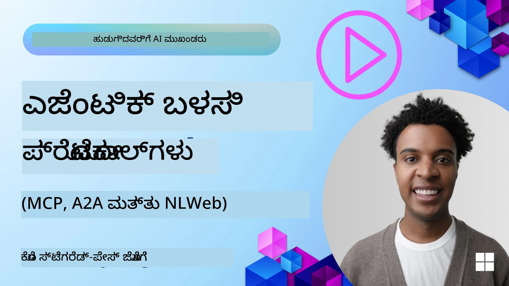
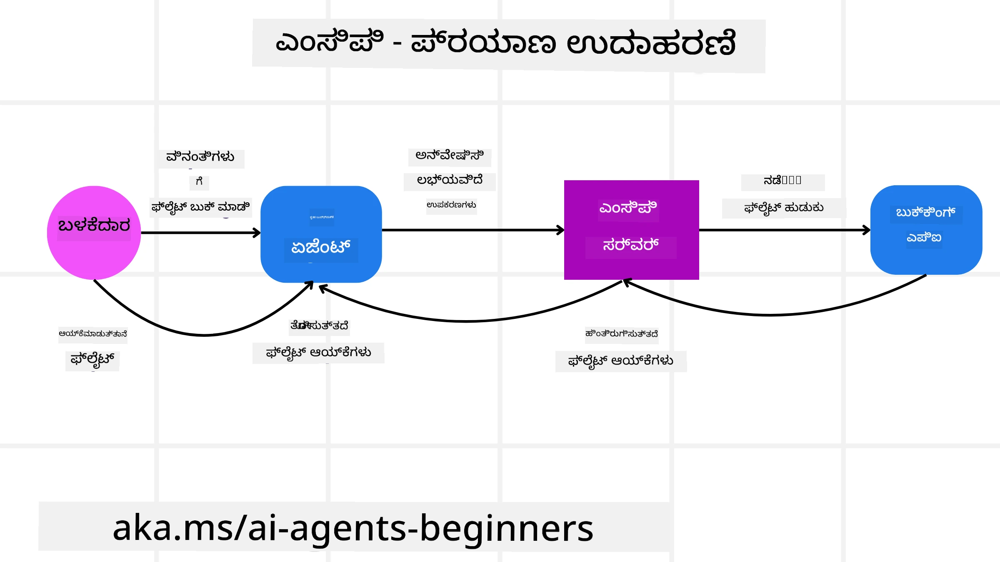
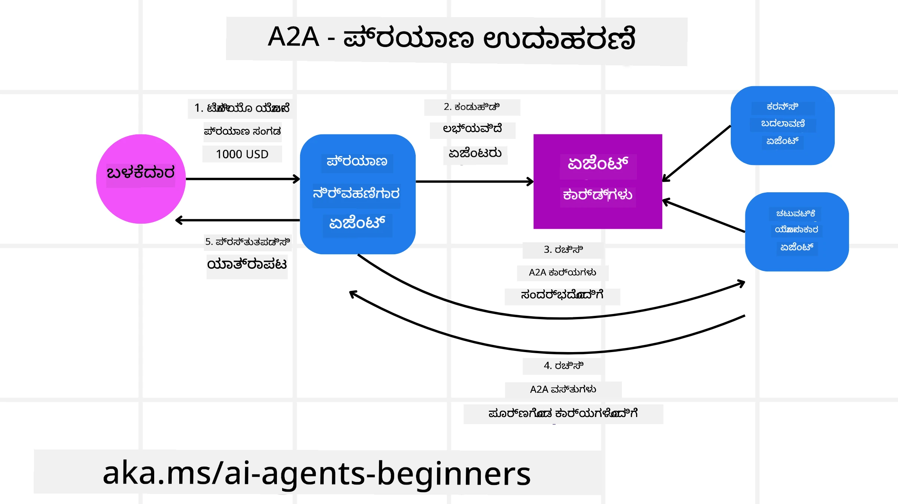
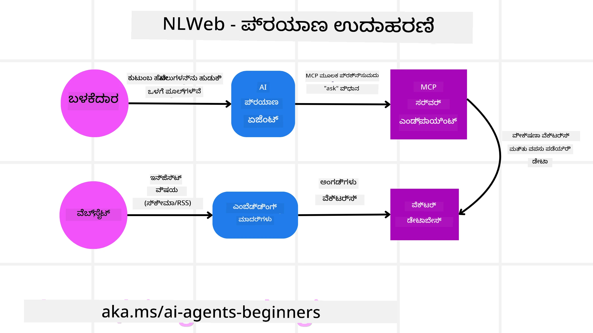

# ಏಜೆಂಟಿಕ್ ಪ್ರೋಟೋಕುಲ್ಗಳ ಬಳಕೆ (MCP, A2A ಮತ್ತು NLWeb)

> _(ಈ ಪಾಠದ ವೀಡಿಯೋವನ್ನು ನೋಡಲು ಮೇಲಿನ ಚಿತ್ರವನ್ನು ಕ್ಲಿಕ್ ಮಾಡಿ)_

AI ಏಜೆಂಟ್ಗಳು ಬಳಕೆಯಾಗುತ್ತಿರುವಂತೆ, ಮಾನಕತೆ, ಭದ್ರತೆ ಮತ್ತು ಓಪನ್ ನವೋದ್ಯಮವನ್ನು ಬೆಂಬಲಿಸುವ ಪ್ರೋಟೋಕುಲ್ಗಳ ಅಗತ್ಯವೂ ಹೆಚ್ಚಾಗುತ್ತಿದೆ. ಈ ಪಾಠದಲ್ಲಿ, ನಾವು ಈ ಅಗತ್ಯವನ್ನು ಪೂರೈಸಲು ನಿರೀಕ್ಷಿಸುವ 3 ಪ್ರೋಟೋಕುಲ್ಗಳನ್ನು ಎದುರಿಸಲು ಹೋಗಿದ್ದೇವೆ - ಮಾದರಿ ಸಂಧರ್ಭ ಪ್ರೋಟೋಕಾಲ್ (MCP), ಏಜೆಂಟ್ ಟು ಏಜೆಂಟ್ (A2A) ಮತ್ತು ನೈಸರ್ಗಿಕ ಭಾಷೆ ವೆಬ್ಸೈಟ್ (NLWeb).

## ಪರಿಚಯ

ಈ ಪಾಠದಲ್ಲಿ ನಾವು ಅರಿತುಕೊಳ್ಳಲಿದ್ದೇವೆ:

• ಹೇಗೆ **MCP** AI ಏಜೆಂಟ್ಗಳಿಗೆ ಬಳಕೆದಾರರ ಕೆಲಸಗಳನ್ನು ಪೂರ್ಣಗೊಳಿಸಲು ಹೊರಗಿನ ಉಪಕರಣಗಳು ಮತ್ತು ಡೇಟಾಗಳಿಗೆ ಪ್ರವೇಶ ಮಾಡಲು ಅವಕಾಶ ಕೊಡುತ್ತದೆ.

• ಹೇಗೆ **A2A** ವಿಭಿನ್ನ AI ಏಜೆಂಟ್ಗಳ ನಡುವೆ ಸಂವಹನ ಮತ್ತು ಸಹಕಾರ ಸಾಧ್ಯವಾಗಿಸುತ್ತದೆ.

• ಹೇಗೆ **NLWeb** ಯಾವುದೇ ವೆಬ್ಸೈಟ್‌ಗೆ ನೈಸರ್ಗಿಕ ಭಾಷೆ ಇಂಟರ್ಫೇಸ್ಗಳನ್ನು ತರುತ್ತದೆ, ಇದರಿಂದ AI ಏಜೆಂಟ್ಗಳು ವಿಷಯವನ್ನು ಕಂಡುಹಿಡಿದು ಅದರಲ್ಲಿ ಸಂವಹನ ಮಾಡಬಹುದು.

## ಕಲಿಕೆಯ ಗುರಿಗಳು

• AI ಏಜೆಂಟ್ಸ್‌ನ ಸಂಧರ್ಭದಲ್ಲಿ MCP, A2A ಮತ್ತು NLWeb ಮಾದರಿಗಳ ಮುಖ್ಯ ಉದ್ದೇಶ ಮತ್ತು ಲಾಭಗಳನ್ನು **ಗುರುತಿಸುವುದು**.

• ಪ್ರತಿ ಪ್ರೋಟೋಕುಲ್ ಯಾವ ರೀತಿಯಾಗಿ LLMs, ಉಪಕರಣಗಳು ಮತ್ತು ಇತರ ಏಜೆಂಟ್ಗಳ ನಡುವೆ ಸಂವಹನ ಮತ್ತು ಸಂವಾದವನ್ನು ಸುಲಭಗೊಳಿಸುತ್ತದೆ ಎಂದು **ವಿವರಿಸುವುದು**.

• ಗೊಂದಲದ ಏಜೆಂಟಿಕ್ ವ್ಯವಸ್ಥೆಗಳನ್ನು ನಿರ್ಮಿಸುವಲ್ಲಿ ಪ್ರತಿ ಪ್ರೋಟೋಕುಲ್ ವಿಶಿಷ್ಟ ಪಾತ್ರಗಳನ್ನು **ಕರಗಿಸುವುದು**.

## ಮಾದರಿ ಸಂಧರ್ಭ ಪ್ರೋಟೋಕುಲ್

**ಮಾದರಿ ಸಂಧರ್ಭ ಪ್ರೋಟೋಕುಲ್ (MCP)** ಒಂದು ಓಪನ್ ಸ್ಟ್ಯಾಂಡರ್ಡ್ ಆಗಿದ್ದು, ಅಪ್ಲಿಕೇಶನ್ಗಳು LLMs ಗೆ ಸಂಧರ್ಭ ಮತ್ತು ಉಪಕರಣಗಳನ್ನು ನೀಡಲು ಮಾನಕೀಕೃತ ವಿಧಾನವನ್ನು ಒದಗಿಸುತ್ತದೆ. ಇದು AI ಏಜೆಂಟ್ಗಳು ನಿರಂತರವಾಗಿ ಸಂಪರ್ಕ ಮಾಡಬಹುದಾದ ವಿವಿಧ ಡೇಟಾ ಮೂಲಗಳು ಮತ್ತು ಉಪಕರಣಗಳ "ವಿಶ್ವಸನೀಯ ಅಡಾಪ್ಟರ್" ಆಗಿರುತ್ತದೆ.

MCPಯ ಭಾಗಗಳು, ನೇರ API ಬಳಕೆಯಲ್ಲಿನ ಲಾಭಗಳು ಮತ್ತು AI ಏಜೆಂಟ್ಗಳು MCP ಸರ್ವರ್ ಅನ್ನು ಹೇಗೆ ಬಳಸಬಹುದು ಎಂಬ ಉದಾಹರಣೆಯನ್ನು ನೋಡೋಣ.

### MCP ಪ್ರಮುಖ ಭಾಗಗಳು

MCP **ಕ್ಲೈಂಟ್-ಸರ್ವರ್ ವಾಸ್ತುಶಿಲ್ಪ** ಮೇಲೆ ಕಾರ್ಯ ನಿರ್ವಹಿಸುತ್ತದೆ ಮತ್ತು ಮುಖ್ಯ ಭಾಗಗಳು ಹೀಗಿವೆ:

• **ಹೋಸ್ಟ್‌ಗಳು** LLM ಅಪ್ಲಿಕೇಶನ್ಸ್ (ಉದಾಹರಣೆಗೆ VSCode ಎಂಬ ಕೋಡ್ ಎಡಿಟರ್) ಆಗಿದ್ದು MCP ಸರ್ವರ್‌ಗೆ ಸಂಪರ್ಕ ಆರಂಭಿಸುತ್ತವೆ.

• **ಕ್ಲೈಂಟ್‌ಗಳು** ಹೋಸ್ಟ್ ಅಪ್ಲಿಕೇಶನ್ ಒಳಗಿನ ഘಟಕಗಳು, ಸರ್ವರ್‌ಗಳೊಂದಿಗೆ ಒಂದೊಂದು ಸಂಪರ್ಕವನ್ನು ನಿರ್ವಹಿಸುತ್ತವೆ.

• **ಸರ್ವರ್‌ಗಳು** ವಿಶೇಷ ಸಾಮರ್ಥ್ಯಗಳನ್ನು ಪ್ರವೃತ್ತಿ ಮಾಡುವ ಬೆಳಕು ತೂಕದ ಪ್ರೋಗ್ರಾಂಗಳು.

ಪ್ರೋಟೋಕುಲ್ನು ಒಳಗೊಂಡಿರುವ ಮೂರು ಮೂಲ ಪ್ರಿಮಿಟಿವ್ಸ್, MCP ಸರ್ವರ್ ಸಾಮರ್ಥ್ಯಗಳು:

• **ಉಪಕರಣಗಳು**: AI ಏಜೆಂಟ್ ಕಾರ್ಯಗತಗೊಳಿಸಲು ಕರೆಮಾಡಬಹುದಾದ ಕ್ರಮಗಳು ಅಥವಾ ಕಾರ್ಯಾಚರಣೆಗಳು. ಉದಾಹರಣೆಗೆ, ಹವಾಮಾನ ಸೇವೆಯು "ಹವಾಮಾನ ಪಡೆಯಿರಿ" ಉಪಕರಣವನ್ನು, ಇ-ಕಾಮರ್ಸ್ ಸರ್ವರ್ "ಉತ್ಪನ್ನ ಖರೀದಿ" ಉಪಕರಣವನ್ನು ಒದಗಿಸಬಹುದು. MCP ಸರ್ವರ್ ಪ್ರತಿ ಉಪಕರಣದ ಹೆಸರು, ವಿವರಣೆ ಮತ್ತು ಇನ್‌ಪುಟ್/ಔಟ್‌ಪುಟ್ ಸ್ಕೀಮಾವನ್ನು ತಮ್ಮ ಸಾಮರ್ಥ್ಯ ಪಟ್ಟಿ‌ನಲ್ಲಿ ಪ್ರಕಟಿಸುತ್ತವೆ.

• **ಸಂಪನ್ಮೂಲಗಳು**: ಓದಲು ಮಾತ್ರ ದೊರೆಯುವ ಡೇಟಾ ಐಟಂಗಳು ಅಥವಾ ಡಾಕ್ಯುಮೆಂಟ್‌ಗಳು, MCP ಸರ್ವರ್ ನಿಂದ ಒದಗಿಸಲಾಗುತ್ತವೆ, ಕ್ಲೈಂಟ್ ಗಳಿಗೆ ಅವುಗಳನ್ನು ಬೇಡಿಕೆ ಮೇಲೆ ಪಡೆಯಬಹುದಾಗಿದೆ. ಉದಾಹರಣೆಗಳಿಗೆ ಫೈಲ್ ವಿಷಯಗಳು, ಡೇಟಾಬೇಸ್ ದಾಖಲೆಗಳು, ಅಥವಾ ಲಾಗ್ ಫೈಲ್‌ಗಳು ಸೇರಿವೆ. ಸಂಪನ್ಮೂಲಗಳು ಪಾಠ (ಕೋಡ್ ಅಥವಾ JSON) ಅಥವಾ ದ್ವಿಮಾತ್ರ (ಚಿತ್ರಗಳು ಅಥವಾ PDFಗಳು) ಆಗಿರಬಹುದು.

• **ಪ್ರಾಂಪ್ಟ್ ಗಳು**: ಪೂರ್ವನಿರ್ಧರಿತ ಟೆಂಪ್ಲೇಟ್‌ಗಳು, ಜಟಿಲ ಕಾರ್ಯಪ್ರವಾಹಗಳಿಗೆ ಅನುಮತಿಸುತ್ತದೆ.

### MCP ನ ಲಾಭಗಳು

MCP AI ಏಜೆಂಟ್ಗಳಿಗೆ ಮಹತ್ವದ ಪ್ರಯೋಜನಗಳನ್ನು ನೀಡುತ್ತದೆ:

• **ಗತಿಶೀಲ ಉಪಕರಣ ಅನ್ವೇಷಣೆ**: ಏಜೆಂಟ್ ಗಳು ಸರ್ವರ್ ನಿಂದ ಲಭ್ಯವಿರುವ ಉಪಕರಣಗಳ ಪಟ್ಟಿಯನ್ನು ಮತ್ತು ಅವುಗಳ ವಿವರಣೆಗಳನ್ನು ವಿಭಿನ್ನ ಮಾನ್ಯತೆಗಳೊಂದಿಗೆ ಪಡೆಯಬಹುದು. ಈದು ಪರಂಪರागत API ಗಳ ಹೋಲಿಕೆಯಲ್ಲಿ, ಅಲ್ಲಿ ಸಂಯೋಜನೆಗಳಿಗೆ ಸ್ಥಿರ ಕೋಡಿಂಗ್ ಬೇಕಾಗುತ್ತದೆ, ಎಲ್ಲಾ API ಬದಲಾವಣೆಗಳಿಗೆ ಕೋಡ್ ನವೀಕರಣ ಅಗತ್ಯವಿರುತ್ತದೆ. MCP “ಒಮ್ಮೆ ಸಂಯೋಜಿಸಿ” ವಿಧಾನವನ್ನು ನೀಡುತ್ತದೆ, ಇದು ಅನುಕೂಲತೆಯನ್ನು ಹೆಚ್ಚಿಸುತ್ತದೆ.

• **ವಿಭಿನ್ನ LLM ಗಳ ನಡುವೆ ಪರಸ್ಪರ ಕಾರ್ಯಾಚರಣೆ**: MCP ವಿಭಿನ್ನ LLM ಗಳೊಂದಿಗೆ ಕೆಲಸ ಮಾಡುತ್ತದೆ, ಉತ್ತಮ ಕಾರ್ಯಾಚರಣೆಗಾಗಿ ಮೂಲ ಮಾದರಿಗಳನ್ನು ಬದಲಾಯಿಸಲು ಪ್ರತ್ಯೇಕತೆ ಒದಗಿಸುತ್ತದೆ.

• **ಮಾನಕೀಕೃತ ಭದ್ರತೆ**: MCP ಮಾನಕೀಕೃತ ಪ್ರಾಮಾಣೀಕರಣ ವಿಧಾನವನ್ನು ಒಳಗೊಂಡಿದೆ, ಇದು ಹೆಚ್ಚುವರಿ MCP ಸರ್ವರ್ ಗಳಿಗೆ ಪ್ರವೇಶ ಸೇರಿಸುವಾಗ ವ್ಯಾಪಕತೆಯನ್ನು ಸುಧಾರಿಸುತ್ತದೆ. ಇದು ವಿವಿಧ ಡೇಟಾ API ಗಳಿಗೆ ವಿಭಿನ್ನ ಕೀಲಿಗಳು ಮತ್ತು ಪ್ರಾಮಾಣೀಕರಣಗಳನ್ನು ನಿರ್ವಹಿಸುವುದಕ್ಕಿಂತ ಸರಳವಾಗಿದೆ.

### MCP ಉದಾಹರಣೆ

ಬಳಸುವ ವ್ಯಕ್ತಿ MCP ಸಹಿತ AI ಸಹಾಯಕ ಸೇವೆಯಿಂದ ವಿಮಾನ ಬುಕಿಂಗ್ ಮಾಡಲು ಬಯಸುತ್ತಾರೆ ಎಂದು ಭಾವಿಸಿ.

1. **ಸಂಪರ್ಕ**: AI ಸಹಾಯಕ (MCP ಕ್ಲೈಂಟ್) ವಿಮಾನ ಕಂಪನಿಯ MCP ಸರ್ವರ್‌ಗೆ ಸಂಪರ್ಕ ಸಾಧಿಸುತ್ತದೆ.

2. **ಉಪಕರಣ ಅನ್ವೇಷಣೆ**: ಕ್ಲೈಂಟ್ ವಿಮಾನ ಕಂಪನಿಯ MCP ಸರ್ವರ್ ಗೆ "ನೀವು ಯಾವ ಉಪಕರಣಗಳನ್ನು ಹೊಂದಿದ್ದೀರಿ?" ಎಂದು ಕೇಳುತ್ತದೆ. ಸರ್ವರ್ "ವಿಮಾನ ಹುಡುಕಲು" ಮತ್ತು "ವಿಮಾನ ಬುಕಿಂಗ್ಗೆ"ಂತಹ ಉಪಕರಣಗಳನ್ನು ಉತ್ತರವಾಗಿ ನೀಡುತ್ತದೆ.

3. **ಉಪಕರಣ ಕರೆ**: ನಂತರ ನೀವು AI ಸಹಾಯಕರಿಗೆ "ಪೋರ್ಟ್‌ಲೆಂಡ್‌ನಿಂದ ಹೊನೊಲುಲುಗೆ ವಿಮಾನ ಹುಡುಕಿ" ಎಂದು ಕೇಳುತ್ತೀರಿ. AI ಸಹಾಯಕ ತನ್ನ LLM ಉಪಯೋಗಿಸಿ "ವಿಮಾನ ಹುಡುಕಲು" ಉಪಕರಣವನ್ನು ಕರೆದು ಅಗತ್ಯವಾದ ಪಾರಾಮೀಟರ್‌ಗಳು (ಉದ್ಗಮ, ಗಮ್ಯಸ್ಥಾನ) MCP ಸರ್ವರ್‌ಗೆ ಕಳುಹಿಸುತ್ತದೆ.

4. **ಕಾರ್ಯಗತಿ ಮತ್ತು ಪ್ರತಿಕ್ರಿಯೆ**: MCP ಸರ್ವರ್ ವಿಮಾನ ಕಂಪನಿಯ ಒಳಗಿನ ಬುಕ್ಕಿಂಗ್ API ಗೆ ಕರೆಯುವುದಾಗಿ ಕಾರ್ಯಗತಗೊಳಿಸುತ್ತದೆ. ನಂತರ ಅದು ವಿಮಾನ ಮಾಹಿತಿಯನ್ನು (ಉದಾ: JSON ಡೇಟಾ) ಪಡೆಯುತ್ತದೆ ಮತ್ತು AI ಸಹಾಯಕಿಗೆ ಕಳುಹಿಸುತ್ತದೆ.

5. **ಮುಂದಿನ ಸಂವಹನ**: AI ಸಹಾಯಕ ವಿಮಾನ ಆಯ್ಕೆಯನ್ನು ಪ್ರದರ್ಶಿಸುತ್ತದೆ. ನೀವು ವಿಮಾನವನ್ನು ಆಯ್ಕೆ ಮಾಡಿದ ನಂತರ, ಸಹಾಯಕ ಅದೇ MCP ಸರ್ವರ್‌ನಲ್ಲಿ "ವಿಮಾನ ಬುಕಿಂಗ್" ಉಪಕರಣವನ್ನು ಕರೆದು ಬುಕ್ಕಿಂಗ್ ಪೂರ್ಣಗೊಳಿಸುತ್ತದೆ.

## ಏಜೆಂಟ್-ಟು-ಏಜೆಂಟ್ ಪ್ರೋಟೋಕುಲ್ (A2A)

MCP LLMಗಳು ಮತ್ತು ಉಪಕರಣಗಳನ್ನು ಸಂಪರ್ಕಿಸುವ ಬಗ್ಗೆ ಕೇಂದ್ರೀಕೃತವಾಗಿರುವಾಗ, **ಏಜೆಂಟ್-ಟು-ಏಜೆಂಟ್ (A2A) ಪ್ರೋಟೋಕುಲ್** ಬೇರೆ ಹಂತಕ್ಕೆ ಹೋಗುತ್ತದೆ, ವಿಭಿನ್ನ AI ಏಜೆಂಟ್ಗಳ ನಡುವೆ ಸಂವಹನ ಮತ್ತು ಸಹಕಾರ ಸಾಧ್ಯಮಾಡುತ್ತದೆ. A2A ವಿಭಿನ್ನ ಸಂಸ್ಥೆಗಳ, ಪರಿಸರಗಳ ಮತ್ತು ತಂತ್ರಜ್ಞಾನ ಸ್ತರಗಳ AI ಏಜೆಂಟ್ಗಳನ್ನು ಸಂಪರ್ಕಿಸಿ ಸಹಕಾರಿ ಕೆಲಸವನ್ನು ಪೂರ್ಣಗೊಳಿಸುತ್ತದೆ.

ನಾವು A2A ಭಾಗಗಳು, ಲಾಭಗಳು ಮತ್ತು ನಮ್ಮ ಪ್ರವಾಸಿ ಅಪ್ಲಿಕೇಶನ್‌ನಲ್ಲಿ ಅದು ಹೇಗೆ ಅನ್ವಯಿಸಬಹುದು ಎಂಬುದನ್ನು ಪರಿಶೀಲಿಸುತ್ತೇವೆ.

### A2A ಪ್ರಮುಖ ಭಾಗಗಳು

A2A ಏಜೆಂಟ್‍ಗಳ ಸಂವಹನಕ್ಕೆ ಮತ್ತು ಬಳಕೆದಾರರ ಉಪಕಾರ್ಯದ ಒಂದು ಉಪಕಾರ್ಯವನ್ನು ಪೂರ್ಣಗೊಳಿಸಲು ಸಹಕರಿಸಲು ಕೇಂದ್ರೀಕೃತವಾಗಿದೆ. ಪ್ರೋಟೋಕುಲ್‍ನ ಪ್ರತಿ ಭಾಗ ಇದಕ್ಕೆ ಸಹಾಯ ಮಾಡುತ್ತದೆ:

#### ಏಜೆಂಟ್ ಕಾರ್ಡ್

MCP ಸರ್ವರ್ ಉಪಕರಣಗಳ ಪಟ್ಟಿಯನ್ನು ಹಂಚಿಕೊಳ್ಳುವುದಿನಂತೆ, ಏಜೆಂಟ್ ಕಾರ್ಡ್‌ನಲ್ಲಿ ಇವುಗಳಿವೆ:
- ಏಜೆಂಟ್ ಹೆಸರು .
- ಅದು ಪೂರ್ಣಗೊಳಿಸುವ ಸಾಮಾನ್ಯ ಕಾರ್ಯಗಳ **ವಿವರಣೆ**.
- ಇತರ ಏಜೆಂಟ್ ಗಳು (ಅಥವಾ ಮಾನವ ಬಳಕೆದಾರರು) ಯಾವಾಗ ಮತ್ತು ಏಕೆ ಆ ಏಜೆಂಟ್ ಅನ್ನು ಕರೆಯುವುದು ಎಂಬುದನ್ನು ಅರ್ಥಮಾಡಿಕೊಳ್ಳಲು ಸಹಾಯಮಾಡುವ **ನಿರ್ದಿಷ್ಟ ಕೌಶಲ್ಯಗಳ ಪಟ್ಟಿ** ಮತ್ತು ವಿವರಣೆಗೂ.
- ಏಜೆಂಟ್‌ನ **ವರ್ತಮಾನ ಎಂಡ್‍ಪಾಯಿಂಟ್ URL**.
- ಸ್ಟ್ರೀಮಿಂಗ್ ಪ್ರತಿಕ್ರಿಯೆಗಳು ಮತ್ತು ಪುश್ ನೋಟಿಫಿಕೇಶನ್‌ಗಳಂತಹ ಏಜೆಂಟ್‌ನ **ಆವೃತ್ತಿ** ಮತ್ತು **ಸಾಮರ್ಥ್ಯಗಳು**.

#### ಏಜೆಂಟ್ ಕಾರ್ಯನಿರ್ವಾಹಕ

ಏಜೆಂಟ್ ಕಾರ್ಯನಿರ್ವಾಹಕ ಬಳಕೆದಾರ ಸಂಭಾಷಣೆಯ ಸಂಧರ್ಭವನ್ನು ದೂರದ ಏಜೆಂಟ್‌ಗೆ **ಹರಿಣಿಸುವ** బాధ್ಯನಾಗಿರುತ್ತಾನೆ, ದೂರದ ಏಜೆಂಟ್ಕ್ಕೆ ಪೂರ್ಣಗೊಳಿಸಬೇಕಾದ ಕಾರ್ಯವನ್ನು ಅರ್ಥಮಾಡಿಕೊಳ್ಳಲು ಇದು ಬೇಕಾಗುತ್ತದೆ. A2A ಸರ್ವರ್ ನಲ್ಲಿ, ಏಜೆಂಟ್ ತನ್ನದೇ LLM ಅನ್ನು ಉಪಯೋಗಿಸಿ ಬರೋಬ್ಬರಿ ಕೇಳುಗಳನ್ನು ವಿಶ್ಲೇಷಿಸಿ ತನ್ನ ಅದರ ಉಪಕರಣಗಳೊಂದಿಗೆ ಕಾರ್ಯಗಳನ್ನು ನಿರ್ವಹಿಸುತ್ತದೆ.

#### ಕಲಾಕೃತಿ

ದೂರದ ಏಜೆಂಟ್ ಕೇಳಿದ ಕಾರ್ಯವನ್ನು ಪೂರ್ಣಮಾಡಿದ ಮೇಲೆ, ಅದರ ಕಾರ್ಯ ಫಲಿತಾಂಶವನ್ನು ಕಲಾಕೃತಿ ರೂಪದಲ್ಲಿ ಸೃಷ್ಟಿಸಲಾಗುತ್ತದೆ. ಕಲಾಕೃತಿ ಅಂದರೆ ಏಜೆಂಟ್ ಕಾರ್ಯದ ಫಲಿತಾಂಶ, ಪೂರ್ಣಗೊಂಡ ಕಾರ‍್ಯದ ವಿವരണം ಮತ್ತು ಪ್ರೋಟೋಕುಲ್ ಮೂಲಕ ಕಳುಹಿಸಲಾದ ಪಾಠ ಸಂಧರ್ಭವನ್ನು ಒಳಗೊಂಡಿದೆ. ಕಲಾಕೃತಿ ಕಳುಹಿಸಿದ ನಂತರ, ದೂರದ ಏಜೆಂಟ್ ಜೊತೆಗೆ ಸಂಪರ್ಕ ಮುಚ್ಚಲ್ಪಡುತ್ತದೆ, ಮತ್ತೆ ಬೇಕಾದಾಗ ಸಂಪರ್ಕ ಮಾಡಿಕೊಳ್ಳಲಾಗುತ್ತದೆ.

#### ಈವೆಂಟ್ ಕ್ಯೂ

ಈ ಭಾಗ **ನವೀಕರಣಗಳನ್ನು ಹ್ಯಾಂಡಲ್ ಮಾಡುವುದು ಮತ್ತು ಸಂದೇಶಗಳನ್ನು ಹರಡುವ** ಕೆಲಸ ಮಾಡುತ್ತದೆ. ಕಾರ್ಯ ಪೂರ್ಣಗೊಳ್ಳುವ ಮುಖ್ಯ ಸಮಯಗಳು ಹೆಚ್ಚು ಕಾಲ ತೆಗೆದುಕೊಳ್ಳುವಾಗ, ನಿರ್ವಹಿಸುವಂತಹ ವ್ಯವಸ್ಥಿತ ಏಜೆಂಟಿಕ್ ವ್ಯವಸ್ಥೆಗಳಲ್ಲಿ ಏಜೆಂಟ್‌ಗಳ ನಡುವೆ ಸಂಪರ್ಕ ಮುಚ್ಚಿಕೊಳ್ಳುವುದನ್ನು ತಪ್ಪಿಸುವದು ಅತೀ ಪ್ರಮುಖವಾಗಿದೆ.

### A2A ಲಾಭಗಳು

• **ಮೆರೆಯುತೆಯ ಸಹಕಾರ**: ವಿಭಿನ್ನ ವಂಡರ್‌ಗಳು ಮತ್ತು ವೇದಿಕೆಗಳಿಂದ ಏಜೆಂಟ್‌ಗಳು ಪರಸ್ಪರ ಸಂವಹನ, ಸಂಧರ್ಭ ಹಂಚಿಕೆ ಮತ್ತು ಸಹಕಾರ ಮಾಡಬಹುದು, ಹೀಗೆ ಸಹಜವಾಗಿ ಪರಸ್ಪರ ಸಂಪರ್ಕ ಇಲ್ಲದ ವ್ಯವಸ್ಥೆಗಳ ನಡುವೆ ಸ್ವಯಂಚಾಲಿತರಣೆಯನ್ನು ಪ್ರಾರಂಭಿಸುತ್ತದೆ.

• **ಮಾದರಿ ಆಯ್ಕೆ ಅನುವಾಗ್ಯತೆ**: ಪ್ರತಿ A2A ಏಜೆಂಟ್ ತನ್ನ LLM ಅನ್ನು ಆರಿಸಿ ತನ್ನ ಕೇಳುಗಳಿಗೆ ಸೇವೆ ನೀಡಬಹುದು, ಏಕೆಂದರೆ MCP ನಲ್ಲಿ ಇಂಥದ್ದೊಂದು LLM ಸಂಪರ್ಕ ಮಾತ್ರ ಇರಬಹುದು.

• **ನಿರ್ಮಿತ ಪ್ರಾಮಾಣೀಕರಣ**: ಪ್ರಾಮಾಣೀಕರಣ A2A ಪ್ರೋಟೋಕುಲ್‌ನಲ್ಲಿ ನೇರವಾಗಿ ಸೇರಿಸಲಾಗಿದೆ, ಇದು ಏಜೆಂಟ್ ಸಂವಾದಗಳಿಗೆ ಬಲಿಷ್ಠ ಭದ್ರತೆ ವ್ಯವಸ್ಥೆಯನ್ನು ಒದಗಿಸುತ್ತದೆ.

### A2A ಉದಾಹರಣೆ

ನಮ್ಮ ಪ್ರವಾಸ ಬುಕ್ಕಿಂಗ್ ಪರಿಸ್ಥಿತಿ ವಿವರಣೆ ಮಾಡೋಣ, ಆದರೆ ಈ ಬಾರಿ A2A ಬಳಸಿ.

1. **ಬಳಕೆದಾರರ ವಿನಂತಿ ಬಹು ಏಜೆಂಟ್‌ಗೆ**: ಬಳಕೆದಾರ "ಮುಂದಿನ ವಾರ ಹೊನೊಲುಲುಗೆ ಪೂರ್ಣ ಪ್ರವಾಸ, ವಿಮಾನಗಳು, ಹೋಟೆಲ್ ಮತ್ತು ಕಾರ್ ಬಾಡಿಗೆ ಎಲ್ಲವೂ ಬುಕ್ ಮಾಡು" ಎಂದು "ಟ್ರೆವಲ್ ಏಜೆಂಟ್" A2A ಕ್ಲೈಂಟ್/ಏಜೆಂಟ್ ಜೊತೆಗೆ ಸಂಭಾಷಣೆ ನಡೆಸುತ್ತಾನೆ.

2. **ಟ್ರೆವಲ್ ಏಜೆಂಟ್‌ರಿಂದ ಯೋಜನೆ ರೂಪಿಸುವಿಕೆ**: ಟ್ರೆವಲ್ ಏಜೆಂಟ್ ಈ ಸಂಕೀರ್ಣ ವಿನಂತಿಯನ್ನು ಪಡೆದು ತನ್ನ LLM ಉಪಯೋಗಿಸಿ ಕಾರ್ಯವನ್ನು ವಿಶ್ಲೇಷಿಸಿ ಇತರ ಪರಿಣತಿಗಳುಳ್ಳ ಏಜೆಂಟ್ ಗಳೊಂದಿಗೆ ಸಂವಹಿಸಬೇಕೆಂದು ನಿರ್ಧರಿಸುತ್ತದೆ.

3. **ಏಜೆಂಟ್‌ಗಳ ನಡುವಿನ ಸಂವಹನ**: ನಂತರ ಟ್ರೆವಲ್ ಏಜೆಂಟ್ A2A ಪ್ರೋಟೋಕುಲ್ ಬಳಸಿ "ಎರಲೈನ್ ಏಜೆಂಟ್", "ಹೋಟೆಲ್ ಏಜೆಂಟ್", "ಕಾರ್ ರೆಂಟಲ್ ಏಜೆಂಟ್"ಗಳಂತಹ ವಿಂಗಡಿಸಿದ ಏಜೆಂಟ್ ಗಳನ್ನು ಸಂಪರ್ಕಿಸುತ್ತದೆ; ಈ ಏಜೆಂಟ್ ಗಳು ವಿಭಿನ್ನ ಕಂಪೆನಿಗಳದಾಗಿರಬಹುದು.

4. **ಕಾರ್ಯ ವಿತರಣೆ**: ಟ್ರೆವಲ್ ಏಜೆಂಟ್ ಈ ತಜ್ಞ ಏಜೆಂಟ್ ಗಾಗಿ ನಿರ್ದಿಷ್ಟ ಕಾರ್ಯಗಳನ್ನು ಕಳುಹಿಸುತ್ತದೆ (ಉದಾ: "ಹೊನೊಲುಲುಗೆ ವಿಮಾನ ಹುಡುಕಿ", "ಹೋಟೆಲ್ ಬುಕ್ ಮಾಡಿ", "ಕಾರ್ ಬಾಡಿಗೆ"). ಪ್ರತಿ ವಿಶೇಷ ಏಜೆಂಟ್ ತನ್ನದೇ LLM ಮತ್ತು ಕೆಲವೊಮ್ಮೆ MCP ಸರ್ವರ್ ಗಳಾಗಿ ಕೂಡ ಕಾರ್ಯಗತಗೊಳಿಸುತ್ತವೆ.

5. **ಸಂಯೋಜಿತ ಪ್ರತಿಕ್ರಿಯೆ**: ಎಲ್ಲಾ ಅಡಚಣೆ ಏಜೆಂಟ್ ಗಳು ಕಾರ್ಯ ಪೂರ್ಣಮಾಡಿದ ನಂತರ, ಟ್ರೆವಲ್ ಏಜೆಂಟ್ ಫಲಿತಾಂಶಗಳನ್ನು ಸಂಗ್ರಹಿಸಿ ಬಳಕೆದಾರರಿಗೆ ಸಂಭಾಷಣೆ ಶೈಲಿಯಲ್ಲಿ ದೊಡ್ಡ ಉತ್ತರ ಕಳುಹಿಸುತ್ತದೆ.

## ನೈಸರ್ಗಿಕ ಭಾಷೆ ವೆಬ್ (NLWeb)

ವೆಬ್ಸೈಟ್ಗಳು ದೀರ್ಘಕಾಲದಿಂದ ಬಳಕೆದಾರರು ಜಾಲತಾಣದ ಮಾಹಿತಿ ಮತ್ತು ಡೇಟಾಗೆ ಪ್ರವೇಶಿಸಲು ಪ್ರಾಥಮಿಕ ಮಾರ್ಗವಾಗಿವೆ.

ನಾವು NLWeb ನ ಭಾಗಗಳು, ಲಾಭಗಳು ಮತ್ತು ನಮ್ಮ ಪ್ರವಾಸಿ ಅಪ್ಲಿಕೇಶನ್ ಮೂಲಕ ಅದರ ಕಾರ್ಯನಿರ್ವಹಣೆಯ ಉದಾಹರಣೆಯನ್ನು ನೋಡೋಣ.

### NLWeb ಭಾಗಗಳು

- **NLWeb ಅಪ್ಲಿಕೇಶನ್ (ಮೂಲ ಸೇವಾ ಕೋಡ್)**: ನೈಸರ್ಗಿಕ ಭಾಷೆ ಪ್ರಶ್ನೆಗಳನ್ನು ಪ್ರಕ್ರಿಯೆ ಮಾಡಲು ವ್ಯವಸ್ಥೆ. ಇದು ವೇದಿಕೆಯ ವಿಭಿನ್ನ ಭಾಗಗಳನ್ನು ಸಂಪರ್ಕಿಸಿ ಪ್ರತಿಕ್ರಿಯೆಗಳನ್ನು ಸೃಷ್ಟಿಸುತ್ತದೆ. ನೀವೇ ಅದನ್ನು ವೆಬ್ಸೈಟ್ ನ ನೈಸರ್ಗಿಕ ಭಾಷೆ ವೈಶಿಷ್ಟ್ಯಗಳ ಚಾಲಕ ಎಂಜಿನ್ ಆಗಿ ತಿಳಿದುಕೊಳ್ಳಬಹುದು.

- **NLWeb ಪ್ರೋಟೋಕುಲ್**: ವೆಬ್ಸೈಟ್ ಜತೆಗೆ ನೈಸರ್ಗಿಕ ಭಾಷೆ ಸಂವಹನಕ್ಕಾಗಿ ಮೂಲ ನಿಯಮಗಳ ಸಮೂಹ. ಇದು JSON ಸ್ವರೂಪದಲ್ಲಿ (ಸಾಧಾರಣವಾಗಿ Schema.org ಬಳಸಿ) ಪ್ರತಿಕ್ರಿಯೆಗಳನ್ನು ಕಳುಹಿಸುತ್ತದೆ. ಇದರ ಉದ್ದೇಶ “AI ವೆಬ್” ಗಾಗಿ ಸರಳ ಸ್ಥಾಪನೆಯ ನಿರ್ಮಾಣ, ಹೇಗೆ HTML ಆನ್ಲೈನ್ ಡಾಕ್ಯುಮೆಂಟ್ ಹಂಚಿಕೆಗೆ ಸಾಧ್ಯ ಮಾಡಿತು.

- **MCP ಸರ್ವರ್ (ಮಾದರಿ ಸಂಧರ್ಭ ಪ್ರೋಟೋಕುಲ್ ಎಂಡ್‌ಪಾಯಿಂಟ್)**: ಪ್ರತಿ NLWeb ವ್ಯವಸ್ಥೆಯೂ MCP ಸರ್ವರ್ ಆಗಿ ಕಾರ್ಯನಿರ್ವಹಿಸುತ್ತದೆ. ಅಂದರೆ ಇದು ಲಭ್ಯವಿರುವ ಉಪಕರಣಗಳು (ಉದಾ: “ask” ವಿಧಾನ) ಮತ್ತು ಡೇಟಾ ಅನ್ನು ಇತರ AI ವ್ಯವಸ್ಥೆಗಳೊಂದಿಗೆ ಹಂಚಿಕೊಳ್ಳಬಹುದು. ಇದು ವೆಬ್ಸೈಟ್ ವಿಷಯ ಮತ್ತು ಸಾಮರ್ಥ್ಯಗಳನ್ನು AI ಏಜೆಂಟ್ಗಳ ಬಳಕೆ ಮಾಡಲು ಅವಕಾಶ ಮಾಡಿಕೊಡುತ್ತವೆ ಮತ್ತು ತಾಣವನ್ನು ವಿಸ್ತೃತ ಏಜೆಂಟ್ ಪರಿಸರದ ಭಾಗವಾಗಿರುತ್ತದೆ.

- **ಎಂಬೆಡ್ಡಿಂಗ್ ಮಾದರಿಗಳು**: ಇವು ವೆಬ್ಸೈಟ್ ವಿಷಯವನ್ನು ಗಣನೀಯ ಪ್ರತಿನಿಧಿಸು अंकಗಳಲ್ಲಿ ಯಾವುದಾಗಿ ಪರಿವರ್ತಿಸುತ್ತವೆ (ಎಂಬೆಡ್ಡಿಂಗ್‌ಗಳು). ಈ ಅಂಕೆಗಳು ಅರ್ಥವನ್ನು ಹಿಡಿದಿಡುತ್ತವೆ ಮತ್ತು ಗಣಕ ಯಂತ್ರಗಳು ಅವುಗಳನ್ನು ಹೋಲಿಸಿ ಹುಡುಕಬಹುದು. ಅವು ವಿಶೇಷ ಡೇಟಾಬೇಸ್ ನಲ್ಲಿ ಸಂಗ್ರಹಿಸಲಾಗುತ್ತವೆ, ಬಳಕೆದಾರರು ಯಾವ ಎಂಬರ್‌ಡಿಂಗ್ ಮಾದರಿಯನ್ನು ಉಪಯೋಗಿಸಲಾರೋ ಆರಿಸಬಹುದು.

- **ವೆಕ್ಟರ್ ಡೇಟಾಬೇಸ್ (ಪುನರಾವರ್ತನೆ ಯಂತ್ರ)**: ಈ ಡೇಟಾಬೇಸ್ ವೆಬ್ಸೈಟ್ ವಿಷಯದ ಎಂಬೆಡ್ಡಿಂಗ್‌ಗಳನ್ನು ಸಂಗ್ರಹಿಸುತ್ತದೆ. ಯಾರಾದರೂ ಪ್ರಶ್ನೆ ಕೇಳಿದಾಗ, NLWeb ವೆಕ್ಟರ್ ಡೇಟಾಬೇಸ್ ಪರಿಶೀಲಿಸಿ ಸೂಕ್ತ ಮಾಹಿತಿಯನ್ನು ಶೀಘ್ರವಾಗಿ ಹುಡುಕುತ್ತದೆ. ಇದು ಸಾಧ್ಯವಾದ ಉತ್ತರಗಳ ಸೂಚಿತ ಪಟ್ಟಿಯನ್ನು similarity ಆಧರಿಸಿ ಕ್ರಮಿಸುತ್ತದೆ. NLWeb ವಿಭಿನ್ನ ವೆಕ್ಟರ್ ಸಂಗ್ರಹ ವ್ಯವಸ್ಥೆಗಳೊಡನೆ ಕೆಲಸ ಮಾಡುತ್ತದೆ, ಉದಾ: Qdrant, Snowflake, Milvus, Azure AI Search, Elasticsearch.

### ಉದಾಹರಣೆ ಮೂಲಕ NLWeb

ಮತ್ತೆ ನಮ್ಮ ಪ್ರವಾಸ ಬುಕ್ಕಿಂಗ್ ವೆಬ್ಸೈಟ್ ಪರಿಗಣಿಸಿ, ಆದರೆ ಈ ಬಾರಿ ಅದು NLWeb ನಿಂದ ಚಾಲಿತವಾಗಿದೆ.

1. **ಡೇಟಾ ಅಳವಡಿಕೆ**: ಪ್ರವಾಸಿ ವೆಬ್ಸೈಟ್ ಈಗಿರುವ ಉತ್ಪನ್ನ ಕ್ಯಾಟಲೋಗುಗಳು (ಉದಾ: ವಿಮಾನ ಪಟ್ಟಿ, ಹೋಟೆಲ್ ವಿವರಣೆ, ಪ್ರವಾಸಿ ಪ್ಯಾಕೇಜುಗಳು) Schema.org ಆಶಯದಿಂದ ಅಥವಾ RSS ಫೀಡ್ ಗಳಿಂದ ಲೋಡ್ ಮಾಡಲಾಗುತ್ತದೆ. NLWeb ಉಪಕರಣಗಳು ಈ ಸಾಂರಚನಾತ್ಮಕ ಡೇಟಾವನ್ನು ಸ್ವೀಕರಿಸಿ, ಎಂಬೆಡ್ಡಿಂಗ್ ಸೃಷ್ಟಿಸಿ, ಸ್ಥಳೀಯ ಅಥವಾ ದೂರದ ವೆಕ್ಟರ್ ಡೇಟಾಬೇಸ್‌ನಲ್ಲಿ ಸಂಗ್ರಹಿಸುತ್ತವೆ.

2. **ನೈಸರ್ಗಿಕ ಭಾಷೆ ಪ್ರಶ್ನೆ (ಮಾನವರಿಂದ)**: ಬಳಕೆದಾರ ವೆಬ್ಸೈಟ್ ಭೇಟಿ ನೀಡಿ ಮೆನುಗಳ ಮೂಲಕ ಸಂಚರಿಸುವ ಬದಲು, ಚಾಟ್ ಇಂಟರ್ಫೇಸ್ನಲ್ಲಿ “ಮುಂದಿನ ವಾರ ಹೊನೊಲುಲುದಲ್ಲಿ ಕುಡಿಯಲು ಕೂಲಿಪಾರ್ಕ್ ಇರುವ ಕುಟುಂಬ ಸ್ನೇಹಿ ಹೋಟೆಲ್ ಹುಡುಕಿ” ಎಂದು ಟೈಪ್ ಮಾಡುತ್ತಾರೆ.

3. **NLWeb ಪ್ರಕ್ರಿಯೆ**: NLWeb ಅಪ್ಲಿಕೇಶನ್ ಈ ಪ್ರಶ್ನೆಯನ್ನು ಪಡೆದು, ಅದನ್ನು ಅರ್ಥಮಾಡಲು LLM ಗೆ ಕಳುಹಿಸುತ್ತದೆ ಮತ್ತು ಜೊತೆಗೆ ವೆಕ್ಟರ್ ಡೇಟಾಬೇಸ್ ನಲ್ಲಿ ಸೂಕ್ತ ಹೋಟೆಲ್ ಪಟ್ಟಿಗಳು ಹುಡುಕುತ್ತದೆ.

4. **ಸರಿಯಾದ ಫಲಿತಾಂಶಗಳು**: LLM ಡೇಟಾಬೇಸ್‌ನಲ್ಲಿ ಹುಡುಕಿದ ಫಲಿತಾಂಶಗಳನ್ನು ವಿವೇಚಿಸಿ "ಕುಟುಂಬ ಸ್ನೇಹಿ", "ಪುಲ್", "ಹೊನೊಲುಲು" ಆಧಾರದ ಮೇಲೆ ಅತ್ಯುತ್ತಮ ಹೊಂದಿಕೆಯನ್ನು ಗುರುತು ಮಾಡಿ, ನೈಸರ್ಗಿಕ ಭಾಷೆಯಲ್ಲಿ ಪ್ರತಿಕ್ರಿಯೆ ನೀಡುತ್ತದೆ. ಮುಖ್ಯವಾಗಿ, ಪ್ರತಿಕ್ರಿಯೆ ವೆಬ್ಸೈಟ್‌ನ ನಿಜವಾದ ಹೋಟೆಲ್ ಅಧ್ಯಯನದಿಂದ ಬರುತ್ತದೆ, ಕಲ್ಪಿಸಿರುವ ಮಾಹಿತಿಯನ್ನು ತಪ್ಪಿಸುತ್ತದೆ.

5. **AI ಏಜೆಂಟ್ ಸಂವಹನ**: NLWeb MCP ಸರ್ವರ್ ಆಗಿದ್ದರಿಂದ, ಹೊರಗಿನ AI ಪ್ರವಾಸಿ ಏಜೆಂಟ್ ಕೂಡ ಈ ವೆಬ್ಸೈಟ್‌ನ NLWeb ಘಟಕಕ್ಕೆ ಸಂಪರ್ಕ ಮಾಡಬಹುದು. AI ಏಜೆಂಟ್ ನೇರವಾಗಿ ವೆಬ್ಸೈಟ್ ಗೆ `ask` MCP ವಿಧಾನವನ್ನು ಉಪಯೋಗಿಸಿ ಪ್ರಶ್ನೆ ಹಾಕಬಹುದು: `ask("ಹೊನೊಲುಲು ಪ್ರದೇಶದಲ್ಲಿ ಹೋಟೆಲ್ ಸಲಹೆಮಾಡುವ ಯಾವ ಬಟ್ಟೆ ಸೌಖ್ಯತಾರವಾದ ಭೋಜನಾಲಯಗಳಿವೆಯೇ?")`. NLWeb ಈ ಪ್ರಶ್ನೆಯನ್ನು ಪ್ರಕ್ರಿಯೆ ಮಾಡಿ, ರೆಸ್ಟೋರೆಂಟ್ ಮಾಹಿತಿ ಡೇಟಾಬೇಸ್ (ಲೋಡ್ ಮಾಡಿಕೊಂಡಿದ್ದರೆ) ಬಳಸಿ ರಚನಾತ್ಮಕ JSON ಉತ್ತರ ನೀಡುತ್ತದೆ.

### MCP/A2A/NLWeb ಕುರಿತು ಇನ್ನಷ್ಟು ಪ್ರಶ್ನೆಗಳಿವೆಯೇ?

[Microsoft Foundry Discord](https://discord.com/invite/ATgtXmAS5D) ಸೇರ್ಪಡೆ ಮಾಡಿ, ಇತರ ಕಲಿಯೋಣದವರೊಂದಿಗೆ ಸೇರಿ, ಆಫೀಸ್ ಗಂಟೆಗಳಲ್ಲಿ ಹಾಜರಿ ಆಗಿ ಮತ್ತು ನಿಮ್ಮ AI ಏಜೆಂಟ್ ಪ್ರಶ್ನೆಗಳಿಗೆ ಉತ್ತರ ಪಡೆಯಿರಿ.

## ಸಂಪನ್ಮೂಲಗಳು

- [MCP for Beginners](https://aka.ms/mcp-for-beginners)  
- [MCP Documentation](https://learn.microsoft.com/python/api/overview/azure/ai-projects-readme)
- [NLWeb Repo](https://github.com/nlweb-ai/NLWeb)
- [Microsoft Agent Framework](https://learn.microsoft.com/en-us/agent-framework/overview/?wt.mc_id=youtube_26688_organicsocial_reactor&pivots=programming-language-python)

## ಹಿಂದಿನ ಪಾಠ

[ಉತ್ಪಾದನೆಯಲ್ಲಿ AI ಏಜೆಂಟ್ ಗಳು](../10-ai-agents-production/README.md)

## ಮುಂದಿನ ಪಾಠ

[AI ಏಜೆಂಟ್ ಗಾಗಿ ಸಂಧರ್ಭ ಎಂಜಿನಿಯರಿಂಗ್](../12-context-engineering/README.md)

---

<!-- CO-OP TRANSLATOR DISCLAIMER START -->
**ಅಸ್ವೀಕಾರ**:
ಈ ದಸ್ತಾವೇಜು AI ಅನುವಾದ ಸೇವೆ [Co-op Translator](https://github.com/Azure/co-op-translator) ಬಳಸಿ ಅನುವಾದಿಸಲಾಗಿದೆ. ನಾವು ನಿಖರತೆಯನ್ನು ಸಾಧಿಸಲು ಪ್ರಯತ್ನಿಸುತ್ತಿದ್ದರೂ, ದಯವಿಟ್ಟು ಗಮನಿಸಿ, ಸ್ವಯಂಚಾಲಿತ ಅನುವಾದಗಳಲ್ಲಿ ದೋಷಗಳು ಅಥವಾ ಅಸಡ್ಡೆಗಳು ಇರಬಹುದು. ಮೂಲ ಭಾಷೆಯಲ್ಲಿರುವ ಮೂಲ ದಸ್ತಾವೇಜು ಪ್ರಾಮಾಣಿಕ ಮೂಲವೆಂದು ಪರಿಗಣಿಸಬೇಕು. ಪ್ರಮುಖ ಮಾಹಿತಿಗಾಗಿ, ವೃತ್ತಿಪರ ಮಾನವ ಅನುವಾದವನ್ನು ಶಿಫಾರಸು ಮಾಡಲಾಗುತ್ತದೆ. ಈ ಅನುವಾದವನ್ನು ಬಳಸುವ ಮೂಲಕ ಉಂಟಾಗುವ ಯಾವುದೇ ತಪ್ಪು ಅರ್ಥಗಳ ಅಥವಾ ತಪ್ಪು ವ್ಯಾಖ್ಯಾನಗಳ ಬಗ್ಗೆ ನಾವು ಹೊಣೆಗಾರರಲ್ಲ.
<!-- CO-OP TRANSLATOR DISCLAIMER END -->