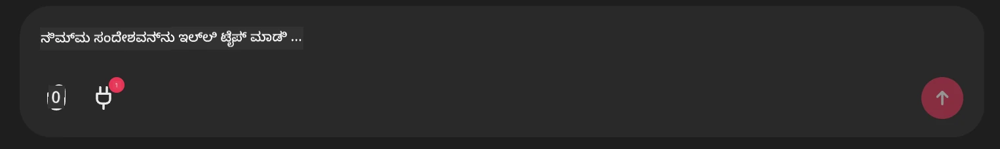

# Github MCP Server Example

## Description

ಈ ದೆಮೋವನ್ನು Microsoft Reactor ಮೂಲಕ ಆಯೋಜಿಸಲಾದ AI Agents Hackathon ಗಾಗಿ ರಚಿಸಲಾಗಿದೆ.

ಈ ಸಲಕರಣೆಗಳು ಬಳಕೆದಾರನ Github ರೆಪೋಗಳ ಆಧಾರದ ಮೇಲೆ ಹ್ಯಾಕಥಾನ್ ಯೋಜನೆಗಳನ್ನು ಶಿಫಾರಸು ಮಾಡಲು ಬಳಸಲಾಗುತ್ತವೆ.
ಇದು ಕೆಳಗಿನದರಿಂದ ಮಾಡಲಾಗುತ್ತದೆ:

1. **Github Agent** - Github MCP Server ಅನ್ನು ಬಳಸಿಕೊಂಡು ರೆಪೊಗಳನ್ನೂ ಆ ರೆಪೊಗಳ ಕುರಿತು ಮಾಹಿತಿಯನ್ನೂ ಪಡೆಯುತ್ತದೆ.
2. **Hackathon Agent** - Github Agent ನಿಂದ ಪಡೆದ ಡೇಟಾವನ್ನು ತೆಗೆದು ಆ ಪ್ರಾಜೆಕ್ಟ್‌ಗಳು, ಬಳಕೆದಾರ ಬಳಸಿ language ಗಳು ಮತ್ತು AI Agents ಹ್ಯಾಕಥಾನ್‍ನ ಪ್ರಾಜೆಕ್ಟ್ ಟ್ರ್ಯಾಕ್‌ಗಳ ಆಧಾರದ ಮೇಲೆ ಸೃಜನಾತ್ಮಕ ಹ್ಯಾಕಥಾನ್ ಪ್ರಾಜೆಕ್ಟ್ ಆئيಡಿಯಾಗಳನ್ನು ರಚಿಸುತ್ತದೆ.
3. **Events Agent** - Hackathon Agent ನ ಸಲಹೆಯ ಆಧಾರದ ಮೇಲೆ, Events Agent AI Agent Hackathon ಸರಣಿಯಿಂದ ಸಂಬಂಧಿತ イವೆಂಟ್ಗಳನ್ನು ಶಿಫಾರಸುಿಸುತ್ತದೆ.

## Running the code 

### Environment Variables

ಈ ದೆಮೋ Microsoft Agent Framework, Azure OpenAI Service, Github MCP Server ಮತ್ತು Azure AI Search ಅನ್ನು ಬಳಸುತ್ತದೆ.

ಈ Tools ಬಳಸಲು ಅಗತ್ಯವಿರುವ ಸರಿಯಾದ ಪರಿಸರ ಚರಗಳ (environment variables) ನಿಮಗಾಗಿ ಸರಿ ಹೊಂದಿದೆಯೆಂದು ಖಚಿತಪಡಿಸಿಕೊಳ್ಳಿ:

```python
AZURE_AI_PROJECT_ENDPOINT=""
AZURE_AI_MODEL_DEPLOYMENT_NAME=""
AZURE_SEARCH_SERVICE_ENDPOINT=""
AZURE_SEARCH_API_KEY=""
``` 

## Running the Chainlit Server

MCP ಸರ್ವರ್ ಗೆ ಸಂಪರ್ಕಿಸಲು, ಈ ದೆಮೋ ಚಾಟ್ ಇಂಟರ್ಫೇಸ್ ಆಗಿ Chainlit ಅನ್ನು ಬಳಸುತ್ತದೆ. 

ಸರ್ವರ್ ಅನ್ನು ರನ್ ಮಾಡಲು, ನಿಮ್ಮ ಟರ್ಮಿನಲ್‌ನಲ್ಲಿ ಕೆಳಗಿನ ಕಮಾಂಡ್ ಅನ್ನು ಬಳಸಿರಿ:

```bash
chainlit run app.py -w
```

ಇದು ನಿಮ್ಮ Chainlit ಸರ್ವರ್ ಅನ್ನು `localhost:8000` ನಲ್ಲಿ ಪ್ರಾರಂಭಿಸಬೇಕು ಮತ್ತು ಜೊತೆಗೆ `event-descriptions.md` ವಿಷಯದೊಂದಿಗೆ ನಿಮ್ಮ Azure AI Search Index ಅನ್ನು ಭರ್ತಿ ಮಾಡಬೇಕು. 

## Connecting to the MCP Server

Github MCP Server ಗೆ ಸಂಪರ್ಕಿಸಲು, "Type your message here.." ಚಾಟ್ ಬಾಕ್ಸ್‌ನ ಕೆಳಗೆ ಇರುವ "plug" ಐಕಾನ್ ಅನ್ನು ಆರಿಸಿ:



ಅಲ್ಲಿ ನೀವು "Connect an MCP" ಮೇಲೆ ಕ್ಲಿಕ್ ಮಾಡಿ Github MCP Server ಗೆ ಸಂಪರ್ಕಿಸಲು ಆ ಕಮಾಂಡ್ ಅನ್ನು ಸೇರಿಸಬಹುದು:

```bash
npx -y @modelcontextprotocol/server-github --env GITHUB_PERSONAL_ACCESS_TOKEN=[YOUR PERSONAL ACCESS TOKEN]
```

"[YOUR PERSONAL ACCESS TOKEN]" ಅನ್ನು ನಿಮ್ಮ ನಿಜವಾದ Personal Access Token ನೊಂದಿಗೆ ಬದಲಾಯಿಸಿ. 

ಸಂಪರ್ಕಿಸಿದ ನಂತರ, plug ಐಕಾನ್ ಪಕ್ಕದಲ್ಲಿ (1) ಕಾಣಿಸಬೇಕು ಅದು ಸಂಪರ್ಕಗೊಂಡಿದೆ ಎಂದು ಖಚಿತಪಡಿಸಿಕೊಳ್ಳಲು. ಕಾಣಿಸದಿದ್ದರೆ, `chainlit run app.py -w` ಬಳಸಿ chainlit ಸರ್ವರ್ ಅನ್ನು ಮರುಪ್ರಾರಂಭಿಸಲು ಯತ್ನಿಸಿ.

## Using the Demo 

ಹ್ಯಾಕಥಾನ್ ಯೋಜನೆಗಳ ಶಿಫಾರಸು ಮಾಡುವ ಏಜೆಂಟ್ ವರ್ಕ್ಫ್ಲೋ ಪ್ರಾರಂಭಿಸಲು, ನೀವು ಕೆಳಗಿನಂತೆಯಾದ ಸಂದೇಶವನ್ನು টাইಪ್ ಮಾಡಬಹುದು: 

"Github ಬಳಕೆದಾರ koreyspace ಗೆ ಹ್ಯಾಕಥಾನ್ ಯೋಜನೆಗಳನ್ನು ಶಿಫಾರಸು ಮಾಡಿ"

Router Agent ನಿಮ್ಮ ವಿನಂತಿಯನ್ನು ವಿಶ್ಲೇಷಿಸಿ ಯಾವ ಏಜೆಂಟ್‌ಗಳ (GitHub, Hackathon, ಮತ್ತು Events) ಸಂಯೋಜನೆ ನಿಮ್ಮ ಪ್ರಶ್ನೆಯನ್ನು ನಿರ್ವಹಿಸಲು ಉತ್ತಮವೆಂದು ನಿರ್ಧರಿಸಲಿದೆ. GitHub ರೆಪೊರಿಟೋರಿ ವಿಶ್ಲೇಷಣೆ, ಪ್ರಾಜೆಕ್ಟ್ ಐಡಿಯೇಷನ್ ಮತ್ತು ಸಂಬಂಧಿತ ಟೆಕ್ イವೆಂಟ್ಗಳ ಆಧಾರದ ಮೇಲೆ ಸಮಗ್ರ ಶಿಫಾರಸುಗಳನ್ನು ಒದಗಿಸಲು ಏಜೆಂಟ್‌ಗಳು ಒಟ್ಟಿಗೆ ಕೆಲಸ ಮಾಡುತ್ತವೆ.

---

<!-- CO-OP TRANSLATOR DISCLAIMER START -->
ಜವಾಬ್ದಾರಿ ನಿರಾಕರಣೆ:
ಈ ದಸ್ತಾವೇಜು AI ಅನುವಾದ ಸೇವೆ [Co-op Translator](https://github.com/Azure/co-op-translator) ಬಳಸಿ ಅನುವದಿಸಲಾಗಿದೆ. ನಾವು ಶುದ್ಧತೆಯಿಗಾಗಿ ಪ್ರಯತ್ನಿಸಿದರೂ, ಸ್ವಯಂಚಾಲಿತ ಅನುವಾದಗಳಲ್ಲಿ ತಪ್ಪುಗಳು ಅಥವಾ ಅನಿಖರತೆಗಳಿರಬಹುದು ಎಂಬುದನ್ನು ದಯವಿಟ್ಟು ಜ್ಞಾನದಲ್ಲಿರಿಸಿ. ಮೂಲ ಭಾಷೆಯಲ್ಲಿ ಇರುವ ಮೂಲ ದಸ್ತಾವೇಜನ್ನು ಅಧಿಕೃತವಾದ ಮೂಲವೆಂದು ಪರಿಗಣಿಸಬೇಕು. ಗಂಭೀರ ಮಾಹಿತಿಗಾಗಿ ವೃತ್ತಿಪರ ಮಾನವ ಅನುವಾದವನ್ನು ಬಳಸಲು ಶಿಫಾರಸು ಮಾಡಲಾಗುತ್ತದೆ. ಈ ಅನುವಾದದ ಬಳಕೆಯಿಂದ ಉಂಟಾಗುವ ಯಾವುದೇ ತಪ್ಪು ಗ್ರಹಿಕೆಗಳು ಅಥವಾ ತಪ್ಪು ವ್ಯಾಖ್ಯಾನಗಳಿಗಾಗಿ ನಾವು ಜವಾಬ್ದಾರರಲ್ಲ.
<!-- CO-OP TRANSLATOR DISCLAIMER END -->