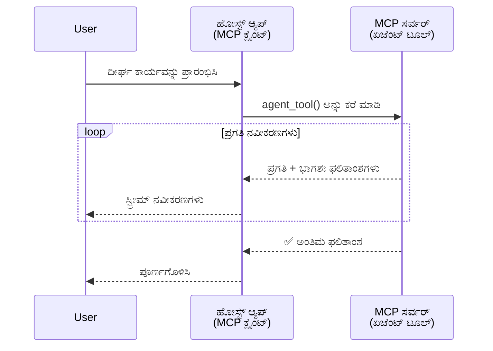
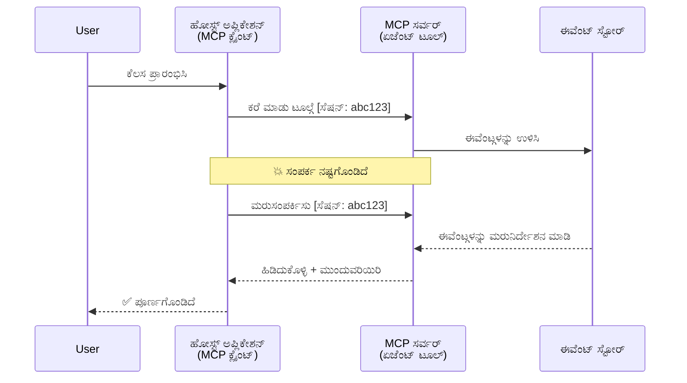
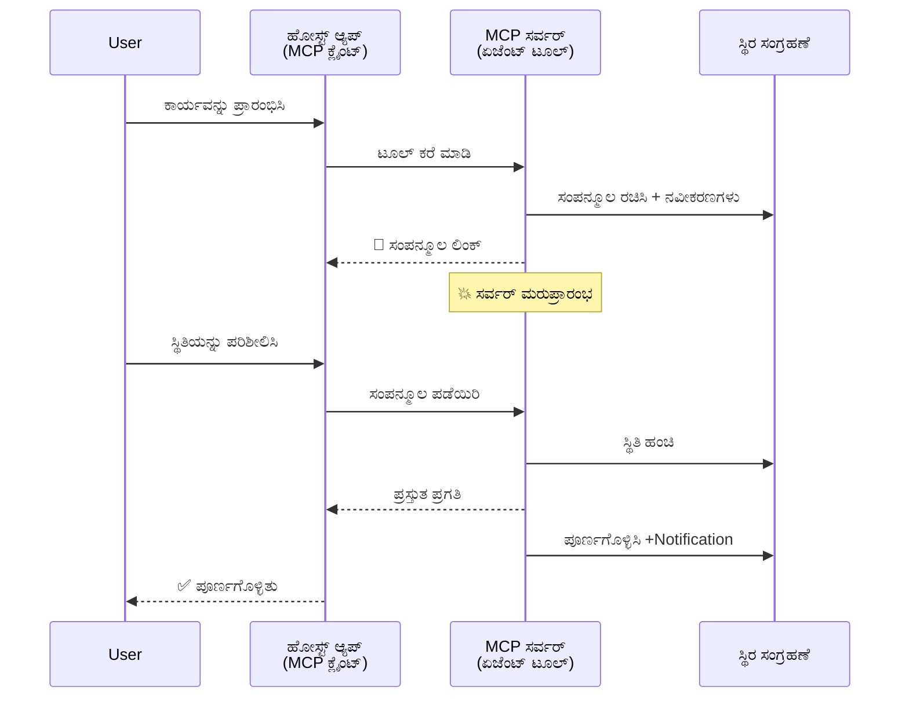
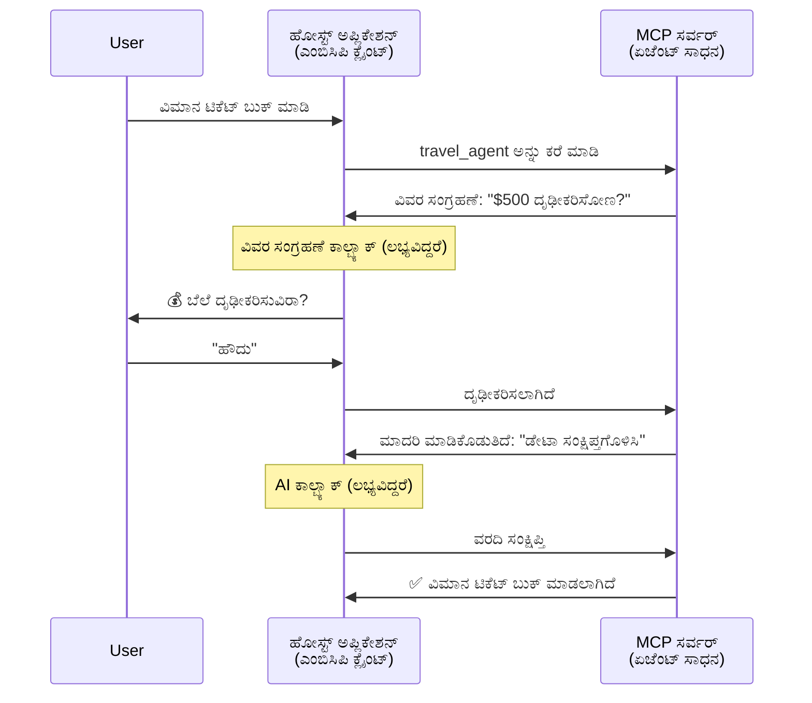
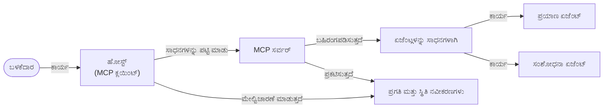

# MCPೊಂದಿಗೆ ಏಜೆಂಟ್-ಟು-ಏಜೆಂಟ್ ಸಂವಹನ ವ್ಯವಸ್ಥೆಗಳನ್ನು ನಿರ್ಮಿಸುವುದು

> ಸಂಕ್ಷಿಪ್ತ ಸಾರಾಂಶ - ನೀವು MCP ಮೇಲೆ ಏಜೆಂಟ್2ಏಜೆಂಟ್ ಸಂವಹನ ನಿರ್ಮಿಸಬಹುದಾ? ಹೌದು!

MCP ತನ್ನ ಮೂಲ ಗುರಿಯಾಗಿದ್ದ "LLMಗಳಿಗೆ ಸੰਦਰಭ್ಯವನ್ನು ಒದಗಿಸುವುದು" ಎನ್ನುವುದಕ್ಕಿಂತ ಬಹುಮುಖವಾಗಿ ಅಭಿವೃದ್ಧಿಯಾಗಿದೆ. [resumable streams](https://modelcontextprotocol.io/docs/concepts/transports#resumability-and-redelivery), [elicitation](https://modelcontextprotocol.io/specification/2025-06-18/client/elicitation), [sampling](https://modelcontextprotocol.io/specification/2025-06-18/client/sampling), ಮತ್ತು ಸೂಚನೆಗಳು ([ಪ್ರಗತಿ](https://modelcontextprotocol.io/specification/2025-06-18/basic/utilities/progress) ಮತ್ತು [ಸಂಪನ್ಮೂಲಗಳು](https://modelcontextprotocol.io/specification/2025-06-18/schema#resourceupdatednotification)) ಸೇರಿದಂತೆ ಇತ್ತೀಚಿನ ಸುಧಾರಣೆಗಳೊಂದಿಗೆ, MCP ಈಗ ಸಂಕೀರ್ಣ ಏಜೆಂಟ್-ಟು-ಏಜೆಂಟ್ ಸಂವಹನ ವ್ಯವಸ್ಥೆಗಳನ್ನು ನಿರ್ಮಿಸಲು ದೃಢವಾದ ಆಧಾರವನ್ನು ಒದಗಿಸುತ್ತದೆ.

## ಏಜೆಂಟ್/ಉಪಕರಣದ ತಪ್ಪು ಕಲ್ಪನೆ

ಹೆಚ್ಚು ಡೆವಲಪರ್‌ಗಳು ಏಜೆಂಟ್‌ಗಳಂತಹ ವರ್ತನೆಗಳನ್ನು ಹೊಂದಿರುವ ಉಪಕರಣಗಳನ್ನು (ದೀರ್ಘಕಾಲ ಚಾಲನೆಯಲ್ಲಿರಬಹುದು, ಮಧ್ಯದಲ್ಲಿ ಹೆಚ್ಚುವರಿ ಇನ್‌ಪುಟ್ ಬೇಕಾಗಬಹುದು, ಇತ್ಯಾದಿ) ಅನ್ವೇಷಿಸಿಕೊಂಡಂತೆ, ಸಾಮಾನ್ಯ ತಪ್ಪು ಗ್ರಹಿಕೆಯಾಗಿದೆ ದೃಶ್ಯವಾಗಿದ್ದು MCP ಅಸಮರ್ಥ ಎಂದು, ಮೂಲತಃ ಅದರ ಮೊದಲ ಉದಾಹರಣೆಗಳಲ್ಲಿ ಉಪಕರಣಗಳು ಸರಳ ವಿನಂತಿ-ಪ್ರತಿಕ್ರಿಯೆ ಮಾದರಿಗಳ ಮೇಲೆ ಕೇಂದ್ರೀಕರಿಸಿರುವುದರಿಂದ ಆಗಿದೆ.

ಈ ದೃಷ್ಟಿಕೋಣ ಹಳೆಯದು. ಕಳೆದ ಕೆಲವು ತಿಂಗಳಿನಲ್ಲಿ MCP ವಿಶೇಷಣವು ದೀರ್ಘಕಾಲ ಚಾಲನೆಯಲ್ಲಿರುವ ಏಜೆಂಟ್ ವರ್ತನೆಗಾಗಿ ಅಗತ್ಯವಿರುವ ಸಾಮರ್ಥ್ಯಗಳನ್ನು ಹೆಚ್ಚಿಸುವ ಮೂಲಕ ಬಹಳ ಸುಧಾರಿಸಲ್ಪಟ್ಟಿದೆ:

- **ಸ್ಟ್ರೀಮಿಂಗ್ ಮತ್ತು ಭಾಗಶಃ ಫಲಿತಾಂಶಗಳು**: ಕಾರ್ಯನಿರ್ವಹಣೆ ವೇಳೆ实时 ಪ್ರಗತಿ ಅಪ್ಡೇಟ್‌ಗಳು
- **ಪುನಾರಾರಂಭ ಸಾಧ್ಯತೆ**: ಕ್ಲೈಂಟ್‌ಗಳು ಸಂಪರ್ಕ ತು೦ಬಿ ಮತ್ತೆ ಸಂಪರ್ಕಿಸಿ ಮುಂದುವರೆಯಬಹುದು
- **ದೃಢತೆ**: ಫಲಿತಾಂಶಗಳು ಸರ್ವರ್ ಮರುಪ್ರಾರಂಭಗಳ ನಂತರ ಬದುಕಿರುತ್ತವೆ (ಉದಾ: ಸಂಪನ್ಮೂಲ ಲಿಂಕ್‌ಗಳ ಮೂಲಕ)
- **ಬಹು-ಪರ್ಯಾಯ**: ಮಧ್ಯಮ ಇನ್‌ಪುಟ್ ಅನ್ನು ಎಲಿಸಿಟೇಶನ್ ಮತ್ತು ಸಮ್ಪ್ಲಿಂಗ್ ಮೂಲಕ ಕೈಗಾರಿಕೆಮಾಡಬಹುದು

ಈ ವೈಶಿಷ್ಟ್ಯಗಳನ್ನು ಸಂಯೋಜಿಸಿ ಸಂಕೀರ್ಣ ಏಜೆಂಟ್ ಮತ್ತು ಬಹು-ಏಜೆಂಟ್ ಅಪ್ಲಿಕೇಶನ್‌ಗಳನ್ನು ನಿರ್ಮಿಸಲಾಗಬಹುದು, ಎಲ್ಲವೂ MCP ಪ್ರೊಟೋಕಾಲ್‌ನಲ್ಲಿ ನಿಯೋಜಿಸಲಾಗಿದೆ.

ಉಲ್ಲೇಖಕ್ಕಾಗಿ, ನಾವು ಏಜೆಂಟ್ ಅನ್ನು MCP ಸರ್ವರ್‌ನಲ್ಲಿ ಲಭ್ಯವಿರುವ "ಉಪಕರಣ" ಎಂದು ಕರೆಯುತ್ತೇವೆ. ಇದರಿಂದ a_MC_ಪಿ ಕ್ಲೈಂಟ್ ಅನ್ನು ಅನುಷ್ಟಾನ ಮಾಡುವ ಮತ್ತು MCP ಸರ್ವರ್‌ನೊಂದಿಗೆ ಸೆಷನ್ ಸ್ಥಾಪಿಸುವಅನ್ವಯಿಕ(host) ಅಪ್ಲಿಕೇಶನ್ ಇದೆ ಎಂಬ ಅರ್ಥ.

## ಏಜೆಂಟ್ ಆಗಿರುವ MCP ಉಪಕರಣವನ್ನು ಏನು ಮಾಡುತ್ತದೆ?

ನಿರ್ವಹಣೆಗೆ ಮುನ್ನ, ದೀರ್ಘಕಾಲ ಚಾಲನೆಯಲ್ಲಿರುವ ಏಜೆಂಟ್‌ಗಳ ಬೆಂಬಲಕ್ಕಾಗಿ ಯಾವ ಮೂಲಸೌಕರ್ಯ ಬೇಕು ಎಂಬುದನ್ನು ಸ್ಥಾಪಿಸೋಣ.

> ನಾವು ಏಜೆಂಟ್ ಅನ್ನು ದೈರ್ಘಕಾಲ ಸ್ವತಂತ್ರವಾಗಿ ಕೆಲಸ ಮಾಡಲು ಸಾಧ್ಯವಿರುವ, ಭೌತಿಕ ಫೀಡ್‌ಬ್ಯಾಕ್ ಆಧಾರಿತ ಬದಲಾವಣೆ ಅಥವಾ ಬಹು ನಡುವಿನ ಸಂವಾದಗಳನ್ನು ನಿರ್ವಹಿಸಲು ಲಭ್ಯವಿರುವ ಎಂಟಿಟಿಯಾಗಿ ವ್ಯಾಖ್ಯಾನಿಸುವೆವು.

### 1. ಸ್ಟ್ರೀಮಿಂಗ್ ಮತ್ತು ಭಾಗಶಃ ಫಲಿತಾಂಶಗಳು

ನಿರಂತರ ಕಾರ್ಯಗಳಿಗೆ ಸಾಂಪ್ರದಾಯಿಕ ವಿನಂತಿ-ಪ್ರತಿಕ್ರಿಯೆ ಮಾದರಿಗಳು ಕೆಲಸ ಮಾಡುತ್ತವುವಲ್ಲ. ಏಜೆಂಟ್‌ಗಳು ನೀಡಬೇಕಾದವು:

- Echt ಕಾಲದ ಪ್ರಗತಿ ನವೀಕರಣಗಳು
- ಮಧ್ಯಂತರ ಫಲಿತಾಂಶಗಳು

**MCP ಬೆಂಬಲ**: ಸಂಪನ್ಮೂಲ ಅಪ್ಡೇಟ್ ಸೂಚನೆಗಳು ಭಾಗಶಃ ಫಲಿತಾಂಶಗಳ ಸ್ಟ್ರೀಮಿಂಗ್‌ಗೆ ನೆರವಾಗುತ್ತವೆ, ಆದಾಗ್ಯೂ ಇದಕ್ಕೆ JSON-RPC 1:1 ವಿನಂತಿ/ಪ್ರತಿಕ್ರಿಯೆ ಮಾದರಿಯೊಂದಿಗೆ ಸಂಘರ್ಷ ತಪ್ಪಿಸಲು ಜಾಗರೂಕ ವಿನ್ಯಾಸ ಅಗತ್ಯ.

| ವೈಶಿಷ್ಟ್ಯ                   | ಬಳಕೆದಾರ ಪ್ರಕರಣ                                                                                                                                            | MCP ಬೆಂಬಲ                                                                                 |
| -------------------------- | ------------------------------------------------------------------------------------------------------------------------------------------------------------ | ------------------------------------------------------------------------------------------ |
| Echt ಕಾಲದ ಪ್ರಗತಿ ನವೀಕರಣಗಳು | ಬಳಕೆದಾರ ಕೋಡ್‌ಬೇಸ್ ಮಾರ್ಜಿನ್ ಕಾರ್ಯವನ್ನು ವಿನಂತಿಸುತ್ತಾರೆ. ಏಜೆಂಟ್ ಪ್ರಗತಿ ಸ್ಟ್ರೀಮ್ ಮಾಡುತ್ತದೆ: "10% - ಅವಲಂಬನೆಗಳನ್ನು ವಿಶ್ಲೇಷಿಸುತ್ತಿರುವುದು... 25% - ಟೈಪ್ಸ್ಕ್ರಿಪ್ಟ್ ಫೈಲ್‌ಗಳನ್ನು ಪರಿವರ್ತಿಸುವುದು... 50% - ಆಮದುಗಳನ್ನು ನವೀಕೃತಗೊಳಿಸುವುದು..." | ✅ ಪ್ರಗತಿ ಸೂಚನೆಗಳು                                                                               |
| ಭಾಗಶಃ ಫಲಿತಾಂಶಗಳು            | "ಪುಸ್ತಕ ರಚನೆ" ಕಾರ್ಯವೊಂದಕ್ಕೆ ಭಾಗಶಃ ಫಲಿತಾಂಶಗಳನ್ನು ಸ್ಟ್ರೀಮ್ ಮಾಡಲಾಗಿದೆ, ಉದಾ: 1) ಕಥಾಸಾರಾಂಶ ರೇಖಾಚಿತ್ರ, 2) ಅಧ್ಯಾಯಪಟ್ಟಿ, 3) ಪ್ರತಿ ಅಧ್ಯಾಯ ಸಂಪೂರ್ಣಗೊಂಡಿದೆ. ಹೋಸ್ಟ್ ಇದನ್ನು ಪರಿಶೀಲಿಸಬಹುದು, ರದ್ದು ಮಾಡಬಹುದು ಅಥವಾ ಯಾವುದೇ ಹಂತದಲ್ಲಿ ಪುನರುದ್ದೇಶಿಸಬಹುದು. | ✅ ಸೂಚನೆಗಳನ್ನು "ವಿಸ್ತರಿಸಲಾಗಬಹುದು" ಭಾಗಶಃ ಫಲಿತಾಂಶಗಳನ್ನು ಒಳಗೊಂಡಂತೆ; PR 383, 776 ಮೇಲಿನ ಪ್ರಸ್ತಾವನೆಗಳನ್ನು ನೋಡಿ  |

<div align="center" style="font-style: italic; font-size: 0.95em; margin-bottom: 0.5em;">
<strong>ಚಿತ್ರ 1:</strong> ಈ ಚಿತ್ರಣವು MCP ಏಜೆಂಟ್‍ಗಳು ದೀರ್ಘಕಾಲ ಚಲಿಸುವ ಕಾರ್ಯದ ಹೊತ್ತು ಹೋಸ್ಟ್ ಅಪ್ಲಿಕೇಶನ್‌ಗೆ Echt ಕಾಲದ ಪ್ರಗತಿ ನವೀಕರಣಗಳು ಮತ್ತು ಭಾಗಶಃ ಫಲಿತಾಂಶಗಳನ್ನು ಸ್ಟ್ರೀಮ್ ಮಾಡುವ ರೀತಿಯನ್ನು ಚಿತ್ರಿಸುತ್ತದೆ, ಬಳಕೆದಾರರಿಗೆ ಕಾರ್ಯನಿರ್ವಹಣೆ Echt ಕಾಲದಲ್ಲಿ ಮೇಲ್ವಿಚಾರಣೆ ಮಾಡಲು ಅನುಮತಿಸುತ್ತದೆ.
</div>



### 2. ಪುನಾರಾರಂಭ ಸಾಧ್ಯತೆ

ಏಜೆಂಟ್‌ಗಳು ಜಾಲತಾಣ ವ್ಯತ್ಯಯಗಳನ್ನು ಚೆನ್ನಾಗಿ ನಿರ್ವಹಿಸಬೇಕಾಗುತ್ತದೆ:

- (ಕ್ಲೈಂಟ್) ಸಂಪರ್ಕ ತುಂಡಾದ ನಂತರ ಮರು ಸಂಪರ್ಕ
- ಬಿಟ್ಟು ಬಂದ ಸ್ಥಳದಿಂದ ಮುಂದುವರಿಯುವುದು (ಸಂದೇಶ ಮರುವಿತರಣೆಯೊಂದಿಗೆ)

**MCP ಬೆಂಬಲ**: MCP StreamableHTTP ಸಾರಣಿಕೆಯು ಸೆಷನ್ ಪುನಾರಂಭ ಮತ್ತು ಸಂದೇಶ ಮರುವಿತರಣೆಯೊಂದಿಗೆ ಸೆಷನ್ IDಗಳು ಮತ್ತು ಕೊನೆಯ ಘಟನೆಯ IDಗಳನ್ನು ಬೆಂಬಲಿಸುತ್ತದೆ. ಇಲ್ಲಿನ ಪ್ರಮುಖ ವಿಷಯವೆಂದರೆ, ಸರ್ವರ್ ಒಂದು EventStore ಅನ್ನು ಆಡುಗೊಳಿಸಬೇಕು, ಇದು ಗ್ರಾಹಕರ ಮರುಕನೆಕ್ಷನ್ ವೇಳೆ ಘಟನೆಯ ಪುನರುಚ್ಚರಣೆಗಳನ್ನು ಸಾಧ್ಯವಾಗಿಸುತ್ತದೆ.  
ಸಮುದಾಯ ಪ್ರಸ್ತಾವನೆ (PR #975) ಮಾರ್ಗ ಸರದಾರ ರಹಿತ ಪುನಾರಾರಂಭ ಹೊಂದುವ ಸ್ಟ್ರೀಮ್‌ಗಳ ಅಧ್ಯಯನ ಮಾಡುತ್ತಿದೆ.

| ವೈಶಿಷ್ಟ್ಯ       | ಬಳಕೆದಾರ ಪ್ರಕರಣ                                                                                                                                              | MCP ಬೆಂಬಲ                                                                 |
| ------------ | ----------------------------------------------------------------------------------------------------------------------------------------------------------- | ------------------------------------------------------------------------- |
| ಪುನಾರಾರಂಭ ಸಾಧ್ಯತೆ | ದೀರ್ಘಕಾಲದ ಕಾರ್ಯದ ವೇಳೆ ಕ್ಲೈಂಟ್ ಡಿಸ್ಕನೆಕ್ಟ್ ಆಗುತ್ತದೆ. ಮರು ಸಂಪರ್ಕದ ನಂತರ ಸೆಷನ್ ಪುನಾರಂಭಿಸಿದೆ, ತಪ್ಪಿದ ಘಟನೆಯುಗಳು ಮರುವಿಚಾರಣೆ ಮಾಡಲ್ಪಟ್ಟಿದ್ದು, ಮೊದಲಿರುವ ಸ್ಥಳದಿಂದ ಆ ಕಾರ್ಯ ನಿರಂತರವಾಗಿ ನಡೆಯುತ್ತದೆ. | ✅ StreamableHTTP ಸಾರಣಿಕೆ ಸೆಷನ್ IDಗಳೊಂದಿಗೆ, ಘಟನೆಯ ಪುನರುಪಯೋಗ, ಮತ್ತು EventStore |

<div align="center" style="font-style: italic; font-size: 0.95em; margin-bottom: 0.5em;">
<strong>ಚಿತ್ರ 2:</strong> ಈ ಚಿತ್ರಣವು MCP StreamableHTTP ಸಾರಣಿ ಮತ್ತು ಇವೆಂಟ್ ಸ್ಟೋರ್ ದ್ವಾರಾ ಸುಗಮವಾದ ಸೆಷನ್ ಪುನಾರಂಭವನ್ನು ಹೇಗೆ ಸಾದ್ಯಮಾಡಬಹುದು ಎಂಬುದನ್ನು ತೋರುತ್ತದೆ: ಗ್ರಾಹಕ ಸಂಪರ್ಕ ತು೦ಬಿದ್ದರೂ ಮರು ಸಂಪರ್ಕಿಸಿ ತಪ್ಪಿದ ಘಟನಗಳನ್ನು ಮರುಪಠಿಸಬಹುದು ಮತ್ತು ಪ್ರಗತಿಯನ್ನು ನಷ್ಟಮಾಡದೆ ಕಾರ್ಯವನ್ನು ಮುಂದುವರೆಸಬಹುದು.
</div>



### 3. ದೃಢತೆ

ದೀರ್ಘಕಾಲ ಚಾಲನೆಯಲ್ಲಿರುವ ಏಜೆಂಟ್‌ಗಳಿಗೆ ಇರುವ ಸ್ಥಿರ ಸ್ಥಿತಿ ಬೇಕು:

- ಫಲಿತಾಂಶಗಳು ಸರ್ವರ್ ಮರುಪ್ರಾರಂಭದ ನಂತರ ಬದುಕಿರುತ್ತವೆ
- ಸ್ಥಿತಿಯನ್ನು ಹೊರಗಿನ ಮೂಲಗಳಿಂದ ಪಡೆಯಬಹುದು
- ಸೆಷನ್‌ಗಳ ಮಧ್ಯೆ ಪ್ರಗತಿ ಮೇಲ್ವಿಚಾರಣೆ

**MCP ಬೆಂಬಲ**: MCP ಈಗ ಟೂಲ್ ಕರೆಗಳಿಗೆ Resource link Return type ಅನ್ನು ಬೆಂಬಲಿಸುತ್ತದೆ. ಇಂದಿನ ನಮೂನಾ ಮಾದರಿಯು ಒಂದು ಟೂಲ್ ಅನ್ನು ವಿನ್ಯಾಸಗೊಳಿಸಬಹುದು, ಇದು ಸಂಪನ್ಮೂಲವನ್ನು ಸೃಷ್ಟಿಸಿ ತಕ್ಷಣ resource link ಅನ್ನು ಹಿಂದಿರುಗಿಸುತ್ತದೆ. ಟೂಲ್ ಹಿನ್ನಲೆಯಲ್ಲಿ ಕಾರ್ಯನಿರ್ವಹಿಸಿ ಆ ಸಂಪನ್ಮೂಲವನ್ನು ನವೀಕರಿಸಬಹುದು. ಗ್ರಾಹಕ ಈ ಸಂಪನ್ಮೂಲದ ಸ್ಥಿತಿಯನ್ನು ಪಾಲ್ ಮಾಡಿ ಭಾಗಶಃ ಅಥವಾ ಪೂರ್ಣ ಫಲಿತಾಂಶಗಳನ್ನು ಪಡೆಯಬಹುದು (ಸರ್ವರ್ ನೀಡುವ resource update_notification ಆಧಾರಿತವಾಗಿ) ಅಥವಾ ಅಪ್‌ಡೇಟ್ ಸೂಚನೆಗಳಿಗಾಗಿ ಆ resource ಗೆ ಸಬ್ಸ್ಕ್ರೈಬ್ ಮಾಡಬಹುದು.

ಇಲ್ಲಿ ಒಂದು ಮಿತಿ ಇದೆ: ಸಂಪನ್ಮೂಲಗಳನ್ನು ಪಾಲ್ ಮಾಡುವ ಅಥವಾ ಅಪ್‌ಡೇಟ್‌ಗಳಿಗೆ ಸಬ್ಸ್ಕ್ರೈಬ್‌ ಆಗುವುದು ಸಂಶೋಧನೆಯ ಸೌಲಭ್ಯಗಳನ್ನು ಹೆಚ್ಚಿಸುತ್ತದೆ, ಇದು ವ್ಯಾಪಕ ಪ್ರಮಾಣದಲ್ಲಿ ಪರಿಣಾಮ ಬೀರುತ್ತದೆ. ಸರ್ವರ್ ಅಪ್‌ಡೇಟ್‌ಗಳ ಬಗ್ಗೆ ಗ್ರಾಹಕ/ಹೋಸ್ಟ್‌ ಅಪ್ಲಿಕೇಷನ್‌ಗೆ ಕರೆಮಾಡಲು webhook ಅಥವಾ ಟ್ರಿಗ್ಗರ್‌ಗಳನ್ನು ಸೇರಿಸುವ ಸಾಧ್ಯತೆಗಳನ್ನು ಪರಿಶೀಲಿಸುತ್ತಿರುವ ಮುಕ್ತ ಸಮುದಾಯ ಪ್ರಸ್ತಾಪ (ಸಹಿತ #992) ಇದೆ.

| ವೈಶಿಷ್ಟ್ಯ    | ಬಳಕೆದಾರ ಪ್ರಕರಣ                                                                                                                               | MCP ಬೆಂಬಲ                                                       |
| ---------- | ---------------------------------------------------------------------------------------------------------------------------------------------- | ----------------------------------------------------------------- |
| ದೃಢತೆ     | ಡೇಟಾ ಮைக್ರೇಶನ್ ಕಾರ್ಯದ ಸಮಯ ಸರ್ವರ್ ಕ್ರ್ಯಾಶ್ ಆಗುತ್ತದೆ. ಫಲಿತಾಂಶಗಳು ಮತ್ತು ಪ್ರಗತಿ ಮರುಪ್ರಾರಂಭ ನಂತ್ರ ಉಳಿಯುತ್ತವೆ, ಗ್ರಾಹಕರು ಸ್ಥಿತಿಯನ್ನು ಪರಿಶೀಲಿಸಬಹುದು ಮತ್ತು ಹೊಂದಾಣಿಕೆಯ ಸಂಪನ್ಮೂಲದಿಂದ ಮುಂದುವರಿಯಬಹುದು. | ✅ ಸಂಪನ್ಮೂಲ ಕೊಂಡಿಗಳು ಸ್ಥಿರ ಸಂಗ್ರಹ ಮತ್ತು ಸ್ಥಿತಿ ಸೂಚನೆಗಳೊಂದಿಗೆ                    |

ಇಂದಿನ ಸಾಮಾನ್ಯ ಮಾದರಿ ಒಂದು ಟೂಲ್ ವಿನ್ಯಾಸಗೊಳಿಸುವುದು, ಇದು ಒಂದು ಸಂಪನ್ಮೂಲವನ್ನು ಸೃಷ್ಟಿಸಿ ತಕ್ಷಣ resource link ಅನ್ನು ಮರಳಿಸುತ್ತದೆ. ಟೂಲ್ ಹಿನ್ನಲೆಯಲ್ಲಿ ಕಾರ್ಯನಿರ್ವಹಿಸಿ ಆ ಸಂಪನ್ಮೂಲವನ್ನು ನವೀಕರಿಸುತ್ತದೆ, resource notifications ಮೂಲಕ ಪ್ರಗತಿ ನವೀಕರಣಗಳನ್ನು ಅಥವಾ ಭಾಗಶಃ ಫಲಿತಾಂಶಗಳನ್ನು ಒದಗಿಸುತ್ತದೆ ಮತ್ತು ಅಗತ್ಯವಿದ್ದರೆ ಸಂಪನ್ಮೂಲದ ವಿಷಯವನ್ನು ನವೀಕರಿಸುತ್ತದೆ.

<div align="center" style="font-style: italic; font-size: 0.95em; margin-bottom: 0.5em;">
<strong>ಚಿತ್ರ 3:</strong> ಈ ಚಿತ್ರಣವು MCP ಏಜೆಂಟ್‌ಗಳು ದೀರ್ಘಕಾಲ ಚಾಲನೆಯಲ್ಲಿರುವ ಕಾರ್ಯಗಳು ಸರ್ವರ್ ಮರುಪ್ರಾರಂಭಗಳünden ನಂತರವೂ ಬದುಕು \u200cಕೋರುವುದಕ್ಕಾಗಿ ಸ್ಥಿರ ಸಂಪನ್ಮೂಲಗಳು ಮತ್ತು ಸ್ಥಿತಿ ಸೂಚನೆಗಳನ್ನು ಹೇಗೆ ашигಿಸುತ್ತವೆ ಎಂಬುದನ್ನು ತೋರಿಸುತ್ತದೆ, ಇದರಿಂದ ಗ್ರಾಹಕರು ಪ್ರಗತಿಯನ್ನು ಪರಿಶೀಲಿಸಿ ಫಲಿತಾಂಶಗಳನ್ನು ಪಡೆಯಬಹುದು.
</div>



### 4. ಬಹು-ಪರ್ಯಾಯಿ ಸಂವಹನ

ಏಜೆಂಟ್‌ಗಳಿಗೆ ಸಾಧ್ಯತೆಯಾದರೆ ಮಧ್ಯದ ಕಾರ್ಯಕ್ಕಾಗಿ ಹೆಚ್ಚುವರಿ ಇನ್‌ಪುಟ್ ಬೇಕಾಗಬಹುದು:

- ಮಾನವ ಸ್ಪಷ್ಟನೆ ಅಥವಾ ಅನುಮೋದನೆ
- ಸಂಕೀರ್ಣ ತೀರ್ಮಾನಗಳಿಗೆ AI ಸಹಾಯ
- ಡೈನಾಮಿಕ್ ಪರಿಮಾಣಗಳ ಸರಿಹೊಂದಿಕೆ

**MCP ಬೆಂಬಲ**: AI ಇನ್‌ಪುಟ್‌ಗೆ sampling ಮತ್ತು ಮಾನವ ಇನ್‌ಪುಟ್‌ಗೆ elicitation ಮೂಲಕ ಸಂಪೂರ್ಣ ಬೆಂಬಲ.

| ವೈಶಿಷ್ಟ್ಯ              | ಬಳಕೆದಾರ ಪ್ರಕರಣ                                                                                                                                   | MCP ಬೆಂಬಲ                                                   |
| ---------------------- | -------------------------------------------------------------------------------------------------------------------------------------------------- | ----------------------------------------------------------- |
| ಬಹು-ಪರ್ಯಾಯಿ ಸಂವಹನ       | ಪಯಾಣ ಬುಕ್ಕಿಂಗ್ ಏಜೆಂಟ್ ಬಳಕೆದಾರರಿಂದ ಬೆಲೆ ದೃಢೀಕರಣ ಕೇಳುತ್ತದೆ, ನಂತರ ಬುಕ್ಕಿಂಗ್ ಪೂರ್ಣಗೊಳ್ಳುವ ಮೊದಲು ಪಯಾಣದ ಡೇಟಾವನ್ನು AI ಮೂಲಕ ಸಾರಾಂಶಗೊಳಿಸಲು ಕೇಳುತ್ತದೆ.                           | ✅ elicitation ಮಾನವ ಇನ್‌ಪುಟ್, sampling AI ಇನ್‌ಪುಟ್‌ಗೆ          |

<div align="center" style="font-style: italic; font-size: 0.95em; margin-bottom: 0.5em;">
<strong>ಚಿತ್ರ 4:</strong> ಈ ಚಿತ್ರಣ MCP ಏಜೆಂಟ್‌ಗಳು ಹೇಗೆ ಮಧ್ಯ ಕಾರ್ಯದ ವೇಳೆ ಮಾನವ ಇನ್‌ಪುಟ್‌ ಪಡೆಯಲು ಅಥವಾ AI ಸಹಾಯವನ್ನು ಕೋರಲು ಎದುರಾಳಿ ಸಂವಹನ ನಡೆಸಬಹುದು ಎಂಬುದನ್ನು ತೋರುತ್ತದೆ, ಇದು ದೃಢೀಕರಣಗಳು ಮತ್ತು ಡೈನಾಮಿಕ್ ನಿರ್ಧಾರಮಾಡುವಂತಹ ಸಂಕೀರ್ಣ ಬಹು-ಪರ್ಯಾಯಿ ಕಾರ್ಯಪ್ರವಿಧಾನಗಳನ್ನು ಬೆಂಬಲಿಸುತ್ತದೆ.
</div>



## MCP ಮೇಲೆ ದೀರ್ಘಕಾಲ ಚಾಲನೆಯಲ್ಲಿರುವ ಏಜೆಂಟ್‌ಗಳನ್ನು ನೆನಪುಿಸಿಕೊಳ್ಳುವುದು - ಕೋಡ್ ಅವಲೋಕನ

ಈ ಲೇಖನದ ಭಾಗವಾಗಿ, ನಾವು [ಕೋಡ್ ರಿಪೋಜಿಟರಿ](https://github.com/victordibia/ai-tutorials/tree/main/MCP%20Agents) ಒದಗಿಸುತ್ತೇವೆ, ಇದು MCP ಪೈಥಾನ್ SDK ಮತ್ತು StreamableHTTP ಸಾರಣಿಯನ್ನು ಬಳಸಿಕೊಂಡು ದೀರ್ಘಕಾಲ ಚಾಲನೆಯಲ್ಲಿರುವ ಏಜೆಂಟ್‌ಗಳ ಸಂಪೂರ್ಣ ಅನುಷ್ಠಾನವನ್ನು ಒಳಗೊಂಡಿದೆ, ಸೆಷನ್ ಪುನಾರಂಭ ಮತ್ತು ಸಂದೇಶ ಮರುವಿತರಣೆಗೆ ಸಹಾಯಕವಾಗಿದೆ. ಈ ಅನುಷ್ಠಾನವು MCP ಸಾಮರ್ಥ್ಯಗಳನ್ನು ಸಂಯೋಜಿಸಿ ಸೂಚಿಸಲಾಗುವ ಏಜೆಂಟ್ ತರಹದ ವರ್ತನೆಗಳನ್ನು ಸೃಷ್ಟಿಸುವುದನ್ನು ತೋರಿಸುತ್ತದೆ.

ವಿಶೇಷವಾಗಿ, ನಾವು ಎರಡು ಪ್ರಮುಖ ಏಜೆಂಟ್ ಉಪಕರಣಗಳೊಂದಿಗೆ ಒಂದು ಸರ್ವರ್ ಅನುಷ್ಠಾನಗೊಳಿಸುತ್ತೇವೆ:

- **ಪಯಾಣ ಏಜೆಂಟ್** - elicitation ಮೂಲಕ ಬೆಲೆ ದೃಢೀಕರಣದೊಂದಿಗೆ ಪಯಾಣ ಬುಕ್ಕಿಂಗ್ ಸೇವೆಯನ್ನು ಅನುಕರಿಸುವುದು
- **ಅನ್ವೇಷಣಾ ಏಜೆಂಟ್** - sampling ಮೂಲಕ AI ಸಹಾಯದಿಂದ ಸಂಶೋಧನಾ ಕಾರ್ಯಗಳನ್ನು ನಿರ್ವಹಿಸುವುದು

ಎರಡೂ ಏಜೆಂಟ್‌ಗಳು Echt ಕಾಲದ ಪ್ರಗತಿ ನವೀಕರಣಗಳು, ಇಂಟರೆಕ್ಟಿವ್ ದೃಢೀಕರಣಗಳು ಮತ್ತು ಪೂರ್ಣ ಸೆಷನ್ ಪುನಾರಂಭ ಸಾಮರ್ಥ್ಯಗಳನ್ನು ತೋರಿಸುತ್ತವೆ.

### ಪ್ರಮುಖ ಅನುಷ್ಠಾನ ಪರಿಕಲ್ಪನೆಗಳು

ಕೆಳಗಿನ ವಿಭಾಗಗಳು ಪ್ರತಿ ಸಾಮರ್ಥ್ಯಕ್ಕಾಗಿ ಸರ್ವರ್-ವದಿ ಏಜೆಂಟ್ ಅನುಷ್ಠಾನ ಮತ್ತು ಗ್ರಾಹಕ-ವದಿ ಹೋಸ್ಟ್ ನಿರ್ವಹಣೆಯನ್ನು ತೋರುತ್ತವೆ:

#### ಸ್ಟ್ರೀಮಿಂಗ್ ಮತ್ತು ಪ್ರಗತಿ ನವೀಕರಣಗಳು - Echt ಕಾಲದ ಕಾರ್ಯ ಸ್ಥಿತಿ

ಸ್ಟ್ರೀಮಿಂಗ್ ದೀರ್ಘಕಾಲದ ಕಾರ್ಯಗಳ ವೇಳೆಯಲ್ಲಿ Echt ಕಾಲದ ಪ್ರಗತಿ ನವೀಕರಣಗಳನ್ನು ಒದಗಿಸಲು ಏಜೆಂಟ್‌ಗಳಿಗೆ ಸಹಾಯ ಮಾಡುತ್ತದೆ, ಬಳಕೆದಾರರಿಗೆ ಕಾರ್ಯ ಸ್ಥಿತಿಯ ಮತ್ತು ಮಧ್ಯಂತರ ಫಲಿತಾಂಶಗಳ ಕುರಿತ ಮಾಹಿತಿ ನೀಡುತ್ತದೆ.

**ಸರ್ವರ್ ಅನುಷ್ಠಾನ (ಏಜೆಂಟ್ ಪ್ರಗತಿ ಸೂಚನೆಗಳನ್ನು ಕಳುಹಿಸುತ್ತದೆ):**

```python
# ಸರ್ವರ್/server.py ನಿಂದ - ಪ್ರವಾಸ ಏಜೆಂಟ್ ಪ್ರಗತಿಯ ನವೀಕರಣಗಳನ್ನು ಕಳುಹಿಸುವುದು
for i, step in enumerate(steps):
    await ctx.session.send_progress_notification(
        progress_token=ctx.request_id,
        progress=i * 25,
        total=100,
        message=step,
        related_request_id=str(ctx.request_id)
    )
    await anyio.sleep(2)  # ಕೆಲಸವನ್ನು ನಕಲಿಸುವುದು

# ಪರ್ಯಾಯ: ವಿವರವಾದ ಹಂತ-ಹಂತದ ನವೀಕರಣಗಳಿಗಾಗಿ ಸಂದೇಶಗಳನ್ನು ದಾಖಲಿಸಿ
await ctx.session.send_log_message(
    level="info",
    data=f"Processing step {current_step}/{steps} ({progress_percent}%)",
    logger="long_running_agent",
    related_request_id=ctx.request_id,
)
```

**ಗ್ರಾಹಕ ಅನುಷ್ಠಾನ (ಹೋಸ್ಟ್ ಪ್ರಗತಿ ನವೀಕರಣಗಳನ್ನು ಸ್ವೀಕರಿಸುತ್ತದೆ):**

```python
# client/client.py ನಿಂದ - ಕ್ಲೈಂಟ್ ಸತ್ಯ ಸಮಯದ ಸೂಚನೆಗಳನ್ನು ನಿರ್ವಹಿಸುತ್ತಿದೆ
async def message_handler(message) -> None:
    if isinstance(message, types.ServerNotification):
        if isinstance(message.root, types.LoggingMessageNotification):
            console.print(f"📡 [dim]{message.root.params.data}[/dim]")
        elif isinstance(message.root, types.ProgressNotification):
            progress = message.root.params
            console.print(f"🔄 [yellow]{progress.message} ({progress.progress}/{progress.total})[/yellow]")

# ಸೆಷನ್ ರಚಿಸುವಾಗ ಸಂದೇಶ ಸಂಬಳವನ್ನು ನೋಂದಣಿ ಮಾಡಿ
async with ClientSession(
    read_stream, write_stream,
    message_handler=message_handler
) as session:
```

#### elicitation - ಬಳಕೆದಾರ ಇನ್‌ಪುಟ್ ಕೇಳುವುದು

elicitation ಮೂಲಕ ಏಜೆಂಟ್‌ಗಳು ಮಧ್ಯ ಕಾರ್ಯದಲ್ಲಿ ಬಳಕೆದಾರ ಇನ್‌ಪುಟ್ ಕೋರುತ್ತವೆ. ಇದು ದೃಢೀಕರಣಗಳು, ಸ್ಪಷ್ಟತೆ, ಅಥವಾ ದೀರ್ಘಕಾಲದ ಕಾರ್ಯಗಳಲ್ಲಿ ಅನುಮೋದನೆಗಳಿಗೆ ಅಗತ್ಯ.

**ಸರ್ವರ್ ಅನುಷ್ಠಾನ (ಏಜೆಂಟ್ ದೃಢೀಕರಣ ಕೇಳುತ್ತದೆ):**

```python
# ಸರ್ವರ್/server.py ನಿಂದ - ಪ್ರಯಾಣ ಏಜೆಂಟ್ ಬೆಲೆ ದೃಢೀಕರಣಕ್ಕಾಗಿ ವಿನಂತಿ ಮಾಡುತ್ತಿದೆ
elicit_result = await ctx.session.elicit(
    message=f"Please confirm the estimated price of $1200 for your trip to {destination}",
    requestedSchema=PriceConfirmationSchema.model_json_schema(),
    related_request_id=ctx.request_id,
)

if elicit_result and elicit_result.action == "accept":
    # ಬುಕಿಂಗ್ ಅನ್ನು ಮುಂದುವರಿಸಿ
    logger.info(f"User confirmed price: {elicit_result.content}")
elif elicit_result and elicit_result.action == "decline":
    # ಬುಕಿಂಗ್ ರದ್ದುಮಾಡಿ
    booking_cancelled = True
```

**ಗ್ರಾಹಕ ಅನುಷ್ಠಾನ (ಹೋಸ್ಟ್ elicitation ಕಾಲ್ಬ್ಯಾಕ್ ಅನ್ನು ಒದಗಿಸುತ್ತದೆ):**

```python
# client/client.py ನಿಂದ - ಕ್ಲಯಿಂಟ್ ನಿರ್ವಹಣೆ ઇಲಿಸિટેશન ವಿನಂತಿಗಳು
async def elicitation_callback(context, params):
    console.print(f"💬 Server is asking for confirmation:")
    console.print(f"   {params.message}")

    response = console.input("Do you accept? (y/n): ").strip().lower()

    if response in ['y', 'yes']:
        return types.ElicitResult(
            action="accept",
            content={"confirm": True, "notes": "Confirmed by user"}
        )
    else:
        return types.ElicitResult(
            action="decline",
            content={"confirm": False, "notes": "Declined by user"}
        )

# ಸೆಷನ್ ರಚಿಸುವಾಗ ಕಾಲ್‌ಬ್ಯಾಕ್ ನೋಂದಣಿ ಮಾಡಿ
async with ClientSession(
    read_stream, write_stream,
    elicitation_callback=elicitation_callback
) as session:
```

#### sampling - AI ಸಹಾಯ ಕೇಳುವುದು

sampling ಮೂಲಕ ಏಜೆಂಟ್‌ಗಳು ಸಂಕೀರ್ಣ ತೀರ್ಮಾನಗಳ್ಳಿ LLM ಸಹಾಯ ಅಥವಾ ವಿಷಯ ರಚನೆ ಕೋರುತ್ತವೆ. ಇದು ಮಾನವ- AI ಸಂಯೋಜಿತ ಕಾರ್ಯಪ್ರವಾಹಗಳನ್ನು ಸಾದ್ಯಮಾಡುತ್ತದೆ.

**ಸರ್ವರ್ ಅನುಷ್ಠಾನ (ಏಜೆಂಟ್ AI ಸಹಾಯ ಕೇಳುತ್ತದೆ):**

```python
# server/server.py ನಿಂದ - ಸಂಶೋಧನಾ ಏಜೆಂಟ್ AI ಸಾರಾಂಶವನ್ನು ಕೇಳುತ್ತಿದೆ
sampling_result = await ctx.session.create_message(
    messages=[
        SamplingMessage(
            role="user",
            content=TextContent(type="text", text=f"Please summarize the key findings for research on: {topic}")
        )
    ],
    max_tokens=100,
    related_request_id=ctx.request_id,
)

if sampling_result and sampling_result.content:
    if sampling_result.content.type == "text":
        sampling_summary = sampling_result.content.text
        logger.info(f"Received sampling summary: {sampling_summary}")
```

**ಗ್ರಾಹಕ ಅನುಷ್ಠಾನ (ಹೋಸ್ಟ್ sampling ಕಾಲ್ಬ್ಯಾಕ್ ಒದಗಿಸುತ್ತದೆ):**

```python
# client/client.py ನಿಂದ - ಕ್ಲೈಂಟ್ ನಿದರ್ಶನ ವಿನಂತಿಗಳನ್ನು ಹ್ಯಾಂಡಲ್ ಮಾಡುವುದು
async def sampling_callback(context, params):
    message_text = params.messages[0].content.text if params.messages else 'No message'
    console.print(f"🧠 Server requested sampling: {message_text}")

    # ವಾಸ್ತವಿಕ ಅಪ್ಲಿಕೇಶನ್ ನಲ್ಲಿ, ಇದು LLM API ಅನ್ನು ಕರೆ ಮಾಡಬಹುದು
    # ಡೆಮೊ ಉದ್ದೇಶಗಳಿಗೆ, ನಾವು ಒಂದು ನಕಲಿ ಪ್ರತಿಕ್ರಿಯೆಯನ್ನು ಒದಗಿಸುತ್ತೇವೆ
    mock_response = "Based on current research, MCP has evolved significantly..."

    return types.CreateMessageResult(
        role="assistant",
        content=types.TextContent(type="text", text=mock_response),
        model="interactive-client",
        stopReason="endTurn"
    )

# ಸೆಷನ್ ರಚಿಸುವಾಗ ಕಾಲ್‌ಬ್ಯಾಕ್ ಅನ್ನು ನೋಂದಾಯಿಸಿ
async with ClientSession(
    read_stream, write_stream,
    sampling_callback=sampling_callback,
    elicitation_callback=elicitation_callback
) as session:
```

#### ಪುನಾರಾರಂಭ ಸಾಧ್ಯತೆ - ಸಂಪರ್ಕ ತು೦ಬಿದ ಕೂಡಲೇ ಸೆಷನ್ ನಿರಂತರತೆ

ಪುನಾರಾರಂಭ ಸಾಧ್ಯತೆ ದೀರ್ಘಕಾಲ ಕಾರ್ಯಗಳನ್ನು ಸಹ ಗ್ರಾಹಕ ಸಂಪರ್ಕ ತುಂಡಾದರೂ ಬದುಕಿಸುವುದು ಮತ್ತು ಮರು ಸಂಪರ್ಕದೊಂದಿಗೆ ನೊಂದಿಸುಗೊಳ್ಳುವಂತೆ ಮಾಡುತ್ತದೆ. ಇದು ಘಟನೆಗಳ ಸಂಗ್ರಹಣಾ ಮತ್ತು ಪುನಾರಂಭ ಟೋಕನ್‌ಗಳ ಮೂಲಕ ಸಾದ್ಯ.

**ಇವೆಂಟ್ ಸ್ಟೋರ್ ಅನುಷ್ಠಾನ (ಸರ್ವರ್ ಸೆಷನ್ ಸ್ಥಿತಿಯನ್ನು ಕಾಯ್ದಿರಿಸುತ್ತದೆ):**

```python
# server/event_store.py ನಿಂದ - ಸರಳ ಸಂ ಜ್ಞಾಪನೆಯಾಗಿರುವ ಘಟನೆ ಸಂಗ್ರಹणಾಲಯ
class SimpleEventStore(EventStore):
    def __init__(self):
        self._events: list[tuple[StreamId, EventId, JSONRPCMessage]] = []
        self._event_id_counter = 0

    async def store_event(self, stream_id: StreamId, message: JSONRPCMessage) -> EventId:
        """Store an event and return its ID."""
        self._event_id_counter += 1
        event_id = str(self._event_id_counter)
        self._events.append((stream_id, event_id, message))
        return event_id

    async def replay_events_after(self, last_event_id: EventId, send_callback: EventCallback) -> StreamId | None:
        """Replay events after the specified ID for resumption."""
        # ಕೊನೆಯ ತಿಳಿದಿರುವ ಘಟನೆಯ ನಂತರದ ಘಟನೆಗಳನ್ನು ಹುಡುಕಿ ಅವುಗಳನ್ನು ಮರುನಡುವಿರಿ
        for _, event_id, message in self._events[start_index:]:
            await send_callback(EventMessage(message, event_id))

# server/server.py ನಿಂದ - ಘಟನೆ ಸಂಗ್ರಹಣಾಲಾಯವನ್ನು ಸೆಷನ್ મેನೇಜರ್ ಗೆ ಪಾಸು ಮಾಡುವುದು
def create_server_app(event_store: Optional[EventStore] = None) -> Starlette:
    server = ResumableServer()

    # ಪುನರುದ್ದೇಶಕ್ಕಾಗಿ ಘಟನೆ ಸಂಗ್ರಹಣಾಲಯದೊಂದಿಗೆ ಸೆಷನ್ ಮೇನೇಜರ್ ರಚಿಸಿ
    session_manager = StreamableHTTPSessionManager(
        app=server,
        event_store=event_store,  # ಘಟನೆ ಸಂಗ್ರಹಣಾಲಯವು ಸೆಷನ್ ಪುನರುದ್ದೇಶವನ್ನು ಅನುಮತಿಸುತ್ತದೆ
        json_response=False,
        security_settings=security_settings,
    )

    return Starlette(routes=[Mount("/mcp", app=session_manager.handle_request)])

# ಬಳಕೆ: ಘಟನ ಸಂಗ್ರಹಣಾಲಯದೊಂದಿಗೆ ಪ್ರಾರಂಭಿಸಿ
event_store = SimpleEventStore()
app = create_server_app(event_store)
```

**ಪುನಾರಂಭ ಟೋಕನ್ ಜೊತೆಗೆ ಗ್ರಾಹಕ ಮೆಟಾಡೇಟಾ (ಗ್ರಾಹಕ ಸಂಗ್ರಹಿತ ಸ್ಥಿತಿಯಿಂದ ಮರು ಸಂಪರ್ಕ):**

```python
# client/client.pyದಿಂದ - ಮೆಟಾಡೇಟಾ ಜೊತೆ ಕ್ಲೈಂಟ್ ಪುನರಾರಂಭ
if existing_tokens and existing_tokens.get("resumption_token"):
    # ನಾವು ಬಿಡಿಸಿದ ಜಾಗದಿಂದ ಮುಂದುವರೆಯಲು ಇತ್ತೀಚಿಗಿರುವ ಪುನರಾರಂಭ ಟೋಕನ್ ಬಳಸಿ
    metadata = ClientMessageMetadata(
        resumption_token=existing_tokens["resumption_token"],
    )
else:
    # ಪುನರಾರಂಭ ಟೋಕನ್ ಬಂದಾಗ ಉಳಿಸಲು ಕಾಲ್‌ಬ್ಯಾಕ್ ರಚಿಸಿ
    def enhanced_callback(token: str):
        protocol_version = getattr(session, 'protocol_version', None)
        token_manager.save_tokens(session_id, token, protocol_version, command, args)

    metadata = ClientMessageMetadata(
        on_resumption_token_update=enhanced_callback,
    )

# ಪುನರಾರಂಭ ಮೆಟಾಡೇಟಾ ಜೊತೆಗೆ ವಿನಂತಿ ಕಳುಹಿಸಿ
result = await session.send_request(
    types.ClientRequest(
        types.CallToolRequest(
            method="tools/call",
            params=types.CallToolRequestParams(name=command, arguments=args)
        )
    ),
    types.CallToolResult,
    metadata=metadata,
)
```

ಹೋಸ್ಟ್ ಅಪ್ಲಿಕೇಶನ್ ಸ್ಥಳೀಯವಾಗಿ ಸೆಷನ್ IDಗಳು ಮತ್ತು ಪುನಾರಂಭ ಟೋಕನ್‌ಗಳನ್ನು ನಿರ್ವಹಣೆ ಮಾಡಿ, ಪ್ರಗತಿ ಅಥವಾ ಸ್ಥಿತಿಯನ್ನು ಕಳೆದುಕೊಳ್ಳದೆ ಅಸ್ತಿತ್ವದಲ್ಲಿರುವ ಸೆಷನ್‌ಗಳಿಗೆ ಮತ್ತೆ ಸಂಪರ್ಕಿಸಬಹುದು.

### ಕೋಡ್ ಸಂಘಟನೆ

<div align="center" style="font-style: italic; font-size: 0.95em; margin-bottom: 0.5em;">
<strong>ಚಿತ್ರ 5:</strong> MCP ಆಧಾರಿತ ಏಜೆಂಟ್ ವ್ಯವಸ್ಥೆ ವಾಸ್ತುಶಿಲ್ಪ
</div>



**ಪ್ರಮುಖ ಕಡತಗಳು:**

- **`server/server.py`** - ಎಲಿಸಿಟೇಶನ್, ಸಮ್ಪ್ಲಿಂಗ್ ಮತ್ತು ಪ್ರಗತಿ ನವೀಕರಣಗಳನ್ನು ತೋರಿಸುವ ಪುನಾರಂಭ ಸೌಲಭ್ಯಗ ಭರಿತ MCP ಸರ್ವರ್, ಪಯಾಣ ಮತ್ತು ಸಂಶೋಧನೆ ಏಜೆಂಟ್‌ಗಳೊಂದಿಗೆ
- **`client/client.py`** - ಪುನಾರಂಭ ಬೆಂಬಲ, ಕಾಲ್ಬ್ಯಾಕ್ ಹ್ಯಾಂಡ್ಲರ್ ಗಳು ಮತ್ತು ಟೋಕನ್ ನಿರ್ವಹಣೆನೊಂದಿಗೆ ಇಂಟರೆಕ್ಟೀವ್ ಹೋಸ್ಟ್ ಅಪ್ಲಿಕೇಷನ್
- **`server/event_store.py`** - ಸೆಷನ್ ಪುನಾರಂಭ ಹಾಗೂ ಸಂದೇಶ ಮರುವಿತರಣೆಗೆ ಇರುವ ಇವೆಂಟ್ ಸ್ಟೋರ್ ಅನುಷ್ಠಾನ

## MCP ನಲ್ಲಿ ಬಹು-ಏಜೆಂಟ್ ಸಂವಹನಕ್ಕೆ ವಿಸ್ತರಣೆ

ಮೇಲಿನ ಅನುಷ್ಠಾನವನ್ನು ಇರಿಸಿಕೊಂಡು ಹೆಚ್ಚಿನ host ಅಪ್ಲಿಕೇಷನ್ বುದ್ಧಿವಂತಿಕೆಯನ್ನು ಮತ್ತು ವ್ಯಾಪ್ತಿಯನ್ನು ಹೆಚ್ಚಿಸುವ ಮೂಲಕ ಬಹು-ಏಜೆಂಟ್ ವ್ಯವಸ್ಥೆಗಳಾಗಿ ವಿಸ್ತರಿಸಬಹುದು:

- **ಬುದ್ಧಿವಂತಿಕೆ ಕಾರ್ಯ ವಿಭಜನೆ**: ಹೋಸ್ಟ್ ಸಂಕೀರ್ಣ ಬಳಕೆದಾರ ವಿನಂತಿಗಳನ್ನು ವಿಶ್ಲೇಷಿಸಿ ವಿಭಿನ್ನ ಪರಿಣಿತ ಏಜೆಂಟ್‌ಗಳಿಗೆ ಉಪಕಾರ್ಯಗಳಿಂದ ಭಾಗಮಾಡುವುದು
- **ಬಹು-ಸರ್ವರ್ ಸಂಯೋಜನೆ**: MCP ಸರ್ವರ್‌ಗಳಿಗೆ ಒಂದಕ್ಕಿಂತ ಹೆಚ್ಚುವರಿ ಸಂಪರ್ಕಗಳನ್ನು ಜೋಪಾನದಿಂದ ನಿರ್ವಹಿಸುತ್ತಿರುವ, ಪ್ರತಿ ಒಂದರಲ್ಲಿ ವಿಭಿನ್ನ ಏಜೆಂಟ್ ಸಾಮರ್ಥ್ಯಗಳನ್ನೊಳಗೊಂಡಿರುವ ಹೋಸ್ಟ್
- **ಕಾರ್ಯ ಸ್ಥಿತಿ ನಿರ್ವಹಣೆ**: ಹೋಸ್ಟ್ ಒಂದೇ ಕಾಲದಲ್ಲಿ ಹಲವಾರು ಏಜೆಂಟ್ ಕಾರ್ಯಗಳ ಪ್ರಗತಿಯನ್ನು ಹತ್ತಿರದಿಂದ ಪರಿಶೀಲಿಸಿ ಅವಲಂಬನೆಗಳು ಮತ್ತು ಕ್ರಮಣಾ ನಿರ್ವಹಣೆಯನ್ನು ಮಾಡುವುದು
- **ಸಹನಶೀಲತೆ ಮತ್ತು ಮರುಪ್ರಯತ್ನಗಳು**: ಹೋಸ್ಟ್ ವಿಫಲತೆಗಳನ್ನು ನಿರ್ವಹಿಸಿ, ಮರುಪ್ರಯತ್ನ ಲಾಜಿಕ್ ಅನುಷ್ಠಾನಗೊಳಿಸಿ ಮತ್ತು ಏಜೆಂಟ್ ನಿರೀಕ್ಷೆ ಬಿಟ್ಟುಹೋಗಿದಾಗ ಕಾರ್ಯಗಳನ್ನು ಪುನರ್ ಮಾರ್ಗ ಮಾಡುವುದು
- **ಫಲಿತಾಂಶ ಸಂಶ್ಲೇಷಣೆ**: ಹೋಸ್ಟ್ ಹಲವಾರು ಏಜೆಂಟ್‌ಗಳಿಂದ ಫಲಿತಾಂಶಗಳನ್ನು ಸಂಯೋಜಿಸಿ ಸಜ್ಞಾನತಮಕ ಅಂತಿಮ ಫಲಿತಾಂಶ ರಚಿಸುತ್ತದೆ

ಹೋಸ್ಟ್ ಸರಳ ಗ್ರಾಹಕದಿಂದ ಬುದ್ಧಿವಂತ ಸಂಯೋಜಕನಾಗಿ ಅಭಿವೃದ್ಧಿ ಹೊಂದುತ್ತದೆ, ವಿತರಿತ ಏಜೆಂಟ್ ಸಾಮರ್ಥ್ಯಗಳನ್ನು ಸಮನ್ವಯಗೊಳಿಸುವಾಗ MCP ಪ್ರೊಟೋಕಾಲ್ ಮೂಲಾಧಾರವನ್ನು ನಿರ್ವಹಿಸುತ್ತಿದೆ.

## ಸಮಾರೋಪ

MCP ನ್ದು ಹೆಚ್ಚಿದ ಸಾಮರ್ಥ್ಯಗಳು - ಸಂಪನ್ಮೂಲ ಸೂಚನೆಗಳು, elicitation/sampling, ಪುನಾರಂಭ ಹೊಂದಿರುವ ಸ್ಟ್ರೀಮ್‌ಗಳು ಮತ್ತು ಸ್ಥಿರ ಸಂಪನ್ಮೂಲಗಳು - ಸಂಕೀರ್ಣ ಏಜೆಂಟ್-ಟು-ಏಜೆಂಟ್ ಸಂವಹನಗಳನ್ನು ಪ್ರೊಟೋಕಾಲ್ ಸರಳತೆಯೊಂದಿಗೆ ಸಾಧ್ಯವಾಗಿಸುತ್ತವೆ.

## ಪ್ರಾರಂಭಿಸಲು

ನಿಮ್ಮ ಸ್ವಂತ agent2agent ವ್ಯವಸ್ಥೆಯನ್ನು ನಿರ್ಮಿಸಲು ಸಿದ್ಧರಾಗಿದ್ದೀರಾ? ಈ ಹಂತಗಳನ್ನು ಅನುಸರಿಸಿ:

### 1. ಡೆಮೋ ಓಡಿಸಿ

```bash
# ಪುನರಾರಂಭಕ್ಕೆ ಇವೆಂಟ್ ಸ್ಟೋರ್ ಸಹಿತ ಸರ್ವರ್ ಅನ್ನು ಪ್ರಾರಂಭಿಸಿ
python -m server.server --port 8006

# ಮತ್ತೊಂದು ಟರ್ಮಿನಲ್‌ನಲ್ಲಿ ಸಂವಾದಾತ್ಮಕ ಕ್ಲೈಂಟ್ ಅನ್ನು ನಿರ್ವಹಿಸಿ
python -m client.client --url http://127.0.0.1:8006/mcp
```

**ಇಂಟರಾಕ್ಟಿವ್ ಮೋಡ್‌ನಲ್ಲಿ ಲಭ್ಯವಿರುವ ಕಮಾಂಡ್‌ಗಳು:**

- `travel_agent` - elicitation ಮೂಲಕ ಬೆಲೆ ದೃಢೀಕರಣದೊಂದಿಗೆ ಪಯಾಣ ಬುಕ್ಕಿಂಗ್
- `research_agent` - sampling ಮೂಲಕ AI ಸಹಾಯದಿಂದ ಸಂಶೋಧನಾ ವಿಷಯಗಳು
- `list` - ಲಭ್ಯವಿರುವ ಎಲ್ಲಾ ಉಪಕರಣಗಳನ್ನು ತೋರಿಸಿ
- `clean-tokens` - ಪುನಾರರ್ಭ ಟೋಕನ್‌ಗಳನ್ನು ತೆರವುಗೊಳಿಸಿ
- `help` - ವಿವರವಾದ ಕಮಾಂಡ್ ಸಹಾಯ ತೋರಿಸಿ
- `quit` - ಗ್ರಾಹಕದಿಂದ ನಿರ್ಗಮಿಸಿ

### 2. ಪುನಾರಂಭ ಸಾಮರ್ಥ್ಯಗಳನ್ನು ಪರೀಕ್ಷಿಸಿ

- ದೀರ್ಘಕಾಲದ ಏಜೆಂಟ್ ಚಾಲನೆಯ ಆರಂಭ ಮಾಡಿ (ಉದಾ: `travel_agent`)
- ಕಾರ್ಯನಿರ್ವಹಿಸುವಾಗ ಗ್ರಾಹಕನ್ನು ಅಡ್ಡಿಪಡಿಸಿ (Ctrl+C)
- ಗ್ರಾಹಕವನ್ನು ಮರುಪ್ರಾರಂಭಿಸಿ - ಅದು ತನ್ನ ಮುಂಚಿತ ಸ್ಥಿತಿಯಿಂದ ಸ್ವಯಂಚಾಲಿತವಾಗಿ ಮುಂದುವರಿಯುತ್ತದೆ

### 3. ಅನ್ವೇಷಿಸಿ ಮತ್ತು ವಿಸ್ತರಿಸಿ

- **ಉದಾಹರಣೆಗಳನ್ನು ಪರೀಕ್ಷಿಸಿ**: ಈ [mcp-agents](https://github.com/victordibia/ai-tutorials/tree/main/MCP%20Agents)
- **ಸಮುದಾಯದಲ್ಲಿ ಸೇರಿ**: GitHub ನಲ್ಲಿ MCP ಚರ್ಚೆಗಳಲ್ಲಿ ಪಾಲ್ಗೊಳ್ಳಿ
- **ಪ್ರಯೋಗ ಮಾಡಿ**: ಸರಳ ದೀರ್ಘಕಾಲದ ಕಾರ್ಯದಿಂದ ಪ್ರಾರಂಭಿಸಿ, ಹಂತ ಹಂತವಾಗಿ ಸ್ಟ್ರೀಮಿಂಗ್, ಪುನಾರంభ ಮತ್ತು ಬಹು-ಏಜೆಂಟ್ ಸಂಯೋಜನೆ ಸೇರಿಸಿ

ಇದು MCP ಸಾಧನಾದರ್ಶವಾದ ಸರಳತೆ ಉಳಿಸುವಾಗ ಬುದ್ಧಿವಂತ ಏಜೆಂಟ್ ವರ್ತನೆಯನ್ನು ಹೇಗೆ ಸಾದ್ಯಮಾಡುತ್ತದೆ ಎಂಬುದನ್ನು ತೋರಿಸುತ್ತದೆ.

ಒಟ್ಟಾರೆ, MCP ಪ್ರೊಟೋಕಾಲ್ ಸ್ಪೆಕ್ ವೇಗವಾಗಿ ಬದಲೆಯುತ್ತಿದೆ; ಓದುಗಾರರು ಅಧಿಕೃತ ದಾಖಲಾತಿ ವೆಬ್‌ಸೈಟ್‌ನ ನವೀಕರಣಗಳನ್ನು ಪರಿಶೀಲಿಸಲು ಪ್ರೇರೇಪಿಸಲಾಗುತ್ತದೆ - https://modelcontextprotocol.io/introduction

---

<!-- CO-OP TRANSLATOR DISCLAIMER START -->
**ಅಸ್ವೀಕಾರ**:
ಈ ದಸ್ತಾವೇಜು AI ಅನುವಾದ ಸೇವೆ [Co-op Translator](https://github.com/Azure/co-op-translator) ಬಳಸಿ ಅನುವಾದಿಸಲಾಗಿದೆ. ನಾವು ನಿಖರತೆಯನ್ನು ಸಾಧಿಸಲು ಪ್ರಯತ್ನಿಸುತ್ತಿದ್ದರೂ, ದಯವಿಟ್ಟು ಗಮನಿಸಿ, ಸ್ವಯಂಚಾಲಿತ ಅನುವಾದಗಳಲ್ಲಿ ದೋಷಗಳು ಅಥವಾ ಅಸಡ್ಡೆಗಳು ಇರಬಹುದು. ಮೂಲ ಭಾಷೆಯಲ್ಲಿರುವ ಮೂಲ ದಸ್ತಾವೇಜು ಪ್ರಾಮಾಣಿಕ ಮೂಲವೆಂದು ಪರಿಗಣಿಸಬೇಕು. ಪ್ರಮುಖ ಮಾಹಿತಿಗಾಗಿ, ವೃತ್ತಿಪರ ಮಾನವ ಅನುವಾದವನ್ನು ಶಿಫಾರಸು ಮಾಡಲಾಗುತ್ತದೆ. ಈ ಅನುವಾದವನ್ನು ಬಳಸುವ ಮೂಲಕ ಉಂಟಾಗುವ ಯಾವುದೇ ತಪ್ಪು ಅರ್ಥಗಳ ಅಥವಾ ತಪ್ಪು ವ್ಯಾಖ್ಯಾನಗಳ ಬಗ್ಗೆ ನಾವು ಹೊಣೆಗಾರರಲ್ಲ.
<!-- CO-OP TRANSLATOR DISCLAIMER END -->