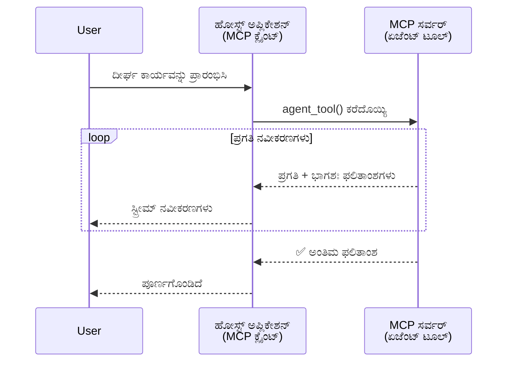
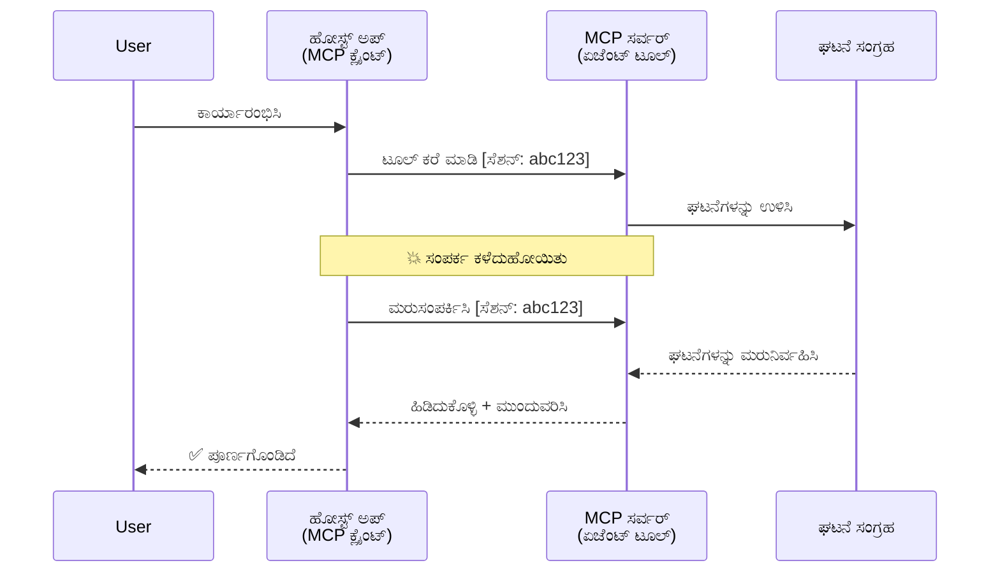
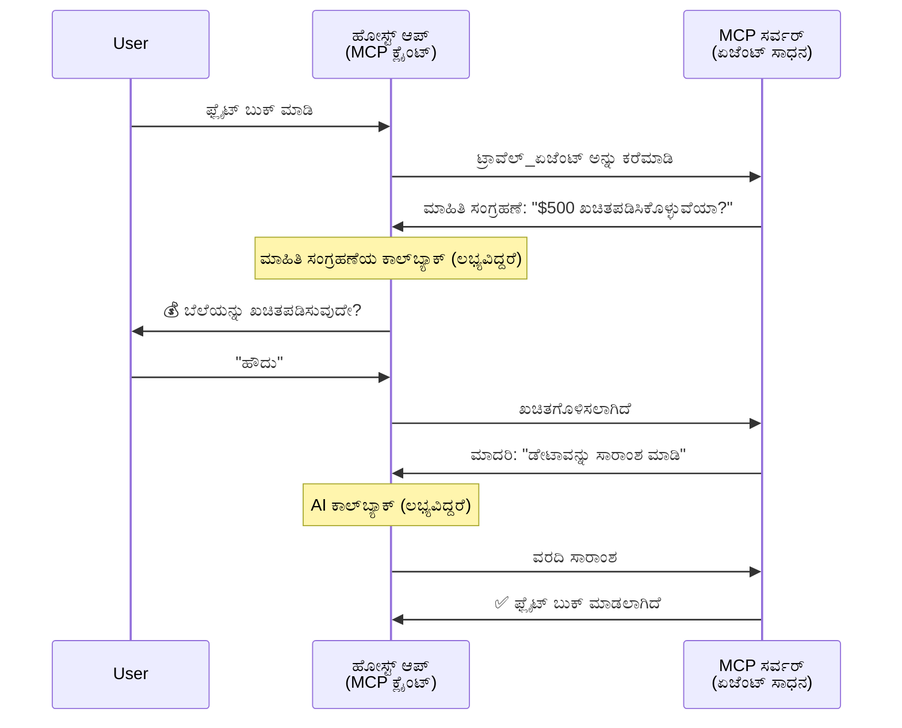
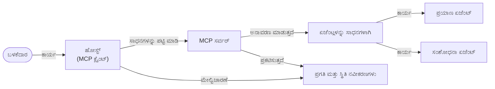

# MCP ಬಳಸಿ ಏಜೆಂಟ್-ಟು-ಏಜೆಂಟ್ ಸಂವಹನ ವ್ಯವಸ್ಥೆ ನಿರ್ಮಿಸುವುದು

> TL;DR - ನೀವು MCP ಮೇಲೆ ಏಜೆಂಟ್2ಏಜೆಂಟ್ ಸಂವಹನವನ್ನು ನಿರ್ಮಿಸಬಹುದೇ? ಹೌದು!

MCP ಮೂಲ ಗುರಿಯಾದ "LLMs ಗೆ ಸಂದರ್ಭವನ್ನು ಒದಗಿಸುವುದು" ಎಂಬುದನ್ನು ಮೀರಿಸಿ ಮಹತ್ವಪೂರ್ಣವಾಗಿ ಅಭಿವೃದ್ಧಿ ಹೊಂದಿದೆ. ಇತ್ತೀಚಿನ ಉತ್ತಮತೆಗಳಾದ [ಮರುಪ್ರಾರಂಭಿಸಬಲ್ಲ ಸ್ಟ್ರೀಮ್ಗಳು](https://modelcontextprotocol.io/docs/concepts/transports#resumability-and-redelivery), [ಪ್ರೇರಣೆ](https://modelcontextprotocol.io/specification/2025-06-18/client/elicitation), [ಸ್ಯಾಂಪ್ಲಿಂಗ್](https://modelcontextprotocol.io/specification/2025-06-18/client/sampling), ಮತ್ತು ನೋಟಿಫಿಕೇಶನ್ಗಳು ([ಪ್ರಗತಿ](https://modelcontextprotocol.io/specification/2025-06-18/basic/utilities/progress) ಮತ್ತು [ಸಂಪನ್ಮೂಲಗಳು](https://modelcontextprotocol.io/specification/2025-06-18/schema#resourceupdatednotification)) ಸೇರಿದಂತೆ, MCP ಈಗ ಜಟಿಲ ಏಜೆಂಟ್-ಟು-ಏಜೆಂಟ್ ಸಂವಹನ ವ್ಯವಸ್ಥೆಗಳ ನಿರ್ಮಾಣಕ್ಕೆ ಬಲವಾದ ಆಧಾರವನ್ನು ಒದಗಿಸುತ್ತದೆ.

## ಏಜೆಂಟ್/ಉಪಕರಣದ ತಪ್ಪು ಕಲ್ಪನೆ

ಹೆಚ್ಚು ಡೆವಲಪರ್‌ಗಳು ಏಜೆಂಟ್‌ಗಳ ಸ್ವಭಾವ (ಹೆಚ್ಚು ಸಮಯ ತೆರೆಯುವ, ಮಧ್ಯದ ಇನ್‌ಪುಟ್ ಅಗತ್ಯವಿರಬಹುದು, ಇತ್ಯಾದಿ) ಹೊಂದಿರುವ ಸಾಧನಗಳನ್ನು ಅನ್ವೇಷಿಸುವಂತೆ, ಸಾಮಾನ್ಯವಾಗಿರುವ ತಪ್ಪು ಕಲ್ಪನೆ MCP ಮುಖ್ಯವಾಗಿ ಅಸೋಷ್ಯೆಬಲ್ ಎಂದು ಸ್ಥಾಪಿಸುವುದು ಈಗಿನ ಸಾಧನ ಮಾದರಿಗಳು ಸರಳ ಕೋರಿ-ಪ್ರತಿಕ್ರಿಯಾ ಮಾದರಿಗಳ ಮೇಲೆ ಕೇಂದ್ರೀಕರಿಸಲ್ಪಟ್ಟಿರುವುದರಿಂದ.

ಈ ನೆಪವು ಹಳೆಯದು. MCP спецификация ಇತ್ತೀಚಿನ ಕೆಲ ತಿಂಗಳಿಂದ ಬಹುಮುಖ್ಯವಾಗಿ ಸುಧಾರಿಸಲಾಗಿದೆ, ಬಹು ಸಮಯ ಜೀವಿಸುವ ಏಜೆಂಟಿಕ್ ಸ್ವಭಾವ ನಿರ್ಮಾಣಕ್ಕೆ ಅಗತ್ಯವಿರುವ ಸಾಮರ್ಥ್ಯಗಳನ್ನು ಒಳಗೊಂಡಿದೆ:

- **ಸ್ಟ್ರೀಮಿಂಗ್ ಮತ್ತು ಭಾಗಶಃ ಫಲಿತಾಂಶಗಳು**: ಕಾರ್ಯಾಚರಣೆಯ ಸಮಯದಲ್ಲಿ ನೈಜ-ಸಮಯ ಪ್ರಗತಿ ನೋಟಿಫಿಕೇಶನ್ಗಳು
- **ಮರುಪ್ರಾರಂಭಿಸಬಹುದಾಗಿರುವುದು**: ಗ್ರಾಹಕರು ಸಂಪರ್ಕ ಕಳೆದುಕೊಂಡ ನಂತರ ಮತ್ತೆ ಸಂಪರ್ಕಪಡಿಸಿ ಮುಂದುವರಿಯಬಹುದು
- **ದೀರ್ಘకాలಿಕತೆ**: ಫಲಿತಾಂಶಗಳು ಸರ್ವರ್ ಮರುಪ್ರಾರಂಭದ ನಂತರವೂ ಉಳಿಯುತ್ತದೆ (ಉದಾ: ಸಂಪನ್ಮೂಲ ಲಿಂಕುಗಳ ಮೂಲಕ)
- **ಬಹು-ತಿರುಗು**: ಪ್ರೇರಣೆ ಮತ್ತು ಸ್ಯಾಂಪ್ಲಿಂಗ್ ಮೂಲಕ ಮಧ್ಯಂತರ ಇನ್‌ಪುಟ್ ಪಾಲುಗೊಳ್ಳುವುದು

ಈ ವೈಶಿಷ್ಟ್ಯಗಳನ್ನು ಸಂಯೋಜಿಸಿ ಜಟಿಲ ಏಜೆಂಟಿಕ್ ಮತ್ತು ಬಹು ಏಜೆಂಟ್ ಅಪ್ಲಿಕೇಶನ್ಗಳನ್ನು MCP ಪ್ರೋಟೋಕಾಲ್ ಮೇಲೆ ರೂಡುವುದು ಸಾಧ್ಯ.

ಉದಾಹರಣೆಗೆ, ನಾವು ಏಜೆಂಟ್ ಅನ್ನು MCP ಸರ್ವರ್‌ನಲ್ಲಿ ಲಭ್ಯವಿರುವ "ಉಪಕರಣ" ಎಂದು ಪರಿಗಣಿಸುವೆವು. ಇದರರ್ಥ, ಒಬ್ಬ ಹೋಸ್ಟ್ ಅಪ್ಲಿಕೇಶನ್ ಇದ್ದು ಅದು MCP ಕ್ಲೈಂಟ್ ಅನುಷ್ಠಾನಗೊಳಿಸುವುದು, ಮತ್ತು MCP ಸರ್ವರ್ ಜೊತೆಗೆ ಸೆಷನ್ ಸ್ಥಾಪಿಸಿ ಏಜೆಂಟ್ ಅನ್ನು ಕರೆಸಬಹುದು.

## MCP ಉಪಕರಣ "ಏಜೆಂಟಿಕ್" ಆಗಿರುವುದು ಯಾವುದು?

ಜಾರಿಗೆ ಬರುವ ಮುನ್ನ, ದೀರ್ಘಕಾಲীন ಏಜೆಂಟ್ಸಿಗೆ ಬೆಂಬಲ ಮಾಡುವ ಮೂಲ ಸಾಮರ್ಥ್ಯಗಳನ್ನು ಪರಿಗಣಿಸೋಣ.

> ನಾವು ಏಜೆಂಟ್ ಅನ್ನು ಸ್ವಾವಲಂಬಿಯಾಗಿ ಬಹು ಕಾಲಾವಧಿಯಲ್ಲಿ ಕಾರ್ಯನಿರ್ವಹಿಸಲು ಸಾಧ್ಯವಾದ, ಬಹು ಇಂಟರ್ಯಾಕ್ಷನ್ ಅಥವಾ ನೈಜ-ಸಮಯ ಪ್ರತಿಕ್ರಿಯೆಯ ಆಧಾರದ ಮೇಲೆ ಸರಿಹೊಂದಿಸುವಂತಹ ಸಂಕೀರutha ಕಾರ್ಯಗಳನ್ನು ನಿರ್ವಹಿಸಬಹುದಾದ ಘಟಕವಾಗಿ ವ್ಯಾಖ್ಯಾನಿಸುವೆವು.

### 1. ಸ್ಟ್ರೀಮಿಂಗ್ ಮತ್ತು ಭಾಗಶಃ ಫಲಿತಾಂಶಗಳು

ಪಾರಂಪರ್ಯ ಕೋರಿ-ಪ್ರತಿಕ್ರಿಯಾ ಮಾದರಿಗಳು ದೀರ್ಘಕಾಲದ ಕಾರ್ಯಗಳಿಗೆ ಸರಿಹೊಂದುವುದಿಲ್ಲ. ಏಜೆಂಟ್‌ಗಳಿಗೆ ಬೇಕಾಗಿರುವುದು:

- ನೈಜ-ಸಮಯ ಪ್ರಗತಿ ನೋಟಿಫಿಕೇಶನ್ಗಳು
- ಮಧ್ಯಂತರ ಫಲಿತಾಂಶಗಳು

**MCP ಬೆಂಬಲ**: ಸಂಪನ್ಮೂಲ ನವೀಕರಣ ನೋಟಿಫಿಕೇಶನ್ಗಳು ಭಾಗಶಃ ಫಲಿತಾಂಶಗಳನ್ನು ಸ್ಟ್ರೀಮ್ ಮಾಡಲು ಅನುಮತಿಸುತ್ತವೆ, ಆದಾಗ್ಯೂ JSON-RPC ರ 1:1 ಕೋರಿ/ಪ್ರತಿಕ್ರಿಯಾ ಮಾದರಿಯೊಂದಿಗೆ ಸಂಘರ್ಷ ತಪ್ಪಿಸಲು ಜಾಗರೂಕ ವಿನ್ಯಾಸ ಅಗತ್ಯ.

| ವೈಶಿಷ್ಟ್ಯ                 | ಬಳಕೆ ಪ್ರಕರಣ                                                                                                                                                                   | MCP ಬೆಂಬಲ                                                                                  |
| -------------------------- | -------------------------------------------------------------------------------------------------------------------------------------------------------------------------- | ------------------------------------------------------------------------------------------ |
| ನೈಜ-ಸಮಯ ಪ್ರಗತಿ ನೋಟಿಫಿಕೇಶನ್ಗಳು | ಬಳಕೆದಾರ ಕೋಡ್‌ಬೇಸ್ ಸ್ಥಳಾಂತರ ಕಾರ್ಯವನ್ನು ಕೇಳುತ್ತಾರೆ. ಏಜೆಂಟ್ ಪ್ರಗತಿಯನ್ನು ಸ್ಟ್ರೀಮ್ ಮಾಡುತ್ತದೆ: "10% - ಆಯ್ಕೆಯ ವಿಶ್ಲೇಷಣೆ... 25% - ಟೈಪ್ಸ್ಕ್ರಿಪ್ಟ್ ಫೈಲ್ ಪರಿವರ್ತನೆ... 50% - ಆಮದುಗಳನ್ನು ನವೀಕರಣೆ..." | ✅ ಪ್ರಗತಿ ನೋಟಿಫಿಕೇಶನ್ಗಳು                                                                        |
| ಭಾಗಶಃ ಫಲಿತಾಂಶಗಳು           | "ಪುಸ್ತಕ ರಚಿಸಿ" ಕಾರ್ಯ ಭಾಗಶಃ ಫಲಿತಾಂಶಗಳನ್ನು ಸ್ಟ್ರೀಮ್ ಮಾಡುತ್ತದೆ, ಉದಾ: 1) ಕಥಾ ರೇಖಾಚಿತ್ರ, 2) ಅಧ್ಯಾಯ ಪಟ್ಟಿ, 3) ಪ್ರತಿ ಅಧ್ಯಾಯ ಪೂರ್ಣಗೊಂಡಂತೆ. ಹೋಸ್ಟ್ ಯಾವಾಗಲಾದರೂ ಪರಿಶೀಲನೆ, ರದ್ದು, ಅಥವಾ ದಿಕ್ಕುಮಾರುವಿಕೆ ಮಾಡಬಹುದು. | ✅ ನೋಟಿಫಿಕೇಶನ್ಗಳನ್ನು "ವಿಸ್ತರಿಸಬಹುದಾಗಿದೆ" ಭಾಗಶಃ ಫಲಿತಾಂಶಗಳನ್ನು ಸೇರಿಸಲು - PR 383, 776 ಪ್ರಸ್ತಾವನೆಗಳನ್ನು ನೋಡಿ |

<div align="center" style="font-style: italic; font-size: 0.95em; margin-bottom: 0.5em;">
<strong>ಚಿತ್ರ 1:</strong> ಈ ಚಿತ್ರ MCP ಏಜೆಂಟ್ ದೀರ್ಘಕಾಲೀನ ಕಾರ್ಯದ ಸಮಯದಲ್ಲಿ ನೈಜ-ಸಮಯ ಪ್ರಗತಿ ನೋಟಿಫಿಕೇಶನ್ಗಳು ಮತ್ತು ಭಾಗಶಃ ಫಲಿತಾಂಶಗಳನ್ನು ಹೋಸ್ಟ್ ಅಪ್ಲಿಕೇಶನ್‌ಗೆ ಹೇಗೆ ಸ್ಟ್ರೀಮ್ ಮಾಡುತ್ತದೆ ಎಂಬುದನ್ನು ವಿವರಿಸುತ್ತದೆ, ಬಳಕೆದಾರರು ಕಾರ್ಯಾಚರಣೆಯನ್ನು ನೈಜ-ಸಮಯದಲ್ಲಿ ನೋಡಬಹುದು.
</div>



### 2. ಮರುಪ್ರಾರಂಭಿಸಬಹುದಾಗಿರುವುದು

ಏಜೆಂಟ್ಗಳು ನೆಟ್‌ವರ್ಕ್ ವಿಭಜನೆಗಳನ್ನು ನಯಪೂರ್ವಕವಾಗಿ ನಿರ್ವಹಿಸಬೇಕು:

- (ಗ್ರಾಹಕ) ಸಂಪರ್ಕ ಕಳೆದುಹೋದ ನಂತರ ಮರುಸಂಪರ್ಕಸ್ಥಾಪನೆ ಮಾಡುವುದು
- ಅವರು ಬಿಡಿಸಿಕೊಂಡಿದ್ದ ಸ್ಥಳದಿಂದ ಮುಂದುವರಿಯುವುದು (ಸಂದೇಶ ಮರುವಿತರಣಾ)

**MCP ಬೆಂಬಲ**: MCP StreamableHTTP ಸಾರಿಗೆ ಇವತ್ತು ಸೆಷನ್ ಮರುಪ್ರಾರಂಭ ಮತ್ತು ಸಂದೇಶ ಮರುವಿತರಣೆಗೆ ಸೆಷನ್ IDಗಳು ಮತ್ತು ಕೊನೆಯ ಘಟನೆ IDಗಳಿಂದ ಬೆಂಬಲ ನೀಡುತ್ತದೆ. ಮುಖ್ಯ ಸುದ್ದಿ: ಸರ್ವರ್ ಒಂದು ಈವೆಂಟ್ ಸ್ಟೋರ್ ಅನುಷ್ಠಾನಗೊಳಿಸಬೇಕು, ಹೀಗೆ ಗ್ರಾಹಕರು ಮರುಸಂಪರ್ಕಿಸಿದಾಗ ಘಟನೆಗಳ ಮರುಚಾಲನೆ ಸಾಧ್ಯ.
ಸಮುದಾಯ ಪ್ರಸ್ತಾವನೆ ಇದೆ (PR #975) ಅದು ಸಾರಿಗೆ-ಸ್ವತಂತ್ರ ಮರುಪ್ರಾರಂಭಿಸಬಹುದಾದ ಸ್ಟ್ರೀಮ್ಗಳನ್ನು ಪರೀಕ್ಷಿಸುತ್ತದೆ.

| ವೈಶಿಷ್ಟ್ಯ       | ಬಳಕೆ ಪ್ರಕರಣ                                                                                                                                                      | MCP ಬೆಂಬಲ                                                                  |
| -------------- | --------------------------------------------------------------------------------------------------------------------------------------------------------------- | -------------------------------------------------------------------------- |
| ಮರುಪ್ರಾರಂಭಿಸಬಹುದಾಗಿರುವುದು | ದೀರ್ಘಕಾಲೀನ ಕಾರ್ಯದ ವೇಳೆ ಗ್ರಾಹಕ ಸಂಪರ್ಕ ಕಳೆದುಕೊಳ್ಳುತ್ತಾನೆ. ಮರುಸಂಪರ್ಕಿಸಿದಾಗ ಸೆಷನ್ ಮತ್ತೆ ಪ್ರಾರಂಭವಾಗುತ್ತದೆ, ತಪ್ಪಿದ ಘಟನೆಗಳನ್ನು ಮರುಚಾಲನೆ ಮಾಡುತ್ತದೆ ಮತ್ತು ಯಾವುದೇ ವ್ಯತ್ಯಯವಿಲ್ಲದೆ ಮುಂದುವರUXಯುತ್ತದೆ. | ✅ StreamableHTTP ಸಾರಿಗೆ ಸೆಷನ್ IDಗಳು, ಘಟನೆ ಮರುಚಾಲನೆ, ಮತ್ತು ಈವೆಂಟ್ ಸ್ಟೋರ್ ಜೊತೆಗೆ |

<div align="center" style="font-style: italic; font-size: 0.95em; margin-bottom: 0.5em;">
<strong>ಚಿತ್ರ 2:</strong> ಈ ಚಿತ್ರ MCP ನ StreamableHTTP ಸಾರಿಗೆ ಮತ್ತು ಈವೆಂಟ್ ಸ್ಟೋರ್ ಹೇಗೆ ನಿರಂತರವಾಗಿ ಸೆಷನ್ ಮರುಪ್ರಾರಂಭಿಕೆಯನ್ನು ಸಾಧ್ಯ ಮಾಡುತ್ತದೆ ಎಂಬುದನ್ನು ತೋರಿಸುತ್ತದೆ: ಗ್ರಾಹಕ ಸಂಪರ್ಕ ಕಳೆದುಕೊಂಡರೆ, ಅದು ಮರುಸಂಪರ್ಕಿಸಿ ತಪ್ಪಿದ ಘಟನೆಗಳನ್ನು ಮರುಚಾಲನೆ ಮಾಡಬಹುದು, ಕಾರ್ಯವನ್ನು ಪ್ರಗತಿಭಂಗವಿಲ್ಲದೆ ಮುಂದುವರಿಸಲ್ಪಡುತ್ತದೆ.
</div>



### 3. ದೀರ್ಘಕಾಯಕ

ದೀರ್ಘಕಾಲ ಜೀವಿಸುವ ಏಜೆಂಟ್ಗಳು ಸದೃಢ ಸ್ಥಿತಿಯನ್ನು ಬೇಕು:

- ಫಲಿತಾಂಶಗಳು ಸರ್ವರ್ ಮರುಪ್ರಾರಂಭದ ನಂತರವೂ ಉಳಿಯಬೇಕು
- ಸ್ಥಿತಿಗೆ ಔಟ್-ಆಫ್-ಬ್ಯಾಂಡ್ ಆಕ್ಸೆಸ್ ಇರಬೇಕು
- ಸೆಷನ್‌ಗಳ ಮೂಲಕ ಪ್ರಗತಿಯನ್ನು ಟ್ರ್ಯಾಕ್ ಮಾಡಬೇಕು

**MCP ಬೆಂಬಲ**: MCP ಈಗಟೂಲ್ ಕರೆಗಳಿಗೆ Resource Link ರಿಟರ್ನ್ ಟೈಪ್ ಬೆಂಬಲಿಸುತ್ತದೆ. ಇಂದಿನ ಸಾಮಾನ್ಯ ಮಾದರಿ ಒಂದು ಉಪಕರಣವನ್ನು ವಿನ್ಯಾಸ ಮಾಡುವುದು, ಅದು ಸಂಪನ್ಮೂಲವನ್ನು ರಚಿಸಿ ತಕ್ಷಣ ಅವುತರಿಸುವುತ್ತವೆ. ಉಪಕರಣ ಬ್ಯಾಕ್ಗ್ರೌಂಡ್‌ನಲ್ಲಿ ಕಾರ್ಯ ನಿರ್ವಹಿಸಿ ಸಂಪನ್ಮೂಲವನ್ನು ನವೀಕರಿಸುತ್ತದೆ. ಗ್ರಾಹಕರು ಅದanın ಸ್ಥಿತಿಯನ್ನು ಪೋಲ್ ಮಾಡಬಹುದು ಭಾಗಶಃ ಅಥವಾ ಪೂರ್ಣ ಫಲಿತಾಂಶಗಳಿಗಾಗಿ ಅಥವಾ ನೋಟಿಫಿಕೇಶನ್ ಪ್ರಾಪ್ತಿಗೆ ಪ್ರಕಟಣೆಗೆ ಸಬ್ಸ್ಕ್ರೈಬ್ ಮಾಡಬಹುದು.

ಇಲ್ಲಿ ಒಂದು ಮಿತಿ ಇದ್ದು, ಸಂಪನ್ಮೂಲಗಳನ್ನು ಪೋಲ್ ಮಾಡುವುದು ಅಥವಾ ನೋಟಿಫಿಕೇಶನ್ಗಳಿಗಾಗಿ ಸಬ್ಸ್ಕ್ರೈಬ್ ಮಾಡುವುದು ವ್ಯಾಪಕ ಪ್ರಮಾಣದಲ್ಲಿ ಸಂಪನ್ಮೂಲ ಬಳಸಿಕೆಯನ್ನು ಹೊಂದಬಹುದು. ವೆಬ್‌ಹುಕ್ ಅಥವಾ ಟ್ರಿಗರ್ ಗಳನ್ನು ಸೇರಿಸಲು ಸಮುದಾಯ ಪ್ರಸ್ತಾವನೆ (#992 ಸೇರಿದಂತೆ) ಮುಕ್ತವಾಗಿ ಪರಿಶೀಲನೆ ಮಾಡುತ್ತಿದೆ, ಇದು ಸರ್ವರ್ ನೋಟಿಫಿಕೇಶನ್ಗಳಿಗಾಗಿ ಗ್ರಾಹಕ/ಹೋಸ್ಟ್ ಅಪ್ಲಿಕೇಶನ್ ಕರೆದಬಹುದು.

| ವೈಶಿಷ್ಟ್ಯ   | ಬಳಕೆ ಪ್ರಕರಣ                                                                                                                                   | MCP ಬೆಂಬಲ                                                    |
| ---------- | -------------------------------------------------------------------------------------------------------------------------------------------- | ------------------------------------------------------------ |
| ದೀರ್ಘಕಾಯಕ | ಡೇಟಾ ಮೈಸಿಗ್ರೇಷನ್ ಕಾರ್ಯದ ವೇಳೆ ಸರ್ವರ್ ಕ್ರ್ಯಾಶ್ ಆಗುತ್ತದೆ. ಫಲಿತಾಂಶಗಳು ಮತ್ತು ಪ್ರಗತಿ ಮರುಪ್ರಾರಂಭ ನಡೆಸಿದಾಗ ಉಳಿಯುತ್ತವೆ, ಗ್ರಾಹಕ ಸ್ಥಿತಿಯನ್ನು ಪರಿಶೀಲಿಸಿ ದೀರ್ಘಕಾಯ ಸಂಪನ್ಮೂಲದಿಂದ ಮುಂದುವರಿಯಬಹುದು. | ✅ ಸಂಪನ್ಮೂಲ ಲಿಂಕುಗಳು ದೀರ್ಘಕಾಲದ ಸಂಗ್ರಹಣ ಮತ್ತು ಸ್ಥಿತಿ ನೋಟಿಫಿಕೇಶನ್ಗಳೊಂದಿಗೆ |

ಇಂದಿನ ಸಾಮಾನ್ಯ ಮಾದರಿ ಒಂದು ಉಪಕರಣವನ್ನು ವಿನ್ಯಾಸ ಮಾಡುವುದು, ಅದು ಸಂಪನ್ಮೇುಳವನ್ನು ತಯಾರಿಸಿ ತಕ್ಷಣ ಸಂಪನ್ಮೂಲ ಲಿಂಕು ನೀಡುತ್ತದೆ. ಉಪಕರಣ ಬ್ಯಾಕ್ಗ್ರೌಂಡ್‌ನಲ್ಲಿ ಕಾರ್ಯ ನಿರ್ವಹಿಸಿ, ಪ್ರಗತಿ ನೋಟಿಫಿಕೇಶನ್ಗಳಾಗುತ್ತಾ ಅಥವಾ ಭಾಗಶಃ ಫಲಿತಾಂಶಗಳಾಗುತ್ತಾ ಸಂಪನ್ಮೂಲವನ್ನು ನವೀಕರಿಸುತ್ತದೆ.

<div align="center" style="font-style: italic; font-size: 0.95em; margin-bottom: 0.5em;">
<strong>ಚಿತ್ರ 3:</strong> ಈ ಚಿತ್ರ MCP ಏಜೆಂಟ್‍ಗಳು ದೀರ್ಘಕಾಲ ಕಾರ್ಯಗಳು ಸರ್ವರ್ ಮರುಪ್ರಾರಂಭದ ಮೇಲೆ ಬಲವಾಗಿ ಉಳಿಯಲು ಸದೃಢ ಸಂಪನ್ಮೂಲಗಳ ಹಾಗೂ ಸ್ಥಿತಿ ನೋಟಿಫಿಕೇಶನ್ಗಳನ್ನು ಹೇಗೆ ಬಳಸುತ್ತದೆ ಎಂಬುದನ್ನು ತೋರಿಸುತ್ತದೆ, ಗ್ರಾಹಕರು ಪ್ರಗತಿ ಪರಿಶೀಲಿಸಿ ಫಲಿತಾಂಶಗಳನ್ನು ಪಡೆಯಬಹುದು ವಿಫಲತೆಗಳ ನಂತರವೂ.
</div>


### 4. ಬಹು-ತಿರುಗು ಪರಸ್ಪರ ಕ್ರಿಯೆಗಳು

ಏಜೆಂಟ್‌ಗಳಿಗೆ ಹೆಚ್ಚು ಇನ್‌ಪುಟ್‌ಗಳನ್ನು ಮಧ್ಯದಲ್ಲಿ ಬೇಕಾಗಬಹುದು:

- ಮಾನವ ಸ್ಪಷ್ಟಪಡಿಸುವಿಕೆ ಅಥವಾ ಅನುಮೋದನೆ
- ಸಂಕೀರ್ಣ ನಿರ್ಣಯಗಳಿಗೆ AI ಸಹಾಯ
- ಡೈನಾಮಿಕ್ ಪರಿಮಾಣ ಸದೃಢೀಕರಣ

**MCP ಬೆಂಬಲ**: ಸ್ಯಾಂಪ್ಲಿಂಗ್ (AI ಇನ್‌ಪುಟ್‌ಗಾಗಿ) ಮತ್ತು ಪ್ರೇರಣೆ (ಮಾನವ ಇನ್‌ಪುಟ್‌ಗಾಗಿ) ಮೂಲಕ ಸಂಪೂರ್ಣ ಬೆಂಬಲಿತ.

| ವೈಶಿಷ್ಟ್ಯ                | ಬಳಕೆ ಪ್ರಕರಣ                                                                                                                                    | MCP ಬೆಂಬಲ                                             |
| ----------------------- | -------------------------------------------------------------------------------------------------------------------------------------------- | ------------------------------------------------------ |
| ಬಹು-ತಿರುಗು ಪರಸ್ಪರ ಕ್ರಿಯೆಗಳು | ಪ್ರವಾಸ ಬುಕ್ಕಿಂಗ್ ಏಜೆಂಟ್ ಬಳಕೆದಾರರಿಂದ ಬೆಲೆ ದೃಢೀಕರಣ ಕೇಳುತ್ತದೆ, ನಂತರ ಬುಕ್ಕಿಂಗ್ ಪೂರ್ಣಗೊಳಿಸುವ ಮುನ್ನ ಪ್ರಯಾಣದ ದತ್ತಾಂಶವನ್ನು AI ಗೆ ಸಾರಾಂಶ ಮಾಡುವಂತೆ ಕೇಳುತ್ತದೆ. | ✅ ಮಾನವ ಇನ್‌ಪುಟ್‌ಗೆ ಪ್ರೇರಣೆ, AI ಇನ್‌ಪುಟ್‌ಗೆ ಸ್ಯಾಂಪ್ಲಿಂಗ್       |

<div align="center" style="font-style: italic; font-size: 0.95em; margin-bottom: 0.5em;">
<strong>ಚಿತ್ರ 4:</strong> ಈ ಚಿತ್ರ MCP ಏಜೆಂಟ್‌ಗಳು ನೈಜ-ಸಮಯದಲ್ಲಿ ಮಾನವ ಇನ್‌ಪುಟ್ ಪಡೆಯಲು ಅಥವಾ AI ಸಹಾಯವನ್ನು ಕೇಳಲು ಹೇಗೆ ಪರಸ್ಪರ ಕ್ರಿಯೆ ಮಾಡುತ್ತವೆ ಎಂಬುದನ್ನು ತೋರಿಸುತ್ತದೆ, ಸಂಕೀರ್ಣ ಬಹು ತಿರುಗು ಕಾರ್ಯಪ್ರವಾಹಗಳಿಗೆ ಬೆಂಬಲ ನೀಡುತ್ತದೆ.
</div>



## MCP ಮೇಲಿನ ದೀರ್ಘಕಾಲೀನ ಏಜೆಂಟ್‌ಗಳ ಅನುಷ್ಠಾನ - ಕೋಡ್ ಸಾರಾಂಶ

ಈ ಲೇಖನದ ಭಾಗವಾಗಿ, ನಾವು [ಕೋಡ್ ರೆಪೊಸಿಟರಿ](https://github.com/victordibia/ai-tutorials/tree/main/MCP%20Agents) ಒದಗಿಸುತ್ತೇವೆ, ಇದು MCP ಪೈಥಾನ್ SDK ಬಳಸಿ ದೀರ್ಘಕಾಲಿನ ಏಜೆಂಟ್‌ಗಳ ಪೂರ್ಣ ಅನುಷ್ಠಾನ ಹೊಂದಿದೆ, StreamableHTTP ಸಾರಿಗೆ ಮೂಲಕ ಸೆಷನ್ ಮರುಪ್ರಾರಂಭ ಮತ್ತು ಸಂದೇಶ ಮರುವಿತರಣೆಗೆ ಬೆಂಬಲ ನೀಡುತ್ತದೆ. ಅನುಷ್ಠಾನವು MCP ಸಾಮರ್ಥ್ಯಗಳನ್ನು ಸಂಯೋಜಿಸಿ ಸುಧಾರಿತ ಏಜೆಂಟ್-ಹೋಲುವ ಸ್ವಭಾವಗಳನ್ನು ತೋರಿಸುತ್ತದೆ.

ವಿಶೇಷವಾಗಿ, ನಾವು ಎರಡು ಪ್ರಮುಖ ಏಜೆಂಟ್ ಉಪಕರಣಗಳನ್ನು ಹೊಂದಿದ ಸರ್ವರ್ ಅನ್ನು ಅನುಷ್ಠಾನಗೊಳಿಸುತ್ತೇವೆ:

- **ಪ್ರವಾಸ ಏಜೆಂಟ್** - ಪ್ರೇರಣೆ ಮೂಲಕ ಬೆಲೆ ದೃಢೀಕರಣವಿರುವ ಪ್ರವಾಸ ಬುಕ್ಕಿಂಗ್ ಸೇವೆಯನ್ನು ಹಿಂಸಿಸುತ್ತದೆ
- **ಸಂಶೋಧನಾ ಏಜೆಂಟ್** - ಸ್ಯಾಂಪ್ಲಿಂಗ್ ಮೂಲಕ AI ಸಹಾಯದ ಸಾರಾಂಶಗಳೊಂದಿಗೆ ಸಂಶೋಧನಾ ಕಾರ್ಯಗಳನ್ನು ನಿರ್ವಹಿಸುತ್ತದೆ

ಎರಡೂ ಏಜೆಂಟ್‌ಗಳು ನೈಜ-ಸಮಯ ಪ್ರಗತಿ ನೋಟಿಫಿಕೇಶನ್ಗಳು, ಪರಸ್ಪರ ದೃಢೀಕರಣಗಳು, ಮತ್ತು ಸಂಪೂರ್ಣ ಸೆಷನ್ ಮರುಪ್ರಾರಂಭ ಸಾಮರ್ಥ್ಯಗಳನ್ನು ತೋರಿಸುತ್ತವೆ.

### ಪ್ರಮುಖ ಅನುಷ್ಠಾನ ಸಂಕ್ಷಿಪ್ತಗಳು

ಕೆಳಗಿನ ವಿಭಾಗಗಳು ಪ್ರತಿಯೊಂದು ಸಾಮರ್ಥ್ಯಕ್ಕೆ ಸರ್ವರ್-ಭಾಗ ಏಜೆಂಟ್ ಅನುಷ್ಠಾನ ಮತ್ತು ಕ್ಲೈಂಟ್-ಭಾಗ ಹೋಸ್ಟ್ ನಿರ್ವಹಣೆಯನ್ನು ತೋರಿಸುತ್ತವೆ:

#### ಸ್ಟ್ರೀಮಿಂಗ್ ಮತ್ತು ಪ್ರಗತಿ ನೋಟಿಫಿಕೇಶನ್ಗಳು - ನೈಜ-ಸಮಯ ಕಾರ್ಯ ಸ್ಥಿತಿ

ಸ್ಟ್ರೀಮಿಂಗ್ ಏಜೆಂಟ್‌ಗಳಿಗೆ ದೀರ್ಘಕಾಲೀನ ಕಾರ್ಯಗಳ ತಯಾರಿಯಲ್ಲಿ ನೈಜ-ಸಮಯ ಪ್ರಗತಿ ನೋಟಿಫಿಕೇಶನ್ಗಳನ್ನು ಒದಗಿಸಲು ಅನುವು ಮಾಡುತ್ತದೆ, ಬಳಕೆದಾರರನ್ನು ಕಾರ್ಯ ಸ್ಥಿತಿಯ ಮತ್ತು ಮಧ್ಯಂತರ ಫಲಿತಾಂಶಗಳ ಬಗ್ಗೆ ತಿಳಿಸುವುದಕ್ಕೆ.

**ಸರ್ವರ್ ಅನುಷ್ಠಾನ (ಏಜೆಂಟ್ ಪ್ರಗತಿ ನೋಟಿಫಿಕೇಶನ್ಗಳನ್ನು ಕಳುಹిస్తుంది):**

```python
# server/server.py ನಿಂದ - ಪ್ರವಾಸ ಏಜೆಂಟ್ ಪ್ರಗತಿ تازه ಗಳು ಕಳುಹಿಸುವಿಕೆ
for i, step in enumerate(steps):
    await ctx.session.send_progress_notification(
        progress_token=ctx.request_id,
        progress=i * 25,
        total=100,
        message=step,
        related_request_id=str(ctx.request_id)
    )
    await anyio.sleep(2)  # ಕೆಲಸದ ನಕಲಿ ಪ್ರದರ್ಶನ

# ಪರ್ಯಾಯ: ವಿವರವಾದ ಹಂತದಿಂದ ಹಂತದ تازه ಗಳುಗಾಗಿ ಸಂದೇಶಗಳನ್ನು ಲಾಗ್ ಮಾಡಿ
await ctx.session.send_log_message(
    level="info",
    data=f"Processing step {current_step}/{steps} ({progress_percent}%)",
    logger="long_running_agent",
    related_request_id=ctx.request_id,
)
```

**ಕ್ಲೈಂಟ್ ಅನುಷ್ಠಾನ (ಹೋಸ್ಟ್ ಪ್ರಗತಿ ನೋಟಿಫಿಕೇಶನ್ಗಳನ್ನು ಸ್ವೀಕರಿಸುತ್ತದೆ):**

```python
# client/client.py ರಿಂದ - ಸಕಾಲಿಕ ಸೂಚನೆಗಳನ್ನು ಹ್ಯಾಂಡಲ್ ಮಾಡುತ್ತಿರುವ ಕ್ಲೈಂಟ್
async def message_handler(message) -> None:
    if isinstance(message, types.ServerNotification):
        if isinstance(message.root, types.LoggingMessageNotification):
            console.print(f"📡 [dim]{message.root.params.data}[/dim]")
        elif isinstance(message.root, types.ProgressNotification):
            progress = message.root.params
            console.print(f"🔄 [yellow]{progress.message} ({progress.progress}/{progress.total})[/yellow]")

# ಸೆಷನ್ ರಚಿಸುವಾಗ ಸಂದೇಶ ಹ್ಯಾಂಡಲರ್ ಅನ್ನು ನೋಂದಣಿ ಮಾಡುವುದು
async with ClientSession(
    read_stream, write_stream,
    message_handler=message_handler
) as session:
```

#### ಪ್ರೇರಣೆ - ಬಳಕೆದಾರ ಇನ್‌ಪುಟ್ ಕೇಳುವುದು

ಪ್ರೇರಣೆ ಏಜೆಂಟ್‌ಗಳಿಗೆ ಕಾರ್ಯಾಚರಣೆಯ ಮಧ್ಯದಲ್ಲಿ ಬಳಕೆದಾರರಿಂದ ಇನ್‌ಪುಟ್ ಕೇಳಲು ಅನುಮತಿಸುತ್ತದೆ. ಇದು ದೀರ್ಘಕಾಲೀನ ಕಾರ್ಯಗಳ ಸಮಯದಲ್ಲಿ ದೃಢೀಕರಣ, ಸ್ಪಷ್ಟಪಡಿಸುವಿಕೆ ಅಥವಾ ಅನುಮೋದನೆಗೆ ಅಗತ್ಯ.

**ಸರ್ವರ್ ಅನುಷ್ಠಾನ (ಏಜೆಂಟ್ ದೃಢೀಕರಣ ಕೇಳುತ್ತದೆ):**

```python
# ಸರ್ವರ್/server.py ರಿಂದ - ಪ್ರವಾಸ ಏಜೆಂಟ್ ಬೆಲೆ ದೃಢೀಕರಣಕ್ಕಾಗಿ ಕೇಳುತ್ತಿದ್ದಾನೆ
elicit_result = await ctx.session.elicit(
    message=f"Please confirm the estimated price of $1200 for your trip to {destination}",
    requestedSchema=PriceConfirmationSchema.model_json_schema(),
    related_request_id=ctx.request_id,
)

if elicit_result and elicit_result.action == "accept":
    # ಬುಕ್ಕಿಂಗ್ ಮುಂದುವರೆಸಿ
    logger.info(f"User confirmed price: {elicit_result.content}")
elif elicit_result and elicit_result.action == "decline":
    # ಬುಕ್ಕಿಂಗ್ ರದ್ದುಮಾಡಿ
    booking_cancelled = True
```

**ಕ್ಲೈಂಟ್ ಅನುಷ್ಠಾನ (ಹೋಸ್ಟ್ ಪ್ರೇರಣೆ ಕಾಲ್‌ಬ್ಯಾಕ್ ಒದಗಿಸುತ್ತದೆ):**

```python
# client/client.py ರಿಂದ - ಕ್ಲೈಂಟ್ ನಿರ್ವಹಣೆ ಕೇಳುವಿಕೆ ವಿನಂತಿಗಳು
async def elicitation_callback(context, params):
    console.print(f"💬 Server is asking for confirmation:")
    console.print(f"   {params.message}")

    response = console.input("Do you accept? (y/n): ").strip().lower()

    if response in ['y', 'yes']:
        return types.ElicitResult(
            action="accept",
            content={"confirm": True, "notes": "Confirmed by user"}
        )
    else:
        return types.ElicitResult(
            action="decline",
            content={"confirm": False, "notes": "Declined by user"}
        )

# ಸೆಷನ್ ರಚಿಸುವಾಗ ಕಾಲ್ಬ್ಯಾಕ್ ಅನ್ನು ನೋಂದಣಿ ಮಾಡಿರಿ
async with ClientSession(
    read_stream, write_stream,
    elicitation_callback=elicitation_callback
) as session:
```

#### ಸ್ಯಾಂಪ್ಲಿಂಗ್ - AI ಸಹಾಯ ಕೇಳುವುದು

ಸ್ಯಾಂಪ್ಲಿಂಗ್ ಮಾರ್ಗವಾಗಿ ಏಜೆಂಟ್‌ಗಳು ಸಂಕೀರ್ಣ ನಿರ್ಣಯಗಳು ಅಥವಾ ವಿಷಯ ಉತ್ಪಾದನೆಗೆ LLM ಸಹಾಯ ಕೇಳಬಹುದು. ಇದು ಮಾನವ-AI ಸಂಯೋಜಿತ ಕಾರ್ಯಪ್ರವಾಹಗಳನ್ನು ಸಾಧ್ಯಮಾಡುತ್ತದೆ.

**ಸರ್ವರ್ ಅನುಷ್ಠಾನ (ಏಜೆಂಟ್ AI ಸಹಾಯ ಕೇಳುತ್ತದೆ):**

```python
# ಸರ್ವರ್/server.py ನಿಂದ - ಸಂಶೋಧನಾ ಅಜಂಟ್ AI ಸಾರಾಂಶವನ್ನು ವಿನಂತಿಸುತ್ತಿದೆ
sampling_result = await ctx.session.create_message(
    messages=[
        SamplingMessage(
            role="user",
            content=TextContent(type="text", text=f"Please summarize the key findings for research on: {topic}")
        )
    ],
    max_tokens=100,
    related_request_id=ctx.request_id,
)

if sampling_result and sampling_result.content:
    if sampling_result.content.type == "text":
        sampling_summary = sampling_result.content.text
        logger.info(f"Received sampling summary: {sampling_summary}")
```

**ಕ್ಲೈಂಟ್ ಅನುಷ್ಠಾನ (ಹೋಸ್ಟ್ ಸ್ಯಾಂಪ್ಲಿಂಗ್ ಕಾಲ್‌ಬ್ಯಾಕ್ ಒದಗಿಸುತ್ತದೆ):**

```python
# ಕ್ಲಯಂಟ್/ಕ್ಲಯಂಟ್.py ನಿಂದ - ಕ್ಲಯಂಟ್ ಸ್ಯಾಂಪ್ಲಿಂಗ್ ವಿನಂತಿಗಳನ್ನು ನಿರ್ವಹಿಸುತ್ತದೆ
async def sampling_callback(context, params):
    message_text = params.messages[0].content.text if params.messages else 'No message'
    console.print(f"🧠 Server requested sampling: {message_text}")

    # ನಿಜವಾದ ಅಪ್ಲಿಕೇಶನಿನಲ್ಲಿ, ಇದನ್ನು ಒಂದು LLM API ಕರೆ ಮಾಡಬಹುದು
    # ಪ್ರದರ್ಶನ ಉದ್ದೇಶಕ್ಕಾಗಿ, ನಾವು ಒಂದು ನಕಲಿ ಪ್ರತಿಕ್ರಿಯೆ ನೀಡುತ್ತೇವೆ
    mock_response = "Based on current research, MCP has evolved significantly..."

    return types.CreateMessageResult(
        role="assistant",
        content=types.TextContent(type="text", text=mock_response),
        model="interactive-client",
        stopReason="endTurn"
    )

# ಸೆಷನ್ ಸೃಷ್ಟಿಸುವಾಗ ಕರೆಬ್ಯಾಕ್ ಅನ್ನು ನೋಂದಣಿ ಮಾಡಿ
async with ClientSession(
    read_stream, write_stream,
    sampling_callback=sampling_callback,
    elicitation_callback=elicitation_callback
) as session:
```

#### ಮರುಪ್ರಾರಂಭಿಸಬಹುದಾಗಿರುವುದು - ಸಂಪರ್ಕ ಕಳೆಯುವಿಕೆ ನಂತರ ಸೆಷನ್ ಅಡಚಣೆ ಇಲ್ಲದೆ ಮುಂದುವರೆಯುವುದು

ಮರುಪ್ರಾರಂಭಿಸಬಹುದಾಗಿರುವುದು ದೀರ್ಘಕಾಲೇನ ಏಜೆಂಟ್ ಕಾರ್ಯಗಳು ಗ್ರಾಹಕ ಸಂಪರ್ಕ ಕಳೆದುಕೊಂಡರೂ ಉಳಿಯಲು ಮತ್ತು ಮರುಸಂಪರ್ಕಿಸಿದಾಗ ವ್ಯತ್ಯಯವಿಲ್ಲದೆ ಮುಂದುವರೆಯಲು ಖಾತ್ರಿ ಪಡಿಸುತ್ತದೆ. ಇದು ಈವೆಂಟ್ ಸ್ಟೋರ್‌ಗಳು ಮತ್ತು ಮರುಪ್ರಾರಂಭ ಟೋಕನ್‌ಗಳಿಂದ ಅನ್ವಯಿಸಲಾಗಿದೆ.

**ಈವೆಂಟ್ ಸ್ಟೋರ್ ಅನುಷ್ಠಾನ (ಸರ್ವರ್ ಸೆಷನ್ ಸ್ಥಿತಿಯನ್ನು ಹೊತ್ತುಕೊಳ್ಳುತ್ತದೆ):**

```python
# server/event_store.py ನಿಂದ - ಸರಳ ಇನ್‌ਮੇಮರಿ ಇವೆಂಟ್ ಸ್ಟೋರ್
class SimpleEventStore(EventStore):
    def __init__(self):
        self._events: list[tuple[StreamId, EventId, JSONRPCMessage]] = []
        self._event_id_counter = 0

    async def store_event(self, stream_id: StreamId, message: JSONRPCMessage) -> EventId:
        """Store an event and return its ID."""
        self._event_id_counter += 1
        event_id = str(self._event_id_counter)
        self._events.append((stream_id, event_id, message))
        return event_id

    async def replay_events_after(self, last_event_id: EventId, send_callback: EventCallback) -> StreamId | None:
        """Replay events after the specified ID for resumption."""
        start_index = None
        stream_id = None
        for index, (event_stream_id, event_id, _) in enumerate(self._events):
            if event_id == last_event_id:
                start_index = index + 1
                stream_id = event_stream_id
                break

        if start_index is None:
            return None

        # ಸೆಷನ್‌ನ ಮೂಲ ಸ್ಟ್ರೀಮ್ನಿಂದ ಹಿಂದು ವರ್ಚನಗಳನ್ನು ಮಾತ್ರ ಮರುನಾಟಕ ಮಾಡಿ.
        for event_stream_id, event_id, message in self._events[start_index:]:
            if event_stream_id != stream_id:
                continue
            await send_callback(EventMessage(message, event_id))

        return stream_id

# server/server.py ನಿಂದ - ಸೆಷನ್ ಮ್ಯಾನೇಜರ್‌ಗೆ ಇವೆಂಟ್ ಸ್ಟೋರ್ ಅನ್ನು ಪಾಸ್ ಮಾಡಲಾಗಿದೆ
def create_server_app(event_store: Optional[EventStore] = None) -> Starlette:
    server = ResumableServer()

    # ಮರುಪ್ರಾರಂಭಕ್ಕಾಗಿ ಇವೆಂಟ್ ಸ್ಟೋರ್ ಹೊಂದಿರುವ ಸೆಷನ್ ಮ್ಯಾನೇಜರ್ ರಚಿಸಿ
    session_manager = StreamableHTTPSessionManager(
        app=server,
        event_store=event_store,  # ಇವೆಂಟ್ ಸ್ಟೋರ್ ಸೆಷನ್ ಮರುಪ್ರಾರಂಭಕ್ಕೆ ಅವಕಾಶ ಮಾಡಿಕೊಡುತ್ತದೆ
        json_response=False,
        security_settings=security_settings,
    )

    return Starlette(routes=[Mount("/mcp", app=session_manager.handle_request)])

# ಬಳಕೆ: ಇವೆಂಟ್ ಸ್ಟೋರ್‌ನೊಂದಿಗೆ ಪ್ರಾರಂಭಿಸು
event_store = SimpleEventStore()
app = create_server_app(event_store)
```

**ಮರುಪ್ರಾರಂಭ ಟೋಕನ್ ಒದಗಿಸಿದ ಗ್ರಾಹಕ ಮೆಟಾಡೇಟಾ (ಗ್ರಾಹಕ ಸಂಗ್ರಹಿತ ಸ್ಥಿತಿಯನ್ನು ಉಪಯೋಗಿಸಿ ಮರುಸಂಪರ್ಕಿಸುತ್ತದೆ):**

```python
# client/client.py ನಿಂದ - ಮೆಟಾಡೇಟಾ ಜೊತೆಗೆ ಕ್ಲೈಂಟ್ ಪುನರಾರಂಭ
if existing_tokens and existing_tokens.get("resumption_token"):
    # ನಾವು ನಿಲ್ಲಿಸಿದ್ದ ಸ್ಥಳದಲ್ಲಿ ಮುಂದುವರಿಯಲು ಈಗಾಗಲೇ ಇರುವ ಪುನರಾರಂಭ ಟೋಕನ್ ಬಳಸಿ
    metadata = ClientMessageMetadata(
        resumption_token=existing_tokens["resumption_token"],
    )
else:
    # ಈಡೇರುವಾಗ ಪುನರಾರಂಭ ಟೋಕನನ್ನು ಉಳಿಸಲು ಕಾಲ್‌ಬ್ಯಾಕ್ ರಚಿಸಿ
    def enhanced_callback(token: str):
        protocol_version = getattr(session, 'protocol_version', None)
        token_manager.save_tokens(session_id, token, protocol_version, command, args)

    metadata = ClientMessageMetadata(
        on_resumption_token_update=enhanced_callback,
    )

# ಪುನರಾರಂಭ ಮೆಟಾಡೇಟಾ ಜೊತೆಗೆ ವಿನಂತಿ ನೀಡಿ
result = await session.send_request(
    types.ClientRequest(
        types.CallToolRequest(
            method="tools/call",
            params=types.CallToolRequestParams(name=command, arguments=args)
        )
    ),
    types.CallToolResult,
    metadata=metadata,
)
```

ಹೋಸ್ಟ್ ಅಪ್ಲಿಕೇಶನ್ ಸೆಷನ್ IDಗಳು ಮತ್ತು ಮರುಪ್ರಾರಂಭ ಟೋಕನ್‌ಗಳನ್ನು ಸ್ಥಳೀಯವಾಗಿ ನಿರ್ವಹಿಸುತ್ತದೆ, ಇದರಿಂದ ಆಗಿರುವ ಸಂಪರ್ಕವನ್ನು ಕಳೆದುಕೊಳ್ಳದೆ ಇರುವ ಸೆಷನ್‌ಗಳಿಗೆ ಮರುಸಂಪರ್ಕಿಸಲು ಸಾಧ್ಯ.

### ಕೋಡ್ ಸಂಘಟನೆ

<div align="center" style="font-style: italic; font-size: 0.95em; margin-bottom: 0.5em;">
<strong>ಚಿತ್ರ 5:</strong> MCP ಆಧಾರಿತ ಏಜೆಂಟ್ ವ್ಯವಸ್ಥೆಯ ವಾಸ್ತುಶಿಲ್ಪ
</div>



**ಪ್ರಮುಖ ಫೈಲ್‌ಗಳು:**

- **`server/server.py`** - ಪ್ರೇರಣೆ, ಸ್ಯಾಂಪ್ಲಿಂಗ್ ಮತ್ತು ಪ್ರಗತಿ ನೋಟಿಫಿಕೇಶನ್ಗಳನ್ನು ತೋರಿಸುವ ಮರುಪ್ರಾರಂಭ Mop MCP ಸರ್ವರ್
- **`client/client.py`** - ಮರುಪ್ರಾರಂಭ ಬೆಂಬಲ, ಕಾಲ್‌ಬ್ಯಾಕ್ ಹ್ಯಾಂಡ್ಲರ್‌ಗಳು, ಮತ್ತು ಟೋಕನ್ ನಿರ್ವಹಣೆಯೊಂದಿಗಿನ ಪರಸ್ಪರ ಹೋಸ್ಟ್ ಅಪ್ಲಿಕೇಶನ್
- **`server/event_store.py`** - ಸೆಷನ್ ಮರುಪ್ರಾರಂಭ ಮತ್ತು ಸಂದೇಶ ಮರುವಿತರಣೆಗೆ ಇವೆಂಟ್ ಸ್ಟೋರ್ ಅನುಷ್ಠಾನ

## MCP ನಲ್ಲಿ ಬಹು-ಏಜೆಂಟ್ ಸಂವಹನಕ್ಕೆ ವಿಸ್ತರಣೆ

ಮೇಲಿನ ಅನುಷ್ಠಾನವನ್ನು ಹೋಸ್ಟ್ ಅಪ್ಲಿಕೇಶನ್ ಬುದ್ಧಿವಂತಿಕೆಯ ಮತ್ತು ವ್ಯಾಪ್ತಿಯನ್ನು ಹೆಚ್ಚಿಸುವ ಮೂಲಕ ಬಹು-ಏಜೆಂಟ್ ವ್ಯವಸ್ಥೆಗಳಿಗೆ ವಿಸ್ತರಿಸಬಹುದು:

- **ಬುದ್ಧಿವಂತ ಕಾರ್ಯ ವಿಭಜನೆ**: ಹೋಸ್ಟ್ ಸಂಕೀರ್ಣ ಬಳಕೆದಾರ ವಿನಂತಿಗಳನ್ನು ವಿಶ್ಲೇಷಿಸಿ ವಿಭಿನ್ನ ವಿಶೇಷ ಏಜೆಂಟ್‌ಗಳಿಗೆ ಉಪಕಾರ್ಯಗಳಾಗಿ ವಿಭಜಿಸುತ್ತದೆ
- **ಬಹು-ಸರ್ವರ್ ಸಂಯೋಜನೆ**: ಹೋಸ್ಟ್ ಬಿನ್ನವ MCP ಸರ್ವರ್‌ಗಳಿಗೆ ಸಂಪರ್ಕ ನಿರ್ವಹಿಸುತ್ತದೆ, ಪ್ರತಿ ಸರ್ವರ್ ವಿಭಿನ್ನ ಏಜೆಂಟ್ ಸಾಮರ್ಥ್ಯಗಳನ್ನು ಪುರಸ್ಕರಿಸುತ್ತದೆ
- **ಕಾರ್ಯ ಸ್ಥಿತಿ ನಿರ್ವಹಣೆ**: ಹೋಸ್ಟ್ ಒಂದೇ ಸಮಯದಲ್ಲಿ ನಡೆಯುವ ಏಜೆಟ್ ಕಾರ್ಯಗಳ ಪ್ರಗತಿಯನ್ನು ಟ್ರ್ಯಾಕ್ ಮಾಡುತ್ತದೆ, ಅವಲಂಬನೆಗಳು ಮತ್ತು ಕ್ರಮವನ್ನು ನೋಡಿಕೊಳ್ಳುತ್ತದೆ
- **ಸ್ಥೈರ್ಯ ಮತ್ತು ಮರುಪ್ರಯತ್ನಗಳು**: ಹೋಸ್ಟ್ ವೈಫಲ್ಯಗಳನ್ನು ನಿರ್ವಹಿಸುತ್ತದೆ, ಮರುಪ್ರಯತ್ನ ತರ್ಕ ಅನುಷ್ಠಾನಗೊಳಿಸುತ್ತದೆ, ಏಜೆಂಟ್‌ಗಳು ಲಭ್ಯವಿಲ್ಲದಾಗ ಕಾರ್ಯಗಳನ್ನು ಮರುನಿರ್ದೇಶನ ಮಾಡುತ್ತದೆ
- **ಫಲಿತಾಂಶ ಸಂಕಲನ**: ಹೋಸ್ಟ್ ಬೃಹತ್ ಏಜೆಂಟ್ ಗಳಿಂದ ಆಗುವ ಔಟ್ಪುಟನ್ನು ಸಸಂಯೋಜಿತ ಅಂತಿಮ ಫಲಿತಾಂಶಗಳಾಗಿ ಸಂಯುಜಿಸುತ್ತದೆ

ಹೋಸ್ಟ್ ಸರಳ ಗ್ರಾಹಕನಿಂದ ಬುದ್ಧಿವಂತ ಆಯೋಜಕನಾಗಿ ಪರಿಗಣಿಸಲಾಗುತ್ತದೆ, ವಿತರಣಾ ಏಜೆಂಟ್ ಸಾಮರ್ಥ್ಯಗಳನ್ನು ಸಂಯೋಜಿಸುವಾಗ MCP ಪ್ರೋಟೋಕಾಲ್ ಮೂಲದ ತರವನ್ನು ಉಳಿಸುತ್ತದೆ.

## ಸಾರಾಂಶ

MCP ವೃದ್ಧಿತ ಸಾಮರ್ಥ್ಯಗಳು - ಸಂಪನ್ಮೂಲ ನೋಟಿಫಿಕೇಶನ್ಗಳು, ಪ್ರೇರಣೆ/ಸ್ಯಾಂಪ್ಲಿಂಗ್, ಮರುಪ್ರಾರಂಭಿಸಬಹುದಾದ ಸ್ಟ್ರೀಮ್ಗಳು ಮತ್ತು ದೀರ್ಘಕಾಯ ಸಂಪನ್ಮೂಲಗಳು - ಜಟಿಲ ಏಜೆಂಟ್-ಟು-ಏಜೆಂಟ್ ಪರಸ್ಪರ ಕ್ರಿಯೆಗಳಿಗೆ ಅವಕಾಶ ನೀಡುತ್ತವೆ, ಪ್ರೋಟೋಕಾಲ್ ಸರಳತೆಯನ್ನು ಕಾಪಾಡುತ್ತಾ.

## ಪ್ರಾರಂಭಿಸುವುದು

ನಿಮ್ಮ ಸ್ವಂತ ಏಜೆಂಟ್2ಏಜೆಂಟ್ ವ್ಯವಸ್ಥೆಯನ್ನು ನಿರ್ಮಿಸಲು ಸಿದ್ಧರಾಗಿದ್ದೀರಾ? ಈ ಹಂತಗಳನ್ನು ಅನುಸರಿಸಿ:

### 1. ಡೆಮೋ ನಡೆಯಿಸಿ

```bash
# ಪುನರುರ್ದ್ಧಾರದಿಗಾಗಿ ಘಟನೆ ಸಂಗ್ರಹದೊಂದಿಗೆ ಸರ್ವರ್ ಅನ್ನು ಪ್ರಾರಂಭಿಸಿ
python -m server.server --port 8006

# ಮತ್ತೊಂದು ಟರ್ಮಿನಲ್‌ನಲ್ಲಿ, ಸಂವಹನಾತ್ಮಕ ಕ್ಲೈಂಟ್ ಅನ್ನು ರನ್ ಮಾಡಿ
python -m client.client --url http://127.0.0.1:8006/mcp
```

**ಪರಸ್ಪರ ಕ್ರಿಯಾತ್ಮಕ ಮೋಡ್‌ನಲ್ಲಿನ ಲಭ್ಯವಿರುವ todayeg್ಳ commandಗಳು:**

- `travel_agent` - ಪ್ರೇರಣೆ ಮೂಲಕ ಬೆಲೆ ದೃಢೀಕರಣದೊಂದಿಗೆ ಪ್ರಯಾಣ ಬುಕ್ಕಿಂಗ್
- `research_agent` - ಸ್ಯಾಂಪ್ಲಿಂಗ್ ಮೂಲಕ AI ಸಹಾಯದ ಸಾರಾಂಶಗಳೊಂದಿಗೆ ಸಂಶೋಧನಾ ವಿಷಯಗಳು
- `list` - ಎಲ್ಲಾ ಲಭ್ಯವಿರುವ ಉಪಕರಣಗಳನ್ನು ತೋರಿಸಿ
- `clean-tokens` - ಮರುಪ್ರಾರಂಭ ಟೋಕನ್‌ಗಳನ್ನು ಸ್ವಚ್ಛಗೊಳಿಸಿ
- `help` - ವಿವರವಾದคำสั่ง ಸಹಾಯ ಪ್ರದರ್ಶಿಸಿ
- `quit` - ಗ್ರಾಹಕರಿಂದ ನಿರ್ಗಮಿಸಿ

### 2. ಮರುಪ್ರಾರಂಭ ಸಾಮರ್ಥ್ಯಗಳನ್ನು ಪರೀಕ್ಷಿಸಿ

- ದೀರ್ಘಕಾಲ ಕಾರ್ಯ ನಿರ್ವಹಿಸುವ ಏಜೆಂಟ್ ಪ್ರಾರಂಭಿಸಿ (ಉದಾ: `travel_agent`)
- ಕಾರ್ಯಾಚರಣೆಯ ವೇಳೆ ಗ್ರಾಹಕವನ್ನು ಮಧ್ಯಂತರಗೊಳಿಸಿ (Ctrl+C)
- ಗ್ರಾಹಕ ಮರುಪ್ರಾರಂಭಿಸಿ - ಅದು ತನ್ನ ಹಿಂದೆ ಬಿಡಿಸಿರುವ ಸ್ಥಳದಿಂದ ಸ್ವಯಂಚಾಲಿತವಾಗಿ ಮರುಪ್ರಾರಂಭವಾಗುತ್ತದೆ

### 3. ಅನ್ವೇಷಿಸಿ ಮತ್ತು ವಿಸ್ತರಿಸಿ

- **ಉದಾಹರಣೆಗಳನ್ನು ಅನ್ವೇಷಿಸಿ**: ಈ [mcp-agents](https://github.com/victordibia/ai-tutorials/tree/main/MCP%20Agents) ನೋಡಿ
- **ಸಮುದಾಯ ಸೇರಿ**: GitHub ನಲ್ಲಿ MCP ಸಂವಾದಗಳಲ್ಲಿ ಭಾಗವಹಿಸಿ
- **ಪ್ರಯೋಗ ಮಾಡಿ**: ಸರಳ ದೀರ್ಘ ಕಾಲದಲ್ಲಿನ ಕಾರ್ಯದಿಂದ ಪ್ರಾರಂಭಿಸಿ ಹಂತಗಿನಂತೆ ಸ್ಟ್ರೀಮಿಂಗ್, ಮರುಪ್ರಾರಂಭ ಸಾಧ್ಯತೆ, ಮತ್ತು ಬಹು ಏಜೆಂಟ್ ಸಂಯೋಜನೆ ಸೇರಿಸಿ

ಇದು MCP ಹೇಗೆ ಪ್ರಯುಕ್ತ ಕಾರ್ಮಿಕ ಎಜೆಂಟ್ ಸ್ವಭಾವಗಳನ್ನು ಸಾಧ್ಯವಾಗಿಸುತ್ತದೆ ಮತ್ತು ಉಪಕರಣ ಆಧಾರಿತ ಸರಳತೆಯನ್ನು ಉಳಿಸುತ್ತದೆ ಎಂಬುದನ್ನು ತೋರಿಸುತ್ತದೆ.

ಒಟ್ಟಾರೆ, MCP ಪ್ರೋಟೋಕಾಲ್ ಸ್ಪೆಕ್ ತೀವ್ರವಾಗಿ ಪರಿಣಾಮಕಾರಿಯಾಗಿ ಬೆಳೆಯುತ್ತಿದೆ; ಓದುಗನು ಸಮಕಾಲೀನ ನವೀಕರಣಗಳಿಗೆ ಅಧಿಕೃತ ಡಾಕ್ಯುಮೆಂಟ್ ವೆಬ್‌ಸೈಟ್ ಅನ್ನು ಪರಿಶೀಲಿಸುವುದಕ್ಕೆ ಪ್ರೋತ್ಸಾಹಿಸಲಾಗುತ್ತಿದೆ - https://modelcontextprotocol.io/introduction

---

<!-- CO-OP TRANSLATOR DISCLAIMER START -->
**ಅಸ್ವೀಕಾರ**:
ಈ ದಸ್ತಾವೇಜು AI ಅನುವಾದ ಸೇವೆ [Co-op Translator](https://github.com/Azure/co-op-translator) ಬಳಸಿ ಅನುವಾದಿಸಲಾಗಿದೆ. ನಾವು ನಿಖರತೆಯನ್ನು ಸಾಧಿಸಲು ಪ್ರಯತ್ನಿಸುತ್ತಿದ್ದರೂ, ದಯವಿಟ್ಟು ಗಮನಿಸಿ, ಸ್ವಯಂಚಾಲಿತ ಅನುವಾದಗಳಲ್ಲಿ ದೋಷಗಳು ಅಥವಾ ಅಸಡ್ಡೆಗಳು ಇರಬಹುದು. ಮೂಲ ಭಾಷೆಯಲ್ಲಿರುವ ಮೂಲ ದಸ್ತಾವೇಜು ಪ್ರಾಮಾಣಿಕ ಮೂಲವೆಂದು ಪರಿಗಣಿಸಬೇಕು. ಪ್ರಮುಖ ಮಾಹಿತಿಗಾಗಿ, ವೃತ್ತಿಪರ ಮಾನವ ಅನುವಾದವನ್ನು ಶಿಫಾರಸು ಮಾಡಲಾಗುತ್ತದೆ. ಈ ಅನುವಾದವನ್ನು ಬಳಸುವ ಮೂಲಕ ಉಂಟಾಗುವ ಯಾವುದೇ ತಪ್ಪು ಅರ್ಥಗಳ ಅಥವಾ ತಪ್ಪು ವ್ಯಾಖ್ಯಾನಗಳ ಬಗ್ಗೆ ನಾವು ಹೊಣೆಗಾರರಲ್ಲ.
<!-- CO-OP TRANSLATOR DISCLAIMER END -->