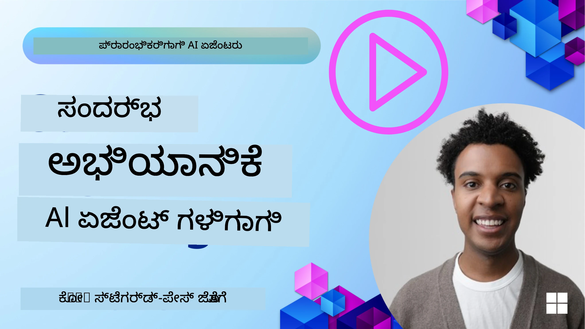
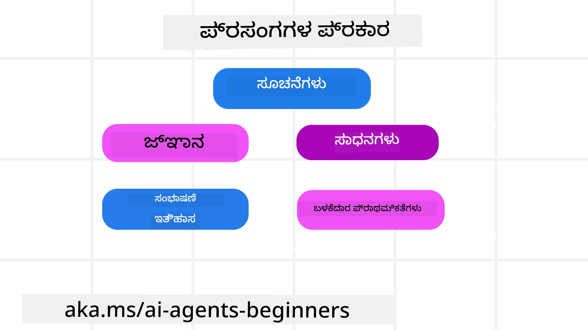
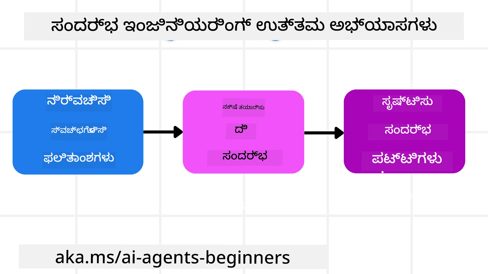

# AI ಏಜೆಂಟ್‌ಗಳಿಗಾಗಿ ಸಂದರ್ಭ ಎಂಜಿನಿಯರಿಂಗ್

> _(ಈ ಪಾಠದ ವಿಡಿಯೋ ವೀಕ್ಷಿಸಲು ಮೇಲಿನ ಚಿತ್ರವನ್ನು ಕ್ಲಿಕ್ ಮಾಡಿ)_

ನೀವು ನಿರ್ಮಿಸುತ್ತಿರುವ ಆ್ಯಪ್‌ಲಿಕೇಶನ್ ಅಥವಾ AI ಏಜೆಂಟ್‌ನ ಜಟಿಲತೆಗೆ ತಿಳಿವಳಿಕೆ ಇರಿಸುವುದು ವಿಶ್ವಾಸಾರ್ಹ ಏಜೆಂಟ್ ನಿರ್ಮಾಣಕ್ಕೆ ಬಹಳ ಮುಖ್ಯವಾಗಿದೆ. ಪ್ರಾಂಪ್್ಟ್ ಎಂಜಿನಿಯರಿಂಗ್ ಗಾಗಿ ಮೀರಿ, ಸಂಕೀರ್ಣ ಅಗತ್ಯಗಳನ್ನು ಪೂರೈಸಲು ಮಾಹಿತಿ ಪರಿಣಾಮಕಾರಿಯಾಗಿ ನಿರ್ವಹಿಸುವ AI ಏಜೆಂಟ್‌ಗಳನ್ನು ನಾವು ನಿರ್ಮಿಸಬೇಕು.

ಈ ಪಾಠದಲ್ಲಿ, ನಾವು ಸಂದರ್ಭ ಎಂಜಿನಿಯರಿಂಗ್ ಎಂದರೇನು ಮತ್ತು AI ಏಜೆಂಟ್‌ಗಳನ್ನು ನಿರ್ಮಿಸುವಲ್ಲಿ ಅದರ ಪಾತ್ರ ಏನಿದೆ ಎಂಬುದನ್ನು ನೋಡೋಣ.

## ಪರಿಚಯ

ಈ ಪಾಠದಲ್ಲಿ ಸವಿವರವಾಗಿ ಕವರ್ ಮಾಡಲಾಗುವುದು:

• **ಸಂದರ್ಭ ಎಂಜಿನಿಯರಿಂಗ್ ಎಂದರೆ ಏನು** ಮತ್ತು ಅದು ಪ್ರಾಂಪ್್ಟ್ ಎಂಜಿನಿಯರಿಂಗ್‌ಗಿಂತ ಹೇಗೆ ಭಿನ್ನವಾಗಿದೆ.

• **ದಕ್ಷವಾದ ಸಂದರ್ಭ ಎಂಜಿನಿಯರಿಂಗ್‌ಗಾಗಿ ತಂತ್ರಗಳು**, ಸಹಿತವಾಗಿ ಮಾಹಿತಿ ಬರೆಯುವ, ಆಯ್ಕೆ ಮಾಡುವ, ಸಂಕುಚಿತಗೊಳಿಸುವ ಮತ್ತು ವಿಭಜಿಸುವ ವಿಧಾನಗಳು.

• **ಸಾಮಾನ್ಯ ಸಂದರ್ಭ ವೈಫಲ್ಯಗಳು** ಯಾವವು ಮತ್ತು ನಿಮ್ಮ AI ಏಜೆಂಟ್‌ ಅನ್ನು ಅವ್ಯವಹಾರವಾಗಿಸಬಹುದಾದ ಅವುಗಳನ್ನು ಹೇಗೆ ಸರಿಪಡಿಸುವುದು.

## ಕಲಿಕೆ ಗುರಿಗಳು

ಈ ಪಾಠವನ್ನು ಪೂರ್ಣಗೊಳಿಸಿದ ನಂತರ, ನೀವು ಹೇಗೆ ತಿಳಿದಿರಬೇಕು ಮತ್ತು ಅರ್ಥಮಾಡಿಕೊಂಡಿರಬೇಕು:

• **ಸಂದರ್ಭ ಎಂಜಿನಿಯಿಂಗ್** ಅನ್ನು ವ್ಯಾಖ್ಯಾನಿಸುವುದು ಮತ್ತು ಅದನ್ನು ಪ್ರಾಂಪ್್ಟ್ ಎಂಜಿನಿಯಿಂಗ್‌ಗಿಂತ ವಿಭಿನ್ನವೆಂದು ಗುರುತಿಸುವುದು.

• ದೊಡ್ಡ ಭಾಷಾ ಮಾದರಿ (Large Language Model (LLM)) ಅನ್ವಯಿಕೆಯಲ್ಲಿ **ಸಂದರ್ಭದ ಪ್ರಮುಖ ಘಟಕಗಳನ್ನು** ಗುರುತಿಸುವುದು.

• ಏಜೆಂಟ್ ಕಾರ್ಯಕ್ಷಮತೆಯನ್ನು ಸುಧಾರಿಸಲು **ಸಂದರ್ಭ ಬರೆಯುವ, ಆಯ್ಕೆಮಾಡುವ, ಸಂಕುಚಿತಗೊಳಿಸುವ ಮತ್ತು ವಿಭಜಿಸುವ ತಂತ್ರಗಳನ್ನು** ಅನ್ವಯಿಸುವುದು.

• ವಿಷಕಾರಿ, ವ್ಯತ್ಯಯಕಾರಕ, ಗೊಂದಲ ಉಂಟುಮಾಡುವ ಮತ್ತು ಸಂಘರ್ಷದಂತಹ **ಸಾಮಾನ್ಯ ಸಂದರ್ಭ ವೈಫಲ್ಯಗಳನ್ನು** ಗುರುತಿಸಿ, ತಡೆಹಿಡಿದುಕೊಳ್ಳುವ ತಂತ್ರಗಳನ್ನು ಜಾರಿಗೆ ತರುವುದು.

## ಸಂದರ್ಭ ಎಂಜಿನಿಯರಿಂಗ್ ಎಂದರೇನು?

AI ಏಜೆಂಟ್‌ಗಳಿಗಾಗಿ, ಸಂದರ್ಭವು ಏಜೆಂಟ್‌ಗೆ ನಿರ್ಧಾರ ತೆಗೆದುಕೊಳ್ಳಲು ಮತ್ತು ನಿರ್ದಿಷ್ಟ ಕ್ರಮಗಳನ್ನು ಕೈಗೊಳ್ಳಲು ಪ್ರೇರೇಪಿಸುವದು. ಸಂದರ್ಭ ಎಂಜಿನಿಯಿಂಗ್ ಅಂದ್ರೆ AI ಏಜೆಂಟ್‌ಗೆ ಮುಂದಿನ ಕರ್ತವ್ಯವನ್ನು ಪೂರ್ಣಗೊಳ್ಳಿಸಲು ಸರಿಯಾದ ಮಾಹಿತಿ ದೊರಕಿಸಿಕೊಡುವ ಅಭ್ಯಾಸ. ಸಂಧರ್ಭ ವಿಂಡೋ ಸಹಿತವಾಗಿ ಸಿಂಮಿತವಾಗಿದೆ, ಆದ್ದರಿಂದ ನಮಗೆ ಏಜೆಂಟ್ ನಿರ್ಮಾಪಕರಾಗಿ ಸಂಧರ್ಭ ವಿಂಡೋದಲ್ಲಿನ ಮಾಹಿತಿಯನ್ನು ಸೇರಿಸುವುದು, ತೆಗೆದುಹಾಕುವುದು ಮತ್ತು ಸಂಕುಚಿತಗೊಳಿಸುವುದನ್ನು ನಿರ್ವಹಿಸುವ ವ್ಯವಸ್ಥೆಗಳು ಮತ್ತು ಪ್ರಕ್ರಿಯೆಗಳನ್ನು ನಿರ್ಮಿಸಬೇಕಾಗುತ್ತದೆ.

### ಪ್ರಾಂಪ್್ಟ್ ಎಂಜಿನಿಯಿಂಗ್ vs ಸಂದರ್ಭ ಎಂಜಿನಿಯರಿಂಗ್

ಪ್ರಾಂಪ್ಟ್ ಎಂಜಿನಿಯಿಂಗ್ ಒಂದು ಸ್ಥಿರ ಸೂಚನೆಗಳ ಸಮೂಹದ ಮೇಲೆ ಕೇಂದ್ರೀಕರಿಸುತ್ತದೆ ಮತ್ತು ನಿಯಮಗಳ ಸಮೂಹದ ಮೂಲಕ AI ಏಜೆಂಟನ್ನು ಪರಿಣಾಮಕಾರಿಯಾಗಿ ಮಾರ್ಗದರ್ಶನ ಮಾಡುವುದು. ಸಂದರ್ಭ ಎಂಜಿನಿಯರಿಂಗ್ ಅಂದರೆ ಆರಂಭಿಕ ಪ್ರಾಂಪ್್ಟ್ ಸಹಿತ, ಗತಿಶೀಲವಾದ ಮಾಹಿತಿಯ ಸಮೂಹವನ್ನು ಹೇಗೆ ನಿರ್ವಹಿಸುವುದು ಎಂಬುದಾಗಿದೆ, ಏಜೆಂಟ್ ಸಮಯದೊಂದಿಗೆ ಬೇಕಾಗಿರುವ ಎಲ್ಲ 것을 ಹೊಂದಿರಲು. ಸಂದರ್ಭ ಎಂಜಿನಿಯರಿಂಗ್ ಸುತ್ತಲಿನ ಮುಖ್ಯ ಯೋಚನೆ ಈ ಪ್ರಕ್ರಿಯೆಯನ್ನು ಪುನರಾವರ್ತನೀಯ ಹಾಗೂ ವಿಶ್ವಾಸಾರ್ಹವಾಗಿಸುವುದು.

### ಸಂದರ್ಭದ ವಿಧಗಳು

ಸಂದರ್ಭ ಒಂದೇ ಒಂದು ವಸ್ತುವಲ್ಲ ಎಂಬುದನ್ನು ನೆನಪಿನಲ್ಲಿ ಇಟ್ಟುಕೊಳ್ಳುವುದು ಪ್ರಮುಖ. AI ಏಜೆಂಟ್‌ಗೆ ಬೇಕಾದ ಮಾಹಿತಿ ವಿವಿಧ ಮೂಲಗಳಿಂದ ಬರುತ್ತದೆ ಮತ್ತು ಈ ಮೂಲಗಳನ್ನು ಏಜೆಂಟ್‌ಗೆ ಲಭ್ಯವಾಗಿಸುವುದು ನಮ್ಮ ಹೊಣೆಗಾರಿಕೆ:

AI ಏಜೆಂಟ್ ನಿರ್ವಹಿಸಬೇಕಾದ ಸಂದರ್ಭದ ವಿಧಗಳಲ್ಲಿ ಸೇರಿವೆ:

• **ಸೂಚನೆಗಳು:** ಇವು ಏಜೆಂಟ್‌ಗಳ "ನಿಯಮಗಳು" ಹೋಲಿಕೆ—ಪ್ರಾಂಪ್‌ಗಳು, ಸಿಸ್ಟಮ್ ಸಂದೇಶಗಳು, ಕಡಿಮೆ-ಶಾಟ್ ಉದಾಹರಣೆಗಳು (AI ಗೆ ಹೇಗೆ ಮಾಡಲು ತೋರಿಸುವುದು), ಮತ್ತು ಅದು ಬಳಸಬಹುದಾದ ಸಾಧನಗಳ ವಿವರಣೆಗಳು. ಪ್ರಾಂಪ್ ಎಂಜಿನಿಯಿಂಗ್‌ನ ಕೇಂದ್ರೀಕೃತ ಭಾಗ ಮತ್ತು ಸಂದర్భ ಎಂಜಿನಿಯರಿಂಗ್ ಸಂಪರ್ಕಿಸುವುದನ್ನೇ ಇದು ಸೂಚಿಸುತ್ತದೆ.

• **ಜ್ಞಾನ:** ಇದು ವಾಸ್ತವಗಳು, ಡೇಟಾಬೇಸ್‌ಗಳಿಂದ ಪಡೆದ ಮಾಹಿತಿ ಅಥವಾ ಏಜೆಂಟ್ ಸಂಗ್ರಹಿಸಿದ ದೀರ್ಘಕಾಲೀನ ಸ್ಮೃತಿಗಳನ್ನು ಒಳಗೊಂಡಿರುತ್ತದೆ. ಇದೇ ಸಂದರ್ಭದಲ್ಲಿ ಒಂದು Retrieval Augmented Generation (RAG) ವ್ಯವಸ್ಥೆಯನ್ನು ಅನುಕರಿಸುವುದು, ಏಜೆಂಟ್‌ಗೆ ವಿಭಿನ್ನ ಜ್ಞಾನ ಸಂಗ್ರಹಣೆಗಳು ಮತ್ತು ಡೇಟಾಬೇಸ್‌ಗಳಿಗೆ ದಂಡುಗೊಳಿಸುವ ಅಗತ್ಯ ಇರುವಾಗ ಸೇರಿದಂತೆ.

• **ಉಪಕರಣಗಳು:** ಹೊರಗಿನ ಫಂಕ್ಷನ್‌ಗಳು, APIಗಳು ಮತ್ತು MCP ಸರ್ವರ್‌ಗಳ ವ್ಯಾಖ್ಯಾನಗಳು, ಮತ್ತು ಅವನ್ನು ಬಳಸಿದಾಗ ಲಭ್ಯವಾಗುವ ಪ್ರತಿಕ್ರಿಯೆಗಳು (ಫಲಿತಾಂಶಗಳು).

• **ಸಂವಾದ ಇತಿಹಾಸ:** ಬಳಕೆದಾರರ ಜೊತೆಗೆ ನಡೆಯುವ ಆರಂಭದಿಂದಲಿನ ಸಂವಾದ. ಸಮಯವು ಸಾಗುವುದರಿಂದ, ಈ ಸಂಭಾಷಣೆಗಳು ಉದ್ದವಾಗುತ್ತವೆ ಮತ್ತು ಹೆಚ್ಚು ಜಟಿಲವಾಗುತ್ತವೆ, ಹಾಗಾಗಿ ಅವುಗಳನ್ನು ಸಂಧರ್ಭ ವಿಂಡೋದಲ್ಲಿ ಜಾಗ ದখಲಿಸಬಾರದು.

• **ಬಳಕೆದಾರ ಪREFERನ್ಸ್:** ಸಮಯದೊಂದಿಗೆ ಬಳಕೆದಾರನ ಇಷ್ಟ ಮತ್ತು ಅವಕಸ್ಥೆಗಳ ಕುರಿತು ಕಲಿತ ಮಾಹಿತಿ. ಪ್ರಮುಖ ನಿರ್ಧಾರಗಳನ್ನು ತೆಗೆದುಕೊಳ್ಳುವಾಗ ಬಳಕೆದಾರನ ಸಹಾಯಕ್ಕೆ ಇವುಗಳನ್ನು ಸಂಗ್ರಹಿಸಿ ಕರೆತರುವುದಕ್ಕೆ ಬಳಸಬಹುದು.

## ಪರಿಣಾಮಕಾರಿ ಸಂದರ್ಭ ಎಂಜಿನಿಯರಿಂಗ್‌ಗಾಗಿ ತಂತ್ರಗಳು

### ਯೋಜನೆಯ ತಂತ್ರಗಳು

ಒಳ್ಳೆಯ ಸಂಧರ್ಭ ಎಂಜಿನಿಯರಿಂಗ್ ಉತ್ತಮ ಯೋಚನೆಯಿಂದ ಪ್ರಾರಂಭವಾಗುತ್ತದೆ. ಸಂಧರ್ಭ ಎಂಜಿನಿಯರಿಂಗ್ ತತ್ವವನ್ನು ಅನ್ವಯಿಸಲು ಸಹಾಯ ಮಾಡುವ ಒಂದು ವಿಧಾನ ಇಲ್ಲಿದೆ:

1. **ಸ್ಪಷ್ಟผลಿತಾಂಶಗಳನ್ನು განს್ಠಾಪಿಸಿ** - AI ಏಜೆಂಟ್‌ಗಳಿಗೆ ನೀಡಲಾಗುವ ಕಾರ್ಯಗಳ ಫಲಿತಾಂಶಗಳನ್ನು ಸ್ಪಷ್ಟವಾಗಿ నిర్వಚಿಸಬೇಕು. "AI ಏಜೆಂಟ್ ಅದರ ಕಾರ್ಯವನ್ನು ಪೂರ್ಣಗೊಳಿಸಿದ ಮೇಲೆ ಜಗತ್ತು ಹೇಗಿರಬೇಕು?" ಎಂಬ ಪ್ರಶ್ನೆಗೆ ಉತ್ತರ ನೀಡಿ. ಬೇರೆಬಾಗಿ ಹೇಳುವುದೆಂದರೆ, AI ಏಜೆಂಟ್ ನೊಂದಿಗೆ ಸಂವಹನ ಮಾಡಿದ ಬಳಿಕ ಬಳಕೆದಾರರು ಯಾವ ಬದಲಿ, ಮಾಹಿತಿ ಅಥವಾ ಪ್ರತಿಕ್ರಿಯೆ ಹೊಂದಿರಬೇಕು ಎಂಬುದನ್ನು ನಿರ್ಧರಿಸಿ.
2. **ಸಂದರ್ಭವನ್ನು ನಕ್ಷೆಗೊಳಿಸಿ** - ಏಜೆಂಟ್ ಫಲಿತಾಂಶಗಳನ್ನು ನಿರ್ಧರಿಸಿದ ನಂತರ, "ಈ ಕಾರ್ಯವನ್ನು ಪೂರ್ಣಗೊಳಿಸಲು AI ಏಜೆಂಟ್‌ಗೆ ಯಾವ ಮಾಹಿತಿಯು ಬೇಕು?" ಎಂಬ ಪ್ರಶ್ನೆಗೆ ಉತ್ತರಿಸಬೇಕು. ಇತರವಾಗಿ, ಆ ಮಾಹಿತಿ ಎಲ್ಲಿ ಇರಬಹುದು ಎಂಬುದರ ಸಂದರ್ಭವನ್ನು ನೀವು ನಕ್ಷೆಗೊಳಿಸಬಹುದು.
3. **ಸಂದರ್ಭ ಪೈಪ್‌ಲೈನ್ಗಳು ರಚಿಸಿ** - ಈಗ ನೀವು ಮಾಹಿತಿ ಎಲ್ಲಿ ಇರುತ್ತದೆ ಎಂದು ತಿಳಿದುಕೊಂಡಿದ್ದೀರಿ, "ಏಜೆಂಟ್ ಈ ಮಾಹಿತಿಯನ್ನು ಹೇಗೆ ಪಡೆಯಲಿದೆ?" ಎಂಬ ಪ್ರಶ್ನೆಯನ್ನು ಉತ್ತರಿಸಬೇಕು. RAG, MCP ಸರ್ವರ್‌ಗಳ ಬಳಕೆಯು ಮತ್ತು ಇತರ ಸಾಧನಗಳನ್ನು ಹೊಂದಿರುವಂತಹ ಹಲವು ವಿಧಗಳಲ್ಲಿ ಇದು ಸಾಧ್ಯ.

### ಪ್ರಾಯೋಗಿಕ ತಂತ್ರಗಳು

ಯೋಜನೆ ಮುಖ್ಯವಾದರೂ, ಮಾಹಿತಿ ನಮ್ಮ ಏಜೆಂಟ್‌ನ ಸಂಧರ್ಭ ವಿಂಡೋಗೆ ಹರಿದುಬಂದಾಗ ನಾವು ಅದನ್ನು ನಿರ್ವಹಿಸಲು ಪ್ರಾಯೋಗಿಕ ತಂತ್ರಗಳನ್ನು ಹೊಂದಿರಬೇಕು:

#### ಸಂದರ್ಭವನ್ನು ನಿರ್ವಹಿಸುವುದು

ಕೆಲವು ಮಾಹಿತಿ ಸ್ವಯಂಚಾಲಿತವಾಗಿ ಸಂಧರ್ಭ ವಿಂಡೋಗೆ ಸೇರುತ್ತದೆ, ಆದರೆ ಸಂದರ್ಭ ಎಂಜಿನಿಯರಿಂಗ್ ಅಂದರೆ ಈ ಮಾಹಿತಿಯನ್ನು ಸಕ್ರಿಯವಾಗಿ ನಿರ್ವಹಿಸುವುದು ಮತ್ತು ಅದು ಹಲವಾರು ತಂತ್ರಗಳ ಮೂಲಕ ಸಾಧ್ಯ:

 1. **ಏಜೆಂಟ್ ಸ್ಕ್ರಾಚ್‌ಪ್ಯಾಡ್**
 ಇದರಿಂದ AI ಏಜೆಂಟ್ ಒಂದು ಸೆಷನ್ ಸಂದರ್ಭದಲ್ಲಿ ಪ್ರಸ್ತುತ ಕಾರ್ಯಗಳ ಮತ್ತು ಬಳಕೆದಾರ ಸಂವಹನದ ಸಂಬಂಧಿತ ಮಾಹಿತಿಯ ಟಿಪ್ಪಣಿಗಳನ್ನು ತೆಗೆದುಕೊಳ್ಳಬಹುದು. ಇದು ಸಂಧರ್ಭ ವಿಂಡೋ ಹೊರಗೆ ಫೈಲ್ ಅಥವಾ ರನ್‌ಟೈಮ್ ವಸ್ತುವಿನಲ್ಲಿ ಇರಬೇಕು, ಮತ್ತು ಅಗತ್ಯವಿದ್ದಾಗ ಏಜೆಂಟ್ ಈ ಸೆಷನ್‌ನಲ್ಲೇ ನಂತರದಲ್ಲಿ ಪಡೆಯಲು ಸಾಧ್ಯವಾಗಬೇಕು.

 2. **ಸೆನೆಗಳು (Memories)**
 ಸ್ಕ್ರಾಚ್‌ಪ್ಯಾಡ್ ಒಂದು ಸೆಷನ್‌ನ ಸಂಧರ್ಭ ವಿಂಡೋ ಹೊರಗೆ ಮಾಹಿತಿಯನ್ನು ನಿರ್ವಹಿಸಲು ಉಪಯುಕ್ತ. ಮೆಮೊರಿಗಳು ಏಜೆಂಟ್‌ಗಳಿಗೆ ಬಹು ಸೆಷನ್‌ಗಳಗೊಳ್ಳುವ ಸಂದರ್ಭಗಳಲ್ಲಿ ಸಂಬಂಧಿತ ಮಾಹಿತಿಯನ್ನು ಸಂಗ್ರಹಿಸಿ ತರುವ ಸೌಲಭ್ಯ ನೀಡುತ್ತವೆ. ಇದರಲ್ಲಿ ಸಂಕ್ಷೇಪಣೆಗಳು, ಬಳಕೆದಾರ ಪ್ರాధಾನ್ಯತೆಗಳು ಮತ್ತು ಭವಿಷ್ಯದಲ್ಲಿ ಸುಧಾರಣೆಯಿಗಾಗಿ ಪ್ರತಿಕ್ರಿಯೆಗಳು ಒಳಗೊಳ್ಳಬಹುದು.

 3. **ಸಂದರ್ಭ ಸಂಕುಚಿತಗೊಳಿಸುವುದು**
  ಸಂಧರ್ಭ ವಿಂಡೋ ವಿಸ್ತಾರಗೊಳ್ಳುತ್ ಕೊನೆಯಲ್ಲಿ پہنಿದಾಗ, ಸಾರಾಂಶಗೊಳಿಸುವಿಕೆ ಮತ್ತು ಕತ್ತರಿಸುವಂತಹ ತಂತ್ರಗಳನ್ನು ಬಳಸಬಹುದು. ಇದು ಹೆಚ್ಚು ಸಂಬಂಧಿಸಿದ ಮಾಹಿತಿಯನ್ನು ಮಾತ್ರ ಉಳಿಸಿಕೊಂಡು ಮರುಕಳಿಸುವ ಇತಿಹಾಸವನ್ನು ತೊರೆದು ಕೊಡಬಹುದು.

 4. **ಬಹು-ಏಜೆಂಟ್ ವ್ಯವಸ್ಥೆಗಳು**
  ಪ್ರತಿ ಏಜೆಂಟ್‌ಗೆ ತನ್ನದೇಯಾದ ಸಂಧರ್ಭ ವಿಂಡೋ ಇರುವೆಯೇನಂದರೆ ಬಹು-ಏಜೆಂಟ್ ವ್ಯವಸ್ಥೆಗಳನ್ನು ಅಭಿವೃದ್ಧಿಪಡಿಸುವುದು ಒಂದು ವಿಧದ ಸಂದರ್ಭ ಎಂಜಿನಿಯರಿಂಗ್. ಆ ಸಂಧರ್ಭವನ್ನು ಹೇಗೆ ಹಂಚಿಕೊಳ್ಳುವುದು ಮತ್ತು ವಿಭಿನ್ನ ಏಜೆಂಟ್‌ಗಳಿಗೆ ಹೇಗೆ ಪಾಸ್ ಮಾಡುವುದು ಎಂಬುದನ್ನು ಸಿಸ್ಟಮ್ ನಿರ್ಮಾಣದ ವೇಳೆ ಯೋಜಿಸಬೇಕು.

 5. **ಸ್ಯಾಂಡ್‌ಬಾಕ್ಸ್ ವಾತಾವರಣಗಳು**
  ಏಜೆಂಟ್‌ಗೆ ಕೆಲವು ಕೋಡ್ ರನ್ ಬೇಕಾದರೆ ಅಥವಾ ಒಂದು ಡಾಕ್ಯುಮೆಂಟ್‌ನಲ್ಲಿನ ಬಹಳ ಪ್ರಮಾಣದ ಮಾಹಿತಿಯನ್ನು ಪ್ರಕ್ರಿಯೆಗೊಳಿಸಬೇಕಾದರೆ, ಫಲಿತಾಂಶಗಳನ್ನು ಪ್ರಕ್ರಿಯೆಗೊಳಿಸಲು ಬಹಳ ಟೋಕನ್‌ಗಳು ಬೇಕಾಗಬಹುದು. ಈ ಎಲ್ಲಾ ಮಾಹಿತಿಯನ್ನು ಸಂಧರ್ಭ ವಿಂಡೋದಲ್ಲೇ ಸಂಗ್ರಹಿಸುವ ಬದಲು, ಏಜೆಂಟ್ ಈ ಕೋಡ್ ಅನ್ನು ರನ್ ಮಾಡಬಹುದಾದ ಸ್ಯಾಂಡ್‌ಬಾಕ್ಸ್ ವಾತಾವರಣವನ್ನು ಬಳಸಬಹುದು ಮತ್ತು ನಂತರ ಮಾತ್ರ ಫಲಿತಾಂಶಗಳು ಮತ್ತು ಇತರ ಸಂಬಂಧಿತ ಮಾಹಿತಿಯನ್ನು ಓದುತ್ತದೆ.

  6. **ರನ್‍ಟೈಮ್ ಸ್ಟೇಟ್ ವಸ್ತುಗಳು**
   ಇದು ನಿರ್ದಿಷ್ಟ ಮಾಹಿತಿಗೆ ಏಜೆಂಟ್‌ಗೆ ಪ್ರವೇಶ ಬೇಕಾದ ಸಂದರ್ಭಗಳನ್ನು ನಿರ್ವಹಿಸಲು ಮಾಹಿತಿಯ ಡಬ್ಬೆಗಳನ್ನೊಂದು ರಚಿಸುವ ಮೂಲಕ ಮಾಡಲಾಗುತ್ತದೆ. ಒಂದು ಸಂಕೀರ್ಣ ಕಾರ್ಯಕ್ಕೆ, ಇದು ಏಜೆಂಟ್‌ಗೆ ಪ್ರತಿಯೊಂದು ಉಪಕಾರ್ಯದ ಫಲಿತಾಂಶವನ್ನು ಹಂತ ಹಂತವಾಗಿ ಸಂಗ್ರಹಿಸಲು ಅನುಮತಿಸುತ್ತದೆ, ಬಹುಮಟ್ಟಿಗೆ ಸಂಧರ್ಭವು ಆ ಸ್ವತಂತ್ರ ಉಪಕಾರ್ಯಕ್ಕೆ ಮಾತ್ರ ಸಂಪರ್ಕಿತವಾಗಿರಲು ಅನುಮತಿಸುತ್ತದೆ.

### ಸಂದರ್ಭ ಎಂಜಿನಿಯರಿಂಗ್‌ನ ಉದಾಹರಣೆ

ನಾವು ಒಂದು AI ಏಜೆಂಟ್‌ಗೆ **"ನನಗೆ ಪ್ಯಾರಿಸ್‌ಕ್ಕೆ ಪ್ರವಾಸವನ್ನು ಬುಕ್ ಮಾಡಿ."** ಎಂದು ಹೇಳಬೇಕೆಂದು ಹೇಳಿಕೊಳ್ಳಿ.

• ಕೇವಲ ಪ್ರಾಂಪ್್ಟ್ ಎಂಜಿನಿಯಿಂಗ್ ಬಳಸಿ ಸರಳ ಏಜೆಂಟ್ ಕೇವಲ ಪ್ರತಿಕ್ರಿಯಿಸಬಹುದು: **"ಸರಿ, ನೀವು ಪ್ಯಾರೀಸ್‌ಗೆ ಯಾವಾಗ ಹೋದ್ಬೋದನ್ನು ಬಯಸುತ್ತೀರಿ?"**. ಇದು ಬಳಕೆದಾರ ಕೇಳಿದ ಸಮಯದಲ್ಲಿ ನಿಮ್ಮ ನೇರ ಪ್ರಶ್ನೆಯನ್ನು ಮಾತ್ರ ಪ್ರಕ್ರಿಯೆಗೊಳಿಸಲಿದೆ.

• ಮೇಲ್ಕಂಡ ಸಂದರ್ಭ ಎಂಜಿನಿಯರಿಂಗ್ ತಂತ್ರಗಳನ್ನು ಬಳಕೆ ಮಾಡುವ ಏಜೆಂಟ್ ಇನ್ನಷ್ಟು ಮಾಡಿದೀತು. ಪ್ರತಿಕ್ರಿಯಿಸುವ ಮುಂಚೆ, ಅದರ ಸಿಸ್ಟಮ್ ಇವುಗಳನ್ನು ಮಾಡಬಹುದು:

  ◦ **ನಿಮ್ಮ ಕ್ಯಾಲೆಂಡರ್ ಪರಿಶೀಲಿಸಿ** ಲಭ್ಯ ದಿನಾಂಕಗಳಿಗಾಗಿ (ವಾಸ್ತವಿಕ-ಸಮಯದ ಡೇಟಾವನ್ನು ಪಡೆಯುವುದು).

  ◦ **ಹಿಂದಿನ ಪ್ರಯಾಣ ಪ್ರಪ್ರಿಯತೆಗಳನ್ನು ನೆನಪಿಸಿಕೊಳ್ಳಿ** (ದೀರ್ಘಕಾಲೀನ ನೆನಪುಗಳಿಂದ) ಉದಾಹರಣೆಗೆ ನಿಮ್ಮ ಇಷ್ಟದ ವಿಮಾನಸೇವಕ, ಬಜೆಟ್, ಅಥವಾ ನೇರ ಫ್ಲೈಟ್‌ಗಳನ್ನು ನೀವು ಇಚ್ಛಿಸುವುದೇ ಎಂಬುದು.

  ◦ **ಉಪಲಭ್ಯ ಸಾಧನಗಳನ್ನು ಗುರುತಿಸಿಕೊಳ್ಳಿ** ಫ್ಲೈಟ್ ಮತ್ತು ಹೋಟೆಲ್ ಬುಕ್ಕಿಂಗ್‌ಗಾಗಿ.

- ನಂತರ, ಉದಾಹರಣೆಯಾಗಿ ಪ್ರತಿಕ್ರಿಯೆ ಈ ರೀತಿ ಇರಬಹುದು: "Hey [Your Name]! I see you're free the first week of October. Shall I look for direct flights to Paris on [Preferred Airline] within your usual budget of [Budget]?". ಈ ಸಮೃದ್ಧ, ಸಂದರ್ಭ-ಅನ್ವಿತ ಪ್ರತಿಕ್ರಿಯೆ ಸಂದರ್ಭ ಎಂಜಿನಿಯರಿಂಗ್‌ನ ಶಕ್ತಿಯನ್ನು ತೋರಿಸುತ್ತದೆ.

## ಸಾಮಾನ್ಯ ಸಂದರ್ಭ ವೈಫಲ್ಯಗಳು

### ಸಂದರ್ಭ ವಿಷಕಾರಣ (Context Poisoning)

**ಇದು ಏನು:** ಒಂದು ಹ್ಯಾಲ್ಯೂಸಿನೇಶನ್ (LLM ಮೂಲಕ ಉತ್ಪಾದಿತ ತಪ್ಪು ಮಾಹಿತಿ) ಅಥವಾ ತೊಂದರೆ ಸಂದರ್ಭಕ್ಕೆ ಸೇರಿ ಮರುಕಳಿಸಿ ಉಲ್ಲೇಖಿಸಿದಾಗ, ಏಜೆಂಟ್ ಅಸಾಧ್ಯ ಗುರಿಗಳನ್ನು ಅನುಸರಿಸಲು ಅಥವಾ ಅರ್ಥರಹಿತ ತಂತ್ರಗಳನ್ನು ಅಭಿವೃದ್ಧಿಪಡಿಸಲು ಕಾರಣವಾಗಬಹುದು.

**ಏನು ಮಾಡಬೇಕು:** **ಸಂದರ್ಭ ಪರಿಶೀಲನೆ** ಮತ್ತು **ಕ್ವಾರಂಟೈನ್** ಜಾರಿಗೆ ತರುವಂತೆ ಮಾಡಿ. ದೀರ್ಘಕಾಲೀನ ಮೆಮೊರಿ ಸೇರಿಸುವ ಮುನ್ನ ಮಾಹಿತಿಯನ್ನು ಪರಿಶೀಲಿಸಿ. ಸಂಭಾವ್ಯ ವಿಷಕಾರಣ ಕಂಡುಬಂದಲ್ಲಿ, ದೋಷಭರಿತ ಮಾಹಿತಿಯ ಹರಡಲಿಕೆಯನ್ನು ತಡೆಯಲು ಹೊಸ, ತಾಜಾ ಸಂದರ್ಭ ಥ್ರೆಡ್‌ಗಳನ್ನು ಪ್ರಾರಂಭಿಸಿ.

**ಪ್ರಯಾಣ ಬುಕ್ಕಿಂಗ್ ಉದಾಹರಣೆ:** ನಿಮ್ಮ ಏಜೆಂಟ್ ಒಂದು ಸಣ್ಣ ಸ್ಥಳೀಯ ವಿಮಾನ ನಿಲ್ದಾಣದಿಂದ ದೂರದ ಏಕಾಂತ ಅಂತಾರಾಷ್ಟ್ರೀಯ ನಗರಕ್ಕೆ ನೇರ ವಿಮಾನವಿದೆ ಎಂದು ಹ್ಯಾಲ್ಯೂಸಿನೇಟ್ ಮಾಡಿದೆ, ಆದರೆ ಆ ವಿಮಾನ ನಿಲ್ದಾಣವು ವಾಸ್ತವದಲ್ಲಿ ಅಂತಾರಾಷ್ಟ್ರೀಯ ವಿಮಾನಗಳನ್ನು ನೀಡುವುದಿಲ್ಲ. ಈ ಅಸ್ಥಿತ್ವವಿಲ್ಲದ ವಿಮಾನ ವಿವರವು ಸಂದರ್ಭದಲ್ಲಿಗೆ ಉಳಿದಿದೆ. ನಂತರ, ನೀವು ಏಜೆಂಟ್‌ಗೆ ಬುಕ್ ಮಾಡಲು ಕೇಳಿದಾಗ, ಇದು ಅಸಾಧ್ಯ ಮಾರ್ಗಕ್ಕಾಗಿ ಟಿಕೆಟ್ ಹುಡುಕುತ್ತಿರುವಂತೆ ಮುಂದುವರಿದು, ಪುನರಾವರ್ತಿತ ದೋಷಗಳಿಗೆ ಕಾರಣವಾಗುತ್ತದೆ.

**ಉಪಾಯ:** ವಿಮಾನಗಳ ಅಸ್ತಿತ್ವ ಮತ್ತು ಮಾರ್ಗಗಳನ್ನು ವಾಸ್ತವಿಕ-ಸಮಯ API ಮೂಲಕ **ಸ್ಥಾಪಿಸಿಕೊಳ್ಳುವಂತೆ** ಒಂದು ಹಂತವನ್ನು ಜಾರಿಗೆ ತಂದು, ಏಜೆಂಟ್‌ನ ಕೆಲಸದ ಸಂಧರ್ಭಕ್ಕೆ ವಿಮಾನದ ವಿವರವನ್ನು ಸೇರಿಸುವ ಮೊದಲು ಪರಿಶೀಲಿಸಿ. ಪರೀಕ್ಷೆ ವಿಫಲವಾದರೆ, ತಪ್ಪು ಮಾಹಿತಿಯನ್ನು "ಕ್ವಾರಂಟೈನ್" ಮಾಡಿ ಮುಂದಿನ ಬಳಕೆಗೆ ಬಳಸಬಾರದು.

### ಸಂದರ್ಭ ಆಸಕ್ತಿ-ವಿಚಲಿ (Context Distraction)

**ಇದು ಏನು:** ಸಂದರ್ಭ ಅವsuchಿತವಾದಷ್ಟು ದೊಡ್ಡದಾಗும்போது, ಮಾದರಿ ಸಂಗ್ರಹಿಸಿದ ಇತಿಹಾಸದ ಮೇಲೆ ಹೆಚ್ಚು ಗಮನಹರಿಸುವಂತೆ ಆಗುತ್ತದೆ, ತರಬೇತಿ ವೇಳೆ ಕಲಿತದ್ದನ್ನು ಬಳಸದೆ, ಇದರಿಂದ ಪುನರಾವರ್ತಿತ ಅಥವಾ ಅನಉಪಯುಕ್ತ ಕ್ರಮಗಳಿಗೆ ಹೋಗಬಹುದು. ಮಾದರಿಗಳು ಸಂಧರ್ಭ ವಿಂಡೋ ಸಂಪೂರ್ಣವಾಗುವ ಮೊದಲು ಕೂಡ ತಪ್ಪುಗಳನ್ನು ಮಾಡುವ ಶಕ್ತಿಯನ್ನು ಹೊಂದಿರಬಹುದು.

**ಏನು ಮಾಡಬೇಕು:** **ಸಂದರ್ಭ ಸಾರಾಂಶಗೊಳಿಸುವಿಕೆ** ಬಳಸಿರಿ. ಸಂಗ್ರಹಿತ ಮಾಹಿತಿಯನ್ನು ನಿಯಮಿತವಾಗಿ ಚಿಕ್ಕ ಸಾರಾಂಶಗಳಲ್ಲಿ ಸಂಕುಚಿತಗೊಳಿಸಿ, ಪ್ರಮುಖ ವಿವರಗಳನ್ನು ಉಳಿಸಿಕೊಳ್ಳಿ ಮತ್ತು ಅನಗತ್ಯ ಪುನರಾವರ್ತಿತ ಇತಿಹಾಸವನ್ನು ತೆಗೆದುಹಾಕಿ. ಇದು ಗಮನವನ್ನು "ರಿಸೆಟ್" ಮಾಡಲು ಸಹಾಯ ಮಾಡುತ್ತದೆ.

**ಪ್ರಯಾಣ ಬುಕ್ಕಿಂಗ್ ಉದಾಹರಣೆ:** ನೀವು ಬಹಳ ಕಾಲದವರೆಗೆ ವಿವಿಧ ಕನಸು ಪ್ರತ್ಯಕ್ಷ ಪ್ರವಾಸ ಗುರಿಗಳ ಕುರಿತು ಚರ್ಚಿಸಿದ್ದೀರಿ, ಇವುಗಳಲ್ಲಿ ಎರಡು ವರ್ಷಗಳ ಹಿಂದಿನ ಬ್ಯಾಕ್ಪ್ಯಾಕಿಂಗ್ ಟ್ರಿಪ್‌ನ ವಿವರವಾದ ಪುನರಾವೃತ್ತಿಯೂ ಸೇರಿದೆ. ನೀವು ಕೊನೇಗೆ **"ಮುಂದಿನ ತಿಂಗಳಿಗೆ ನನಗೆ ಸೌಲಭ್ಯಯುತ ವಿಮಾನ ಒಂದನ್ನು ಕಂಡುಹಿಡಿಯೋದು"** ಎಂದು ಕೇಳಿದಾಗ, ಏಜೆಂಟ್ ಹಳೆಯ ಅಸಂಬಂಧಿತ ವಿವರಗಳಲ್ಲಿ ಸಿಲುಕಿ ನಿಮ್ಮ ಬ್ಯಾಕ್ಪ್ಯಾಕ್ ಗಿಯರ್ ಅಥವಾ ಹಳೆಯ ಭ್ರಮಣ ಯೋಜನೆಗಳ ಬಗ್ಗೆ ಪುನಃ ಪ್ರಶ್ನೆಗಳನ್ನು ಕೇಳುತ್ತಿದ್ದು, ನಿಮ್ಮ ಪ್ರಸ್ತುತ ವಿನಂತಿಯನ್ನು ನಿರ್ಲಕ್ಷಿಸುತ್ತದೆ.

**ಉಪಾಯ:** ನಿರ್ದಿಷ್ಟ ಸಂಖ್ಯೆ ಸಂವಾದ ಕಾಲದ ನಂತರ ಅಥವಾ ಸಂಧರ್ಭದ ಪ್ರಮಾಣ ತುಂಬಿದಾಗ, ಏಜೆಂಟ್ تازಾ ಮತ್ತು ಸಂಬಂಧಿತ ಸಂಭಾಷಣೆಯ ಭಾಗಗಳನ್ನು **ಸಾರಾಂಶಗೊಳಿಸಬೇಕು** – ನಿಮ್ಮ ಪ್ರಸ್ತುತ ಪ್ರಯಾಣ ದಿನಾಂಕಗಳು ಮತ್ತು ಗುರಿಯನ್ನು ಗಮನದಲ್ಲಿ ಇಟ್ಟುಕೊಂಡು – ಮತ್ತು ಆ ಸಂಕುಚಿತ ಸಾರಾಂಶವನ್ನು ಮುಂದಿನ LLM ಕರೆಗಾಗಿಯೇ ಬಳಸಬೇಕು, ಕಡಿಮೆ ಸಂಬಂಧಿತ ಚಾಟ್ ಇತಿಹಾಸವನ್ನು ತೊರೆದಿಟ್ಟು.

### ಸಂದರ್ಭ ಗೊಂದಲ (Context Confusion)

**ಇದು ಏನು:** ಅನವಶ್ಯಕ ಸಂಧರ್ಭ, ವಿಶೇಷವಾಗಿ ಅನೇಕ ಲಭ್ಯ ಸಾಧನಗಳ ರೂಪದಲ್ಲಿ, ಮಾದರಿಯನ್ನು ತಪ್ಪಾದ ಪ್ರತಿಕ್ರಿಯೆಗಳನ್ನು ಉತ್ಪಾದಿಸಲು ಅಥವಾ ಅನಸಂಬಂಧಿ ಸಾಧನಗಳನ್ನು ಕರೆ ಮಾಡಲು ಪ್ರೇರೇಪಿಸುತ್ತದೆ. ಚಿಕ್ಕ ಮಾದರಿಗಳು ಇದಕ್ಕೆ ವಿಶೇಷವಾಗಿ ಆಸ್ತಿಯಾಗಿರುತ್ತವೆ.

**ಏನು ಮಾಡಬೇಕು:** RAG ತಂತ್ರಗಳನ್ನು ಬಳಸಿ **ಉಪಕರಣ ಲೋಡ್‌ಔಟ್ ನಿರ್ವಹಣೆ** ಜಾರಿಗೆ ತರುವುದು. ಸಾಧನ ವಿವರಣೆಗಳನ್ನು ವೆಕ್ಟರ್ ಡೇಟಾಬೇಸಿನಲ್ಲಿ ಸಂಗ್ರಹಿಸಿ ಮತ್ತು ಪ್ರತಿ ಕಾರ್ಯಕ್ಕಾಗಿ ಕೇವಲ ಅತ್ಯಂತ ಸಂಬಂಧಿತ ಸಾಧನಗಳನ್ನು ಆಯ್ಕೆಮಾಡಿ. ಸಂಶೋಧನೆಗಳು 30 ಕ್ಕಿಂತ ಕಡಿಮೆ ಸಾಧನ ಆಯ್ಕೆಮಾಡುವುದನ್ನು ಸೂಕ್ತವೆಂದು ತೋರಿಸುತ್ತವೆ.

**ಪ್ರಯಾಣ ಬುಕ್ಕಿಂಗ್ ಉದಾಹರಣೆ:** ನಿಮ್ಮ ಏಜೆಂಟ್‌ಗಾಗಿ ಅನೇಕ ಸಾಧನಗಳ ಪ್ರವೇಶವಿದೆ: `book_flight`, `book_hotel`, `rent_car`, `find_tours`, `currency_converter`, `weather_forecast`, `restaurant_reservations`, ಇತ್ಯಾದಿ. ನೀವು ಕೇಳಿದರೆ, **"ಪ್ಯಾರಿಸ್‌ನಲ್ಲಿ சுற்றಾಡುವುದಕ್ಕೆ terbaik ಮಾರ್ಗ ಏನು?"** ಸಾಧನಗಳ sheer ಸಂಖ್ಯೆಯ ಕಾರಣದಿಂದ, ಏಜೆಂಟ್ ಗೊಂದಲಗೊಳ್ಳುತ್ತದೆ ಮತ್ತು ಪ್ಯಾರಿಸ್ ಒಳಗೆ `book_flight` ಅನ್ನು ಕರೆ ಮಾಡುವಂತೆಯಾದೀತು, ಅಥವಾ ನೀವು ಸಾರ್ವಜನಿಕ ಸಾರಿಗೆ ಇಷ್ಟಪಡುತ್ತೀರೆಂದು ಆದರೂ `rent_car` ಅನ್ನು ಪ್ರಯತ್ನಿಸುತ್ತದೆ, ಏಕೆಂದರೆ ಸಾಧನ ವಿವರಣೆಗಳು ಒತ್ತರಿಸುವುವುವಾಗ ಕವರ್ ಆಗಬಹುದು ಅಥವಾ ಸರಿ ಮಾರ್ಪಾಡು ಗುರಿಯನ್ನು ದೊಡ್ಡ ಮಟ್ಟದಲ್ಲಿ ಗುರುತಿಸಲು ಆಗುತ್ತಿಲ್ಲ.

**ಉಪಾಯ:** ಸಾಧನ ವಿವರಣೆಗಳ ಮೇಲೆ **RAG ಬಳಸಿರಿ**. ನೀವು ಪ್ಯಾರಿಸ್‌ನಲ್ಲಿ ಹೇಗೆ ಸಂಚರಿಸಬೇಕು ಎಂದು ಕೇಳಿದಾಗ, ಸಿಸ್ಟಮ್ ಡೈನಮಿಕಾಗಿ ನಿಮ್ಮ ಕ್ವೇರಿಯ ಆಧಾರದ ಮೇಲೆ `rent_car` ಅಥವಾ `public_transport_info` ಹೋಲುವ ಅತ್ಯಂತ ಸಂಬಂಧಿತ ಸಾಧನಗಳನ್ನು ಮಾತ್ರ ತರುತ್ತದೆ, ಮತ್ತು LLM ಗೆ ಗಮನದಾಯಕ "ಲೋಡೌಟ್" ಅನ್ನು ಪ್ರಸ್ತುತಪಡಿಸುತ್ತದೆ.

### ಸಂದರ್ಭ ಸಂಘರ್ಷ (Context Clash)

**ಇದು ಏನು:** ಸಂದರ್ಭದಲ್ಲಿ ವಿರೋಧವಾದ ಮಾಹಿತಿದಿಂದಾಗುವುದು, ನಿರ್ವಹಣೆಯಲ್ಲದ ಕಾರಣದೊಂದಿಗೆ ಅಸಮಂಜಸ್ಯತೆಯ ತರ್ಕ ಅಥವಾ ಕೆಟ್ಟ ಅಂತಿಮ ಪ್ರತಿಕ್ರಿಯೆಗಳಿಗೆ ಕಾರಣವಾಗುವುದು. ಇದು ಸಾಮಾನ್ಯವಾಗಿ ಮಾಹಿತಿ ಹಂತ ಹಂತವಾಗಿ ಬರಲು ಮತ್ತು ಆರಂಭಿಕ ತಪ್ಪು ಅನುಮಾನಗಳು ಸಂದರ್ಭದಲ್ಲಿಯೇ ಉಳಿಯುವಾಗ ಸಂಭವಿಸುತ್ತದೆ.

**ಏನು ಮಾಡಬೇಕು:** **ಸಂದರ್ಭ ಕತ್ತರಿಸುವಿಕೆ (pruning)** ಮತ್ತು **ಆಫ್ಲೋಡಿಂಗ್** ಬಳಸಿ. ಕತ್ತರಿಸುವಿಕೆ ಅಂದರೆ ಹೊಸ ವಿವರಗಳು ಬಂದಾಗ ಹಳೆಯ ಅಥವಾ ವಿರುದ್ಧ ಮಾಹಿತಿ ತೆಗೆದುಹಾಕುವುದು. ಆಫ್ಲೋಡಿಂಗ್ ಎಂದರೆ ಮುಖ್ಯ ಸಂದರ್ಭವನ್ನು ಭಾರಮಾಡದೆ ಪ್ರಕ್ರಿಯೆಮಾಡಲು ಮಾದರಿಗೆ ವಿಭಿನ್ನ "ಸ್ಕ್ರಾಚ್‌ಪ್ಯಾಡ್" ಕೆಲಸದ ಜಾಗ ಒದಗಿಸುವುದು.

**ಪ್ರಯಾಣ ಬುಕ್ಕಿಂಗ್ ಉದಾಹರಣೆ:** ಪ್ರಾರಂಭದಲ್ಲಿ ನೀವು ಏಜೆಂಟ್‌ಗೆ ಹೇಳಿದ್ದೀರಿ, **"ನಾನು ಎಕನಮಿ ಕ್ಲಾಸ್‌ನಲ್ಲಿ ಹಾರಾಟ ಮಾಡಲು ಬಯಸುತ್ತೇನೆ."** ನಂತರ ಸಂಭಾಷಣೆಯಲ್ಲಿ, ನೀವು ಮನಸ್ಸು ಬದಲಾಯಿಸಿ ಹೇಳುತ್ತೀರಿ, **"ಇತರದಾಗಿ, ಈ ಪ್ರಯಾಣಕ್ಕೆ ನಾವು ಬಿಸಿನೆಸ್ ಕ್ಲಾಸ್‌ಗೆ ಹೋಗೋಣ."** ಎರಡೂ ಸೂಚನೆಗಳು ಸಂಧರ್ಭದಲ್ಲೇ ಉಳಿದರೆ, ಏಜೆಂಟ್ ವಿರುದ್ಧವಾದ ಹುಡುಕಾಟ ಫಲಿತಾಂಶಗಳನ್ನು ಪಡೆದು ಅಥವಾ ಯಾವ ಪ್ರಾಥಮ್ಯತೆಯನ್ನು ಪಾಲಿಸಬೇಕೆಂದು ಗೊಂದಲಪಡಬಹುದು.

**ಉಪಾಯ:** **ಸಂದರ್ಭ ಕತ್ತರಿಸುವಿಕೆ** ಜಾರಿಗೆ ತರುವಂತೆ ಮಾಡಿ. ಹೊಸ ಸೂಚನೆ ಹಳೆಯ ಒಂದನ್ನು ವಿರೋಧಿಸಿದಾಗ, ಹಳೆಯ ಸೂಚನೆಯನ್ನು ಸಂಧರ್ಭದಿಂದ ತೆಗೆದುಹಾಕಿ ಅಥವಾ ಸ್ಪಷ್ಟವಾಗಿ ಮರುನಿರ್ದೇಶಿಸಿ. ಬದಾಮಾಗಿ, ಏಜೆಂಟ್ ವಾದವಿವಾದ preferênciaಗಳನ್ನು ಸಮ್ಮೇಳಿಸಿ ನಿರ್ಧರಿಸುವುದಕ್ಕಾಗಿ **ಸ್ಕ್ರಾಚ್‌ಪ್ಯಾಡ್** ಅನ್ನು ಬಳಸಬಹುದು, ಹಾಗೆಯೇ ಮಾತ್ರ ಅಂತಿಮ, ಸನ್ನಿಹಿತ ಸೂಚನೆ ಮಾತ್ರ ಅದರ ಕ್ರಿಯೆಗಳ ಮಾರ್ಗದರ್ಶಕವಾಗಿರುತ್ತದೆ.

## sendaर्भ ಎಂಜಿನಿಯರಿಂಗ್ ಕುರಿತು ಇನ್ನಷ್ಟು ಪ್ರಶ್ನೆಗಳಿವೆಯೇ?

Join the [Microsoft Foundry Discord](https://aka.ms/ai-agents/discord) to meet with other learners, attend office hours and get your AI Agents questions answered.

---

<!-- CO-OP TRANSLATOR DISCLAIMER START -->
ನಿರಾಕರಣೆ:
ಈ ದಾಖಲೆ AI ಅನುವಾದ ಸೇವೆ [Co-op Translator](https://github.com/Azure/co-op-translator) ಬಳಸಿ ಅನುವಾದಿಸಲಾಗಿದೆ. ನಾವು ನಿಖರತೆಯ ನಿರ್ವಹಣೆಗೆ ಪ್ರಯತ್ನಿಸುತ್ತಿದ್ದರೂ, ಸ್ವಯಂಚಾಲಿತ ಅನುವಾದಗಳಲ್ಲಿ ತಪ್ಪುಗಳು ಅಥವಾ ಅನಿಖರತೆಗಳಿರಬಹುದು ಎಂಬುದನ್ನು ದಯವಿಟ್ಟು ಗಮನದಲ್ಲಿರಿಸಿ. ಮೂಲ ಭಾಷೆಯಲ್ಲಿರುವ ಮೂಲ ದಾಖಲೆ ಅನ್ನು ಅಧಿಕೃತ ಪ್ರಾಧಿಕಾರিক ಮೂಲವೆಂದು ಪರಿಗಣಿಸಲು ಅನುಮತಿಸಲಾಗಿದೆ. ಮಹತ್ವಪೂರ್ಣ ಮಾಹಿತಿಗಾಗಿ ವೃತ್ತಿಪರ ಮಾನವ ಅನುವಾದವನ್ನು ಶಿಫಾರಸು ಮಾಡಲಾಗಿದೆ. ಈ ಅನುವಾದದ ಬಳಕೆಯಿಂದ ಉತ್ಪನ್ನವಾಗುವ ಯಾವುದೇ ತಪ್ಪು ಅರ್ಥಮಾಡಿಕೆಗಳು ಅಥವಾ ದುಮುಖತೆಗಳಿಗಾಗಿ ನಾವು ಹೊಣೆಗಾರರಾಗುವುದಿಲ್ಲ.
<!-- CO-OP TRANSLATOR DISCLAIMER END -->