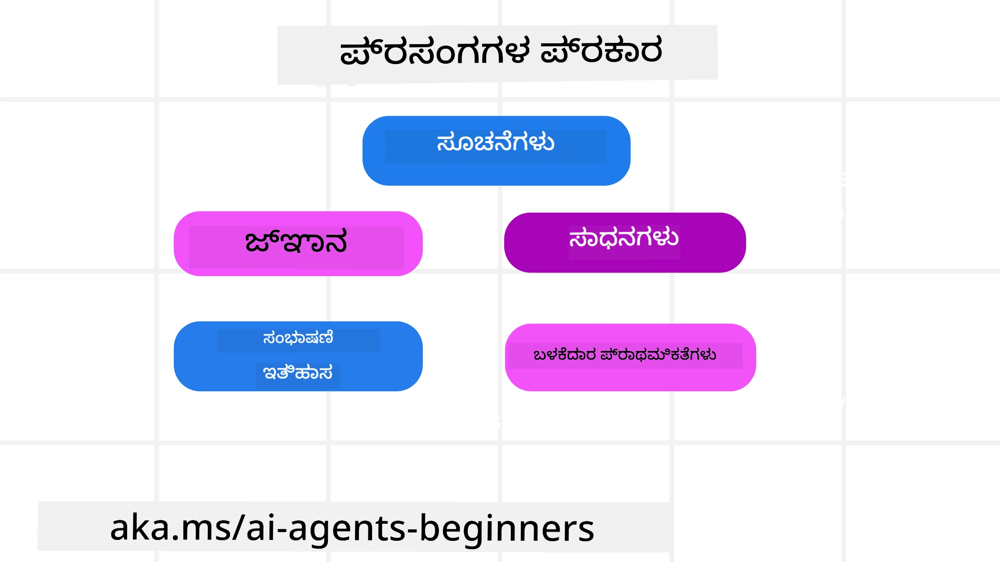
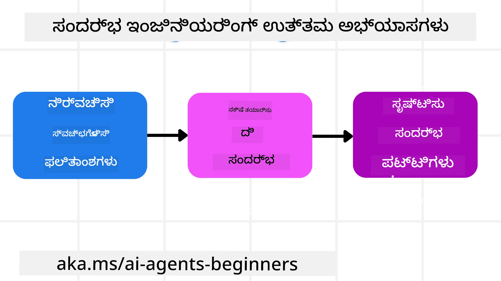

# ಎಐ ಏಜೆಂಟ್‌ಗಳಿಗೆ ವಾತಾವರಣ ಎಂಜಿನಿಯರಿಂಗ್  

  

> _(ಈ ಪಾಠದ ವೀಡಿಯೋ ನೋಡಿ ಮೇಲಿನ ಚಿತ್ರವನ್ನು ಕ್ಲಿಕ್ ಮಾಡಿ)_  

ನೀವು ನಿರ್ಮಿಸುತ್ತಿರುವ ಎಐ ಏಜೆಂಟ್‌ಗೆ ಅನ್ವಯಿಸು ಅವ್ಯರ್ಥತೆಗಳನ್ನು ಅರ್ಥಮಾಡಿಕೊಳ್ಳುವುದು ನಂಬಿಕೆಯೋಗ್ಯ ಏಜೆಂಟ್ ರಚಿಸುವುದರಲ್ಲಿ ಮುಖ್ಯವಾಗಿದೆ. ಪ್ರಾಂಪ್ಟ್ ಎಂಜಿನಿಯರಿಂಗ್ ಕ್ಕೆ ಹೆಚ್ಚು ಜಟಿಲ ಆತುರಗಳನ್ನು ಪೂರೈಸಲು ಪ್ರಭಾವಿ ಮಾಹಿತಿನ ನಿರ್ವಹಣೆಗೆ ಸಮರ್ಥ ಎಐ ಏಜೆಂಟ್‌ಗಳನ್ನು ನಿರ್ಮಿಸಲು ನಾವು ಬೇಕಾಗುತ್ತದೆ.  

ಈ ಪಾಠದಲ್ಲಿ, ನಾವು ವಾತಾವರಣ ಎಂಜಿನಿಯರಿಂಗ್ ಎಂದರೇನು ಮತ್ತು ಅದರ ಎಐ ಏಜೆಂಟ್ ರಚನೆಯಲ್ಲಿ ಪಾತ್ರವನ್ನು ನೋಡುತ್ತೇವೆ.  

## ಪರಿಚಯ  

ಈ ಪಾಠದಲ್ಲಿ ನಾವು ಚರ್ಚಿಸುವವುಗಳು:  

• **ವಾತಾವರಣ ಎಂಜಿನಿಯರಿಂಗ್ ಎಂದರೇನು** ಮತ್ತು ಅದು ಪ್ರಾಂಪ್ಟ್ ಎಂಜಿನಿಯರಿಂಗ್‌ಗಿಂತಭಿನ್ನವಾಗಿದೆ ಎನ್ನುವುದರ ಬಗ್ಗೆ.  

• **ಪ್ರಭಾವಿ ವಾತಾವರಣ ಎಂಜಿನಿಯರಿಂಗ್‌ಗಾಗಿ ತಂತ್ರಗಳು**, ತಿಳುವಳಿಕೆ ಬರೆಯುವುದನ್ನು, ಆಯ್ಕೆಮಾಡುವುದನ್ನು, ಸಂಕುಚಿತಗೊಳಿಸುವುದನ್ನು ಮತ್ತು ವಿಭಜಿಸುವುದನ್ನು ಸೇರಿಸಿಕೊಂಡು.  

• **ಸಾಮಾನ್ಯ ವಾತಾವರಣ ವೈಫಲ್ಯಗಳು** ನೀವು ರಚಿಸುತ್ತಿರುವ ಏಜೆಂಟ್‌ಗೆ ಸಮಸ್ಯೆ ಉಂಟುಮಾಡಬಹುದು ಮತ್ತು ಅವುಗಳನ್ನು ಸರಿಪಡಿಸುವ ವಿಧಾನಗಳು.  

## ಕಲಿಕೆ ಗುರಿಗಳು  

ಈ ಪಾಠವನ್ನು ಪೂರ್ಣಗೊಳಿಸಿದ ನಂತರ, ನೀವು ತಿಳಿದುಕೊಳ್ಳುವಿರಿ:  

• **ವಾತಾವರಣ ಎಂಜಿನಿಯರಿಂಗ್ ಅನ್ನು ವ್ಯಾಖ್ಯಾನಿಸಿ** ಮತ್ತು ಅದನ್ನು ಪ್ರಾಂಪ್ಟ್ ಎಂಜಿನಿಯರಿಂಗ್‌ನಿಂದ ವಿಭಿನ್ನವಾಗಿಸುವುದು.  

• **LLM (ಲಾರ್ಜ್ ಲ್ಯಾಂಗ್ವಿಜೆ מודೆಲ್) ಅನ್ವಯಿಕೆಗಳಲ್ಲಿ ಮುಖ್ಯ ವಾತವಹರಣಾಂಶಗಳ** ಗುರುತಿಸುವುದು.  

• **ವಾತಾವರಣ ಬರೆಯುವ, ಆಯ್ಕೆಮಾಡುವ, ಸಂಕುಚಿತಗೊಳಿಸುವ ಮತ್ತು ವಿಭಜಿಸುವ ತಂತ್ರಗಳನ್ನು** ಏಜೆಂಟ್ ಕಾರ್ಯಕ್ಷಮತೆಯನ್ನು ಸುಧಾರಿಸಲು ಅನ್ವಯಿಸುವುದು.  

• **ವಾತಾವರಣ ವೈಫಲ್ಯಗಳನ್ನು ಗುರುತಿಸಿ** (ಈದಲ್ಲಿ ವಿಷ ಸೇವನೆ,ಾಭಿವ್ಯಕ್ತಿ, ಗೊಂದಲ ಮತ್ತು ಘರ್ಷಣೆ ಸೇರಿವೆ) ಮತ್ತು ಪರಿಹಾರ ತಂತ್ರಗಳನ್ನು ಅನುಷ್ಠಾನಗೊಳಿಸುವುದು.  

## ವಾತಾವರಣ ಎಂಜಿನಿಯರಿಂಗ್ ಎಂದರೇನು?  

ಎಐ ಏಜೆಂಟ್‌ಗಳಿಗೆ, ವಾತಾವರಣವೆ ಎಂದರೆ ಏಜೆಂಟ್‌ ನಿರ್ಧರಿಸಿದ ಕ್ರಮಗಳನ್ನು ಯೋಜಿಸಲು ಪ್ರೇರಣೆ ನೀಡುವುದು. ವಾತಾವರಣ ಎಂಜಿನಿಯರಿಂಗ್ ಎಂದರೆ, ಏಜೆಂಟ್‌ಗೆ ಮುಂದಿನ ಕಾರ್ಯವನ್ನು ಪೂರ್ಣಗೊಳಿಸಲು ಸರಿಯಾದ ಮಾಹಿತಿ ದೊರೆಯುವಂತೆ ನೋಡಿಕೊಳ್ಳುವ ಸಚಿವಾಯಿಕೆ. ವಾತಾವರಣದ ವಿಂಡೋ ಗಾತ್ರ ಸೀಮಿತವಾಗಿದೆ; ಅದಕ್ಕಾಗಿ ಏಜೆಂಟ್ ನಿರ್ಮಾಪಕರು ವಾತಾವರಣ ವಿಂಡೋಗೆ ಮಾಹಿತಿ ಸೇರ್ಪಡೆ, ತೆಗೆದು ಹಾಕುವಿಕೆ ಮತ್ತು ಸಂಕುಚಿತಗೊಳಿಸುವುದನ್ನು ನಿರ್ವಹಿಸಲು ತಂತ್ರಗಳು ಮತ್ತು ಪ್ರಕ್ರಿಯೆಗಳನ್ನ ನಿರ್ಮಿಸಬೇಕು.  

### ಪ್ರಾಂಪ್ಟ್ ಎಂಜಿನಿಯರಿಂಗ್ ಮತ್ತು ವಾತಾವರಣ ಎಂಜಿನಿಯರಿಂಗ್  

ಪ್ರಾಂಪ್ಟ್ ಎಂಜಿನಿಯರಿಂಗ್ ಒಂದು ಸ್ಥಿರ ನಿಯಮಗಳ ಸಂಗ್ರಹವನ್ನು ನೋಡಿಕೊಂಡು ಎಐ ಏಜೆಂಟ್‌ಗಳನ್ನು ಸಮರ್ಥವಾಗಿ ಮಾರ್ಗದರ್ಶನ ನೀಡುವುದರಲ್ಲಿ ಗಮನಹರಿಸುತ್ತದೆ. ವಾತಾವರಣ ಎಂಜಿನಿಯರಿಂಗ್ ಒಂದು ಚಾರತ್ಮಕ ಮಾಹಿತಿಯ ಸೇಟ್ನ ನಿರ್ವಹಣೆಯನ್ನು ಹೇಗೆ ಮಾಡಬೇಕೆಂಬುದನ್ನು ಒಳಗೊಂಡಿದ್ದು, ಶುರುವಾಗುವ ಪ್ರಾಂಪ್ಟ್ ಸಹಿತ, ಏಜೆಂಟ್ ಸಮಯಕಾಲದಲ್ಲಿ ಅಗತ್ಯವಿರುವ ಮಾಹಿತಿಯನ್ನು ಹೊಂದಿರುವುದನ್ನು ಕರೆಯುತ್ತದೆ. ವಾತಾವರಣ ಎಂಜಿನಿಯರಿಂಗ್ ಸಂದರ್ಭ ಪ್ರಕ್ರಿಯೆಯನ್ನು ಪುನರಾವರ್ತನೆನೀಯ ಮತ್ತು ನಂಬಿಕೆಯೋಗ್ಯವಾಗಿಸುವದಾಗಿದೆ.  

### ವಾತಾವರಣದ ವಿಧಗಳು  

  

ವಾತಾವರಣ ಒಂದಲ್ಲೊಂದು ವಿಷಯವೆಂಬುದನ್ನು ನೆನಪುಪಡಿಸುವುದು ಮುಖ್ಯ. ಎಐ ಏಜೆಂಟ್‌ಗೆ ಬೇಕಾಗುವ ಮಾಹಿತಿ ವಿವಿಧ ಮೂಲಗಳಿಂದ ಬರುತ್ತದೆ ಮತ್ತು ನಾವು ಏಜೆಂಟ್‌ಗೆ ಈ ಮೂಲಗಳಿಗೆ ಪ್ರವೇಶವಿರುವುದನ್ನು ಖಚಿತಪಡಿಸಿಕೊಳ್ಳಬೇಕು:  

ಏಜೆಂಟ್ ನಿರ್ವಹಿಸಬೇಕಾದ ಕೆಲವು ವಾತಾವರಣ ವಿಧಗಳು:  

• ** ಸೂಚನೆಗಳು:** ಏಜೆಂಟ್‌ನ "ನಿಯಮಗಳು"– ಪ್ರಾಂಪ್ಟ್ಗಳು, ವ್ಯವಸ್ಥೆಯ ಸಂದೇಶಗಳು, ಕಮ್ಮಿ-ಉದಾಹರಣೆಗಳು (ಎಐಗೆ ಹೇಗೆ ಕಾರ್ಯನಿರ್ವಹಿಸುವುದು ಎಂದು ತೋರಿಸುವುದು), ಮತ್ತು ಉಪಕರಣಗಳ ವಿವರಣೆಗಳು. ಇಲ್ಲಿ ಪ್ರಾಂಪ್ಟ್ ಎಂಜಿನಿಯರಿಂಗ್ ಮತ್ತು ವಾತಾವರಣ ಎಂಜಿನಿಯರಿಂಗ್ ಕೇಂದ್ರೀಕರಿಸಲ್ಪಟ್ಟಿವೆ.  

• **ಜ್ಞಾನ:** ವಾಸ್ತವಾಂಶಗಳು, ಡೇಟಾಬೇಸ್‌ಗಳಿಂದ ದೊರಕಿಸಿದ ಮಾಹಿತಿ ಅಥವಾ ಏಜೆಂಟ್ ಸಂಗ್ರಹಿಸಿದ ದೀರ್ಘಕಾಲದ ಸ್ಮೃತಿಗಳೆ. ಇದು ಛಂದೋತ್ತರ ತಯಾರಿಕೆಯ ರಿಟ್ರೀವಲ್ ಆಗ್ಗ್ಮೆಂಟೆಡ್ ಜೆನರೇಶನ್ (RAG) ವ್ಯವಸ್ಥೆಯನ್ನು ಒಳಗೊಂಡಿರಬಹುದು.  

• **ಉಪಕರಣಗಳು:** ಹೊರಗಿನ ಫಂಕ್ಷನ್‌ಗಳು, APIಗಳು ಮತ್ತು MCP ಸರ್ವರ್‌ಗಳ ವಿವರಣೆಗಳು, ಮತ್ತು ಅವುಗಳನ್ನು ಬಳಸುವ ವೇಳೆ ಏಜೆಂಟ್ ಪಡೆಯುವ ಪ್ರತಿಕ್ರಿಯೆ (ಫಲಿತಾಂಶ).  

• **ಸಂತುಲಿತ ಸಂಭಾಷಣಾ ಇತಿಹಾಸ:** ಬಳಕೆದಾರರ ಜೊತೆ ನಡೆಯುವ ನಿರಂತರ ಸಂಭಾಷಣೆ. ಸಮಯ ಕಳೆದಂತೆ, ಈ ಸಂಭಾಷಣೆಗಳು ಉದ್ದವಾಗುತ್ತವೆ ಮತ್ತು ಜಟಿಲವಾಗುತ್ತವೆ, ಆದ್ದರಿಂದ ಅವು ವಾತಾವರಣ ವಿಂಡೋದಲ್ಲಿ ಜಾಗ ತೆಗೆದುಕೊಳ್ಳುತ್ತವೆ.  

• **ಬಳಕೆದಾರ ಪ್ರాధಾನ್ಯತೆಗಳು:** ಬಳಕೆದಾರನ ಇಷ್ಟ-ದುಷ್ಟಗಳ ಬಗ್ಗೆ ಸಮಯಾಂತರ ತಿಳಿದುಕೊಂಡ ಮಾಹಿತಿ. ಪ್ರಮುಖ ನಿರ್ಧಾರಗಳನ್ನು ತೆಗೆದುಕೊಳ್ಳುವಾಗ ಇದನ್ನು ಸಂಗ್ರಹಿಸಿ ಬಳಸಬಹುದು.  

## ಪ್ರಭಾವಿ ವಾತಾವರಣ ಎಂಜಿನಿಯರಿಂಗ್‌ಗಾಗಿ ತಂತ್ರಗಳು  

### ಯೋಜನಾ ತಂತ್ರಗಳು  

  

ಉತ್ತಮ ವಾತಾವರಣ ಎಂಜಿನಿಯರಿಂಗ್ ಸರಿ ಯೋಜನೆದಿಂದ ಪ್ರಾರಂಭವಾಗುತ್ತದೆ. ವಾತಾವರಣ ಎಂಜಿನಿಯರಿಂಗ್ ತತ್ವವನ್ನು ಅನ್ವಯಿಸುವುದಕ್ಕೆ ಈ ವಿಧಾನ ಸಹಾಯ ಮಾಡುತ್ತದೆ:  

1. **ಸ್ಪಷ್ಟ ಫಲಿತಾಂಶಗಳನ್ನು ವ್ಯಾಖ್ಯಾನಿಸಿ** - ಏಐ ಏಜೆಂಟ್‌ಗೆ ನೀಡಲಾದ ಕಾರ್ಯಗಳ ಫಲಿತಾಂಶಗಳು ಸಪಷ್ಟವಾಗಿರಬೇಕು. “ಏಜೆಂಟ್ ಕಾರ್ಯ ಮುಗಿಸಿದ ಬಳಿಕ ಜಗತ್ತು ಹೇಗಿರುತ್ತದೆ?” ಎಂಬ ಪ್ರಶ್ನೆಗೆ ಉತ್ತರ ನೀಡಿ.  
2. **ವಾತಾವರಣವನ್ನು ನಕ್ಷೆ ರಚಿಸಿ** - ಏಜೆಂಟ್ ಕಾರ್ಯ ಪೂರ್ಣಗೊಳಿಸಲು ಏನು ಮಾಹಿತಿ ಬೇಕು ಎಂದು ಪ್ರಶ್ನಿಸಿ, ಆ ಮಾಹಿತಿಯ ಮೂಲಗಳನ್ನು ನಕ್ಷೆ ಮಾಡಿ.  
3. **ವಾತಾವರಣ ಪೈಪ್ಲೈನ್ಗಳನ್ನು ರಚಿಸಿ** - ಈಗ ಮಾಹಿತಿ ಯಾವುದರಿಂದ ದೊರೆಯುತ್ತದೆ ಎಂಬುದನ್ನು ತಿಳಿದ ಮೇಲೆ, “ಏಜೆಂಟ್ ಮಾಹಿತಿಯನ್ನು ಹೇಗೆ ಪಡೆಯಲಿದೆ?” ಎಂಬ ಪ್ರಶ್ನೆಗೆ ಉತ್ತರ ನೀಡಿ. ಇದು RAG, MCP ಸರ್ವರ್ ಬಳಸಿಕೊಳ್ಳುವಿಕೆ ಮತ್ತು ಇತರ ತಂತ್ರಗಳನ್ನು ಒಳಗೊಂಡಿರಬಹುದು.  

### ಪ್ರಾಯೋಗಿಕ ತಂತ್ರಗಳು  

ಯೋಜನೆ ಮುಖ್ಯವಾದರೂ, ಏಜೆಂಟ್‌ನ ವಾತಾವರಣ ವಿಂಡೋಗೆ ಮಾಹಿತಿ ಪ್ರವಾಹ ಆರಂಭವಾದಾಗ, ಅದನ್ನು ನಿರ್ವಹಿಸಲು ಪ್ರಾಯೋಗಿಕ ತಂತ್ರಗಳು ಬೇಕಾಗುತ್ತವೆ:  

#### ವಾತಾವರಣ ನಿರ್ವಹಣೆ  

ಕೆಲ ಮಾಹಿತಿಗಳು ಸ್ವಯಂಕ್ಷಿಪ್ತವಾಗಿ ವಾತಾವರಣ ವಿಂಡೋಗೆ ಸೇರಬಹುದು, ಆದರೆ ವಾತಾವರಣ ಎಂಜಿನಿಯರಿಂಗ್ ಅಧಿಕ ಸಕ್ರಿಯ ಪಾತ್ರ ವಹಿಸುವುದು, ಕೆಲ ತಂತ್ರಗಳ ಮೂಲಕ ಸಾಧ್ಯ:  

 1. **ಏಜೆಂಟ್ ಸ್ಕ್ರಾಚ್‌ಪ್ಯಾಡ್**  
 ಇದು ಏಜೆಂಟ್‌ಗೆ ಪ್ರಸ್ತುತ ಕಾರ್ಯ ಮತ್ತು ಬಳಕೆದಾರ ಸಂವಾದದ ಸಮಯದಲ್ಲಿ ಸಂಗ್ರಹಿಸಿದ ಮಹತ್ವದ ಟಿಪ್ಪಣಿಗಳನ್ನು ಬರೆಯಲು ಅವಕಾಶ ನೀಡುತ್ತದೆ. ಇದು ವಾತಾವರಣ ವಿಂಡೋ ಹೊರಗಿರುವ ಫೈಲ್ ಅಥವಾ ರನ್‌ಟೈಮ್ ಆಬ್ಜೆಕ್ಟ್ ಆಗಿರಬೇಕು, ನಂತರ ಅವಶ್ಯಕತೆಯಾದರೆ ಸೆಷನ್‌ನಲ್ಲಿಯೇ ಪಡೆಯಬಹುದು.  

 2. **ಸ್ಮೃತಿಗಳು**  
 ಸ್ಕ್ರಾಚ್‌ಪ್ಯಾಡ್ ಒಂದು ಸೆಷನ್ ವಾತಾವರಣ ವಿಂಡೋ ಹೊರಗಿನ ಮಾಹಿತಿ ನಿರ್ವಹಣೆಗೆ ಉಪಯುಕ್ತ; ಸ್ಮೃತಿಗಳು ಏಜೆಂಟ್‌ಗೆ ಅನೇಕ ಸೆಷನ್‌ಗಳಲ್ಲಿಯೂ ಮಾಹಿತಿಯನ್ನು ಸಂಗ್ರಹಿಸಿ ಪಡೆಯಲು ಸಹಾಯಕ. ಇವು ಸಾರಾಂಶಗಳು, ಬಳಕೆದಾರ ಪ್ರಾಧಾನ್ಯತೆಗಳು ಮತ್ತು ಭವಿಷ್ಯದ ಸುಧಾರಣೆಯ ಫೀಡ್ಬ್ಯಾಕ್ ಅನ್ನು ಒಳಗೊಂಡಿರಬಹುದು.  

 3. **ವಾತಾವರಣ ಸಂಕುಚಿತಗೊಳಿಸುವಿಕೆ**  
  ವಾತಾವರಣ ವಿಂಡೋ ಗಾತ್ರ ಹೆಚ್ಚಾಗುತ್ತಿದ್ದಂತೆ, ಸಾರಾಂಶ ಮತ್ತು ಕತ್ತರಿಸುವ ತಂತ್ರಗಳನ್ನು ಉಪಯೋಗಿಸಬಹುದು. ಮುಖ್ಯ ಹಾಗೂ ಸಂಬಂಧಿತ ಮಾಹಿತಿಯೇ ಉಳಿಯಲು, ಹಳೆಯ ಸಂದೇಶಗಳನ್ನು ತೆಗೆದುಹಾಕಬಹುದು.  
  
 4. **ಬಹು-ಏಜೆಂಟ್ ವ್ಯವಸ್ಥೆಗಳು**  
  ಬಹು-ಏಜೆಂಟ್ ವ್ಯವಸ್ಥೆಗಳ ಅಭಿವೃದ್ಧಿ ವಾತಾವರಣ ಎಂಜಿನಿಯರಿಂಗ್‌ನ ರೂಪವಾಗಿದೆ, ಏಕೆಂದರೆ ಪ್ರತಿ ಏಜೆಂಟ್‌ಗೆ ಸ್ವಂತ ವಾತಾವರಣ ವಿಂಡೋ ಇರುತ್ತದೆ. ಈ ವಾತಾವರಣವನ್ನು ಹಂಚಿಕೊಳ್ಳುವ ವಿಧಾನ ಮತ್ತು ವಿವಿಧ ಏಜೆಂಟ್‌ಗಳಿಗೆ ಒಪ್ಪಿಸುವುದು ಯೋಜನೆಯ ಒಂದು ಭಾಗ.  
  
 5. **ಸ್ಯಾಂಡ್‌ಬಾಕ್ಸ್ ಪರಿಸರವಿಗಳು**  
  ಏಜೆಂಟ್‌ಕೆ ಕೆಲವು ಹೆಚ್ಚು ಪ್ರಮಾಣದ ಮಾಹಿತಿ ಪ್ರಕ್ರಿಯೆಯಾಗಿ ಅಥವಾ ಕೇಡ್ ರಚಿಸಲು ಅಗತ್ಯ ಇದ್ದರೆ, ಇದು ಪರಿಮಾಣದ ಬ್ಯಾಕ್ತು ವ್ಯವಸ್ಥೆಗಳನ್ನು ತೆಗೆದುಕೊಳ್ಳುತ್ತದೆ. ಸಂಪೂರ್ಣ ವಾತಾವರಣ ವಿಂಡೋದಲ್ಲಿ ಈ ಮಾಹಿತಿಯನ್ನು ಇರಿಸುವ ಬದಲು, ಏಜೆಂಟ್ ಸ್ಯಾಂಡ್‌ಬಾಕ್ಸ್ ಪರಿಸರವಿಯನ್ನು ಬಳಸಬಹುದು, ಇದು ಕೇಡ್ ಅನ್ನು ನಿರ್ವಹಿಸಿ ಫಲಿತಾಂಶಗಳನ್ನು ಮತ್ತು ಮಹತ್ವದ ಮಾಹಿತಿಯನ್ನು ಮಾತ್ರ ಓದುವಂತೆ ಅನುಮತಿಸುತ್ತದೆ.  
  
 6. **ರನ್‌ಟೈಮ್ ಸ್ಟೇಟ್ ಆಬ್ಜೆಕ್ಟ್ಗಳು**  
   ಇದು ಅದರ ಭಾಗಗಳಲ್ಲಿ, ಅಂದರೆ ಅವಿನ ಭಾಗಿ ಕಾರ್ಯಗಳಿಂದ ತಯಾರಿಸಿದ ಫಲಿತಾಂಶಗಳನ್ನು ಸಂಗ್ರಹಿಸುವ ಮೂಲಕ ವಾತಾವರಣ ನಿಯಂತ್ರಣಕ್ಕೆ ಸಾಧ್ಯವಾಗುವ ಒಂದು ವಿಧಾನ. ಇದು ವಾತಾವರಣವನ್ನು ನಿರ್ದಿಷ್ಟ ಉಪಕಾರ್ಯದೊಂದಿಗೆ ಮಾತ್ರ ಸಂಪರ್ಕದಲ್ಲಿರಿಸಲು ಸಹಾಯಮಾಡುತ್ತದೆ.  

#### ವಾತಾವರಣ ಪರಿಶೀಲನೆ  

ನೀವು ಯಾವುದೇ ತಂತ್ರವನ್ನು ಅನ್ವಯಿಸಿದ ನಂತರ, ಮುಂದಿನ ಮಾದರಿ ಕರೆ ಯಾವ ಮಾಹಿತಿಯನ್ನು ಪಡೆದಿತು ಎಂದು ಪರಿಶೀಲಿಸುವುದು ಉಚಿತ. ಉಪಯುಕ್ತ ಡಿಬಗ್ಗಿಂಗ್ ಪ್ರಶ್ನೆಯಾಗಿದೆ:  

> ಏಜೆಂಟ್ ಹೆಚ್ಚು ಕಂಟೆಂಟ್ ಲೋಡ್ ಮಾಡುತ್ತಿದೆಯಾ, ತಪ್ಪಾದ ವಾತಾವರಣ ತೆಗೆದುಕೊಂಡಿದೆಯಾ, ಅಥವಾ ಬೇಕಾಗಿರುವ ವಾತಾವರಣ ತಪ್ಪಿಸಿಕೊಂಡಿದೆಯಾ?  

ಈ ಪ್ರಶ್ನೆಗಳಿಗೆ ಉತ್ತರಿಸಲು ಮೂಲ ಪ್ರಾಂಪ್ಟ್ಗಳು, ಉಪಕರಣ ಫಲಿತಾಂಶಗಳು, ಅಥವಾ ಸ್ಮೃತಿ ವಿಷಯಗಳನ್ನು ದಾಖಲಿಸುವ ಅಗತ್ಯವಿಲ್ಲ. ಉತ್ಪಾದನೆಲ್ಲಾ ಕಂಟೆಂಟ್ ಪರಿಶೀಲನಾ ದಾಖಲೆಗಳು ಸಂಖ್ಯೆಗಳು, ಐಡಿಗಳು, ಹ್ಯಾಶ್‌ಗಳು ಮತ್ತು ನೀತಿ ಲೇಬಲ್‌ಗಳನ್ನು ಕಡಿಮೆ ಪ್ರಮಾಣದಲ್ಲಿ ಸಂಗ್ರಹಿಸುವುದು ಪ್ರಾಧಾನ್ಯ.  

- **ಆಯ್ಕೆ:** ಎಷ್ಟು ಅಭ್ಯರ್ಥಿ ತುಂಡುಗಳು, ಉಪಕರಣಗಳು, ಅಥವಾ ಸ್ಮೃತಿಗಳನ್ನ ಪರಿಗಣಿಸಲಾಯಿತು, ಎಷ್ಟು ಆಯ್ಕೆಯಾಗಿವೆ ಮತ್ತು ಎಲ್ಲ ನಿಯಮ ಅಥವಾ ಅಂಕೆಯನ್ನು ಬಳಸಿ ಅನ್ಯರನ್ನು ಫಿಲ್ಟರ್ ಮಾಡಲಾಯಿತು ಎಂದು ಟ್ರ್ಯಾಕ್ ಮಾಡಿ.  
- **ಸಂಕುಚಿತಗೊಳಿಸುವಿಕೆ:** ಮೂಲ ಶ್ರೇಣಿ ಅಥವಾ ಟ್ರೇಸ್ ಐಡಿ, ಸಾರಾಂಶ ಐಡಿ, ಸಂಕುಚಿತಗೊಳಿಸುವ ಮೊದಲು ಮತ್ತು ಬಳಿಕ ಅಂದಾಜು ಟೋಕನ್ ಸಂಖ್ಯೆಯನ್ನು ದಾಖಲಿಸಿ ಮತ್ತು ಕಚ್ಚಾ ವಿಷಯ ಮುಂದಿನ ಕರೆಗೆ ಹೊರತುಪಡಿಸಲ್ಪಟ್ಟಿದೆಯೇ ಎಂದು ಗಮನಿಸಿ.  
- **ವಿಭಜನೆ:** ಯಾವ ಉಪಕಾರ್ಯವನ್ನು ಪ್ರತ್ಯೇಕ ಏಜೆಂಟ್, ಸೆಷನ್, ಅಥವಾ ಸ್ಯಾಂಡ್‌ಬಾಕ್ಸ್ನಲ್ಲಿ ನಡೆಸಲಾಯಿತು, ಬೌಂಡಡ್ ಸಾರಾಂಶ ಏನು ಹಿಂತಿರುಗಿತು ಮತ್ತು ದೊಡ್ಡ ಉಪಕರಣ ಆದಾಯ ಮೂಲ ಏಜೆಂಟ್ ವಾತಾವರಣದ ಹೊರಗಿದೆ ಎಂದು ಗುರುತಿಸಿ.  
- **ಸ್ಮೃತಿ ಮತ್ತು RAG:** ಸಂಪೂರ್ಣ ಪಡೆದ ಪಠ್ಯದ ಬದಲು ರಿಟ್ರೀವಲ್ ಡಾಕ್ಯುಮೆಂಟ್ ಐಡಿಗಳು, ಸ್ಮೃತಿ ಐಡಿಗಳು, ಅಂಕೆಗಳು, ಆಯ್ಕೆ ಮಾಡಲಾದ ಐಡಿಗಳು, ಮತ್ತು ರಿಡ್ಯಾಕ್ಷನ್ ಸ್ಥಿತಿಯನ್ನು ಸ್ಟೋರ್ ಮಾಡಿ.  
- **ಭದ್ರತೆ ಮತ್ತು ಗೌಪ್ಯತೆ:** ಸಂವೇದನಾಶೀಲ ಪ್ರಾಂಪ್ಟ್ ಪಠ್ಯ, ಉಪಕರಣ ವಾದಗಳು, ಉಪಕರಣ ಫಲಿತಾಂಶಗಳು, ಅಥವಾ ಬಳಕೆದಾರ ಸ್ಮೃತಿ ಸಾರಿಗಳನ್ನು ಬದಲಾಗಿ ಹ್ಯಾಶ್‌ಗಳು, ಐಡಿಗಳು, ಟೋಕನ್ ಬಕೆಟ್ಗಳು ಮತ್ತು ನೀತಿ ಲೇಬಲ್‌ಗಳನ್ನು ಬಳಸುವುದು ಉತ್ತಮ.  

ಗುರಿ ಹೆಚ್ಚು ಕಂಟೆಂಟ್ ಜಡಿಸುವುದಲ್ಲ. ಗುರಿ ಯಾಧಿಕಾರಿಯು ಯಾವ ವಾತಾವರಣ ತಂತ್ರ ಕಾರ್ಯಗತವಾಯಿತೋ ಮತ್ತು ಅದು ಮುಂದಿನ ಮಾದರಿ ಕರೆ ಮೇಲೆ ಯೋಜಿತ ರೀತಿಯಲ್ಲಿ ಪರಿಣಾಮ ಬೀರುತ್ತದೆಯೋ ಅವನಿಗೆ ತಿಳಿಯುವಷ್ಟು ಸాక్షಿ ಉಳಿಸುವುದು.  

### ವಾತಾವರಣ ಎಂಜಿನಿಯರಿಂಗ್ ಉದಾಹರಣೆ  

ಕಾರಣೀಕರಿಸೋಣ ನಾವು "ಪ್ಯಾರಿಸ್ ಗೆ ಒಂದು ಪ್ರವಾಸ ಬುಕ್ ಮಾಡಿರಿಸು" ಎಂಬ ಏಜೆಂಟ್ ಬೇಕು.  

• ಪ್ರಾಂಪ್ಟ್ ಎಂಜಿನಿಯರಿಂಗ್ ಬಳಸಿ ಸರಳ ಏಜೆಂಟ್ ಕೇವಲ "ಸರಿ, ನೀವು ಯಾವಾಗ ಪ್ಯಾರಿಸ್ ಗೆ ಹೋಗಲು ಇಚ್ಛಿಸುತ್ತೀರಿ?" ಅಂತ ಉತ್ತರಿಸಬಹುದು. ಇದು ಬಳಕೆದಾರ ಕೇಳಿದ ನೇರ ಪ್ರಶ್ನೆಯನ್ನು ಮಾತ್ರ ಪ್ರಕ್ರಿಯೆಗೊಳಿಸಿದೆ.  

• ವಾತಾವರಣ ಎಂಜಿನಿಯರಿಂಗ್ ತಂತ್ರಗಳನ್ನು ಬಳಸಿ ಏಜೆಂಟ್ ಬಹಳ ಹೆಚ್ಚು ಕೆಲಸ ಮಾಡುತ್ತದೆ. ಪ್ರತಿಕ್ರಿಯಿಸುವ ಮೊದಲು ಅದರ ವ್ಯವಸ್ಥೆಯು:  

  ◦ ಲಭ್ಯವಿರುವ ದಿನಾಂಕಗಳಿಗಾಗಿ ನಿಮ್ಮ ಕ್ಯಾಲೆಂಡರ್ ಪರಿಶೀಲಿಸಬಹುದು (ನೈಜ ಸಮಯದ ಡೇಟಾವನ್ನು ಪಡೆಯುವುದು).  

 ◦ ಹಳೆಯ ಪ್ರವಾಸಿ ಪ್ರಾಥಮಿಕತೆಗಳನ್ನು ಸಂಶೋಧಿಸಬಹುದು (ದೀರ್ಘಕಾಲದ ಸ್ಮೃತಿಯಿಂದ), ನಿಮ್ಮ ಇಷ್ಟದ ವಿಮಾನ ಸಂಸ್ಥೆ, ಬಜೆಟ್ ಅಥವಾ ನೇರ ವಿಮಾನವನ್ನು ನಿಮಗೆ ఇಷ್ಟವಿರುವುದೇ ಎಂಬುದು.  

 ◦ ವಿಮಾನ ಮತ್ತು ಹೋಟೆಲ್ ಬುಕ್ಕಿಂಗ್‌ಗಾಗಿ ಲಭ್ಯವಿರುವ ಉಪಕರಣಗಳನ್ನು ಗುರುತಿಸಬಹುದು.  

- ನಂತರ, ಉದಾಹರಣೆಯಾಗಿ ಉತ್ತರವಾಗಬಹುದು: "ಹೇ [ನಿಮ್ಮ ಹೆಸರು]! ನಾನು ನೋಡುತ್ತಿದ್ದೇನೆ ನೀವು ಅಕ್ಟೋಬರ್ ಮೊದಲ ವಾರ ಖಾಲಿ ಇದ್ದೀರಿ. ನಾನು ನಿಮ್ಮ ಇಷ್ಟದ ವಿಮಾನ ಸಂಸ್ಥೆ [Preferred Airline]ನಿಂದ ಪ್ಯಾರಿಸ್‌ಗೆ ನೇರ ವಿಮಾನಗಳನ್ನು ನಿಮ್ಮ ಸಾಮಾನ್ಯ ಬಜೆಟ್ [Budget] ಒಳಗೆ ಹುಡುಕಲಿ?" ಇಂತಹ context-aware ಉತ್ತರ ವಾತಾವರಣ ಎಂಜಿನಿಯರಿಂಗ್ ಶಕ್ತಿಯನ್ನು ತೋರಿಸುತ್ತದೆ.  

## ಸಾಮಾನ್ಯ ವಾತಾವರಣ ವೈಫಲ್ಯಗಳು  

### ವಾತಾವರಣ ವಿಷ ಸೇವೆ  

**ಅರ್ಥ:** ಒಂದು ಹಳ್ಳುಸಿನೇಷನ್ (LLM ಯಿಂದ ಉತ್ಪಾದಿತ ತಪ್ಪು ಮಾಹಿತಿ) ಅಥವಾ ದೋಷವೊಂದು ವಾತಾವರಣಕ್ಕೆ ಸೇರುತ್ತದೆ ಮತ್ತು ಪುನರಾವರ್ತಿತವಾಗಿ ಉಲ್ಲೇಖಿತವಾಗುವುದರಿಂದ ಏಜೆಂಟ್ ಸಾಧ್ಯವಿಲ್ಲದ ಗುರಿಗಳನ್ನು ಕ್ರಮಿಸುತ್ತಾನೆ ಅಥವಾ ಅರ್ಥರಹಿತ ತಂತ್ರಗಳನ್ನು ಅಭಿವೃದ್ದಿಪಡಿಸುತ್ತಾನೆ.  

**ಪರಿಹಾರ:** **ವಾತಾವರಣ ಪರಿಶೀಲನೆ** ಮತ್ತು **ಕರೆಂಟೈನ್** ತಂತ್ರಗಳನ್ನು ಅನುಷ್ಠಾನಗೊಳಿಸಿ. ದೀರ್ಘಕಾಲದ ಸ್ಮೃತಿಗೆ ಸೇರ್ಪಡೆ ಮಾಡಲು ಮೊದಲು ಮಾಹಿತಿಯನ್ನು ಪರಿಶೀಲಿಸಿ. ವಿಷ ಸೇವೆ ಪತ್ತೆಯಾಗಿದ್ರೆ, ಕೆಡುಕಾದ ಮಾಹಿತಿ ಹರಡುವುದನ್ನು ತಡೆಯಲು ಹೊಸ ವಾತಾವರಣ ಥ್ರೆಡ್ಗಳ ಆರಂಭ ಮಾಡಿ.  

**ಪ್ರವಾಸ ಬುಕ್ಕಿಂಗ್ ಉದಾಹರಣೆ:** ನಿಮ್ಮ ಏಜೆಂಟ್ ಒಂದು **ಏಕಾಂತಿಕ ಸ್ಥಳೀಯ ವಿಮಾನ ನಿಲ್ದಾಣದಿಂದ ಪಾರ್ಶ್ವವಾಯು ದೇಶೀಯ ನಗರಕ್ಕೆ ನೇರ ವಿಮಾನದ ಹಳ್ಳುಸಿನೇಷನ್** ಮಾಡುತ್ತದೆ ಅದು ನಿಜವಾಗಿಯೂ ಅಂತಾರಾಷ್ಟ್ರೀಯ ವಿಮಾನ ಸೇವೆ ನೀಡುವುದಿಲ್ಲ. ಈ ಅಸ್ತಿತ್ವದಲ್ಲಿಲ್ಲದ ವಿಮಾನ ವಿವರ ವಾತಾವರಣದಲ್ಲಿ ಉಳಿಯುತ್ತದೆ. ನಂತರ ನೀವು ಬುಕ್ ಮಾಡಲು ಹೇಳಿದಾಗ, ಏಜೆಂಟ್ ಈ ಸಾಧ್ಯವಿಲ್ಲದ ಮಾರ್ಗದ ಟಿಕೆಟ್ ಹುಡುಕಲು ಮುಂದುವರೆಯುತ್ತದೆ ಮತ್ತು ದೋಷೋಪಾದಿಗಳನ್ನು ಪುನರಾವರ್ತಿಸುತ್ತದೆ.  

**ಪರಿಹಾರ:** ನೈಜ-ಸಮಯ ಎಪಿಐ ಸಹಾಯದಿಂದ ವಿಮಾನಗಳ ಅಸ್ತಿತ್ವ ಮತ್ತು ಮಾರ್ಗಗಳ ಪರಿಶೀಲನೆ ಹಾಗೂ ಪ್ರಮಾಣೀಕರಣವನ್ನು ಏಜೆಂಟ್ ವಾತಾವರಣ ಸೇರಿಸುವ ಮೊದಲು ಮಾಡಿಸಿ. ಪರಿಶೀಲನೆ ವಿಫಲವಾದರೆ, ತಪ್ಪು ಮಾಹಿತಿಯನ್ನು "ಕರೆಂಟೈನ್" ಮಾಡಿ ಮುಂದಿನ ಬಳಕೆಗೆ ಅಮಾನ್ಯಮಾಡಿ.  

### ವಾತಾವರಣ ಬಳಪಾಟಿ  

**ಅರ್ಥ:** ವಾತಾವರಣ ತುಂಬಾ ದೊಡ್ಡದಾಗುವಾಗ ಮಾದರಿ ಸಂಗ್ರಹಿತ ಇತಿಹಾಸದ ಮೇಲೆ ಹೆಚ್ಚಾಗಿ ಕೇಂದ್ರೀಕರಿಸುವುದು, ತರಬೇತಿಯ ಸಂದರ್ಭದಲ್ಲಿ ಕಲಿತದ್ದನ್ನು ಬಳಸದೆ ಪುನರಾವೃತ ರವೈಯಂತೆ ಅಥವಾ ಉಪಯುಕ್ತವಲ್ಲದ ಕ್ರಮಗಳನ್ನುಗಳನ್ನು ಕೈಗೊಳ್ಳುವಂತಾಗುವುದು. ವಾತಾವರಣ ವಿಂಡೋ ತುಂಬುವುದಕ್ಕೂ ಮುಂಚೆ ದೋಷಗಳು ಸಂಭವಿಸಬಹುದು.  

**ಪರಿಹಾರ:** **ವಾತಾವರಣ ಸಾರಾಂಶ** ಬಳಸಿ. ಕಾಲಗತಿಯುಕ್ತವಾಗಿ ಸಂಗ್ರಹಿಸಿದ ಮಾಹಿತಿಯನ್ನು ಸಣ್ಣ ಸಾರಾಂಶಗಳಾಗಿ ಸಂಕುಚಿತಗೊಳಿಸಿ ಮುಖ್ಯ ವಿವರಗಳನ್ನು ಉಳಿಸುತ್ತಾ, ಅನಾವಶ್ಯಕ ಇತಿಹಾಸವನ್ನು ತೆಗೆದುಹಾಕಿ. ಇದು ಗಮನವನ್ನು "ರಿಸೆಟ್" ಮಾಡುತ್ತದೆ.  

**ಪ್ರವಾಸ ಬುಕ್ಕಿಂಗ್ ಉದಾಹರಣೆ:** ನೀವು ಹಲವು ಕನಸುಗಳ ಪ್ರವಾಸಿಗಳನ್ನು ಬಹುসময় ಚರ್ಚಿಸುತ್ತಿದ್ದೀರಿ, ಅವರೊಳಗೆ ಎರಡು ವರ್ಷಗಳ ಹಿಂದಿನ ಬ್ಯಾಕ್‌ಪ್ಯಾಕಿಂಗ್ ಪ್ರವಾಸದ ವಿವರವೂ ಇದೆ. ನಂತರ ನೀವು ಹೇಳಿದರೆ **"ಮುಂದಿನ ತಿಂಗಳಿಗೆ ತಗ್ಗಿದ್ದ ವಿಮಾನವೊಂದನ್ನು ಹುಡುಕಿ",** ಏಜೆಂಟ್ ಹಳೆಯ ಮತ್ತು ಪ್ರಮುಖವಲ್ಲದ ವಿವರಗಳಲ್ಲೇ ಮುಳುಗುತ್ತದೆ ಮತ್ತು ನಿಮ್ಮ ಬ್ಯಾಕ್‌ಪ್ಯಾಕಿಂಗ್ ಗಮನ ಮತ್ತು ಹಳೆಯ ಯೋಜನೆಗಳನ್ನು ಕೇಳುತ್ತಿಹುದು, ಇತ್ತೀಚಿನ ವಿನಂತಿಯನ್ನು ನಿರ್ಲಕ್ಷಿಸುತ್ತದೆ.  

**ಪರಿಹಾರ:** ಕೆಲವು ತಿರುವುಗಳ ನಂತರ ಅಥವಾ ವಾತಾವರಣ ತುಂಬಿದಾಗ, ಏಜೆಂಟ್ ಸಂಭಾಷಣೆಯ ಇತ್ತೀಚಿನ ಮತ್ತು ಸಂಬಂಧಿತ ಭಾಗಗಳನ್ನು ಸಾರಾಂಶ ಮಾಡಬೇಕು – ನಿಮ್ಮ ಇತ್ತೀಚಿನ ಪ್ರಯಾಣ ದಿನಾಂಕ ಮತ್ತು ಗುರಿಯನ್ನು ಗಮನಿಸಿ – ಮತ್ತು ಆ ಸಂಕುಚಿತ ಸಾರಾಂಶವನ್ನು ಮುಂದಿನ LLM ಕರೆಗಾಗಿ ಉಪಯೋಗಿಸಿ, ಹಳೆಯ ಅನಾವಶ್ಯಕ ಚಾಟ್ ಅನ್ನು ತೊರೆಯಿರಿ.  

### ವಾತಾವರಣ ಗೊಂದಲ  

**ಅರ್ಥ:** ಅನಗತ್ಯ ವಾತಾವರಣ, ಹೆಚ್ಚಾಗಿ ಲಭ್ಯವಿರುವ ಉಪಕರಣಗಳಷ್ಟು ಹೆಚ್ಚು ಇದ್ದಾಗ, ಮಾದರಿ ತಪ್ಪು ಪ್ರತಿಕ್ರಿಯೆಗಳನ್ನು ರಚಿಸುತ್ತಿದ್ದು ಅಥವಾ ಸಪೂರ್ಣವಾಗದ ಉಪಕರಣಗಳನ್ನು ಕರೆಸುವುದು. ಸಣ್ಣ ಮಾದರಿಗಳು ಇದಕ್ಕೆ ಹೆಚ್ಚು ಆಳCP888 oರು.  

**ಪರಿಹಾರ:** RAG ತಂತ್ರಗಳನ್ನು ಬಳಸಿ **ಉಪಕರಣ ಮೋಡಣ ನಿರ್ವಹಣೆ** ಮಾಡಿರಿ. ಉಪಕರಣಗಳ ವಿವರಣೆಗಳನ್ನು ವೆಕ್ಟರ್ ಡೇಟಾಬೇಸಲ್ಲಿ ಸಂಗ್ರಹಿಸಿ ಮತ್ತು ಪ್ರತಿಯೊಂದು ಕಾರ್ಯಕ್ಕನುಗುಣವಾಗಿ ಬಿರುಕುಚಿತ ಉಪಕರಣಗಳನ್ನು ಮಾತ್ರ ಆಯ್ಕೆಮಾಡಿ. ಸಂಶೋಧನೆಗಳು 30ಕ್ಕಿಂತ ಕಡಿಮೆ ಉಪಕರಣ ಆಯ್ಕೆಮಾಡುವದು ಉತ್ತಮ ಎಂದು ತೋರಿಸುತ್ತವೆ.  

**ಪ್ರವಾಸ ಬುಕ್ಕಿಂಗ್ ಉದಾಹರಣೆ:** ನಿಮ್ಮ ಏಜೆಂಟ್‌ಗೆ ಅನೇಕ ಉಪಕರಣಗಳು ಲಭ್ಯಿವೆ: `book_flight`, `book_hotel`, `rent_car`, `find_tours`, `currency_converter`, `weather_forecast`, `restaurant_reservations` ಮುಂತಾದವು. ನೀವು ಕೇಳಿದರೆ, **"ಪ್ಯಾರಿಸ್ ಸುತ್ತುವ ಮೊದಲನೆಯ ಮಾರ್ಗ ಯಾವುದು?"** ಬಹಳ ಉಪಕರಣಗಳಿವೆ ಎಂದು ಏಜೆಂಟ್ ಗೊಂದಲದಲ್ಲಿ ಬೀಳುತ್ತದೆ ಮತ್ತು ಪ್ಯಾರಿಸ್‌ನೊಳಗೆ `book_flight` ಕರೆ ಮಾರಾಟ ಮಾಡುವ ಪ್ರಯತ್ನ ಮಾಡಬಹುದು ಅಥವಾ ನೀವು ಸಾರ್ವಜನಿಕ ಸಾರಿಗೆ ಇಷ್ಟಪಟ್ಟರೂ `rent_car` ಕರೆಸಬಹುದು, ಕಾರಣ ಉಪಕರಣ ವಿವರಣೆಗಳಲ್ಲಿ ತಕರಾರು ಇರಬಹುದು ಅಥವಾ ಉತ್ತಮ ಉಪಕರಣವನ್ನು ಪತ್ತೆ ಮಾಡಲಾಗದು.  

**ಪರಿಹಾರ:** ಉಪಕರಣ ವಿವರಣೆಗಳ ಮೇಲೆ RAG ಬಳಸಿ ಒದಗಿಸು. ನೀವು "ಪ್ಯಾರಿಸ್ ಸುತ್ತಲು ಹೇಗೆ?" ವನ್ನು ಕೇಳಿದಾಗ, ವ್ಯವಸ್ಥೆ ಪಡೆಯುತ್ತದೆ _ಮಾತ್ರ_ ಸಂಬಂಧಿತ ಉಪಕರಣಗಳು sapertos `rent_car` ಅಥವಾ `public_transport_info` ನಿಮ್ಮ ಕೇಳುವಿಕೆಯನ್ನು ಆಧರಿಸಿ, LLM ಗೆ ಕೇಂದ್ರೀಕೃತ "ಮೋಡೌಟ್" ಒದಗಿಸುತ್ತದೆ.  

### ವಾತಾವರಣ ಘರ್ಷಣೆ  

**ಅರ್ಥ:** ವಾತಾವರಣದೊಳಗೆ ವೈರೋಧ್ಯಪೂರಿತ ಮಾಹಿತಿಗಳು ದೃಷ್ಠಿಯಾಗುವುದರಿಂದ ಅಸंगತ ನಿರ್ಣಯ ಅಥವಾ ದೋಷಪೂರ್ಣ ಅಂತಿಮ ಪ್ರತಿಕ್ರಿಯೆಗಳಿಗೆ ಕಾರಣವಾಗುತ್ತದೆ. ಇದು ಸಾಮಾನ್ಯವಾಗಿ ಮಾಹಿತಿಯನ್ನು ಹಂತದಿಂದ ಹಂತಕ್ಕೆ ಸೇರಿಸುವಾಗ, ಮೊದಲಿನ ಅಸತ್ಯ ಅಂದಾಜುಗಳು ವಾತಾವರಣದಲ್ಲೇ ಉಳಿಯುವಾಗ ಸಂಭವಿಸುತ್ತದೆ.  

**ಪರಿಹಾರ:** ವಾತಾವರಣವನ್ನು ಕರಗಿಸುವಿಕೆ ಮತ್ತು ಹೆಚ್ಚುವರಿ ಭಾರವನ್ನು ಇತರ ಕಡೆ ಕಳಿಸುವಿಕೆ. ಕರಗಿಸುವಿಕೆ ಎಂದರೆ ಹಳೆಯ ಅಥವಾ ವೈರೋಧ್ಯಪೂರಿತ ಮಾಹಿತಿಯನ್ನು ಹೊಸ ಮಾಹಿತಿಗಳು ಬಂದಾಗ ತೆಗೆದುಹಾಕುವುದು. ಹೆಚ್ಚುವರಿ ಭಾರವನ್ನು ಇತರ "ಸ್ಕ್ರಾಚ್‌ಪ್ಯಾಡ್" ಕಾರ್ಯಕ್ಷೇತ್ರಕ್ಕೆ ವರ್ಗಾಯಿಸುವುದು, ಮುಖ್ಯ ವಾತಾವರಣವನ್ನು ಗುಂಬಡಗಲ್ಲದೆ ಪ್ರಕ್ರಿಯೆ ಮಾಡಲು  ಅನುವು ಮಾಡಿಕೊಡುವುದು.  

**ಪ್ರಯಾಣ ಬುಕ್ಕಿಂಗ್ ಉದಾಹರಣೆ:** ನೀವು ಮೊದಲು ನಿಮ್ಮ ಎಜೆಂಟ್‌ಗೆ ಹೇಳುತ್ತೀರಿ, **"ನನಗೆ ಆರ್ಥಿಕ ವರ್ಗದಲ್ಲಿ ವಿಮಾನ ಸೀಟು ಬೇಕು."** ನಂತರ ಸಂಭಾಷಣೆಯಲ್ಲಿ ನೀವು ನಿಮ್ಮ ಮನಸ್ಸು ಬದಲಾಯಿಸಿ ಹೇಳುತ್ತೀರಿ, **"ವಾಸ್ತವದಲ್ಲಿ, ಈ ಪ್ರಯಾಣಕ್ಕೆ ನಾವು ಬಿಸಿನೆಸ್ ವರ್ಗವಾಗಿ ಹೋಗೋಣ."** ಇಬ್ಬರು ಸೂಚನೆಗಳೂ ಸಂದರ್ಭದಲ್ಲಿ ಉಳಿದಿದ್ದರೆ, ಎಜೆಂಟ್‌ಗೆ ವಿರೋಧಿ ಹುಡುಕಾಟ ಫಲಿತಾಂಶಗಳು ಸಿಗಬಹುದು ಅಥವಾ ಯಾವ ಆದ್ಯತೆಯನ್ನು ಪಾಲಿಸಬೇಕು ಎಂಬ ತೊಂದರೆ ಎದುರಾಗಬಹುದು.

**ಪರಿಹಾರ:** **ಸಂದರ್ಭ ಕತ್ತರಿಸುವಿಕೆಯನ್ನು (context pruning)** ಜಾರಿಗೆ ತರುವುದರಲ್ಲಿ. ಹೊಸ ಸೂಚನೆ ಹಳೆಯದನ್ನು ವಿರೋಧಿಸಿದರೆ, ಹಳೆಯ ಸೂಚನೆಯನ್ನು ಸಂದರ್ಭದಿಂದ ತೆಗೆದುಹಾಕಲಾಗುತ್ತದೆ ಅಥವಾ ಸ್ಪಷ್ಟವಾಗಿ ಮೀರಿಸಲಾಗುತ್ತದೆ. ಅಥವಾ, ಎಜೆಂಟ್ ಒಂದು **ಸ್ಕ್ರಾಚ್‌ಪ್ಯಾಡ್** ಬಳಸಿಕೊಂಡು ವಿರೋಧಿ ಆದ್ಯತೆಗಳನ್ನು ಸಮಾಧಾನಪಡಿಸಿ ನಿರ್ಧರಿಸುವಾಗ, ಕೇವಲ ಅಂತಿಮ, ಸದೃಢ ಸೂಚನೆ ಮಾತ್ರ ಅದರ ಕ್ರಮಗಳನ್ನು ಮಾರ್ಗದರ್ಶನ ಮಾಡುತ್ತದೆ ಎಂಬುದನ್ನು ಖಚಿತ ಪಡಿಸಬಹುದು.

## ಸಂದರ್ಭ ಅಂಜಿನಿಯರಿಂಗ್ ಬಗ್ಗೆ ಇನ್ನಷ್ಟು ಪ್ರಶ್ನೆಗಳಿವೆಯೇ?

ಇತರ ಕಲಿಯುವವರನ್ನು ಭೇಟಿ ಮಾಡುವುದು, ಕಚೇರಿ ಸಮಯಗಳಿಗೆ ಹಾಜರಾಗುವುದು ಮತ್ತು ನಿಮ್ಮ AI ಏಜೆಂಟ್‌ಗಳ ಪ್ರಶ್ನೆಗಳಿಗೆ ಉತ್ತರ ಪಡೆಯಲು [Microsoft Foundry Discord](https://discord.com/invite/ATgtXmAS5D) に ಸೇರಿ.

---

<!-- CO-OP TRANSLATOR DISCLAIMER START -->
**ಅಸ್ವೀಕಾರ**:
ಈ ದಸ್ತಾವೇಜು AI ಅನುವಾದ ಸೇವೆ [Co-op Translator](https://github.com/Azure/co-op-translator) ಬಳಸಿ ಅನುವಾದಿಸಲಾಗಿದೆ. ನಾವು ನಿಖರತೆಯನ್ನು ಸಾಧಿಸಲು ಪ್ರಯತ್ನಿಸುತ್ತಿದ್ದರೂ, ದಯವಿಟ್ಟು ಗಮನಿಸಿ, ಸ್ವಯಂಚಾಲಿತ ಅನುವಾದಗಳಲ್ಲಿ ದೋಷಗಳು ಅಥವಾ ಅಸಡ್ಡೆಗಳು ಇರಬಹುದು. ಮೂಲ ಭಾಷೆಯಲ್ಲಿರುವ ಮೂಲ ದಸ್ತಾವೇಜು ಪ್ರಾಮಾಣಿಕ ಮೂಲವೆಂದು ಪರಿಗಣಿಸಬೇಕು. ಪ್ರಮುಖ ಮಾಹಿತಿಗಾಗಿ, ವೃತ್ತಿಪರ ಮಾನವ ಅನುವಾದವನ್ನು ಶಿಫಾರಸು ಮಾಡಲಾಗುತ್ತದೆ. ಈ ಅನುವಾದವನ್ನು ಬಳಸುವ ಮೂಲಕ ಉಂಟಾಗುವ ಯಾವುದೇ ತಪ್ಪು ಅರ್ಥಗಳ ಅಥವಾ ತಪ್ಪು ವ್ಯಾಖ್ಯಾನಗಳ ಬಗ್ಗೆ ನಾವು ಹೊಣೆಗಾರರಲ್ಲ.
<!-- CO-OP TRANSLATOR DISCLAIMER END -->